# 斯坦福 NLP 课程 | 第 1 讲 - NLP 介绍与词向量初步

> 原文：[`blog.csdn.net/ShowMeAI/article/details/124485862`](https://blog.csdn.net/ShowMeAI/article/details/124485862)


作者：[韩信子](https://github.com/HanXinzi-AI)@[ShowMeAI](http://www.showmeai.tech/)，路遥@[ShowMeAI](http://www.showmeai.tech/)，奇异果@[ShowMeAI](http://www.showmeai.tech/)
[教程地址](http://www.showmeai.tech/tutorials/36)：[`www.showmeai.tech/tutorials/36`](http://www.showmeai.tech/tutorials/36)
[本文地址](http://www.showmeai.tech/article-detail/231)：[`www.showmeai.tech/article-detail/231`](http://www.showmeai.tech/article-detail/231)
声明：版权所有，转载请联系平台与作者并注明出处

收藏[ShowMeAI](http://www.showmeai.tech/)查看更多精彩内容

* * *


[ShowMeAI](http://www.showmeai.tech/)为**斯坦福 CS224n**《自然语言处理与深度学习(Natural Language Processing with Deep Learning)》课程的全部课件，做了**中文翻译和注释**，并制作成了 GIF 动图！


本讲内容的**深度总结教程**可以在[**这里**](http://www.showmeai.tech/article-detail/230) 查看。视频和课件等资料的获取方式见**文末**。

# 引言

CS224n 是顶级院校斯坦福出品的深度学习与自然语言处理方向专业课程。核心内容覆盖 RNN、LSTM、CNN、transformer、bert、问答、摘要、文本生成、语言模型、阅读理解等前沿内容。

[ShowMeAI](http://www.showmeai.tech/)将从本节开始，依托 cs224n 课程为主框架，逐篇为大家梳理 NLP 的核心重点知识原理。

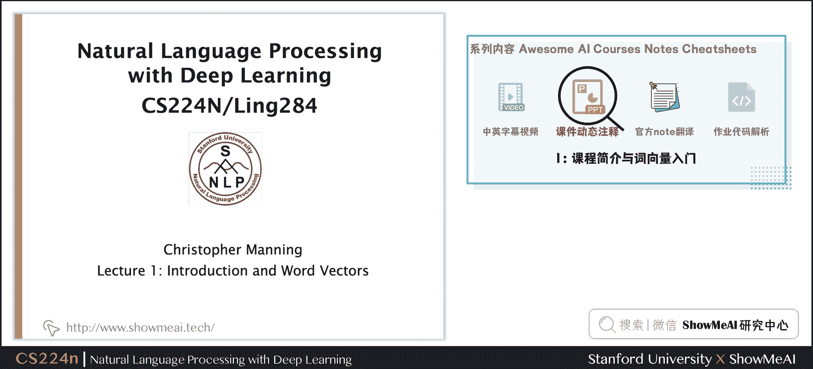

## 本篇内容覆盖：

第 1 课直接切入语言和词向量，讲解了自然语言处理的基本概念，文本表征的方法和演进，包括 word2vec 等核心方法，词向量的应用等。

*   自然语言与文字
*   word2vec 介绍
*   word2vec 目标函数与梯度
*   算法优化基础
*   word2vec 构建的词向量模式

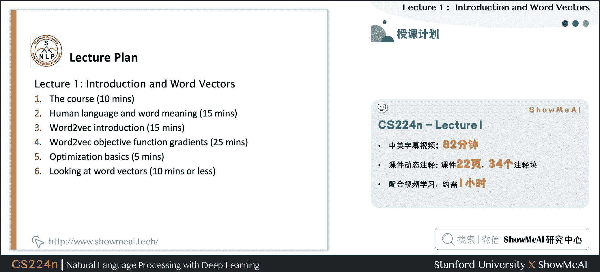

# 1\. 自然语言与词汇含义

## 1.1 人类的语言与词汇含义

咱们先来看看人类的高级语言。

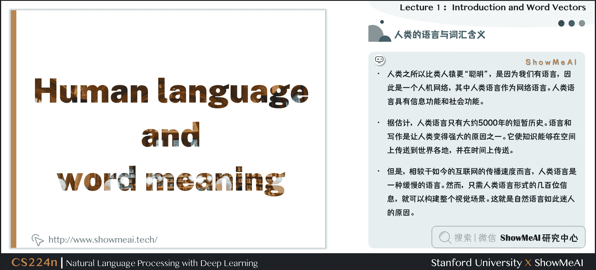

人类之所以比类人猿更“聪明”，是因为我们有语言，因此是一个人机网络，其中人类语言作为网络语言。人类语言具有信息功能和社会功能。

据估计，人类语言只有大约 5000 年的短暂历史。语言和写作是让人类变得强大的原因之一。它使知识能够在空间上传送到世界各地，并在时间上传送。

但是，相较于如今的互联网的传播速度而言，人类语言是一种缓慢的语言。然而，只需人类语言形式的几百位信息，就可以构建整个视觉场景。这就是自然语言如此迷人的原因。

## 1.2 我们如何表达一个词的意思？

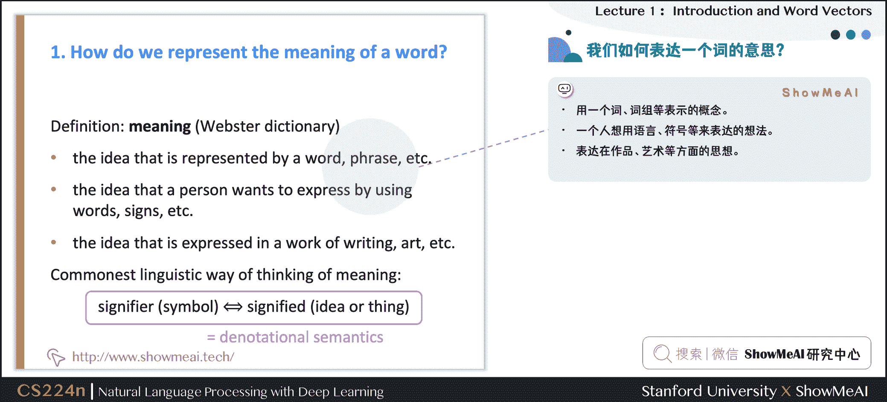

**我们如何表达一个词的含义**呢？有如下一些方式：

*   用一个词、词组等表示的概念。
*   一个人想用语言、符号等来表达的想法。
*   表达在作品、艺术等方面的思想。

理解意义的最普遍的**语言方式**(**linguistic way**)：语言符号与语言意义（想法、事情）的相互对应

*   denotational semantics：语义

s i g n i f i e r ( s y m b o l ) ⇔ s i g n i f i e d ( i d e a o r t h i n g ) signifier(symbol) \Leftrightarrow signified(idea \quad or \quad thing) signifier(symbol)⇔signified(ideaorthing)

## 1.3 如何在计算机里表达词的意义

要使用计算机处理文本词汇，一种处理方式是**WordNet**：即构建一个包含同义词集和上位词(“is a”关系)的列表的辞典。

英文当中确实有这样一个 wordnet，我们在安装完 NLTK 工具库和下载数据包后可以使用，对应的 python 代码如下：

```py
from nltk.corpus import wordnet as wn
poses = { 'n':'noun', 'v':'verb', 's':'adj (s)', 'a':'adj', 'r':'adv'}
for synset in wn.synsets("good"):
        print("{}: {}".format(poses[synset.pos()], ", ".join([l.name() for l in synset.lemmas()])))

from nltk.corpus import wordnet as wn
panda = wn.synset("panda.n.01")
hyper = lambda s: s.hypernyms()
list(panda.closure(hyper)) 
```

结果如下图所示：
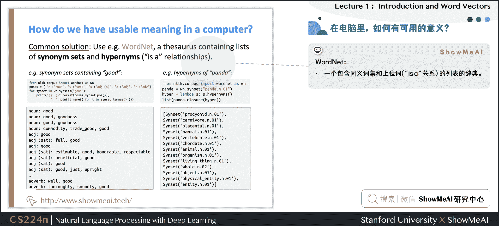

## 1.4 WordNet 的问题

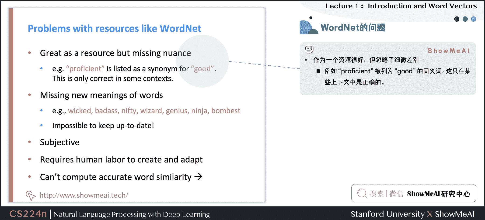

WordNet 大家可以视作 1 个专家经验总结出来的词汇表，但它存在一些问题：

① **忽略了词汇的细微差别**

*   例如“proficient”被列为“good”的同义词。这只在某些上下文中是正确的。

② **缺少单词的新含义**

*   难以持续更新！
*   例如：wicked、badass、nifty、wizard、genius、ninja、bombast

③ 因为是小部分专家构建的，有一定的**主观性**

④ 构建与调整都需要很多的**人力成本**

⑤ **无法定量计算出单词相似度**

## 1.5 文本(词汇)的离散表征

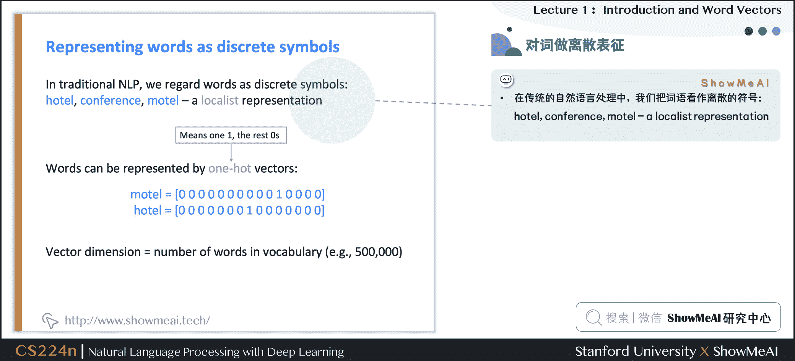

在传统的自然语言处理中，我们会对文本做离散表征，把词语看作离散的符号：例如 hotel、conference、motel 等。

一种文本的离散表示形式是把单词表征为**独热向量**(**one-hot vectors**)的形式

*   独热向量：只有一个 1，其余均为 0 的稀疏向量

在独热向量表示中，向量维度=词汇量(如 500,000)，以下为一些独热向量编码过后的单词向量示例：

m o t e l = [ 0   0   0   0   0   0   0   0   0   0   1   0   0   0   0 ] motel = [0 \ 0 \ 0 \ 0 \ 0 \ 0 \ 0 \ 0 \ 0 \ 0 \ 1 \ 0 \ 0 \ 0 \ 0] motel=[0 0 0 0 0 0 0 0 0 0 1 0 0 0 0]

h o t e l = [ 0   0   0   0   0   0   0   1   0   0   0   0   0   0   0 ] hotel = [0 \ 0 \ 0 \ 0 \ 0 \ 0 \ 0 \ 1 \ 0 \ 0 \ 0 \ 0 \ 0 \ 0 \ 0] hotel=[0 0 0 0 0 0 0 1 0 0 0 0 0 0 0]

## 1.6 离散表征的问题

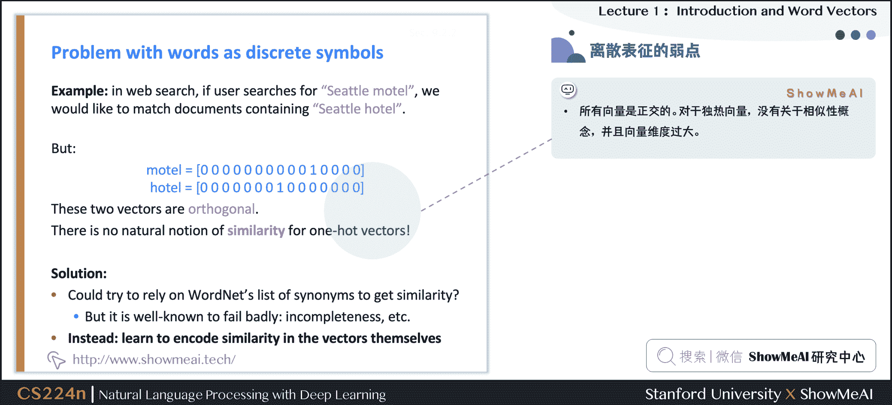

在上述的独热向量离散表征里，所有词向量是正交的，这是一个很大的问题。对于独热向量，没有关于相似性概念，并且向量维度过大。

对于上述问题有一些**解决思路**：

*   ① 使用类似 WordNet 的工具中的列表，获得相似度，但会因不够完整而失败
*   ② 通过大量数据学习词向量本身相似性，获得更精确的稠密词向量编码

## 1.7 基于上下文的词汇表征

**近年来在深度学习中比较有效的方式是基于上下文的词汇表征**。它的**核心想法**是：一个单词的意思是由经常出现在它附近的单词给出的 `“You shall know a word by the company it keeps” (J. R. Firth 1957: 11)`。

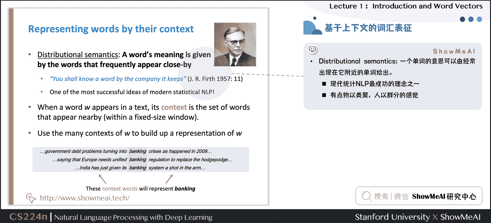

这是现代统计 NLP 最成功的理念之一，总体思路有点物以类聚，人以群分的感觉。

*   当一个单词 w w w 出现在文本中时，它的上下文是出现在其附近的一组单词(在一个固定大小的窗口中)
*   基于海量数据，使用 w w w 的许多上下文来构建 w w w 的表示

如图所示，banking 的含义可以根据上下文的内容表征。

# 2.Word2vec 介绍

## 2.1 词向量表示

下面我们要介绍词向量的构建方法与思想，我们希望为每个单词构建一个稠密表示的向量，使其与出现在相似上下文中的单词向量相似。

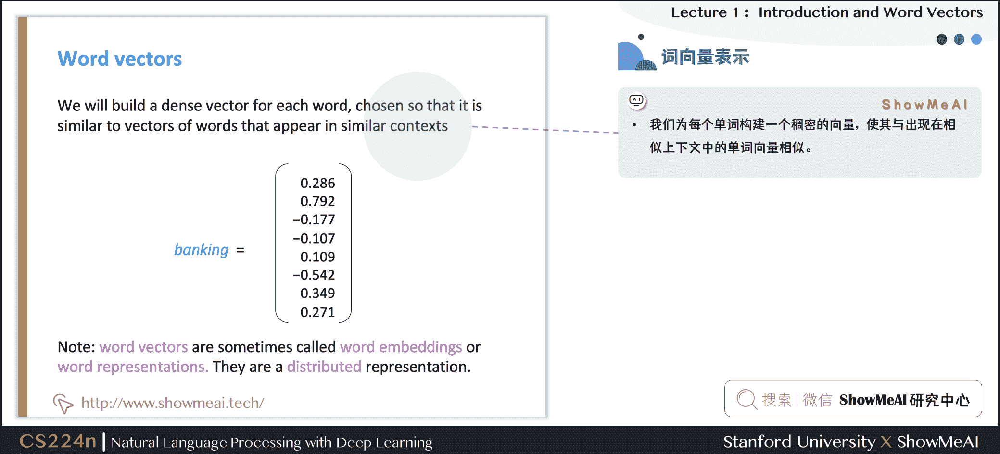

*   **词向量**(word vectors)有时被称为**词嵌入**(word embeddings)或**词表示**(word representations)。
*   稠密词向量是分布式表示(distributed representation)。

## 2.2 Word2vec 原理介绍

**Word2vec** (Mikolov et al. 2013)是一个学习词向量表征的框架。

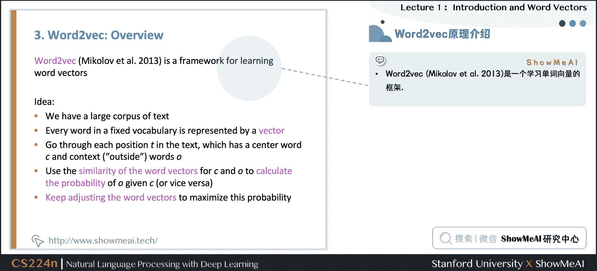

**核心思路**如下：

*   基于海量文本语料库构建
*   词汇表中的每个单词都由一个向量表示（学习完成后会固定）
*   对应语料库文本中的每个位置 t t t，有一个中心词 c c c 和一些上下文(“外部”)单词 o o o
*   使用 c c c 和 o o o 的词向量来计算概率 P ( o ∣ c ) P(o|c) P(o∣c)，即给定中心词推断上下文词汇的概率（反之亦然）
*   不断调整词向量来最大化这个概率

下图为窗口大小 j = 2 j=2 j=2 时的 P ( w t + j ∣ w t ) P\left(w_{t+j} | w_{t}\right) P(wt+j​∣wt​)，它的中心词为 i n t o into into

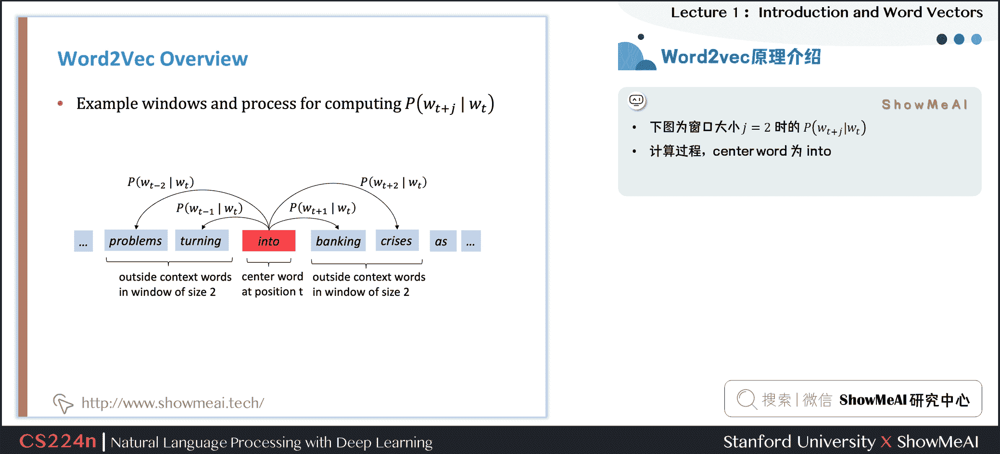

下图为窗口大小 j = 2 j=2 j=2 时的 P ( w t + j ∣ w t ) P\left(w_{t+j} | w_{t}\right) P(wt+j​∣wt​)，它的中心词为 b a n k i n g banking banking

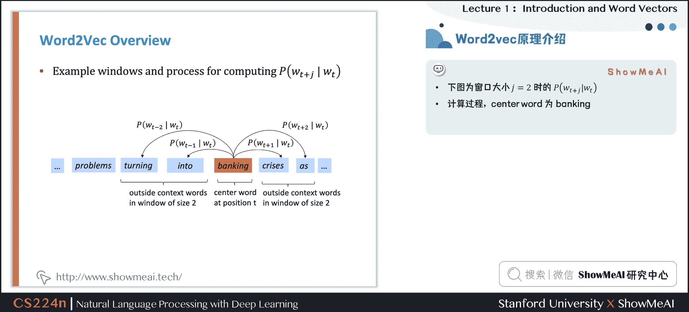

# 3.Word2vec 目标函数

## 3.1 Word2vec 目标函数

我们来用数学表示的方式，对 word2vec 方法做一个定义和讲解。

### 3.1.1 似然函数

对于每个位置 t = 1 , ⋯   , T t=1, \cdots, T t=1,⋯,T，在大小为 m m m 的固定窗口内预测上下文单词，给定中心词 w j w_j wj​，似然函数可以表示为：

L i k e l i h o o o d = L ( θ ) = ∏ t = 1 T ∏ − m ≤ j ≤ m j ≠ 0 P ( w t + j ∣ w t ; θ ) Likelihoood = L(\theta) = \prod^{T}_{t=1} \prod_{-m \leq j \leq m \atop j \neq 0} P(w_{t+j} | w_{t} ; \theta) Likelihoood=L(θ)=t=1∏T​j​=0−m≤j≤m​∏​P(wt+j​∣wt​;θ)

上述公式中， θ \theta θ为模型包含的所有待优化权重变量

### 3.1.2 目标函数

对应上述似然函数的目标函数 J ( θ ) J(\theta) J(θ)可以取作(平均)负对数似然：

J ( θ ) = − 1 T log ⁡ L ( θ ) = − 1 T ∑ t = 1 T ∑ − m ≤ j ≤ m j ≠ 0 log ⁡ P ( w t + j ∣ w t ; θ ) J(\theta)=-\frac{1}{T} \log L(\theta)=-\frac{1}{T} \sum_{t=1}^{T} \sum_{-m \leq j \leq m \atop j \neq 0} \log P\left(w_{t+j} | w_{t} ; \theta\right) J(θ)=−T1​logL(θ)=−T1​t=1∑T​j​=0−m≤j≤m​∑​logP(wt+j​∣wt​;θ)

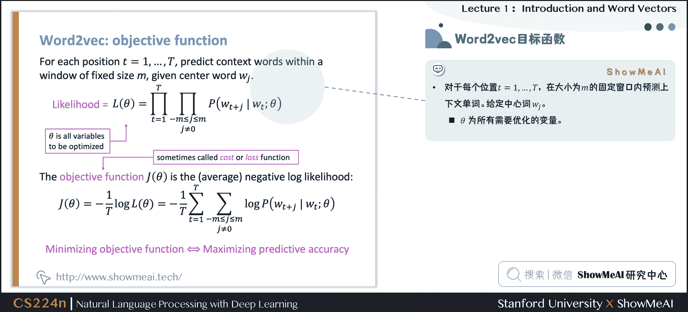

注意：

*   目标函数 J ( θ ) J(\theta) J(θ)有时也被称为“**代价函数**”或“**损失函数**”
*   最小化目标函数 ⇔ \Leftrightarrow ⇔最大化似然函数（预测概率/精度），**两者等价**

补充解读：

*   上述目标函数中的 log 形式是方便将连乘转化为求和，负号是希望将极大化似然率转化为极小化损失函数的等价问题
*   在连乘之前使用 log 转化为求和非常有效，特别是做优化时

log ⁡ ∏ i x i = ∑ i log ⁡ x i \log \prod_i x_i = \sum_i \log x_i logi∏​xi​=i∑​logxi​

得到目标函数后，我们希望最小化目标函数，那我们如何计算 P ( w t + j ∣ w t ; θ ) P(w_{t+j} | w_{t} ; \theta) P(wt+j​∣wt​;θ)？

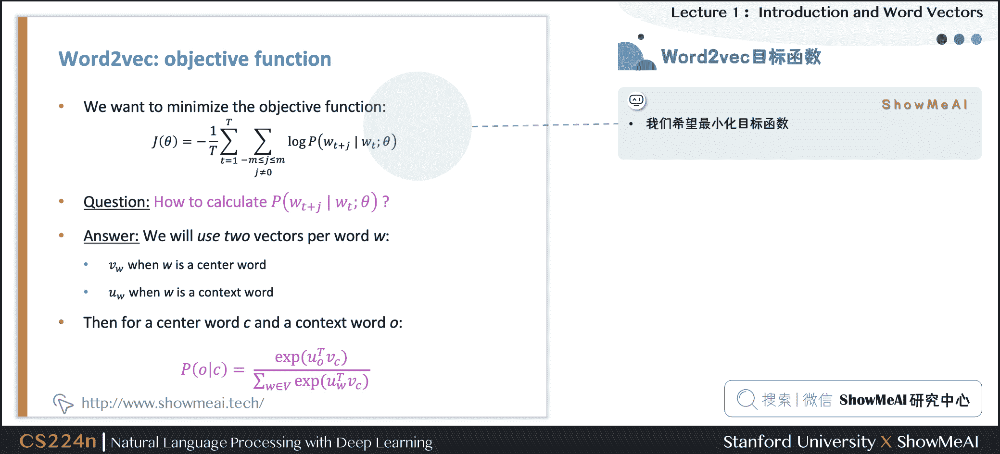

对于每个词 w w w 都会用两个向量：

*   当 w w w 是中心词时，我们标记词向量为 v w v_w vw​
*   当 w w w 是上下文词时，我们标记词向量为 u w u_w uw​

则对于一个中心词 c c c 和一个上下文词 o o o，我们有如下概率计算方式：

P ( o ∣ c ) = exp ⁡ ( u o T v c ) ∑ w ∈ V exp ⁡ ( u w T v c ) P(o | c)=\frac{\exp \left(u_{o}^{T} v_{c}\right)}{\sum_{w \in V} \exp \left(u_{w}^{T} v_{c}\right)} P(o∣c)=∑w∈V​exp(uwT​vc​)exp(uoT​vc​)​

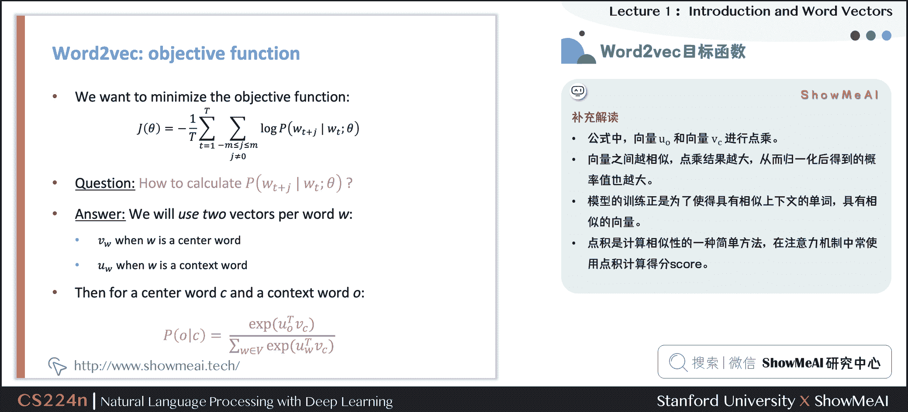

对于上述公式，[ShowMeAI](http://www.showmeai.tech/)做一点补充解读：

*   公式中，向量 u o u_o uo​和向量 v c v_c vc​进行点乘
*   向量之间越相似，点乘结果越大，从而归一化后得到的概率值也越大
*   模型的训练正是为了使得具有相似上下文的单词，具有相似的向量
*   点积是计算相似性的一种简单方法，在注意力机制中常使用点积计算 Score，参见 ShowMeAI 文章[C5W3] 16.Seq2Seq 序列模型和注意力机制

## 3.2 从向量视角回顾 Word2vec

下图为计算 P ( w t + j ∣ w t ) P(w_{t+j} |w_{t}) P(wt+j​∣wt​)的示例，这里把 P ( p r o b l e m s ∣ i n t o ; u p r o b l e m s , v i n t o , θ ) P(problems|into; u_{problems},v_{into},\theta) P(problems∣into;uproblems​,vinto​,θ)简写为 P ( u p r o b l e m s ∣ v i n t o ) P(u_{problems} | v_{into}) P(uproblems​∣vinto​)，例子中的上下文窗口大小 2，即“左右 2 个单词+一个中心词”。

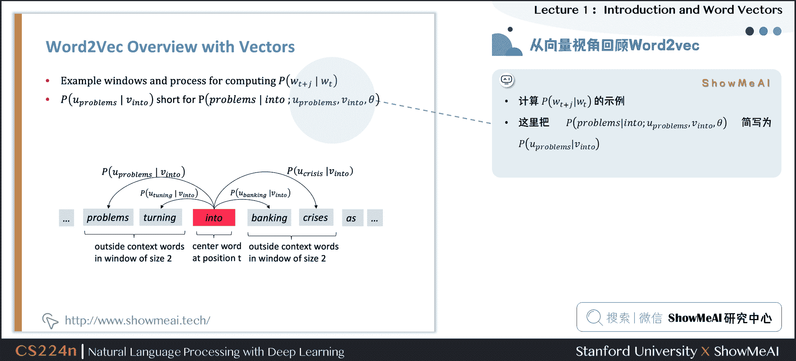

# 4.Word2vec prediction function

## 4.1 Word2vec 预测函数

回到上面的概率计算，我们来观察一下

P ( o ∣ c ) = exp ⁡ ( u o T v c ) ∑ w ∈ V exp ⁡ ( u w T v c ) P(o | c)=\frac{\exp \left(u_{o}^{T} v_{c}\right)}{\sum_{w \in V} \exp \left(u_{w}^{T} v_{c}\right)} P(o∣c)=∑w∈V​exp(uwT​vc​)exp(uoT​vc​)​

*   取幂使任何数都为正
*   点积比较 o o o 和 c c c 的相似性 u T v = u . v = ∑ i = 1 n u i v i u^{T} v=u . v=\sum_{i=1}^{n} u_{i} v_{i} uTv=u.v=∑i=1n​ui​vi​，点积越大则概率越大
*   分母：对整个词汇表进行标准化，从而给出概率分布

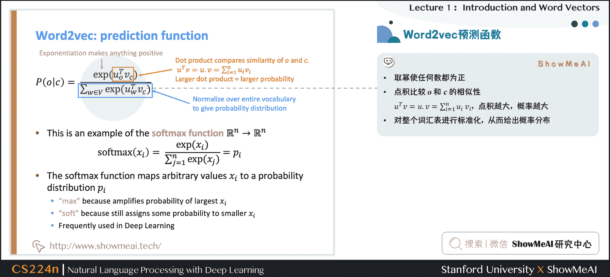

这里有一个 softmax 的概率，softmax function R n ∈ R n \mathbb{R}^{n} \in \mathbb{R}^{n} Rn∈Rn 示例：

将任意值 x i x_i xi​映射到概率分布 p i p_i pi​

softmax ⁡ ( x i ) = exp ⁡ ( x i ) ∑ j = 1 n exp ⁡ ( x j ) = p i \operatorname{softmax}\left(x_{i}\right)=\frac{\exp \left(x_{i}\right)}{\sum_{j=1}^{n} \exp \left(x_{j}\right)}=p_{i} softmax(xi​)=∑j=1n​exp(xj​)exp(xi​)​=pi​

其中对于名称中 soft 和 max 的解释如下（softmax 在深度学习中经常使用到）：

*   max：因为放大了最大的概率
*   soft：因为仍然为较小的 x i x_i xi​赋予了一定概率

## 4.2 word2vec 中的梯度下降训练细节推导

下面是对于 word2vec 的参数更新迭代，应用梯度下降法的一些推导细节，[ShowMeAI](http://www.showmeai.tech/)写在这里做一点补充。

首先我们随机初始化 u w ∈ R d u_{w}\in\mathbb{R}^d uw​∈Rd 和 v w ∈ R d v_{w}\in\mathbb{R}^d vw​∈Rd，而后使用梯度下降法进行更新

∂ ∂ v c log ⁡ P ( o ∣ c ) = ∂ ∂ v c log ⁡ exp ⁡ ( u o T v c ) ∑ w ∈ V exp ⁡ ( u w T v c ) = ∂ ∂ v c ( log ⁡ exp ⁡ ( u o T v c ) − log ⁡ ∑ w ∈ V exp ⁡ ( u w T v c ) ) = ∂ ∂ v c ( u o T v c − log ⁡ ∑ w ∈ V exp ⁡ ( u w T v c ) ) = u o − ∑ w ∈ V exp ⁡ ( u w T v c ) u w ∑ w ∈ V exp ⁡ ( u w T v c ) \begin{aligned} \frac{\partial}{\partial v_c}\log P(o|c) &=\frac{\partial}{\partial v_c}\log \frac{\exp(u_o^Tv_c)}{\sum_{w\in V}\exp(u_w^Tv_c)}\\ &=\frac{\partial}{\partial v_c}\left(\log \exp(u_o^Tv_c)-\log{\sum_{w\in V}\exp(u_w^Tv_c)}\right)\\ &=\frac{\partial}{\partial v_c}\left(u_o^Tv_c-\log{\sum_{w\in V}\exp(u_w^Tv_c)}\right)\\ &=u_o-\frac{\sum_{w\in V}\exp(u_w^Tv_c)u_w}{\sum_{w\in V}\exp(u_w^Tv_c)} \end{aligned} ∂vc​∂​logP(o∣c)​=∂vc​∂​log∑w∈V​exp(uwT​vc​)exp(uoT​vc​)​=∂vc​∂​(logexp(uoT​vc​)−logw∈V∑​exp(uwT​vc​))=∂vc​∂​(uoT​vc​−logw∈V∑​exp(uwT​vc​))=uo​−∑w∈V​exp(uwT​vc​)∑w∈V​exp(uwT​vc​)uw​​​

偏导数可以移进求和中，对应上方公式的最后两行的推导

∂ ∂ x ∑ i y i = ∑ i ∂ ∂ x y i \frac{\partial}{\partial x}\sum_iy_i = \sum_i\frac{\partial}{\partial x}y_i ∂x∂​∑i​yi​=∑i​∂x∂​yi​

我们可以对上述结果重新排列如下，第一项是真正的上下文单词，第二项是预测的上下文单词。使用梯度下降法，模型的预测上下文将逐步接近真正的上下文。

∂ ∂ v c log ⁡ P ( o ∣ c ) = u o − ∑ w ∈ V exp ⁡ ( u w T v c ) u w ∑ w ∈ V exp ⁡ ( u w T v c ) = u o − ∑ w ∈ V exp ⁡ ( u w T v c ) ∑ w ∈ V exp ⁡ ( u w T v c ) u w = u o − ∑ w ∈ V P ( w ∣ c ) u w \begin{aligned} \frac{\partial}{\partial v_c}\log P(o|c) &=u_o-\frac{\sum_{w\in V}\exp(u_w^Tv_c)u_w}{\sum_{w\in V}\exp(u_w^Tv_c)}\\ &=u_o-\sum_{w\in V}\frac{\exp(u_w^Tv_c)}{\sum_{w\in V}\exp(u_w^Tv_c)}u_w\\ &=u_o-\sum_{w\in V}P(w|c)u_w \end{aligned} ∂vc​∂​logP(o∣c)​=uo​−∑w∈V​exp(uwT​vc​)∑w∈V​exp(uwT​vc​)uw​​=uo​−w∈V∑​∑w∈V​exp(uwT​vc​)exp(uwT​vc​)​uw​=uo​−w∈V∑​P(w∣c)uw​​

再对 u o u_o uo​进行偏微分计算，注意这里的 u o u_o uo​是 u w = o u_{w=o} uw=o​的简写，故可知

∂ ∂ u o ∑ w ∈ V u w T v c = ∂ ∂ u o u o T v c = ∂ u o ∂ u o v c + ∂ v c ∂ u o u o = v c \frac{\partial}{\partial u_o}\sum_{w \in V } u_w^T v_c = \frac{\partial}{\partial u_o} u_o^T v_c = \frac{\partial u_o}{\partial u_o}v_c + \frac{\partial v_c}{\partial u_o}u_o= v_c ∂uo​∂​w∈V∑​uwT​vc​=∂uo​∂​uoT​vc​=∂uo​∂uo​​vc​+∂uo​∂vc​​uo​=vc​

∂ ∂ u o log ⁡ P ( o ∣ c ) = ∂ ∂ u o log ⁡ exp ⁡ ( u o T v c ) ∑ w ∈ V exp ⁡ ( u w T v c ) = ∂ ∂ u o ( log ⁡ exp ⁡ ( u o T v c ) − log ⁡ ∑ w ∈ V exp ⁡ ( u w T v c ) ) = ∂ ∂ u o ( u o T v c − log ⁡ ∑ w ∈ V exp ⁡ ( u w T v c ) ) = v c − ∑ ∂ ∂ u o exp ⁡ ( u w T v c ) ∑ w ∈ V exp ⁡ ( u w T v c ) = v c − exp ⁡ ( u o T v c ) v c ∑ w ∈ V exp ⁡ ( u w T v c ) = v c − exp ⁡ ( u o T v c ) ∑ w ∈ V exp ⁡ ( u w T v c ) v c = v c − P ( o ∣ c ) v c = ( 1 − P ( o ∣ c ) ) v c \begin{aligned} \frac{\partial}{\partial u_o}\log P(o|c) &=\frac{\partial}{\partial u_o}\log \frac{\exp(u_o^Tv_c)}{\sum_{w\in V}\exp(u_w^Tv_c)}\\ &=\frac{\partial}{\partial u_o}\left(\log \exp(u_o^Tv_c)-\log{\sum_{w\in V}\exp(u_w^Tv_c)}\right)\\ &=\frac{\partial}{\partial u_o}\left(u_o^Tv_c-\log{\sum_{w\in V}\exp(u_w^Tv_c)}\right)\\ &=v_c-\frac{\sum\frac{\partial}{\partial u_o}\exp(u_w^Tv_c)}{\sum_{w\in V}\exp(u_w^Tv_c)}\\ &=v_c - \frac{\exp(u_o^Tv_c)v_c}{\sum_{w\in V}\exp(u_w^Tv_c)}\\ &=v_c - \frac{\exp(u_o^Tv_c)}{\sum_{w\in V}\exp(u_w^Tv_c)}v_c\\ &=v_c - P(o|c)v_c\\ &=(1-P(o|c))v_c \end{aligned} ∂uo​∂​logP(o∣c)​=∂uo​∂​log∑w∈V​exp(uwT​vc​)exp(uoT​vc​)​=∂uo​∂​(logexp(uoT​vc​)−logw∈V∑​exp(uwT​vc​))=∂uo​∂​(uoT​vc​−logw∈V∑​exp(uwT​vc​))=vc​−∑w∈V​exp(uwT​vc​)∑∂uo​∂​exp(uwT​vc​)​=vc​−∑w∈V​exp(uwT​vc​)exp(uoT​vc​)vc​​=vc​−∑w∈V​exp(uwT​vc​)exp(uoT​vc​)​vc​=vc​−P(o∣c)vc​=(1−P(o∣c))vc​​

可以理解，当 P ( o ∣ c ) → 1 P(o|c) \to 1 P(o∣c)→1，即通过中心词 c c c 我们可以正确预测上下文词 o o o，此时我们不需要调整 u o u_o uo​，反之，则相应调整 u o u_o uo​。

关于此处的微积分知识，可以查阅[ShowMeAI](http://www.showmeai.tech/)的教程[**图解 AI 数学基础**](http://www.showmeai.tech/tutorials/83)文章[图解 AI 数学基础 | **微积分与最优化**](http://www.showmeai.tech/article-detail/165)。


*   训练模型的过程，实际上是我们在调整参数最小化损失函数。
*   如下是一个包含 2 个参数的凸函数，我们绘制了目标函数的等高线。

## 4.3 训练模型：计算所有向量梯度

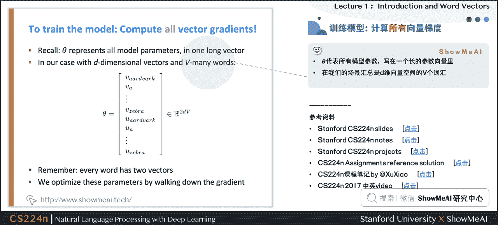

θ \theta θ代表所有模型参数，写在一个长的参数向量里。

在我们的场景汇总是 d d d 维向量空间的 V V V 个词汇。

# 5.视频教程

可以点击 [B 站](https://www.bilibili.com/video/BV1Yo4y1D7FW?p=1) 查看视频的【双语字幕】版本

[`player.bilibili.com/player.html?aid=376755412&page=1`](https://player.bilibili.com/player.html?aid=376755412&page=1)

【双语字幕+资料下载】斯坦福 CS224n | 深度学习与自然语言处理(2019·全 20 讲)

# 6.参考资料

*   [本讲带学的**在线阅翻页本**](https://blog.showmeai.tech/cs224n/lecture01-Introduction-and-Word-Vectors#/)
*   [《斯坦福 CS224n 深度学习与自然语言处理》**课程学习指南**](https://blog.showmeai.tech/cs224n/)
*   [《斯坦福 CS224n 深度学习与自然语言处理》**课程大作业解析**](https://github.com/ShowMeAI-Hub/awesome-AI-courses-notes-cheatsheets/tree/main/CS224n-Natural-Language-Processing-with-Deep-Learning/assignment-solutions)
*   [【**双语字幕视频**】斯坦福 CS224n | 深度学习与自然语言处理(2019·全 20 讲)](https://www.bilibili.com/video/BV1Yo4y1D7FW)
*   [**Stanford 官网** | CS224n: Natural Language Processing with Deep Learning](https://web.stanford.edu/class/archive/cs/cs224n/cs224n.1194/)

# [**ShowMeAI**](http://www.showmeai.tech)系列教程推荐

*   [大厂技术实现 | 推荐与广告计算解决方案](http://www.showmeai.tech/tutorials/50)
*   [大厂技术实现 | 计算机视觉解决方案](http://www.showmeai.tech/tutorials/51)
*   [大厂技术实现 | 自然语言处理行业解决方案](http://www.showmeai.tech/tutorials/52)
*   [图解 Python 编程：从入门到精通系列教程](http://www.showmeai.tech/tutorials/56)
*   [图解数据分析：从入门到精通系列教程](http://www.showmeai.tech/tutorials/33)
*   [图解 AI 数学基础：从入门到精通系列教程](http://www.showmeai.tech/tutorials/83)
*   [图解大数据技术：从入门到精通系列教程](http://www.showmeai.tech/tutorials/84)
*   [图解机器学习算法：从入门到精通系列教程](http://www.showmeai.tech/tutorials/34)
*   [机器学习实战：手把手教你玩转机器学习系列](http://www.showmeai.tech/tutorials/41)
*   [深度学习教程 | 吴恩达专项课程 · 全套笔记解读](http://www.showmeai.tech/tutorials/35)
*   [自然语言处理教程 | 斯坦福 CS224n 课程 · 课程带学与全套笔记解读](http://www.showmeai.tech/tutorials/36)

# NLP 系列教程文章

*   [NLP 教程(1)- 词向量、SVD 分解与 Word2vec](http://showmeai.tech/article-detail/230)
*   [NLP 教程(2)- GloVe 及词向量的训练与评估](http://showmeai.tech/article-detail/232)
*   [NLP 教程(3)- 神经网络与反向传播](http://showmeai.tech/article-detail/234)
*   [NLP 教程(4)- 句法分析与依存解析](http://www.showmeai.tech/article-detail/237)
*   [NLP 教程(5)- 语言模型、RNN、GRU 与 LSTM](http://www.showmeai.tech/article-detail/239)
*   [NLP 教程(6)- 神经机器翻译、seq2seq 与注意力机制](http://www.showmeai.tech/article-detail/242)
*   [NLP 教程(7)- 问答系统](http://www.showmeai.tech/article-detail/245)
*   [NLP 教程(8)- NLP 中的卷积神经网络](http://www.showmeai.tech/article-detail/247)
*   [NLP 教程(9)- 句法分析与树形递归神经网络](http://www.showmeai.tech/article-detail/255)

# 斯坦福 CS224n 课程带学详解

*   [斯坦福 NLP 课程 | 第 1 讲 - NLP 介绍与词向量初步](http://showmeai.tech/article-detail/231)
*   [斯坦福 NLP 课程 | 第 2 讲 - 词向量进阶](http://showmeai.tech/article-detail/233)
*   [斯坦福 NLP 课程 | 第 3 讲 - 神经网络知识回顾](http://showmeai.tech/article-detail/235)
*   [斯坦福 NLP 课程 | 第 4 讲 - 神经网络反向传播与计算图](http://showmeai.tech/article-detail/236)
*   [斯坦福 NLP 课程 | 第 5 讲 - 句法分析与依存解析](http://www.showmeai.tech/article-detail/238)
*   [斯坦福 NLP 课程 | 第 6 讲 - 循环神经网络与语言模型](http://www.showmeai.tech/article-detail/240)
*   [斯坦福 NLP 课程 | 第 7 讲 - 梯度消失问题与 RNN 变种](http://www.showmeai.tech/article-detail/241)
*   [斯坦福 NLP 课程 | 第 8 讲 - 机器翻译、seq2seq 与注意力机制](http://www.showmeai.tech/article-detail/243)
*   [斯坦福 NLP 课程 | 第 9 讲 - cs224n 课程大项目实用技巧与经验](http://www.showmeai.tech/article-detail/244)
*   [斯坦福 NLP 课程 | 第 10 讲 - NLP 中的问答系统](http://www.showmeai.tech/article-detail/246)
*   [斯坦福 NLP 课程 | 第 11 讲 - NLP 中的卷积神经网络](http://www.showmeai.tech/article-detail/248)
*   [斯坦福 NLP 课程 | 第 12 讲 - 子词模型](http://www.showmeai.tech/article-detail/249)
*   [斯坦福 NLP 课程 | 第 13 讲 - 基于上下文的表征与 NLP 预训练模型](http://www.showmeai.tech/article-detail/250)
*   [斯坦福 NLP 课程 | 第 14 讲 - Transformers 自注意力与生成模型](http://www.showmeai.tech/article-detail/251)
*   [斯坦福 NLP 课程 | 第 15 讲 - NLP 文本生成任务](http://www.showmeai.tech/article-detail/252)
*   [斯坦福 NLP 课程 | 第 16 讲 - 指代消解问题与神经网络方法](http://www.showmeai.tech/article-detail/253)
*   [斯坦福 NLP 课程 | 第 17 讲 - 多任务学习(以问答系统为例)](http://www.showmeai.tech/article-detail/254)
*   [斯坦福 NLP 课程 | 第 18 讲 - 句法分析与树形递归神经网络](http://www.showmeai.tech/article-detail/256)
*   [斯坦福 NLP 课程 | 第 19 讲 - AI 安全偏见与公平](http://www.showmeai.tech/article-detail/257)
*   [斯坦福 NLP 课程 | 第 20 讲 - NLP 与深度学习的未来](http://www.showmeai.tech/article-detail/258)

