# 斯坦福 NLP 课程 | 第 2 讲 - 词向量进阶

> 原文：[`blog.csdn.net/ShowMeAI/article/details/124493764`](https://blog.csdn.net/ShowMeAI/article/details/124493764)

作者：[韩信子](https://github.com/HanXinzi-AI)@[ShowMeAI](http://www.showmeai.tech/)，路遥@[ShowMeAI](http://www.showmeai.tech/)，奇异果@[ShowMeAI](http://www.showmeai.tech/)
[教程地址](http://www.showmeai.tech/tutorials/36)：[`www.showmeai.tech/tutorials/36`](http://www.showmeai.tech/tutorials/36)
[本文地址](http://www.showmeai.tech/article-detail/233)：[`www.showmeai.tech/article-detail/233`](http://www.showmeai.tech/article-detail/233)
声明：版权所有，转载请联系平台与作者并注明出处

收藏[ShowMeAI](http://www.showmeai.tech/)查看更多精彩内容

* * *

[ShowMeAI](http://www.showmeai.tech/)为**斯坦福 CS224n**《自然语言处理与深度学习(Natural Language Processing with Deep Learning)》课程的全部课件，做了**中文翻译和注释**，并制作成了 GIF 动图！

本讲内容的**深度总结教程**可以在[**这里**](http://www.showmeai.tech/article-detail/232) 查看。视频和课件等资料的获取方式见**文末**。

# 引言

CS224n 是顶级院校斯坦福出品的深度学习与自然语言处理方向专业课程。核心内容覆盖 RNN、LSTM、CNN、transformer、bert、问答、摘要、文本生成、语言模型、阅读理解等前沿内容。

本篇是[ShowMeAI](http://www.showmeai.tech/)对第 2 课的内容梳理，内容覆盖词嵌入/词向量，word vectors 和 word senses。

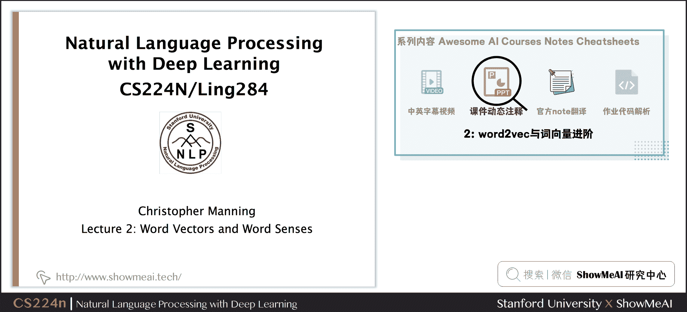

## 本篇内容覆盖

*   word2vec 与词向量回顾
*   算法优化基础
*   计数与共现矩阵
*   GloVe 模型
*   词向量评估
*   word senses

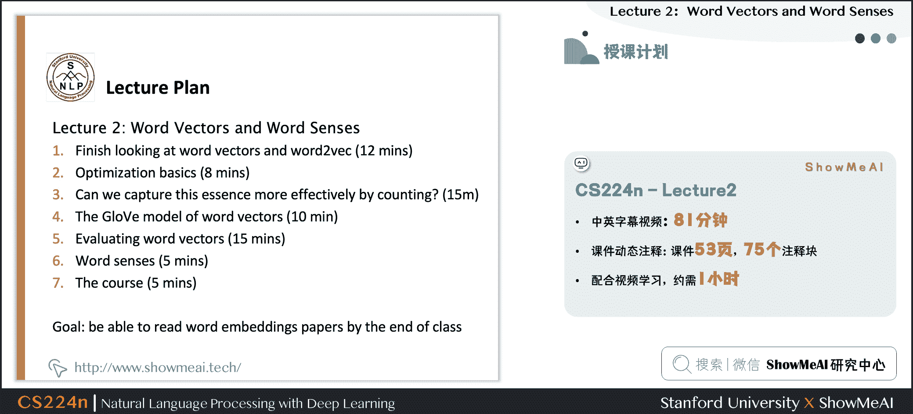

# 1.word2vec 与词向量回顾

## 1.1 复习：word2vec 的主要思想

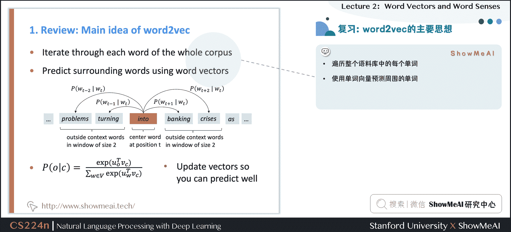

我们来回顾一下[ShowMeAI](http://www.showmeai.tech/)上一篇 [1.**NLP 介绍与词向量初步**](http://www.showmeai.tech/article-detail/231) 提到的 word2vec 模型核心知识

*   模型会遍历整个语料库中的每个单词
*   使用中心单词向量预测周围的单词（Skip-Gram）

P ( o ∣ c ) = exp ⁡ ( u o T v c ) ∑ w ∈ V exp ⁡ ( u w T v c ) P(o | c)=\frac{\exp \left(u_{o}^{T} v_{c}\right)}{\sum_{w \in V} \exp \left(u_{w}^{T} v_{c}\right)} P(o∣c)=∑w∈V​exp(uwT​vc​)exp(uoT​vc​)​

*   更新向量（参数）以便更好地预测上下文

## 1.2 Word2vec 参数和计算

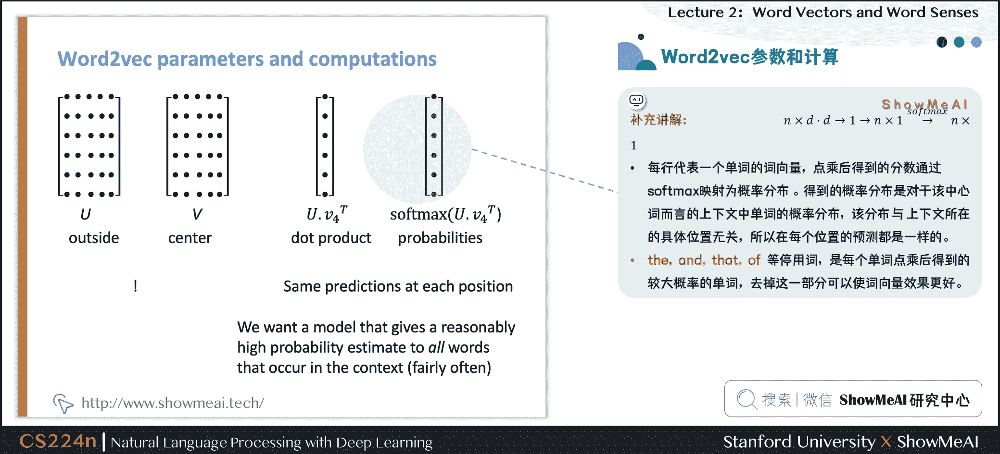

我们对 word2vec 的参数和训练细节等做一个补充讲解：

*   U U U 、 V V V 矩阵，每行代表一个单词的词向量，点乘后得到的分数通过 softmax 映射为概率分布。得到的概率分布是对于该中心词而言的上下文中单词的概率分布，该分布与上下文所在的具体位置无关，所以在每个位置的预测都是一样的。
*   the、and、that、of 等停用词，是每个单词点乘后得到的较大概率的单词，去掉这一部分可以使词向量效果更好。

## 1.3 word2vec 训练得到的词向量分布体现语义相似度

经过 word2vec 最大化目标函数后，通过可视化可以发现，相似的词汇在词向量空间里是比较接近的。

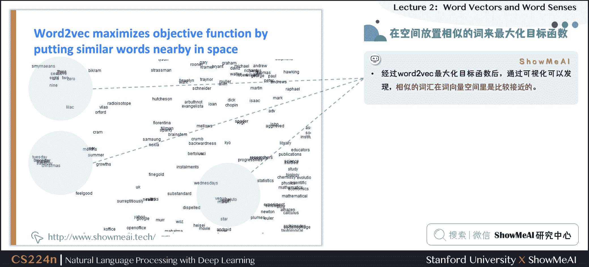

## 1.4 优化算法：梯度下降

[ShowMeAI](http://www.showmeai.tech/)在上一篇 [1.**NLP 介绍与词向量初步**](http://www.showmeai.tech/article-detail/231) 讲解了需要最小化的代价函数 J ( θ ) J(\theta) J(θ) ，我们使用梯度下降算法最小化 J ( θ ) J(\theta) J(θ)

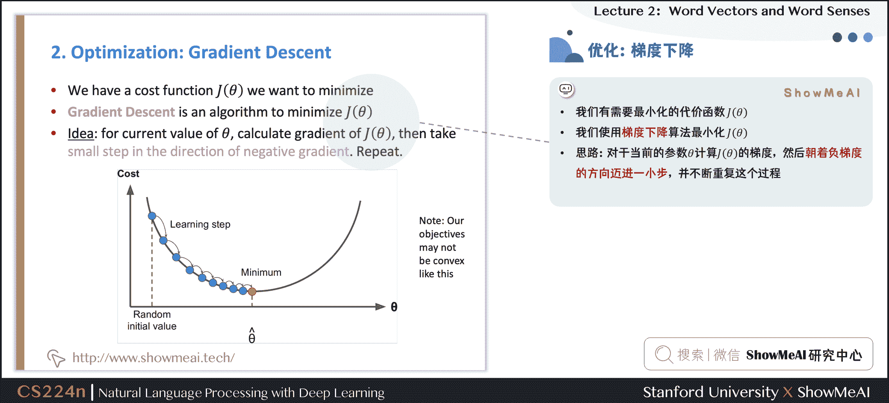

遵循梯度下降的一般思路，我们计算 J ( θ ) J(\theta) J(θ) 对于参数 θ \theta θ 的梯度，然后朝着负梯度的方向迈进一小步，并不断重复这个过程，如图所示。

注意：我们实际的目标函数可能不是下图这样的凸函数

# 2.算法优化基础

## 2.1 梯度下降算法

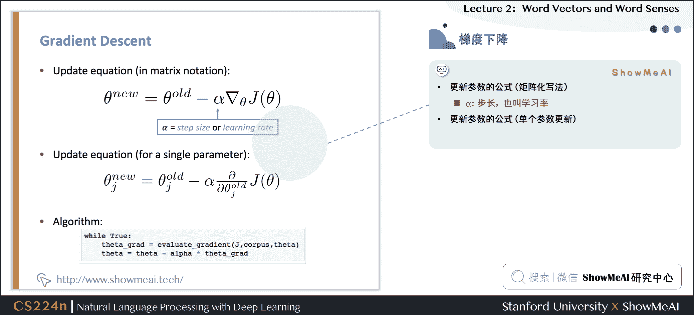

*   更新参数的公式（矩阵化写法）

θ n e w = θ o l d − α ∇ θ J ( θ ) \theta^{new}=\theta^{old}-\alpha \nabla_{\theta} J(\theta) θnew=θold−α∇θ​J(θ)

*   α \alpha α ：步长，也叫学习率

*   更新参数的公式（单个参数更新）

θ j n e w = θ j o l d − α ∂ ∂ θ j o l d J ( θ ) \theta_{j}^{new}=\theta_{j}^{old}-\alpha \frac{\partial}{\partial \theta_{j}^{old}} J(\theta) θjnew​=θjold​−α∂θjold​∂​J(θ)

## 2.2 词向量随机梯度下降法

梯度下降会一次性使用所有数据样本进行参数更新，对应到我们当前的词向量建模问题，就是 J ( θ ) J(\theta) J(θ) 的计算需要基于语料库所有的样本(窗口)，数据规模非常大

*   计算非常耗资源
*   计算时间太长

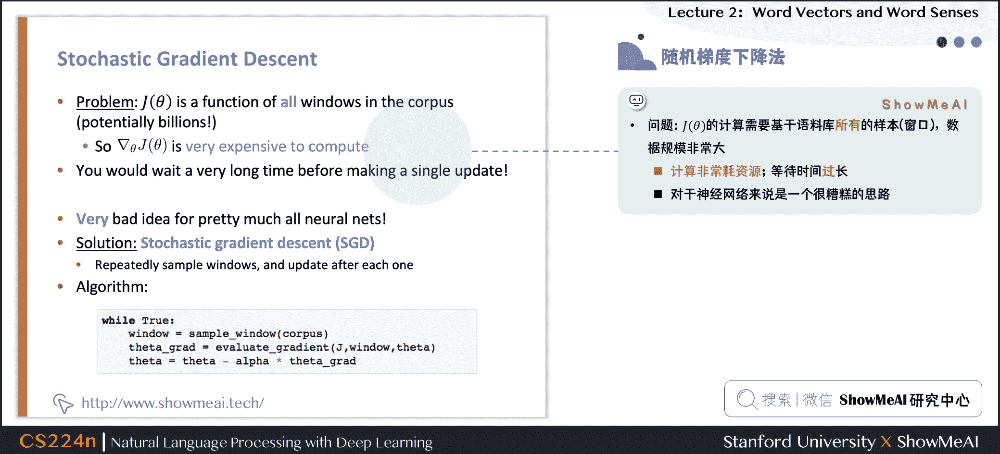

处理方式是把优化算法调整为「**随机梯度下降算法**」，即在单个样本里计算和更新参数，并遍历所有样本。

但基于单个样本更新会表现为参数震荡很厉害，收敛过程并不平稳，所以很多时候我们会改为使用**mini-batch gradient descent**（具体可以参考[ShowMeAI](http://www.showmeai.tech/)的[深度学习教程](http://www.showmeai.tech/tutorials/35)中文章[**神经网络优化算法**](http://www.showmeai.tech/article-detail/217)）

*   Mini-batch 具有以下优点：通过 batch 平均，减少梯度估计的噪音；在 GPU 上并行化运算，加快运算速度。

## 2.3 词向量建模中的随机梯度下降

*   应用随机梯度下降，在每个窗口计算和更新参数，遍历所有样本

*   在每个窗口内，我们最多只有 2 m + 1 2m+1 2m+1 个词，因此 ∇ θ J t ( θ ) \nabla_{\theta} J_t(\theta) ∇θ​Jt​(θ) 是非常稀疏的

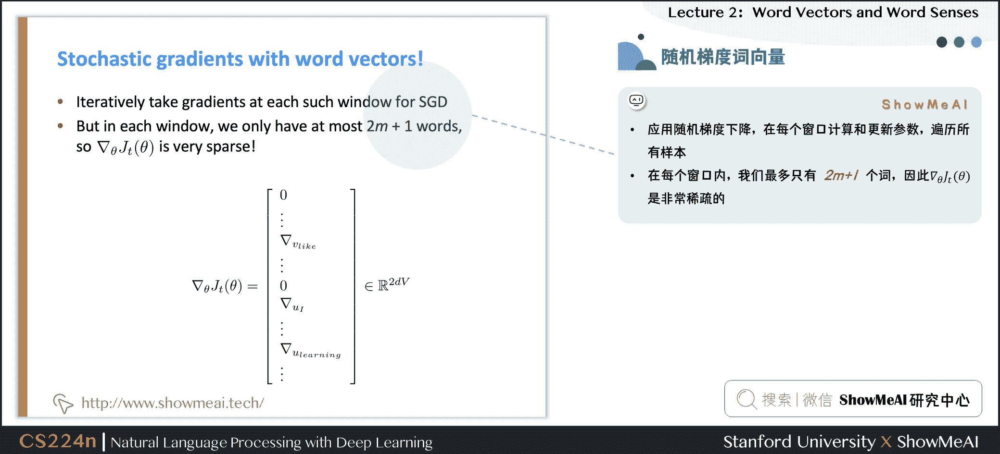

上面提到的稀疏性问题，一种解决方式是我们**只更新实际出现的向量**

*   需要稀疏矩阵更新操作来只更新矩阵 U U U 和 V V V 中的特定行

*   需要保留单词向量的哈希/散列

如果有数百万个单词向量，并且进行分布式计算，我们无需再传输巨大的更新信息（数据传输有成本）

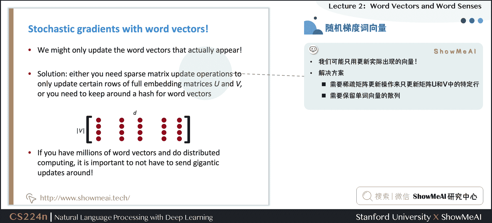

## 2.4 Word2vec 的更多细节

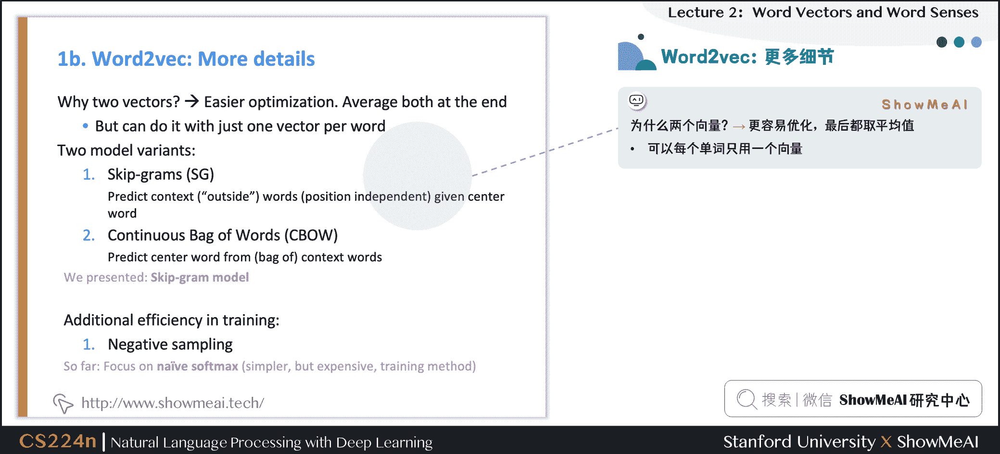

word2vec 有两个模型变体：

*   1.Skip-grams (SG)：输入中心词并预测上下文中的单词
*   2.Continuous Bag of Words (CBOW)：输入上下文中的单词并预测中心词

之前一直使用 naive 的 softmax(简单但代价很高的训练方法)，其实可以使用负采样方法加快训练速率

## 2.5 负例采样的 skip-gram 模型（作业 2）

这个部分大家也可以参考[ShowMeAI](http://www.showmeai.tech/)的[**深度学习教程**](http://www.showmeai.tech/tutorials/35)中文章[**自然语言处理与词嵌入**](http://www.showmeai.tech/article-detail/226)

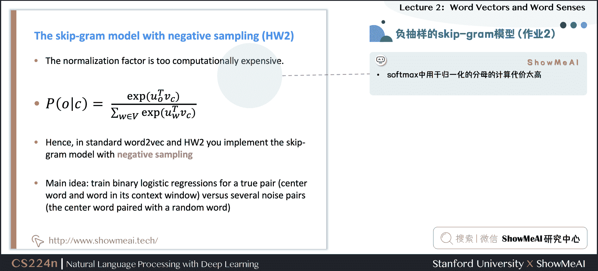

softmax 中用于归一化的分母的计算代价太高

P ( o ∣ c ) = exp ⁡ ( u o T v c ) ∑ w ∈ V exp ⁡ ( u w T v c ) P(o | c)=\frac{\exp \left(u_{o}^{T} v_{c}\right)}{\sum_{w \in V} \exp \left(u_{w}^{T} v_{c}\right)} P(o∣c)=∑w∈V​exp(uwT​vc​)exp(uoT​vc​)​

*   我们将在作业 2 中实现使用 negative sampling/负例采样方法的 skip-gram 模型。
*   使用一个 true pair (中心词及其上下文窗口中的词)与几个 noise pair (中心词与随机词搭配) 形成的样本，训练二元逻辑回归。

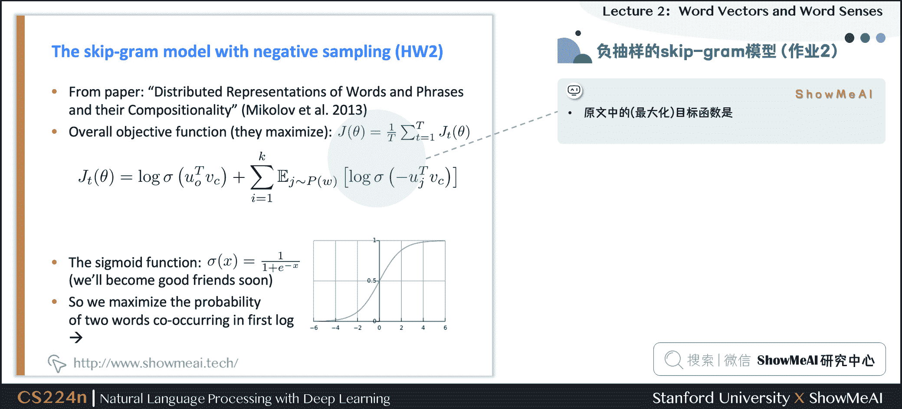

原文中的(最大化)目标函数是 J ( θ ) = 1 T ∑ t = 1 T J t ( θ ) J(\theta)=\frac{1}{T} \sum_{t=1}^{T} J_{t}(\theta) J(θ)=T1​∑t=1T​Jt​(θ)

J t ( θ ) = log ⁡ σ ( u o T v c ) + ∑ i = 1 k E j ∼ P ( w ) [ log ⁡ σ ( − u j T v c ) ] J_{t}(\theta)=\log \sigma\left(u_{o}^{T} v_{c}\right)+\sum_{i=1}^{k} \mathbb{E}_{j \sim P(w)}\left[\log \sigma\left(-u_{j}^{T} v_{c}\right)\right] Jt​(θ)=logσ(uoT​vc​)+i=1∑k​Ej∼P(w)​[logσ(−ujT​vc​)]

*   左侧为 sigmoid 函数(大家会在后续的内容里经常见到它)
*   我们要最大化 2 个词共现的概率

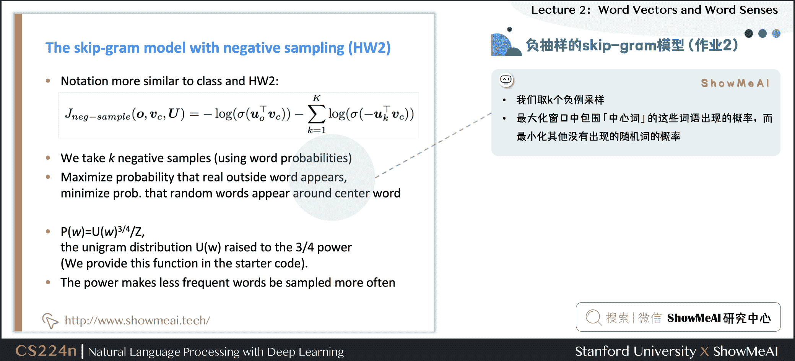

本课以及作业中的目标函数是

J n e g − s a m p l e ( o , v c , U ) = − log ⁡ ( σ ( u o ⊤ v c ) ) − ∑ k = 1 K log ⁡ ( σ ( − u k ⊤ v c ) ) J_{neg-sample}\left(\boldsymbol{o}, \boldsymbol{v}_{c}, \boldsymbol{U}\right)=-\log \left(\sigma\left(\boldsymbol{u}_{o}^{\top} \boldsymbol{v}_{c}\right)\right)-\sum_{k=1}^{K} \log \left(\sigma\left(-\boldsymbol{u}_{k}^{\top} \boldsymbol{v}_{c}\right)\right) Jneg−sample​(o,vc​,U)=−log(σ(uo⊤​vc​))−k=1∑K​log(σ(−uk⊤​vc​))

*   我们取 k k k 个负例采样
*   最大化窗口中包围「中心词」的这些词语出现的概率，而最小化其他没有出现的随机词的概率

P ( w ) = U ( w ) 3 / 4 / Z P(w)=U(w)^{3 / 4} / Z P(w)=U(w)3/4/Z

*   我们用左侧的公式进行抽样，其中 U ( w ) U(w) U(w) 是 unigram 分布
*   通过 3/4 次方，相对减少常见单词的频率，增大稀有词的概率
*   Z Z Z 用于生成概率分布

# 3.计数与共现矩阵

## 3.1 共现矩阵与词向量构建

在自然语言处理里另外一个构建词向量的思路是借助于**共现矩阵**（我们设其为 X X X ），我们有两种方式，可以基于窗口（window）或者全文档（full document）统计：

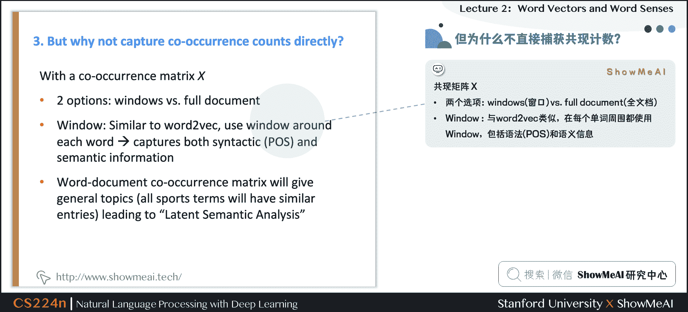

*   **Window** ：与 word2vec 类似，在每个单词周围都使用 Window，包括语法(POS)和语义信息
*   **Word-document** 共现矩阵的基本假设是在同一篇文章中出现的单词更有可能相互关联。假设单词 i i i 出现在文章 j j j 中，则矩阵元素 X i j X_{ij} Xij​ 加一，当我们处理完数据库中的所有文章后，就得到了矩阵 X X X ，其大小为 ∣ V ∣ × M |V|\times M ∣V∣×M ，其中 ∣ V ∣ |V| ∣V∣ 为词汇量，而 M M M 为文章数。这一构建单词文章 co-occurrence matrix 的方法也是经典的 Latent Semantic Analysis 所采用的【语义分析】。

## 3.2 基于窗口的共现矩阵示例

利用某个定长窗口(通常取 5-10)中单词与单词同时出现的次数，来产生基于窗口的共现矩阵。

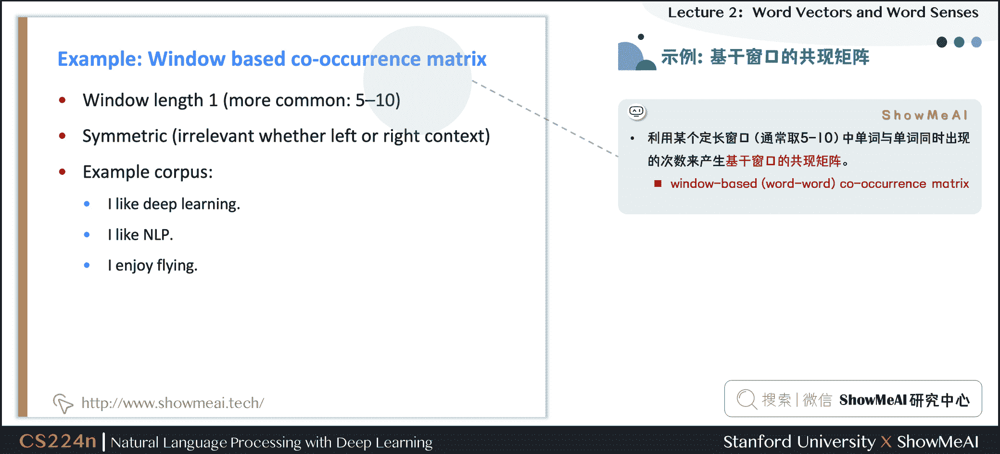

下面以窗口长度为 1 来举例，假设我们的数据包含以下几个句子：

*   I like deep learning.
*   I like NLP.
*   I enjoy flying.

我们可以得到如下的词词共现矩阵（word-word co-occurrence matrix）

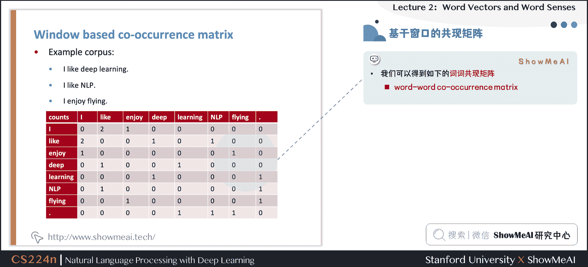

## 3.3 基于直接的共现矩阵构建词向量的问题

直接基于共现矩阵构建词向量，会有一些明显的问题，如下：

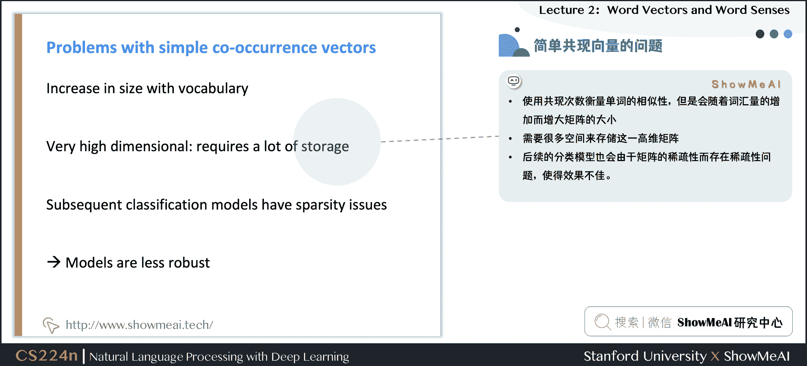

*   使用共现次数衡量单词的相似性，但是会随着词汇量的增加而增大矩阵的大小。
*   需要很多空间来存储这一高维矩阵。
*   后续的分类模型也会由于矩阵的稀疏性而存在稀疏性问题，使得效果不佳。

## 3.4 解决方案：低维向量

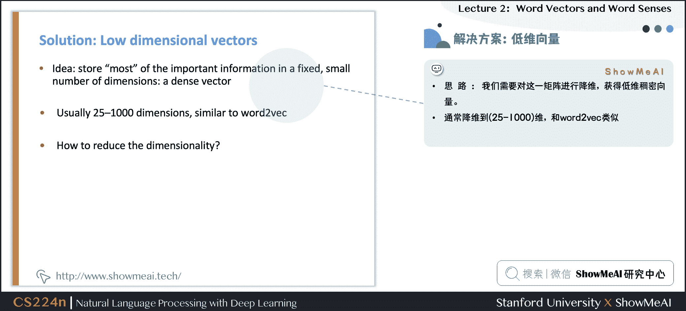

针对上述问题，我们的一个处理方式是降维，获得低维稠密向量。

*   通常降维到(25-1000)维，和 word2vec 类似

如何降维呢？

## 3.5 方法 1：对 X 进行降维（作业 1）

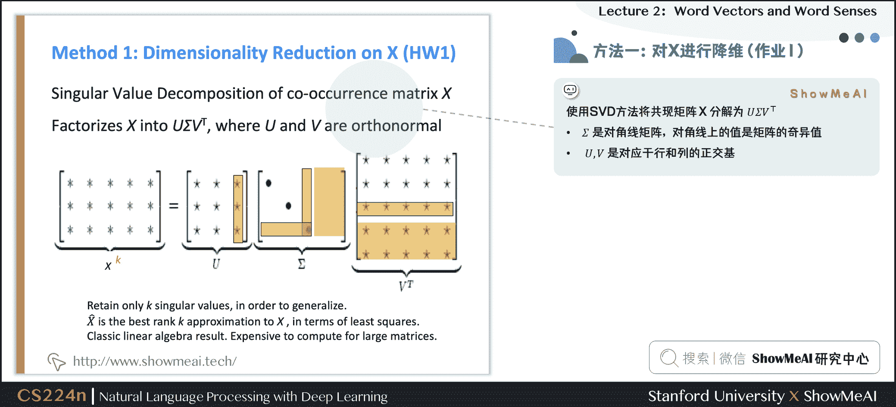

可以使用 SVD 方法将共现矩阵 X X X 分解为 U Σ V T U \Sigma V^T UΣVT ，其中：

*   Σ \Sigma Σ 是对角线矩阵，对角线上的值是矩阵的奇异值
*   U U U , V V V 是对应于行和列的正交基

为了减少尺度同时尽量保存有效信息，可保留对角矩阵的最大的 k k k 个值，并将矩阵 U U U , V V V 的相应的行列保留。

*   这是经典的线性代数算法，对于大型矩阵而言，计算代价昂贵。

## 3.6 词向量 SVD 分解的 python 代码示例

**python 矩阵分解**示例如下

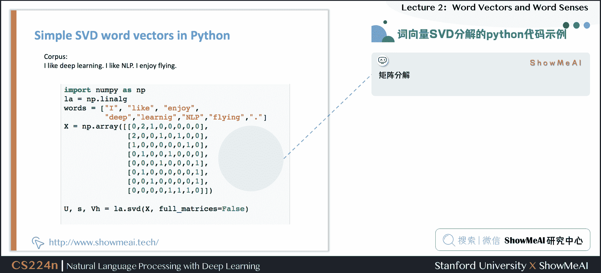

**降维词向量可视化**
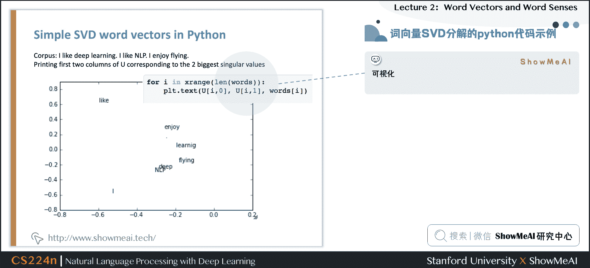

## 3.7 #论文讲解#

### Hacks to X (several used in Rohde et al. 2005)

按比例调整 counts 会很有效

*   对高频词进行缩放(语法有太多的影响)
    *   使用 log 进行缩放
    *   m i n ( X , t ) , t ≈ 100 min(X, t), t \approx 100 min(X,t),t≈100
    *   直接全部忽视
*   在基于 window 的计数中，提高更加接近的单词的计数
*   使用 Person 相关系数

## 3.8 词向量分布探究

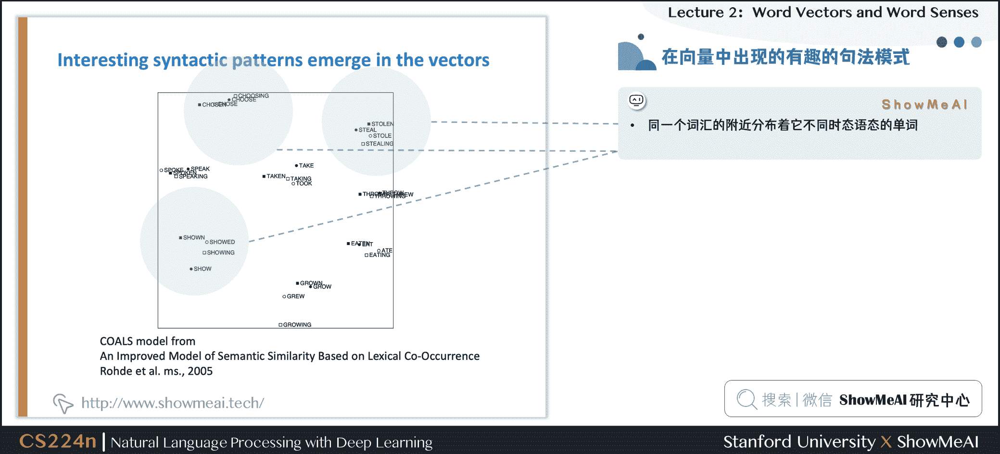

如果对词向量进行空间分布，会发现同一个词汇的附近分布着它不同时态语态的单词：

*   d r i v e → d r i v e r drive \to driver drive→driver
*   s w i m → s w i m m e r swim \to swimmer swim→swimmer
*   t e a c h → t e a c h e r teach \to teacher teach→teacher

在向量中出现的有趣的句法模式：语义向量基本上是线性组件，虽然有一些摆动，但是基本是存在动词和动词实施者的方向。

## 3.9 基于计数 VS. 基于预估

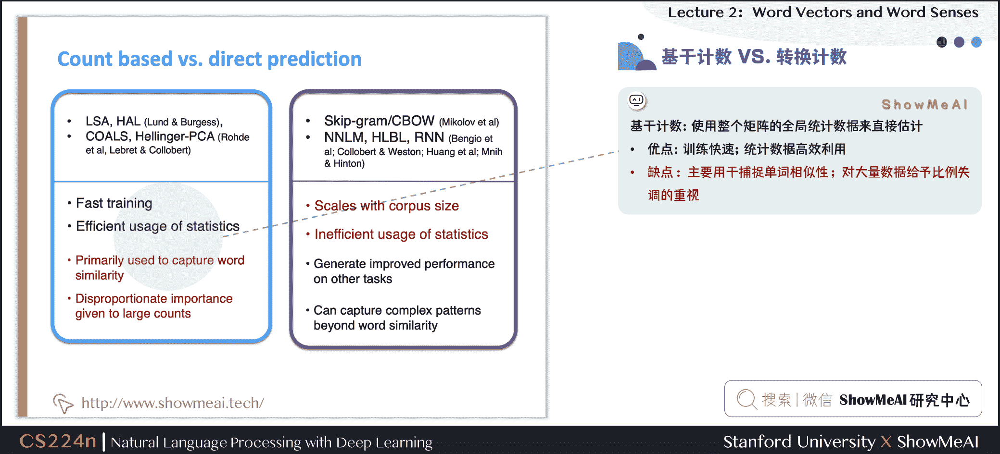

我们来总结一下基于共现矩阵计数和基于预估模型两种得到词向量的方式

**基于计数**：使用整个矩阵的全局统计数据来直接估计

*   **优点**：训练快速；统计数据高效利用
*   **缺点**：主要用于捕捉单词相似性；对大量数据给予比例失调的重视

**基于预估模型**：定义概率分布并试图预测单词

*   **优点**：提高其他任务的性能；能捕获除了单词相似性以外的复杂的模式
*   **缺点**：随语料库增大会增大规模；统计数据的低效使用（采样是对统计数据的低效使用）

# 4.GloVe 模型

## 4.1 #论文讲解#

1）Encoding meaning in vector differences

将两个流派的想法结合起来，在神经网络中使用计数矩阵。关于 Glove 的理论分析需要阅读原文，也可以阅读 [NLP 教程(2) | GloVe 及词向量的训练与评估](http://www.showmeai.tech/article-detail/232)。

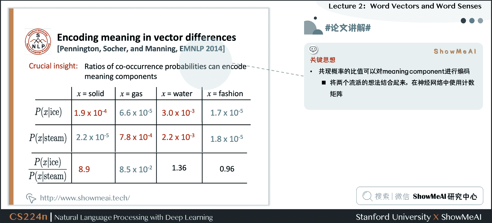

GloVe 模型关键思想：共现概率的比值可以对 meaning component 进行编码。将两个流派的想法结合起来，在神经网络中使用计数矩阵。

**补充讲解**：

重点不是单一的概率大小，重点是他们之间的比值，其中蕴含着重要的信息成分。

*   例如我们想区分热力学上两种不同状态 ice 冰与蒸汽 steam，它们之间的关系可通过与不同的单词 x x x 的共现概率的比值来描述

*   例如对于 solid 固态，虽然 P ( s o l i d ∣ i c e ) P(solid \mid ice) P(solid∣ice) 与 P ( s o l i d ∣ s t e a m ) P(solid \mid steam) P(solid∣steam) 本身很小，不能透露有效的信息，但是它们的比值 P ( s o l i d ∣ i c e ) P ( s o l i d ∣ s t e a m ) \frac{P(solid \mid ice)}{P(solid \mid steam)} P(solid∣steam)P(solid∣ice)​ 却较大，因为 solid 更常用来描述 ice 的状态而不是 steam 的状态，所以在 ice 的上下文中出现几率较大

*   对于 gas 则恰恰相反，而对于 water 这种描述 ice 与 steam 均可或者 fashion 这种与两者都没什么联系的单词，则比值接近于 1 1 1 。所以相较于单纯的共现概率，实际上共现概率的相对比值更有意义

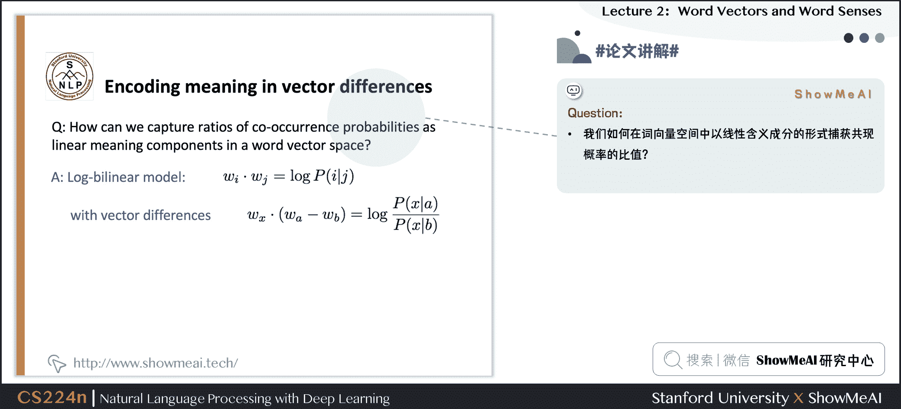

**问题**：

我们如何在词向量空间中以线性含义成分的形式捕获共现概率的比值？

**解决方案**：

*   log-bilinear 模型：

w i ⋅ w j = log ⁡ P ( i ∣ j ) w_{i} \cdot w_{j}=\log P(i \mid j) wi​⋅wj​=logP(i∣j)

*   向量差异：

w x ⋅ ( w a − w b ) = log ⁡ P ( x ∣ a ) P ( x ∣ b ) w_{x} \cdot (w_a-w_b)=\log \frac{P(x \mid a)}{P(x \mid b)} wx​⋅(wa​−wb​)=logP(x∣b)P(x∣a)​

2）Combining the best of both worlds GloVe [Pennington et al., EMNLP 2014]

w i ⋅ w j = log ⁡ P ( i ∣ j ) w_{i} \cdot w_{j}=\log P(i \mid j) wi​⋅wj​=logP(i∣j)

J = ∑ i , j = 1 V f ( X i j ) ( w i T w ~ j + b i + b ~ j − log ⁡ X i j ) 2 J=\sum_{i, j=1}^{V} f(X_{ij})(w_{i}^{T} \tilde{w}_{j}+b_{i}+\tilde{b}_{j}-\log X_{i j})^{2} J=i,j=1∑V​f(Xij​)(wiT​w~j​+bi​+b~j​−logXij​)2

![#论文讲解# Combining the best of both worlds GloVe [Pennington et al., EMNLP 2014]](../Images/93a56a1f6c027d5a7f978f941e8b714f.png)

**补充讲解**

*   如果使向量点积等于共现概率的对数，那么向量差异变成了共现概率的比率
*   使用平方误差促使点积尽可能得接近共现概率的对数
*   使用 f ( x ) f(x) f(x) 对常见单词进行限制

**优点**

*   训练快速
*   可以扩展到大型语料库
*   即使是小语料库和小向量，性能也很好

## 4.2 GloVe 的一些结果展示

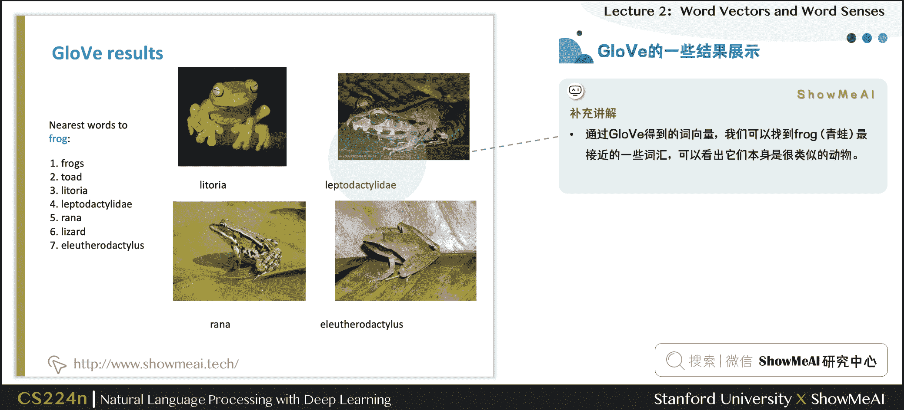

上图是一个 GloVe 词向量示例，我们通过 GloVe 得到的词向量，我们可以找到 frog（青蛙）最接近的一些词汇，可以看出它们本身是很类似的动物。

# 5.词向量评估

## 5.1 如何评估词向量？

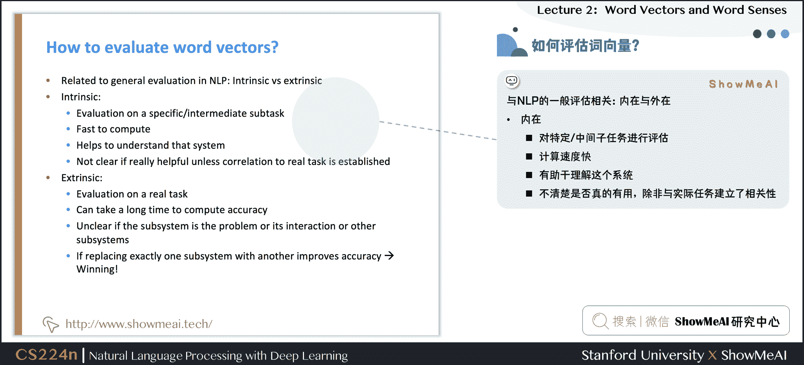

我们如何评估词向量呢，有内在和外在两种方式：

*   **内在评估方式**

    *   对特定/中间子任务进行评估
    *   计算速度快
    *   有助于理解这个系统
    *   不清楚是否真的有用，除非与实际任务建立了相关性
*   **外部任务方式**

    *   对真实任务（如下游 NLP 任务）的评估
    *   计算精确度可能需要很长时间
    *   不清楚子系统问题所在，是交互还是其他子系统问题
    *   如果用另一个子系统替换一个子系统可以提高精确度

## 5.2 内在词向量评估

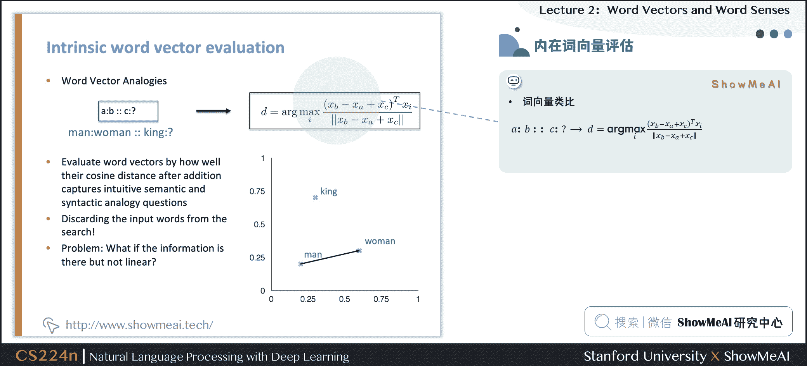

一种内在词向量评估方式是「**词向量类比**」：对于具备某种关系的词对 a,b，在给定词 c 的情况下，找到具备类似关系的词 d

a : b : : c : ? → d = arg ⁡ max ⁡ i ( x b − x a + x c ) T x i ∥ x b − x a + x c ∥ a: b::c:? \to d=\arg \max _{i} \frac{(x_b-x_a+x_c)^{T} x_i}{\left \| x_b-x_a+x_c \right \| } a:b::c:?→d=argimax​∥xb​−xa​+xc​∥(xb​−xa​+xc​)Txi​​

*   通过加法后的余弦距离是否能很好地捕捉到直观的语义和句法类比问题来评估单词向量
*   从搜索中丢弃输入的单词
*   问题:如果有信息但不是线性的怎么办？

## 5.3 Glove 可视化效果

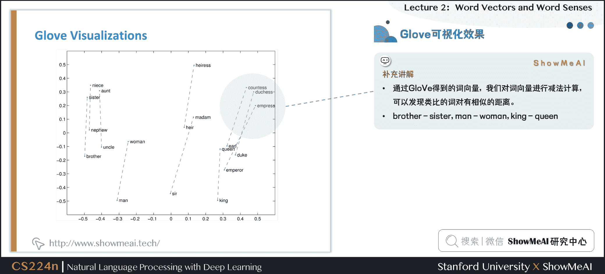

上述为 GloVe 得到的词向量空间分布，我们对词向量进行减法计算，可以发现类比的词对有相似的距离。

brother – sister, man – woman, king - queen

下图为“**公司与 CEO 词汇**”分布

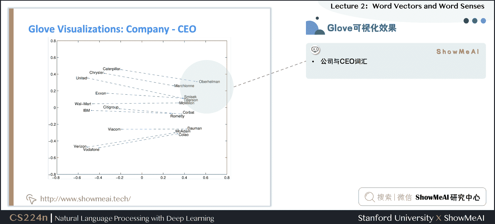

下图为“**词汇比较级与最高级**”分布

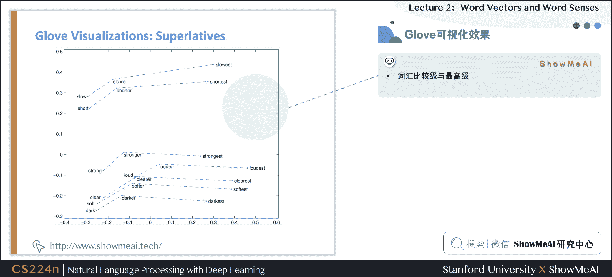

## 5.4 内在词向量评估的细节

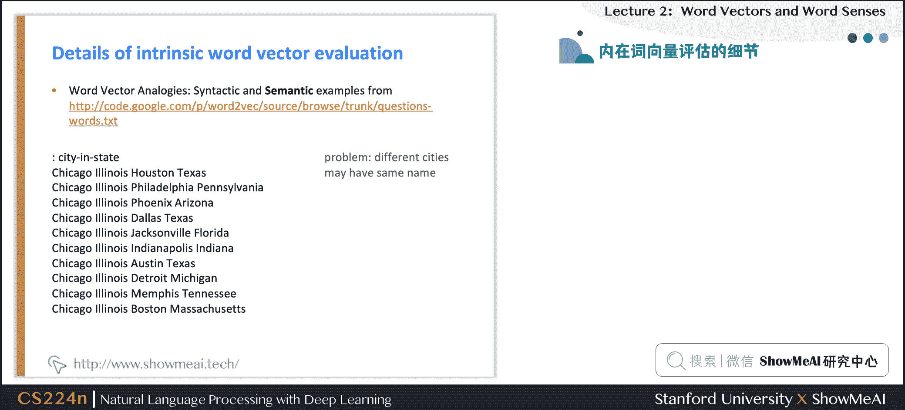

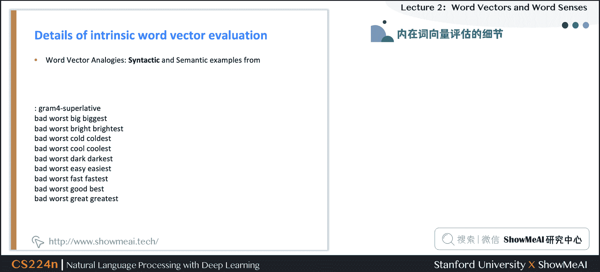

## 5.5 类比任务评估与超参数

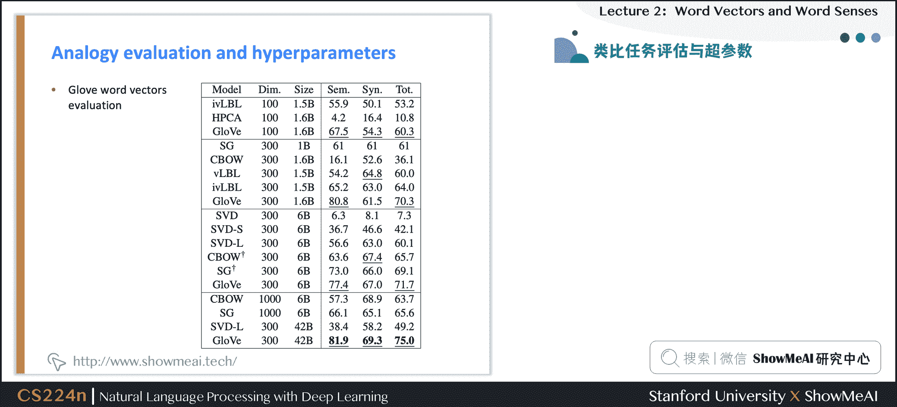

下图是对于类比评估和超参数的一些实验和经验

*   300 是一个很好的词向量维度
*   不对称上下文(只使用单侧的单词)不是很好，不过这点在下游任务中不一定完全正确
*   window size 设为 8 对 Glove 向量来说比较好

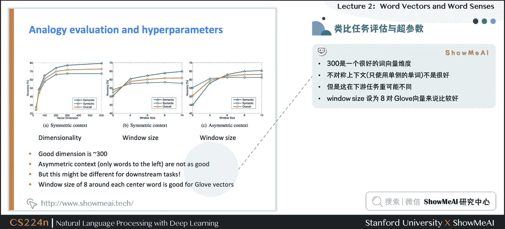

**补充分析**

*   window size 设为 2 的时候实际上有效的，并且对于句法分析是更好的，因为句法效果非常局部

## 5.6 #论文讲解#

1）On the Dimensionality of Word Embedding

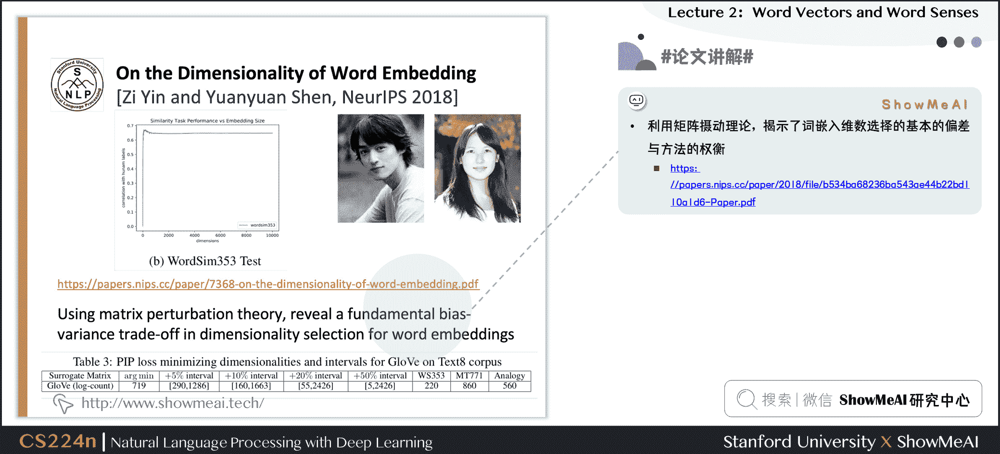

利用矩阵摄动理论，揭示了词嵌入维数选择的基本的偏差与方法的权衡

*   https：//papers.nips.cc/paper/2018/file/b534ba68236ba543ae44b22bd110a1d6-Paper.pdf

**补充说明**：当持续增大词向量维度的时候，词向量的效果不会一直变差并且会保持平稳。

## 5.7 类比任务评估与超参数

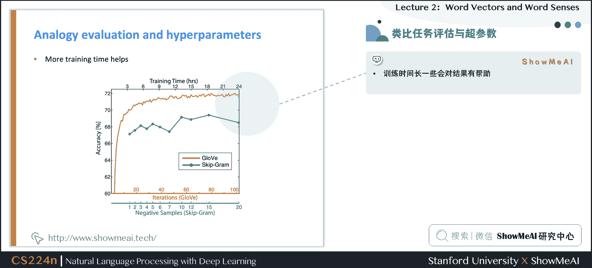

*   训练时间长一些会对结果有帮助

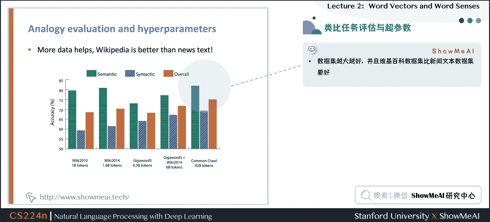

*   数据集越大越好，并且维基百科数据集比新闻文本数据集要好

**补充分析**

*   因为维基百科就是在解释概念以及他们之间的相互关联，更多的说明性文本显示了事物之间的所有联系
*   而新闻并不去解释，而只是去阐述一些事件

## 5.8 另一个内在词向量评估

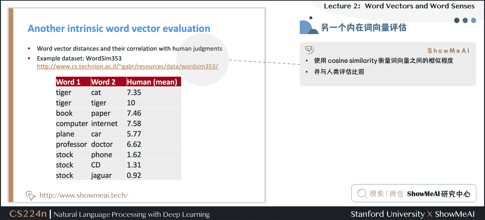

*   使用 cosine similarity 衡量词向量之间的相似程度
*   并与人类评估比照

## 5.9 最接近 Sweden 的一些单词

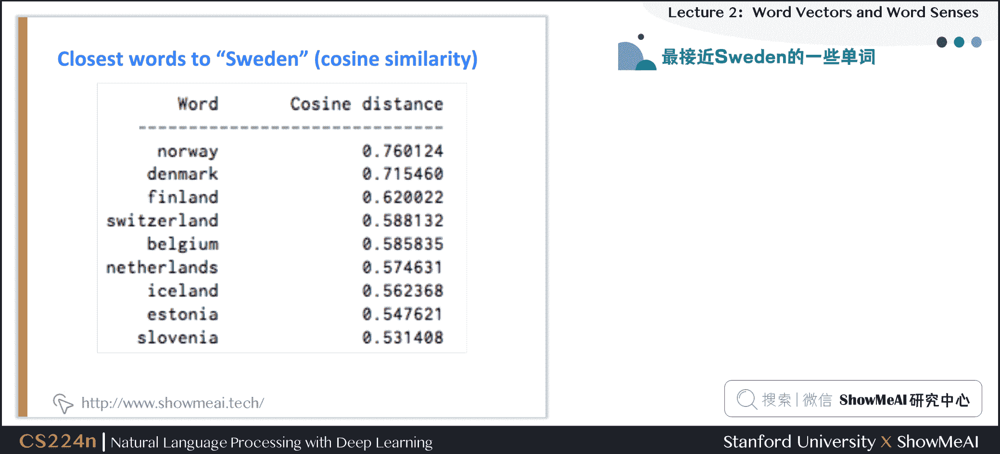

## 5.10 相关性评估

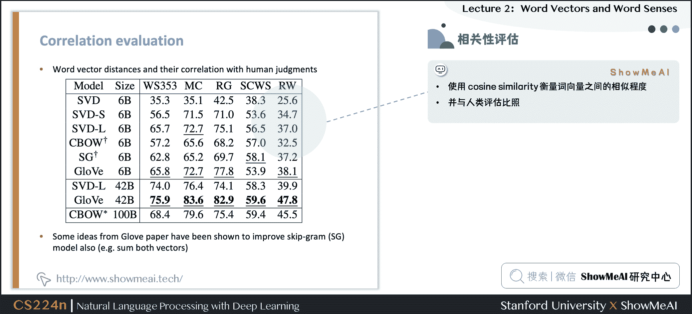

*   使用 cosine similarity 衡量词向量之间的相似程度
*   并与人类评估比照

# 6.word senses

## 6.1 词义与词义歧义

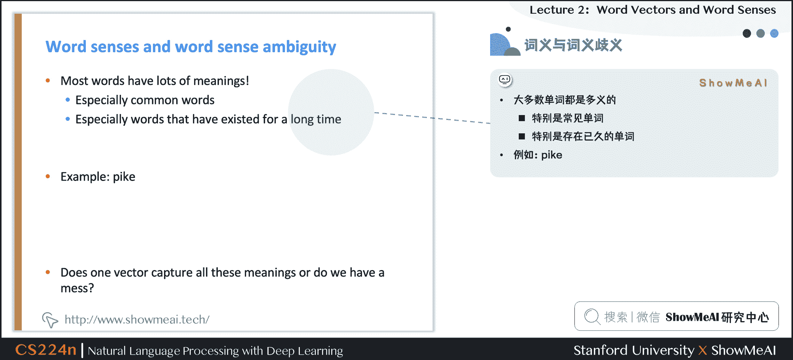

大多数单词都是多义的

*   特别是常见单词
*   特别是存在已久的单词

例如：pike

那么，词向量是总体捕捉了所有这些信息，还是杂乱在一起了呢？

## 6.2 pike 的不同含义示例

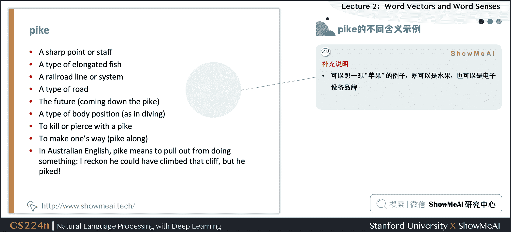

**补充说明**：可以想一想“苹果”的例子，既可以是水果，也可以是电子设备品牌。

## 6.3 #论文讲解#

### 1）Improving Word Representations Via Global Context And Multiple Word Prototypes (Huang et al. 2012)

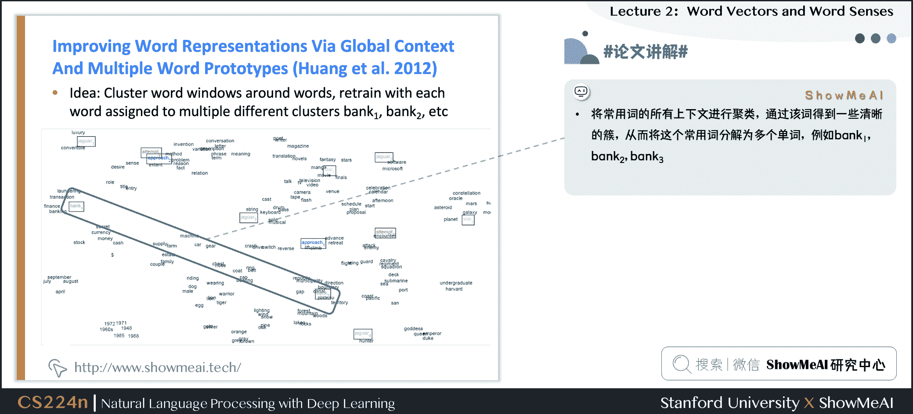

将常用词的所有上下文进行聚类，通过该词得到一些清晰的簇，从而将这个常用词分解为多个单词，例如 b a n k 1 bank_1 bank1​ 、 b a n k 2 bank_2 bank2​ 、 b a n k 3 bank_3 bank3​ 。

**补充说明**：虽然这很粗糙，并且有时 sensors 之间的划分也不是很明确，甚至相互重叠。

### 2）Linear Algebraic Structure of Word Senses, with Applications to Polysemy

*   单词在标准单词嵌入(如 word2vec)中的不同含义以线性叠加(加权和)的形式存在

v p i k e = α 1 v p i k e 1 + α 2 v p i k e 2 + α 3 v p i k e 3 v_{{pike }}=\alpha_1 v_{{pike}_1}+\alpha_2 v_{{pike}_2}+\alpha_3 v_{{pike}_3} vpike​=α1​vpike1​​+α2​vpike2​​+α3​vpike3​​

*   其中， α 1 = f 1 f 1 + f 2 + f 3 \alpha_1=\frac{f_1}{f_1+f_2+f_3} α1​=f1​+f2​+f3​f1​​

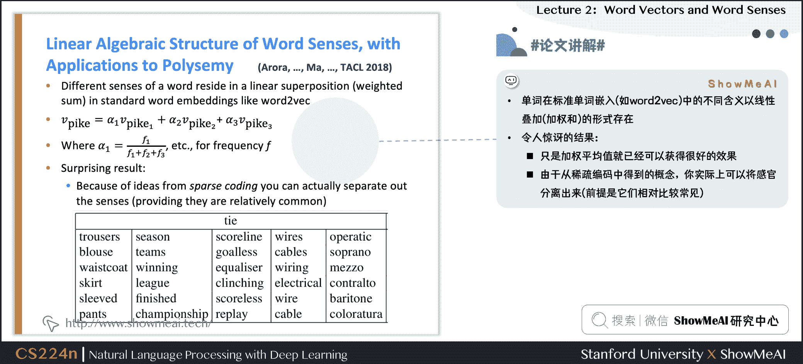

令人惊讶的结果：

*   只是加权平均值就已经可以获得很好的效果
*   由于从稀疏编码中得到的概念，你实际上可以将感官分离出来(前提是它们相对比较常见)

**补充讲解**：可以理解为由于单词存在于高维的向量空间之中，不同的纬度所包含的含义是不同的，所以加权平均值并不会损害单词在不同含义所属的纬度上存储的信息。

## 6.4 外向词向量评估

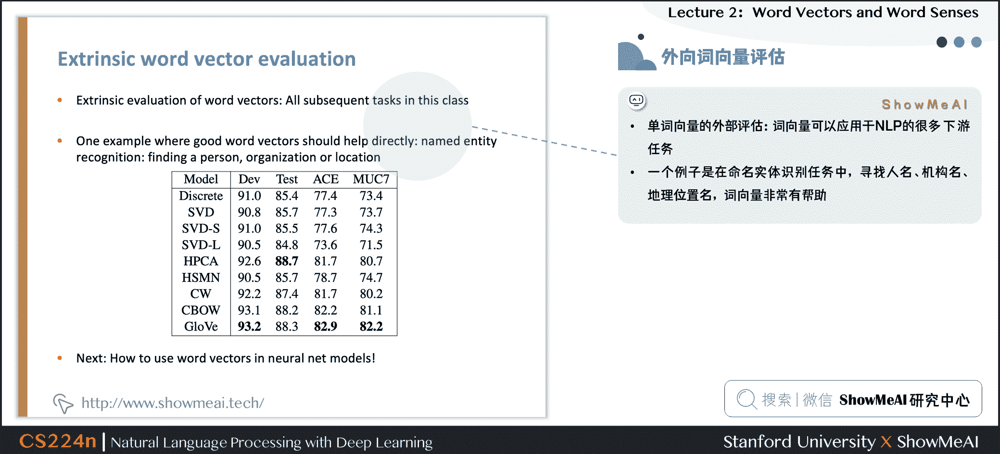

*   单词向量的外部评估：词向量可以应用于 NLP 的很多下游任务
*   一个例子是在命名实体识别任务中，寻找人名、机构名、地理位置名，词向量非常有帮助

# 7.视频教程

可以点击 [B 站](https://www.bilibili.com/video/BV1Yo4y1D7FW?p=2) 查看视频的【双语字幕】版本

[`player.bilibili.com/player.html?aid=376755412&page=2`](https://player.bilibili.com/player.html?aid=376755412&page=2)

【双语字幕+资料下载】斯坦福 CS224n | 深度学习与自然语言处理(2019·全 20 讲)

# 8.参考资料

*   [本讲带学的**在线阅翻页本**](https://blog.showmeai.tech/cs224n/lecture02-Word-Vectors-2-and-Word-Senses#/)
*   [《斯坦福 CS224n 深度学习与自然语言处理》**课程学习指南**](https://blog.showmeai.tech/cs224n/)
*   [《斯坦福 CS224n 深度学习与自然语言处理》**课程大作业解析**](https://github.com/ShowMeAI-Hub/awesome-AI-courses-notes-cheatsheets/tree/main/CS224n-Natural-Language-Processing-with-Deep-Learning/assignment-solutions)
*   [【**双语字幕视频**】斯坦福 CS224n | 深度学习与自然语言处理(2019·全 20 讲)](https://www.bilibili.com/video/BV1Yo4y1D7FW)
*   [**Stanford 官网** | CS224n: Natural Language Processing with Deep Learning](https://web.stanford.edu/class/archive/cs/cs224n/cs224n.1194/)

# [**ShowMeAI**](http://www.showmeai.tech)系列教程推荐

*   [大厂技术实现 | 推荐与广告计算解决方案](http://www.showmeai.tech/tutorials/50)
*   [大厂技术实现 | 计算机视觉解决方案](http://www.showmeai.tech/tutorials/51)
*   [大厂技术实现 | 自然语言处理行业解决方案](http://www.showmeai.tech/tutorials/52)
*   [图解 Python 编程：从入门到精通系列教程](http://www.showmeai.tech/tutorials/56)
*   [图解数据分析：从入门到精通系列教程](http://www.showmeai.tech/tutorials/33)
*   [图解 AI 数学基础：从入门到精通系列教程](http://www.showmeai.tech/tutorials/83)
*   [图解大数据技术：从入门到精通系列教程](http://www.showmeai.tech/tutorials/84)
*   [图解机器学习算法：从入门到精通系列教程](http://www.showmeai.tech/tutorials/34)
*   [机器学习实战：手把手教你玩转机器学习系列](http://www.showmeai.tech/tutorials/41)
*   [深度学习教程 | 吴恩达专项课程 · 全套笔记解读](http://www.showmeai.tech/tutorials/35)
*   [自然语言处理教程 | 斯坦福 CS224n 课程 · 课程带学与全套笔记解读](http://www.showmeai.tech/tutorials/36)

# NLP 系列教程文章

*   [NLP 教程(1)- 词向量、SVD 分解与 Word2vec](http://showmeai.tech/article-detail/230)
*   [NLP 教程(2)- GloVe 及词向量的训练与评估](http://showmeai.tech/article-detail/232)
*   [NLP 教程(3)- 神经网络与反向传播](http://showmeai.tech/article-detail/234)
*   [NLP 教程(4)- 句法分析与依存解析](http://www.showmeai.tech/article-detail/237)
*   [NLP 教程(5)- 语言模型、RNN、GRU 与 LSTM](http://www.showmeai.tech/article-detail/239)
*   [NLP 教程(6)- 神经机器翻译、seq2seq 与注意力机制](http://www.showmeai.tech/article-detail/242)
*   [NLP 教程(7)- 问答系统](http://www.showmeai.tech/article-detail/245)
*   [NLP 教程(8)- NLP 中的卷积神经网络](http://www.showmeai.tech/article-detail/247)
*   [NLP 教程(9)- 句法分析与树形递归神经网络](http://www.showmeai.tech/article-detail/255)

# 斯坦福 CS224n 课程带学详解

*   [斯坦福 NLP 课程 | 第 1 讲 - NLP 介绍与词向量初步](http://showmeai.tech/article-detail/231)
*   [斯坦福 NLP 课程 | 第 2 讲 - 词向量进阶](http://showmeai.tech/article-detail/233)
*   [斯坦福 NLP 课程 | 第 3 讲 - 神经网络知识回顾](http://showmeai.tech/article-detail/235)
*   [斯坦福 NLP 课程 | 第 4 讲 - 神经网络反向传播与计算图](http://showmeai.tech/article-detail/236)
*   [斯坦福 NLP 课程 | 第 5 讲 - 句法分析与依存解析](http://www.showmeai.tech/article-detail/238)
*   [斯坦福 NLP 课程 | 第 6 讲 - 循环神经网络与语言模型](http://www.showmeai.tech/article-detail/240)
*   [斯坦福 NLP 课程 | 第 7 讲 - 梯度消失问题与 RNN 变种](http://www.showmeai.tech/article-detail/241)
*   [斯坦福 NLP 课程 | 第 8 讲 - 机器翻译、seq2seq 与注意力机制](http://www.showmeai.tech/article-detail/243)
*   [斯坦福 NLP 课程 | 第 9 讲 - cs224n 课程大项目实用技巧与经验](http://www.showmeai.tech/article-detail/244)
*   [斯坦福 NLP 课程 | 第 10 讲 - NLP 中的问答系统](http://www.showmeai.tech/article-detail/246)
*   [斯坦福 NLP 课程 | 第 11 讲 - NLP 中的卷积神经网络](http://www.showmeai.tech/article-detail/248)
*   [斯坦福 NLP 课程 | 第 12 讲 - 子词模型](http://www.showmeai.tech/article-detail/249)
*   [斯坦福 NLP 课程 | 第 13 讲 - 基于上下文的表征与 NLP 预训练模型](http://www.showmeai.tech/article-detail/250)
*   [斯坦福 NLP 课程 | 第 14 讲 - Transformers 自注意力与生成模型](http://www.showmeai.tech/article-detail/251)
*   [斯坦福 NLP 课程 | 第 15 讲 - NLP 文本生成任务](http://www.showmeai.tech/article-detail/252)
*   [斯坦福 NLP 课程 | 第 16 讲 - 指代消解问题与神经网络方法](http://www.showmeai.tech/article-detail/253)
*   [斯坦福 NLP 课程 | 第 17 讲 - 多任务学习(以问答系统为例)](http://www.showmeai.tech/article-detail/254)
*   [斯坦福 NLP 课程 | 第 18 讲 - 句法分析与树形递归神经网络](http://www.showmeai.tech/article-detail/256)
*   [斯坦福 NLP 课程 | 第 19 讲 - AI 安全偏见与公平](http://www.showmeai.tech/article-detail/257)
*   [斯坦福 NLP 课程 | 第 20 讲 - NLP 与深度学习的未来](http://www.showmeai.tech/article-detail/258)

