# 斯坦福 NLP 课程 | 第 3 讲 - 神经网络知识回顾

> 原文：[`blog.csdn.net/ShowMeAI/article/details/124494181`](https://blog.csdn.net/ShowMeAI/article/details/124494181)

作者：[韩信子](https://github.com/HanXinzi-AI)@[ShowMeAI](http://www.showmeai.tech/)，路遥@[ShowMeAI](http://www.showmeai.tech/)，奇异果@[ShowMeAI](http://www.showmeai.tech/)
[教程地址](http://www.showmeai.tech/tutorials/36)：[`www.showmeai.tech/tutorials/36`](http://www.showmeai.tech/tutorials/36)
[本文地址](http://www.showmeai.tech/article-detail/235)：[`www.showmeai.tech/article-detail/235`](http://www.showmeai.tech/article-detail/235)
声明：版权所有，转载请联系平台与作者并注明出处

收藏[ShowMeAI](http://www.showmeai.tech/)查看更多精彩内容

[ShowMeAI](http://www.showmeai.tech/)为**斯坦福 CS224n**《自然语言处理与深度学习(Natural Language Processing with Deep Learning)》课程的全部课件，做了**中文翻译和注释**，并制作成了 GIF 动图！

本讲内容的**深度总结教程**可以在[**这里**](http://www.showmeai.tech/article-detail/234) 查看。视频和课件等资料的获取方式见**文末**。

# 引言

CS224n 是顶级院校斯坦福出品的深度学习与自然语言处理方向专业课程。核心内容覆盖 RNN、LSTM、CNN、transformer、bert、问答、摘要、文本生成、语言模型、阅读理解等前沿内容。

本篇是[ShowMeAI](http://www.showmeai.tech/)对第 3 课的内容梳理，内容主要是对神经网络知识回顾，会基于 NLP 的场景做一点结合讲解。

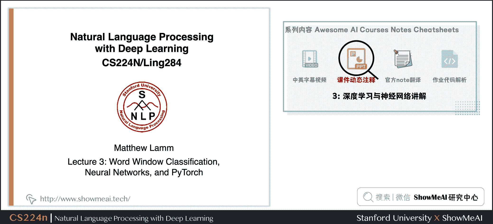

## 本篇内容覆盖

*   神经网络基础
*   命名实体识别
*   基于窗口数据的预测
*   基于 pytorch 实现的分类器

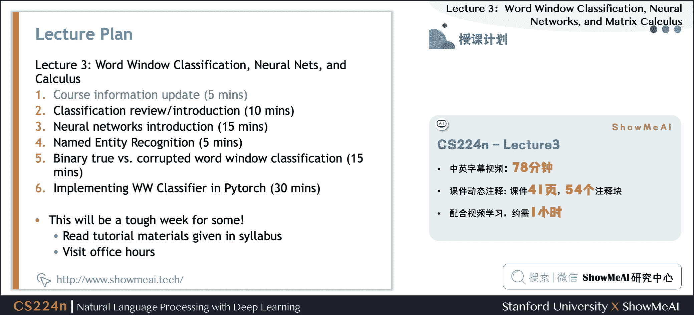

# 1\. 神经网络基础

## 1.1 分类问题基础

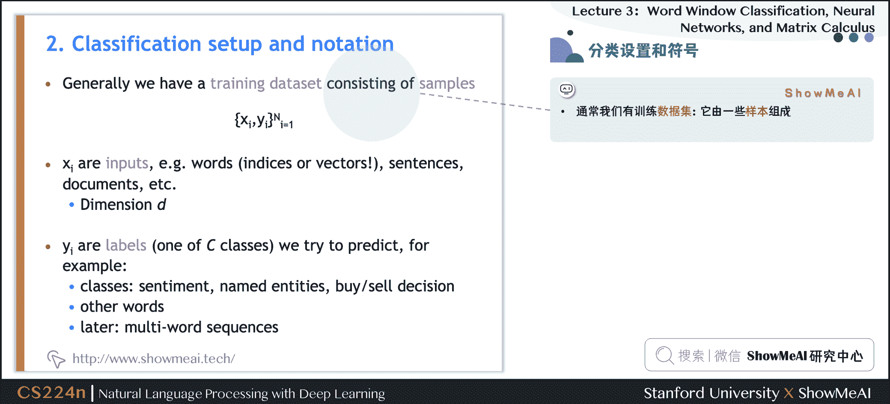

对于分类问题，我们有训练数据集：它由一些样本组成 { x i , y i } i = 1 N \{x_i, y_i\}_{i=1}^{N} {xi​,yi​}i=1N​

*   x i x_i xi​ 是输入，例如单词(索引或是向量)，句子，文档等等(维度为 d d d )

*   y i y_i yi​ 是我们尝试预测的标签( C C C 个类别中的一个)，例如：

*   类别：感情，命名实体，购买/售出的决定

*   其他单词

*   多词序列( 之后会提到)

## 1.2 分类问题直观理解

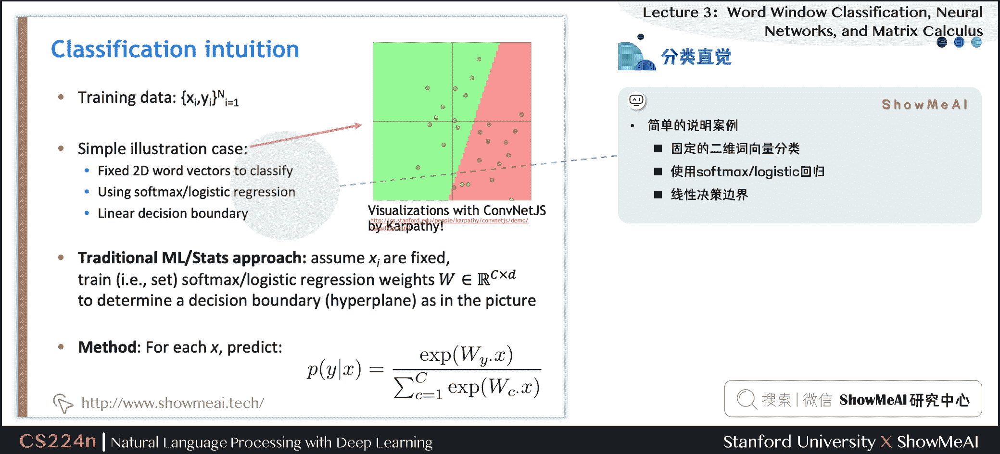

训练数据 { x i , y i } i = 1 N \{x_i, y_i\}_{i=1}^{N} {xi​,yi​}i=1N​ ，用一个最简单的 2 维词向量分类问题作为案例，使用 softmax / logistic 回归，构建线性决策边界

*   传统的机器学习/统计学方法：

假设 x i x_i xi​ 是固定的，训练 softmax/logistic 回归的权重 W ∈ R C × d W \in R^{C \times d} W∈RC×d 来决定决定边界(超平面)

预测阶段，对每个 x x x ，预测:

p ( y ∣ x ) = exp ⁡ ( W y ⋅ x ) ∑ c = 1 C exp ⁡ ( W c ⋅ x ) p(y \mid x)=\frac{\exp (W_y \cdot x)}{\sum_{c=1}^{C} \exp (W_c \cdot x)} p(y∣x)=∑c=1C​exp(Wc​⋅x)exp(Wy​⋅x)​

## 1.3 softmax 分类器的细节

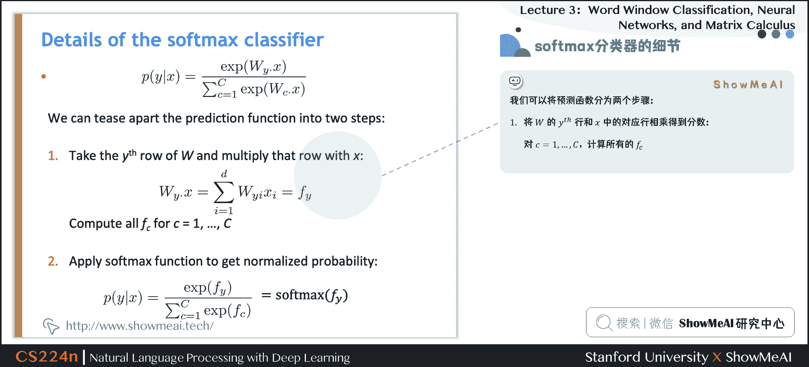

我们可以将预测函数分为两个步骤：

*   将 W W W 的 y t h y^{th} yth 行和 x x x 中的对应行相乘得到分数：

W y ⋅ x = ∑ i = 1 d W y i x i = f y W_{y} \cdot x=\sum_{i=1}^{d} W_{y i} x_{i}=f_{y} Wy​⋅x=i=1∑d​Wyi​xi​=fy​

*   对  c = 1 , ⋯   , C c=1, \cdots ,C c=1,⋯,C ，计算 f c f_c fc​

*   使用 softmax 函数获得归一化的概率：

p ( y ∣ x ) = exp ⁡ ( f y ) ∑ c = 1 C exp ⁡ ( f c ) = s o f t m a x ( f y ) p(y \mid x)=\frac{\exp (f_y)}{\sum_{c=1}^{C} \exp (f_c)}=softmax(f_y) p(y∣x)=∑c=1C​exp(fc​)exp(fy​)​=softmax(fy​)

## 1.4 softmax 和交叉熵损失

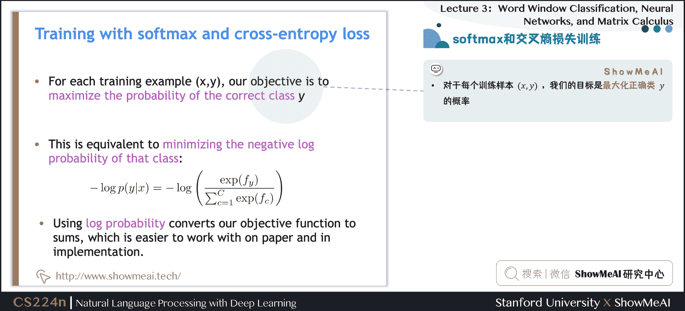

在 softmax 分类器中最常用到交叉熵损失，也是负对数概率形态。

对于每个训练样本 ( x , y ) (x,y) (x,y) ，我们的目标是最大化正确类 y y y 的概率，或者我们可以最小化该类的负对数概率

− log ⁡ p ( y ∣ x ) = − log ⁡ ( exp ⁡ ( f y ) ∑ c = 1 C exp ⁡ ( f c ) ) -\log p(y \mid x)=-\log (\frac{\exp(f_y)}{\sum_{c=1}^{C} \exp (f_c)}) −logp(y∣x)=−log(∑c=1C​exp(fc​)exp(fy​)​)

使用对数概率将我们的目标函数转换为求和形态，这更容易在推导和应用中使用。

## 1.5 交叉熵损失理解

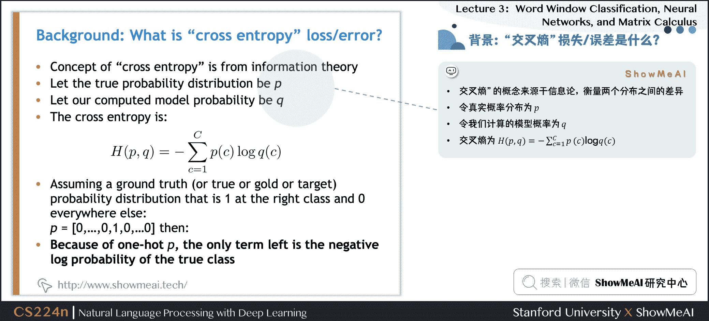

交叉熵的概念来源于信息论，衡量两个分布之间的差异

*   令真实概率分布为 p p p ，我们计算的模型概率分布为 q q q
*   交叉熵为

H ( p , q ) = − ∑ c = 1 C p ( c ) log ⁡ q ( c ) H(p, q)=-\sum_{c=1}^{C} p(c) \log q(c) H(p,q)=−c=1∑C​p(c)logq(c)

假设标准答案的概率分布是，在正确的类上为 1 1 1 ，在其他类别上为 0 0 0 ：

p = [ 0 , ⋯   , 0 , 1 , 0 , ⋯   , 0 ] p=[0, \cdots ,0,1,0, \cdots ,0] p=[0,⋯,0,1,0,⋯,0]

因为 p p p 是独热向量，所以唯一剩下的项是真实类的负对数概率。

## 1.6 完整数据集上的分类

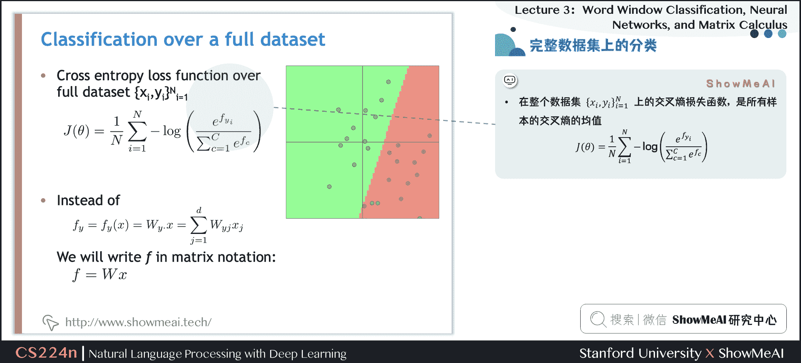

在整个数据集 { x i , y i } ( i = 1 ) N \{x_i , y_i \}_{(i=1)}^N {xi​,yi​}(i=1)N​ 上的交叉熵损失函数，是所有样本的交叉熵的均值

J ( θ ) = 1 N ∑ i = 1 N − log ⁡ ( e f y i ∑ c = 1 C e f c ) J(\theta)=\frac{1}{N} \sum_{i=1}^{N}-\log \left(\frac{e^{f_{y_{i}}}}{\sum_{c=1}^{C} e^{f_{c}}}\right) J(θ)=N1​i=1∑N​−log(∑c=1C​efc​efyi​​​)

不使用 f y = f y ( x ) = W y ⋅ x = ∑ j = 1 d W y j x j f_y=f_y(x)=W_y \cdot x=\sum_{j=1}^{d} W_{yj} x_j fy​=fy​(x)=Wy​⋅x=∑j=1d​Wyj​xj​ ，而是使用向量化的形态，基于矩阵来表示 f : f = W x f:f=Wx f:f=Wx 。

## 1.7 传统的机器学习优化算法

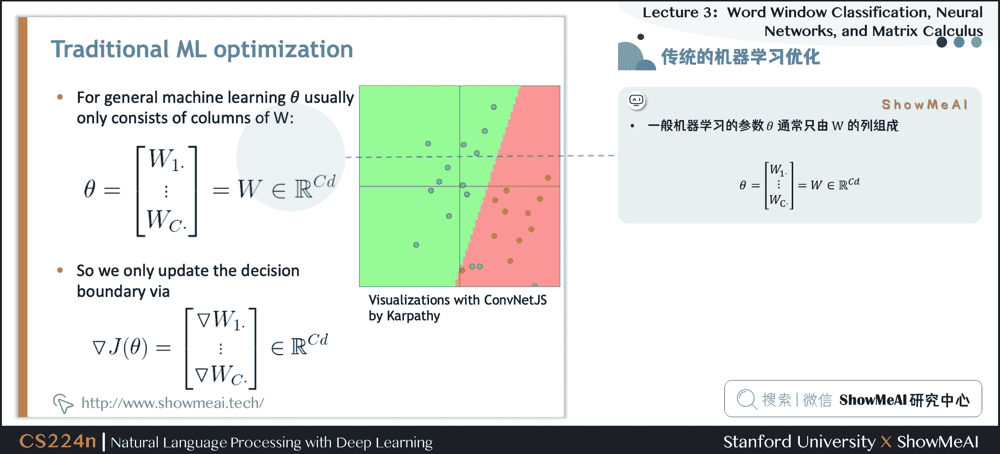

对于传统的机器学习算法（如逻辑回归）来说，一般机器学习的参数 θ \theta θ 通常只由 W W W 的列组成

θ = [ W ⋅ 1 ⋮ W ⋅ d ] = W ( : ) ∈ R C d \theta=\left[\begin{array}{c}{W_{\cdot 1}} \\ {\vdots} \\ {W_{\cdot d}}\end{array}\right]=W( :) \in \mathbb{R}^{C d} θ=⎣⎢⎡​W⋅1​⋮W⋅d​​⎦⎥⎤​=W(:)∈RCd

因此，我们只通过以下方式更新决策边界

∇ θ J ( θ ) = [ ∇ W 1 ⋮ ∇ W d ] ∈ R C d \nabla_{\theta} J(\theta)=\left[\begin{array}{c}{\nabla_{W_{1}}} \\ {\vdots} \\ {\nabla_{W_{d}}}\end{array}\right] \in \mathbb{R}^{C d} ∇θ​J(θ)=⎣⎢⎡​∇W1​​⋮∇Wd​​​⎦⎥⎤​∈RCd

## 1.8 神经网络分类器

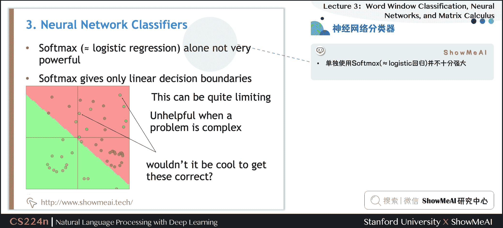

*   单独使用线性分类器 Softmax( ≈ logistic 回归)并不十分强大

*   如上图所示，Softmax 得到的是线性决策边界

    *   对于复杂问题来说，它的表达能力是有限的
    *   有一些分错的点，需要更强的非线性表达能力来区分

## 1.9 神经网络非线性切分

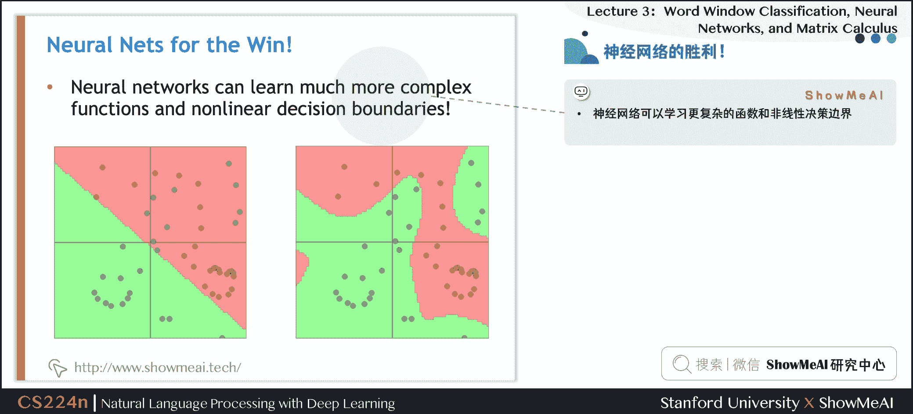

*   神经网络可以学习更复杂的函数和非线性决策边界

*   tip ：更高级的分类需要

    *   词向量
    *   更深层次的深层神经网络

## 1.10 基于词向量的分类差异

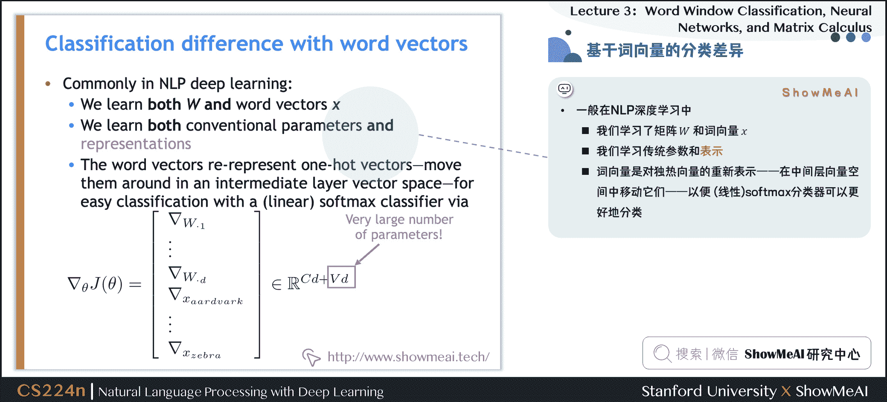

*   一般在 NLP 深度学习中：

    *   我们学习了矩阵 W W W 和词向量 x x x 。
    *   我们学习传统参数和表示。
    *   词向量是对独热向量的重新表示——在中间层向量空间中移动它们——以便 (线性)softmax 分类器可以更好地分类。
*   即将词向量理解为一层神经网络，输入单词的独热向量并获得单词的词向量表示，并且我们需要对其进行更新。

∇ θ J ( θ ) = [ ∇ W 1 ⋮ ∇ W d a r d v a r k ⋮ ∇ x z e b r a ] ∈ R C d + V d \nabla_{\theta} J(\theta)=\left[\begin{array}{c}{\nabla_{W_{1}}} \\ {\vdots} \\ {\nabla_{W_{d a r d v a r k}}} \\ {\vdots} \\ {\nabla_{x_{z e b r a}}}\end{array}\right] \in \mathbb{R}^{C d + V d} ∇θ​J(θ)=⎣⎢⎢⎢⎢⎢⎢⎡​∇W1​​⋮∇Wdardvark​​⋮∇xzebra​​​⎦⎥⎥⎥⎥⎥⎥⎤​∈RCd+Vd

*   其中， V d Vd Vd 是数量很大的参数。

## 1.11 神经计算

*   An artificial neuron

    *   神经网络有自己的术语包
    *   但如果你了解 softmax 模型是如何工作的，那么你就可以很容易地理解神经元的操作
*   Neural computation：神经计算

*   Neural selectivity：神经选择性

*   Hierarchy of neural processing：神经处理层次

## 1.12 单个神经元：可视作二元逻辑回归单元

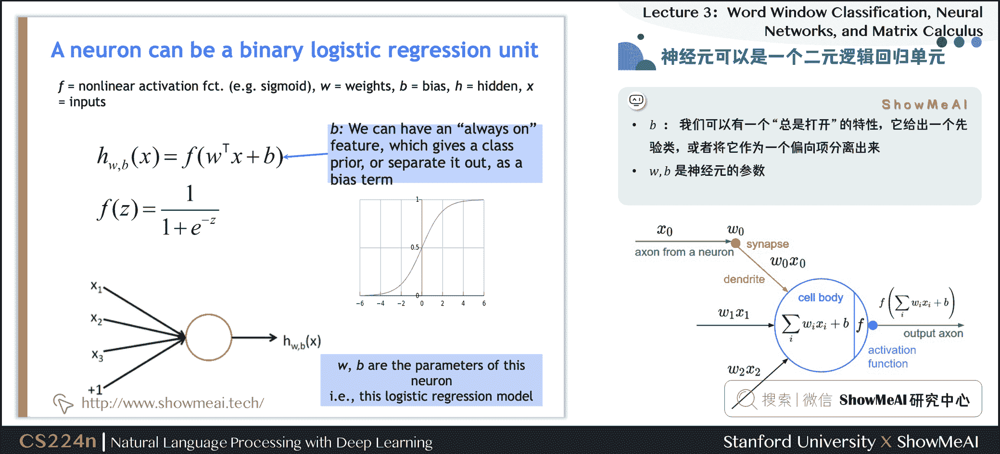

h w , b ( x ) = f ( w T x + b ) h_{w, b}(x)=f(w^{T}x+b) hw,b​(x)=f(wTx+b)

f ( z ) = 1 1 + e − z f(z)=\frac{1}{1+e^{-z}} f(z)=1+e−z1​

*   b b b ：我们可以有一个“总是打开”的特性，它给出一个先验类，或者将它作为一个偏向项分离出来。
*   w w w , b b b 是神经元的参数。

## 1.13 一个神经网络：多个逻辑回归组合

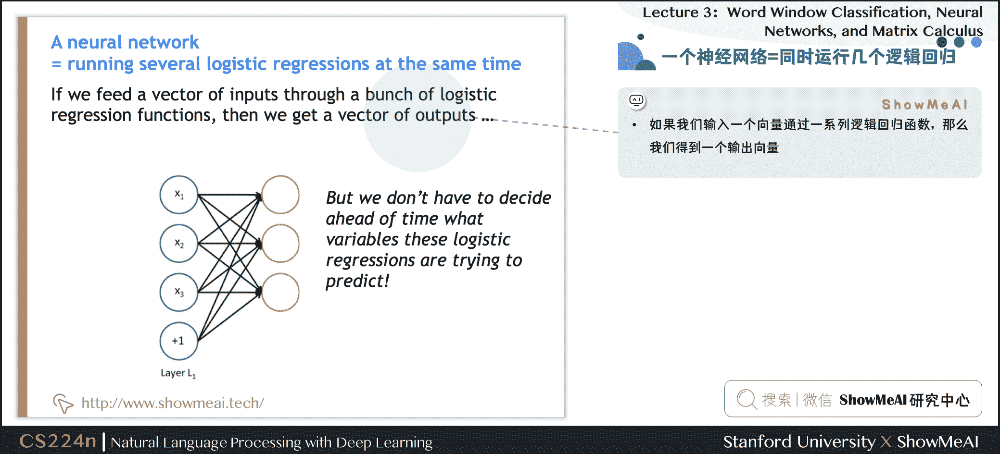

*   如果我们输入一个向量通过一系列逻辑回归函数，那么我们得到一个输出向量。
*   但是我们不需要提前决定这些逻辑回归试图预测的变量是什么。

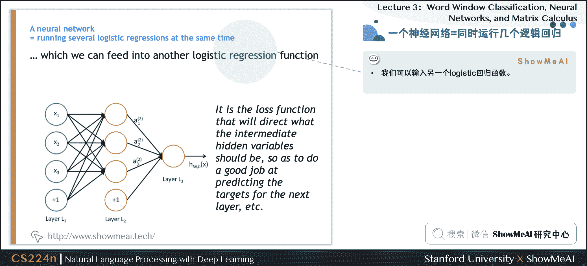

*   我们可以输入另一个 logistic 回归函数。
*   损失函数将指导中间隐藏变量应该是什么，以便更好地预测下一层的目标。

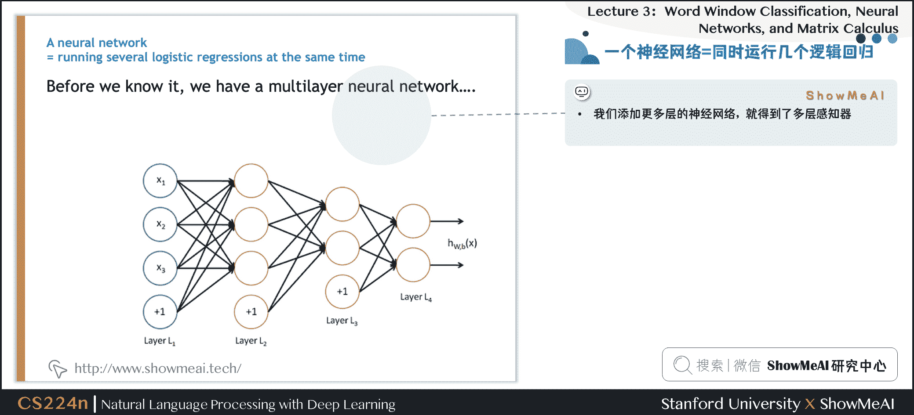

我们添加更多层的神经网络，就得到了多层感知器。

## 1.14 单层神经网络的矩阵形态表示

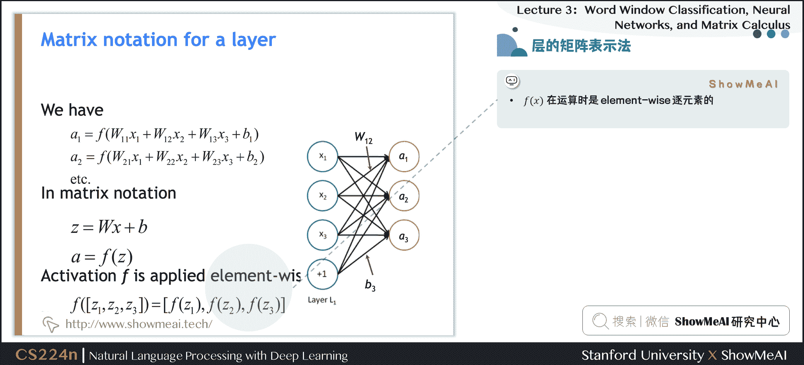

a 1 = f ( W 11 x 1 + W 12 x 2 + W 13 x 3 + b 1 ) a_{1}=f(W_{11} x_{1}+W_{12} x_{2}+W_{13} x_{3}+b_{1}) a1​=f(W11​x1​+W12​x2​+W13​x3​+b1​)

a 2 = f ( W 21 x 1 + W 22 x 2 + W 23 x 3 + b 2 ) a_{2}=f(W_{21} x_{1}+W_{22} x_{2}+W_{23} x_{3}+b_{2}) a2​=f(W21​x1​+W22​x2​+W23​x3​+b2​)

z = W x + b z=Wx+b z=Wx+b

a = f ( z ) a=f(z) a=f(z)

f ( [ z 1 , z 2 , z 3 ] ) = [ f ( z 1 ) , f ( z 2 ) , f ( z 3 ) ] f([z_{1}, z_{2}, z_{3}])=[f(z_{1}), f(z_{2}), f(z_{3})] f([z1​,z2​,z3​])=[f(z1​),f(z2​),f(z3​)]

*   f ( x ) f(x) f(x) 在运算时是 element-wise 逐元素的

## 1.15 非线性变换的必要性

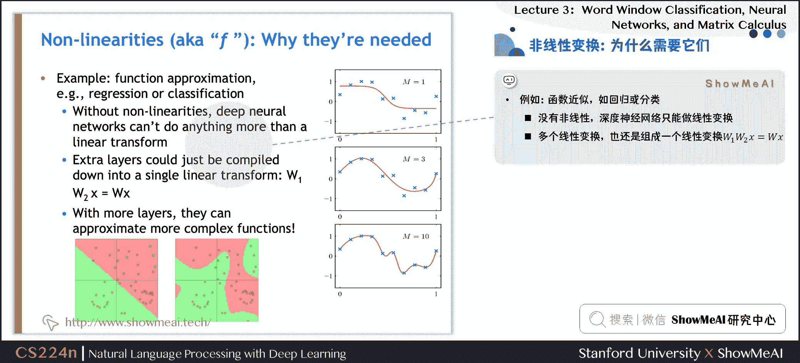

*   例如：函数近似，如回归或分类

    *   没有非线性，深度神经网络只能做线性变换
    *   多个线性变换，也还是组成一个线性变换 W 1 W 2 x = W x W_1 W_2 x=Wx W1​W2​x=Wx
*   因为线性变换是以某种方式旋转和拉伸空间，多次的旋转和拉伸可以融合为一次线性变换

*   对于非线性函数而言，使用更多的层，他们可以近似更复杂的函数

# 2.命名实体识别

## 2.1 命名实体识别(NER)

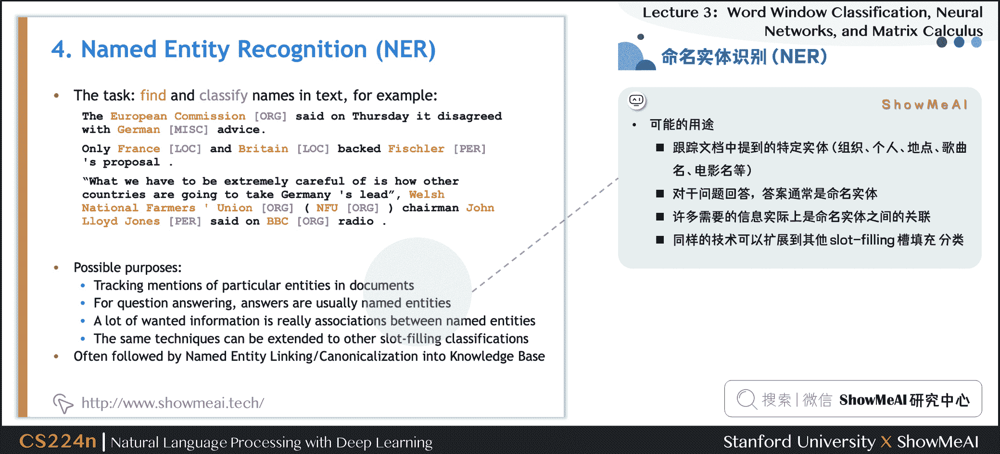

*   可能的用途

    *   跟踪文档中提到的特定实体(组织、个人、地点、歌曲名、电影名等)
    *   对于问题回答，答案通常是命名实体
    *   许多需要的信息实际上是命名实体之间的关联
    *   同样的技术可以扩展到其他 slot-filling 槽填充分类
*   通常后面是命名实体链接/规范化到知识库

## 2.2 句子中的命名实体识别

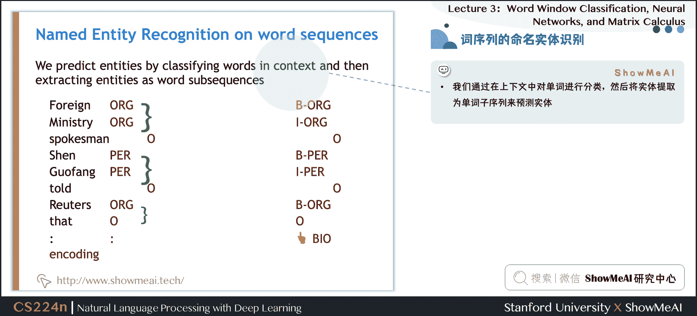

我们通过在上下文中对单词进行分类，然后将实体提取为单词子序列来预测实体。

## 2.3 NER 的难点

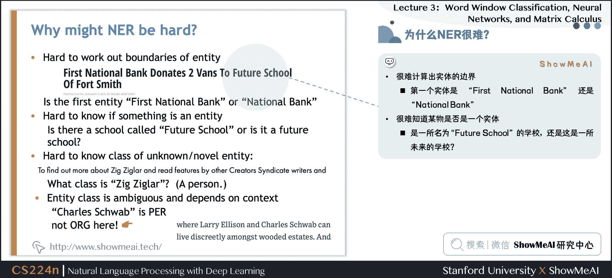

*   很难计算出实体的边界

    *   第一个实体是 “First National Bank” 还是 “National Bank”
*   很难知道某物是否是一个实体

    *   是一所名为“Future School” 的学校，还是这是一所未来的学校？
*   很难知道未知/新奇实体的类别

    *   “Zig Ziglar” ? 一个人
*   实体类是模糊的，依赖于上下文

    *   这里的“Charles Schwab” 是 PER 不是 ORG

# 3.基于窗口数据的分类预测

## 3.1\. 词-窗分类

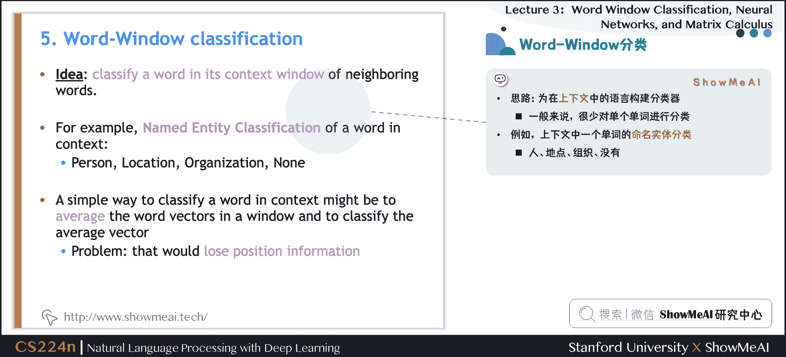

*   思路：为在上下文中的语言构建分类器

    *   一般来说，很少对单个单词进行分类
*   例如，上下文中一个单词的命名实体分类

    *   人、地点、组织、没有
*   在上下文中对单词进行分类的一个简单方法，可能是对窗口中的单词向量进行平均，并对平均向量进行分类

    *   问题：这会丢失位置信息

## 3.2 窗口分类器：softmax

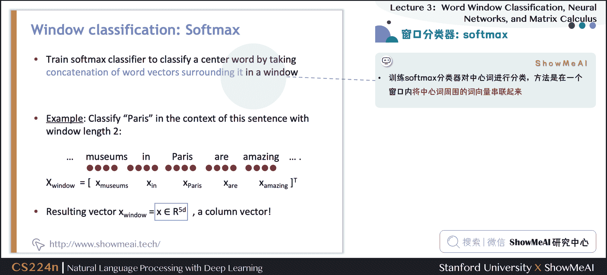

*   训练 softmax 分类器对中心词进行分类，方法是在一个窗口内将中心词周围的词向量串联起来

*   例子：在这句话的上下文中对“Paris”进行分类，窗口长度为 2

*   结果向量 x w i n d o w = x ∈ R 5 d x_{window}=x \in R^{5d} xwindow​=x∈R5d 是一个列向量

## 3.3 最简单的窗口分类器：Softmax

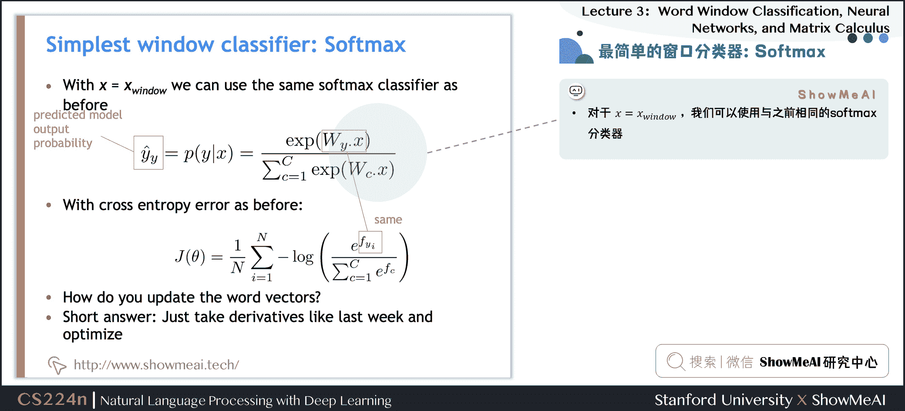

对于 x = x w i n d o w x=x_{window} x=xwindow​ ，我们可以使用与之前相同的 softmax 分类器

如何更新向量？

*   简而言之：就像之前讲的那样，求导和优化

## 3.4 稍微复杂一点：多层感知器

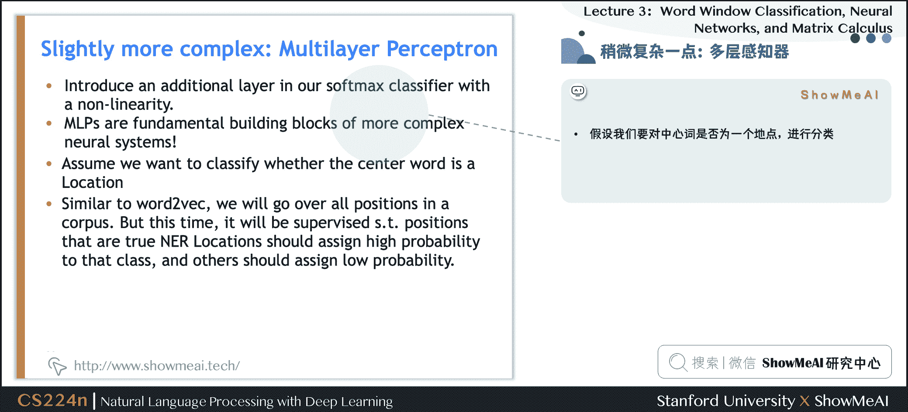

*   假设我们要对中心词是否为一个地点，进行分类

*   与 word2vec 类似，我们将遍历语料库中的所有位置。但这一次，它将受到监督，只有一些位置能够得到高分。

    *   例如，在他们的中心有一个实际的 NER Location 的位置是“真实的”位置会获得高分

## 3.5 神经网络前馈计算

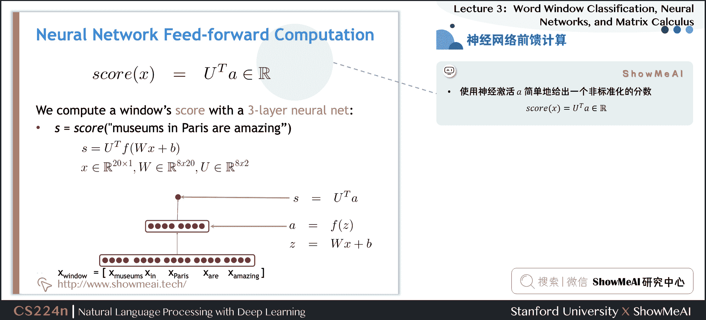

使用神经激活 a a a 简单地给出一个非标准化的分数

s c o r e ( x ) = U T a ∈ R score(x)=U^{T} a \in \mathbb{R} score(x)=UTa∈R

我们用一个三层神经网络计算一个窗口的得分

s = s c o r e ( " m u s e u m s   i n   P a r i s   a r e   a m a z i n g ” ) s = score("museums \ in \ Paris \ are \ amazing”) s=score("museums in Paris are amazing”)

s = U T f ( W x + b ) s=U^{T} f(W x+b) s=UTf(Wx+b)

*   x ∈ R 20 × 1 x \in \mathbb{R}^{20 \times 1} x∈R20×1
*   W ∈ R 8 × 20 W \in \mathbb{R}^{8 \times 20} W∈R8×20
*   U ∈ R 8 × 1 U \in \mathbb{R}^{8 \times 1} U∈R8×1

之前的例子

X w i n d o w = [ X m u s e u m s X i n X p a r i s X a r e X a m a z i n g ] X_{window} = [X_{museums} \quad X_{in} \quad X_{paris} \quad X_{are} \quad X_{amazing}] Xwindow​=[Xmuseums​Xin​Xparis​Xare​Xamazing​]

## 3.6 附加层

中间层学习输入词向量之间的非线性交互

X w i n d o w = [ X m u s e u m s X i n X p a r i s X a r e X a m a z i n g ] X_{window} = [X_{museums} \quad X_{in} \quad X_{paris} \quad X_{are} \quad X_{amazing}] Xwindow​=[Xmuseums​Xin​Xparis​Xare​Xamazing​]

例如：只有当“museum”是第一个向量时，“in”放在第二个位置才重要

# 4.基于 pytorch 实现的分类器

## 4.1 使用合页损失替换

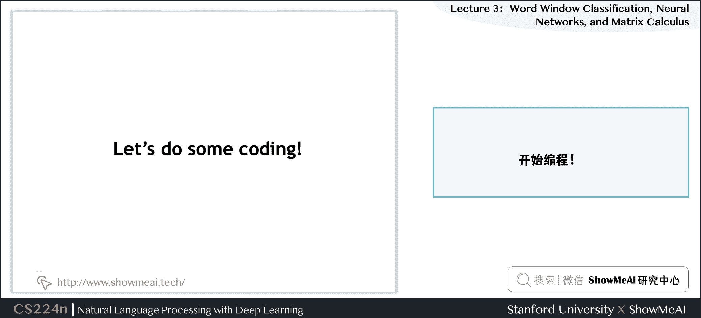

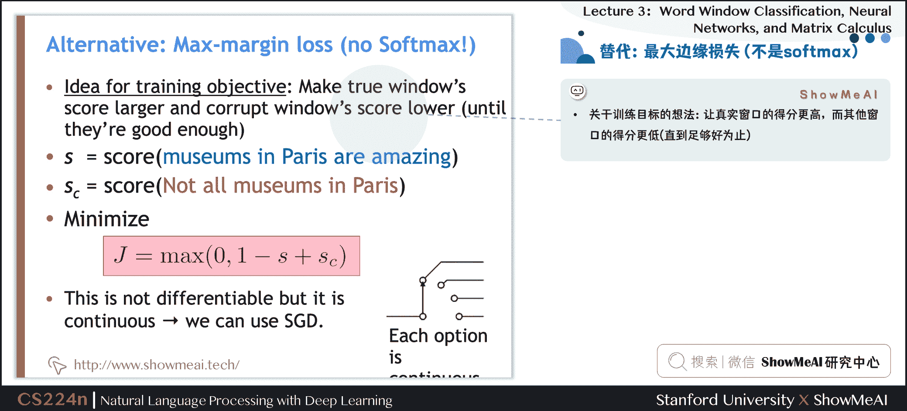

关于训练目标的想法：让真实窗口的得分更高，而其他窗口的得分更低(直到足够好为止)

s = s c o r e ( m u s e u m s i n P a r i s a r e a m a z i n g ) s = score(museums \quad in \quad Paris \quad are \quad amazing) s=score(museumsinParisareamazing)

s c = s c o r e ( N o t a l l m u s e u m s i n P a r i s ) s_c = score(Not \quad all \quad museums \quad in \quad Paris) sc​=score(NotallmuseumsinParis)

最小化： J = m a x ( 0 , 1 − s + s c ) J=max(0,1-s+s_c) J=max(0,1−s+sc​)

这是不可微的，但它是连续的 → 我们可以用 SGD

**补充解析**

*   单窗口的目标函数为 J = m a x ( 0 , 1 − s + s c ) J=max(0,1-s+s_c) J=max(0,1−s+sc​)
*   每个中心有 NER 位置的窗口的得分应该比中心没有位置的窗口高 1 分
*   要获得完整的目标函数：为每个真窗口采样几个损坏的窗口。对所有训练样本窗口求和
*   类似于 word2vec 中的负抽样

## 4.2 随机梯度下降

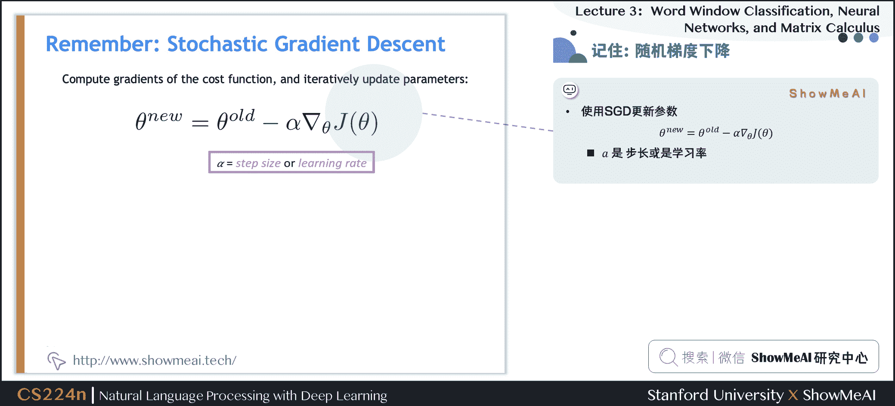使用 SGD 更新参数

θ n e w = θ o l d − α ∇ θ J ( θ ) \theta ^{new}= \theta ^{old}-\alpha \nabla_{\theta} J(\theta) θnew=θold−α∇θ​J(θ)

*   α \alpha α 是 步长或是学习率

## 4.3 课堂手推

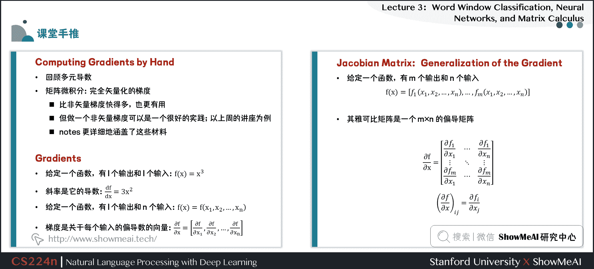

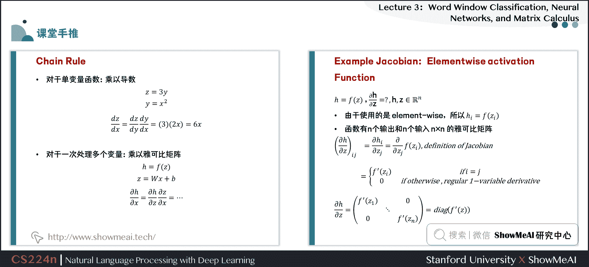

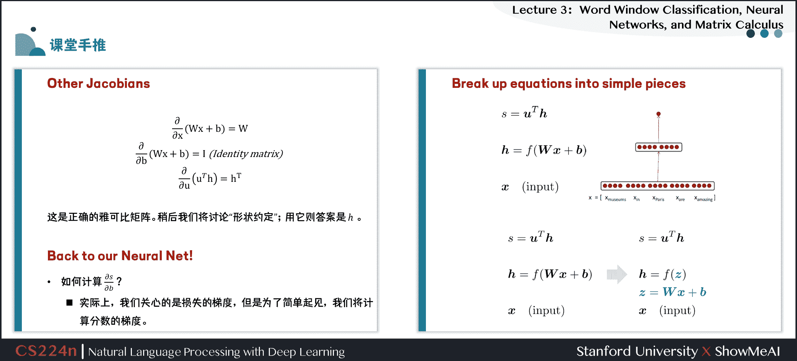

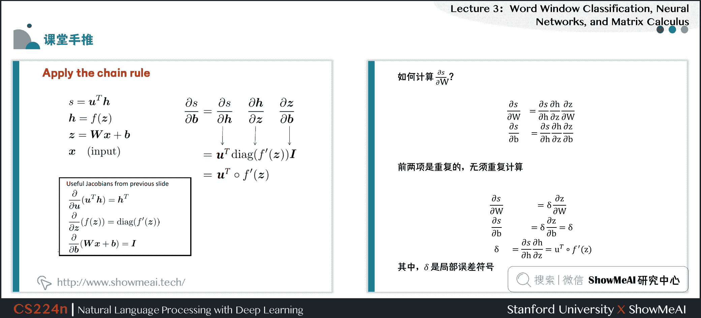

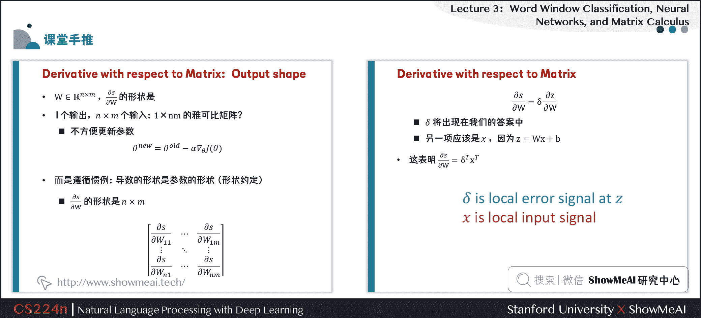

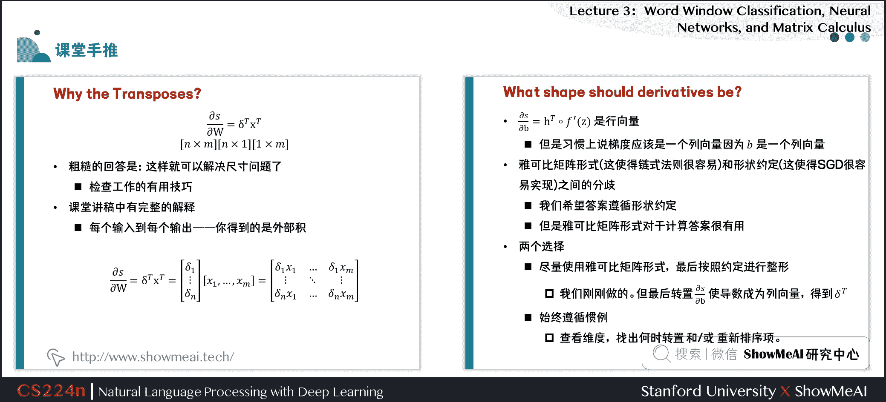

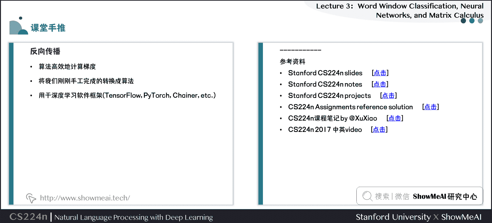

# 5.视频教程

可以点击 [**B 站**](https://www.bilibili.com/video/BV1Yo4y1D7FW?p=3) 查看视频的【双语字幕】版本

[`player.bilibili.com/player.html?aid=376755412&page=3`](https://player.bilibili.com/player.html?aid=376755412&page=3)

【双语字幕+资料下载】斯坦福 CS224n | 深度学习与自然语言处理(2019·全 20 讲)

# 6.参考资料

*   [本讲带学的**在线阅翻页本**](https://blog.showmeai.tech/cs224n/lecture03-Neural-Networks#/)
*   [《斯坦福 CS224n 深度学习与自然语言处理》**课程学习指南**](https://blog.showmeai.tech/cs224n/)
*   [《斯坦福 CS224n 深度学习与自然语言处理》**课程大作业解析**](https://github.com/ShowMeAI-Hub/awesome-AI-courses-notes-cheatsheets/tree/main/CS224n-Natural-Language-Processing-with-Deep-Learning/assignment-solutions)
*   [【**双语字幕视频**】斯坦福 CS224n | 深度学习与自然语言处理(2019·全 20 讲)](https://www.bilibili.com/video/BV1Yo4y1D7FW)
*   [**Stanford 官网** | CS224n: Natural Language Processing with Deep Learning](https://web.stanford.edu/class/archive/cs/cs224n/cs224n.1194/)

# [**ShowMeAI**](http://www.showmeai.tech)系列教程推荐

*   [大厂技术实现 | 推荐与广告计算解决方案](http://www.showmeai.tech/tutorials/50)
*   [大厂技术实现 | 计算机视觉解决方案](http://www.showmeai.tech/tutorials/51)
*   [大厂技术实现 | 自然语言处理行业解决方案](http://www.showmeai.tech/tutorials/52)
*   [图解 Python 编程：从入门到精通系列教程](http://www.showmeai.tech/tutorials/56)
*   [图解数据分析：从入门到精通系列教程](http://www.showmeai.tech/tutorials/33)
*   [图解 AI 数学基础：从入门到精通系列教程](http://www.showmeai.tech/tutorials/83)
*   [图解大数据技术：从入门到精通系列教程](http://www.showmeai.tech/tutorials/84)
*   [图解机器学习算法：从入门到精通系列教程](http://www.showmeai.tech/tutorials/34)
*   [机器学习实战：手把手教你玩转机器学习系列](http://www.showmeai.tech/tutorials/41)
*   [深度学习教程 | 吴恩达专项课程 · 全套笔记解读](http://www.showmeai.tech/tutorials/35)
*   [自然语言处理教程 | 斯坦福 CS224n 课程 · 课程带学与全套笔记解读](http://www.showmeai.tech/tutorials/36)

# NLP 系列教程文章

*   [NLP 教程(1)- 词向量、SVD 分解与 Word2vec](http://showmeai.tech/article-detail/230)
*   [NLP 教程(2)- GloVe 及词向量的训练与评估](http://showmeai.tech/article-detail/232)
*   [NLP 教程(3)- 神经网络与反向传播](http://showmeai.tech/article-detail/234)
*   [NLP 教程(4)- 句法分析与依存解析](http://www.showmeai.tech/article-detail/237)
*   [NLP 教程(5)- 语言模型、RNN、GRU 与 LSTM](http://www.showmeai.tech/article-detail/239)
*   [NLP 教程(6)- 神经机器翻译、seq2seq 与注意力机制](http://www.showmeai.tech/article-detail/242)
*   [NLP 教程(7)- 问答系统](http://www.showmeai.tech/article-detail/245)
*   [NLP 教程(8)- NLP 中的卷积神经网络](http://www.showmeai.tech/article-detail/247)
*   [NLP 教程(9)- 句法分析与树形递归神经网络](http://www.showmeai.tech/article-detail/255)

# 斯坦福 CS224n 课程带学详解

*   [斯坦福 NLP 课程 | 第 1 讲 - NLP 介绍与词向量初步](http://showmeai.tech/article-detail/231)
*   [斯坦福 NLP 课程 | 第 2 讲 - 词向量进阶](http://showmeai.tech/article-detail/233)
*   [斯坦福 NLP 课程 | 第 3 讲 - 神经网络知识回顾](http://showmeai.tech/article-detail/235)
*   [斯坦福 NLP 课程 | 第 4 讲 - 神经网络反向传播与计算图](http://showmeai.tech/article-detail/236)
*   [斯坦福 NLP 课程 | 第 5 讲 - 句法分析与依存解析](http://www.showmeai.tech/article-detail/238)
*   [斯坦福 NLP 课程 | 第 6 讲 - 循环神经网络与语言模型](http://www.showmeai.tech/article-detail/240)
*   [斯坦福 NLP 课程 | 第 7 讲 - 梯度消失问题与 RNN 变种](http://www.showmeai.tech/article-detail/241)
*   [斯坦福 NLP 课程 | 第 8 讲 - 机器翻译、seq2seq 与注意力机制](http://www.showmeai.tech/article-detail/243)
*   [斯坦福 NLP 课程 | 第 9 讲 - cs224n 课程大项目实用技巧与经验](http://www.showmeai.tech/article-detail/244)
*   [斯坦福 NLP 课程 | 第 10 讲 - NLP 中的问答系统](http://www.showmeai.tech/article-detail/246)
*   [斯坦福 NLP 课程 | 第 11 讲 - NLP 中的卷积神经网络](http://www.showmeai.tech/article-detail/248)
*   [斯坦福 NLP 课程 | 第 12 讲 - 子词模型](http://www.showmeai.tech/article-detail/249)
*   [斯坦福 NLP 课程 | 第 13 讲 - 基于上下文的表征与 NLP 预训练模型](http://www.showmeai.tech/article-detail/250)
*   [斯坦福 NLP 课程 | 第 14 讲 - Transformers 自注意力与生成模型](http://www.showmeai.tech/article-detail/251)
*   [斯坦福 NLP 课程 | 第 15 讲 - NLP 文本生成任务](http://www.showmeai.tech/article-detail/252)
*   [斯坦福 NLP 课程 | 第 16 讲 - 指代消解问题与神经网络方法](http://www.showmeai.tech/article-detail/253)
*   [斯坦福 NLP 课程 | 第 17 讲 - 多任务学习(以问答系统为例)](http://www.showmeai.tech/article-detail/254)
*   [斯坦福 NLP 课程 | 第 18 讲 - 句法分析与树形递归神经网络](http://www.showmeai.tech/article-detail/256)
*   [斯坦福 NLP 课程 | 第 19 讲 - AI 安全偏见与公平](http://www.showmeai.tech/article-detail/257)
*   [斯坦福 NLP 课程 | 第 20 讲 - NLP 与深度学习的未来](http://www.showmeai.tech/article-detail/258)

