# 斯坦福 NLP 课程 | 第 4 讲 - 神经网络反向传播与计算图

> 原文：[`blog.csdn.net/ShowMeAI/article/details/124501488`](https://blog.csdn.net/ShowMeAI/article/details/124501488)

作者：[韩信子](https://github.com/HanXinzi-AI)@[ShowMeAI](http://www.showmeai.tech/)，路遥@[ShowMeAI](http://www.showmeai.tech/)，奇异果@[ShowMeAI](http://www.showmeai.tech/)
[教程地址](http://www.showmeai.tech/tutorials/36)：[`www.showmeai.tech/tutorials/36`](http://www.showmeai.tech/tutorials/36)
[本文地址](http://www.showmeai.tech/article-detail/236)：[`www.showmeai.tech/article-detail/236`](http://www.showmeai.tech/article-detail/236)
声明：版权所有，转载请联系平台与作者并注明出处

收藏[ShowMeAI](http://www.showmeai.tech/)查看更多精彩内容

* * *

[ShowMeAI](http://www.showmeai.tech/)为**斯坦福 CS224n**《自然语言处理与深度学习(Natural Language Processing with Deep Learning)》课程的全部课件，做了**中文翻译和注释**，并制作成了 GIF 动图！

本讲内容的**深度总结教程**可以在[**这里**](http://www.showmeai.tech/article-detail/234) 查看。视频和课件等资料的获取方式见**文末**。

# 引言

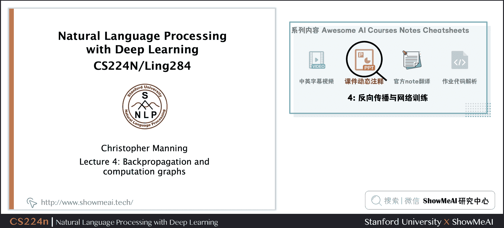

## 内容覆盖

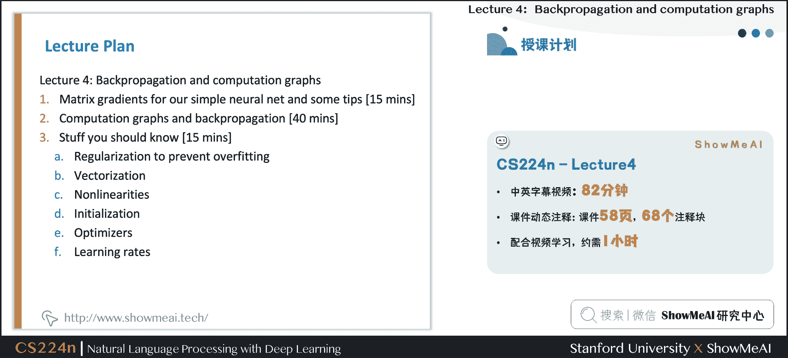

*   ① 简单神经网络的梯度矩阵与建议
*   ② 计算图与反向传播
*   ③ 神经网络训练实用知识技能
    *   正则化（用于环节过拟合）
    *   向量化
    *   非线性表达能力
    *   参数初始化
    *   优化算法
    *   学习率策略

# 1.简单神经网络的梯度矩阵与建议

## 1.1 权重矩阵的导数

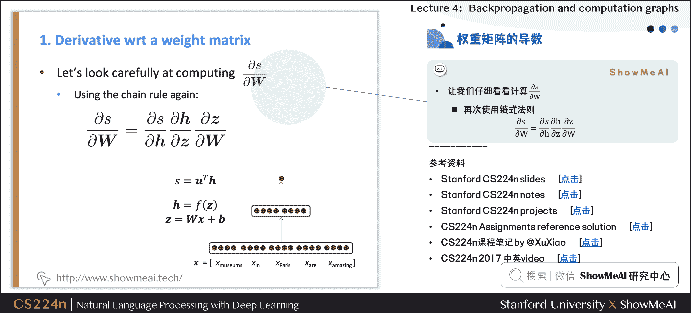

*   让我们仔细看看计算 ∂ s ∂ W \frac{\partial s}{\partial W} ∂W∂s​

    *   再次使用链式法则 

∂ s ∂ W = ∂ s ∂ h ∂ h ∂ z ∂ z ∂ W \frac{\partial s}{\partial W}=\frac{\partial s}{\partial h} \frac{\partial h}{\partial z} \frac{\partial z}{\partial W} ∂W∂s​=∂h∂s​∂z∂h​∂W∂z​

s = u T h h = f ( z ) z = W x + b \begin{aligned} s &= u^T h \\ h &= f(z) \\ z &= Wx+b \end{aligned} shz​=uTh=f(z)=Wx+b​

## 1.2 反向传播梯度求导

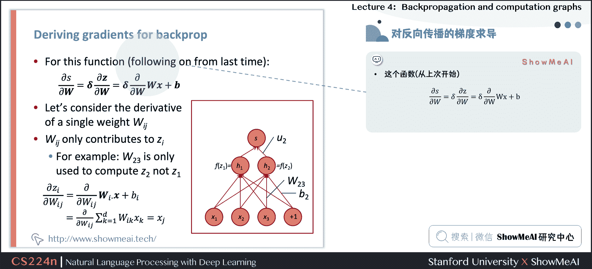

*   这个函数(从上次开始)

∂ s ∂ W = δ ∂ z ∂ W = δ ∂ ∂ W W x + b \frac{\partial s}{\partial W}=\delta \frac{\partial z}{\partial W}=\delta \frac{\partial}{\partial W} Wx+b ∂W∂s​=δ∂W∂z​=δ∂W∂​Wx+b

*   考虑单个权重 W i j W_{ij} Wij​ 的导数
*   W i j W_{ij} Wij​ 只对 z i z_i zi​ 有贡献

    *   例如 W 23 W_{23} W23​ 只对 z 2 z_2 z2​ 有贡献，对 z 1 z_1 z1​ 没有贡献 

∂ z i ∂ W i j = ∂ ∂ W i j W i ⋅ x + b i = ∂ ∂ W i j ∑ k = 1 d W i k x k = x j \begin{aligned} \frac{\partial z_{i}}{\partial W_{i j}} &=\frac{\partial}{\partial W_{i j}} W_{i \cdot} x+b_{i} \\ &=\frac{\partial}{\partial W_{i j}} \sum_{k=1}^{d} W_{i k} x_{k}=x_{j} \end{aligned} ∂Wij​∂zi​​​=∂Wij​∂​Wi⋅​x+bi​=∂Wij​∂​k=1∑d​Wik​xk​=xj​​

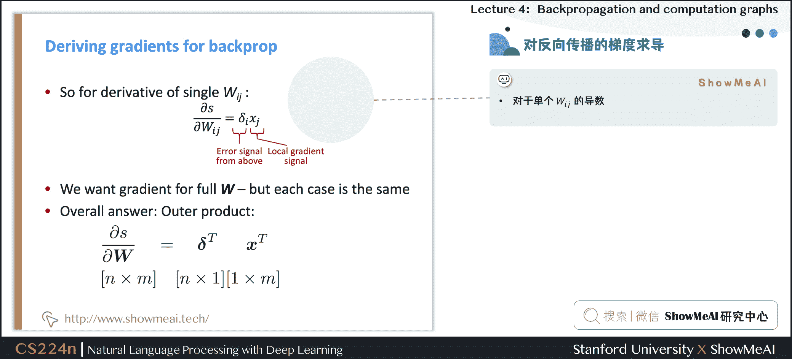

*   对于单个 W i j W_{ij} Wij​ 的导数：

∂ s ∂ W i j = δ i x j \frac{\partial s}{\partial W_{i j}} = \delta_i x_j ∂Wij​∂s​=δi​xj​

*   我们想要整个 W W W 的梯度，但是每种情况都是一样的
*   解决方案：外积

∂ s ∂ W = δ T x T [ n × m ] = [ n × 1 ] [ 1 × m ] \begin{aligned} \frac{\partial s}{\partial {W}}&=\delta ^{T} x^{T}\\ [n \times m] &= [n \times 1][1 \times m] \end{aligned} ∂W∂s​[n×m]​=δTxT=[n×1][1×m]​

## 1.3 梯度求导：技巧与建议

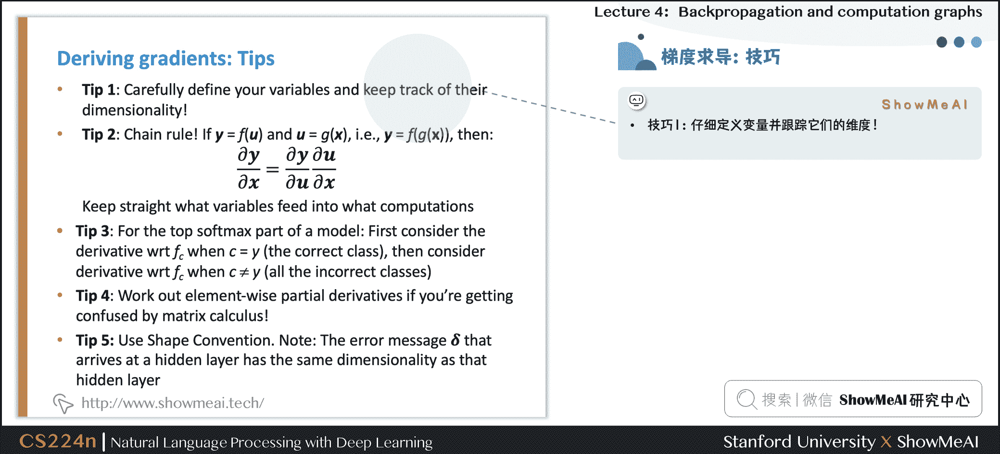

*   **技巧 1**：仔细定义变量并关注它们的维度！

*   **技巧 2**：链式法则！如果 y = f ( u ) y = f(u) y=f(u) , u = g ( x ) u = g(x) u=g(x)，即 y = f ( g ( x ) ) y = f(g(x)) y=f(g(x)) 则

∂ y ∂ x = ∂ y ∂ u ∂ u ∂ x \frac{\partial {y}}{\partial {x}}=\frac{\partial {y}}{\partial {u}} \frac{\partial {u}}{\partial {x}} ∂x∂y​=∂u∂y​∂x∂u​

*   **提示 3**：模型的最上面的 softmax 部分：首先考虑当 c = y c = y c=y (正确的类)的导数 f c f_c fc​，然后再考虑当 c ≠ y c \neq y c​=y (所有不正确的类)的导数 f c f_c fc​

*   **技巧 4**：如果你被矩阵微积分搞糊涂了，请计算逐个元素的偏导数！

*   **技巧 5**：使用形状约定。注意：到达隐藏层的错误消息 δ \delta δ 具有与该隐藏层相同的维度

## 1.4 为窗口模型推导梯度

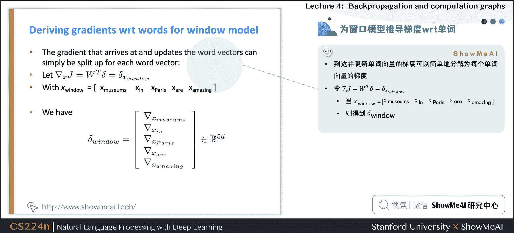

*   到达并更新单词向量的梯度可以简单地分解为每个单词向量的梯度

*   令 ∇ x J = W T δ = δ x w i n d o w \nabla_{x} J=W^{T} \delta=\delta_{x_{w i n d o w}} ∇x​J=WTδ=δxwindow​​

*   X w i n d o w = [ X m u s e u m s X i n X P a r i s X a r e X a m a z i n g ] X_{window}=[X_{museums} \quad X_{in} \quad X_{Paris} \quad X_{are} \quad X_{ amazing}] Xwindow​=[Xmuseums​Xin​XParis​Xare​Xamazing​]

*   则得到

δ w i n d o w = [ ∇ x museums ∇ x i n ∇ x Pare ∇ x are ∇ x amazing ] ∈ R 5 d \begin{aligned} \delta_{window}=\left[\begin{array}{c}{\nabla_{x_{\text {museums}}}} \\ {\nabla_{x_{i n}}} \\ {\nabla_{x_{\text {Pare}}}} \\ {\nabla_{x_{\text {are}}}} \\ {\nabla_{x_{\text {amazing}}}}\end{array}\right] \in \mathbb{R}^{5 d} \end{aligned} δwindow​=⎣⎢⎢⎢⎢⎡​∇xmuseums​​∇xin​​∇xPare​​∇xare​​∇xamazing​​​⎦⎥⎥⎥⎥⎤​∈R5d​

*   我们将根据梯度逐个更新对应的词向量矩阵中的词向量，所以实际上是对词向量矩阵的更新是非常稀疏的

## 1.5 在窗口模型中更新单词梯度

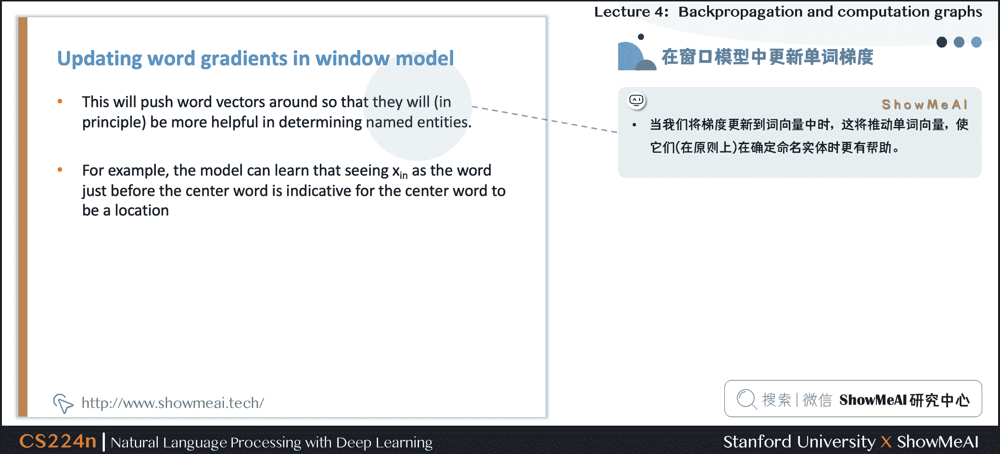

*   当我们将梯度更新到词向量中时，这将更新单词向量，使它们(理论上)在确定命名实体时更有帮助。
*   例如，模型可以了解到，当看到 x i n x_{in} xin​ 是中心词之前的单词时，指示中心词是一个 Location

## 1.6 重新训练词向量时的陷阱

**背景**：我们正在训练一个单词电影评论情绪的逻辑回归分类模型。

*   在**训练数据**中，我们有“TV”和“telly”
*   在**测试数据**中我们有“television””
*   **预训练**的单词向量有三个相似之处：

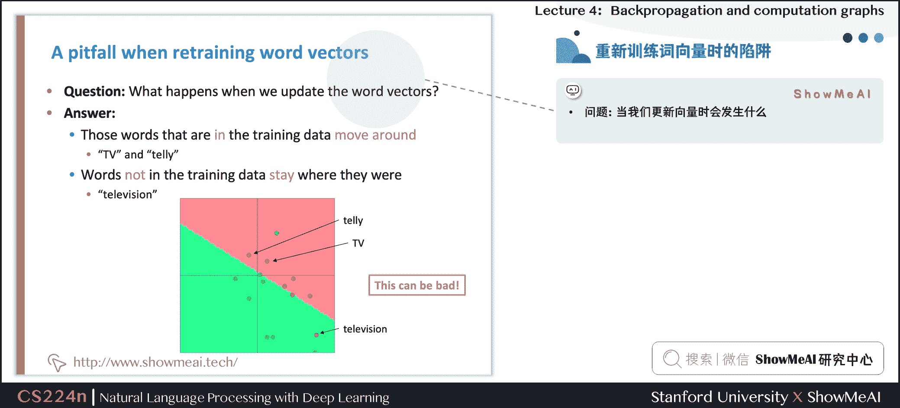

*   **问题**：当我们更新向量时会发生什么

*   **回答**：

    *   那些在训练数据中出现的单词会四处移动
        *   “TV”和“telly”
    *   没有包含在训练数据中的词汇保持原样
        *   “television”

## 1.7 关于再训练的建议

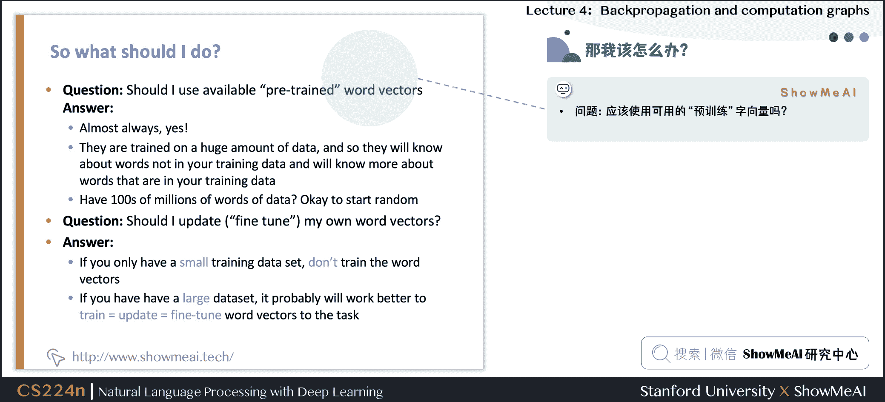

*   **问题**：应该使用可用的“预训练”词向量吗？

*   **回答**：

    *   几乎总是「应该用」
    *   他们接受了大量的数据训练，所以他们会知道训练数据中没有的单词，也会知道更多关于训练数据中的单词
    *   拥有上亿的数据语料吗？那可以随机初始化开始训练
*   **问题**：我应该更新(“fine tune”)我自己的单词向量吗？

*   **回答**：

    *   如果你只有一个小的训练数据集，不要对预训练词向量做再训练
    *   如果您有一个大型数据集，那么基于任务训练更新词向量（ train = update = fine-tune ）效果会更好

# 2.计算图与反向传播

## 2.1 反向传播

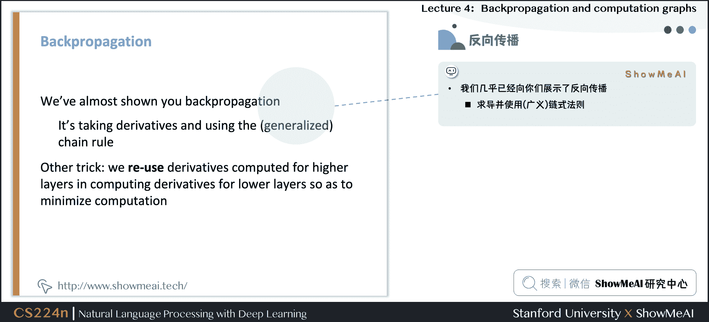

*   我们几乎已经向你们展示了反向传播

    *   求导并使用(广义)链式法则
*   另一个技巧：在计算较低层的导数时，我们重用对较深层计算的导数，以减小计算量

## 2.2 计算图和反向传播

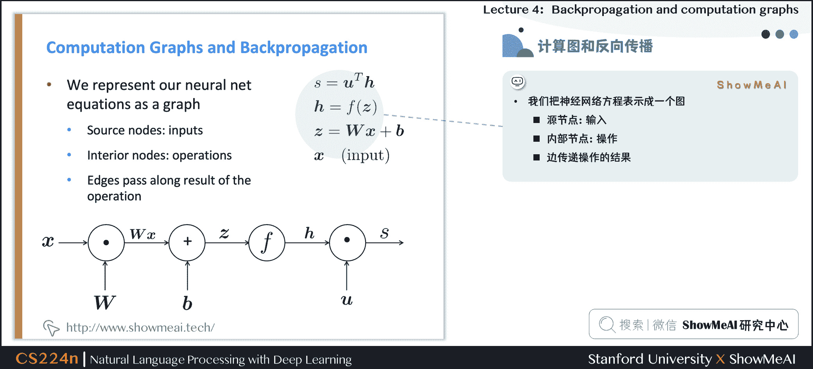

*   我们把神经网络方程表示成一个图
    *   源节点：输入
    *   内部节点：操作
    *   边传递操作的结果

s = u T h h = f ( z ) z = W x + b x ( i n p u t ) \begin{aligned} s &= u^Th \\ h &= f(z) \\ z &= Wx+b \\ x & \quad (input) \end{aligned} shzx​=uTh=f(z)=Wx+b(input)​

> Forward Propagation：前向传播
> Back Propagation：沿着边回传梯度

## 2.3 反向传播：单神经元视角

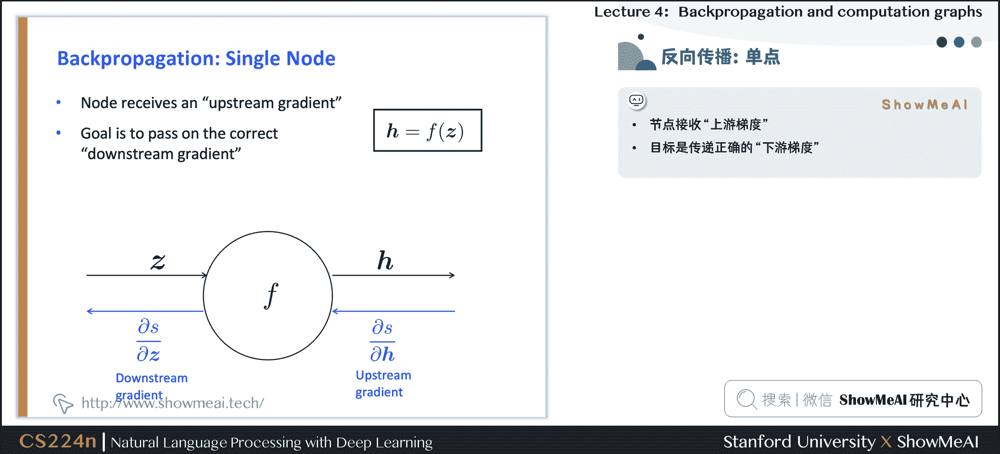

*   节点接收“上游梯度”

    *   目标是传递正确的“下游梯度”
*   每个节点都有局部梯度 local gradient

    *   它输出的梯度是与它的输入有关
*   每个节点都有局部梯度 local gradient

    *   n 它输出的梯度是与它的输入有关
*   每个节点都有局部梯度 local gradient

    *   它输出的梯度是与它的输入有关

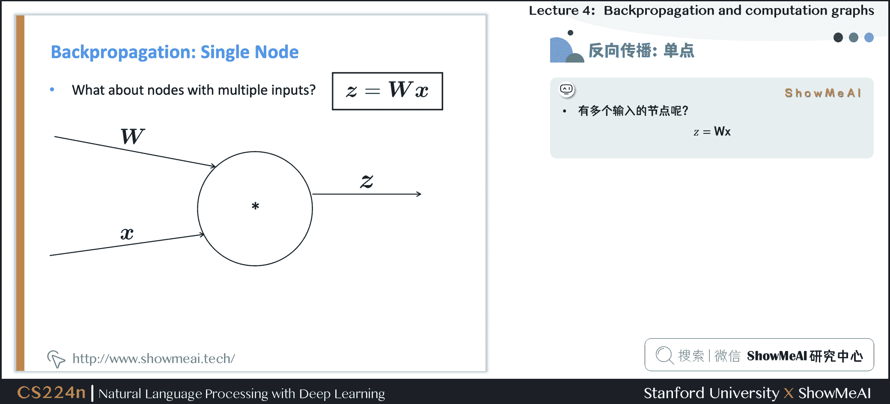

*   有多个输入的节点呢？ z = W x z=Wx z=Wx
*   多个输入 → 多个局部梯度

## 2.4 反向传播计算图示例

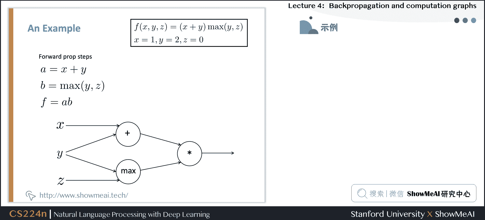

## 2.5 求和形态的梯度计算

上图中的 ∂ f ∂ y \frac{\partial f}{\partial y} ∂y∂f​ 的梯度的计算

a = x + y b = m a x ( y , z ) f = a b \begin{aligned} a &= x + y \\ b &= max(y,z)\\ f &= ab \end{aligned} abf​=x+y=max(y,z)=ab​

∂ f ∂ y = ∂ f ∂ a ∂ a ∂ y + ∂ f ∂ b ∂ b ∂ y \frac{\partial f}{\partial y} = \frac{\partial f}{\partial a}\frac{\partial a}{\partial y} + \frac{\partial f}{\partial b}\frac{\partial b}{\partial y} ∂y∂f​=∂a∂f​∂y∂a​+∂b∂f​∂y∂b​

## 2.6 直挂理解神经元的梯度传递

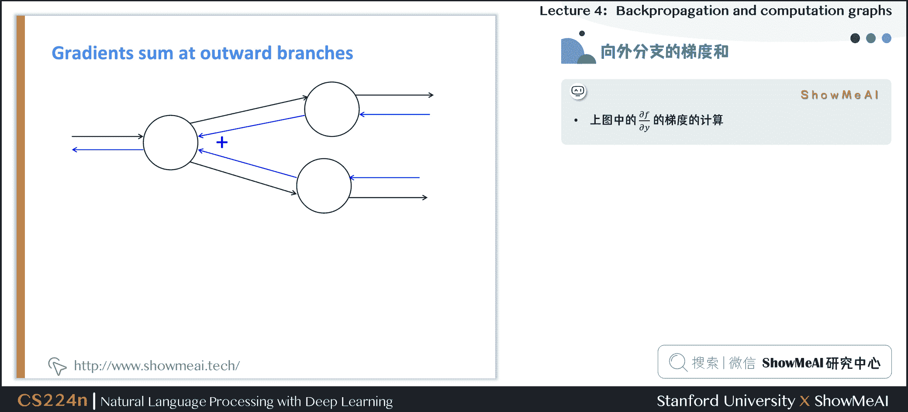

*   + + + “分发” 上游梯度
*   m a x max max “路由” 上游梯度，将梯度发送到最大的方向
*   ∗ \ast ∗ “切换”上游梯度

## 2.7 同步计算所有梯度以提速

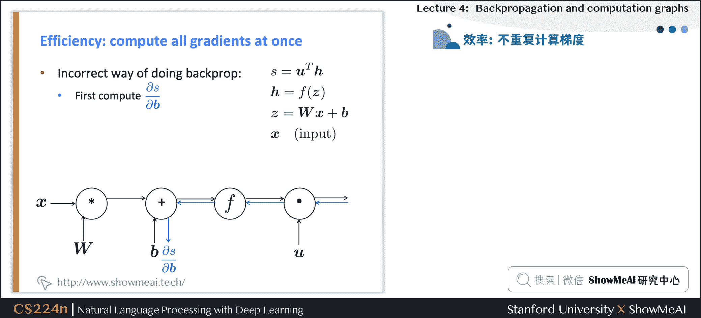

*   错误的反向传播计算方式

    *   先计算 b b b 的偏导
    *   接着计算 W W W 的偏导
    *   重复计算！
*   正确的反向传播计算方式

    *   一次性计算所有偏导
    *   类似手动计算梯度时的方式

## 2.8 一般计算图中的反向传播

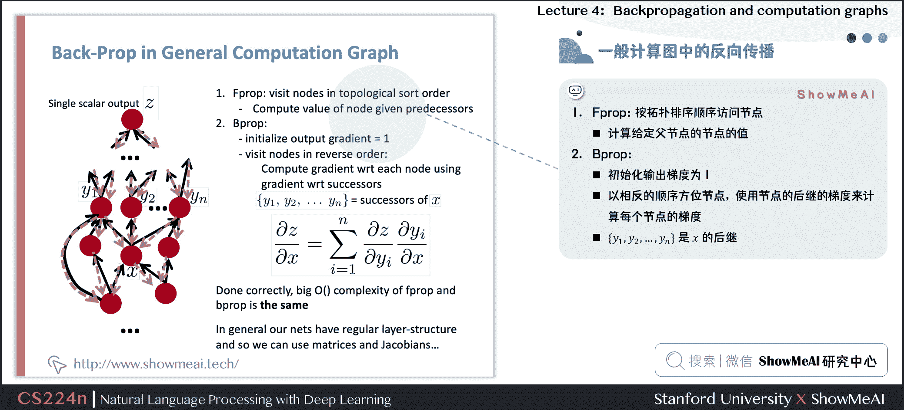

*   **Fprop**：按拓扑排序顺序访问节点

    *   计算给定父节点的节点的值
*   **Bprop**：

    *   初始化输出梯度为 1
    *   以相反的顺序方位节点，使用节点的后继的梯度来计算每个节点的梯度
    *   { y 1 , y 2 , ⋯   , y n } \{y_1,y_2,\cdots,y_n\} {y1​,y2​,⋯,yn​} 是 x x x 的后继

∂ z ∂ x = ∑ i = 1 n ∂ z ∂ y i ∂ y i ∂ x \frac{\partial z}{\partial x} = \sum_{i=1}^n \frac{\partial z}{\partial y_i}\frac{\partial y_i}{\partial x} ∂x∂z​=i=1∑n​∂yi​∂z​∂x∂yi​​

*   正确地说，Fprop 和 Bprop 的计算复杂度是一样的
*   一般来说，我们的网络有固定的层结构，所以我们可以使用矩阵和雅可比矩阵

## 2.9 自动微分

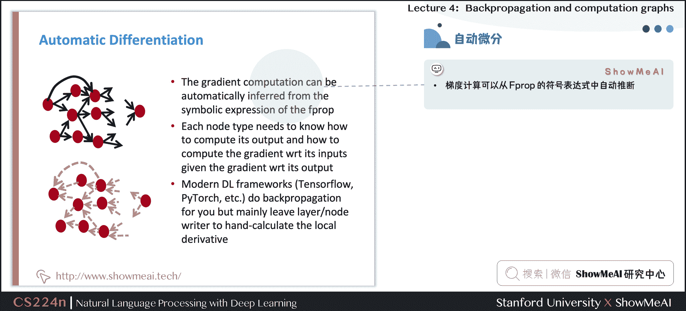

*   梯度计算可以从 Fprop 的符号表达式中自动推断
*   每个节点类型需要知道如何计算其输出，以及如何在给定其输出的梯度后计算其输入的梯度
*   现代 DL 框架(Tensorflow, Pytoch)为您做反向传播，但主要是令作者手工计算层/节点的局部导数

## 2.10 反向传播的实现

为了计算反向传播，我们需要在前向传播时存储一些变量的值

## 2.11 实现：前向/反向 API

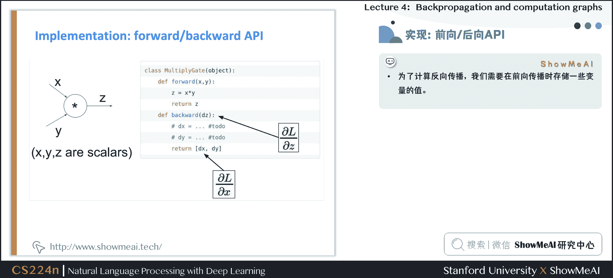

为了计算反向传播，我们需要在前向传播时存储一些变量的值

## 2.12 梯度检查：数值梯度

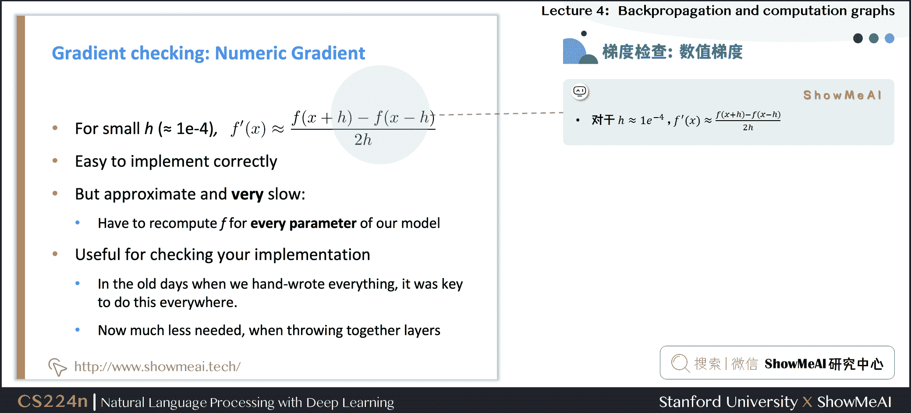

*   对于 h ≈ 1 e − 4 h \approx 1e^{-4} h≈1e−4 , f ′ ( x ) ≈ f ( x + h ) − f ( x − h ) 2 h f^{\prime}(x) \approx \frac{f(x+h)-f(x-h)}{2 h} f′(x)≈2hf(x+h)−f(x−h)​

*   易于正确实现

*   但近似且非常缓慢

    *   必须对模型的每个参数重新计算 f f f
*   用于检查您的实现

    *   在过去我们手写所有东西的时候，在任何地方都这样做是关键。
    *   现在，当把图层放在一起时，就不需要那么多了

## 2.13 总结

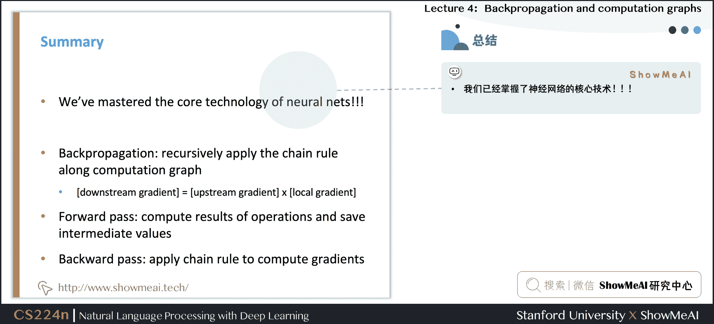

*   我们已经掌握了神经网络的核心技术
*   反向传播：沿计算图递归应用链式法则
    *   [downstream gradient] = [upstream gradient] x [local gradient]
*   前向传递：计算操作结果并保存中间值
*   反向传递：应用链式法则计算梯度

## 2.14 为什么要学习梯度的所有细节？

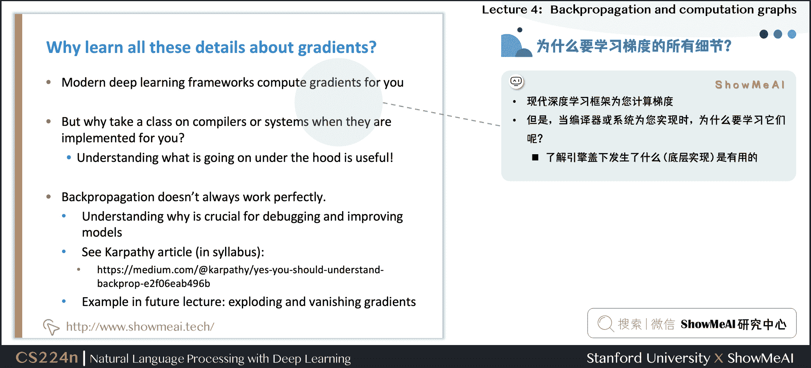

*   现代深度学习框架为您计算梯度

*   但是，当编译器或系统为您实现时，为什么要学习它们呢？

    *   了解底层原理是有帮助的
*   反向传播并不总是完美地工作

    *   理解为什么对调试和改进模型至关重要
    *   参见 [Karpathy 文章](https://looperxx.github.io/CS224n-2019-04-Backpropagation%20and%20Computation%20Graphs/)
*   未来课程的例子:爆炸和消失的梯度

# 3.神经网络训练实用知识技能

## 3.1 模型正则化防止过拟合

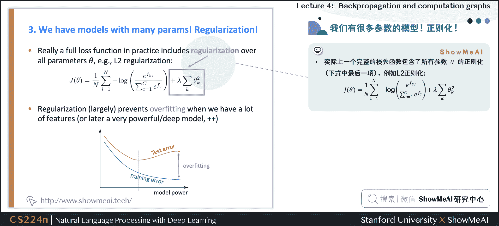

*   实际上一个完整的损失函数包含了所有参数 θ \theta θ的正则化（下式中最后一项），例如 L2 正则化：

J ( θ ) = 1 N ∑ i = 1 N − log ⁡ ( e f y i ∑ c = 1 C e f c ) + λ ∑ k θ k 2 J(\theta)=\frac{1}{N} \sum_{i=1}^{N}-\log (\frac{e^{f_{y_{i}}}}{\sum_{c=1}^{C} e^{f_{c}}})+\lambda \sum_{k} \theta_{k}^{2} J(θ)=N1​i=1∑N​−log(∑c=1C​efc​efyi​​​)+λk∑​θk2​

*   正则化(在很大程度上)可以防止在我们有很多特征时过拟合(或者是一个非常强大/深层的模型等等)

## 3.2 向量化形态

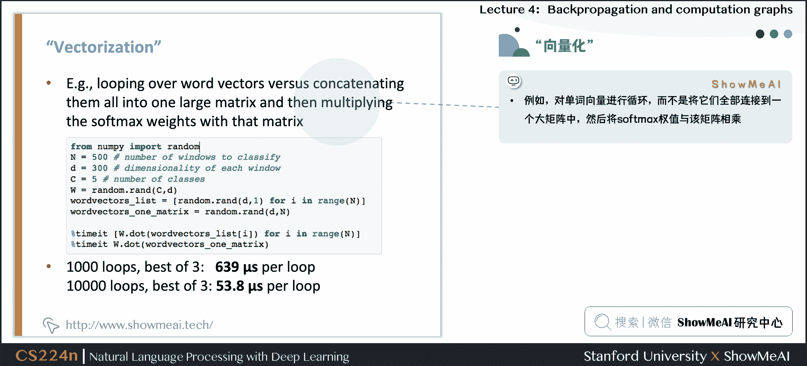

*   例如，对单词向量进行循环，而不是将它们全部连接到一个大矩阵中，然后将 softmax 权值与该矩阵相乘

    *   1000 loops, best of 3: 639 μs per loop
    *   10000 loops, best of 3: 53.8 μs per loop
*   (10x)更快的方法是使用 C × N C \times N C×N 矩阵

*   总是尝试使用向量和矩阵，而不是循环

*   你也应该快速测试你的代码

*   简单来说：矩阵向量化的方式太棒了

## 3.3 非线性：常规激活函数

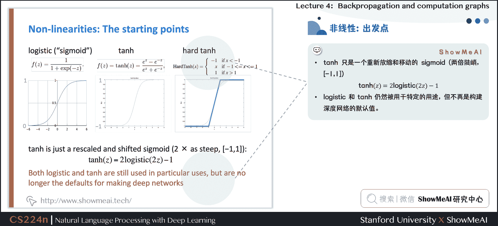

tanh 只是一个重新放缩和移动的 sigmoid (两倍陡峭，[-1,1])

tanh ⁡ ( z ) = 2 l o g i s t i c ( 2 z ) − 1 \tanh (z)=2 logistic(2 z)-1 tanh(z)=2logistic(2z)−1

logistic 和 tanh 仍然被用于特定的用途，但不再是构建深度网络的默认值。

**tip**：**logistic 和 tanh**

设计复杂的数学运算，指数计算会减慢速度。所以人们提出了 hard tanh，并且效果很不错。于是才有了 ReLU

## 3.4 非线性：新的激活函数

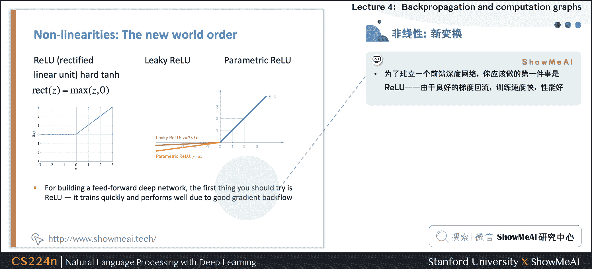

*   为了建立一个前馈深度网络，你应该做的第一件事是 ReLU——由于良好的梯度回流，训练速度快，性能好

> **tip**：**ReLU**

*   每个单元要么已经死了，要么在传递信息。
*   非零范围内只有一个斜率，这一位置梯度十分有效的传递给了输入，所以模型非常有效的训练

## 3.5 参数初始化

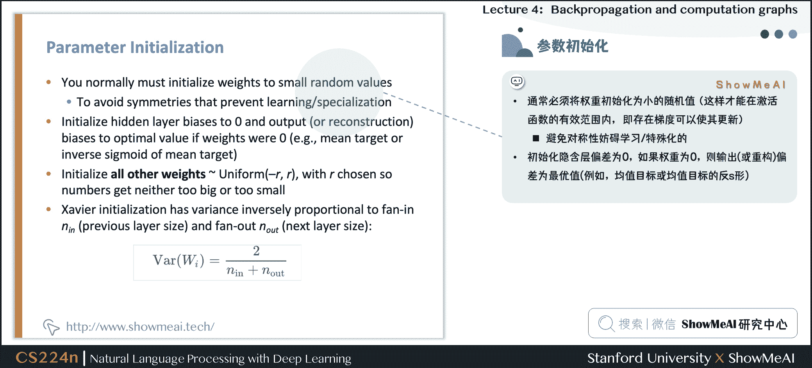

*   通常 必须将权重初始化为小的随机值 （这样才能在激活函数的有效范围内， 即存在梯度可以使其更新）
    *   避免对称性妨碍学习/特殊化的
*   初始化隐含层偏差为 0，如果权重为 0，则输出(或重构)偏差为最优值(例如，均值目标或均值目标的反 s 形)
*   初始化 所有其他权重为 Uniform(–r, r)，选择使数字既不会太大也不会太小的 r r r
*   Xavier 初始化中，方差与 fan-in n i n n_{in} nin​ (前一层尺寸)和 fan-out n o u t n_{out} nout​(下一层尺寸)成反比

V a r ( W i ) = 2 n i n + n o u t Var(W_i)=\frac{2}{n_{in}+n_{out}} Var(Wi​)=nin​+nout​2​

## 3.6 优化算法

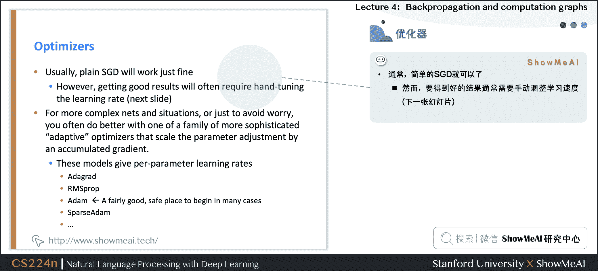

通常，简单的 SGD 就可以了

*   然而，要得到好的结果通常需要手动调整学习速度(下一张幻灯片)
*   对于更复杂的网络和情况，或者只是为了避免担心，更有经验的复杂的 “自适应”优化器通常会令你做得更好，通过累积梯度缩放参数调整。
*   这些模型给每个参数调整学习速度
    *   Adagrad
    *   RMSprop
    *   Adam 相当好,在许多情况下是安全的选择
    *   SparseAdam
    *   …

## 3.7 学习率策略

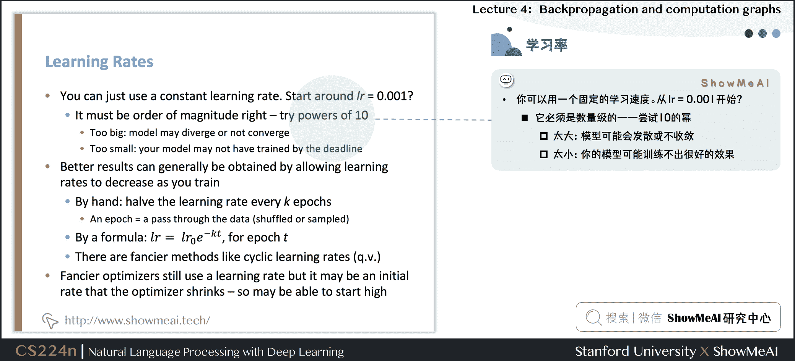

*   你可以用一个固定的学习速度。从 l r = 0.001 lr = 0.001 lr=0.001 开始？

    *   它必须是数量级的——尝试 10 的幂
    *   太大：模型可能会发散或不收敛
    *   太小：你的模型可能训练不出很好的效果
*   如果你在训练时降低学习速度，通常可以获得更好的效果

    *   手工：每隔 k k k 个阶段(epoch)将学习速度减半

        *   epoch = 遍历一次数据 (打乱或采样的) 
    *   通过一个公式： l r = l r 0 e − k t l r=l r_{0} e^{-k t} lr=lr0​e−kt, {for epoch }t
    *   还有更新奇的方法，比如循环学习率(q.v.)
*   更高级的优化器仍然使用学习率，但它可能是优化器缩小的初始速度——因此可能可以从较高的速度开始

# 4.视频教程

可以点击 [B 站](https://www.bilibili.com/video/BV1Yo4y1D7FW?p=4) 查看视频的【双语字幕】版本

[`player.bilibili.com/player.html?aid=376755412&page=4`](https://player.bilibili.com/player.html?aid=376755412&page=4)

【双语字幕+资料下载】斯坦福 CS224n | 深度学习与自然语言处理(2019·全 20 讲)

# 5.参考资料

*   [本讲带学的**在线阅翻页本**](https://blog.showmeai.tech/cs224n/lecture04-Backpropagation-and-Computation-Graphs#/)
*   [《斯坦福 CS224n 深度学习与自然语言处理》**课程学习指南**](https://blog.showmeai.tech/cs224n/)
*   [《斯坦福 CS224n 深度学习与自然语言处理》**课程大作业解析**](https://github.com/ShowMeAI-Hub/awesome-AI-courses-notes-cheatsheets/tree/main/CS224n-Natural-Language-Processing-with-Deep-Learning/assignment-solutions)
*   [【**双语字幕视频**】斯坦福 CS224n | 深度学习与自然语言处理(2019·全 20 讲)](https://www.bilibili.com/video/BV1Yo4y1D7FW)
*   [**Stanford 官网** | CS224n: Natural Language Processing with Deep Learning](https://web.stanford.edu/class/archive/cs/cs224n/cs224n.1194/)

# [**ShowMeAI**](http://www.showmeai.tech)系列教程推荐

*   [大厂技术实现 | 推荐与广告计算解决方案](http://www.showmeai.tech/tutorials/50)
*   [大厂技术实现 | 计算机视觉解决方案](http://www.showmeai.tech/tutorials/51)
*   [大厂技术实现 | 自然语言处理行业解决方案](http://www.showmeai.tech/tutorials/52)
*   [图解 Python 编程：从入门到精通系列教程](http://www.showmeai.tech/tutorials/56)
*   [图解数据分析：从入门到精通系列教程](http://www.showmeai.tech/tutorials/33)
*   [图解 AI 数学基础：从入门到精通系列教程](http://www.showmeai.tech/tutorials/83)
*   [图解大数据技术：从入门到精通系列教程](http://www.showmeai.tech/tutorials/84)
*   [图解机器学习算法：从入门到精通系列教程](http://www.showmeai.tech/tutorials/34)
*   [机器学习实战：手把手教你玩转机器学习系列](http://www.showmeai.tech/tutorials/41)
*   [深度学习教程 | 吴恩达专项课程 · 全套笔记解读](http://www.showmeai.tech/tutorials/35)
*   [自然语言处理教程 | 斯坦福 CS224n 课程 · 课程带学与全套笔记解读](http://www.showmeai.tech/tutorials/36)

# NLP 系列教程文章

*   [NLP 教程(1)- 词向量、SVD 分解与 Word2vec](http://showmeai.tech/article-detail/230)
*   [NLP 教程(2)- GloVe 及词向量的训练与评估](http://showmeai.tech/article-detail/232)
*   [NLP 教程(3)- 神经网络与反向传播](http://showmeai.tech/article-detail/234)
*   [NLP 教程(4)- 句法分析与依存解析](http://www.showmeai.tech/article-detail/237)
*   [NLP 教程(5)- 语言模型、RNN、GRU 与 LSTM](http://www.showmeai.tech/article-detail/239)
*   [NLP 教程(6)- 神经机器翻译、seq2seq 与注意力机制](http://www.showmeai.tech/article-detail/242)
*   [NLP 教程(7)- 问答系统](http://www.showmeai.tech/article-detail/245)
*   [NLP 教程(8)- NLP 中的卷积神经网络](http://www.showmeai.tech/article-detail/247)
*   [NLP 教程(9)- 句法分析与树形递归神经网络](http://www.showmeai.tech/article-detail/255)

# 斯坦福 CS224n 课程带学详解

*   [斯坦福 NLP 课程 | 第 1 讲 - NLP 介绍与词向量初步](http://showmeai.tech/article-detail/231)
*   [斯坦福 NLP 课程 | 第 2 讲 - 词向量进阶](http://showmeai.tech/article-detail/233)
*   [斯坦福 NLP 课程 | 第 3 讲 - 神经网络知识回顾](http://showmeai.tech/article-detail/235)
*   [斯坦福 NLP 课程 | 第 4 讲 - 神经网络反向传播与计算图](http://showmeai.tech/article-detail/236)
*   [斯坦福 NLP 课程 | 第 5 讲 - 句法分析与依存解析](http://www.showmeai.tech/article-detail/238)
*   [斯坦福 NLP 课程 | 第 6 讲 - 循环神经网络与语言模型](http://www.showmeai.tech/article-detail/240)
*   [斯坦福 NLP 课程 | 第 7 讲 - 梯度消失问题与 RNN 变种](http://www.showmeai.tech/article-detail/241)
*   [斯坦福 NLP 课程 | 第 8 讲 - 机器翻译、seq2seq 与注意力机制](http://www.showmeai.tech/article-detail/243)
*   [斯坦福 NLP 课程 | 第 9 讲 - cs224n 课程大项目实用技巧与经验](http://www.showmeai.tech/article-detail/244)
*   [斯坦福 NLP 课程 | 第 10 讲 - NLP 中的问答系统](http://www.showmeai.tech/article-detail/246)
*   [斯坦福 NLP 课程 | 第 11 讲 - NLP 中的卷积神经网络](http://www.showmeai.tech/article-detail/248)
*   [斯坦福 NLP 课程 | 第 12 讲 - 子词模型](http://www.showmeai.tech/article-detail/249)
*   [斯坦福 NLP 课程 | 第 13 讲 - 基于上下文的表征与 NLP 预训练模型](http://www.showmeai.tech/article-detail/250)
*   [斯坦福 NLP 课程 | 第 14 讲 - Transformers 自注意力与生成模型](http://www.showmeai.tech/article-detail/251)
*   [斯坦福 NLP 课程 | 第 15 讲 - NLP 文本生成任务](http://www.showmeai.tech/article-detail/252)
*   [斯坦福 NLP 课程 | 第 16 讲 - 指代消解问题与神经网络方法](http://www.showmeai.tech/article-detail/253)
*   [斯坦福 NLP 课程 | 第 17 讲 - 多任务学习(以问答系统为例)](http://www.showmeai.tech/article-detail/254)
*   [斯坦福 NLP 课程 | 第 18 讲 - 句法分析与树形递归神经网络](http://www.showmeai.tech/article-detail/256)
*   [斯坦福 NLP 课程 | 第 19 讲 - AI 安全偏见与公平](http://www.showmeai.tech/article-detail/257)
*   [斯坦福 NLP 课程 | 第 20 讲 - NLP 与深度学习的未来](http://www.showmeai.tech/article-detail/258)

