# 斯坦福 NLP 课程 | 第 5 讲 - 句法分析与依存解析

> 原文：[`blog.csdn.net/ShowMeAI/article/details/124563332`](https://blog.csdn.net/ShowMeAI/article/details/124563332)

作者：[韩信子](https://github.com/HanXinzi-AI)@[ShowMeAI](http://www.showmeai.tech/)，路遥@[ShowMeAI](http://www.showmeai.tech/)，奇异果@[ShowMeAI](http://www.showmeai.tech/)
[教程地址](http://www.showmeai.tech/tutorials/36)：[`www.showmeai.tech/tutorials/36`](http://www.showmeai.tech/tutorials/36)
[本文地址](http://www.showmeai.tech/article-detail/238)：[`www.showmeai.tech/article-detail/238`](http://www.showmeai.tech/article-detail/238)
声明：版权所有，转载请联系平台与作者并注明出处

收藏[ShowMeAI](http://www.showmeai.tech/)查看更多精彩内容

* * *

[ShowMeAI](http://www.showmeai.tech/)为**斯坦福 CS224n**《自然语言处理与深度学习(Natural Language Processing with Deep Learning)》课程的全部课件，做了**中文翻译和注释**，并制作成了 GIF 动图！

本讲内容的**深度总结教程**可以在[**这里**](http://www.showmeai.tech/article-detail/237) 查看。视频和课件等资料的获取方式见**文末**。

* * *

# 引言

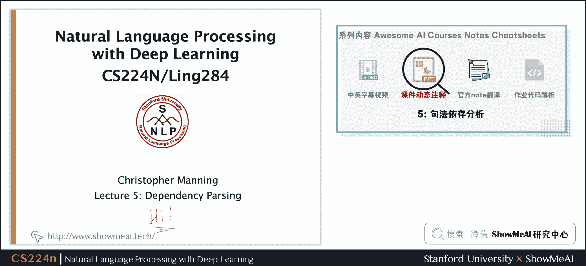

## 授课计划

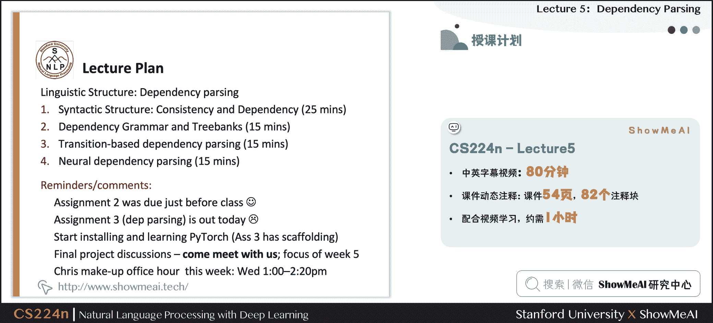

# 1.句法结构：成分与依赖

## 1.1 语言结构的两种观点：无上下文语法

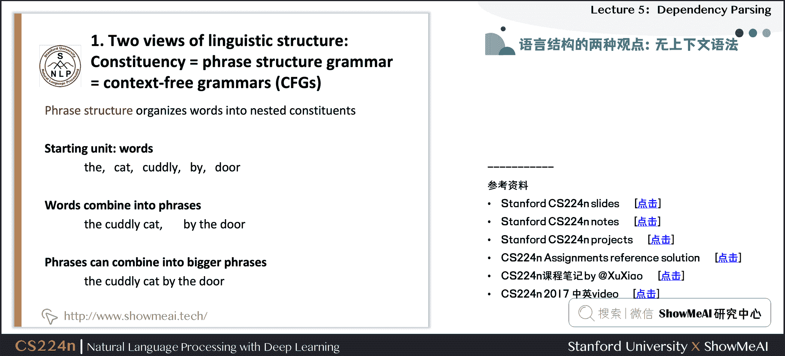

*   句子是使用逐步嵌套的单元构建的
*   短语结构将单词组织成嵌套的成分

*   **起步单元**：单词被赋予一个类别
    *   part of speech = pos 词性
*   **单词**组合成不同类别的**短语**
*   **短语**可以递归地组合成**更大的短语**

*   **Det** 指的是 `Determiner`，在语言学中的含义为 **限定词**
*   **NP** 指的是 `Noun Phrase`，在语言学中的含义为 **名词短语**
*   **VP** ****指的是 `Verb Phrase`，在语言学中的含义为 **动词短语**
*   **P** 指的是 `Preposition`，在语言学中的含义为 **介词**
*   **PP** 指的是 `Prepositional Phrase`，在语言学中的含义为 **介词短语**

## 1.2 语言结构的两种观点：无上下文语法

## 1.3 语言结构的两种观点：依赖结构

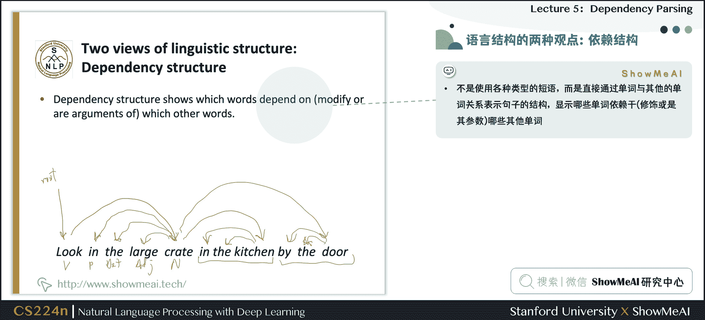

*   不是使用各种类型的短语，而是直接通过单词与其他的单词关系表示句子的结构，显示哪些单词依赖于(修饰或是其参数)哪些其他单词

**补充讲解**

*   `look` 是整个句子的根源，`look` 依赖于 `crate` (或者说 `crate` 是 `look` 的依赖)
    *   `in`，`the`，`large` 都是 `crate` 的依赖
    *   `in the kitchen` 是 `crate` 的修饰
    *   `in`，`the` 都是 `kitchen` 的依赖
    *   `by the door` 是 `crate` 的依赖

## 1.4 为什么我们需要句子结构？

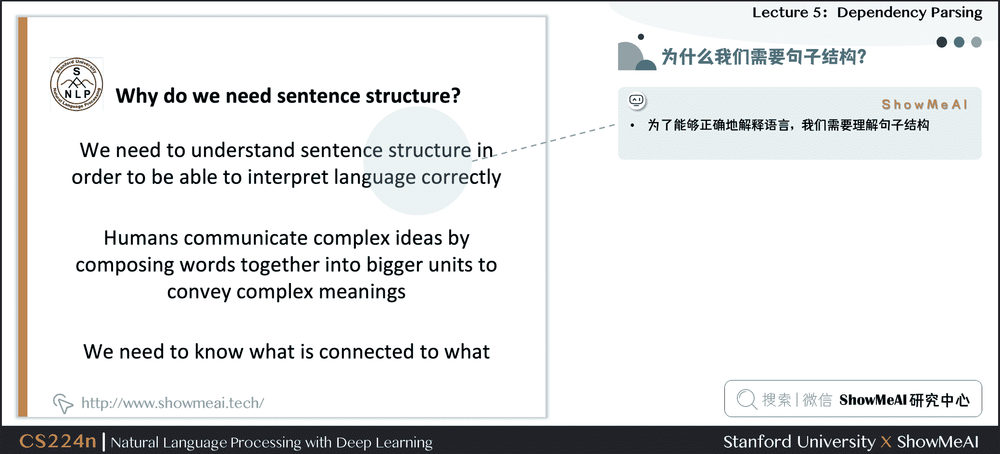

*   为了能够正确地解释语言，我们需要理解句子结构
*   人类通过将单词组合成更大的单元来传达复杂的意思，从而交流复杂的思想
*   我们需要知道什么与什么相关联
    *   除非我们知道哪些词是其他词的参数或修饰词，否则我们无法弄清楚句子是什么意思

## 1.5 介词短语依附歧义

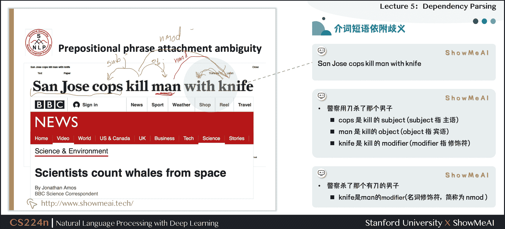

`San Jose cops kill man with knife`

*   警察用刀杀了那个男子
    *   `cops` 是 `kill` 的 `subject` (subject 指 **主语**)
    *   `man` 是 `kill` 的 `object` (object 指 **宾语**)
    *   `knife` 是 `kill` 的 `modifier` (modifier 指 **修饰符**)

*   警察杀了那个有刀的男子
    *   `knife` 是 `man` 的 `modifier` (名词修饰符，简称为 `nmod`)

## 1.6 介词短语依附歧义

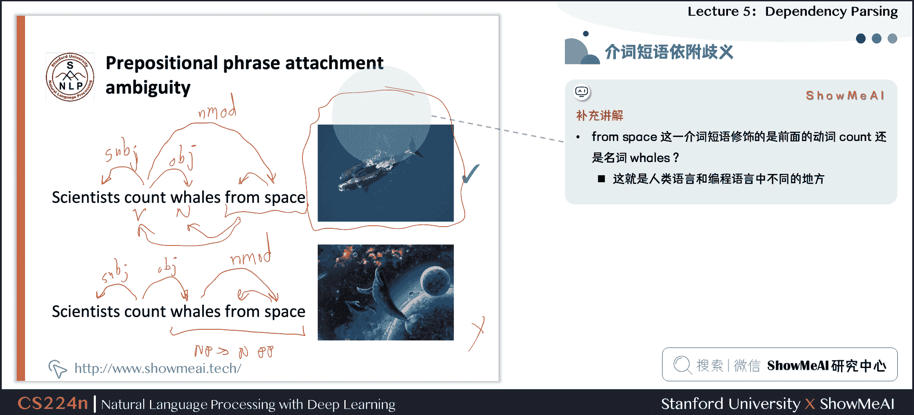

**补充讲解**

*   `from space` 这一介词短语修饰的是前面的动词 `count` 还是名词 `whales`？
    *   这就是人类语言和编程语言中不同的地方

## 1.7 介词短语附加歧义成倍增加

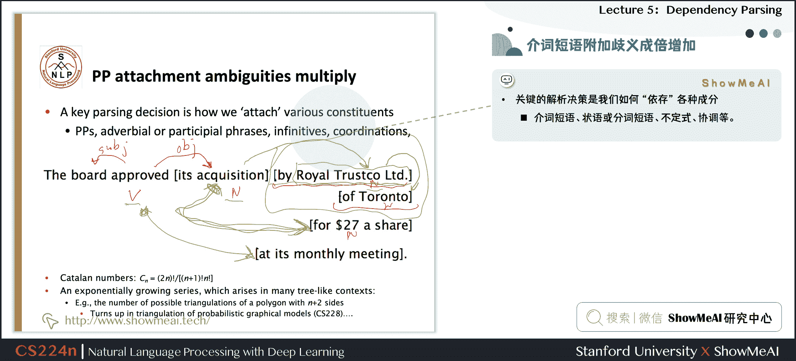

*   关键的解析决策是我们如何“依存”各种成分
    *   介词短语、状语或分词短语、不定式、协调等。

**补充讲解**：

**上述句子中有四个介词短语**

*   `board` 是 `approved` 的主语，`acquisition` 是 `approved` 的谓语
*   `by Royal Trustco Ltd.` 是修饰 `acquisition` 的，即董事会批准了这家公司的收购
*   `of Toronto` 可以修饰 `approved`，`acquisition`，`Royal Trustco Ltd.` 之一，经过分析可以得知是修饰 `Royal Trustco Ltd.`，即表示这家公司的位置
*   `for $$27 a share` 修饰 `acquisition`
*   `at its monthly meeting` 修饰 `approved`，即表示批准的时间地点

**补充讲解**：

面对这样复杂的句子结构，我们需要考虑 指数级 的可能结构，这个序列被称为 **卡特兰数/Catalan numbers**

**Catalan numbers**

C n = ( 2 n ) ! / [ ( n + 1 ) ! n ! ] C_{n}=(2 n) ! /[(n+1) ! n !] Cn​=(2n)!/[(n+1)!n!]

## 1.8 协调范围模糊

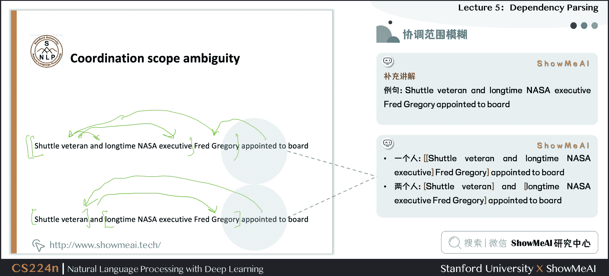

**补充讲解**

`Shuttle veteran and longtime NASA executive Fred Gregory appointed to board`

*   一个人：`[[Shuttle veteran and longtime NASA executive] Fred Gregory] appointed to board`

*   两个人：`[Shuttle veteran] and [longtime NASA executive Fred Gregory] appointed to board`

## 1.9 协调范围模糊

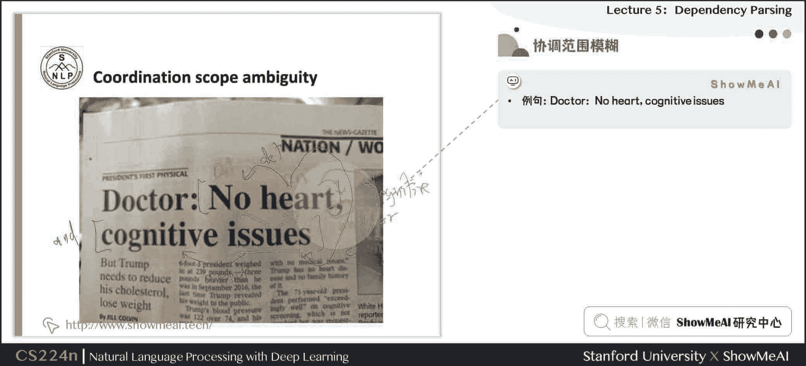

*   例句：Doctor: No heart，cognitive issues

## 1.10 形容词修饰语歧义

**补充讲解**

`Students get first hand job experience`

*   `first hand` 表示 第一手的，直接的，即学生获得了直接的工作经验
    *   `first` 是 `hand` 的形容词修饰语(amod)
*   `first` 修饰 `experience`，`hand` 修饰 `job`

## 1.11 动词短语(VP)依存歧义

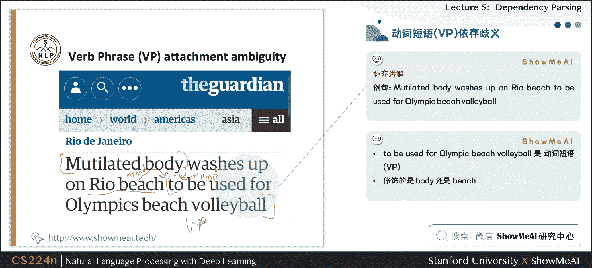

**补充讲解**

`Mutilated body washes up on Rio beach to be used for Olympic beach volleyball`

*   `to be used for Olympic beach volleyball` 是 动词短语 (VP)
*   修饰的是 `body` 还是 `beach`

# 2.依赖语法与树库

## 2.1 #论文解读# 依赖路径识别语义关系

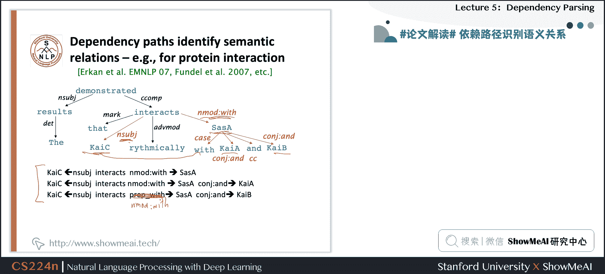

## 2.2 依存文法和依存结构

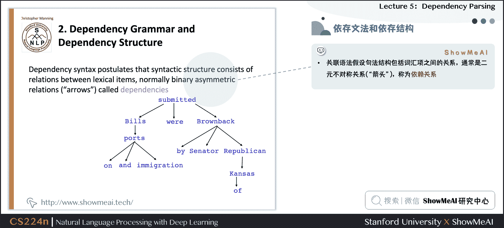

*   关联语法假设句法结构包括词汇项之间的关系，通常是二元不对称关系(“箭头”)，称为**依赖关系**

**Dependency Structure 有两种表现形式**

1.**一种是直接在句子上标出依存关系箭头及语法关系**

2.**另一种是将其做成树状机构(Dependency Tree Graph)**

*   箭头通常标记(type)为语法关系的名称(主题、介词对象、apposition 等)
*   箭头连接头部(head)(调速器，上级，regent)和一个依赖(修饰词，下级，下属)
    *   A → A \to A→ 的事情
*   通常，依赖关系形成一棵树(单头，无环，连接图)

## 2.3 依存语法/解析历史

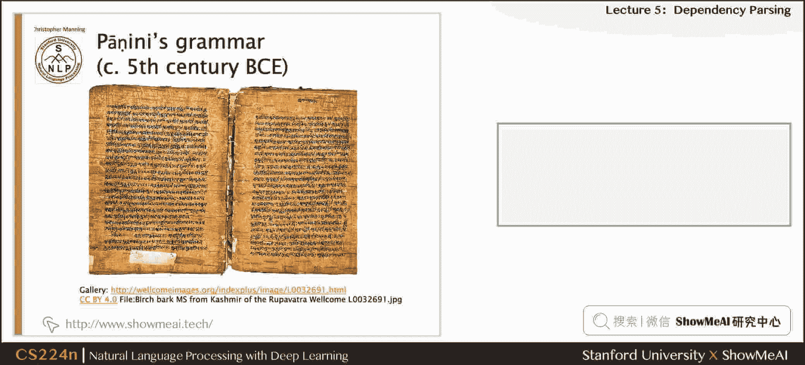

## 2.4 依存语法/解析历史

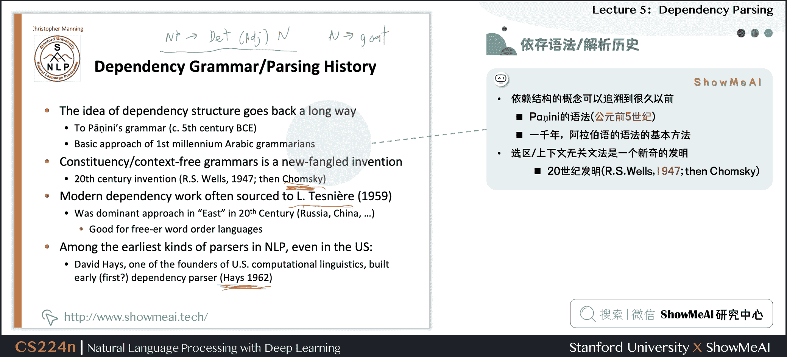

*   依赖结构的概念可以追溯到很久以前
    *   Paṇini 的语法(公元前 5 世纪)
    *   一千年，阿拉伯语的语法的基本方法

*   选区/上下文无关文法是一个新奇的发明
    *   20 世纪发明(R.S.Wells,1947; then Chomsky)

*   现代依赖工作经常源于 L. Tesnière(1959)
    *   是 20 世纪“东方”的主导方法(俄罗斯，中国，…)
        *   有利于更自由的语序语言

*   NLP 中最早类型的解析器在美国
    *   David Hays 是美国计算语言学的创始人之一，他很早就(第一个?)构建了依赖解析器(Hays 1962)

## 2.5 依存语法和依赖结构

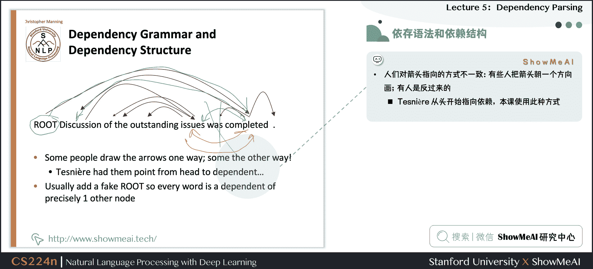

*   人们对箭头指向的方式不一致：有些人把箭头朝一个方向画；有人是反过来的
    *   Tesnière 从头开始指向依赖，本课使用此种方式
*   通常添加一个伪根指向整个句子的头部，这样每个单词都精确地依赖于另一个节点

## 2.6 带注释数据的兴起：通用依存句法树库

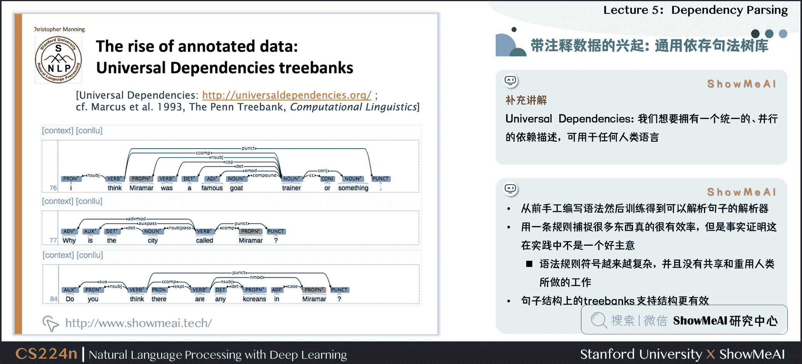

**补充讲解**

Universal Dependencies：我们想要拥有一个统一的、并行的依赖描述，可用于任何人类语言

*   从前手工编写语法然后训练得到可以解析句子的解析器
*   用一条规则捕捉很多东西真的很有效率，但是事实证明这在实践中不是一个好主意
    *   语法规则符号越来越复杂，并且没有共享和重用人类所做的工作
*   句子结构上的 treebanks 支持结构更有效

## 2.7 带注释数据的兴起

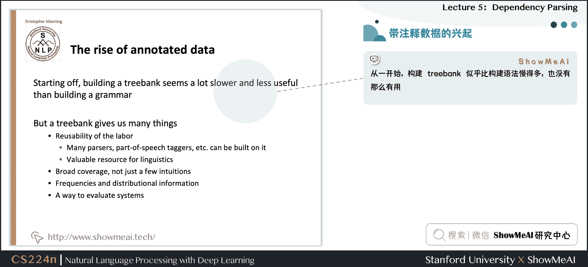

**从一开始，构建 treebank 似乎比构建语法慢得多，也没有那么有用**

**但是 treebank 给我们提供了许多东西**

*   可重用性
    *   许多解析器、词性标记器等可以构建在它之上
    *   语言学的宝贵资源
*   广泛的覆盖面，而不仅仅是一些直觉
*   频率和分布信息
*   一种评估系统的方法

## 2.8 依赖条件首选项

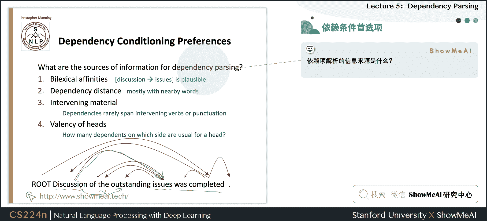

**依赖项解析的信息来源是什么**？

*   1.**Bilexical affinities** (两个单词间的密切关系)
    *   [discussion → issues] 是看上去有道理的
*   2.**Dependency distance 依赖距离**
    *   主要是与相邻词
*   3.**Intervening material 介于中间的物质**
    *   依赖很少跨越介于中间的动词或标点符号
*   4.**Valency of heads**
    *   How many dependents on which side are usual for a head?

## 2.9 依赖关系分析

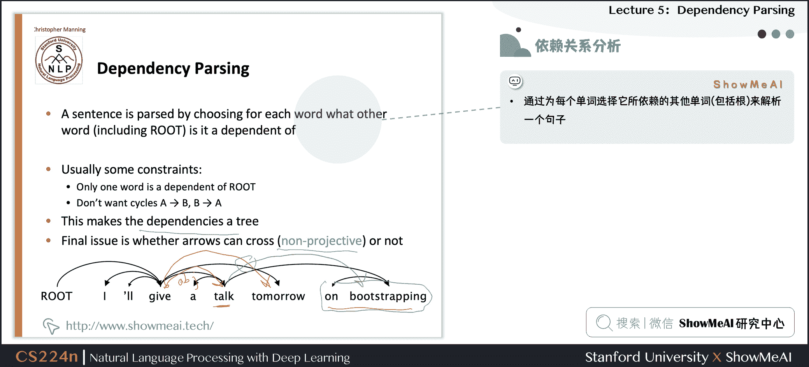

*   通过为每个单词选择它所依赖的其他单词(包括根)来解析一个句子

*   通常有一些限制
    *   只有一个单词是依赖于根的
    *   不存在循环 A→B，B→A
*   这使得依赖项成为树
*   最后一个问题是箭头是否可以交叉(非投影的 non-projective)
    *   没有交叉的就是 non-projectice

## 2.10 射影性

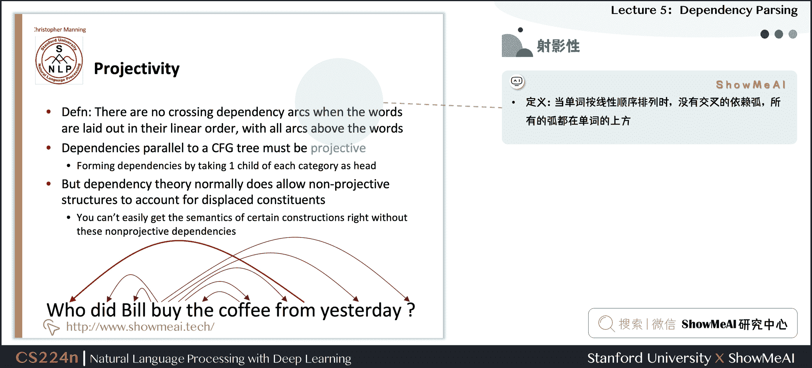

*   定义：当单词按线性顺序排列时，没有交叉的依赖弧，所有的弧都在单词的上方

*   与 CFG 树并行的依赖关系必须是投影的
    *   通过将每个类别的一个子类别作为头来形成依赖关系

*   但是依赖理论通常允许非投射结构来解释移位的成分
    *   如果没有这些非投射依赖关系，就不可能很容易获得某些结构的语义

## 2.11 依存分析方法

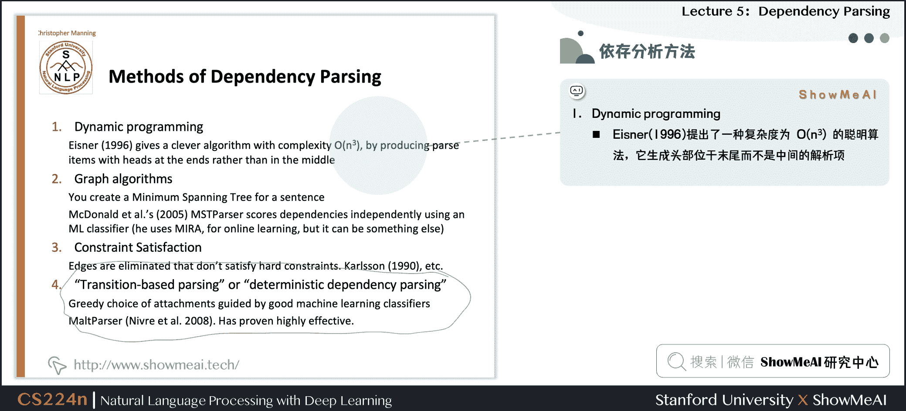

1.**Dynamic programming**

*   Eisner(1996)提出了一种复杂度为 O(n3) 的聪明算法，它生成头部位于末尾而不是中间的解析项

2.**Graph algorithms**

*   为一个句子创建一个最小生成树
*   McDonald et al.’s (2005) MSTParser 使用 ML 分类器独立地对依赖项进行评分(他使用 MIRA 进行在线学习，但它也可以是其他东西)

3.**Constraint Satisfaction**

*   去掉不满足硬约束的边 Karlsson(1990), etc.

4.**“Transition-based parsing” or “deterministic dependency parsing”**

*   良好的机器学习分类器 MaltParser(Nivreet al. 2008) 指导下的依存贪婪选择。已证明非常有效。

# 3.基于转换的依存分析模型

## 3.1 #论文解读# Greedy transition-based parsing [Nivre 2003]

![#论文解读# Greedy transition-based parsing [Nivre 2003]](../Images/07e8685e320330897c2cb0bf25dc1f2d.png)

*   贪婪判别依赖解析器一种简单形式

*   解析器执行一系列自底向上的操作

    *   大致类似于 shift-reduce 解析器中的“shift”或“reduce”，但“reduce”操作专门用于创建头在左或右的依赖项

*   **解析器如下**：
    *   栈 σ \sigma σ 以 ROOT 符号开始，由若干 w i w_i wi​ 组成
    *   缓存 β \beta β 以输入序列开始，由若干 w i w_i wi​ 组成
    *   一个依存弧的集合 A A A ，一开始为空。每条边的形式是 ( w i , r , w j ) (w_i,r,w_j) (wi​,r,wj​)，其中 r r r 描述了节点的依存关系
    *   一组操作

## 3.2 基本的基于转换的依存关系解析器

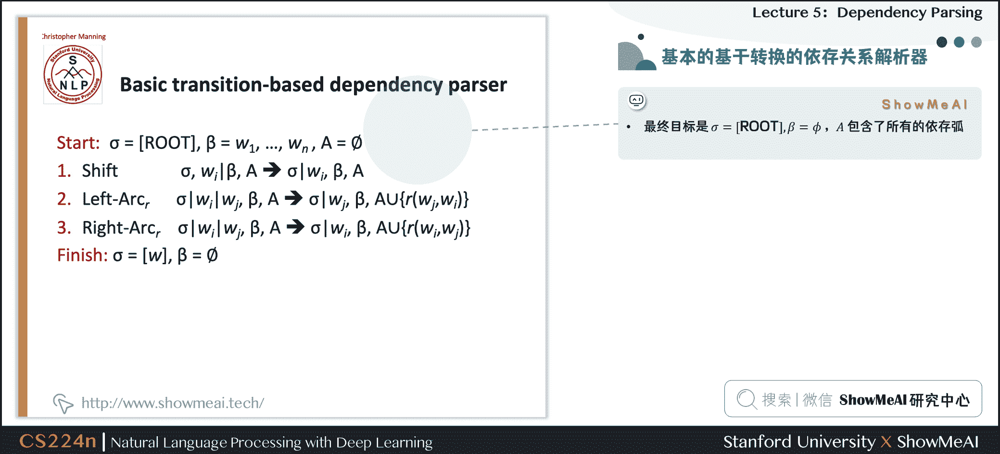

*   最终目标是 σ = [ R O O T ] \sigma = [ROOT] σ=[ROOT]， β = ϕ \beta = \phi β=ϕ， A A A 包含了所有的依存弧

**补充讲解**

**state 之间的 transition 有三类**：

*   1.SHIFT：将 buffer 中的第一个词移出并放到 stack 上。
*   2.LEFT-ARC：将 ( w j , r , w i ) (w_j,r,w_i) (wj​,r,wi​) 加入边的集合 A A A，其中 w i w_i wi​ 是 stack 上的次顶层的词， w j w_j wj​ 是 stack 上的最顶层的词。
*   3.RIGHT-ARC：将 ( w i , r , w j ) (w_i,r,w_j) (wi​,r,wj​) 加入边的集合 A A A，其中 w i w_i wi​ 是 stack 上的次顶层的词， w j w_j wj​ 是 stack 上的最顶层的词。

我们不断的进行上述三类操作，直到从初始态达到最终态。

*   在每个状态下如何选择哪种操作呢？
*   当我们考虑到 LEFT-ARC 与 RIGHT-ARC 各有 ∣ R ∣ \left|R\right| ∣R∣( ∣ R ∣ \left|R\right| ∣R∣为 r r r 的类的个数)种类，我们可以将其看做是 class 数为 2 ∣ R ∣ + 1 2\left|R\right|+1 2∣R∣+1 的分类问题，可以用 SVM 等传统机器学习方法解决。

## 3.3 基于 Arc 标准转换的解析器

*   还有其他的 transition 方案
*   Analysis of `I ate fish`

## 3.4 #论文解读# MaltParser [Nivre and Hall 2005]

![#论文解读# MaltParser [Nivre and Hall 2005]](../Images/35caf186a76f469c872b90223eafe057.png)

*   我们需要解释如何选择下一步行动
    *   Answer：机器学习

*   每个动作都由一个有区别分类器(例如 softmax classifier)对每个合法的移动进行预测
*   最多三种无类型的选择，当带有类型时，最多 ∣ R ∣ × 2 + 1 \left|R\right|×2+1 ∣R∣×2+1 种
*   Features：栈顶单词，POS；buffer 中的第一个单词，POS；等等

*   在最简单的形式中是没有搜索的
    *   但是，如果你愿意，你可以有效地执行一个 Beam search 束搜索(虽然速度较慢，但效果更好)：你可以在每个时间步骤中保留 k k k 个好的解析前缀

*   该模型的精度略低于依赖解析的最高水平，但它提供了非常快的线性时间解析，性能非常好

## 3.5 传统特征表示

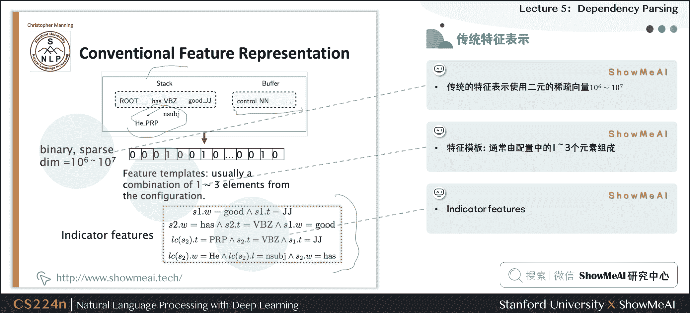

*   传统的特征表示使用二元的稀疏向量 1 0 6 ∼ 1 0 7 10⁶ \sim 10⁷ 106∼107
*   特征模板：通常由配置中的 1 ∼ 3 1 \sim 3 1∼3 个元素组成
*   Indicator features

## 3.6 依赖分析的评估：(标记)依赖准确性

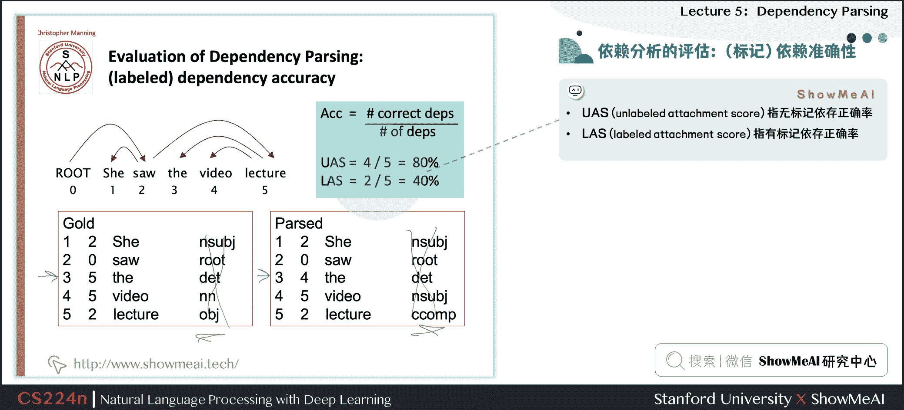

*   UAS (unlabeled attachment score) 指无标记依存正确率
*   LAS (labeled attachment score) 指有标记依存正确率

## 3.7 处理非投影性

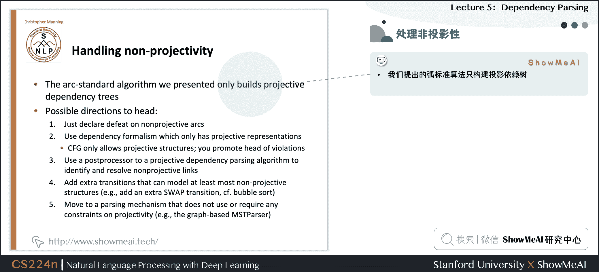

*   我们提出的弧标准算法只构建投影依赖树

头部可能的方向：

*   1.在非投影弧上宣布失败
*   2.只具有投影表示时使用依赖形式[CFG 只允许投影结构]
*   3.使用投影依赖项解析算法的后处理器来识别和解析非投影链接
*   4.添加额外的转换，至少可以对大多数非投影结构建模(添加一个额外的交换转换，冒泡排序)
*   5.转移到不使用或不需要对投射性进行任何约束的解析机制(例如，基于图的 MSTParser)

## 3.8 为什么要训练神经依赖解析器？重新审视指标特征

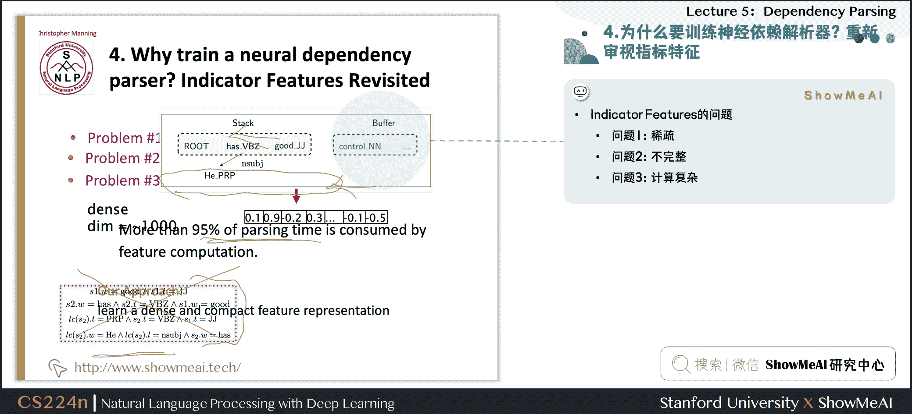

*   Indicator Features 的问题
    *   问题 1：稀疏
    *   问题 2：不完整
    *   问题 3：计算复杂

*   超过 95%的解析时间都用于特征计算

# 4.神经网络依存分析器

## 4.1 #论文解读# A neural dependency parser [Chen and Manning 2014]

![#论文解读# A neural dependency parser [Chen and Manning 2014]](../Images/d36f6e2e9e131d6e8fd3db8cf71ef303.png)

*   斯坦福依存关系的英语解析
    *   Unlabeled attachment score (UAS) = head
    *   Labeled attachment score (LAS) = head and label

*   效果好，速度快

## 4.2 分布式表示

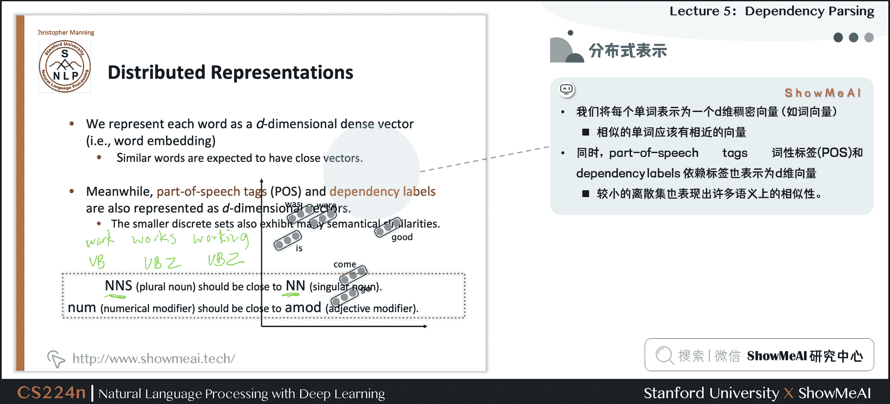

*   我们将每个单词表示为一个 d 维稠密向量(如词向量)
    *   相似的单词应该有相近的向量

*   同时，part-of-speech tags 词性标签(POS)和 dependency labels 依赖标签也表示为 d 维向量
    *   较小的离散集也表现出许多语义上的相似性。

*   NNS(复数名词)应该接近 NN(单数名词)
    *   num(数值修饰语)应该接近 amod(形容词修饰语)

## 4.3 从配置中提取令牌和向量表示

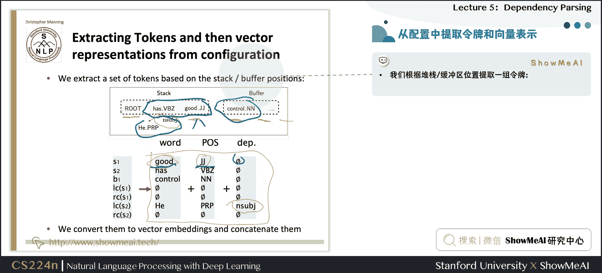

**补充讲解**

*   对于 Neural Dependency Parser，其输入特征通常包含三种
    *   stack 和 buffer 中的单词及其 dependent word
    *   单词的 part-of-speech tag
    *   描述语法关系的 arc label

## 4.4 模型体系结构

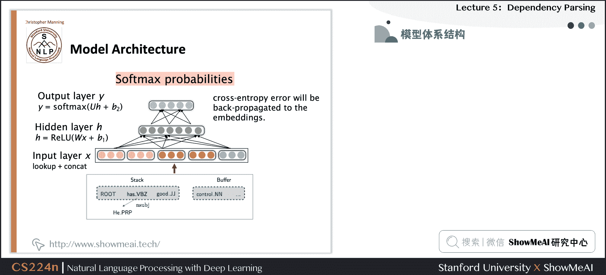

## 4.5 句子结构的依存分析

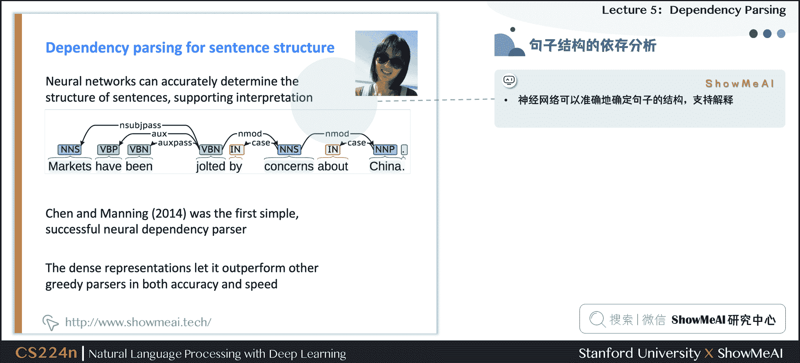

*   神经网络可以准确地确定句子的结构，支持解释

*   Chen and Manning(2014)是第一个简单，成功的神经依赖解析器
*   密集的表示使得它在精度和速度上都优于其他贪婪的解析器

## 4.6 基于转换的神经依存分析的新进展

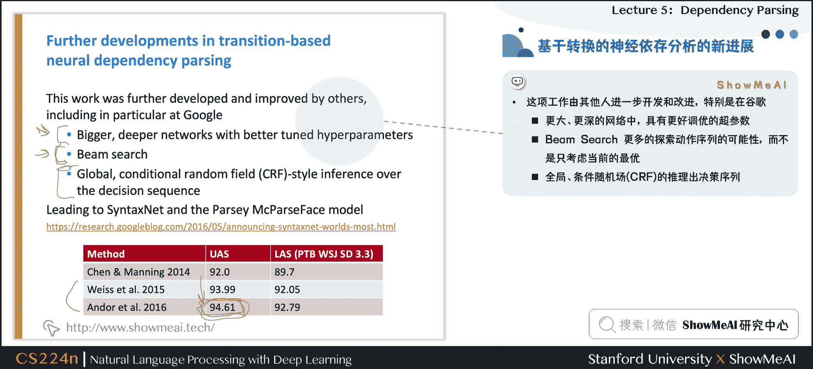

*   这项工作由其他人进一步开发和改进，特别是在谷歌
    *   更大、更深的网络中，具有更好调优的超参数
    *   Beam Search 更多的探索动作序列的可能性，而不是只考虑当前的最优
    *   全局、条件随机场(CRF)的推理出决策序列

*   这就引出了 SyntaxNet 和 Parsey McParseFace 模型

## 4.7 基于图形的依存关系分析器

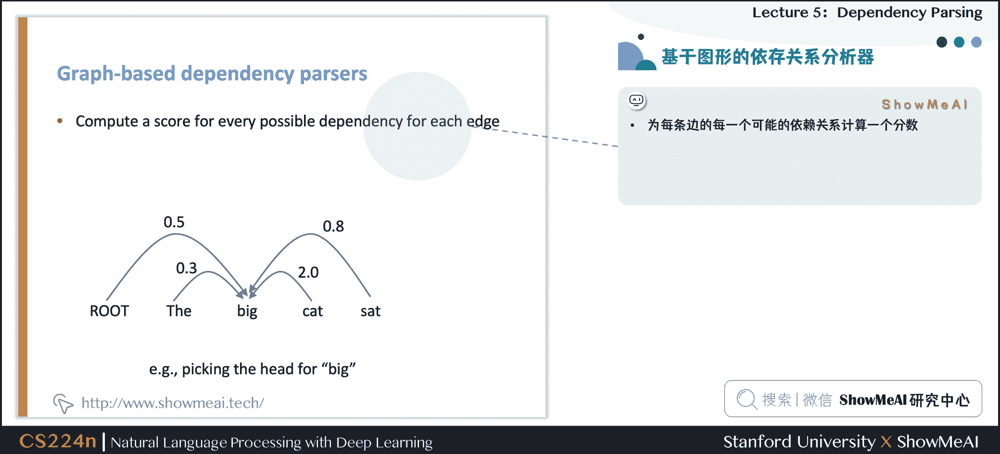

## 4.8 #论文解读# A Neural graph-based dependency parser [Dozat and Manning 2017; Dozat, Qi, and Manning 2017]

![#论文解读# A Neural graph-based dependency parser [Dozat and Manning 2017; Dozat,** **Qi** **, and Manning 2017]](../Images/091b0e4dc0ab7463daee8fae38feb212.png)

*   为每条边的每一个可能的依赖关系计算一个分数

*   为每条边的每一个可能的依赖关系计算一个分数
    *   然后将每个单词的边缘添加到其得分最高的候选头部
    *   并对每个单词重复相同的操作

*   在神经模型中为基于图的依赖分析注入活力
    *   为神经依赖分析设计一个双仿射评分模型
    *   也使用神经序列模型，我们将在下周讨论

*   非常棒的结果
    *   但是比简单的基于神经传递的解析器要慢
    *   在一个长度为 n n n 的句子中可能有 n 2 n² n2 个依赖项

# 5.视频教程

可以点击 [**B 站**](https://www.bilibili.com/video/BV1Yo4y1D7FW?p=5) 查看视频的【双语字幕】版本

[`player.bilibili.com/player.html?aid=376755412&page=5`](https://player.bilibili.com/player.html?aid=376755412&page=5)

【双语字幕+资料下载】斯坦福 CS224n | 深度学习与自然语言处理(2019·全 20 讲)

# 6.参考资料

*   [本讲带学的**在线阅翻页本**](https://blog.showmeai.tech/cs224n/lecture05-Linguistic-Structure-Dependency-Parsing#/)
*   [《斯坦福 CS224n 深度学习与自然语言处理》**课程学习指南**](https://blog.showmeai.tech/cs224n/)
*   [《斯坦福 CS224n 深度学习与自然语言处理》**课程大作业解析**](https://github.com/ShowMeAI-Hub/awesome-AI-courses-notes-cheatsheets/tree/main/CS224n-Natural-Language-Processing-with-Deep-Learning/assignment-solutions)
*   [【**双语字幕视频**】斯坦福 CS224n | 深度学习与自然语言处理(2019·全 20 讲)](https://www.bilibili.com/video/BV1Yo4y1D7FW)
*   [**Stanford 官网** | CS224n: Natural Language Processing with Deep Learning](https://web.stanford.edu/class/archive/cs/cs224n/cs224n.1194/)

# [**ShowMeAI**](http://www.showmeai.tech)系列教程推荐

*   [大厂技术实现 | 推荐与广告计算解决方案](http://www.showmeai.tech/tutorials/50)
*   [大厂技术实现 | 计算机视觉解决方案](http://www.showmeai.tech/tutorials/51)
*   [大厂技术实现 | 自然语言处理行业解决方案](http://www.showmeai.tech/tutorials/52)
*   [图解 Python 编程：从入门到精通系列教程](http://www.showmeai.tech/tutorials/56)
*   [图解数据分析：从入门到精通系列教程](http://www.showmeai.tech/tutorials/33)
*   [图解 AI 数学基础：从入门到精通系列教程](http://www.showmeai.tech/tutorials/83)
*   [图解大数据技术：从入门到精通系列教程](http://www.showmeai.tech/tutorials/84)
*   [图解机器学习算法：从入门到精通系列教程](http://www.showmeai.tech/tutorials/34)
*   [机器学习实战：手把手教你玩转机器学习系列](http://www.showmeai.tech/tutorials/41)
*   [深度学习教程 | 吴恩达专项课程 · 全套笔记解读](http://www.showmeai.tech/tutorials/35)
*   [自然语言处理教程 | 斯坦福 CS224n 课程 · 课程带学与全套笔记解读](http://www.showmeai.tech/tutorials/36)

# NLP 系列教程文章

*   [NLP 教程(1)- 词向量、SVD 分解与 Word2vec](http://showmeai.tech/article-detail/230)
*   [NLP 教程(2)- GloVe 及词向量的训练与评估](http://showmeai.tech/article-detail/232)
*   [NLP 教程(3)- 神经网络与反向传播](http://showmeai.tech/article-detail/234)
*   [NLP 教程(4)- 句法分析与依存解析](http://www.showmeai.tech/article-detail/237)
*   [NLP 教程(5)- 语言模型、RNN、GRU 与 LSTM](http://www.showmeai.tech/article-detail/239)
*   [NLP 教程(6)- 神经机器翻译、seq2seq 与注意力机制](http://www.showmeai.tech/article-detail/242)
*   [NLP 教程(7)- 问答系统](http://www.showmeai.tech/article-detail/245)
*   [NLP 教程(8)- NLP 中的卷积神经网络](http://www.showmeai.tech/article-detail/247)
*   [NLP 教程(9)- 句法分析与树形递归神经网络](http://www.showmeai.tech/article-detail/255)

# 斯坦福 CS224n 课程带学详解

*   [斯坦福 NLP 课程 | 第 1 讲 - NLP 介绍与词向量初步](http://showmeai.tech/article-detail/231)
*   [斯坦福 NLP 课程 | 第 2 讲 - 词向量进阶](http://showmeai.tech/article-detail/233)
*   [斯坦福 NLP 课程 | 第 3 讲 - 神经网络知识回顾](http://showmeai.tech/article-detail/235)
*   [斯坦福 NLP 课程 | 第 4 讲 - 神经网络反向传播与计算图](http://showmeai.tech/article-detail/236)
*   [斯坦福 NLP 课程 | 第 5 讲 - 句法分析与依存解析](http://www.showmeai.tech/article-detail/238)
*   [斯坦福 NLP 课程 | 第 6 讲 - 循环神经网络与语言模型](http://www.showmeai.tech/article-detail/240)
*   [斯坦福 NLP 课程 | 第 7 讲 - 梯度消失问题与 RNN 变种](http://www.showmeai.tech/article-detail/241)
*   [斯坦福 NLP 课程 | 第 8 讲 - 机器翻译、seq2seq 与注意力机制](http://www.showmeai.tech/article-detail/243)
*   [斯坦福 NLP 课程 | 第 9 讲 - cs224n 课程大项目实用技巧与经验](http://www.showmeai.tech/article-detail/244)
*   [斯坦福 NLP 课程 | 第 10 讲 - NLP 中的问答系统](http://www.showmeai.tech/article-detail/246)
*   [斯坦福 NLP 课程 | 第 11 讲 - NLP 中的卷积神经网络](http://www.showmeai.tech/article-detail/248)
*   [斯坦福 NLP 课程 | 第 12 讲 - 子词模型](http://www.showmeai.tech/article-detail/249)
*   [斯坦福 NLP 课程 | 第 13 讲 - 基于上下文的表征与 NLP 预训练模型](http://www.showmeai.tech/article-detail/250)
*   [斯坦福 NLP 课程 | 第 14 讲 - Transformers 自注意力与生成模型](http://www.showmeai.tech/article-detail/251)
*   [斯坦福 NLP 课程 | 第 15 讲 - NLP 文本生成任务](http://www.showmeai.tech/article-detail/252)
*   [斯坦福 NLP 课程 | 第 16 讲 - 指代消解问题与神经网络方法](http://www.showmeai.tech/article-detail/253)
*   [斯坦福 NLP 课程 | 第 17 讲 - 多任务学习(以问答系统为例)](http://www.showmeai.tech/article-detail/254)
*   [斯坦福 NLP 课程 | 第 18 讲 - 句法分析与树形递归神经网络](http://www.showmeai.tech/article-detail/256)
*   [斯坦福 NLP 课程 | 第 19 讲 - AI 安全偏见与公平](http://www.showmeai.tech/article-detail/257)
*   [斯坦福 NLP 课程 | 第 20 讲 - NLP 与深度学习的未来](http://www.showmeai.tech/article-detail/258)

