# 斯坦福 NLP 课程 | 第 6 讲 - 循环神经网络与语言模型

> 原文：[`blog.csdn.net/ShowMeAI/article/details/124584938`](https://blog.csdn.net/ShowMeAI/article/details/124584938)

作者：[韩信子](https://github.com/HanXinzi-AI)@[ShowMeAI](http://www.showmeai.tech/)，路遥@[ShowMeAI](http://www.showmeai.tech/)，奇异果@[ShowMeAI](http://www.showmeai.tech/)
[教程地址](http://www.showmeai.tech/tutorials/36)：[`www.showmeai.tech/tutorials/36`](http://www.showmeai.tech/tutorials/36)
[本文地址](http://www.showmeai.tech/article-detail/240)：[`www.showmeai.tech/article-detail/240`](http://www.showmeai.tech/article-detail/240)
声明：版权所有，转载请联系平台与作者并注明出处

收藏[ShowMeAI](http://www.showmeai.tech/)查看更多精彩内容

* * *

[ShowMeAI](http://www.showmeai.tech/)为**斯坦福 CS224n**《自然语言处理与深度学习(Natural Language Processing with Deep Learning)》课程的全部课件，做了**中文翻译和注释**，并制作成了 GIF 动图！

本讲内容的**深度总结教程**可以在[**这里**](http://www.showmeai.tech/article-detail/239) 查看。视频和课件等资料的获取方式见**文末**。

* * *

# 引言

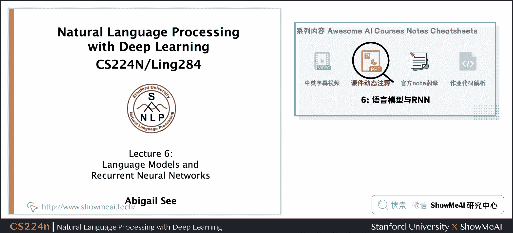

（本篇内容也可以参考[ShowMeAI](http://www.showmeai.tech/)的对吴恩达老师课程的总结文章[深度学习教程 | **序列模型与 RNN 网络**](http://www.showmeai.tech/article-detail/225)）

## 概述

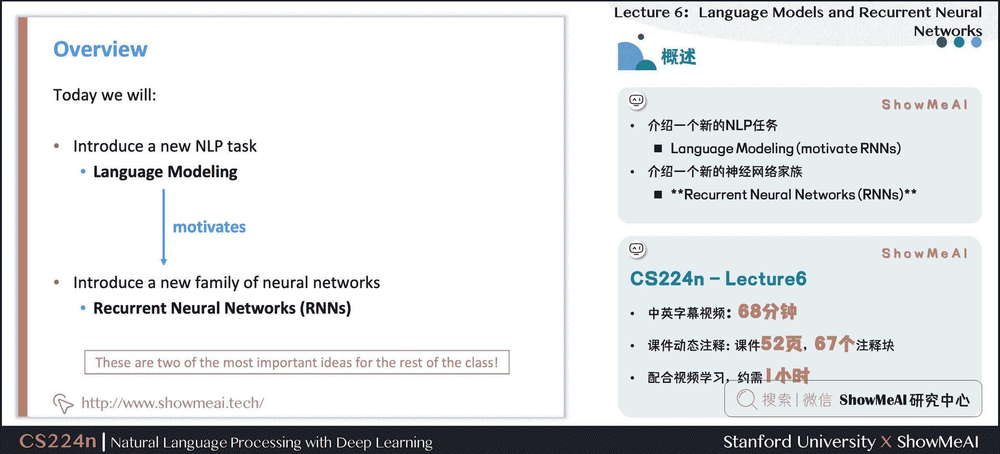

*   介绍一个新的 NLP 任务
    *   Language Modeling 语言模型
*   介绍一个新的神经网络家族
    *   Recurrent Neural Networks (RNNs)

# 1.语言模型

## 1.1 语言模型

**语言建模**的任务是预测下一个单词是什么

更正式的说法是：给定一个单词序列 x ( 1 ) , x ( 2 ) , … , x ( t ) \boldsymbol{x}^{(1)}, \boldsymbol{x}^{(2)}, \ldots, \boldsymbol{x}^{(t)} x(1),x(2),…,x(t)，计算下一个单词 x ( t + 1 ) x^{(t+1)} x(t+1) 的概率分布：

P ( x ( t + 1 ) ∣ x ( t ) , … , x ( 1 ) ) P\left(\boldsymbol{x}^{(t+1)} \mid \boldsymbol{x}^{(t)}, \ldots, \boldsymbol{x}^{(1)}\right) P(x(t+1)∣x(t),…,x(1))

*   其中， x ( t + 1 ) x^{(t+1)} x(t+1) 可以是词表中的任意单词 V = { w 1 , … , w ∣ V ∣ } V=\left\{\boldsymbol{w}_{1}, \ldots, \boldsymbol{w}_{|V|}\right\} V={w1​,…,w∣V∣​}
*   这样做的系统称为 Language Model 语言模型

## 1.2 语言模型

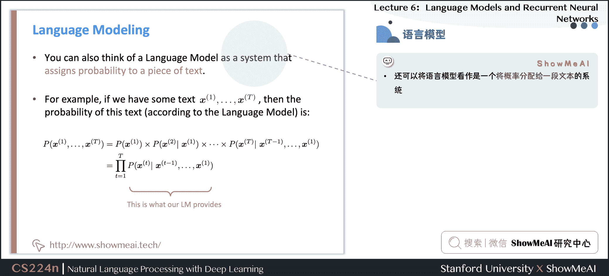

*   还可以将语言模型看作**评估一段文本是自然句子（通顺度）的概率**

*   例如，如果我们有一段文本 x ( 1 ) , … , x ( T ) x^{(1)},\dots,x^{(T)} x(1),…,x(T)，则这段文本的概率(根据语言模型)为

P ( x ( 1 ) , … , x ( T ) ) = P ( x ( 1 ) ) × P ( x ( 2 ) ∣ x ( 1 ) ) × ⋯ × P ( x ( T ) ∣ x ( T − 1 ) , … , x ( 1 ) ) = ∏ t = 1 T P ( x ( t ) ∣ x ( t − 1 ) , … , x ( 1 ) ) \begin{aligned} P\left(\boldsymbol{x}^{(1)}, \ldots, \boldsymbol{x}^{(T)}\right) &=P\left(\boldsymbol{x}^{(1)}\right) \times P\left(\boldsymbol{x}^{(2)} \mid \boldsymbol{x}^{(1)}\right) \times \cdots \times P\left(\boldsymbol{x}^{(T)} \mid \boldsymbol{x}^{(T-1)}, \ldots, \boldsymbol{x}^{(1)}\right) \\ &=\prod_{t=1}^{T} P\left(\boldsymbol{x}^{(t)} \mid \boldsymbol{x}^{(t-1)}, \ldots, \boldsymbol{x}^{(1)}\right) \end{aligned} P(x(1),…,x(T))​=P(x(1))×P(x(2)∣x(1))×⋯×P(x(T)∣x(T−1),…,x(1))=t=1∏T​P(x(t)∣x(t−1),…,x(1))​

*   语言模型提供的是 ∏ t = 1 T P ( x ( t ) ∣ x ( t − 1 ) , … , x ( 1 ) ) \prod_{t=1}^{T} P\left(\boldsymbol{x}^{(t)} \mid \boldsymbol{x}^{(t-1)}, \ldots, \boldsymbol{x}^{(1)}\right) ∏t=1T​P(x(t)∣x(t−1),…,x(1))

## 1.3 随处可见的语言模型

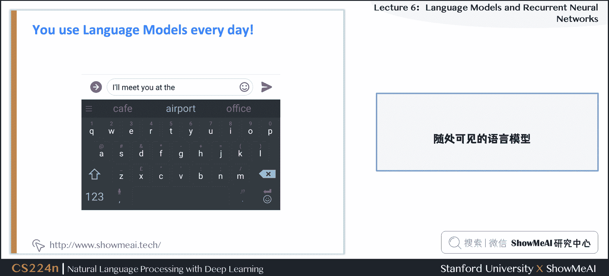

## 1.4 随处可见的语言模型

## 1.5 n-gram 语言模型

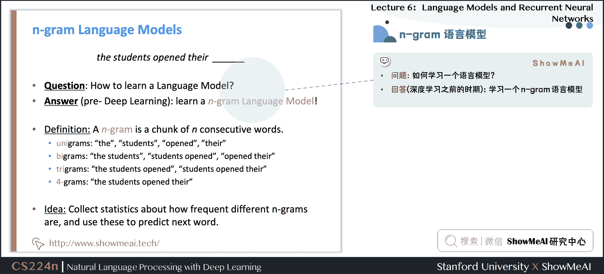

`the students opened their __`

*   **问题**：如何学习一个语言模型？
*   **回答**(深度学习之前的时期)：学习一个 n-gram 语言模型

*   **定义**：n-gram 是一个由 n n n 个连续单词组成的块

    *   unigrams: `the`, `students`, `opened`, `their`
    *   bigrams: `the students`, `students opened`, `opened their`
    *   trigrams: `the students opened`, `students opened their`
    *   4-grams: `the students opened their`

*   **想法**：收集关于不同 n-gram 出现频率的统计数据，并使用这些数据预测下一个单词

## 1.6 n-gram 语言模型

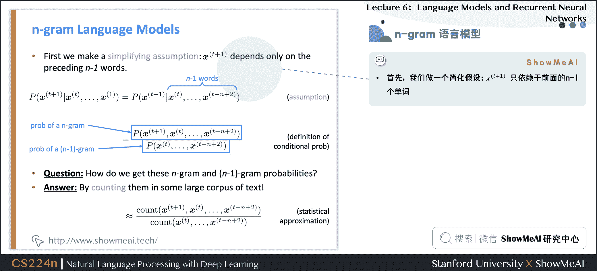

*   首先，我们做一个简化假设： x ( t + 1 ) x^{(t+1)} x(t+1) 只依赖于前面的 n − 1 n-1 n−1 个单词

P ( x ( t + 1 ) ∣ x ( t ) , … , x ( 1 ) ) = P ( x ( t + 1 ) ∣ x ( t ) , … , x ( t − n + 2 ) ) = P ( x ( t + 1 ) , x ( t ) , … , x ( t − n + 2 ) ) P ( x ( t ) , … , x ( t − n + 2 ) ) \begin{aligned} P\left(\boldsymbol{x}^{(t+1)} \mid \boldsymbol{x}^{(t)}, \ldots, \boldsymbol{x}^{(1)}\right) & =P\left(\boldsymbol{x}^{(t+1)} \mid \boldsymbol{x}^{(t)}, \ldots, \boldsymbol{x}^{(t-n+2)}\right)\\ &=\frac{P\left(\boldsymbol{x}^{(t+1)}, \boldsymbol{x}^{(t)}, \ldots, \boldsymbol{x}^{(t-n+2)}\right)}{P\left(\boldsymbol{x}^{(t)}, \ldots, \boldsymbol{x}^{(t-n+2)}\right)} \end{aligned} P(x(t+1)∣x(t),…,x(1))​=P(x(t+1)∣x(t),…,x(t−n+2))=P(x(t),…,x(t−n+2))P(x(t+1),x(t),…,x(t−n+2))​​

*   **问题**：如何得到 n-gram 和(n-1)-gram 的概率？
*   **回答**：通过在一些大型文本语料库中计算它们(统计近似)

≈ count ⁡ ( x ( t + 1 ) , x ( t ) , … , x ( t − n + 2 ) ) count ⁡ ( x ( t ) , … , x ( t − n + 2 ) ) \approx \frac{\operatorname{count}\left(\boldsymbol{x}^{(t+1)}, \boldsymbol{x}^{(t)}, \ldots, \boldsymbol{x}^{(t-n+2)}\right)}{\operatorname{count}\left(\boldsymbol{x}^{(t)}, \ldots, \boldsymbol{x}^{(t-n+2)}\right)} ≈count(x(t),…,x(t−n+2))count(x(t+1),x(t),…,x(t−n+2))​

## 1.7 n-gram 语言模型：示例

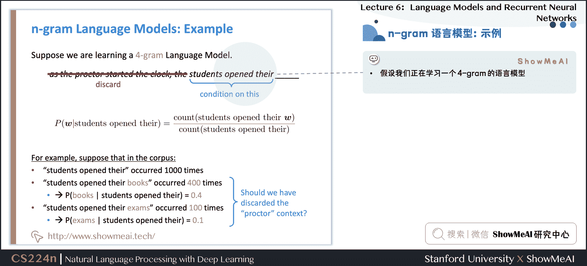

假设我们正在学习一个 **4-gram** 的语言模型

*   例如，假设在语料库中：
    *   `students opened their` 出现了 1000 1000 1000 次
    *   `students opened their books` 出现了 400 400 400 次

P ( books ∣ students opened their ) = 0.4 P(\text{books} \mid \text{students opened their})=0.4 P(books∣students opened their)=0.4

*   `students opened their exams` 出现了 100 100 100 次

P ( exams ∣ students opened their ) = 0.1 P( \text{exams} \mid \text{students opened their})=0.1 P(exams∣students opened their)=0.1

*   我们应该忽视上下文中的 `proctor` 吗？
    *   在本例中，上下文里出现了 `proctor`，所以 `exams` 在这里的上下文中应该是比 `books` 概率更大的。

## 1.8 n-gram 语言模型的稀疏性问题

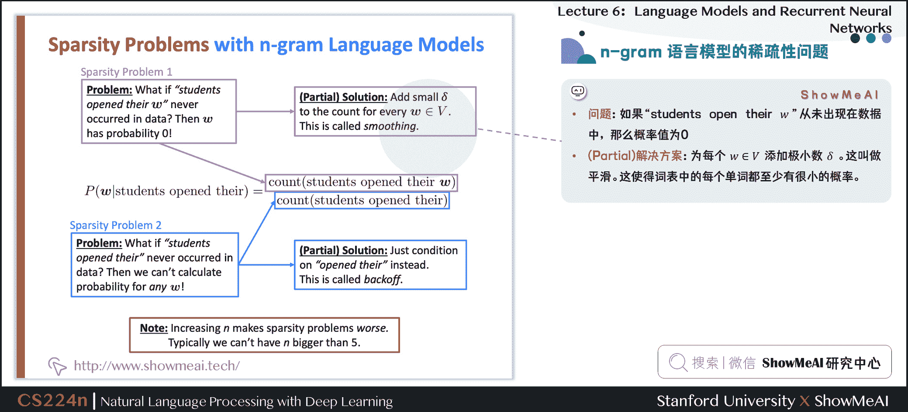

*   **问题 1**：如果`students open their ww` 从未出现在数据中，那么概率值为 0 0 0

*   (Partial)**解决方案**：为每个 w ∈ V w \in V w∈V 添加极小数 δ \delta δ ，这叫做平滑。这使得词表中的每个单词都至少有很小的概率。

*   **问题 2**：如果`students open their` 从未出现在数据中，那么我们将无法计算任何单词 w w w 的概率值

*   (Partial)**解决方案**：将条件改为`open their`，也叫做后退处理。

*   Note/注意: n n n 的增加使稀疏性问题变得更糟。一般情况下 n n n 不能大于 5 5 5。

## 1.9 n-gram 语言模型的存储问题

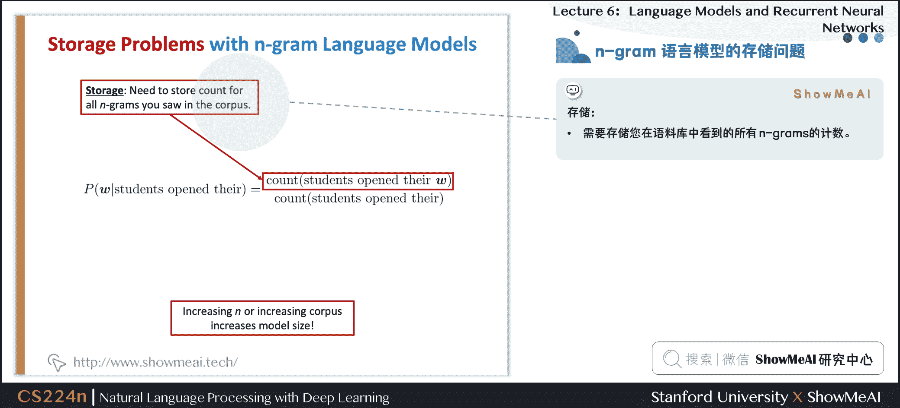

**问题**：需要存储你在语料库中看到的所有 n-grams 的计数

增加 n n n 或增加语料库都会增加模型大小

## 1.10 n-gram 语言模型在实践中的应用

> Try for yourself: https://nlpforhackers.io/language-models/

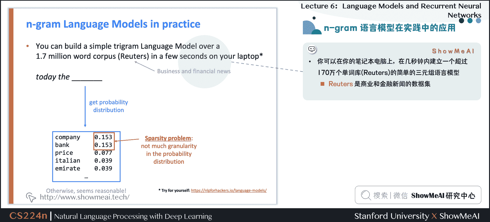

*   你可以在你的笔记本电脑上，在几秒钟内建立一个超过 170 万个单词库(Reuters)的简单的三元组语言模型
    *   **Reuters** 是 商业和金融新闻的数据集

**稀疏性问题**：

*   概率分布的粒度不大。`today the company`和`today he bank`都是 4/26，都只出现过四次

## 1.11 n-gram 语言模型的生成文本

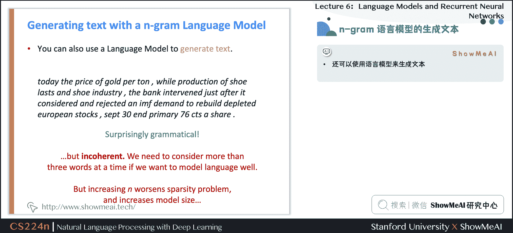

*   可以使用语言模型来生成文本

*   使用 trigram 运行以上生成过程时，会得到上图左侧的文本

*   令人惊讶的是其具有语法但是是不连贯的。如果我们想要很好地模拟语言，我们需要同时考虑三个以上的单词。但增加 n n n 使模型的稀疏性问题恶化，模型尺寸增大

## 1.12 如何搭建一个神经语言模型？

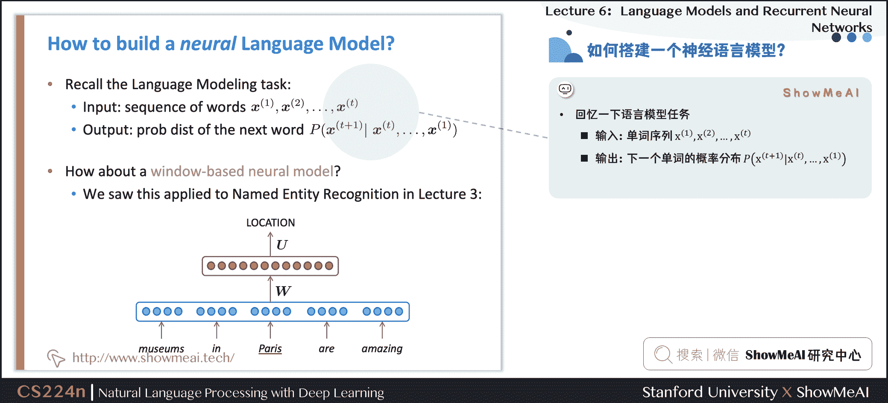

*   回忆一下语言模型任务

    *   **输入**：单词序列 x ( 1 ) , x ( 2 ) , … , x ( t ) \boldsymbol{x}^{(1)}, \boldsymbol{x}^{(2)}, \ldots, \boldsymbol{x}^{(t)} x(1),x(2),…,x(t)
    *   **输出**：下一个单词的概 P ( x ( t + 1 ) ∣ x ( t ) , … , x ( 1 ) ) P\left(\boldsymbol{x}^{(t+1)} \mid \boldsymbol{x}^{(t)}, \ldots, \boldsymbol{x}^{(1)}\right) P(x(t+1)∣x(t),…,x(1))率分布

*   **window-based neural model** 在第三讲中被用于 NER 问题

## 1.13 固定窗口的神经语言模型

*   使用和 NER 问题中同样网络结构

## 1.14 固定窗口的神经语言模型

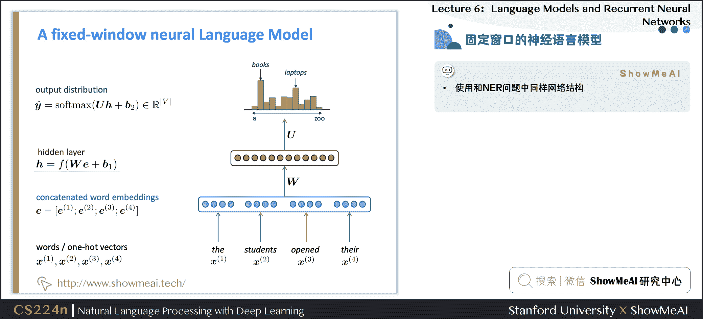

## 1.15 固定窗口的神经语言模型

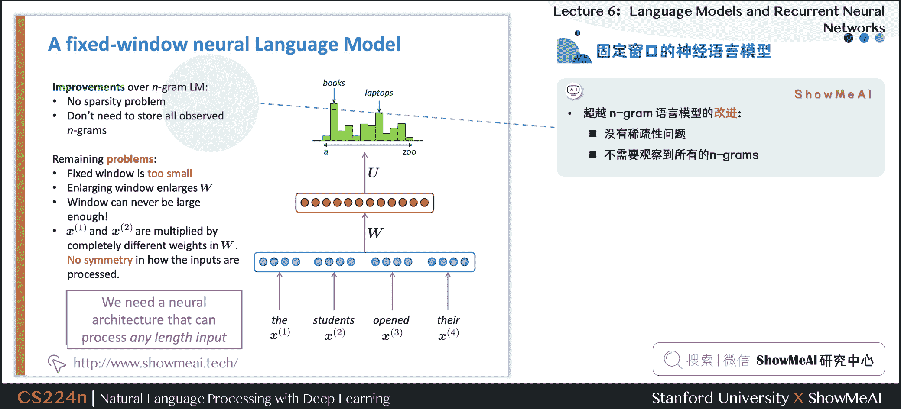

超越 n-gram 语言模型的**改进**

*   没有稀疏性问题
*   不需要观察到所有的 n-grams

NNLM 存在的**问题**

*   固定窗口太小
*   扩大窗口就需要扩大权重矩阵 W W W
*   窗口再大也不够用
*   x ( 1 ) x^{(1)} x(1)和 x ( 2 ) x^{(2)} x(2) 乘以完全不同的权重。输入的处理不对称

我们需要一个神经结构，可以处理任何长度的输入

# 2.循环神经网络(RNN)

## 2.1 循环神经网络(RNN)

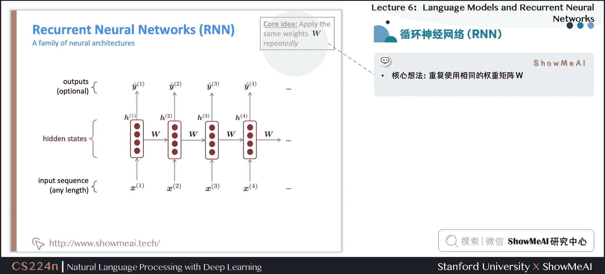

*   **核心想法**：重复使用相同的权重矩阵 W W W

## 2.2 RNN 语言模型

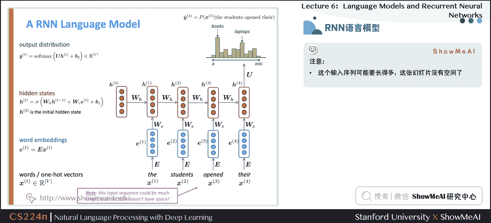

## 2.3 RNN 语言模型

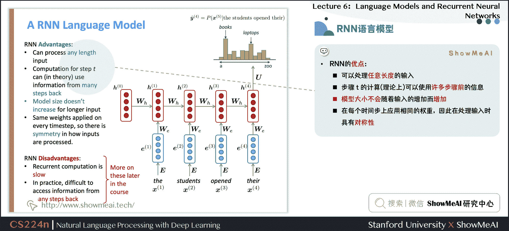

*   RNN 的**优点**
    *   可以处理**任意长度**的输入
    *   步骤 t t t 的计算(理论上)可以使用**许多步骤前**的信息
    *   **模型大小不会**随着输入的增加而**增加**
    *   在每个时间步上应用相同的权重，因此在处理输入时具有**对称性**

*   RNN 的**缺点**
    *   循环串行计算速度慢
    *   在实践中，很难从许多步骤前返回信息

## 2.4 训练一个 RNN 语言模型

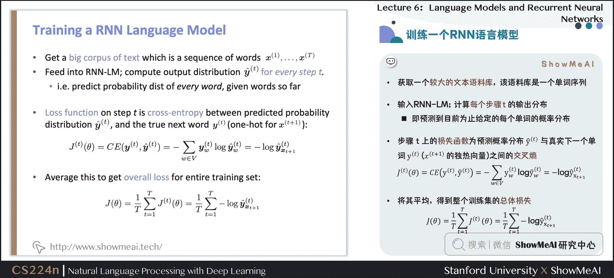

*   获取一个**较大的文本语料库**，该语料库是一个单词序列
*   输入 RNN-LM；计算**每个步骤** t t t 的输出分布

    *   即预测到目前为止给定的每个单词的概率分布 

*   步骤 t t t 上的**损失函**数为预测概率分布 y ^ ( t ) \hat{\boldsymbol{y}}^{(t)} y^​(t) 与真实下一个单词 y ( t ) {\boldsymbol{y}}^{(t)} y(t) ( x ( t + 1 ) x^{(t+1)} x(t+1)的独热向量)之间的**交叉熵**

J ( t ) ( θ ) = C E ( y ( t ) , y ^ ( t ) ) = − ∑ w ∈ V y w ( t ) log ⁡ y ^ w ( t ) = − log ⁡ y ^ x t + 1 ( t ) J^{(t)}(\theta)=C E\left(\boldsymbol{y}^{(t)}, \hat{\boldsymbol{y}}^{(t)}\right)=-\sum_{w \in V} \boldsymbol{y}_{w}^{(t)} \log \hat{\boldsymbol{y}}_{w}^{(t)}=-\log \hat{\boldsymbol{y}}_{\boldsymbol{x}_{t+1}}^{(t)} J(t)(θ)=CE(y(t),y^​(t))=−w∈V∑​yw(t)​logy^​w(t)​=−logy^​xt+1​(t)​

*   将其平均，得到整个训练集的**总体损失**

J ( θ ) = 1 T ∑ t = 1 T J ( t ) ( θ ) = 1 T ∑ t = 1 T − log ⁡ y ^ x t + 1 ( t ) J(\theta)=\frac{1}{T} \sum_{t=1}^{T} J^{(t)}(\theta)=\frac{1}{T} \sum_{t=1}^{T}-\log \hat{\boldsymbol{y}}_{\boldsymbol{x}_{t+1}}^{(t)} J(θ)=T1​t=1∑T​J(t)(θ)=T1​t=1∑T​−logy^​xt+1​(t)​

## 2.5 训练一个 RNN 语言模型

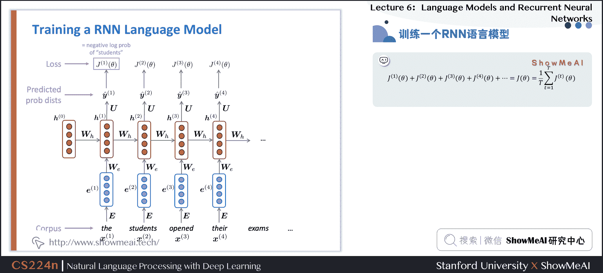

J ( 1 ) ( θ ) + J ( 2 ) ( θ ) + J ( 3 ) ( θ ) + J ( 4 ) ( θ ) + ⋯ = J ( θ ) = 1 T ∑ t = 1 T J ( t ) ( θ ) J^{(1)}(\theta)+J^{(2)}(\theta)+J^{(3)}(\theta)+J^{(4)}(\theta)+\cdots=J(\theta)=\frac{1}{T} \sum_{t=1}^{T} J^{(t)}(\theta) J(1)(θ)+J(2)(θ)+J(3)(θ)+J(4)(θ)+⋯=J(θ)=T1​t=1∑T​J(t)(θ)

## 2.6 训练一个 RNN 语言模型

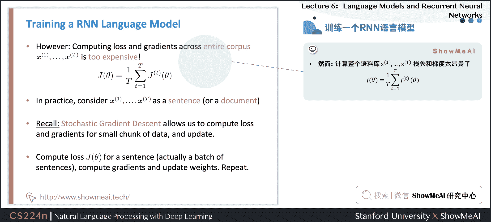

*   然而：计算整个语料库 x ( 1 ) , … , x ( T ) \boldsymbol{x}^{(1)}, \ldots, \boldsymbol{x}^{(T)} x(1),…,x(T) 的损失和梯度太昂贵了

J ( θ ) = 1 T ∑ t = 1 T J ( t ) ( θ ) J(\theta)=\frac{1}{T} \sum_{t=1}^{T} J^{(t)}(\theta) J(θ)=T1​t=1∑T​J(t)(θ)

*   在实践中，我们通常将 x ( 1 ) , … , x ( T ) \boldsymbol{x}^{(1)}, \ldots, \boldsymbol{x}^{(T)} x(1),…,x(T) 看做一个句子或是文档
*   回忆：随机梯度下降允许我们计算小块数据的损失和梯度，并进行更新
*   计算一个句子的损失 J ( θ ) J(\theta) J(θ) (实际上是一批句子)，计算梯度和更新权重。重复上述操作。

## 2.7 RNN 的反向传播

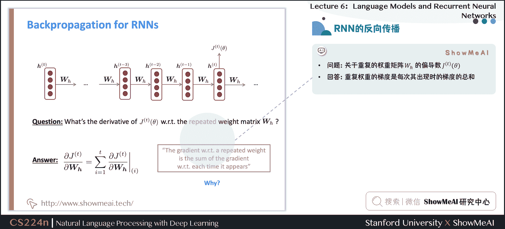

*   **问题**：关于 重复的 权重矩阵 W h W_h Wh​ 的偏导数 J ( t ) ( θ ) J^{(t)}(\theta) J(t)(θ)
*   **回答**：重复权重的梯度是每次其出现时的梯度的总和

∂ J ( t ) ∂ W h = ∑ i = 1 t ∂ J ( t ) ∂ W h ∣ ( i ) \frac{\partial J^{(t)}}{\partial \boldsymbol{W}_{\boldsymbol{h}}}=\sum_{i=1}^{t}\left.\frac{\partial J^{(t)}}{\partial \boldsymbol{W}_{\boldsymbol{h}}}\right|_{(i)} ∂Wh​∂J(t)​=i=1∑t​∂Wh​∂J(t)​∣∣∣∣​(i)​

## 2.8 多变量链式法则

> Source: https://www.khanacademy.org/math/multivariable-calculus/multivariable-derivatives/differentiating-vector-valued-functions/a/multivariable-chain-rule-simple-version

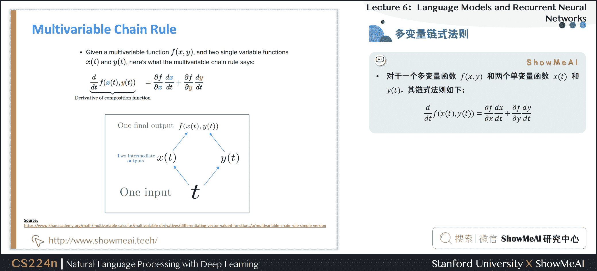

*   对于一个多变量函数 f ( x , y ) f(x,y) f(x,y) 和两个单变量函数 x ( t ) x(t) x(t) 和 y ( t ) y(t) y(t)，其链式法则如下：

d d t f ( x ( t ) , y ( t ) ) = ∂ f ∂ x d x d t + ∂ f ∂ y d y d t \frac{d}{d t} f(x(t), y(t))=\frac{\partial f}{\partial x} \frac{d x}{d t}+\frac{\partial f}{\partial y} \frac{d y}{d t} dtd​f(x(t),y(t))=∂x∂f​dtdx​+∂y∂f​dtdy​

## 2.9 RNN 的反向传播：简单证明

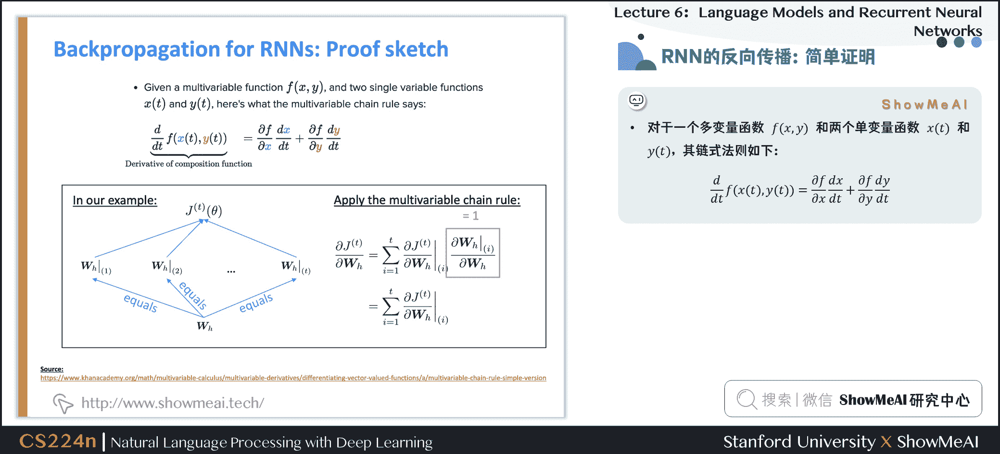

*   对于一个多变量函数 f ( x , y ) f(x,y) f(x,y) 和两个单变量函数 x ( t ) x(t) x(t) 和 y ( t ) y(t) y(t)，其链式法则如下：

d d t f ( x ( t ) , y ( t ) ) = ∂ f ∂ x d x d t + ∂ f ∂ y d y d t \frac{d}{d t} f(x(t), y(t))=\frac{\partial f}{\partial x} \frac{d x}{d t}+\frac{\partial f}{\partial y} \frac{d y}{d t} dtd​f(x(t),y(t))=∂x∂f​dtdx​+∂y∂f​dtdy​

## 2.10 RNN 的反向传播

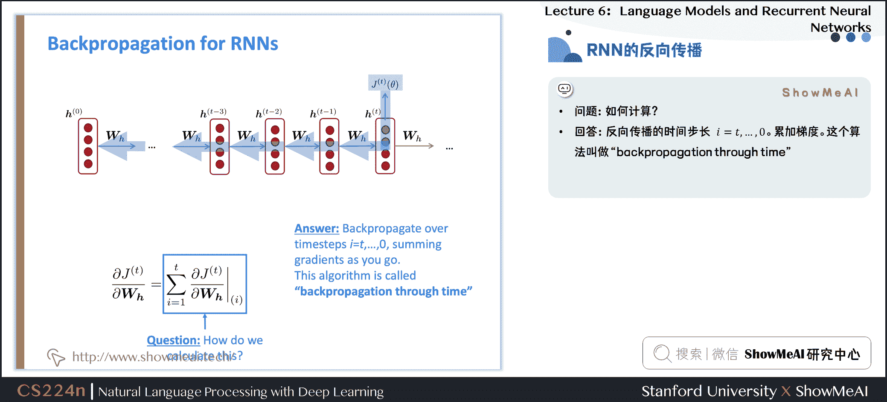

*   **问题**：如何计算？
*   **回答**：反向传播的时间步长 i = t , … , 0 i=t,\dots,0 i=t,…,0。累加梯度。这个算法叫做 “backpropagation through time”

## 2.11 RNN 语言模型的生成文本

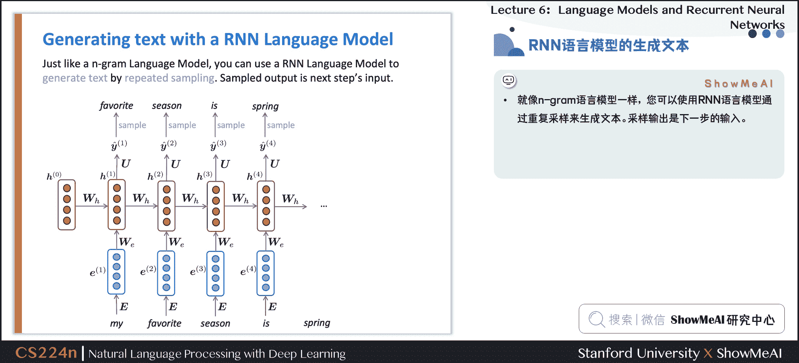

*   就像 n-gram 语言模型一样，你可以使用 RNN 语言模型通过重复采样来生成文本。采样输出是下一步的输入。

## 2.12 RNN 语言模型的生成文本

> Source: https://medium.com/@samim/obama-rnn-machine-generated-political-speeches-c8abd18a2ea0

> Source: https://medium.com/deep-writing/harry-potter-written-by-artificial-intelligence-8a9431803da6

> Source: https://gist.github.com/nylki/1efbaa36635956d35bcc

> Source: http://aiweirdness.com/post/160776374467/new-paint-colors-invented-by-neural-network

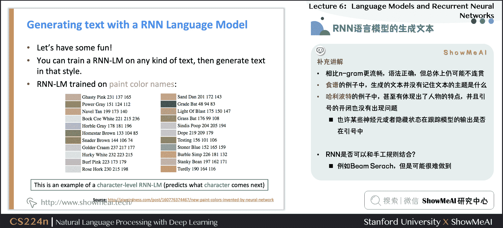

**补充讲解**

*   相比 n-gram 更流畅，语法正确，但总体上仍然很不连贯
*   **食谱**的例子中，生成的文本并没有记住文本的主题是什么
*   **哈利波特**的例子中，甚至有体现出了人物的特点，并且引号的开闭也没有出现问题
    *   也许某些神经元或者隐藏状态在跟踪模型的输出是否在引号中

*   RNN 是否可以和手工规则结合？
    *   例如 Beam Serach，但是可能很难做到

# 3.评估语言模型

## 3.1 评估语言模型

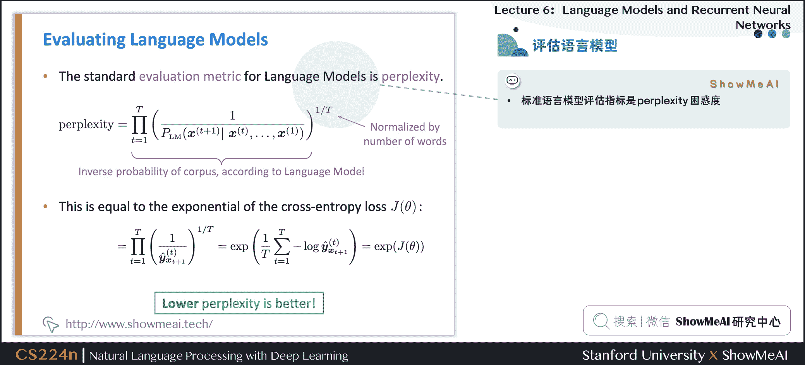

*   标准语言模型评估指标是 perplexity 困惑度
*   这等于交叉熵损失 J ( θ ) J(\theta) J(θ) 的指数

= ∏ t = 1 T ( 1 y ^ x t + 1 ( t ) ) 1 / T = exp ⁡ ( 1 T ∑ t = 1 T − log ⁡ y ^ x t + 1 ( t ) ) = exp ⁡ ( J ( θ ) ) =\prod_{t=1}^{T}\left(\frac{1}{\hat{y}_{x_{t+1}}^{(t)}}\right)^{1 / T}=\exp \left(\frac{1}{T} \sum_{t=1}^{T}-\log \hat{\boldsymbol{y}}_{\boldsymbol{x}_{t+1}}^{(t)}\right)=\exp (J(\theta)) =t=1∏T​(y^​xt+1​(t)​1​)1/T=exp(T1​t=1∑T​−logy^​xt+1​(t)​)=exp(J(θ))

*   困惑度越低效果越好

## 3.2 RNN 极大地改善了困惑度

> Source: https://research.fb.com/building-an-efficient-neural-language-model-over-a-billion-words/

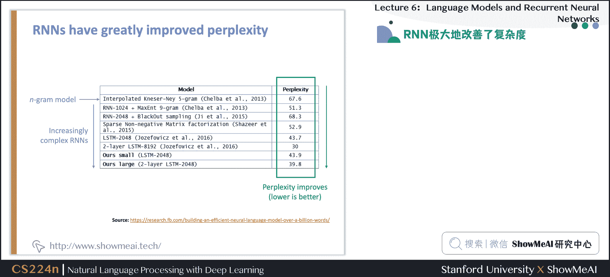

## 3.3 为什么我们要关心语言模型？

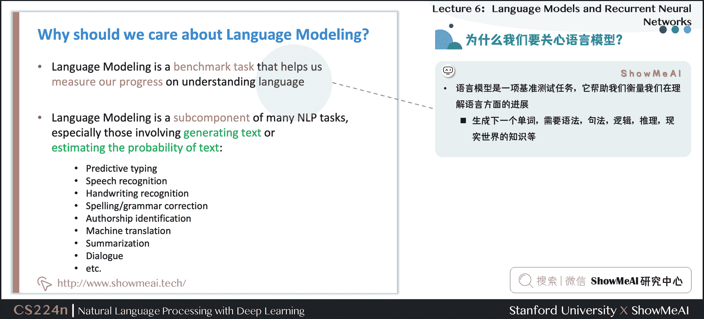

*   语言模型是一项**基准测试**任务，它帮助我们**衡量**我们在理解语言方面的 进展
    *   生成下一个单词，需要语法，句法，逻辑，推理，现实世界的知识等

*   **语言建模**是许多 NLP 任务的子组件，尤其是那些涉及生成文本或估计文本概率的任务
    *   预测性打字、语音识别、手写识别、拼写/语法纠正、作者识别、机器翻译、摘要、对话等等

## 3.4 要点回顾

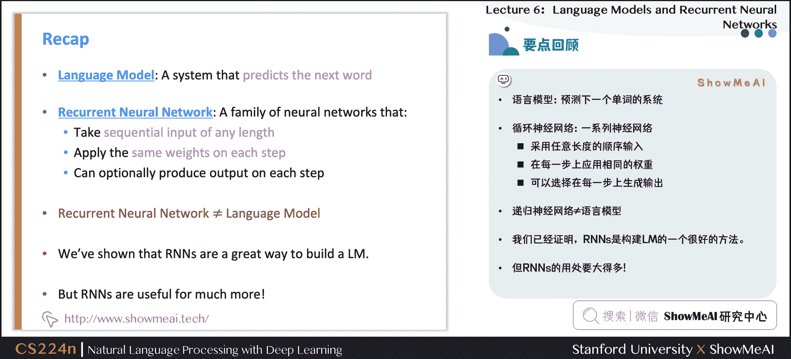

*   **语言模型**：预测下一个单词的系统
*   **循环神经网络**：一系列神经网络
    *   采用任意长度的顺序输入
    *   在每一步上应用相同的权重
    *   可以选择在每一步上生成输出
*   循环神经网络 ≠ \ne ​= 语言模型
*   我们已经证明，RNNs 是构建 LM 的一个很好的方法。
*   但 RNNs 的用处要大得多!

## 3.5 RNN 可用于句子分类

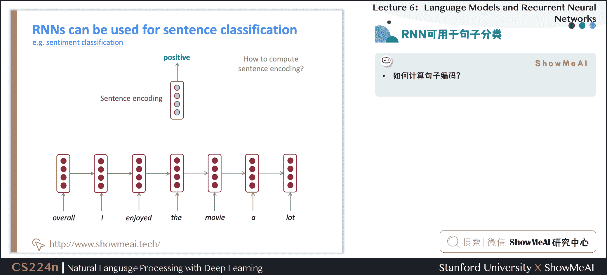

*   如何计算句子编码
*   **基础方式**：使用最终隐层状态
*   通常更好的方式：使用所有隐层状态的逐元素最值或均值
*   Encoder 的结构在 NLP 中非常常见

## 3.6 RNN 语言模型可用于生成文本

*   这是一个条件语言模型的示例。我们使用语言模型组件，并且最关键的是，我们根据条件来调整它

# 4.视频教程

可以点击 [B 站](https://www.bilibili.com/video/BV1Yo4y1D7FW?p=6) 查看视频的【双语字幕】版本

[`player.bilibili.com/player.html?aid=376755412&page=6`](https://player.bilibili.com/player.html?aid=376755412&page=6)

【双语字幕+资料下载】斯坦福 CS224n | 深度学习与自然语言处理(2019·全 20 讲)

# 5.参考资料

*   [本讲带学的**在线阅翻页本**](https://blog.showmeai.tech/cs224n/lecture06-Recurrent-Neural-Networks-and-Language-Models#/)
*   [《斯坦福 CS224n 深度学习与自然语言处理》**课程学习指南**](https://blog.showmeai.tech/cs224n/)
*   [《斯坦福 CS224n 深度学习与自然语言处理》**课程大作业解析**](https://github.com/ShowMeAI-Hub/awesome-AI-courses-notes-cheatsheets/tree/main/CS224n-Natural-Language-Processing-with-Deep-Learning/assignment-solutions)
*   [【**双语字幕视频**】斯坦福 CS224n | 深度学习与自然语言处理(2019·全 20 讲)](https://www.bilibili.com/video/BV1Yo4y1D7FW)
*   [**Stanford 官网** | CS224n: Natural Language Processing with Deep Learning](https://web.stanford.edu/class/archive/cs/cs224n/cs224n.1194/)

# [**ShowMeAI**](http://www.showmeai.tech)系列教程推荐

*   [大厂技术实现 | 推荐与广告计算解决方案](http://www.showmeai.tech/tutorials/50)
*   [大厂技术实现 | 计算机视觉解决方案](http://www.showmeai.tech/tutorials/51)
*   [大厂技术实现 | 自然语言处理行业解决方案](http://www.showmeai.tech/tutorials/52)
*   [图解 Python 编程：从入门到精通系列教程](http://www.showmeai.tech/tutorials/56)
*   [图解数据分析：从入门到精通系列教程](http://www.showmeai.tech/tutorials/33)
*   [图解 AI 数学基础：从入门到精通系列教程](http://www.showmeai.tech/tutorials/83)
*   [图解大数据技术：从入门到精通系列教程](http://www.showmeai.tech/tutorials/84)
*   [图解机器学习算法：从入门到精通系列教程](http://www.showmeai.tech/tutorials/34)
*   [机器学习实战：手把手教你玩转机器学习系列](http://www.showmeai.tech/tutorials/41)
*   [深度学习教程 | 吴恩达专项课程 · 全套笔记解读](http://www.showmeai.tech/tutorials/35)
*   [自然语言处理教程 | 斯坦福 CS224n 课程 · 课程带学与全套笔记解读](http://www.showmeai.tech/tutorials/36)

# NLP 系列教程文章

*   [NLP 教程(1)- 词向量、SVD 分解与 Word2vec](http://showmeai.tech/article-detail/230)
*   [NLP 教程(2)- GloVe 及词向量的训练与评估](http://showmeai.tech/article-detail/232)
*   [NLP 教程(3)- 神经网络与反向传播](http://showmeai.tech/article-detail/234)
*   [NLP 教程(4)- 句法分析与依存解析](http://www.showmeai.tech/article-detail/237)
*   [NLP 教程(5)- 语言模型、RNN、GRU 与 LSTM](http://www.showmeai.tech/article-detail/239)
*   [NLP 教程(6)- 神经机器翻译、seq2seq 与注意力机制](http://www.showmeai.tech/article-detail/242)
*   [NLP 教程(7)- 问答系统](http://www.showmeai.tech/article-detail/245)
*   [NLP 教程(8)- NLP 中的卷积神经网络](http://www.showmeai.tech/article-detail/247)
*   [NLP 教程(9)- 句法分析与树形递归神经网络](http://www.showmeai.tech/article-detail/255)

# 斯坦福 CS224n 课程带学详解

*   [斯坦福 NLP 课程 | 第 1 讲 - NLP 介绍与词向量初步](http://showmeai.tech/article-detail/231)
*   [斯坦福 NLP 课程 | 第 2 讲 - 词向量进阶](http://showmeai.tech/article-detail/233)
*   [斯坦福 NLP 课程 | 第 3 讲 - 神经网络知识回顾](http://showmeai.tech/article-detail/235)
*   [斯坦福 NLP 课程 | 第 4 讲 - 神经网络反向传播与计算图](http://showmeai.tech/article-detail/236)
*   [斯坦福 NLP 课程 | 第 5 讲 - 句法分析与依存解析](http://www.showmeai.tech/article-detail/238)
*   [斯坦福 NLP 课程 | 第 6 讲 - 循环神经网络与语言模型](http://www.showmeai.tech/article-detail/240)
*   [斯坦福 NLP 课程 | 第 7 讲 - 梯度消失问题与 RNN 变种](http://www.showmeai.tech/article-detail/241)
*   [斯坦福 NLP 课程 | 第 8 讲 - 机器翻译、seq2seq 与注意力机制](http://www.showmeai.tech/article-detail/243)
*   [斯坦福 NLP 课程 | 第 9 讲 - cs224n 课程大项目实用技巧与经验](http://www.showmeai.tech/article-detail/244)
*   [斯坦福 NLP 课程 | 第 10 讲 - NLP 中的问答系统](http://www.showmeai.tech/article-detail/246)
*   [斯坦福 NLP 课程 | 第 11 讲 - NLP 中的卷积神经网络](http://www.showmeai.tech/article-detail/248)
*   [斯坦福 NLP 课程 | 第 12 讲 - 子词模型](http://www.showmeai.tech/article-detail/249)
*   [斯坦福 NLP 课程 | 第 13 讲 - 基于上下文的表征与 NLP 预训练模型](http://www.showmeai.tech/article-detail/250)
*   [斯坦福 NLP 课程 | 第 14 讲 - Transformers 自注意力与生成模型](http://www.showmeai.tech/article-detail/251)
*   [斯坦福 NLP 课程 | 第 15 讲 - NLP 文本生成任务](http://www.showmeai.tech/article-detail/252)
*   [斯坦福 NLP 课程 | 第 16 讲 - 指代消解问题与神经网络方法](http://www.showmeai.tech/article-detail/253)
*   [斯坦福 NLP 课程 | 第 17 讲 - 多任务学习(以问答系统为例)](http://www.showmeai.tech/article-detail/254)
*   [斯坦福 NLP 课程 | 第 18 讲 - 句法分析与树形递归神经网络](http://www.showmeai.tech/article-detail/256)
*   [斯坦福 NLP 课程 | 第 19 讲 - AI 安全偏见与公平](http://www.showmeai.tech/article-detail/257)
*   [斯坦福 NLP 课程 | 第 20 讲 - NLP 与深度学习的未来](http://www.showmeai.tech/article-detail/258)

