# 斯坦福 NLP 课程 | 第 7 讲 - 梯度消失问题与 RNN 变种

> 原文：[`blog.csdn.net/ShowMeAI/article/details/124585269`](https://blog.csdn.net/ShowMeAI/article/details/124585269)

作者：[韩信子](https://github.com/HanXinzi-AI)@[ShowMeAI](http://www.showmeai.tech/)，路遥@[ShowMeAI](http://www.showmeai.tech/)，奇异果@[ShowMeAI](http://www.showmeai.tech/)
[教程地址](http://www.showmeai.tech/tutorials/36)：[`www.showmeai.tech/tutorials/36`](http://www.showmeai.tech/tutorials/36)
[本文地址](http://www.showmeai.tech/article-detail/241)：[`www.showmeai.tech/article-detail/241`](http://www.showmeai.tech/article-detail/241)
声明：版权所有，转载请联系平台与作者并注明出处

收藏[ShowMeAI](http://www.showmeai.tech/)查看更多精彩内容

* * *

[ShowMeAI](http://www.showmeai.tech/)为**斯坦福 CS224n**《自然语言处理与深度学习(Natural Language Processing with Deep Learning)》课程的全部课件，做了**中文翻译和注释**，并制作成了 GIF 动图！

本讲内容的**深度总结教程**可以在[**这里**](http://www.showmeai.tech/article-detail/239) 查看。视频和课件等资料的获取方式见**文末**。

* * *

# 引言

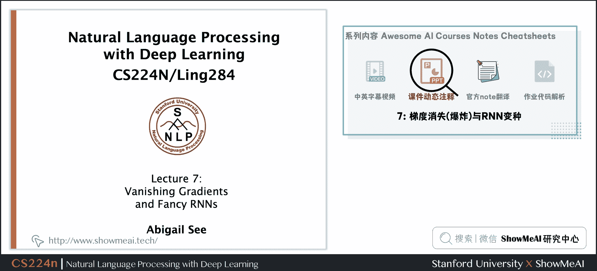

（梯度消失和梯度爆炸部分内容也可以参考[ShowMeAI](http://www.showmeai.tech/)的对吴恩达老师课程的总结文章[深度学习教程 | **深度学习的实用层面**](http://www.showmeai.tech/article-detail/216)）

## 概述

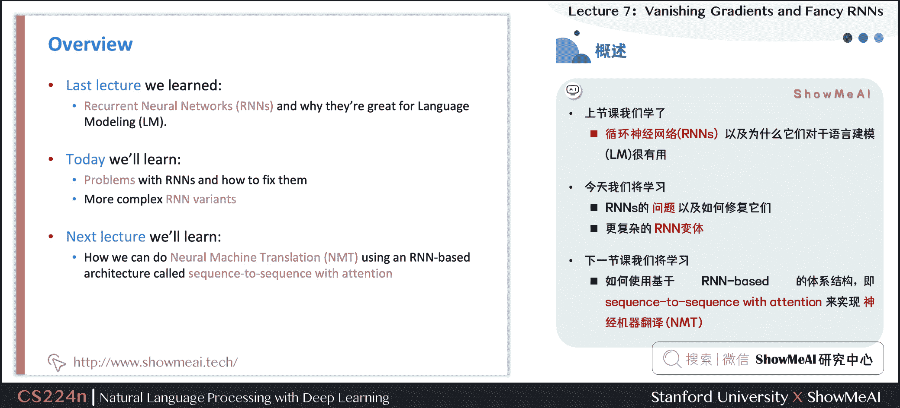

上节课我们学了

*   **递归神经网络**(RNNs)以及为什么它们对于**语言建模**(LM)很有用

今天我们将学习

*   RNNs 的**问题**以及如何修复它们
*   更复杂的**RNN 变体**

下一节课我们将学习

*   如何使用基于 RNN-based 的体系结构，即 sequence-to-sequence with attention 来实现
*   **神经机器翻译**(NMT)

## 今日课程要点

*   梯度消失问题
*   两种新类型 RNN：LSTM 和 GRU
*   其他梯度消失(爆炸)的解决方案
    *   梯度裁剪
    *   跳接
*   更多 RNN 变体
    *   双向 RNN
    *   多层 RNN

# 1.梯度消失

## 1.1 梯度消失问题

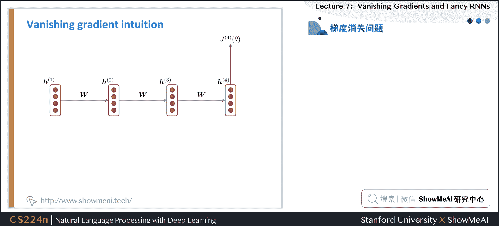

*   梯度消失问题：当这些梯度很小的时候，反向传播的越深入，梯度信号就会变得越来越小

## 1.2 梯度消失证明简述

> Source: “On the difficulty of training recurrent neural networks”, Pascanu et al, 2013\. http://proceedings.mlr.press/v28/pascanu13.pdf

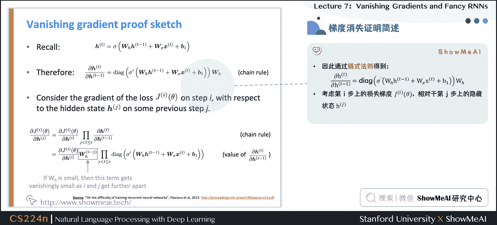

h ( t ) = σ ( W h h ( t − 1 ) + W x x ( t ) + b 1 ) \boldsymbol{h}^{(t)}=\sigma\left(\boldsymbol{W}_{h} \boldsymbol{h}^{(t-1)}+\boldsymbol{W}_{x} \boldsymbol{x}^{(t)}+\boldsymbol{b}_{1}\right) h(t)=σ(Wh​h(t−1)+Wx​x(t)+b1​)

*   因此通过**链式法则**得到：

∂ h ( t ) ∂ h ( t − 1 ) = diag ⁡ ( σ ′ ( W h h ( t − 1 ) + W x x ( t ) + b 1 ) ) W h \frac{\partial \boldsymbol{h}^{(t)}}{\partial \boldsymbol{h}^{(t-1)}}=\operatorname{diag}\left(\sigma^{\prime}\left(\boldsymbol{W}_{h} \boldsymbol{h}^{(t-1)}+\boldsymbol{W}_{x} \boldsymbol{x}^{(t)}+\boldsymbol{b}_{1}\right)\right) \boldsymbol{W}_{h} ∂h(t−1)∂h(t)​=diag(σ′(Wh​h(t−1)+Wx​x(t)+b1​))Wh​

*   考虑第 i i i 步上的损失梯度 J ( i ) ( θ ) J^{(i)}(θ) J(i)(θ)，相对于第 j j j 步上的隐藏状态 h ( j ) h^{(j)} h(j)

*   如果权重矩阵 W h W_h Wh​ 很小，那么这一项也会随着 i i i 和 j j j 的距离越来越远而变得越来越小

## 1.3 梯度消失证明简述

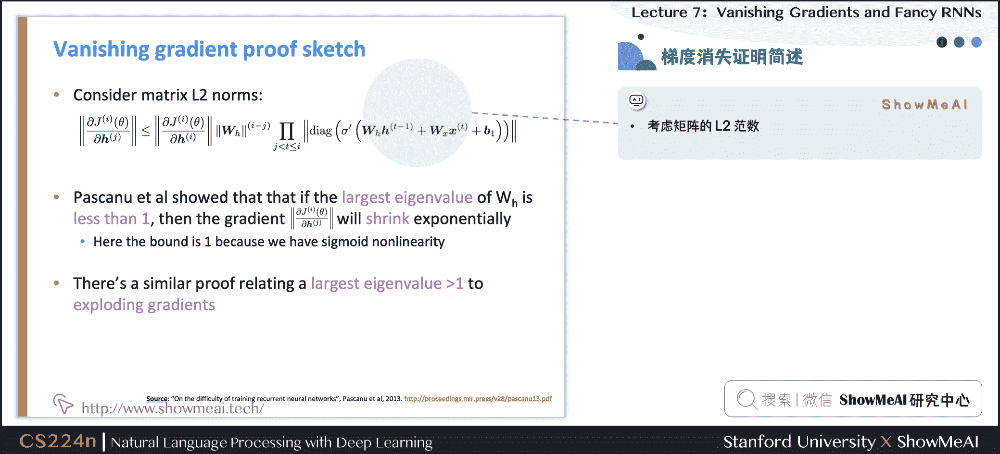

*   考虑矩阵的 L2 范数

∥ ∂ J ( i ) ( θ ) ∂ h ( j ) ∥ ≤ ∥ ∂ J ( i ) ( θ ) ∂ h ( i ) ∥ ∥ W h ∥ ( i − j ) ∏ j < t ≤ i ∥ diag ⁡ ( σ ′ ( W h h ( t − 1 ) + W x x ( t ) + b 1 ) ) ∥ \left\|\frac{\partial J^{(i)}(\theta)}{\partial \boldsymbol{h}^{(j)}}\right\| \leq\left\|\frac{\partial J^{(i)}(\theta)}{\partial \boldsymbol{h}^{(i)}}\right\|\left\|\boldsymbol{W}_{h}\right\|^{(i-j)} \prod_{j<t \leq i}\left\|\operatorname{diag}\left(\sigma^{\prime}\left(\boldsymbol{W}_{h} \boldsymbol{h}^{(t-1)}+\boldsymbol{W}_{x} \boldsymbol{x}^{(t)}+\boldsymbol{b}_{1}\right)\right)\right\| ∥∥∥∥​∂h(j)∂J(i)(θ)​∥∥∥∥​≤∥∥∥∥​∂h(i)∂J(i)(θ)​∥∥∥∥​∥Wh​∥(i−j)j<t≤i∏​∥∥∥​diag(σ′(Wh​h(t−1)+Wx​x(t)+b1​))∥∥∥​

*   Pascanu et al 表明，如果 W h W_h Wh​ 的**最大特征值**<1，梯度 ∥ ∂ J ( i ) ( θ ) ∂ h ( j ) ∥ \|\frac{\partial J^{(i)}(\theta)}{\partial \boldsymbol{h}^{(j)}}\| ∥∂h(j)∂J(i)(θ)​∥ 将呈**指数衰减**

    *   这里的界限是 1 1 1 因为我们使用的非线性函数是 sigmoid

*   有一个类似的证明将一个**最大的特征值** > 1 与**梯度爆炸**联系起来

## 1.4 为什么梯度消失是个问题？

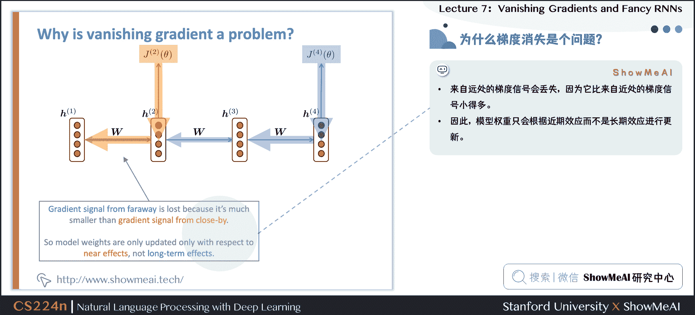

*   来自远处的梯度信号会丢失，因为它比来自近处的梯度信号小得多。
*   因此，模型权重只会根据近期效应而不是长期效应进行更新。

## 1.5 为什么梯度消失是个问题？

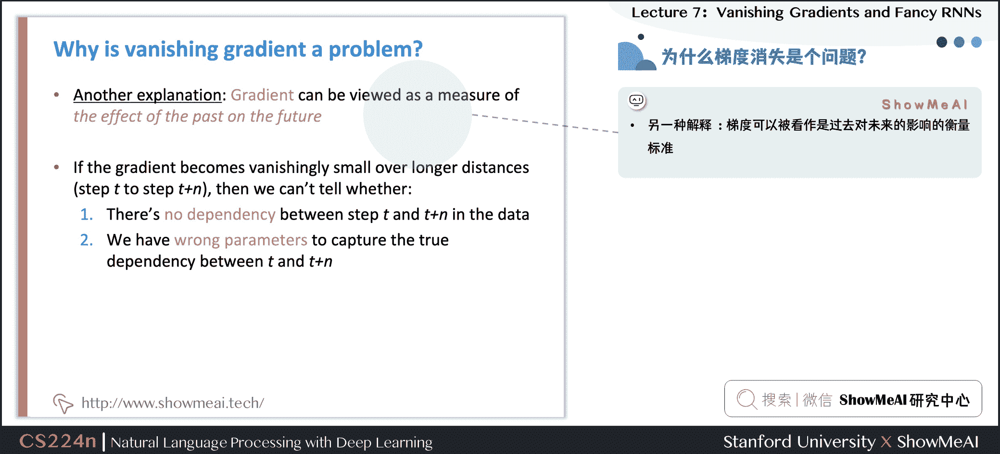

*   另一种解释：**梯度**可以被看作是**过去对未来的影响**的衡量标准

*   如果梯度在较长一段距离内(从时间步 t t t 到 t + n t+n t+n)变得越来越小，那么我们就不能判断：

    *   在数据中，步骤 t t t 和 t + n t+n t+n 之间**没有依赖关系**
    *   我们用**错误的参数**来捕获 t t t 和 t + n t+n t+n 之间的真正依赖关系

## 1.6 梯度消失对 RNN 语言模型的影响

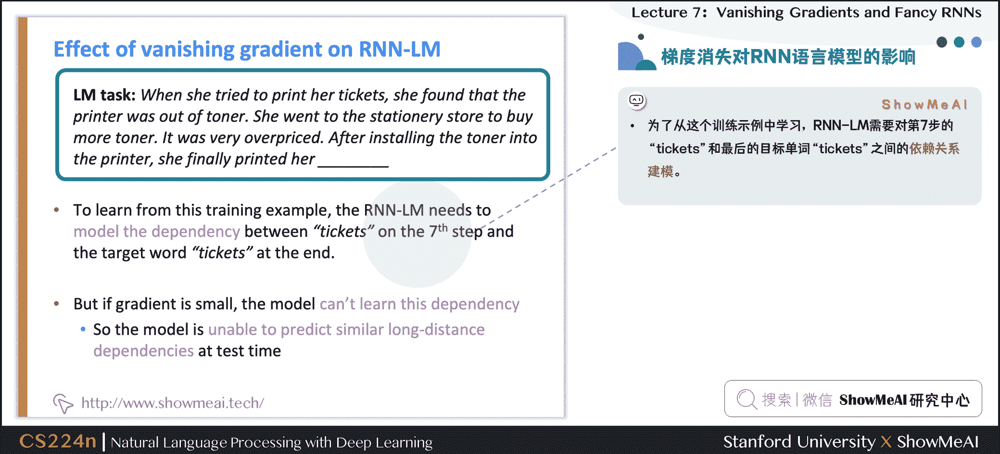

*   为了从这个训练示例中学习，RNN-LM 需要对第 7 步的 `tickets` 和最后的目标单词 `tickets` 之间的**依赖关系建模**

*   但是如果梯度很小，模型就**不能学习这种依赖关系**

    *   因此模型无法在测试时**预测类似的长距离依赖关系**

## 1.7 梯度消失对 RNN 语言模型的影响

> “Assessing the Ability of LSTMs to Learn Syntax-Sensitive Dependencies”, Linzen et al, 2016\. https://arxiv.org/pdf/1611.01368.pdf

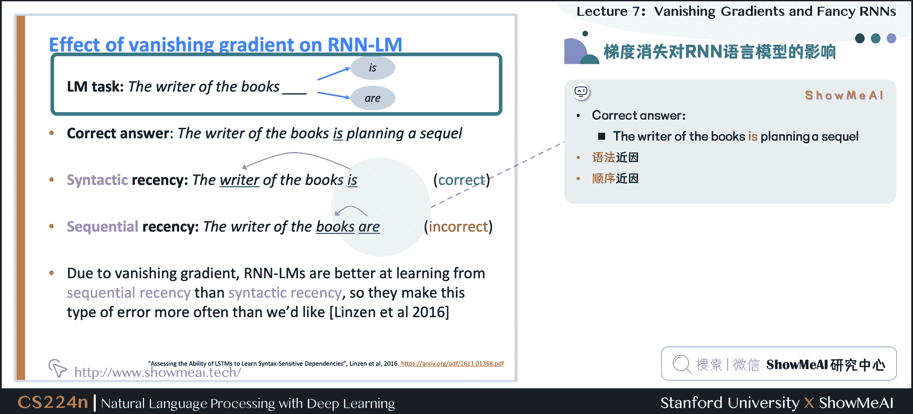

*   Correct answer：
    *   The writer of the books is planning a sequel
*   **语法近因**
*   **顺序近因**

*   由于梯度的消失，RNN-LMs 更善于从**顺序近因**学习而不是**语法近因**，所以他们犯这种错误的频率比我们希望的要高[Linzen et al . 2016]

# 2.梯度爆炸

## 2.1 为什么梯度爆炸是个问题？

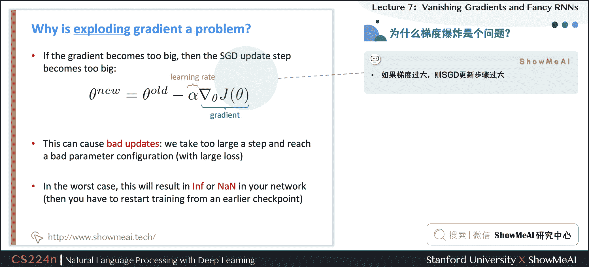

*   如果梯度过大，则 SGD 更新步骤过大

*   这可能导致**错误的更新**：我们更新的太多，导致错误的参数配置(损失很大)
*   在最坏的情况下，这将导致网络中的 **Inf** 或 **NaN**(然后你必须从较早的检查点重新启动训练)

## 2.2 梯度剪裁：梯度爆炸的解决方案

> Source: “On the difficulty of training recurrent neural networks”, Pascanu et al, 2013\. http://proceedings.mlr.press/v28/pascanu13.pdf

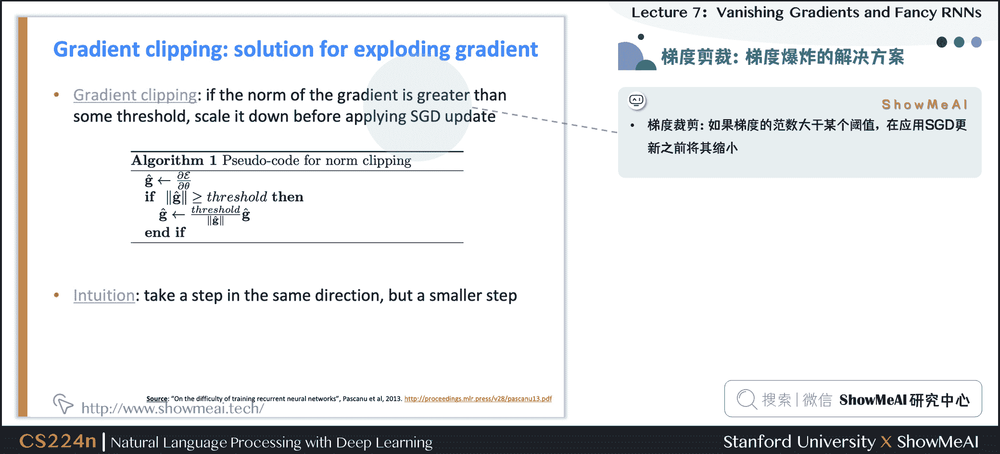

*   **梯度裁剪**：如果梯度的范数大于某个阈值，在应用 SGD 更新之前将其缩小

*   **直觉**：朝着同样的方向迈出一步，但要小一点

## 2.3 梯度剪裁：梯度爆炸的解决方案

> Source: “Deep Learning”, Goodfellow, Bengio and Courville, 2016\. Chapter 10.11.1\. https://www.deeplearningbook.org/contents/rnn.html

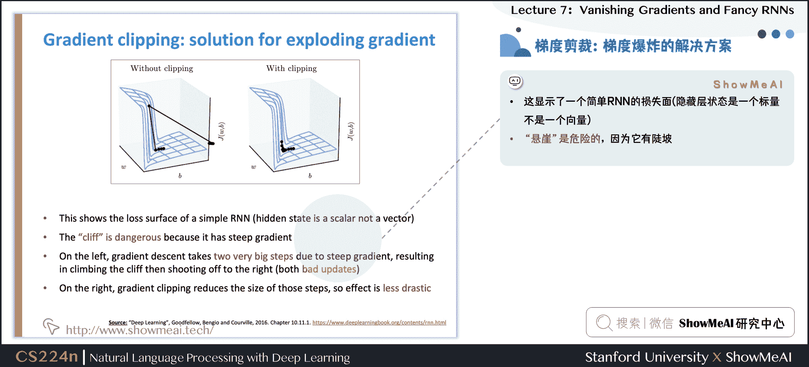

*   这显示了一个简单 RNN 的损失面(隐藏层状态是一个标量不是一个向量)

*   在左边，由于陡坡，梯度下降有**两个非常大的步骤**，导致攀登悬崖然后向右射击(都是**坏的更新**)
*   在右边，梯度剪裁减少了这些步骤的大小，所以参数调整不会有剧烈的波动

## 2.4 如何解决梯度消失问题？

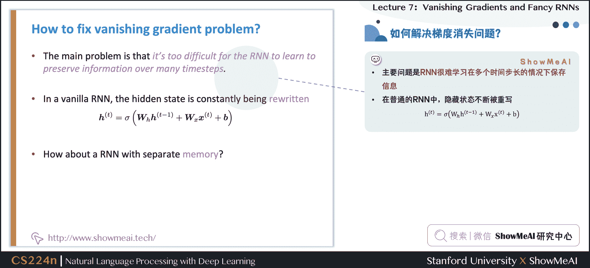

*   主要问题是 RNN 很难学习在多个时间步长的情况下保存信息
*   在普通的 RNN 中，隐藏状态不断被重写

h ( t ) = σ ( W h h ( t − 1 ) + W x x ( t ) + b ) \boldsymbol{h}^{(t)}=\sigma\left(\boldsymbol{W}_{h} \boldsymbol{h}^{(t-1)}+\boldsymbol{W}_{x} \boldsymbol{x}^{(t)}+\boldsymbol{b}\right) h(t)=σ(Wh​h(t−1)+Wx​x(t)+b)

*   有没有更好结构的 RNN

# 3.长短时记忆网络(LSTM)

## 3.1 长短时记忆(LSTM)

> “Long short-term memory”, Hochreiter and Schmidhuber, 1997\. https://www.bioinf.jku.at/publications/older/2604.pdf

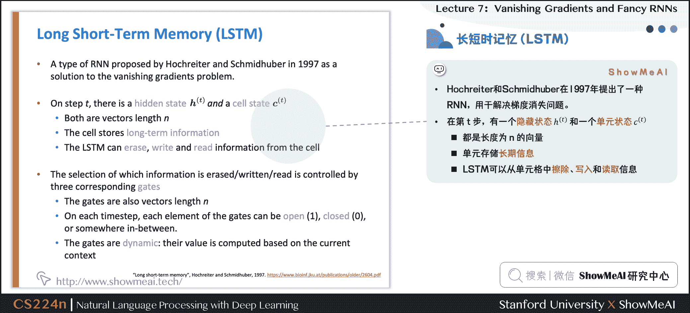

*   Hochreiter 和 Schmidhuber 在 1997 年提出了一种 RNN，用于解决梯度消失问题。

*   在第 t t t 步，有一个**隐藏状态** h ( t ) h^{(t)} h(t) 和一个**单元状态** c ( t ) c^{(t)} c(t)

    *   都是长度为 n n n 的向量
    *   单元存储长期信息
    *   LSTM 可以从单元中**擦除**、**写入**和**读取信息**

*   信息被 擦除 / 写入 / 读取 的选择由三个对应的门控制

    *   门也是长度为 n n n 的向量
    *   在每个时间步长上，门的每个元素可以**打开**(1)、**关闭**(0)或介于两者之间
    *   **门是动态的**：它们的值是基于当前上下文计算的

## 3.2 长短时记忆(LSTM)

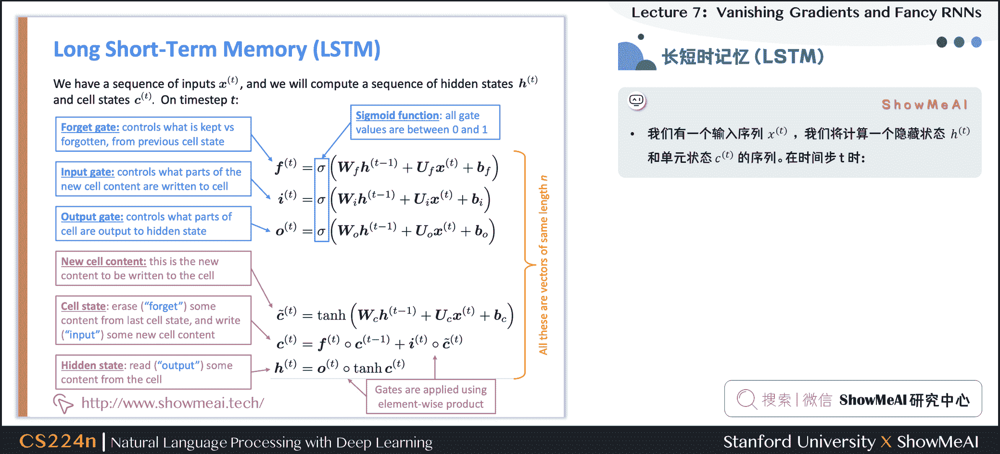

我们有一个输入序列 x ( t ) x^{(t)} x(t)，我们将计算一个隐藏状态 h ( t ) h^{(t)} h(t) 和单元状态 c ( t ) c^{(t)} c(t) 的序列。在时间步 t t t 时

*   **遗忘门**：控制上一个单元状态的保存与遗忘
*   **输入门**：控制写入单元格的新单元内容的哪些部分
*   **输出门**：控制单元的哪些内容输出到隐藏状态

*   **新单元内容**：这是要写入单元的新内容
*   **单元状态**：删除(“忘记”)上次单元状态中的一些内容，并写入(“输入”)一些新的单元内容
*   **隐藏状态**：从单元中读取(“output”)一些内容

*   **Sigmoid 函数**：所有的门的值都在 0 到 1 之间
*   通过逐元素的乘积来应用门
*   这些是长度相同( n n n)的向量

## 3.3 长短时记忆(LSTM)

> Source: http://colah.github.io/posts/2015-08-Understanding-LSTMs/

## 3.4 长短时记忆(LSTM)

> Source: http://colah.github.io/posts/2015-08-Understanding-LSTMs/

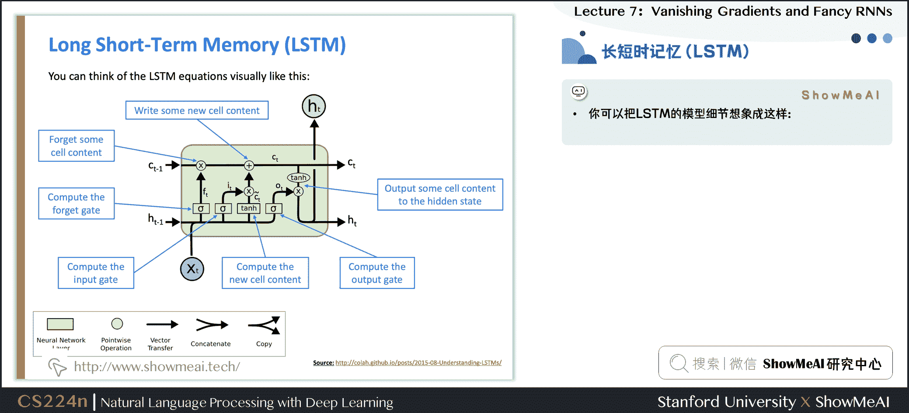

## 3.5 LSTM 如何解决梯度消失

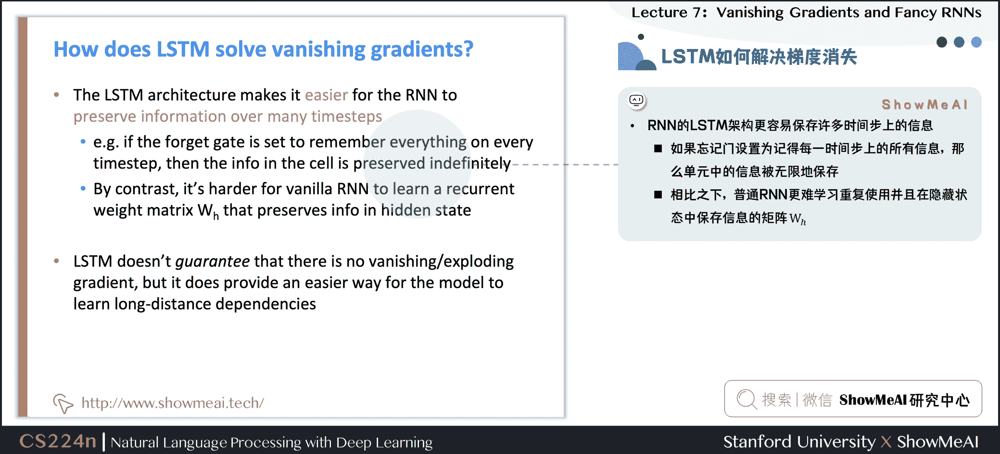

*   RNN 的 LSTM 架构更容易保存许多时间步上的信息

    *   如果忘记门设置为记得每一时间步上的所有信息，那么单元中的信息被无限地保存
    *   相比之下，普通 RNN 更难学习重复使用并且在隐藏状态中保存信息的矩阵 W h W_h Wh​

*   LSTM 并不保证没有**梯度消失/爆炸**，但它确实为模型提供了一种更容易的方法来学习远程依赖关系

## 3.6 LSTMs：现实世界的成功

> Source: “Findings of the 2016 Conference on Machine Translation (WMT16)”, Bojar et al. 2016, http://www.statmt.org/wmt16/pdf/W16-2301.pdf Source: "Findings of the 2018

> Conference on Machine Translation (WMT18)", Bojar et al. 2018, http://www.statmt.org/wmt18/pdf/WMT028.pdf

*   2013-2015 年，LSTM 开始实现最先进的结果

    *   成功的任务包括：手写识别、语音识别、机器翻译、解析、图像字幕
    *   **LSTM 成为主导方法**

*   现在(2019 年)，其他方法(**如 Transformers**)在某些任务上变得更加主导

    *   例如在 WMT(a MT conference + competition)中
    *   在 2016 年 WMT 中，总结报告包含“RNN”44 次
    *   在 2018 年 WMT 中，总结报告包含“RNN”9 次，“Transformers” 63 次

# 4.GRU 网络

## 4.1 Gated Recurrent Units(GRU)

> “Learning Phrase Representations using RNN Encoder–Decoder for Statistical Machine Translation”, Cho et al. 2014, https://arxiv.org/pdf/1406.1078v3.pdf

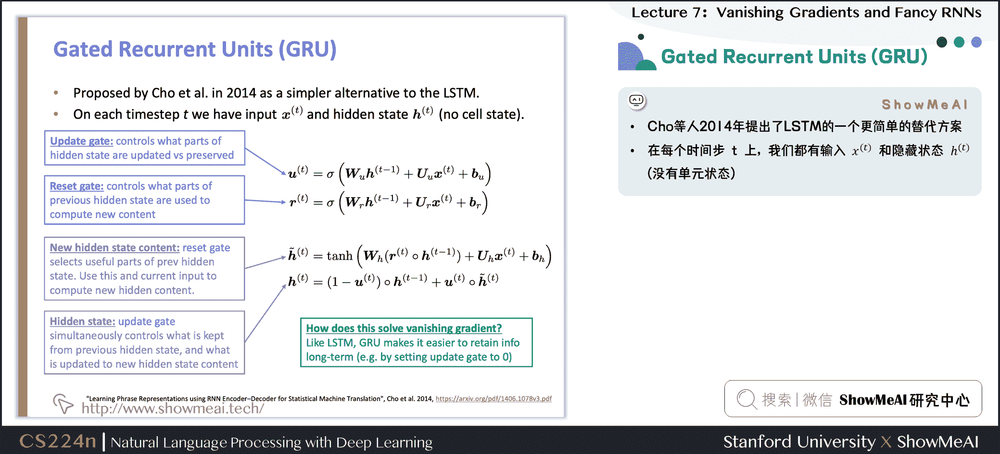

*   Cho 等人在 2014 年提出了 LSTM 的一个更简单的替代方案
*   在每个时间步 t t t 上，我们都有输入 x ( t ) x^{(t)} x(t) 和隐藏状态 h ( t ) h^{(t)} h(t) (没有单元状态)

*   **更新门**：控制隐藏状态的哪些部分被更新，或者被保留
*   **重置门**：控制之前隐藏状态的哪些部分被用于计算新内容

*   **新的隐藏状态内容**：重置门选择之前隐藏状态的有用部分。使用这一部分和当前输入来计算新的隐藏状态内容
*   **隐藏状态**：更新门同时控制从以前的隐藏状态保留的内容，以及更新到新的隐藏状态内容的内容

*   这如何解决消失梯度？
    *   与 LSTM 类似，GRU 使长期保存信息变得更容易(例如，将 update gate 设置为 0)

## 4.2 LSTM vs GRU

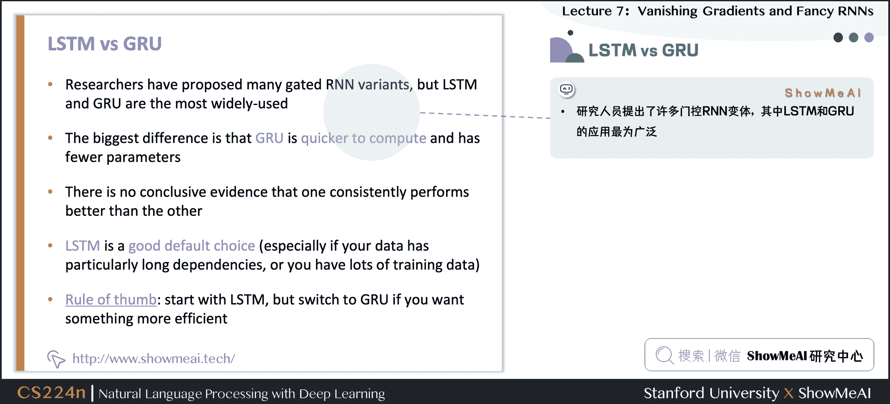

*   研究人员提出了许多门控 RNN 变体，其中 LSTM 和 GRU 的应用最为广泛

*   最大的区别是**GRU 计算速度更快**，参数更少
*   没有确凿的证据表明其中一个总是比另一个表现得更好
*   **LSTM** 是一个**很好的默认选择**(特别是当你的数据具有非常长的依赖关系，或者你有很多训练数据时)

*   **经验法则**：从 LSTM 开始，但是如果你想要更有效率，就切换到 GRU

## 4.3 梯度消失/爆炸只是 RNN 问题吗？

> “Deep Residual Learning for Image Recognition”, He et al, 2015\. https://arxiv.org/pdf/1512.03385.pdf

> “Densely Connected Convolutional Networks”, Huang et al, 2017\. https://arxiv.org/pdf/1608.06993.pdf

> “Highway Networks”, Srivastava et al, 2015\. https://arxiv.org/pdf/1505.00387.pdf

> “Learning Long-Term Dependencies with Gradient Descent is Difficult”, Bengio et al. 1994, http://ai.dinfo.unifi.it/paolo//ps/tnn-94-gradient.pdf

**梯度消失/爆炸只是 RNN 问题吗**？

*   并不是，这对于所有的神经结构(包括**前馈**和**卷积网络**)都是一个问题，尤其是对于深度结构
    *   由于链式法则/选择非线性函数，反向传播时梯度可以变得很小很小
    *   因此，较低层次的学习非常缓慢(难以训练)
    *   解决方案：大量新的深层前馈 / 卷积架构，**添加更多的直接连接**(从而使梯度可以流动)

例如：

*   残差连接又名“ResNet”,也称为跳转连接
*   默认情况下，标识连接保存信息
*   这使得深层网络更容易训练

例如：

*   密集连接又名“DenseNet”
*   直接将所有内容连接到所有内容

例如：

*   Highway 连接又称“高速网络”
*   类似于残差连接，但标识连接与转换层由动态门控制
*   灵感来自 LSTMs，但适用于深度前馈/卷积网络

结论：虽然梯度消失/爆炸是一个普遍的问题，但由于重复乘以相同的权矩阵，RNN 尤其不稳定[Bengio et al, 1994]

## 4.4 要点回顾

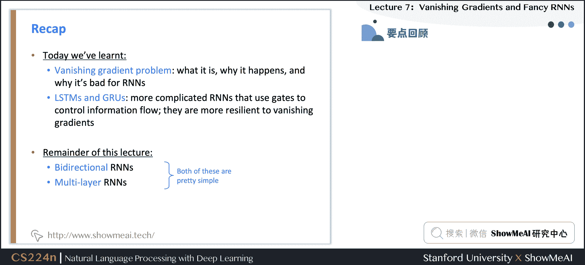

## 4.5 双向 RNN：动机

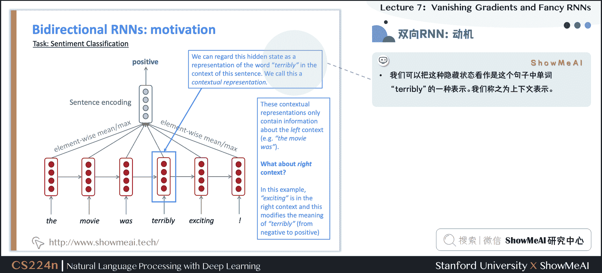

*   我们可以把这种隐藏状态看作是这个句子中单词“terribly”的一种表示。我们称之为上下文表示。

*   这些上下文表示只包含关于左上下文的信息(例如“the movie was”)。
*   **那么正确的上下文呢**?
    *   在这个例子中，“exciting”在右上下文中，它修饰了“terribly”的意思(从否定变为肯定)

## 4.6 双向 RNN

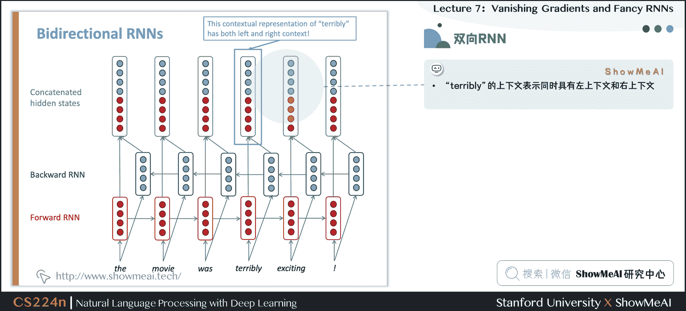

*   “terribly”的上下文表示同时具有左上下文和右上下文

## 4.7 双向 RNN

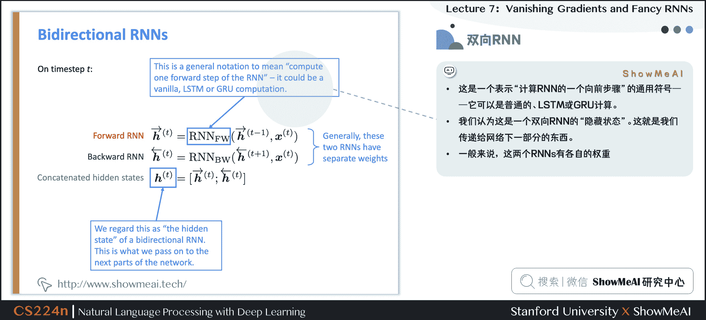

*   这是一个表示“计算 RNN 的一个向前步骤”的通用符号——它可以是普通的、LSTM 或 GRU 计算
*   我们认为这是一个双向 RNN 的“隐藏状态”。这就是我们传递给网络下一部分的东西
*   一般来说，这两个 RNNs 有各自的权重

## 4.8 双向 RNN：简图

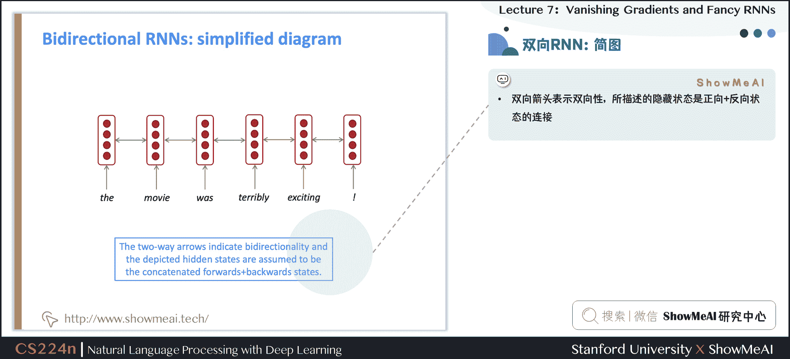

*   双向箭头表示双向性，所描述的隐藏状态是正向+反向状态的连接

## 4.9 双向 RNN

*   注意：双向 RNNs 只适用于访问**整个输入序列**的情况
    *   它们不适用于语言建模，因为在 LM 中，你只有左侧的上下文可用

*   如果你有完整的输入序列(例如任何一种编码)，**双向性是强大的**(默认情况下你应该使用它)
*   例如，BERT(来自 transformer 的双向编码器表示)是一个基于双向性的强大的预训练的上下文表示系统
    *   你会在课程的后面学到更多关于 BERT 的知识!

## 4.10 深层 RNN

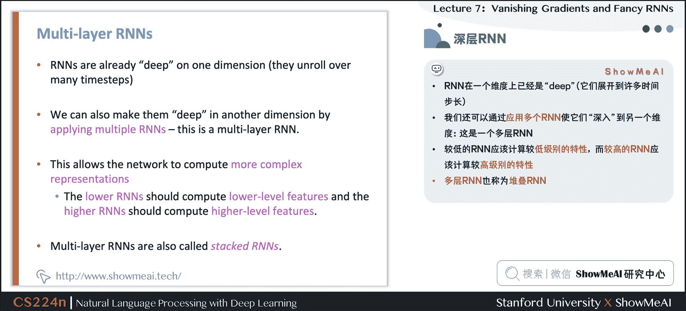

*   RNNs 在一个维度上已经是“deep”(它们展开到许多时间步长)
*   我们还可以通过应用**多个 RNN**使它们“深入”到另一个维度：这是一个多层 RNN
*   **较低的 RNN**应该计算**较低级别的特性**，而**较高的 RNN**应该计算**较高级别的特性**
*   多层 RNN 也称为堆叠 RNN

## 4.11 深层 RNN

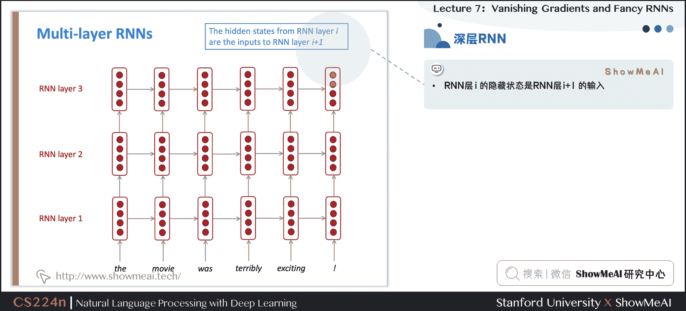

*   RNN 层 i i i 的隐藏状态是 RNN 层 i + 1 i+1 i+1 的输入

## 4.12 深层 RNN 在实践中的应用

> “Massive Exploration of Neural Machine Translation Architecutres”, Britz et al, 2017\. https://arxiv.org/pdf/1703.03906.pdf

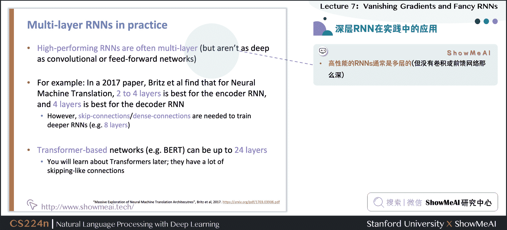

*   高性能的 RNNs 通常是多层的(但没有卷积或前馈网络那么深)

*   例如：在 2017 年的一篇论文，Britz et al 发现在神经机器翻译中，2 到 4 层 RNN 编码器是最好的,和 4 层 RNN 解码器
    *   但是，**skip-connections** / **dense-connections** 需要训练更深 RNNs(例如 8 层)
    *   RNN 无法并行化，计算代价过大，所以不会过深

*   Transformer-based 的网络(如 BERT)可以多达 24 层
    *   BERT 有很多 skipping-like 的连接

## 4.13 总结

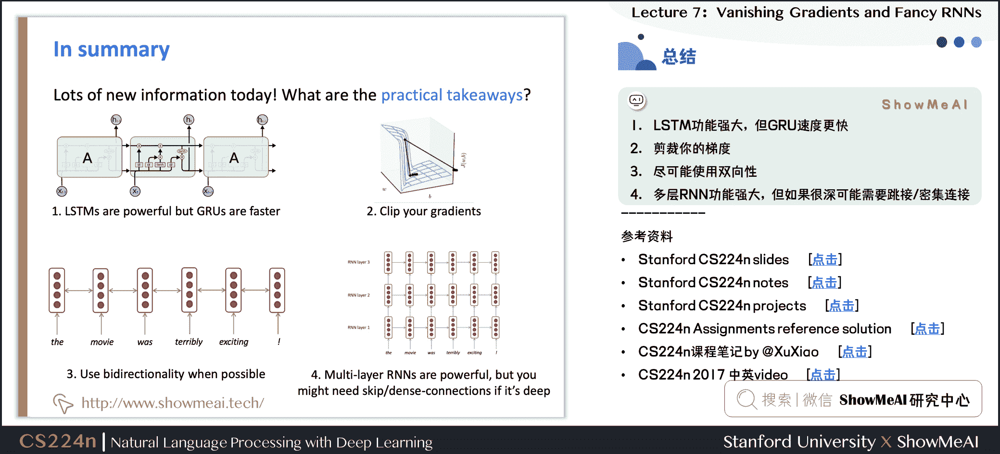

*   LSTM 功能强大，但 GRU 速度更快
*   剪裁你的梯度
*   尽可能使用双向性
*   多层 RNN 功能强大，但如果很深可能需要跳接/密集连接

# 5.视频教程

可以点击 [B 站](https://www.bilibili.com/video/BV1Yo4y1D7FW?p=7) 查看视频的【双语字幕】版本

[`player.bilibili.com/player.html?aid=376755412&page=7`](https://player.bilibili.com/player.html?aid=376755412&page=7)

【双语字幕+资料下载】斯坦福 CS224n | 深度学习与自然语言处理(2019·全 20 讲)

# 6.参考资料

*   [本讲带学的**在线阅翻页本**](https://blog.showmeai.tech/cs224n/lecture07-Vanishing-Gradients-and-Fancy-RNNs#/)
*   [《斯坦福 CS224n 深度学习与自然语言处理》**课程学习指南**](https://blog.showmeai.tech/cs224n/)
*   [《斯坦福 CS224n 深度学习与自然语言处理》**课程大作业解析**](https://github.com/ShowMeAI-Hub/awesome-AI-courses-notes-cheatsheets/tree/main/CS224n-Natural-Language-Processing-with-Deep-Learning/assignment-solutions)
*   [【**双语字幕视频**】斯坦福 CS224n | 深度学习与自然语言处理(2019·全 20 讲)](https://www.bilibili.com/video/BV1Yo4y1D7FW)
*   [**Stanford 官网** | CS224n: Natural Language Processing with Deep Learning](https://web.stanford.edu/class/archive/cs/cs224n/cs224n.1194/)

# [**ShowMeAI**](http://www.showmeai.tech)系列教程推荐

*   [大厂技术实现 | 推荐与广告计算解决方案](http://www.showmeai.tech/tutorials/50)
*   [大厂技术实现 | 计算机视觉解决方案](http://www.showmeai.tech/tutorials/51)
*   [大厂技术实现 | 自然语言处理行业解决方案](http://www.showmeai.tech/tutorials/52)
*   [图解 Python 编程：从入门到精通系列教程](http://www.showmeai.tech/tutorials/56)
*   [图解数据分析：从入门到精通系列教程](http://www.showmeai.tech/tutorials/33)
*   [图解 AI 数学基础：从入门到精通系列教程](http://www.showmeai.tech/tutorials/83)
*   [图解大数据技术：从入门到精通系列教程](http://www.showmeai.tech/tutorials/84)
*   [图解机器学习算法：从入门到精通系列教程](http://www.showmeai.tech/tutorials/34)
*   [机器学习实战：手把手教你玩转机器学习系列](http://www.showmeai.tech/tutorials/41)
*   [深度学习教程 | 吴恩达专项课程 · 全套笔记解读](http://www.showmeai.tech/tutorials/35)
*   [自然语言处理教程 | 斯坦福 CS224n 课程 · 课程带学与全套笔记解读](http://www.showmeai.tech/tutorials/36)

# NLP 系列教程文章

*   [NLP 教程(1)- 词向量、SVD 分解与 Word2vec](http://showmeai.tech/article-detail/230)
*   [NLP 教程(2)- GloVe 及词向量的训练与评估](http://showmeai.tech/article-detail/232)
*   [NLP 教程(3)- 神经网络与反向传播](http://showmeai.tech/article-detail/234)
*   [NLP 教程(4)- 句法分析与依存解析](http://www.showmeai.tech/article-detail/237)
*   [NLP 教程(5)- 语言模型、RNN、GRU 与 LSTM](http://www.showmeai.tech/article-detail/239)
*   [NLP 教程(6)- 神经机器翻译、seq2seq 与注意力机制](http://www.showmeai.tech/article-detail/242)
*   [NLP 教程(7)- 问答系统](http://www.showmeai.tech/article-detail/245)
*   [NLP 教程(8)- NLP 中的卷积神经网络](http://www.showmeai.tech/article-detail/247)
*   [NLP 教程(9)- 句法分析与树形递归神经网络](http://www.showmeai.tech/article-detail/255)

# 斯坦福 CS224n 课程带学详解

*   [斯坦福 NLP 课程 | 第 1 讲 - NLP 介绍与词向量初步](http://showmeai.tech/article-detail/231)
*   [斯坦福 NLP 课程 | 第 2 讲 - 词向量进阶](http://showmeai.tech/article-detail/233)
*   [斯坦福 NLP 课程 | 第 3 讲 - 神经网络知识回顾](http://showmeai.tech/article-detail/235)
*   [斯坦福 NLP 课程 | 第 4 讲 - 神经网络反向传播与计算图](http://showmeai.tech/article-detail/236)
*   [斯坦福 NLP 课程 | 第 5 讲 - 句法分析与依存解析](http://www.showmeai.tech/article-detail/238)
*   [斯坦福 NLP 课程 | 第 6 讲 - 循环神经网络与语言模型](http://www.showmeai.tech/article-detail/240)
*   [斯坦福 NLP 课程 | 第 7 讲 - 梯度消失问题与 RNN 变种](http://www.showmeai.tech/article-detail/241)
*   [斯坦福 NLP 课程 | 第 8 讲 - 机器翻译、seq2seq 与注意力机制](http://www.showmeai.tech/article-detail/243)
*   [斯坦福 NLP 课程 | 第 9 讲 - cs224n 课程大项目实用技巧与经验](http://www.showmeai.tech/article-detail/244)
*   [斯坦福 NLP 课程 | 第 10 讲 - NLP 中的问答系统](http://www.showmeai.tech/article-detail/246)
*   [斯坦福 NLP 课程 | 第 11 讲 - NLP 中的卷积神经网络](http://www.showmeai.tech/article-detail/248)
*   [斯坦福 NLP 课程 | 第 12 讲 - 子词模型](http://www.showmeai.tech/article-detail/249)
*   [斯坦福 NLP 课程 | 第 13 讲 - 基于上下文的表征与 NLP 预训练模型](http://www.showmeai.tech/article-detail/250)
*   [斯坦福 NLP 课程 | 第 14 讲 - Transformers 自注意力与生成模型](http://www.showmeai.tech/article-detail/251)
*   [斯坦福 NLP 课程 | 第 15 讲 - NLP 文本生成任务](http://www.showmeai.tech/article-detail/252)
*   [斯坦福 NLP 课程 | 第 16 讲 - 指代消解问题与神经网络方法](http://www.showmeai.tech/article-detail/253)
*   [斯坦福 NLP 课程 | 第 17 讲 - 多任务学习(以问答系统为例)](http://www.showmeai.tech/article-detail/254)
*   [斯坦福 NLP 课程 | 第 18 讲 - 句法分析与树形递归神经网络](http://www.showmeai.tech/article-detail/256)
*   [斯坦福 NLP 课程 | 第 19 讲 - AI 安全偏见与公平](http://www.showmeai.tech/article-detail/257)
*   [斯坦福 NLP 课程 | 第 20 讲 - NLP 与深度学习的未来](http://www.showmeai.tech/article-detail/258)

