# 斯坦福 NLP 课程 | 第 8 讲 - 机器翻译、seq2seq 与注意力机制

> 原文：[`blog.csdn.net/ShowMeAI/article/details/124585361`](https://blog.csdn.net/ShowMeAI/article/details/124585361)

作者：[韩信子](https://github.com/HanXinzi-AI)@[ShowMeAI](http://www.showmeai.tech/)，路遥@[ShowMeAI](http://www.showmeai.tech/)，奇异果@[ShowMeAI](http://www.showmeai.tech/)
[教程地址](http://www.showmeai.tech/tutorials/36)：[`www.showmeai.tech/tutorials/36`](http://www.showmeai.tech/tutorials/36)
[本文地址](http://www.showmeai.tech/article-detail/243)：[`www.showmeai.tech/article-detail/243`](http://www.showmeai.tech/article-detail/243)
声明：版权所有，转载请联系平台与作者并注明出处

收藏[ShowMeAI](http://www.showmeai.tech/)查看更多精彩内容

* * *

[ShowMeAI](http://www.showmeai.tech/)为**斯坦福 CS224n**《自然语言处理与深度学习(Natural Language Processing with Deep Learning)》课程的全部课件，做了**中文翻译和注释**，并制作成了 GIF 动图！

本讲内容的**深度总结教程**可以在[**这里**](http://www.showmeai.tech/article-detail/242) 查看。视频和课件等资料的获取方式见**文末**。

* * *

# 引言

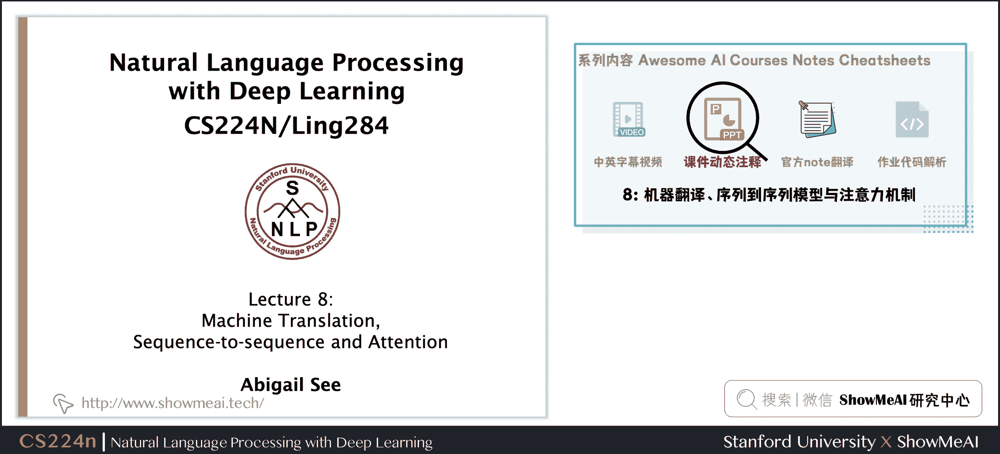

## 概述

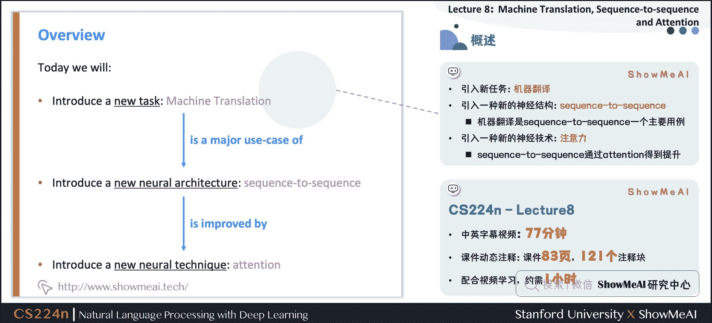

*   引入新任务：**机器翻译**
*   引入一种新的神经结构：**sequence-to-sequence**
    *   机器翻译是 sequence-to-sequence 的一个主要用例
*   引入一种新的神经技术：**注意力**
    *   sequence-to-sequence 通过 attention 得到提升

# 1.机器翻译与 SMT（统计机器翻译）

## 1.1 Pre-neural Machine Translation

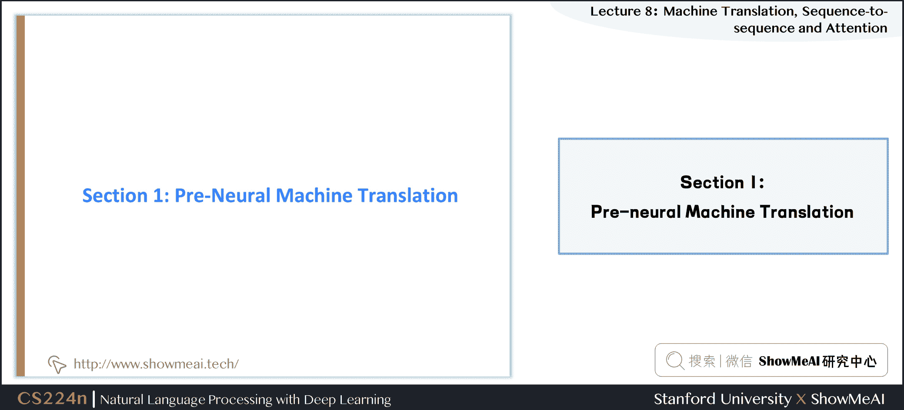

## 1.2 机器翻译

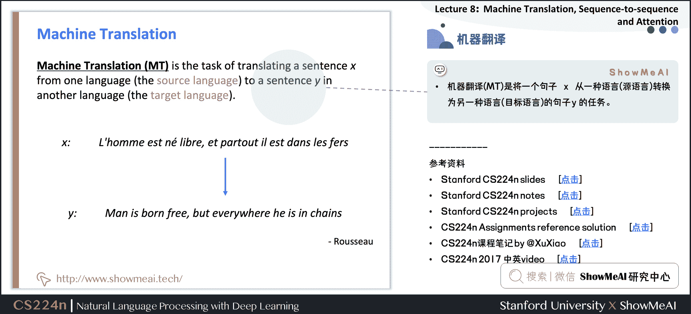

机器翻译(MT)是将一个句子 x x x 从一种语言(**源语言**)转换为另一种语言(**目标语言**)的句子 y y y 的任务。

## 1.3 1950s：早期机器翻译

机器翻译研究始于 20 世纪 50 年代初。

*   俄语 → 英语(冷战的推动)
*   系统主要是**基于规则**的，使用双语词典来讲俄语单词映射为对应的英语部分

## 1.4 1990s-2010s：统计机器翻译

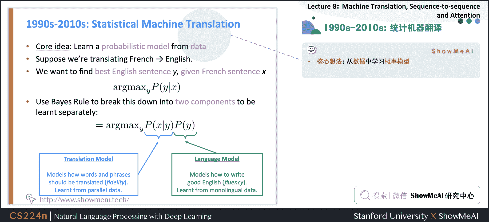

*   **核心想法**：从**数据**中学习**概率模型**

*   假设我们正在翻译法语 → 英语

*   对于给定法语句子 x x x，我们想要找到**最好的英语句子** y y y

a r g m a x y P ( y ∣ x ) argmax_yP(y \mid x) argmaxy​P(y∣x)

*   使用 Bayes 规则将其分解为**两个组件**从而分别学习

a r g m a x y P ( x ∣ y ) P ( y ) argmax_yP(x \mid y) P(y) argmaxy​P(x∣y)P(y)

*   P ( x ∣ y ) P(x \mid y) P(x∣y)：**Translation Model / 翻译模型**

    *   分析单词和短语应该如何翻译(逼真)
    *   从并行数据中学习
*   P ( y ) P(y) P(y)：**Language Model / 语言模型**

    *   模型如何写出好英语(流利)
    *   从单语数据中学习

## 1.5 1990s-2010s：统计机器翻译

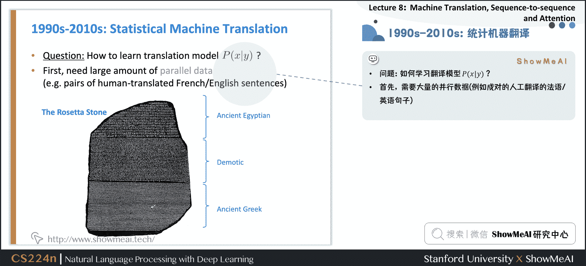

*   **问题**：如何学习翻译模型 P(x \mid y)？

*   首先，需要大量的**并行数据**(例如成对的人工翻译的法语/英语句子)

## 1.6 SMT 的学习对齐

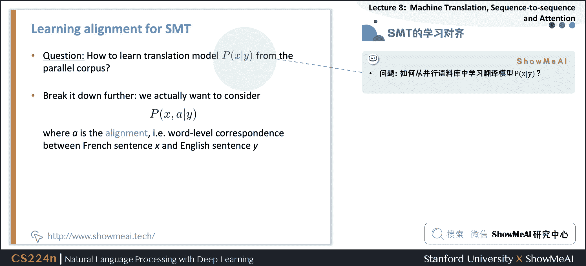

*   **问题**：如何从并行语料库中学习翻译模型 P ( x ∣ y ) P(x \mid y) P(x∣y)？
*   进一步分解：我们实际上想要考虑

P ( x , a ∣ y ) P(x,a \mid y) P(x,a∣y)

*   a a a 是对齐
*   即法语句子 x x x 和英语句子 y y y 之间的单词级对应

## 1.7 对齐

> Examples from: “The Mathematics of Statistical Machine Translation: Parameter Estimation", Brown et al, 1993\. http://www.aclweb.org/anthology/J93-2003

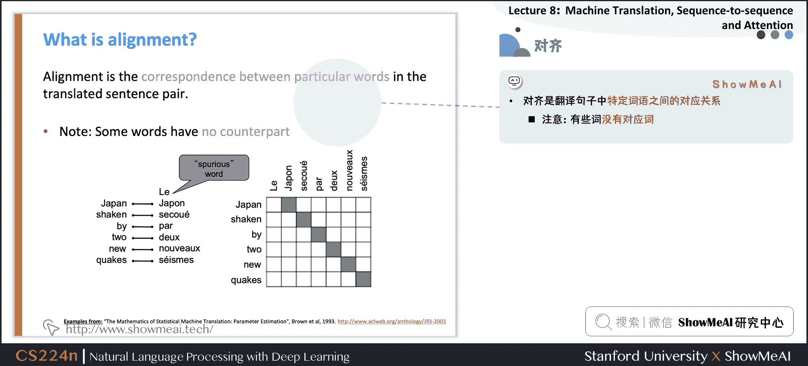

*   对齐是翻译句子中特定词语之间的对应关系
    *   注意：有些词没有对应词

## 1.8 对齐是复杂的

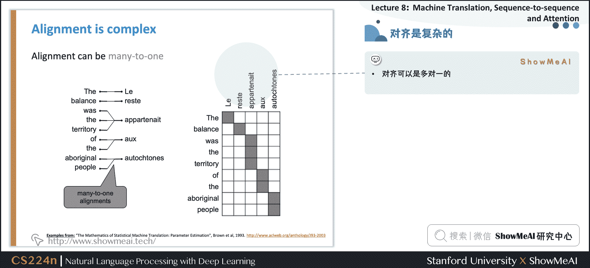

*   对齐可以是多对一的

## 1.9 对齐是复杂的

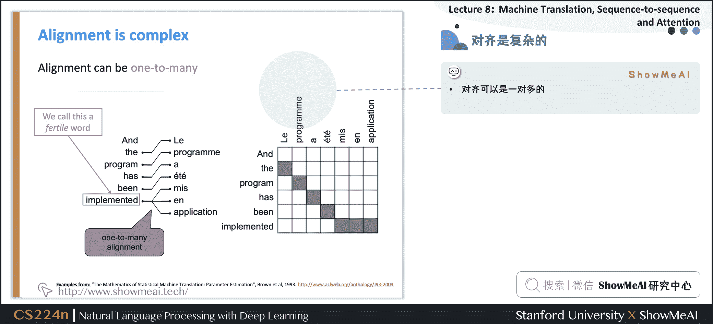

*   对齐可以是一对多的

## 1.10 对齐是复杂的

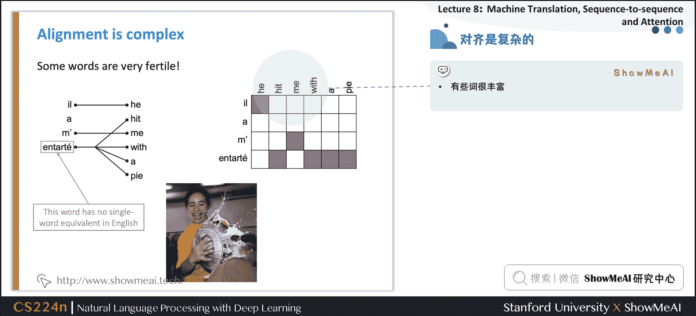

*   有些词很丰富

*   对齐可以是**多对多**(短语级)

*   我们学习很多因素的组合，包括
    *   特定单词对齐的概率(也取决于发送位置)
    *   特定单词具有特定多词对应的概率(对应单词的数量)

## 1.11 SMT 的学习对齐

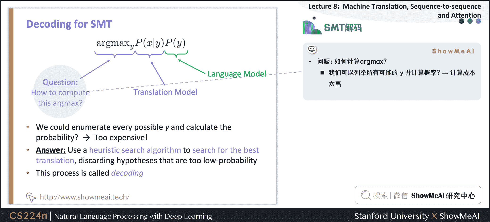

*   **问题**：如何计算 argmax
    *   我们可以列举所有可能的 y y y 并计算概率？→ 计算成本太高

*   **回答**：使用**启发式搜索算法搜索最佳翻译**，丢弃概率过低的假设
    *   这个过程称为**解码**

## 1.12 SMT 解码

> Source: ”Statistical Machine Translation", Chapter 6, Koehn, 2009\. https://www.cambridge.org/core/books/statistical-machine-translation/94EADF9F680558E13BE759997553CDE5

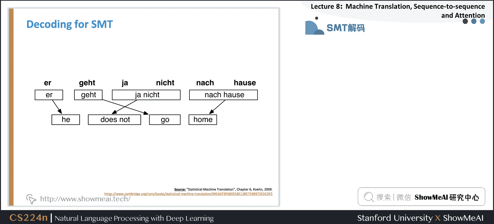

## 1.13 SMT 解码

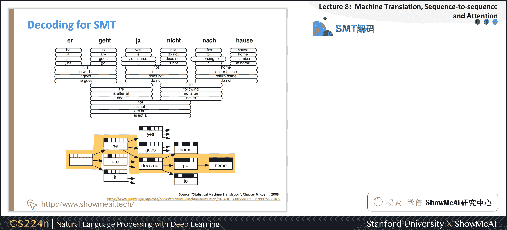

## 1.14 1990s-2010s：统计机器翻译

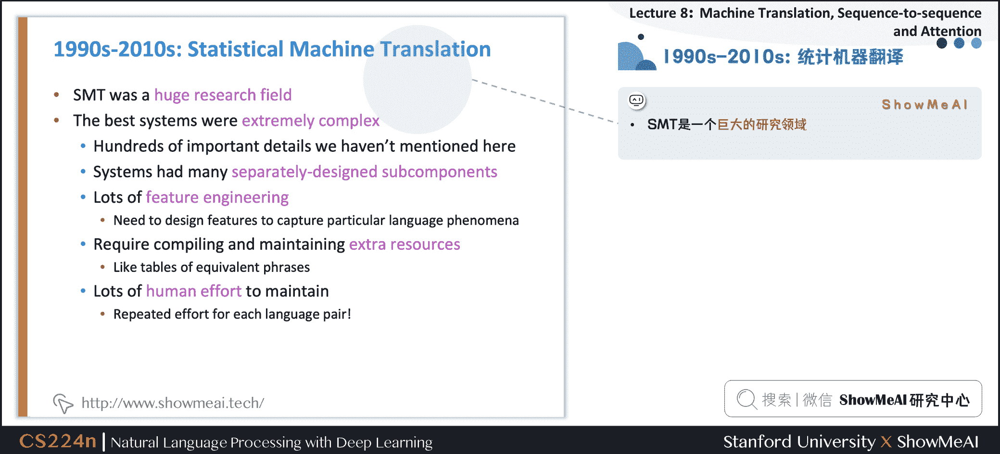

*   SMT 是一个**巨大的研究领域**

*   最好的系统**非常复杂**
    *   数以百计的重要细节我们还没有提到
    *   系统有许多**独立设计子组件工程**
    *   **大量特征工程**
        *   很多功能需要设计特性来获取特定的语言现象
    *   需要编译和维护**额外的资源**
        *   比如双语短语对应表
    *   需要**大量的人力**来维护
        *   对于每一对语言都需要重复操作

# 2.神经网络机器翻译

## 2.1 Neural Machine Translation

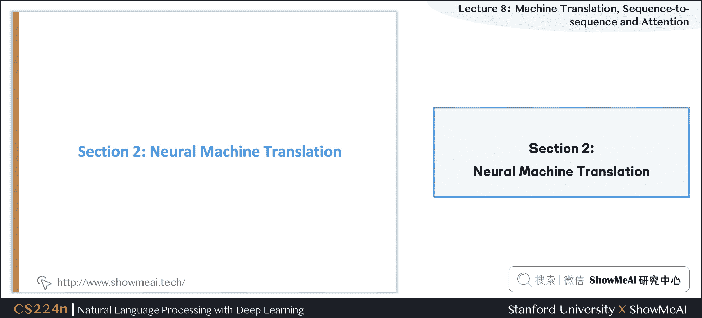

## 2.2 神经机器翻译(NMT)

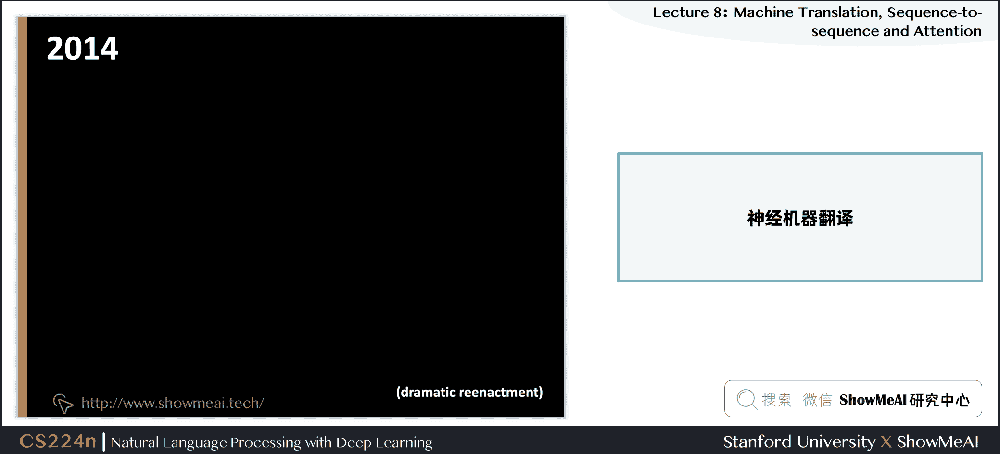

## 2.3 神经机器翻译(NMT)

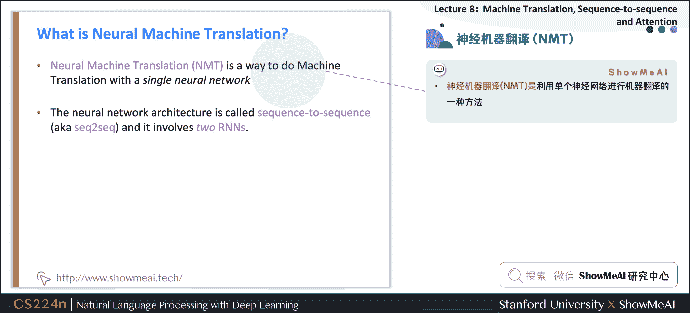

*   **神经机器翻译**(NMT)是利用单个神经网络进行机器翻译的一种方法

*   神经网络架构称为 **sequence-to-sequence** (又名 seq2seq)，它包含两个 RNNs

## 2.4 神经机器翻译(NMT)

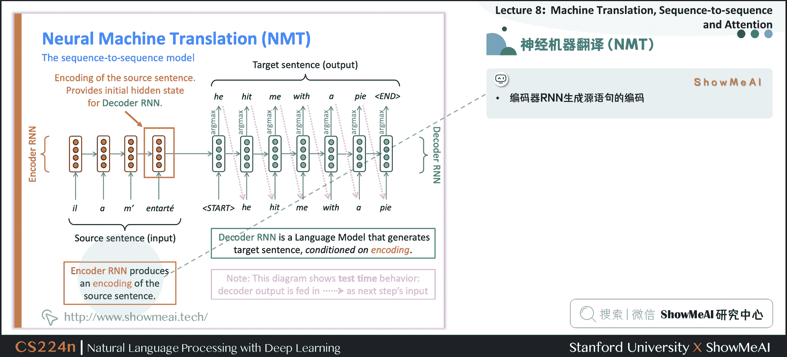

*   编码器 RNN 生成源语句的编码

*   源语句的编码为解码器 RNN 提供初始隐藏状态

*   解码器 RNN 是一种以编码为条件生成目标句的语言模型

*   **注意**：此图显示了测试时行为 → 解码器输出作为下一步的输入

## 2.5 Sequence-to-sequence 是多功能的！

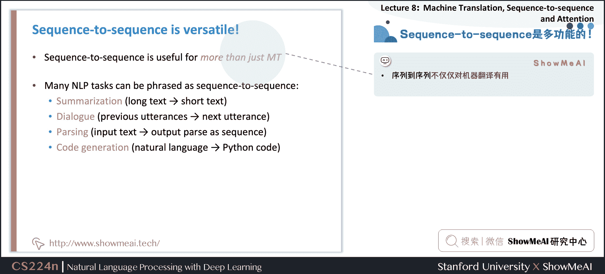

*   序列到序列不仅仅对机器翻译有用

*   许多 NLP 任务可以按照顺序进行表达
    *   **摘要**(长文本 → 短文本)
    *   **对话**(前一句话 → 下一句话)
    *   **解析**(输入文本 → 输出解析为序列)
    *   **代码生成**(自然语言 → Python 代码)

## 2.6 神经机器翻译(NMT)

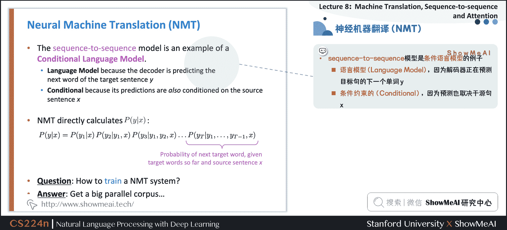

*   **sequence-to-sequence** 模型是条件语言模型的一个例子

    *   语言模型(Language Model)，因为解码器正在预测目标句的下一个单词 y y y
    *   条件约束的(Conditional)，因为预测也取决于源句 x x x

*   NMT 直接计算 P ( y ∣ x ) P(y \mid x) P(y∣x)

P ( y ∣ x ) = P ( y 1 ∣ x ) P ( y 2 ∣ y 1 , x ) P ( y 3 ∣ y 1 , y 2 , x ) … P ( y T ∣ y 1 , … , y T − 1 , x ) P(y | x)=P\left(y_{1} | x\right) P\left(y_{2} | y_{1}, x\right) P\left(y_{3} | y_{1}, y_{2}, x\right) \ldots P\left(y_{T} | y_{1}, \ldots, y_{T-1}, x\right) P(y∣x)=P(y1​∣x)P(y2​∣y1​,x)P(y3​∣y1​,y2​,x)…P(yT​∣y1​,…,yT−1​,x)

*   上式中最后一项为，给定到目前为止的目标词和源句 x x x，下一个目标词的概率

*   **问题**：如何训练 NMT 系统？
*   **回答**：找一个大的平行语料库

## 2.7 训练一个机器翻译系统

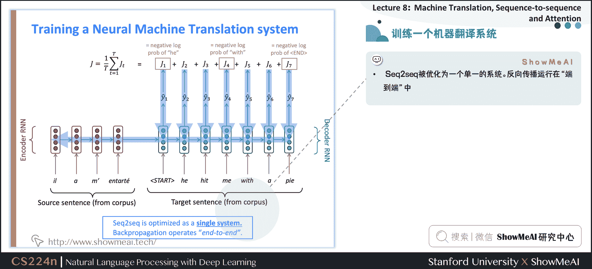

*   Seq2seq 被优化为一个单一的系统。反向传播运行在“端到端”中

# 3.机器翻译解码

## 3.1 贪婪解码

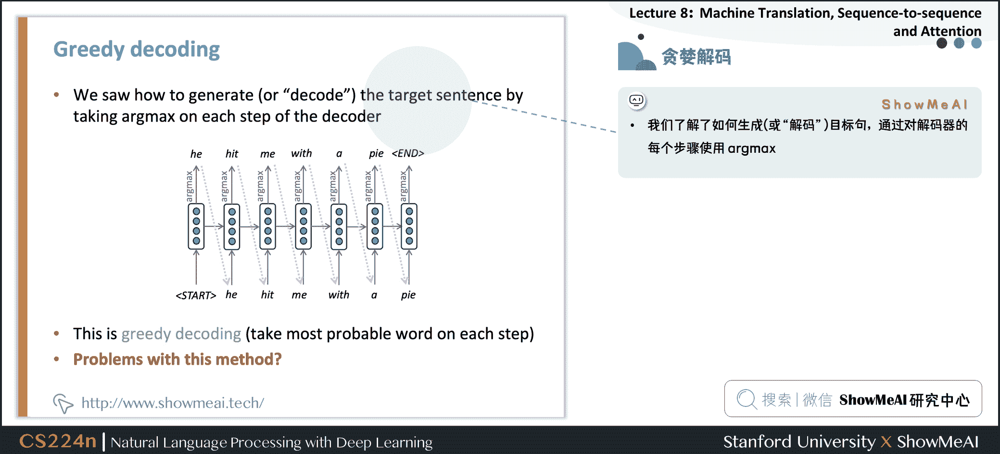

*   我们了解了如何生成(或“解码”)目标句，通过对解码器的每个步骤使用 argmax

*   这是**贪婪解码**(每一步都取最可能的单词)
*   **这种方法有问题吗**？

## 3.2 贪婪解码的问题

*   贪婪解码没有办法撤销决定

*   如何修复？

## 3.3 穷举搜索解码

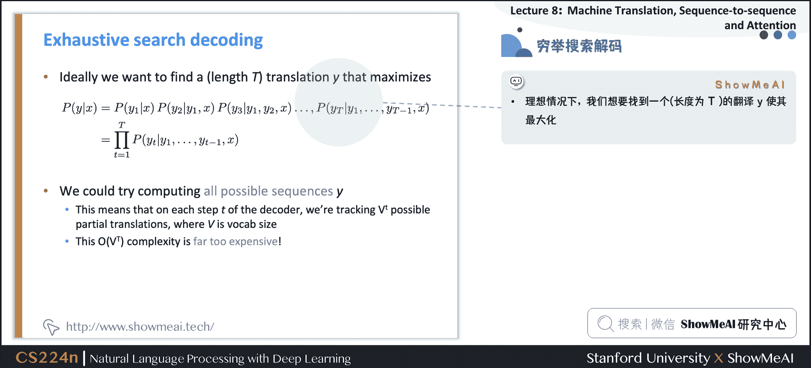

*   理想情况下，我们想要找到一个(长度为 T T T )的翻译 y y y 使其最大化

*   我们可以尝试计算**所有可能的序列** y y y

    *   这意味着在解码器的每一步 t t t ，我们跟踪 V t V^t Vt 个可能的部分翻译，其中 V V V 是 vocab 大小
    *   这种 O ( V T ) O(V^T) O(VT) 的复杂性**太昂贵**了！ 

## 3.4 集束搜索解码

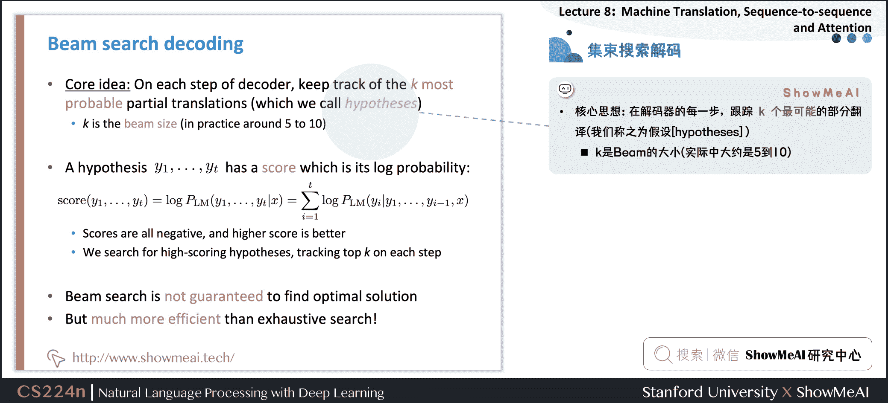

*   **核心思想**：在解码器的每一步，跟踪 k k k 个**最可能**的部分翻译(我们称之为**假设**[hypotheses ] )

    *   k k k 是 Beam 的大小(实际中大约是 5 到 10) 

*   假设 y 1 , … , y t y_1, \ldots,y_t y1​,…,yt​ 有一个**分数**，即它的对数概率

score ⁡ ( y 1 , … , y t ) = log ⁡ P L M ( y 1 , … , y t ∣ x ) = ∑ i = 1 t log ⁡ P LM ⁡ ( y i ∣ y 1 , … , y i − 1 , x ) \operatorname{score}\left(y_{1}, \ldots, y_{t}\right)=\log P_{\mathrm{LM}}\left(y_{1}, \ldots, y_{t} | x\right)=\sum_{i=1}^{t} \log P_{\operatorname{LM}}\left(y_{i} | y_{1}, \ldots, y_{i-1}, x\right) score(y1​,…,yt​)=logPLM​(y1​,…,yt​∣x)=i=1∑t​logPLM​(yi​∣y1​,…,yi−1​,x)

*   分数都是负数，分数越高越好
*   我们寻找得分较高的假设，跟踪每一步的 top k 个部分翻译

*   波束搜索 **不一定能** 找到最优解
*   但比穷举搜索**效率高得多**

## 3.5 集束搜索解码：示例

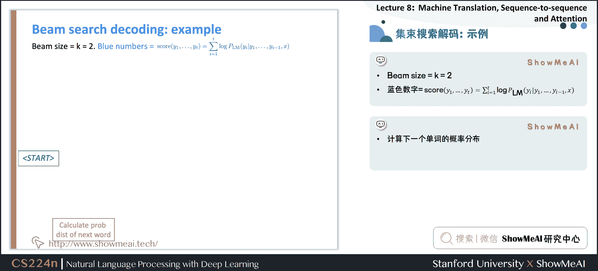

*   Beam size = k = 2
*   蓝色的数字是

score ⁡ ( y 1 , … , y t ) = ∑ i = 1 t log ⁡ P LM ⁡ ( y i ∣ y 1 , … , y i − 1 , x ) \operatorname{score}\left(y_{1}, \ldots, y_{t}\right)=\sum_{i=1}^{t} \log P_{\operatorname{LM}}\left(y_{i} | y_{1}, \ldots, y_{i-1}, x\right) score(y1​,…,yt​)=i=1∑t​logPLM​(yi​∣y1​,…,yi−1​,x)

*   计算下一个单词的概率分布
*   取前 k k k 个单词并计算分数

    *   对于每一次的 k k k 个假设，找出最前面的 k k k 个单词并计算分数
    *   在 k 2 k² k2 的假设中，保留 k k k 个最高的分值

        *   t = 2 t = 2 t=2 时，保留分数最高的 `hit` 和 `was`
        *   t = 3 t = 3 t=3 时，保留分数最高的 `a` 和 `me`
        *   t = 4 t = 4 t=4 时，保留分数最高的 `pie` 和 `with`
        *   t = 5 t = 5 t=5 时，保留分数最高的 `a` 和 `one`
        *   t = 6 t = 6 t=6 时，保留分数最高的 `pie` 
*   这是最高得分的假设
*   回溯以获得完整的假设

## 3.6 集束搜索解码：停止判据

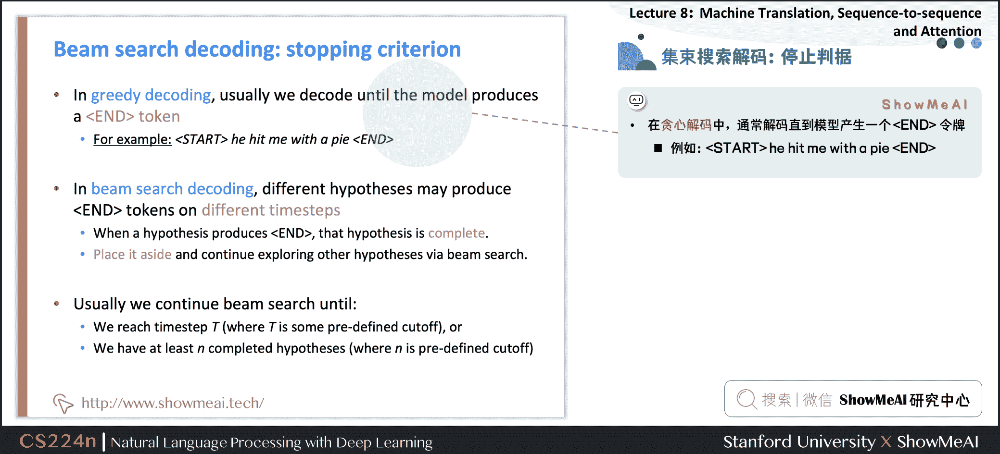

*   在贪心解码中，我们通常解码到模型产生一个 **令牌**
    *   例如： he hit me with a pie

*   在集束搜索解码中，不同的假设可能在**不同的时间步长**上产生 令牌
    *   当一个假设生成了 令牌，该假设**完成**
    *   **把它放在一边**，通过 Beam Search 继续探索其他假设

*   通常我们继续进行 Beam Search ，直到
    *   我们到达时间步长 T T T (其中 T T T 是预定义截止点)
    *   我们至少有 n n n 个已完成的假设(其中 n n n 是预定义截止点)

## 3.7 集束搜索解码：完成

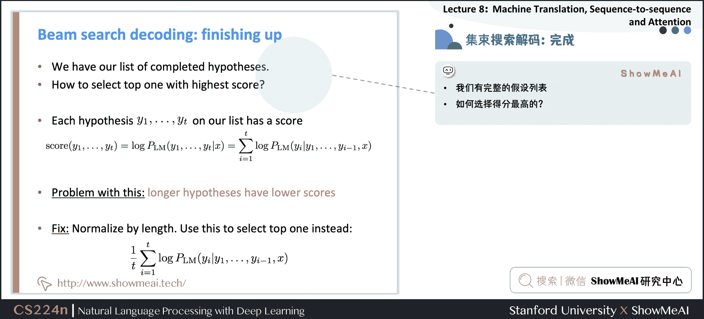

*   我们有完整的假设列表
*   如何选择得分最高的？

*   我们清单上的每个假设 y 1 , … , y t y_1, \ldots ,y_t y1​,…,yt​ 都有一个分数

score ⁡ ( y 1 , … , y t ) = log ⁡ P L M ( y 1 , … , y t ∣ x ) = ∑ i = 1 t log ⁡ P LM ⁡ ( y i ∣ y 1 , … , y i − 1 , x ) \operatorname{score}\left(y_{1}, \ldots, y_{t}\right)=\log P_{\mathrm{LM}}\left(y_{1}, \ldots, y_{t} \mid x\right)=\sum_{i=1}^{t} \log P_{\operatorname{LM}}\left(y_{i} \mid y_{1}, \ldots, y_{i-1}, x\right) score(y1​,…,yt​)=logPLM​(y1​,…,yt​∣x)=i=1∑t​logPLM​(yi​∣y1​,…,yi−1​,x)

*   **问题在于** ：较长的假设得分较低

*   **修正**：按长度标准化。用下式来选择 top one

1 t ∑ i = 1 t log ⁡ P L M ( y i ∣ y 1 , … , y i − 1 , x ) \frac{1}{t} \sum_{i=1}^{t} \log P_{\mathrm{LM}}\left(y_{i} \mid y_{1}, \ldots, y_{i-1}, x\right) t1​i=1∑t​logPLM​(yi​∣y1​,…,yi−1​,x)

## 3.8 神经机器翻译(NMT)的优点

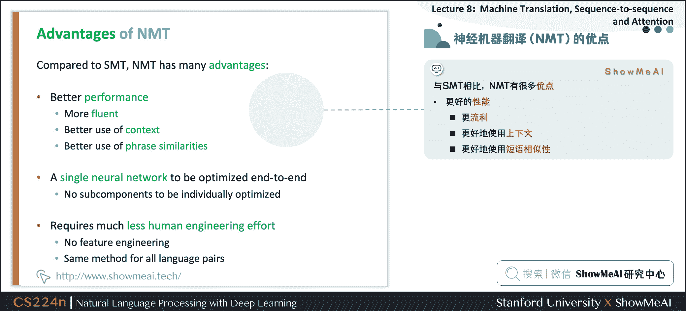

与 SMT 相比，NMT 有很多**优点**

*   更好的**性能**
    *   更流利
    *   更好地使用上下文
    *   更好地使用短语相似性

*   **单个神经网络**端到端优化
    *   没有子组件需要单独优化

*   需要**更少的人类工程付出**
    *   无特征工程
    *   所有语言对的方法相同

## 3.9 神经机器翻译(NMT)的缺点

SMT 相比，NMT 的**缺点**

*   NMT 的**可解释性较差**
    *   难以调试

*   NMT 很**难控制**
    *   例如，不能轻松指定翻译规则或指南
    *   安全问题

# 4.机器翻译评估

## 4.1 如何评估机器翻译质量

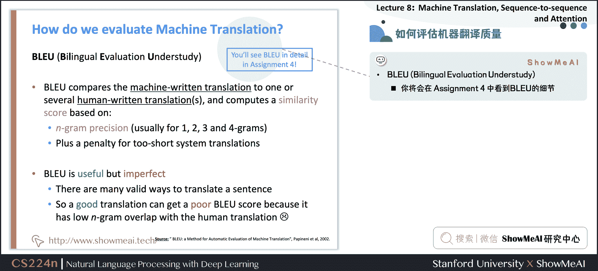

*   **BLEU** (**Bilingual Evaluation Understudy**)
    *   你将会在 Assignment 4 中看到 BLEU 的细节

*   BLEU 将机器翻译和人工翻译(一个或多个)，并计算一个相似的分数

    *   n-gram 精度 (n 通常为 1-4)
    *   对过于短的机器翻译的加上惩罚

*   BLEU 很**有用**，但**不完美**
    *   有很多有效的方法来翻译一个句子
    *   所以一个**好的**翻译可以得到一个糟糕的 BLEU score，因为它与人工翻译的 n-gram 重叠较低

## 4.2 MT 随时间推移的进步

> Source: http://www.meta-net.eu/events/meta-forum-2016/slides/09_sennrich.pdf

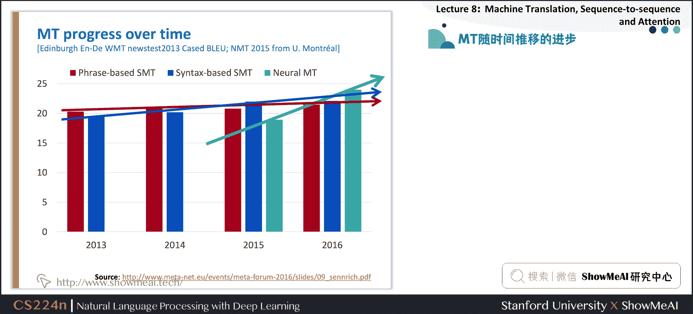

## 4.3 NMT：NLP 深度学习的最大成功案例

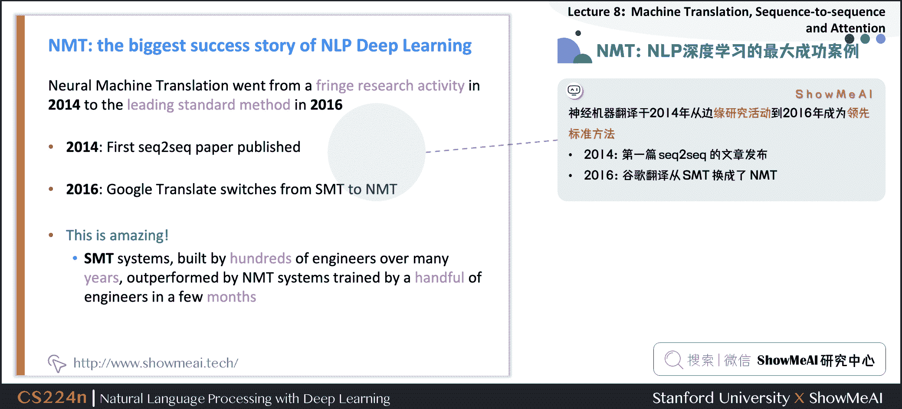

神经机器翻译于 2014 年从**边缘研究活动**到 2016 年成为**领先标准方法**

*   2014：第一篇 seq2seq 的文章发布
*   2016：谷歌翻译从 SMT 换成了 NMT

*   这是惊人的
    *   由数百名工程师历经多年打造的 SMT 系统，在短短几个月内就被少数工程师训练过的 NMT 系统超越

## 4.4 机器翻译问题完美解决了吗？

> Further reading: “Has AI surpassed humans at translation? Not even close!” https://www.skynettoday.com/editorials/state_of_nmt

> Source: https://hackernoon.com/bias-sexist-or-this-is-the-way-it-should-be-ce1f7c8c683c

> Picture source: https://www.vice.com/en_uk/article/j5npeg/why-is-google-translate-spitting-out-sinister-religious-prophecies

> Explanation: https://www.skynettoday.com/briefs/google-nmt-prophecies

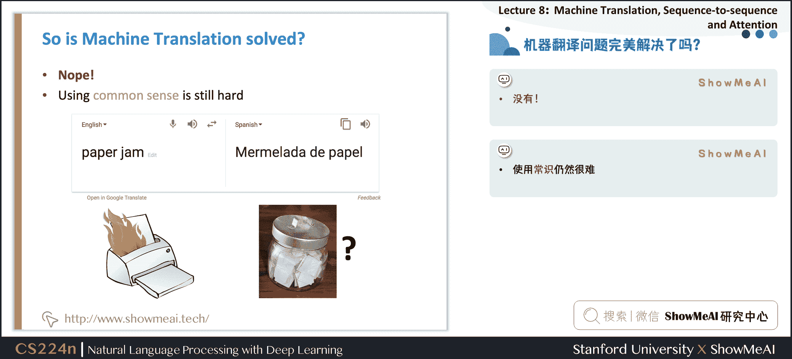

*   没有！

*   许多困难仍然存在
    *   **词表外**的单词处理
    *   训练和测试数据之间的**领域不匹配**
    *   在较长文本上维护上下文
    *   **资源较低**的语言对

*   使用常识仍然很难
*   NMT 在训练数据中发现偏差
*   无法解释的系统会做一些奇怪的事情

## 4.5 NMT 研究仍在继续

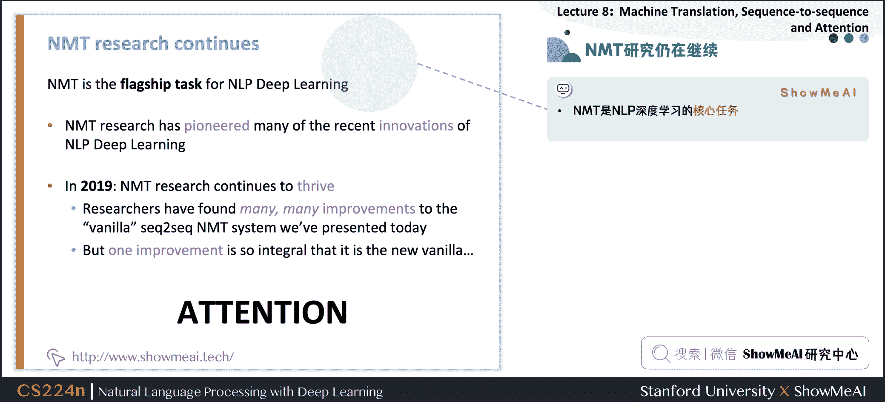

*   NMT 是 NLP 深度学习的**核心任务**

*   NMT 研究引领了 NLP 深度学习的许多最新**创新**

*   2019 年：NMT 研究将继续蓬勃发展

    *   研究人员发现，对于我们今天介绍的普通 seq2seq NMT 系统，**有很多、很多的改进**。
    *   但有一个改进是如此不可或缺

# 5.注意力机制

## 5.1 Attention

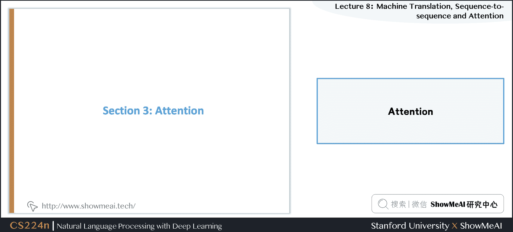

## 5.2 Sequence-to-sequence：瓶颈问题

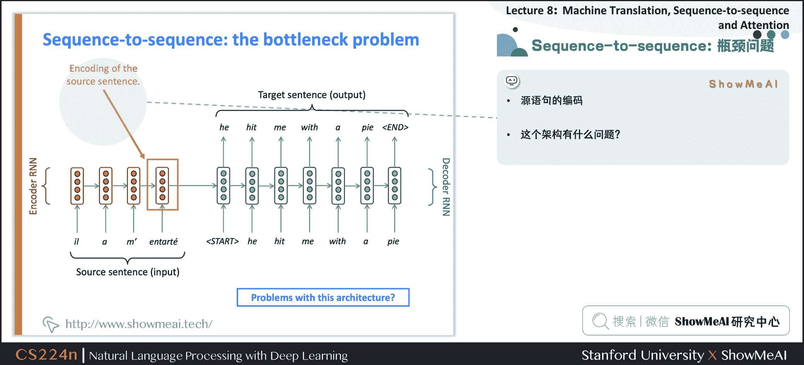

*   源语句的编码
*   需要捕获关于源语句的所有信息
*   信息瓶颈！

## 5.3 注意力

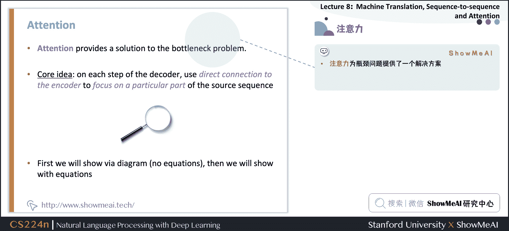

*   **注意力**为瓶颈问题提供了一个解决方案

*   **核心理念**：在解码器的每一步，使用与**编码器的直接连接**来专注于源序列的**特定部分**

*   首先我们将通过图表展示(没有方程)，然后我们将用方程展示

## 5.4 带注意力机制的序列到序列模型

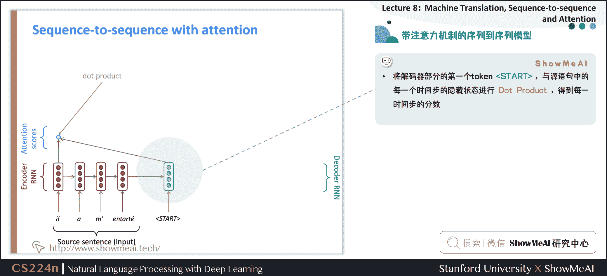

*   将解码器部分的第一个 token 与源语句中的每一个时间步的隐藏状态进行 Dot Product 得到每一时间步的分数

*   通过 softmax 将分数转化为概率分布
*   在这个解码器时间步长上，我们主要关注第一个编码器隐藏状态(“he”)

*   利用**注意力分布**对编码器的隐藏状态进行**加权求和**
*   注意力输出主要包含来自于受到**高度关注**的**隐藏状态**的信息

*   连接的**注意力输出**与**解码器隐藏状态** ，然后用来计算 y ^ 1 \hat y_1 y^​1​

*   有时，我们从前面的步骤中提取注意力输出，并将其输入解码器(连同通常的解码器输入)。我们在作业 4 中做这个。

## 5.5 注意力：公式

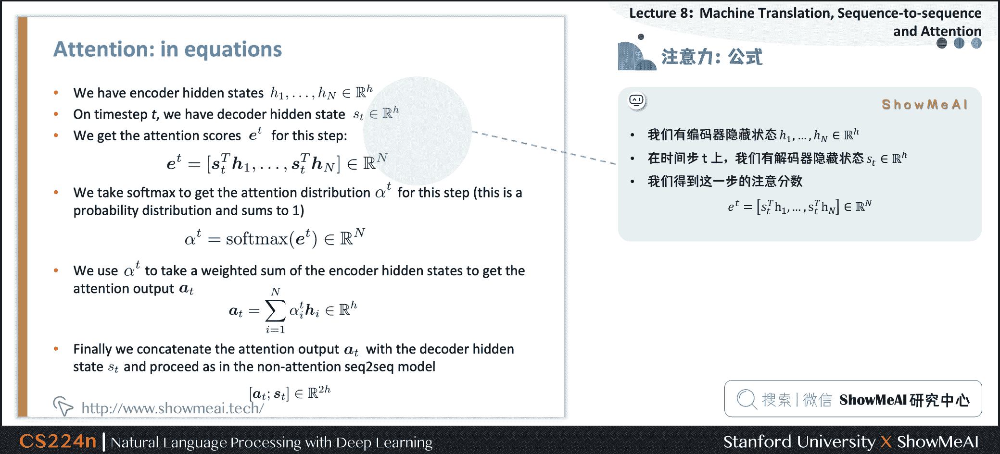

*   我们有编码器隐藏状态 h 1 , … , h N ∈ R h h_{1}, \ldots, h_{N} \in \mathbb{R}^{h} h1​,…,hN​∈Rh
*   在时间步 t t t 上，我们有解码器隐藏状态 s t ∈ R h s_{t} \in \mathbb{R}^{h} st​∈Rh
*   我们得到这一步的注意分数

e t = [ s t T h 1 , … , s t T h N ] ∈ R N e^{t}=\left[s_{t}^{T} \boldsymbol{h}_{1}, \ldots, \boldsymbol{s}_{t}^{T} \boldsymbol{h}_{N}\right] \in \mathbb{R}^{N} et=[stT​h1​,…,stT​hN​]∈RN

*   我们使用 softmax 得到这一步的注意分布 α t \alpha^{t} αt (这是一个概率分布，和为 1)

α t = softmax ⁡ ( e t ) ∈ R N \alpha^{t}=\operatorname{softmax}\left(e^{t}\right) \in \mathbb{R}^{N} αt=softmax(et)∈RN

*   我们使用 α t \alpha^{t} αt 来获得编码器隐藏状态的加权和，得到注意力输出 α t \alpha^{t} αt

a t = ∑ i = 1 N α i t h i ∈ R h \boldsymbol{a}_{t}=\sum_{i=1}^{N} \alpha_{i}^{t} \boldsymbol{h}_{i} \in \mathbb{R}^{h} at​=i=1∑N​αit​hi​∈Rh

*   最后，我们将注意输出 α t \alpha^{t} αt 与解码器隐藏状态连接起来，并按照非注意 seq2seq 模型继续进行

[ a t ; s t ] ∈ R 2 h \left[\boldsymbol{a}_{t} ; \boldsymbol{s}_{t}\right] \in \mathbb{R}^{2 h} [at​;st​]∈R2h

## 5.6 注意力很棒！

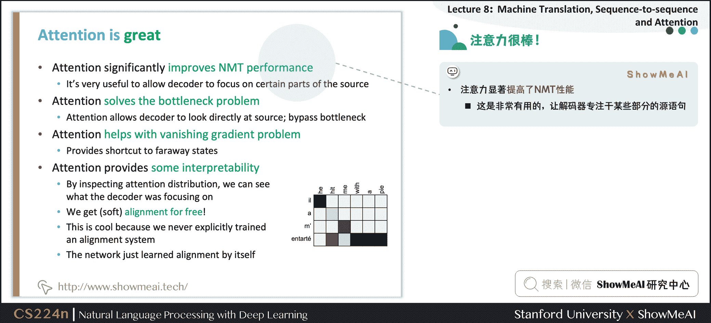

*   注意力显著提高了**NMT 性能**
    *   这是非常有用的，让解码器专注于某些部分的源语句

*   注意力解决**瓶颈问题**
    *   注意力允许解码器直接查看源语句；绕过瓶颈

*   注意力**帮助消失梯度问题**
    *   提供了通往遥远状态的捷径

*   注意力**提供了一些可解释性**
    *   通过检查注意力的分布，我们可以看到解码器在关注什么
    *   我们可以免费得到(软)对齐
    *   这很酷，因为我们从来没有明确训练过对齐系统
    *   网络只是自主学习了对齐

## 5.7 注意力是一种普遍的深度学习技巧

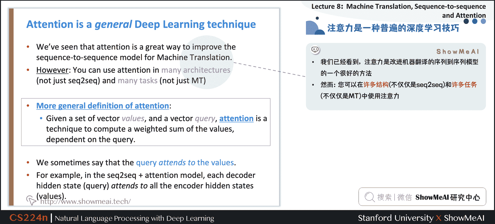

*   我们已经看到，注意力是改进机器翻译的序列到序列模型的一个很好的方法

*   然而：你可以在**许多结构**(不仅仅是 seq2seq)和许多任务(不仅仅是 MT)中使用注意力

*   我们有时说 **query attends to the values**
*   例如，在 seq2seq + attention 模型中，每个解码器的隐藏状态(查询)关注所有编码器的隐藏状态(值)

## 5.8 注意力是一种普遍的深度学习技巧

*   注意力的更一般**定义**
    *   给定一组向量**值**和一个向量**查询**，注意力是一种根据查询，计算值的加权和的技术

*   **直觉**
    *   加权和是值中包含的信息的**选择性汇总**，查询在其中确定要关注哪些值
    *   注意是一种获取**任意一组表示(值)的固定大小表示的方法**，依赖于其他一些表示(查询)。

## 5.9 有几种注意力的变体

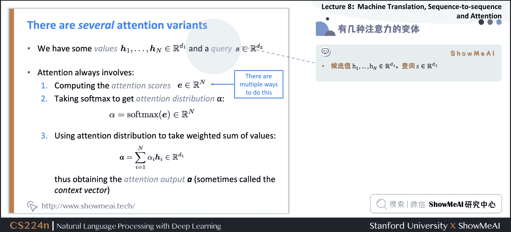

*   **候选值** h 1 , … , h N ∈ R d 1 \boldsymbol{h}_{1}, \ldots, \boldsymbol{h}_{N} \in \mathbb{R}^{d_{1}} h1​,…,hN​∈Rd1​，**查询** s ∈ R d 2 s \in \mathbb{R}^{d_{2}} s∈Rd2​

*   注意力总是包括：

    *   计算**注意力得分** e ∈ R N e \in \mathbb{R}^{N} e∈RN (很多种计算方式)
    *   采取 softmax 来获得**注意力分布** α \alpha α

α = softmax ⁡ ( e ) ∈ R N \alpha=\operatorname{softmax}(\boldsymbol{e}) \in \mathbb{R}^{N} α=softmax(e)∈RN

*   使用注意力分布对值进行加权求和：从而得到注意力输出 α \alpha α (有时称为上下文向量)

a = ∑ i = 1 N α i h i ∈ R d 1 \boldsymbol{a}=\sum_{i=1}^{N} \alpha_{i} \boldsymbol{h}_{i} \in \mathbb{R}^{d_{1}} a=i=1∑N​αi​hi​∈Rd1​

## 5.10 注意力的变体

> More information: “Deep Learning for NLP Best Practices”, Ruder, 2017\. http://ruder.io/deep-learning-nlp-best-practices/index.html#attention
> “Massive Exploration of Neural Machine Translation Architectures”, Britz et al, 2017, https://arxiv.org/pdf/1703.03906.pdf

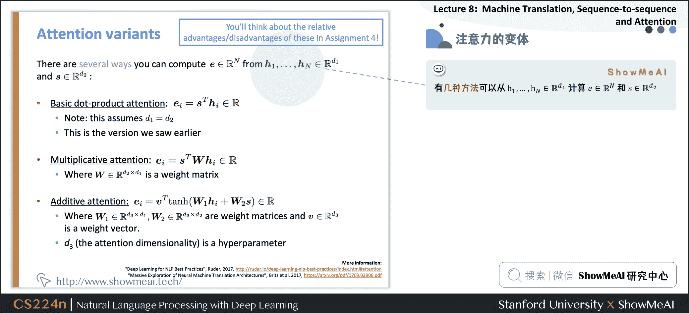

*   **有几种方法**可以从 h 1 , … , h N ∈ R d 1 \boldsymbol{h}_{1}, \ldots, \boldsymbol{h}_{N} \in \mathbb{R}^{d_{1}} h1​,…,hN​∈Rd1​ 计算 e ∈ R N e \in \mathbb{R}^{N} e∈RN 和 s ∈ R d 2 s \in \mathbb{R}^{d_{2}} s∈Rd2​

*   基本的点乘注意力 e i = s T h i ∈ R \boldsymbol{e}_{i}=\boldsymbol{s}^{T} \boldsymbol{h}_{i} \in \mathbb{R} ei​=sThi​∈R

    *   注意：这里假设 d 1 = d 2 d_1 = d_2 d1​=d2​ [这是我们之前看到的版本] 

*   乘法注意力 e i = s T W h i ∈ R e_{i}=s^{T} \boldsymbol{W} \boldsymbol{h}_{i} \in \mathbb{R} ei​=sTWhi​∈R

    *   W ∈ R d 2 × d 1 \boldsymbol{W} \in \mathbb{R}^{d_{2} \times d_{1}} W∈Rd2​×d1​ 是权重矩阵 

*   加法注意力 e i = v T tanh ⁡ ( W 1 h i + W 2 s ) ∈ R e_{i}=\boldsymbol{v}^{T} \tanh \left(\boldsymbol{W}_{1} \boldsymbol{h}_{i}+\boldsymbol{W}_{2} \boldsymbol{s}\right) \in \mathbb{R} ei​=vTtanh(W1​hi​+W2​s)∈R

    *   其中 W 1 ∈ R d 3 × d 1 , W 2 ∈ R d 3 × d 2 \boldsymbol{W}_{1} \in \mathbb{R}^{d_{3} \times d_{1}}, \boldsymbol{W}_{2} \in \mathbb{R}^{d_{3} \times d_{2}} W1​∈Rd3​×d1​,W2​∈Rd3​×d2​ 是权重矩阵， v ∈ R d 3 \boldsymbol{v} \in \mathbb{R}^{d_{3}} v∈Rd3​ 是权重向量 ， d 3 d_3 d3​ (注意力维度)是一个超参数 

## 5.11 课程总结

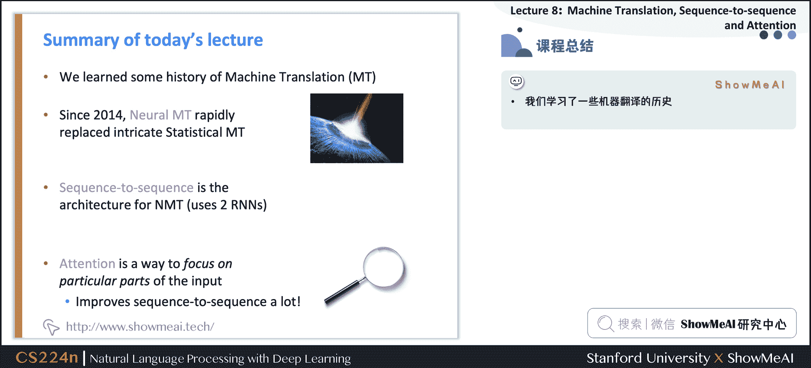

*   我们学习了一些机器翻译的历史

*   自 2014 年以来，**神经机器翻译**迅速取代了复杂的统计机器翻译

*   **Sequence-to-sequence** 是 NMT 的体系结构(使用 2 个 RNN)

*   **注意力**是一种集中注意力的方法

    *   从序列到序列改进了很多

# 6.视频教程

可以点击 [B 站](https://www.bilibili.com/video/BV1Yo4y1D7FW?p=8) 查看视频的【双语字幕】版本

[`player.bilibili.com/player.html?aid=376755412&page=8`](https://player.bilibili.com/player.html?aid=376755412&page=8)

【双语字幕+资料下载】斯坦福 CS224n | 深度学习与自然语言处理(2019·全 20 讲)

# 7.参考资料

*   [本讲带学的**在线阅翻页本**](https://blog.showmeai.tech/cs224n/lecture08-Machine-Translation-Seq2Seq-and-Attention#/)
*   [《斯坦福 CS224n 深度学习与自然语言处理》**课程学习指南**](https://blog.showmeai.tech/cs224n/)
*   [《斯坦福 CS224n 深度学习与自然语言处理》**课程大作业解析**](https://github.com/ShowMeAI-Hub/awesome-AI-courses-notes-cheatsheets/tree/main/CS224n-Natural-Language-Processing-with-Deep-Learning/assignment-solutions)
*   [【**双语字幕视频**】斯坦福 CS224n | 深度学习与自然语言处理(2019·全 20 讲)](https://www.bilibili.com/video/BV1Yo4y1D7FW)
*   [**Stanford 官网** | CS224n: Natural Language Processing with Deep Learning](https://web.stanford.edu/class/archive/cs/cs224n/cs224n.1194/)

# [**ShowMeAI**](http://www.showmeai.tech)系列教程推荐

*   [大厂技术实现 | 推荐与广告计算解决方案](http://www.showmeai.tech/tutorials/50)
*   [大厂技术实现 | 计算机视觉解决方案](http://www.showmeai.tech/tutorials/51)
*   [大厂技术实现 | 自然语言处理行业解决方案](http://www.showmeai.tech/tutorials/52)
*   [图解 Python 编程：从入门到精通系列教程](http://www.showmeai.tech/tutorials/56)
*   [图解数据分析：从入门到精通系列教程](http://www.showmeai.tech/tutorials/33)
*   [图解 AI 数学基础：从入门到精通系列教程](http://www.showmeai.tech/tutorials/83)
*   [图解大数据技术：从入门到精通系列教程](http://www.showmeai.tech/tutorials/84)
*   [图解机器学习算法：从入门到精通系列教程](http://www.showmeai.tech/tutorials/34)
*   [机器学习实战：手把手教你玩转机器学习系列](http://www.showmeai.tech/tutorials/41)
*   [深度学习教程 | 吴恩达专项课程 · 全套笔记解读](http://www.showmeai.tech/tutorials/35)
*   [自然语言处理教程 | 斯坦福 CS224n 课程 · 课程带学与全套笔记解读](http://www.showmeai.tech/tutorials/36)

# NLP 系列教程文章

*   [NLP 教程(1)- 词向量、SVD 分解与 Word2vec](http://showmeai.tech/article-detail/230)
*   [NLP 教程(2)- GloVe 及词向量的训练与评估](http://showmeai.tech/article-detail/232)
*   [NLP 教程(3)- 神经网络与反向传播](http://showmeai.tech/article-detail/234)
*   [NLP 教程(4)- 句法分析与依存解析](http://www.showmeai.tech/article-detail/237)
*   [NLP 教程(5)- 语言模型、RNN、GRU 与 LSTM](http://www.showmeai.tech/article-detail/239)
*   [NLP 教程(6)- 神经机器翻译、seq2seq 与注意力机制](http://www.showmeai.tech/article-detail/242)
*   [NLP 教程(7)- 问答系统](http://www.showmeai.tech/article-detail/245)
*   [NLP 教程(8)- NLP 中的卷积神经网络](http://www.showmeai.tech/article-detail/247)
*   [NLP 教程(9)- 句法分析与树形递归神经网络](http://www.showmeai.tech/article-detail/255)

# 斯坦福 CS224n 课程带学详解

*   [斯坦福 NLP 课程 | 第 1 讲 - NLP 介绍与词向量初步](http://showmeai.tech/article-detail/231)
*   [斯坦福 NLP 课程 | 第 2 讲 - 词向量进阶](http://showmeai.tech/article-detail/233)
*   [斯坦福 NLP 课程 | 第 3 讲 - 神经网络知识回顾](http://showmeai.tech/article-detail/235)
*   [斯坦福 NLP 课程 | 第 4 讲 - 神经网络反向传播与计算图](http://showmeai.tech/article-detail/236)
*   [斯坦福 NLP 课程 | 第 5 讲 - 句法分析与依存解析](http://www.showmeai.tech/article-detail/238)
*   [斯坦福 NLP 课程 | 第 6 讲 - 循环神经网络与语言模型](http://www.showmeai.tech/article-detail/240)
*   [斯坦福 NLP 课程 | 第 7 讲 - 梯度消失问题与 RNN 变种](http://www.showmeai.tech/article-detail/241)
*   [斯坦福 NLP 课程 | 第 8 讲 - 机器翻译、seq2seq 与注意力机制](http://www.showmeai.tech/article-detail/243)
*   [斯坦福 NLP 课程 | 第 9 讲 - cs224n 课程大项目实用技巧与经验](http://www.showmeai.tech/article-detail/244)
*   [斯坦福 NLP 课程 | 第 10 讲 - NLP 中的问答系统](http://www.showmeai.tech/article-detail/246)
*   [斯坦福 NLP 课程 | 第 11 讲 - NLP 中的卷积神经网络](http://www.showmeai.tech/article-detail/248)
*   [斯坦福 NLP 课程 | 第 12 讲 - 子词模型](http://www.showmeai.tech/article-detail/249)
*   [斯坦福 NLP 课程 | 第 13 讲 - 基于上下文的表征与 NLP 预训练模型](http://www.showmeai.tech/article-detail/250)
*   [斯坦福 NLP 课程 | 第 14 讲 - Transformers 自注意力与生成模型](http://www.showmeai.tech/article-detail/251)
*   [斯坦福 NLP 课程 | 第 15 讲 - NLP 文本生成任务](http://www.showmeai.tech/article-detail/252)
*   [斯坦福 NLP 课程 | 第 16 讲 - 指代消解问题与神经网络方法](http://www.showmeai.tech/article-detail/253)
*   [斯坦福 NLP 课程 | 第 17 讲 - 多任务学习(以问答系统为例)](http://www.showmeai.tech/article-detail/254)
*   [斯坦福 NLP 课程 | 第 18 讲 - 句法分析与树形递归神经网络](http://www.showmeai.tech/article-detail/256)
*   [斯坦福 NLP 课程 | 第 19 讲 - AI 安全偏见与公平](http://www.showmeai.tech/article-detail/257)
*   [斯坦福 NLP 课程 | 第 20 讲 - NLP 与深度学习的未来](http://www.showmeai.tech/article-detail/258)

