# 斯坦福 NLP 课程 | 第 10 讲 - NLP 中的问答系统

> 原文：[`blog.csdn.net/ShowMeAI/article/details/124621453`](https://blog.csdn.net/ShowMeAI/article/details/124621453)

作者：[韩信子](https://github.com/HanXinzi-AI)@[ShowMeAI](http://www.showmeai.tech/)，路遥@[ShowMeAI](http://www.showmeai.tech/)，奇异果@[ShowMeAI](http://www.showmeai.tech/)
[教程地址](http://www.showmeai.tech/tutorials/36)：[`www.showmeai.tech/tutorials/36`](http://www.showmeai.tech/tutorials/36)
[本文地址](http://www.showmeai.tech/article-detail/246)：[`www.showmeai.tech/article-detail/246`](http://www.showmeai.tech/article-detail/246)
声明：版权所有，转载请联系平台与作者并注明出处

收藏[ShowMeAI](http://www.showmeai.tech/)查看更多精彩内容

* * *

[ShowMeAI](http://www.showmeai.tech/)为**斯坦福 CS224n**《自然语言处理与深度学习(Natural Language Processing with Deep Learning)》课程的全部课件，做了**中文翻译和注释**，并制作成了 GIF 动图！

本讲内容的**深度总结教程**可以在[**这里**](http://www.showmeai.tech/article-detail/245) 查看。视频和课件等资料的获取方式见**文末**。

* * *

# 引言

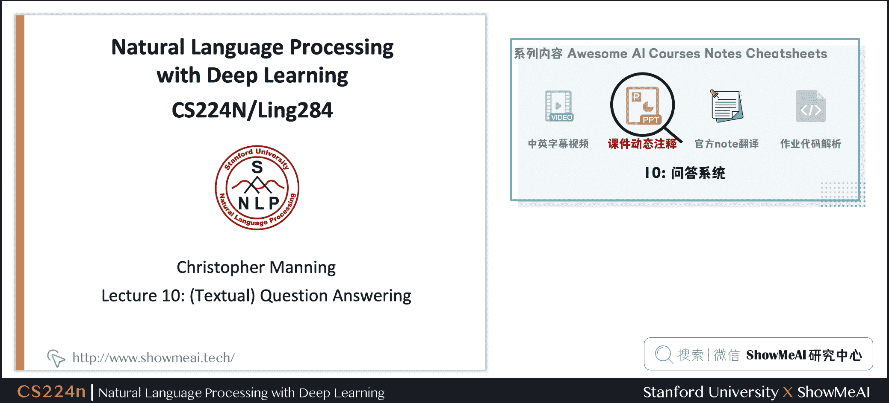

## 授课计划

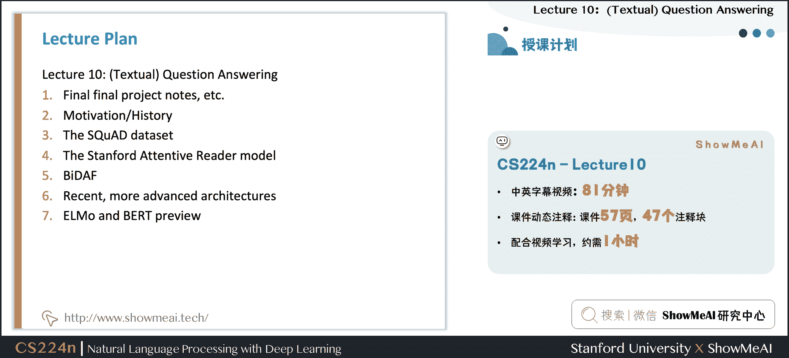

*   Final final project notes, etc. / **最终大项目要点**
*   Motivation/History / **问答系统动机与历史**
*   The SQuADdataset / **SQuAD 问答数据集**
*   The Stanford Attentive Reader model / **斯坦福注意力阅读模型**
*   BiDAF / **BiDAF 模型**
*   Recent, more advanced architectures / **近期前沿模型**
*   ELMo and BERT preview / **ELMo 与 BERT 预习与简单介绍**

# 1.最终大项目要点

## 1.1 自定义 Final Project

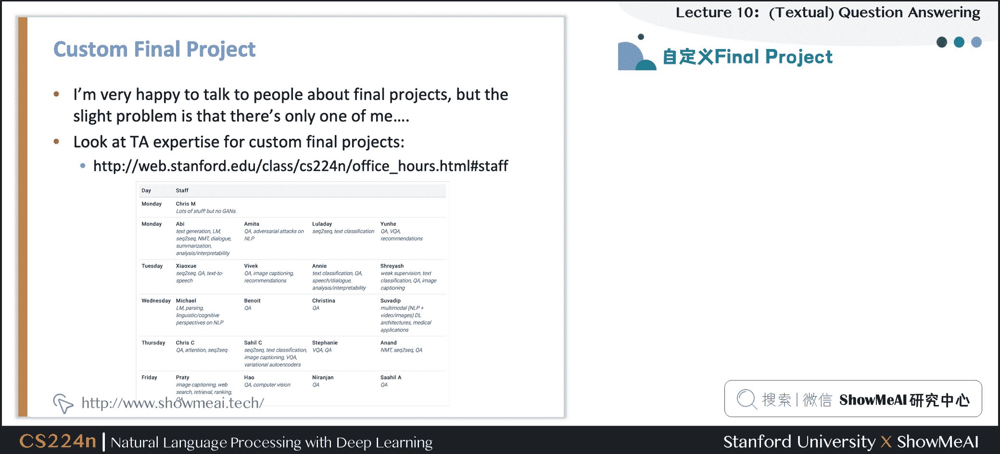

## 1.2 默认 Project

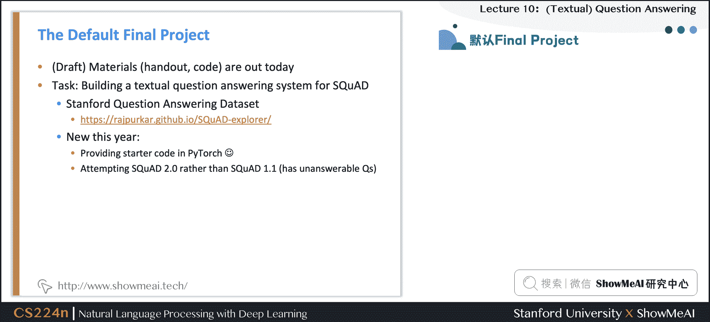

## 1.3 Project 提交

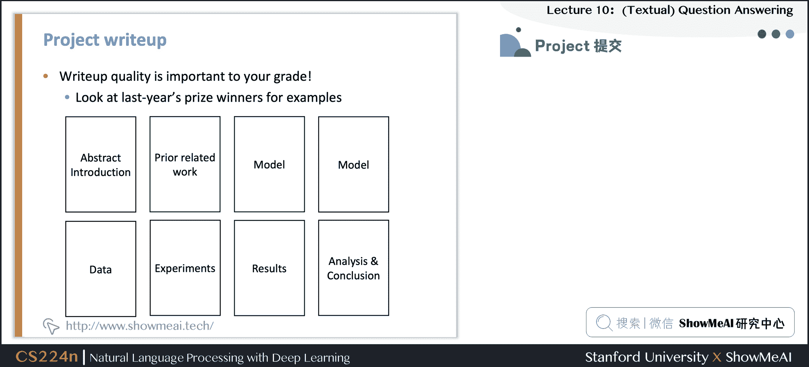

## 1.4 项目顺利

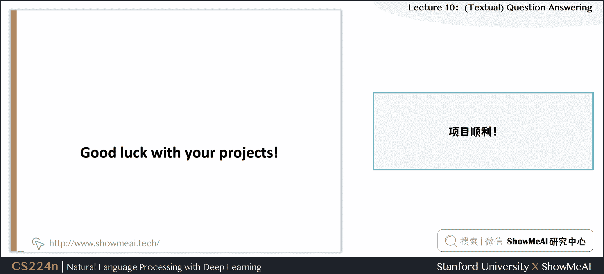

## 1.5 谁是澳大利亚第三任总理

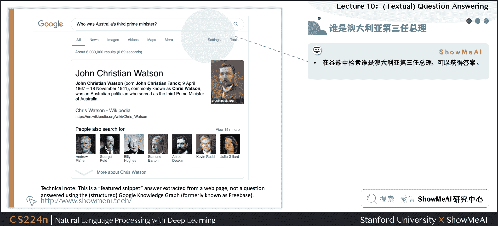

*   在谷歌中检索谁是澳大利亚第三任总理，可以获得答案。

*   **技术说明**：这是从 web 页面中提取的 `特性片段` 回答，而不是使用 (结构化的) 谷歌知识图 (以前称为 Freebase) 回答的问题。
*   我们今天要谈论的就是这样的问题，而不是基于结构化数据存储的问答。

# 2.问答系统动机与历史

## 2.1 动机：问答

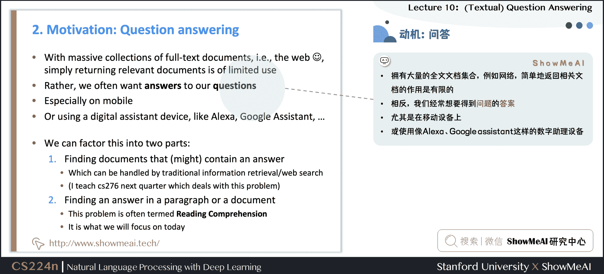

*   拥有大量的全文文档集合，例如网络，简单地返回相关文档的作用是有限的
*   相反，我们经常想要得到**问题的答案**
*   尤其是在移动设备上
*   或使用像 Alexa、Google assistant 这样的数字助理设备

我们可以把它分解成两部分：

*   1.**查找 (可能) 包含答案的文档**
    *   可以通过传统的信息检索/web 搜索处理
    *   (下个季度我将讲授 cs276，它将处理这个问题)
*   2.**在一段或一份文件中找到答案**
    *   这个问题通常被称为阅读理解
    *   这就是我们今天要关注的

## 2.2 阅读理解简史

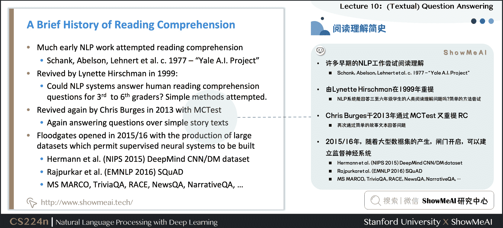

*   许多早期的 NLP 工作尝试阅读理解
    *   Schank, Abelson, Lehnert et al. c. 1977 – Yale A.I. Project

*   由 Lynette Hirschman 在 1999 年重提
    *   NLP 系统能回答三至六年级学生的人类阅读理解问题吗?简单的方法尝试

*   Chris Burges 于 2013 年通过 MCTest 又重新复活 RC
    *   再次通过简单的故事文本回答问题

*   2015/16 年，随着大型数据集的产生，闸门开启，可以建立监督神经系统
    *   Hermann et al. (NIPS 2015) DeepMind CNN/DM dataset
    *   Rajpurkaret al. (EMNLP 2016) SQuAD
    *   MS MARCO, TriviaQA, RACE, NewsQA, NarrativeQA, …

## 2.3 机器理解(Burges 2013)

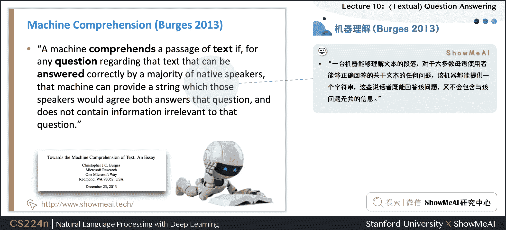

> 一台机器能够理解文本的段落，对于大多数母语使用者能够正确回答的关于文本的任何问题，该机器都能提供一个字符串，这些说话者既能回答该问题，又不会包含与该问题无关的信息。

## 2.4 MCTest 阅读理解

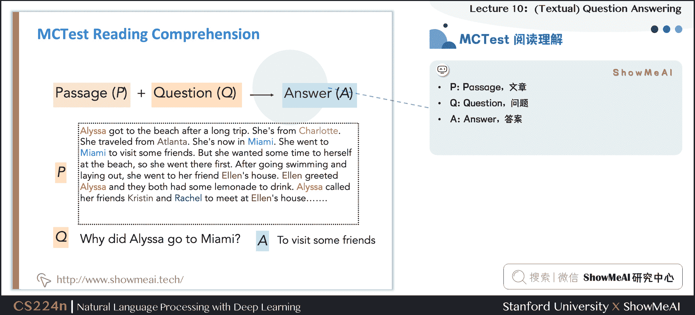

*   P：Passage，文章
*   Q：Question，问题
*   A：Answer，答案

## 2.5 开放领域问答的简史

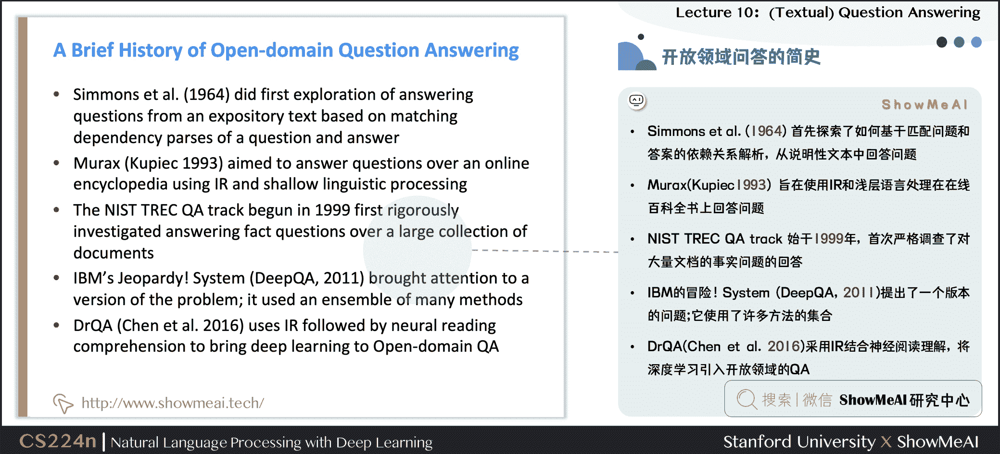

*   Simmons et al. (**1964**) 首先探索了如何基于匹配问题和答案的依赖关系解析，从说明性文本中回答问题
*   Murax (**Kupiec1993**) 旨在使用 IR 和浅层语言处理在在线百科全书上回答问题
*   NIST TREC QA track 始于 **1999** 年，首次严格调查了对大量文档的事实问题的回答
*   IBM 的冒险！System (DeepQA, **2011**)提出了一个版本的问题;它使用了许多方法的集合
*   DrQA (Chen et al. **2016**) 采用 IR 结合神经阅读理解，将深度学习引入开放领域的 QA

## 2.6 千年之交的完整 NLP 问答

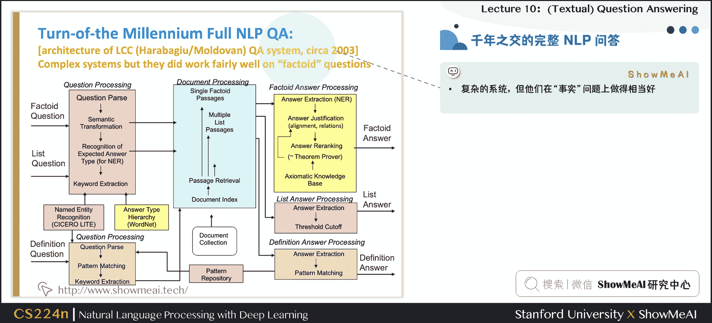

*   复杂的系统，但他们在 `事实` 问题上做得相当好

**补充讲解**

*   非常复杂的多模块多组件的系统
    *   首先对问题进行解析，使用手写的语义规范化规则，将其转化为更好的语义形式
    *   在通过问题类型分类器，找出问题在寻找的语义类型
    *   信息检索系统找到可能包含答案的段落，排序后进行选择
    *   NER 识别候选实体再进行判断
*   这样的 QA 系统在特定领域很有效：Factoid Question Answering 针对实体的问答

# 3.SQuAD 问答数据集

## 3.1 斯坦福问答数据集 (SQuAD)

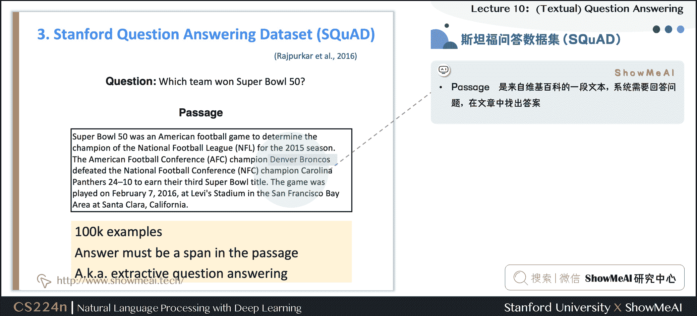

*   Passage 是来自维基百科的一段文本，系统需要回答问题，在文章中找出答案

*   1000 k 1000k 1000k 个样本
*   答案必须是文章中的一系列单词序列
*   也就是提取式问答

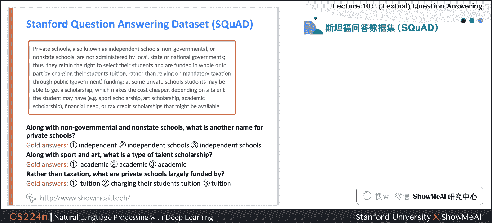

## 3.2 SQuAD 评估，v1.1

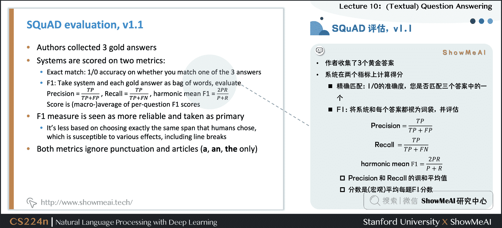

*   作者收集了 3 个参考答案
*   系统在两个指标上计算得分
    *   **精确匹配**：1/0 的准确度，你是否匹配三个答案中的一个
    *   F1：将系统和每个答案都视为词袋，并评估

Precision = T P T P + F P \text{Precision} =\frac{TP}{TP+FP} Precision=TP+FPTP​

Recall  = T P T P + F N \text { Recall }=\frac{TP}{TP+FN}  Recall =TP+FNTP​

harmonic mean  F 1 = 2 P R P + R \text { harmonic mean } \mathrm{F} 1=\frac{2 PR}{P+R}  harmonic mean F1=P+R2PR​

*   Precision 和 Recall 的调和平均值
*   分数是 (宏观) 平均每题 F1 分数

*   F1 测量被视为更可靠的指标，作为主要指标使用
    *   它不是基于选择是否和人类选择的跨度完全相同，人类选择的跨度容易受到各种影响，包括换行
    *   在单次级别匹配不同的答案
*   这两个指标忽视标点符号和冠词 (a, an, the only)

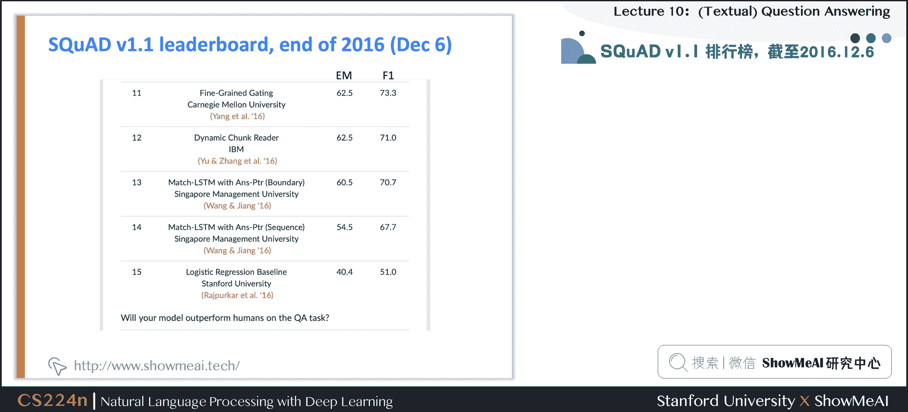

## 3.3 SQuAD 2.0

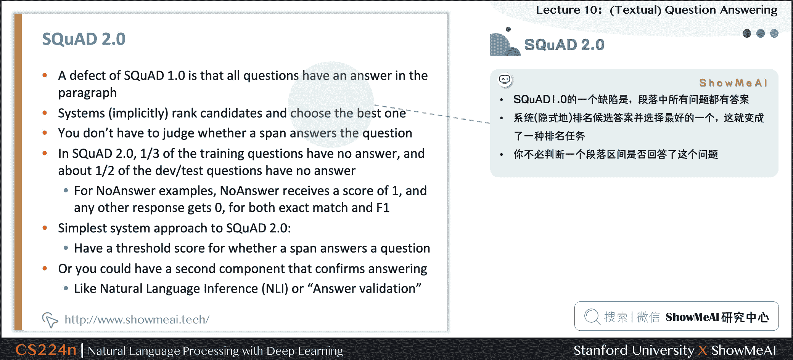

*   SQuAD1.0 的一个缺陷是，段落中所有问题都有答案
*   系统 (隐式地) 排名候选答案并选择最好的一个，这就变成了一种排名任务
*   你不必判断一个段落区间是否回答了这个问题

*   SQuAD2.0 中 1 / 3 1/3 1/3 的训练问题没有回答，大约 1 / 2 1/2 1/2 的开发/测试问题没有回答

    *   对于 No Answer examples，no answer 获得的得分为 1 1 1，对于精确匹配和 F1，任何其他响应的得分都为 0 0 0 
*   SQuAD2.0 最简单的系统方法
    *   对于一个 span 是否回答了一个问题有一个阈值评分
*   或者你可以有第二个确认回答的组件
    *   类似 自然语言推理 或者 答案验证

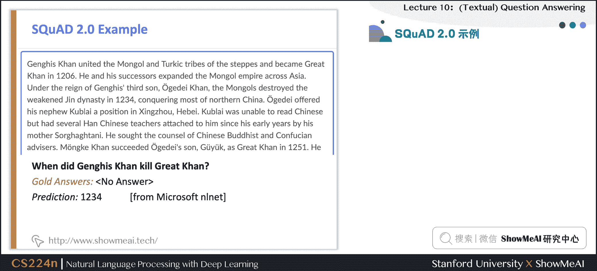

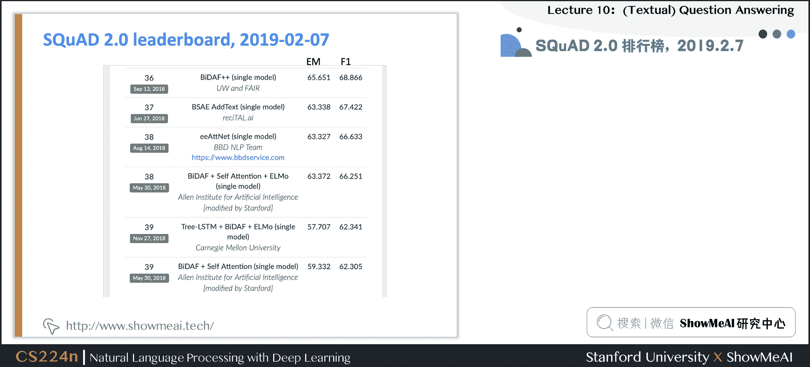

## 3.4 得分高的系统并不能真正理解人类语言

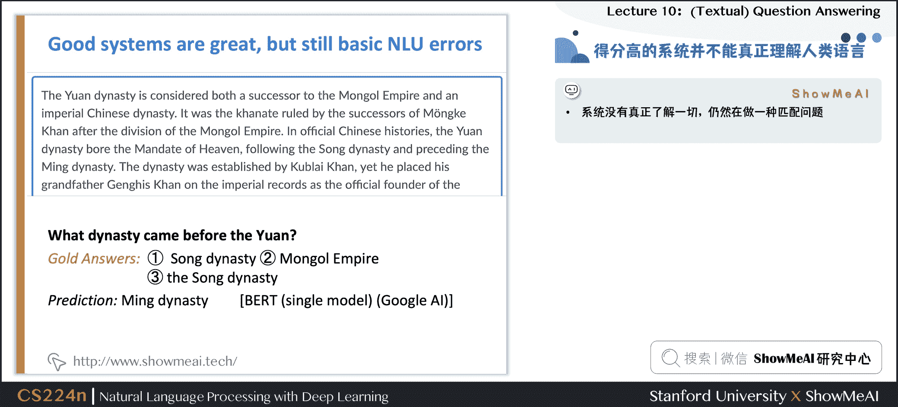

*   系统没有真正了解一切，仍然在做一种匹配问题

## 3.5 SQuAD 局限

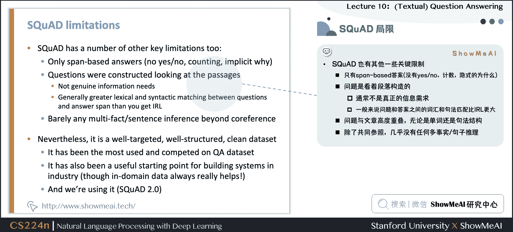

*   SQuAD 也有其他一些关键限制
    *   只有 span-based 答案 (没有 yes / no，计数，隐式的为什么)
    *   问题是看着段落构造的
        *   通常不是真正的信息需求
        *   一般来说，问题和答案之间的词汇和句法匹配比 IRL 更大
    *   问题与文章高度重叠，无论是单词还是句法结构
    *   除了共同参照，几乎没有任何多事实/句子推理

*   不过这是一个目标明确，结构良好的干净的数据集
    *   它一直是 QA dataset 上最常用和最具竞争力的数据集
    *   它也是构建行业系统的一个有用的起点 (尽管域内数据总是很有帮助！)
    *   并且我们正在使用它

## 3.6 Stanford Attentive Reader

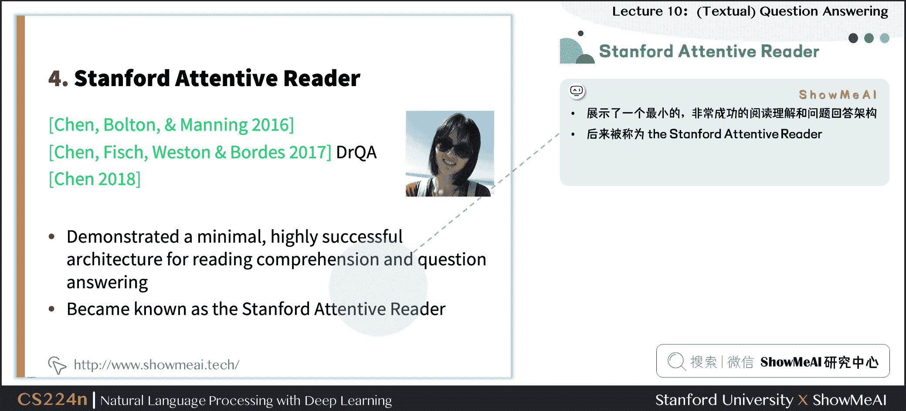

*   展示了一个最小的，非常成功的阅读理解和问题回答架构
*   后来被称为 the Stanford Attentive Reader

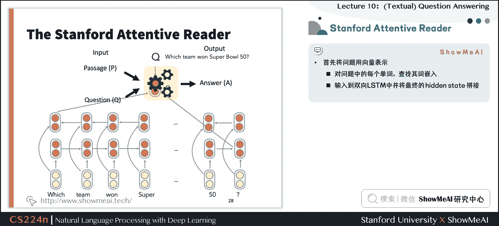

*   首先将问题用向量表示
    *   对问题中的每个单词，查找其词嵌入
    *   输入到双向 LSTM 中并将最终的 hidden state 拼接

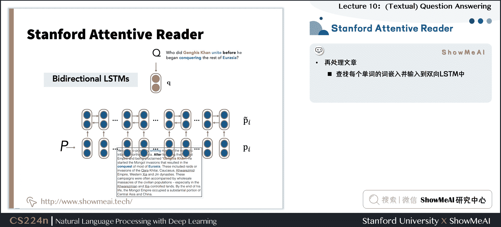

*   再处理文章
    *   查找每个单词的词嵌入并输入到双向 LSTM 中

*   使用双线性注意力，将每个 LSTM 的表示 (LSTM 的两个隐藏状态的连接) 与问题表示做运算，获得了不同位置的注意力，从而获得答案的开始位置，再以同样方式获得答案的结束位置
*   为了在文章中找到答案，使用问题的向量表示，来解决答案在什么位置使用注意力

## 3.7 SQuAD v1.1 结果

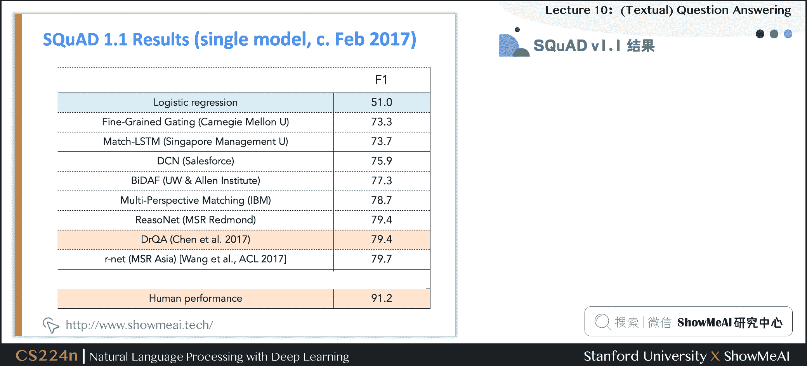

# 4.斯坦福注意力阅读模型

## 4.1 Stanford Attentive Reader++

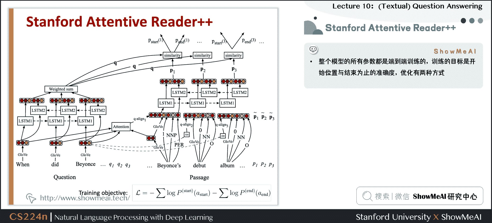

*   整个模型的所有参数都是端到端训练的，训练的目标是开始位置与结束为止的准确度，优化有两种方式

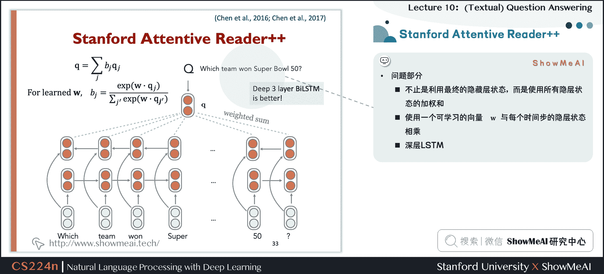

*   **问题部分**
    *   不止是利用最终的隐藏层状态，而是使用所有隐层状态的加权和
    *   使用一个可学习的向量 w w w 与每个时间步的隐层状态相乘
    *   深层 LSTM

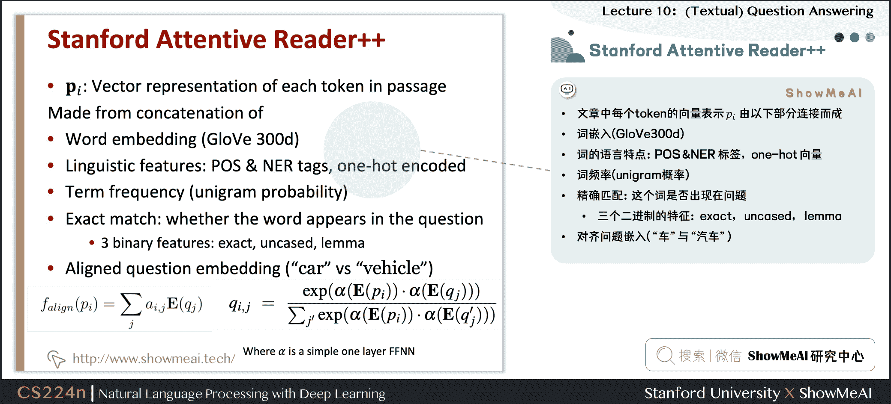

*   文章中每个 token 的向量表示 p i p_i pi​ 由一下部分连接而成
*   **词嵌入** (GloVe 300 维)
*   词的语言特点：POS &NER 标签，one-hot 向量
*   词频率 (unigram 概率)
*   精确匹配：这个词是否出现在问题
    *   三个二进制的特征： exact, uncased, lemma
*   对齐问题嵌入 ( `车` 与 `汽车` )

f align ( p i ) = ∑ j a i , j E ( q j ) q i , j = exp ⁡ ( α ( E ( p i ) ) ⋅ α ( E ( q j ) ) ) ∑ j ′ exp ⁡ ( α ( E ( p i ) ) ⋅ α ( E ( q j ′ ) ) ) f_{\text {align}}\left(p_{i}\right)=\sum_{j} a_{i, j} \mathbf{E}\left(q_{j}\right) \quad q_{i, j}=\frac{\exp \left(\alpha\left(\mathbf{E}\left(p_{i}\right)\right) \cdot \alpha\left(\mathbf{E}\left(q_{j}\right)\right)\right)}{\sum_{j^{\prime}} \exp \left(\alpha\left(\mathbf{E}\left(p_{i}\right)\right) \cdot \alpha\left(\mathbf{E}\left(q_{j}^{\prime}\right)\right)\right)} falign​(pi​)=j∑​ai,j​E(qj​)qi,j​=∑j′​exp(α(E(pi​))⋅α(E(qj′​)))exp(α(E(pi​))⋅α(E(qj​)))​

## 4.2 神经模型的突出效果

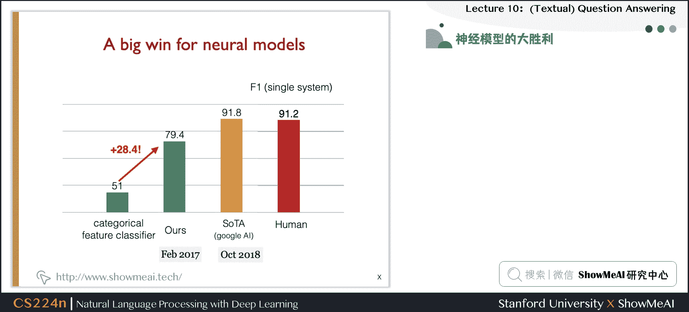

## 4.3 这些神经模型做什么？

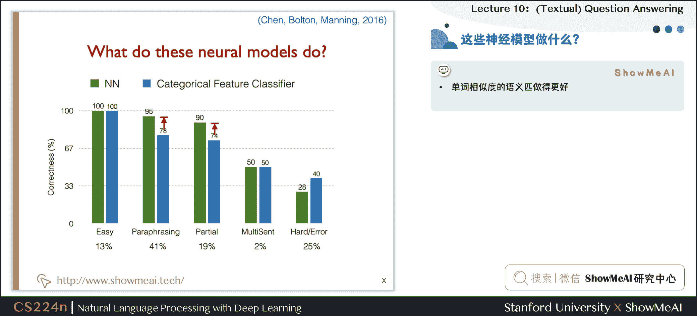

# 5.BiDAF 模型

## 5.1 #论文解读# BiDAF

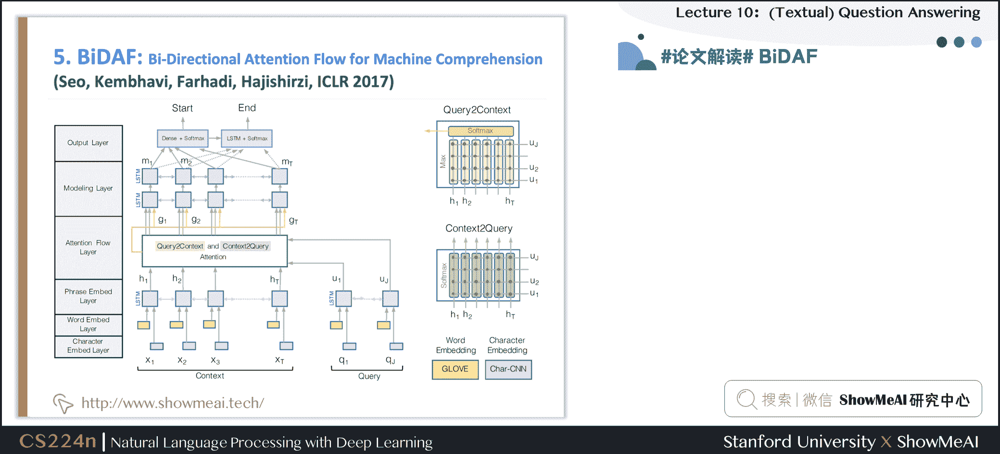

## 5.2 BiDAF

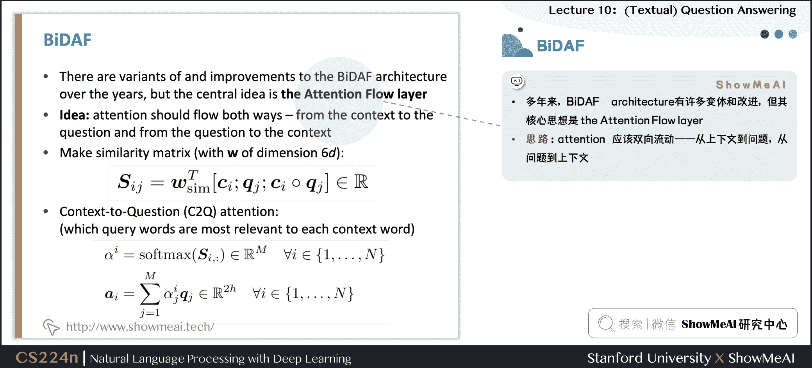

*   多年来，BiDAF architecture 有许多变体和改进，但其核心思想是 t**he Attention Flow layer**
*   **思路**：attention 应该双向流动——从上下文到问题，从问题到上下文

*   令相似矩阵 ( w w w 的维数为 6 d 6d 6d)

S i j = w s i m T [ c i ; q i ; c i ∘ q j ] ∈ R \boldsymbol{S}_{i j}=\boldsymbol{w}_{\mathrm{sim}}^{T}\left[\boldsymbol{c}_{i} ; \boldsymbol{q}_{i} ; \boldsymbol{c}_{i} \circ \boldsymbol{q}_{j}\right] \in \mathbb{R} Sij​=wsimT​[ci​;qi​;ci​∘qj​]∈R

*   Context-to-Question (C2Q) 注意力 (哪些查询词与每个上下文词最相关)

α i = softmax ⁡ ( S i , : ) ∈ R M ∀ i ∈ { 1 , … , N } a i = ∑ j = 1 M α j i q j ∈ R 2 h ∀ i ∈ { 1 , … , N } \begin{aligned} \alpha^{i} &=\operatorname{softmax}\left(\boldsymbol{S}_{i, :}\right) \in \mathbb{R}^{M} \quad \forall i \in\{1, \ldots, N\} \\ \boldsymbol{a}_{i} &=\sum_{j=1}^{M} \alpha_{j}^{i} \boldsymbol{q}_{j} \in \mathbb{R}^{2 h} \quad \forall i \in\{1, \ldots, N\} \end{aligned} αiai​​=softmax(Si,:​)∈RM∀i∈{1,…,N}=j=1∑M​αji​qj​∈R2h∀i∈{1,…,N}​

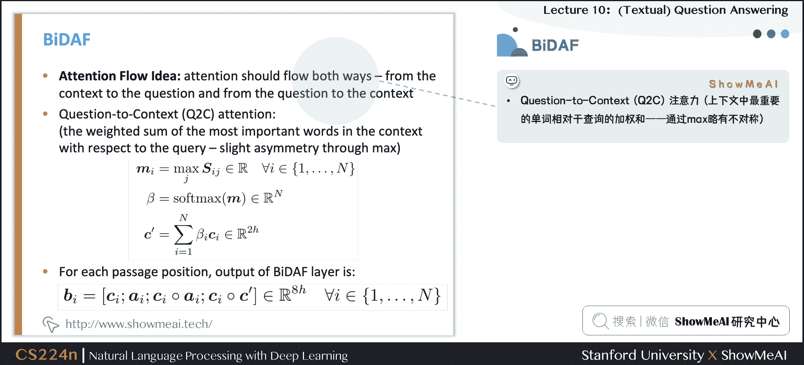

*   Question-to-Context (Q2C) 注意力 (上下文中最重要的单词相对于查询的加权和——通过 max 略有不对称)

*   通过 max 取得上下文中的每个单词对于问题的相关度

m i = max ⁡ j S i j ∈ R ∀ i ∈ { 1 , … , N } β = softmax ⁡ ( m ) ∈ R N c ′ = ∑ i = 1 N β i c i ∈ R 2 h \begin{aligned} \boldsymbol{m}_{i} &=\max _{j} \boldsymbol{S}_{i j} \in \mathbb{R} \quad \forall i \in\{1, \ldots, N\} \\ \beta &=\operatorname{softmax}(\boldsymbol{m}) \in \mathbb{R}^{N} \\ \boldsymbol{c}^{\prime} &=\sum_{i=1}^{N} \beta_{i} \boldsymbol{c}_{i} \in \mathbb{R}^{2 h} \end{aligned} mi​βc′​=jmax​Sij​∈R∀i∈{1,…,N}=softmax(m)∈RN=i=1∑N​βi​ci​∈R2h​

*   对于文章中的每个位置，BiDAF layer 的输出为

b i = [ c i ; a i ; c i ∘ a i ; c i ∘ c ′ ] ∈ R 8 h ∀ i ∈ { 1 , … , N } \boldsymbol{b}_{i}=\left[\boldsymbol{c}_{i} ; \boldsymbol{a}_{i} ; \boldsymbol{c}_{i} \circ \boldsymbol{a}_{i} ; \boldsymbol{c}_{i} \circ \boldsymbol{c}^{\prime}\right] \in \mathbb{R}^{8 h} \quad \forall i \in\{1, \ldots, N\} bi​=[ci​;ai​;ci​∘ai​;ci​∘c′]∈R8h∀i∈{1,…,N}

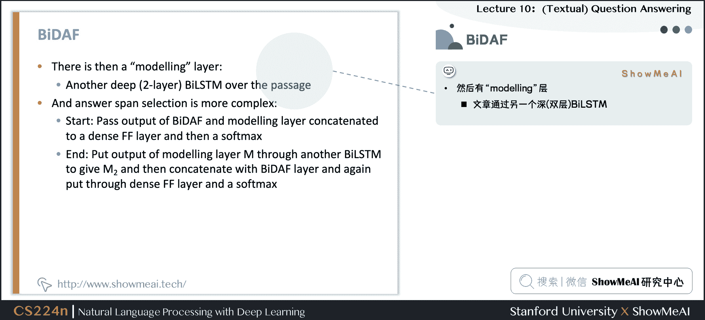

*   然后有 `modelling` 层
    *   文章通过另一个深 (双层) BiLSTM

*   然后回答跨度选择更为复杂
    *   Start：通过 BiDAF 和 modelling 的输出层连接到一个密集的全连接层然后 softmax
    *   End：把 modelling 的输出 M M M 通过另一个 BiLSTM 得到 M 2 M_2 M2​，然后再与 BiDAF layer 连接，并通过密集的全连接层和 softmax

# 6.近期前沿模型

## 6.1 最新的、更高级的体系结构

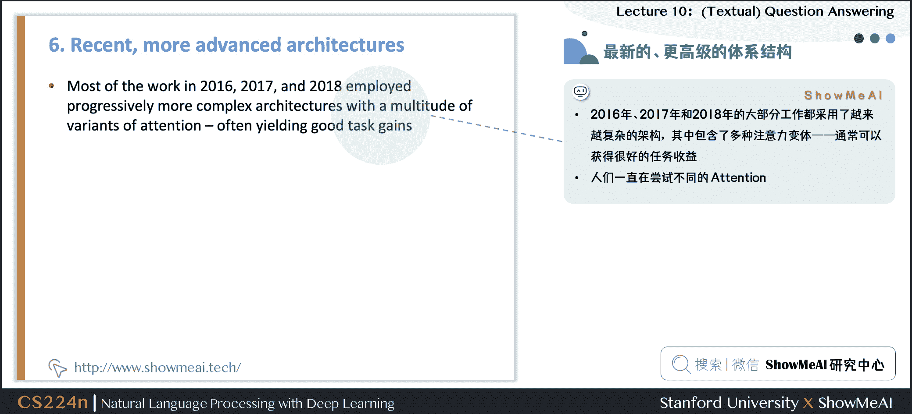

*   2016 年、2017 年和 2018 年的大部分工作都采用了越来越复杂的架构，其中包含了多种注意力变体——通常可以获得很好的任务收益
*   人们一直在尝试不同的 Attention

## 6.2 #论文解读# Dynamic CoattentionNetworks for Question Answering

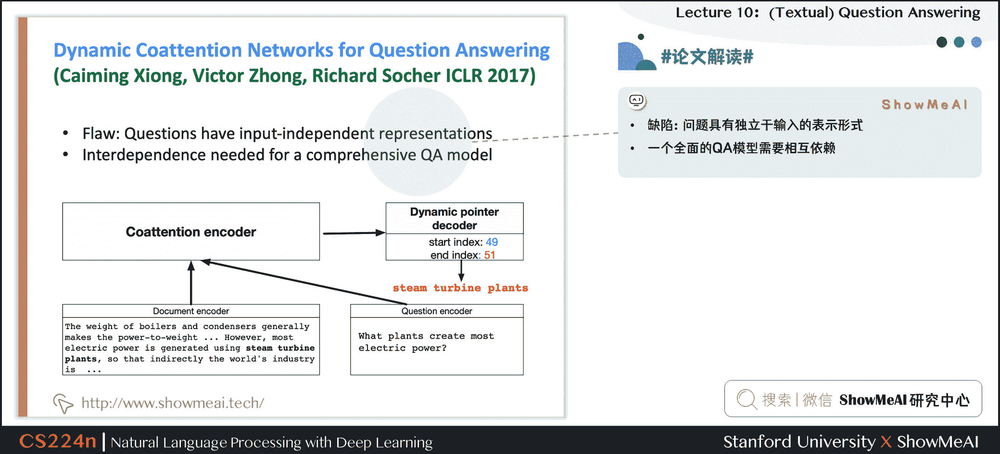

（本网络频繁使用到 LSTM/GRU 结构，具体的 RNN 细节讲解可以查看[ShowMeAI](http://www.showmeai.tech/)的对吴恩达老师课程的总结文章[深度学习教程 | **序列模型与 RNN 网络**](http://www.showmeai.tech/article-detail/225)，也可以查看本系列的前序文章[NLP 教程(5) - **语言模型、RNN、GRU 与 LSTM**](http://showmeai.tech/article-detail/239)）

*   缺陷：问题具有独立于输入的表示形式
*   一个全面的 QA 模型需要相互依赖

## 6.3 Coattention Encoder

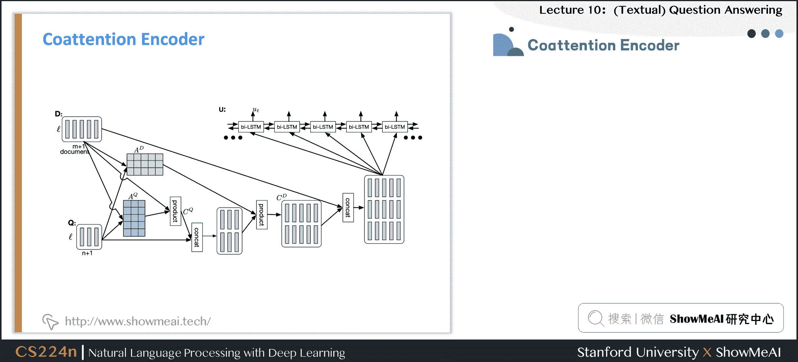

## 6.4 Coattention layer

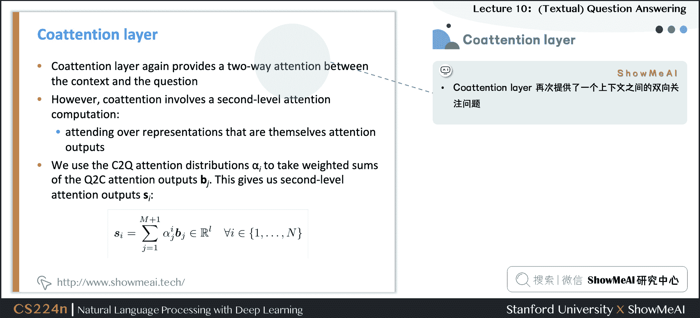

*   Coattention layer 再次提供了一个上下文之间的双向关注问题

*   然而，coattention 包括两级注意力计算：
    *   关注那些本身就是注意力输出的表象
*   我们使用 C2Q 注意力分布 α i \alpha _i αi​，求得 Q2C 注意力输出 b j \boldsymbol{b}_j bj​ 的加权和。这给了我们第二级注意力输出 s i \boldsymbol{s}_{i} si​

s i = ∑ j = 1 M + 1 α j i b j ∈ R l ∀ i ∈ { 1 , … , N } \boldsymbol{s}_{i}=\sum_{j=1}^{M+1} \alpha_{j}^{i} \boldsymbol{b}_{j} \in \mathbb{R}^{l} \quad \forall i \in\{1, \ldots, N\} si​=j=1∑M+1​αji​bj​∈Rl∀i∈{1,…,N}

## 6.5 Co-attention ： SQUAD 比赛结果

> https://rajpurkar.github.io/SQuAD-explorer/

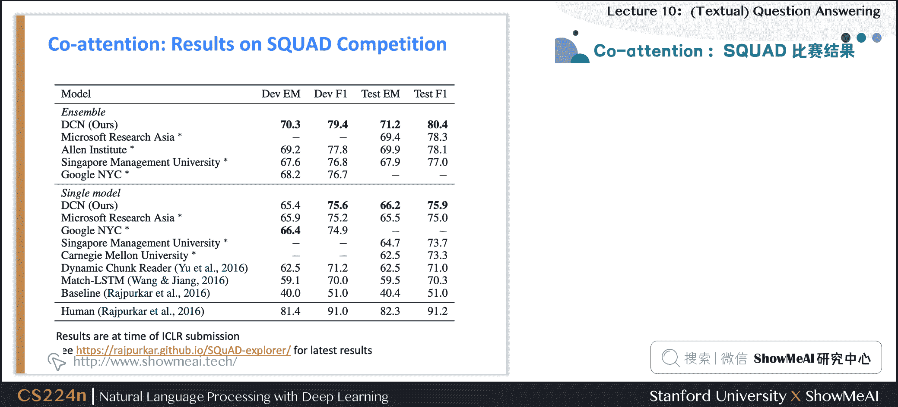

## 6.6 #论文解读# FusionNet

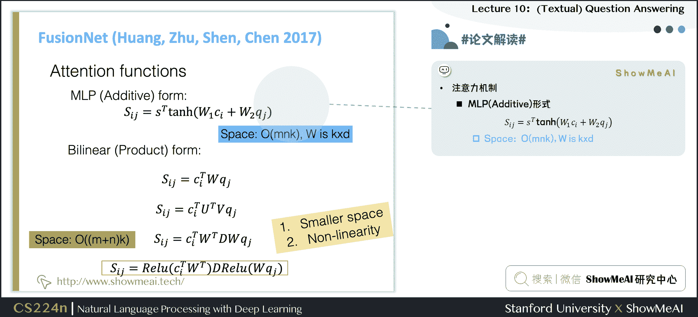

注意力机制

*   MLP (Additive) 形式

S i j = s T tanh ⁡ ( W 1 c i + W 2 q j ) S_{i j}=s^{T} \tanh \left(W_{1} c_{i}+W_{2} q_{j}\right) Sij​=sTtanh(W1​ci​+W2​qj​)

*   **空间复杂度**： O ( m n k ) O(mnk) O(mnk), W is kxd

*   Bilinear (Product) form

S i j = c i T W q j S_{i j}=c_{i}^{T} W q_{j} Sij​=ciT​Wqj​

S i j = c i T U T V q j S_{i j}=c_{i}^{T} U^{T} V q_{j} Sij​=ciT​UTVqj​

S i j = c i T W T D W q j S_{i j}=c_{i}^{T} W^{T} D W q_{j} Sij​=ciT​WTDWqj​

S i j = Relu ⁡ ( c i T W T ) DRelu ⁡ ( W q j ) S_{i j}=\operatorname{Relu}\left(c_{i}^{T} W^{T}\right) \operatorname{DRelu}\left(W q_{j}\right) Sij​=Relu(ciT​WT)DRelu(Wqj​)

*   **空间复杂度**： O ( ( m + n ) k ) O((m+n)k) O((m+n)k)
*   更小的空间消耗
*   非线性表达能力

## 6.7 FusionNet 试图将多种形式的注意力结合起来

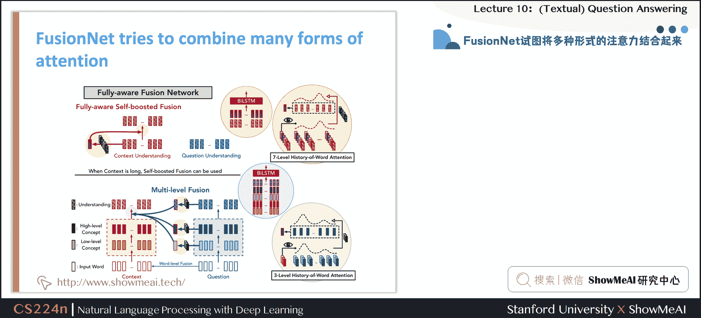

## 6.8 多层次的 inter-attention

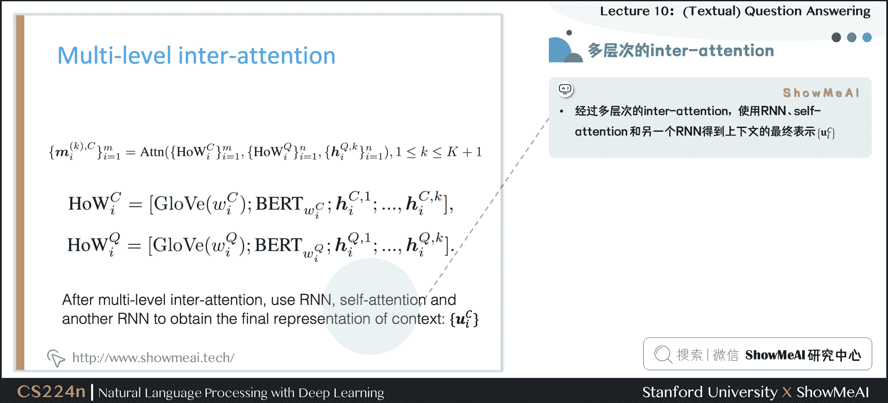

*   经过多层次的 inter-attention，使用 RNN、self-attention 和另一个 RNN 得到上下文的最终表示 { u i C } \left\{\boldsymbol{u}_{i}^{C}\right\} {uiC​}

## 6.9 最近、更先进的结构

*   2016 年、2017 年和 2018 年的大部分工作都采用了越来越复杂的体系结构，这些体系结构具有多种不同的关注方式，通常可以获得很好的任务收益

# 7.ELMo 与 BERT 预习与简单介绍

## 7.1 ELMO and BERT 预习

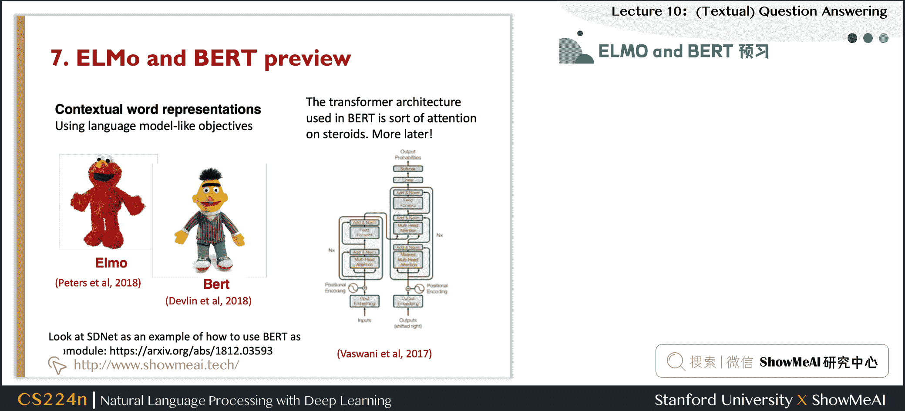

## 7.2 SQUAD 2.0 排行榜，2019-02-07

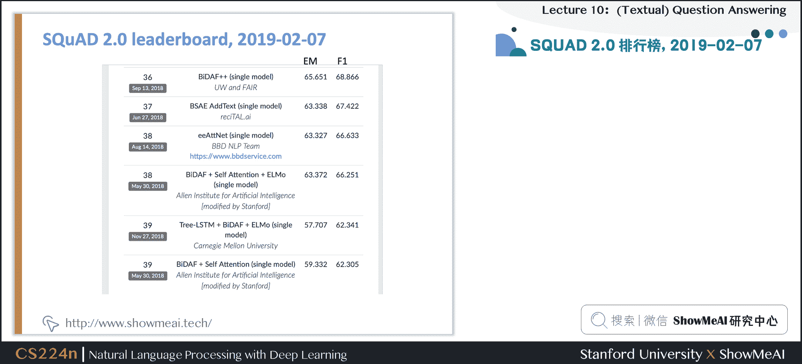

## 7.3 #论文解读#

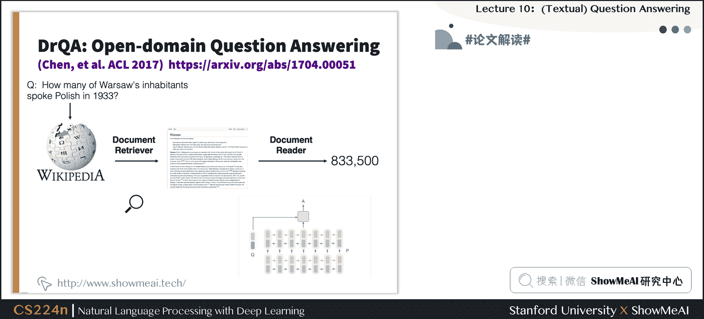

## 7.4 #论文解读# Documen Retriever

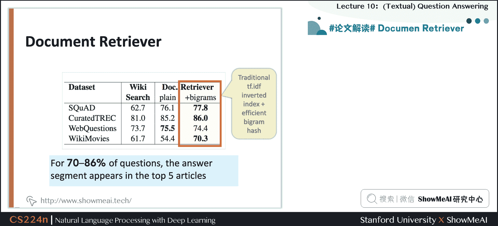

## 7.5 #论文解读# DrQA Demo

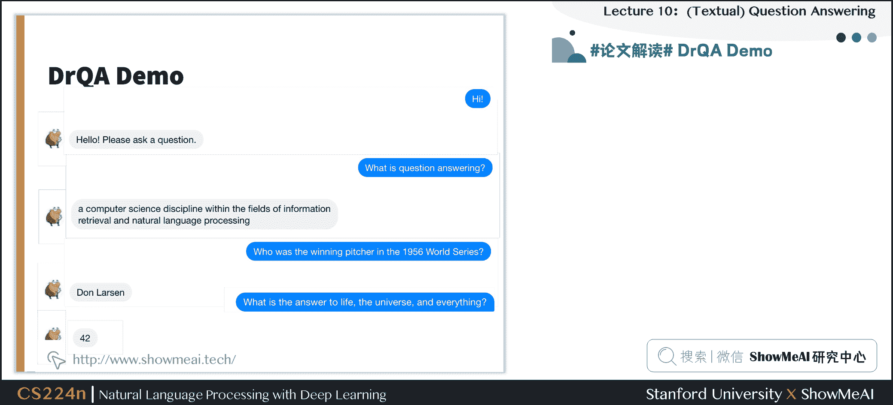

## 7.6 #论文解读# 一般性问题

# 8.视频教程

可以点击 [**B 站**](https://www.bilibili.com/video/BV1Yo4y1D7FW?p=10) 查看视频的【双语字幕】版本

[`player.bilibili.com/player.html?aid=376755412&page=10`](https://player.bilibili.com/player.html?aid=376755412&page=10)

【双语字幕+资料下载】斯坦福 CS224n | 深度学习与自然语言处理(2019·全 20 讲)

# 9.参考资料

*   [本讲带学的**在线阅翻页本**](https://blog.showmeai.tech/cs224n/lecture10-Question-Answering#/)
*   [《斯坦福 CS224n 深度学习与自然语言处理》**课程学习指南**](https://blog.showmeai.tech/cs224n/)
*   [《斯坦福 CS224n 深度学习与自然语言处理》**课程大作业解析**](https://github.com/ShowMeAI-Hub/awesome-AI-courses-notes-cheatsheets/tree/main/CS224n-Natural-Language-Processing-with-Deep-Learning/assignment-solutions)
*   [【**双语字幕视频**】斯坦福 CS224n | 深度学习与自然语言处理(2019·全 20 讲)](https://www.bilibili.com/video/BV1Yo4y1D7FW)
*   [**Stanford 官网** | CS224n: Natural Language Processing with Deep Learning](https://web.stanford.edu/class/archive/cs/cs224n/cs224n.1194/)

# [**ShowMeAI**](http://www.showmeai.tech)系列教程推荐

*   [大厂技术实现 | 推荐与广告计算解决方案](http://www.showmeai.tech/tutorials/50)
*   [大厂技术实现 | 计算机视觉解决方案](http://www.showmeai.tech/tutorials/51)
*   [大厂技术实现 | 自然语言处理行业解决方案](http://www.showmeai.tech/tutorials/52)
*   [图解 Python 编程：从入门到精通系列教程](http://www.showmeai.tech/tutorials/56)
*   [图解数据分析：从入门到精通系列教程](http://www.showmeai.tech/tutorials/33)
*   [图解 AI 数学基础：从入门到精通系列教程](http://www.showmeai.tech/tutorials/83)
*   [图解大数据技术：从入门到精通系列教程](http://www.showmeai.tech/tutorials/84)
*   [图解机器学习算法：从入门到精通系列教程](http://www.showmeai.tech/tutorials/34)
*   [机器学习实战：手把手教你玩转机器学习系列](http://www.showmeai.tech/tutorials/41)
*   [深度学习教程 | 吴恩达专项课程 · 全套笔记解读](http://www.showmeai.tech/tutorials/35)
*   [自然语言处理教程 | 斯坦福 CS224n 课程 · 课程带学与全套笔记解读](http://www.showmeai.tech/tutorials/36)

# NLP 系列教程文章

*   [NLP 教程(1)- 词向量、SVD 分解与 Word2vec](http://showmeai.tech/article-detail/230)
*   [NLP 教程(2)- GloVe 及词向量的训练与评估](http://showmeai.tech/article-detail/232)
*   [NLP 教程(3)- 神经网络与反向传播](http://showmeai.tech/article-detail/234)
*   [NLP 教程(4)- 句法分析与依存解析](http://www.showmeai.tech/article-detail/237)
*   [NLP 教程(5)- 语言模型、RNN、GRU 与 LSTM](http://www.showmeai.tech/article-detail/239)
*   [NLP 教程(6)- 神经机器翻译、seq2seq 与注意力机制](http://www.showmeai.tech/article-detail/242)
*   [NLP 教程(7)- 问答系统](http://www.showmeai.tech/article-detail/245)
*   [NLP 教程(8)- NLP 中的卷积神经网络](http://www.showmeai.tech/article-detail/247)
*   [NLP 教程(9)- 句法分析与树形递归神经网络](http://www.showmeai.tech/article-detail/255)

# 斯坦福 CS224n 课程带学详解

*   [斯坦福 NLP 课程 | 第 1 讲 - NLP 介绍与词向量初步](http://showmeai.tech/article-detail/231)
*   [斯坦福 NLP 课程 | 第 2 讲 - 词向量进阶](http://showmeai.tech/article-detail/233)
*   [斯坦福 NLP 课程 | 第 3 讲 - 神经网络知识回顾](http://showmeai.tech/article-detail/235)
*   [斯坦福 NLP 课程 | 第 4 讲 - 神经网络反向传播与计算图](http://showmeai.tech/article-detail/236)
*   [斯坦福 NLP 课程 | 第 5 讲 - 句法分析与依存解析](http://www.showmeai.tech/article-detail/238)
*   [斯坦福 NLP 课程 | 第 6 讲 - 循环神经网络与语言模型](http://www.showmeai.tech/article-detail/240)
*   [斯坦福 NLP 课程 | 第 7 讲 - 梯度消失问题与 RNN 变种](http://www.showmeai.tech/article-detail/241)
*   [斯坦福 NLP 课程 | 第 8 讲 - 机器翻译、seq2seq 与注意力机制](http://www.showmeai.tech/article-detail/243)
*   [斯坦福 NLP 课程 | 第 9 讲 - cs224n 课程大项目实用技巧与经验](http://www.showmeai.tech/article-detail/244)
*   [斯坦福 NLP 课程 | 第 10 讲 - NLP 中的问答系统](http://www.showmeai.tech/article-detail/246)
*   [斯坦福 NLP 课程 | 第 11 讲 - NLP 中的卷积神经网络](http://www.showmeai.tech/article-detail/248)
*   [斯坦福 NLP 课程 | 第 12 讲 - 子词模型](http://www.showmeai.tech/article-detail/249)
*   [斯坦福 NLP 课程 | 第 13 讲 - 基于上下文的表征与 NLP 预训练模型](http://www.showmeai.tech/article-detail/250)
*   [斯坦福 NLP 课程 | 第 14 讲 - Transformers 自注意力与生成模型](http://www.showmeai.tech/article-detail/251)
*   [斯坦福 NLP 课程 | 第 15 讲 - NLP 文本生成任务](http://www.showmeai.tech/article-detail/252)
*   [斯坦福 NLP 课程 | 第 16 讲 - 指代消解问题与神经网络方法](http://www.showmeai.tech/article-detail/253)
*   [斯坦福 NLP 课程 | 第 17 讲 - 多任务学习(以问答系统为例)](http://www.showmeai.tech/article-detail/254)
*   [斯坦福 NLP 课程 | 第 18 讲 - 句法分析与树形递归神经网络](http://www.showmeai.tech/article-detail/256)
*   [斯坦福 NLP 课程 | 第 19 讲 - AI 安全偏见与公平](http://www.showmeai.tech/article-detail/257)
*   [斯坦福 NLP 课程 | 第 20 讲 - NLP 与深度学习的未来](http://www.showmeai.tech/article-detail/258)
    