# 斯坦福 NLP 课程 | 第 11 讲 - NLP 中的卷积神经网络

> 原文：[`blog.csdn.net/ShowMeAI/article/details/124621556`](https://blog.csdn.net/ShowMeAI/article/details/124621556)


作者：[韩信子](https://github.com/HanXinzi-AI)@[ShowMeAI](http://www.showmeai.tech/)，路遥@[ShowMeAI](http://www.showmeai.tech/)，奇异果@[ShowMeAI](http://www.showmeai.tech/)
[教程地址](http://www.showmeai.tech/tutorials/36)：[`www.showmeai.tech/tutorials/36`](http://www.showmeai.tech/tutorials/36)
[本文地址](http://www.showmeai.tech/article-detail/248)：[`www.showmeai.tech/article-detail/248`](http://www.showmeai.tech/article-detail/248)
声明：版权所有，转载请联系平台与作者并注明出处

收藏[ShowMeAI](http://www.showmeai.tech/)查看更多精彩内容

* * *


[ShowMeAI](http://www.showmeai.tech/)为**斯坦福 CS224n**《自然语言处理与深度学习(Natural Language Processing with Deep Learning)》课程的全部课件，做了**中文翻译和注释**，并制作成了 GIF 动图！


本讲内容的**深度总结教程**可以在[**这里**](http://www.showmeai.tech/article-detail/247) 查看。视频和课件等资料的获取方式见**文末**。

* * *

# 引言

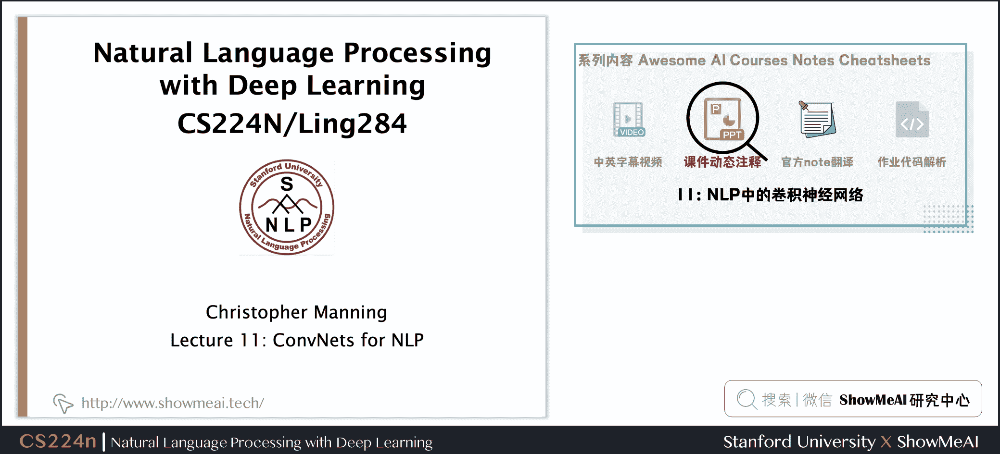

## 授课计划

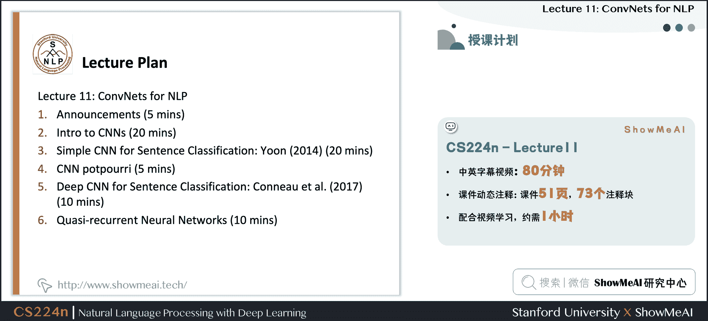

*   Announcements
*   Intro to CNNs / **卷积神经网络介绍**
*   Simple CNN for Sentence Classification: Yoon (2014) / **应用 CNN 做文本分类**
*   CNN potpourri / **CNN 细节**
*   Deep CNN for Sentence Classification: Conneauet al. (2017) / **深度 CNN 用于文本分类**
*   Quasi-recurrent Neural Networks / **Q-RNN 模型**

## 欢迎来到课程的下半部分！

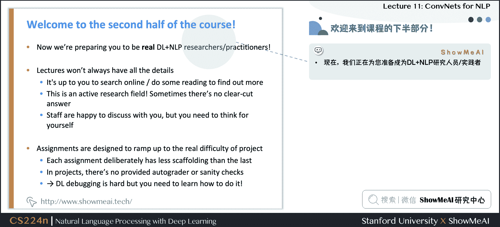

*   现在，我们正在为你准备成为 DL+NLP 研究人员/实践者

*   **课程不会总是有所有的细节**

    *   这取决于你在网上搜索/阅读来了解更多
    *   这是一个活跃的研究领域，有时候没有明确的答案
    *   Staff 很乐意与你讨论，但你需要自己思考
*   **作业的设计是为了应付项目的真正困难**

    *   每个任务都故意比上一个任务有更少的帮助材料
    *   在项目中，没有提供 autograder 或合理性检查
    *   DL 调试很困难，但是你需要学习如何进行调试！

## 书籍推荐

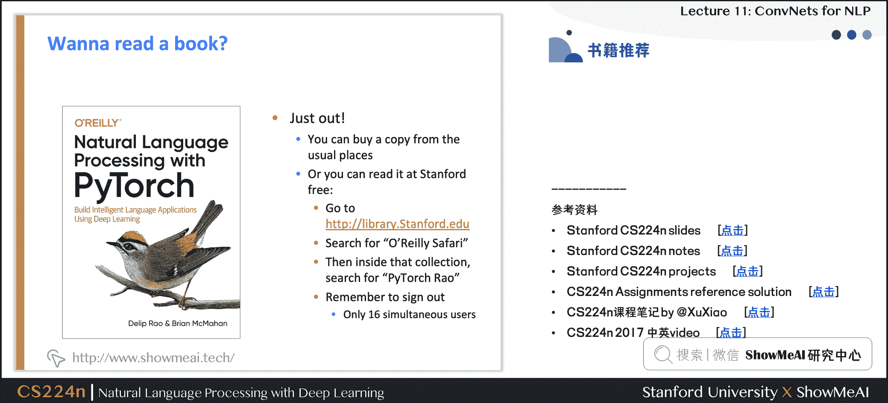

《*Natural Language Processing with PyTorch: Build Intelligent Language Applications Using Deep Learning*》

*   Delip Rao & Goku Mohandas

# 1.卷积神经网络介绍

(卷积神经网络相关内容也可以参考[ShowMeAI](http://www.showmeai.tech/)的对吴恩达老师课程的总结文章 [深度学习教程 | **卷积神经网络解读**](http://www.showmeai.tech/article-detail/221)

## 1.1 从 RNN 到 CNN

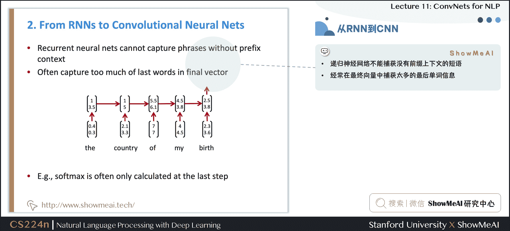

*   循环神经网络不能捕获没有前缀上下文的短语
*   经常在最终向量中捕获的信息太多来自于最后的一些词汇内容

*   例如：softmax 通常只在最后一步计算

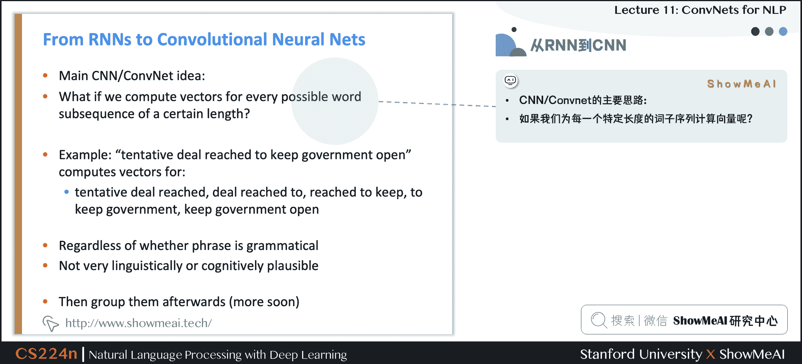

*   CNN / Convnet 的**主要思路**：
    *   如果我们为每一个特定长度的词子序列计算向量呢？

*   例如：`tentative deal reached to keep government open`
*   计算的向量为
    *   tentative deal reached, deal reached to, reached to keep, to keep government, keep government open

*   不管短语是否合乎语法
*   在语言学上或认知上不太可信
*   然后将它们分组 (很快)

## 1.2 CNN 卷积神经网络

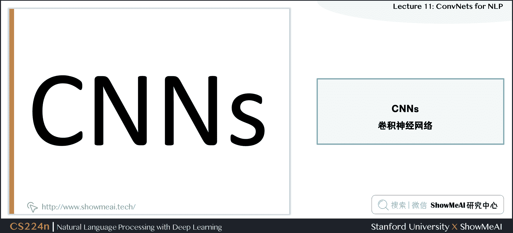

## 1.3 什么是卷积

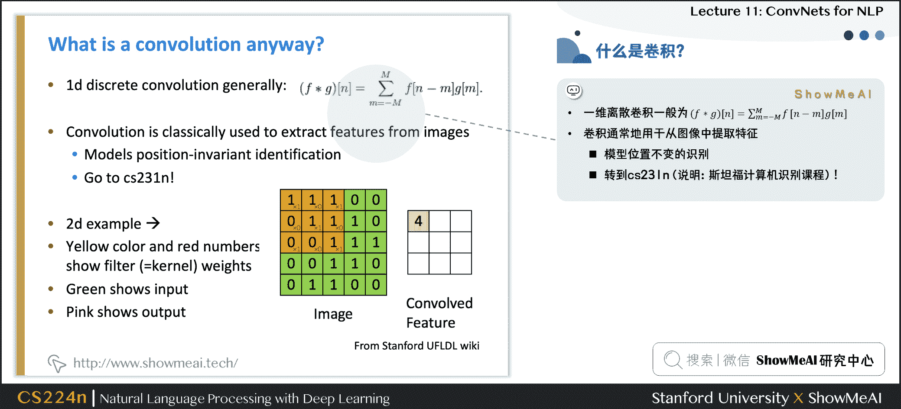

*   一维离散卷积一般为： ( f ∗ g ) [ n ] = ∑ m = − M M f [ n − m ] g [ m ] (f \ast g)[n]=\sum_{m=-M}^{M} f[n-m] g[m] (f∗g)[n]=∑m=−MM​f[n−m]g[m]
*   卷积通常地用于从图像中提取特征
    *   模型位置不变的识别
    *   可以参考斯坦福深度学习与计算机视觉课程 cs231n (也可以在[ShowMeAI](http://www.showmeai.tech/)查阅 cs231n 系列笔记学习)

*   二维示例：
    *   黄色和红色数字显示过滤器 (=内核) 权重
    *   绿色显示输入
    *   粉色显示输出

## 1.4 文本的一维卷积

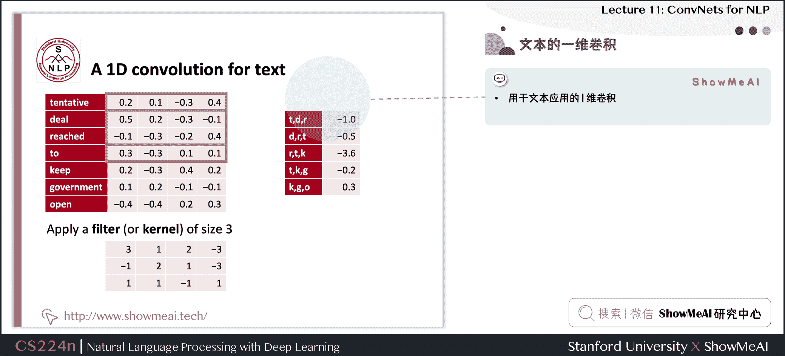

*   用于文本应用的 1 维卷积

## 1.5 带填充的文本的一维卷积

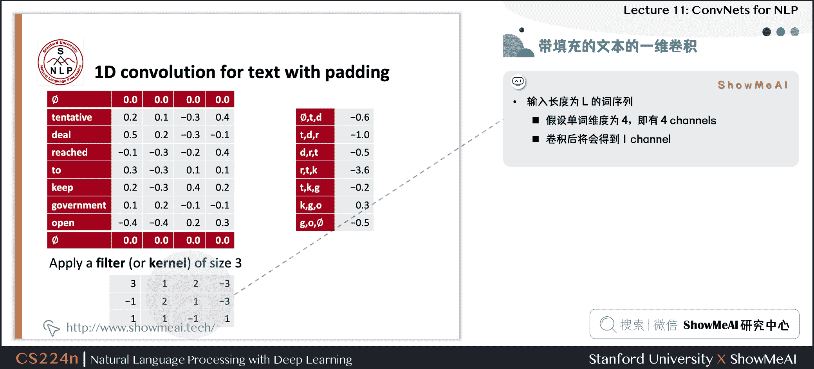

*   输入长度为 L L L 的词序列

    *   假设单词维度为 4，即有 4 channels
    *   卷积后将会得到 1 channel 

*   多个 channel，则最终得到多个 channel 的输出，关注的文本潜在特征也不同

## 1.6 conv1d，随时间推移填充最大池化

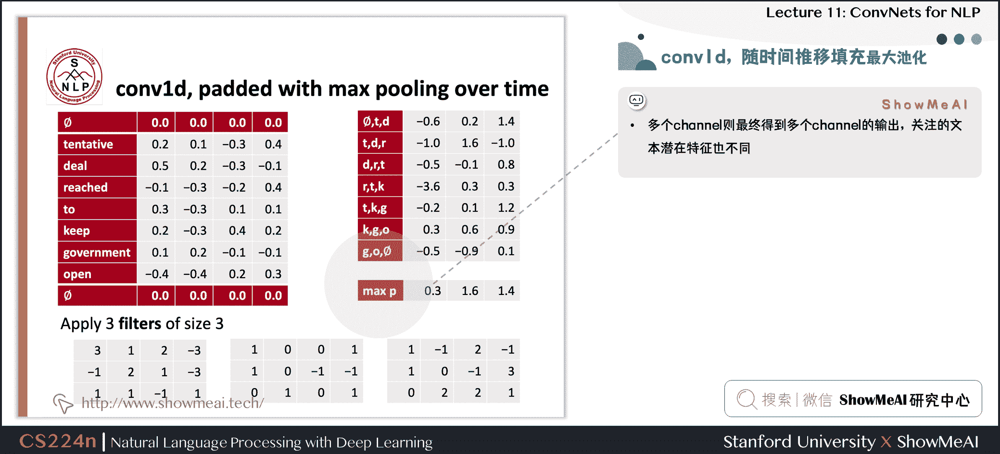

*   平均池化对 feature map 求平均

## 1.7 PyTorch 实现

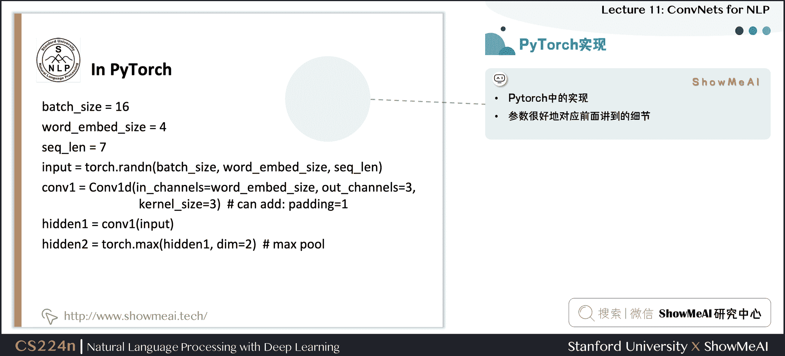

*   Pytorch 中的实现：参数很好地对应前面讲到的细节

```py
batch_size= 16
word_embed_size= 4
seq_len= 7
input = torch.randn(batch_size, word_embed_size, seq_len)
conv1 = Conv1d(in_channels=word_embed_size, out_channels=3, kernel_size=3) # can add: padding=1 
hidden1 = conv1(input)
hidden2 = torch.max(hidden1, dim=2) # max pool 
```

## 1.8 步长 (这里为 2)

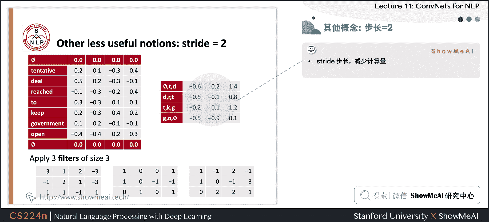

*   stride 步长，减少计算量

## 1.9 局部最大池化

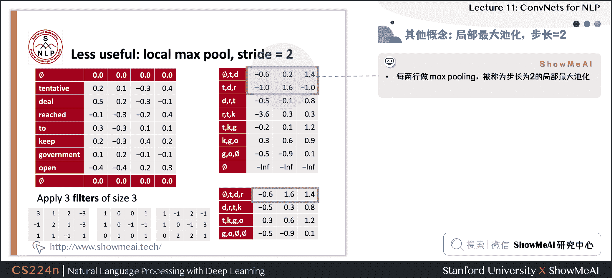

*   每两行做 max pooling，被称为步长为 2 的局部最大池化

## 1.10 1 维卷积的 k-max pooling

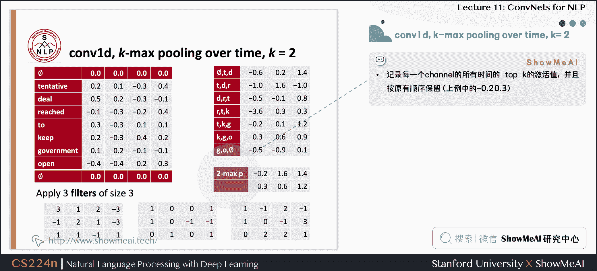

*   记录每一个 channel 的所有时间的 top k 的激活值，并且按原有顺序保留(上例中的-0.2 0.3)

## 1.11 空洞卷积：dilation 为 2

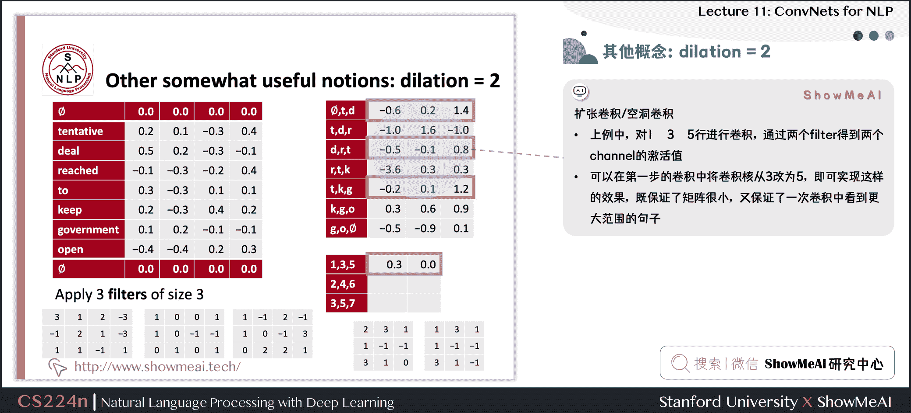

**扩张卷积 / 空洞卷积**

*   上例中，对 1 3 5 行进行卷积，通过两个 filter 得到两个 channel 的激活值
*   可以在第一步的卷积中将卷积核从 3 改为 5，即可实现这样的效果，既保证了矩阵很小，又保证了一次卷积中看到更大范围的句子

**补充讲解 / Summary**

*   CNN 中，一次能看一个句子的多少内容是很重要的概念
*   可以使用更大的 filter、扩张卷积或者增大卷积深度 (层数)

# 2.应用 CNN 做文本分类

## 2.1 用于句子分类的单层 CNN

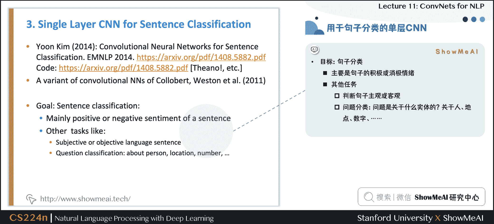

*   目标：**句子分类**
    *   主要是识别判断句子的**积极或消极情绪**
    *   其他任务
        *   判断句子**主观或客观**
        *   问题分类：问题是关于什么实体的？关于人、地点、数字、……

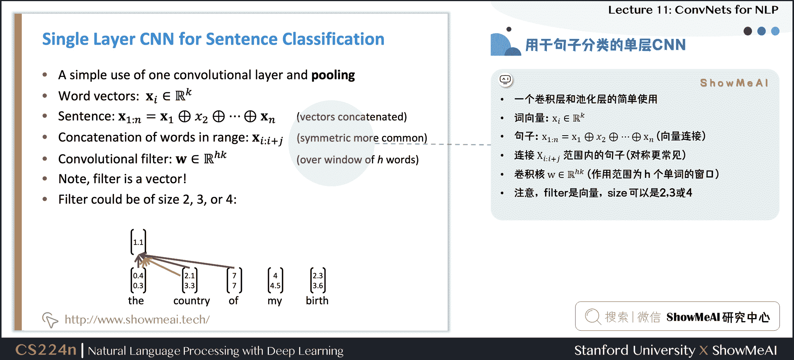

*   一个卷积层和**池化层**的简单使用
*   词向量： x i ∈ R k \mathbf{x}_{i} \in \mathbb{R}^{k} xi​∈Rk
*   句子： x 1 : n = x 1 ⊕ x 2 ⊕ ⋯ ⊕ x n \mathbf{x}_{1 : n}=\mathbf{x}_{1} \oplus x_{2} \oplus \cdots \oplus \mathbf{x}_{n} x1:n​=x1​⊕x2​⊕⋯⊕xn​ (向量连接)
*   连接 X i : i + j \mathbf{X}_{i : i+j} Xi:i+j​ 范围内的句子 (对称更常见)
*   卷积核 w ∈ R h k \mathbf{w} \in \mathbb{R}^{h k} w∈Rhk (作用范围为 h h h 个单词的窗口)
*   注意，filter 是向量，size 可以是 2、3 或 4

## 2.2 单层 CNN


*   过滤器 w w w 应用于所有可能的窗口(连接向量)
*   为 CNN 层计算特征(一个通道)

c i = f ( w T x i : i + h − 1 + b ) c_{i}=f\left(\mathbf{w}^{T} \mathbf{x}_{i : i+h-1}+b\right) ci​=f(wTxi:i+h−1​+b)

*   句子 x 1 : n = x 1 ⊕ x 2 ⊕ … ⊕ x n \mathbf{x}_{1 : n}=\mathbf{x}_{1} \oplus \mathbf{x}_{2} \oplus \ldots \oplus \mathbf{x}_{n} x1:n​=x1​⊕x2​⊕…⊕xn​

*   所有可能的长度为 h h h 的窗口 { x 1 : h , x 2 : h + 1 , … , x n − h + 1 : n } \left\{\mathbf{x}_{1 : h}, \mathbf{x}_{2 : h+1}, \dots, \mathbf{x}_{n-h+1 : n}\right\} {x1:h​,x2:h+1​,…,xn−h+1:n​}

*   结果是一个 feature map c = [ c 1 , c 2 , … , c n − h + 1 ] ∈ R n − h + 1 \mathbf{c}=\left[c_{1}, c_{2}, \dots, c_{n-h+1}\right] \in \mathbb{R}^{n-h+1} c=[c1​,c2​,…,cn−h+1​]∈Rn−h+1

## 2.3 池化与通道数

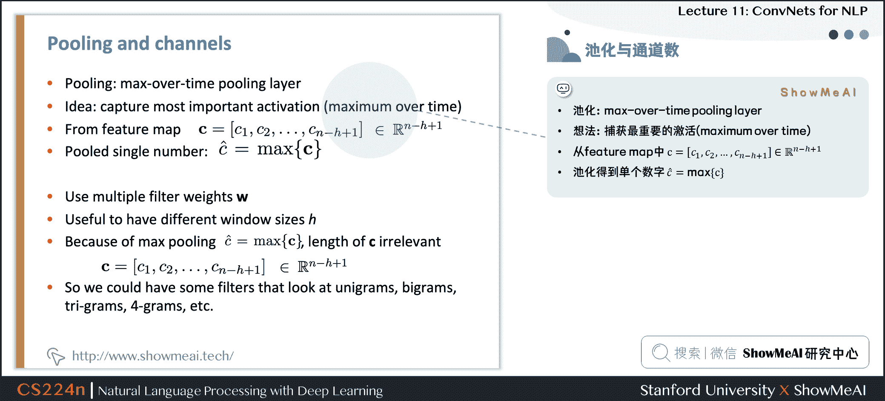

*   池化：max-over-time pooling layer
*   **想法**：捕获最重要的激活(maximum over time)
*   从 feature map 中 c = [ c 1 , c 2 , … , c n − h + 1 ] ∈ R n − h + 1 \mathbf{c}=\left[c_{1}, c_{2}, \dots, c_{n-h+1}\right] \in \mathbb{R}^{n-h+1} c=[c1​,c2​,…,cn−h+1​]∈Rn−h+1
*   池化得到单个数字 c ^ = max ⁡ { c } \hat{c}=\max \{\mathbf{c}\} c^=max{c}

*   使用多个过滤器权重 w w w
*   不同窗口大小 h h h 是有用的
*   由于最大池化 c ^ = max ⁡ { c } \hat{c}=\max \{\mathbf{c}\} c^=max{c}，和 c c c 的长度无关

c = [ c 1 , c 2 , … , c n − h + 1 ] ∈ R n − h + 1 \mathbf{c}=\left[c_{1}, c_{2}, \dots, c_{n-h+1}\right] \in \mathbb{R}^{n-h+1} c=[c1​,c2​,…,cn−h+1​]∈Rn−h+1

*   所以我们可以有一些 filters 来观察 unigrams、bigrams、tri-grams、4-grams 等等

## 2.4 多通道输入数据

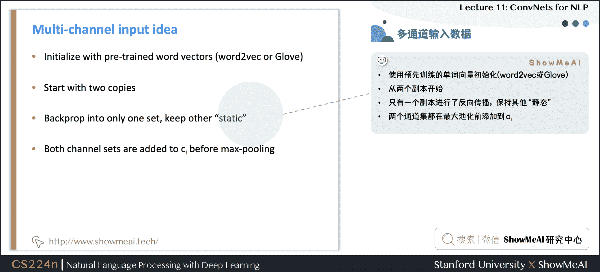

*   使用预先训练的单词向量初始化 (word2vec 或 Glove)
*   从两个副本开始
*   只对 1 个副本进行了反向传播，其他保持`静态`
*   两个通道集都在最大池化前添加到 c i c_i ci​

## 2.5 Classification after one CNN layer

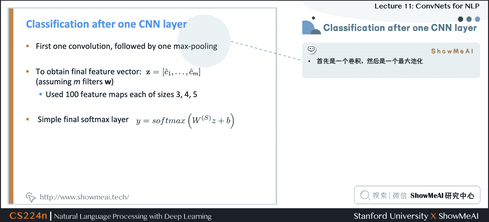

*   首先是一个卷积，然后是一个最大池化

*   为了获得最终的特征向量 z = [ c ^ 1 , … , c ^ m ] \mathbf{z}=\left[\hat{c}_{1}, \dots, \hat{c}_{m}\right] z=[c¹​,…,c^m​]

    *   假设我们有 m m m 个卷积核 (滤波器 filter) w w w
    *   使用 100 个大小分别为 3、4、5 的特征图 

*   最终是简单的 softmax layer y = softmax ⁡ ( W ( S ) z + b ) y=\operatorname{softmax}\left(W^{(S)} z+b\right) y=softmax(W(S)z+b)

**补充讲解**

*   https://arxiv.org/pdf/1510.03820.pdf
*   输入长度为 7 的一句话，每个词的维度是 5 ，即输入矩阵是 7 × 5 7 \times 5 7×5
*   使用不同的 `filter_size : (2,3,4)`，并且每个 size 都是用两个 filter，获得两个 channel 的 feature，即共计 6 个 filter
*   对每个 filter 的 feature 进行 1-max pooling 后，拼接得到 6 维的向量，并使用 softmax 后再获得二分类结果

## 2.6 Regularization 正则化

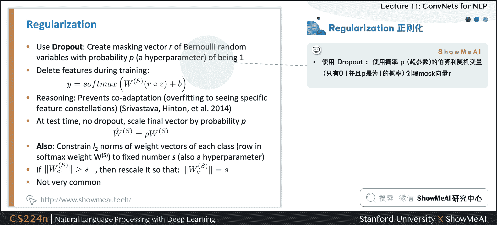

*   使用 Dropout：使用概率 p p p (超参数) 的伯努利随机变量(只有 0 1 并且 p p p 是为 1 1 1 的概率)创建 mask 向量 r r r

*   训练过程中删除特征

y = softmax ⁡ ( W ( S ) ( r ∘ z ) + b ) y=\operatorname{softmax}\left(W^{(S)}(r \circ z)+b\right) y=softmax(W(S)(r∘z)+b)

*   **解释**：防止互相适应(对特定特征的过度拟合)
*   在测试时不适用 Dropout，使用概率 p p p 缩放最终向量

W ^ ( S ) = p W ( S ) \hat{W}^{(S)}=p W^{(S)} W^(S)=pW(S)

*   此外：限制每个类的权重向量的 L2 Norm (softmax 权重 W ( S ) W^{(S)} W(S) 的每一行) 不超过固定数 s s s (也是超参数)
*   如果 ∥ W c ( S ) ∥ > s \left\|W_{c}^{(S)}\right\|>s ∥∥∥​Wc(S)​∥∥∥​>s ，则重新缩放为 ∥ W c ( S ) ∥ = s \left\|W_{c}^{(S)}\right\|=s ∥∥∥​Wc(S)​∥∥∥​=s

    *   不是很常见 

# 3.CNN 细节

## 3.1 CNN 参数讨论

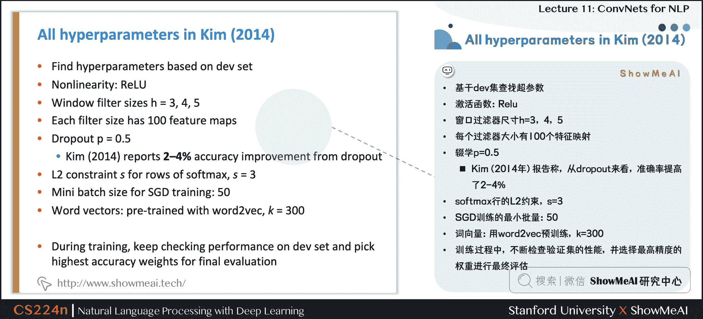

*   基于验证集 (dev) 调整超参数
*   激活函数：Relu
*   窗口过滤器尺寸 h = 3 ， 4 ， 5 h=3，4，5 h=3，4，5
*   每个过滤器大小有 100 个特征映射
*   Dropout p = 0.5 p=0.5 p=0.5

    *   Kim(2014 年) 报告称，从 Dropout 来看，准确率提高了 2 − 4 % 2 - 4 \% 2−4% 
*   softmax 行的 L2 约束， s = 3 s=3 s=3
*   SGD 训练的最小批量： 50 50 50
*   词向量：用 word2vec 预训练， k = 300 k=300 k=300
*   训练过程中，不断检查验证集的性能，并选择最高精度的权重进行最终评估

## 3.2 实验结果

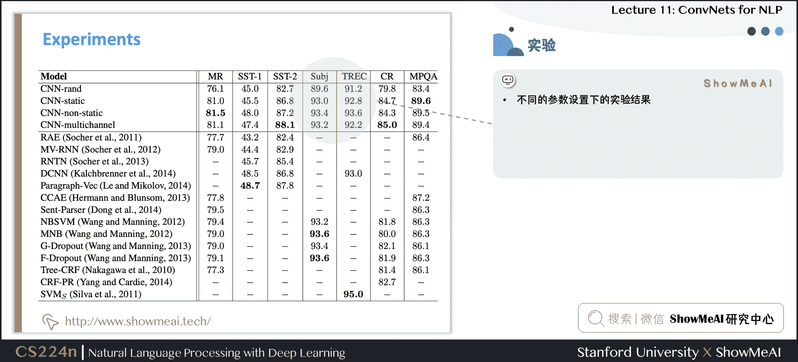

*   不同的参数设置下的实验结果

## 3.3 对比 CNN 与 RNN

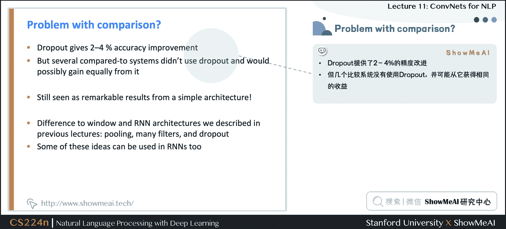

*   Dropout 提供了 2 − 4 % 2 - 4 \% 2−4% 的精度改进
*   但几个比较系统没有使用 Dropout，并可能从它获得相同的收益

*   仍然被视为一个简单架构的显著结果
*   与我们在前几节课中描述的窗口和 RNN 架构的不同之处：池化、许多过滤器和 Dropout
*   这些想法中有的可以被用在 RNNs 中

## 3.4 模型对比

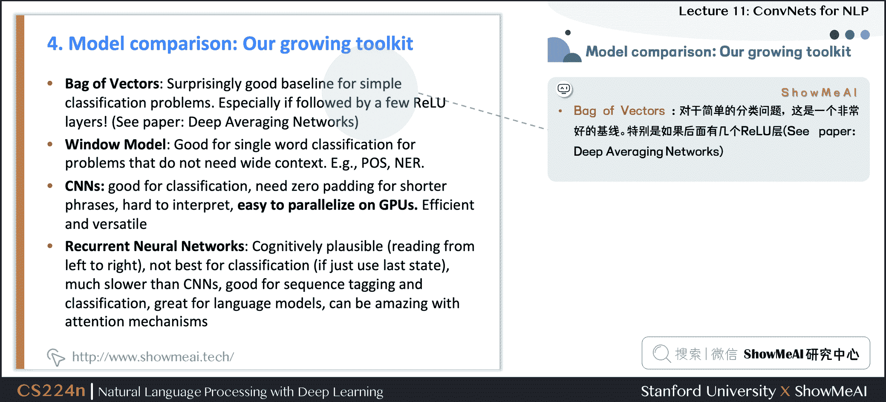

*   **词袋模型 / Bag of Vectors**：对于简单的分类问题，这是一个非常好的基线。特别是如果后面有几个 ReLU 层 (See paper: Deep Averaging Networks)

*   **词窗分类 / Window Model**：对于不需要广泛上下文的问题 (即适用于 local 问题)，适合单字分类。例如 POS、NER

*   **卷积神经网络 / CNN**：适合分类，较短的短语需要零填充，难以解释，易于在 gpu 上并行化

*   **循环神经网络 / RNN**：从左到右的认知更加具有可信度，不适合分类 (如果只使用最后一种状态)，比 CNNs 慢得多，适合序列标记和分类以及语言模型，结合注意力机制时非常棒

补充讲解

*   RNN 对序列标记和分类之类的事情有很好的效果，以及语言模型预测下一个单词，并且结合注意力机制会取得很好的效果，但是对于某个句子的整体解释，CNN 做的是更好的

## 3.5 跳接结构应用


*   我们在 LSTMs 和 GRUs 中看到的 门/跳接 是一个普遍的概念，现在在很多地方都使用这个概念
*   你还可以使用 `**纵向**` 的门
*   实际上，关键的概念——用快捷连接对候选更新求和——是非常深的网络工作所需要的

*   **Note**：添加它们时，请将 x x x 填充成 conv 一样的维度，再求和

## 3.6 批归一化 BatchNorm

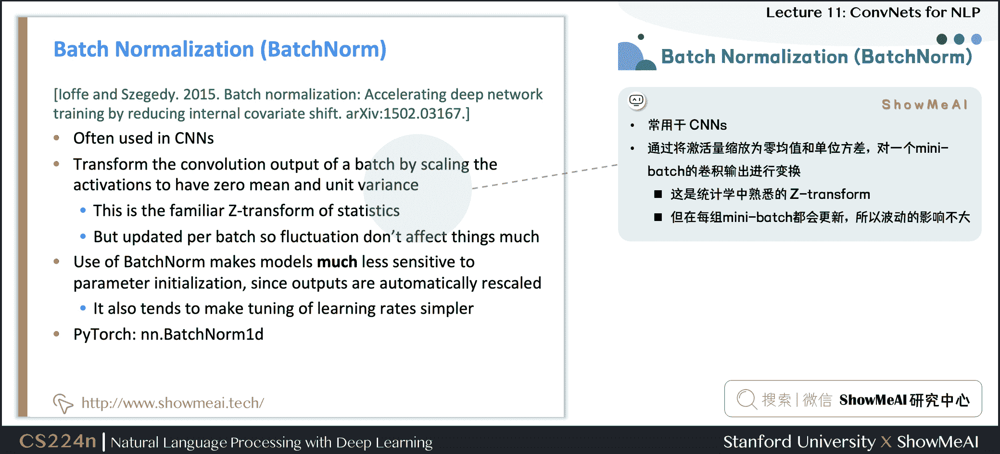

*   常用于 CNNs
*   通过将激活量缩放为零均值和单位方差，对一个 mini-batch 的卷积输出进行变换
    *   这是统计学中熟悉的 Z-transform
    *   但在每组 mini-batch 都会更新，所以波动的影响不大

*   使用 BatchNorm 使模型对参数初始化的敏感程度下降，因为输出是自动重新标度的
    *   也会让学习率的调优更简单，模型的训练会更加稳定
*   PyTorch：`nn.BatchNorm1d`

## 3.7 1x1 卷积

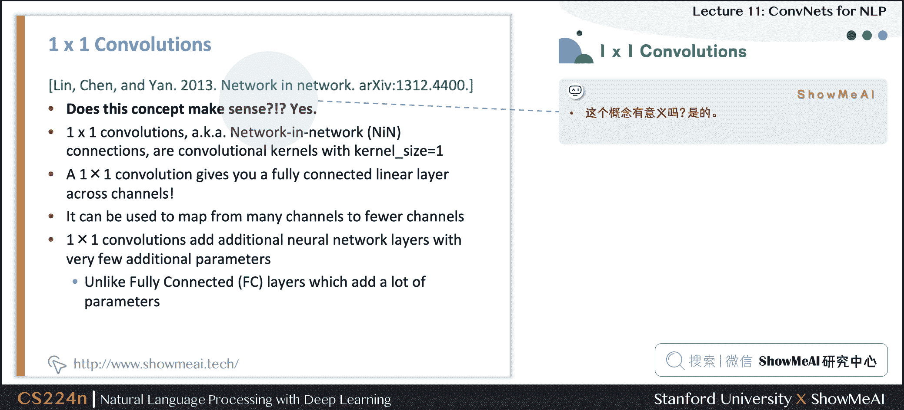

*   **1x1 的卷积有作用吗**？**是的**。

*   1x1 卷积，即网络中的 Network-in-network (NiN) connections，是内核大小为 1 的卷积内核
*   1x1 卷积提供了一个跨通道的全连接的线性层
*   它可以用于从多个通道映射到更少的通道
*   1x1 卷积添加了额外的神经网络层，附加的参数很少
    *   与全连接 (FC) 层不同——全连接(FC)层添加了大量的参数

## 3.8 CNN 应用：机器翻译

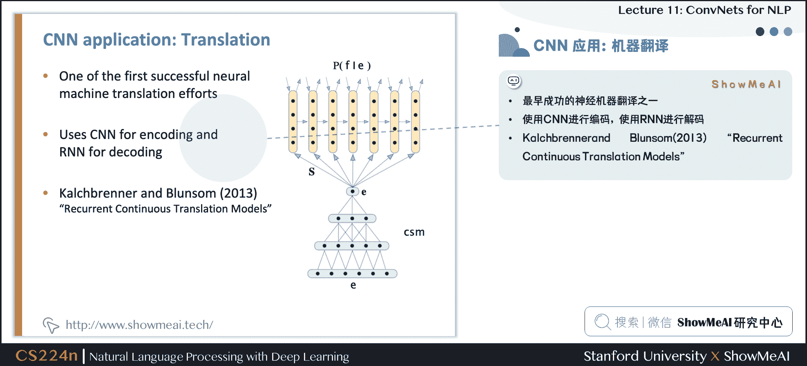

*   最早成功的神经机器翻译之一
*   使用 CNN 进行编码，使用 RNN 进行解码
*   Kalchbrennerand Blunsom(2013) `Recurrent Continuous Translation Models`

## 3.9 #论文解读# Learning Character-level Representations for Part-of-Speech Tagging

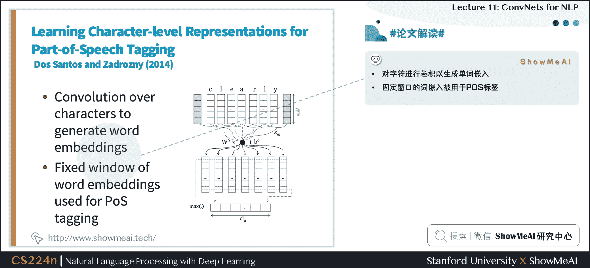

*   对字符进行卷积以生成单词嵌入
*   固定窗口的词嵌入被用于 POS 标签

## 3.10 #论文解读# Character-Aware Neural Language Models

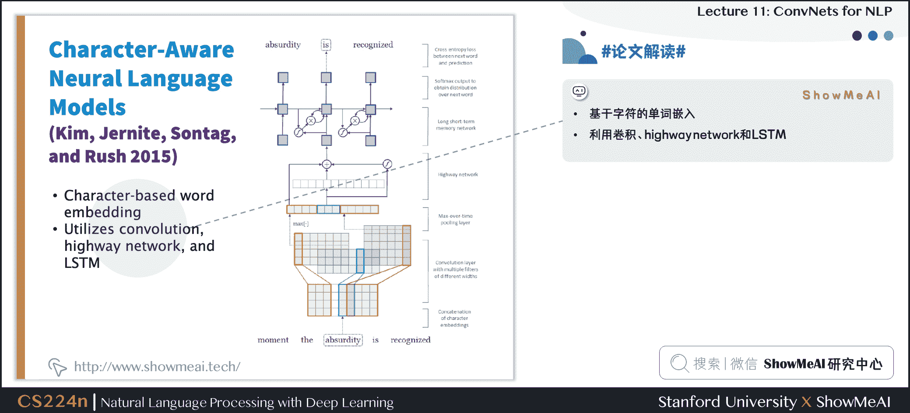

*   基于字符的单词嵌入
*   利用卷积、highway network 和 LSTM

# 4.深度 CNN 用于文本分类

## 4.1 深度卷积网络用于文本分类

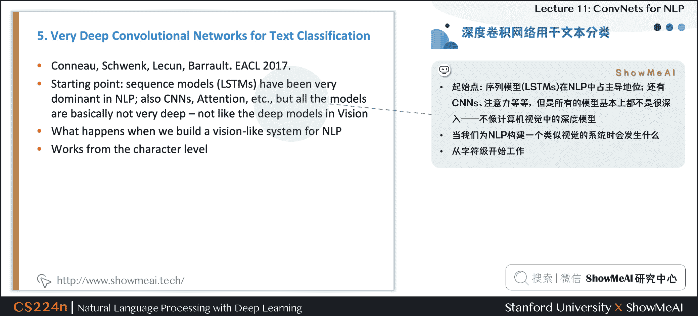

*   **起始点**：序列模型 (LSTMs) 在 NLP 中占主导地位；还有 CNNs、注意力等等，但是所有的模型基本上都不是很深入——不像计算机视觉中的深度模型
*   当我们为 NLP 构建一个类似视觉的系统时会发生什么
*   从字符级开始工作

## 4.2 VD-CNN 结构

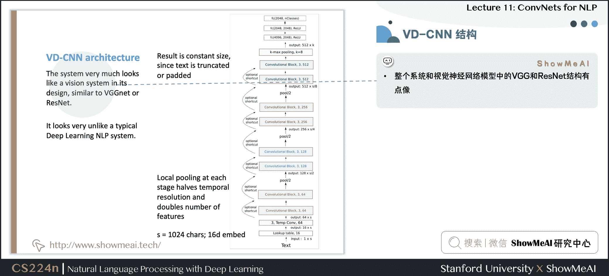

*   整个系统和视觉神经网络模型中的 VGG 和 ResNet 结构有点像

*   不太像一个典型的深度学习 NLP 系统

*   结果是固定大小，因为文本被截断或者填充成统一长度了

*   每个阶段都有局部池化操作，特征数量 double

## 4.3 VD-CNN 的卷积模块

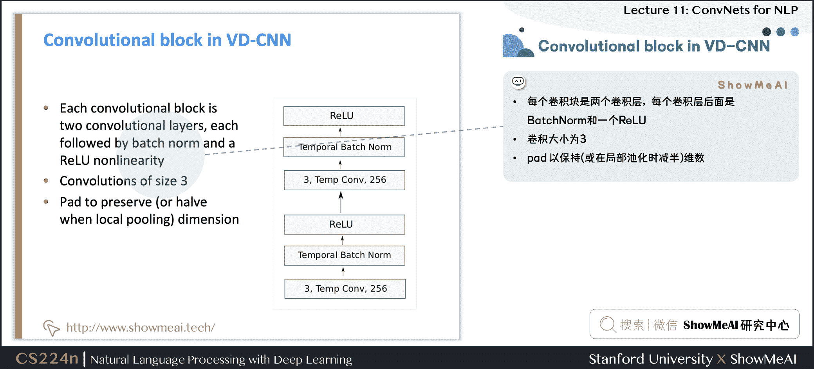

*   每个卷积块是两个卷积层，每个卷积层后面是 BatchNorm 和一个 ReLU
*   卷积大小为 3
*   pad 以保持 (或在局部池化时减半) 维数

## 4.4 实验结果

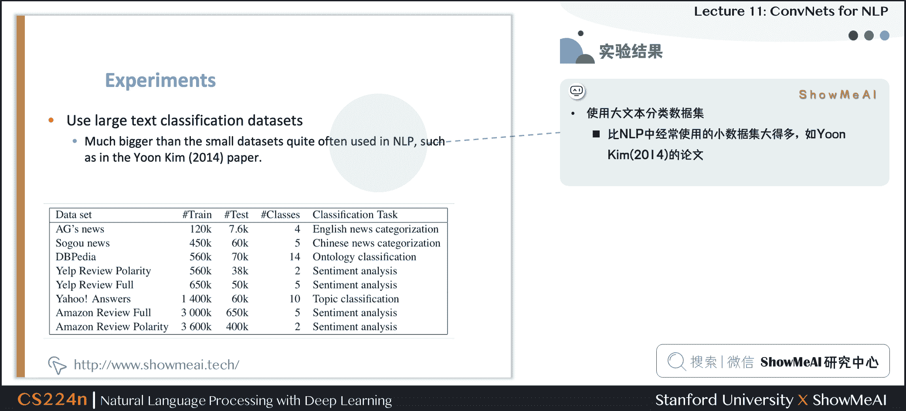

*   使用大文本分类数据集
    *   比 NLP 中经常使用的小数据集大得多，如 Yoon Kim(2014) 的论文

**补充讲解**

*   以上数据均为错误率，所以越低越好
*   深度网络会取得更好的结果，残差层取得很好的结果，但是深度再深时并未取得效果提升
*   实验表明使用 MaxPooling 比 KMaxPooling 和 使用 stride 的卷积 的两种其他池化方法要更好
*   ConvNets 可以帮助我们建立很好的文本分类系统

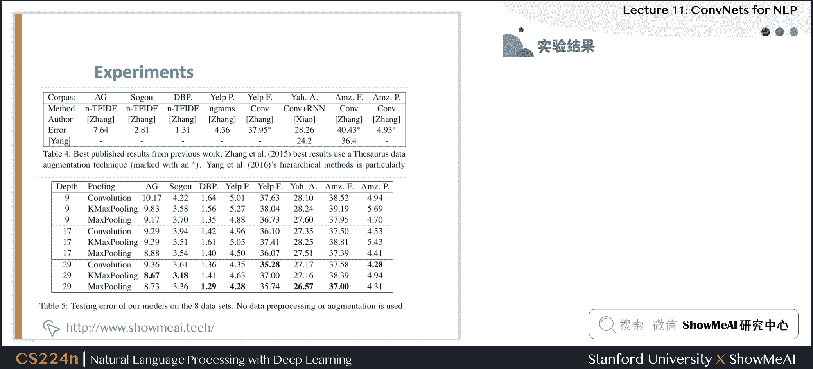

## 4.5 RNNs 比较慢

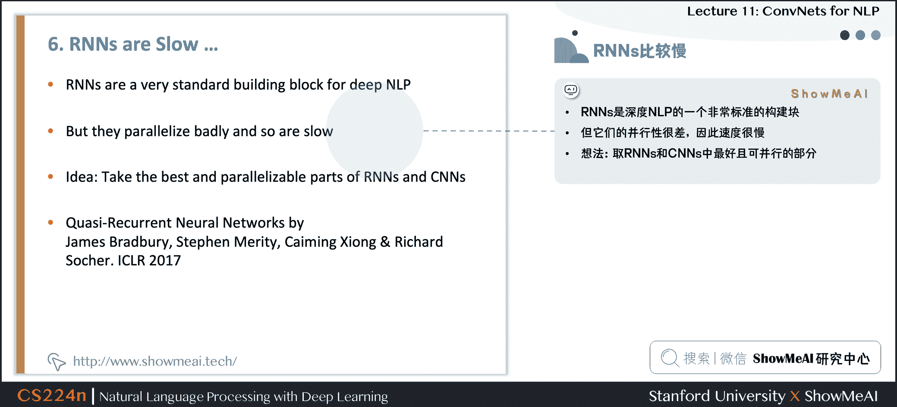

*   RNNs 是深度 NLP 的一个非常标准的构建块
*   但它们的并行性很差，因此速度很慢
*   想法：取 RNNs 和 CNNs 中最好且可并行的部分

# 5.Q-RNN 模型

## 5.1 Quasi-Recurrent Neural Network

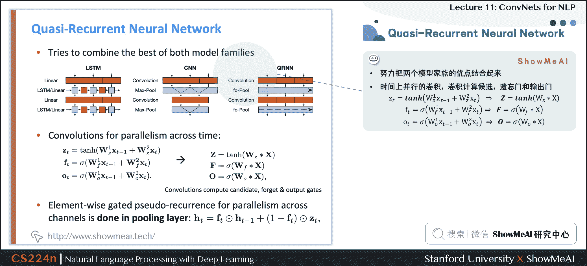

*   努力把两个模型家族的优点结合起来
*   时间上并行的卷积，卷积计算候选，遗忘门和输出门

z t = tanh ⁡ ( W z 1 x t − 1 + W z 2 x t ) f t = σ ( W f 1 x t − 1 + W f 2 x t ) o t = σ ( W o 1 x t − 1 + W o 2 x t ) \begin{aligned} \mathbf{z}_{t} &=\tanh \left(\mathbf{W}_{z}^{1} \mathbf{x}_{t-1}+\mathbf{W}_{z}^{2} \mathbf{x}_{t}\right) \\ \mathbf{f}_{t} &=\sigma\left(\mathbf{W}_{f}^{1} \mathbf{x}_{t-1}+\mathbf{W}_{f}^{2} \mathbf{x}_{t}\right) \\ \mathbf{o}_{t} &=\sigma\left(\mathbf{W}_{o}^{1} \mathbf{x}_{t-1}+\mathbf{W}_{o}^{2} \mathbf{x}_{t}\right) \end{aligned} zt​ft​ot​​=tanh(Wz1​xt−1​+Wz2​xt​)=σ(Wf1​xt−1​+Wf2​xt​)=σ(Wo1​xt−1​+Wo2​xt​)​

Z = tanh ⁡ ( W z ∗ X ) F = σ ( W f ∗ X ) O = σ ( W o ∗ X ) \begin{aligned} \mathbf{Z} &=\tanh \left(\mathbf{W}_{z} * \mathbf{X}\right) \\ \mathbf{F} &=\sigma\left(\mathbf{W}_{f} * \mathbf{X}\right) \\ \mathbf{O} &=\sigma\left(\mathbf{W}_{o} * \mathbf{X}\right) \end{aligned} ZFO​=tanh(Wz​∗X)=σ(Wf​∗X)=σ(Wo​∗X)​

*   跨通道并行性的逐元素的门控伪递归是在池化层中完成的

h t = f t ⊙ h t − 1 + ( 1 − f t ) ⊙ z t \mathbf{h}_{t}=\mathbf{f}_{t} \odot \mathbf{h}_{t-1}+\left(1-\mathbf{f}_{t}\right) \odot \mathbf{z}_{t} ht​=ft​⊙ht−1​+(1−ft​)⊙zt​

## 5.2 Q-RNN 实验：语言模型

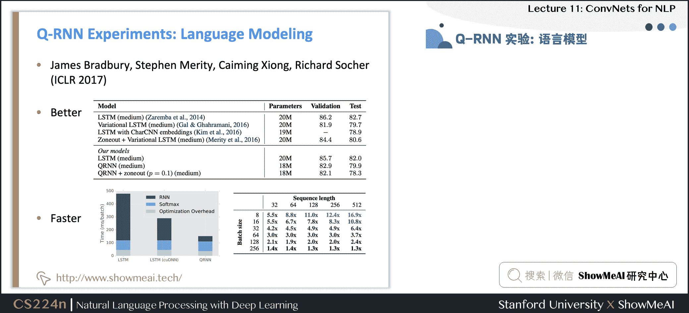

## 5.3 Q-RNNs：情感分析

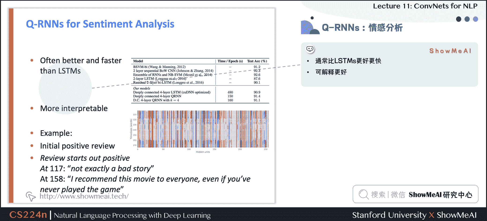

*   通常比 LSTMs 更好更快
*   可解释更好

## 5.4 QRNN 的限制

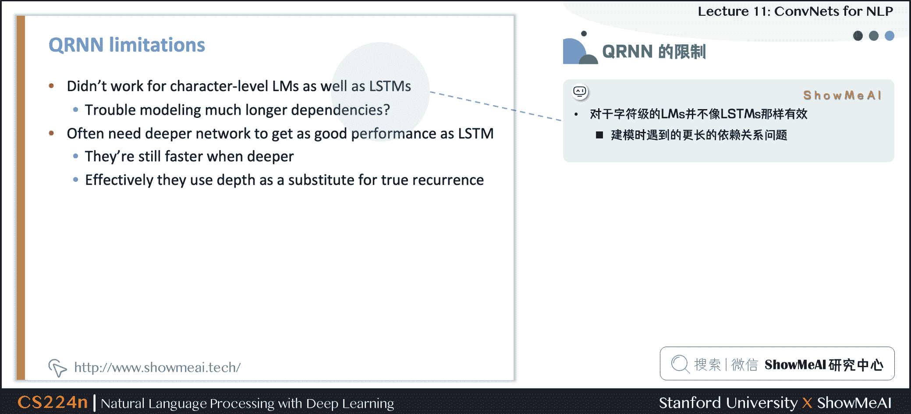

*   对于字符级的 LMs 并不像 LSTMs 那样有效
    *   建模时遇到的更长的依赖关系问题

*   通常需要更深入的网络来获得与 LSTM 一样好的性能
    *   当它们更深入时，速度仍然更快
    *   有效地使用深度作为真正递归的替代

## 5.5 RNN 的缺点&Transformer 提出的动机

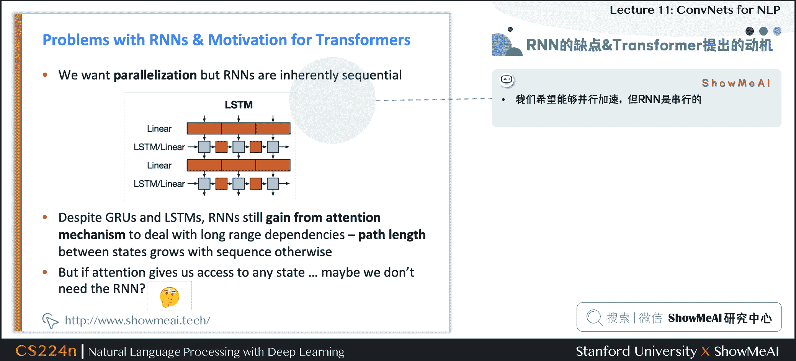

*   我们希望能够并行加速，但 RNN 是串行的

*   尽管 GRUs 和 LSTMs，RNNs 通过注意力机制可以捕捉到长时依赖，但随着序列增长，需要计算的路径也在增长

*   如果注意力机制本身可以让我们关注任何位置的信息，可能我们不需要 RNN？

# 6.视频教程

可以点击 [**B 站**](https://www.bilibili.com/video/BV1Yo4y1D7FW?p=11) 查看视频的【双语字幕】版本

[`player.bilibili.com/player.html?aid=376755412&page=11`](https://player.bilibili.com/player.html?aid=376755412&page=11)

【双语字幕+资料下载】斯坦福 CS224n | 深度学习与自然语言处理(2019·全 20 讲)

# 7.参考资料

*   [本讲带学的**在线阅翻页本**](https://blog.showmeai.tech/cs224n/lecture11-ConvNets-for-NLP#/)
*   [《斯坦福 CS224n 深度学习与自然语言处理》**课程学习指南**](https://blog.showmeai.tech/cs224n/)
*   [《斯坦福 CS224n 深度学习与自然语言处理》**课程大作业解析**](https://github.com/ShowMeAI-Hub/awesome-AI-courses-notes-cheatsheets/tree/main/CS224n-Natural-Language-Processing-with-Deep-Learning/assignment-solutions)
*   [【**双语字幕视频**】斯坦福 CS224n | 深度学习与自然语言处理(2019·全 20 讲)](https://www.bilibili.com/video/BV1Yo4y1D7FW)
*   [**Stanford 官网** | CS224n: Natural Language Processing with Deep Learning](https://web.stanford.edu/class/archive/cs/cs224n/cs224n.1194/)

# [**ShowMeAI**](http://www.showmeai.tech)系列教程推荐

*   [大厂技术实现 | 推荐与广告计算解决方案](http://www.showmeai.tech/tutorials/50)
*   [大厂技术实现 | 计算机视觉解决方案](http://www.showmeai.tech/tutorials/51)
*   [大厂技术实现 | 自然语言处理行业解决方案](http://www.showmeai.tech/tutorials/52)
*   [图解 Python 编程：从入门到精通系列教程](http://www.showmeai.tech/tutorials/56)
*   [图解数据分析：从入门到精通系列教程](http://www.showmeai.tech/tutorials/33)
*   [图解 AI 数学基础：从入门到精通系列教程](http://www.showmeai.tech/tutorials/83)
*   [图解大数据技术：从入门到精通系列教程](http://www.showmeai.tech/tutorials/84)
*   [图解机器学习算法：从入门到精通系列教程](http://www.showmeai.tech/tutorials/34)
*   [机器学习实战：手把手教你玩转机器学习系列](http://www.showmeai.tech/tutorials/41)
*   [深度学习教程 | 吴恩达专项课程 · 全套笔记解读](http://www.showmeai.tech/tutorials/35)
*   [自然语言处理教程 | 斯坦福 CS224n 课程 · 课程带学与全套笔记解读](http://www.showmeai.tech/tutorials/36)

# NLP 系列教程文章

*   [NLP 教程(1)- 词向量、SVD 分解与 Word2vec](http://showmeai.tech/article-detail/230)
*   [NLP 教程(2)- GloVe 及词向量的训练与评估](http://showmeai.tech/article-detail/232)
*   [NLP 教程(3)- 神经网络与反向传播](http://showmeai.tech/article-detail/234)
*   [NLP 教程(4)- 句法分析与依存解析](http://www.showmeai.tech/article-detail/237)
*   [NLP 教程(5)- 语言模型、RNN、GRU 与 LSTM](http://www.showmeai.tech/article-detail/239)
*   [NLP 教程(6)- 神经机器翻译、seq2seq 与注意力机制](http://www.showmeai.tech/article-detail/242)
*   [NLP 教程(7)- 问答系统](http://www.showmeai.tech/article-detail/245)
*   [NLP 教程(8)- NLP 中的卷积神经网络](http://www.showmeai.tech/article-detail/247)
*   [NLP 教程(9)- 句法分析与树形递归神经网络](http://www.showmeai.tech/article-detail/255)

# 斯坦福 CS224n 课程带学详解

*   [斯坦福 NLP 课程 | 第 1 讲 - NLP 介绍与词向量初步](http://showmeai.tech/article-detail/231)
*   [斯坦福 NLP 课程 | 第 2 讲 - 词向量进阶](http://showmeai.tech/article-detail/233)
*   [斯坦福 NLP 课程 | 第 3 讲 - 神经网络知识回顾](http://showmeai.tech/article-detail/235)
*   [斯坦福 NLP 课程 | 第 4 讲 - 神经网络反向传播与计算图](http://showmeai.tech/article-detail/236)
*   [斯坦福 NLP 课程 | 第 5 讲 - 句法分析与依存解析](http://www.showmeai.tech/article-detail/238)
*   [斯坦福 NLP 课程 | 第 6 讲 - 循环神经网络与语言模型](http://www.showmeai.tech/article-detail/240)
*   [斯坦福 NLP 课程 | 第 7 讲 - 梯度消失问题与 RNN 变种](http://www.showmeai.tech/article-detail/241)
*   [斯坦福 NLP 课程 | 第 8 讲 - 机器翻译、seq2seq 与注意力机制](http://www.showmeai.tech/article-detail/243)
*   [斯坦福 NLP 课程 | 第 9 讲 - cs224n 课程大项目实用技巧与经验](http://www.showmeai.tech/article-detail/244)
*   [斯坦福 NLP 课程 | 第 10 讲 - NLP 中的问答系统](http://www.showmeai.tech/article-detail/246)
*   [斯坦福 NLP 课程 | 第 11 讲 - NLP 中的卷积神经网络](http://www.showmeai.tech/article-detail/248)
*   [斯坦福 NLP 课程 | 第 12 讲 - 子词模型](http://www.showmeai.tech/article-detail/249)
*   [斯坦福 NLP 课程 | 第 13 讲 - 基于上下文的表征与 NLP 预训练模型](http://www.showmeai.tech/article-detail/250)
*   [斯坦福 NLP 课程 | 第 14 讲 - Transformers 自注意力与生成模型](http://www.showmeai.tech/article-detail/251)
*   [斯坦福 NLP 课程 | 第 15 讲 - NLP 文本生成任务](http://www.showmeai.tech/article-detail/252)
*   [斯坦福 NLP 课程 | 第 16 讲 - 指代消解问题与神经网络方法](http://www.showmeai.tech/article-detail/253)
*   [斯坦福 NLP 课程 | 第 17 讲 - 多任务学习(以问答系统为例)](http://www.showmeai.tech/article-detail/254)
*   [斯坦福 NLP 课程 | 第 18 讲 - 句法分析与树形递归神经网络](http://www.showmeai.tech/article-detail/256)
*   [斯坦福 NLP 课程 | 第 19 讲 - AI 安全偏见与公平](http://www.showmeai.tech/article-detail/257)
*   [斯坦福 NLP 课程 | 第 20 讲 - NLP 与深度学习的未来](http://www.showmeai.tech/article-detail/258)

