# 斯坦福 NLP 课程 | 第 12 讲 - NLP 子词模型

> 原文：[`blog.csdn.net/ShowMeAI/article/details/124622206`](https://blog.csdn.net/ShowMeAI/article/details/124622206)

作者：[韩信子](https://github.com/HanXinzi-AI)@[ShowMeAI](http://www.showmeai.tech/)，路遥@[ShowMeAI](http://www.showmeai.tech/)，奇异果@[ShowMeAI](http://www.showmeai.tech/)
[教程地址](http://www.showmeai.tech/tutorials/36)：[`www.showmeai.tech/tutorials/36`](http://www.showmeai.tech/tutorials/36)
[本文地址](http://www.showmeai.tech/article-detail/249)：[`www.showmeai.tech/article-detail/249`](http://www.showmeai.tech/article-detail/249)
声明：版权所有，转载请联系平台与作者并注明出处

收藏[ShowMeAI](http://www.showmeai.tech/)查看更多精彩内容

* * *

[ShowMeAI](http://www.showmeai.tech/)为**斯坦福 CS224n**《自然语言处理与深度学习(Natural Language Processing with Deep Learning)》课程的全部课件，做了**中文翻译和注释**，并制作成了 GIF 动图！视频和课件等资料的获取方式见**文末**。

* * *

# 引言

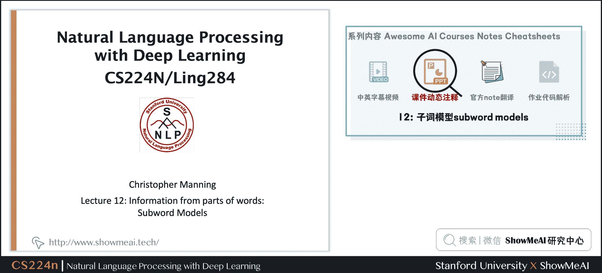

## 授课计划

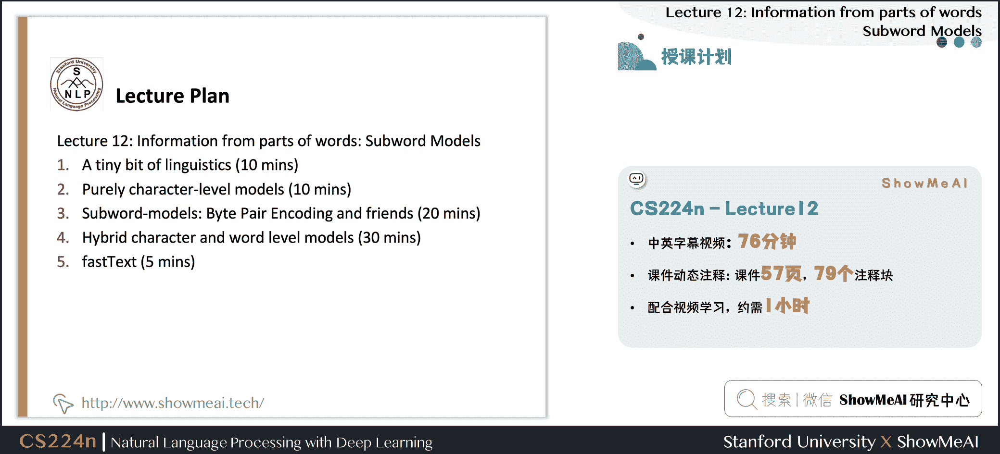

*   A tiny bit of linguistics / **语法学基础知识**
*   Purely character-level models / **基于字符粒度的模型**
*   Subword-models: Byte Pair Encoding and friends / **子词模型**
*   Hybrid character and word level models / **混合字符与词粒度的模型**
*   fastText / **fastText 模型**

# 1.语法学基础知识

## 1.1 人类语言的声音：语音学和语音体系

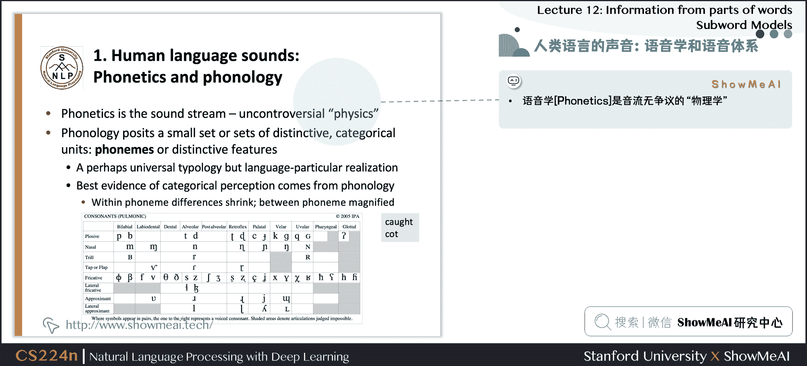

*   语音学 (honetics) 是音流无争议的 `物理学`

*   **语音体系** (Phonology) 假定了一组或多组独特的、分类的单元：**音素** (phoneme) 或者是独特的特征
    *   这也许是一种普遍的类型学，但却是一种特殊的语言实现
    *   分类感知的最佳例子就是语音体系
        *   音位差异缩小
        *   音素之间的放大

## 1.2 词法：词类

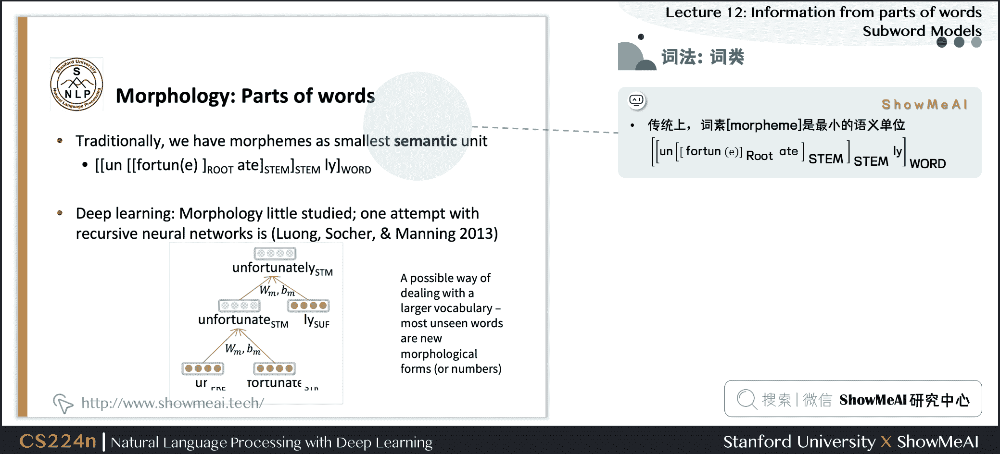

*   传统上，**词素** (morphemes) 是最小的语义单位

[ [ un [ [  fortun  ( e ) ]  Root   ate  ]  STEM  ]  STEM  ly ]  WORD  \left[\left[\text {un}\left[[\text { fortun }(\mathrm{e})]_{\text { Root }} \text { ate }\right]_{\text { STEM }}\right]_{\text { STEM }} \text {ly}\right]_{\text { WORD }} [[un[[ fortun (e)] Root ​ ate ] STEM ​] STEM ​ly] WORD ​

*   **深度学习**：形态学研究较少；递归神经网络的一种尝试是 (Luong, Socher, & Manning 2013)
    *   处理更大词汇量的一种可能方法：大多数看不见的单词是新的形态(或数字)

*   声音本身在语言中没有意义
*   parts of words 是音素的下一级的形态学，是具有意义的最低级别

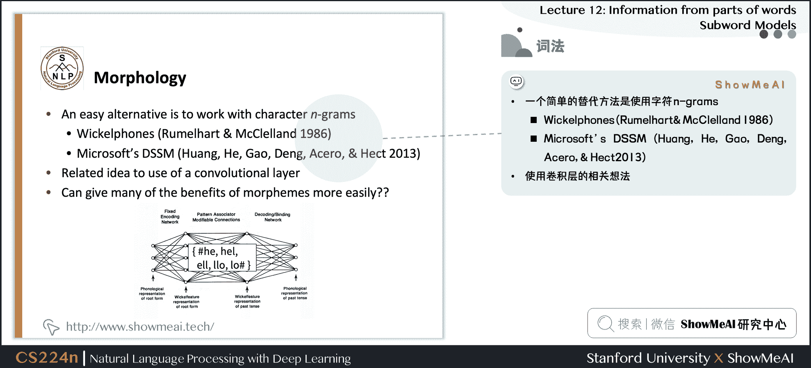

*   一个简单的替代方法是使用字符 n-grams
    *   Wickelphones (Rumelhart & McClelland 1986)
    *   Microsoft’s DSSM (Huang, He, Gao, Deng, Acero, & Hect2013)
*   使用卷积层的相关想法

*   能更容易地发挥词素的许多优点吗？

## 1.3 书写系统中的单词

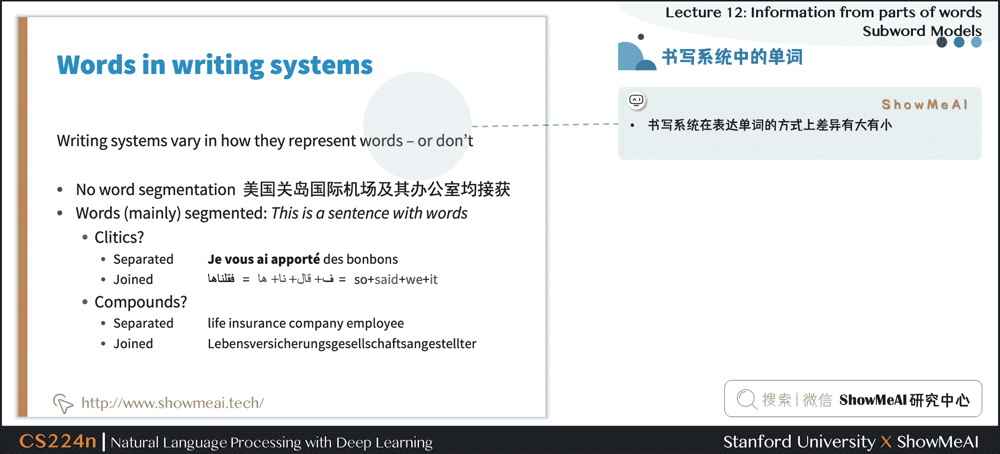

*   书写系统在表达单词的方式上差异有大有小

*   没有分词 (没有在单词间放置空格)
    *   例如中文

*   大部分的单词都是分开的：由单词组成了句子
    *   **附着词**
        *   分开的
        *   连续的
    *   **复合名词**
        *   分开的
        *   连续的

## 1.4 比单词粒度更细的模型

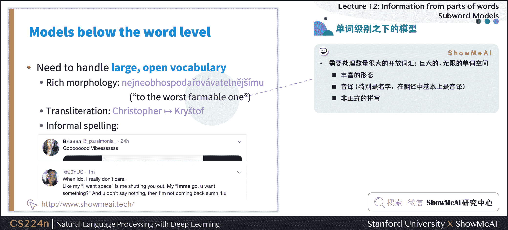

*   需要处理数量很大的开放词汇：巨大的、无限的单词空间
    *   丰富的形态
    *   音译 (特别是名字，在翻译中基本上是音译)
    *   非正式的拼写

## 1.5 字符级模型

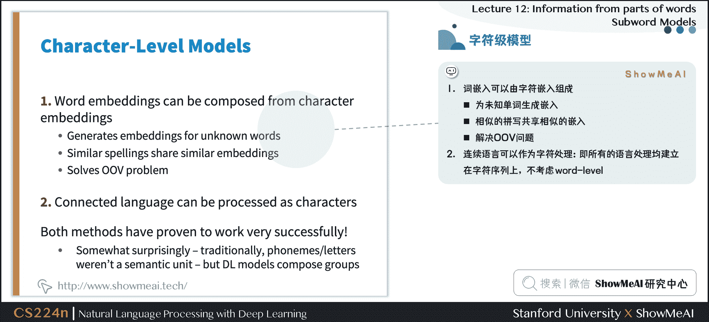

*   ① **词嵌入可以由字符嵌入组成**

    *   为未知单词生成嵌入
    *   相似的拼写共享相似的嵌入
    *   解决 OOV 问题
*   ② **连续语言可以作为字符处理**：即所有的语言处理均建立在字符序列上，不考虑 word-level

*   这两种方法都被证明是非常成功的！
    *   有点令人惊讶的是：一般意义上，音素/字母不是一个语义单元：但深度学习模型构成了 group
    *   深度学习模型可以存储和构建来自多个字母组的含义表示，以模拟语素和更大单位的意义，汇总形成语义

## 1.6 单词之下：书写系统

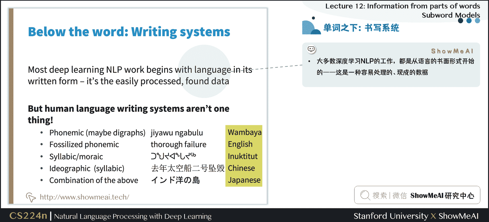

*   大多数深度学习 NLP 的工作，都是从语言的书面形式开始的：这是一种容易处理的、现成的数据
*   但是人类语言书写系统不是一回事！各种语言的字符是不同的！

# 2.基于字符粒度的模型

## 2.1 纯字符级模型

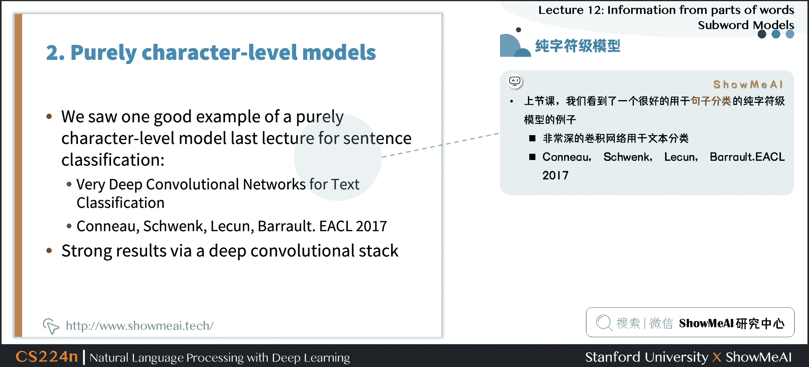

*   上节课，我们看到了一个很好的用于句子分类的纯字符级模型的例子
    *   非常深的卷积网络用于文本分类
    *   Conneau, Schwenk, Lecun, Barrault.EACL 2017

*   强大的结果通过深度卷积堆叠

## 2.2 字符级别输入输出的机器翻译系统

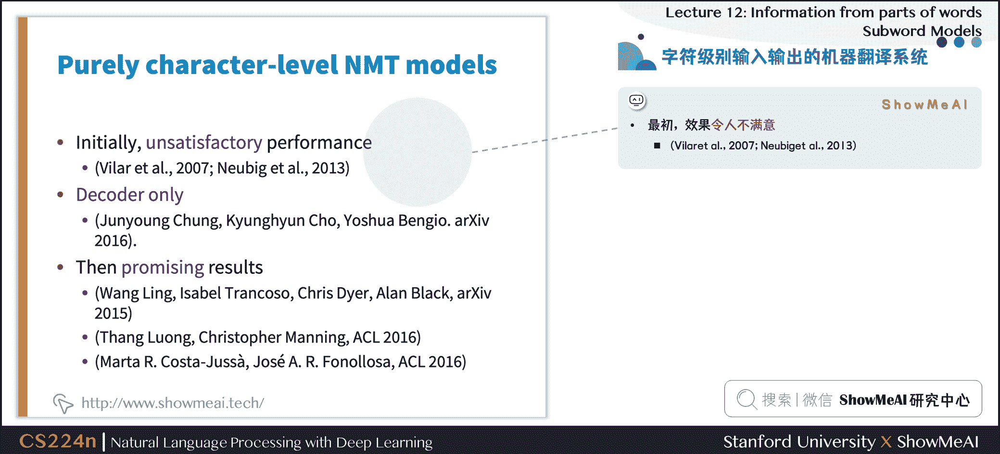

*   最初，效果**令人不满意**
    *   (Vilaret al., 2007; Neubiget al., 2013)

*   只有 decoder (**初步成功**)
    *   (JunyoungChung, KyunghyunCho, YoshuaBengio. arXiv 2016).

*   然后，出现了**还不错**的结果
    *   (Wang Ling, Isabel Trancoso, Chris Dyer, Alan Black, arXiv 2015)
    *   (Thang Luong, Christopher Manning, ACL 2016)
    *   (Marta R. Costa-Jussà, José A. R. Fonollosa, ACL 2016)

## 2.3 English-Czech WMT 2015 Results

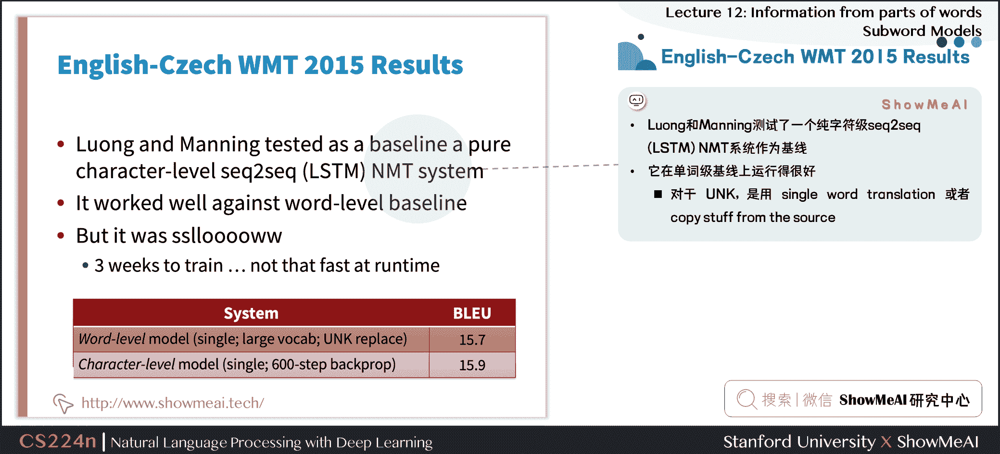

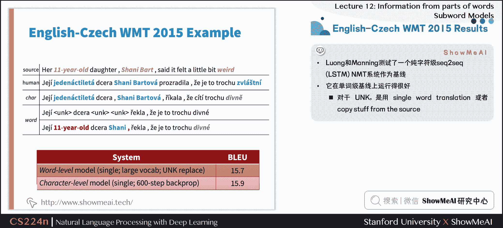

*   Luong 和 Manning 测试了一个纯字符级 seq2seq (LSTM) NMT 系统作为基线
*   它在单词级基线上运行得很好
    *   对于 UNK，是用 single word translation 或者 copy stuff from the source

*   字符级的 model 效果更好了，但是太慢了
    *   但是运行需要 3 周的时间来训练，运行时没那么快
    *   如果放进了 LSTM 中，序列长度变为以前的数倍 (大约七倍)

## 2.4 无显式分割的完全字符级神经机器翻译

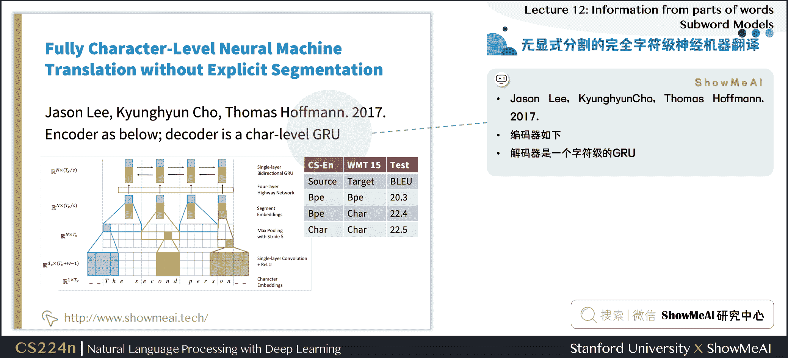

*   Jason Lee, KyunghyunCho, Thomas Hoffmann. 2017.
*   编码器如下
*   解码器是一个字符级的 GRU

2.5 #论文解读# Stronger character results with depth in LSTM seq2seq model

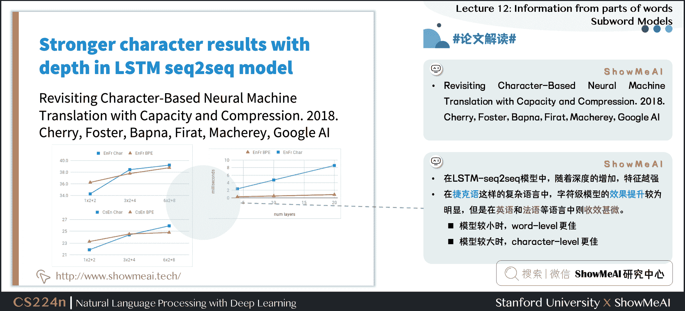

*   Revisiting Character-Based Neural Machine Translation with Capacity and Compression. 2018\. Cherry, Foster, Bapna, Firat, Macherey, Google AI

*   在 LSTM-seq2seq 模型中，随着深度的增加，特征越强
*   在**捷克语**这样的复杂语言中，字符级模型的**效果提升**较为明显，但是在**英语和法语**等语言中则**收效甚微**。
    *   模型较小时，word-level 更佳
    *   模型较大时，character-level 更佳

# 3.子词模型

## 3.1 子词模式：两种趋势

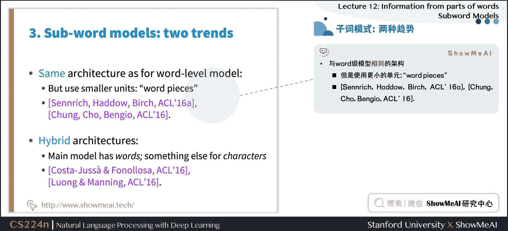

*   与 word 级模型**相同**的架构
    *   但是使用更小的单元： `word pieces`
    *   [Sennrich, Haddow, Birch, ACL’16a], [Chung, Cho, Bengio, ACL’16].

*   **混合架构**
    *   主模型使用单词，其他使用字符级
    *   [Costa-Jussà& Fonollosa, ACL’16], [Luong & Manning, ACL’16].

## 3.2 字节对编码/BPE

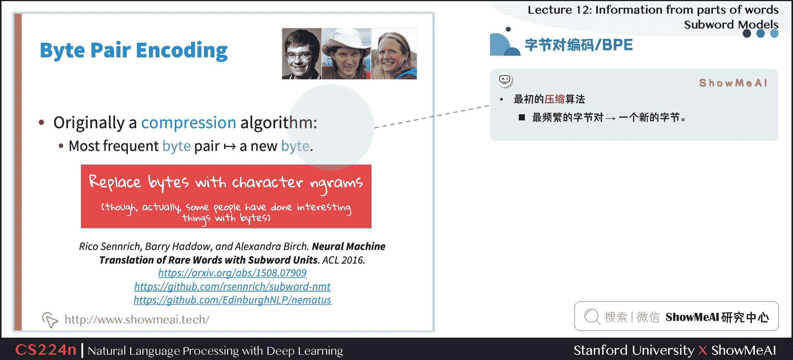

*   最初的**压缩算法**
    *   最频繁的字节 → 一个新的字节。

*   用字符 ngram 替换字节(实际上，有些人已经用字节做了一些有趣的事情)

*   Rico Sennrich, Barry Haddow, and Alexandra Birch. Neural Machine Translation of Rare Words with SubwordUnits. ACL 2016\.
    *   https://arxiv.org/abs/1508.07909
    *   https://github.com/rsennrich/subword-nmt
    *   https://github.com/EdinburghNLP/nematus

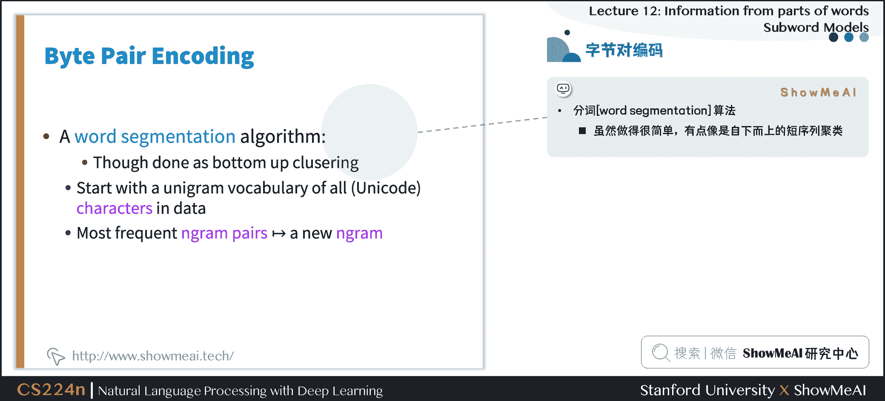

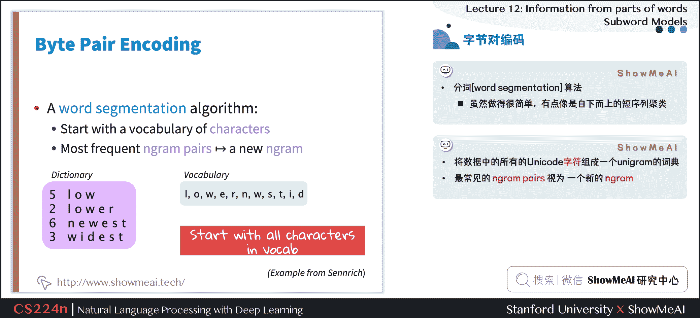

*   分词 (word segmentation) 算法
    *   虽然做得很简单，有点像是自下而上的短序列聚类

*   将数据中的所有的 Unicode 字符组成一个 unigram 的词典
*   最常见的 ngram pairs 视为 一个新的 ngram

*   BPE 并未深度学习的有关算法，但已成为标准且成功表示 pieces of words 的方法，可以获得一个有限的词典与无限且有效的词汇表。

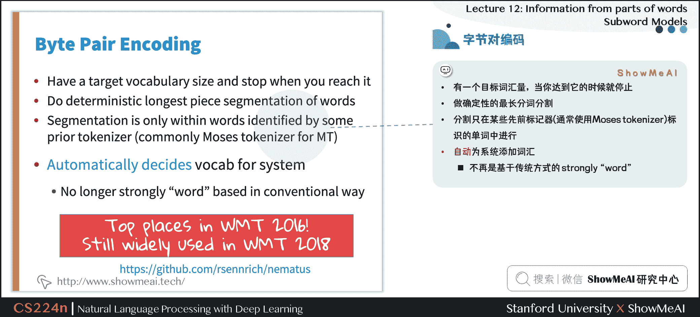

*   有一个目标词汇量，当你达到它的时候就停止
*   做确定性的最长分词分割
*   分割只在某些先前标记器 (通常 MT 使用的 Moses tokenizer) 标识的单词中进行
*   **自动**为系统添加词汇
    *   不再是基于传统方式的 strongly `word`

*   2016 年 WMT 排名第一！仍然广泛应用于 2018 年 WMT
*   https://github.com/rsennrich/nematus

## 3.3 Wordpiece / Sentencepiece 模型

*   谷歌 NMT (GNMT) 使用了它的一个变体
    *   V1: wordpiece model
    *   V2: sentencepiece model

*   不使用字符的 n-gram count，而是使用贪心近似来最大化语言模型的对数似然函数值，选择对应的 pieces
    *   添加最大限度地减少困惑的 n-gram

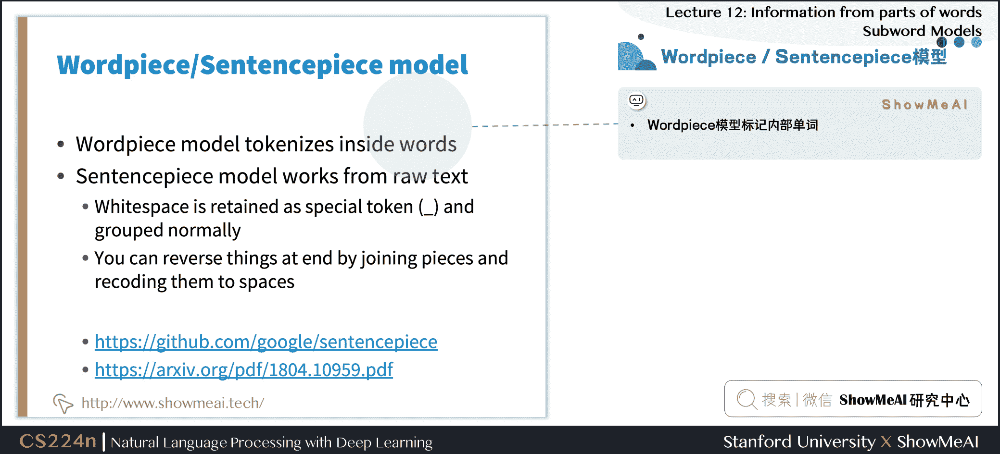

*   Wordpiece 模型标记内部单词

*   Sentencepiece 模型使用原始文本
    *   空格被保留为特殊标记(_)，并正常分组
    *   可以通过将片段连接起来并将它们重新编码到空格中，从而在末尾将内容反转

*   https://github.com/google/sentencepiece
*   https://arxiv.org/pdf/1804.10959.pdf

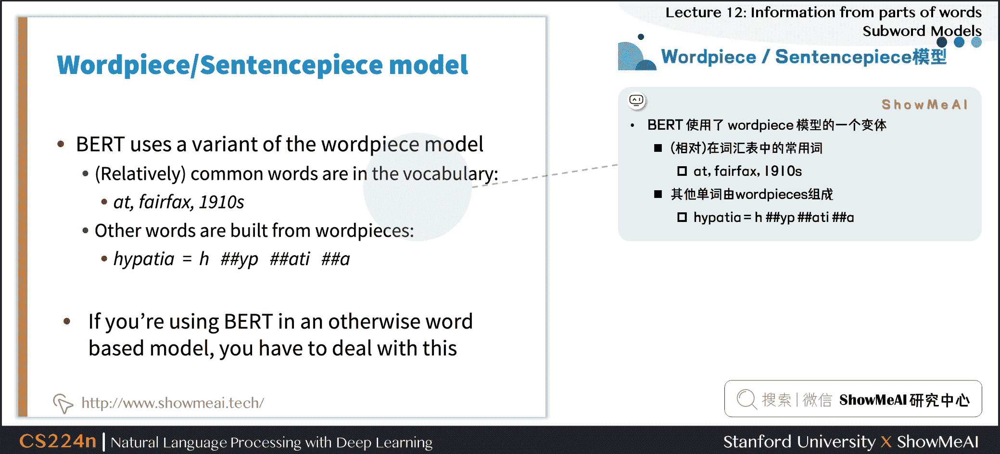

*   BERT 使用了 wordpiece 模型的一个变体
    *   (相对) 在词汇表中的常用词
        *   at, fairfax, 1910s
    *   其他单词由 wordpieces 组成
        *   hypatia = h ##yp ##ati ##a

*   如果你在一个基于单词的模型中使用 BERT，你必须处理这个

## 3.4 字符级构建单词级

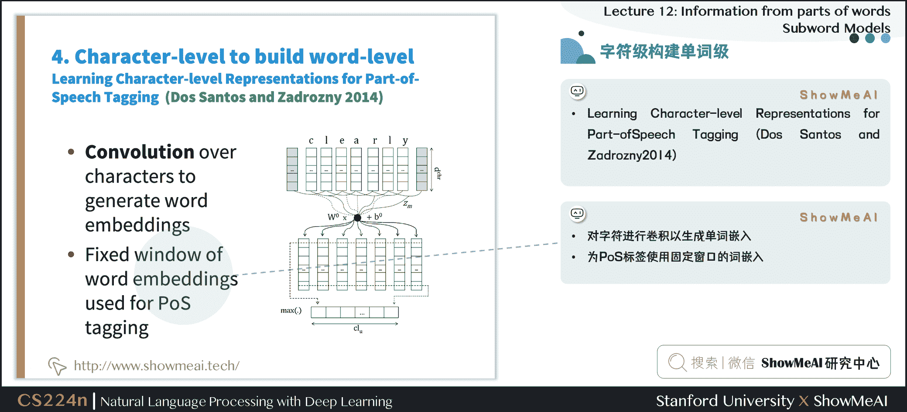

*   Learning Character-level Representations for Part-ofSpeech Tagging (Dos Santos and Zadrozny 2014)

*   对字符进行卷积以生成单词嵌入
*   为 PoS 标签使用固定窗口的词嵌入

## 3.5 基于字符的 LSTM 构建单词表示

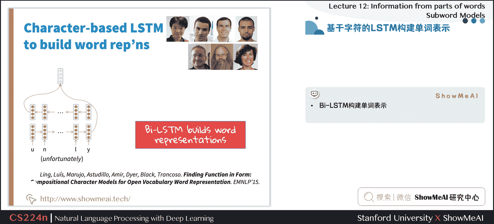

*   Bi-LSTM 构建单词表示

## 3.6 #论文解读# Character-Aware Neural Language Models

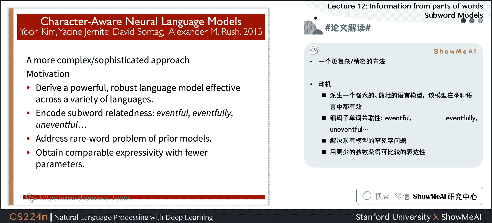

*   一个更复杂/精密的方法

*   **动机**
    *   派生一个强大的、健壮的语言模型，该模型在多种语言中都有效
    *   编码子单词关联性：eventful, eventfully, uneventful…
    *   解决现有模型的罕见字问题
    *   用更少的参数获得可比较的表达性

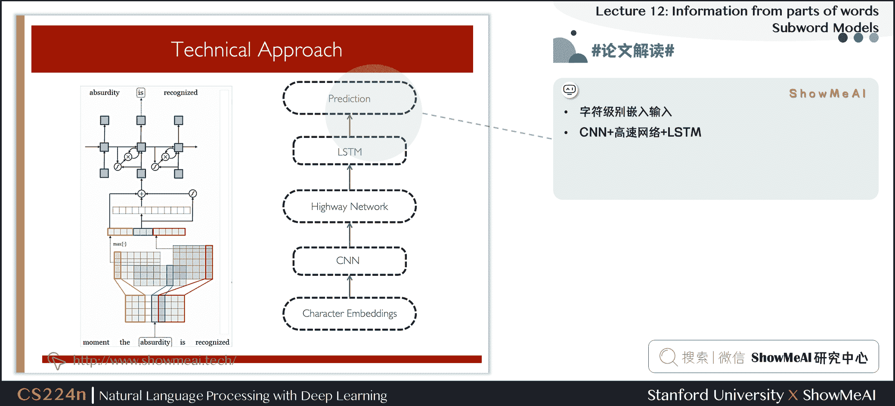

*   字符级别嵌入输入
*   CNN+高速网络+LSTM

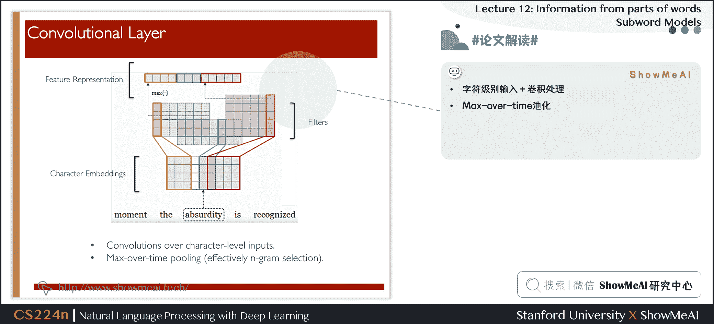

*   字符级别输入 + 卷积处理
*   **Max-over-time 池化**

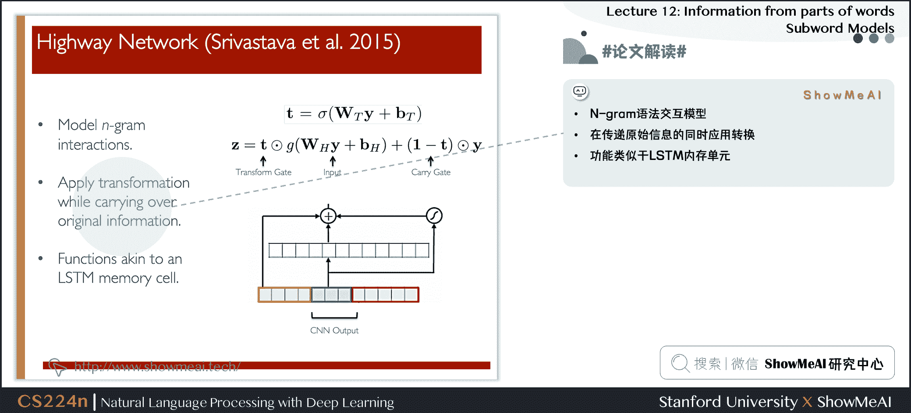

*   N-gram 语法交互模型
*   在传递原始信息的同时应用转换
*   功能类似于 LSTM 内存单元

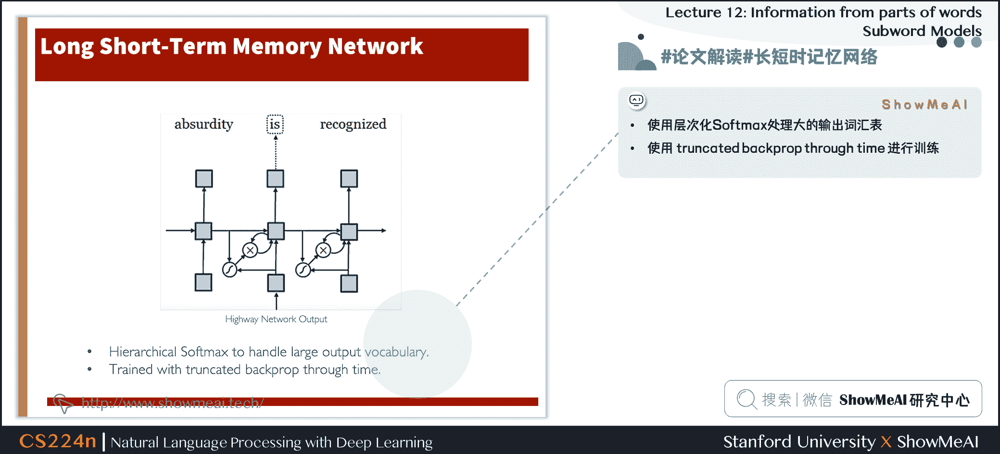

*   使用层次化 Softmax 处理大的输出词汇表
*   使用 truncated backprop through time 进行训练

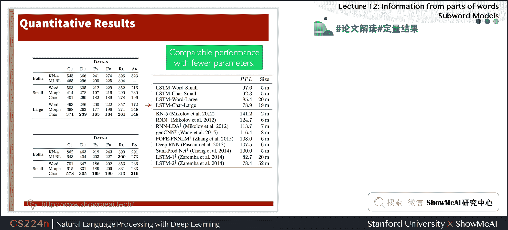

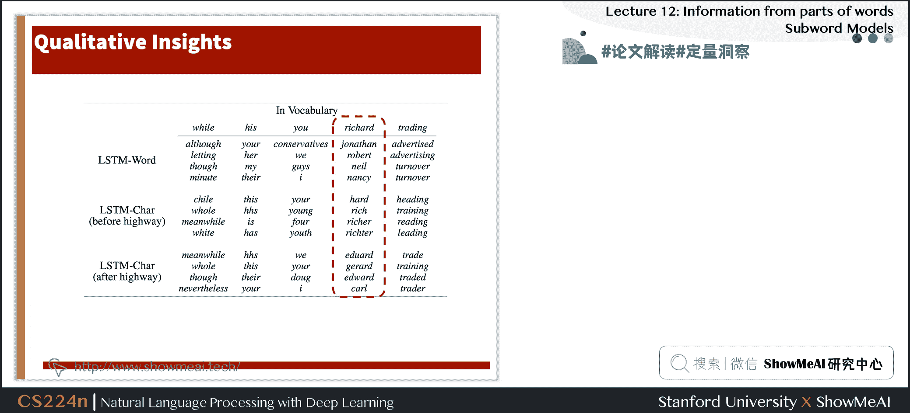

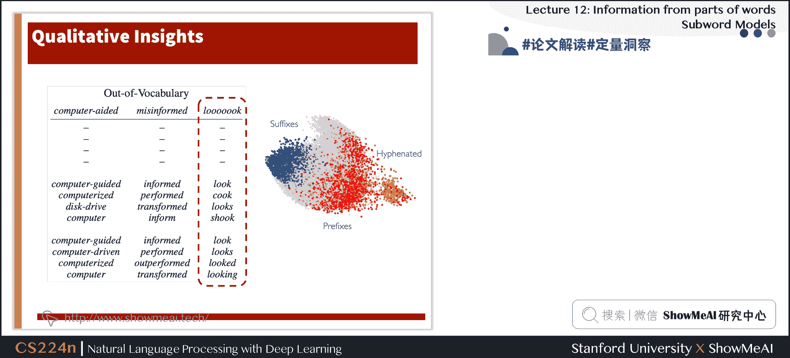

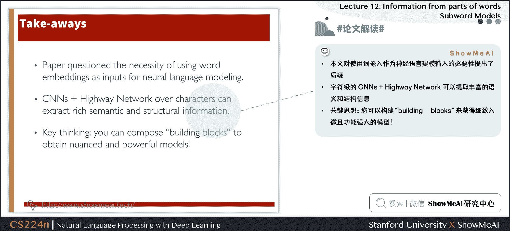

*   本文对使用词嵌入作为神经语言建模输入的必要性提出了质疑
*   字符级的 CNNs + Highway Network 可以提取丰富的语义和结构信息
*   关键思想：您可以构建 `building blocks` 来获得细致入微且功能强大的模型！

# 4.混合字符与词粒度的模型

## 4.1 混合 NMT

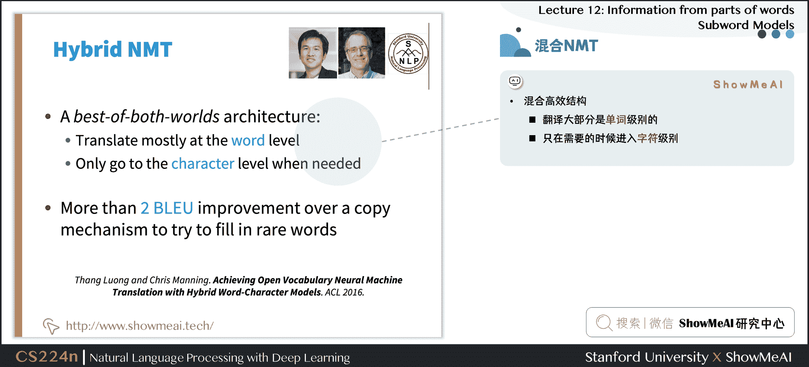

*   混合高效结构
    *   翻译大部分是**单词**级别的
    *   只在需要的时候进入**字符**级别

*   使用一个复制机制，试图填充罕见的单词，产生了超过 **2 个点的 BLEU** 的改进

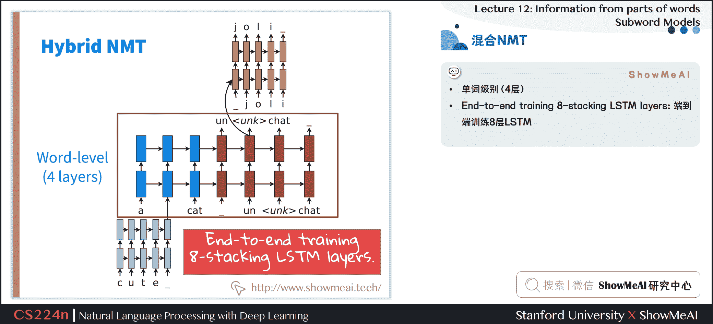

*   单词级别 (4 层)
*   End-to-end training 8-stacking LSTM layers：端到端训练 8 层 LSTM

## 4.2 二级解码

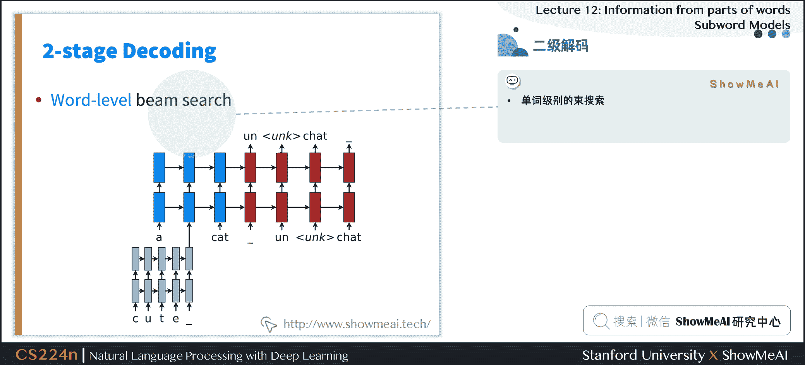

*   单词级别的集束搜索
*   字符级别的集束搜索 (遇到 ) 时

**补充讲解**

*   混合模型与字符级模型相比
    *   纯粹的字符级模型能够非常有效地使用字符序列作为条件上下文
    *   混合模型虽然提供了字符级的隐层表示，但并没有获得比单词级别更低的表示

## 4.3 English - Czech Results

*   使用 WMT’15 数据进行训练 (12M 句子对)
    *   新闻测试 2015

*   30 倍数据
*   3 个系统
*   大型词汇+复制机制

*   达到先进的效果！

## 4.4 Sample English-czech translations

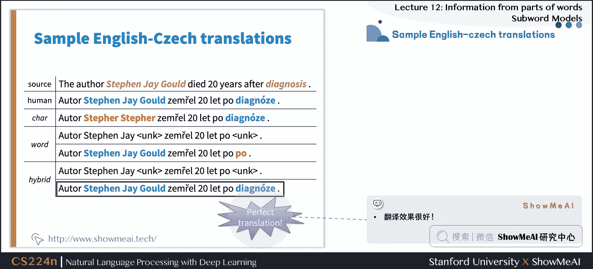

*   翻译效果很好！

*   **基于字符**：错误的名称翻译
*   **基于单词**：对齐不正确
*   **基于字符的混合**：diagnóze 的正确翻译
*   **基于单词**：特征复制失败

*   **混合**：正确，11-year-old-jedenactileta
*   **错误**：Shani Bartova

## 4.5 单词嵌入中的字符应用

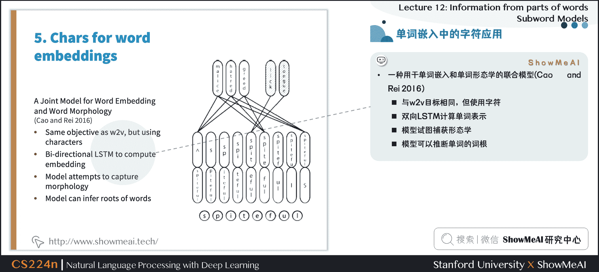

*   一种用于单词嵌入和单词形态学的联合模型(Cao and Rei 2016)
    *   与 w2v 目标相同，但使用字符
    *   双向 LSTM 计算单词表示
    *   模型试图捕获形态学
    *   模型可以推断单词的词根

# 5.fastText 模型

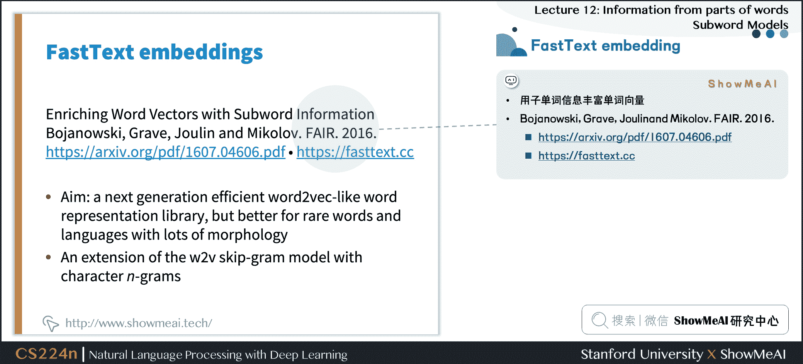

*   用子单词信息丰富单词向量
    Bojanowski, Grave, Joulinand Mikolov. FAIR. 2016\.
    *   https://arxiv.org/pdf/1607.04606.pdf
    *   https://fasttext.cc

*   **目标**：下一代高效的类似于 word2vecd 的单词表示库，但更适合于具有大量形态学的罕见单词和语言
*   带有字符 n-grams 的 w2v 的 skip-gram 模型的扩展

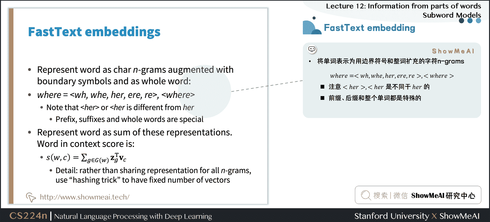

*   将单词表示为用边界符号和整词扩充的字符 n-grams

w h e r e = , w h e r e = < w h , w h e , h e r , e r e , r e > , < w h e r e > where =,where =<wh,whe,her,ere,re>,<where> where=,where=<wh,whe,her,ere,re>,<where>

*   注意 < h e r > <her> <her>、 < h e r <her <her 是不同于 h e r her her 的

    *   前缀、后缀和整个单词都是特殊的 

*   将 word 表示为这些表示的和。上下文单词得分为

S ( w , c ) = ∑ g ∈ G ( w ) Z g T V C S(w, c)=\sum g \in G(w) \mathbf{Z}_{g}^{\mathrm{T}} \mathbf{V}_{C} S(w,c)=∑g∈G(w)ZgT​VC​

*   **细节**：与其共享所有 n-grams 的表示，不如使用 `hashing trick` 来拥有固定数量的向量

*   低频罕见单词的差异收益

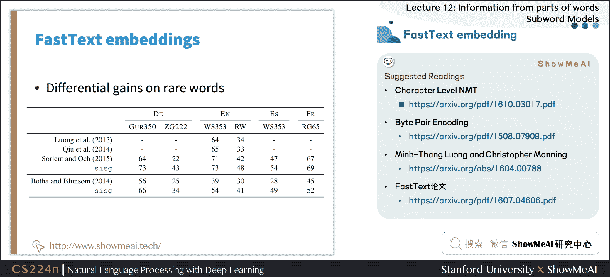

**Suggested Readings**

*   [Character Level NMT](https://arxiv.org/pdf/1610.03017.pdf)
*   [Byte Pair Encoding](https://arxiv.org/pdf/1508.07909.pdf)
*   [Minh-Thang Luong and Christopher Manning](https://arxiv.org/abs/1604.00788)
*   [FastText 论文](https://arxiv.org/pdf/1607.04606.pdf)

# 6.视频教程

可以点击 [**B 站**](https://www.bilibili.com/video/BV1Yo4y1D7FW?p=12) 查看视频的【双语字幕】版本

[`player.bilibili.com/player.html?aid=376755412&page=12`](https://player.bilibili.com/player.html?aid=376755412&page=12)

【双语字幕+资料下载】斯坦福 CS224n | 深度学习与自然语言处理(2019·全 20 讲)

# 7.参考资料

*   [本讲带学的**在线阅翻页本**](https://blog.showmeai.tech/cs224n/lecture12-Subword-Models#/)
*   [《斯坦福 CS224n 深度学习与自然语言处理》**课程学习指南**](https://blog.showmeai.tech/cs224n/)
*   [《斯坦福 CS224n 深度学习与自然语言处理》**课程大作业解析**](https://github.com/ShowMeAI-Hub/awesome-AI-courses-notes-cheatsheets/tree/main/CS224n-Natural-Language-Processing-with-Deep-Learning/assignment-solutions)
*   [【**双语字幕视频**】斯坦福 CS224n | 深度学习与自然语言处理(2019·全 20 讲)](https://www.bilibili.com/video/BV1Yo4y1D7FW)
*   [**Stanford 官网** | CS224n: Natural Language Processing with Deep Learning](https://web.stanford.edu/class/archive/cs/cs224n/cs224n.1194/)

# [**ShowMeAI**](http://www.showmeai.tech)系列教程推荐

*   [大厂技术实现 | 推荐与广告计算解决方案](http://www.showmeai.tech/tutorials/50)
*   [大厂技术实现 | 计算机视觉解决方案](http://www.showmeai.tech/tutorials/51)
*   [大厂技术实现 | 自然语言处理行业解决方案](http://www.showmeai.tech/tutorials/52)
*   [图解 Python 编程：从入门到精通系列教程](http://www.showmeai.tech/tutorials/56)
*   [图解数据分析：从入门到精通系列教程](http://www.showmeai.tech/tutorials/33)
*   [图解 AI 数学基础：从入门到精通系列教程](http://www.showmeai.tech/tutorials/83)
*   [图解大数据技术：从入门到精通系列教程](http://www.showmeai.tech/tutorials/84)
*   [图解机器学习算法：从入门到精通系列教程](http://www.showmeai.tech/tutorials/34)
*   [机器学习实战：手把手教你玩转机器学习系列](http://www.showmeai.tech/tutorials/41)
*   [深度学习教程 | 吴恩达专项课程 · 全套笔记解读](http://www.showmeai.tech/tutorials/35)
*   [自然语言处理教程 | 斯坦福 CS224n 课程 · 课程带学与全套笔记解读](http://www.showmeai.tech/tutorials/36)

# NLP 系列教程文章

*   [NLP 教程(1)- 词向量、SVD 分解与 Word2vec](http://showmeai.tech/article-detail/230)
*   [NLP 教程(2)- GloVe 及词向量的训练与评估](http://showmeai.tech/article-detail/232)
*   [NLP 教程(3)- 神经网络与反向传播](http://showmeai.tech/article-detail/234)
*   [NLP 教程(4)- 句法分析与依存解析](http://www.showmeai.tech/article-detail/237)
*   [NLP 教程(5)- 语言模型、RNN、GRU 与 LSTM](http://www.showmeai.tech/article-detail/239)
*   [NLP 教程(6)- 神经机器翻译、seq2seq 与注意力机制](http://www.showmeai.tech/article-detail/242)
*   [NLP 教程(7)- 问答系统](http://www.showmeai.tech/article-detail/245)
*   [NLP 教程(8)- NLP 中的卷积神经网络](http://www.showmeai.tech/article-detail/247)
*   [NLP 教程(9)- 句法分析与树形递归神经网络](http://www.showmeai.tech/article-detail/255)

# 斯坦福 CS224n 课程带学详解

*   [斯坦福 NLP 课程 | 第 1 讲 - NLP 介绍与词向量初步](http://showmeai.tech/article-detail/231)
*   [斯坦福 NLP 课程 | 第 2 讲 - 词向量进阶](http://showmeai.tech/article-detail/233)
*   [斯坦福 NLP 课程 | 第 3 讲 - 神经网络知识回顾](http://showmeai.tech/article-detail/235)
*   [斯坦福 NLP 课程 | 第 4 讲 - 神经网络反向传播与计算图](http://showmeai.tech/article-detail/236)
*   [斯坦福 NLP 课程 | 第 5 讲 - 句法分析与依存解析](http://www.showmeai.tech/article-detail/238)
*   [斯坦福 NLP 课程 | 第 6 讲 - 循环神经网络与语言模型](http://www.showmeai.tech/article-detail/240)
*   [斯坦福 NLP 课程 | 第 7 讲 - 梯度消失问题与 RNN 变种](http://www.showmeai.tech/article-detail/241)
*   [斯坦福 NLP 课程 | 第 8 讲 - 机器翻译、seq2seq 与注意力机制](http://www.showmeai.tech/article-detail/243)
*   [斯坦福 NLP 课程 | 第 9 讲 - cs224n 课程大项目实用技巧与经验](http://www.showmeai.tech/article-detail/244)
*   [斯坦福 NLP 课程 | 第 10 讲 - NLP 中的问答系统](http://www.showmeai.tech/article-detail/246)
*   [斯坦福 NLP 课程 | 第 11 讲 - NLP 中的卷积神经网络](http://www.showmeai.tech/article-detail/248)
*   [斯坦福 NLP 课程 | 第 12 讲 - 子词模型](http://www.showmeai.tech/article-detail/249)
*   [斯坦福 NLP 课程 | 第 13 讲 - 基于上下文的表征与 NLP 预训练模型](http://www.showmeai.tech/article-detail/250)
*   [斯坦福 NLP 课程 | 第 14 讲 - Transformers 自注意力与生成模型](http://www.showmeai.tech/article-detail/251)
*   [斯坦福 NLP 课程 | 第 15 讲 - NLP 文本生成任务](http://www.showmeai.tech/article-detail/252)
*   [斯坦福 NLP 课程 | 第 16 讲 - 指代消解问题与神经网络方法](http://www.showmeai.tech/article-detail/253)
*   [斯坦福 NLP 课程 | 第 17 讲 - 多任务学习(以问答系统为例)](http://www.showmeai.tech/article-detail/254)
*   [斯坦福 NLP 课程 | 第 18 讲 - 句法分析与树形递归神经网络](http://www.showmeai.tech/article-detail/256)
*   [斯坦福 NLP 课程 | 第 19 讲 - AI 安全偏见与公平](http://www.showmeai.tech/article-detail/257)
*   [斯坦福 NLP 课程 | 第 20 讲 - NLP 与深度学习的未来](http://www.showmeai.tech/article-detail/258)

