# 斯坦福 NLP 课程 | 第 13 讲 - 基于上下文的表征与 NLP 预训练模型(ELMo, transformer)

> 原文：[`blog.csdn.net/ShowMeAI/article/details/124622299`](https://blog.csdn.net/ShowMeAI/article/details/124622299)

作者：[韩信子](https://github.com/HanXinzi-AI)@[ShowMeAI](http://www.showmeai.tech/)，路遥@[ShowMeAI](http://www.showmeai.tech/)，奇异果@[ShowMeAI](http://www.showmeai.tech/)
[教程地址](http://www.showmeai.tech/tutorials/36)：[`www.showmeai.tech/tutorials/36`](http://www.showmeai.tech/tutorials/36)
[本文地址](http://www.showmeai.tech/article-detail/250)：[`www.showmeai.tech/article-detail/250`](http://www.showmeai.tech/article-detail/250)
声明：版权所有，转载请联系平台与作者并注明出处
收藏[ShowMeAI](http://www.showmeai.tech/)查看更多精彩内容

* * *

[ShowMeAI](http://www.showmeai.tech/)为**斯坦福 CS224n**《自然语言处理与深度学习(Natural Language Processing with Deep Learning)》课程的全部课件，做了**中文翻译和注释**，并制作成了 GIF 动图！视频和课件等资料的获取方式见**文末**。

* * *

# 引言

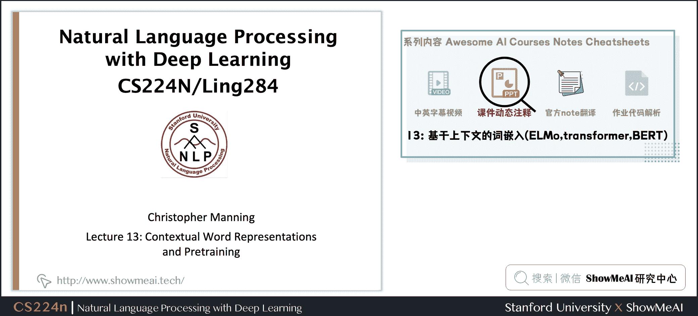

## 授课计划

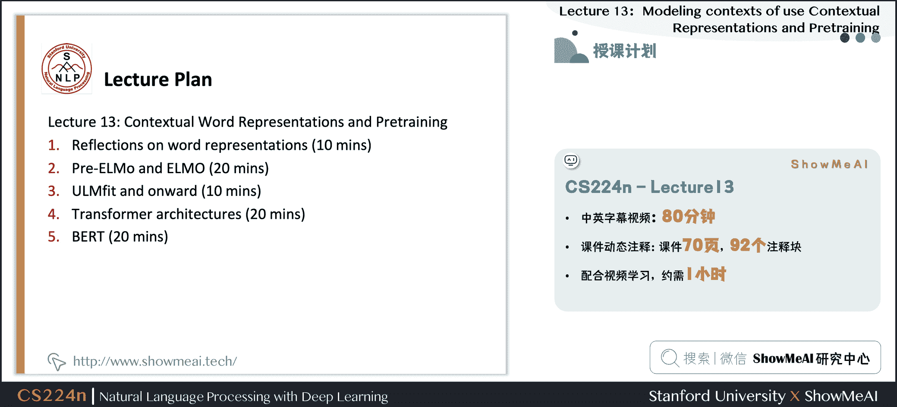

*   Reflections on word representations / **词向量知识回顾**
*   Pre-ELMo and ELMO / **ELMo 模型**
*   ULMfit and onward / **ULMfit 模型**
*   Transformer architectures / **Transformer 结构**
*   BERT / **BERT**

# 1.词向量知识回顾

## 1.1 词向量表征

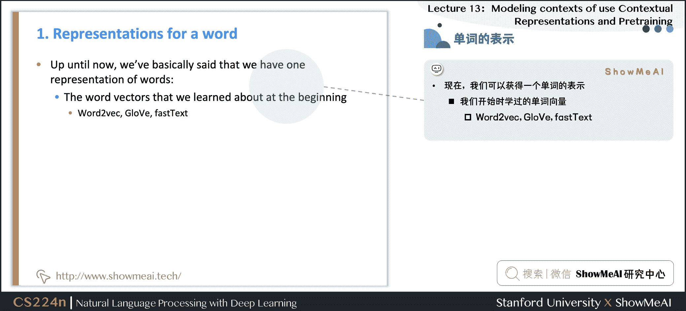

*   现在我们可以获得一个单词的表示
    *   我们开始时学过的单词向量
        *   Word2vec，GloVe，fastText

## 1.2 预训练的词向量

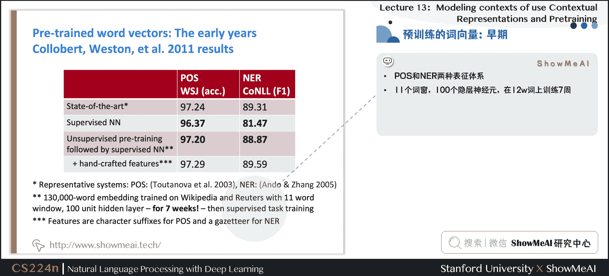

*   POS 和 NER 两种表征体系
*   11 个词窗，100 个隐层神经元，在 12w 词上训练 7 周

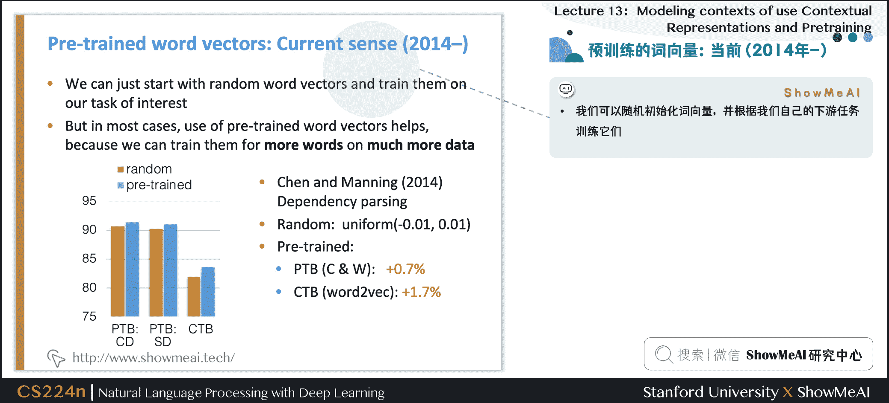

*   我们可以随机初始化词向量，并根据我们自己的下游任务训练它们
*   但在绝大多数情况下，使用预训练词向量是有帮助的，因为它们本身是自带信息的 (我们可以在更大体量的预训练语料上训练得到它们)

## 1.3 未知词的词向量应用建议

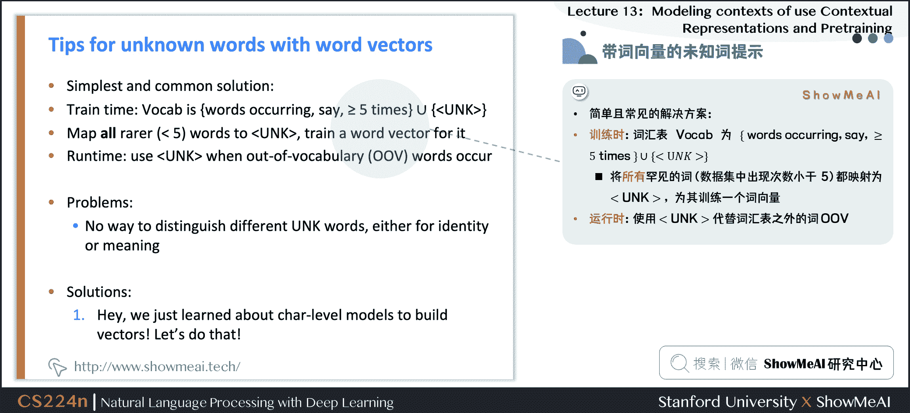

*   简单且常见的解决方案：
*   **训练时**：词汇表 {  words occurring, say,  ≥ 5  times  } ∪ { < UNK > } \{\text { words occurring, say, } \geq 5 \text { times }\} \cup\{<\text{UNK}>\} { words occurring, say, ≥5 times }∪{<UNK>}

    *   将**所有**罕见的词 (数据集中出现次数小于 5) 都映射为 < UNK > <\text{UNK}> <UNK>，为其训练一个词向量 
*   **运行时**：使用 < UNK > <\text{UNK}> <UNK> 代替词汇表之外的词 OOV

*   **问题**：
    *   没有办法区分不同 UNK words，无论是身份还是意义

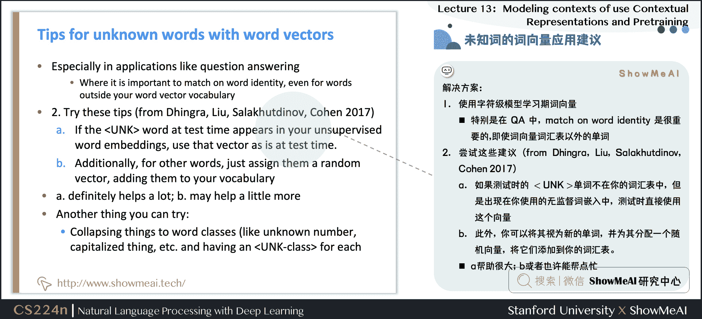

**解决方案**

1.  **使用字符级模型学习词向量**

*   特别是在 QA 中，match on word identity 是很重要的，即使词向量词汇表以外的单词

2.  **尝试这些建议** (from Dhingra, Liu, Salakhutdinov, Cohen 2017)

*   如果测试时的 < UNK > <\text{UNK}> <UNK> 单词不在你的词汇表中，但是出现在你使用的无监督词嵌入中，测试时直接使用这个向量
*   此外，你可以将其视为新的单词，并为其分配一个随机向量，将它们添加到你的词汇表
*   帮助很大或者也许能帮点忙

*   你可以试试另一件事
    *   将它们分解为词类 (如未知号码，大写等等)，每种都对应一个 < UNK-class > <\text{UNK-class}> <UNK-class>

## 1.4 单词的表示

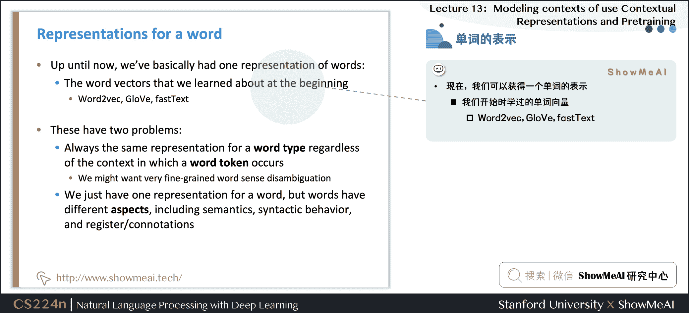

**存在两个大问题**

*   对于一个 word type 总是是用相同的表示，不考虑这个 word token 出现的上下文
    *   我们可以进行非常细粒度的词义消歧
*   我们对一个词只有一种表示，但是单词有不同的方面，包括语义，句法行为，以及表达 / 含义

## 1.5 我们一直都有解决这个问题的办法吗？

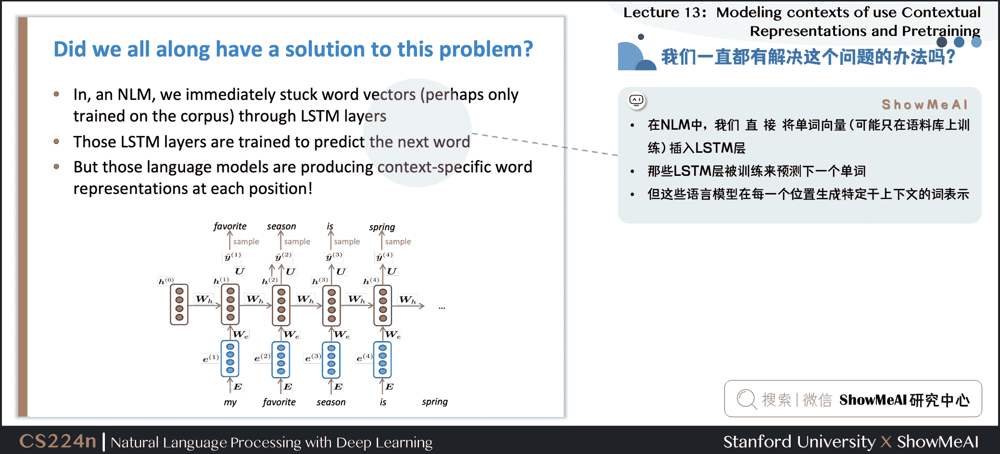

*   在 NLM 中，我们直接将单词向量 (可能只在语料库上训练) 插入 LSTM 层
*   那些 LSTM 层被训练来预测下一个单词
*   但这些语言模型在每一个位置生成特定于上下文的词表示

## 1.6 #论文解读#

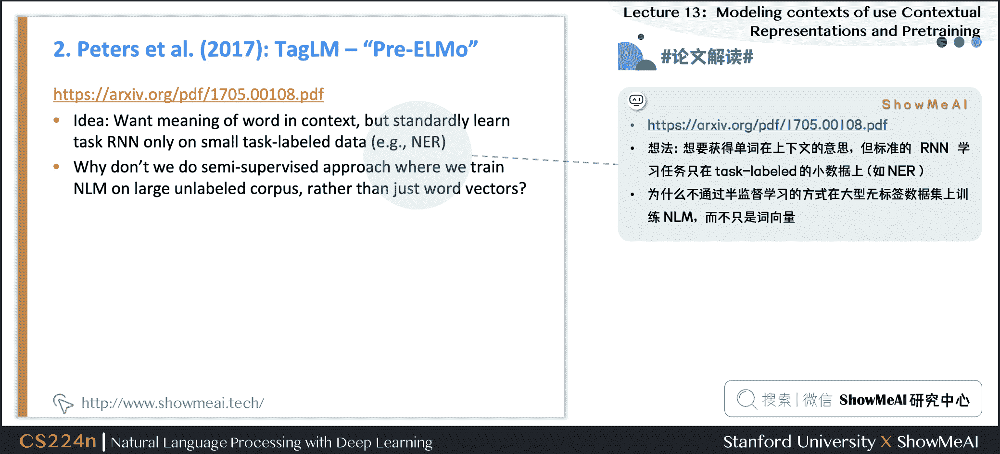

*   [Semi-supervised sequence tagging with bidirectional language models](https://arxiv.org/pdf/1705.00108.pdf)
*   **想法**：想要获得单词在上下文的意思，但标准的 RNN 学习任务只在 task-labeled 的小数据上 (如 NER )
*   为什么不通过半监督学习的方式在大型无标签数据集上训练 NLM，而不只是词向量

## 1.7 标签语言模型 (Tag LM )

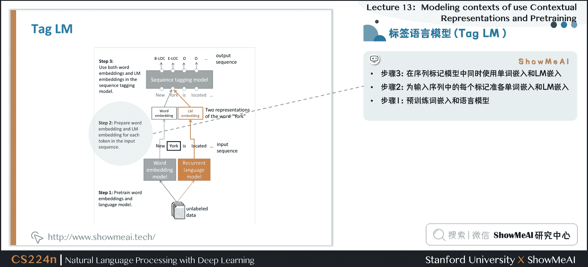

*   **步骤 3**：在序列标记模型中同时使用单词嵌入和 LM 嵌入
*   **步骤 2**：为输入序列中的每个标记准备单词嵌入和 LM 嵌入
*   **步骤 1**：预训练词嵌入和语言模型

*   与上文无关的单词嵌入 + RNN model 得到的 hidden states 作为特征输入

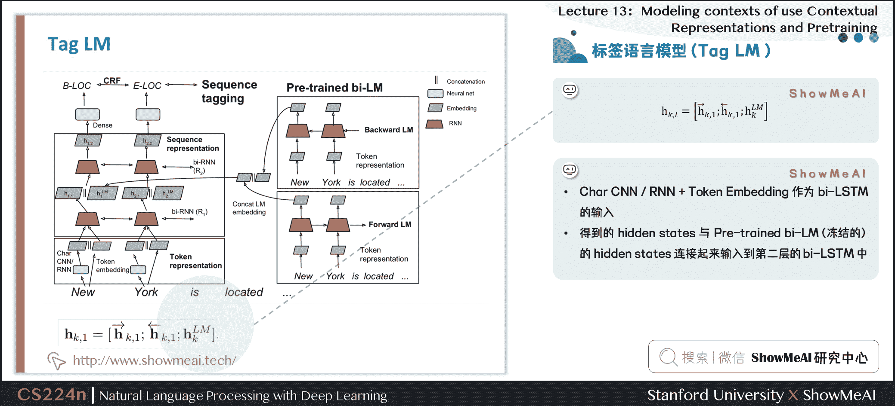

h k , l = [ h → k , 1 ; h ← k , 1 ; h k L M ] \mathbf{h}_{k, l}=\left[\overrightarrow{\mathbf{h}}_{k, 1} ; \overleftarrow{\mathbf{h}}_{k, 1} ; \mathbf{h}_{k}^{L M}\right] hk,l​=[h k,1​;h k,1​;hkLM​]

*   Char CNN / RNN + Token Embedding 作为 bi-LSTM 的输入
*   得到的 hidden states 与 Pre-trained bi-LM (冻结的) 的 hidden states 连接起来输入到第二层的 bi-LSTM 中

## 1.8 命名实体识别 (NER)

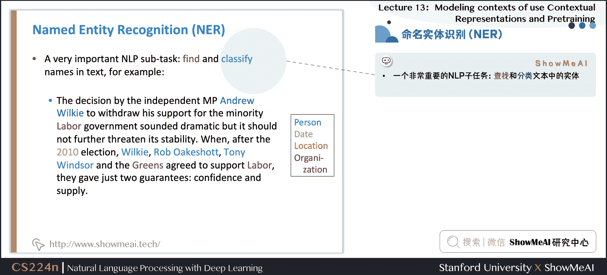

*   一个非常重要的 NLP 子任务：**查找**和**分类**文本中的实体

## 1.9 CoNLL 2003 命名实体识别 (en news testb)

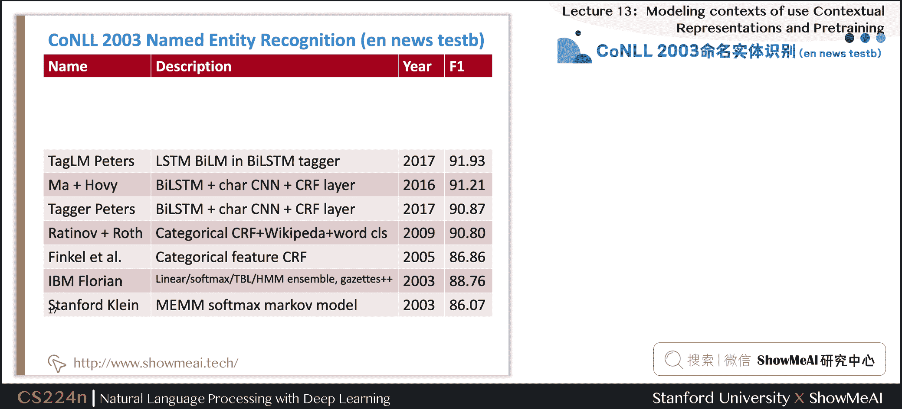

## 1.10 #论文解读#

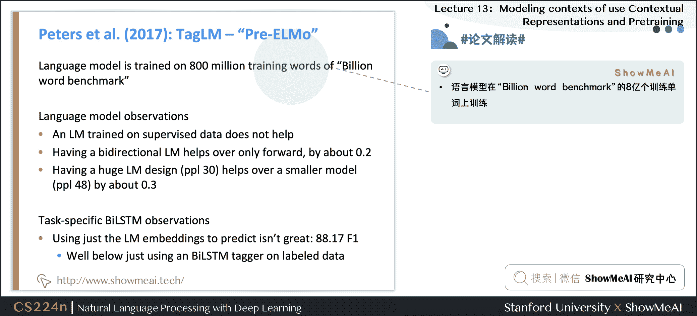

*   语言模型在 `Billion word benchmark` 的 8 亿个训练单词上训练

**语言模型观察结果**

*   在监督数据集上训练的语言模型并不会受益
*   双向语言模型仅有助于 forward 过程，提升约 0.2
*   具有巨大的语言模型设计 (困惑度 30) 比较小的模型 (困惑度 48) 提升约 0.3

**任务特定的 BiLSTM 观察结果**

*   仅使用 LM 嵌入来预测并不是很好：88.17 F1
    *   远低于仅在标记数据上使用 BiLSTM 标记器

## 1.11 #论文解读#

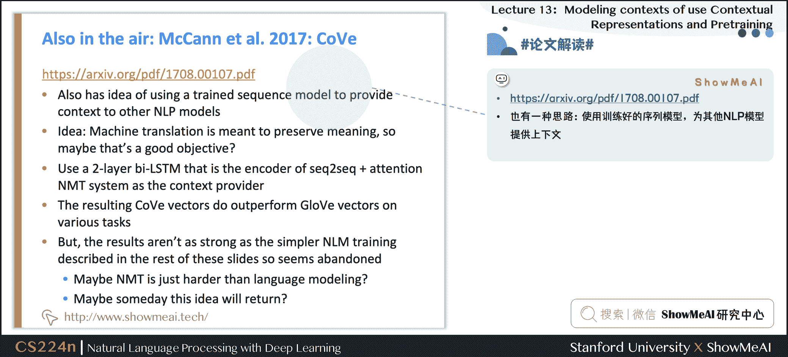

*   https://arxiv.org/pdf/1708.00107.pdf
*   也有一种思路：使用训练好的序列模型，为其他 NLP 模型提供上下文

*   **思路**：机器翻译是为了保存意思，所以这也许是个好目标？
*   使用 seq2seq + attention NMT system 中的 Encoder，即 2 层 bi-LSTM，作为上下文提供者
*   所得到的 CoVe 向量在各种任务上都优于 GloVe 向量
*   但是，结果并不像其他幻灯片中描述的更简单的 NLM 训练那么好，所以似乎被放弃了
    *   也许 NMT 只是比语言建模更难？
    *   或许有一天这个想法会回来？

# 2.ELMo 模型

## 2.1 #论文解读#ELMo

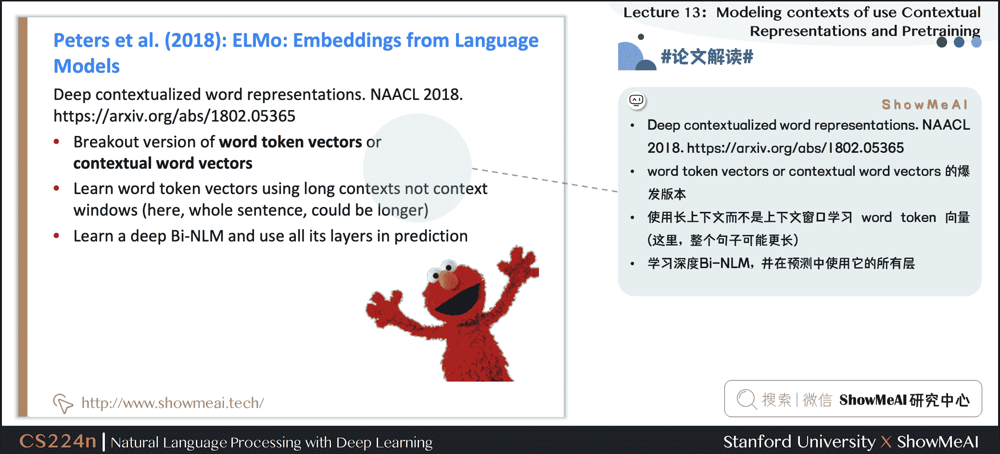

*   [Deep contextualized word representations. NAACL 2018.](https://arxiv.org/abs/1802.05365)
*   word token vectors or contextual word vectors 的爆发版本
*   使用长上下文而不是上下文窗口学习 word token 向量 (这里，整个句子可能更长)
*   学习深度 Bi-NLM，并在预测中使用它的所有层

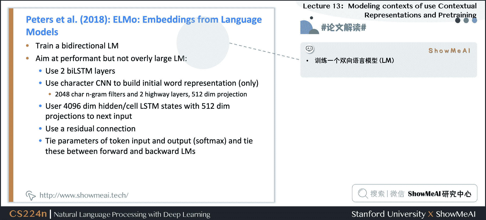

*   训练一个双向语言模型 (LM)

*   目标是效果 OK 但不要太大的语言模型 (LM)
    *   使用 2 个 biLSTM 层
    *   (仅) 使用字符 CNN 构建初始单词表示
        *   2048 个 char n-gram filters 和 2 个 highway layers，512 维的 projection
    *   4096 dim hidden/cell LSTM 状态，使用 512 dim 的对下一个输入的投影
    *   使用残差连接
    *   绑定 token 的输入和输出的参数 (softmax)，并将这些参数绑定到正向和反向语言模型 (LM) 之间

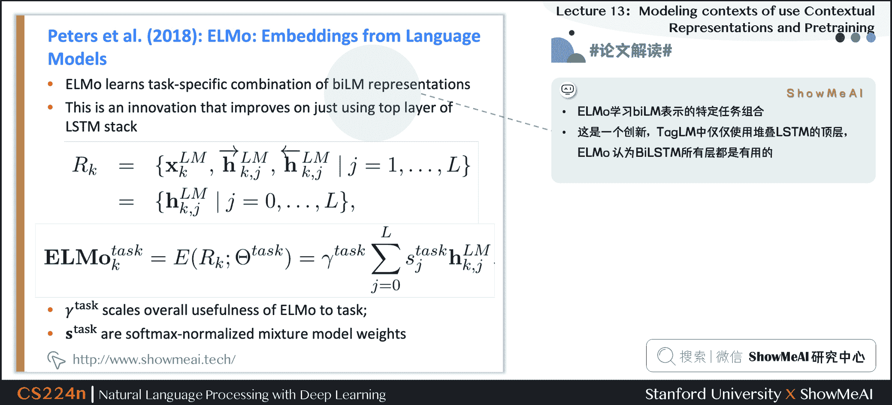

*   ELMo 学习 biLM 表示的特定任务组合
*   这是一个创新，TagLM 中仅仅使用堆叠 LSTM 的顶层，ELMo 认为 BiLSTM 所有层都是有用的

R k = { x k L M , h → k , j L M , h ← k , j L M ∣ j = 1 , … , L } = { h k , j L M ∣ j = 0 , … , L } \begin{aligned} R_{k} &=\left\{\mathbf{x}_{k}^{L M}, \overrightarrow{\mathbf{h}}_{k, j}^{L M}, \overleftarrow{\mathbf{h}}_{k, j}^{L M} \mid j=1, \ldots, L\right\} \\ &=\left\{\mathbf{h}_{k, j}^{L M} \mid j=0, \ldots, L\right\} \end{aligned} Rk​​={xkLM​,h k,jLM​,h k,jLM​∣j=1,…,L}={hk,jLM​∣j=0,…,L}​

E L M o k t a s k = E ( R k ; Θ t a s k ) = γ t a s k ∑ j = 0 L s j t a s k h k , j L M \mathbf{E} \mathbf{L} \mathbf{M} \mathbf{o}_{k}^{t a s k}=E\left(R_{k} ; \Theta^{t a s k}\right)=\gamma^{t a s k} \sum_{j=0}^{L} s_{j}^{t a s k} \mathbf{h}_{k, j}^{L M} ELMoktask​=E(Rk​;Θtask)=γtaskj=0∑L​sjtask​hk,jLM​

*   γ t a s k \gamma^{task} γtask 衡量 ELMo 对任务的总体有用性，是为特定任务学习的全局比例因子

*   s t a s k \mathbf{s}^{task} stask 是 softmax 归一化的混合模型权重，是 BiLSTM 的加权平均值的权重，对不同的任务是不同的，因为不同的任务对不同层的 BiLSTM 的

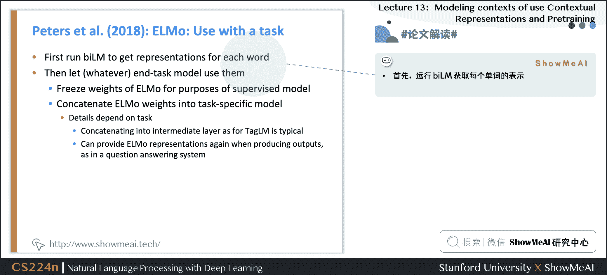

*   首先运行 biLM 获取每个单词的表示

*   然后，让 (无论什么) 最终任务模型使用它们
    *   冻结 ELMo 的权重，用于监督模型
    *   将 ELMo 权重连接到特定于任务的模型中
        *   细节取决于任务
            *   像 TagLM 一样连接到中间层是典型的
            *   可以在生产输出时提供更多的表示，例如在问答系统中

## 2.2 ELMo 在序列标记器中的使用

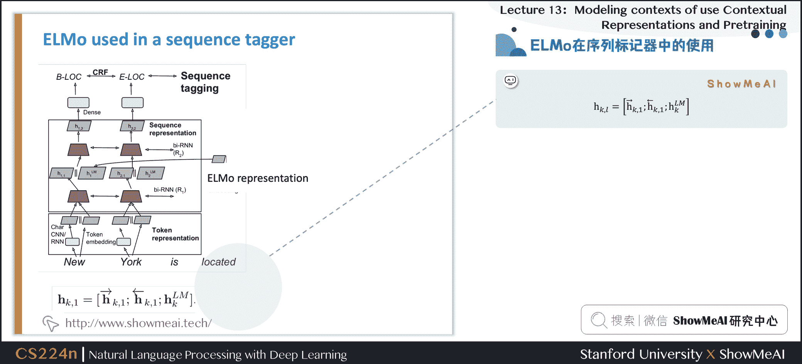

## 2.3 CoNLL 2003 命名实体识别 (en news testb)

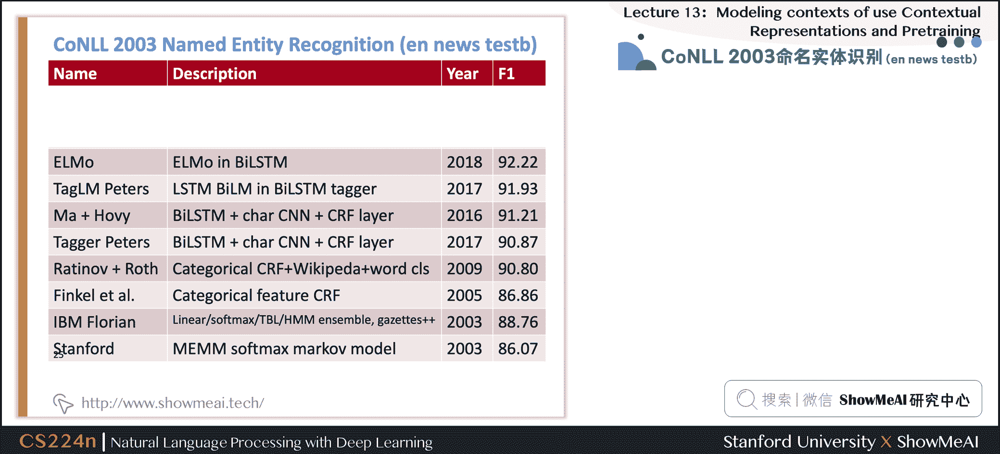

## 2.4 ELMo 结果：适用于所有任务

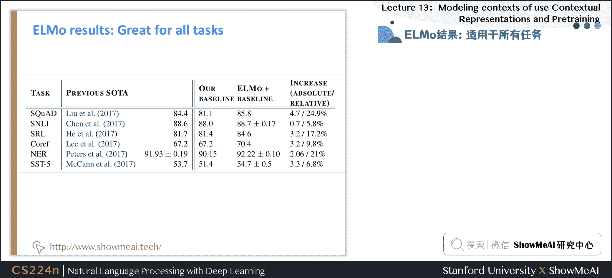

## 2.5 ELMo ：层权重

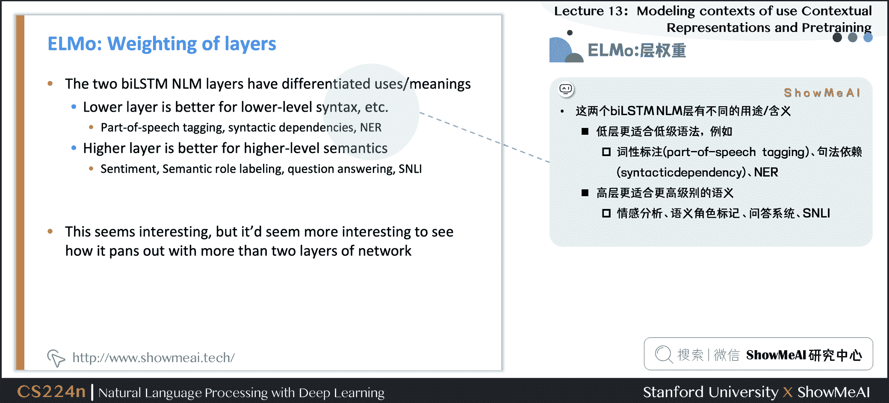

*   这两个 biLSTM NLM 层有不同的用途 / 含义
    *   低层更适合低级语法，例如
        *   词性标注(part-of-speech tagging)、句法依赖(syntactic dependency)、NER
    *   高层更适合更高级别的语义
        *   情绪、语义角色标记、问答系统、SNLI

*   这似乎很有趣，但它是如何通过两层以上的网络来实现的看起来更有趣

# 3.ULMfit 模型

## 3.1 ULMfit

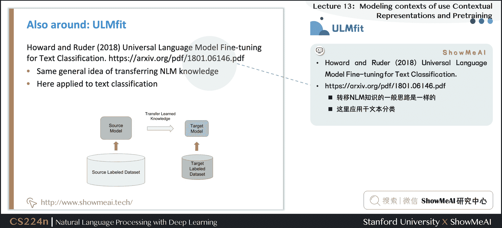

*   [Howard and Ruder (2018) Universal Language Model Fine-tuning for Text Classification.](https://arxiv.org/pdf/1801.06146.pdf)
    *   转移 NLM 知识的一般思路是一样的
    *   这里应用于文本分类

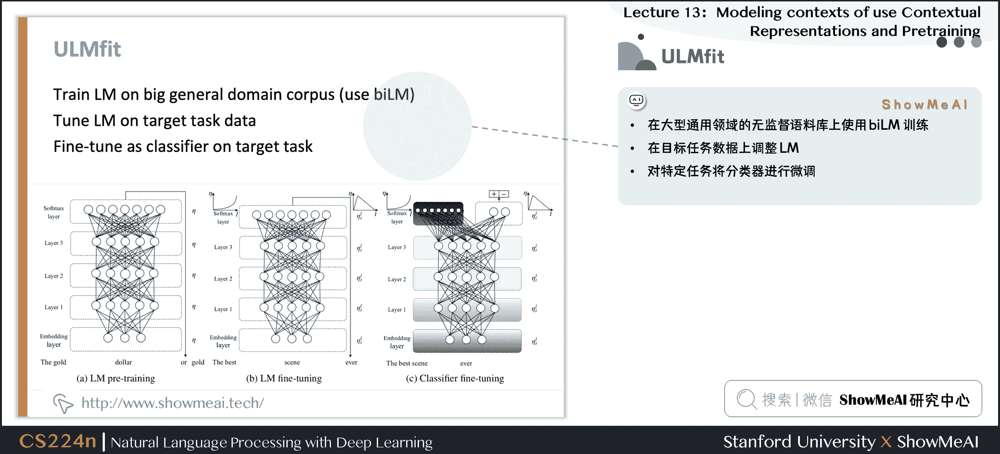

*   在大型通用领域的无监督语料库上使用 biLM 训练
    *   在目标任务数据上调整 LM
    *   对特定任务将分类器进行微调

*   使用合理大小的 `1 GPU` 语言模型，并不是真的很大

*   **在 LM 调优中要注意很多 **
    *   不同的每层学习速度
    *   倾斜三角形学习率 (STLR) 计划

*   学习分类器时逐步分层解冻和 STLR

*   使用 [ h T , maxpool ⁡ ( h ) , meanpool ⁡ ( h ) ] \left[h_{T}, \operatorname{maxpool}(\mathbf{h}), \operatorname{meanpool}(\mathbf{h})\right] [hT​,maxpool(h),meanpool(h)] 进行分类

*   使用大型的预训练语言模型，是一种提高性能的非常有效的方法

## 3.2 ULMfit 性能

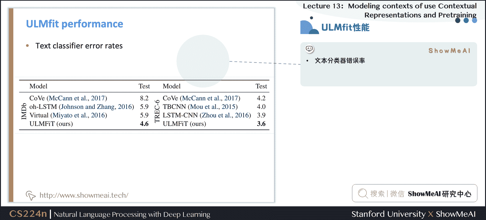

*   文本分类器错误率

## 3.3 ULMfit 迁移学习

*   迁移学习

## 3.4 让我们扩大规模

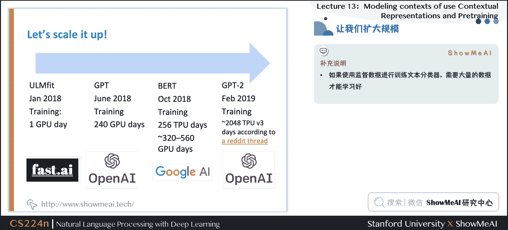

**补充说明**

*   如果使用监督数据进行训练文本分类器，需要大量的数据才能学习好

## 3.5 GPT-2 语言模型(cherry-picked)输出

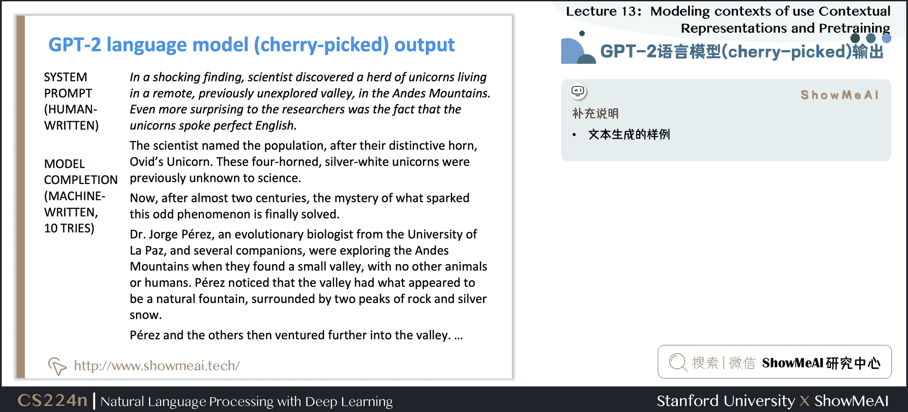

**补充说明**

*   文本生成的样例

## 3.6 GPT-2 语言模型(cherry-picked)输出

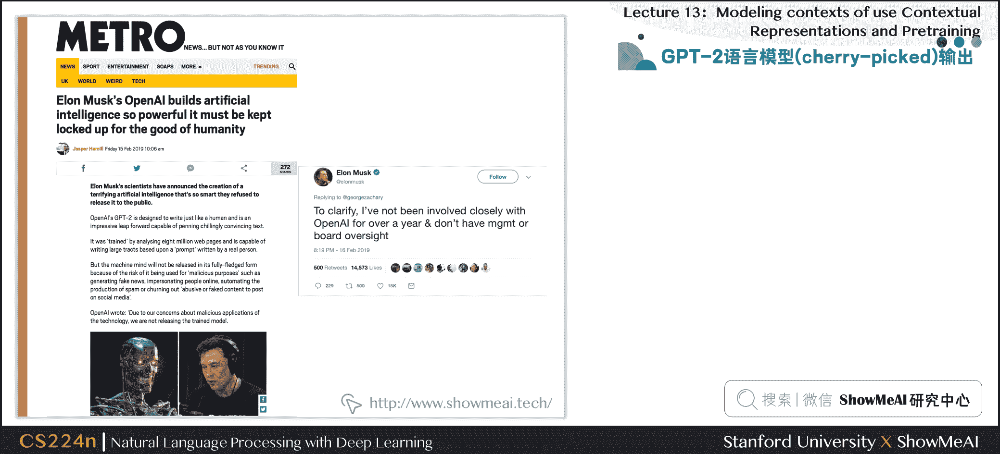

# 4.Transformer 结构

## 4.1 Transformer 介绍

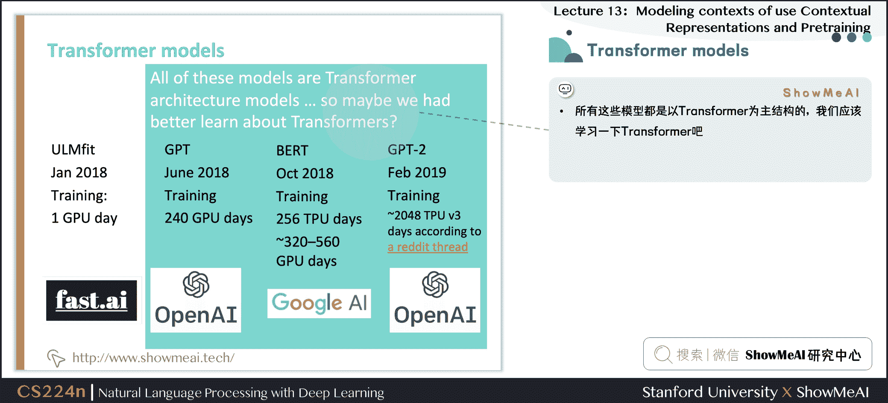

*   所有这些模型都是以 Transformer 为主结构的，我们应该学习一下 Transformer 吧

**补充说明**

*   Transformer 不仅很强大，而且允许扩展到更大的尺寸

## 4.2 Transformers 动机

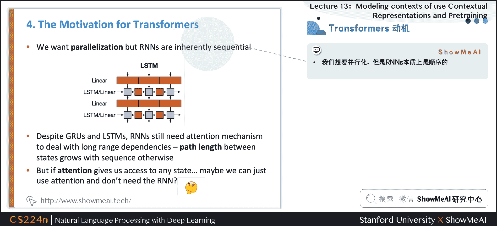

*   我们想要并行化，但是 RNNs 本质上是顺序的

*   尽管有 GRUs 和 LSTMs，RNNs 仍然需要注意机制来处理长期依赖关系——否则状态之间的 path length **路径长度** 会随着序列增长
*   但如果注意力让我们进入任何一个状态……也许我们可以只用注意力而不需要 RNN?

## 4.3 Transformer 概览

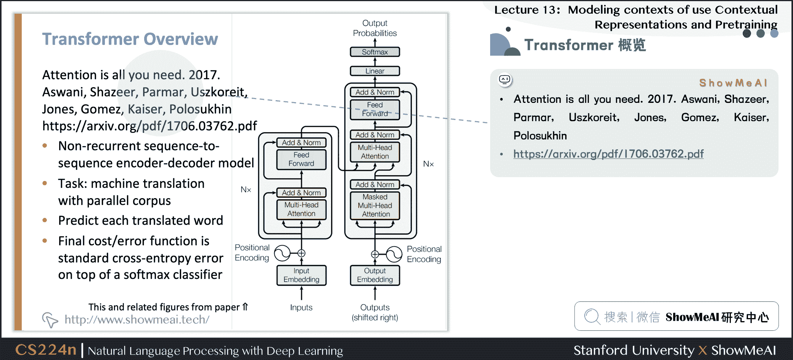

*   [Attention is all you need. 2017\. Aswani, Shazeer, Parmar, Uszkoreit, Jones, Gomez, Kaiser, Polosukhin](https://arxiv.org/pdf/1706.03762.pdf)

*   序列到序列编码解码模型，但它是非循环非串行结构
*   **任务**：平行语料库的机器翻译
*   预测每个翻译单词
*   最终成本/误差函数是 softmax 分类器基础上的标准交叉熵误差

## 4.4 Transformer 基础

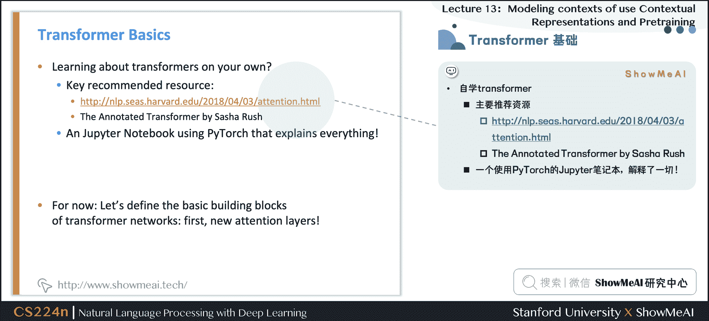

*   **自学 transformer**
    *   主要推荐资源
        *   http://nlp.seas.harvard.edu/2018/04/03/attention.html
        *   The Annotated Transformer by Sasha Rush
    *   一个使用 PyTorch 的 Jupyter 笔记本，解释了一切！

*   现在：我们定义 Transformer 网络的基本构建块：第一，新的注意力层

## 4.5 点乘注意力 Dot-Product Attention

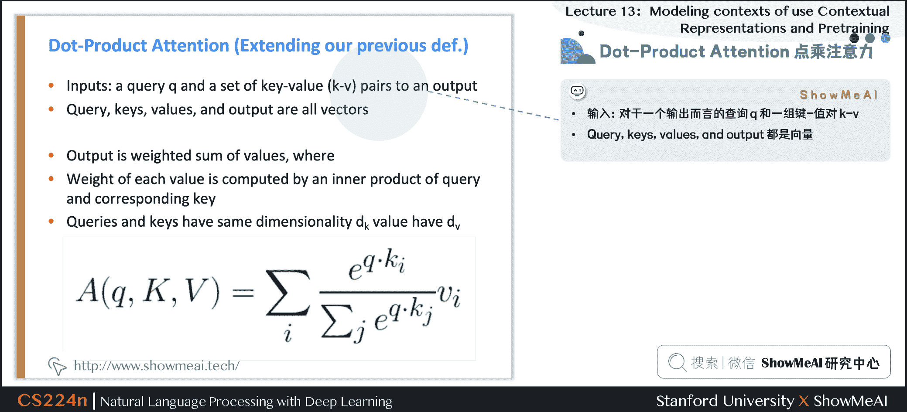

*   **输入**：对于一个输出而言的查询 q q q 和一组键-值对 ( k − v k-v k−v)
*   Query，keys，values，and output 都是向量

*   输出值的加权和
*   权重的每个值是由查询和相关键的内积计算结果
*   Query 和 keys 有相同维数 d k d_k dk​，value 的维数为 d v d_v dv​

A ( q , K , V ) = ∑ i e q ⋅ k i ∑ j e q ⋅ k j v i A(q, K, V)=\sum_{i} \frac{e^{q \cdot k_{i}}}{\sum_{j} e^{q \cdot k_{j}}} v_{i} A(q,K,V)=i∑​∑j​eq⋅kj​eq⋅ki​​vi​

## 4.6 点乘注意力矩阵表示法

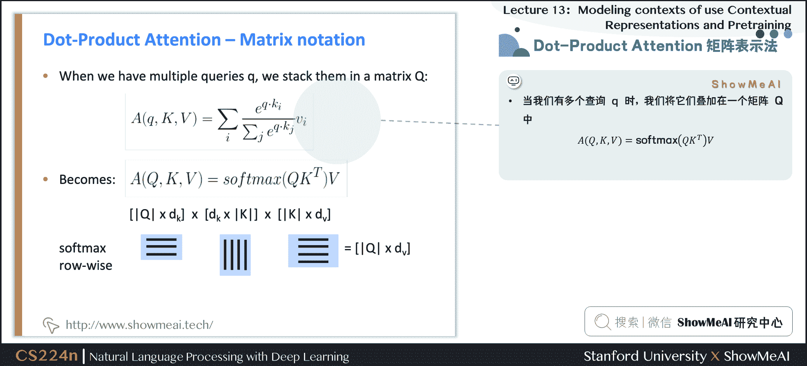

*   当我们有多个查询 q q q 时，我们将它们叠加在一个矩阵 Q Q Q 中

A ( Q , K , V ) = softmax ⁡ ( Q K T ) V A(Q, K, V)=\operatorname{softmax}\left(Q K^{T}\right) V A(Q,K,V)=softmax(QKT)V

## 4.7 缩放点乘注意力

*   **问题**： d k d_k dk​ 变大时， q T k q^Tk qTk 的方差增大 → 一些 softmax 中的值的方差将会变大 → softmax 得到的是峰值 → 因此梯度变小了

*   **解决方案**：通过 query / key 向量的长度进行缩放

A ( Q , K , V ) = softmax ⁡ ( Q K T d k ) V A(Q, K, V)=\operatorname{softmax}\left(\frac{Q K^{T}}{\sqrt{d_{k}}}\right) V A(Q,K,V)=softmax(dk​  ​QKT​)V

## 4.8 编码器中的自注意力

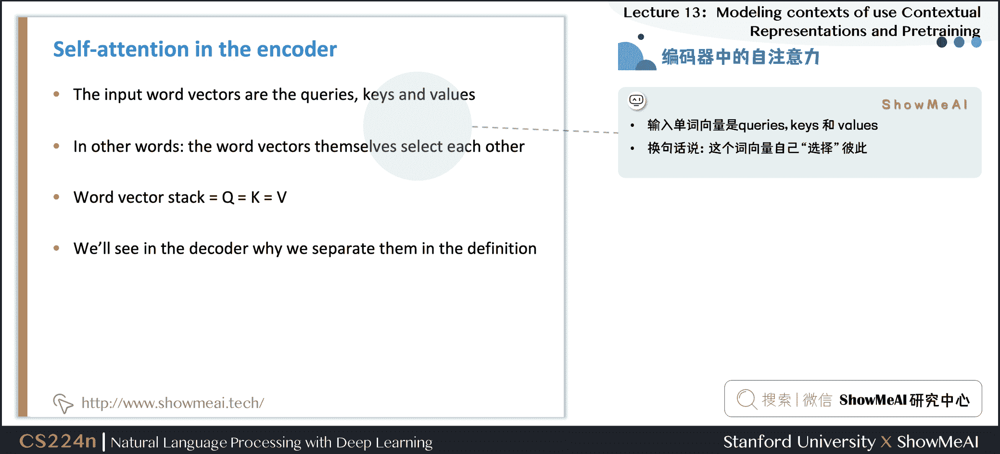

*   输入单词向量是 queries，keys and values
*   换句话说：**这个词向量自己选择彼此**

*   词向量堆栈= Q = K = V
*   我们会通过解码器明白为什么我们在定义中将他们分开

## 4.9 多头注意力

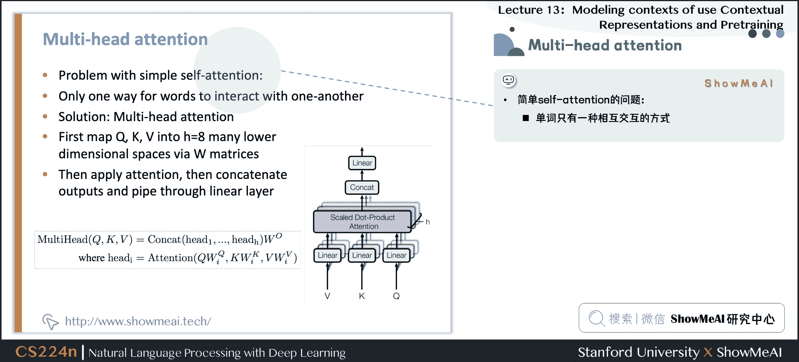

*   简单 self-attention 的问题
    *   单词只有一种相互交互的方式

*   **解决方案**：**多头注意力**
*   首先，通过矩阵 W W W 将 Q Q Q， K K K， V V V 映射到 h = 8 h = 8 h=8 的许多低维空间
*   然后，应用注意力，然后连接输出，通过线性层

MultiHead ( Q , K , V ) = Concat(head 1 , … ,  head  h ) \text {MultiHead}(\boldsymbol{Q}, \boldsymbol{K}, \boldsymbol{V})=\text {Concat(head}_{1}, \ldots, \text { head }_{h}) MultiHead(Q,K,V)=Concat(head1​,…, head h​)

where head i = Attention ( Q W i Q , K W i K , V W i V ) \text {where head}_{i}=\text {Attention}\left(Q W_{i}^{Q}, K W_{i}^{K}, V W_{i}^{V}\right) where headi​=Attention(QWiQ​,KWiK​,VWiV​)

## 4.10 完整的 transformer 模块

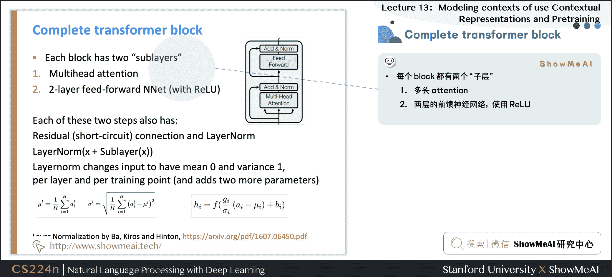

*   每个 Block 都有两个 `子层`
    *   多头 attention
    *   两层的前馈神经网络，使用 ReLU

*   这两个子层都
    *   残差连接以及层归一化
    *   LayerNorm(x+Sublayer(x))
    *   层归一化将输入转化为均值是 0 0 0，方差是 1 1 1，每一层和每一个训练点 (并且添加了两个参数)

μ l = 1 H ∑ i = 1 H a i l σ l = 1 H ∑ i = 1 H ( a i l − μ l ) 2 h i = f ( g i σ i ( a i − μ i ) + b i ) \mu^{l}=\frac{1}{H} \sum_{i=1}^{H} a_{i}^{l} \quad \sigma^{l}=\sqrt{\frac{1}{H} \sum_{i=1}^{H}\left(a_{i}^{l}-\mu^{l}\right)^{2}} \quad h_{i}=f\left(\frac{g_{i}}{\sigma_{i}}\left(a_{i}-\mu_{i}\right)+b_{i}\right) μl=H1​i=1∑H​ail​σl=H1​i=1∑H​(ail​−μl)2  ​hi​=f(σi​gi​​(ai​−μi​)+bi​)

*   Layer Normalization by Ba, Kiros and Hinton,
*   https://arxiv.org/pdf/1607.06450.pdf

## 4.11 编码器输入

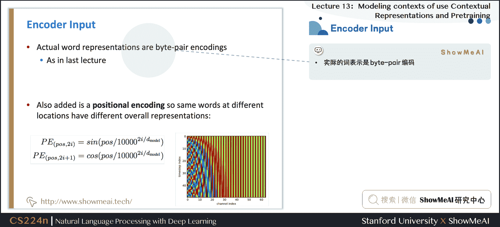

*   实际的词表示是 byte-pair 编码

*   还添加了一个 positional encoding 位置编码，相同的词语在不同的位置有不同的整体表征

{ P E ( p o s , 2 i ) = sin ⁡ ( p o s / 1000 0 2 i / d m o d e l ) P E ( pos , 2 i + 1 ) = cos ⁡ ( p o s / 1000 0 2 i / d m o d e l ) \begin{aligned} \begin{cases} PE(pos, 2i)=\sin \left(pos / 10000^{2 i / d_{model}}\right) \\ PE(\text {pos}, 2 i+1)=\cos \left(pos / 10000^{2 i / d_{model}}\right) \end{cases} \end{aligned} {PE(pos,2i)=sin(pos/100002i/dmodel​)PE(pos,2i+1)=cos(pos/100002i/dmodel​)​​

## 4.12 完整编码器 Encoder

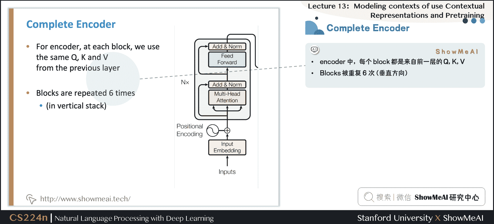

*   encoder 中，每个 Block 都是来自前一层的 Q Q Q， K K K， V V V
*   Blocks 被重复 6 次 (垂直方向)

*   在每个阶段，你可以通过多头注意力看到句子中的各个地方，累积信息并将其推送到下一层。在任一方向上的序列逐步推送信息来计算感兴趣的值
*   非常善于学习语言结构

## 4.13 第 5 层的注意力可视化

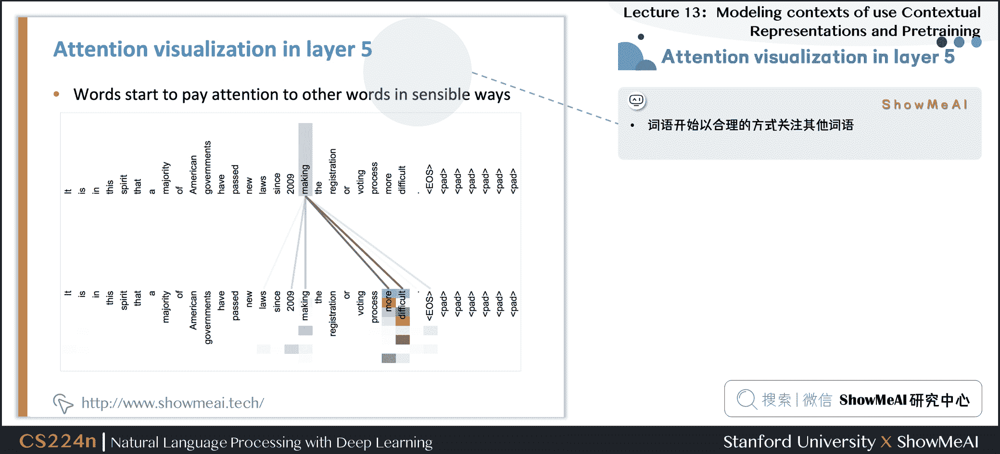

*   词语开始以合理的方式关注其他词语
*   不同的颜色对应不同的注意力头

## 4.14 注意力可视化

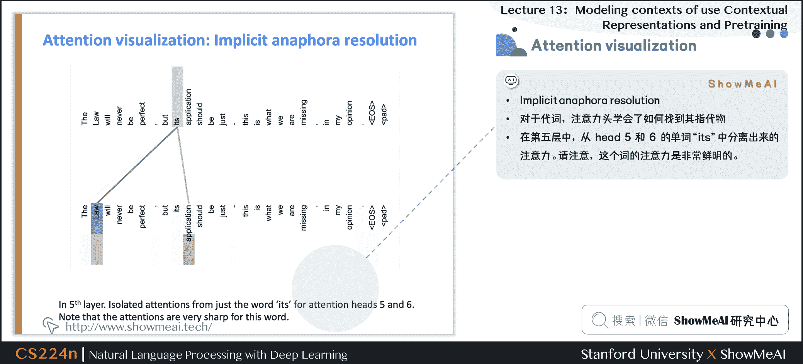

*   Implicit anaphora resolution
*   对于代词，注意力头学会了如何找到其指代物
*   在第五层中，从 head 5 和 6 的单词 `its` 中分离出来的注意力。请注意，这个词的注意力是非常鲜明的。

## 4.15 Transformer 解码器

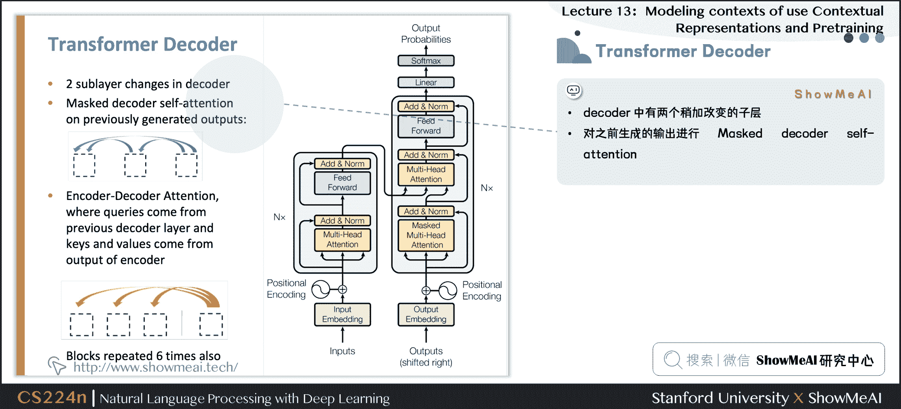

*   decoder 中有两个稍加改变的子层
*   对之前生成的输出进行 Masked decoder self-attention

*   Encoder-Decoder Attention，queries 来自于前一个 decoder 层，keys 和 values 来自于 encoder 的输出

*   Blocks 同样重复 6 次

## 4.16 Transformer 的技巧与建议

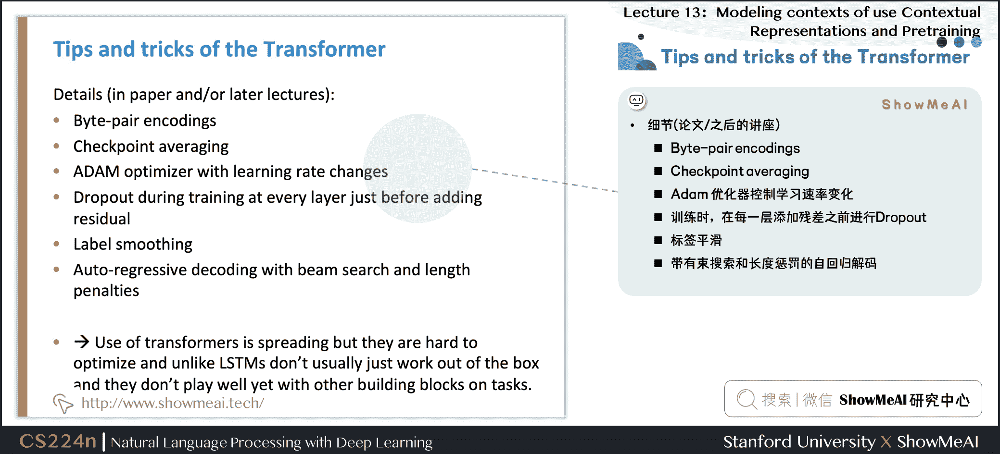

**细节**(论文/之后的讲座)

*   Byte-pair encodings
*   Checkpoint averaging
*   Adam 优化器控制学习速率变化
*   训练时，在每一层添加残差之前进行 Dropout
*   标签平滑
*   带有束搜索和长度惩罚的自回归解码

*   因为 transformer 正在蔓延，但他们很难优化并且不像 LSTMs 那样开箱即用，他们还不能很好与其他任务的构件共同工作

## 4.17 Transformer 机器翻译实验结果

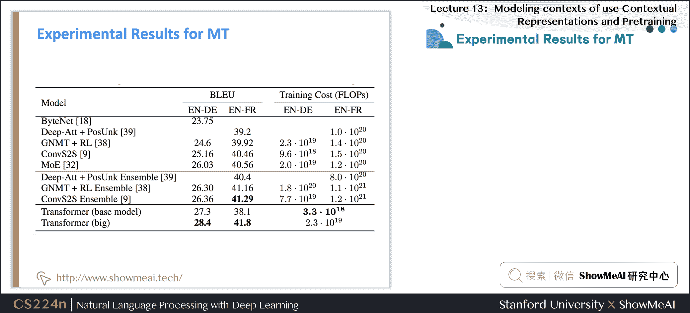

## 4.18 Transformer 解析任务实验结果

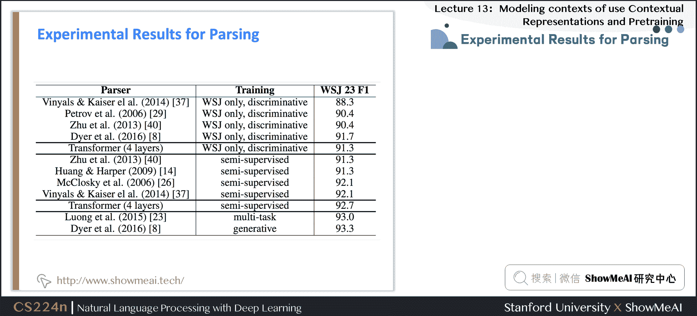

# 5.BERT 模型

## 5.1 #论文解读# BERT

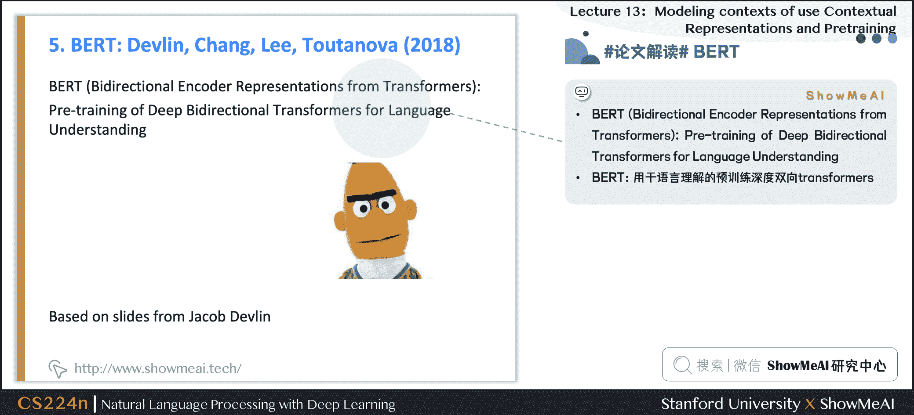

*   BERT (Bidirectional Encoder Representations from Transformers): [Pre-training of Deep Bidirectional Transformers for Language Understanding](https://arxiv.org/abs/1810.04805)
*   BERT：用于语言理解的预训练深度双向 transformers

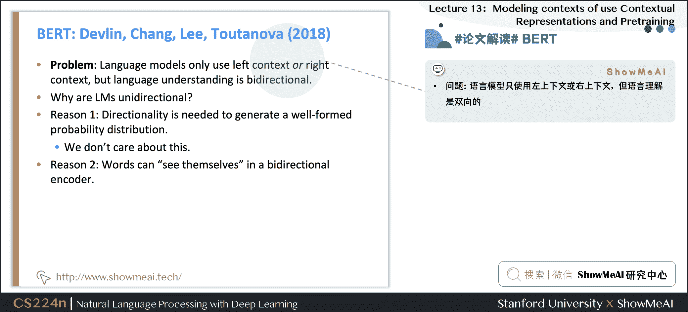

*   问题：语言模型只使用左上下文或右上下文，但语言理解是双向的

*   为什么 LMs 是单向的？
    *   **原因 1**：方向性对于生成格式良好的概率分布是有必要的 [我们不在乎这个]
    *   **原因 2**：双向编码器中单词可以 `看到自己`

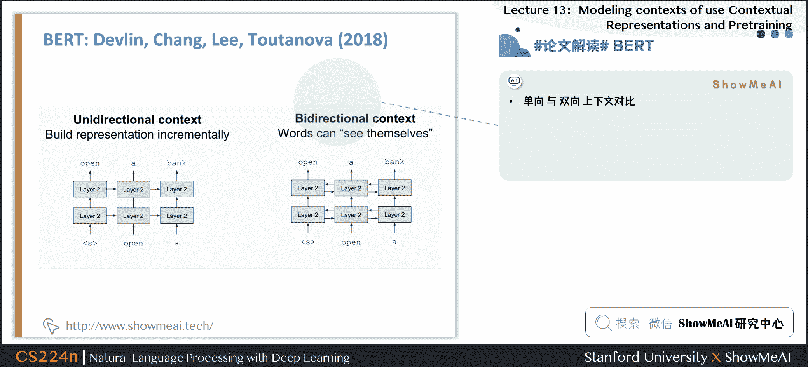

*   单向 与 双向 上下文对比

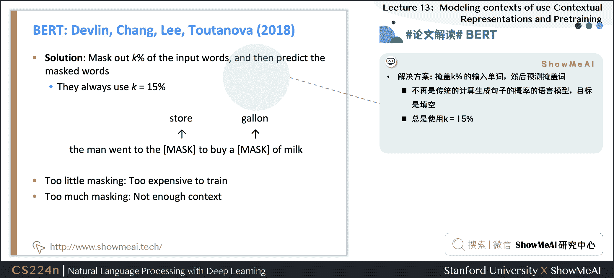

*   解决方案：掩盖 k % k \% k% 的输入单词，然后预测 masked words
*   不再是传统的计算生成句子的概率的语言模型，目标是填空
    *   总是使用 k = 15 % k = 15 \% k=15%

*   Masking 太少：训练太昂贵
*   Masking 太多：没有足够的上下文

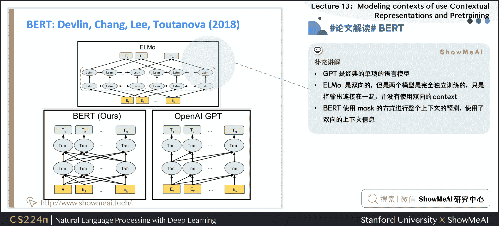

*   **GPT** 是经典的单项的语言模型
*   **ELMo** 是双向的，但是两个模型是完全独立训练的，只是将输出连接在一起，并没有使用双向的 context
*   **BERT** 使用 mask 的方式进行整个上下文的预测，使用了双向的上下文信息

## 5.2 BERT 训练任务：预测下一句

*   学习句子之间的关系，判断句子 B 是句子 A 的后一个句子还是一个随机的句子。

## 5.3 BERT 句对编码

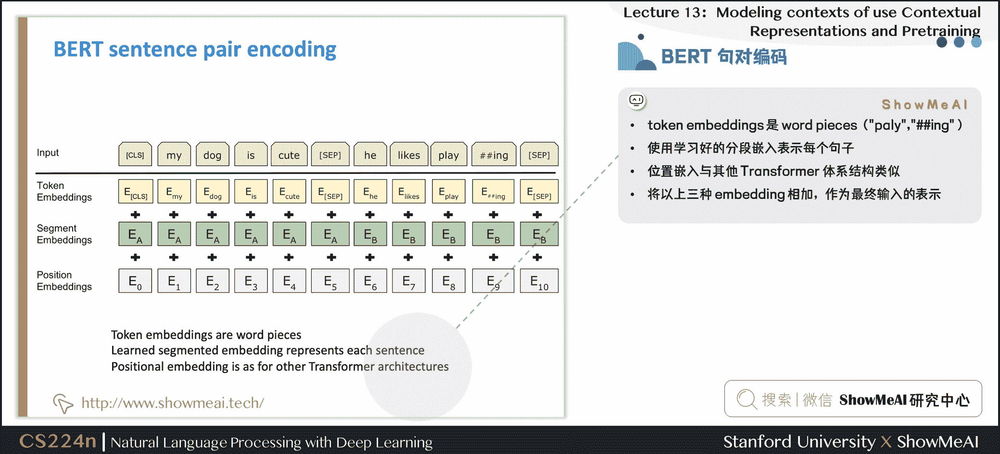

*   token embeddings 是 word pieces (paly, ##ingpaly, ##ing)
*   使用学习好的分段嵌入表示每个句子
*   位置嵌入与其他 Transformer 体系结构类似
*   将以上三种 embedding 相加，作为最终输入的表示

## 5.4 BERT 模型结构与训练

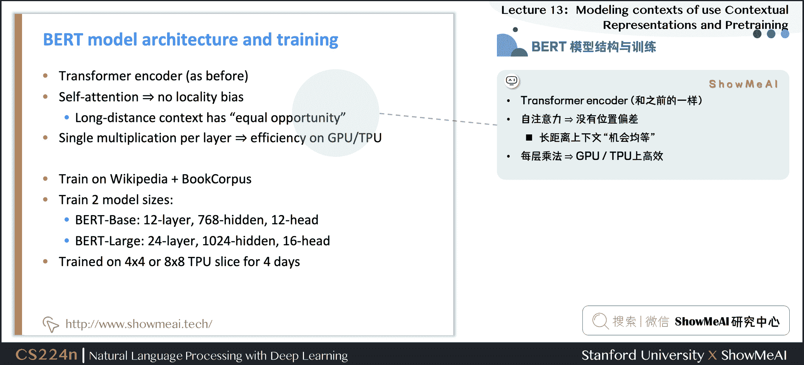

*   Transformer encoder (和之前的一样)
*   自注意力 ⇒ 没有位置偏差
    *   长距离上下文 `机会均等`
*   每层乘法 ⇒ GPU / TPU 上高效

*   在 Wikipedia + BookCorpus 上训练
*   训练两种模型尺寸
    *   BERT-Base: 12-layer, 768-hidden, 12-head
    *   BERT-Large: 24-layer, 1024-hidden, 16-head
*   Trained on 4x4 or 8x8 TPU slice for 4 days

## 5.5 BERT 模型微调

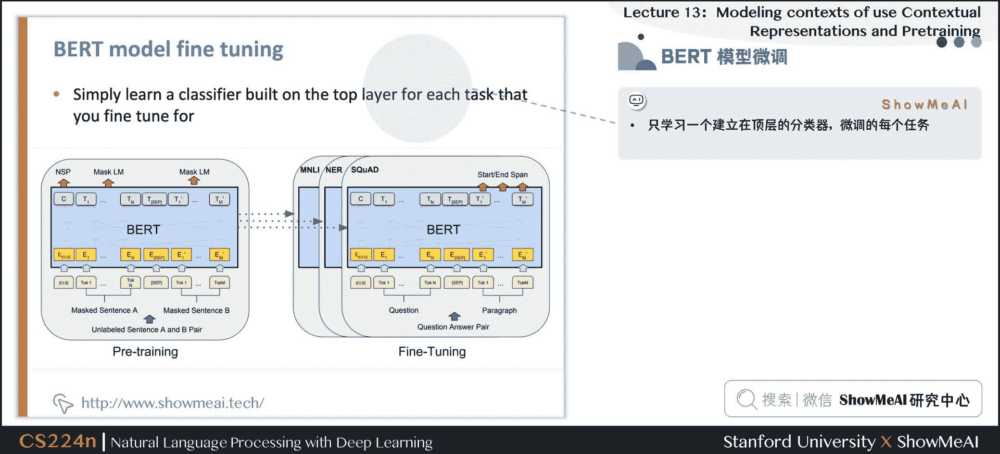

*   只学习一个建立在顶层的分类器，微调的每个任务

## 5.6 BERT GLUE 多任务结果

*   GLUE benchmark 是由自然语言推理任务，还有句子相似度和情感

*   **MultiNLI**
    *   **Premise**: Hills and mountains are especially sanctified in Jainism.
    *   **Hypothesis**: Jainism hates nature.
    *   **Label**: Contradiction

*   **CoLa**
    *   **Sentence**: The wagon rumbled down the road. Label: Acceptable
    *   **Sentence**: The car honked down the road. Label: Unacceptable

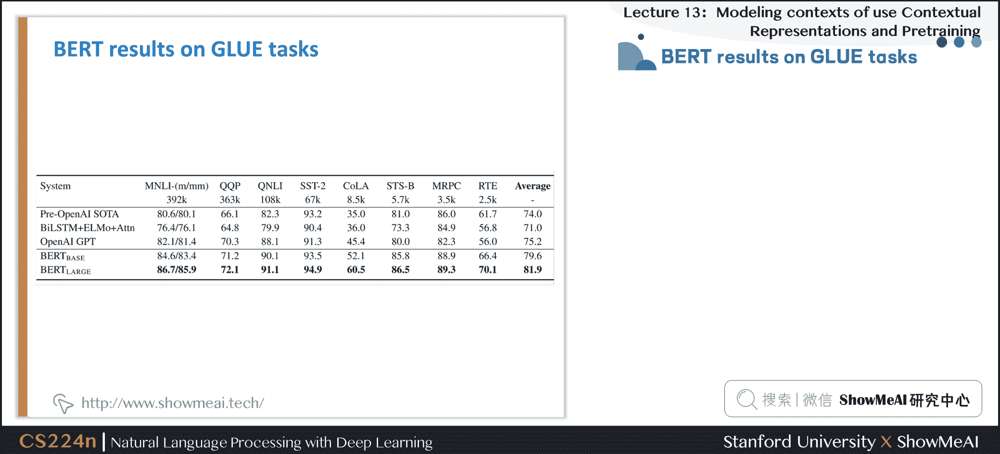

## 5.7 CoNLL 2003 命名实体识别 (en news testb)

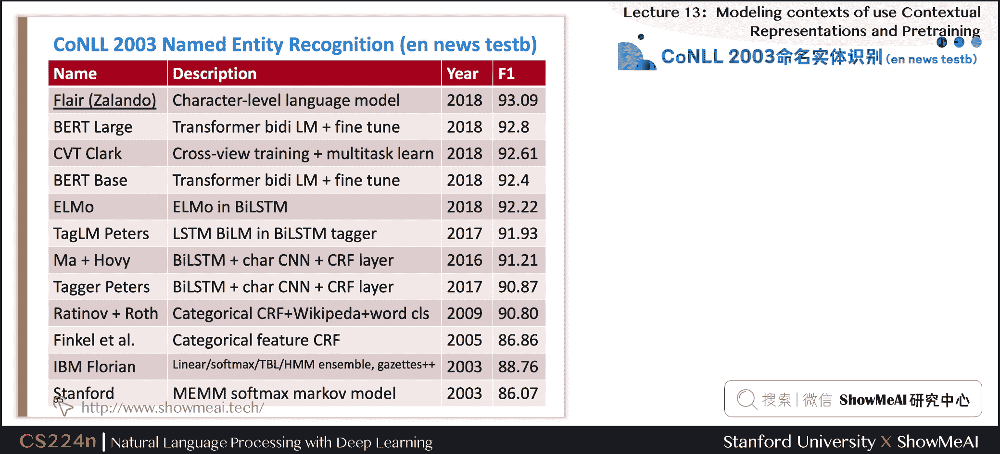

## 5.8 BERT 在 SQuAD 问答上的表现

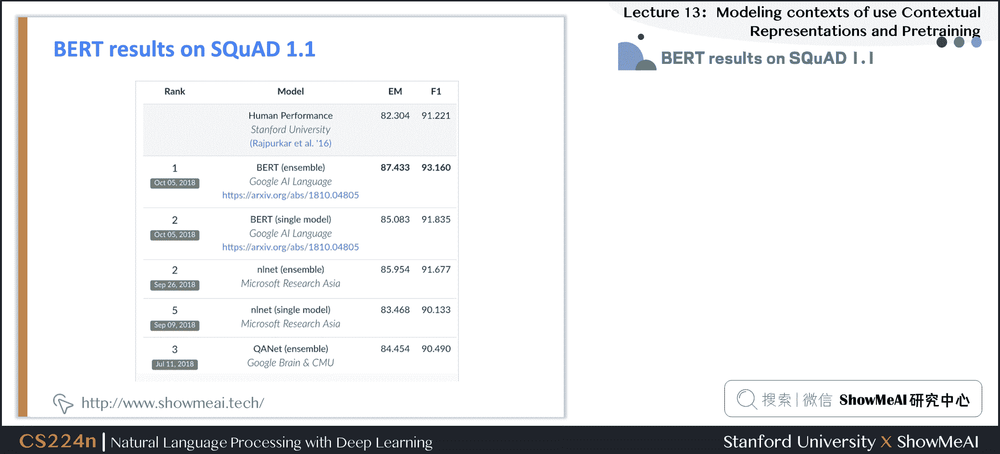

## 5.9 BERT 预训练任务效果

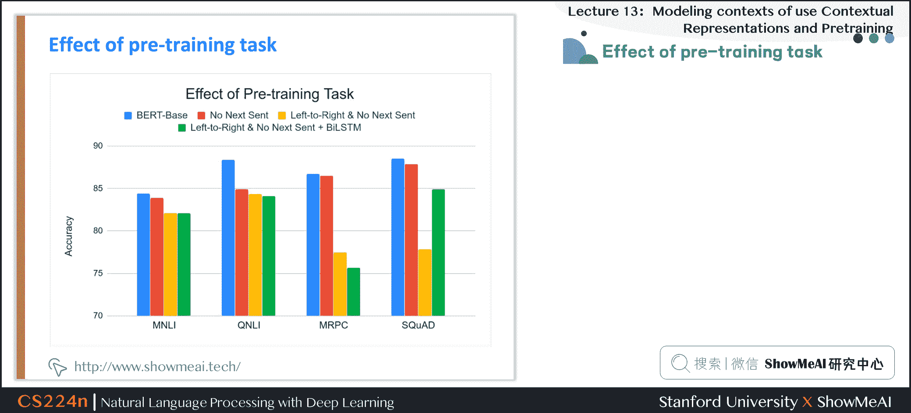

## 5.10 BERT 参数量级对效果影响

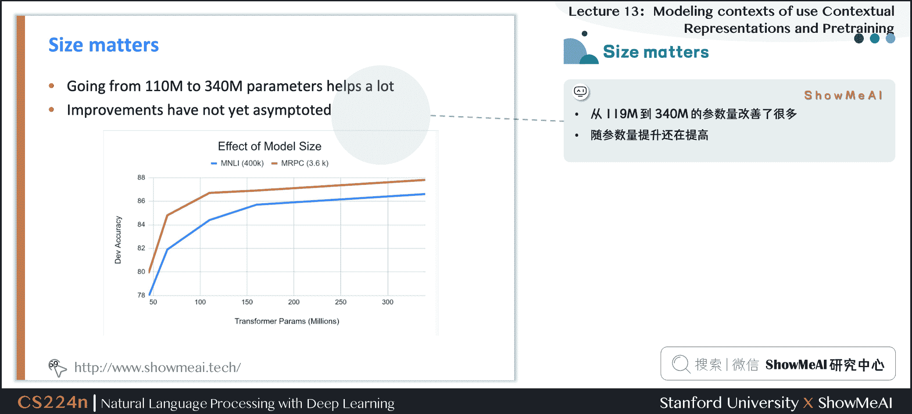

*   从 119M 到 340M 的参数量改善了很多
*   随参数量提升还在提高

## 5.11 推荐阅读

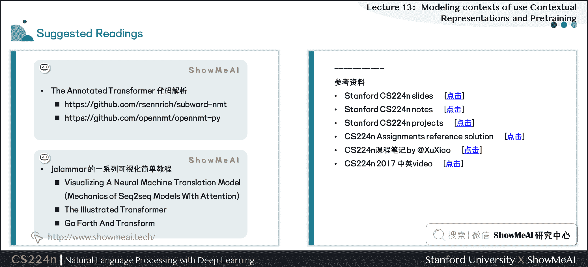

*   **The Annotated Transformer 代码解析**
    *   https://github.com/rsennrich/subword-nmt
    *   https://github.com/opennmt/opennmt-py

*   **jalammar 的一系列可视化简单教程**
    *   [Visualizing A Neural Machine Translation Model (Mechanics of Seq2seq Models With Attention)](https://jalammar.github.io/visualizing-neural-machine-translation-mechanics-of-seq2seq-models-with-attention/)
    *   [The Illustrated Transformer](https://jalammar.github.io/illustrated-transformer/)

# 6.视频教程

可以点击 [**B 站**](https://www.bilibili.com/video/BV1Yo4y1D7FW?p=13) 查看视频的【双语字幕】版本

[`player.bilibili.com/player.html?aid=376755412&page=13`](https://player.bilibili.com/player.html?aid=376755412&page=13)

【双语字幕+资料下载】斯坦福 CS224n | 深度学习与自然语言处理(2019·全 20 讲)

# 7.参考资料

*   [本讲带学的**在线阅翻页本**](https://blog.showmeai.tech/cs224n/lecture13-Contextual-Representations-and-Pretraining#/)
*   [《斯坦福 CS224n 深度学习与自然语言处理》**课程学习指南**](https://blog.showmeai.tech/cs224n/)
*   [《斯坦福 CS224n 深度学习与自然语言处理》**课程大作业解析**](https://github.com/ShowMeAI-Hub/awesome-AI-courses-notes-cheatsheets/tree/main/CS224n-Natural-Language-Processing-with-Deep-Learning/assignment-solutions)
*   [【**双语字幕视频**】斯坦福 CS224n | 深度学习与自然语言处理(2019·全 20 讲)](https://www.bilibili.com/video/BV1Yo4y1D7FW)
*   [**Stanford 官网** | CS224n: Natural Language Processing with Deep Learning](https://web.stanford.edu/class/archive/cs/cs224n/cs224n.1194/)

# [**ShowMeAI**](http://www.showmeai.tech)系列教程推荐

*   [大厂技术实现 | 推荐与广告计算解决方案](http://www.showmeai.tech/tutorials/50)
*   [大厂技术实现 | 计算机视觉解决方案](http://www.showmeai.tech/tutorials/51)
*   [大厂技术实现 | 自然语言处理行业解决方案](http://www.showmeai.tech/tutorials/52)
*   [图解 Python 编程：从入门到精通系列教程](http://www.showmeai.tech/tutorials/56)
*   [图解数据分析：从入门到精通系列教程](http://www.showmeai.tech/tutorials/33)
*   [图解 AI 数学基础：从入门到精通系列教程](http://www.showmeai.tech/tutorials/83)
*   [图解大数据技术：从入门到精通系列教程](http://www.showmeai.tech/tutorials/84)
*   [图解机器学习算法：从入门到精通系列教程](http://www.showmeai.tech/tutorials/34)
*   [机器学习实战：手把手教你玩转机器学习系列](http://www.showmeai.tech/tutorials/41)
*   [深度学习教程 | 吴恩达专项课程 · 全套笔记解读](http://www.showmeai.tech/tutorials/35)
*   [自然语言处理教程 | 斯坦福 CS224n 课程 · 课程带学与全套笔记解读](http://www.showmeai.tech/tutorials/36)

# NLP 系列教程文章

*   [NLP 教程(1)- 词向量、SVD 分解与 Word2vec](http://showmeai.tech/article-detail/230)
*   [NLP 教程(2)- GloVe 及词向量的训练与评估](http://showmeai.tech/article-detail/232)
*   [NLP 教程(3)- 神经网络与反向传播](http://showmeai.tech/article-detail/234)
*   [NLP 教程(4)- 句法分析与依存解析](http://www.showmeai.tech/article-detail/237)
*   [NLP 教程(5)- 语言模型、RNN、GRU 与 LSTM](http://www.showmeai.tech/article-detail/239)
*   [NLP 教程(6)- 神经机器翻译、seq2seq 与注意力机制](http://www.showmeai.tech/article-detail/242)
*   [NLP 教程(7)- 问答系统](http://www.showmeai.tech/article-detail/245)
*   [NLP 教程(8)- NLP 中的卷积神经网络](http://www.showmeai.tech/article-detail/247)
*   [NLP 教程(9)- 句法分析与树形递归神经网络](http://www.showmeai.tech/article-detail/255)

# 斯坦福 CS224n 课程带学详解

*   [斯坦福 NLP 课程 | 第 1 讲 - NLP 介绍与词向量初步](http://showmeai.tech/article-detail/231)
*   [斯坦福 NLP 课程 | 第 2 讲 - 词向量进阶](http://showmeai.tech/article-detail/233)
*   [斯坦福 NLP 课程 | 第 3 讲 - 神经网络知识回顾](http://showmeai.tech/article-detail/235)
*   [斯坦福 NLP 课程 | 第 4 讲 - 神经网络反向传播与计算图](http://showmeai.tech/article-detail/236)
*   [斯坦福 NLP 课程 | 第 5 讲 - 句法分析与依存解析](http://www.showmeai.tech/article-detail/238)
*   [斯坦福 NLP 课程 | 第 6 讲 - 循环神经网络与语言模型](http://www.showmeai.tech/article-detail/240)
*   [斯坦福 NLP 课程 | 第 7 讲 - 梯度消失问题与 RNN 变种](http://www.showmeai.tech/article-detail/241)
*   [斯坦福 NLP 课程 | 第 8 讲 - 机器翻译、seq2seq 与注意力机制](http://www.showmeai.tech/article-detail/243)
*   [斯坦福 NLP 课程 | 第 9 讲 - cs224n 课程大项目实用技巧与经验](http://www.showmeai.tech/article-detail/244)
*   [斯坦福 NLP 课程 | 第 10 讲 - NLP 中的问答系统](http://www.showmeai.tech/article-detail/246)
*   [斯坦福 NLP 课程 | 第 11 讲 - NLP 中的卷积神经网络](http://www.showmeai.tech/article-detail/248)
*   [斯坦福 NLP 课程 | 第 12 讲 - 子词模型](http://www.showmeai.tech/article-detail/249)
*   [斯坦福 NLP 课程 | 第 13 讲 - 基于上下文的表征与 NLP 预训练模型](http://www.showmeai.tech/article-detail/250)
*   [斯坦福 NLP 课程 | 第 14 讲 - Transformers 自注意力与生成模型](http://www.showmeai.tech/article-detail/251)
*   [斯坦福 NLP 课程 | 第 15 讲 - NLP 文本生成任务](http://www.showmeai.tech/article-detail/252)
*   [斯坦福 NLP 课程 | 第 16 讲 - 指代消解问题与神经网络方法](http://www.showmeai.tech/article-detail/253)
*   [斯坦福 NLP 课程 | 第 17 讲 - 多任务学习(以问答系统为例)](http://www.showmeai.tech/article-detail/254)
*   [斯坦福 NLP 课程 | 第 18 讲 - 句法分析与树形递归神经网络](http://www.showmeai.tech/article-detail/256)
*   [斯坦福 NLP 课程 | 第 19 讲 - AI 安全偏见与公平](http://www.showmeai.tech/article-detail/257)
*   [斯坦福 NLP 课程 | 第 20 讲 - NLP 与深度学习的未来](http://www.showmeai.tech/article-detail/258)

