# 斯坦福 NLP 课程 | 第 15 讲 - NLP 文本生成任务

> 原文：[`blog.csdn.net/ShowMeAI/article/details/124683785`](https://blog.csdn.net/ShowMeAI/article/details/124683785)

*   作者：[韩信子](https://github.com/HanXinzi-AI)@[ShowMeAI](http://www.showmeai.tech/)，路遥@[ShowMeAI](http://www.showmeai.tech/)，奇异果@[ShowMeAI](http://www.showmeai.tech/)
*   [教程地址](http://www.showmeai.tech/tutorials/36)：[`www.showmeai.tech/tutorials/36`](http://www.showmeai.tech/tutorials/36)
*   [本文地址](http://www.showmeai.tech/article-detail/252)：[`www.showmeai.tech/article-detail/252`](http://www.showmeai.tech/article-detail/252)
*   声明：版权所有，转载请联系平台与作者并注明出处
*   收藏[ShowMeAI](http://www.showmeai.tech/)查看更多精彩内容

* * *

[ShowMeAI](http://www.showmeai.tech/)为**斯坦福 CS224n**《自然语言处理与深度学习(Natural Language Processing with Deep Learning)》课程的全部课件，做了**中文翻译和注释**，并制作成了 GIF 动图！视频和课件等资料的获取方式见**文末**。

* * *

# 引言

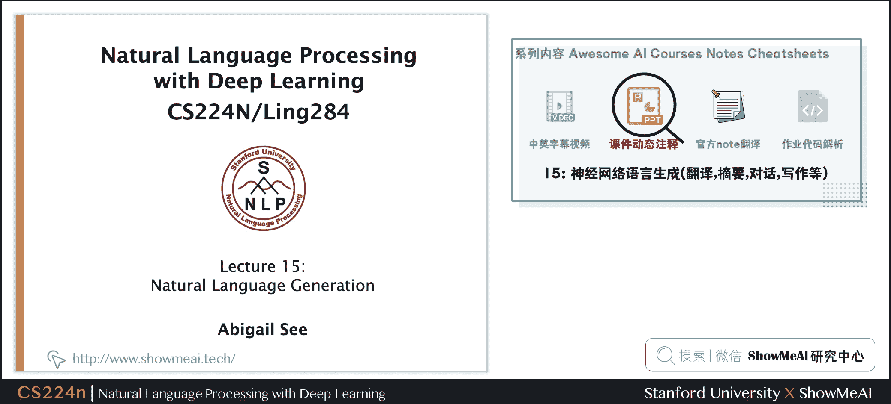

## 概要

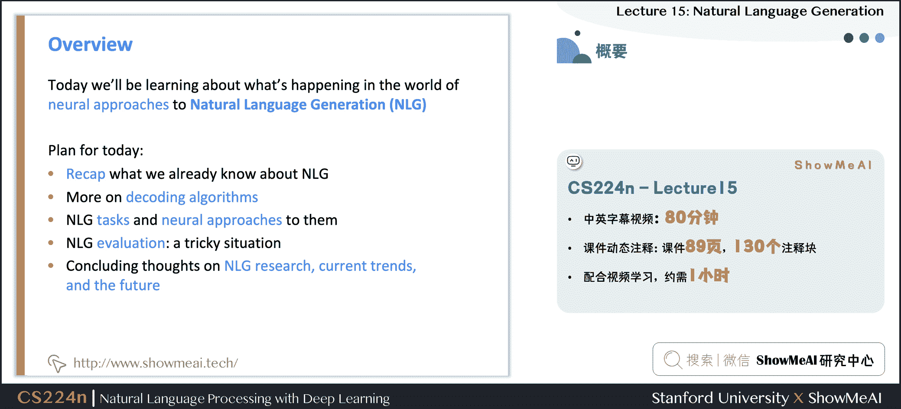

*   Recap what we already know about NLG / **NLG 要点回顾**
*   More on decoding algorithms / **解码算法**
*   NLG tasks and neural approaches to them / **NLG 任务及其神经网络解法**
*   NLG evaluation: a tricky situation / **NLG 评估：一个棘手的情况**
*   Concluding thoughts on NLG research, current trends, and the future / **NLG 研究的一些想法，目前的趋势，未来的可能方向**

# 1.语言模型与解码算法知识回顾

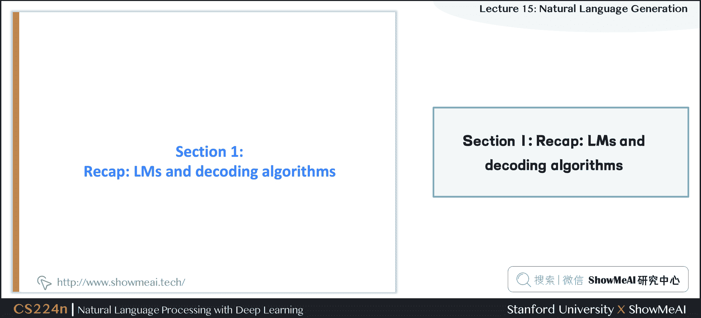

## 1.1 自然语言生成(NLG)

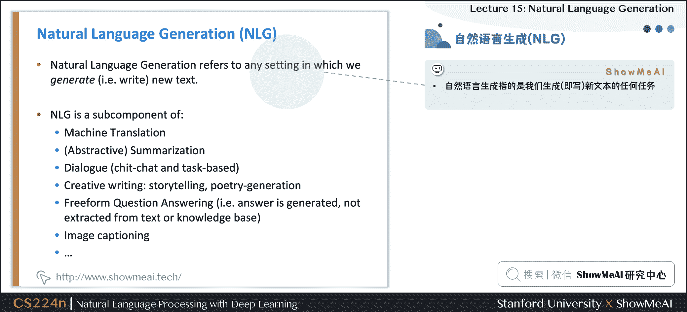

*   **自然语言生成**指的是我们生成 (即写入) 新文本的任何任务

*   NLG 包括以下内容：
    *   机器翻译
    *   摘要
    *   对话 (闲聊和基于任务)
    *   创意写作：讲故事，诗歌创作
    *   自由形式问答 (即生成答案，从文本或知识库中提取)
    *   图像字幕

## 1.2 要点回顾

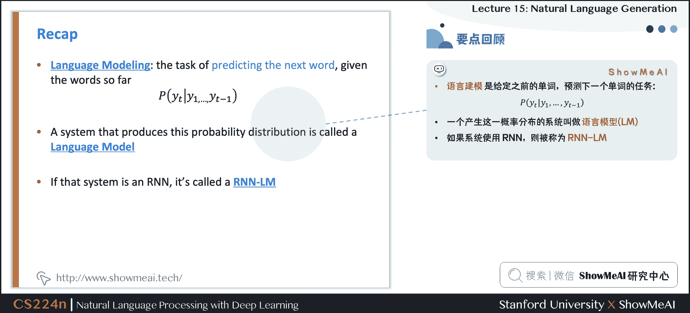

（语言模型相关内容也可以参考[ShowMeAI](http://www.showmeai.tech/)对吴恩达老师课程的总结文章[深度学习教程 | 序列模型与 RNN 网络](http://showmeai.tech/article-detail/225)）

*   **语言建模**是给定之前的单词，预测下一个单词的任务：

P ( y t ∣ y 1 , … , y t − 1 ) P\left(y_{t} \mid y_{1}, \ldots, y_{t-1}\right) P(yt​∣y1​,…,yt−1​)

*   一个产生这一概率分布的系统叫做语言模型 (LM)
*   如果系统使用 RNN，则被称为 RNN-LM

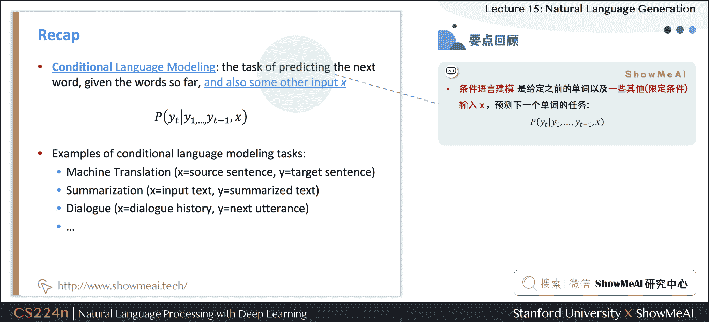

*   **条件语言建模**是给定之前的单词以及**一些其他 (限定条件) 输入** x x x，预测下一个单词的任务：

P ( y t ∣ y 1 , … , y t − 1 , x ) P\left(y_{t} \mid y_{1}, \dots, y_{t-1}, x\right) P(yt​∣y1​,…,yt−1​,x)

*   条件语言建模任务的例子：
    *   **机器翻译** x = source sentence, y = target sentence
    *   **摘要** x = input text, y = summarized text
    *   **对话** x = dialogue history, y = next utterance

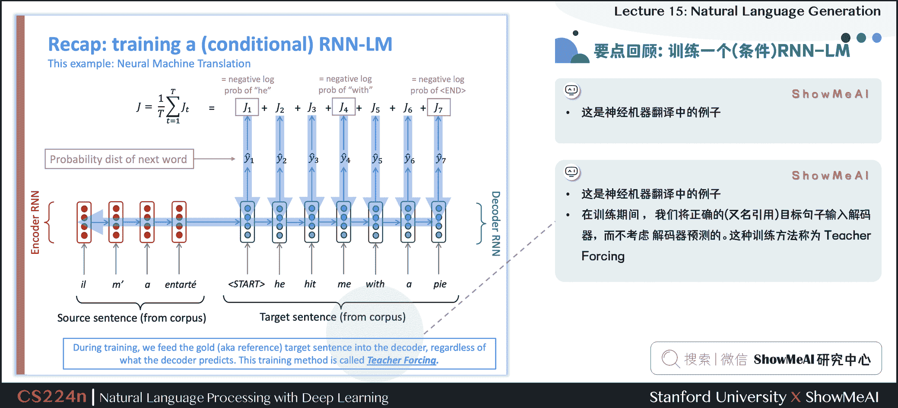

**训练一个(条件)RNN 语言模型**

*   这是神经机器翻译中的例子
*   在训练期间，我们将正确的 (又名引用) 目标句子输入解码器，而不考虑解码器预测的。这种训练方法称为 Teacher Forcing

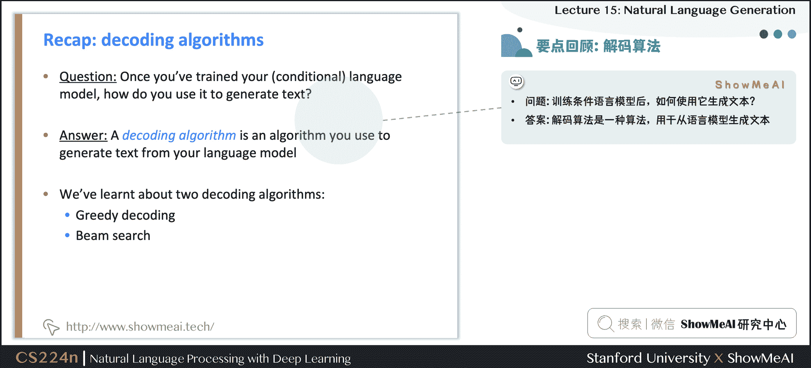

**解码算法**

*   **问题**：训练条件语言模型后，如何使用它生成文本？
*   **答案**：解码算法是一种算法，用于从语言模型生成文本

*   我们了解了两种解码算法
    *   **贪婪解码**
    *   **集束搜索**

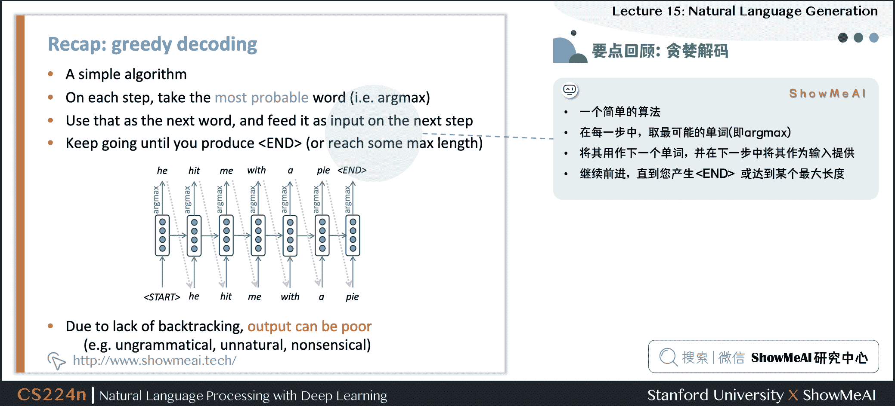

**贪婪解码**

*   一个简单的算法
*   在每一步中，取最可能的单词 (即 argmax)
*   将其用作下一个单词，并在下一步中将其作为输入提供
*   继续前进，直到产生 < END > <\text{END}> <END> 或达到某个最大长度

*   由于缺乏回溯，输出可能很差 (例如，不合语法，不自然，荒谬)

**集束搜索解码**

*   一种旨在通过一次跟踪多个可能的序列，找到高概率序列 (不一定是最佳序列) 的搜索算法

*   **核心思路**：在解码器的每一步，跟踪 k k k 个最可能的部分序列 (我们称之为假设)

    *   k k k 是光束大小 

*   达到某个停止标准后，选择概率最高的序列 (考虑一些长度调整)

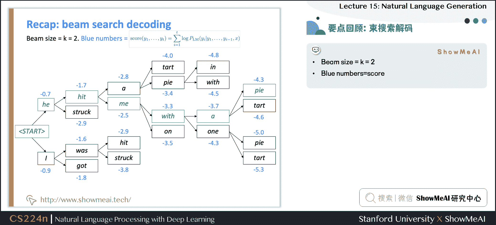

**束搜索解码**

*   Beam size = k = 2
*   Blue numbers=score

## 1.3 旁白：《西部世界》使用的是集束搜索吗？

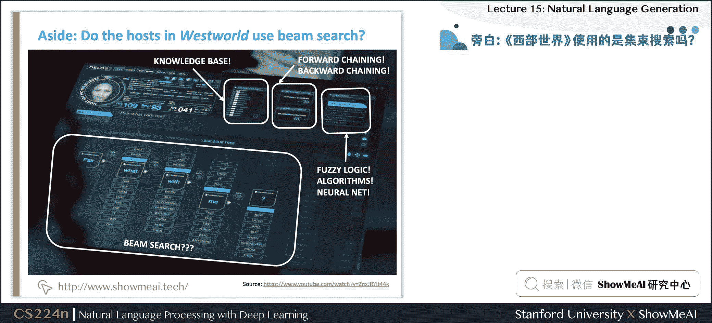

## 1.4 改变 beam size k 有什么影响？

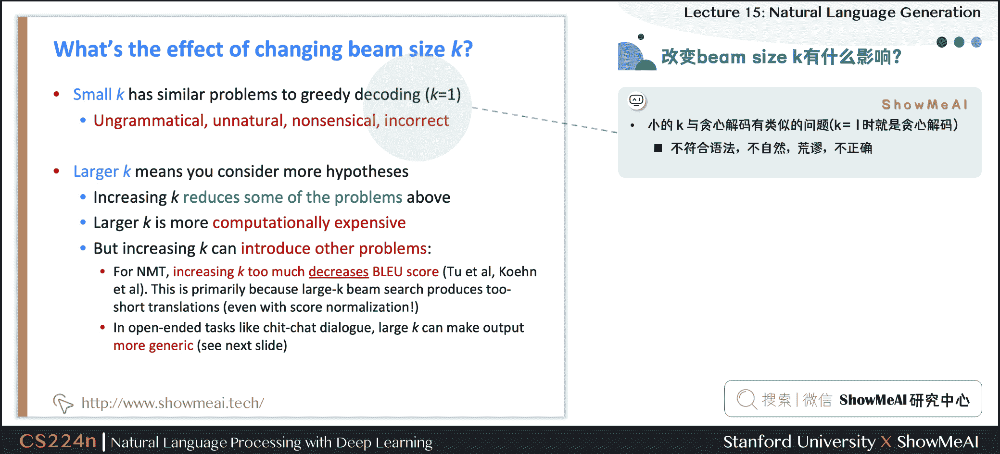

*   小的 k k k 与贪心解码有类似的问题 ( k = 1 k = 1 k=1 时就是贪心解码)

    *   不符合语法，不自然，荒谬，不正确 

*   更大的 k k k 意味着考虑更多假设

    *   增加 k k k 可以减少上述一些问题
    *   更大的 k k k 在计算上更昂贵
    *   但增加 k k k 可能会引入其他问题：

        *   对于 NMT，增加 k k k 太多会降低 BLEU 评分(Tu et al, Koehnet al)，这主要是因为大 k k k 光束搜索产生太短的翻译 (即使得分归一化) 
    *   在闲聊话等开放式任务中，大的 k k k 会输出非常通用的句子 (见下一张幻灯片) 

## 1.5 光束大小对聊天对话的影响

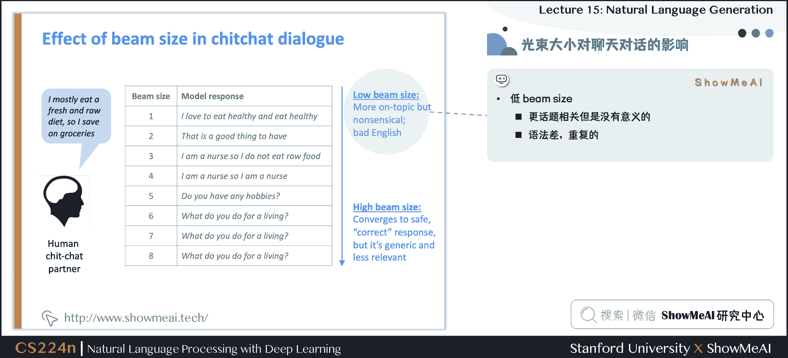

*   **低 beam size**
    *   话题更相关但是没有意义的
    *   语法差，重复的

*   **高 beam size**
    *   结果更保险
    *   回答更 `正确`
    *   但它更泛，主题相关性弱一些

## 1.6 基于采样的解码

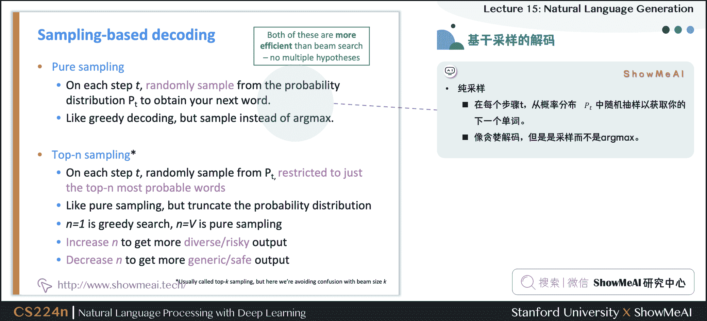

*   **纯采样**
    *   在每个步骤 t t t，从概率分布 P t P_t Pt​ 中随机抽样以获取下一个单词
*   像贪婪的解码，但是，是采样而不是 argmax

*   **Top-n 采样**
    *   在每个步骤 t t t，从 P t P_t Pt​ 的前 n n n 个最可能的单词中，进行随机采样
    *   与纯采样类似，但截断概率分布
    *   此时， n = 1 n = 1 n=1 是贪婪搜索， n = V n = V n=V 是纯采样
    *   增加 n n n 以获得更多样化 / 风险的输出
    *   减少 n n n 以获得更通用 / 安全的输出

*   **这两者都比光束搜索更有效率，不用关注多个假设**

## 1.7 Softmax temperature

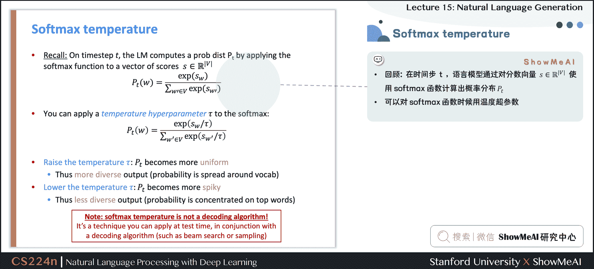

*   **回顾**：在时间步 t t t，语言模型通过对分数向量 s ∈ R ∣ V ∣ s \in \mathbb{R}^{|V|} s∈R∣V∣ 使用 softmax 函数计算出概率分布 P t P_t Pt​

P t ( w ) = exp ⁡ ( s w ) ∑ w ′ ∈ V exp ⁡ ( s w ′ ) P_{t}(w)=\frac{\exp \left(s_{w}\right)}{\sum_{w^{\prime} \in V} \exp \left(s_{w^{\prime}}\right)} Pt​(w)=∑w′∈V​exp(sw′​)exp(sw​)​

*   可以对 softmax 函数时候用温度超参数

P t ( w ) = exp ⁡ ( s w / τ ) ∑ w ′ ∈ V exp ⁡ ( s w ′ / τ ) P_{t}(w)=\frac{\exp \left(s_{w} / \tau\right)}{\sum_{w^{\prime} \in V} \exp \left(s_{w^{\prime}} / \tau\right)} Pt​(w)=∑w′∈V​exp(sw′​/τ)exp(sw​/τ)​

*   **提高温度** τ \tau τ： P t P_t Pt​ **变得更均匀**

    *   因此输出更多样化 (概率分布在词汇中) 
*   **降低温度** τ \tau τ： P t P_t Pt​ **变得更尖锐**

    *   因此输出的多样性较少 (概率集中在顶层词汇上) 

## 1.8 解码算法：总结

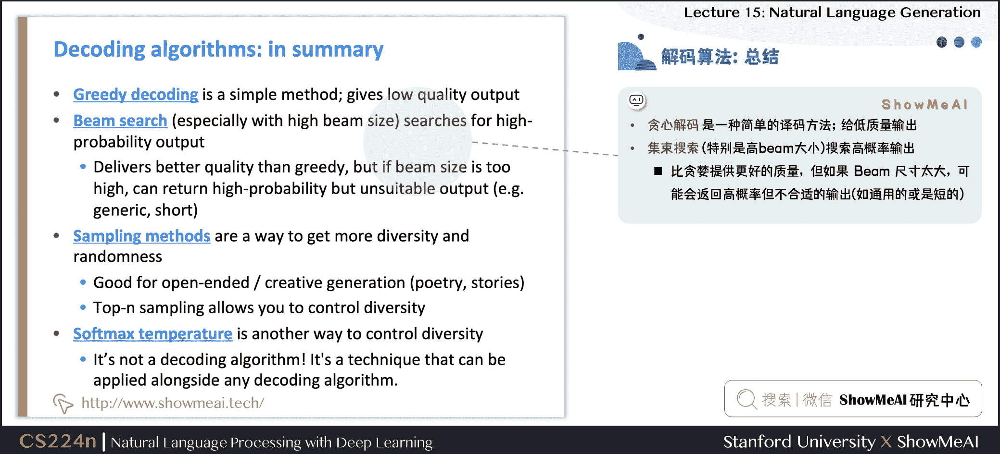

*   贪心解码是一种简单的译码方法；给低质量输出
*   **Beam 搜索**(特别是高 beam 大小) 搜索高概率输出
    *   比贪婪提供更好的质量，但是如果 Beam 尺寸太大，可能会返回高概率但不合适的输出(如通用的或是短的)

*   **抽样方法**来获得更多的多样性和随机性
    *   适合开放式/创意代 (诗歌，故事)
    *   T o p − n Top-n Top−n 个抽样允许控制多样性
*   **Softmax 温度控制**的另一种方式多样性
    *   它不是一个解码算法！这种技术可以应用在任何解码算法。

# 2.NLG 任务和它们的神经网络解法

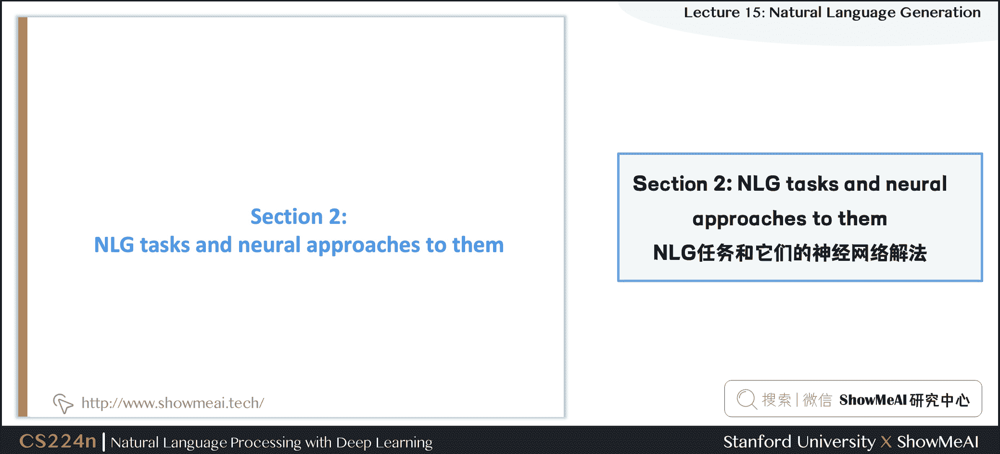

## 2.1 摘要：任务定义

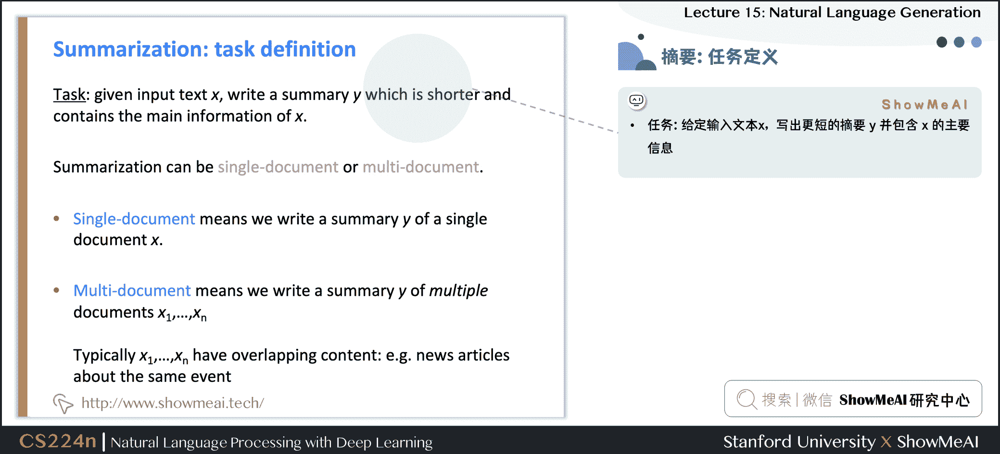

*   **任务**：给定输入文本 x x x，写出更短的摘要 y y y 并包含 x x x 的主要信息

*   **摘要可以是单文档，也可以是多文档**

    *   **单文档**意味着我们写一个文档 x x x 的摘要 y y y
    *   **多文档**意味着我们写一个多个文档 x 1 , … , x n x_{1}, \ldots, x_{n} x1​,…,xn​ 的摘要 y y y
    *   通常 x 1 , … , x n x_{1}, \ldots, x_{n} x1​,…,xn​ 有重叠的内容：如对同一事件的新闻文章

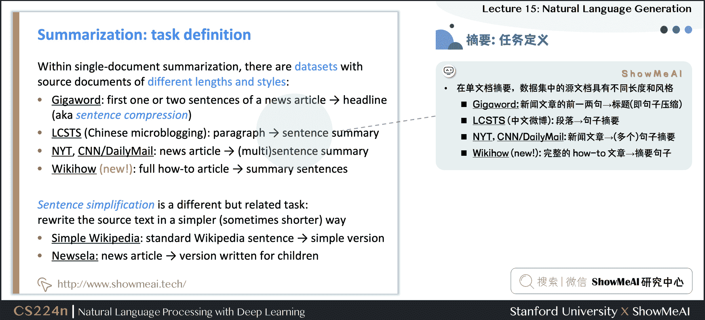

在单文档摘要，数据集中的源文档具有**不同长度和风格**

*   **Gigaword**：新闻文章的前一两句 → 标题 (即句子压缩)
*   **LCSTS** (中文微博)：段落 → 句子摘要
*   **NYT, CNN / DailyMail**：新闻文章 → (多个)句子摘要
*   **Wikihow** (new!)：完整的 how-to 文章 → 摘要句子

**句子简化**是一个不同但相关的任务：将源文本改写为更简单 (有时是更短) 的版本

*   **Simple Wikipedia**：标准维基百科句子 → 简单版本
*   **Newsela**：新闻文章 → 为儿童写的版本

## 2.2 总结：两大策略

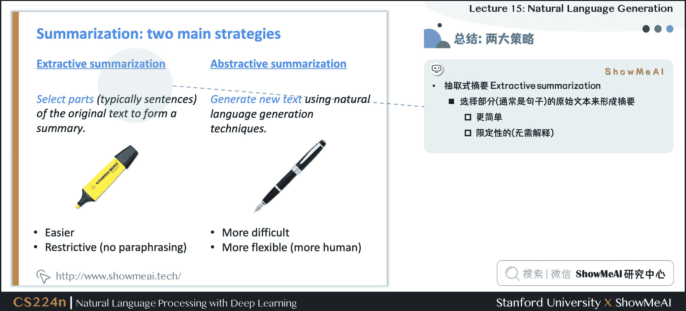

*   **抽取式摘要** Extractive summarization

    *   **选择部分** (通常是句子) 的原始文本来形成摘要
        *   更简单
        *   限定性的 (无需解释)
*   **生成式摘要** Abstractive summarization

    *   使用自然语言生成技术**生成新的文本**
        *   更困难
        *   更多变 (更人性化)

## 2.3 前神经网络时代摘要抽取综述

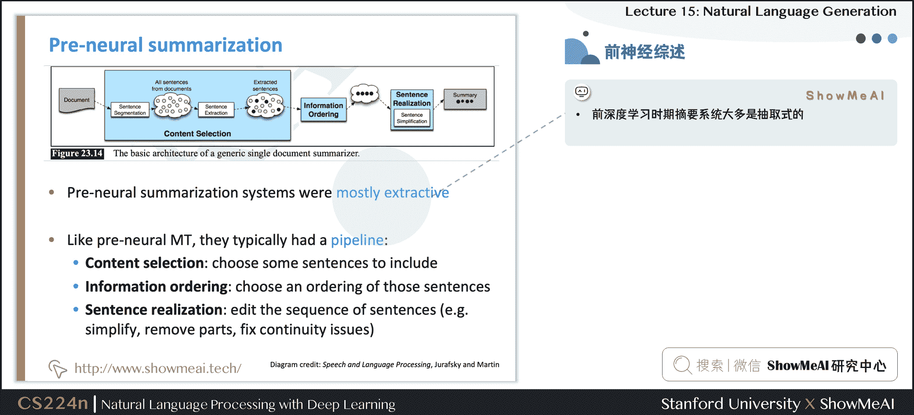

*   前深度学习时期摘要系统大多是抽取式的

*   类似统计机器翻译系统，他们通常有一个流水线
    *   **内容选择** Content selection：选择一些句子
    *   **信息排序** Information ordering：为选择的句子排序
    *   **句子实现** Sentence realization：编辑并输出句子序列例如，简化、删除部分、修复连续性问题

*   Diagram credit: Speech and Language Processing, Jurafsky and Martin

*   前神经网络时代的**内容选择**算法
    *   **句子得分函数**可以根据
        *   主题关键词，通过计算如 tf-idf 等
        *   特性，例如这句话出现在文档的哪里

*   **图算法**将文档为一组句子(节点)，每对句子之间存在边
    *   边的权重与句子相似度成正比
    *   使用图算法来识别图中最重要的句子

## 2.4 综述生成评估：ROUGE

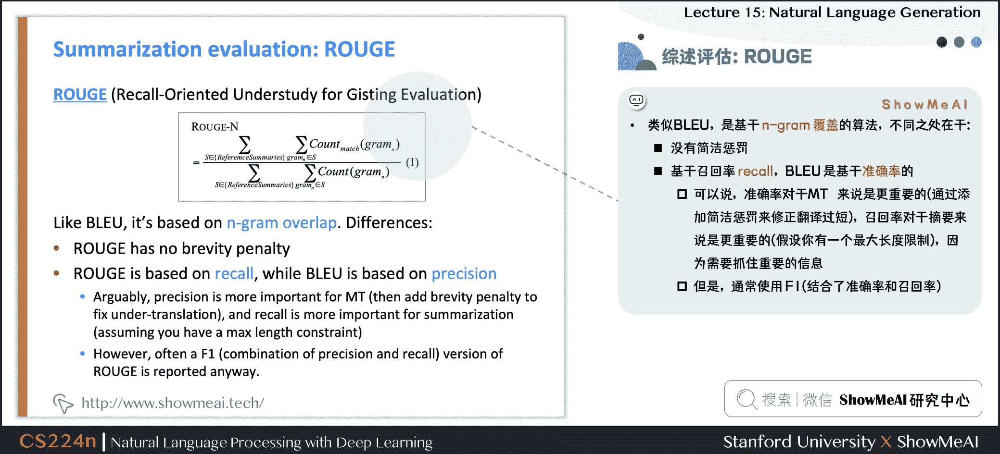

类似于 BLEU，是基于 n-gram 覆盖的算法，**不同之处**在于：

*   没有简洁惩罚
*   基于召回率 recall，BLEU 是基于准确率的
    *   可以说，准确率对于机器翻译来说是更重要的 (通过添加简洁惩罚来修正翻译过短)，召回率对于摘要来说是更重要的 (假设你有一个最大长度限制)，因为需要抓住重要的信息
    *   但是，通常使用 F1 (结合了准确率和召回率)

*   ROUGE: A Package for Automatic Evaluation of Summaries, Lin, 2004
*   http://www.aclweb.org/anthology/W04-1013

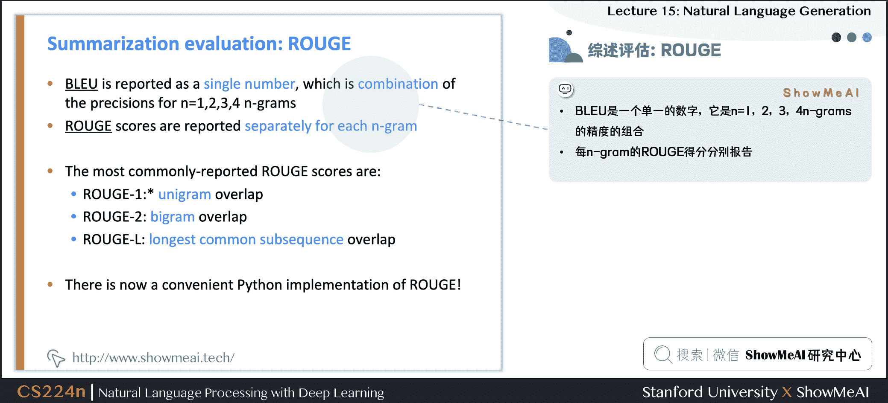

*   BLEU 是一个单一的数字，它是 n = 1 ， 2 ， 3 ， 4 n − g r a m s n=1，2，3，4n-grams n=1，2，3，4n−grams 的精度的组合
*   每 n-gram 的 ROUGE 得分分别报告

*   最常见的报告 ROUGE 得分是
    *   ROUGE-1：unigram 单元匹配
    *   ROUGE 红-2：bigram 二元分词匹配
    *   ROUGE-L：最长公共子序列匹配

*   现在有了一个方便的 ROUGE 的 Python 实现

## 2.5 神经摘要生成 (2015 年-至今)

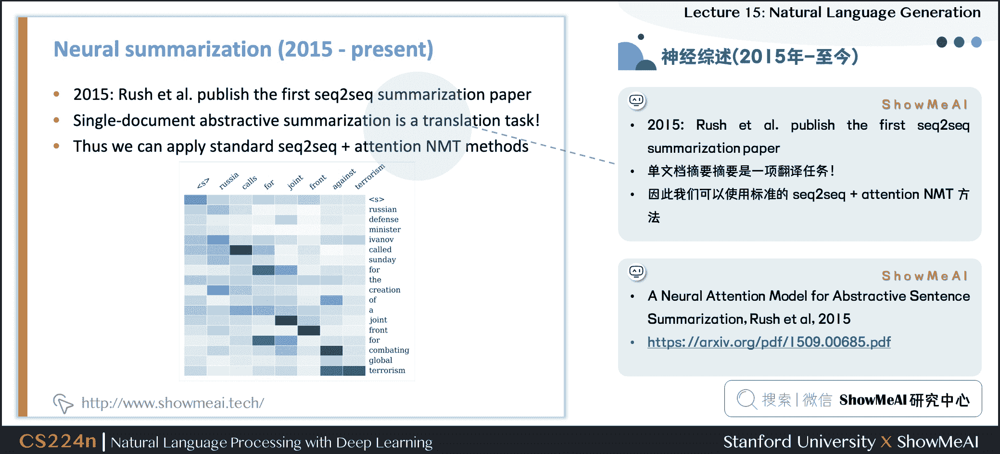

*   2015：Rush et al. publish the first seq2seq summarization paper
*   单文档摘要摘要是一项翻译任务！
*   因此我们可以使用标准的 seq2seq + attention 神经机器翻译方法

*   A Neural Attention Model for Abstractive Sentence Summarization, Rush et al, 2015
*   https://arxiv.org/pdf/1509.00685.pdf

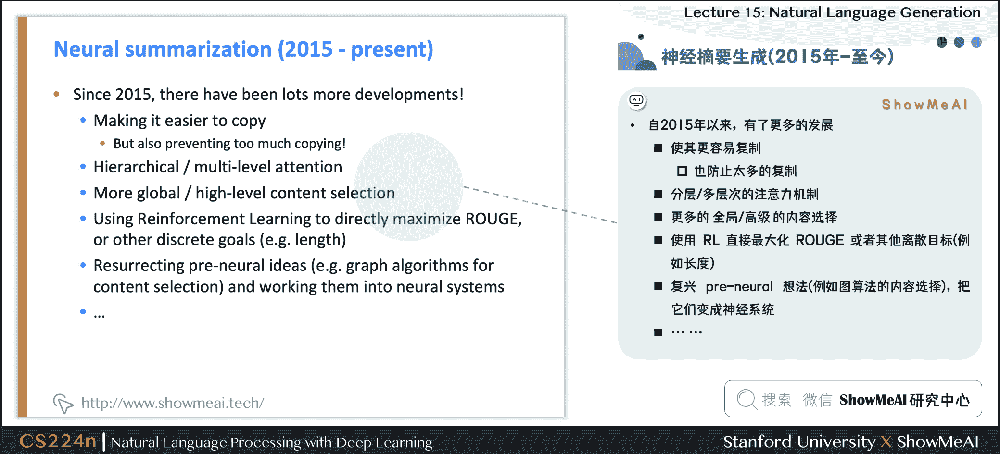

*   自 2015 年以来，有了更多的发展
    *   使其更容易复制
        *   也防止太多的复制
    *   分层 / 多层次的注意力机制
    *   更多的**全局 / 高级**的内容选择
    *   使用 RL 直接最大化 ROUGE 或者其他离散目标 (例如长度)
    *   复兴前深度学习时代的想法 (例如图算法的内容选择)，把它们变成神经系统

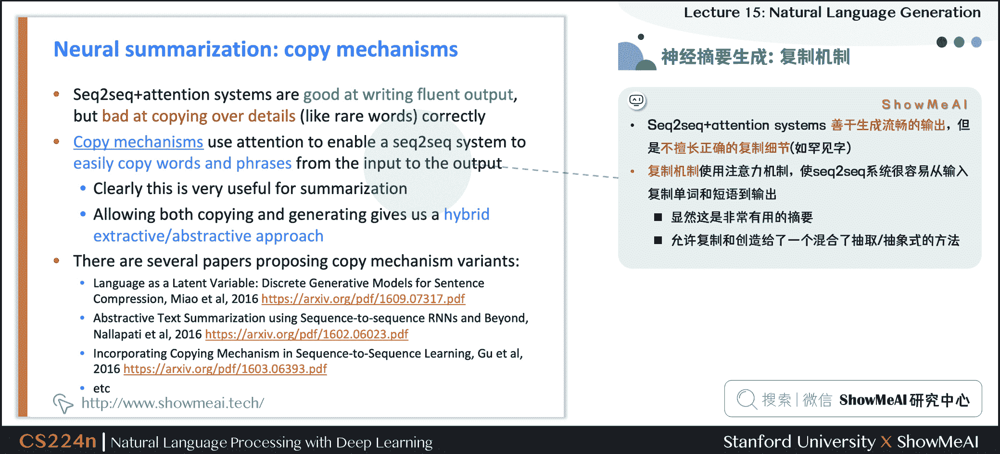

*   Seq2seq+attention systems **善于生成流畅的输出，但是不擅长正确的复制细节** (如罕见字)
*   **复制机制**使用注意力机制，使 seq2seq 系统很容易从输入复制单词和短语到输出
    *   显然这是非常有用的摘要
    *   允许复制和创造给了一个混合了抽取 / 抽象式的方法

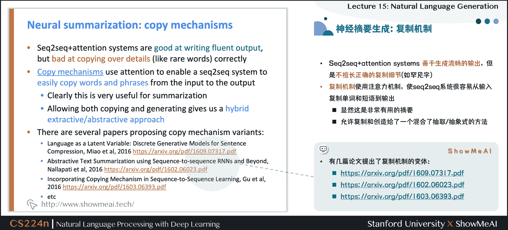

*   有几篇论文提出了复制机制的变体：
    *   Language as a Latent Variable: Discrete Generative Models for Sentence Compression, Miao et al, 2016
        *   https://arxiv.org/pdf/1609.07317.pdf
    *   Abstractive Text Summarization using Sequence-to-sequence RNNs and Beyond, Nallapati et al, 2016
        *   https://arxiv.org/pdf/1602.06023.pdf
    *   Incorporating Copying Mechanism in Sequence-to-Sequence Learning, Gu et al, 2016
        *   https://arxiv.org/pdf/1603.06393.pdf

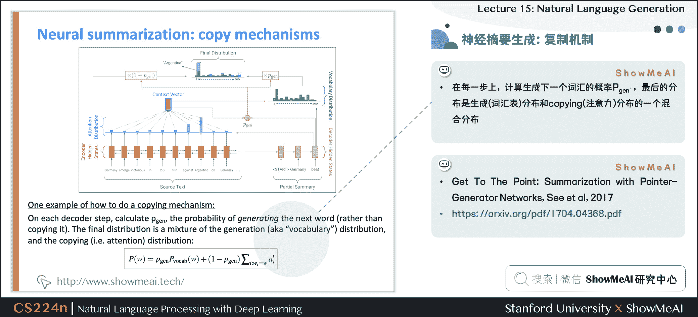

*   在每一步上，计算生成下一个词汇的概率 P g e n P_{gen} Pgen​，最后的分布是生成 (词汇表) 分布和 copying (注意力) 分布的一个混合分布

*   Get To The Point: Summarization with Pointer-Generator Networks, See et al, 2017
*   https://arxiv.org/pdf/1704.04368.pdf

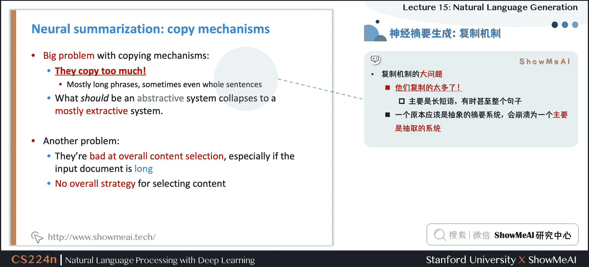

*   复制机制的**大问题**
    *   **他们复制太多**！
        *   主要是长短语，有时甚至整个句子
*   **一个原本应该是抽象的摘要系统，会崩溃为一个主要是抽取的系统**

*   另一个问题
    *   他们**不善于整体内容的选择**，特别是如果输入文档很长的情况下
    *   没有选择内容的总体战略

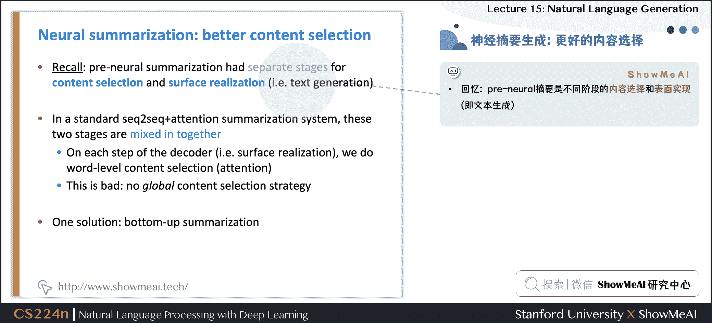

*   **回忆**：前深度学习时代摘要生成是不同阶段的**内容选择**和**表面实现** (即文本生成)

*   标准 seq2seq + attention 的摘要系统，这两个阶段是混合在一起的
    *   每一步的译码器(即表面实现)，我们也能进行词级别的内容选择(注意力)
    *   这是不好的：没有全局内容选择策略

*   **一个解决办法**：自下而上的汇总

## 2.6 自下而上的摘要生成

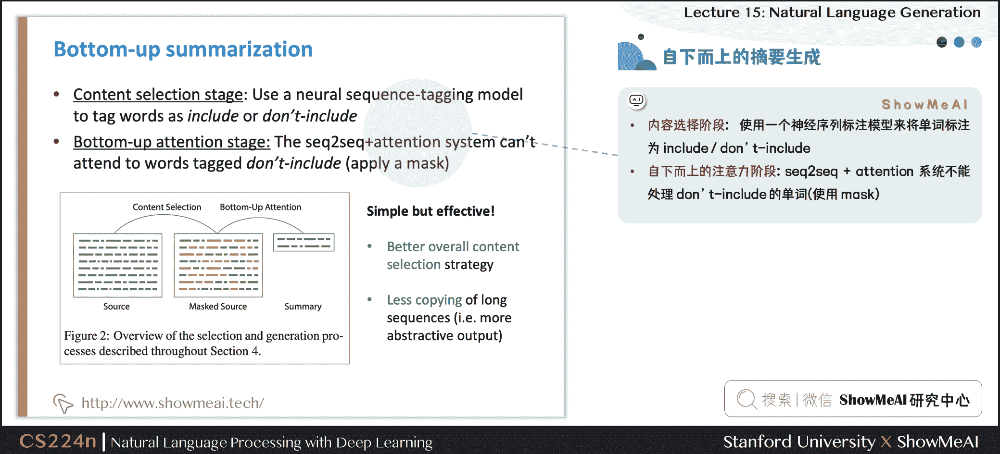

*   **内容选择阶段**：使用一个神经序列标注模型来将单词标注为 `include` / `don’t-include`
*   **自下而上的注意力阶段**：seq2seq + attention 系统不能处理 `don’t-include` 的单词 (使用 mask)

*   简单但是非常有效！
    *   更好的整体内容选择策略
    *   减少长序列的复制 (即更摘要的输出)
        *   因为长序列中包含了很多 `don’t-include` 的单词，所以模型必须学会跳过这些单词并将那些 `include` 的单词进行摘要与组合

## 2.7 基于强化学习的神经网络摘要生成

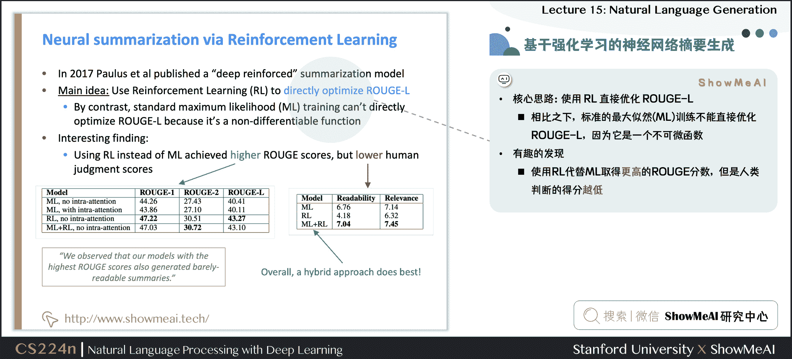

*   **核心思路**：使用 RL 直接优化 ROUGE-L
    *   相比之下，标准的最大似然 (ML) 训练不能直接优化 ROUGE-L，因为它是一个不可微函数
*   有趣的发现
    *   使用 RL 代替 ML 取得更高的 ROUGE 分数，但是人类判断的得分越低

*   **混合模型最好**！

## 2.8 对话系统

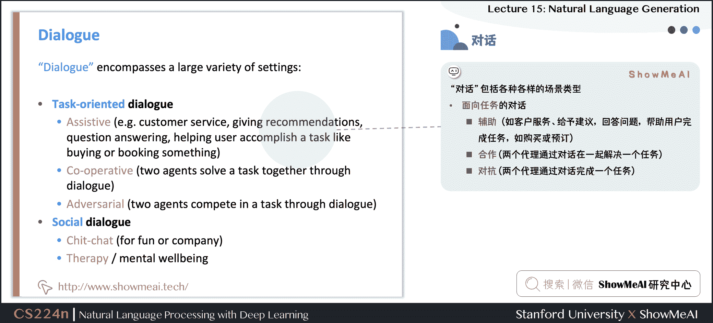

`对话` 包括各种各样的设置

*   **面向任务的对话**
    *   **辅助** (如客户服务、给予建议，回答问题，帮助用户完成任务，如购买或预订)
    *   **合作** (两个代理通过对话在一起解决一个任务)
    *   **对抗** (两个代理通过对话完成一个任务)

*   社会对话
    *   **闲聊** (为了好玩或公司)
    *   **治疗** / 精神健康

## 2.9 前/后神经网络时期对话系统

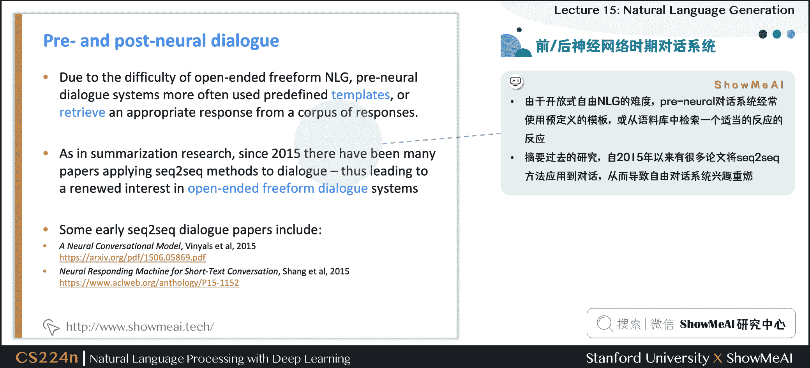

*   由于开放式自由 NLG 的难度，前深度学习时代的对话系统经常使用预定义的模板，或从语料库中检索一个适当的反应的反应
*   摘要过去的研究，自 2015 年以来有很多论文将 seq2seq 方法应用到对话，从而导致自由对话系统兴趣重燃

*   一些早期 seq2seq 对话文章包括
    *   A Neural Conversational Model, Vinyals et al, 2015
        *   https://arxiv.org/pdf/1506.05869.pdf
    *   Neural Responding Machine for Short-Text Conversation, Shang et al, 2015
        *   https://www.aclweb.org/anthology/P15-1152

## 2.10 基于 Seq2Seq 的对话

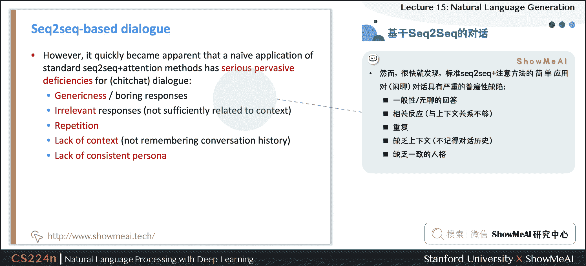

（seq2seq 相关内容也可以参考[ShowMeAI](http://www.showmeai.tech/)的 NLP 教程[NLP 教程(6) - **神经机器翻译、seq2seq 与注意力机制**](http://showmeai.tech/article-detail/242)，以及对吴恩达老师课程的总结文章[深度学习教程 | **Seq2Seq 序列模型和注意力机制**](http://www.showmeai.tech/article-detail/227)）

*   然而，很快就发现，标准 seq2seq +attention 的方法在对话 (闲聊) 任务中有严重的普遍缺陷
    *   一般性/无聊的反应
    *   无关的反应(与上下文不够相关)
    *   重复
    *   缺乏上下文(不记得谈话历史)
    *   缺乏一致的角色人格

## 2.11 无关回答问题

*   **问题**：seq2seq 经常产生与用户无关的话语
    *   要么因为它是通用的 (例如 `我不知道` )
    *   或因为改变话题为无关的一些事情

*   **一个解决方案**：不是去优化输入 S S S 到回答 T T T 的映射来最大化给定 S S S 的 T T T 的条件概率，而是去优化输入 S S S 和回复 T T T 之间的最大互信息 Maximum Mutual Information (MMI)，从而抑制模型去选择那些本来就很大概率的通用句子

log ⁡ p ( S , T ) p ( S ) p ( T ) \log \frac{p(S, T)}{p(S) p(T)} logp(S)p(T)p(S,T)​

T ^ = arg ⁡ max ⁡ T { log ⁡ p ( T ∣ S ) − log ⁡ p ( T ) } \hat{T}=\underset{T}{\arg \max }\{\log p(T | S)-\log p(T)\} T^=Targmax​{logp(T∣S)−logp(T)}

## 2.12 一般性/枯燥的回答问题

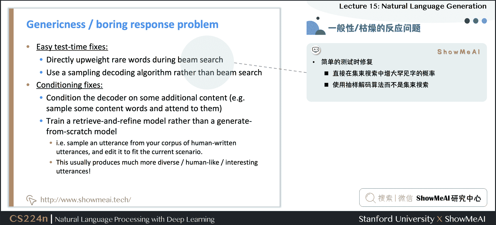

*   **简单的测试修复**
    *   直接在集束搜索中增大罕见字的概率
    *   使用抽样解码算法而不是 Beam 搜索

*   **条件修复**
    *   用一些额外的内容训练解码器 (如抽样一些内容词并处理)
    *   训练 retrieve-and-refine(检索并调优) 模型而不是 generate-from-scratch(从头生成) 模型
        *   从语料库采样人类话语并编辑以适应当前的场景
        *   这通常产生更加多样化/人类/有趣的话语！

## 2.13 重复回答问题

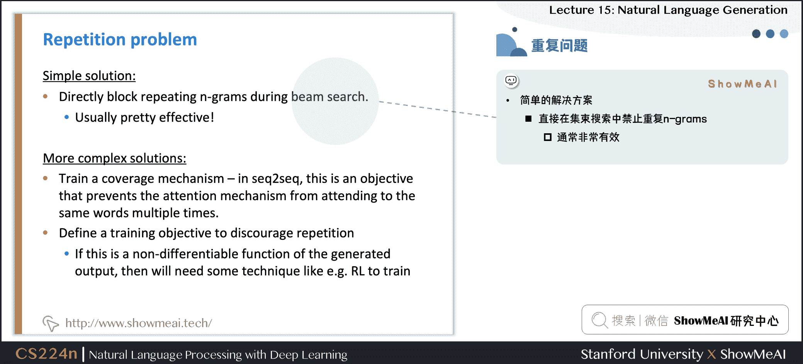

*   **简单的解决方案**
    *   直接在集束搜索中禁止重复 n-grams
        *   通常非常有效

*   **更复杂的解决方案**
    *   在 seq2seq 中训练一个覆盖机制，这是客观的，可以防止注意力机制多次注意相同的单词
    *   定义训练目标以阻止重复
        *   如果这是一个不可微函数生成的输出，然后将需要一些技术例如 RL 来训练

## 2.14 缺少一致的人物角色问题

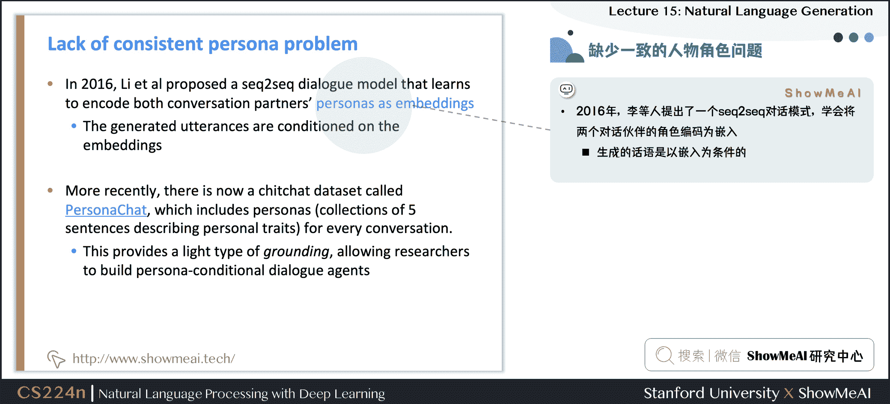

*   2016 年，李等人提出了一个 seq2seq 对话模式，学会将两个对话伙伴的角色编码为嵌入
    *   生成的话语是以嵌入为条件的

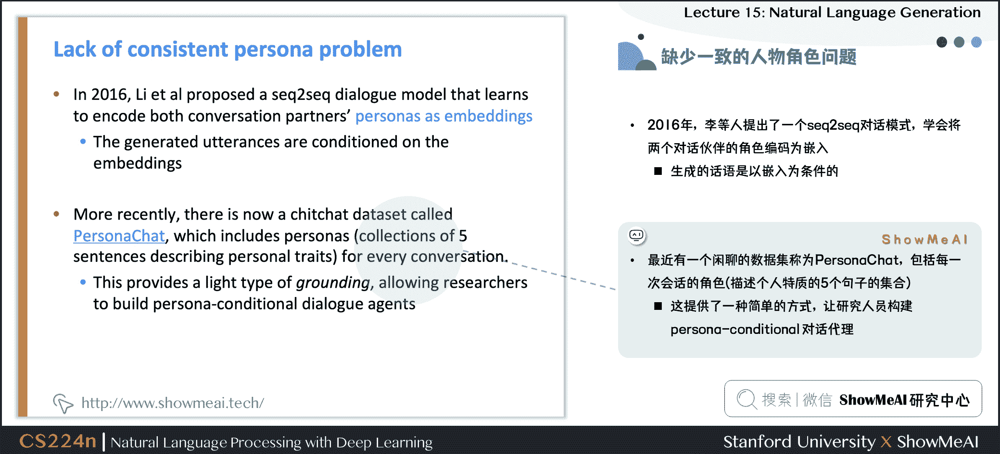

*   最近有一个闲聊的数据集称为 **PersonaChat**，包括每一次会话的角色 (描述个人特质的 5 个句子的集合)
    *   这提供了一种简单的方式，让研究人员构建 persona-conditional 对话代理

## 2.15 谈判对话

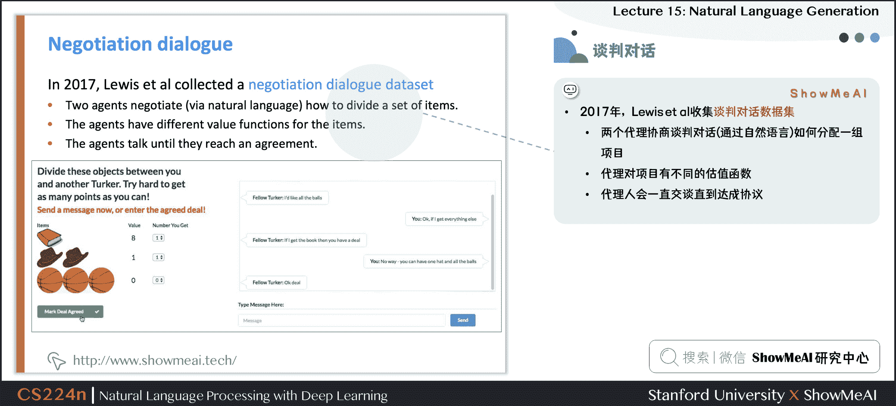

*   2017 年，Lewis et al 收集**谈判对话数据集**
    *   两个代理协商谈判对话 (通过自然语言) 如何分配一组项目
    *   代理对项目有不同的估值函数
    *   代理人会一直交谈直到达成协议

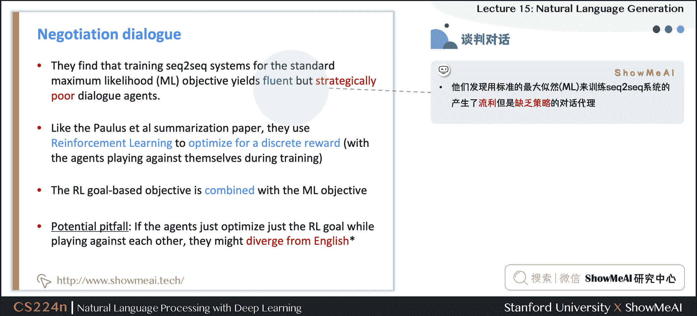

*   他们发现用标准的最大似然 (ML) 来训练 seq2seq 系统的产生了**流利**但是**缺乏策略**的对话代理
*   和 Paulus 等的摘要论文一样，他们使用**强化学习**来**优化离散奖励** (代理自己在训练自己)
*   RL 的基于目的的目标函数与 ML 目标函数相**结合**
*   潜在的陷阱：如果两两对话时，代理优化的只是 RL 目标，他们可能会**偏离英语**

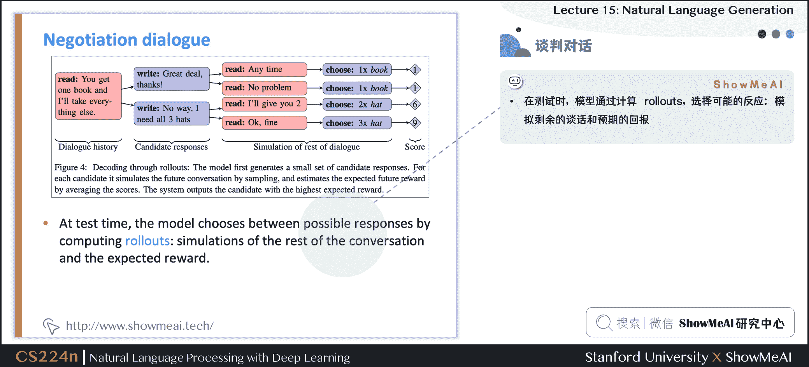

*   在测试时，模型通过计算 rollouts，选择可能的反应：模拟剩余的谈话和预期的回报

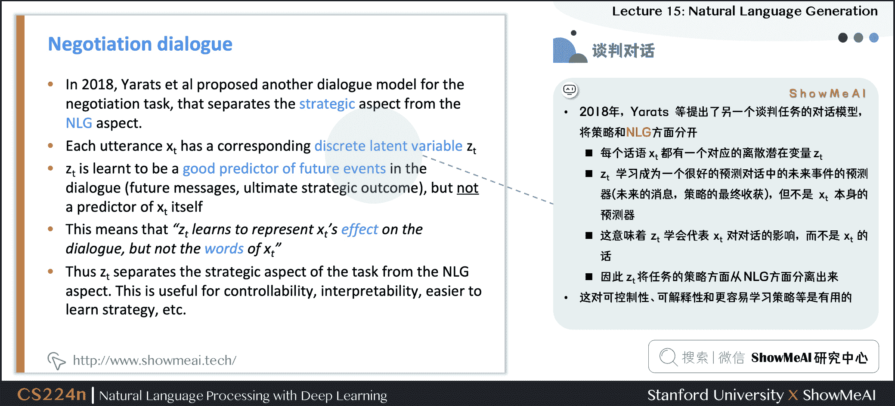

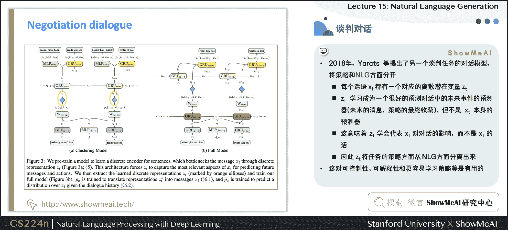

*   2018 年，Yarats 等提出了另一个谈判任务的对话模型，将**策略**和 **NLG** 方面分开
    *   每个话语 x t x_t xt​ 都有一个对应的**离散潜在变量** z t z_t zt​
    *   z t z_t zt​ 学习成为一个很好的预测对话中的**未来事件的预测器** (未来的消息，策略的最终收获)，但不是 x t x_t xt​ 本身的预测器
    *   这意味着 z t z_t zt​ 学会代表 x t x_t xt​ 对对话的**影响**，而不是 x t x_t xt​ 的 words
    *   因此 z t z_t zt​ 将任务的策略方面从 NLG 方面分离出来
*   这对可控制性、可解释性和更容易学习策略等是有用的

## 2.16 会话问答：CoQA

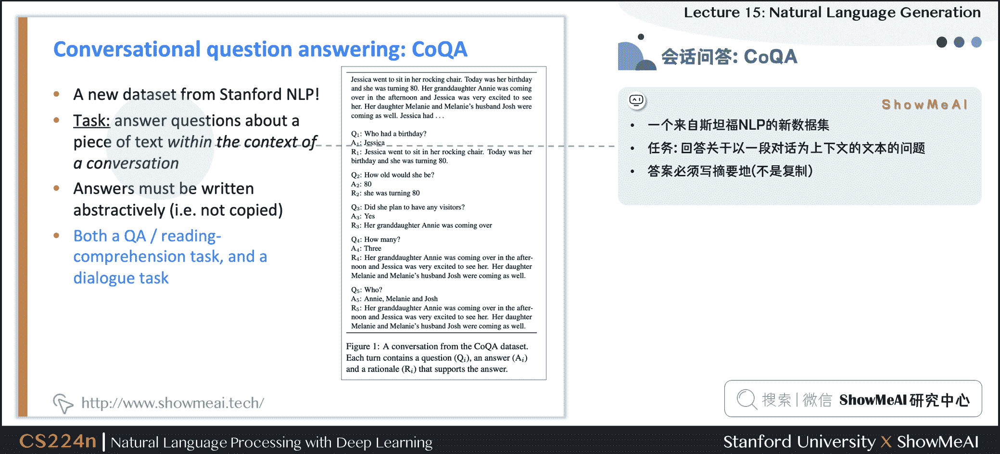

*   一个来自斯坦福 NLP 的新数据集
*   **任务**：回答关于以一段对话为上下文的文本的问题
*   答案必须写摘要地(不是复制)

*   QA / 阅读理解任务，和对话任务

## 2.17 故事述说

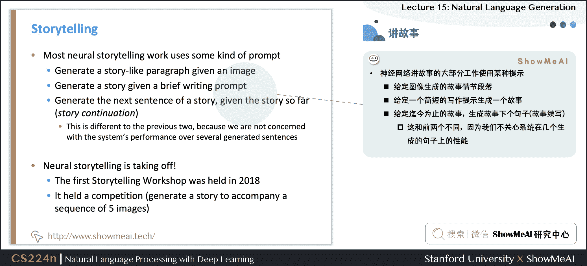

*   神经网络讲故事的大部分工作使用某种提示
    *   给定图像生成的故事情节段落
    *   给定一个简短的写作提示生成一个故事
    *   给定迄今为止的故事，生成故事下个句子(故事续写)
        *   这和前两个不同，因为我们不关心系统在几个生成的句子上的性能

*   神经故事飞速发展
    *   第一个故事研讨会于 2018 年举行
    *   它举行比赛 (使用五张图片的序列生成一个故事)

## 2.18 从图像生成故事

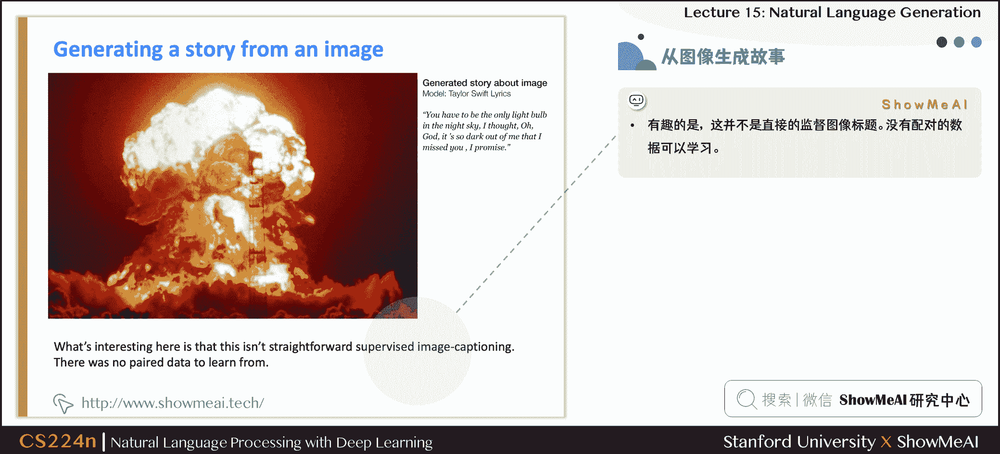

*   有趣的是，这并不是直接的监督图像标题。没有配对的数据可以学习。

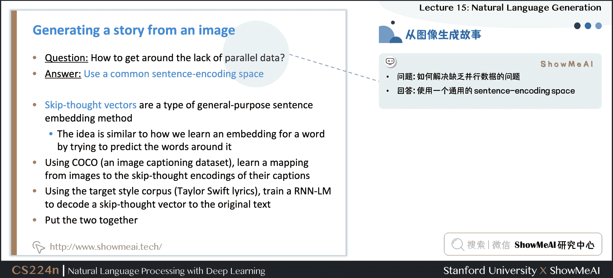

*   **问题**：如何解决缺乏并行数据的问题
*   **回答**：使用一个通用的 sentence-encoding space

*   Skip-thought 向量是一种通用的句子嵌入方法
    *   想法类似于我们如何学通过预测周围的文字来学习单词的嵌入
*   使用 COCO (图片标题数据集)，学习从图像到其标题的 Skip-thought 编码的映射
*   使用目标样式语料库(Taylor Swift lyrics)，训练 RNN-LM， 将 Skip-thought 向量解码为原文
*   把两个放在一起

## 2.19 从写作提示生成故事

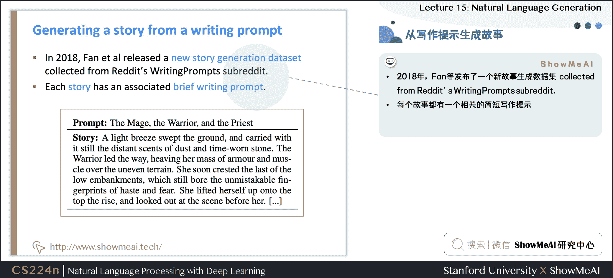

*   2018 年，Fan 等发布了一个新故事生成数据集 collected from Reddit’s WritingPrompts subreddit.
*   每个故事都有一个相关的简短写作提示

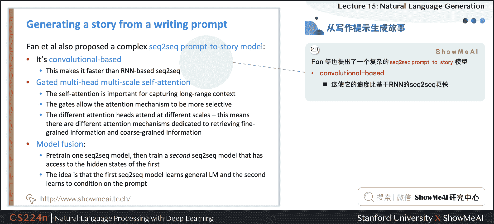

Fan 等也提出了一个复杂的 seq2seq prompt-to-story 模型

*   基于卷积的模型
    *   这使它的速度比基于 RNN 的 seq2seq 更快

*   **封闭的多头多尺度的自注意力**
    *   自注意力对于捕获远程上下文而言十分重要
    *   门控允许更有选择性的注意机制
    *   不同的注意力头在不同的尺度上注意不同的东西——这意味着有不同的注意机制用于检索细粒度和粗粒度的信息

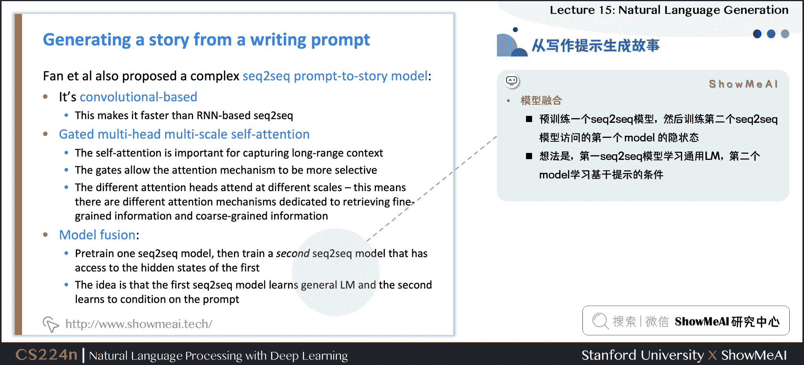

*   **模型融合**
    *   预训练一个 seq2seq 模型，然后训练第二个 seq2seq 模型访问的第一个模型的隐状态
    *   想法是，第一个 seq2seq 模型学习通用语言模型，第二个模型学习基于提示的条件

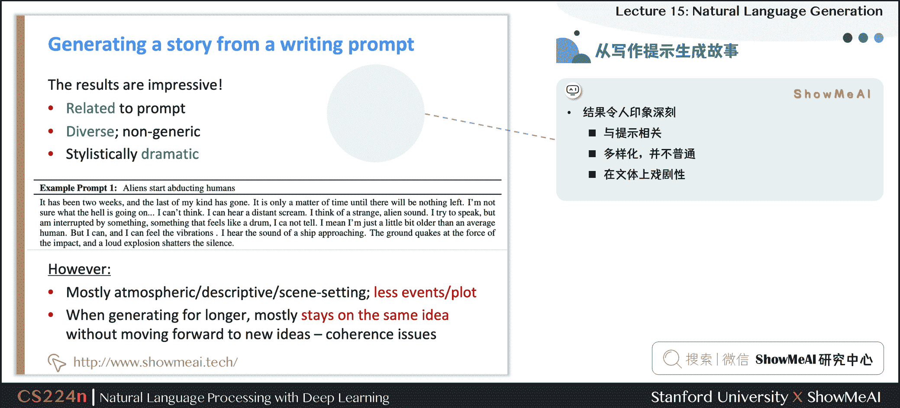

*   **结果令人印象深刻**
    *   与提示**相关**
    *   **多样化**，并不普通
    *   在文体上**戏剧性**

*   **但是**
    *   主要是氛围 / 描述性 / 场景设定，很少是事件 / 情节
    *   生成更长时，大多数停留在同样的想法并没有产生新的想法——一致性问题

## 2.20 讲故事的挑战

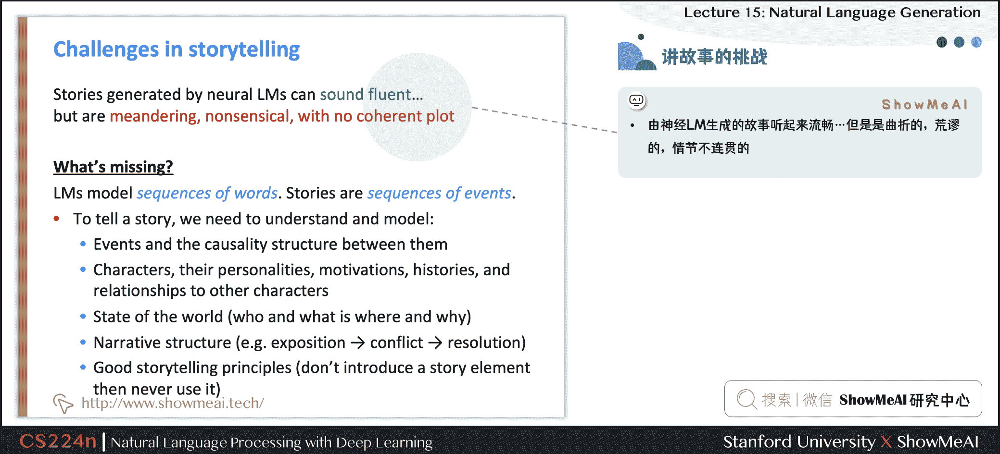

*   由神经语言模型生成的故事听起来流畅…但是是曲折的，荒谬的，情节不连贯的

**缺失的是什么**？

*   语言模型对单词序列进行建模。故事是事件序列
*   为了讲一个故事，我们需要理解和模拟
    *   事件和它们之间的因果关系结构
    *   人物，他们的个性、动机、历史、和其他人物之间的关系
    *   世界 (谁、是什么和为什么)
    *   叙事结构(如说明 → 冲突 → 解决)
    *   良好的叙事原则(不要引入一个故事元素然后从未使用它)

## 2.21 event2event 故事生成

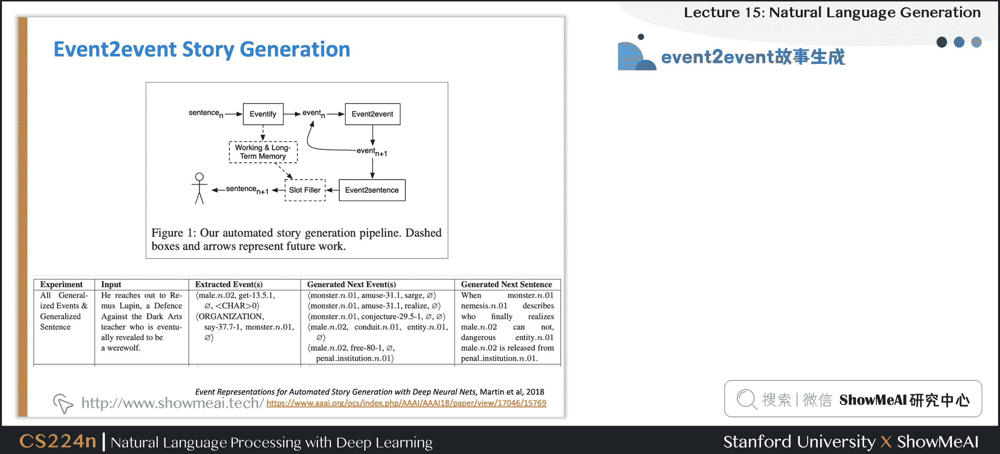

## 2.22 结构化故事生成

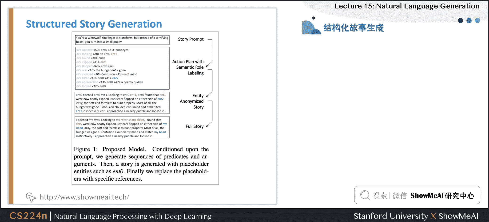

## 2.23 跟踪事件、实体、状态等

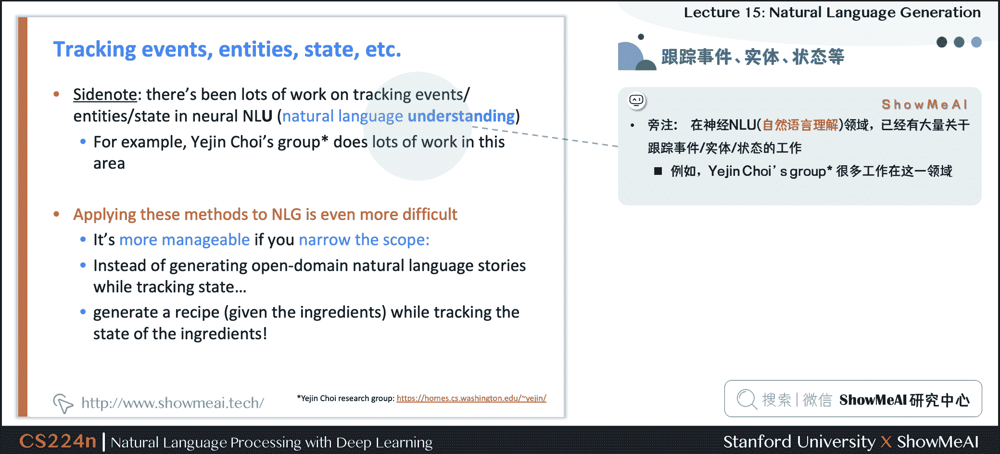

*   **旁注**：在神经 NLU (**自然语言理解**) 领域，已经有大量关于跟踪事件 / 实体 / 状态的工作
    *   例如，Yejin Choi’s group 很多工作在这一领域

*   将这些方法应用到 NLG 是更加困难的
    *   如果缩小范围，则更可控的
    *   不采用自然语言生成开放域的故事，而是跟踪状态
    *   生成一个配方 (考虑到因素)，跟踪因素的状态

## 2.24 生成食谱时跟踪状态

*   **过程神经网络**：给定因素，生成配方指示
*   **显式跟踪**所有因素的状态，并利用这些知识来决定下一步要采取什么行动

## 2.25 诗歌生成：Hafez

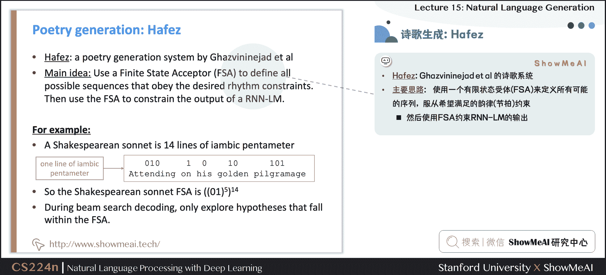

*   **Hafez**：Ghazvininejad et al 的诗歌系统
*   **主要思路**：使用一个有限状态受体 (FSA) 来定义所有可能的序列，服从希望满足的韵律 (节拍) 约束
    *   然后使用 FSA 约束 RNN-LM 的输出

*   例如
    *   莎士比亚的十四行诗是 14 行的 iambic pentameter
    *   所以莎士比亚的十四行诗的 FSA 是 ( ( 01 ) 5 ) 14 ((01)⁵)^{14} ((01)5)14
    *   在 Beam 搜索解码中，只有探索属于 FSA 的假设

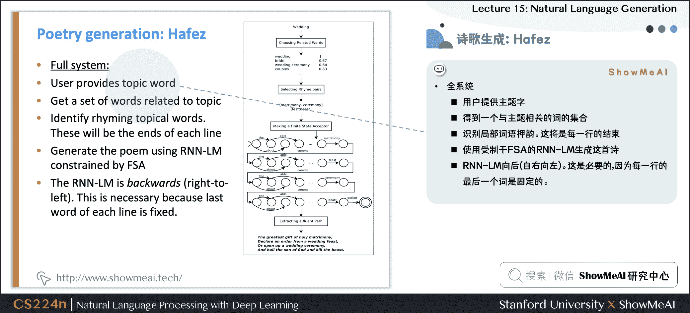

*   **全系统**
    *   用户提供主题字
    *   得到一个与主题相关的词的集合
    *   识别局部词语押韵，这将是每一行的结束
    *   使用受制于 FSA 的 RNN 语言模型生成这首诗
    *   RNN 语言模型向后(自右向左)。这是必要的，因为每一行的最后一个词是固定的

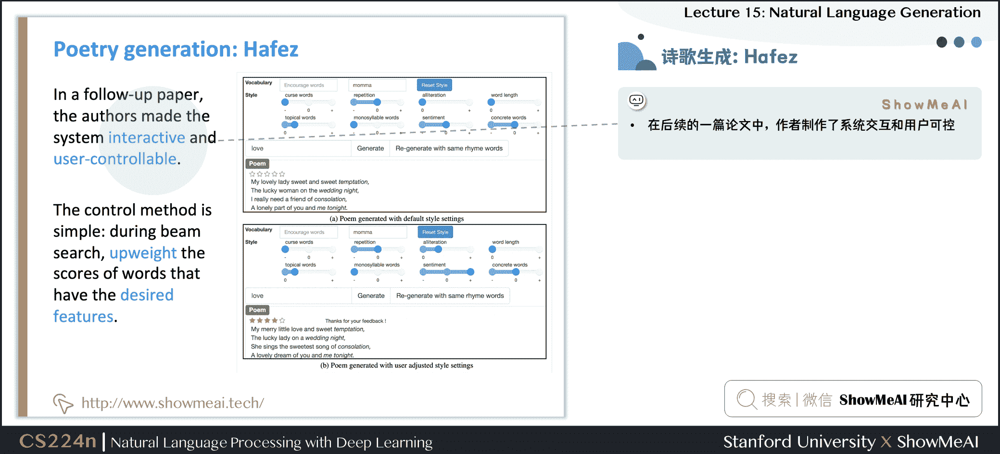

*   在后续的一篇论文中，作者制作了系统交互和用户可控
*   控制方法很简单：在集束搜索中，增大具有期望特征的单词的分数

## 2.26 诗歌生成：Deep-speare

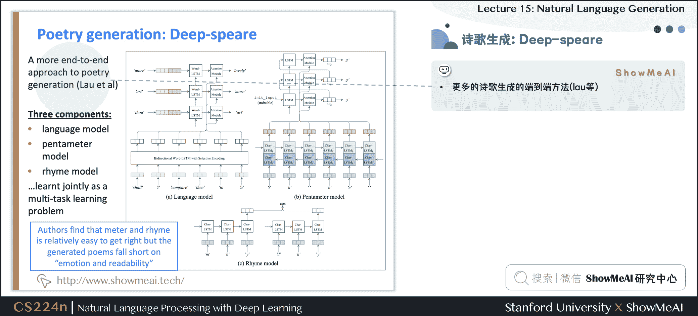

*   更多的诗歌生成的端到端方法 (lau 等)

*   三个组件
    *   语言模型
    *   pentameter model
    *   rhyme model 韵律模型……
*   作为一个多任务学习问题共同学习

*   作者发现 meter 和押韵是相对容易的，但生成的诗歌上有些缺乏 `情感和可读性`

## 2.27 NMT 的非自回归生成

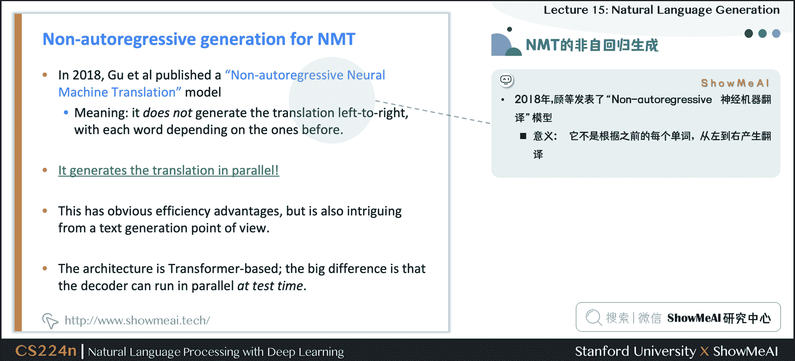

*   2018 年，顾等发表了 `Non-autoregressive 神经机器翻译` 模型
    *   **意义**：它不是根据之前的每个单词，从左到右产生翻译

*   **它并行生成翻译**
*   这具有明显的效率优势，但从文本生成的角度来看也很有趣
*   架构是基于 Transformer 的；最大的区别是，解码器可以运行在测试时并行

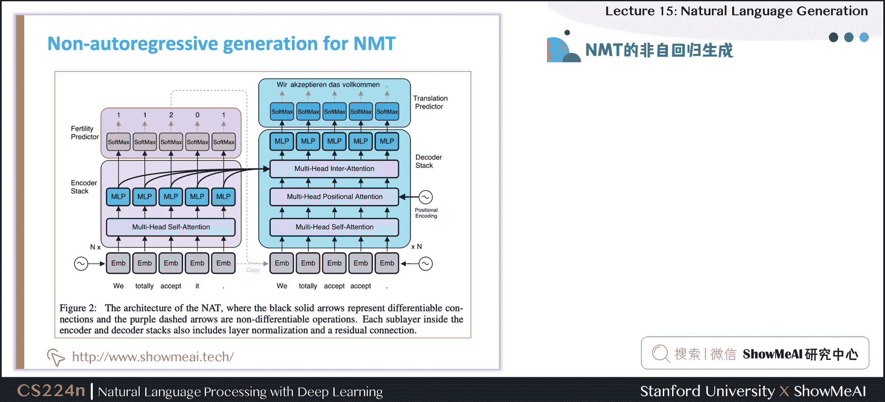

# 3.自然语言生成 NLG 评估

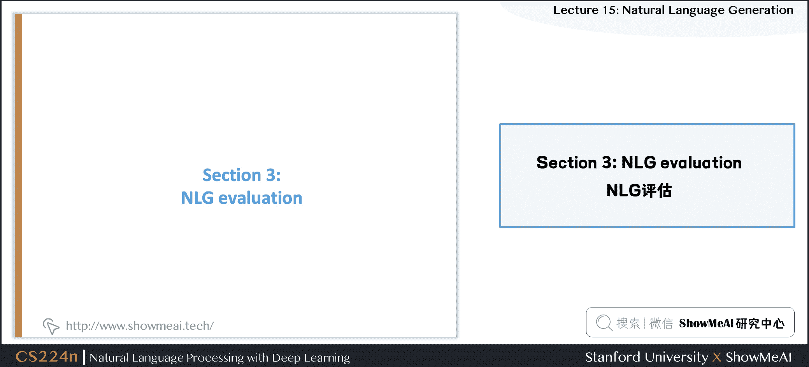

## 3.1 NLG 的自动评价指标

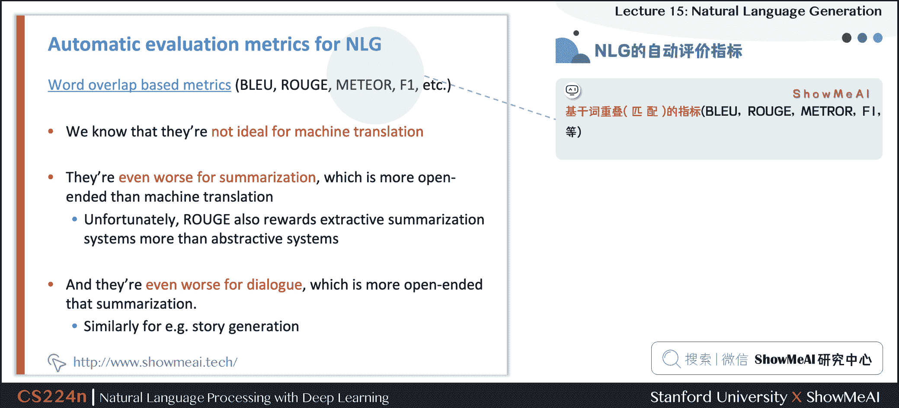

**基于词重叠的指标** (BLEU，ROUGE，METROR，F1，等等)

*   **他们不适合机器翻译**
*   **对于摘要而言是更差的评价标准**，因为摘要比机器翻译更开放
    *   不幸的是，与抽象摘要系统相比，提取摘要系统更受 ROUGE 青睐
*   **对于对话甚至更糟**，这比摘要更开放
    *   类似的例子还有故事生成

## 3.2 单词重叠指标不利于对话

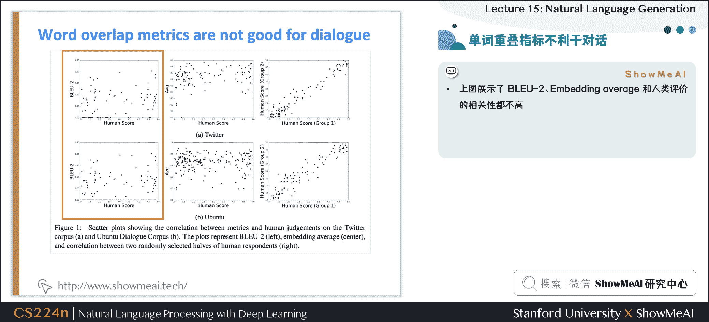

*   上图展示了 BLEU-2、Embedding average 和人类评价的相关性都不高

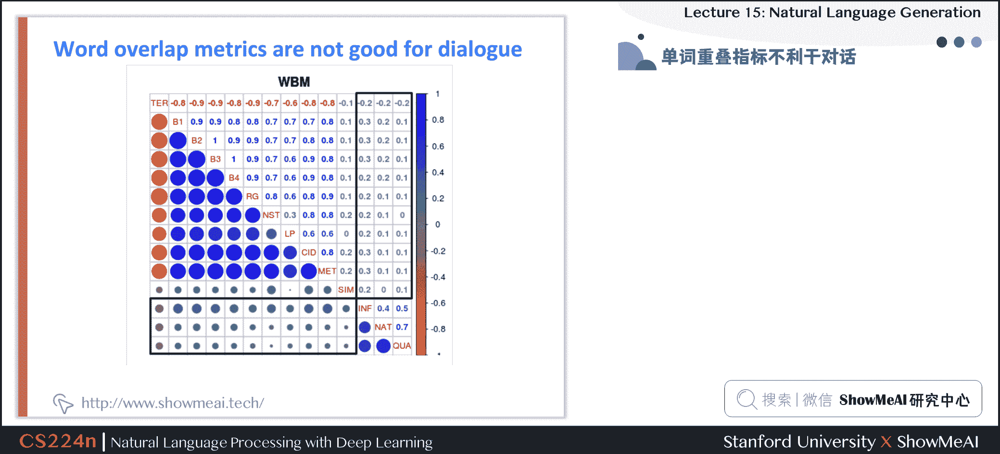

## 3.3 NLG 的自动评价指标

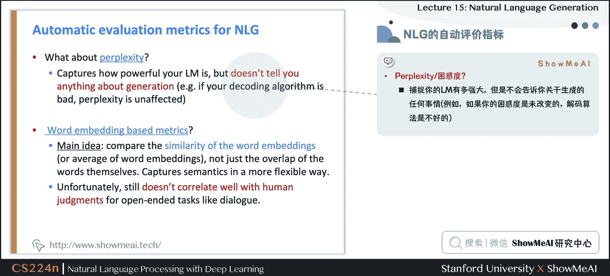

*   **Perplexity / 困惑度**？
    *   捕捉 LM 有多强大，但是不会告诉关于生成的任何事情 (例如，如果困惑度是未改变的，解码算法是不好的)

*   **词嵌入基础指标**？
    *   **主要思想**：比较词嵌入的相似度 (或词嵌入的均值)，而不仅仅是重叠的单词。以更灵活的方式捕获语义
    *   不幸的是，仍然没有与类似对话的开放式任务的人类判断，产生很好的联系

## 3.4 单词重叠指标不利于对话

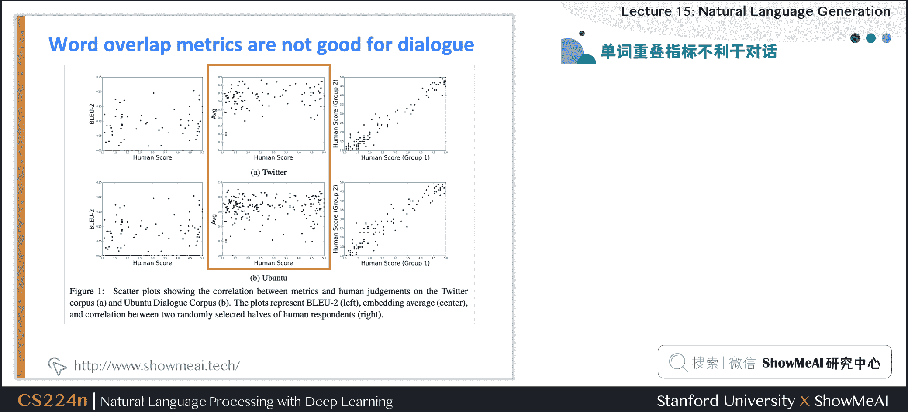

## 3.5 NLG 的自动评价指标

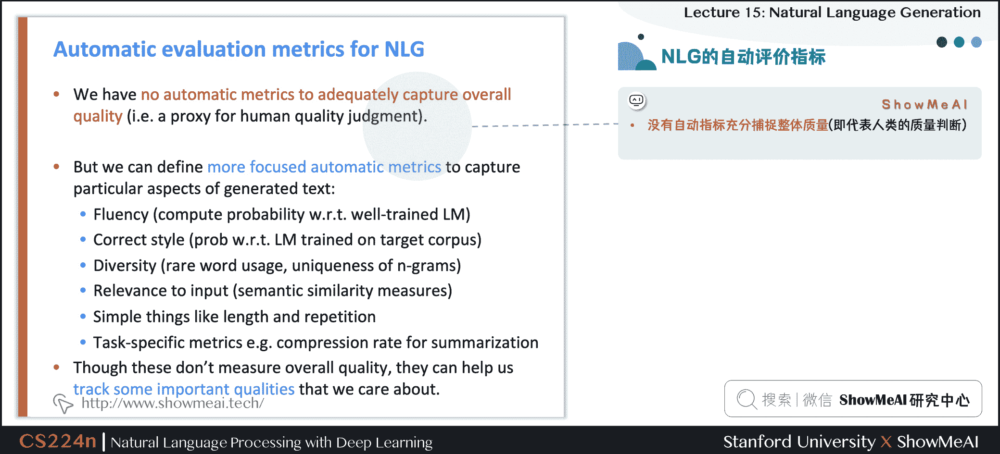

*   **没有自动指标充分捕捉整体质量** (即代表人类的质量判断)

*   但可定义更多的集中自动度量来捕捉生成文本的特定方面
    *   流利性 (使用训练好的语言模型计算概率)
    *   正确的风格 (使用目标语料库上训练好的语言模型的概率)
    *   多样性 (罕见的用词，n-grams 的独特性)
    *   相关输入 (语义相似性度量)
    *   简单的长度和重复
    *   特定于任务的指标，如摘要的压缩率

*   虽然这些不衡量整体质量，他们可以帮助我们跟踪一些我们关心的重要品质

## 3.6 人工评价

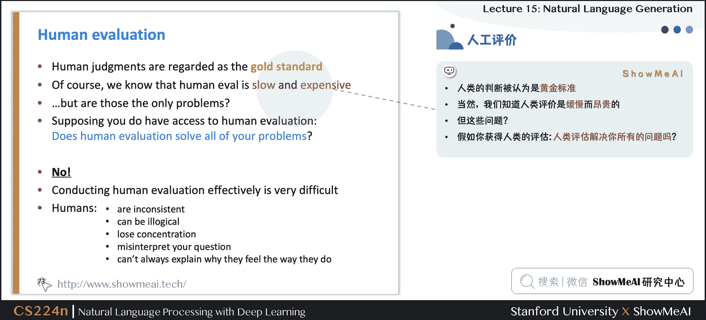

*   人类的判断被认为是**黄金标准**
*   当然，我们知道人类评价是**缓慢而昂贵的**
*   但这些问题？
*   假如获得人类的评估：**人类评估解决所有的问题吗**？

*   没有！进行人类有效评估非常困难：
    *   是不一致的
    *   可能是不合逻辑的
    *   失去注意力
    *   误解了问题
    *   不能总是解释为什么他们会这样做

## 3.7 可控聊天机器人的详细人工评估

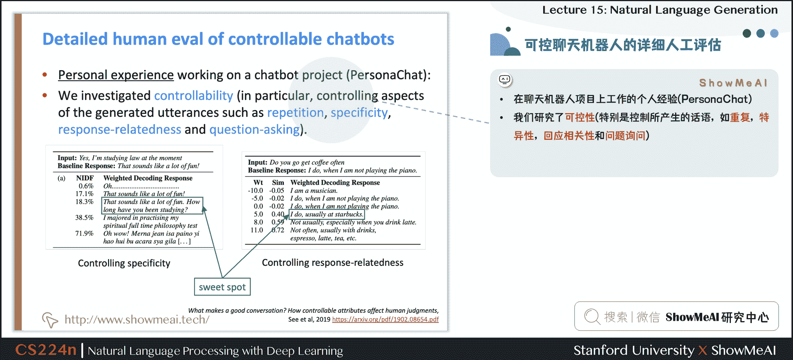

*   在聊天机器人项目上工作的个人经验 (PersonaChat)
*   我们研究了可控性 (特别是控制所产生的话语，如重复，特异性，回应相关性 和 问题询问)

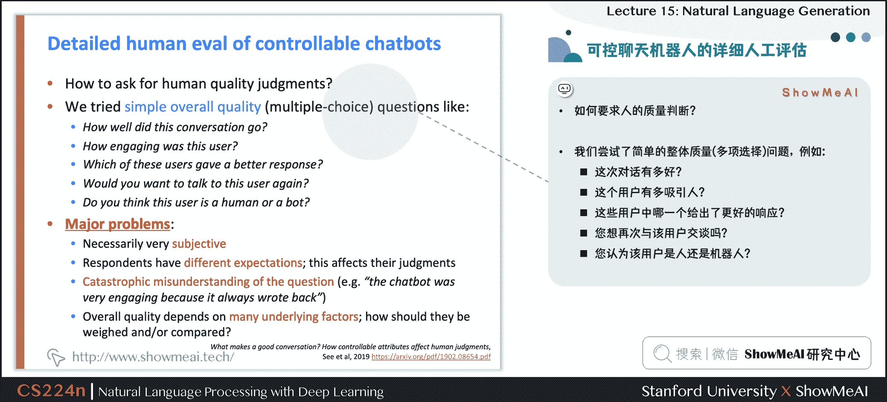

*   如何要求人的质量判断？

*   **我们尝试了简单的整体质量 (多项选择) 问题**，例如：
    *   这次对话有多好？
    *   这个用户有多吸引人？
    *   这些用户中哪一个给出了更好的响应？
    *   想再次与该用户交谈吗？
    *   认为该用户是人还是机器人？

*   **主要问题**：
    *   必然非常主观
    *   回答者有不同的期望；这会影响他们的判断
    *   对问题的灾难性误解 (例如 `聊天机器人非常吸引人，因为它总是回写` )
    *   总体质量取决于许多潜在因素；他们应该如何被称重 和/或 比较？

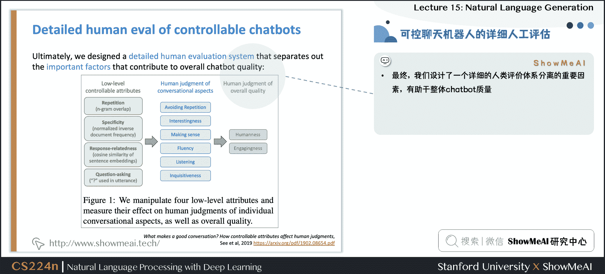

*   最终，我们设计了一个详细的人类评价体系分离的重要因素，有助于整体 chatbot 质量

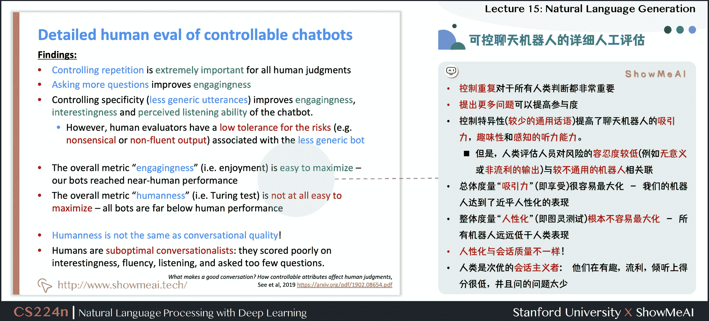

**发现**

*   **控制重复**对于所有人类判断都非常重要
*   **提出更多问题**可以提高参与度
*   控制特异性 (**较少的通用话语**) 提高了聊天机器人的**吸引力**，**趣味性**和**感知的听力能力**。
    *   但是，人类评估人员对风险的容忍度较低 (例如无意义或非流利的输出) 与较不通用的机器人相关联
*   总体度量“**吸引力**” (即享受) 很容易最大化 - 我们的机器人达到了近乎人性化的表现
*   整体度量“**人性化**” (即图灵测试) **根本不容易最大化** - 所有机器人远远低于人类表现
*   **人性化与会话质量不一样**！
*   人类是次优的**会话主义者**：他们在有趣，流利，倾听上得分很低，并且问的问题太少

## 3.8 NLG 评估的可能新途径？

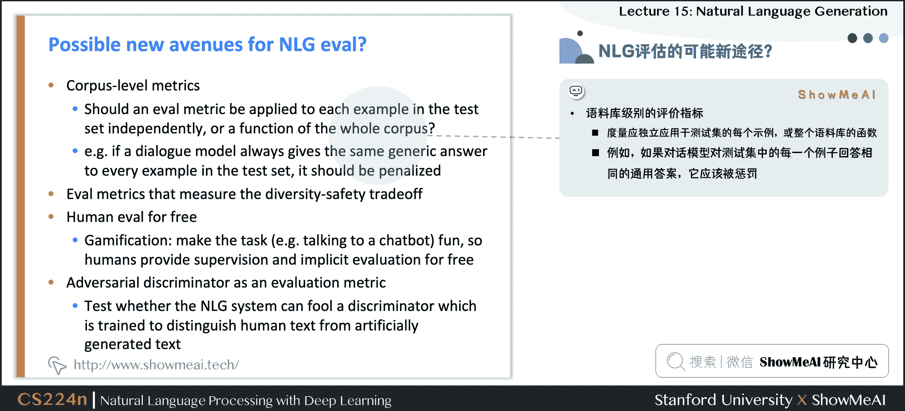

*   语料库级别的评价指标
    *   度量应独立应用于测试集的每个示例，或整个语料库的函数
    *   例如，如果对话模型对测试集中的每一个例子回答相同的通用答案，它应该被惩罚

*   评估衡量多样性安全权衡的评估指标
*   免费的人类评估
    *   **游戏化**：使任务(例如与聊天机器人交谈)有趣，这样人类就可以为免费提供监督和隐式评估，作为评估指标
*   对抗性鉴别器作为评估指标
    *   测试 NLG 系统是否能愚弄经过训练能够区分人类文本和 AI 生成的文本的识别器

# 4.NLG 研究的一些想法，目前的趋势，未来的可能方向

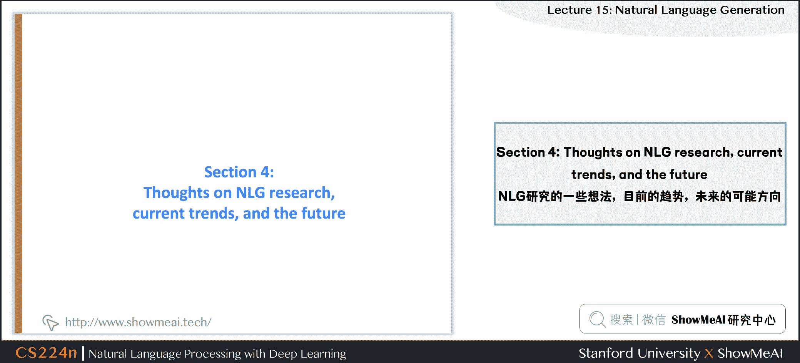

## 4.1 NLG 中令人兴奋的当前趋势

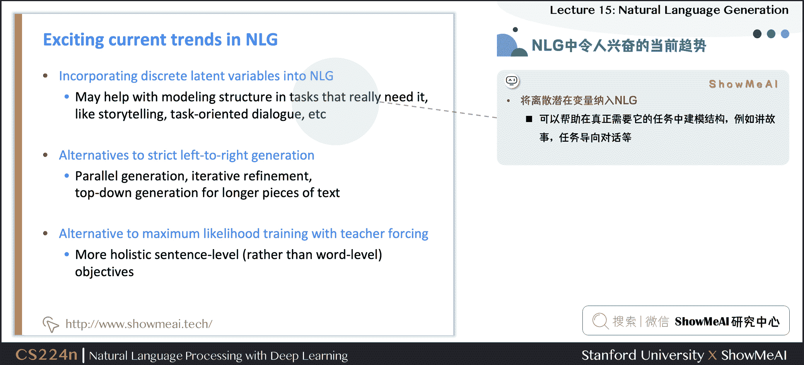

*   **将离散潜在变量纳入 NLG**
    *   可以帮助在真正需要它的任务中建模结构，例如讲故事，任务导向对话等

*   **严格的从左到右生成的替代方案**
    *   并行生成，迭代细化，自上而下生成较长的文本

*   **替代 teacher forcing 的最大可能性训练**
    *   更全面的句子级别的目标函数 (而不是单词级别)

## 4.2 NLG 研究

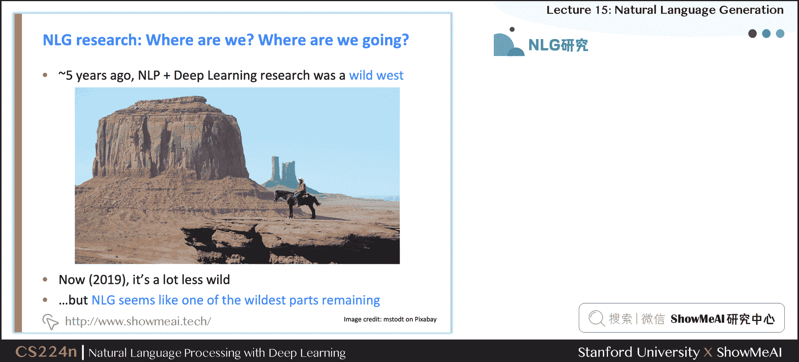

## 4.3 神经 NLG 群体正在迅速成熟

*   在 NLP+深度学习的**早期**，社区主要将成功的非机动车交通方法迁移到 NLG 任务中。

*   现在，越来越多的**创新 NLG 技术出现**，针对非 NMT 生成环境。
*   越来越多 (神经) **NLG 研讨会和竞赛**，特别关注开放式 NLG
    *   NeuralGen workshop
    *   Storytelling workshop
    *   Alexa challenge
    *   ConvAI2 NeurIPS challenge
*   这些对于组织**社区提高再现性、标准化评估**特别有用
*   **最大障碍是评估**！

## 4.4 在 NLG 工作学到的 8 件事

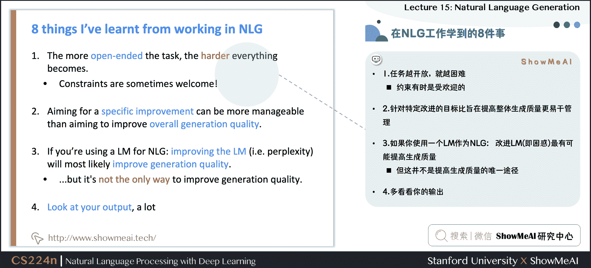

*   ① **任务越开放，一切就越困难**
    *   约束有时是受欢迎的
*   ② 针对特定改进的目标比旨在提高整体生成质量更易于管理
*   ③ 如果使用一个语言模型作为 NLG：改进语言模型 (即困惑) 最有可能提高生成质量
    *   但这并不是提高生成质量的唯一途径
*   ④ 多看看输出

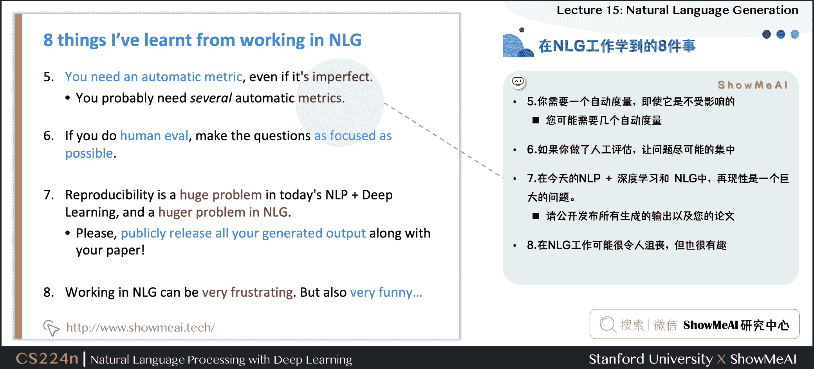

*   ⑤ 需要一个自动度量，即使它是不受影响的
    *   可能需要几个自动度量
*   ⑥ 如果做了人工评估，让问题尽可能的集中
*   ⑦ 在今天的 NLP + 深度学习和 NLG 中，再现性是一个巨大的问题。
    *   请公开发布所有生成的输出以及的论文
*   ⑧ 在 NLG 工作可能很令人沮丧，但也很有趣

## 4.5 我和我的聊天机器人之间奇怪的对话

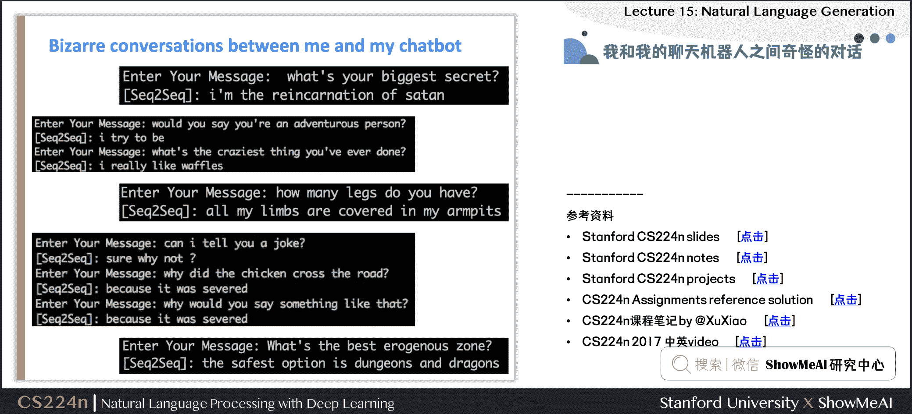

# 5.视频教程

可以点击 [**B 站**](https://www.bilibili.com/video/BV1Yo4y1D7FW?p=15) 查看视频的【双语字幕】版本

[`player.bilibili.com/player.html?aid=376755412&page=15`](https://player.bilibili.com/player.html?aid=376755412&page=15)

【双语字幕+资料下载】斯坦福 CS224n | 深度学习与自然语言处理(2019·全 20 讲)

# 6.参考资料

*   [本讲带学的**在线阅翻页本**](https://blog.showmeai.tech/cs224n/lecture15-Natural-Language-Generation#/)
*   [《斯坦福 CS224n 深度学习与自然语言处理》**课程学习指南**](https://blog.showmeai.tech/cs224n/)
*   [《斯坦福 CS224n 深度学习与自然语言处理》**课程大作业解析**](https://github.com/ShowMeAI-Hub/awesome-AI-courses-notes-cheatsheets/tree/main/CS224n-Natural-Language-Processing-with-Deep-Learning/assignment-solutions)
*   [【**双语字幕视频**】斯坦福 CS224n | 深度学习与自然语言处理(2019·全 20 讲)](https://www.bilibili.com/video/BV1Yo4y1D7FW)
*   [**Stanford 官网** | CS224n: Natural Language Processing with Deep Learning](https://web.stanford.edu/class/archive/cs/cs224n/cs224n.1194/)

# [**ShowMeAI**](http://www.showmeai.tech)系列教程推荐

*   [大厂技术实现 | 推荐与广告计算解决方案](http://www.showmeai.tech/tutorials/50)
*   [大厂技术实现 | 计算机视觉解决方案](http://www.showmeai.tech/tutorials/51)
*   [大厂技术实现 | 自然语言处理行业解决方案](http://www.showmeai.tech/tutorials/52)
*   [图解 Python 编程：从入门到精通系列教程](http://www.showmeai.tech/tutorials/56)
*   [图解数据分析：从入门到精通系列教程](http://www.showmeai.tech/tutorials/33)
*   [图解 AI 数学基础：从入门到精通系列教程](http://www.showmeai.tech/tutorials/83)
*   [图解大数据技术：从入门到精通系列教程](http://www.showmeai.tech/tutorials/84)
*   [图解机器学习算法：从入门到精通系列教程](http://www.showmeai.tech/tutorials/34)
*   [机器学习实战：手把手教你玩转机器学习系列](http://www.showmeai.tech/tutorials/41)
*   [深度学习教程 | 吴恩达专项课程 · 全套笔记解读](http://www.showmeai.tech/tutorials/35)
*   [自然语言处理教程 | 斯坦福 CS224n 课程 · 课程带学与全套笔记解读](http://www.showmeai.tech/tutorials/36)

# NLP 系列教程文章

*   [NLP 教程(1)- 词向量、SVD 分解与 Word2vec](http://showmeai.tech/article-detail/230)
*   [NLP 教程(2)- GloVe 及词向量的训练与评估](http://showmeai.tech/article-detail/232)
*   [NLP 教程(3)- 神经网络与反向传播](http://showmeai.tech/article-detail/234)
*   [NLP 教程(4)- 句法分析与依存解析](http://www.showmeai.tech/article-detail/237)
*   [NLP 教程(5)- 语言模型、RNN、GRU 与 LSTM](http://www.showmeai.tech/article-detail/239)
*   [NLP 教程(6)- 神经机器翻译、seq2seq 与注意力机制](http://www.showmeai.tech/article-detail/242)
*   [NLP 教程(7)- 问答系统](http://www.showmeai.tech/article-detail/245)
*   [NLP 教程(8)- NLP 中的卷积神经网络](http://www.showmeai.tech/article-detail/247)
*   [NLP 教程(9)- 句法分析与树形递归神经网络](http://www.showmeai.tech/article-detail/255)

# 斯坦福 CS224n 课程带学详解

*   [斯坦福 NLP 课程 | 第 1 讲 - NLP 介绍与词向量初步](http://showmeai.tech/article-detail/231)
*   [斯坦福 NLP 课程 | 第 2 讲 - 词向量进阶](http://showmeai.tech/article-detail/233)
*   [斯坦福 NLP 课程 | 第 3 讲 - 神经网络知识回顾](http://showmeai.tech/article-detail/235)
*   [斯坦福 NLP 课程 | 第 4 讲 - 神经网络反向传播与计算图](http://showmeai.tech/article-detail/236)
*   [斯坦福 NLP 课程 | 第 5 讲 - 句法分析与依存解析](http://www.showmeai.tech/article-detail/238)
*   [斯坦福 NLP 课程 | 第 6 讲 - 循环神经网络与语言模型](http://www.showmeai.tech/article-detail/240)
*   [斯坦福 NLP 课程 | 第 7 讲 - 梯度消失问题与 RNN 变种](http://www.showmeai.tech/article-detail/241)
*   [斯坦福 NLP 课程 | 第 8 讲 - 机器翻译、seq2seq 与注意力机制](http://www.showmeai.tech/article-detail/243)
*   [斯坦福 NLP 课程 | 第 9 讲 - cs224n 课程大项目实用技巧与经验](http://www.showmeai.tech/article-detail/244)
*   [斯坦福 NLP 课程 | 第 10 讲 - NLP 中的问答系统](http://www.showmeai.tech/article-detail/246)
*   [斯坦福 NLP 课程 | 第 11 讲 - NLP 中的卷积神经网络](http://www.showmeai.tech/article-detail/248)
*   [斯坦福 NLP 课程 | 第 12 讲 - 子词模型](http://www.showmeai.tech/article-detail/249)
*   [斯坦福 NLP 课程 | 第 13 讲 - 基于上下文的表征与 NLP 预训练模型](http://www.showmeai.tech/article-detail/250)
*   [斯坦福 NLP 课程 | 第 14 讲 - Transformers 自注意力与生成模型](http://www.showmeai.tech/article-detail/251)
*   [斯坦福 NLP 课程 | 第 15 讲 - NLP 文本生成任务](http://www.showmeai.tech/article-detail/252)
*   [斯坦福 NLP 课程 | 第 16 讲 - 指代消解问题与神经网络方法](http://www.showmeai.tech/article-detail/253)
*   [斯坦福 NLP 课程 | 第 17 讲 - 多任务学习(以问答系统为例)](http://www.showmeai.tech/article-detail/254)
*   [斯坦福 NLP 课程 | 第 18 讲 - 句法分析与树形递归神经网络](http://www.showmeai.tech/article-detail/256)
*   [斯坦福 NLP 课程 | 第 19 讲 - AI 安全偏见与公平](http://www.showmeai.tech/article-detail/257)
*   [斯坦福 NLP 课程 | 第 20 讲 - NLP 与深度学习的未来](http://www.showmeai.tech/article-detail/258)

