# 斯坦福 NLP 课程 | 第 16 讲 - 指代消解问题与神经网络方法

> 原文：[`blog.csdn.net/ShowMeAI/article/details/124668546`](https://blog.csdn.net/ShowMeAI/article/details/124668546)

*   作者：[韩信子](https://github.com/HanXinzi-AI)@[ShowMeAI](http://www.showmeai.tech/)，路遥@[ShowMeAI](http://www.showmeai.tech/)，奇异果@[ShowMeAI](http://www.showmeai.tech/)
*   [教程地址](http://www.showmeai.tech/tutorials/36)：[`www.showmeai.tech/tutorials/36`](http://www.showmeai.tech/tutorials/36)
*   [本文地址](http://www.showmeai.tech/article-detail/253)：[`www.showmeai.tech/article-detail/253`](http://www.showmeai.tech/article-detail/253)
*   声明：版权所有，转载请联系平台与作者并注明出处
*   收藏[ShowMeAI](http://www.showmeai.tech/)查看更多精彩内容

* * *

[ShowMeAI](http://www.showmeai.tech/)为**斯坦福 CS224n**《自然语言处理与深度学习(Natural Language Processing with Deep Learning)》课程的全部课件，做了**中文翻译和注释**，并制作成了 GIF 动图！视频和课件等资料的获取方式见**文末**。

* * *

## 引言

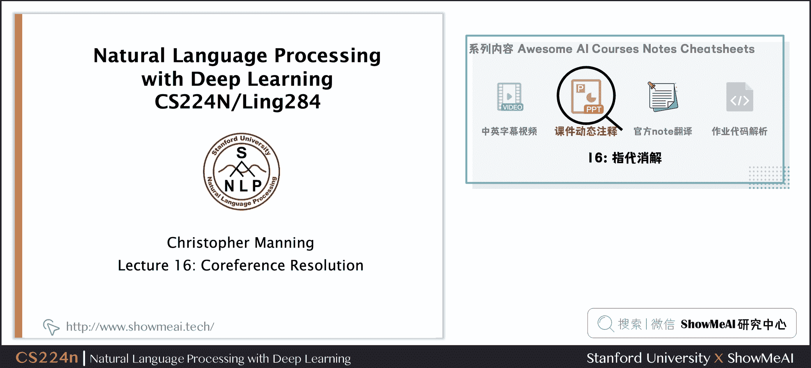

## 授课计划

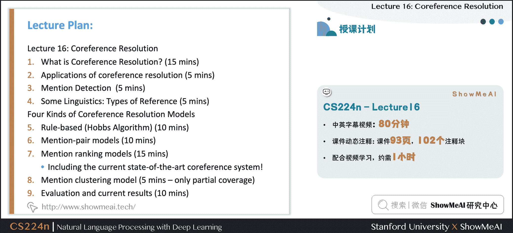

*   What is Coreference Resolution? / **什么是共指消解(指代消解)**
*   Applications of coreference resolution / **共指消解应用**
*   Mention Detection / **指代检测**
*   Some Linguistics: Types of Reference Four Kinds of Coreference Resolution Models
*   Rule-based (Hobbs Algorithm) / **基于规则的方式**
*   Mention-pair models / **指代对模型**
*   Mention ranking models / **指代排序模型**
    *   Including the current state-of-the-art coreference system!
*   Mention clustering model / **指代聚类模型**
*   Evaluation and current results / **效果评估**

# 1.共指消解定义

*   识别所有涉及到相同现实世界实体的 mention (指代)
*   He, her 都是实体的提及 mentions of entities (实体指代)

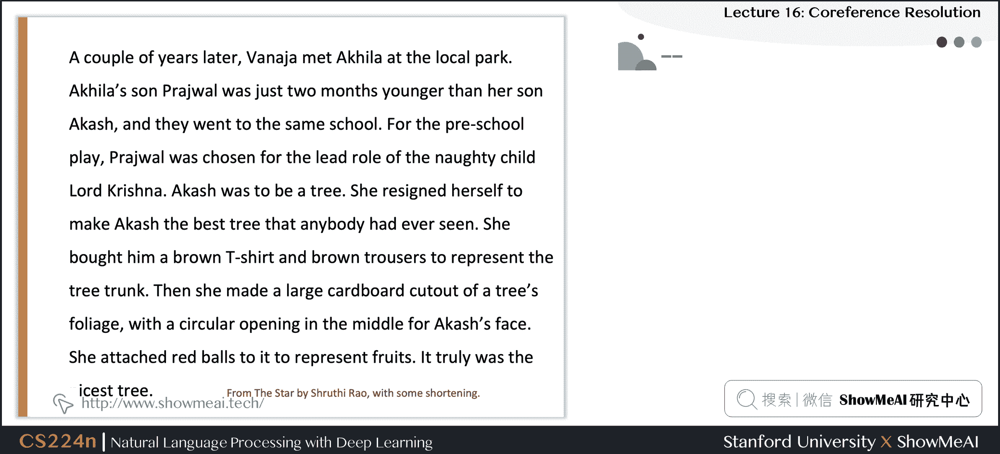

# 2.共指消解应用

## 2.1 应用

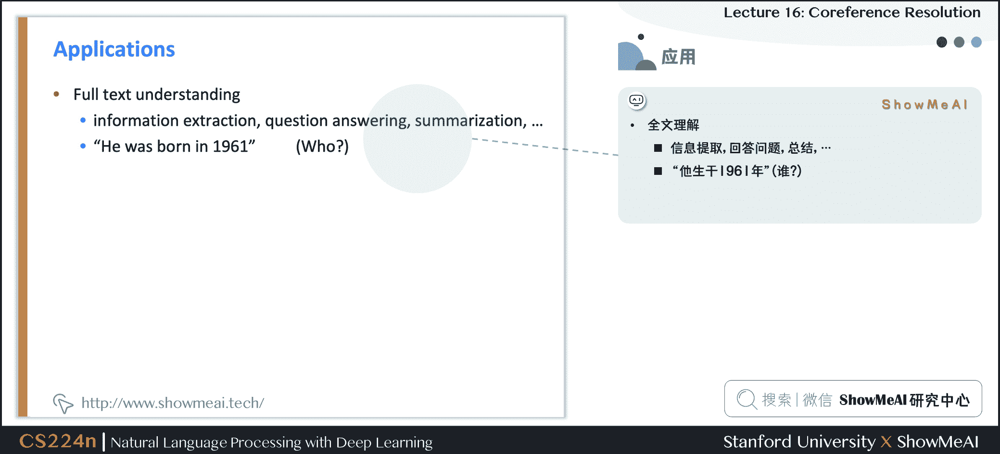

*   **全文理解**
    *   信息提取，回答问题，总结，…
    *   `他生于 1961 年` (谁?)

*   **机器翻译**
    *   语言对性别，数量等有不同的特征

*   **对话系统**

## 2.2 指代消解两个步骤

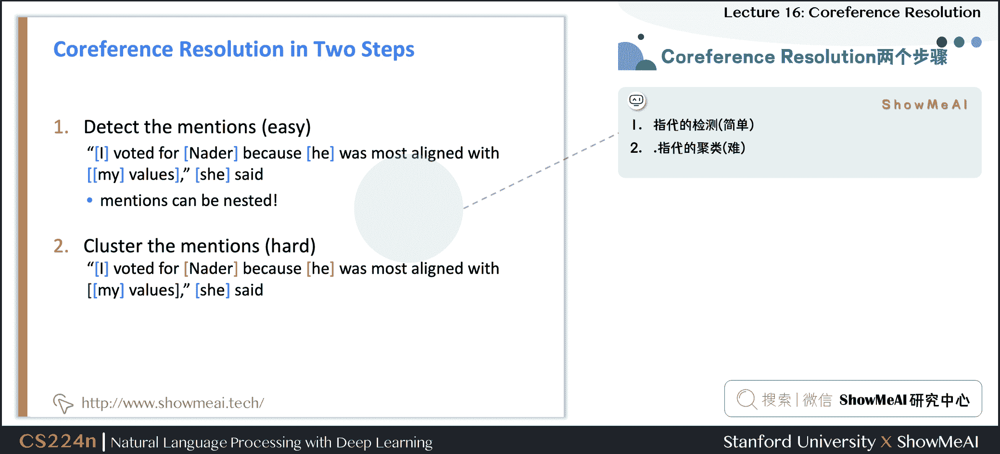

*   ① 指代的检测(简单)
*   ② 指代的聚类(难)

# 3.指代检测

## 3.1 指代检测

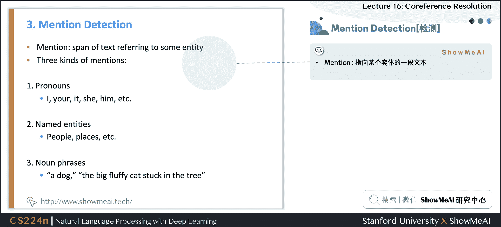

*   Mention：指向某个实体的一段文本

**三种 mention**

*   ① **Pronouns 代词**
    *   I, your, it, she, him, etc.
*   ② **Named entities 命名实体**
    *   People, places, etc.
*   ③ **Noun phrases 名词短语**
    *   “a dog,” “the big fluffy cat stuck in the tree”

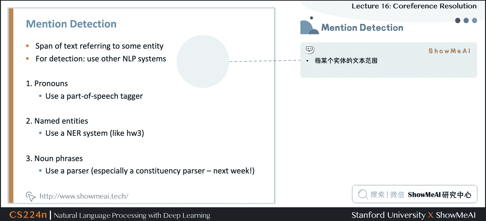

*   指某个实体的文本范围

*   检测：使用其他 NLP 系统

*   ① **Pronouns 代词**
    *   【I, your, it, she, him, etc.】因为代词是 POS 检测结果的一种，所以只要使用 POS 检测器即可
*   ② **Named entities 命名实体**
    *   【People, places, etc.】Use a NER system
*   ③ **Noun phrases 名词短语**
    *   【“a dog,” “the big fluffy cat stuck in the tree”】Use a parser (尤其依存解析器)

## 3.2 指代检测：并非很简单

*   将所有代词、命名实体和 NPs 标记为 `mention` 或 `over-generates mentions`

*   下方是否是 mention？
    *   lt is sunny
    *   Every student
    *   No student
    *   The best donut in the world
    *   100 miles

## 3.3 如何处理这些不好的指代

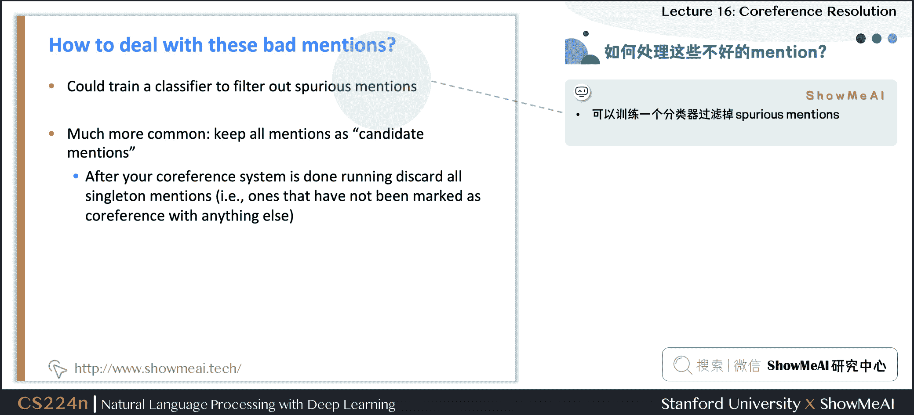

*   可以训练一个分类器过滤掉 spurious mentions

*   更为常见的：保持所有 `mentions` 作为 `candidate mentions`
*   在你的 coreference 系统运行完成后，丢弃所有的单个 mention (即没有被标记为与其他任何东西 coreference 的)

## 3.4 我们能不用繁琐的流水线系统吗？

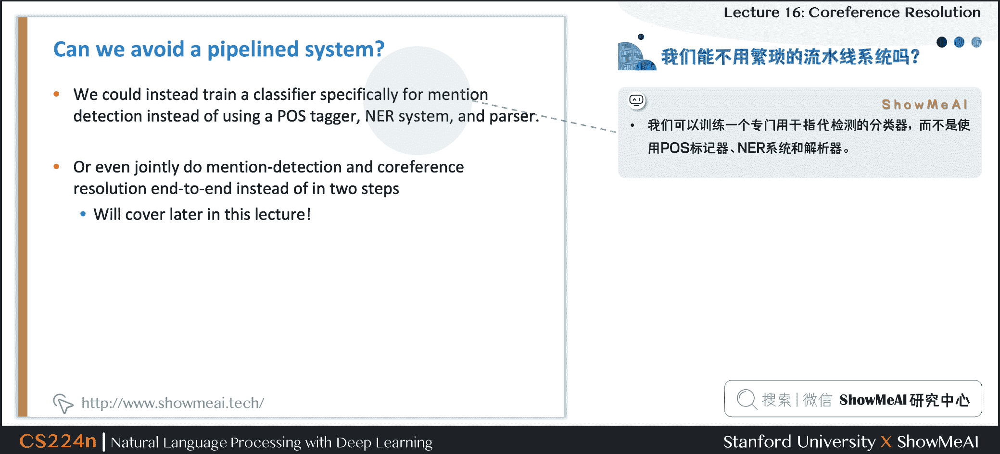

*   我们可以训练一个专门用于指代检测的分类器，而不是使用 POS 标记器、NER 系统和解析器

*   甚至端到端共同完成指代检测和指代消解，而不是两步

## 3.5 首先基于语言学

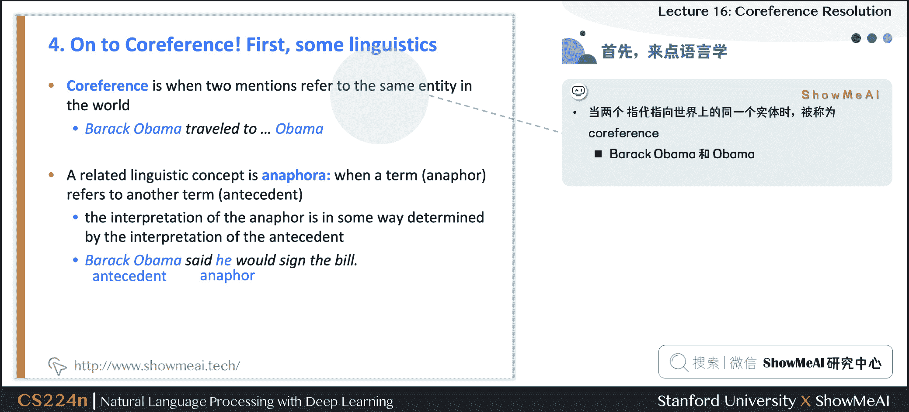

*   当两个指代指向世界上的同一个实体时，被称为 coreference
    *   Barack Obama 和 Obama

*   相关的语言概念是 **anaphora (回指)**：下文的词返指或代替上文的词
    *   anaphor 的解释在某种程度上取决于 antecedent 先行词的解释
    *   Barack Obama said he would sign the bill

## 3.6 前指代 vs 共指

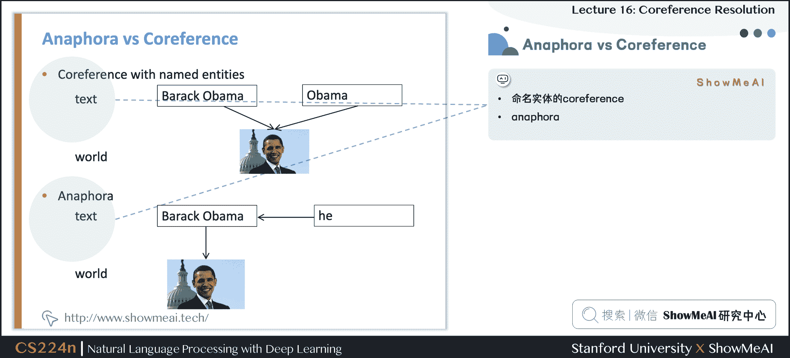

*   命名实体的 coreference

## 3.7 并非所有前指代都是指代

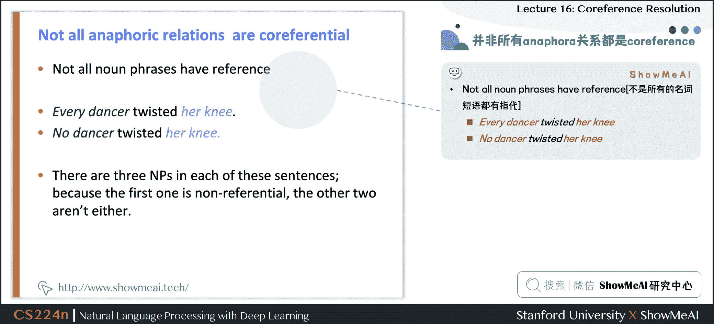

*   Not all noun phrases have reference (不是所有的名词短语都有指代)
    *   Every dancer twisted her knee
    *   No dancer twisted her knee

每一个句子有三个 NPs；因为第一个是非指示性的，另外两个也不是

## 3.8 前指代 vs 后指

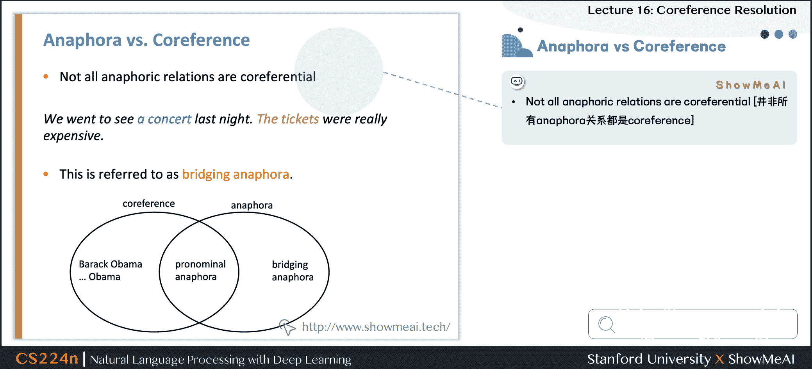

*   并非所有 anaphora 关系都是 coreference

`We went to see a concert last night. The tickets were really expensive.`

*   这被称为 **bridging anaphora (桥接回指) **

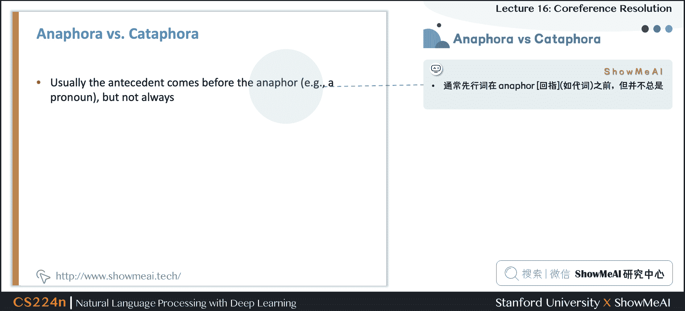

*   通常先行词在 anaphor (回指) (如代词)之前，但并不总是

## 3.9 后指代

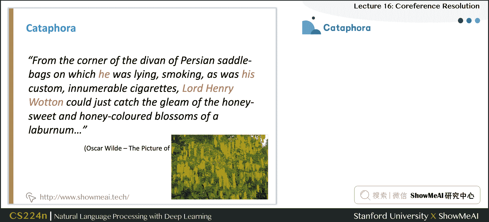

## 3.10 四种共指模型

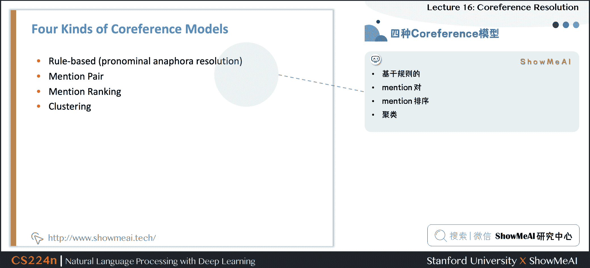

*   基于规则的
*   mention 对
*   mention 排序
*   聚类

## 3.11 传统代词回指消解：霍布斯朴素算法

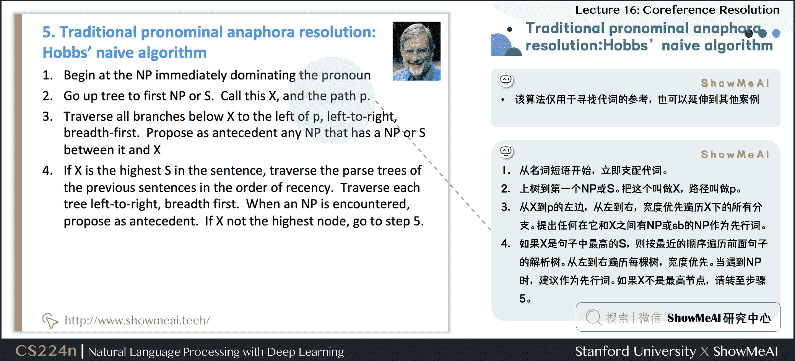

*   该算法仅用于寻找代词的参考，也可以延伸到其他案例

*   1.从名词短语开始，立即支配代词。

*   2.上树到第一个 N P NP NP 或 S S S。把这个叫做 X X X，路径叫做 p p p。

*   3.从 X X X 到 p p p 的左边，从左到右，宽度优先遍历 X X X 下的所有分支。提出任何在它和 X X X 之间有 N P NP NP 或 s b sb sb 的 N P NP NP 作为先行词。

*   4.如果 X X X 是句子中最高的 S S S，则按最近的顺序遍历前面句子的解析树。从左到右遍历每棵树，宽度优先。当遇到 N P NP NP 时，建议作为先行词。如果 X X X 不是最高节点，请转至步骤 5 5 5。

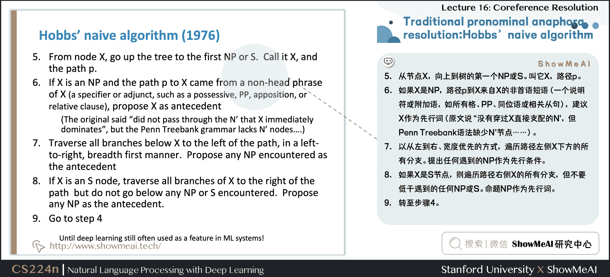

*   5.从节点 X X X，向上到树的第一个 N P NP NP 或 S S S。叫它 X X X，路径 p p p。

*   6.如果 X X X 是 N P NP NP，路径 p p p 到 X X X 来自 X X X 的非首语短语 (一个说明符或附加语，如所有格、PP、同位语或相关从句)，建议 X X X 作为先行词。

*   7.以从左到右、宽度优先的方式，遍历路径左侧 X X X 下方的所有分支。提出任何遇到的 N P NP NP 作为先行条件。

*   8.如果 X X X 是 S S S 节点，则遍历路径右侧 X X X 的所有分支，但不要低于遇到的任何 N P NP NP 或 S S S。命题 N P NP NP 作为先行词。

*   9.转至步骤 4 4 4。

## 3.12 霍布斯朴素算法示例

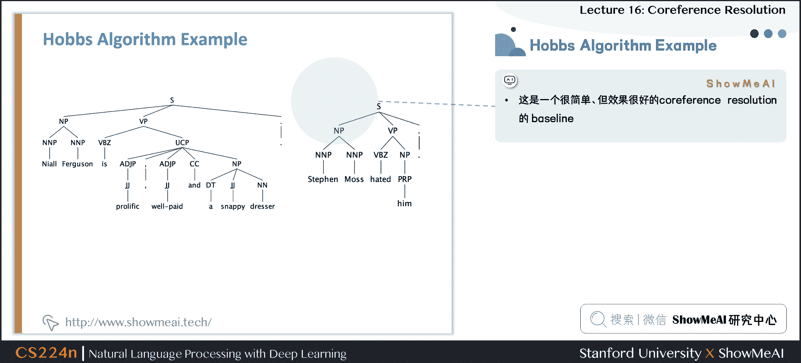

*   这是一个很简单、但效果很好的 coreference resolution 的 baseline

## 3.13 基于知识的代词共指

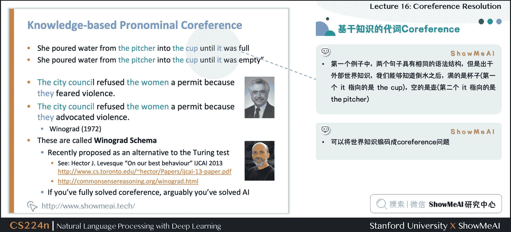

*   第一个例子中，两个句子具有相同的语法结构，但是出于外部世界知识，我们能够知道倒水之后，满的是杯子 (第一个 `it` 指向的是 `the cup`)，空的是壶 (第二个 `it` 指向的是 `the pitcher`)

*   可以将世界知识编码成共指问题

## 3.14 霍布斯朴素算法：评价

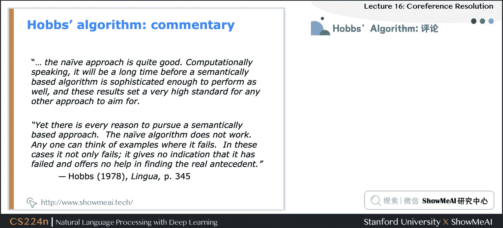

# 4.指代对模型

## 4.1 Mention Pair 指代对共指模型

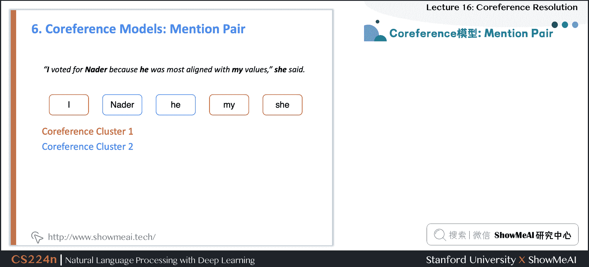

## 4.2 指代对共指模型

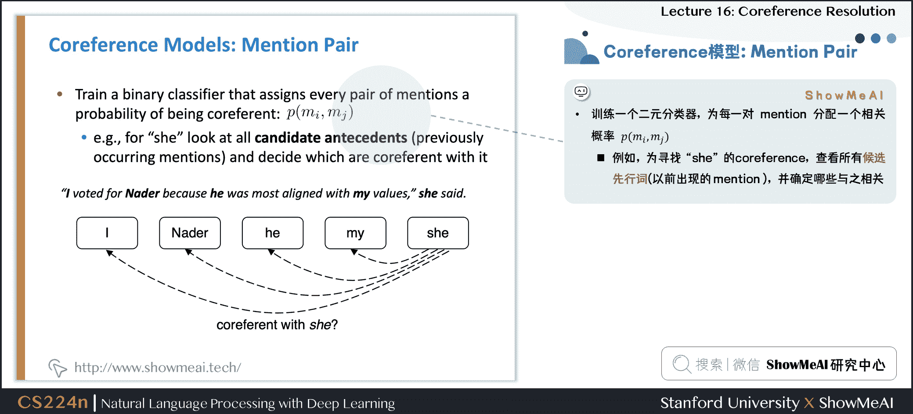

*   训练一个二元分类器，为每一对 mention 分配一个相关概率 p ( m i , m j ) p(m_i,m_j) p(mi​,mj​)

    *   例如，为寻找 `she` 的 coreference，查看所有候选先行词 (以前出现的 mention )，并确定哪些与之相关 

*   和 `she` 有关系吗？
*   **Positive** 例子：希望 p ( m i , m j ) p(m_i,m_j) p(mi​,mj​) 接近 1 1 1
*   **Negative** 例子：希望 p ( m i , m j ) p(m_i,m_j) p(mi​,mj​) 接近 0 0 0

## 4.3 指代对共指模型训练

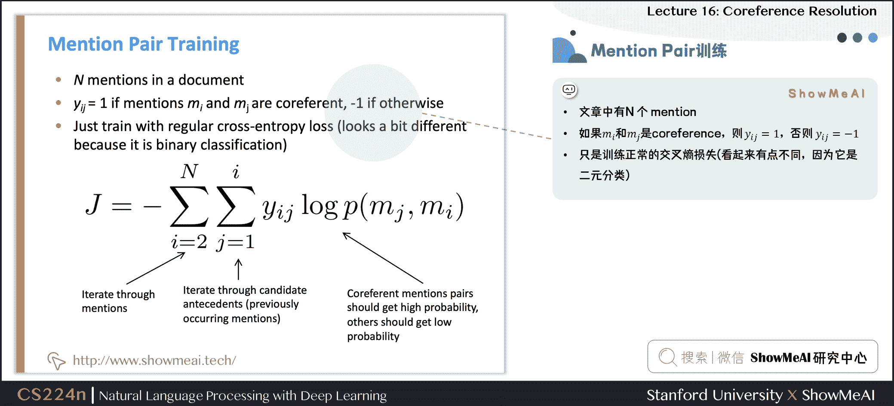

*   文章中有 N N N 个 mention
*   如果 m i m_i mi​ 和 m j m_j mj​ 是 coreference，则 y i j = 1 y_{ij}=1 yij​=1，否则 y i j = − 1 y_{ij}=-1 yij​=−1
*   只是训练正常的交叉熵损失 (看起来有点不同，因为它是二元分类)

J = − ∑ i = 2 N ∑ j = 1 i y i j log ⁡ p ( m j , m i ) J=-\sum_{i=2}^{N} \sum_{j=1}^{i} y_{i j} \log p\left(m_{j}, m_{i}\right) J=−i=2∑N​j=1∑i​yij​logp(mj​,mi​)

*   i = 2 i=2 i=2：遍历 mentions
*   j = 1 j=1 j=1：遍历候选先行词 (前面出现的 mention)
*   log ⁡ p ( m j , m i ) \log p(m_j,m_i) logp(mj​,mi​)：coreference mention pairs 应该得到高概率，其他应该得到低概率

## 4.4 指代对共指模型测试阶段

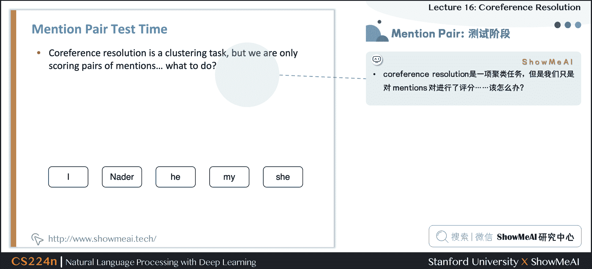

*   coreference resolution 是一项聚类任务，但是我们只是对 mentions 对进行了评分……该怎么办？

*   选择一些**阈值** (例如 0.5 0.5 0.5)，并将 p ( m i , m j ) p(m_i,m_j) p(mi​,mj​) 在阈值以上的 mentions 对之间添加 coreference 链接

*   利用传递闭包得到聚类

*   coreference 连接具有传递性，即使没有不存在 link 的两者也会由于传递性，处于同一个聚类中

*   这是十分危险的。如果有一个 coreference link 判断错误，就会导致两个 cluster 被错误地合并了

## 4.5 指代对共指模型缺点

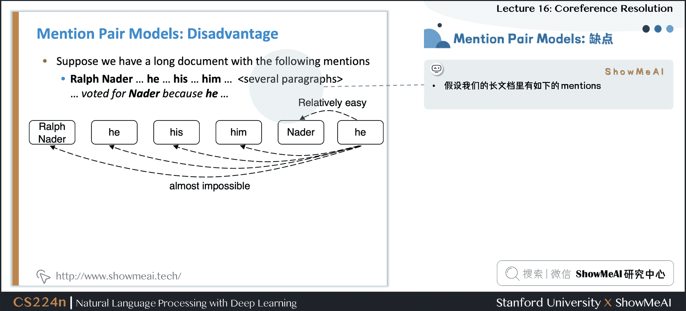

*   假设我们的长文档里有如下的 mentions

*   许多 mentions 只有一个清晰的先行词
    *   但我们要求模型来预测它们
*   **解决方案**：相反，训练模型为每个 mention 只预测一个先行词
    *   在语言上更合理

*   根据模型把其得分最高的先行词分配给每个 mention
*   虚拟的 NA mention 允许模型拒绝将当前 mention 与任何内容联系起来( `singleton` or `first` mention)

*   she 最好的先行词？

*   **Positive** 例子：模型必须为其中一个分配高概率 (但不一定两者都分配)
*   对候选先行词的分数应用 softmax，使概率总和为 1
*   只添加得分最高的 coreference link

# 5.指代排序模型

## 5.1 coreference 模型：训练

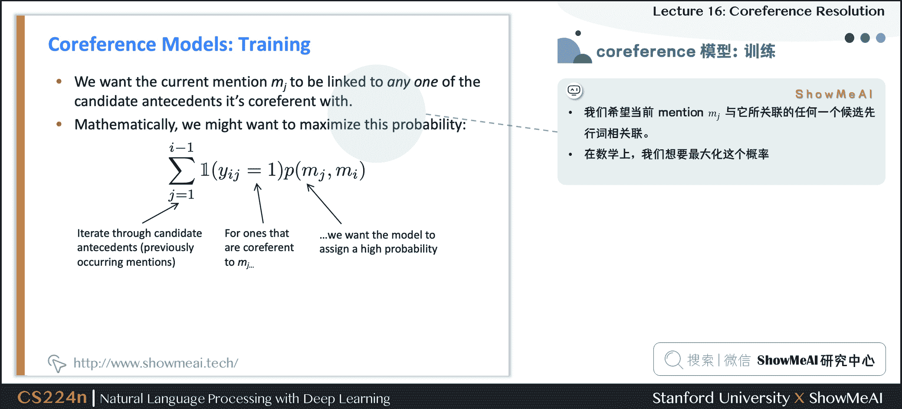

*   我们希望当前 mention m j m_j mj​ 与它所关联的任何一个候选先行词相关联。
*   在数学上，我们想要**最大化这个概率**：

∑ j = 1 i − 1 1 ( y i j = 1 ) p ( m j , m i ) \sum_{j=1}^{i-1} \mathbb{1}\left(y_{i j}=1\right) p\left(m_{j}, m_{i}\right) j=1∑i−1​1(yij​=1)p(mj​,mi​)

*   j = 1 j=1 j=1：遍历候选先行词集合
*   y i j = 1 y_{ij}=1 yij​=1：即 m i m_i mi​ 与 m j m_j mj​ 是 coreference 关系的情况
*   p ( m j , m i ) p\left(m_{j}, m_{i}\right) p(mj​,mi​)：我们希望模型能够给予其高可能性

*   将其转化为损失函数：

J = ∑ i = 2 N − log ⁡ ( ∑ j = 1 i − 1 1 ( y i j = 1 ) p ( m j , m i ) ) J=\sum_{i=2}^{N}-\log \left(\sum_{j=1}^{i-1} \mathbb{1}\left(y_{i j}=1\right) p\left(m_{j}, m_{i}\right)\right) J=i=2∑N​−log(j=1∑i−1​1(yij​=1)p(mj​,mi​))

*   i = 2 i=2 i=2：遍历所有文档中的指代
*   − log ⁡ -\log −log：使用负对数和似然结合构建损失
*   该模型可以为一个正确的先行词产生概率 0.9 0.9 0.9，而对其他所有产生较低的概率，并且总和仍然很大

## 5.2 指代排序模型预测阶段

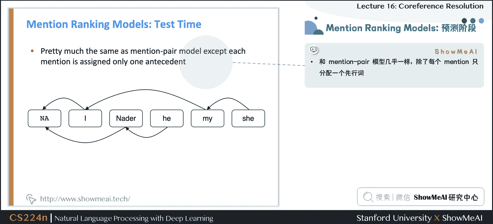

*   和 mention-pair 模型几乎一样，除了每个 mention 只分配一个先行词

## 5.3 如何计算概率

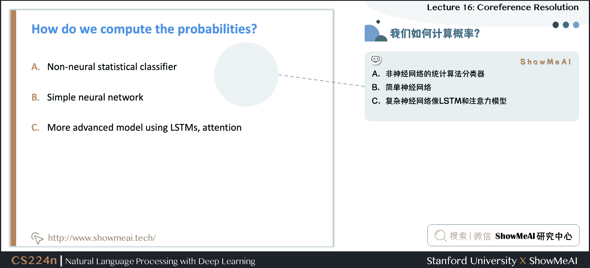

A.**非神经网络的统计算法分类器**
B.**简单神经网络**
C.**复杂神经网络像 LSTM 和注意力模型**

## 5.4 A.非神经网络方法：特征

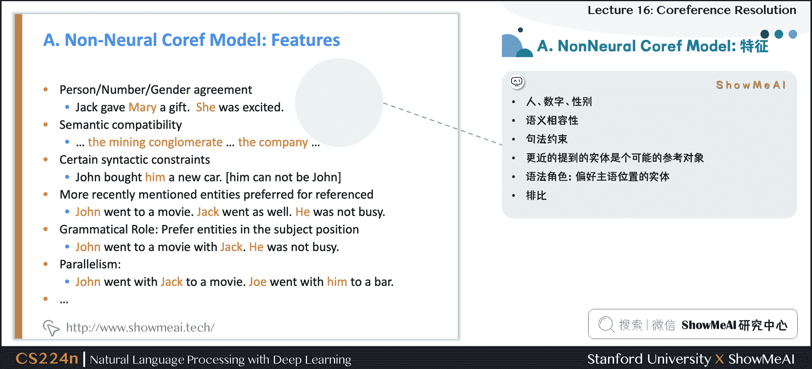

*   人、数字、性别
*   语义相容性
*   句法约束
*   更近的提到的实体是个可能的参考对象
*   语法角色：偏好主语位置的实体
*   排比

## 5.5 B.神经网络模型

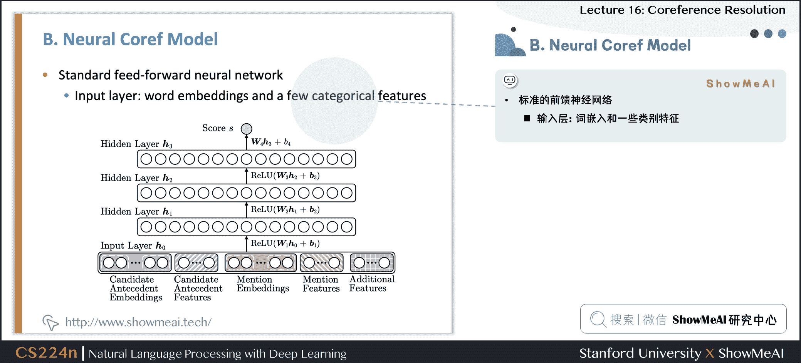

*   标准的前馈神经网络
    *   **输入层**：词嵌入和一些类别特征

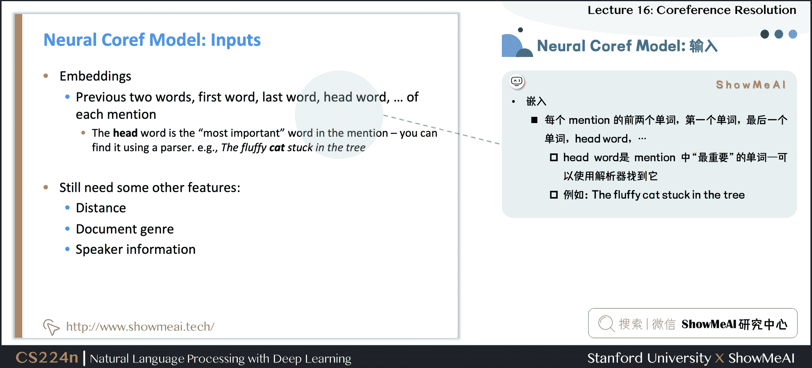

*   **嵌入**
    *   每个 mention 的前两个单词，第一个单词，最后一个单词，head word，…
        *   head word 是 mention 中 `最重要` 的单词—可以使用解析器找到它
        *   例如：The fluffy cat stuck in the tree

*   **仍然需要一些其他特征**
    *   距离
    *   文档体裁
    *   说话者的信息

## 5.7 C.端到端模型

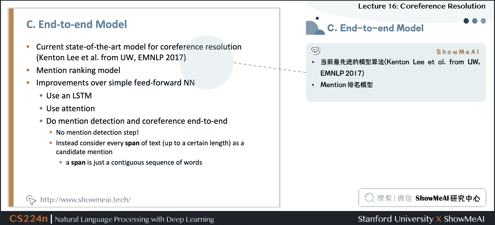

*   当前最先进的模型算法 (Kenton Lee et al. from UW, EMNLP 2017)
*   Mention 排名模型

*   **改进了简单的前馈神经网络**
    *   使用 LSTM
    *   使用注意力
    *   端到端的完成 mention 检测和 coreference
        *   没有 mention 检测步骤！
        *   而是考虑每段文本 (一定长度) 作为候选 mention
            *   a sapn 是一个连续的序列

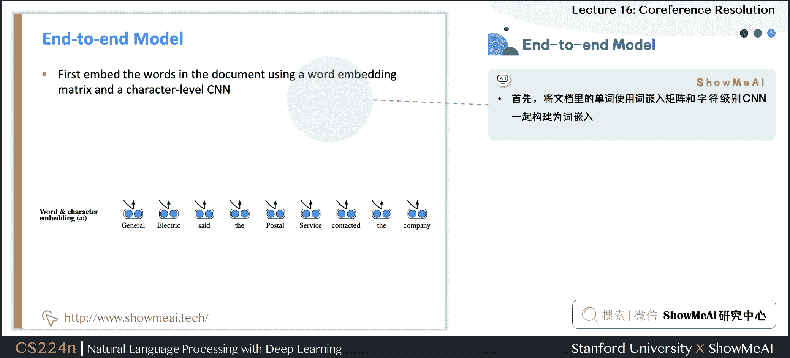

*   首先，将文档里的单词使用词嵌入矩阵和字符级别 CNN 一起构建为词嵌入
*   接着，在文档上运行双向 LSTM
*   接着，将每段文本 i i i 从 S T A R T ( i ) START (i) START(i) 到 E N D ( i ) END(i) END(i) 表示为一个向量

    *   sapn 是句子中任何单词的连续子句
    *   General, General Electric, General Electric said, … Electric, Electric said, …都会得到它自己的向量表示 

*   接着，将每段文本 i i i 从 S T A R T ( i ) START (i) START(i) 到 E N D ( i ) END(i) END(i) 表示为一个向量，例如 `the postal service`

g i = [ x START ⁡ ( i ) ∗ , x E N D ( i ) ∗ , x ^ i , ϕ ( i ) ] \boldsymbol{g}_{i}=\left[\boldsymbol{x}_{\operatorname{START}(i)}^{*}, \boldsymbol{x}_{\mathrm{END}(i)}^{*}, \hat{\boldsymbol{x}}_{i}, \phi(i)\right] gi​=[xSTART(i)∗​,xEND(i)∗​,x^i​,ϕ(i)]

*   x START ⁡ ( i ) ∗ \boldsymbol{x}_{\operatorname{START}(i)}^{*} xSTART(i)∗​、 x E N D ( i ) ∗ \boldsymbol{x}_{\mathrm{END}(i)}^{*} xEND(i)∗​： sapn 的开始和结束的双向 LSTM 隐状态表示

*   x ^ i \hat{\boldsymbol{x}}_{i} x^i​：基于注意力机制的 sapn 内词语的表示

*   ϕ ( i ) \phi(i) ϕ(i)：更多的其他特征

*   x ^ i \hat{\boldsymbol{x}}_{i} x^i​ 是 sapn 的注意力加权平均的词向量

    *   权重向量与变换后的隐状态点乘 

α t = w α ⋅ FFNN ⁡ α ( x t ∗ ) \alpha_{t}=\boldsymbol{w}_{\alpha} \cdot \operatorname{FFNN}_{\alpha}\left(\boldsymbol{x}_{t}^{*}\right) αt​=wα​⋅FFNNα​(xt∗​)

*   sapn 内基于 softmax 的注意力得分向量

a i , t = exp ⁡ ( α t ) ∑ k = START ⁡ ( i ) END ⁡ ⁡ ( i ) exp ⁡ ( α k ) a_{i, t}=\frac{\exp \left(\alpha_{t}\right)}{\sum_{k=\operatorname{START}(i)}^{\operatorname{\operatorname {END}}(i)} \exp \left(\alpha_{k}\right)} ai,t​=∑k=START(i)END(i)​exp(αk​)exp(αt​)​

*   使用注意力权重对词嵌入做加权求和

x ^ i = ∑ t = START ⁡ ( i ) END ⁡ ( i ) a i , t ⋅ x t \hat{\boldsymbol{x}}_{i}=\sum_{t=\operatorname{START}(i)}^{\operatorname{END}(i)} a_{i, t} \cdot \boldsymbol{x}_{t} x^i​=t=START(i)∑END(i)​ai,t​⋅xt​

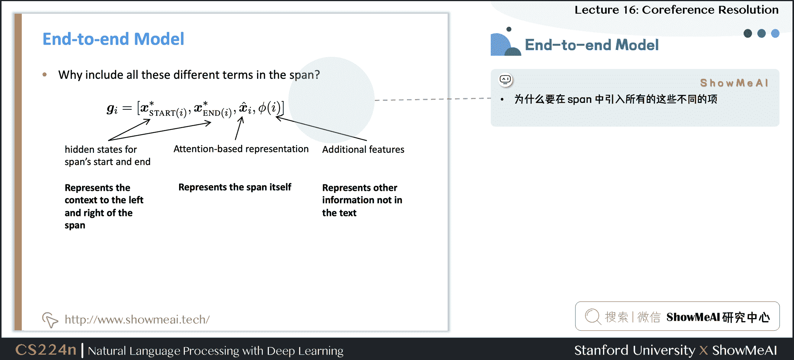

*   **为什么要在 sapn 中引入所有的这些不同的项**

*   表征 sapn 左右的上下文
*   表征 sapn 本身
*   表征其他文本中不包含的信息

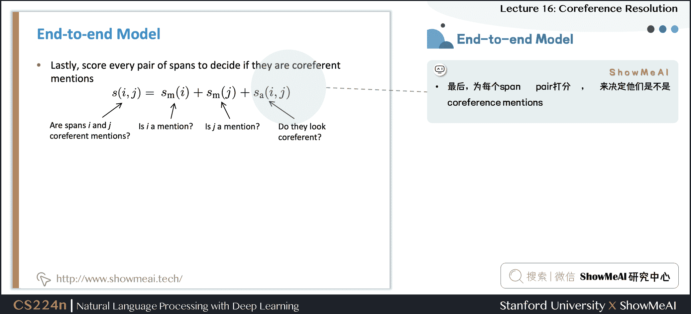

*   最后，为每个 sapn pair 打分，来决定他们是不是 coreference mentions

s ( i , j ) = s m ( i ) + s m ( j ) + s a ( i , j ) s(i, j)=s_{\mathrm{m}}(i)+s_{\mathrm{m}}(j)+s_{\mathrm{a}}(i, j) s(i,j)=sm​(i)+sm​(j)+sa​(i,j)

*   打分函数以 sapn representations 作为输入

s m ( i ) = w m ⋅ FFNN ⁡ m ( g i ) s a ( i , j ) = w a ⋅ FFNN ⁡ a ( [ g i , g j , g i ∘ g j , ϕ ( i , j ) ] ) \begin{aligned} s_{\mathrm{m}}(i) &=\boldsymbol{w}_{\mathrm{m}} \cdot \operatorname{FFNN}_{\mathrm{m}}\left(\boldsymbol{g}_{i}\right) \\ s_{\mathrm{a}}(i, j) &=\boldsymbol{w}_{\mathrm{a}} \cdot \operatorname{FFNN}_{\mathrm{a}}\left(\left[\boldsymbol{g}_{i}, \boldsymbol{g}_{j}, \boldsymbol{g}_{i} \circ \boldsymbol{g}_{j}, \phi(i, j)\right]\right) \end{aligned} sm​(i)sa​(i,j)​=wm​⋅FFNNm​(gi​)=wa​⋅FFNNa​([gi​,gj​,gi​∘gj​,ϕ(i,j)])​

*   ∘ \circ ∘：表征向量之间会通过乘法进行交叉
*   ϕ ( i , j ) \phi(i, j) ϕ(i,j)：同样也有一些额外的特征

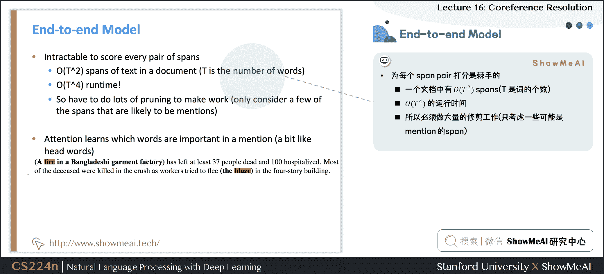

*   为每个 sapn pair 打分是棘手的
    *   一个文档中有 O ( T 2 ) O(T²) O(T2) sapns ( T T T 是词的个数)
    *   O ( T 4 ) O(T⁴) O(T4) 的运行时间
    *   所以必须做大量的修剪工作 (只考虑一些可能是 mention 的 sapn )

*   关注学习哪些单词是重要的在提到(有点像 head word)

# 6.指代聚类模型

## 6.1 基于聚类的共指模型

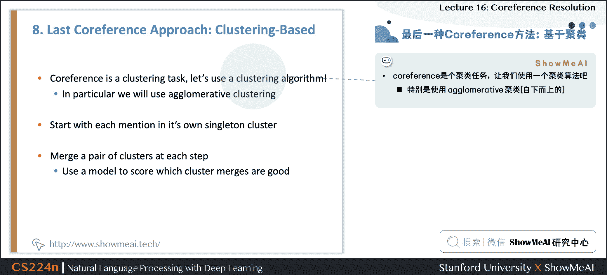

*   coreference 是个聚类任务，让我们使用一个聚类算法吧
    *   特别是使用 agglomerative 聚类 (自下而上的)

*   开始时，每个 mention 在它自己的单独集群中

*   每一步合并两个集群
    *   使用模型来打分那些聚类合并是好的

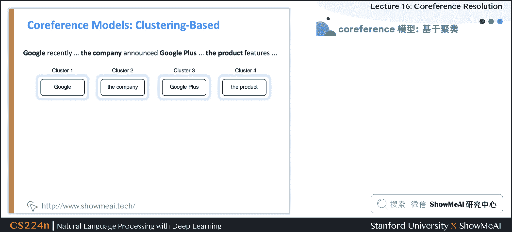

## 6.2 聚类模型结构

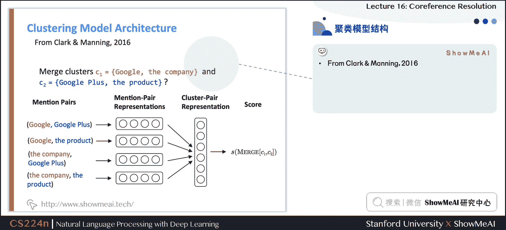

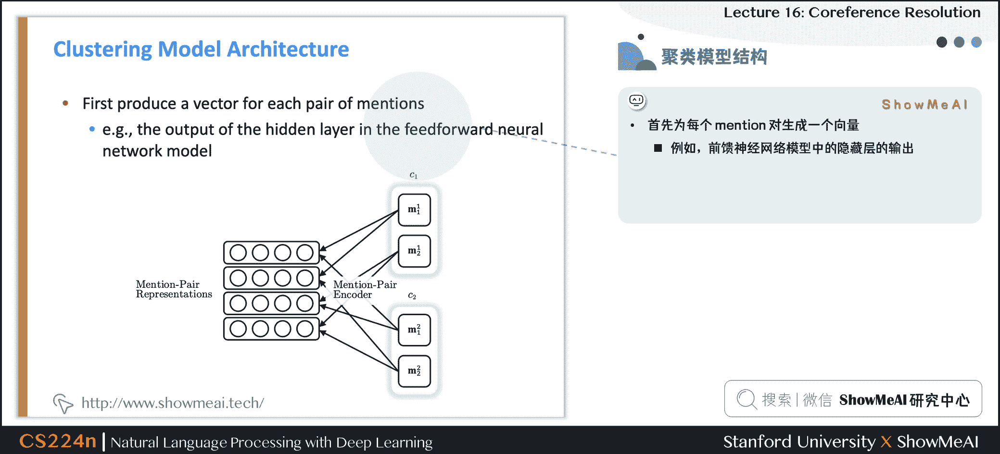

*   首先为每个 mention 对生成一个向量
    *   例如，前馈神经网络模型中的隐藏层的输出

*   接着将池化操作应用于 mention-pair 表示的矩阵上，得到一个 cluster-pair 聚类对的表示

*   通过用权重向量与表示向量的点积，对候选 cluster merge 进行评分

## 6.3 聚类模型：训练

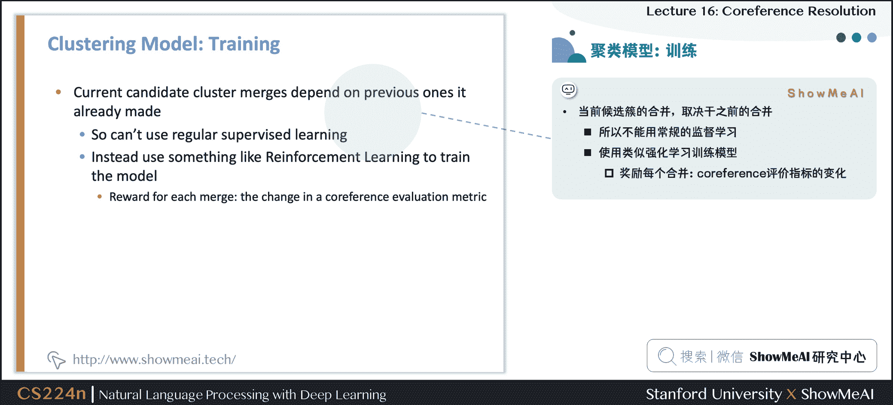

*   当前候选簇的合并，取决于之前的合并
    *   所以不能用常规的监督学习
    *   使用类似强化学习训练模型
        *   奖励每个合并：coreference 评价指标的变化

# 7.效果评估

## 7.1 指代模型评估

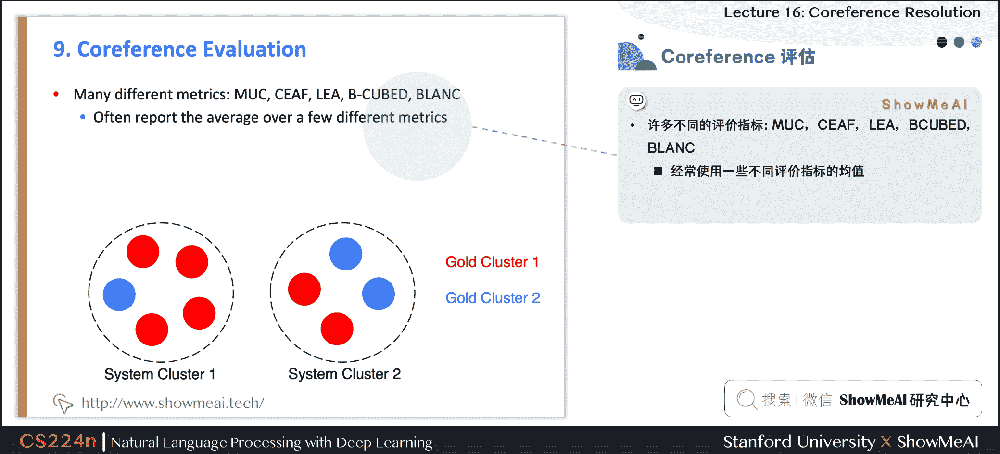

*   许多不同的评价指标：MUC, CEAF, LEA, BCUBED, BLANC
    *   经常使用一些不同评价指标的均值

*   例如 B-cubed
    *   对于每个 mention，计算其准确率和召回率
    *   然后平均每个个体的准确率和召回率

## 7.2 系统性能

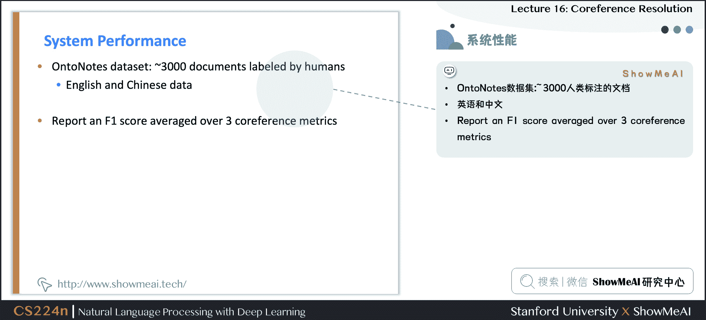

*   OntoNotes 数据集：~ 3000 人类标注的文档
*   英语和中文
*   Report an F1 score averaged over 3 coreference metrics

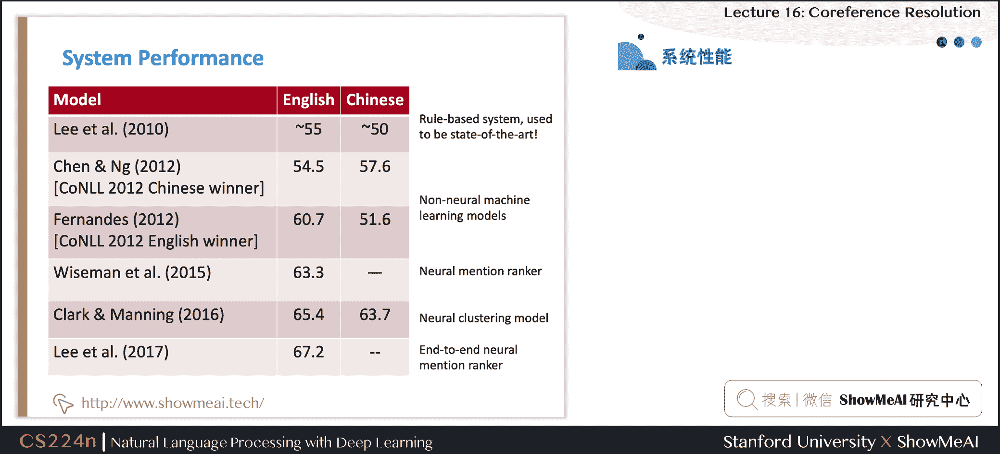

## 7.3 神经评分模型有什么帮助？

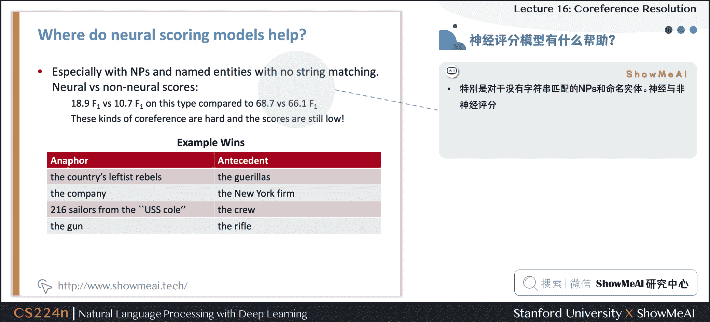

*   特别是对于没有字符串匹配的 NPs 和命名实体。神经与非神经评分

## 7.4 结论

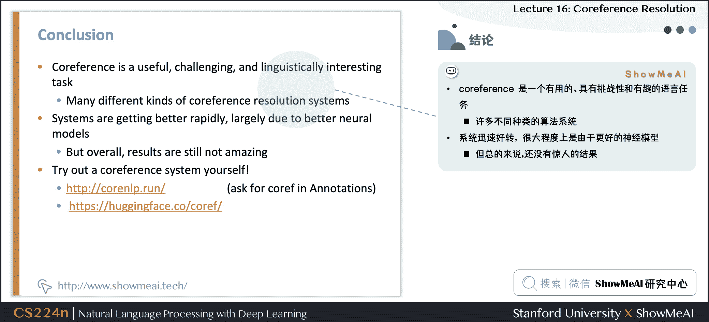

*   coreference 是一个有用的、具有挑战性和有趣的语言任务
    *   许多不同种类的算法系统
*   系统迅速好转，很大程度上是由于更好的神经模型
    *   但总的来说,还没有惊人的结果

*   Try out a coreference system yourself
    *   http://corenlp.run/ (ask for coref in Annotations)
    *   https://huggingface.co/coref/

# 8.视频教程

可以点击 [**B 站**](https://www.bilibili.com/video/BV1Yo4y1D7FW?p=16) 查看视频的【双语字幕】版本

[`player.bilibili.com/player.html?aid=376755412&page=16`](https://player.bilibili.com/player.html?aid=376755412&page=16)

【双语字幕+资料下载】斯坦福 CS224n | 深度学习与自然语言处理(2019·全 20 讲)

# 9.参考资料

*   [本讲带学的**在线阅翻页本**](https://blog.showmeai.tech/cs224n/lecture16-Reference-in-Language-and-Coreference-Resolution#/)
*   [《斯坦福 CS224n 深度学习与自然语言处理》**课程学习指南**](https://blog.showmeai.tech/cs224n/)
*   [《斯坦福 CS224n 深度学习与自然语言处理》**课程大作业解析**](https://github.com/ShowMeAI-Hub/awesome-AI-courses-notes-cheatsheets/tree/main/CS224n-Natural-Language-Processing-with-Deep-Learning/assignment-solutions)
*   [【**双语字幕视频**】斯坦福 CS224n | 深度学习与自然语言处理(2019·全 20 讲)](https://www.bilibili.com/video/BV1Yo4y1D7FW)
*   [**Stanford 官网** | CS224n: Natural Language Processing with Deep Learning](https://web.stanford.edu/class/archive/cs/cs224n/cs224n.1194/)

# [**ShowMeAI**](http://www.showmeai.tech)系列教程推荐

*   [大厂技术实现 | 推荐与广告计算解决方案](http://www.showmeai.tech/tutorials/50)
*   [大厂技术实现 | 计算机视觉解决方案](http://www.showmeai.tech/tutorials/51)
*   [大厂技术实现 | 自然语言处理行业解决方案](http://www.showmeai.tech/tutorials/52)
*   [图解 Python 编程：从入门到精通系列教程](http://www.showmeai.tech/tutorials/56)
*   [图解数据分析：从入门到精通系列教程](http://www.showmeai.tech/tutorials/33)
*   [图解 AI 数学基础：从入门到精通系列教程](http://www.showmeai.tech/tutorials/83)
*   [图解大数据技术：从入门到精通系列教程](http://www.showmeai.tech/tutorials/84)
*   [图解机器学习算法：从入门到精通系列教程](http://www.showmeai.tech/tutorials/34)
*   [机器学习实战：手把手教你玩转机器学习系列](http://www.showmeai.tech/tutorials/41)
*   [深度学习教程 | 吴恩达专项课程 · 全套笔记解读](http://www.showmeai.tech/tutorials/35)
*   [自然语言处理教程 | 斯坦福 CS224n 课程 · 课程带学与全套笔记解读](http://www.showmeai.tech/tutorials/36)

# NLP 系列教程文章

*   [NLP 教程(1)- 词向量、SVD 分解与 Word2vec](http://showmeai.tech/article-detail/230)
*   [NLP 教程(2)- GloVe 及词向量的训练与评估](http://showmeai.tech/article-detail/232)
*   [NLP 教程(3)- 神经网络与反向传播](http://showmeai.tech/article-detail/234)
*   [NLP 教程(4)- 句法分析与依存解析](http://www.showmeai.tech/article-detail/237)
*   [NLP 教程(5)- 语言模型、RNN、GRU 与 LSTM](http://www.showmeai.tech/article-detail/239)
*   [NLP 教程(6)- 神经机器翻译、seq2seq 与注意力机制](http://www.showmeai.tech/article-detail/242)
*   [NLP 教程(7)- 问答系统](http://www.showmeai.tech/article-detail/245)
*   [NLP 教程(8)- NLP 中的卷积神经网络](http://www.showmeai.tech/article-detail/247)
*   [NLP 教程(9)- 句法分析与树形递归神经网络](http://www.showmeai.tech/article-detail/255)

# 斯坦福 CS224n 课程带学详解

*   [斯坦福 NLP 课程 | 第 1 讲 - NLP 介绍与词向量初步](http://showmeai.tech/article-detail/231)
*   [斯坦福 NLP 课程 | 第 2 讲 - 词向量进阶](http://showmeai.tech/article-detail/233)
*   [斯坦福 NLP 课程 | 第 3 讲 - 神经网络知识回顾](http://showmeai.tech/article-detail/235)
*   [斯坦福 NLP 课程 | 第 4 讲 - 神经网络反向传播与计算图](http://showmeai.tech/article-detail/236)
*   [斯坦福 NLP 课程 | 第 5 讲 - 句法分析与依存解析](http://www.showmeai.tech/article-detail/238)
*   [斯坦福 NLP 课程 | 第 6 讲 - 循环神经网络与语言模型](http://www.showmeai.tech/article-detail/240)
*   [斯坦福 NLP 课程 | 第 7 讲 - 梯度消失问题与 RNN 变种](http://www.showmeai.tech/article-detail/241)
*   [斯坦福 NLP 课程 | 第 8 讲 - 机器翻译、seq2seq 与注意力机制](http://www.showmeai.tech/article-detail/243)
*   [斯坦福 NLP 课程 | 第 9 讲 - cs224n 课程大项目实用技巧与经验](http://www.showmeai.tech/article-detail/244)
*   [斯坦福 NLP 课程 | 第 10 讲 - NLP 中的问答系统](http://www.showmeai.tech/article-detail/246)
*   [斯坦福 NLP 课程 | 第 11 讲 - NLP 中的卷积神经网络](http://www.showmeai.tech/article-detail/248)
*   [斯坦福 NLP 课程 | 第 12 讲 - 子词模型](http://www.showmeai.tech/article-detail/249)
*   [斯坦福 NLP 课程 | 第 13 讲 - 基于上下文的表征与 NLP 预训练模型](http://www.showmeai.tech/article-detail/250)
*   [斯坦福 NLP 课程 | 第 14 讲 - Transformers 自注意力与生成模型](http://www.showmeai.tech/article-detail/251)
*   [斯坦福 NLP 课程 | 第 15 讲 - NLP 文本生成任务](http://www.showmeai.tech/article-detail/252)
*   [斯坦福 NLP 课程 | 第 16 讲 - 指代消解问题与神经网络方法](http://www.showmeai.tech/article-detail/253)
*   [斯坦福 NLP 课程 | 第 17 讲 - 多任务学习(以问答系统为例)](http://www.showmeai.tech/article-detail/254)
*   [斯坦福 NLP 课程 | 第 18 讲 - 句法分析与树形递归神经网络](http://www.showmeai.tech/article-detail/256)
*   [斯坦福 NLP 课程 | 第 19 讲 - AI 安全偏见与公平](http://www.showmeai.tech/article-detail/257)
*   [斯坦福 NLP 课程 | 第 20 讲 - NLP 与深度学习的未来](http://www.showmeai.tech/article-detail/258)

