# 斯坦福 NLP 课程 | 第 17 讲 - 多任务学习（以问答系统为例）

> 原文：[`blog.csdn.net/ShowMeAI/article/details/124669331`](https://blog.csdn.net/ShowMeAI/article/details/124669331)

*   作者：[韩信子](https://github.com/HanXinzi-AI)@[ShowMeAI](http://www.showmeai.tech/)，路遥@[ShowMeAI](http://www.showmeai.tech/)，奇异果@[ShowMeAI](http://www.showmeai.tech/)
*   [教程地址](http://www.showmeai.tech/tutorials/36)：[`www.showmeai.tech/tutorials/36`](http://www.showmeai.tech/tutorials/36)
*   [本文地址](http://www.showmeai.tech/article-detail/254)：[`www.showmeai.tech/article-detail/254`](http://www.showmeai.tech/article-detail/254)
*   声明：版权所有，转载请联系平台与作者并注明出处
*   收藏[ShowMeAI](http://www.showmeai.tech/)查看更多精彩内容

* * *

[ShowMeAI](http://www.showmeai.tech/)为**斯坦福 CS224n**《自然语言处理与深度学习(Natural Language Processing with Deep Learning)》课程的全部课件，做了**中文翻译和注释**，并制作成了 GIF 动图！视频和课件等资料的获取方式见**文末**。

* * *

# 1.问答系统与多任务学习

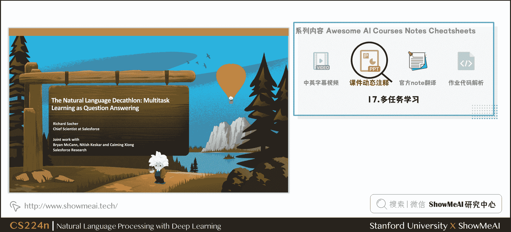

# 2.NLP 与 AI 的下一步

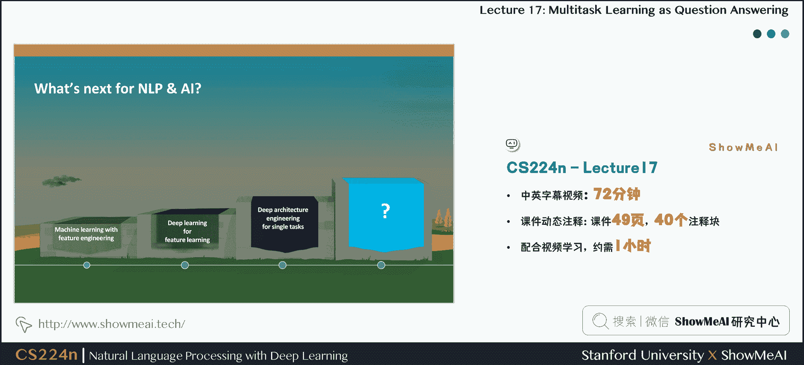

# 3.单任务的弊端

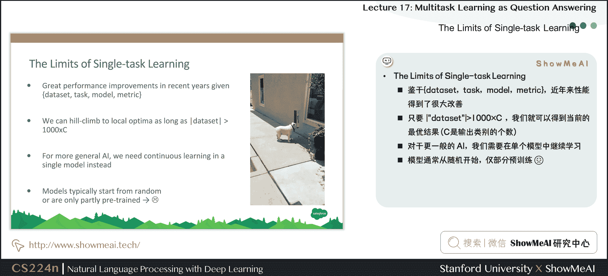

*   鉴于 { d a t a s e t ， t a s k ， m o d e l ， m e t r i c } \{dataset，task，model，metric\} {dataset，task，model，metric}，近年来性能得到了很大改善
*   只要 ∣ dataset ∣ > 1000 × C |\text{dataset}| > 1000 \times C ∣dataset∣>1000×C，我们就可以得到当前的最优结果 ( C C C 是输出类别的个数)
*   对于更一般的 Al，我们需要在单个模型中继续学习
*   模型通常从随机开始，仅部分预训练

# 4.预训练与信息共享帮助很大

*   计算机视觉

    *   Imagenet+cnn 巨大的成功
    *   分类属于视觉最基础的任务块
*   自然语言处理

    *   Word2vec、GloVe、CoVe、ELMo、BERT 开始步向成功
    *   自然语言处理中没有统一的基础任务块

# 5.为什么 NLP 中共享权重相对较少

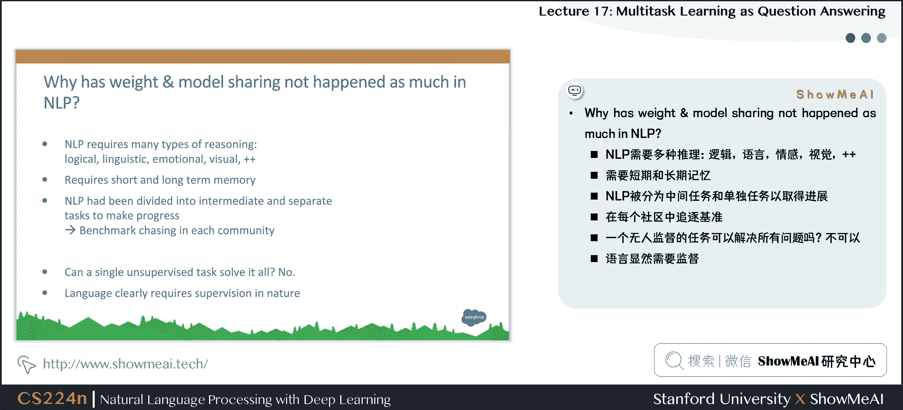

*   NLP 需要多种推理：逻辑，语言，情感，视觉，++
*   需要短期和长期记忆
*   NLP 被分为中间任务和单独任务以取得进展
*   在每个社区中追逐基准
*   一个无人监督的任务可以解决所有问题吗？不可以
*   语言显然需要监督

# 6.为什么 NLP 也需要 1 个统一多任务模型

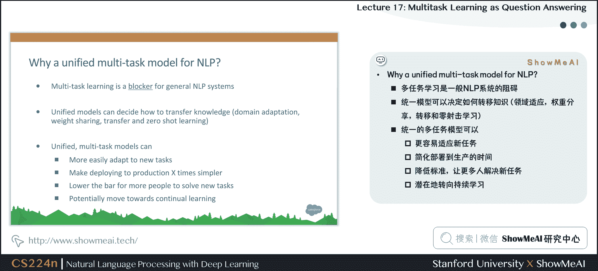

*   多任务学习是一般 NLP 系统的阻碍
*   统一模型可以决定如何转移知识（领域适应，权重分享，转移和零射击学习）
*   统一的多任务模型可以
    *   更容易适应新任务
    *   简化部署到生产的时间
    *   降低标准，让更多人解决新任务
    *   潜在地转向持续学习

# 7.如何在 1 个框架中承载多个 NLP 任务

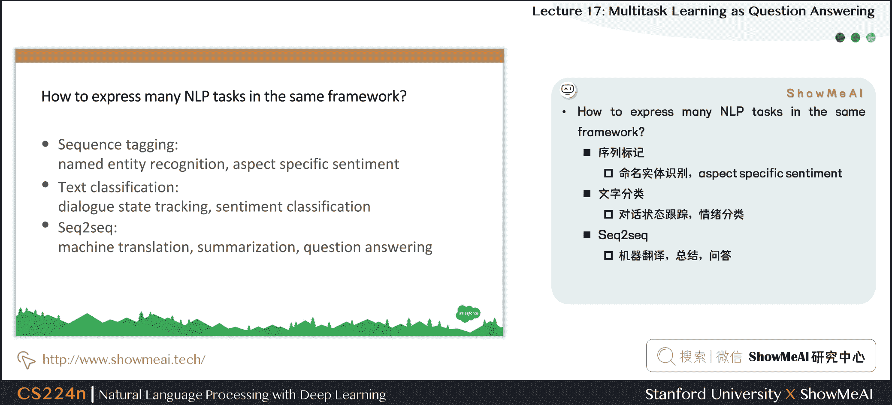

*   **序列标记**
    *   命名实体识别，aspect specific sentiment
*   **文字分类**
    *   对话状态跟踪，情绪分类
*   **Seq2seq**
    *   机器翻译，总结，问答

# 8.NLP 中的超级任务

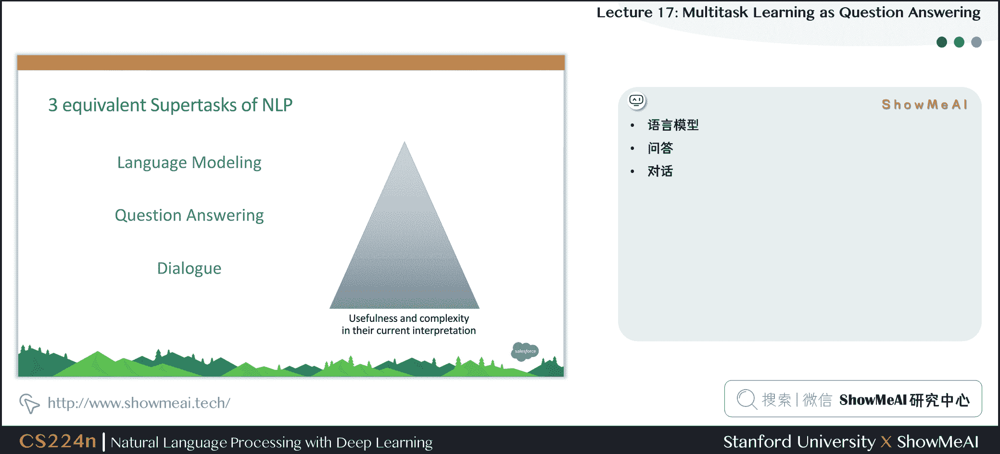

*   语言模型
*   问答
*   对话

# 9.自然语言处理十项全能 (decaNLP)

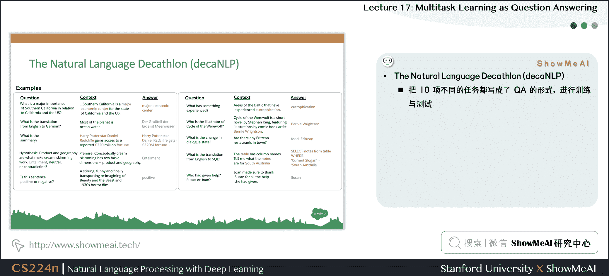

*   把 10 项不同的任务都写成了 QA 的形式，进行训练与测试

# 10.问答多任务学习

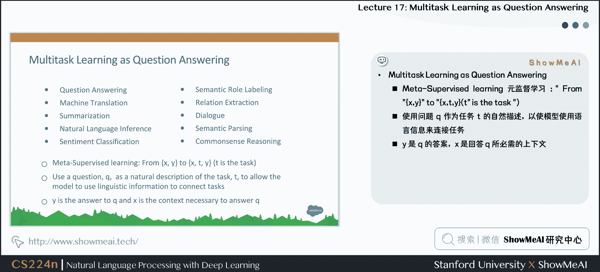

*   Meta-Supervised learning 元监督学习 ：`From {x,y} to {x,t,y}` (t is the task)
*   使用问题 q q q 作为任务 t t t 的自然描述，以使模型使用语言信息来连接任务
*   y y y 是 q q q 的答案， x x x 是回答 q q q 所必需的上下文

# 11.为 decaNLP 设计模型

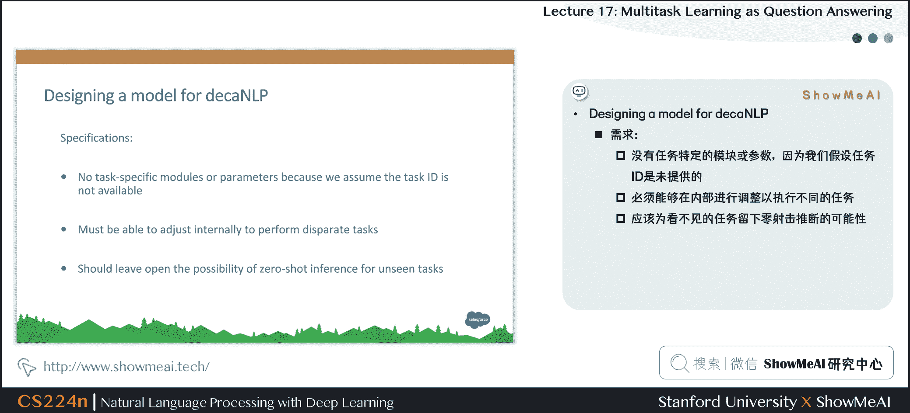

*   需求：
    *   没有任务特定的模块或参数，因为我们假设任务 ID 是未提供的
    *   必须能够在内部进行调整以执行不同的任务
    *   应该为看不见的任务留下零射击推断的可能性

# 12.decaNLP 的 1 个多任务问答神经网络模型方案

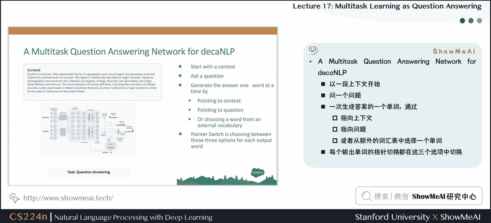

*   以一段上下文开始
*   问一个问题
*   一次生成答案的一个单词，通过
    *   指向上下文
    *   指向问题
    *   或者从额外的词汇表中选择一个单词
*   每个输出单词的指针切换都在这三个选项中切换

# 13.多任务问答网络 (MQAN)

*   固定的 GloVe 词嵌入 + 字符级的 n-gram 嵌入→ Linear → Shared BiLSTM with skip connection
*   从一个序列到另一个序列的注意力总结，并通过跳过连接再次返回
*   分离 BiLSTM 以减少维数，两个变压器层，另一个 BiLSTM
*   自回归解码器使用固定的 GloVe 和字符 n-gram 嵌入，两个变压器层和一个 LSTM 层来参加编码器最后三层的输出
*   LSTM 解码器状态用于计算上下文与问题中的被用作指针注意力分布问题
*   对上下文和问题的关注会影响两个开关：
    *   **gamma** 决定是复制还是从外部词汇表中选择
    *   **lambda** 决定是从上下文还是在问题中复制

# 14.评估

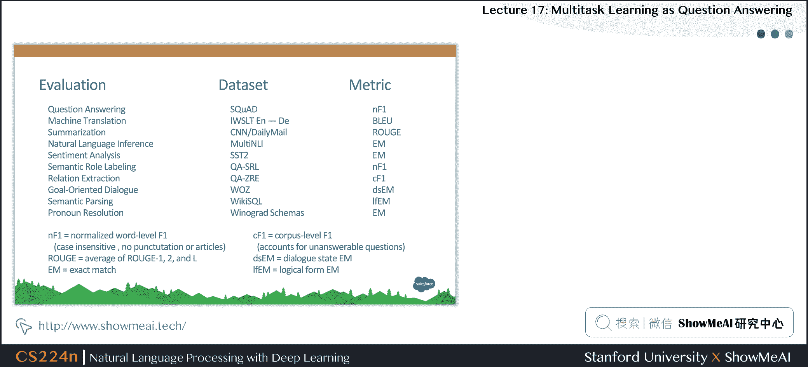

# 15.单任务效果 vs 多任务效果

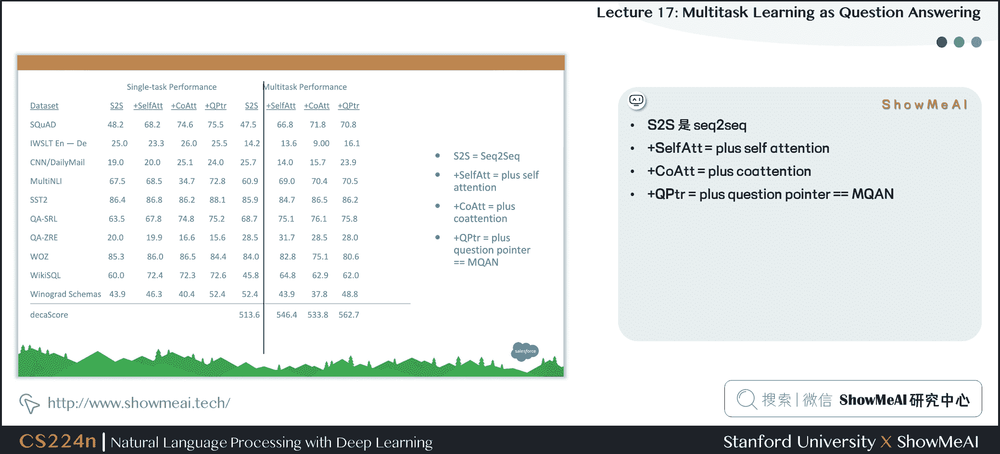

*   S2S 是 seq2seq
*   +SelfAtt = plus self attention
*   +CoAtt = plus coattention
*   +QPtr = plus question pointer == MQAN

*   Transformer 层在单任务和多任务设置中有**收益**
*   QA 和 SRL 有很强的关联性
*   指向问题至关重要
*   多任务处理有助于实现零射击
*   组合的单任务模型和单个多任务模型之间存在差距

# 16.训练策略：全联合

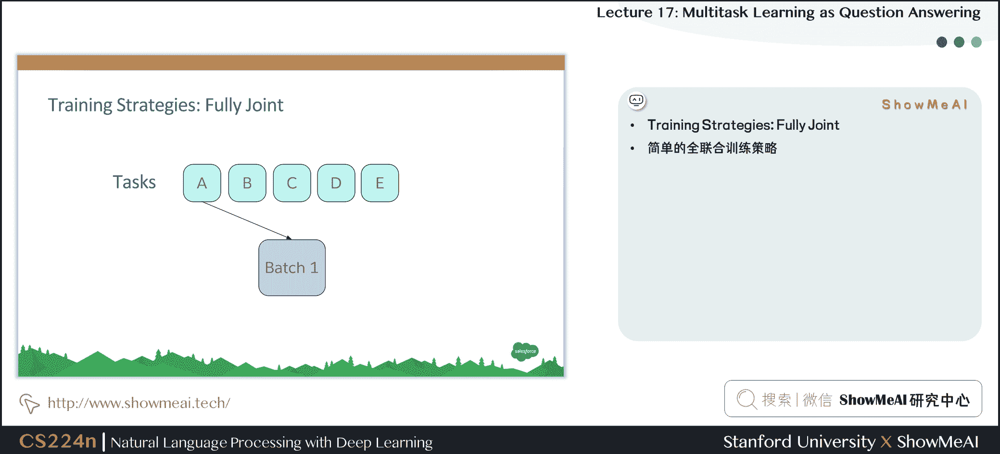

*   Training Strategies: Fully Joint
*   简单的全联合训练策略

*   **困难**：在单任务设置中收敛多少次迭代
*   **带红色的任务**：预训练阶段包含的任务

# 17.单任务 vs 多任务

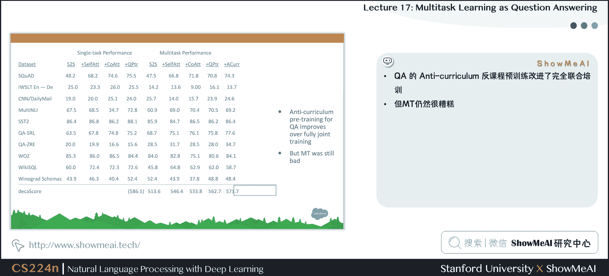

*   QA 的 Anti-curriculum 反课程预训练改进了完全联合培训
*   但 MT 仍然很糟糕

# 18.近期研究与实验

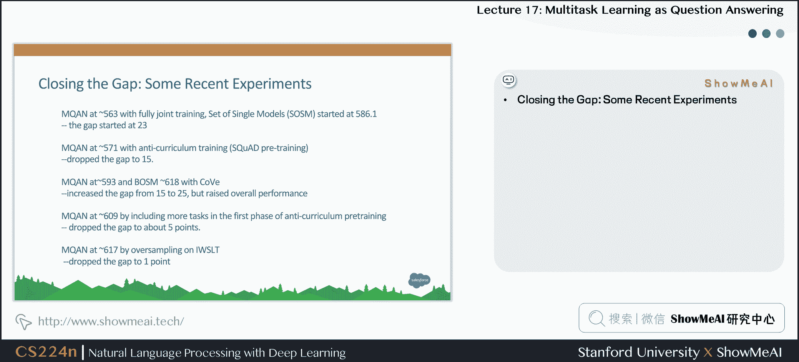

*   Closing the Gap: Some Recent Experiments

# 19.单任务 vs 多任务

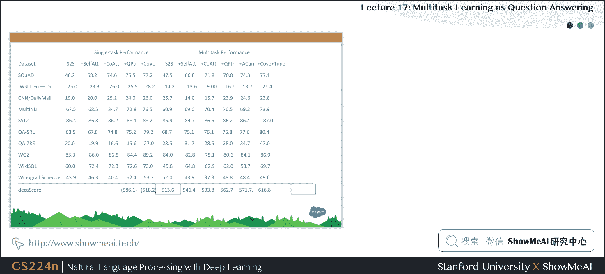

# 20.MQAN 细节

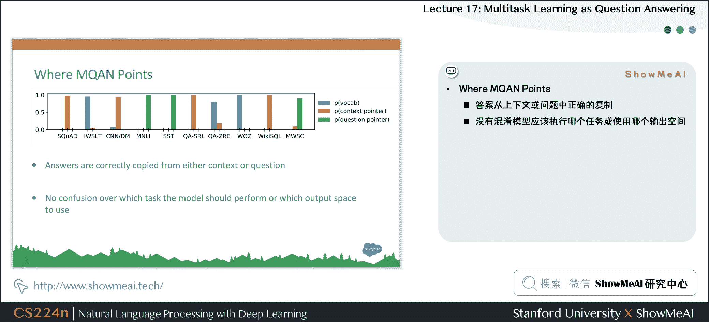

*   Where MQAN Points
    *   答案从上下文或问题中正确的复制
    *   没有混淆模型应该执行哪个任务或使用哪个输出空间

# 21.decaNLP 预训练提升最后效果

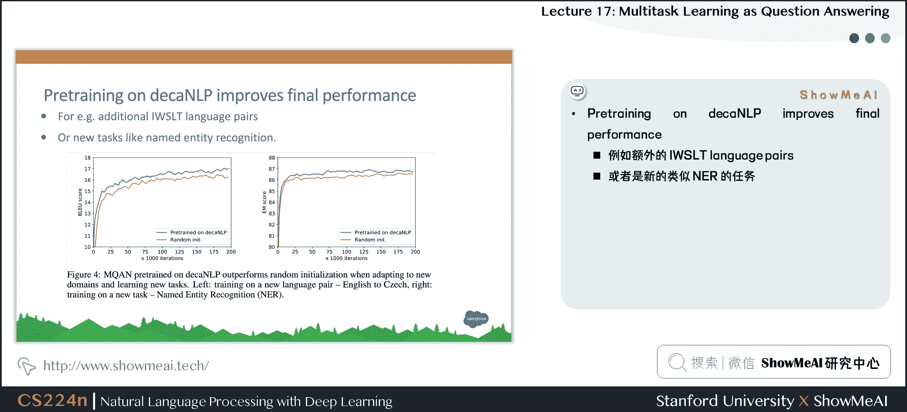

*   Pretraining on decaNLP improves final performance
    *   例如额外的 IWSLT language pairs
    *   或者是新的类似 NER 的任务

# 22.预训练 MQAN 的零次学习任务域自适应

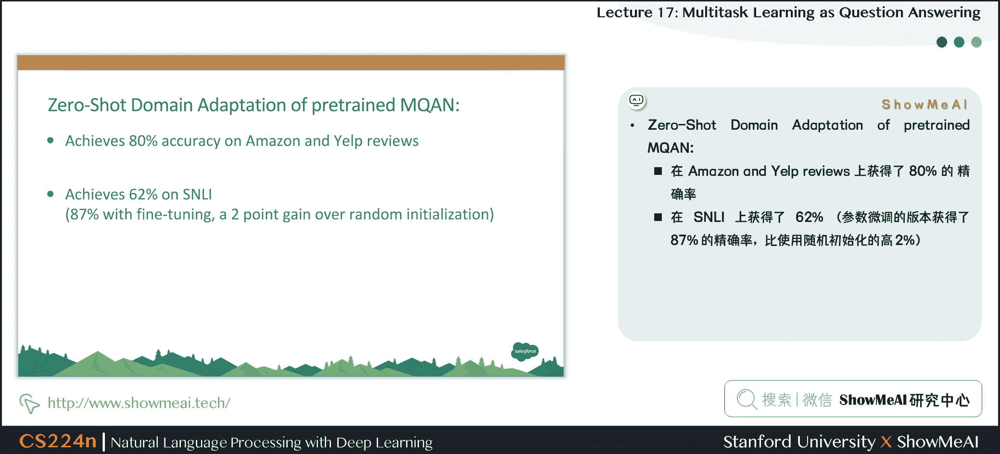

*   Zero-Shot Domain Adaptation of pretrained MQAN:
    *   在 Amazon and Yelp reviews 上获得了 80% 的 精确率
    *   在 SNLI 上获得了 62% （参数微调的版本获得了 87% 的精确率，比使用随机初始化的高 2%）

# 23.零次学习(Zero-Shot)分类

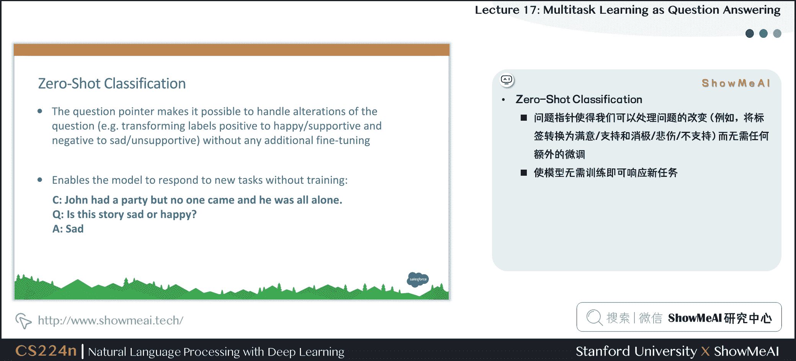

*   Zero-Shot Classification
    *   问题指针使得我们可以处理问题的改变（例如，将标签转换为满意/支持和消极/悲伤/不支持）而无需任何额外的微调
    *   使模型无需训练即可响应新任务

# 24.decaNLP：通用 NLP 任务效果基准

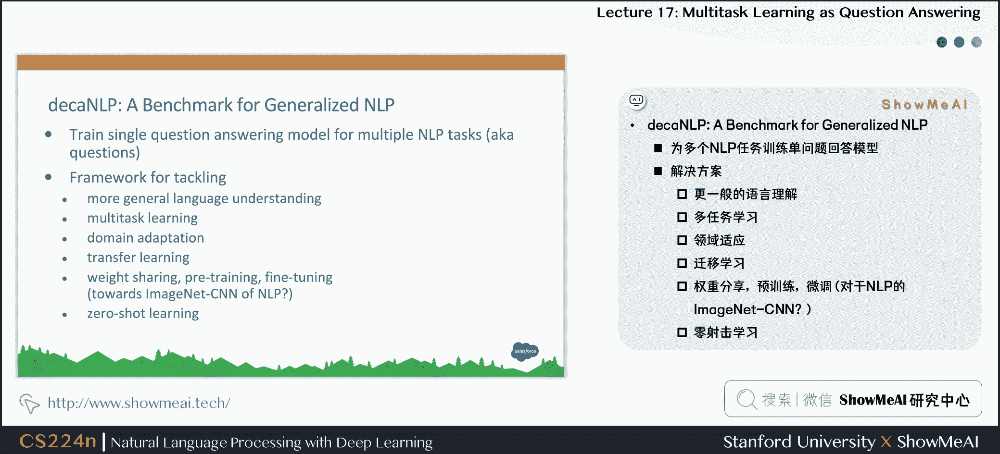

*   decaNLP: A Benchmark for Generalized NLP
    *   为多个 NLP 任务训练单问题回答模型
    *   解决方案
        *   更一般的语言理解
        *   多任务学习
        *   领域适应
        *   迁移学习
        *   权重分享，预训练，微调（对于 NLP 的 ImageNet-CNN？）
        *   零射击学习

# 25.相关研究与工作

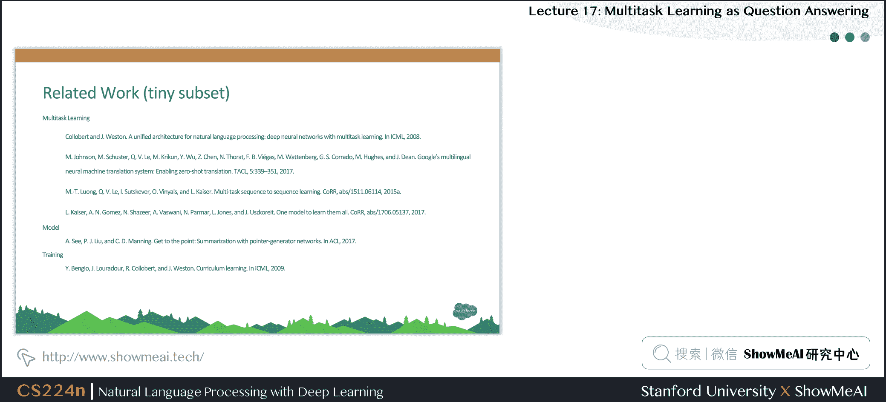

# 26.NLP 的下一步

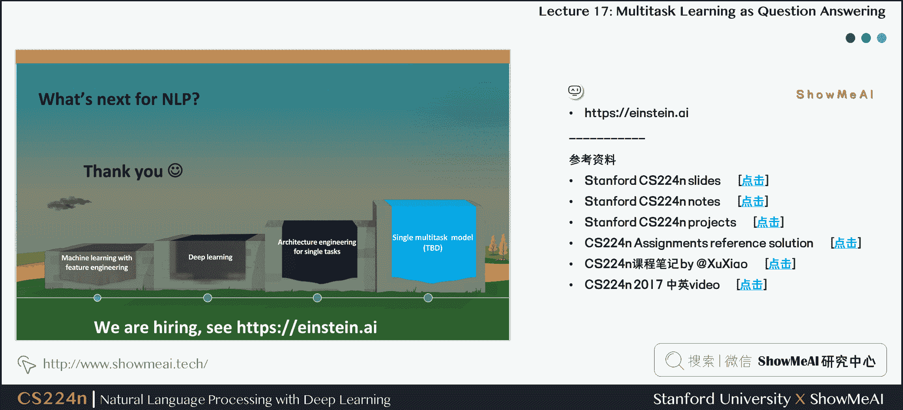

*   https://einstein.ai

# 27.视频教程

可以点击 [**B 站**](https://www.bilibili.com/video/BV1Yo4y1D7FW?p=17) 查看视频的【双语字幕】版本

[`player.bilibili.com/player.html?aid=376755412&page=17`](https://player.bilibili.com/player.html?aid=376755412&page=17)

【双语字幕+资料下载】斯坦福 CS224n | 深度学习与自然语言处理(2019·全 20 讲)

# 28.参考资料

*   [本讲带学的**在线阅翻页本**](https://blog.showmeai.tech/cs224n/lecture17-Multitask-Learning#/)
*   [《斯坦福 CS224n 深度学习与自然语言处理》**课程学习指南**](https://blog.showmeai.tech/cs224n/)
*   [《斯坦福 CS224n 深度学习与自然语言处理》**课程大作业解析**](https://github.com/ShowMeAI-Hub/awesome-AI-courses-notes-cheatsheets/tree/main/CS224n-Natural-Language-Processing-with-Deep-Learning/assignment-solutions)
*   [【**双语字幕视频**】斯坦福 CS224n | 深度学习与自然语言处理(2019·全 20 讲)](https://www.bilibili.com/video/BV1Yo4y1D7FW)
*   [**Stanford 官网** | CS224n: Natural Language Processing with Deep Learning](https://web.stanford.edu/class/archive/cs/cs224n/cs224n.1194/)

# [**ShowMeAI**](http://www.showmeai.tech)系列教程推荐

*   [大厂技术实现 | 推荐与广告计算解决方案](http://www.showmeai.tech/tutorials/50)
*   [大厂技术实现 | 计算机视觉解决方案](http://www.showmeai.tech/tutorials/51)
*   [大厂技术实现 | 自然语言处理行业解决方案](http://www.showmeai.tech/tutorials/52)
*   [图解 Python 编程：从入门到精通系列教程](http://www.showmeai.tech/tutorials/56)
*   [图解数据分析：从入门到精通系列教程](http://www.showmeai.tech/tutorials/33)
*   [图解 AI 数学基础：从入门到精通系列教程](http://www.showmeai.tech/tutorials/83)
*   [图解大数据技术：从入门到精通系列教程](http://www.showmeai.tech/tutorials/84)
*   [图解机器学习算法：从入门到精通系列教程](http://www.showmeai.tech/tutorials/34)
*   [机器学习实战：手把手教你玩转机器学习系列](http://www.showmeai.tech/tutorials/41)
*   [深度学习教程 | 吴恩达专项课程 · 全套笔记解读](http://www.showmeai.tech/tutorials/35)
*   [自然语言处理教程 | 斯坦福 CS224n 课程 · 课程带学与全套笔记解读](http://www.showmeai.tech/tutorials/36)

# NLP 系列教程文章

*   [NLP 教程(1)- 词向量、SVD 分解与 Word2vec](http://showmeai.tech/article-detail/230)
*   [NLP 教程(2)- GloVe 及词向量的训练与评估](http://showmeai.tech/article-detail/232)
*   [NLP 教程(3)- 神经网络与反向传播](http://showmeai.tech/article-detail/234)
*   [NLP 教程(4)- 句法分析与依存解析](http://www.showmeai.tech/article-detail/237)
*   [NLP 教程(5)- 语言模型、RNN、GRU 与 LSTM](http://www.showmeai.tech/article-detail/239)
*   [NLP 教程(6)- 神经机器翻译、seq2seq 与注意力机制](http://www.showmeai.tech/article-detail/242)
*   [NLP 教程(7)- 问答系统](http://www.showmeai.tech/article-detail/245)
*   [NLP 教程(8)- NLP 中的卷积神经网络](http://www.showmeai.tech/article-detail/247)
*   [NLP 教程(9)- 句法分析与树形递归神经网络](http://www.showmeai.tech/article-detail/255)

# 斯坦福 CS224n 课程带学详解

*   [斯坦福 NLP 课程 | 第 1 讲 - NLP 介绍与词向量初步](http://showmeai.tech/article-detail/231)
*   [斯坦福 NLP 课程 | 第 2 讲 - 词向量进阶](http://showmeai.tech/article-detail/233)
*   [斯坦福 NLP 课程 | 第 3 讲 - 神经网络知识回顾](http://showmeai.tech/article-detail/235)
*   [斯坦福 NLP 课程 | 第 4 讲 - 神经网络反向传播与计算图](http://showmeai.tech/article-detail/236)
*   [斯坦福 NLP 课程 | 第 5 讲 - 句法分析与依存解析](http://www.showmeai.tech/article-detail/238)
*   [斯坦福 NLP 课程 | 第 6 讲 - 循环神经网络与语言模型](http://www.showmeai.tech/article-detail/240)
*   [斯坦福 NLP 课程 | 第 7 讲 - 梯度消失问题与 RNN 变种](http://www.showmeai.tech/article-detail/241)
*   [斯坦福 NLP 课程 | 第 8 讲 - 机器翻译、seq2seq 与注意力机制](http://www.showmeai.tech/article-detail/243)
*   [斯坦福 NLP 课程 | 第 9 讲 - cs224n 课程大项目实用技巧与经验](http://www.showmeai.tech/article-detail/244)
*   [斯坦福 NLP 课程 | 第 10 讲 - NLP 中的问答系统](http://www.showmeai.tech/article-detail/246)
*   [斯坦福 NLP 课程 | 第 11 讲 - NLP 中的卷积神经网络](http://www.showmeai.tech/article-detail/248)
*   [斯坦福 NLP 课程 | 第 12 讲 - 子词模型](http://www.showmeai.tech/article-detail/249)
*   [斯坦福 NLP 课程 | 第 13 讲 - 基于上下文的表征与 NLP 预训练模型](http://www.showmeai.tech/article-detail/250)
*   [斯坦福 NLP 课程 | 第 14 讲 - Transformers 自注意力与生成模型](http://www.showmeai.tech/article-detail/251)
*   [斯坦福 NLP 课程 | 第 15 讲 - NLP 文本生成任务](http://www.showmeai.tech/article-detail/252)
*   [斯坦福 NLP 课程 | 第 16 讲 - 指代消解问题与神经网络方法](http://www.showmeai.tech/article-detail/253)
*   [斯坦福 NLP 课程 | 第 17 讲 - 多任务学习(以问答系统为例)](http://www.showmeai.tech/article-detail/254)
*   [斯坦福 NLP 课程 | 第 18 讲 - 句法分析与树形递归神经网络](http://www.showmeai.tech/article-detail/256)
*   [斯坦福 NLP 课程 | 第 19 讲 - AI 安全偏见与公平](http://www.showmeai.tech/article-detail/257)
*   [斯坦福 NLP 课程 | 第 20 讲 - NLP 与深度学习的未来](http://www.showmeai.tech/article-detail/258)

