# 斯坦福 NLP 课程 | 第 18 讲 - 句法分析与树形递归神经网络

> 原文：[`blog.csdn.net/ShowMeAI/article/details/124669555`](https://blog.csdn.net/ShowMeAI/article/details/124669555)

*   作者：[韩信子](https://github.com/HanXinzi-AI)@[ShowMeAI](http://www.showmeai.tech/)，路遥@[ShowMeAI](http://www.showmeai.tech/)，奇异果@[ShowMeAI](http://www.showmeai.tech/)
*   [教程地址](http://www.showmeai.tech/tutorials/36)：[`www.showmeai.tech/tutorials/36`](http://www.showmeai.tech/tutorials/36)
*   [本文地址](http://www.showmeai.tech/article-detail/256)：[`www.showmeai.tech/article-detail/256`](http://www.showmeai.tech/article-detail/256)
*   声明：版权所有，转载请联系平台与作者并注明出处
*   收藏[ShowMeAI](http://www.showmeai.tech/)查看更多精彩内容

* * *

[ShowMeAI](http://www.showmeai.tech/)为**斯坦福 CS224n**《自然语言处理与深度学习(Natural Language Processing with Deep Learning)》课程的全部课件，做了**中文翻译和注释**，并制作成了 GIF 动图！

本讲内容的**深度总结教程**可以在[**这里**](http://www.showmeai.tech/article-detail/245) 查看。视频和课件等资料的获取方式见**文末**。

* * *

# 引言

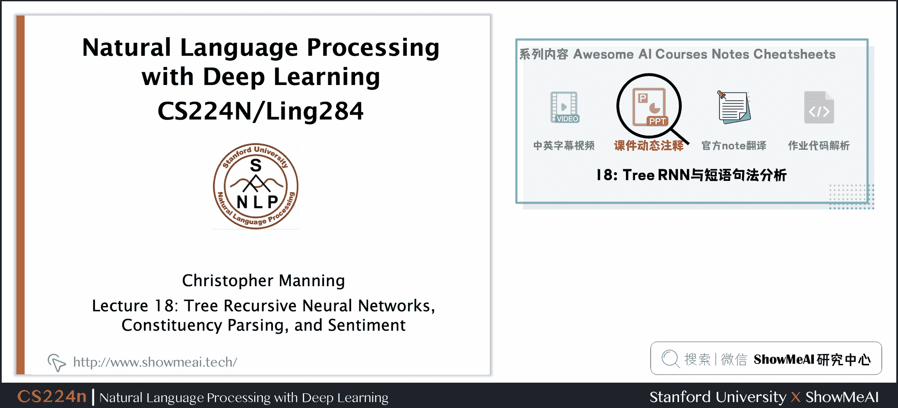

## 授课计划

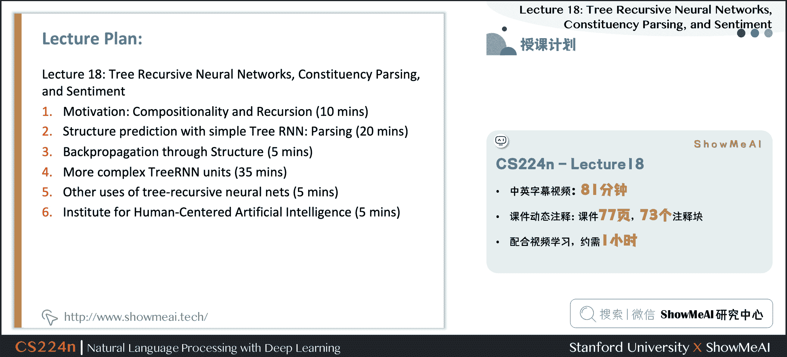

*   Motivation: Compositionality and Recursion
*   Structure prediction with simple Tree RNN: Parsing
*   Backpropagation through Structure
*   More complex TreeRNN units
*   Other uses of tree-recursive neural nets
*   Institute for Human-Centered Artificial Intelligence

# 1.CS 语言谱

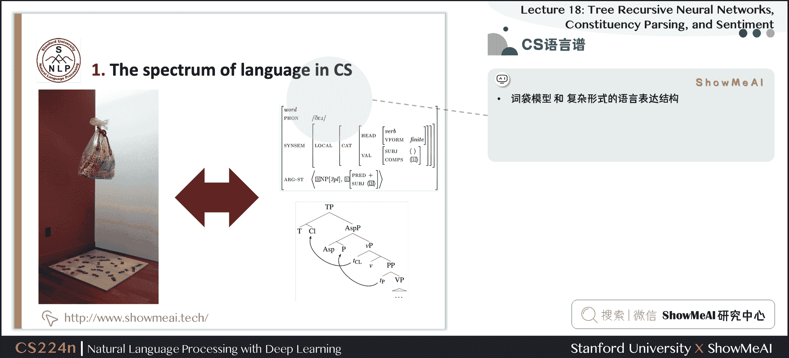

*   词袋模型和复杂形式的语言表达结构

## 1.1 语言的语义解释：不仅仅是词向量

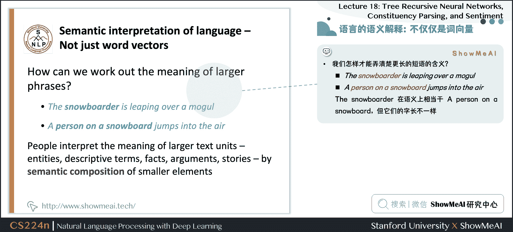

*   我们怎样才能弄清楚更大的短语的含义？
    *   `The snowboarder` is leaping over a mogul
    *   `A person on a snowboard` jumps into the air
*   `The snowboarder` 在语义上相当于 `A person on a snowboard`，但它们的字长不一样

人们通过较小元素的语义成分来解释较大文本单元的意义

*   实体，描述性术语，事实，论点，故事

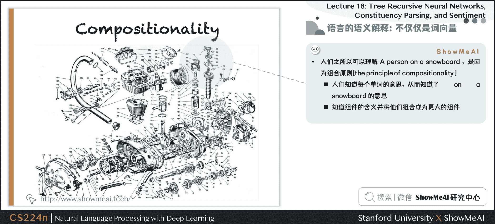

*   人们之所以可以理解 `A person on a snowboard`，是因为组合原则 ( `the principle of compositionality`)
    *   人们知道每个单词的意思，从而知道了 `on a snowboard` 的意思
    *   知道组件的含义并将他们组合成为更大的组件

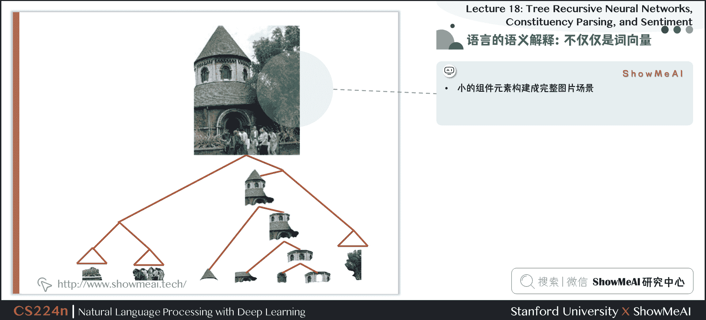

*   小的组件元素构建成完整图片场景

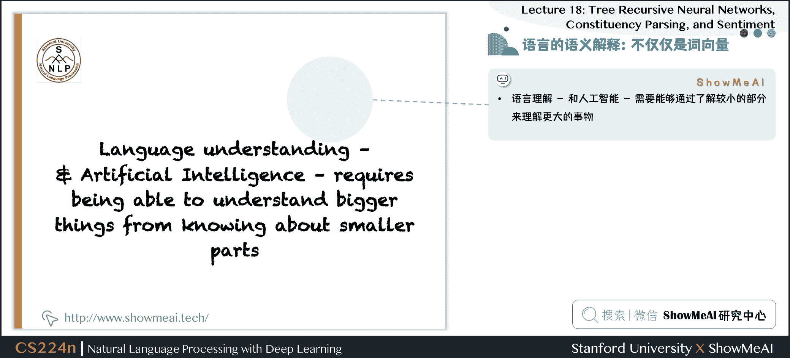

*   语言理解 - 和人工智能 - 需要能够通过了解较小的部分来理解更大的事物

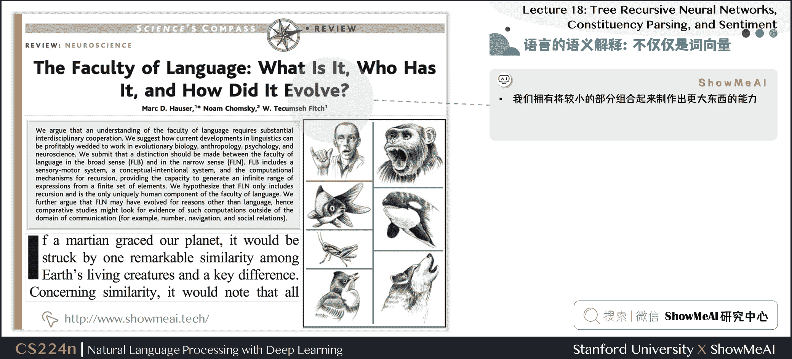

*   我们拥有将较小的部分组合起来制作出更大东西的能力

## 1.2 语言是递归的吗？

*   认知上有点争议 (需要前往无限)

*   但是：递归对于描述语言是很自然的
    *   `[The person standing next to [the man from [the company that purchased [the firm that you used to work at]]]]`
    *   包含名词短语的名词短语，包含名词短语
*   它是语言结构的一个非常强大的先验

## 1.3 Penn Treebank tree

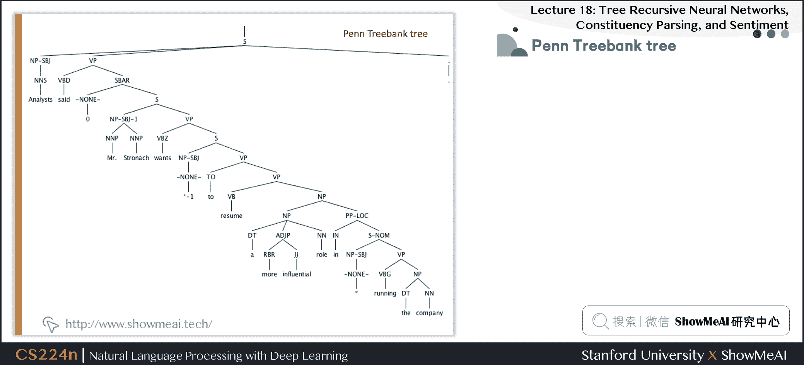

# 2.基于词向量空间模型的构建

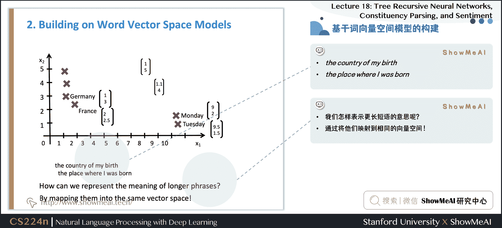

*   `the country of my birth`
*   `the place where I was born`

*   我们怎样表示更长短语的意思呢？
*   通过将他们映射到相同的向量空间！

## 2.1 我们应该如何将短语映射到向量空间？

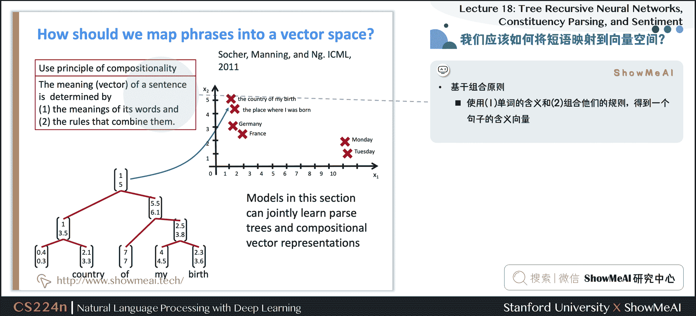

*   基于组合原则
    *   使用单词的含义和组合他们的规则，得到一个句子的含义向量
*   同时学习解析树以及组合向量表示

## 2.2 Constituency Sentence Parsing

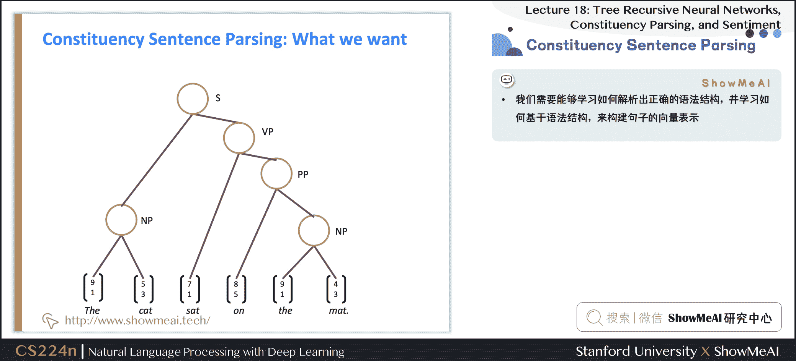

*   我们需要能够学习如何解析出正确的语法结构，并学习如何基于语法结构，来构建句子的向量表示

## 2.3 递归与循环神经网络

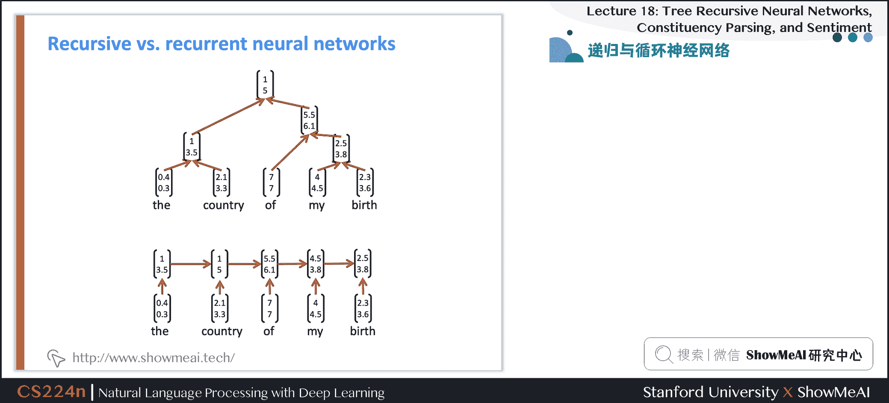

*   循环神经网络需要一个树结构
*   循环神经网络不能在没有前缀上下文的情况下学习理解短语，并且经常它得到的最终向量包含太多末尾单词的信息 (而忽略了前面的一些内容)

## 2.4 结构预测对的递归神经网络

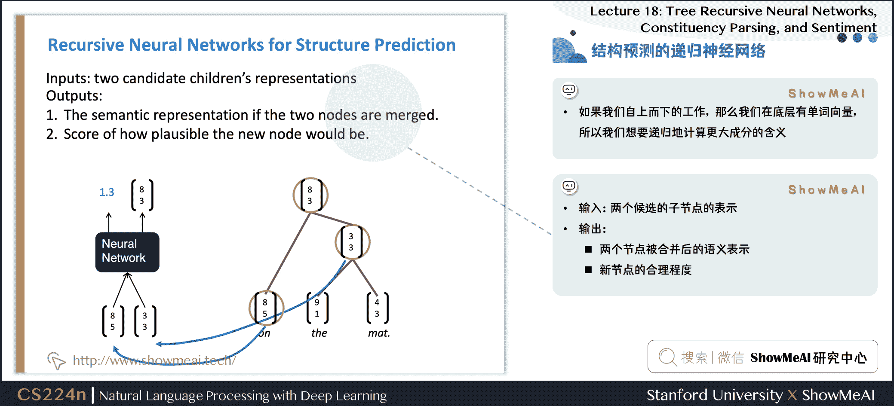

*   如果我们自上而下的工作，那么我们在底层有单词向量，所以我们想要递归地计算更大成分的含义

*   输入：两个候选的子节点的表示
*   输出：
    *   两个节点被合并后的语义表示
    *   新节点的合理程度

## 2.5 递归神经网络定义

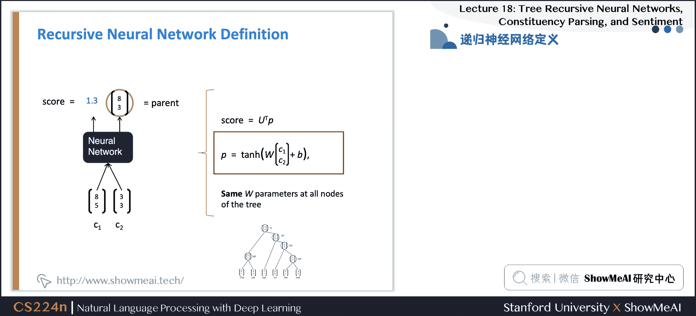

## 2.6 用递归网络分析句子

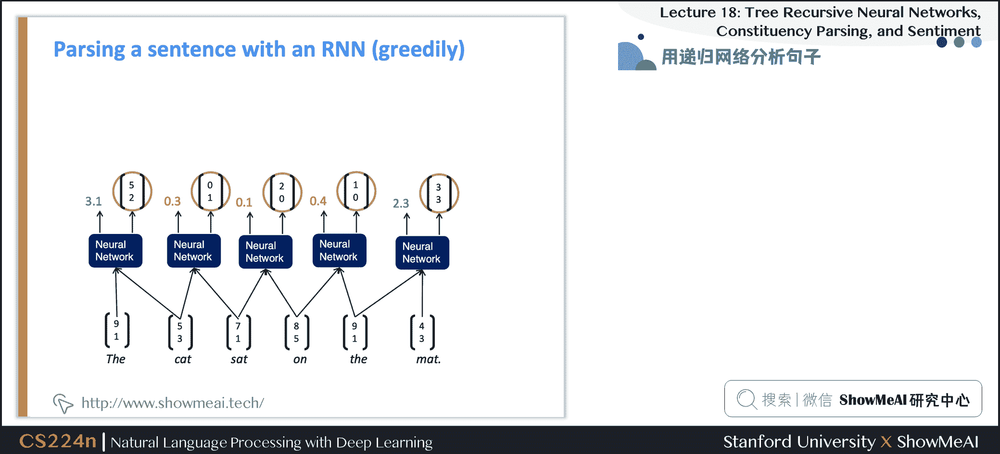

*   自左向右重复遍历，每次将得分最高的两者组合在一起

## 2.7 分析一个句子

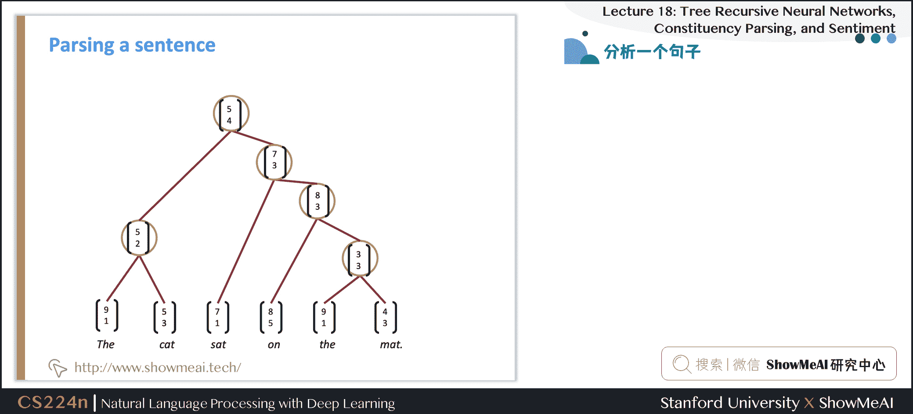

## 2.8 Max-Margin Framework：细节

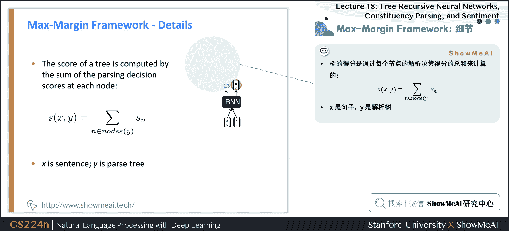

*   树的得分是通过每个节点的解析决策得分的总和来计算的

s ( x , y ) = ∑ n ∈ n o d e ( y ) s n s(x, y)=\sum_{n \in n o d e (y)} s_{n} s(x,y)=n∈node(y)∑​sn​

*   x x x 是句子， y y y 是解析树

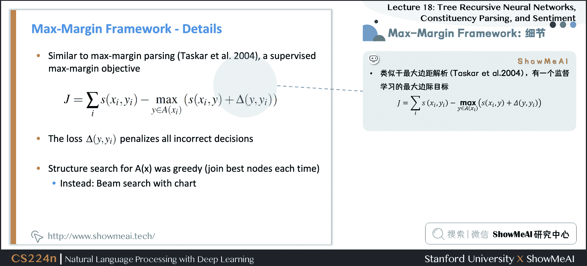

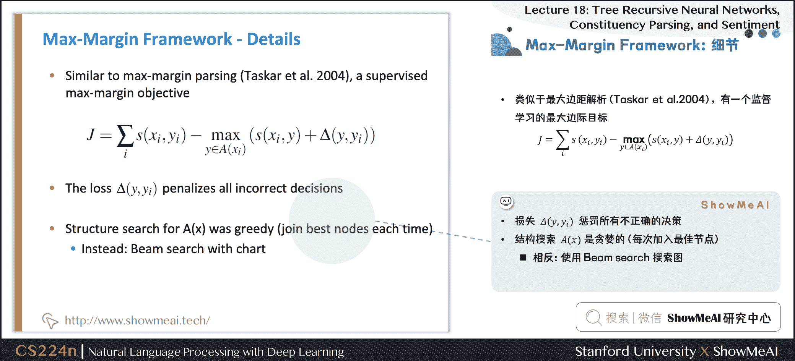

*   类似于最大边距解析 (Taskar et al.2004) ，有一个监督学习的最大边际目标

J = ∑ i s ( x i , y i ) − max ⁡ y ∈ A ( x i ) ( s ( x i , y ) + Δ ( y , y i ) ) J=\sum_{i} s\left(x_{i}, y_{i}\right)-\max _{y \in A\left(x_{i}\right)}\left(s\left(x_{i}, y\right)+\Delta\left(y, y_{i}\right)\right) J=i∑​s(xi​,yi​)−y∈A(xi​)max​(s(xi​,y)+Δ(y,yi​))

*   损失 Δ ( y , y i ) \Delta\left(y, y_{i}\right) Δ(y,yi​) 惩罚所有不正确的决策
*   结构搜索 A ( x ) A(x) A(x) 是贪婪的 (每次加入最佳节点)

    *   相反：使用 Beam search 搜索图 

## 2.9 场景分析

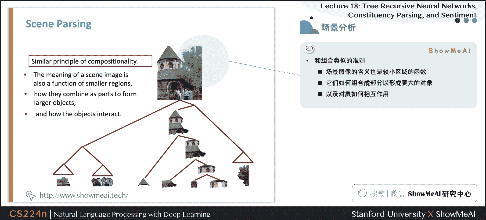

*   和组合类似的准则
    *   场景图像的含义也是较小区域的函数
    *   它们如何组合成部分以形成更大的对象
    *   以及对象如何相互作用

## 2.10 图像解析算法

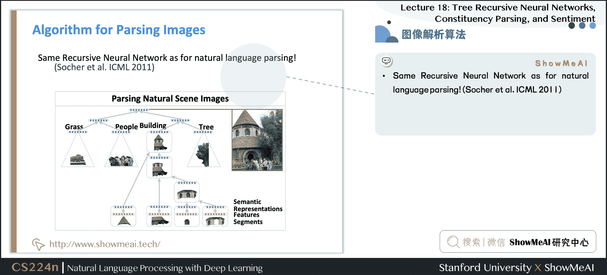

*   Same Recursive Neural Network as for natural language parsing! (Socher et al. ICML 2011)

## 2.11 多类分割

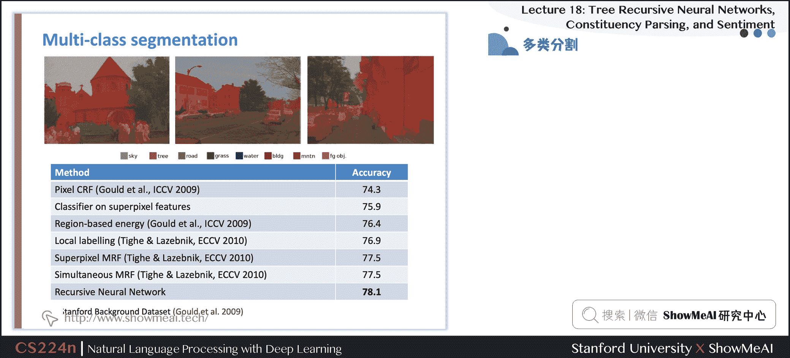

# 3.结构反向传播(BTS)

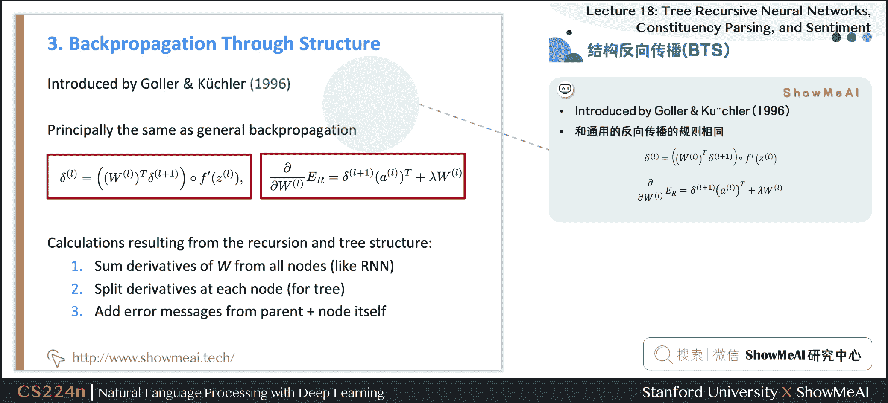

*   Introduced by Goller & Küchler (1996)
*   和通用的反向传播的规则相同

δ ( l ) = ( ( W ( l ) ) T δ ( l + 1 ) ) ∘ f ′ ( z ( l ) ) \delta{(l)}=\left(\left(W^{(l)}\right)^{T} \delta^{(l+1)}\right) \circ f^{\prime}\left(z^{(l)}\right) δ(l)=((W(l))Tδ(l+1))∘f′(z(l))

∂ ∂ W ( l ) E R = δ ( l + 1 ) ( a ( l ) ) T + λ W ( l ) \frac{\partial}{\partial W^{(l)}} E_{R}=\delta^{(l+1)}\left(a^{(l)}\right)^{T}+\lambda W^{(l)} ∂W(l)∂​ER​=δ(l+1)(a(l))T+λW(l)

递归和树结构导致的计算：

*   ① 从所有节点 (像 RNN 一样) 求 W W W 的导数
*   ② 在每个节点处拆分导数 (对于树)
*   ③ 从父节点和节点本身添加 error message

## 3.1 结构反向传播：第 1 步

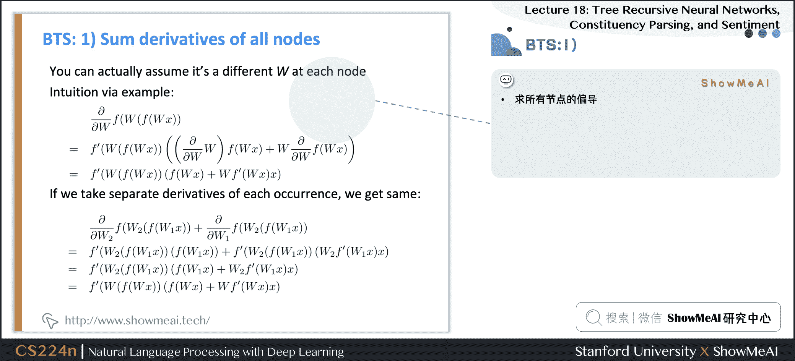

*   求所有节点的偏导

∂ ∂ W f ( W ( f ( W x ) ) = f ′ ( W ( f ( W x ) ) ( ( ∂ ∂ W W ) f ( W x ) + W ∂ ∂ W f ( W x ) ) = f ′ ( W ( f ( W x ) ) ( f ( W x ) + W f ′ ( W x ) x ) \begin{aligned} & \frac{\partial}{\partial W} f(W(f(W x))\\ =& f^{\prime}\left(W(f(W x))\left(\left(\frac{\partial}{\partial W} W\right) f(W x)+W \frac{\partial}{\partial W} f(W x)\right)\right.\\ =& f^{\prime}\left(W(f(W x))\left(f(W x)+W f^{\prime}(W x) x\right)\right. \end{aligned} ==​∂W∂​f(W(f(Wx))f′(W(f(Wx))((∂W∂​W)f(Wx)+W∂W∂​f(Wx))f′(W(f(Wx))(f(Wx)+Wf′(Wx)x)​

∂ ∂ W 2 f ( W 2 ( f ( W 1 x ) ) + ∂ ∂ W 1 f ( W 2 ( f ( W 1 x ) ) = f ′ ( W 2 ( f ( W 1 x ) ) ( f ( W 1 x ) ) + f ′ ( W 2 ( f ( W 1 x ) ) ( W 2 f ′ ( W 1 x ) x ) = f ′ ( W 2 ( f ( W 1 x ) ) ( f ( W 1 x ) + W 2 f ′ ( W 1 x ) x ) = f ′ ( W ( f ( W x ) ) ( f ( W x ) + W f ′ ( W x ) x ) \begin{aligned} & \frac{\partial}{\partial W_{2}} f\left(W_{2}\left(f\left(W_{1} x\right)\right)+\frac{\partial}{\partial W_{1}} f\left(W_{2}\left(f\left(W_{1} x\right)\right)\right.\right.\\ =& f^{\prime}\left(W_{2}\left(f\left(W_{1} x\right)\right)\left(f\left(W_{1} x\right)\right)+f^{\prime}\left(W_{2}\left(f\left(W_{1} x\right)\right)\left(W_{2} f^{\prime}\left(W_{1} x\right) x\right)\right.\right.\\ =& f^{\prime}\left(W_{2}\left(f\left(W_{1} x\right)\right)\left(f\left(W_{1} x\right)+W_{2} f^{\prime}\left(W_{1} x\right) x\right)\right.\\ =& f^{\prime}\left(W(f(W x))\left(f(W x)+W f^{\prime}(W x) x\right)\right. \end{aligned} ===​∂W2​∂​f(W2​(f(W1​x))+∂W1​∂​f(W2​(f(W1​x))f′(W2​(f(W1​x))(f(W1​x))+f′(W2​(f(W1​x))(W2​f′(W1​x)x)f′(W2​(f(W1​x))(f(W1​x)+W2​f′(W1​x)x)f′(W(f(Wx))(f(Wx)+Wf′(Wx)x)​

## 3.2 结构反向传播：第 2 步

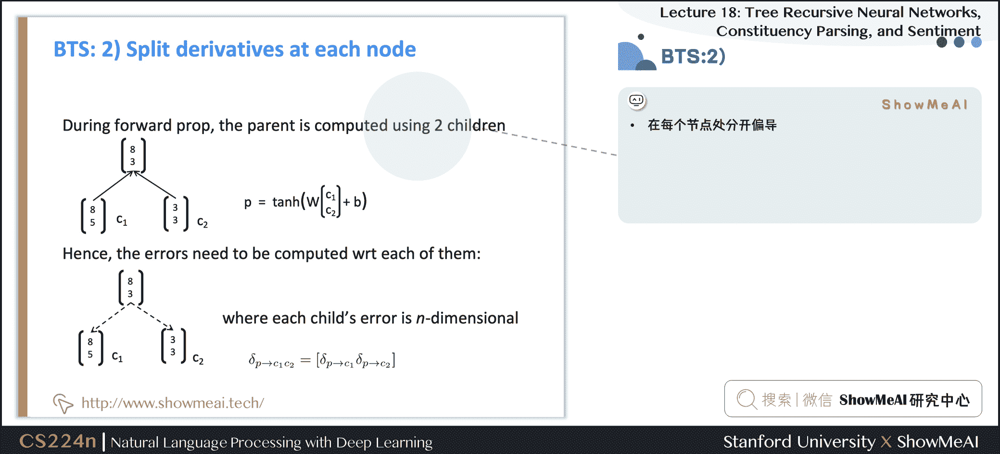

*   在每个节点处分开偏导

## 3.3 结构反向传播：第 3 步

*   叠加 error message

## 3.4 BTS Python 编程：前向传播

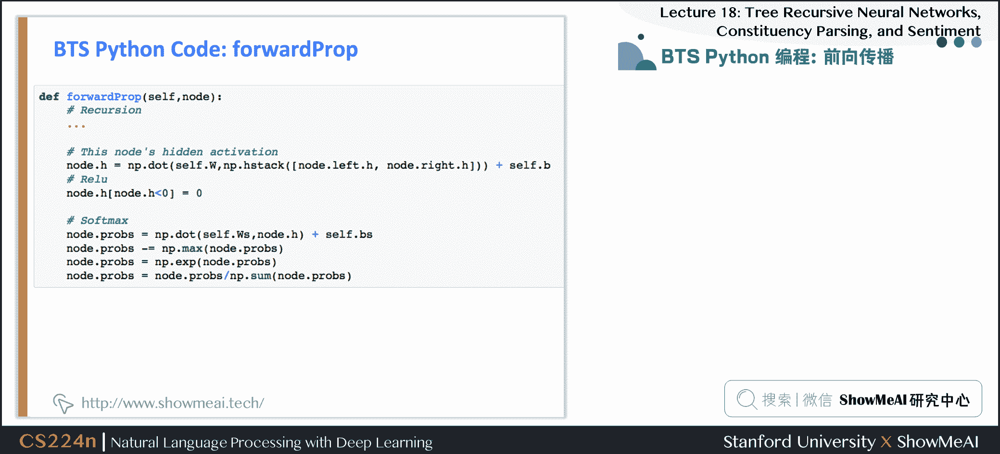

## 3.5 BTS Python 编程：反向传播

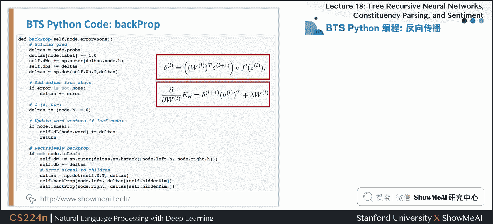

# 4.版本 1：简单 TreeRNN

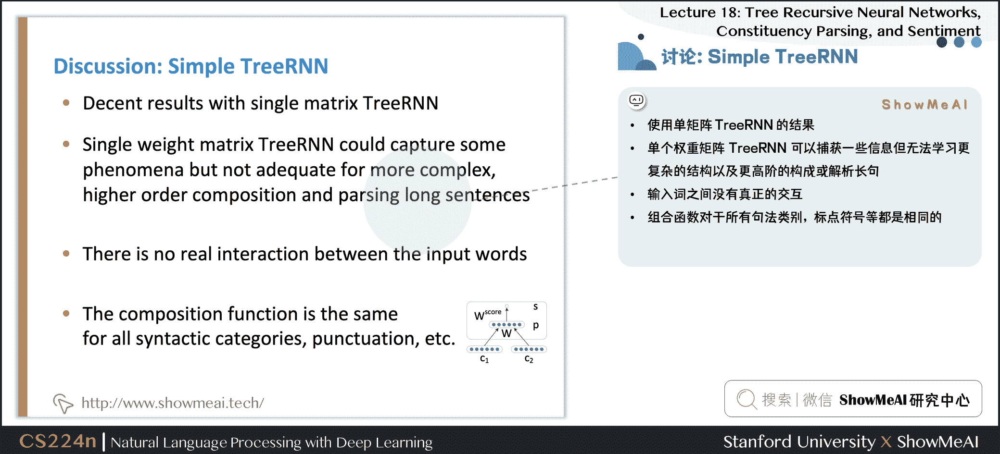

*   使用单矩阵 TreeRNN 的结果
*   单个权重矩阵 TreeRNN 可以捕获一些现象但不适合更复杂的现象以及更高阶的构成或解析长句
*   输入词之间没有真正的交互
*   组合函数对于所有句法类别，标点符号等都是相同的

# 5.版本 2: Syntactically-Untied RNN

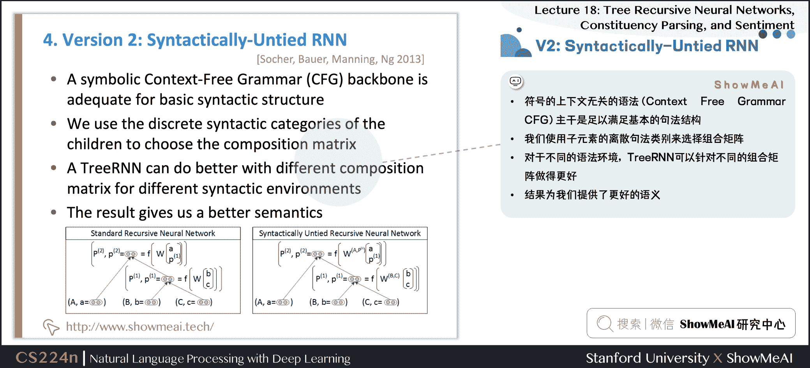

*   符号的上下文无关的语法（Context Free Grammar CFG）主干是足以满足基本的句法结构
*   我们使用子元素的离散句法类别来选择组合矩阵
*   对于不同的语法环境，TreeRNN 可以针对不同的组合矩阵做得更好
*   结果为我们提供了更好的语义

**补充讲解**

*   左边 RNN 是使用概率的上下文无关的语法解析，为句子生成可能的树结构
*   右边 SU-RNN 是语法解开的递归神经网络，此时每个节点和序列都有一个类别，我们可以使用对应不同类别的矩阵组合起来，例如将类别 B 和类别 C 的矩阵组合起来作为本次计算的权重矩阵，所以这个权重矩阵是更符合句子结构的

## 5.1 组合向量文法

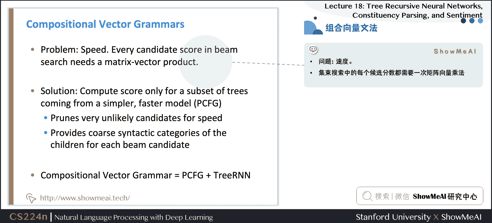

*   **问题**：速度
    *   集束搜索中的每个候选分数都需要一次矩阵向量乘法

*   解决方案：仅针对来自更简单，更快速模型(Probabilistic Context Free Grammar (PCFG))的树的子集计算得分
    *   对概率低的候选进行剪枝以获得更快的速度
    *   为每个集束候选提供子句的粗略语法类别

*   组合矢量语法= PCFG + TreeRNN

## 5.2 解析相关工作

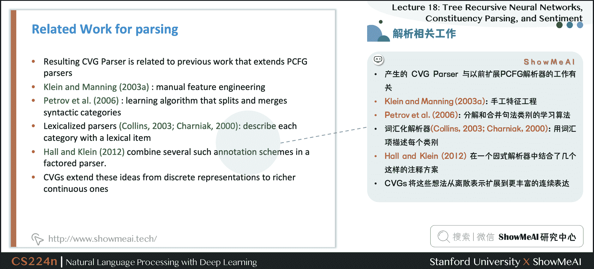

*   产生的 CVG Parser 与以前扩展 PCFG 解析器的工作有关
*   Klein and Manning (2003a)：手工特征工程
*   Petrov et al. (2006)：分解和合并句法类别的学习算法
*   词汇化解析器(Collins, 2003; Charniak, 2000)：用词汇项描述每个类别
*   Hall and Klein (2012) 在一个因式解析器中结合了几个这样的注释方案
*   CVGs 将这些想法从离散表示扩展到更丰富的连续表达

## 5.3 实验

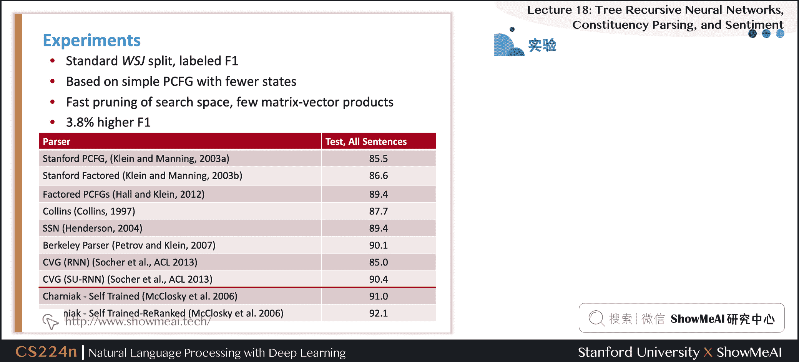

## 5.4 #论文解读# SU-RNN / CVG

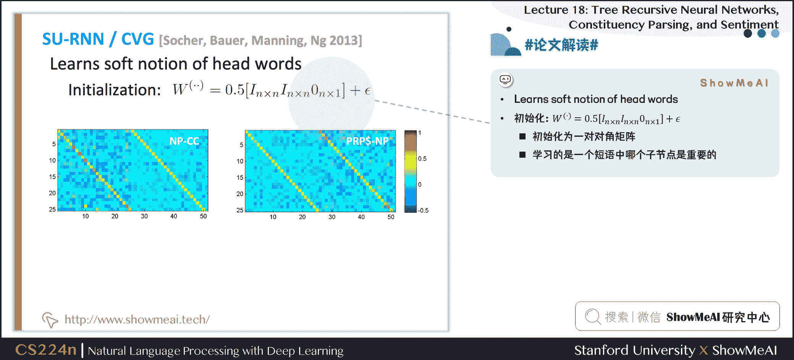

*   Learns soft notion of head words
*   初始化： W ( ⋅ ) = 0.5 [ I n × n I n × n 0 n × 1 ] + ε W^{(\cdot)}=0.5\left[I_{n \times n} I_{n \times n} 0_{n \times 1}\right]+\varepsilon W(⋅)=0.5[In×n​In×n​0n×1​]+ε

    *   初始化为一对对角矩阵
    *   学习的是一个短语中哪个子节点是重要的 

## 5.5 结果向量表示的分析

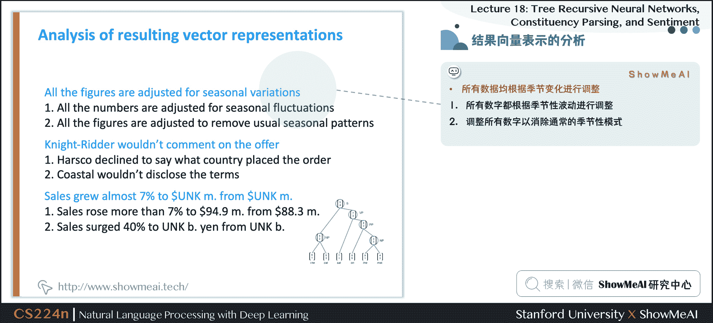

*   所有数据均根据季节变化进行调整
    *   所有数字都根据季节性波动进行调整
    *   调整所有数字以消除通常的季节性模式

*   night-Ridder 不会评论这个提议
    *   Harsco declined to say what country placed the order
    *   Coastal wouldn’t disclose the terms

*   Sales grew almost 7 % 7\% 7% to $$ \text{UNK}$ m. from $$ \text{UNK}$ m.

    *   Sales rose more than 7 % 7\% 7% to $$ 94.9$ m. from $$ 88.3$ m.
    *   Sales surged 40 % 40 \% 40% to UNK \text{UNK} UNK b. yen from UNK \text{UNK} UNK b. 

# 6.版本 3: Compositionality Through Recursive Matrix-Vector Spaces

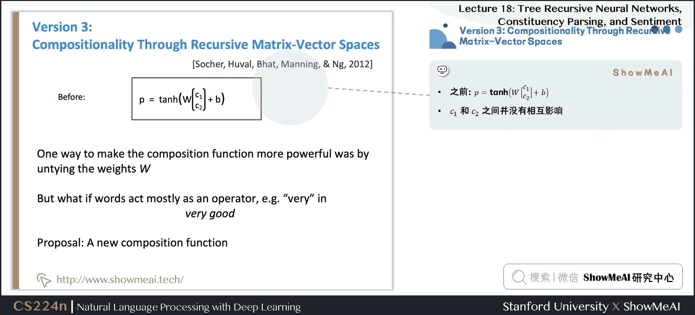

*   之前： p = tanh ⁡ ( W [ c 1 c 2 ] + b ) p=\tanh \left(W\left[\begin{array}{l}{c_{1}} \\ {c_{2}}\end{array}\right]+b\right) p=tanh(W[c1​c2​​]+b)
*   c 1 c_1 c1​ 和 c 2 c_2 c2​ 之间并没有相互影响

*   使组合函数更强大的一种方法是解开权重 W W W
*   但是，如果单词主要作为运算符，例如`very good`的 `very` 是没有意义的，是用于增加 `good` 的规模的运算符

*   提案：新的组合函数
*   问题是如何定义呢，因为不知道 c 1 c_1 c1​ 和 c 2 c_2 c2​ 哪个是 operator，比如 very good ，就应该讲 very 视为作用在 good 的矩阵上的向量

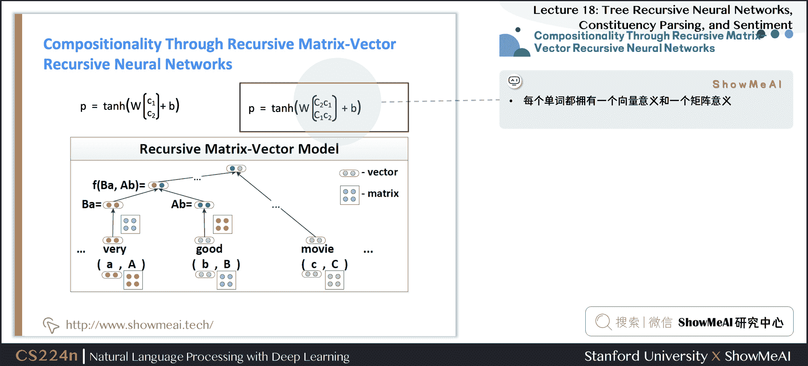

*   每个单词都拥有一个向量意义和一个矩阵意义

*   左侧计算得到合并后的向量意义
*   右侧计算得到合并后的矩阵意义

*   可以捕获运算符语义，即中一个单词修饰了另一个单词的含义

## 6.1 预测情绪分布

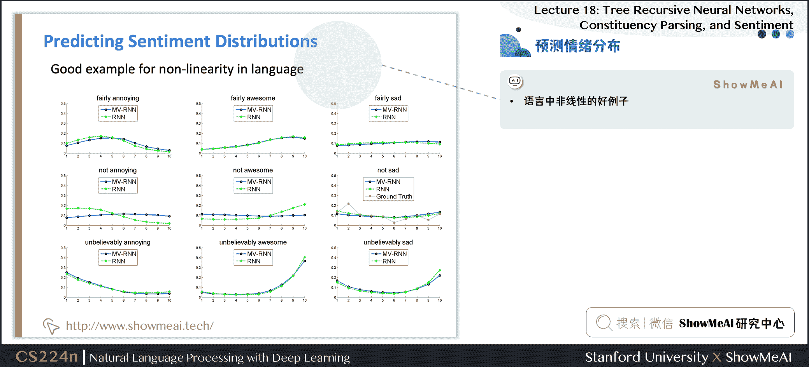

*   语言中非线性的好例子

## 6.2 语义关系的分类

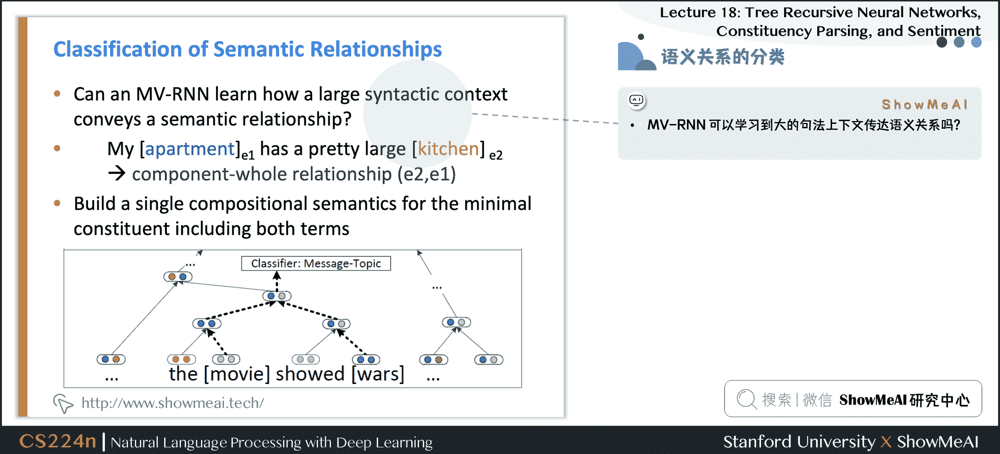

*   MV-RNN 可以学习到大的句法上下文传达语义关系吗？
*   为包括两项的最小成分构建单个组合语义

## 6.3 语义关系的分类

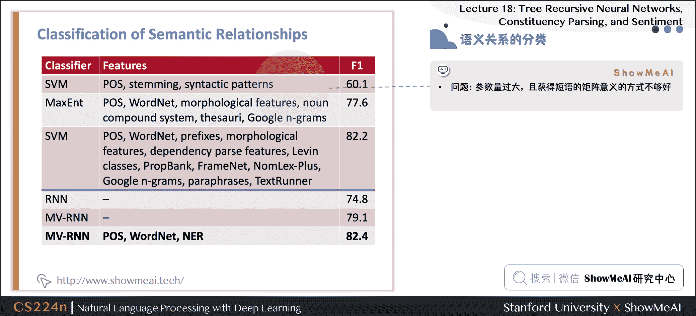

*   问题：参数量过大，且获得短语的矩阵意义的方式不够好

# 7.版本 4: Recursive Neural Tensor Network

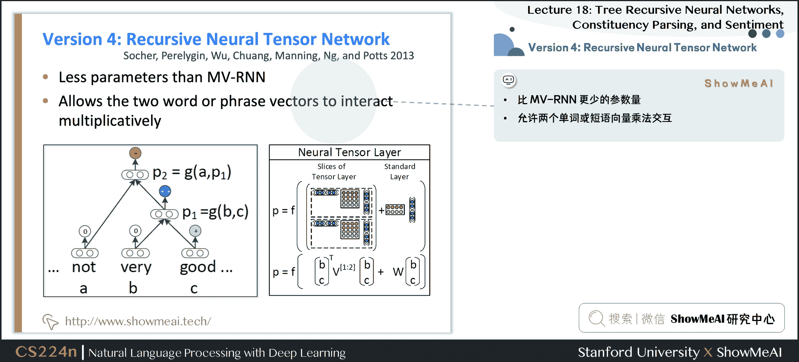

*   比 MV-RNN 更少的参数量
*   允许两个单词或短语向量乘法交互

## 7.1 词袋之上: 情感检测

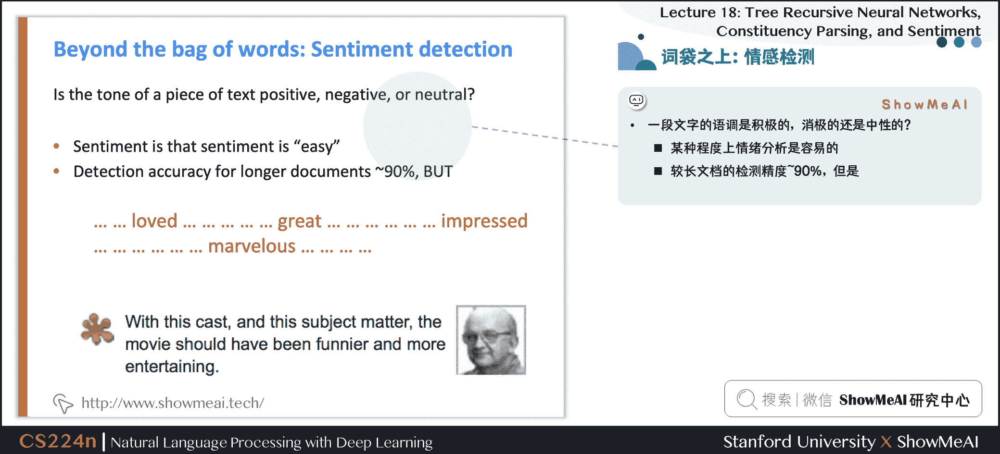

*   一段文字的语调是积极的，消极的还是中性的？
    *   某种程度上情绪分析是容易的
    *   较长文档的检测精度~90％，但是

*   有了这样的演员阵容和题材，这部电影应该会更有趣，更具娱乐性。

## 7.2 斯坦福情感分析数据集

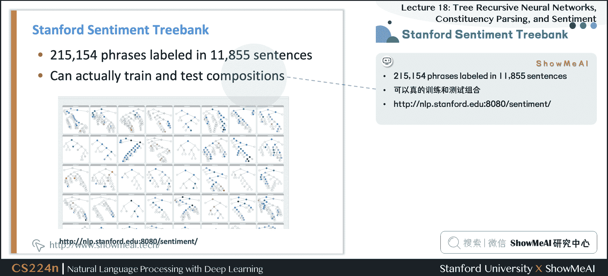

*   215,154 phrases labeled in 11,855 sentences
*   可以真的训练和测试组合
*   http://nlp.stanford.edu:8080/sentiment/

## 7.3 好的数据集对所有模型都有提升帮助

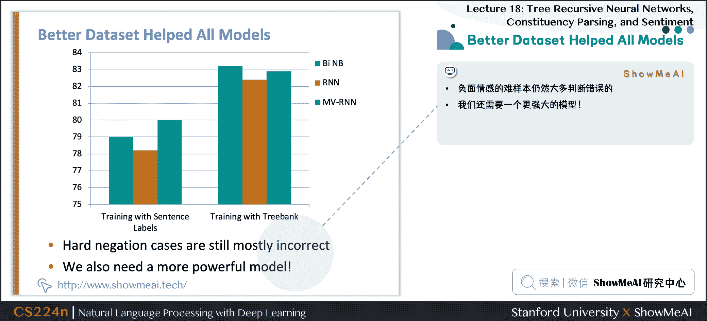

*   负面情感的难样本仍然大多判断错误的
*   我们还需要一个更强大的模型！

## 7.4 版本 4: Recursive Neural Tensor Network

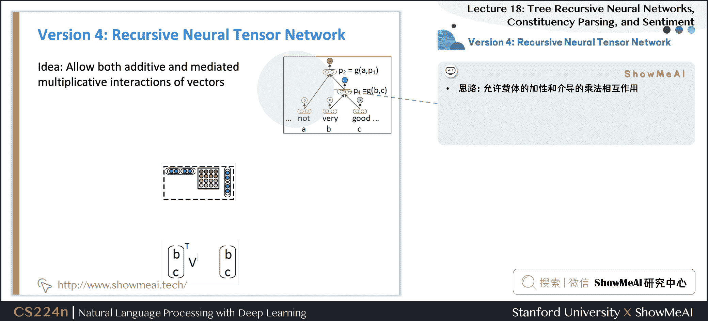

*   思路：允许载体的加性和介导的乘法相互作用

*   在树中使用结果向量作为逻辑回归的分类器的输入
*   使用梯度下降联合训练所有权重

补充讲解

*   回到最初的使用向量表示单词的意义，但不是仅仅将两个表示单词含义的向量相互作用，左上图是在中间插入一个矩阵，以双线性的方式做注意力并得到了注意力得分。即令两个单词的向量相互作用并且只产生一个数字作为输出
*   如上中图所示，我们可以拥有三维矩阵，即多层的矩阵（二维），从而得到了两个得分
*   使用 softmax 做分类

## 7.5 递归神经张量网络/Recursive Neural Tensor Network

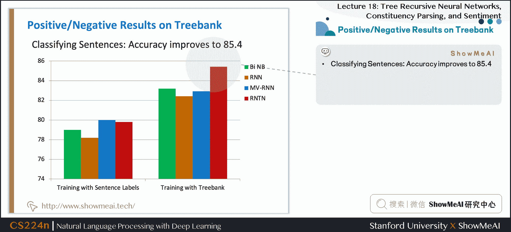

## 7.6 数据集上的实验效果

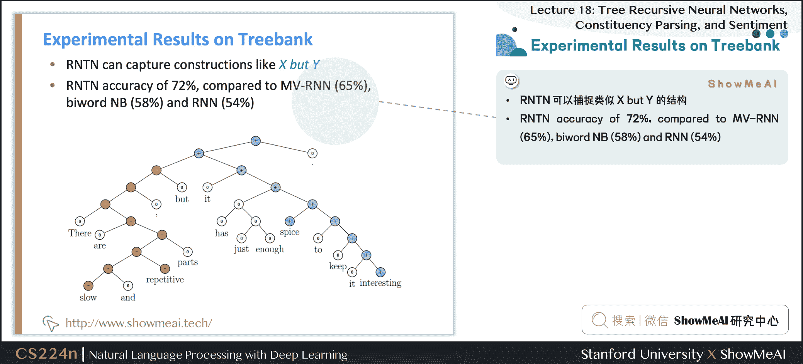

*   RNTN 可以捕捉类似 X X X but Y Y Y 的结构
*   RNTN accuracy of 72%, compared to MV-RNN (65%), biword NB (58%) and RNN (54%)

7.7 否定的样本结果

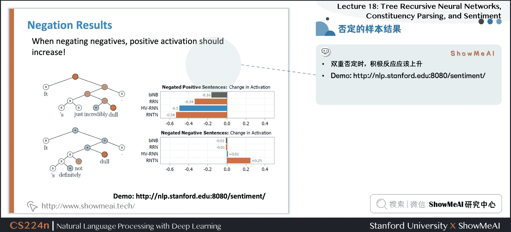

*   双重否定时，积极反应应该上升
*   Demo: http://nlp.stanford.edu:8080/sentiment/

# 8.版本 5: Improving Deep Learning Semantic Representations using a TreeLSTM

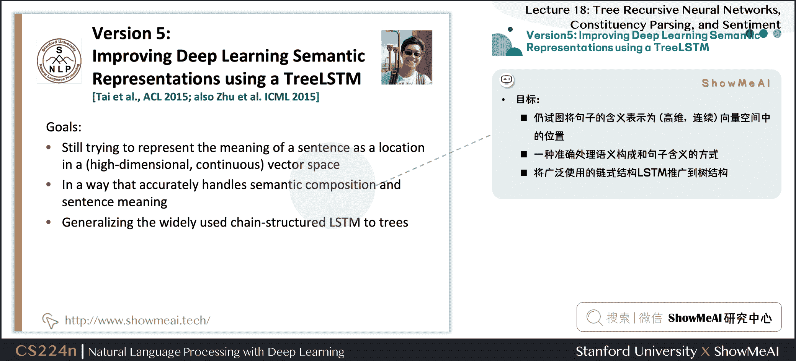

目标：

*   仍试图将句子的含义表示为 (高维，连续) 向量空间中的位置
*   一种准确处理语义构成和句子含义的方式
*   将广泛使用的链式结构 LSTM 推广到树结构

## 8.1 LSTM Units for Sequential Composition

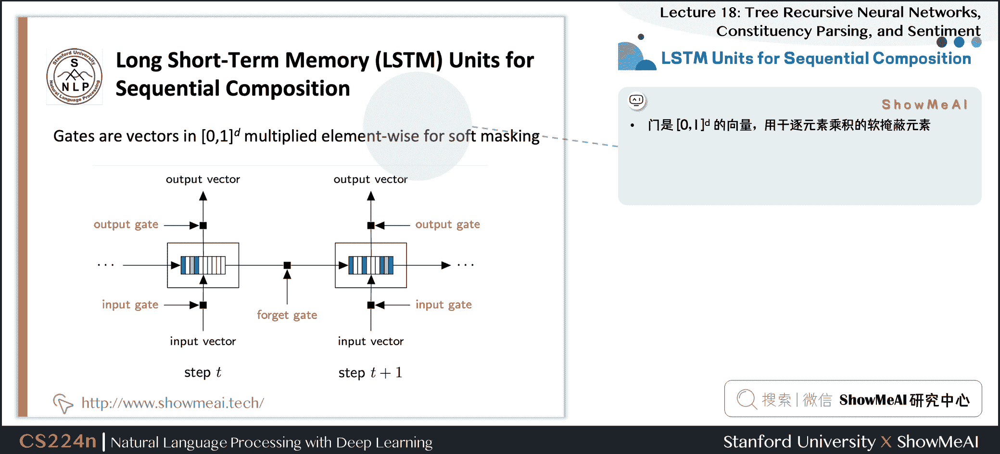

*   门是 [ 0 , 1 ] d [0,1]^{d} [0,1]d 的向量，用于逐元素乘积的软掩蔽元素

## 8.2 #论文解读# Tree-Structured Long Short-Term Memory Networks


## 8.3 Tree-structured LSTM


*   将连续 LSTM 推广到具有任何分支因子的树

## 8.4 结果


## 8.5 忘记门：选择性状态保护


*   Stripes = forget gate activations; more white ⇒ more preserved
*   图中的条纹代表遗忘门激活，更多的白色占比表示更多的信息保留

# 9.#论文解读# QCD-Aware Recursive Neural Networks for Jet Physics


# 10.用于程序翻译的 tree-to-tree 神经网络


*   探索在编程语言之间使用树形结构编码和生成进行翻译
*   在生成中，将注意力集中在源树上


# 11.HAI 以人为中心的人工智能


*   人工智能有望改变经济和社会，改变我们沟通和工作的方式，重塑治理和政治，并挑战国际秩序
*   HAI 的使命是推进人工智能研究，教育，政策和实践，以改善人类状况


# 12.视频教程

可以点击 [**B 站**](https://www.bilibili.com/video/BV1Yo4y1D7FW?p=18) 查看视频的【双语字幕】版本

[`player.bilibili.com/player.html?aid=376755412&page=18`](https://player.bilibili.com/player.html?aid=376755412&page=18)

【双语字幕+资料下载】斯坦福 CS224n | 深度学习与自然语言处理(2019·全 20 讲)

# 13.参考资料

*   [本讲带学的**在线阅翻页本**](https://blog.showmeai.tech/cs224n/lecture18-Constituency-Parsing-and-Tree-Recursive-Neural-Networks#/)
*   [《斯坦福 CS224n 深度学习与自然语言处理》**课程学习指南**](https://blog.showmeai.tech/cs224n/)
*   [《斯坦福 CS224n 深度学习与自然语言处理》**课程大作业解析**](https://github.com/ShowMeAI-Hub/awesome-AI-courses-notes-cheatsheets/tree/main/CS224n-Natural-Language-Processing-with-Deep-Learning/assignment-solutions)
*   [【**双语字幕视频**】斯坦福 CS224n | 深度学习与自然语言处理(2019·全 20 讲)](https://www.bilibili.com/video/BV1Yo4y1D7FW)
*   [**Stanford 官网** | CS224n: Natural Language Processing with Deep Learning](https://web.stanford.edu/class/archive/cs/cs224n/cs224n.1194/)

# [**ShowMeAI**](http://www.showmeai.tech)系列教程推荐

*   [大厂技术实现 | 推荐与广告计算解决方案](http://www.showmeai.tech/tutorials/50)
*   [大厂技术实现 | 计算机视觉解决方案](http://www.showmeai.tech/tutorials/51)
*   [大厂技术实现 | 自然语言处理行业解决方案](http://www.showmeai.tech/tutorials/52)
*   [图解 Python 编程：从入门到精通系列教程](http://www.showmeai.tech/tutorials/56)
*   [图解数据分析：从入门到精通系列教程](http://www.showmeai.tech/tutorials/33)
*   [图解 AI 数学基础：从入门到精通系列教程](http://www.showmeai.tech/tutorials/83)
*   [图解大数据技术：从入门到精通系列教程](http://www.showmeai.tech/tutorials/84)
*   [图解机器学习算法：从入门到精通系列教程](http://www.showmeai.tech/tutorials/34)
*   [机器学习实战：手把手教你玩转机器学习系列](http://www.showmeai.tech/tutorials/41)
*   [深度学习教程 | 吴恩达专项课程 · 全套笔记解读](http://www.showmeai.tech/tutorials/35)
*   [自然语言处理教程 | 斯坦福 CS224n 课程 · 课程带学与全套笔记解读](http://www.showmeai.tech/tutorials/36)

# NLP 系列教程文章

*   [NLP 教程(1)- 词向量、SVD 分解与 Word2vec](http://showmeai.tech/article-detail/230)
*   [NLP 教程(2)- GloVe 及词向量的训练与评估](http://showmeai.tech/article-detail/232)
*   [NLP 教程(3)- 神经网络与反向传播](http://showmeai.tech/article-detail/234)
*   [NLP 教程(4)- 句法分析与依存解析](http://www.showmeai.tech/article-detail/237)
*   [NLP 教程(5)- 语言模型、RNN、GRU 与 LSTM](http://www.showmeai.tech/article-detail/239)
*   [NLP 教程(6)- 神经机器翻译、seq2seq 与注意力机制](http://www.showmeai.tech/article-detail/242)
*   [NLP 教程(7)- 问答系统](http://www.showmeai.tech/article-detail/245)
*   [NLP 教程(8)- NLP 中的卷积神经网络](http://www.showmeai.tech/article-detail/247)
*   [NLP 教程(9)- 句法分析与树形递归神经网络](http://www.showmeai.tech/article-detail/255)

# 斯坦福 CS224n 课程带学详解

*   [斯坦福 NLP 课程 | 第 1 讲 - NLP 介绍与词向量初步](http://showmeai.tech/article-detail/231)
*   [斯坦福 NLP 课程 | 第 2 讲 - 词向量进阶](http://showmeai.tech/article-detail/233)
*   [斯坦福 NLP 课程 | 第 3 讲 - 神经网络知识回顾](http://showmeai.tech/article-detail/235)
*   [斯坦福 NLP 课程 | 第 4 讲 - 神经网络反向传播与计算图](http://showmeai.tech/article-detail/236)
*   [斯坦福 NLP 课程 | 第 5 讲 - 句法分析与依存解析](http://www.showmeai.tech/article-detail/238)
*   [斯坦福 NLP 课程 | 第 6 讲 - 循环神经网络与语言模型](http://www.showmeai.tech/article-detail/240)
*   [斯坦福 NLP 课程 | 第 7 讲 - 梯度消失问题与 RNN 变种](http://www.showmeai.tech/article-detail/241)
*   [斯坦福 NLP 课程 | 第 8 讲 - 机器翻译、seq2seq 与注意力机制](http://www.showmeai.tech/article-detail/243)
*   [斯坦福 NLP 课程 | 第 9 讲 - cs224n 课程大项目实用技巧与经验](http://www.showmeai.tech/article-detail/244)
*   [斯坦福 NLP 课程 | 第 10 讲 - NLP 中的问答系统](http://www.showmeai.tech/article-detail/246)
*   [斯坦福 NLP 课程 | 第 11 讲 - NLP 中的卷积神经网络](http://www.showmeai.tech/article-detail/248)
*   [斯坦福 NLP 课程 | 第 12 讲 - 子词模型](http://www.showmeai.tech/article-detail/249)
*   [斯坦福 NLP 课程 | 第 13 讲 - 基于上下文的表征与 NLP 预训练模型](http://www.showmeai.tech/article-detail/250)
*   [斯坦福 NLP 课程 | 第 14 讲 - Transformers 自注意力与生成模型](http://www.showmeai.tech/article-detail/251)
*   [斯坦福 NLP 课程 | 第 15 讲 - NLP 文本生成任务](http://www.showmeai.tech/article-detail/252)
*   [斯坦福 NLP 课程 | 第 16 讲 - 指代消解问题与神经网络方法](http://www.showmeai.tech/article-detail/253)
*   [斯坦福 NLP 课程 | 第 17 讲 - 多任务学习(以问答系统为例)](http://www.showmeai.tech/article-detail/254)
*   [斯坦福 NLP 课程 | 第 18 讲 - 句法分析与树形递归神经网络](http://www.showmeai.tech/article-detail/256)
*   [斯坦福 NLP 课程 | 第 19 讲 - AI 安全偏见与公平](http://www.showmeai.tech/article-detail/257)
*   [斯坦福 NLP 课程 | 第 20 讲 - NLP 与深度学习的未来](http://www.showmeai.tech/article-detail/258)

