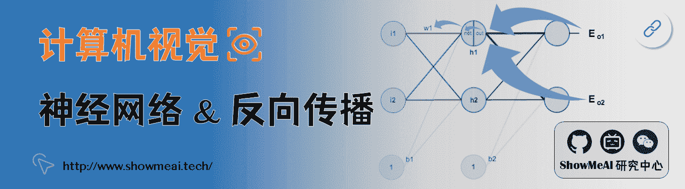
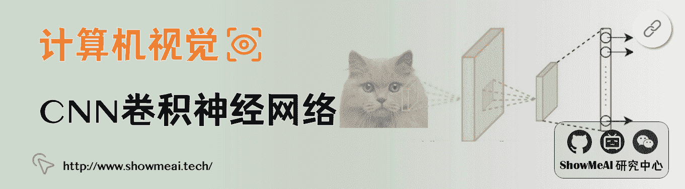
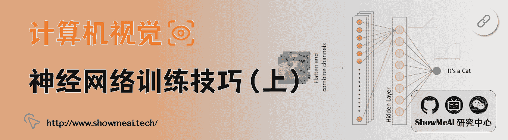
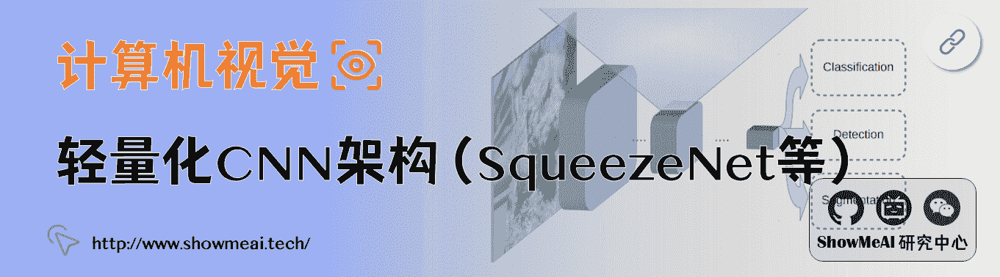
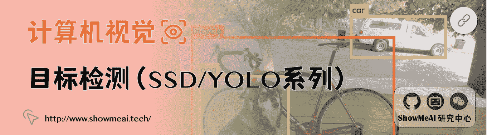
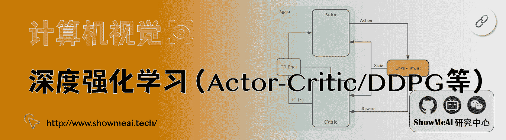

# 深度学习与计算机视觉教程：斯坦福 CS231n · 全套笔记解读

> 原文：[`blog.csdn.net/ShowMeAI/article/details/124993058`](https://blog.csdn.net/ShowMeAI/article/details/124993058)

*   作者：[韩信子](https://github.com/HanXinzi-AI)@[ShowMeAI](http://www.showmeai.tech/)
*   [教程地址](http://www.showmeai.tech/tutorials/37)：[`www.showmeai.tech/tutorials/37`](http://www.showmeai.tech/tutorials/37)
*   [本文地址](http://www.showmeai.tech/article-detail/259)：[`www.showmeai.tech/article-detail/259`](http://www.showmeai.tech/article-detail/259)
*   声明：版权所有，转载请联系平台与作者并注明出处
*   收藏[ShowMeAI](http://www.showmeai.tech/)查看更多精彩内容

* * *

## 引言

本篇内容是[ShowMeAI](http://www.showmeai.tech/)组织的[「**深度学习与计算机视觉**」](http://www.showmeai.tech/tutorials/37)系列教程入口，本教程依托于斯坦福 Stanford 出品的【**CS231n：深度学习与计算机视觉**】方向专业课程，根据课程视频内容与课程笔记，结合补充资料，针对深度学习与计算机视觉方向的主题做了全面梳理与制作，希望给大家提供专业细致而直观易懂的学习教程。

本系列教程内容覆盖：**图像分类**、**神经网络**、**反向传播**、**计算图**、**CNN**、**RNN**、**神经网络训练**、**tensorflow**、**pytorch**、**注意力机制**、**生成模型**、**目标检测**、**图像分割**、**强化学习** 等主题。

## 教程地址

### [点击查看完整教程学习路径](http://www.showmeai.tech/tutorials/37)

## 内容章节

### 1.[深度学习与 CV 教程(1) | CV 引言与基础](http://www.showmeai.tech/article-detail/260)

### 2.[深度学习与 CV 教程(2) | 图像分类与机器学习基础](http://www.showmeai.tech/article-detail/261)

### 3.[深度学习与 CV 教程(3) | 损失函数与最优化](http://www.showmeai.tech/article-detail/262)

### 4.[深度学习与 CV 教程(4) | 神经网络与反向传播](http://www.showmeai.tech/article-detail/263)

### 5.[深度学习与 CV 教程(5) | 卷积神经网络](http://www.showmeai.tech/article-detail/264)

### 6.[深度学习与 CV 教程(6) | 神经网络训练技巧 (上)](http://www.showmeai.tech/article-detail/265)

### 7.[深度学习与 CV 教程(7) | 神经网络训练技巧 (下)](http://www.showmeai.tech/article-detail/266)

### 8.[深度学习与 CV 教程(8) | 常见深度学习框架介绍](http://www.showmeai.tech/article-detail/267)

### 9.[深度学习与 CV 教程(9) | 典型 CNN 架构 (Alexnet, VGG, Googlenet, Restnet 等)](http://www.showmeai.tech/article-detail/268)

### 10.[深度学习与 CV 教程(10) | 轻量化 CNN 架构 (SqueezeNet, ShuffleNet, MobileNet 等)](http://www.showmeai.tech/article-detail/269)

### 11.[深度学习与 CV 教程(11) | 循环神经网络及视觉应用](http://www.showmeai.tech/article-detail/270)

### 12.[深度学习与 CV 教程(12) | 目标检测 (两阶段, R-CNN 系列)](http://www.showmeai.tech/article-detail/271)

### 13.[深度学习与 CV 教程(13) | 目标检测 (SSD, YOLO 系列)](http://www.showmeai.tech/article-detail/272)

### 14.[深度学习与 CV 教程(14) | 图像分割 (FCN, SegNet, U-Net, PSPNet, DeepLab, RefineNet)](http://www.showmeai.tech/article-detail/273)

### 15.[深度学习与 CV 教程(15) | 视觉模型可视化与可解释性](http://www.showmeai.tech/article-detail/274)

### 16.[深度学习与 CV 教程(16) | 生成模型 (PixelRNN, PixelCNN, VAE, GAN)](http://www.showmeai.tech/article-detail/275)

### 17.[深度学习与 CV 教程(17) | 深度强化学习 (马尔可夫决策过程, Q-Learning, DQN)](http://www.showmeai.tech/article-detail/276)

### 18.[深度学习与 CV 教程(18) | 深度强化学习 (梯度策略, Actor-Critic, DDPG, A3C)](http://www.showmeai.tech/article-detail/277)

## [ShowMeAI](http://www.showmeai.tech) 系列教程推荐

*   [大厂技术实现：推荐与广告计算解决方案](http://www.showmeai.tech/tutorials/50)
*   [大厂技术实现：计算机视觉解决方案](http://www.showmeai.tech/tutorials/51)
*   [大厂技术实现：自然语言处理行业解决方案](http://www.showmeai.tech/tutorials/52)
*   [图解 Python 编程：从入门到精通系列教程](http://www.showmeai.tech/tutorials/56)
*   [图解数据分析：从入门到精通系列教程](http://www.showmeai.tech/tutorials/33)
*   [图解 AI 数学基础：从入门到精通系列教程](http://www.showmeai.tech/tutorials/83)
*   [图解大数据技术：从入门到精通系列教程](http://www.showmeai.tech/tutorials/84)
*   [图解机器学习算法：从入门到精通系列教程](http://www.showmeai.tech/tutorials/34)
*   [机器学习实战：手把手教你玩转机器学习系列](http://www.showmeai.tech/tutorials/41)
*   [深度学习教程：吴恩达专项课程 · 全套笔记解读](http://www.showmeai.tech/tutorials/35)
*   [自然语言处理教程：斯坦福 CS224n 课程 · 课程带学与全套笔记解读](http://www.showmeai.tech/tutorials/36)
*   [深度学习与计算机视觉教程：斯坦福 CS231n · 全套笔记解读](http://www.showmeai.tech/tutorials/37)

