# 深度学习与计算机视觉教程(1) | 引言与知识基础（CV 通关指南·完结）

> 原文：[`blog.csdn.net/ShowMeAI/article/details/124932088`](https://blog.csdn.net/ShowMeAI/article/details/124932088)

*   作者：[韩信子](https://github.com/HanXinzi-AI)@[ShowMeAI](http://www.showmeai.tech/)
*   [教程地址](http://www.showmeai.tech/tutorials/37)：[`www.showmeai.tech/tutorials/37`](http://www.showmeai.tech/tutorials/37)
*   [本文地址](http://www.showmeai.tech/article-detail/260)：[`www.showmeai.tech/article-detail/260`](http://www.showmeai.tech/article-detail/260)
*   声明：版权所有，转载请联系平台与作者并注明出处
*   **收藏[ShowMeAI](http://www.showmeai.tech/)查看更多精彩内容**

* * *

本系列为 **斯坦福 CS231n**《深度学习与计算机视觉(Deep Learning for Computer Vision)》的全套学习笔记，对应的课程视频可以在 [**这里**](https://www.bilibili.com/video/BV1g64y1B7m7?p=1) 查看。更多资料获取方式见文末。

* * *

# 1.课程简介

CS231n 是顶级院校斯坦福出品的深度学习与计算机视觉方向专业课程，核心内容覆盖神经网络、CNN、图像识别、RNN、神经网络训练、注意力机制、生成模型、目标检测、图像分割等内容。

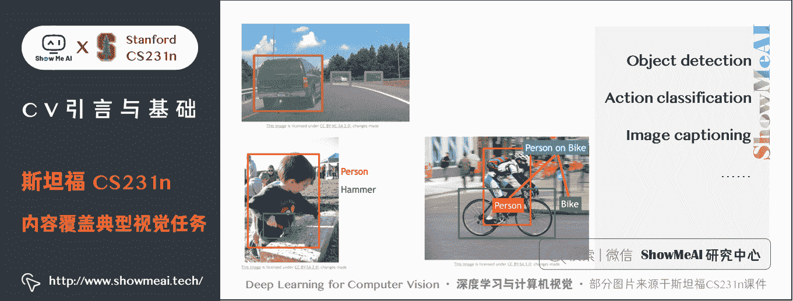

*   课程最后一版公开课视频为 2017 版，需要最新进阶技术内容的同学可以关注[ShowMeAI](http://www.showmeai.tech/)发布的 [**cs231n 进阶课程**](http://blog.showmeai.tech/eecs498)
*   希望对于深度学习进行一个全面学习了解的同学，可以阅读学习[ShowMeAI](http://www.showmeai.tech/)的 [**深度学习教程 | 吴恩达专项课程 · 全套笔记解读**](http://www.showmeai.tech/tutorials/35)

# 2.课程内容介绍

## 2.1 第 1 部分 Lecture1-3 深度学习背景知识简单介绍

*   课程引入与介绍
*   KNN 和线性分类器
*   Softmax 和 SVM 两种损失函数
*   优化算法（SGD 等）

## 2.2 第 2 部分 Lecture4-9 卷积神经网络

*   CNN 及各种层次结构（卷积、池化、全连接）
*   反向传播及计算方法
*   优化的训练方法（Adam、Momentum、Dropout、Batch-Normalization）
*   训练 CNN 的注意事项（参数初始化与调优）
*   深度学习框架（TensorFlow、Caffe、Pytorch）
*   线性 CNN 结构（AlexNet、VGGNet、GoogLeNet、ResNet）

## 2.3 第 3 部分 Lecture10-16 计算机视觉应用

*   RNN（语言模型，image captioning 等）
*   目标检测（R-CNN、Fast / Faster R-CNN、YOLO、SSD 等）
*   语义分割（FCN、Unet、SegNet、deeplab 等）
*   神经网络可视化与可解释性
*   生成模型与 GAN
*   深度强化学习

# 3.课程学习目标

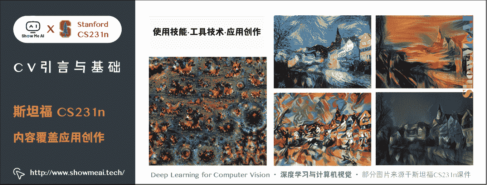

## 3.1 实用技能

理解如何从头开始编写、调试和训练卷积神经网络。

## 3.2 工具技术

集中于大规模训练这些网络的实用技术，以及 GPU（例如，将涉及分布式优化、CPU 与 GPU 之间的差异等），还可以查看诸如 Caffe、TensorFlow 和 (Py)Torch 等最先进的软件工具的现状。

## 3.3 应用创作

一些有趣的主题，如「看图说话」（结合 CNN + RNN），再如下图左边的 DeepDream，右边的神经风格迁移 NeuralStyle 等。

# 4.课程先修条件

1）熟悉 Python（并了解 numpy 的使用），本课都用 Python 编写，如果要阅读理解软件包的源代码 C++ 会有帮助。

2）大学微积分（如求导），线性代数（了解矩阵）。

3）有机器学习的背景，大概 CS229 水平，非常重要核心的机器学习概念会再介绍的，如果事先熟悉这些会对课程有帮助的，我们将制定成本函数，利用导数和梯度下降进行优化。可前往文末获取 ShowMeAI 原创的 CS229 课程速查表。

4）有计算机图像基础会更好，但不是非常严格。

# 5.计算机视觉简介

## 5.1 计算视觉历史

16 世纪最早的相机：**暗箱**

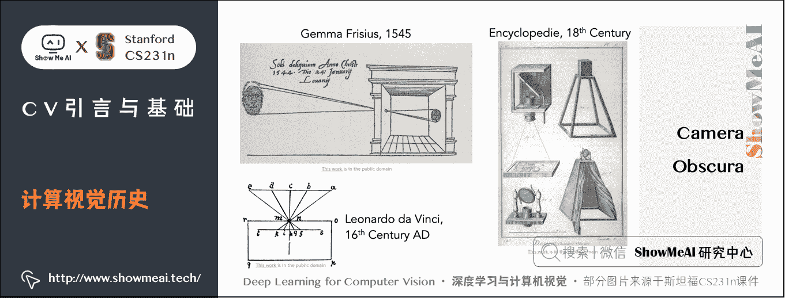

1963 年第一篇计算机视觉博士论文「**Block world-Larry Roberts**」，视觉世界简化为简单的几何形状，识别它们，重建这些形状。

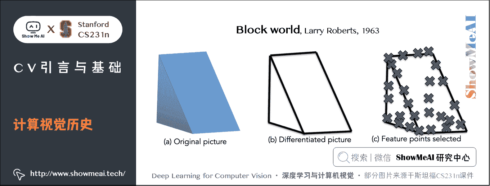

1996 年 MIT 暑期项目「**The Summer Vision Project**」目的是构建视觉系统的重要组成部分。

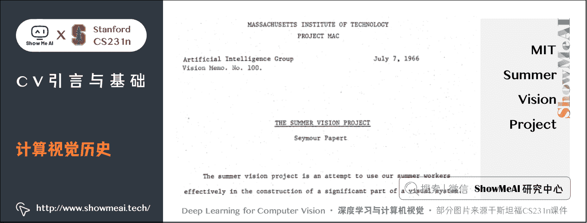

1970s 的 MIT 视觉科学家 David Marr 编写了《**VISION**》，内容有计算机视觉的理解、处理开发、识别算法，他提出了视觉表现的阶段，如原始草图的**零交叉点，圆点，边缘，条形，末端，虚拟线，组，曲线边界等概念**：

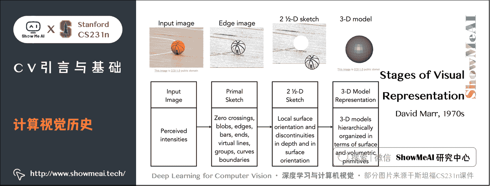

1973 年后对于如何识别和表示对象，斯坦福科学家提出「广义圆柱体」和「圆形结构」，每个对象都是由简单的几何图形单位组成。

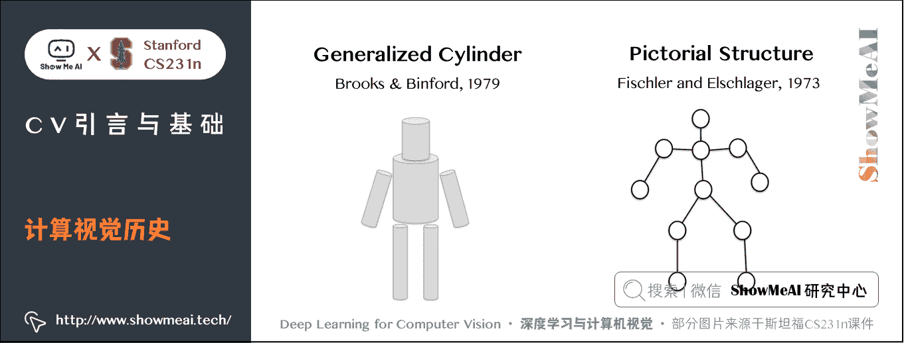

1987 年 David Lowe 尝试用 **线** 和 **边缘** 来构建识别。

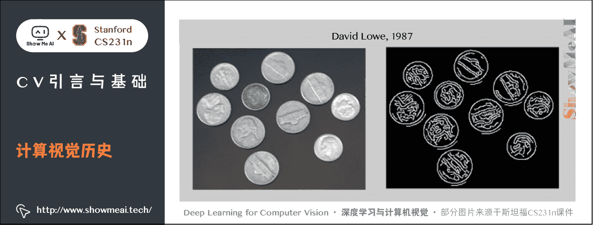

1997 年 Shi & Malik 提出，若识别太难了，就先做目标分割，就是把一张图片的像素点归类到有意义的区域。

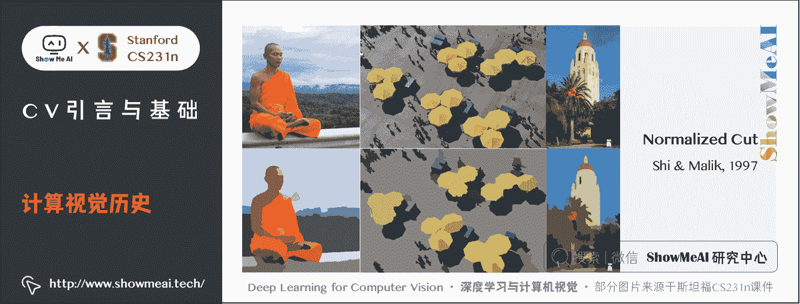

2001 年此时的机器学习也快速发展了（尤其是**统计学习方法**），出现了 SVM（**支持向量机模型**）、**boosting**、图模型等方法。Viola & Jones 发表了使用 AdaBoost 算法进行实时面部检测的论文 「**Face Detection**」，而后 2006 年富士推出可以实时面部检测的数码相机。

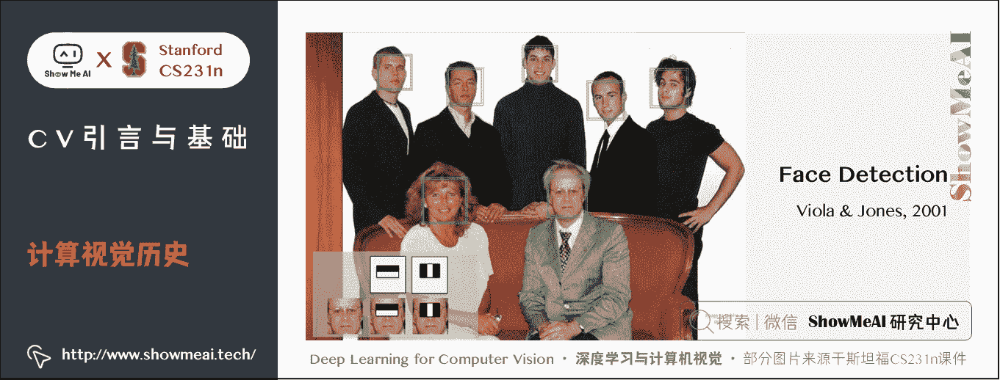

1999 年 David Lowe 发表 **“SIFT” & Object Recognition**，提出 SIFT 特征匹配，思路是先在目标上确认关键特征，再把这些特征与相似的目标进行匹配，来完成目标识别。从 90 年代到 2000 年的思想就是基于特征的目标识别。

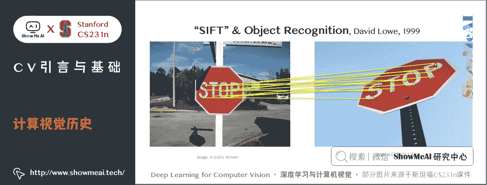

2006 年 Lazebnik, Schmid & Ponce 发表「**Spatial Pyramid Matching**」，图片里的各种特征描述了不同场景，空间金字塔匹配算法的思想就是从图片的各部分各像素抽取特征，并把他们放在一起作为一个特征描述符，然后在特征描述符上做一个支持向量机。

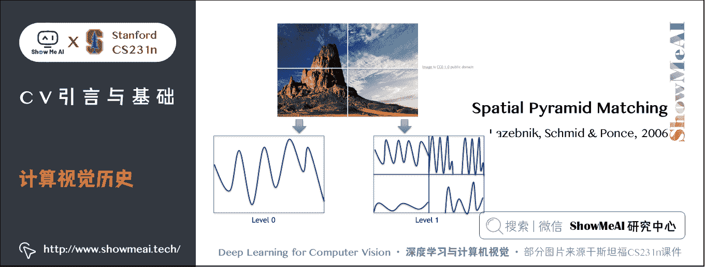

2005 年后来的研究 **方向梯度直方图** 和 **可变形部件模型**，目的是将特征放在一起后，如何辨认人体姿态。

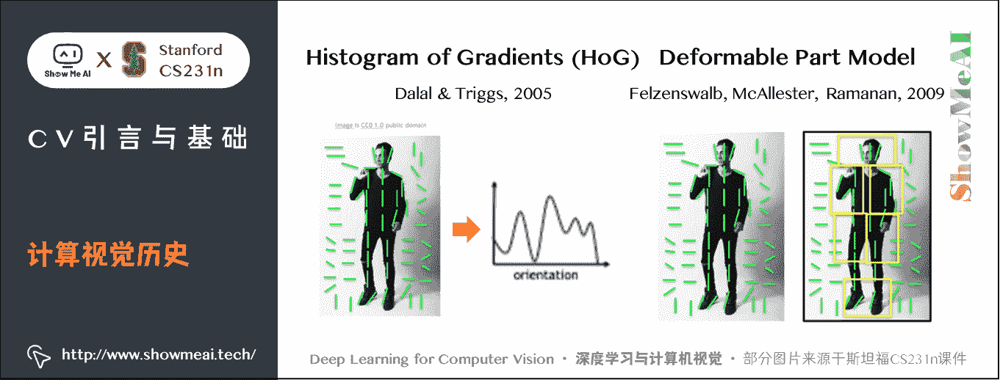

21 世纪早期，数码相机快速发展，图片质量提高，也真正有了标注的数据集，它能够衡量目标识别的成果。数据集 **PASCAL Visual Object Challenge** 有 20 个类别，每个种类有成千上万张图片，供团队开发算法来和数据测试集做对抗训练，来看检测效果有没有优化。

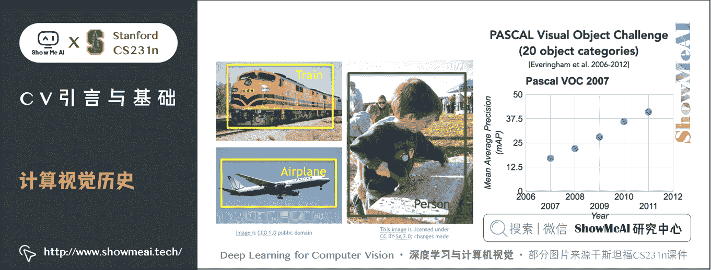

而后普林斯顿和斯坦福提出怎么识别大部分物体，这个问题也是由机器学习中的一个现象驱动的，机器学习算法在训练过程中很可能会过拟合（只对现有的这些数据完美拟合，但对未知数据不一定完美）。部分原因是可视化的数据非常复杂（像是记住了每道题），从而模型维数比较高，输入是高维的模型，并且还有一堆参数要调优，当我们的训练数据量不够时很快就会产生过拟合现象，这样就无法很好的泛化。

因此有了两方面动力：**① 识别万物**；**② 克服机器学习的瓶颈-过拟合问题**。

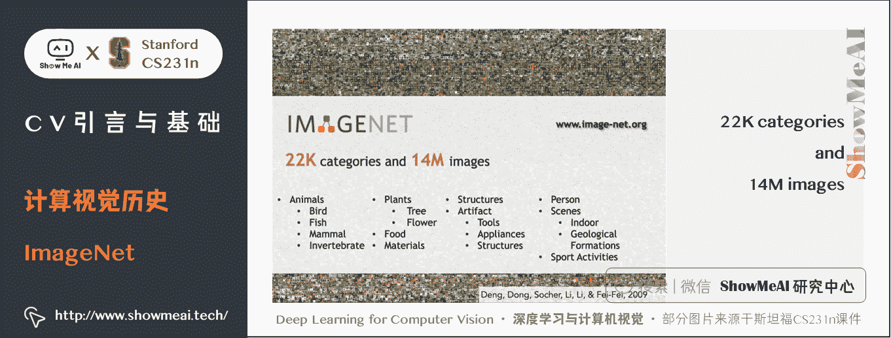

针对上述问题开展了 ImageNet（http://www.image-net.org/）项目，在网络上收集了上亿张图片，用 WordNet 字典来排序，这个字典有上万个物体类别，不得不用 Amazon Mechanical Turk 平台来排序、清洗数据、给每张图片打上标签，最终得到的 ImageNet 有 1500 万甚至 4000 万图片分成了 22000 多类的物体或场景。它将目标检测算法的发展推到了新高度。

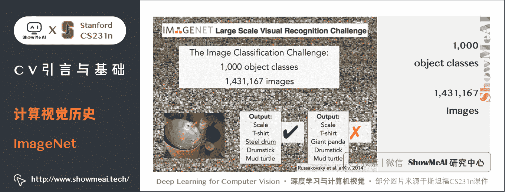

2009 年为了推动基准测试的进展，**ImageNet** 开始组织了 **ImageNet 大规模视觉识别竞赛**，筛选了更严格的测试集，**140 万目标图像**，**有 1000 种目标类别**，分类识别来测试计算机视觉算法。

下图为图像分类结果，纵轴为比赛结果的错误率，2012 年的错误率下降的非常显著，这一年获头奖的算法是一种卷积神经网络模型。

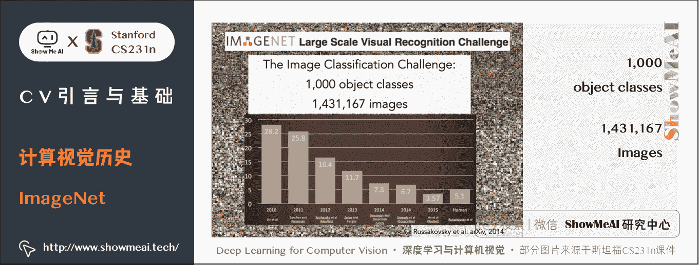

## 5.2 计算机视觉近代技术发展

**卷积神经网络**（**Convolutional Neural Networks，CNN**）已成为图像识别中最重要的模型之一。

2010 年的 NEC-UIUC 仍然用到了**层次结构**、**检测边缘**、**不变特征**。在 2012 年才有重大突破，多伦多的博士生和导师创造了 7 层的 CNN，称为 SuperVision 现在叫做 **AlexNet**。

2014 年谷歌的 GoogLeNet 和牛津大学的 VGG 有 19 层网络。

2015 年微软亚洲研究院发表了残差网络，有 152 层。

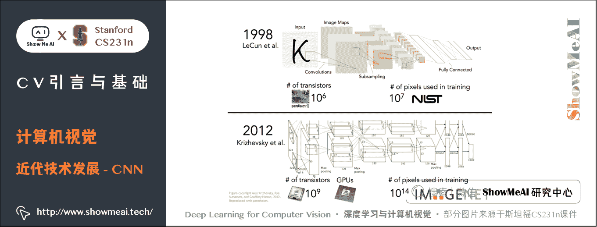

CNN 早在 1998 年由 Yann LeCun 团队在贝尔实验室发明的，他们使用 CNN 进行数字识别，用于识别手写支票和邮件地址，当时的 CNN 和后续的很多典型 CNN 模型结构是相似的，输入是原始像素，有很多卷积层和下采样以及全连接层。

随着计算机算力的提升，像 **GPU** 这种**图像处理单元超高的并行计算能力引入**，人们开发出了**更大的 CNN 模型和架构**。

在算力的支撑下，只扩大模型的规模，沿用经典的方法和算法就能有很好的结果，这种增加计算的思想有着很重要的地位。还有数据的创新，现在有了很多标记的数据，我们可以实现更强大的模型。

后来也有很多创新的 CNN 结构引入，帮助模型可以在更大更深的情况下，也可以很好地训练和对抗过拟合。

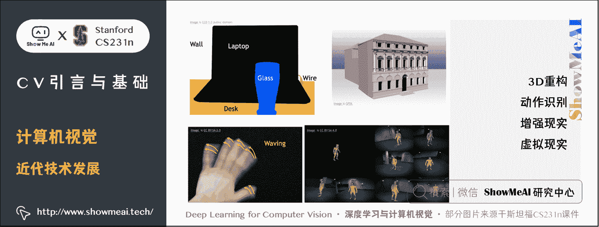

对视觉智能的探索远远超出了图像识别的范围，如图像**语义分割**、**知觉分组**他们没有给整张图片打上标签，我们要理解的是每个像素。这些任务是**3D 重构**、**动作识别**、**增强现实**、**虚拟现实**等重要的支撑。

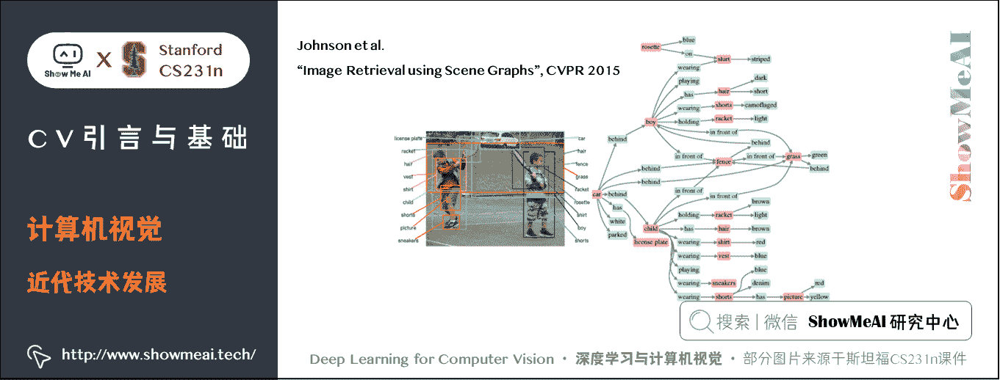

如老师 Johnson 在 2015CVPR 发表的「**Image Retrieval using Scene Graphs**」，视觉基因组这个数据集，不仅框出物体还要描述图像，作为整个大图形语义相关的概念，不仅包括对象的身份，还包括对象关系、对象属性、动作等，视觉系统可以做很多事情。

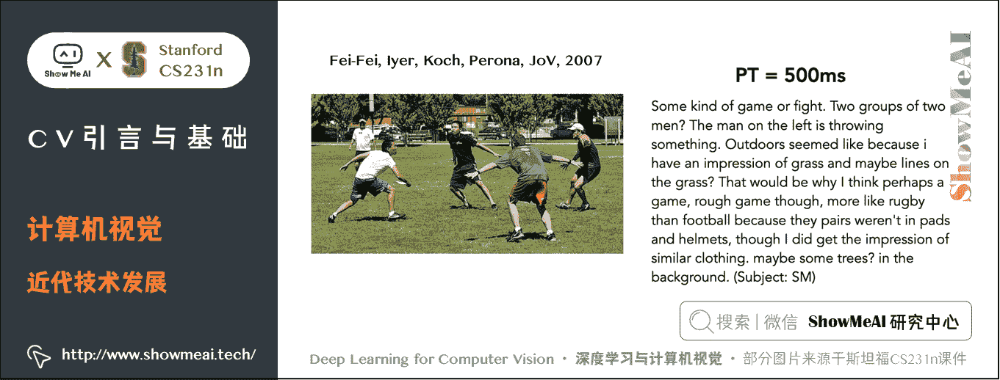

当看到上方的图片时人们可以丰富的描述这个场景，借助于他们的储备知识和过往经验又可以详细描述每个人的身份历程等。

这是典型的计算机视觉任务「**看图说话 / image captioning**」，它以一种非常丰富而深刻的方式去理解一张图片的故事，也是目前依旧在不断推进的研究领域之一。

# 6.拓展学习

**可以点击 [B 站](https://www.bilibili.com/video/BV1g64y1B7m7?p=1) 查看视频的【双语字幕】版本**

[`player.bilibili.com/player.html?aid=759478950&page=1`](https://player.bilibili.com/player.html?aid=759478950&page=1)

【字幕+资料下载】斯坦福 CS231n | 面向视觉识别的卷积神经网络 (2017·全 16 讲)

*   [【课程学习指南】斯坦福 CS231n | 深度学习与计算机视觉](http://blog.showmeai.tech/cs231n/)
*   [【字幕+资料下载】斯坦福 CS231n | 深度学习与计算机视觉 (2017·全 16 讲)](https://www.bilibili.com/video/BV1g64y1B7m7)
*   [【CS231n 进阶课】密歇根 EECS498 | 深度学习与计算机视觉](http://blog.showmeai.tech/eecs498/)
*   [【深度学习教程】吴恩达专项课程 · 全套笔记解读](http://www.showmeai.tech/tutorials/35)
*   [【Stanford 官网】CS231n: Deep Learning for Computer Vision](http://cs231n.stanford.edu/)
*   [【CS229 知识技能速查】机器学习-监督学习](http://www.showmeai.tech/article-detail/113)
*   [【CS229 知识技能速查】机器学习-无监督学习](http://www.showmeai.tech/article-detail/114)
*   [【CS229 知识技能速查】机器学习-神经网络](http://www.showmeai.tech/article-detail/115)
*   [【CS229 知识技能速查】机器学习-经验与技巧](http://www.showmeai.tech/article-detail/116)

# [ShowMeAI](http://www.showmeai.tech) 斯坦福 CS231n 全套解读

*   [深度学习与计算机视觉教程(1) | CV 引言与基础 @CS231n](http://www.showmeai.tech/article-detail/260)
*   [深度学习与计算机视觉教程(2) | 图像分类与机器学习基础 @CS231n](http://www.showmeai.tech/article-detail/261)
*   [深度学习与计算机视觉教程(3) | 损失函数与最优化 @CS231n](http://www.showmeai.tech/article-detail/262)
*   [深度学习与计算机视觉教程(4) | 神经网络与反向传播 @CS231n](http://www.showmeai.tech/article-detail/263)
*   [深度学习与计算机视觉教程(5) | 卷积神经网络 @CS231n](http://www.showmeai.tech/article-detail/264)
*   [深度学习与计算机视觉教程(6) | 神经网络训练技巧 (上) @CS231n](http://www.showmeai.tech/article-detail/265)
*   [深度学习与计算机视觉教程(7) | 神经网络训练技巧 (下) @CS231n](http://www.showmeai.tech/article-detail/266)
*   [深度学习与计算机视觉教程(8) | 常见深度学习框架介绍 @CS231n](http://www.showmeai.tech/article-detail/267)
*   [深度学习与计算机视觉教程(9) | 典型 CNN 架构 (Alexnet, VGG, Googlenet, Restnet 等) @CS231n](http://www.showmeai.tech/article-detail/268)
*   [深度学习与计算机视觉教程(10) | 轻量化 CNN 架构 (SqueezeNet, ShuffleNet, MobileNet 等) @CS231n](http://www.showmeai.tech/article-detail/269)
*   [深度学习与计算机视觉教程(11) | 循环神经网络及视觉应用 @CS231n](http://www.showmeai.tech/article-detail/270)
*   [深度学习与计算机视觉教程(12) | 目标检测 (两阶段, R-CNN 系列) @CS231n](http://www.showmeai.tech/article-detail/271)
*   [深度学习与计算机视觉教程(13) | 目标检测 (SSD, YOLO 系列) @CS231n](http://www.showmeai.tech/article-detail/272)
*   [深度学习与计算机视觉教程(14) | 图像分割 (FCN, SegNet, U-Net, PSPNet, DeepLab, RefineNet) @CS231n](http://www.showmeai.tech/article-detail/273)
*   [深度学习与计算机视觉教程(15) | 视觉模型可视化与可解释性 @CS231n](http://www.showmeai.tech/article-detail/274)
*   [深度学习与计算机视觉教程(16) | 生成模型 (PixelRNN, PixelCNN, VAE, GAN) @CS231n](http://www.showmeai.tech/article-detail/275)
*   [深度学习与计算机视觉教程(17) | 深度强化学习 (马尔可夫决策过程, Q-Learning, DQN) @CS231n](http://www.showmeai.tech/article-detail/276)
*   [深度学习与计算机视觉教程(18) | 深度强化学习 (梯度策略, Actor-Critic, DDPG, A3C) @CS231n](http://www.showmeai.tech/article-detail/277)

# [ShowMeAI](http://www.showmeai.tech) 系列教程推荐

*   [大厂技术实现：推荐与广告计算解决方案](http://www.showmeai.tech/tutorials/50)
*   [大厂技术实现：计算机视觉解决方案](http://www.showmeai.tech/tutorials/51)
*   [大厂技术实现：自然语言处理行业解决方案](http://www.showmeai.tech/tutorials/52)
*   [图解 Python 编程：从入门到精通系列教程](http://www.showmeai.tech/tutorials/56)
*   [图解数据分析：从入门到精通系列教程](http://www.showmeai.tech/tutorials/33)
*   [图解 AI 数学基础：从入门到精通系列教程](http://www.showmeai.tech/tutorials/83)
*   [图解大数据技术：从入门到精通系列教程](http://www.showmeai.tech/tutorials/84)
*   [图解机器学习算法：从入门到精通系列教程](http://www.showmeai.tech/tutorials/34)
*   [机器学习实战：手把手教你玩转机器学习系列](http://www.showmeai.tech/tutorials/41)
*   [深度学习教程：吴恩达专项课程 · 全套笔记解读](http://www.showmeai.tech/tutorials/35)
*   [自然语言处理教程：斯坦福 CS224n 课程 · 课程带学与全套笔记解读](http://www.showmeai.tech/tutorials/36)
*   [深度学习与计算机视觉教程：斯坦福 CS231n · 全套笔记解读](http://www.showmeai.tech/tutorials/37)

