# 深度学习与计算机视觉教程(2) | 图像分类与机器学习基础（CV 通关指南·完结）

> 原文：[`blog.csdn.net/ShowMeAI/article/details/124993990`](https://blog.csdn.net/ShowMeAI/article/details/124993990)


*   作者：[韩信子](https://github.com/HanXinzi-AI)@[ShowMeAI](http://www.showmeai.tech/)
*   [教程地址](http://www.showmeai.tech/tutorials/37)：[`www.showmeai.tech/tutorials/37`](http://www.showmeai.tech/tutorials/37)
*   [本文地址](http://www.showmeai.tech/article-detail/261)：[`www.showmeai.tech/article-detail/261`](http://www.showmeai.tech/article-detail/261)
*   声明：版权所有，转载请联系平台与作者并注明出处
*   **收藏[ShowMeAI](http://www.showmeai.tech/)查看更多精彩内容**

* * *


本系列为 **斯坦福 CS231n**《深度学习与计算机视觉(Deep Learning for Computer Vision)》的全套学习笔记，对应的课程视频可以在 [**这里**](https://www.bilibili.com/video/BV1g64y1B7m7?p=2) 查看。更多资料获取方式见文末。

* * *

# 引言

**图像分类**是计算机视觉的核心任务，计算机视觉领域中很多问题（比如 **目标检测** 和 **语义分割**），都可以关联到图像分类问题。**图像分类** 问题，就是已有固定的分类标签集合，然后对于输入的图像，从分类标签集合中找出一个分类标签，最后把分类标签分配给该输入图像。在本篇内容汇总，[ShowMeAI](http://www.showmeai.tech/)将给大家讲解数据驱动的模型算法，包括简单的 **KNN 模型**和 **线性分类模型**。

## 本篇重点

*   数据驱动方法
*   KNN 算法
*   线性分类

# 1.图像分类的挑战

对于计算机而言，图像等同于一个像素矩阵；而对人类，图像是包含丰富语义信息的多媒体呈现，对应不同的物体类别，所以对计算机而言存在巨大的语义鸿沟。

比如，给计算机输入如下小猫的图片，计算机图像分类模型会读取该图片，并计算该图片属于集合 { 猫 , 狗 , 帽 子 , 杯 子 } \{猫, 狗, 帽子, 杯子\} {猫,狗,帽子,杯子} 中各个标签的概率。但读取的输入图像数据是一个由数字组成的巨大的 3 3 3 维数组。

在下图中，猫的图像大小高 600 600 600 像素，宽 800 800 800 像素，有 3 3 3 个颜色通道（红、绿和蓝，简称 RGB），因此它包含了 600 × 800 × 3 = 1440000 600 \times 800 \times 3=1440000 600×800×3=1440000 个数字，每个数字都是在范围 0 ∼ 255 0 \sim 255 0∼255 之间的整型，其中 0 0 0 表示全黑， 255 255 255 表示全白。

**我们的任务就是把这些数字变成一个简单的标签**，比如 「猫」 。

![图像分类; 图像分类的挑战; 计算机[眼]中的图像; 2-1](../Images/858ec99750754ea9995293e5d5389881.png)

图像分类算法要足够健壮（鲁棒，robust），我们希望它能够适应下述变化及组合：

*   **视角变化（Viewpoint variation）**：同一个物体，摄像机可以从多个角度来展现。
*   **大小变化（Scale variation）**：物体可视的大小通常是会变化的（不仅是在图片中，在真实世界中大小也是变化的）。
*   **形变（Deformation）**：很多东西的形状并非一成不变，会有很大变化。
*   **遮挡（Occlusion）**：目标物体可能被挡住。有时候只有物体的一小部分（可以小到几个像素）是可见的。
*   光照条件（Illumination conditions**）**：在像素层面上，光照的影响非常大。
*   **背景干扰（Background clutter）**：物体可能混入背景之中，使之难以被辨认。
*   **类内差异（Intra-class variation）**：一类物体的个体之间的外形差异很大，比如椅子。这一类物体有许多不同的对象，每个都有自己的外形。

如下图所示是一些变化和图像识别的挑战：

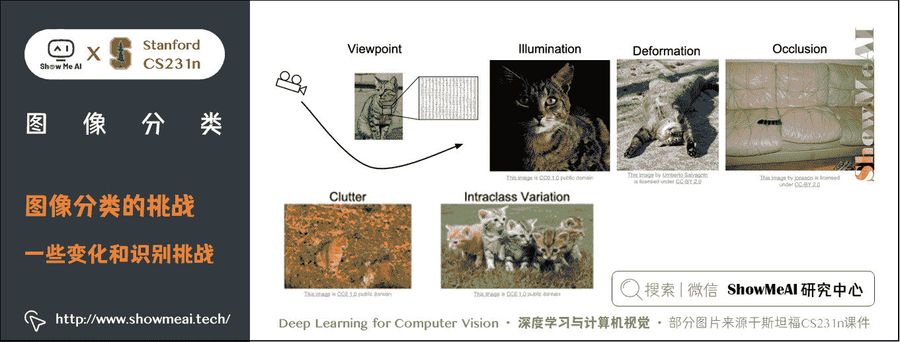

# 2.数据驱动的方式

一种实现方式是「**硬编码**」：先获取猫图像的边缘得到一些线条，然后定义规则比如**三条线交叉是耳朵之类**。然而这种方式的识别效果不好，并且不能识别新的物体。

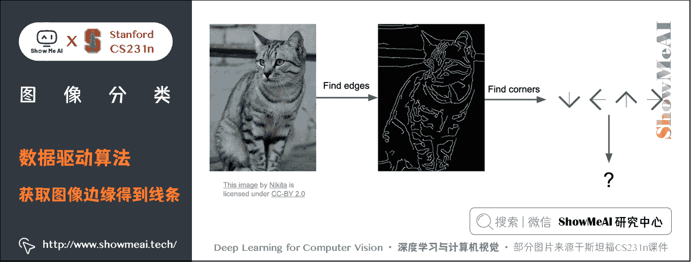

我们会采用**数据驱动算法**：不具体写出识别每个物体对应的规则，而是**针对每一类物体，找到大量样例图片，灌给计算机进行机器学习，归纳模式规律，生成一个分类器模型，总结出区分不同类物体的核心知识要素，然后用训练好的模型，识别新的图像**。

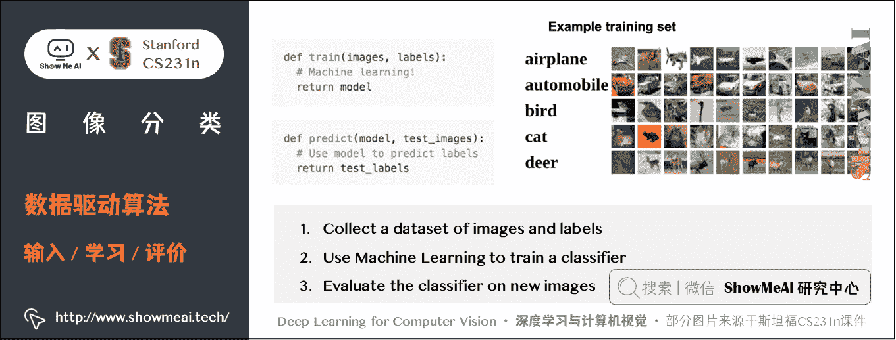

**数据驱动算法**过程如下：

*   **输入**：输入是包含 N N N 个图像的集合，每个图像的标签是 K K K 种分类标签中的一种。这个集合称为训练集。
*   **学习**：这一步的任务是使用训练集来学习每个类的模式规律。一般该步骤叫做分类器训练或者模型学习。
*   **评价**：让分类器对它未曾见过的图像进行分类，把分类器预测的标签和图像真正的分类标签 （基本事实) 对比，并以此来评价分类器的质量。

## 2.1 最邻近算法

本部分内容也可以参考[ShowMeAI](http://www.showmeai.tech/)的 [**图解机器学习教程**](http://www.showmeai.tech/tutorials/34) 中的文章详解 [**KNN 算法及其应用**](http://www.showmeai.tech/article-detail/187)

我们这里介绍第 1 个分类器算法：**最近邻算法**。训练过程只是简单的记住图像数据和标签，预测的时候和训练数据中图片比较找出最接近的输出标签。这个分类器和卷积神经网络没有任何关系，实际中也极少使用，但通过实现它，可以对解决图像分类问题的方法有个基本认识。

### 1) 图像分类数据集：[CIFAR-10](http://www.cs.toronto.edu/~kriz/cifar.html)

**CIFAR-10 是一个非常流行的图像分类数据集**。这个数据集包含 10 种分类标签，60000 张 32 × 32 32 \times 32 32×32 的小图像，每张图片含有一个标签。这 60000 张图像被分为包含 50000 张（每种分类 5000 张）图像的训练集和包含 10000 张图像的测试集。

假设现在我们用这 50000 张图片作为训练集，将余下的 10000 作为测试集并打上标签，Nearest Neighbor 算法将会拿着测试图片和训练集中每一张图片去比较，然后将它认为最相似的那个训练集图片的标签赋给这张测试图片。

结果如下图所示，效果并不是特别好。

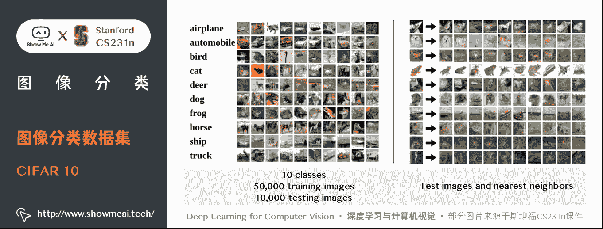

*   **左边**：CIFAR-10 数据库的样本图像；
*   **右边**：第一列是测试图像，后面是使用 Nearest Neighbor 算法，根据像素差异，从训练集中选出的 10 张最类似的图片

那么具体**如何比较两张图片呢**？我们有一些距离度量计算方法，下面展开介绍一下。

### 2) L1 距离（曼哈顿距离）

距离度量的数学知识也可以参考[ShowMeAI](http://www.showmeai.tech/)的系列教程 [**图解 AI 数学基础**](http://www.showmeai.tech/tutorials/83) 中的文章 [**线性代数与矩阵论**](http://www.showmeai.tech/article-detail/162) 对各种距离度量的展开讲解

在本例中，就是比较 32 × 32 × 3 32 \times 32 \times 3 32×32×3 的像素块。最简单的方法就是逐个像素比较，最后将差异值全部加起来。即将两张图片先转化为两个向量 I 1 I_{1} I1​ 和 I 2 I_{2} I2​，然后计算他们的 L1 距离：

d 1 ( I 1 , I 2 ) = ∑ p ∣ I 1 p − I 2 p ∣ d_{1} (I_{1} ,I_{2} )=\sum_{p}\vert I_{1}^p -I_{2}^p \vert d1​(I1​,I2​)=p∑​∣I1p​−I2p​∣

*   其中 p p p 为像素点， I p I^p Ip 表示第 p p p 个像素点的值。
*   两张图片使用 L1 距离来进行比较，即逐个像素求差值，然后将所有差值加起来得到一个数值。如果两张图片一模一样，那么 L1 距离为 0 0 0；但是如果两张图片很是不同，那 L1 值将会非常大。

下图是仅一个 RGB 通道的 4 × 4 4 \times 4 4×4 图片计算 L1 距离。

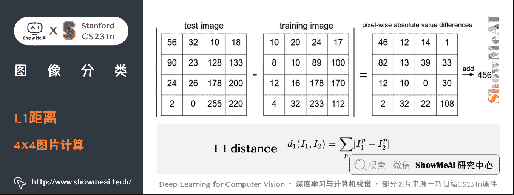

下面看具体**编程如何实现**：

**① 首先，我们将 CIFAR-10 的数据加载到内存中，并分成 4 个数组：训练数据和标签，测试数据和标签**。

```
Xtr, Ytr, Xte, Yte = load_CIFAR10('data/cifar10/') # 这个函数可以加载 CIFAR10 的数据
# Xtr 是一个 50000x32x32x3 的数组，一共 50000 个数据，
# 每条数据都是 32 行 32 列的数组，数组每个元素都是一个三维数组，表示 RGB。
# Xte 是一个 10000x32x32x3 的数组；
# Ytr 是一个长度为 50000 的一维数组，Yte 是一个长度为 10000 的一维数组。
Xtr_rows = Xtr.reshape(Xtr.shape[0], 32 * 32 * 3) 
# Xtr_rows 是 50000x3072 的数组，按每个像素点排列，每个像素点有三个值。
Xte_rows = Xte.reshape(Xte.shape[0], 32 * 32 * 3) 
# Xte_rows 是 10000x3072 的数组
''' shape 会返回数组的行和列数元组：（行数，列数），shape[0]表示行数, 
Xtr.shape[0]会返回 50000；Xtr.shape 会返回（50000，32，32，3）
Xtr.reshape(50000，3072)会将 Xtr 重构成 50000x3072 数组，等于 np.reshape(Xtr, (50000,3072))''' 
```

*   Xtr（大小是 50000x32x32x3）存有训练集中所有的图像
*   Xte（大小是 10000x3072）存有测试集中所有的图像
*   Ytr 是对应的长度为 50000 的 1 维数组，存有图像对应的分类标签（从 0 到 9）
*   Yte 对应长度为 10000 的 1 维数组

现在我们得到所有的图像数据，每张图片对应一个长度为 3072 的行向量。

**② 接下来训练一个分类器并评估效果。我们常常使用准确率作为评价标准，它描述了我们预测正确的得分**。

本例中 OK，很多其他应用中准确率并不一定是最佳的评估准则，可以参考[ShowMeAI](http://www.showmeai.tech/)的 [**图解机器学习教程**](http://www.showmeai.tech/tutorials/34) 中的文章详解 [**模型评估方法与准则**](http://www.showmeai.tech/article-detail/186)

```
nn = NearestNeighbor() # 创建一个最邻近分类器对象
nn.train(Xtr_rows, Ytr) # 用训练图片数据和标签训练分类器
Yte_predict = nn.predict(Xte_rows) # 预测测试图片的标签
# 并输出预测准确率，是一个平均值
print 'accuracy: %f' % ( np.mean(Yte_predict == Yte) ) 
```

*   请注意以后我们实现的所有分类器都需要有这个接口函数（API）：`train(X, y)` 函数。该函数使用训练集的数据和标签来进行训练。
*   从其内部来看，类应该实现一些关于标签和标签如何被预测的模型。这里还有个 `predict(X)` 函数，它的作用是预测输入的新数据的分类标签。

下面就是使用 L1 距离的 Nearest Neighbor 分类器的实现：

```
import numpy as np

class NearestNeighbor(object):
  def __init__(self):
    pass

  def train(self, X, y):
    """ X 是 NxD 维的数组，每一行都是一个样本，比如一张图片，D 是样本的数据维度；
    Y 是长度为 N 的一维数组。"""
    # 最邻近分类器只是简单的记住所有的训练数据
    self.Xtr = X
    self.ytr = y

  def predict(self, X):
    """ X 是 NxD 维的数组，每一行都是一个希望预测其标签的样本 """
    num_test = X.shape[0]
    # 确保输出的标签数据类型和输入的标签格式一致，长度是测试样本数
    Ypred = np.zeros(num_test, dtype = self.ytr.dtype)

    # 循环所有测试样本数，即测试数组的行数
    for i in range(num_test):
      # 为第 i 张测试图片找到最接近的训练图片
      # 使用 L1 距离 (差值的绝对值求和)
      '''self.Xtr - X[i,:] 利用传播机制，求测试集第 i 张图片对应的行向量和
      训练集所有图片行向量的差值，得到一个一个 50000x3072 的差值矩阵；
      abs(self.Xtr - X[i,:] )会将矩阵所有元素求绝对值；
      然后 axis = 1 会对差值矩阵按行求和，最终得到一个长度为 50000 的一维
      数组，存放第 i 张图片和训练集所有 50000 张图片的 L1 距离。'''
      distances = np.sum(np.abs(self.Xtr - X[i,:]), axis = 1)
      min_index = np.argmin(distances) # 获取距离最小的训练集图片索引
      Ypred[i] = self.ytr[min_index] # 预测第 i 张测试集图片的标签时与其最接近的训练集图片索引

    return Ypred 
```

这段代码的训练时间复杂度为 O ( 1 ) O(1) O(1)，因为只是简单的存储数据，不管数据多大，都是一个相对固定的时间；如果训练集有 N N N 个样本，则预测时间复杂度为 O ( N ) O(N) O(N)，因为测试图片要和训练集每张图片进行比较。

这是一个不太好的分类器，**实际对分类器的要求是，我们希望它预测的时候要快，训练的时候可以慢**。

这段代码跑 CIFAR-10，准确率能达到 38.6 % 38.6\% 38.6%。这比随机猜测的 10 % 10\% 10% 要好，但是比人类识别的水平和卷积神经网络能达到的 95 % 95\% 95% 还是差很多。

### 3) L2 距离（欧式距离）

距离度量的数学知识也可以参考[ShowMeAI](http://www.showmeai.tech/)的系列教程[**图解 AI 数学基础**](http://www.showmeai.tech/tutorials/83)中的文章[**线性代数与矩阵论**](http://www.showmeai.tech/article-detail/162)对各种距离度量的展开讲解

另一个常用的方法是 **L2 距离**，从几何学的角度，可以理解为它在计算两个向量间的欧式距离。L2 距离的公式如下：

d 2 ( I 1 , I 2 ) = ∑ p ( I 1 p − I 2 p ) 2 d_{2} (I_{1},I_{2})=\sqrt{\sum_{p}(I_{1}^p - I_{2}^p )² } d2​(I1​,I2​)=p∑​(I1p​−I2p​)2  ​

*   依旧是在计算像素间的差值，只是先求差值的平方，然后把这些平方全部加起来，最后对这个和开方。

此时的代码只需改动计算距离差异的一行：

```
distances = np.sqrt(np.sum(np.square(self.Xtr - X[i,:]), axis = 1))
'''np.square(self.Xtr - X[i,:]) 会对差值矩阵的每一个元素求平方''' 
```

注意在这里使用了 `np.sqrt`，但是在实际中可能不用。因为对不同距离的绝对值求平方根虽然改变了数值大小，但依然保持了不同距离大小的顺序。这个模型，正确率是 35.4 % 35.4\% 35.4%，比刚才低了一点。

### 4) L1 和 L2 比较

在 L1 距离更依赖于坐标轴的选定，坐标轴选择不同 L1 距离也会跟着变化，判定的数据归类的边界会更趋向于贴近坐标系的轴来分割所属区域，而 L2 的话相对来说与坐标系的关联度没那么大，会形成一个圆，不跟随坐标轴变化。

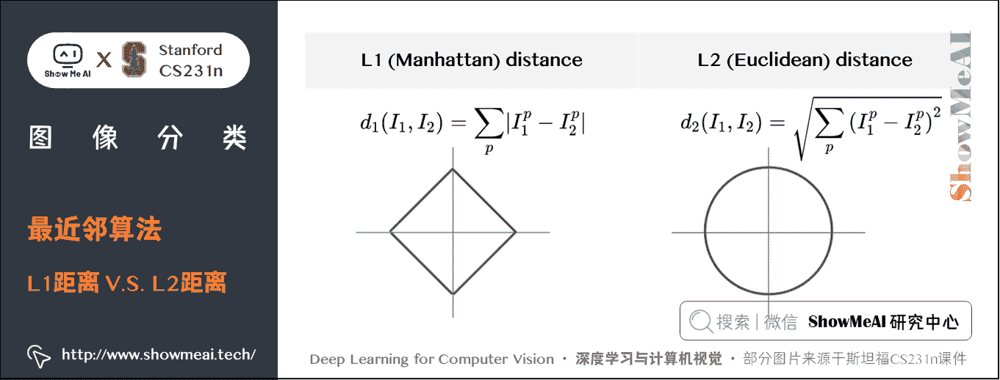

在面对两个向量之间的差异时，L2 比 L1 更加不能容忍这些差异。也就是说，**相对于 1 个巨大的差异，L2 距离更倾向于接受多个中等程度的差异（因为会把差值平方）**。

L1 和 L2 都是在 [**p-norm**](https://planetmath.org/vectorpnorm) 常用的特殊形式。

当图像中有特别在意的特征时可以选择 L1 距离；当对图像中所有元素未知时，L2 距离会更自然一些。最好的方式是两种距离都尝试，然后找出最好的那一个。

## 2.2 k 最近邻分类器

本部分内容也可以参考[ShowMeAI](http://www.showmeai.tech/)的[**图解机器学习教程**](http://www.showmeai.tech/tutorials/34)中的文章详解[**KNN 算法及其应用**](http://www.showmeai.tech/article-detail/187)

只用最相似的 1 张图片的标签来作为测试图像的标签，有时候会因为参照不够多而效果不好，我们可以使用 **k-Nearest Neighbor 分类器**。**KNN 的思想是：找最相似的 k k k 个图片的标签， k k k 中数量最多的标签作为对测试图片的预测**。

> 当 k = 1 k=1 k=1 的时候，k-Nearest Neighbor 分类器就是上面所说的最邻近分类器。

如下图所示，例子使用了 2 维的点来表示图片，分成 3 类（红、绿、蓝）。不同颜色区域代表的是使用 L2 距离的分类器的决策边界。

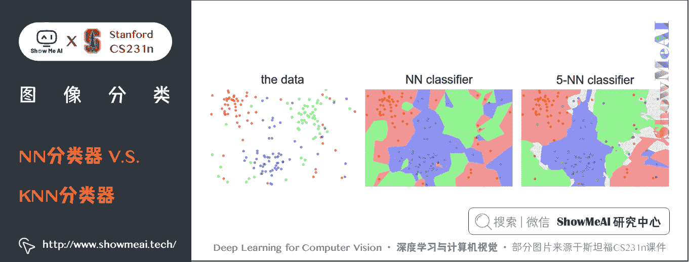

上面示例展示了 NN 分类器和 KNN（ k = 5 k=5 k=5）分类器的区别。从直观感受上就可以看到，更高的 k k k 值可以让分类的效果更平滑，使得分类器对于异常值更有抵抗力。

*   在 k = 1 k=1 k=1 时，异常的数据点（比如：在蓝色区域中的绿点）制造出一个不正确预测的孤岛。
*   在 k = 5 k=5 k=5 时分类器将这些不规则都平滑了，使得它针对测试数据的**泛化（generalization）**能力更好。

    *   注意，5-NN 中也存在一些白色区域，这些区域是因为 5 个近邻标签中的最高数相同导致的分类模糊（即图像与两个以上的分类标签绑定）。
    *   比如：2 个邻居是红色，2 个邻居是蓝色，还有 1 个是绿色，所以无法判定是红色还是蓝色。 

### 1) 超参数调优

模型调优，超参数的实验选择方法也可以参考[ShowMeAI](http://www.showmeai.tech/)的文章 [**图解机器学习 | 模型评估方法与准则**](http://www.showmeai.tech/article-detail/186) 和 [**深度学习教程 | 网络优化：超参数调优、正则化、批归一化和程序框架**](http://www.showmeai.tech/article-detail/218)

*   **KNN 分类器需要设定 k k k 值，如何选择 k k k 值最合适**？
*   **L1 距离和 L2 距离选哪个比较好（还是使用其他的距离度量准则例如点积）**？

所有这些选择，被称为**超参数（hyperparameter）**。在基于数据进行学习的机器学习算法设计中，超参数是很常见的。

超参数是需要提前设置的，设置完成后模型才可以训练学习，具体的设置方法通常要借助于实验，尝试不同的值，根据效果表现进行选择。

> **特别注意：不能使用测试集来进行调优**。
> 
> *   如果使用测试集来调优，而且算法看起来效果不错，真正的危险在于：算法实际部署后，性能可能会远低于预期。这种情况，称之为算法对测试集过拟合。
>     
>     
> *   大家可以理解为，如果使用测试集来调优，实际上就是把测试集当做训练集，由测试集训练出来的算法再预测测试集，性能自然会看起来很好，但实际部署起来效果就会差很多。
>     
>     
> *   最终测试的时候再使用测试集，可以很好地近似度量分类器的泛化性能。
>     
>     
> 
> **测试数据集只能使用一次，而且是在训练完成后评价最终模型时使用，不可用来调优**！

### 方法 1：设置验证集

从训练集中取出一部分数据用来调优，称之为 **验证集（validation set）**。以 CIFAR-10 为例，可以用 49000 个图像作为训练集，用 1000 个图像作为验证集。验证集其实就是作为假的测试集来调优。

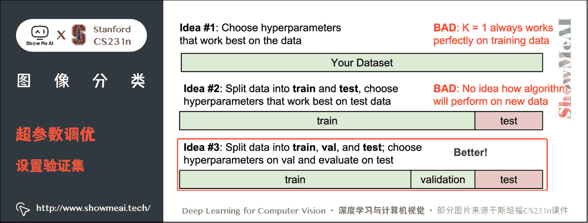

代码如下：

```
# 假设 Xtr_rows, Ytr, Xte_rows, Yte 还是和之前一样
# Xtr_rows 是 50,000 x 3072 的矩阵
Xval_rows = Xtr_rows[:1000, :] # 取前 1000 个训练集样本作为验证集
Yval = Ytr[:1000]
Xtr_rows = Xtr_rows[1000:, :] # 剩下的 49,000 个作为训练集
Ytr = Ytr[1000:]

# 找出在验证集表现最好的超参数 k 
validation_accuracies = []
for k in [1, 3, 5, 10, 20, 50, 100]:
  # 使用一个明确的 k 值评估验证集
  nn = NearestNeighbor()
  nn.train(Xtr_rows, Ytr)
  # 这里假设一个修正过的 NearestNeighbor 类，可以把 k 值作为参数输入
  Yval_predict = nn.predict(Xval_rows, k = k)
  acc = np.mean(Yval_predict == Yval)
  print 'accuracy: %f' % (acc,)

  # 把每个 k 值和相应的准确率保存起来
  validation_accuracies.append((k, acc)) 
```

程序结束后，作图分析出哪个 k k k 值表现最好，然后用这个 k k k 值来跑真正的测试集，并作出对算法的评价。

### 方法 2：交叉验证

训练集数量较小（因此验证集的数量更小）时，可以使用**交叉验证**的方法。还是用刚才的例子，如果是交叉验证集，我们就不是取 1000 个图像，而是将训练集平均分成 5 份，每份 10000 张图片，其中 4 份用来训练，1 份用来验证。然后我们循环着取其中 4 份来训练，其中 1 份来验证，最后取所有 5 次验证结果的平均值作为算法验证结果。

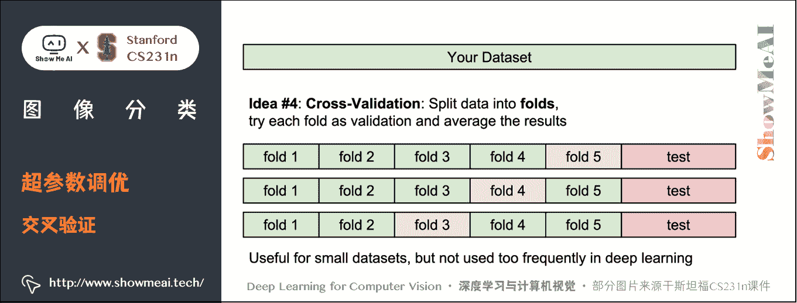

下面是 5 份交叉验证对 k k k 值调优的例子。针对每个 k k k 值，得到 5 次验证的准确率结果，取其平均值，然后对不同 k k k 值的平均表现画线连接。

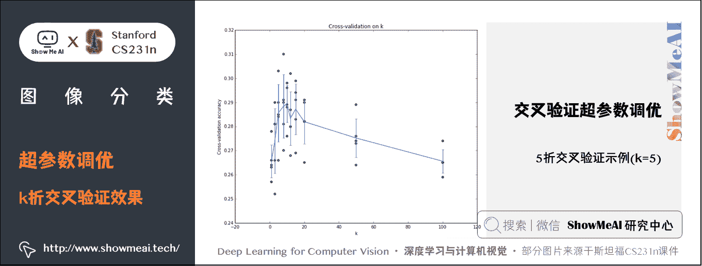

上图可以看出，本例中，当 k = 7 k=7 k=7 的时算法表现最好（对应图中的准确率峰值）。如果我们将训练集分成更多份数，直线一般会更加平滑（噪音更少）。

实际情况下，深度学习不会使用交叉验证，主要是因为它会耗费较多的计算资源。一般直接把训练集按照 50 % ∼ 90 % 50\% \sim 90\% 50%∼90% 的比例分成训练集和验证集。但是训练集数量不多时可以使用交叉验证，一般都是分成 3、5 和 10 份。

### 2) KNN 分类器优点

① 易于理解，实现简单。
② 算法的训练不需要花时间，因为其训练过程只是将训练集数据存储起来。

### 3) KNN 分类器缺点

**① 测试要花费大量时间**

*   因为每个测试图像需要和所有存储的训练图像进行比较在实际应用中，关注测试效率远远高于训练效率；

**② 使用像素差异来比较图像是不够的，图片间 L2 距离小，更多的是被背景主导而不是图片语义内容本身主导，往往背景相似图片的 L2 距离就会小**。

*   也就是说，在高维度数据上，基于像素的相似和基于感官上的相似非常不同。感官上不同的两张图片，可能有相同的 L2 距离。

**③ 维度灾难**

*   KNN 有点像训练数据把样本空间分成几块，我们需要训练数据密集的分布在样本空间里，否则测试图片的最邻近点可能实际距离会非常远，导致和最接近的训练集样本实际上完全不同。但是如果使训练数据密集分布，需要的训练集数量指数倍增加，是数据维度的平方。

### 4) 实际应用 KNN

下面是一些对于实际应用 KNN 算法的建议

**① 预处理数据**

*   对数据中的特征进行**归一化（normalize）**，让其具有零均值（zero mean）和单位方差（unit variance）。本小节不讨论，是因为图像中的像素都是同质的，不会表现出较大的差异分布，不需要标准化处理。

**② 降维**

*   如果数据是高维数据，考虑使用降维方法，比如 PCA 或者随机投影。

**③ 将数据随机分入训练集和验证集**

*   一般规律， 70 % ∼ 90 % 70\% \sim 90\% 70%∼90% 数据作为训练集。这个比例根据算法中有多少超参数，以及这些超参数对于算法的预期影响来决定。
*   如果需要预测的超参数很多，那么就应该使用更大的验证集来有效地估计它们；如果担心验证集数量不够，那么就尝试交叉验证方法；如果计算资源足够，使用交叉验证更好（份数越多，效果越好，也更耗费计算资源）。

**④ 在验证集上调优**

*   尝试足够多的 k k k 值，尝试 L1 和 L2 两种范数计算方式。

**⑤ 加速分类器**

*   如果分类器跑得太慢，尝试使用 ANN 库（比如 [**FLANN**](http://www.cs.ubc.ca/research/flann/) 来加速这个过程，其代价是降低一些准确率。

**⑥ 对最优的超参数做记录**

*   记录最优参数后，不要使用最优参数的算法在完整的训练集上运行并再次训练，这样做会破坏对于最优参数的估计。
*   **直接使用测试集来测试用最优参数设置好的最优模型**，得到测试集数据的分类准确率，并以此作为你的 KNN 分类器在该数据上的性能表现。

# 3.线性分类：评分函数

## 3.1 线性分类概述

KNN 模型中训练过程中没有使用任何参数，只是单纯的把训练数据存储起来（参数 k 是在预测中使用的，找出 k k k 个接近的图片，然后找出标签最多的，并且 k k k 是超参数，是人为设定的）。

与之相对的是**参数模型**，参数模型往往会在训练完成后得到一组参数，之后就可以完全扔掉训练数据，预测的时候只需和这组参数做某种运算，即可根据运算结果做出判断。线性分类器是参数模型里最简单的一种，但却是神经网络里很重要的基础模块。

线性分类的方法由两部分组成：

**① 评分函数（score function）**

*   它是原始图像数据到类别分值的映射。

**② 损失函数（loss function）**

*   它用来量化评分函数计算的分数与真实标签之间的一致性。该方法可转化为一个最优化问题，在最优化过程中，通过更新评分函数的参数来最小化损失函数值。

## 3.2 评分函数

评分函数将图像的像素值映射为各个分类类别的得分，得分高低代表图像属于该类别的可能性高低。上面的所有说明都比较抽象，下面以具体的例子说明。

重新回到 KNN 使用的 CIFAR-10 图像分类数据集。

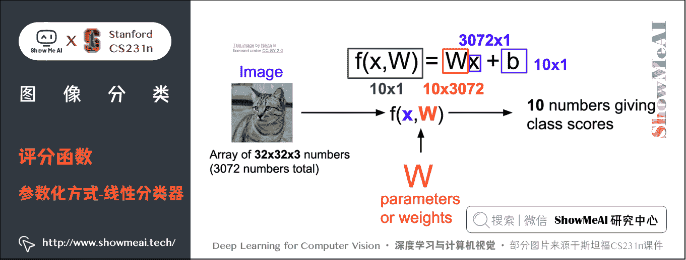

假设我们的训练集有 N N N 个样本，这里 N = 50000 N=50000 N=50000，每个样本 x i b ∈ R D x_{i}b \in R^D xi​b∈RD，其中 i = 1 , 2 , ⋯   , N i = 1,2,\cdots,N i=1,2,⋯,N， D = 3072 D=3072 D=3072；每个 x i x_{i} xi​ 对应着一个标签 y i y_{i} yi​，$ y_{i}$ 在 [ 1 , K ] [1, K] [1,K] 上取值， K K K 表示总分类数，这里 K = 10 K=10 K=10。现在可以定义评分函数： f : R D → R K f:R^D \rightarrow R^K f:RD→RK，即把一个 D D D 维的图像映射为 K K K 个类别的分数。

最简单的模型是线性模型：参数和输入数据相乘。即：

f ( x i , W , b ) = W x i + b f(x_{i},W,b)=Wx_{i}+b f(xi​,W,b)=Wxi​+b

*   上式中参数 W W W 被称为**权重**， b b b 被称为**偏置项**
*   在上面的公式中，假设每个图像数据都被拉长为一个长度为 D D D 的列向量，大小为 [ D × 1 ] [D \times 1] [D×1]。其中大小为 [ K × D ] [K \times D] [K×D] 的矩阵 W W W 和大小为 [ K × 1 ] [K \times 1] [K×1] 的列向量 b b b 为该函数的**参数（parameters）**。

还是以 CIFAR-10 为例， x i x_{i} xi​ 就包含了第 i i i 个图像的所有像素信息，这些信息被拉成为一个 [ 3072 × 1 ] [3072 \times 1] [3072×1] 的列向量， W W W 大小为 [ 10 × 3072 ] [10 \times 3072] [10×3072]， b b b 的大小为 [ 10 × 1 ] [10 \times 1] [10×1]。因此，输入 3072 3072 3072 个数字（原始像素数值），函数输出 10 10 10 个数字（不同分类得到的分值），是一个 3072 3072 3072 维到 10 10 10 维的映射。

注意：

*   常常混用**权重**（weights）和**参数**（parameters）这两个术语，实际上数据和参数相乘，就相当于数据占的比重，这个权重就是参数值；
*   该方法的一个优势是训练数据是用来学习参数 W W W 和 b b b 的，一旦训练完成，训练数据就可以丢弃，留下学习到的参数即可。当测试图像时可以简单地把图像数据输入给函数，函数计算出的分类分值来进行分类；
*   输入数据 ( x i , y i ) (x_{i},y_{i}) (xi​,yi​) 是给定且不可改变的，但参数 W W W 和 b b b 是可改变的。目标就是通过改变这些参数，使得计算出来的分类分值情况和训练集中图像数据的真实类别标签相符；
*   **只需一个矩阵乘法和一个矩阵加法就能对一个测试数据分类**，这比 KNN 中将测试图像和所有训练数据做比较的方法要高效很多。

## 3.3 理解线性分类器

### 1) 理解一：W 是所有分类器的组合

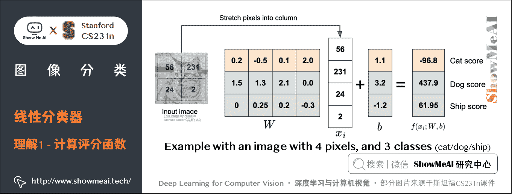

如上图所示，将小猫的图像像素数据拉伸成一个列向量 x i x_i xi​，这里为方便说明，假设图像只有 4 个像素（都是黑白像素，不考虑 RGB 通道），即 D = 4 D=4 D=4；有 3 3 3 个分类（红色代表猫，绿色代表狗，蓝色代表船，颜色仅代表不同类别，和 RGB 通道没有关系），即 K = 3 K=3 K=3。 W W W 矩阵乘列向量 x i x_i xi​，得到各个分类的分值。

**实际上，我们可以看到，参数矩阵 W W W 相当于是三个分类器的组合， W W W 的每一行都是一个分类器**，分别对应猫、狗、船。在线性模型中每个分类器的参数个数与输入图像的维度相当，每个像素和对应的参数相乘，就表示该像素在该分类器中应占的比重。

> 需要注意的是，这个 W W W 一点也不好：猫分类的分值非常低。从上图来看，算法倒是觉得这个图像是一只狗。

我们可以这样理解，线性分类器会计算图像中 3 个颜色通道中所有像素的值与权重矩阵的乘积，进而得到每个类别分值。根据我们对权重设置的值，对于图像中的某些位置的某些颜色，函数表现出喜好或者厌恶（根据每个权重的符号而定）。

**举例**：可以想象 「船」 分类就是被大量的蓝色所包围（对应的就是水）。那么 「船」 分类器在蓝色通道上的权重就有很多的正权重（它们的出现提高了 「船」 分类的分值），而在绿色和红色通道上的权重为负的就比较多（它们的出现降低了 「船」 分类的分值）。

结合上面的小猫示例，猫分类器对第二个位置的像素比较 「厌恶」 ，而恰好输入的小猫图像第二个位置像素值很大，最终计算得到一个很低的分数（当然，这个分类器是错误的）。

### 2) 理解二：将线性分类器看做模板匹配

**把权重 W W W 的每一行看作一个分类的模板，一张图像对应不同分类的得分，是通过使用内积（也叫点积）来比较图像和模板，然后找到和哪个模板最相似**。

这种理解角度下，线性分类器在利用学习到的模板，和输入图像做模板匹配。我们设置可以把其视作一种高效的 KNN，不同的是不再使用所有的训练集的图像来比较，而是每个类别只用了一张图片来表征（这张图片是我们学习到的模板，而不存在训练集中），而且我们会更换度量标准，**使用（负）内积来计算向量间的距离**，而不是使用 L1 或者 L2 距离。

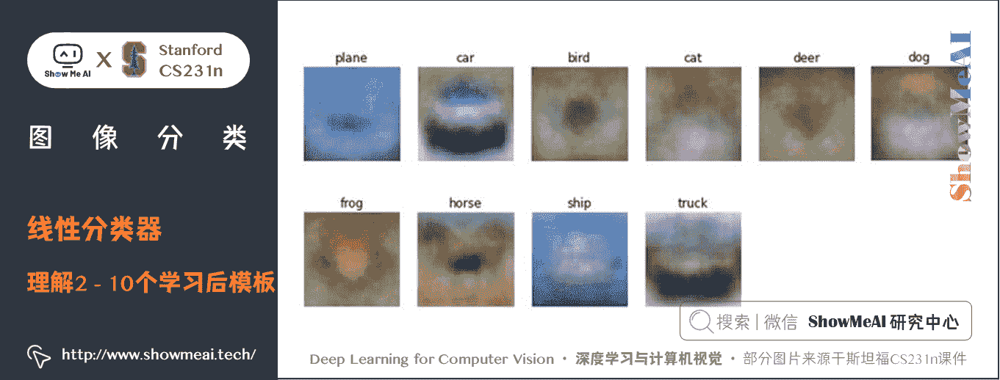

上图是以 CIFAR-10 为训练集，学习结束后的权重的例子。可以看到：

*   马的模板看起来似乎是两个头的马，这是因为训练集中的马的图像中马头朝向各有左右造成的。线性分类器将这两种情况融合到一起了；
*   汽车的模板看起来也是将几个不同的模型融合到了一个模板中，这个模板上的车是红色的，是因为 CIFAR-10 中训练集的车大多是红色的。线性分类器对于不同颜色的车的分类能力是很弱的，但是后面可以看到神经网络是可以完成这一任务的；
*   船的模板如期望的那样有很多蓝色像素。如果图像是一艘船行驶在大海上，那么这个模板利用内积计算图像将给出很高的分数。

### 3) 理解三：将图像看做高维空间的点

既然定义每个分类类别的分值是权重和图像的矩阵乘积，那么每个分类类别的分数就是这个空间中的一个线性函数的函数值。我们没办法可视化 3072 3072 3072 维空间中的线性函数，但假设把这些维度挤压到二维，那么就可以看看这些分类器在做什么了：

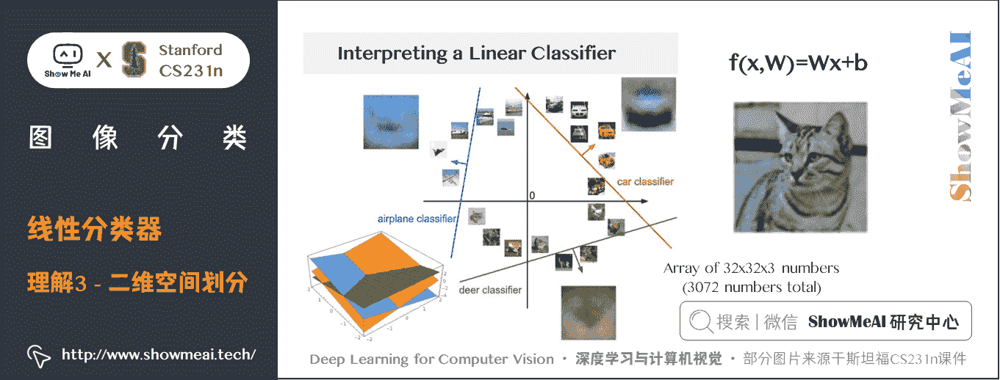

在上图中，每张输入图片是一个点，不同颜色的线代表 3 个不同的分类器。以红色的汽车分类器为例，红线表示空间中汽车分类分数为 0 0 0 的点的集合，红色的箭头表示分值上升的方向。所有红线右边的点的分数值均为正，且线性升高。红线左边的点分值为负，且线性降低。

从上面可以看到， **W W W 的每一行都是一个分类类别的分类器**。对于这些数字的几何解释是：

*   **如果改变 W W W 一行的数字取值，会看见分类器在空间中对应的直线开始向着不同方向旋转。而偏置项 b b b，则允许分类器对应的直线平移**。
*   需要注意的是，**如果没有偏置项，无论权重如何，在 x i = 0 x_{i}=0 xi​=0 时分类分值始终为 0 0 0。这样所有分类器的线都不得不穿过原点**。

## 3.4 偏置项和权重合并

上面的推导过程大家可以看到：实际我们有权重参数 W W W 和偏置项参数 b b b 两个参数，分开处理比较冗余，常用的优化方法是把两个参数放到同一个矩阵中，同时列向量 x i x_{i} xi​ 就要增加一个维度，这个维度的数值是常量 1 1 1，这就是默认的**偏置项维度**。

如下图所示，新的公式就简化成如下形式：

f ( x i , W , b ) = W x i f(x_{i},W,b)=Wx_{i} f(xi​,W,b)=Wxi​

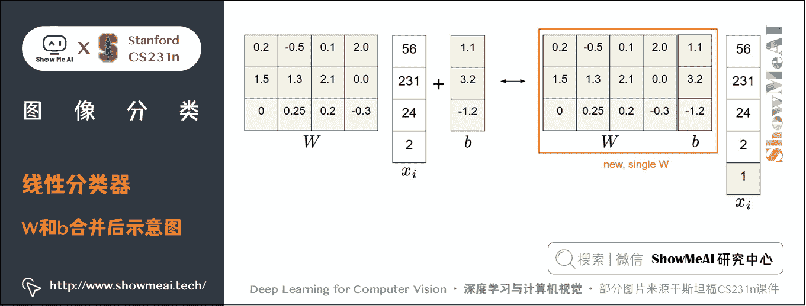

还是以 CIFAR-10 为例，那么 x i x_{i} xi​ 的大小就变成 [ 3073 × 1 ] [3073 \times 1] [3073×1]，而不是 [ 3072 × 1 ] [3072 \times 1] [3072×1] 了，多出了包含常量 1 的 1 个维度； W W W 大小就是 [ 10 × 3073 ] [10 \times 3073] [10×3073] 了， W W W 中多出来的这一列对应的就是偏差值 b b b：

经过这样的处理，最终只需学习一个权重矩阵，无需学习两个分别装着权重和偏差的矩阵。

## 3.5 图像数据预处理

在上面的例子中，所有图像都是使用的原始像素值（ 0 ∼ 255 0 \sim 255 0∼255）。在机器学习中，我们经常会对输入的特征做**归一化（normalization）处理**，对应到图像分类的例子中，图像上的每个像素可以看做一个特征。

在实践中，我们会有对每个特征减去平均值来中心化数据这样一个步骤。

在这些图片的例子中，该步骤是根据训练集中所有的图像计算出一个平均图像值，然后每个图像都减去这个平均值，这样图像的像素值就大约分布在 [ − 127 , 127 ] [-127, 127] [−127,127] 之间了。

后续可以操作的步骤包括归一化，即让所有数值分布的区间变为 [ − 1 , 1 ] [-1, 1] [−1,1]。

## 3.6 线性分类器失效的情形

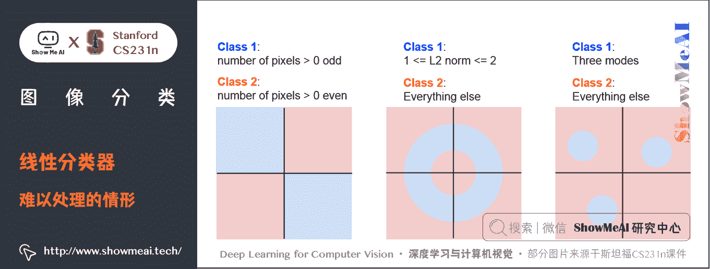

线性分类器的分类能力实际是有限的，例如上图中的这三种情形都无法找到合适的直线区分开。其中第 1 个 case 是奇偶分类，第 3 个 case 是有多个模型。

# 4.拓展学习

**可以点击 [B 站](https://www.bilibili.com/video/BV1g64y1B7m7?p=2) 查看视频的【双语字幕】版本**

[`player.bilibili.com/player.html?aid=759478950&page=2`](https://player.bilibili.com/player.html?aid=759478950&page=2)

【字幕+资料下载】斯坦福 CS231n | 面向视觉识别的卷积神经网络 (2017·全 16 讲)

*   [【课程学习指南】斯坦福 CS231n | 深度学习与计算机视觉](http://blog.showmeai.tech/cs231n/)
*   [【字幕+资料下载】斯坦福 CS231n | 深度学习与计算机视觉 (2017·全 16 讲)](https://www.bilibili.com/video/BV1g64y1B7m7)
*   [【CS231n 进阶课】密歇根 EECS498 | 深度学习与计算机视觉](http://blog.showmeai.tech/eecs498/)
*   [【深度学习教程】吴恩达专项课程 · 全套笔记解读](http://www.showmeai.tech/tutorials/35)
*   [【Stanford 官网】CS231n: Deep Learning for Computer Vision](http://cs231n.stanford.edu/)

# 5.要点总结

*   图像分类中的困难与挑战
*   数据驱动方法、最邻近算法、 L1 和 L2 距离
*   KNN 分类器、超参数调优、KNN 的优缺点与实际应用
*   线性分类的概念、评分函数的理解、参数合并、数据预处理、线性分类器局限性

# [ShowMeAI](http://www.showmeai.tech) 斯坦福 CS231n 全套解读

*   [深度学习与计算机视觉教程(1) | CV 引言与基础 @CS231n](http://www.showmeai.tech/article-detail/260)
*   [深度学习与计算机视觉教程(2) | 图像分类与机器学习基础 @CS231n](http://www.showmeai.tech/article-detail/261)
*   [深度学习与计算机视觉教程(3) | 损失函数与最优化 @CS231n](http://www.showmeai.tech/article-detail/262)
*   [深度学习与计算机视觉教程(4) | 神经网络与反向传播 @CS231n](http://www.showmeai.tech/article-detail/263)
*   [深度学习与计算机视觉教程(5) | 卷积神经网络 @CS231n](http://www.showmeai.tech/article-detail/264)
*   [深度学习与计算机视觉教程(6) | 神经网络训练技巧 (上) @CS231n](http://www.showmeai.tech/article-detail/265)
*   [深度学习与计算机视觉教程(7) | 神经网络训练技巧 (下) @CS231n](http://www.showmeai.tech/article-detail/266)
*   [深度学习与计算机视觉教程(8) | 常见深度学习框架介绍 @CS231n](http://www.showmeai.tech/article-detail/267)
*   [深度学习与计算机视觉教程(9) | 典型 CNN 架构 (Alexnet, VGG, Googlenet, Restnet 等) @CS231n](http://www.showmeai.tech/article-detail/268)
*   [深度学习与计算机视觉教程(10) | 轻量化 CNN 架构 (SqueezeNet, ShuffleNet, MobileNet 等) @CS231n](http://www.showmeai.tech/article-detail/269)
*   [深度学习与计算机视觉教程(11) | 循环神经网络及视觉应用 @CS231n](http://www.showmeai.tech/article-detail/270)
*   [深度学习与计算机视觉教程(12) | 目标检测 (两阶段, R-CNN 系列) @CS231n](http://www.showmeai.tech/article-detail/271)
*   [深度学习与计算机视觉教程(13) | 目标检测 (SSD, YOLO 系列) @CS231n](http://www.showmeai.tech/article-detail/272)
*   [深度学习与计算机视觉教程(14) | 图像分割 (FCN, SegNet, U-Net, PSPNet, DeepLab, RefineNet) @CS231n](http://www.showmeai.tech/article-detail/273)
*   [深度学习与计算机视觉教程(15) | 视觉模型可视化与可解释性 @CS231n](http://www.showmeai.tech/article-detail/274)
*   [深度学习与计算机视觉教程(16) | 生成模型 (PixelRNN, PixelCNN, VAE, GAN) @CS231n](http://www.showmeai.tech/article-detail/275)
*   [深度学习与计算机视觉教程(17) | 深度强化学习 (马尔可夫决策过程, Q-Learning, DQN) @CS231n](http://www.showmeai.tech/article-detail/276)
*   [深度学习与计算机视觉教程(18) | 深度强化学习 (梯度策略, Actor-Critic, DDPG, A3C) @CS231n](http://www.showmeai.tech/article-detail/277)

# [ShowMeAI](http://www.showmeai.tech) 系列教程推荐

*   [大厂技术实现：推荐与广告计算解决方案](http://www.showmeai.tech/tutorials/50)
*   [大厂技术实现：计算机视觉解决方案](http://www.showmeai.tech/tutorials/51)
*   [大厂技术实现：自然语言处理行业解决方案](http://www.showmeai.tech/tutorials/52)
*   [图解 Python 编程：从入门到精通系列教程](http://www.showmeai.tech/tutorials/56)
*   [图解数据分析：从入门到精通系列教程](http://www.showmeai.tech/tutorials/33)
*   [图解 AI 数学基础：从入门到精通系列教程](http://www.showmeai.tech/tutorials/83)
*   [图解大数据技术：从入门到精通系列教程](http://www.showmeai.tech/tutorials/84)
*   [图解机器学习算法：从入门到精通系列教程](http://www.showmeai.tech/tutorials/34)
*   [机器学习实战：手把手教你玩转机器学习系列](http://www.showmeai.tech/tutorials/41)
*   [深度学习教程：吴恩达专项课程 · 全套笔记解读](http://www.showmeai.tech/tutorials/35)
*   [自然语言处理教程：斯坦福 CS224n 课程 · 课程带学与全套笔记解读](http://www.showmeai.tech/tutorials/36)
*   [深度学习与计算机视觉教程：斯坦福 CS231n · 全套笔记解读](http://www.showmeai.tech/tutorials/37)

