# 深度学习与计算机视觉教程(3) | 损失函数与最优化（CV 通关指南·完结）

> 原文：[`blog.csdn.net/ShowMeAI/article/details/124994019`](https://blog.csdn.net/ShowMeAI/article/details/124994019)


*   作者：[韩信子](https://github.com/HanXinzi-AI)@[ShowMeAI](http://www.showmeai.tech/)
*   [教程地址](http://www.showmeai.tech/tutorials/37)：[`www.showmeai.tech/tutorials/37`](http://www.showmeai.tech/tutorials/37)
*   [本文地址](http://www.showmeai.tech/article-detail/262)：[`www.showmeai.tech/article-detail/262`](http://www.showmeai.tech/article-detail/262)
*   声明：版权所有，转载请联系平台与作者并注明出处
*   **收藏[ShowMeAI](http://www.showmeai.tech/)查看更多精彩内容**

* * *


本系列为 **斯坦福 CS231n**《深度学习与计算机视觉(Deep Learning for Computer Vision)》的全套学习笔记，对应的课程视频可以在 [**这里**](https://www.bilibili.com/video/BV1g64y1B7m7?p=3) 查看。更多资料获取方式见文末。

* * *

# 引言

在上一篇 [**深度学习与计算机视觉教程(2) - 图像分类与机器学习基础**](http://www.showmeai.tech/article-detail/261) 内容中，我们对线性分类器做了一些介绍，我们希望线性分类器能够准确地对图像进行分类，要有一套优化其权重参数的方法，这就是本篇[ShowMeAI](http://www.showmeai.tech/)要给大家介绍到的损失函数与最优化相关的知识。

## 本篇重点

*   损失函数
*   数据损失与正则损失
*   SVM 损失
*   Softmax 损失
*   优化策略
*   梯度计算方法
*   梯度下降

# 1.线性分类：损失函数

## 1.1 损失函数的概念

回到之前讲解过的小猫分类示例，这个例子中权重值 W W W 非常差，因为猫类别的得分非常低（-96.8），而狗（437.9）和船（61.95）比较高。

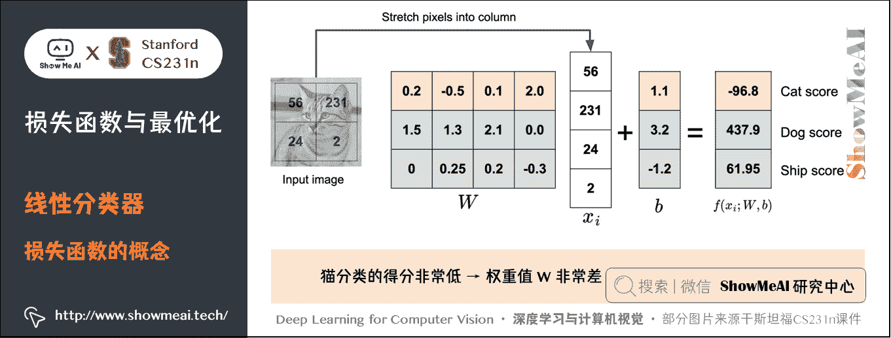

我们定义**损失函数**（Loss Function）（有时也叫**代价函数 Cost Function** 或**目标函数 Objective**） L L L 来衡量对预估结果的「不满意程度」。当评分函数输出结果与真实结果之间差异越大，损失函数越大，反之越小。

对于有 N N N 个训练样本对应 N N N 个标签的训练集数据 ( x i , y i ) (x_{i},y_{i}) (xi​,yi​))，损失函数定义为：

L = 1 N ∑ i = 1 N L i ( f ( x i , W ) , y i ) L=\frac{1}{N} \sum_{i=1}^NL_i(f(x_i,W), y_i) L=N1​i=1∑N​Li​(f(xi​,W),yi​)

*   即每个样本损失函数求和取平均。目标就是找到一个合适的 W W W 使 L L L 最小。
*   **注意**：真正的损失函数 L L L 还有一项正则损失 R ( W ) R(W) R(W)，下面会有说明。

损失函数有很多种，下面介绍最常见的一些。

## 1.2 多类支持向量机损失 (Multiclass Support Vector Machine Loss)

SVM 的知识可以参考[ShowMeAI](http://www.showmeai.tech/)的[**图解机器学习教程**](http://www.showmeai.tech/tutorials/34)中的文章[**支持向量机模型详解**](http://www.showmeai.tech/article-detail/196)，多类 SVM 可以看作二分类 SVM 的一个推广，它可以把样本数据分为多个类别。

### 1) 数据损失（data loss）

SVM 的损失函数想要 SVM 在正确分类上的得分始终比不正确分类上的得分高出一个边界值 Δ \Delta Δ。

我们先看一条数据样本（一张图片）上的损失函数 L i L_i Li​ 如何定义，根据之前的描述，第 i i i 个数据 ( x i , y i ) (x_{i},y_{i}) (xi​,yi​) )中包含图像 x i x_i xi​ 的像素和代表正确类别的标签 y i y_i yi​。给评分函数输入像素数据，然后通过公式 f ( x i , W ) f(x_i, W) f(xi​,W) )来计算不同分类类别的分值。

这里我们将所有分值存放到 s s s 中，第 j j j 个类别的得分就是 s s s 的第 j j j 个元素： s j = f ( x i , W j ) s_j = f(x_i, W_j) sj​=f(xi​,Wj​)。针对第 i i i 条数据样本的多类 SVM 的损失函数定义如下：

L i = ∑ j ≠ y i max ⁡ ( 0 , s j − s y i + Δ ) L_i = \sum_{j\neq y_i} \max(0, s_j - s_{y_i} + \Delta) Li​=j​=yi​∑​max(0,sj​−syi​​+Δ)

直观来看，就是如果评分函数给真实标签的分数比其他某个标签的分数高出 Δ \Delta Δ，则对该其他标签的损失为 0 0 0；否则损失就是 s j − s y i + Δ s_j - s_{y_i}+ \Delta sj​−syi​​+Δ。要对所有不正确的分类循环一遍。

下面用一个示例来解释一下：

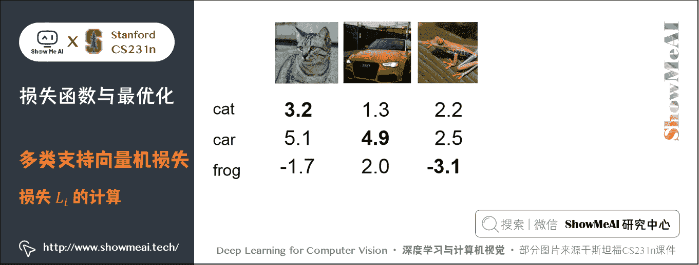

简化计算起见，我们只使用 3 个训练样本，对应 3 个类别的分类， y i = 0 , 1 , 2 y_i =0,1,2 yi​=0,1,2 对于第 1 张图片 「小猫」 来说，评分 s = [ 3.2 , 5.1 , − 1.7 ] s=[3.2, 5.1, -1.7] s=[3.2,5.1,−1.7] 其中 s y i = 3.2 s_{y_i}=3.2 syi​​=3.2 如果把 Δ \Delta Δ 设为 1 1 1，则针对小猫的损失函数:

L 1 = m a x ( 0 , 5.1 − 3.2 + 1 ) + m a x ( 0 , − 1.7 − 3.2 + 1 ) = m a x ( 0 , 2.9 ) + m a x ( 0 , − 3.9 ) = 2.9 + 0 = 2.9 L_1 = max(0, 5.1 - 3.2 + 1) +max(0, -1.7 - 3.2 + 1) = max(0, 2.9) + max(0, -3.9) = 2.9 + 0 =2.9 L1​=max(0,5.1−3.2+1)+max(0,−1.7−3.2+1)=max(0,2.9)+max(0,−3.9)=2.9+0=2.9

同理可得 L 2 = 0 L_2 =0 L2​=0， L 3 = 12.9 L_3 =12.9 L3​=12.9，所以对整个训练集的损失： L = ( 2.9 + 0 + 12.9 ) / 3 = 5.27 L= (2.9 + 0 + 12.9)/3 =5.27 L=(2.9+0+12.9)/3=5.27。

上面可以看到 SVM 的损失函数不仅想要正确分类类别 y i y_i yi​ 的分数比不正确类别分数高，而且至少要高 Δ \Delta Δ。如果不满足这点，就开始计算损失值。

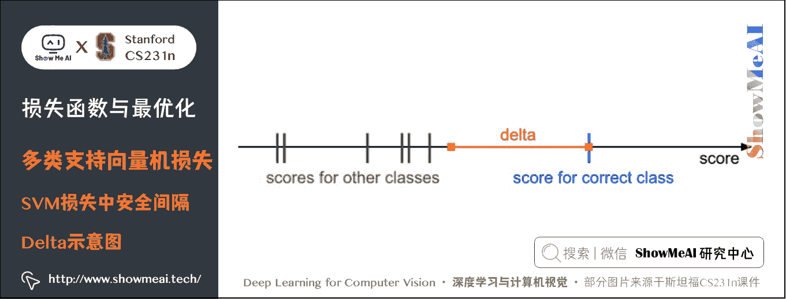

**展开一点解释如下**：之所以会加入一个 Δ \Delta Δ，是为了真实标签的分数比错误标签的分数高出一定的距离，如上图所示，如果其他分类分数进入了红色的区域，甚至更高，那么就开始计算损失；如果没有这些情况，损失值为 0 0 0：

*   损失最小是 0 0 0，最大无穷；
*   如果求和的时候，不加 j ≠ y i j\neq y_i j​=yi​ 这一条件， L L L 会加 Δ \Delta Δ；
*   计算 L i L_i Li​ 时使用平均不用求和，只会缩放 L L L 不会影响好坏；而如果使用平方，就会打破平衡，会使坏的更坏， L L L 受到影响。

在训练最开始的时候，往往会给 W W W 一个比较小的初值，结果就是 s s s 中所有值都很小接近于 0 0 0，此时的损失 L L L 应该等于分类类别数 K − 1 K-1 K−1，这里是 2 2 2。可根据这个判断代码是否有问题；

非向量化和向量化多类 SVM 损失代码实现如下：

```py
def L_i(x, y, W):
  """
  非向量化版本。
  计算单个例子（x，y）的多类 SVM 损失    
  - x 是表示图像的列向量（例如，CIFAR-10 中的 3073 x 1），附加偏置维度
  - y 是一个给出正确类索引的整数（例如，CIFAR-10 中的 0 到 9 之间）    
  - W 是权重矩阵（例如，CIFAR-10 中的 10 x 3073）  """
  delta = 1.0 # 间隔 delta
  scores = W.dot(x) # 得分数组，10 x 1
  correct_class_score = scores[y]
  D = W.shape[0] # 分类的总数,即为 10
  loss_i = 0.0
  for j in range(D): # 迭代所有错误分类   
    if j == y:
      # 跳过正确分类的
      continue
    # 第 i 个样本累加损失
    loss_i += max(0, scores[j] - correct_class_score + delta)
  return loss_i

def L_i_vectorized(x, y, W):
  '''
  更快的半向量化实现。
  half-vectorized 指的是这样一个事实：对于单个样本，实现不包含 for 循环，
  但是在样本外仍然有一个循环（在此函数之外）
  '''
  delta = 1.0
  scores = W.dot(x)
  # 用一个向量操作计算和所有类别的间隔
  margins = np.maximum(0, scores - scores[y] + delta)
  # y 处的值应该为 0  
  margins[y] = 0
  loss_i = np.sum(margins)
  return loss_i 
```

这里的评分函数 f ( x i ; W ) = W x i f(x_i; W) = W x_i f(xi​;W)=Wxi​，所以损失函数可以写为：

L i = ∑ j ≠ y i max ⁡ ( 0 , w j T x i − w y i T x i + Δ ) L_i = \sum_{j\neq y_i} \max(0, w_j^T x_i - w_{y_i}^T x_i + \Delta) Li​=j​=yi​∑​max(0,wjT​xi​−wyi​T​xi​+Δ)

*   其中 w j w_j wj​ 是 W W W 的第 j j j 行，然后被拉成一个行列向量，与 $x_i $ 列向量做点积。

m a x ( 0 , − ) max(0,-) max(0,−) 函数，常被称为**合页损失**（**hinge loss**）。比如平方合页损失 SVM （即 L2 - SVM ），它使用的是 m a x ( 0 , − ) 2 max(0,-)² max(0,−)2 )，将更强烈（平方地而不是线性地）地惩罚过界的边界值。不使用平方是更标准的版本，但是在某些数据集中，平方合页损失会工作得更好。可以通过交叉验证来决定到底使用哪个。

> **总结**：我们对于预测训练集数据分类标签的结果，有一些不满意的地方，而损失函数就能将这些不满意的程度量化。

### 2) 正则化损失（regularization loss）

假设有 1 个数据集和 1 组权重 W W W 能够正确地分类每个数据，即所有 L i L_i Li​ 都为 0 0 0，这样的 W W W 是否唯一？其实只要是任意 λ > 1 \lambda >1 λ>1， λ W \lambda W λW 都可以满足 L i = 0 L_i = 0 Li​=0，因为把差值放大 λ \lambda λ 倍后，仍然会大于 Δ \Delta Δ。

所以，我们希望对某些 W W W 添加一些偏好，让我们的 W 更趋向于希望的形式，一个常见的做法是向损失函数增加一个**正则化惩罚**（**regularization penalty**） R ( W ) R(W) R(W) ，它同时也能让模型更加泛化。

结合上述思路我们得到完整的多类 SVM 损失函数，它由两个部分组成：**数据损失**（**data loss**），即所有样例的平均损失，以及**正则化损失****（regularization loss**）。完整公式如下：

L = 1 N ∑ i L i ⏟ data loss  + λ R ( W ) ⏟ regularization loss  L=\underbrace{\frac{1}{N} \sum_{i} L_{i}}_{\text {data loss }}+\underbrace{\lambda R(W)}_{\text {regularization loss }} L=data loss  N1​i∑​Li​​​+regularization loss  λR(W)​​

### ① 常用的正则化损失

*   最常用的 R(W)是 L2 范式， W W W 每个元素平方后加起来作为惩罚项，可以限制大的权重，更希望 W W W 的元素分布比较均匀：

R ( W ) = ∑ k ∑ l W k , l 2 R(W) = \sum_k\sum_l W_{k,l}² R(W)=k∑​l∑​Wk,l2​

*   除此之外还有 L1 范式，作为惩罚项更希望一个比较简单的模型，即 W W W 中有很多的 0 0 0：

R ( W ) = ∑ k ∑ l ∣ W k , l ∣ R(W) = \sum_k\sum_l \vert W_{k,l}\vert R(W)=k∑​l∑​∣Wk,l​∣

*   L1 和 L2 也可以组合起来：

R ( W ) = ∑ k ∑ l β W k , l 2 + ∣ W k , l ∣ R(W) = \sum_k\sum_l \beta W_{k,l}² + \vert W_{k,l}\vert R(W)=k∑​l∑​βWk,l2​+∣Wk,l​∣

### ② 对正则化损失的理解

引入 L2 范数正则化损失最好的性质就是对大数值权重进行惩罚，可以提升其泛化能力，因为这就意味着没有哪个维度能够独自对于整体分值有过大的影响。

举个例子，假设输入向量 x = [ 1 , 1 , 1 , 1 ] x = [1,1,1,1] x=[1,1,1,1]，两个权重向量 w 1 = [ 1 , 0 , 0 , 0 ] w_1 = [1,0,0,0] w1​=[1,0,0,0]， w 2 = [ 0.25 , 0.25 , 0.25 , 0.25 ] w_2 = [0.25,0.25,0.25,0.25] w2​=[0.25,0.25,0.25,0.25]。那么 w 1 T x = w 2 T x = 1 w_1^Tx = w_2^Tx = 1 w1T​x=w2T​x=1。两个权重向量都得到同样的内积，但是 w 1 w_1 w1​ 的 L2 惩罚是 1.0，而 w 2 w_2 w2​ 的 L2 惩罚是 0.25 0.25 0.25。因此，根据 L2 惩罚来看， w 2 w_2 w2​ 更好，因为它的正则化损失更小。从直观上来看，这是因为 w 2 w_2 w2​ 的权重值更小且更分散，这就会鼓励分类器最终将所有维度上的特征都用起来，而不是强烈依赖其中少数几个维度。这一效果将会提升分类器的泛化能力，并避免过拟合。

注意，和权重不同，偏置项没有这样的效果，因为它们并不控制输入维度上的影响强度。因此**通常只对权重 W W W 正则化，而不正则化偏置项 b b b**。

同时，因为正则化惩罚的存在，不可能在所有的例子中得到 0 0 0 的损失值，这是因为只有当 W = 0 W=0 W=0 的特殊情况下，才能得到损失值为 0 0 0。

但是从 L1 惩罚来看， w 1 w_1 w1​ 可能会更好一些，当然这里 L1 惩罚相同，但是一般来说，L1 惩罚更希望 W W W 比较稀疏，最好是有很多为 0 0 0 的元素，这一特性可以用来在不改变模型的基础上防止过拟合。

比如下面的例子中：

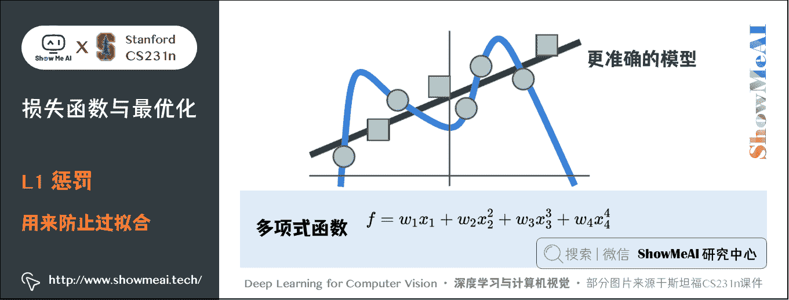

假设我们的训练数据得到的模型是蓝色的曲线，可以看出应该是一个多项式函数，比如 f = w 1 x 1 + w 2 x 2 2 + w 3 x 3 3 + w 4 x 4 4 f=w_1x_1+w_2x_2²+w_3x_3³+w_4x_4⁴ f=w1​x1​+w2​x22​+w3​x33​+w4​x44​。但是当新的绿色数据输入时，显然模型是错误的，更准确的应该是绿色的线。

如果我们使用 L1 惩罚，由于 L1 惩罚的特性，会希望 W W W 变得稀疏，可让 w 2 , w 3 , w 4 w_2,w_3,w_4 w2​,w3​,w4​ 变成接近 0 0 0 的数，这样就可以在不改变模型的情况下，让模型变得简单泛化。

**思考**：**超参数 Δ \Delta Δ 和 λ \lambda λ 应该被设置成什么值**？**需要通过交叉验证来求得吗**？

*   Δ \Delta Δ 在绝大多数情况下设为 1 都是安全的。
*   Δ \Delta Δ 和 λ \lambda λ 看起来是两个不同的超参数，但实际上他们一起控制同一个权衡：即损失函数中的数据损失和正则化损失之间的权衡。
*   理解这一点的关键是，权重 W W W 的大小对于分类分值有直接影响（对他们的差异也有直接影响）：当我们将 W W W 中值缩小，分类分值之间的差异也变小，反之亦然。
*   因此，不同分类分值之间的边界的具体值 Δ = 1 \Delta=1 Δ=1 或 Δ = 100 \Delta=100 Δ=100 从某些角度来看是没意义的，因为权重自己就可以控制差异变大和缩小。也就是说，真正的权衡是我们允许权重能够变大到何种程度（通过正则化强度 λ \lambda λ 来控制）。

### ③ 与二元 SVM 的关系

二元 SVM 对于第 i i i 个数据的损失计算公式是：

L i = C max ⁡ ( 0 , 1 − y i w T x i ) + R ( W ) L_i = C \max(0, 1 - y_i w^Tx_i) + R(W) Li​=Cmax(0,1−yi​wTxi​)+R(W)

其中， C C C 是一个超参数，并且 y i ∈ { − 1 , 1 } y_i \in \{ -1,1 \} yi​∈{−1,1}，这个公式是多类 SVM 公式只有两个分类类别的特例， C C C 和 λ \lambda λ 的倒数正相关。比如对真实标签为 y i = 1 y_i=1 yi​=1 的数据得分是 50 50 50，则 L i = 0 L_i=0 Li​=0。这里只用到了 y i = 1 y_i=1 yi​=1 标签的得分，因为二元 SVM 的 W 只有一行，只有一个得分并且是自身分类的得分，只要这个得分和 y i y_i yi​ 的乘积大于 1 1 1 就是预测正确的了。

最终，我们得到了多类 SVM 损失的完整表达式：

L = 1 N ∑ i ∑ j ≠ y i [ max ⁡ ( 0 , f ( x i ; W ) j − f ( x i ; W ) y i + Δ ) ] + λ ∑ k ∑ l W k , l 2 L = \frac{1}{N} \sum_i \sum_{j\neq y_i} \left[ \max(0, f(x_i; W)_{j} - f(x_i; W)_{y_i} + \Delta) \right] + \lambda \sum_k\sum_l W_{k,l}² L=N1​i∑​j​=yi​∑​[max(0,f(xi​;W)j​−f(xi​;W)yi​​+Δ)]+λk∑​l∑​Wk,l2​

接下来要做的，就是找到能够使损失值最小化的权重了。

## 1.3 Softmax 分类器损失

SVM 是最常用的分类器之一，另一个常用的是 Softmax 分类器。Softmax 分类器可以理解为逻辑回归分类器面对多个分类的一般化归纳，又称为多项式逻辑回归（(Multinomial Logistic Regression）。

### 1) 损失函数

还是以之前小猫的图片为例：

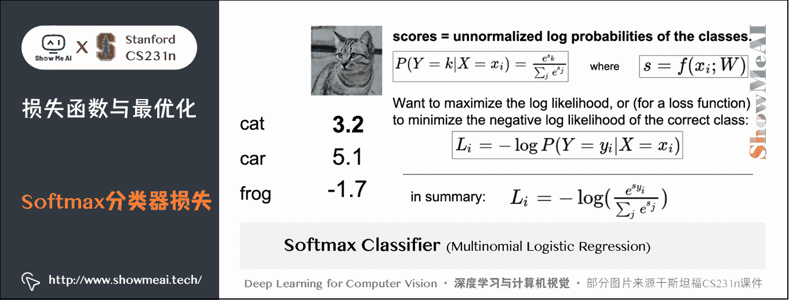

图片上的公式初一看可能感觉有点复杂，下面逐个解释：

*   s s s 依然是存放所有分类分值的一维数组， s = f ( x i , W ) s=f(x_i,W) s=f(xi​,W)， s j s_j sj​ 对应着第 j j j 个分类的得分，对数据 x i x_i xi​ 的真实标签得分还是 s y i s_{y_i} syi​​。现在这个分数被 Softmax 分类器称作**非归一化 log 概率**；

*   函数 f k ( s ) = e s k ∑ j e s j f_k(s)=\frac{e^{s_k}}{\sum_j e^{s_j}} fk​(s)=∑j​esj​esk​​ 是 **Softmax 函数**，其输入值是一个向量 s s s，向量中元素为任意实数的评分值，函数对其进行压缩，输出一个向量，其中每个元素值在 0 0 0 到 1 1 1 之间，且所有元素之和为 1 1 1。现在可以把这个压缩后的向量看作一个概率分布，分类标签是 k k k 的概率： P ( Y = k ∣ X = x i ) = e s k ∑ j e s j P(Y=k|X=x_i)=\frac{e^{s_k}}{\sum_j e^{s_j}} P(Y=k∣X=xi​)=∑j​esj​esk​​。这个概率被称作**归一化概率**，得分的指数形式被称作**非归一化概率**。

*   由上所述，真实分类标签的概率： P ( Y = y i ∣ X = x i ) = e s y i ∑ j e s j P(Y=y_i|X=x_i)=\frac{e^{s_{y_i}}}{\sum_j e^{s_j}} P(Y=yi​∣X=xi​)=∑j​esj​esyi​​​，如果这个概率为 1 1 1 就最好不过了。所以我们希望这个概率的对数似然最大化，也就是相当于负对数似然最小。由于概率 P P P 在 [ 0 , 1 ] [0, 1] [0,1] 之间，所以 − l o g ( P ) -log(P) −log(P) 在 0 0 0 到正无穷之间，所以我们可以用这个负对数似然作为对于 x i x_i xi​ 的**损失函数**：

L i = − l o g P ( Y = y i ∣ X = x i ) = − l o g ( e s y i ∑ j e s j ) L_i=-logP(Y=y_i|X=x_i)=-log(\frac{e^{s_{y_i}}}{\sum_j e^{s_j}}) Li​=−logP(Y=yi​∣X=xi​)=−log(∑j​esj​esyi​​​)

*   整个数据集的损失：

L = 1 N ∑ i [ − l o g ( e s y i ∑ j e s j ) ] + λ R ( W ) L = \frac{1}{N} \sum_i \left[ -log(\frac{e^{s_{y_i}}}{\sum_j e^{s_j}}) \right] + \lambda R(W) L=N1​i∑​[−log(∑j​esj​esyi​​​)]+λR(W)

*   SVM 中使用的是合页损失（hinge loss）有时候又被称为最大边界损失（max-margin loss），Softmax 分类器中使用的为**交叉熵损失**（**cross-entropy loss**），因为使用的是 Softmax 函数，求一个归一化的概率。

根据上面的分析，可以计算出小猫的 Softmax 损失为 0.89 0.89 0.89。损失为 0 0 0 的时候最好，无穷大的时候最差。

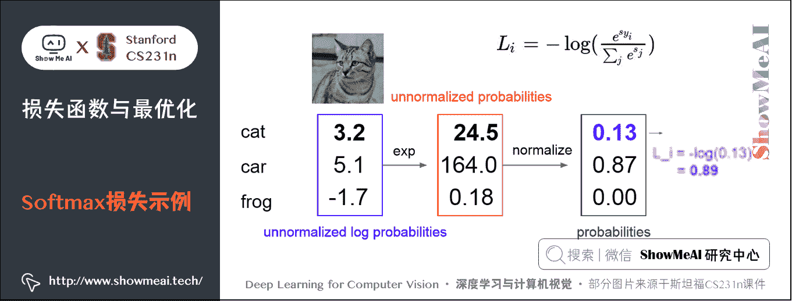

其中：

*   Softmax 损失，最大无穷，最小是 0 0 0；
*   给 W 一个比较小的初值， s s s 中所有值都很小接近于 0 0 0 时，此时的损失 L 应该等于分类类别数的对数： l o g K logK logK。可根据这个判断代码是否有问题；
*   实际代码编写中，由于指数形式的存在，如果得分很高，会得到一个非常大的数。除以大数值可能导致数值计算的不稳定，所以学会使用归一化技巧非常重要。如果在分式的分子和分母都乘以一个常数 C C C，并把它变换到求和之中，就能得到一个从数学上等价的公式：

e s y i ∑ j e s j = C e s y i C ∑ j e s j = e s y i + log ⁡ C ∑ j e s j + log ⁡ C \frac{e^{s_{y_i}}}{\sum_j e^{s_j}} = \frac{Ce^{s_{y_i}}}{C\sum_j e^{s_j}} = \frac{e^{s_{y_i} + \log C}}{\sum_j e^{s_j + \log C}} ∑j​esj​esyi​​​=C∑j​esj​Cesyi​​​=∑j​esj​+logCesyi​​+logC​

*   通常将 C C C 设为 l o g C = − max ⁡ j s j log C = -\max_j s_j logC=−maxj​sj​

该技巧简单地说，就是应该将向量 s s s 中的数值进行平移，使得最大值为 0 0 0。参考 python 实现代码如下：

```py
s = np.array([123, 456, 789]) # 例子中有 3 个分类，每个评分的数值都很大
p = np.exp(s) / np.sum(np.exp(s)) # 不好：数值问题，可能导致数值爆炸

# 那么将 f 中的值平移到最大值为 0：
s -= np.max(s) # s 变成 [-666, -333, 0]
p = np.exp(s) / np.sum(np.exp(s)) # 现在可以了，将给出正确结果 
```

## 1.4 Softmax 和 SVM 比较

Softmax 和 SVM 这两类损失的对比如下图所示：

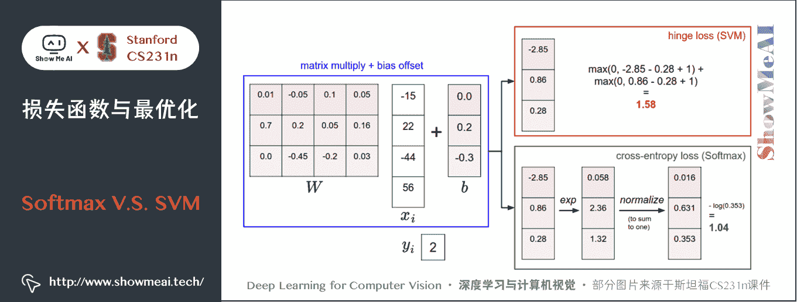

### ① 计算上有差异

SVM 和 Softmax 分类器对于数据有不同的处理方式。两个分类器都计算了同样的分值向量 s s s（本节中是通过矩阵乘来实现）。不同之处在于对 s s s 中分值的解释：

*   **SVM 分类器将它们看做是类别评分，它的损失函数鼓励正确的类别（本例中是蓝色的类别 2）的分值比其他类别的分值高出至少一个安全边界值**。
*   **Softmax 分类器将这些数值看做是每个类别没有归一化的对数概率，鼓励正确分类的归一化的对数概率变高，其余的变低**。

SVM 的最终的损失值是 1.58 1.58 1.58，Softmax 的最终的损失值是 0.452 0.452 0.452，注意这两个数值大小没有可比性。只在给定同样数据，在同样的分类器的损失值计算中，损失之间比较才有意义。

### ② 损失的绝对数值不可以直接解释

SVM 的计算是无标定的，而且难以针对所有分类的评分值给出直观解释。Softmax 分类器则不同，它允许我们计算出对于所有分类标签的 「概率」。

但这里要注意，「不同类别概率」 分布的集中或离散程度是由正则化参数 λ \lambda λ 直接决定的。随着正则化参数 λ \lambda λ 不断增强，权重数值会越来越小，最后输出的概率会接近于均匀分布。

也就是说，Softmax 分类器算出来的概率可以某种程度上视作一种对于分类正确性的自信。和 SVM 一样，数字间相互比较得出的大小顺序是可以解释的，但其绝对值则难以直观解释。

### ③ 实际应用时，SVM 和 Softmax 是相似的

两种分类器的表现差别很小。

*   相对于 Softmax 分类器，SVM 更加 「局部目标化（local objective）」，只要看到正确分类相较于不正确分类，已经得到了比边界值还要高的分数，它就会认为损失值是 0 0 0，对于数字个体的细节是不关心的。
*   Softmax 分类器对于分数是永不满足的：正确分类总能得到更高的概率，错误分类总能得到更低的概率，损失值总是能够更小。

# 2.优化

截止目前，我们已知以下内容：

*   **评分函数**： s = f ( W , x ) = W x s=f(W,x)=Wx s=f(W,x)=Wx

*   **损失函数**：

    *   **SVM 数据损失**： L i = ∑ j ≠ y i max ⁡ ( 0 , s j − s y i + Δ ) L_i = \sum_{j\neq y_i} \max(0, s_j - s_{y_i} + \Delta) Li​=∑j​=yi​​max(0,sj​−syi​​+Δ)
    *   **Softmax 数据损失**： L i = − l o g ( e s y i ∑ j e s j ) L_i=-log(\frac{e^{s_{y_i}}}{\sum_j e^{s_j}}) Li​=−log(∑j​esj​esyi​​​)
    *   **全损失**： L = 1 N ∑ i = 1 N L i + R ( W ) L=\frac{1}{N} \sum_{i=1}^NL_i+R(W) L=N1​∑i=1N​Li​+R(W)

它们之间的关系：

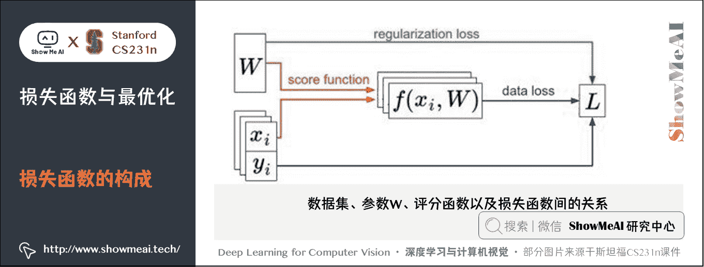

下一步我们希望寻找最优的 W W W 让损失 loss 最小化。

## 2.1 损失函数可视化

损失函数一般都是定义在高维度的空间中（比如，在 CIFAR-10 中一个线性分类器的权重矩阵大小是 [ 10 × 3073 ] [10 \times 3073] [10×3073]，就有 30730 个参数），这样要将其可视化就很困难。

解决办法是在 1 维或 2 维方向上对高维空间进行切片，就能得到一些直观感受。

*   例如，随机生成一个权重矩阵 W W W，该矩阵就与高维空间中的一个点对应。然后沿着某个维度方向前进的同时记录损失函数值的变化。
*   换句话说，就是生成一个随机的方向 W 1 W_1 W1​ 并且沿着此方向计算损失值，计算方法是根据不同的 a a a 值来计算 L ( W + a W 1 ) L(W + a W_1) L(W+aW1​)。这个过程将生成一个图表，其 x x x 轴是值 a a a， y y y 轴是损失函数值。
*   对应到两维上，即通过改变 a , b a,b a,b 来计算损失值 L ( W + a W 1 + b W 2 ) L(W + a W_1 + b W_2) L(W+aW1​+bW2​)，从而给出二维的图像。在图像中，可以分别用 x x x 和 y y y 轴表示 a , b a, b a,b，而损失函数的值可以用颜色变化表示。

下图是一个无正则化的多类 SVM 的损失函数的图示。左边和中间只有一个样本数据，右边是 CIFAR-10 中的 100 个数据，蓝色部分是低损失值区域，红色部分是高损失值区域：

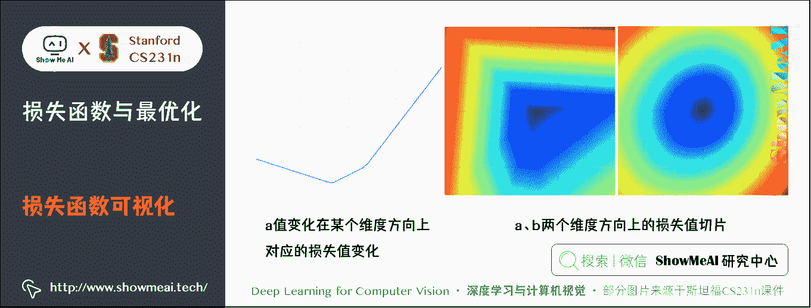

上图中注意损失函数的**分段线性结构**。多个样本的损失值是总体的平均值，所以右边的碗状结构是很多的分段线性结构的平均。可以通过数学公式来解释损失函数的分段线性结构。

对于 1 条单独的数据样本，有损失函数的计算公式如下：

L i = ∑ j ≠ y i [ max ⁡ ( 0 , w j T x i − w y i T x i + 1 ) ] L_i = \sum_{j\neq y_i} \left[ \max(0, w_j^Tx_i - w_{y_i}^Tx_i + 1) \right] Li​=j​=yi​∑​[max(0,wjT​xi​−wyi​T​xi​+1)]

每个样本的数据损失值是以 W W W 为参数的线性函数的总和。 W W W 的每一行（ w j w_j wj​ ），有时候它前面是一个正号（比如当它对应非真实标签分类的时候），有时候它前面是一个负号（比如当它是正确分类的时候）。

比如，假设有一个简单的数据集，其中包含有 3 个只有 1 个维度的点，数据集数据点有 3 个类别。那么完整的无正则化 SVM 的损失值计算如下：

L 0 = max ⁡ ( 0 , w 1 T x 0 − w 0 T x 0 + 1 ) + max ⁡ ( 0 , w 2 T x 0 − w 0 T x 0 + 1 ) L 1 = max ⁡ ( 0 , w 0 T x 1 − w 1 T x 1 + 1 ) + max ⁡ ( 0 , w 2 T x 1 − w 1 T x 1 + 1 ) L 2 = max ⁡ ( 0 , w 0 T x 2 − w 2 T x 2 + 1 ) + max ⁡ ( 0 , w 1 T x 2 − w 2 T x 2 + 1 ) L = ( L 0 + L 1 + L 2 ) / 3 \begin{aligned} L_0 = & \max(0, w_1^Tx_0 - w_0^Tx_0 + 1) + \max(0, w_2^Tx_0 - w_0^Tx_0 + 1) \\ L_1 = & \max(0, w_0^Tx_1 - w_1^Tx_1 + 1) + \max(0, w_2^Tx_1 - w_1^Tx_1 + 1) \\ L_2 = & \max(0, w_0^Tx_2 - w_2^Tx_2 + 1) + \max(0, w_1^Tx_2 - w_2^Tx_2 + 1) \\ L = & (L_0 + L_1 + L_2)/3 \end{aligned} L0​=L1​=L2​=L=​max(0,w1T​x0​−w0T​x0​+1)+max(0,w2T​x0​−w0T​x0​+1)max(0,w0T​x1​−w1T​x1​+1)+max(0,w2T​x1​−w1T​x1​+1)max(0,w0T​x2​−w2T​x2​+1)+max(0,w1T​x2​−w2T​x2​+1)(L0​+L1​+L2​)/3​

这些例子都是一维的，所以数据 x i x_i xi​ 和权重 w j w_j wj​ 都是数字。单看 w 0 w_0 w0​，可以看到最上面的三个式子每一个都含 w 0 w_0 w0​ 的线性函数，且每一项都会与 0 0 0 比较，取两者的最大值。第一个式子线性函数斜率是负的，后面两个斜率是正的，可作图如下：

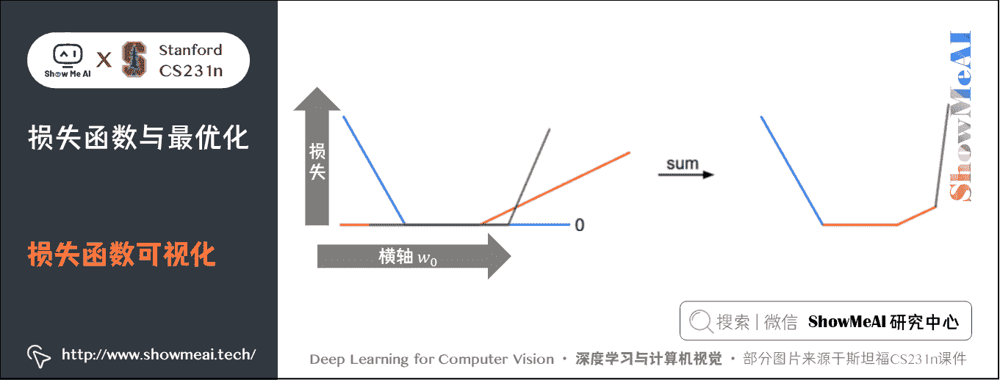

上图中，横轴是 w 0 w_0 w0​，纵轴是损失，三条线对应三个线性函数，加起来即为右图。

**补充解释**：

*   我们将上面的评分函数 f f f 扩展到神经网络，目标损失函数就就不再是凸函数了，图像也不会像上面那样是个碗状，而是凹凸不平的复杂地形形状。
*   由于 max 操作，损失函数中存在一些不可导点（kinks），比如折点处，这些点使得损失函数不可微，因为在这些不可导点，梯度是没有定义的。但是次梯度（subgradient）依然存在且常常被使用。在本教程中，我们会交换使用次梯度和梯度两个术语。某点的次梯度是该点的左右导数之间的任意值。

## 2.2 优化策略（Optimization Strategy）

**优化策略的目标是：找到能够最小化损失函数值的权重 W W W**。

### 1) 策略一：随机搜索（Random search）

随机尝试很多不同的权重，然后看其中哪个最好。这是一个差劲的初始方案。代码如下：

```py
# 假设 X_train 的每一列都是一个数据样本（比如 3073 x 50000）
# 假设 Y_train 是数据样本的类别标签（比如一个长 50000 的一维数组）
# 假设函数 L 对损失函数进行评价

bestloss = float("inf") # 初始指定一个最高的损失
for num in range(1000):
  W = np.random.randn(10, 3073) * 0.0001 # 随机生成一个 10x3073 的 W 矩阵
                                         # 都接近为 0
  loss = L(X_train, Y_train, W) # 得到整个训练集的损失
  if loss < bestloss: # 保持最好的解决方式
    bestloss = loss
    bestW = W
  print 'in attempt %d the loss was %f, best %f' % (num, loss, bestloss)

# 输出:
# in attempt 0 the loss was 9.401632, best 9.401632
# in attempt 1 the loss was 8.959668, best 8.959668
# in attempt 2 the loss was 9.044034, best 8.959668
# in attempt 3 the loss was 9.278948, best 8.959668
# in attempt 4 the loss was 8.857370, best 8.857370
# in attempt 5 the loss was 8.943151, best 8.857370
# in attempt 6 the loss was 8.605604, best 8.605604
# ... (trunctated: continues for 1000 lines) 
```

在上面的代码中，我们尝试了若干随机生成的权重矩阵 W W W，其中某些的损失值较小，而另一些的损失值大些。我们可以把这次随机搜索中找到的最好的权重 W W W 取出，然后去跑测试集：

```py
# 假设 X_test 尺寸是[3073 x 10000], Y_test 尺寸是[10000 x 1]
scores = Wbest.dot(Xte_cols) # 10 x 10000, 每个样本对应 10 个类得分，共 10000
# 找到在每列中评分值最大的索引（即预测的分类）
Yte_predict = np.argmax(scores, axis = 0)
# 以及计算准确率
np.mean(Yte_predict == Yte)
# 返回 0.1555 
```

验证集上表现最好的权重 W 跑测试集的准确率是 15.5 % 15.5\% 15.5%，而完全随机猜的准确率是 10 % 10\% 10%，效果不好！

**思路调整**：新的策略是从随机权重 W 开始，然后迭代取优，每次都让它的损失值变得更小一点，从而获得更低的损失值。想象自己是一个蒙着眼睛的徒步者，正走在山地地形上，目标是要慢慢走到山底。在 CIFAR-10 的例子中，这山是 30730 30730 30730 维的（因为 W W W 是 3073 × 10 3073 \times 10 3073×10）。我们在山上踩的每一点都对应一个的损失值，该损失值可以看做该点的海拔高度。

### 2) 策略二：随机本地搜索

第一个策略可以看做是每走一步都尝试几个随机方向，如果是上山方向就停在原地，如果是下山方向，就向该方向走一步。这次我们从一个随机 W W W 开始，然后生成一个随机的扰动 a W aW aW，只有当 W + a W W+aW W+aW 的损失值变低，我们才会更新。

这个过程的参考实现代码如下：

```py
W = np.random.randn(10, 3073) * 0.001 # 生成随机初始 W
bestloss = float("inf")
for i in xrange(1000):
  step_size = 0.0001
  Wtry = W + np.random.randn(10, 3073) * step_size
  loss = L(Xtr_cols, Ytr, Wtry)
  if loss < bestloss:
    W = Wtry
    bestloss = loss
  print 'iter %d loss is %f' % (i, bestloss) 
```

用上述方式迭代 1000 次，这个方法可以得到 21.4 % 21.4\% 21.4% 的分类准确率。

### 3) 策略三：跟随梯度

前两个策略关键点都是在权重空间中找到合适的方向，使得沿其调整能降低损失函数的损失值。其实不需要随机寻找方向，我们可以直接计算出最好的方向，这个方向就是损失函数的**梯度**（**gradient**）。这个方法就好比是感受我们脚下山体的倾斜程度，然后向着最陡峭的下降方向下山。


在一维函数中，斜率是函数在某一点的瞬时变化率。梯度是函数斜率的一般化表达，它是一个向量。

在输入空间中，梯度是各个维度的斜率组成的向量（或者称为**导数 derivatives**）。对一维函数的求导公式如下：

d f ( x ) d x = lim ⁡ h   → 0 f ( x + h ) − f ( x ) h \frac{df(x)}{dx} = \lim_{h\ \to 0} \frac{f(x + h) - f(x)}{h} dxdf(x)​=h →0lim​hf(x+h)−f(x)​

当函数有多个自变量的时候，我们称导数为偏导数，而梯度就是在每个维度上偏导数所形成的向量。设三元函数 f ( x , y , z ) f(x,y,z) f(x,y,z) 在空间区域 G G G 内具有一阶连续偏导数，点 P ( x , y , z ) ∈ G P(x,y,z)\in G P(x,y,z)∈G，称向量

{ ∂ f ∂ x , ∂ f ∂ y , ∂ f ∂ z } = ∂ f ∂ x i ⃗ + ∂ f ∂ y j ⃗ + ∂ f ∂ z k ⃗ = f x ( x , y , z ) i ⃗ + f y ( x , y , z ) j ⃗ + f z ( x , y , z ) k ⃗ \{ \frac{\partial f}{\partial x}, \frac{\partial f}{\partial y} ,\frac{\partial f}{\partial z} \} = \frac{\partial f}{\partial x}\vec{i} +\frac{\partial f}{\partial y}\vec{j} +\frac{\partial f}{\partial z} \vec{k} = f_{x}(x,y,z)\vec{i}+f_{y}(x,y,z)\vec{j}+f_{z}(x,y,z)\vec{k} {∂x∂f​,∂y∂f​,∂z∂f​}=∂x∂f​i +∂y∂f​j  ​+∂z∂f​k =fx​(x,y,z)i +fy​(x,y,z)j  ​+fz​(x,y,z)k

为函数 f ( x , y , z ) f(x,y,z) f(x,y,z) )在点 P P P 的梯度

记为：

g r a d f ( x , y , z ) = f x ( x , y , z ) i ⃗ + f y ( x , y , z ) j ⃗ + f z ( x , y , z ) k ⃗ grad f(x,y,z)=f_{x}(x,y,z)\vec{i}+f_{y}(x,y,z)\vec{j}+f_{z}(x,y,z)\vec{k} gradf(x,y,z)=fx​(x,y,z)i +fy​(x,y,z)j  ​+fz​(x,y,z)k

# 3.梯度计算

关于梯度计算与检查的详细知识也可以参考[ShowMeAI](http://www.showmeai.tech/)的[**深度学习教程 | 吴恩达专项课程 · 全套笔记解读**](http://www.showmeai.tech/tutorials/35)中的文章[**深度学习的实用层面**](http://www.showmeai.tech/article-detail/216)里对于「**梯度检验 (Gradient checking)**」部分的讲解

计算梯度有两种方法：

*   缓慢的近似方法（**数值梯度法**），但实现相对简单。
*   **分析梯度法**，计算迅速，结果精确，但是实现时容易出错，且需要使用微分。

下面我们展开介绍这两种方法

## 3.1 数值梯度法

数值梯度法是借助于梯度的定义对其进行逼近计算。

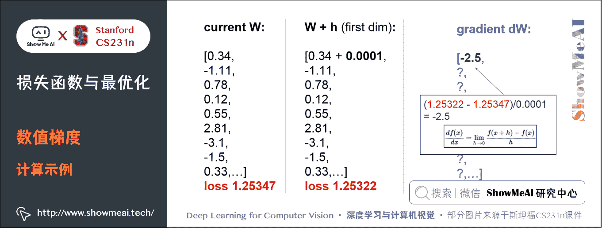

下面代码中：

输入为函数 f f f 和矩阵 x x x，计算 f f f 的梯度的通用函数，它返回函数 f f f 在点 x x x 处的梯度，利用公式 d f ( x ) d x = lim ⁡ h   → 0 f ( x + h ) − f ( x ) h \frac{df(x)}{dx} = \lim_{h\ \to 0} \frac{f(x + h) - f(x)}{h} dxdf(x)​=limh →0​hf(x+h)−f(x)​，代码对 x x x 矩阵所有元素进行迭代，在每个元素上产生一个很小的变化 h h h，通过观察函数值变化，计算函数在该元素上的偏导数。最后，所有的梯度存储在变量 grad 中：

参考实现代码如下：

```py
def eval_numerical_gradient(f, x):
  """  
  我们是求 L 关于 w 的梯度，f 就是损失 L，x 就是权重矩阵 w
  一个 f 在 x 处的数值梯度法的简单实现
  - f 是参数 x 的函数，x 是矩阵，比如之前的 w 是 10x3073  
  - x 是计算梯度的点
   """ 

  fx = f(x) # 计算 x 点处的函数值
  grad = np.zeros(x.shape)  # 梯度矩阵也是 10x3073
  h = 0.00001  # 近似为 0 的变化量

  # 对 x 中所有的索引进行迭代，比如从（0,0）到（9,3072）
  it = np.nditer(x, flags=['multi_index'], op_flags=['readwrite'])
  # np.nditer 是 np 自带的迭代器
  # flags=['multi_index']表示对 x 进行多重索引 比如(0,0)
  # op_flags=['readwrite']表示不仅可以对 x 进行 read（读取），还可以 write（写入）
  while not it.finished:

    # 计算 x+h 处的函数值
    ix = it.multi_index   #索引从(0,0)开始，即从 x 矩阵第一行第一列的元素开始
    old_value = x[ix]   # 先将 x(0,0)处原值保存
    x[ix] = old_value + h # 增加 h
    fxh = f(x) # 计算新的 f(x + h)
    x[ix] = old_value # 将 x(0,0)处改回原值

    # 计算偏导数
    grad[ix] = (fxh - fx) / h # x(0,0)处的偏导数
    it.iternext() # 到下个维度 x(0,1)

  return grad # 最终是计算好的 10x3073 的梯度矩阵 
```

实际中用**中心差值公式**（**centered difference formula**） [ f ( x + h ) − f ( x − h ) ] / 2 h [f(x+h) - f(x-h)] / 2 h [f(x+h)−f(x−h)]/2h 效果会更好。下面计算权重空间中的某些随机点上，CIFAR-10 损失函数的梯度：

```py
# 为了使用上面的代码，需要一个只有一个参数的函数
# (在这里参数就是权重 W)所以封装了 X_train 和 Y_train
def CIFAR10_loss_fun(W):
  return L(X_train, Y_train, W)

W = np.random.rand(10, 3073) * 0.001 # 随机权重矩阵
df = eval_numerical_gradient(CIFAR10_loss_fun, W) # 得到梯度矩阵

梯度告诉我们损失函数在每个元素上的斜率，以此来进行更新：
loss_original = CIFAR10_loss_fun(W) # 初始损失值
print 'original loss: %f' % (loss_original, )

# 查看不同步长的效果
for step_size_log in [-10, -9, -8, -7, -6, -5,-4,-3,-2,-1]:
  step_size = 10 ** step_size_log
  W_new = W - step_size * df # 权重空间中的新位置，使用负梯度
  loss_new = CIFAR10_loss_fun(W_new)
  print 'for step size %f new loss: %f' % (step_size, loss_new)

# 输出:
# original loss: 2.200718
# for step size 1.000000e-10 new loss: 2.200652
# for step size 1.000000e-09 new loss: 2.200057
# for step size 1.000000e-08 new loss: 2.194116
# for step size 1.000000e-07 new loss: 2.135493
# for step size 1.000000e-06 new loss: 1.647802
# for step size 1.000000e-05 new loss: 2.844355
# for step size 1.000000e-04 new loss: 25.558142
# for step size 1.000000e-03 new loss: 254.086573
# for step size 1.000000e-02 new loss: 2539.370888
# for step size 1.000000e-01 new loss: 25392.214036 
```

### ① 在梯度负方向上更新

*   在上面的代码中，为了计算 `W_new`，要注意我们是向着梯度 d f df df 的负方向去更新，这是因为我们希望损失函数值是降低而不是升高。（偏导大于 0 0 0，损失递增， W W W 需要减小；偏导小于 0 0 0，损失递减，W 需要增大。）

### ② 步长的影响

*   从某个具体的点 W W W 开始计算梯度，梯度指明了函数在哪个方向是变化率最大的，即损失函数下降最陡峭的方向，但是没有指明在这个方向上应该迈多大的步子。
*   小步长下降稳定但进度慢，大步长进展快但是风险更大，可能导致错过最优点，让损失值上升。
*   在上面的代码中就能看见反例，在某些点如果步长过大，反而可能越过最低点导致更高的损失值。选择步长（也叫作**学习率**）将会是神经网络训练中最重要（也是最麻烦）的超参数设定之一。

### ③ 效率问题

*   计算数值梯度的复杂性和参数的量线性相关。在本例中有 30730 个参数，所以损失函数每走一步就需要计算 30731 次损失函数（计算梯度时计算 30730 次，最终计算一次更新后的。）
*   现代神经网络很容易就有上千万的参数，因此这个问题只会越发严峻。显然这个策略不适合大规模数据。

## 3.2 解析梯度法

数值梯度的计算比较简单，但缺点在于只是近似不够精确，且耗费计算资源太多。

得益于牛顿-莱布尼茨的微积分，我们可以利用微分来分析，得到计算梯度的公式（不是近似），用公式计算梯度速度很快，但在实现的时候容易出错。

为了解决这个问题，在实际操作时常常将分析梯度法的结果和数值梯度法的结果作比较，以此来检查其实现的正确性，这个步骤叫做**梯度检查**。

比如我们已知多类 SVM 的数据损失 L i L_i Li​：

L i = ∑ j ≠ y i [ max ⁡ ( 0 , w j T x i − w y i T x i + Δ ) ] L_i = \sum_{j\neq y_i} \left[ \max(0, w_j^Tx_i - w_{y_i}^Tx_i + \Delta) \right] Li​=j​=yi​∑​[max(0,wjT​xi​−wyi​T​xi​+Δ)]

可以对函数进行微分。比如对 w y i w_{y_i} wyi​​ 微分：

∇ w y i L i = − ( ∑ j ≠ y i 1 ( w j T x i − w y i T x i + Δ > 0 ) ) x i \nabla_{w_{y_i}} L_i = - \left( \sum_{j\neq y_i} \mathbb{1}(w_j^Tx_i - w_{y_i}^Tx_i + \Delta > 0) \right) x_i ∇wyi​​​Li​=−⎝⎛​j​=yi​∑​1(wjT​xi​−wyi​T​xi​+Δ>0)⎠⎞​xi​

*   其中 1 1 1 是一个示性函数，如果括号中的条件为真，那么函数值为 1 1 1，如果为假，则函数值为 0 0 0。

虽然上述公式看起来复杂，但在代码实现的时候比较简单：只需要计算没有满足边界值的即对损失函数产生贡献的分类的数量，然后乘以 x i x_i xi​ 就是梯度了。

*   注意，这个梯度只是对应正确分类的 W W W 的行向量的梯度，那些 j ≠ y i j \neq y_i j​=yi​ 行的梯度是：

∇ w j L i = 1 ( w j T x i − w y i T x i + Δ > 0 ) x i \nabla_{w_j} L_i = \mathbb{1}(w_j^Tx_i - w_{y_i}^Tx_i + \Delta > 0) x_i ∇wj​​Li​=1(wjT​xi​−wyi​T​xi​+Δ>0)xi​

一旦将梯度的公式微分出来，代码实现公式并用于梯度更新就比较顺畅了。

# 4.梯度下降（Gradient Descent）

关于 Batch Gradient Descent、Mini-batch gradient descent、Stochastic Gradient Descent 的详细知识也可以参考[ShowMeAI](http://www.showmeai.tech/)的的[**深度学习教程 | 吴恩达专项课程 · 全套笔记解读**](http://www.showmeai.tech/tutorials/35)中的文章[**神经网络优化算法**](http://www.showmeai.tech/article-detail/217)

现在可以利用微分公式计算损失函数梯度了，程序重复地计算梯度然后对参数进行更新，这一过程称为梯度下降。

## 4.1 普通梯度下降

```py
# 普通的梯度下降
while True:
  weights_grad = evaluate_gradient(loss_fun, data, weights)
  weights += - step_size * weights_grad # 进行梯度更新 
```

这个简单的循环在所有的神经网络核心库中都有。虽然也有其他实现最优化的方法（**比如 LBFGS**），但是到目前为止，梯度下降是对神经网络的损失函数最优化中最常用的方法。

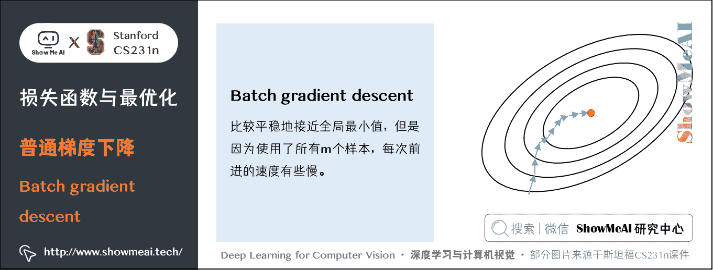

后面大家见到的新的优化算法也是在其基础上增加一些新的东西（比如更新的具体公式），但是核心思想不变，那就是我们一直跟着梯度走，直到结果不再变化。

## 4.2 小批量梯度下降（Mini-batch gradient descent）

在大规模的应用中（比如 ILSVRC 挑战赛），训练数据量 N N N 可以达到百万级量级。如果像这样计算整个训练集，来获得仅仅一个参数的更新就太浪费计算资源了。一个常用的方法通过训练集中的小批量（batches）数据来计算。

例如，在目前最高水平的卷积神经网络中，一个典型的小批量包含 256 个样本，而整个训练集是一百二十万个样本。（CIFAR-10，就有 50000 个训练样本。）比如这个小批量数据就用来实现一个参数更新：

```py
# 普通的小批量数据梯度下降
while True:
  data_batch = sample_training_data(data, 256) # 从大规模训练样本中提取 256 个样本
  weights_grad = evaluate_gradient(loss_fun, data_batch, weights)
  weights += - step_size * weights_grad # 参数更新 
```

这个方法之所以效果不错，是因为训练集中的数据都是相关的。

要理解这一点，可以想象一个极端情况：在 ILSVRC 中的 **120 万**个图像是 1000 张不同图片的复制（每个类别 1 张图片，每张图片复制 1200 次）。那么显然计算这 1200 张复制图像的梯度就应该是一样的。对比 120 万张图片的数据损失的均值与只计算 1000 张的子集的数据损失均值时，结果应该是一样的。

实际情况中，数据集肯定不会包含重复图像，那么小批量数据的梯度就是对整个数据集梯度的一个近似。因此，在实践中通过计算**小批量数据的梯度可以实现更快速地收敛，并以此来进行更频繁的参数更新**。

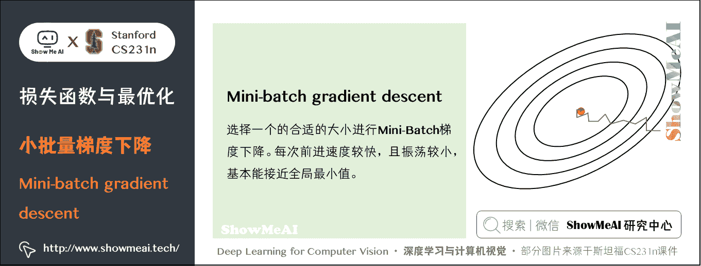

小批量数据策略有个极端情况：每批数据的样本量为 1，这种策略被称为**随机梯度下降**（**Stochastic Gradient Descent 简称 SGD**），有时候也被称为在线梯度下降。**SGD 在技术上是指每次使用 1 个样本来计算梯度**，你还是会听到人们使用 SGD 来指代小批量数据梯度下降（或者用 MGD 来指代小批量数据梯度下降）。


**小批量数据的大小是一个超参数，但是一般并不需要通过交叉验证来调参**。它一般设置为同样大小，比如 32、64、128 等。之所以使用 2 的指数，是因为在实际中许多向量化操作实现的时候，如果输入数据量是 2 的指数，那么运算更快。

# 5.图像特征提取

直接输入原始像素，效果不好，可以将图像的特征计算出来，便于分类。

常用的特征计算方式：颜色直方图、词袋、计算边缘等，神经网络中是特征是训练过程中得到的。

# 6.在线程序

线性分类器各种细节，可在斯坦福大学开发的一个在线程序观看演示：[点击这里](http://vision.stanford.edu/teaching/cs231n-demos/linear-classify/)

# 7.拓展学习

**可以点击 [B 站](https://www.bilibili.com/video/BV1g64y1B7m7?p=3) 查看视频的【双语字幕】版本**

[`player.bilibili.com/player.html?aid=759478950&page=3`](https://player.bilibili.com/player.html?aid=759478950&page=3)

【字幕+资料下载】斯坦福 CS231n | 面向视觉识别的卷积神经网络 (2017·全 16 讲)

*   [【课程学习指南】斯坦福 CS231n | 深度学习与计算机视觉](http://blog.showmeai.tech/cs231n/)
*   [【字幕+资料下载】斯坦福 CS231n | 深度学习与计算机视觉 (2017·全 16 讲)](https://www.bilibili.com/video/BV1g64y1B7m7)
*   [【CS231n 进阶课】密歇根 EECS498 | 深度学习与计算机视觉](http://blog.showmeai.tech/eecs498/)
*   [【深度学习教程】吴恩达专项课程 · 全套笔记解读](http://www.showmeai.tech/tutorials/35)
*   [【Stanford 官网】CS231n: Deep Learning for Computer Vision](http://cs231n.stanford.edu/)

# 8.要点总结

*   损失函数，包括数据损失与正则损失
*   多类 SVM 损失与 Softmax 损失比较
*   梯度计算方法（数值梯度与解析梯度）
*   梯度下降优化算法

# [ShowMeAI](http://www.showmeai.tech) 斯坦福 CS231n 全套解读

*   [深度学习与计算机视觉教程(1) | CV 引言与基础 @CS231n](http://www.showmeai.tech/article-detail/260)
*   [深度学习与计算机视觉教程(2) | 图像分类与机器学习基础 @CS231n](http://www.showmeai.tech/article-detail/261)
*   [深度学习与计算机视觉教程(3) | 损失函数与最优化 @CS231n](http://www.showmeai.tech/article-detail/262)
*   [深度学习与计算机视觉教程(4) | 神经网络与反向传播 @CS231n](http://www.showmeai.tech/article-detail/263)
*   [深度学习与计算机视觉教程(5) | 卷积神经网络 @CS231n](http://www.showmeai.tech/article-detail/264)
*   [深度学习与计算机视觉教程(6) | 神经网络训练技巧 (上) @CS231n](http://www.showmeai.tech/article-detail/265)
*   [深度学习与计算机视觉教程(7) | 神经网络训练技巧 (下) @CS231n](http://www.showmeai.tech/article-detail/266)
*   [深度学习与计算机视觉教程(8) | 常见深度学习框架介绍 @CS231n](http://www.showmeai.tech/article-detail/267)
*   [深度学习与计算机视觉教程(9) | 典型 CNN 架构 (Alexnet, VGG, Googlenet, Restnet 等) @CS231n](http://www.showmeai.tech/article-detail/268)
*   [深度学习与计算机视觉教程(10) | 轻量化 CNN 架构 (SqueezeNet, ShuffleNet, MobileNet 等) @CS231n](http://www.showmeai.tech/article-detail/269)
*   [深度学习与计算机视觉教程(11) | 循环神经网络及视觉应用 @CS231n](http://www.showmeai.tech/article-detail/270)
*   [深度学习与计算机视觉教程(12) | 目标检测 (两阶段, R-CNN 系列) @CS231n](http://www.showmeai.tech/article-detail/271)
*   [深度学习与计算机视觉教程(13) | 目标检测 (SSD, YOLO 系列) @CS231n](http://www.showmeai.tech/article-detail/272)
*   [深度学习与计算机视觉教程(14) | 图像分割 (FCN, SegNet, U-Net, PSPNet, DeepLab, RefineNet) @CS231n](http://www.showmeai.tech/article-detail/273)
*   [深度学习与计算机视觉教程(15) | 视觉模型可视化与可解释性 @CS231n](http://www.showmeai.tech/article-detail/274)
*   [深度学习与计算机视觉教程(16) | 生成模型 (PixelRNN, PixelCNN, VAE, GAN) @CS231n](http://www.showmeai.tech/article-detail/275)
*   [深度学习与计算机视觉教程(17) | 深度强化学习 (马尔可夫决策过程, Q-Learning, DQN) @CS231n](http://www.showmeai.tech/article-detail/276)
*   [深度学习与计算机视觉教程(18) | 深度强化学习 (梯度策略, Actor-Critic, DDPG, A3C) @CS231n](http://www.showmeai.tech/article-detail/277)

# [ShowMeAI](http://www.showmeai.tech) 系列教程推荐

*   [大厂技术实现：推荐与广告计算解决方案](http://www.showmeai.tech/tutorials/50)
*   [大厂技术实现：计算机视觉解决方案](http://www.showmeai.tech/tutorials/51)
*   [大厂技术实现：自然语言处理行业解决方案](http://www.showmeai.tech/tutorials/52)
*   [图解 Python 编程：从入门到精通系列教程](http://www.showmeai.tech/tutorials/56)
*   [图解数据分析：从入门到精通系列教程](http://www.showmeai.tech/tutorials/33)
*   [图解 AI 数学基础：从入门到精通系列教程](http://www.showmeai.tech/tutorials/83)
*   [图解大数据技术：从入门到精通系列教程](http://www.showmeai.tech/tutorials/84)
*   [图解机器学习算法：从入门到精通系列教程](http://www.showmeai.tech/tutorials/34)
*   [机器学习实战：手把手教你玩转机器学习系列](http://www.showmeai.tech/tutorials/41)
*   [深度学习教程：吴恩达专项课程 · 全套笔记解读](http://www.showmeai.tech/tutorials/35)
*   [自然语言处理教程：斯坦福 CS224n 课程 · 课程带学与全套笔记解读](http://www.showmeai.tech/tutorials/36)
*   [深度学习与计算机视觉教程：斯坦福 CS231n · 全套笔记解读](http://www.showmeai.tech/tutorials/37)

