# 深度学习与计算机视觉教程(5) | 卷积神经网络（CV 通关指南·完结）

> 原文：[`blog.csdn.net/ShowMeAI/article/details/125024904`](https://blog.csdn.net/ShowMeAI/article/details/125024904)


*   作者：[韩信子](https://github.com/HanXinzi-AI)@[ShowMeAI](http://www.showmeai.tech/)
*   [教程地址](http://www.showmeai.tech/tutorials/37)：[`www.showmeai.tech/tutorials/37`](http://www.showmeai.tech/tutorials/37)
*   [本文地址](http://www.showmeai.tech/article-detail/264)：[`www.showmeai.tech/article-detail/264`](http://www.showmeai.tech/article-detail/264)
*   声明：版权所有，转载请联系平台与作者并注明出处
*   **收藏[ShowMeAI](http://www.showmeai.tech/)查看更多精彩内容**

* * *


本系列为 **斯坦福 CS231n** 《深度学习与计算机视觉(Deep Learning for Computer Vision)》的全套学习笔记，对应的课程视频可以在 [**这里**](https://www.bilibili.com/video/BV1g64y1B7m7?p=5) 查看。更多资料获取方式见文末。

* * *

# 引言

上篇 **深度学习与 CV 教程(4) | 神经网络与反向传播** 提到的神经网络是线性分类器的堆叠，只不过在中间加入非线性函数，对中间层产生的模板加权后得到最终的得分。计算机视觉中用到更多的神经网络结构是**卷积神经网络**(Convolutional Neural Networks) ，它与前面提到的前馈神经网络的构想是一致的，只是包含卷积层等特殊构建的神经网络层次结构。本篇[ShowMeAI](http://www.showmeai.tech/)给大家详细展开介绍卷积神经网络。

> 关于卷积神经网络的详细知识也可以参考[ShowMeAI](http://www.showmeai.tech/)的[**深度学习教程 | 吴恩达专项课程 · 全套笔记解读**](http://www.showmeai.tech/tutorials/35)中的文章[**卷积神经网络解读**](http://www.showmeai.tech/article-detail/221)

## 本篇重点

*   卷积神经网络的历史
*   卷积神经网络与常规神经网络的对比；卷积层、池化层、ReLU 层、全连接层；局部连接、参数共享、最大池化、步长、零填充、数据体尺寸等概念
*   卷积神经网络层的规律与尺寸设置
*   卷积神经网络经典案例

# 1.卷积神经网络的历史

1957 年，Frank Rosenblatt 发明了第一代感知器，第一次实现感知器算法。感知器算法和神经网络很相似，都有 w w w、 x x x、 b b b 等参数，也有参数更新规则。但是感知器只能输出 0 0 0、 1 1 1 两个数，参数更新规则也不是反向传播。

f ( x ) = { 0 i f    w ⋅ z + b < 0 1 o t h e r w i s e f(x)= \begin{cases} 0 & if \space\space w\cdot z+b<0 \\ 1 & otherwise \end{cases} f(x)={01​if  w⋅z+b<0otherwise​

**更新规则**：

w i ( t + 1 ) = w i ( t ) + α ( d j − y j ( t ) ) x j , i w_i(t+1)=w_i(t)+\alpha(d_j-y_j(t))x_{j,i} wi​(t+1)=wi​(t)+α(dj​−yj​(t))xj,i​

1960 年，Widrow 和 Hoff 的 Adaline/Madaline，首次尝试把线性层叠加，整合成多层感知器网络，与现代神经网络层的结构比较类似，但是仍然没有反向传播或其他训练方法。

1986 年 Rumelhart 才首次提出反向传播算法，然后我们熟悉的链式法则、更新规则等才逐渐出现。至此有了神经网络核心的训练方法，但是仍然无法训练大型的神经网络。

2006 年，Hinton 和 Salakhutdinov 的论文表明神经网络不仅可以训练并且可以高效的训练，但是需要谨慎的初始化，才能反向传播。他们先预先训练得到隐层的参数，再训练整个网络。

直到 2012 年，深度神经网络才得到大规模的应用。首先是 Geoffrey Hinton 等将 CNN 用于语音识别，然后其同实验室的 Alex Acero 等发表了里程碑式的论文，将 CNN 用于 Image net 大赛极大提高识别率，成为图像分类的标杆方法。

## 1.1 卷积网络的产生过程

从 1959 年开始 ，Hubel & Wiesel 做了一些列实验，试图弄明白神经元如何在视觉皮层上工作。他们把电极放进猫的脑袋中，然后给猫不同的视觉刺激，比如不同的边缘方向、不同的形状等，然后测量神经元的应激响应。

他们得出一些重要的结论：一是大脑皮层上的细胞与视觉中的区域相关联，有映射关系。二是神经元间存在分层关系。初级层次的细胞对光的方向产生反应，复杂一点的会对光的移动有反应，超复杂的可以反应端点，识别形状。

1980 年，Fukushima 的感知神经器首次将这种简单细胞与复杂细胞的概念形成实例，一种简单细胞与复杂细胞交替层结构。简单细胞会有一些可调参数，复杂细胞对简单细胞执行池化操作。

1998 年，LeCun, Bottou, Bengio, Haffner 等人首次展示一个实例，应用反向传播和基于梯度的学习方法来训练卷积神经网络，用于邮政编码识别，效果显著。但是有局限性，不能用到更复杂的数据中。

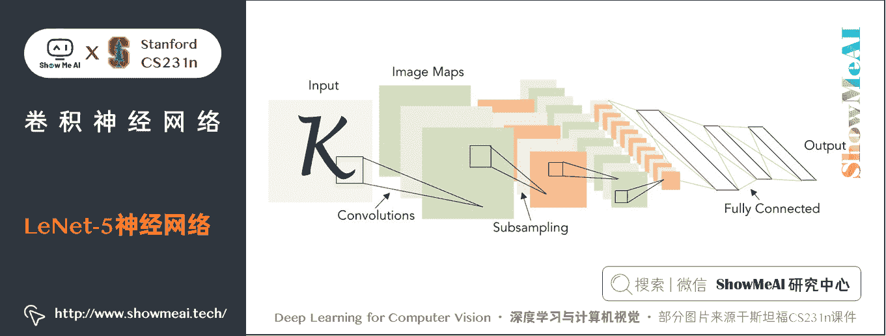

2012 年，Alex 等人提出一种现代化的卷积神经网络，称为 AlexNet。与 LeCun 的很相似，只是更大更深，可以充分利用大量图片数据比如 Image net 和 GPU 并行计算能力。

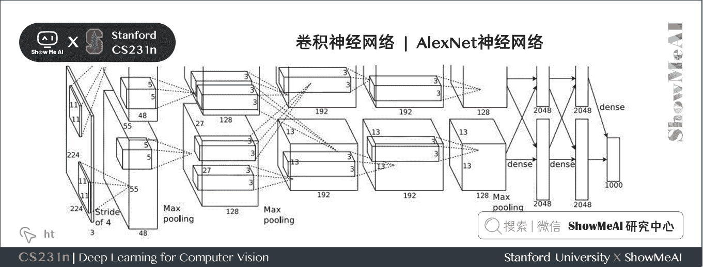

今天，CNN 已经被广泛应用到图像分类、目标检测、图像分割等。这些技术被广泛用于自动驾驶领域，使用 GPU 驱动，将高性能的 GPU 置于嵌入式系统。应用到其他领域，比如人脸识别、视频分类、姿势识别、医学影像分析、星系分类、路标识别，也应用到游戏中，比如 AlfaGo。除了分类识别等任务，还可用于图像描述、艺术创作（Deep Dream，神经图像风格迁移）。

# 2.卷积神经网络详述

## 2.1 卷积神经网络和常规神经网络对比

**卷积神经网络（CNN / ConvNet）** 和常规神经网络非常相似：

*   都是由神经元组成，神经元中有具有学习能力的权重和偏置项。每个神经元都得到一些输入数据，进行内积运算后再进行激活函数运算；
*   整个网络依旧是一个可导的评分函数，该函数的输入是原始的图像像素，输出是不同类别的评分；
*   在最后一层（往往是全连接层），网络依旧有一个损失函数（比如 SVM 或 Softmax），并且在神经网络中我们实现的各种技巧和要点依旧适用于卷积神经网络。

卷积神经网络的结构基于输入数据是图像，向结构中添加了一些特有的性质，使得前向传播函数实现起来更高效，并且大幅度降低了网络中参数的数量。

## 2.2 常规神经网络

常规神经网络的输入是一个向量，比如把一张 32 × 32 × 3 32 \times 32 \times 3 32×32×3 的图片延展成 3072 × 1 3072 \times 1 3072×1 的列向量 x x x，然后在一系列的隐层中对它做变换。

**每个隐层都是由若干的神经元组成，每个神经元都与前一层中的所有神经元连接（这就是全连接的概念）**。 但是在一个隐层中，神经元相互独立不进行任何连接。

最后的全连接层被称为「**输出层**」，在分类问题中，它输出的值被看做是不同类别的评分值。比如线性分类 W x Wx Wx ， W W W 是 10 × 3072 10 \times 3072 10×3072 的权重矩阵，即 W W W 有 10 个行向量，最终输出是一个 10 × 1 10 \times 1 10×1 的得分向量，其中的每一个值是 W W W 的某一个行向量和 x x x 的点积结果，也就是一个神经元的输出。

最终会有 10 10 10 个神经元输出 10 10 10 个值（ W 0 x , W 1 x , ⋯   , W 9 x W_0x, W_1x, \cdots, W_9x W0​x,W1​x,⋯,W9​x）， x x x 和每一个神经元相连，因此是全连接的。

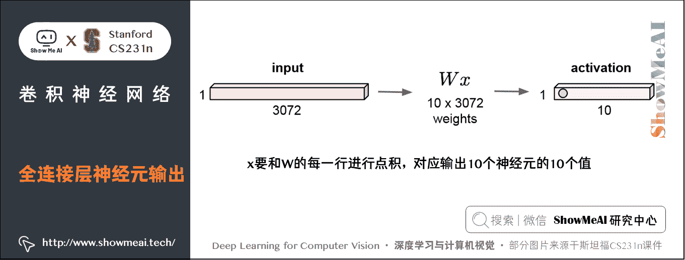

### 缺点与限制

但是全连接神经网络在处理大的图片数据时参数会急速增加，同时效果也不尽如人意。

*   比如在 CIFAR-10 中，图像的尺寸是 32 × 32 × 3 32 \times 32 \times 3 32×32×3，对应网络的第一个隐层中，每一个单独的全连接神经元的参数个数即 W W W 的一个行向量就有 32 × 32 × 3 = 3072 32 \times 32 \times 3=3072 32×32×3=3072 个。
*   若是一个尺寸为 200 × 200 × 3 200 \times 200 \times 3 200×200×3 的图像，会让神经元包含 200 × 200 × 3 = 120 , 000 200 \times 200 \times 3=120,000 200×200×3=120,000 个权重值。而网络中肯定不止一个神经元，那么参数的量就会快速增加！

全连接方式效率不高，且参数量大，可能会导致网络过拟合。

## 2.3 卷积神经网络

> 关于卷积层的动图讲解也可以参考[ShowMeAI](http://www.showmeai.tech/)的的[**深度学习教程 | 吴恩达专项课程 · 全套笔记解读**](http://www.showmeai.tech/tutorials/35)中的文章[**卷积神经网络解读**](http://www.showmeai.tech/article-detail/221)

与常规神经网络不同，卷积神经网络的各层中的神经元都是 3 维的：**宽度、高度和深度**（这里的深度指的是激活数据体的第三个维度，而不是整个网络的深度，整个网络的深度指的是网络的层数）。

*   以第一层卷积层为例，输入数据仍然是 32 × 32 × 3 32 \times 32 \times 3 32×32×3（宽度 × \times × 高度 × \times ×深度）的，并不会将其延展成一个列向量，这样可以保持图像的**空间结构**（spatial structure）。
*   与输入相连的神经元权重不再是 W W W 的一个行向量（ 3072 3072 3072 个参数），而是与输入数据有同样深度的**滤波器**（filter，也称作**卷积核**），比如是 5 × 5 × 3 5 \times 5 \times 3 5×5×3 的滤波器 w w w。
*   这时的神经元（卷积核）不再与输入图像 x x x 是全连接的，而是**局部连接**（local connectivity），只和 x x x 中一个 5 × 5 × 3 5 \times 5 \times 3 5×5×3 的小区域进行全连接（常规神经网络中每个神经元都和整个 x x x 全连接），滤波器和这个区域计算一个点积 w x wx wx（计算的时候会展成两个向量进行点积），然后加一个偏置项 b b b，就得到一个输出数据（ w x + b wx+b wx+b）。这样的一个神经元共有 5 × 5 × 3 + 1 = 76 5 \times 5 \times 3+1=76 5×5×3+1=76 个参数。
*   这个滤波器会在 x x x 上按一定的**步长**（stride） 依次滑动，比如步长为 1 1 1 时，最终会得到一个 28 × 28 × 1 28 \times 28 \times 1 28×28×1 的输出数据，称作**激活映射（activation map）** 或**特征映射（feature map）** ，对应 28 × 28 28 \times 28 28×28 个神经元的输出。

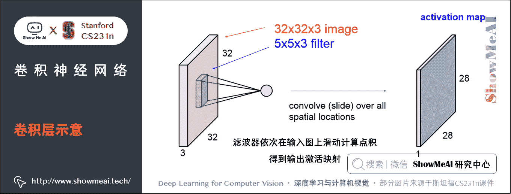

对于用来分类 CIFAR-10 中图像的卷积网络，其最后的输出层的维度是 1 × 1 × 10 1 \times 1 \times 10 1×1×10，因为在卷积神经网络结构的最后部分将会把全尺寸的图像压缩为包含分类评分的一个向量，向量是在深度方向排列的。

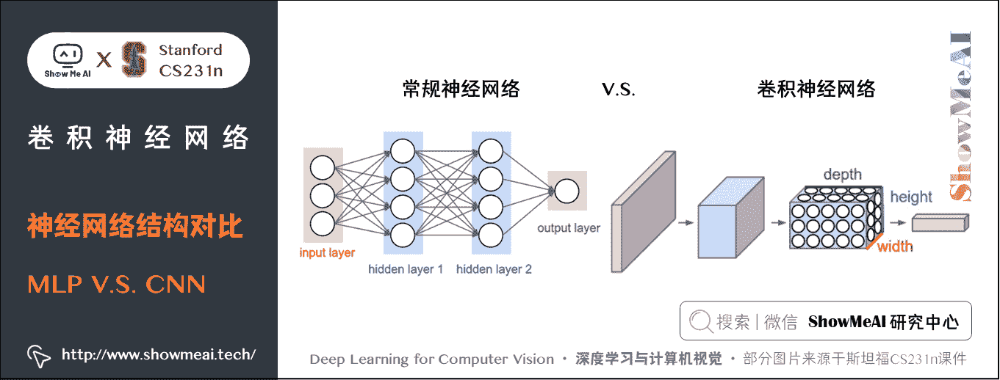

上图左边是常规神经网络，每个神经元和上层的神经元都是全连接的；右图是卷积神经网络，每个神经元都有三个维度，网络每一层都将 3D 的输入数据变化为神经元 3D 的激活数据并输出。

在这个例子中，红色的输入层装的是图像，所以它的宽度和高度就是图像的宽度和高度，它的深度是 3（代表了 R/红、G/绿、B/蓝 3 个颜色通道）。

蓝色的部分是第一层卷积层的输出，这里的深度显然不为 1，表明有多种滤波器。如果我们有 6 6 6 个 5 × 5 5 \times 5 5×5 的滤波器，每个卷积核代表从输入捕捉某些信息的滤波器，那它们依次滑过整张图片，得到第一个卷积层的输出结果是 28 × 28 × 6 28 \times 28 \times 6 28×28×6 的。如下图所示：


# 3.卷积神经网络的结构

一个简单的卷积神经网络是由各种层按照顺序排列组成，卷积神经网络主要由三种类型的层构成：**卷积层，池化（Pooling）层和全连接层**（全连接层和常规神经网络中的一样）。通过将这些层叠加起来，就可以构建一个完整的卷积神经网络。

一个用于 CIFAR-10 图像数据分类的卷积神经网络的结构可以是「**输入层-卷积层-ReLU 层-池化层-全连接层**」，这四个层也是目前卷积神经网络比较常用的层。

*   输入层是 [ 32 × 32 × 3 ] [32 \times 32 \times 3] [32×32×3] 存有图像的原始像素，本例中图像宽高均为 32，有 3 个颜色通道。
*   卷积层中，神经元与输入层中的一个局部区域相连，每个神经元都计算输入层上与自己相连的区域与自己权重的内积。卷积层会计算所有神经元的输出。如果使用 12 个滤波器（也叫作卷积核），得到的输出数据体的维度就是 [ 32 × 32 × 12 ] [32 \times 32 \times 12] [32×32×12] 。
*   ReLU 层将会逐个元素地进行激活函数操作，比如使用以 0 0 0 为阈值的 ReLU 函数 m a x ( 0 , − ) max(0,-) max(0,−) 作为激活函数。该层对数据尺寸没有改变，还是 [ 32 × 32 × 12 ] [32 \times 32 \times 12] [32×32×12] 。
*   池化层在空间维度（宽度和高度）上进行**降采样**（downsampling）操作，假设数据尺寸变为 [ 16 × 16 × 12 ] [16 \times 16 \times 12] [16×16×12] 。
*   全连接层将会计算分类评分，数据尺寸变为 [ 1 × 1 × 10 ] [1 \times 1 \times 10] [1×1×10] ，其中 10 个数字对应的就是 CIFAR-10 中 10 个类别的分类评分值。全连接层与常规神经网络一样，其中每个神经元都与前一层中所有神经元相连接。

卷积神经网络一层一层地将图像从原始像素值变换成最终的分类评分值。

*   卷积层和全连接层（CONV/FC）对输入执行变换操作的时候，不仅会用到激活函数，还会用到很多参数（神经元的权值和偏置项）
*   ReLU 层和池化层进行一个固定的函数操作。
*   卷积层、全连接层和池化层有超参数，ReLU 层没有。卷积层和全连接层中的参数利用梯度下降训练。

实际应用的时候，卷积网络是由多个卷积层依次堆叠组成的序列，然后使用激活函数（比如 ReLU 函数）对其进行逐一处理。然后这些卷积层、激活层、池化层会依次堆叠，上一层的输出作为下一层的输入。每一层都会使用多个卷积核，每个卷积核对用一个激活映射。

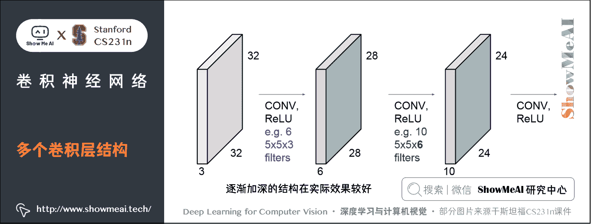

## 3.1 卷积核可视化

卷积网络这些卷积层的所有卷积核完成训练后，会发现：

*   前面几个卷积层的卷积核捕捉和匹配的是一些比较简单的特征，比如边缘；
*   中间几层的卷积核代表的特征变得复杂一些，比如一些边角和斑点；
*   最后几层的特征就会变得特别丰富和复杂。

这些卷积核是从简单到复杂的特征序列。这实际上和 Hubel & Wiesel 的实验结果比较相似，即使在我们并没有明确的让网络去学习这些从简单到复杂的特征，但是给它这种层次结构并经过反向传播训练后，这些类型的卷积核最终也能学到。

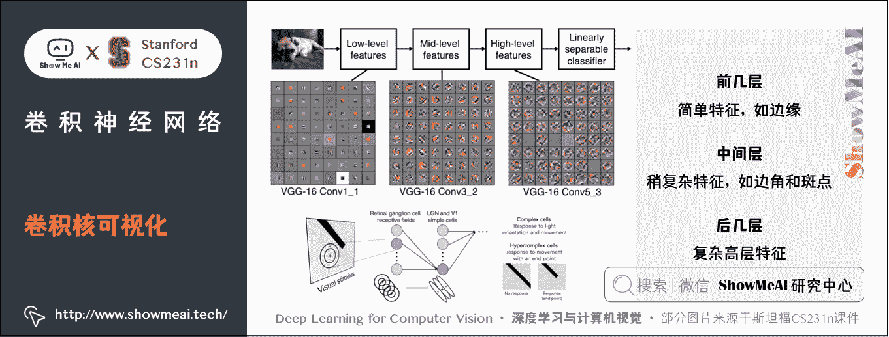

## 3.2 激活映射与卷积核可视化联系

我们有 32 个已经在卷积网络中训练好的 5 × 5 5 \times 5 5×5 卷积核，每一个卷积核滑过原始图像得到一张激活映射，将它们可视化，我们可以看出卷积核在原图像匹配和寻找什么。

比如下图上方红框中的第一个卷积核对应得到红框的激活映射，卷积核看起来像是一个定向边缘的模板，所以当其滑过图像，在那些有定向边缘的地方会得到较高的值。

之所以称作卷积，只是计算形式上就是卷积，滤波器和信号（图像）的元素相乘后求和。

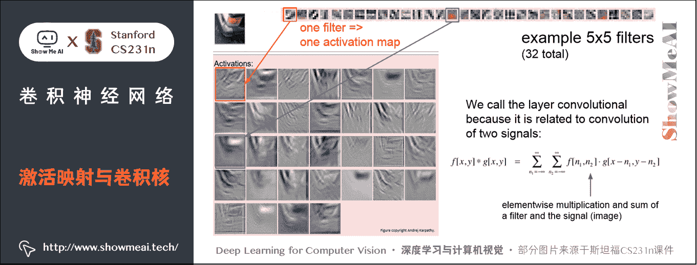

## 3.3 整个卷积网络的结构


左边的输入层存有原始图像，右边的输出层得到各类别评分。

图像经过一系列卷积层、RELU 层、池化层，最后经过全连接层得到针对不同类别的分类得分，这里只显示了得分最高的 5 个评分值和对应的类别。

整个网络包括输入层、输出层共有 17 层，架构是 [conv-relu-conv-relu-pool] x3-fc-softmax，共有 7000 个参数，使用 3 × 3 3 \times 3 3×3 卷积和 2 × 2 2 \times 2 2×2 池化区域。斯坦福大学 [课程主页](http://cs231n.stanford.edu/) 上展示的就是这个 CNN 网络。

下面详细介绍卷积层、池化层等层次及其工作原理。

# 4.卷积网络各层详细介绍

## 4.1 卷积层（Convolutional Layer，Conv layer）

**卷积层是构建卷积神经网络的核心层**，网络中大部分的计算量都由它产生。

> 关于卷积层的动图讲解也可以参考[ShowMeAI](http://www.showmeai.tech/)的的[**深度学习教程 | 吴恩达专项课程 · 全套笔记解读**](http://www.showmeai.tech/tutorials/35)中的文章[**卷积神经网络解读**](http://www.showmeai.tech/article-detail/221)

### 1) 概述

卷积层的参数是由一些可学习的**滤波器（filter）** 集合构成的。每个滤波器在宽度和高度上都比较小，但是深度和输入数据一致。

比如卷积神经网络第一层的一个典型的滤波器的尺寸可以是 5 × 5 × 3 5 \times 5 \times 3 5×5×3（宽高都是 5 5 5 像素，深度是 3 3 3 是因为图像应为颜色通道，所以有 3 的深度）。

在前向传播的时候，让每个滤波器都在输入数据的宽度和高度上滑动（更精确地说是做卷积），然后计算这个滤波器和输入数据对应每一个区域的内积，最终会生成一个 2 维的**激活映射**（也叫激活图）（activation map），激活图给出了在每个空间位置处滤波器的反应。

直观地来说，网络会让滤波器学习，结果是当它看到某些类型的视觉特征时就激活，具体的视觉特征可能是某些方位上的边界，或者在第一层上某些颜色的斑点，甚至可以是网络更高层上的蜂巢状或者车轮状图案。

在每个卷积层上，一般有多个滤波器组成集合（比如 12 个），每个都会生成一个不同的二维激活映射。将这些激活映射在深度方向上层叠起来就生成了这个卷积层的输出 3D 数据。

这个 3D 数据的每一个激活图，都是由一些参数相同的神经元在原图像的不同位置做内积得到的输出数据组成的。每张激活图对应的所有神经元参数都相同（因为实际上就是同一个滤波器在图像上不同位置滑动的结果，每到一个位置就是一个神经元），称为**参数共享**。

### 2) 局部连接

卷积层每个神经元和原图像只在一个小区域进行全连接，称为 **局部连接**。因为在处理图像这样的高维度输入时，让每个神经元都与前一层中的所有神经元进行全连接是不现实的。

局部连接的空间大小叫做神经元的**感受野（receptive field）** ，它的尺寸（其实就是滤波器的空间尺寸）是一个超参数。在深度方向上，这个连接的大小总是和输入量的深度相等。即连接在空间（宽高）上是局部的，但是在深度上总是和输入数据的深度一致。

重复一下之前的例子，一张 32 × 32 × 3 32 \times 32 \times 3 32×32×3 的图片，滤波器大小为 5 × 5 × 3 5 \times 5 \times 3 5×5×3。此时感受野尺寸是 5 × 5 5 \times 5 5×5，滤波器的深度需要和原图像深度一致，为 3 3 3。那么神经元的权重个数为 5 × 5 × 3 = 75 5 \times 5 \times 3=75 5×5×3=75 个，再加一个偏置项，共 76 76 76 个。神经元和原图像一个同样大小的区域是全连接的，共有 75 75 75 个连接，但是与整个图像是局部连接的（只在 5 × 5 5 \times 5 5×5 的空间上连接），如果是全连接则需要有 3072 3072 3072 个连接。

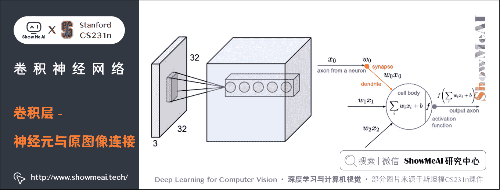

*   **左边**：红色的是输入数据体（比如 CIFAR-10 中的图像），蓝色的部分是第一个卷积层中的所有神经元。卷积层中的每个神经元都只是与输入数据体的一个局部空间相连，但是与输入数据体的所有深度维度全部相连（所有颜色通道）。在深度方向上有多个神经元（本例中 5 个），它们都接受输入数据的同一块区域（感受野相同）。深度方向上的神经元参数是不同的。
*   **右边**：神经元内部计算还和以前一样，还是计算权重和输入的内积，然后进行激活函数运算，只是它们的连接被限制在一个局部空间，即输入数据只是原图像的一部分。

### 3) 神经元排列与输出数据尺寸

卷积层的所有神经元与原始图像卷积后，输出数据体的尺寸由三个超参数控制：**深度（depth），步长（stride）** 和**零填充（zero-padding）** 。

**① 深度** ：卷积层中使用的滤波器往往有多个，**深度就是滤波器的数量**。

*   每个滤波器在输入数据中匹配计算不同的模式。
*   比如第一个卷积层的输入是原始图像，那么在深度维度上的不同神经元将可能被原图像上不同方向的边界，或者是颜色斑点激活。将这些沿着深度方向排列、感受野相同的神经元集合称为**深度列**（depth column），或者**纤维**（fibre）。

**② 步长：步长就是滤波器每次移动跨越的像素数量**。

*   当步长为 1，滤波器每次移动 1 个像素。当步长为 2（实际中很少使用比 2 大的步长），滤波器滑动时每次移动 2 个像素。这个操作会让输出数据体在空间上变小。

**③ 零填充：在图像的边界外填充零像素点**。

*   滑动时会使输出数据体在空间上变小，比如 32 × 32 32 \times 32 32×32 的图像经过一个卷积层输出数据在空间上可能是 28 × 28 28 \times 28 28×28 的，经过多层后会迅速收敛。我们不希望这样，于是引入了零填充，零填充有一个良好性质，可以**控制输出数据体的空间尺寸**（最常用的是用来保持输入数据体在空间上的尺寸，这样输入和输出的宽高都相等）。

比如有一个 7 × 7 7 \times 7 7×7 的原始图片，滤波器的尺寸是 3 × 3 3 \times 3 3×3，步长为 1 1 1 时的输出是 5 × 5 5 \times 5 5×5；步长为 2 2 2 时输出是 3 × 3 3 \times 3 3×3，但步长是 3 3 3 的时候尺寸不再适合。

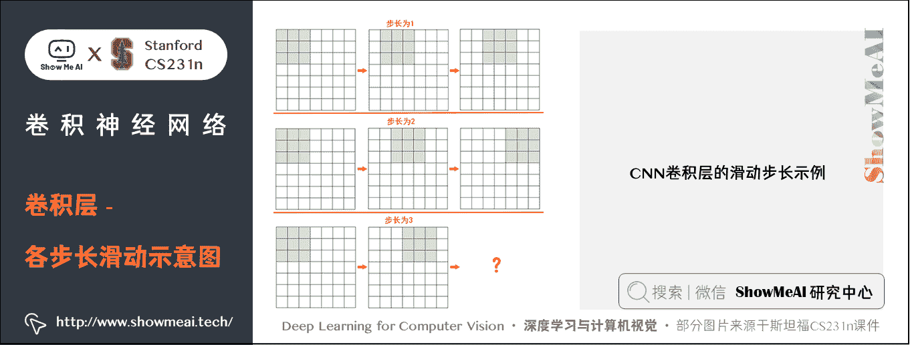

假设图片的尺寸是 N × N N \times N N×N，滤波器尺寸是 F × F F \times F F×F，步长为 S S S，则输出数据的尺寸为： ( N − F ) / S + 1 (N-F)/S +1 (N−F)/S+1。所以当 N = 7 N=7 N=7， F = 3 F=3 F=3：

*   S = 1 S=1 S=1 时，输出为 5 5 5
*   S = 2 S=2 S=2 时，输出为 3 3 3
*   S = 3 S=3 S=3 时，输出为 2.333 2.333 2.333，显然不合理

所以步长的设置不合理会导致网络的异常，引入零填充可一定程度解决这个问题。

下面考虑加入零填充的情形。在 7 × 7 7 \times 7 7×7 的图像外面加入一圈零像素，滤波器尺寸仍为 3 × 3 3 \times 3 3×3，步长为 1，此时的输出尺寸应该是多少？答案是 7 × 7 7 \times 7 7×7，因为此时的原图像相当于变成 9 × 9 9 \times 9 9×9。此时的输出数据空间尺寸和输入的相同。

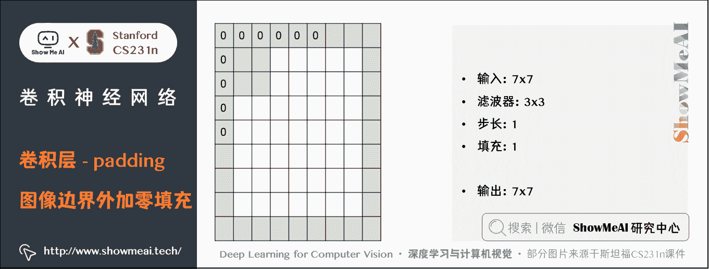

综上，可得输出数据尺寸的计算公式：

假如输入数据体尺寸 W × W W \times W W×W，卷积层中神经元的感受野尺寸 F × F F \times F F×F，步长 S S S 和零填充的数量 P P P，则输出数据体的空间尺寸为 ( W + 2 P − F ) / S + 1 (W+2P-F)/S+1 (W+2P−F)/S+1 。

*   比如上面输入是 7 × 7 7 \times 7 7×7，滤波器是 3 × 3 3 \times 3 3×3，步长为 1 1 1，填充为 1 1 1，那么就能得到一个 7 × 7 7 \times 7 7×7 的输出。

一般来说，当步长 S = 1 S=1 S=1 时，为保证输入尺寸和输出尺寸相同，零填充的数量为： P = ( F − 1 ) / 2 P=(F-1)/2 P=(F−1)/2 。

*   考虑最初的问题，一张 32 × 32 × 3 32 \times 32 \times 3 32×32×3 的图像，经过有 10 个 5 × 5 × 3 5 \times 5 \times 3 5×5×3 滤波器的卷积层，步长为 1 1 1，零填充数量为 2 2 2，则输出的尺寸为？显然是 32 × 32 × 10 32 \times 32 \times 10 32×32×10。这是因为滤波器尺寸 5 5 5 步长 1 1 1 填充 2 2 2 可以保持空间尺寸，滤波器的数量又决定了输出的深度。

**那么这个卷积层有多少个参数呢？**

*   10 个滤波器每个有 5 × 5 × 3 + 1 = 76 5 \times 5 \times 3+1=76 5×5×3+1=76 个参数，所以共有 760 760 760 个参数。

**那么这个卷积层一共有多少个神经元呢？**

*   答案是 32 × 32 × 10 32 \times 32 \times 10 32×32×10，因为输出数据的每个数据点，都由一个神经元产生。也就是说**输出数据体的尺寸，就代表着神经元的排列方式**。

但是，既然有 32 × 32 × 10 32 \times 32 \times 10 32×32×10 个神经元，每个神经元的参数为 76，那为什么只有 760 个参数呢？大家可以在后面的**参数共享**部分可以找到答案。

[AlexNet](http://papers.nips.cc/paper/4824-imagenet-classification-with-deep-convolutional-neural-networks) 神经网络架构，赢得了 2012 年的 ImageNet 挑战，它的结构中：

*   输入图像的尺寸是 [ 227 × 227 × 3 ] [227 \times 227 \times 3] [227×227×3]
*   在第一个卷积层，神经元使用的感受野尺寸 F = 11 F=11 F=11，步长 S = 4 S=4 S=4，不使用零填充 P = 0 P=0 P=0。因为 ( 227 − 11 ) / 4 + 1 = 55 (227-11)/4+1=55 (227−11)/4+1=55，卷积层的深度 K = 96 K=96 K=96，则卷积层的输出数据体尺寸为 [ 55 × 55 × 96 ] [55 \times 55 \times 96] [55×55×96] 。 55 × 55 × 96 55 \times 55 \times 96 55×55×96 个神经元中，每个都和输入数据体中一个尺寸为 [ 11 × 11 × 3 ] [11 \times 11 \times 3] [11×11×3] 的区域全连接。在深度列上的 96 个神经元都是与输入数据体中同一个 [ 11 × 11 × 3 ] [11 \times 11 \times 3] [11×11×3] 区域连接，但是权重不同。

### 4) 参数共享机制

在卷积层中使用参数共享是用来控制参数的数量。

就用上面的真实案例，在第一个卷积层就有 55 × 55 × 96 = 290 , 400 55 \times 55 \times 96=290,400 55×55×96=290,400 个神经元（假设神经元都是独立的）

*   因为一个滤波器每滑到一个位置，就对应一个神经元，得到一个神经元输出。滑过所有位置后的输出数据空间尺寸为 55 × 55 55 \times 55 55×55，对应着有 55 × 55 55 \times 55 55×55 个神经元。再加上一共有 96 个滤波器，所以为 55 × 55 × 96 55 \times 55 \times 96 55×55×96。
*   每个神经元有 11 × 11 × 3 + 1 = 364 11 \times 11 \times 3+1=364 11×11×3+1=364 个参数。将这些合起来就是 290400 × 364 = 105 , 705 , 600 290400 \times 364=105,705,600 290400×364=105,705,600 个参数。单单第一层就有这么多参数，显然这个数目是非常大的。

作一个合理的假设：**如果一个特征在计算某个空间位置 ( x , y ) (x,y) (x,y)的时候有用，那么它在计算另一个不同位置 ( x 2 , y 2 ) (x_2,y_2) (x2​,y2​)的时候也有用**。

*   参数共享的假设是有道理的：如果在图像某些地方探测到一个水平的边界是很重要的，那么在其他一些地方也会同样是有用的，这是因为图像结构具有平移不变性。

基于这个假设，可以显著地减少参数数量。也是基于这个假设，滤波器可以在原图片上滑动。

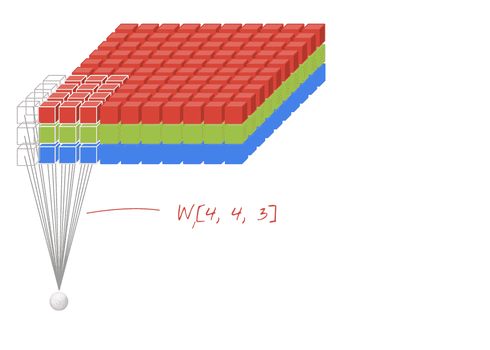

如果我们将深度维度上一个单独的 2 维切片看做**深度切片**（depth slice），比如这个尺寸为 [ 55 × 55 × 96 ] [55 \times 55 \times 96] [55×55×96] 的输出数据体就有 96 个深度切片，每个尺寸为 [ 55 × 55 ] [55 \times 55] [55×55] 。在每个深度切片上的神经元都使用同样的权重和偏置项。

在这样的参数共享下，例子中的第一个卷积层就只有 96 个不同的参数集了，一个参数集对应一个深度切片，共有 96 × ( 11 × 11 × 3 + 1 ) = 34 , 944 96 \times (11 \times 11 \times 3+1)=34,944 96×(11×11×3+1)=34,944 个不同的参数（包括偏置项）。

在每个深度切片中的 55 × 55 55 \times 55 55×55 个权重使用的都是同样的参数。

**在反向传播的时候，需要计算每个神经元对它的权重的梯度，所以需要把同一个深度切片上的所有神经元对权重的梯度进行累加，这样就得到了对这个共享权重的梯度。这样，每个切片只更新一个权重集**。

**补充解释**：正是因为参数共享，卷积层的前向传播在每个深度切片中可以看做是在计算神经元权重和输入数据体的**卷积**（这就是「卷积层」名字由来）。这也是为什么总是将这些权重集合称为**滤波器（filter）** （或**卷积核（kernel）** ），因为它们和输入进行了卷积。

有时候参数共享假设可能没有意义，特别是当卷积神经网络的输入图像是一些明确的中心结构时候。这时候我们就应该期望在图片的不同位置学习到完全不同的特征。一个具体的例子就是输入图像是人脸，人脸一般都处于图片中心。你可能期望不同的特征，比如眼睛特征或者头发特征可能（也应该）会在图片的不同位置被学习。在这个例子中，通常就放松参数共享的限制，将层称为**局部连接层**（Locally-Connected Layer）。

### 5) 卷积层演示

下面是一个卷积层的运行演示。因为 3D 数据难以可视化，所以所有的数据（输入数据体是蓝色，权重数据体是红色，输出数据体是绿色）都进行深度切片然后排成一列来展现。

*   输入数据体的尺寸是 W 1 = 5 W_1 = 5 W1​=5， H 1 = 5 H_1 = 5 H1​=5， D 1 = 3 D_1 = 3 D1​=3 。
*   卷积层的参数是 K = 2 K = 2 K=2， F = 3 F = 3 F=3， S = 2 S = 2 S=2， P = 1 P = 1 P=1 。也就是说，有 2 个滤波器，滤波器的尺寸是 3 × 3 3 \times 3 3×3 ，步长是 2。
*   因此，输出数据体的空间尺寸是 ( 5 − 3 + 2 ) / 2 + 1 = 3 (5-3+2)/2+1=3 (5−3+2)/2+1=3。

注意输入数据体使用了零填充 P = 1 P=1 P=1，所以输入数据体外边缘一圈都是 0 0 0。下面的例子在绿色的输出激活图上循环演示，展示了其中每个元素都是蓝色的输入数据和红色的滤波器逐元素相乘，然后求其总和，最后加上偏置项得来。高清版展示，建议访问 [课程官网](http://cs231n.github.io/convolutional-networks/)。

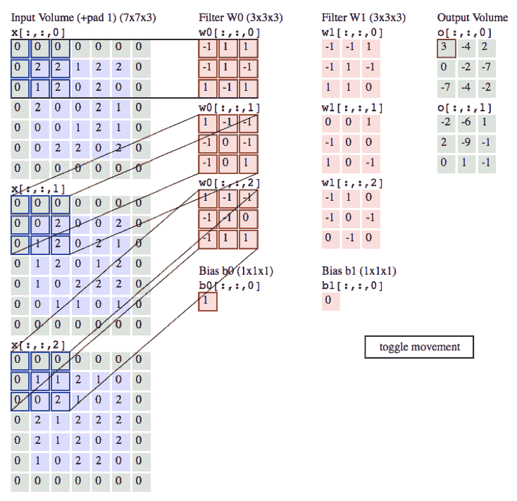

### 6) 用矩阵乘法实现卷积

卷积运算本质上就是在滤波器和输入数据的局部区域做点积。卷积层的常用实现方式就是利用这一点，将卷积层的前向传播变成一个巨大的矩阵乘法：

*   输入图像的局部区域被 `im2col` 操作拉伸为列。比如，如果输入是 [ 227 × 227 × 3 ] [227 \times 227 \times 3] [227×227×3] ，要与尺寸为 11 × 11 × 3 11 \times 11 \times 3 11×11×3 的滤波器以步长为 4 4 4 进行卷积，就取输入中的 [ 11 × 11 × 3 ] [11 \times 11 \times 3] [11×11×3] 数据块，然后将其拉伸为长度为 11 × 11 × 3 = 363 11 \times 11 \times 3=363 11×11×3=363 的列向量。重复进行这一过程，因为步长为 4 4 4，所以输出的宽高为 ( 227 − 11 ) / 4 + 1 = 55 (227-11)/4+1=55 (227−11)/4+1=55，即需要 55 \times 55=3025 个这样的列向量与滤波器做点积。所以输入数据 X X X 经过 im2col 操作后的输出矩阵 `X_col` 的尺寸是 [ 363 × 3025 ] [363 \times 3025] [363×3025] ，其中每列是 X X X 上拉伸的感受野，共有 55 × 55 = 3 , 025 55 \times 55=3,025 55×55=3,025 个。注意因为感受野之间有重叠，所以输入数据体中的数字在不同的列中可能有重复。

*   卷积层的权重也同样被拉伸成行。举例，如果有 96 个尺寸为 [ 11 × 11 × 3 ] [11 \times 11 \times 3] [11×11×3] 的滤波器，就生成一个矩阵 `W_row`，尺寸为 [ 96 × 363 ] [96 \times 363] [96×363] 。

*   现在卷积的结果和进行一个大矩阵乘法 `np.dot(W_row, X_col)` 是等价的了，能得到每个滤波器和每个感受野间的点积。在这个例子中，这个操作的输出是 [ 96 × 3025 ] [96 \times 3025] [96×3025] ，给出了每个滤波器在每个位置的点积输出。

*   结果最后必须被重新变为合理的输出尺寸 [ 55 × 55 × 96 ] [55 \times 55 \times 96] [55×55×96] 。

这个方法的缺点就是占用内存太多，因为在输入数据体中的某些值在 `X_col` 中被复制了多次。但是，其优点是有非常多高效的矩阵乘法实现方式供我们可以使用，比如常用的 [BLAS](http://www.netlib.org/blas/) API。同样，`im2col`思路可以用在汇聚操作中。

**反向传播**：卷积操作的反向传播（同时对于数据和权重）还是一个卷积（但是是在空间上翻转的滤波器）。使用一个 1 维的例子比较容易演示（这里不再展开）。

### 7) 其它卷积方式

### ① 1x1 卷积

一些网络结构中会使用 1 × 1 1 \times 1 1×1 的卷积，这个方法最早是在论文 [Network in Network](https://arxiv.org/abs/1312.4400) 中出现。在后来的很多模型结构中，使用它主要是起到升降维的作用。

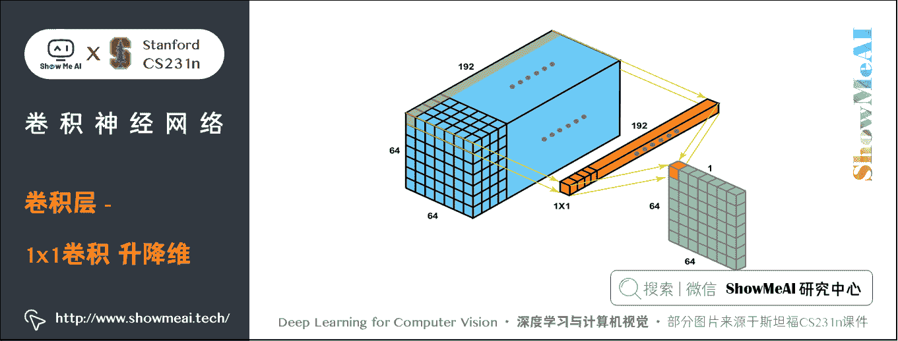

### ② 扩张卷积

大家也会看到扩张卷积（空洞卷积）这样的特殊结构。我们之前看过的卷积层滤波器是连续的，但让滤波器中元素之间有间隙也是合理的设计，这就叫做扩张。这种特殊的卷积可以帮助 CNN 有效扩大感受野。

如下图为普通卷积和空洞卷积的动图对比：


## 4.2 池化层（Pooling Layer，POOL Layer）

### 1) 概述

通常，在连续的卷积层之间会周期性地插入一个**池化层**。它的**作用是逐渐降低数据体的空间（宽、高）尺寸，这样的话就能减少网络中参数的数量**，使得计算资源耗费变少，也能有效控制过拟合。

池化层最常用的是 MAX 操作，对输入数据体的每一个深度切片独立进行操作，改变它的空间尺寸。最常见的形式是使用尺寸 2 × 2 2 \times 2 2×2 的滤波器，以步长为 2 2 2 来对每个深度切片进行**降采样**，将其中 B 75 % 75\% 75% 的激活信息都丢掉。每个 MAX 操作是从 4 4 4 个数字中取最大值（也就是在深度切片中某个 2 × 2 2 \times 2 2×2 的区域）。**深度方向保持不变**，不进行降采样。

池化层也不用零填充，并且池化滤波器间一般没有重叠，步长等于滤波器尺寸。

### 2) 池化层的性质

*   输入数据体尺寸： W 1 × H 1 × D 1 W_1 \times H_1 \times D_1 W1​×H1​×D1​
*   有两个超参数：池化尺寸 F F F ，一般为 2 2 2、 3 3 3；步长 S S S ，一般为 2 2 2。实际上 m a x max max 池化层一般只有两种超参数设置方式： F = 3 F = 3 F=3， S = 2 S = 2 S=2 ，叫做重叠汇聚（overlapping pooling）；另一种更常用的是 F = 2 F = 2 F=2， S = 2 S = 2 S=2
*   输出数据体尺寸： W 2 × H 2 × D 2 W_2 \times H_2 \times D_2 W2​×H2​×D2​ ，其中：

    *   W 2 = ( W 1 − F ) / S + 1 W_2 = (W_1 - F)/S + 1 W2​=(W1​−F)/S+1
    *   H 2 = ( H 1 − F ) / S + 1 H_2 = (H_1 - F)/S + 1 H2​=(H1​−F)/S+1
    *   D 2 = D 1 D_2 = D_1 D2​=D1​ 
*   因为对输入进行的是固定函数计算，所以没有引入参数。此外，在池化层中很少使用零填充。

### 3) 池化方式

除了最大池化，池化单元还可以使用其他的函数，比如平均池化（average pooling）或 L2 范式池化（L2-norm pooling）。平均池化历史上比较常用，但是现在已经很少使用了。

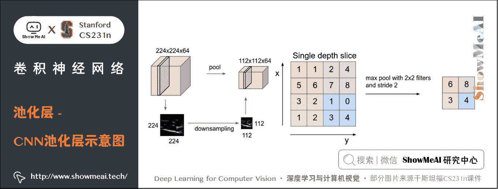

池化层在输入数据体的每个深度切片上，独立地对其进行空间上（高度、宽度）的降采样。

*   图片**左边**：本例中，输入数据体尺寸 [ 224 × 224 × 64 ] [224 \times 224 \times 64] [224×224×64] 被降采样到了 [ 112 × 112 × 64 ] [112 \times 112 \times 64] [112×112×64] ，采取的滤波器尺寸是 2 2 2，步长为 2 2 2，而深度不变。
*   图片**右边**：最常用的降采样操作是取最大值，也就是最大池化，这里步长为 2 2 2，每个取最大值操作是从 4 4 4 个数字中选取（即 2 × 2 2 \times 2 2×2 的方块区域中）。

**反向传播**

*   m a x ( x , y ) max(x,y) max(x,y) 函数的反向传播可以简单理解为将梯度只沿最大的数回传。
*   在前向传播经过池化层的时候，通常会把池中最大元素的索引记录下来（有时这个也叫作**道岔**switches），这样在反向传播的时候梯度路由就很高效。

**一些争议**

*   很多人认为可以不使用池化层。比如在 [Striving for Simplicity: The All Convolutional Net](https://arxiv.org/abs/1412.6806) 一文中，提出使用一种只有重复的卷积层组成的结构，不再使用池化层，通过在卷积层中使用更大的步长来降低数据体的尺寸。
*   有发现认为，在训练一个良好的生成模型时，弃用池化层也是很重要的。比如变化自编码器（VAEs：variational autoencoders）和生成性对抗网络（GANs：generative adversarial networks）。现在看来，未来的卷积网络结构中，可能会很少使用甚至不使用池化层。

## 4.3 归一化层（Normalization Layer）

在卷积神经网络的结构中，提出了一些归一化层的概念，想法是为了实现在生物大脑中观测到的抑制机制。但是这些层渐渐都不再流行，因为实践证明它们的效果即使存在，也是极其有限的。

对于不同类型的归一化层，可以看看 nAlex Krizhevskyn 的关于 [cuda-convnet library API](https://code.google.com/p/cuda-convnet/wiki/LayerParams#Local_response_normalization_layer_%28same_map%29) 的讨论。

## 4.4 全连接层（Fully-connected Layer，FC Layer）

全连接层，顾名思义，神经元对于前一层中的所有激活数据是全连接的，这个和常规神经网络中一样，通常会把前一层数组拉成一个向量，与 W W W 的每个行向量进行点积，得到每一类的分数。

最后一个池化层输出的结果是数据经过整个网络累计得到的，前几个卷积层可能检测一些比较简单的特征比如边缘，得到边缘图后输入到下一个卷积层，然后进行更复杂的检测，这样层层下来，最后一层的结果可以看成是一组符合模板的激活情况，比较大的值表明之前的所有检测结果都比较大，激活程度高，这样就汇聚了大量的信息。

虽然输出的数据比较简单，但却是非常复杂的滤波器（或特征）激活后的情况，特征在卷积核中体现。

*   第一层卷积网络输出的结果比较复杂，因为第一层的卷积核比较简单，很容易就激活了；
*   最后一层的卷积核非常复杂，所以输出的激活图看起来就会很简单，因为激活比较困难。但是这个激活图却能说明复杂特征的激活程度，用来评分是非常合理的。

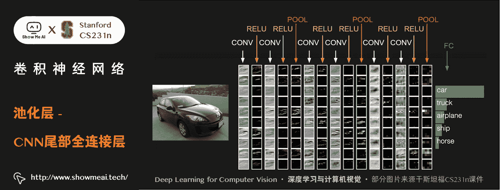

### 1) 全连接层转化为卷积层

全连接层和卷积层之间唯一的不同就是卷积层中的神经元只与输入数据中的一个局部区域连接，并且在同一个深度切片上的神经元共享参数。然而在两类层中，神经元都是计算点积，所以它们的函数形式是一样的。因此，将此两者相互转化是可能的：

**① 对于任一个卷积层，都存在一个能实现和它一样的前向传播函数的全连接层**。

*   权重矩阵是一个巨大的矩阵，除了某些特定块（这是因为有局部连接），其余部分都是零。而在其中大部分块中，元素都是相等的（因为参数共享）。

**② 反过来，任何全连接层都可以被转化为卷积层**。

*   比如，一个 K = 4096 K = 4096 K=4096（即有 4096 4096 4096 个类别， W W W 有 4096 4096 4096 个列向量）的全连接层，输入数据体的尺寸是 7 × 7 × 512 7 \times 7 \times 512 7×7×512 ，那么 W 的每个列向量长度为 7 × 7 × 512 7 \times 7 \times 512 7×7×512，全连接之后的输出为 1 × 4096 1 \times 4096 1×4096。
*   这个全连接层可以被等效地看做一个 F = 7 F=7 F=7， P = 0 P=0 P=0， S = 1 S=1 S=1， K = 4096 K=4096 K=4096 的卷积层。换句话说，就是将滤波器的尺寸设置为和输入数据体的尺寸一致也是 7 × 7 × 512 7 \times 7 \times 512 7×7×512，这样两者卷积的结果就是一个实数。又因为有 4096 4096 4096 个滤波器，所以输出将变成 1 × 1 × 4096 1 \times 1 \times 4096 1×1×4096，这个结果就和使用初始的那个全连接层一样了。

两种转换的示意图如下图所示：

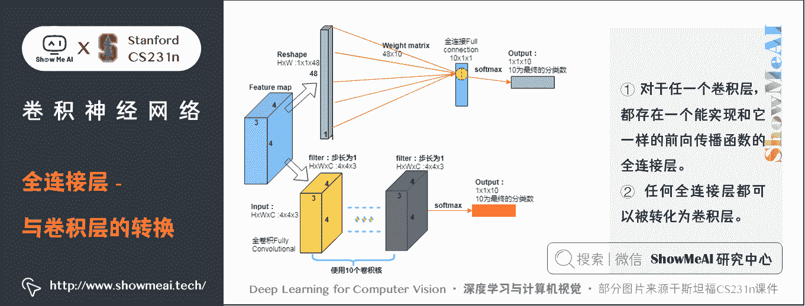

上述两种转换中，全连接层转化为卷积层在实际运用中更加有用。

假设一个卷积神经网络的输入是 224 × 224 × 3 224 \times 224 \times 3 224×224×3 的图像，一系列的卷积层和池化层将图像数据变为尺寸为 7 × 7 × 512 7 \times 7 \times 512 7×7×512 的激活数据体（在 AlexNet 中就是这样，通过使用 5 个池化层来对输入数据进行空间上的降采样，每次尺寸下降一半，所以最终空间尺寸为 224/2/2/2/2/2=7）。

全连接层中，AlexNet 先使用了两个尺寸为 4096 4096 4096 的全连接层，然后又使用了一个有 1000 个神经元的全连接层用于计算分类评分。

我们可以将这 3 个全连接层中的任意一个转化为卷积层：

*   针对第一个连接区域是 [ 7 × 7 × 512 ] [7 \times 7 \times 512] [7×7×512] 的全连接层，令其滤波器尺寸为 7 × 7 × 512 7 \times 7 \times 512 7×7×512， K = 4096 K=4096 K=4096，这样输出数据体就为 [ 1 × 1 × 4096 ] [1 \times 1 \times 4096] [1×1×4096] 了；
*   针对第二个全连接层，令其滤波器尺寸为 1 × 1 × 4096 1 \times 1 \times 4096 1×1×4096， K = 4096 K=4096 K=4096，这样输出数据体仍为 [ 1 × 1 × 4096 ] [1 \times 1 \times 4096] [1×1×4096] ；
*   对最后一个全连接层也做类似的，令其滤波器尺寸为 1 × 1 × 4096 1 \times 1 \times 4096 1×1×4096， K = 1000 K=1000 K=1000，最终输出为[1 \times 1 \times 1000]$ 。

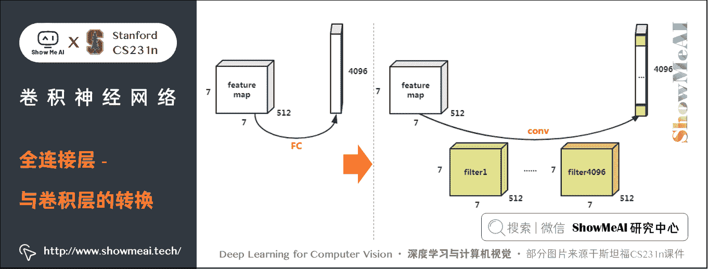

我们注意到，每次类似的变换，都需要把全连接层的权重 W W W 重塑成卷积层中和输入数据尺寸相同的滤波器。这个转化最大的意义是让一些计算更高效：

*   让卷积网络在一张更大的输入图片上滑动（即把一张更大的图片的不同区域都分别带入到卷积网络，得到每个区域的得分），得到多个输出，这样的转化可以让我们在单个前向传播的过程中完成上述的操作。

我们来看看这个例子：

*   将 224 × 224 × 3 224 \times 224 \times 3 224×224×3 的图片经过卷积网络（不包括最后三个全连接层）后得到 7 × 7 × 512 7 \times 7 \times 512 7×7×512 的激活数据体（降采样 5 次，除 32）。然后经过第一个全连接层，该全连接层的神经元需要 7 × 7 × 512 7 \times 7 \times 512 7×7×512 个参数。

*   如果换成一张 384 × 384 384 \times 384 384×384 的大图片经过同样的网络（不包括最后三个全连接层）等效输出尺寸为 12 × 12 × 512 12 \times 12 \times 512 12×12×512（ 384 / 32 = 12 384/32 = 12 384/32=12），如果直接用来通过全连接层，由于尺寸不同，会无法通过。

    *   这时就需要把 384 × 384 384 \times 384 384×384 的图片切成 6 × 6 6 \times 6 6×6 个 224 × 224 224 \times 224 224×224 的小图像依次通过卷积网络，这样全连接层之前的输出为 36 个 7 × 7 × 512 7 \times 7 \times 512 7×7×512 的激活数据体，远远大于 12 × 12 × 512 12 \times 12 \times 512 12×12×512，所以由于全连接层的存在，导致大量的重复运算。
    *   但是如果将 3 个全连接层转化来的 3 个卷积层，就不会存在尺寸的问题， 384 × 384 384 \times 384 384×384 的图片可以直接通过转化后的卷积网络，最终得到 6 × 6 × 1000 6 \times 6 \times 1000 6×6×1000 的输出（因为 ( 12 − 7 ) / 1 + 1 = 6 (12 - 7)/1 + 1 = 6 (12−7)/1+1=6 或 ( 384 − 224 ) / 32 + 1 = 6 (384-224)/32+1 = 6 (384−224)/32+1=6）。这样我们可以在 384 × 384 384 \times 384 384×384 图像上一次得到 6 × 6 6 \times 6 6×6 个分类得分数组，而不是独立的得到 36 个大小为 [ 1 × 1 × 1000 ] [1 \times 1 \times 1000] [1×1×1000] 的得分数组，大大节省计算量。

# 5.卷积神经网络层的排列与尺寸设置

## 5.1 层的排列规律

卷积神经网络通常是由三种层构成：卷积层，池化层和全连接层（简称 FC）。ReLU 激活函数也应该算是一层，它逐元素地进行激活函数操作。

卷积神经网络最常见的形式就是将一些卷积层和 ReLU 层放在一起，其后紧跟池化层，然后重复如此直到图像在空间上被缩小到一个足够小的尺寸，在某个地方过渡成成全连接层也较为常见。最后的全连接层得到输出，比如分类评分等。

换句话说，最常见的卷积神经网络结构如下：

```py
INPUT → [[CONV → RELU]*N → POOL?]*M → [FC → RELU]*K → FC 
```

其中 `*` 指的是重复次数，`POOL?` 指的是一个可选的池化层。其中 N > = 0 N >=0 N>=0（通常 N < = 3 N<=3 N<=3）， M > = 0 M>=0 M>=0， K > = 0 K>=0 K>=0（通常 K < 3 K<3 K<3）。

例如，下面是一些常见的网络结构规律：

*   INPUT → FC，实现一个线性分类器，此处 N = M = K = 0 N = M = K = 0 N=M=K=0；

*   INPUT → CONV → RELU → FC；

*   INPUT → [CONV → RELU → POOL]*2 → FC → RELU → FC，此时在每个池化层前只有一个卷积层；

*   INPUT → [CONV → RELU → CONV → RELU → POOL]*3 → [FC → RELU]*2 → FC，此时每个池化层前有两个卷积层，这个思路适用于更大更深的网络，因为在执行具有破坏性的池化操作前，多重的卷积层可以从输入数据中学习到更多的复杂特征。

**经验**：**几个小滤波器卷积层的组合比一个大滤波器卷积层好**。

假设你一层一层地重叠了 3 3 3 个 3 × 3 3 \times 3 3×3 的卷积层（层与层之间有非线性激活函数）。

*   第一个卷积层中的每个神经元都对输入数据体有一个 3 × 3 3 \times 3 3×3 的感受野
*   第二个卷积层上的神经元对第一个卷积层有一个 3 × 3 3 \times 3 3×3 的感受野，也就是对输入数据体有 5 × 5 5 \times 5 5×5 的感受野（32-30-28）。
*   在第三个卷积层上的神经元对第二个卷积层有 3 × 3 3 \times 3 3×3 的感受野，也就是对输入数据体有 7 × 7 7 \times 7 7×7 的感受野。

下图是第 1 层和第 2 层卷积层的堆叠感受野示意图

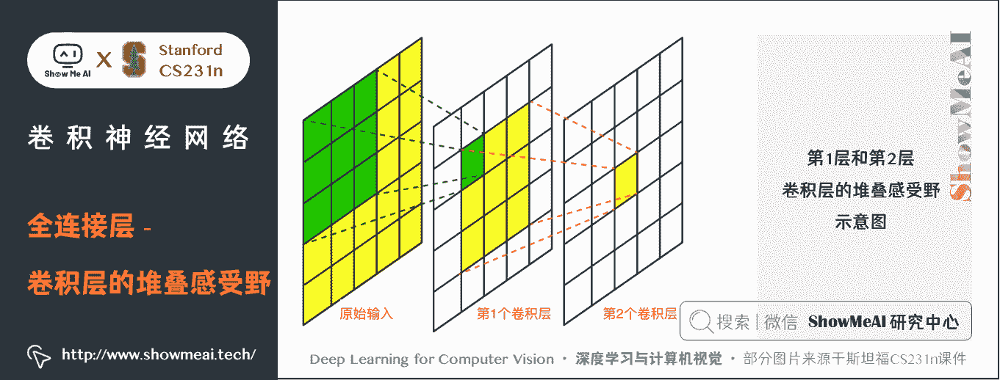

假设不采用这 3 个 3 × 3 3 \times 3 3×3 的卷积层，而是使用一个单独的有 7 × 7 7 \times 7 7×7 的感受野的卷积层，那么所有神经元的感受野也是 7 × 7 7 \times 7 7×7，但是就有一些缺点：

*   ① 多个卷积层与非线性的激活层交替的结构，比单一卷积层的结构更能提取出深层的更好的特征。
*   ② 假设所有的数据有 C C C 个通道，即输入输出数据深度均为 C C C，那么单独的 7 × 7 7 \times 7 7×7 卷积层将会包含 C × ( 7 × 7 × C ) = 49 C 2 C \times (7 \times 7 \times C) = 49 C² C×(7×7×C)=49C2 个参数，而 3 个 3 × 3 3 \times 3 3×3 的卷积层的组合仅有 3 × ( C × ( 3 × 3 × C ) ) = 27 C 2 3 \times (C \times (3 \times 3 \times C)) = 27 C² 3×(C×(3×3×C))=27C2 个参数。

直观说来，最好选择带有小滤波器的卷积层组合，而不是用一个带有大的滤波器的卷积层。前者可以表达出输入数据中更多个强力特征，使用的参数也更少。

唯一的不足是，在进行反向传播时，中间的卷积层可能会导致占用更多的内存。

## 5.2 层的尺寸设置规律

### 1) 输入层

原始输入图像，经常设置为 2 N 2^N 2N 形式。常用数字包括 32（比如 CIFAR-10），64，96（比如 STL-10）或 224（比如 ImageNet 卷积神经网络）、384 和 512。

### 2) 卷积层

*   应该使用小尺寸滤波器（比如 3 × 3 3 \times 3 3×3 或最多 5 × 5 5 \times 5 5×5），使用步长 S = 1 S=1 S=1。
*   要对输入数据进行零填充，这样卷积层就不会改变输入数据在空间维度上的尺寸。比如
    *   当 F = 3 F=3 F=3，那就使用 P = 1 P=1 P=1 来保持输入尺寸；
    *   当 F = 5 F=5 F=5，那就使用 P = 2 P=2 P=2 来保持输入尺寸。
    *   一般对于任意 F F F，当 P = ( F − 1 ) / 2 P=(F-1)/2 P=(F−1)/2 的时候能保持输入尺寸。
*   如果必须使用更大的滤波器尺寸（比如 7 × 7 7 \times 7 7×7 之类），通常只用在第一个输入原始图像的卷积层上。

### 3) 池化层

*   负责对输入数据的空间维度进行降采样。
*   最常用的设置是用用 2 × 2 2 \times 2 2×2 感受野（即 F = 2 F=2 F=2 ）的最大值汇聚，步长为 2 2 2（ S = 2 S=2 S=2）。注意这一操作将会把输入数据中 75% 的激活数据丢弃（因为对宽度和高度都进行了 2 的降采样）。
*   另一个不那么常用的设置是使用 3 × 3 3 \times 3 3×3 的感受野，步长为 2。最大值汇聚的感受野尺寸很少有超过 3 的，因为汇聚操作过于激烈，易造成数据信息丢失，这通常会导致算法性能变差。

在某些案例（尤其是早期的卷积神经网络结构）中，基于前面的各种规则，内存的使用量迅速飙升。

*   例如，使用 64 个尺寸为 3 × 3 3 \times 3 3×3 的滤波器对 224 × 224 × 3 224 \times 224 \times 3 224×224×3 的图像进行卷积，零填充为 1，得到的激活数据体尺寸是 [ 224 × 224 × 64 ] [224 \times 224 \times 64] [224×224×64] 。这个数量就是一千万的激活数据，或者就是 72MB 的内存（每张图就是这么多，激活函数和梯度都是）。

因为 GPU 通常因为内存导致性能瓶颈，所以做出一些妥协是必须的。在实践中，人们倾向于在网络的第一个卷积层做出妥协。

*   例如，可以妥协可能是在第一个卷积层使用步长为 2 2 2，尺寸为 7 × 7 7 \times 7 7×7 的滤波器（比如在 ZFnet 中）。在 AlexNet 中，滤波器的尺寸的 11 × 11 11 \times 11 11×11，步长为 4。

# 6.卷积神经网络经典案例

这些网络的详细结构会在后续再展开介绍。

> 关于详细的下述网络结构讲解也可以阅读[ShowMeAI](http://www.showmeai.tech/)的的[**深度学习教程 | 吴恩达专项课程 · 全套笔记解读**](http://www.showmeai.tech/tutorials/35)中的文章[**经典 CNN 网络实例详解**](http://www.showmeai.tech/article-detail/222)

## 6.1 LeNet

第一个成功的卷积神经网络应用，是 Yann LeCun 在上世纪 90 年代实现的。当然，最著名还是被应用在识别数字和邮政编码等的 [**LeNet**](http://yann.lecun.com/exdb/publis/pdf/lecun-98.pdf) 结构。

## 6.2 AlexNet

[AlexNet](http://papers.nips.cc/paper/4824-imagenet-classification-with-deep-convolutional-neural-networks) 卷积神经网络由 Alex Krizhevsky，Ilya Sutskever 和 Geoff Hinton 实现。AlexNet 在 2012 年的 [ImageNet ILSVRC 竞赛](http://www.image-net.org/challenges/LSVRC/2014/) 中夺冠，性能远远超出第二名（16%的 top5 错误率，第二名是 26% 的 top5 错误率）。这个网络的结构和 LeNet 非常类似，但是更深更大，并且使用了层叠的卷积层来获取特征。

## 6.3 ZF Net

Matthew Zeiler 和 Rob Fergus 发明的网络在 2013 年 ILSVRC 比赛中夺冠，它被称为 [ZFNet](https://arxiv.org/abs/1311.2901)（Zeiler & Fergus Net 的简称）。它通过修改结构中的超参数来实现对 AlexNet 的改良，具体说来就是增加了中间卷积层的尺寸，让第一层的步长和滤波器尺寸更小。

## 6.4 GoogLeNet

2014 年 ILSVRC 的胜利者是谷歌的 [Szeged 等](https://arxiv.org/abs/1409.4842) 实现的卷积神经网络。它主要的贡献就是实现了一个*奠基模块*，它能够显著地减少网络中参数的数量（AlexNet 中有 60M，该网络中只有 4M）。以及，GoogLeNet 没有在卷积神经网络的最后使用全连接层，而是使用了一个平均池化，把大量不是很重要的参数都去除掉了。GooLeNet 还有几种改进的版本，最新的一个是 [Inception-v4](https://arxiv.org/abs/1602.07261)。

## 6.5 VGGNet

[VGGNet](http://www.robots.ox.ac.uk/~vgg/research/very_deep/) 是 Karen Simonyan 和 Andrew Zisserman 实现的卷积神经网络，在 2014 年 ILSVRC 取得第二名的成绩。它主要的贡献是展示出网络的深度是算法优良性能的关键部分。他们最好的网络包含了 16 个卷积/全连接层。网络的结构非常一致，从头到尾全部使用的是 3 × 3 3 \times 3 3×3 的卷积和 2 × 2 2 \times 2 2×2 的池化。

## 6.6 ResNet

[残差网络](https://arxiv.org/abs/1512.03385)（Residual Network）是 2015 年 ILSVRC 的胜利者，由何恺明等实现。它使用了特殊的**跳跃链接**，大量使用了 [批量归一化](https://arxiv.org/abs/1502.03167)（batch normalization）。这个结构同样在最后没有使用全连接层。

## 6.7 计算上的考量

在构建卷积神经网络结构时，最大的瓶颈是内存瓶颈。大部分现代 GPU 的内存都不太大。要注意三种内存占用来源：

### 1) 来自**中间数据体**尺寸

卷积神经网络中的每一层中都有激活数据体的原始数值，以及损失函数对它们的梯度（和激活数据体尺寸一致）。通常，大部分激活数据都是在网络中靠前的层中（比如第一个卷积层）。

*   在训练时，这些数据需要放在内存中，因为反向传播的时候还会用到。
*   在测试时可以优化：让网络在测试运行时候每层都只存储当前的激活数据，然后丢弃前面层的激活数据，这样就能减少巨大的激活数据量。

### 2) 来自**参数**尺寸

*   即整个网络的参数的数量、反向传播时它们的梯度值，以及使用 momentum、Adagrad 或 RMSProp 等方法进行最优化时的每一步计算缓存。
*   因此，存储参数向量的内存通常需要在参数向量的容量基础上乘以 3 或者更多。

### 3) 卷积神经网络实现还有各种零散的内存占用，比如成批的训练数据，扩充的数据等

一旦对于所有这些数值的数量有了一个大略估计（包含激活数据，梯度和各种杂项），把这个值乘以 4，得到原始的字节数（因为每个浮点数占用 4 个字节，如果是双精度浮点数那就是占用 8 个字节），然后多次除以 1024 分别得到占用内存的 KB、MB，最后是 GB 计量。如果你的网络有内存问题，一个常用的方法是降低批尺寸（batch size），因为绝大多数的内存都是被激活数据消耗掉了。

## 6.8 拓展参考

[ConvNetJS CIFAR-10 demo](https://cs.stanford.edu/people/karpathy/convnetjs/demo/cifar10.html) 可以在服务器上实时地调试卷积神经网络的结构，观察计算结果。

# 7.拓展学习

**可以点击 [B 站](https://www.bilibili.com/video/BV1g64y1B7m7?p=5) 查看视频的【双语字幕】版本**

[`player.bilibili.com/player.html?aid=759478950&page=5`](https://player.bilibili.com/player.html?aid=759478950&page=5)

【字幕+资料下载】斯坦福 CS231n | 面向视觉识别的卷积神经网络 (2017·全 16 讲)

*   [【课程学习指南】斯坦福 CS231n | 深度学习与计算机视觉](http://blog.showmeai.tech/cs231n/)
*   [【字幕+资料下载】斯坦福 CS231n | 深度学习与计算机视觉 (2017·全 16 讲)](https://www.bilibili.com/video/BV1g64y1B7m7)
*   [【CS231n 进阶课】密歇根 EECS498 | 深度学习与计算机视觉](http://blog.showmeai.tech/eecs498/)
*   [【深度学习教程】吴恩达专项课程 · 全套笔记解读](http://www.showmeai.tech/tutorials/35)
*   [【Stanford 官网】CS231n: Deep Learning for Computer Vision](http://cs231n.stanford.edu/)

# 8.要点总结

*   卷积神经网络的历史
*   卷积神经网络与常规神经网络的对比；
*   CNN 卷积层、池化层、ReLU 层、全连接层；
*   CNN 局部连接、参数共享、最大池化、步长、零填充 、数据体尺寸
*   CNN 层的规律与尺寸设置
*   CNN 经典案例

# [ShowMeAI](http://www.showmeai.tech) 斯坦福 CS231n 全套解读

*   [深度学习与计算机视觉教程(1) | CV 引言与基础 @CS231n](http://www.showmeai.tech/article-detail/260)
*   [深度学习与计算机视觉教程(2) | 图像分类与机器学习基础 @CS231n](http://www.showmeai.tech/article-detail/261)
*   [深度学习与计算机视觉教程(3) | 损失函数与最优化 @CS231n](http://www.showmeai.tech/article-detail/262)
*   [深度学习与计算机视觉教程(4) | 神经网络与反向传播 @CS231n](http://www.showmeai.tech/article-detail/263)
*   [深度学习与计算机视觉教程(5) | 卷积神经网络 @CS231n](http://www.showmeai.tech/article-detail/264)
*   [深度学习与计算机视觉教程(6) | 神经网络训练技巧 (上) @CS231n](http://www.showmeai.tech/article-detail/265)
*   [深度学习与计算机视觉教程(7) | 神经网络训练技巧 (下) @CS231n](http://www.showmeai.tech/article-detail/266)
*   [深度学习与计算机视觉教程(8) | 常见深度学习框架介绍 @CS231n](http://www.showmeai.tech/article-detail/267)
*   [深度学习与计算机视觉教程(9) | 典型 CNN 架构 (Alexnet, VGG, Googlenet, Restnet 等) @CS231n](http://www.showmeai.tech/article-detail/268)
*   [深度学习与计算机视觉教程(10) | 轻量化 CNN 架构 (SqueezeNet, ShuffleNet, MobileNet 等) @CS231n](http://www.showmeai.tech/article-detail/269)
*   [深度学习与计算机视觉教程(11) | 循环神经网络及视觉应用 @CS231n](http://www.showmeai.tech/article-detail/270)
*   [深度学习与计算机视觉教程(12) | 目标检测 (两阶段, R-CNN 系列) @CS231n](http://www.showmeai.tech/article-detail/271)
*   [深度学习与计算机视觉教程(13) | 目标检测 (SSD, YOLO 系列) @CS231n](http://www.showmeai.tech/article-detail/272)
*   [深度学习与计算机视觉教程(14) | 图像分割 (FCN, SegNet, U-Net, PSPNet, DeepLab, RefineNet) @CS231n](http://www.showmeai.tech/article-detail/273)
*   [深度学习与计算机视觉教程(15) | 视觉模型可视化与可解释性 @CS231n](http://www.showmeai.tech/article-detail/274)
*   [深度学习与计算机视觉教程(16) | 生成模型 (PixelRNN, PixelCNN, VAE, GAN) @CS231n](http://www.showmeai.tech/article-detail/275)
*   [深度学习与计算机视觉教程(17) | 深度强化学习 (马尔可夫决策过程, Q-Learning, DQN) @CS231n](http://www.showmeai.tech/article-detail/276)
*   [深度学习与计算机视觉教程(18) | 深度强化学习 (梯度策略, Actor-Critic, DDPG, A3C) @CS231n](http://www.showmeai.tech/article-detail/277)

# [ShowMeAI](http://www.showmeai.tech) 系列教程推荐

*   [大厂技术实现：推荐与广告计算解决方案](http://www.showmeai.tech/tutorials/50)
*   [大厂技术实现：计算机视觉解决方案](http://www.showmeai.tech/tutorials/51)
*   [大厂技术实现：自然语言处理行业解决方案](http://www.showmeai.tech/tutorials/52)
*   [图解 Python 编程：从入门到精通系列教程](http://www.showmeai.tech/tutorials/56)
*   [图解数据分析：从入门到精通系列教程](http://www.showmeai.tech/tutorials/33)
*   [图解 AI 数学基础：从入门到精通系列教程](http://www.showmeai.tech/tutorials/83)
*   [图解大数据技术：从入门到精通系列教程](http://www.showmeai.tech/tutorials/84)
*   [图解机器学习算法：从入门到精通系列教程](http://www.showmeai.tech/tutorials/34)
*   [机器学习实战：手把手教你玩转机器学习系列](http://www.showmeai.tech/tutorials/41)
*   [深度学习教程：吴恩达专项课程 · 全套笔记解读](http://www.showmeai.tech/tutorials/35)
*   [自然语言处理教程：斯坦福 CS224n 课程 · 课程带学与全套笔记解读](http://www.showmeai.tech/tutorials/36)
*   [深度学习与计算机视觉教程：斯坦福 CS231n · 全套笔记解读](http://www.showmeai.tech/tutorials/37)

