# 深度学习与计算机视觉教程(7) | 神经网络训练技巧 (下)（CV 通关指南·完结）

> 原文：[`blog.csdn.net/ShowMeAI/article/details/125025085`](https://blog.csdn.net/ShowMeAI/article/details/125025085)


*   作者：[韩信子](https://github.com/HanXinzi-AI)@[ShowMeAI](http://www.showmeai.tech/)
*   [教程地址](http://www.showmeai.tech/tutorials/37)：[`www.showmeai.tech/tutorials/37`](http://www.showmeai.tech/tutorials/37)
*   [本文地址](http://www.showmeai.tech/article-detail/266)：[`www.showmeai.tech/article-detail/266`](http://www.showmeai.tech/article-detail/266)
*   声明：版权所有，转载请联系平台与作者并注明出处
*   **收藏[ShowMeAI](http://www.showmeai.tech/)查看更多精彩内容**

* * *


本系列为 **斯坦福 CS231n** 《深度学习与计算机视觉(Deep Learning for Computer Vision)》的全套学习笔记，对应的课程视频可以在 [**这里**](https://www.bilibili.com/video/BV1g64y1B7m7?p=7) 查看。更多资料获取方式见文末。

* * *

# 引言

ShowMeAI 在上一篇 [**深度学习与 CV 教程(6) | 神经网络训练技巧 (上)**](http://www.showmeai.tech/article-detail/265) 介绍了激活函数选择， s i g m o i d sigmoid sigmoid 和 t a n h tanh tanh 都有饱和的问题；权重初始化不能太小也不能太大，最好使用 Xavier 初始化；数据预处理使用减去均值和归一化，线性分类中这两个操作会使分界线不那么敏感，即使稍微转动也可以，神经网络中也对权重的轻微改变没那么敏感，易于优化；也可以使用批量归一化，将输入数据变成单位高斯分布，或者缩放平移；学习过程跟踪损失、准确率；超参数体调优范围由粗到细，迭代次数逐渐增加，使用随机搜索。

## 本篇重点

*   更好的优化
*   正则化
*   迁移学习
*   模型集成

# 1.更好的优化（参数更新）

> 关于优化算法的详细知识也可以对比阅读[ShowMeAI](http://www.showmeai.tech/)的 [**深度学习教程 | 吴恩达专项课程 · 全套笔记解读**](http://www.showmeai.tech/tutorials/35) 中的文章 [**神经网络优化算法**](http://www.showmeai.tech/article-detail/217) 的讲解。

## 1.1 批梯度下降（BGD）

批梯度下降即 batch gradient descent，在训练中每一步迭代都使用训练集的所有内容 { x 1 , ⋯   , x n } \{x_1, \cdots ,x_n\} {x1​,⋯,xn​} 以及每个样本对应的输出 y i y_i yi​，用于计算损失和梯度然后使用梯度下降更新参数。

当在整个数据集上进行计算时，只要学习率足够低，总是能在损失函数上得到非负的进展。参考代码如下（其中 `learning_rate` 是一个超参数）：

```py
# 普通梯度下降
while True:
    weights_grad = evaluate_gradient(loss_fun, data, weights)
    weights += -learning_rate * weights_grad  # 参数更新 
```

如下图为只有两个参数的损失函数，经过不断更新，如果足够幸运，函数最终收敛在红色部分是最低点：

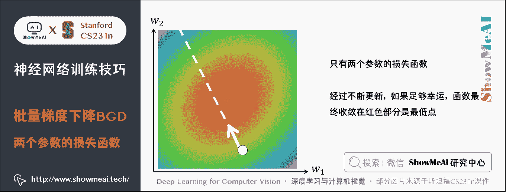

*   **优点**：由于每一步都利用了训练集中的所有数据，因此当损失函数达到最小值以后，能够保证此时计算出的梯度为 0 0 0，能够收敛。因此，使用 BGD 时不需要逐渐减小学习率。
*   **缺点**：随着数据集的增大，运行速度会越来越慢。

## 1.2 随机梯度下降（SGD）

这里的**随机梯度下降**（stochastic gradient descent）其实和之前介绍的 MBGD(minibatch gradient descent)是一个意思，即每次迭代随机抽取一批样本 { x 1 , ⋯   , x m } \{x_1, \cdots ,x_m\} {x1​,⋯,xm​} 及 y i y_i yi​，以此来反向传播计算出梯度，然后向负梯度方向更新参数。

SGD 的优点是训练速度快，对于很大的数据集，也能够以较快的速度收敛。但是实际应用 SGD 会有很多问题：

**① 如果损失函数在一个参数方向下降的快另一个方向下降的慢，这样会导致 「 之字形 」下降到最低点，高维中很普遍**。

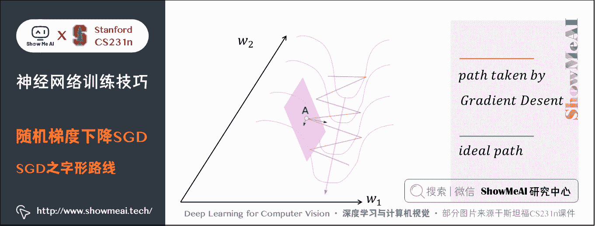

*   上图是一个山沟状的区域，损失最小点沿着蓝色的线方向。考虑表面上的一个点 A 梯度，该点的梯度可以分解为两个分量，一个沿着方向 w 1 w_1 w1​，另一个沿着 w 2 w_2 w2​。
*   梯度在 w 1 w_1 w1​ 方向上的分量要大得多，因为在 w 1 w_1 w1​ 方向上每走一步都比在 w 2 w_2 w2​ 方向损失值下降的多，虽然最小值在 w 2 w_2 w2​ 方向上。这样实际走一步在 w 1 w_1 w1​ 方向走的多， w 2 w_2 w2​ 走得少，就会导致在这个沟里反复震荡，「之字形」前往最小值点。

**② 如果损失函数有局部极小值和鞍点（既不是极大值也不是极小值的临界点）时，此时的梯度为 0 0 0，参数更新会卡住，或在极小值附近震荡**。

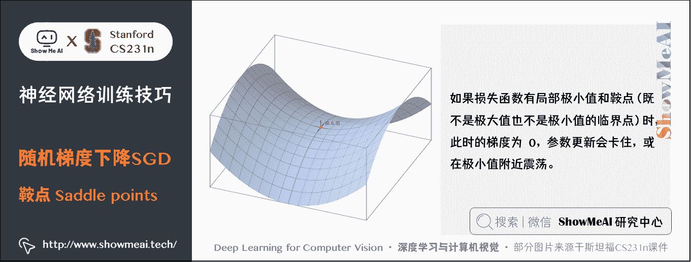

*   在高维数据中，鞍点的存在是个更普遍也更大的问题，极小值每个梯度方向损失都会变大，而鞍点有的方向变大，有的减小，接近鞍点时更新缓慢。

**③ SGD 具有随机性，我们的梯度来自小批量数据（使用全部数据计算真实梯度速度太慢了），可能会有噪声，这样梯度下降的路线会很曲折，收敛的慢**。

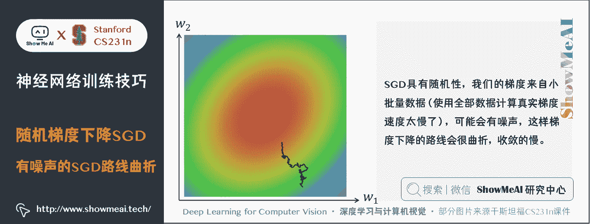

下面有一些「**小批量梯度下降**」基础上的优化算法。

## 1.3 动量（Momentum）更新

带动量的更新方法在深度网络上几乎总能得到更好的收敛速度。

损失值可以理解为是山的高度（因此高度势能是 U = m g h U=mgh U=mgh），用随机数字初始化参数等同于在某个位置给质点设定初始速度为 0 0 0 ，这样最优化过程可以看做是参数向量（即质点）在地形上滚动的过程。

质点滚动的力来源于高度势能 F = − ∇ U F = - \nabla U F=−∇U，即损失函数的负梯度（想象损失函数为凸函数，梯度为正时质点会向负方向滚动，对应参数减小；损失函数梯度为负时会向正方向滚动对应参数增大）。又因为 F = m a F=ma F=ma，质点的加速度和负梯度成正比，所以负梯度方向速度是逐渐增加的。

在 SGD 中，梯度直接影响质点的位置，在梯度为 0 0 0 的地方，位置就不会更新了；而在这里，梯度作为作用力影响的是速度，速度再改变位置，即使梯度为 0 0 0 ，但之前梯度累积下来的速度还在，一般而言，一个物体的动量指的是这个物体在它运动方向上保持运动的趋势，所以此时质点还是有动量的，位置仍然会更新，这样就可以冲出局部最小值或鞍点，继续更新参数。但是必须要给质点的速度一个衰减系数或者是摩擦系数，不然因为能量守恒，质点在谷底会不停的运动。

也就是说，参数更新的方向，不仅由当前点的梯度方向决定，而且由此前累积的梯度方向决定。

计算过程也是每次迭代随机抽取一批样本 x 1 , ⋯   , x m {x_1, \cdots ,x_m} x1​,⋯,xm​ 及 y i y_i yi​，计算梯度和损失，并更新速度和参数（假设质量为 1，v 即动量）：

```py
v=0
while True:
    dW =  compute_gradient(W, X_train, y_train)
    v = rho * v - learning_rate * dW
    W += v 
```

*   `rho` 表示每回合速度 `v` 的衰减程度，每次迭代得到的梯度都是 `dW` 那么最后得到的 `v` 的稳定值为： − l e a r n i n g r a t e ∗ d w 1 − r h o \frac{-learning_{rate} \ast dw}{1-rho} 1−rho−learningrate​∗dw​
*   `rho` 为 0 0 0 时表示 SGD，`rho` 一般取值 0.5 0.5 0.5、 0.9 0.9 0.9、 0.99 0.99 0.99，对应学习速度提高两倍、10 倍和 100 倍。

动量更新可以很好的解决上述 SGD 的几个问题：

*   由于参数的更新要累积之前的梯度，所以如果我们分别累加这些梯度的两个分量，那么 w 1 w_1 w1​ 方向上的分量将互相抵消，而 w 2 w_2 w2​ 方向上的分量得到了加强。 但是由于衰减系数，不可能完全抵消，但是已经可以加速通过，很大程度缓解了「之字形」收敛慢的问题。这也是减少震荡的原理。

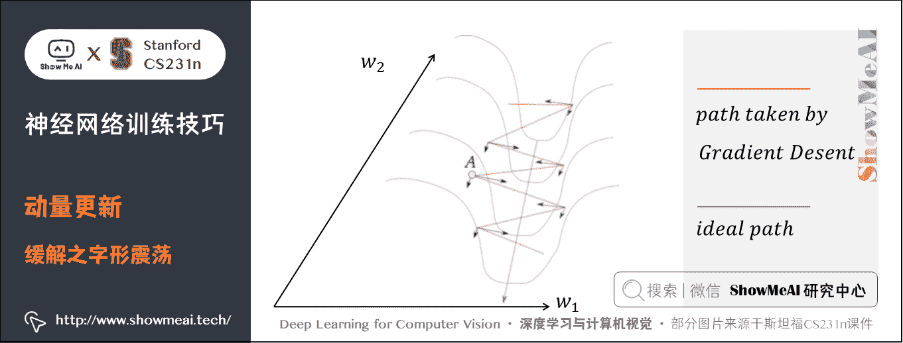

*   局部最小值和鞍点由于还有之前的速度，会加速冲过去。

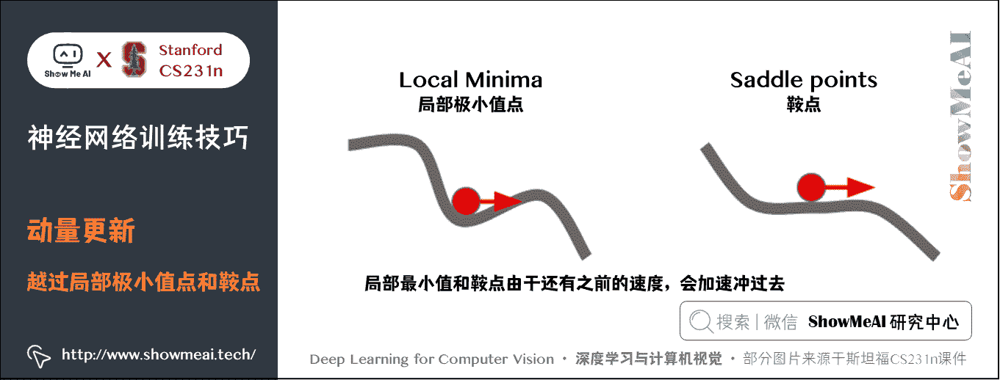

*   面对梯度变化比较大的方向，即一些噪声，由于此时质点还有比较大的速度，这时的反方向需要先将速度减小为 0 0 0 才能改变参数更新方向，由于速度是累加的，所以个别的噪声的影响不会那么大，就可以平滑快速的收敛。

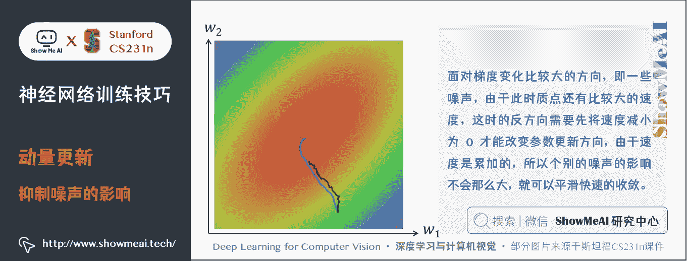

## 1.4 Nesterov 动量

Nesterov 动量与普通动量有些许不同，最近变得比较流行。在理论上对于凸函数它能得到更好的收敛，在实践中也确实比标准动量表现更好一些。

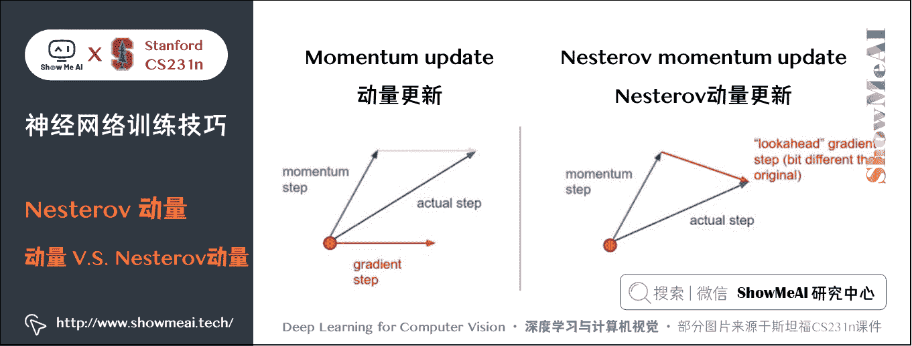

*   **普通的动量更新**在某一点处有一个速度，然后计算该点的梯度，实际的更新方向会根据速度方向和梯度方向做一个权衡。
*   **Nesterov 动量更新**是既然我们知道动量将会将质点带到一个新的位置（即向前看），我们就不要在原来的位置计算梯度了，在这个「向前看」的地方计算梯度，更新参数。

这样代码变为：

```py
v=0
while True:
    W_ahead = W + rho * v
    dW_ahead =  compute_gradient(W_ahead, X_train, y_train)
    v = rho * v - learning_rate * dW_ahead
    W += v 
```

动量还是之前的动量，只是梯度变成将来的点的梯度。

而在实践中，人们更喜欢和普通 SGD 或普通的动量方法一样简单的表达式。通过对 `W_ahead = W + rho * v` 使用变量变换进行改写是可以做到的，然后用 `W_ahead` 而不是 `W` 来表示上面的更新。

也就是说，实际存储的参数总是向前一步的那个版本。 代码如下：

```py
v=0
while True:
    pre_v = v
    dW =  compute_gradient(W, X_train, y_train)
    v = rho * v - learning_rate * dW
    W += -rho * pre_v + (1 + rho) * v 
```

推导过程如下：

最初的 Nesterov 动量可以用下面的数学表达式代替：

v t + 1 = ρ v t − α ∇ f ( x t + ρ v t ) v_{t+1}=\rho v_t - \alpha \nabla f(x_t+\rho v_t) vt+1​=ρvt​−α∇f(xt​+ρvt​)

x t + 1 = x t + v t + 1 x_{t+1}=x_t+v_{t+1} xt+1​=xt​+vt+1​

现在令 x ~ t = x t + ρ v t \tilde{x}_t =x_t+\rho v_t x~t​=xt​+ρvt​，则：

v t + 1 = ρ v t − α ∇ f ( x t ~ ) v_{t+1}=\rho v_t-\alpha \nabla f(\tilde{x_t}) vt+1​=ρvt​−α∇f(xt​~​)

x ~ t + 1 = x t + 1 + ρ v t + 1 = x t + v t + 1 + ρ v t + 1 = x ~ t − ρ v t + v t + 1 + ρ v t + 1 \begin{aligned} \tilde{x}_{t+1} &=x_{t+1}+\rho v_{t+1}\\ &=x_{t}+v_{t+1}+\rho v_{t+1}\\ &=\tilde{x}_{t}-\rho v_{t}+v_{t+1}+\rho v_{t+1} \end{aligned} x~t+1​​=xt+1​+ρvt+1​=xt​+vt+1​+ρvt+1​=x~t​−ρvt​+vt+1​+ρvt+1​​

从而有：

x ~ t + 1 = x t ~ − ρ v t + ( ρ + 1 ) v t + 1 \tilde{x}_{t+1}=\tilde{x_t}-\rho v_t+(\rho+1)v_{t+1} x~t+1​=xt​~​−ρvt​+(ρ+1)vt+1​

*   只更新 v t v_t vt​ 和 x ~ t \tilde{x}_t x~t​ 即可

示意图如下：


## 1.5 自适应梯度算法（Adagrad）

上面提到的方法对于所有参数都使用了同一个更新速率，但是同一个更新速率不一定适合所有参数。如果可以针对每个参数设置各自的学习率可能会更好，根据情况进行调整，**Adagrad**是一个由 [Duchi 等](http://jmlr.org/papers/v12/duchi11a.html) 提出的适应性学习率算法。

代码如下：

```py
eps = 1e-7
grad_squared =  $0$ 
while True:
    dW = compute_gradient(W)
    grad_squared += dW * dW
    W -= learning_rate * dW / (np.sqrt(grad_squared) + eps) 
```

AdaGrad 其实很简单，就是将每一维各自的历史梯度的平方叠加起来，然后更新的时候除以该历史梯度值即可。

变量 `grad_squared` 的尺寸和梯度矩阵的尺寸是一样的，用于累加每个参数的梯度的平方和。这个将用来归一化参数更新步长，归一化是逐元素进行的。`eps`（一般设为 `1e-4` 到 `1e-8` 之间）用于平滑，防止出现除以 0 0 0 的情况。

*   **优点**：能够实现参数每一维的学习率的自动更改，如果某一维的梯度大，那么学习速率衰减的就快一些，延缓网络训练；如果某一维的梯度小，那么学习速率衰减的就慢一些，网络训练加快。
*   **缺点**：如果梯度累加的很大，学习率就会变得非常小，就会陷在局部极小值点或提前停（ RMSProp 算法可以很好的解决该问题）。

## 1.6 均方根支柱算法（RMSProp）

RMSProp 优化算法也可以自动调整学习率，并且 RMSProp 为每个参数选定不同的学习率。

RMSProp 算法在 AdaGrad 基础上引入了衰减因子，RMSProp 在梯度累积的时候，会对「过去」与「现在」做一个平衡，通过超参数 `decay_rate` 调节衰减量，常用的值是 [ 0.9 , 0.99 , 0.999 ] [0.9,0.99,0.999] [0.9,0.99,0.999]。其他不变，只是 `grad_squared` 类似于动量更新的形式：

```py
grad_squared =  decay_rate * grad_squared + (1 - decay_rate) * dx * dx 
```

相比于 AdaGrad，这种方法很好的解决了训练过早结束的问题。和 Adagrad 不同，其更新不会让学习率单调变小。

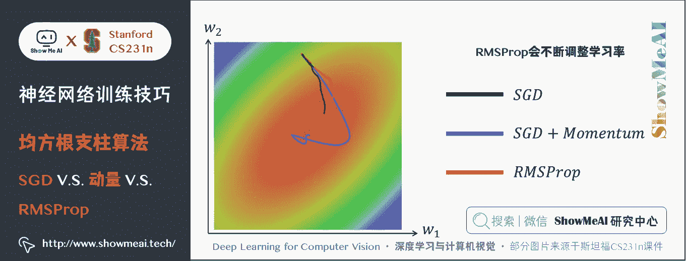

## 1.7 自适应-动量优化（Adam）

动量更新在 SGD 基础上增加了一阶动量，AdaGrad 和 RMSProp 在 SGD 基础上增加了二阶动量。把一阶动量和二阶动量结合起来，就得到了 Adam 优化算法：**Adaptive + Momentum**。

代码如下：

```py
eps = 1e-8
first_moment = 0  # 第一动量，用于累积梯度，加速训练
second_moment = 0  # 第二动量，用于累积梯度平方，自动调整学习率
while True:
    dW = compute_gradient(W)
    first_moment = beta1 * first_moment + (1 - beta1) * dW  # Momentum
    second_moment = beta2 * second_moment + (1 - beta2) * dW * dW  # AdaGrad / RMSProp
    W -= learning_rate * first_moment / (np.sqrt(second_moment) + eps) 
```

上述参考代码看起来像是 RMSProp 的动量版，但是这个版本的 Adam 算法有个问题：第一步中 `second_monent` 可能会比较小，这样就可能导致学习率非常大，所以完整的 Adam 需要加入偏置。

代码如下：

```py
eps = 1e-8
first_moment = 0  # 第一动量，用于累积梯度，加速训练
second_moment = 0  # 第二动量，用于累积梯度平方，自动调整学习率

for t in range(1, num_iterations+1):
    dW = compute_gradient(W)
    first_moment = beta1 * first_moment + (1 - beta1) * dW  # Momentum
    second_moment = beta2 * second_moment + (1 - beta2) * dW * dW  # AdaGrad / RMSProp
    first_unbias = first_moment / (1 - beta1 ** t)  # 加入偏置，随次数减小，防止初始值过小
    second_unbias = second_moment / (1 - beta2 ** t)
    W -= learning_rate * first_unbias / (np.sqrt(second_unbias) + eps) 
```

论文中推荐的参数值 `eps=1e-8`, `beta1=0.9`, `beta2=0.999`, `learning_rate = 1e-3`或`5e-4`，对大多数模型效果都不错。

在实际操作中，我们推荐 Adam 作为默认的算法，一般而言跑起来比 RMSProp 要好一点。

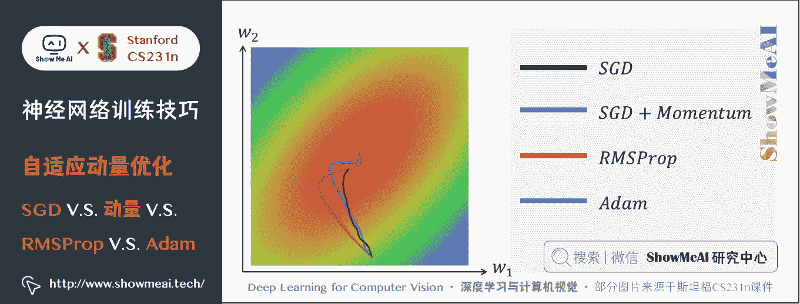

## 1.8 学习率退火

以上的所有优化方法，都需要使用超参数学习率。

在训练深度网络的时候，让学习率随着时间衰减通常是有帮助的。可以这样理解：

*   如果学习率很高，系统的动能就过大，参数向量就会无规律地跳动，不能够稳定到损失函数更深更窄的部分去。
*   知道什么时候开始衰减学习率是有技巧的：慢慢减小它，可能在很长时间内只能是浪费计算资源地看着它混沌地跳动，实际进展很少。但如果快速地减少它，系统可能过快地失去能量，不能到达原本可以到达的最好位置。

通常，实现学习率衰减有 3 种方式：

**① 随步数衰减**：每进行几个周期（epoch）就根据一些因素降低学习率。典型的值是每过 5 个周期就将学习率减少一半，或者每 20 个周期减少到之前的 10%。

> 这些数值的设定是严重依赖具体问题和模型的选择的。在实践中可能看见这么一种经验做法：使用一个固定的学习率来进行训练的同时观察验证集错误率，每当验证集错误率停止下降，就乘以一个常数（比如 0.5）来降低学习率。

**② 指数衰减**：数学公式是 α = α 0 e − k t \alpha=\alpha_0e^{-kt} α=α0​e−kt，其中 α 0 , k \alpha_0,k α0​,k 是超参数， t t t 是迭代次数（也可以使用周期作为单位）。
**③ 1/t 衰减**：数学公式是 α = α 0 / ( 1 + k t ) \alpha=\alpha_0/(1+kt) α=α0​/(1+kt))，其中 α 0 , k \alpha_0,k α0​,k 是超参数， t t t 是迭代次数。

在实践中随步数衰减的**随机失活**（Dropout）更受欢迎，因为它使用的超参数（衰减系数和以周期为时间单位的步数）比 k 更有解释性。

如果你有足够的计算资源，可以让衰减更加缓慢一些，让训练时间更长些。

> 一般像 SGD 这种需要使用学习率退火，Adam 等不需要。也不要一开始就使用，先不用，观察一下损失函数，然后确定什么地方需要减小学习率。

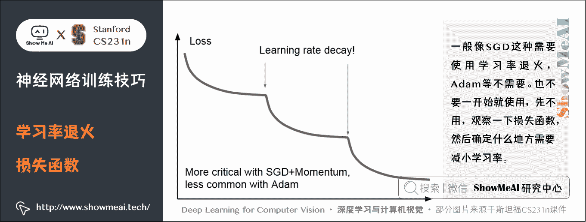

## 1.9 二阶方法（Second-Order）

在深度网络背景下，第二类常用的最优化方法是基于牛顿方法的，其迭代如下：

x ← x − [ H f ( x ) ] − 1 ∇ f ( x ) x \leftarrow x - [H f(x)]^{-1} \nabla f(x) x←x−[Hf(x)]−1∇f(x)

H f ( x ) H f(x) Hf(x) 是 Hessian 矩阵，由 f ( x ) f(x) f(x) 的二阶偏导数组成：

H = [ ∂ 2 f ∂ x 1 2 ∂ 2 f ∂ x 1 ∂ x 2 ⋯ ∂ 2 f ∂ x 1 ∂ x n ∂ 2 f ∂ x 2 ∂ x 1 ∂ 2 f ∂ x 2 2 ⋯ ∂ 2 f ∂ x 2 ∂ x n ⋮ ⋮ ⋱ ⋮ ∂ 2 f ∂ x n ∂ x 1 ∂ 2 f ∂ x n ∂ x 2 ⋯ ∂ 2 f ∂ x n 2 ] \mathbf{H}=\left[\begin{array}{cccc} \frac{\partial^{2} f}{\partial x_{1}^{2}} & \frac{\partial^{2} f}{\partial x_{1} \partial x_{2}} & \cdots & \frac{\partial^{2} f}{\partial x_{1} \partial x_{n}} \\ \frac{\partial^{2} f}{\partial x_{2} \partial x_{1}} & \frac{\partial^{2} f}{\partial x_{2}^{2}} & \cdots & \frac{\partial^{2} f}{\partial x_{2} \partial x_{n}} \\ \vdots & \vdots & \ddots & \vdots \\ \frac{\partial^{2} f}{\partial x_{n} \partial x_{1}} & \frac{\partial^{2} f}{\partial x_{n} \partial x_{2}} & \cdots & \frac{\partial^{2} f}{\partial x_{n}^{2}} \end{array}\right] H=⎣⎢⎢⎢⎢⎢⎡​∂x12​∂2f​∂x2​∂x1​∂2f​⋮∂xn​∂x1​∂2f​​∂x1​∂x2​∂2f​∂x22​∂2f​⋮∂xn​∂x2​∂2f​​⋯⋯⋱⋯​∂x1​∂xn​∂2f​∂x2​∂xn​∂2f​⋮∂xn2​∂2f​​⎦⎥⎥⎥⎥⎥⎤​

x x x 是 n n n 维的向量， f ( x ) f(x) f(x) 是实数，所以海森矩阵是 n ∗ n n \ast n n∗n 的。

∇ f ( x ) \nabla f(x) ∇f(x) 是 n n n 维梯度向量，这和反向传播一样。

这个方法收敛速度很快，可以进行更高效的参数更新。在这个公式中是没有学习率这个超参数的，这相较于一阶方法是一个巨大的优势。

然而上述更新方法很难运用到实际的深度学习应用中去，这是因为计算（以及求逆）Hessian 矩阵操作非常耗费时间和空间。这样，各种各样的**拟-牛顿法**就被发明出来用于近似转置 Hessian 矩阵。

在这些方法中最流行的是 L-BFGS，该方法使用随时间的梯度中的信息来隐式地近似（也就是说整个矩阵是从来没有被计算的）。

然而，即使解决了存储空间的问题，L-BFGS 应用的一个巨大劣势是需要对整个训练集进行计算，而整个训练集一般包含几百万的样本。和小批量随机梯度下降（mini-batch SGD）不同，让 L-BFGS 在小批量上运行起来是很需要技巧，同时也是研究热点。

## 1.10 实际应用

> Tips：默认选择 Adam；如果可以承担全批量更新，可以尝试使用 L-BFGS。

# 2.正则化

> 关于正则化的详细知识也可以对比阅读[ShowMeAI](http://www.showmeai.tech/)的[**深度学习教程 | 吴恩达专项课程 · 全套笔记解读**](http://www.showmeai.tech/tutorials/35)中的文章[**深度学习的实用层面**](http://www.showmeai.tech/article-detail/216)中关于正则化的讲解。

## 2.1 正则化的动机

当我们增加神经网络隐藏层的数量和尺寸时，网络的容量会上升，即神经元可以合作表达许多复杂函数。例如，如果有一个在二维平面上的二分类问题。我们可以训练 3 个不同的神经网络，每个网络都只有一个隐藏层，但是隐藏层的神经元数目不同，结果如下：

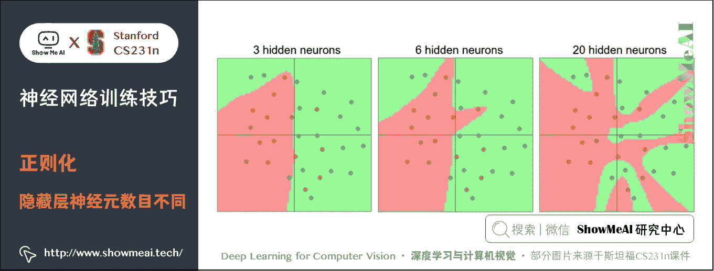

在上图中，可以看见有更多神经元的神经网络可以表达更复杂的函数。然而这既是优势也是不足：

*   优势是可以分类更复杂的数据
*   不足是可能造成对训练数据的过拟合。

**过拟合（Overfitting）** 是网络对数据中的噪声有很强的拟合能力，而没有重视数据间（假设）的潜在基本关系。比如上图中：

*   有 20 个神经元隐层的网络拟合了所有的训练数据，但是其代价是把决策边界变成了许多不相连的红绿区域。
*   有 3 个神经元的模型的表达能力只能用比较宽泛的方式去分类数据。它将数据看做是两个大块，并把个别在绿色区域内的红色点看做噪声。在实际中，这样可以在测试数据中获得更好的**泛化**（generalization）能力。

那是不是说 「**如果数据不是足够复杂，则小一点的网络似乎更好，因为可以防止过拟合**」？

不是的，防止神经网络的过拟合有很多方法（L2 正则化，Dropout 和输入噪音等）。在实践中，使用这些方法来控制过拟合比减少网络神经元数目要好得多。

不应该因为害怕出现过拟合而使用小网络。相反，应该尽可能使用大网络，然后使用正则化技巧来控制过拟合。

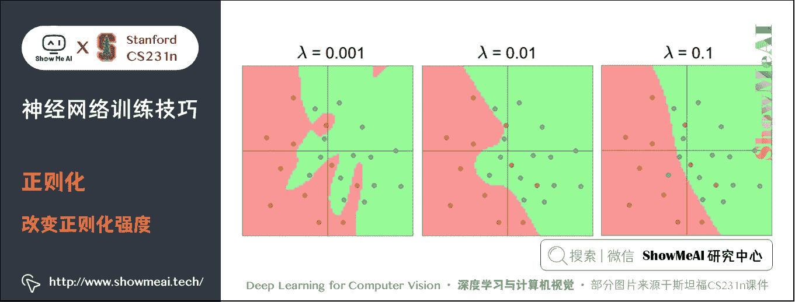

上图每个神经网络都有 20 个隐藏层神经元，但是随着正则化强度增加，网络的决策边界变得更加平滑。所以，**正则化强度是控制神经网络过拟合的好方法**。

> [ConvNetsJS demo](http://cs.stanford.edu/people/karpathy/convnetjs/demo/classify2d.html) 上有一个小例子大家可以练练手。

## 2.2 正则化方法

有不少方法是通过控制神经网络的容量来防止其过拟合的：

**L2 正则化**：最常用的正则化，通过惩罚目标函数中所有参数的平方实现。

*   对于网络中的每个权重 w w w，向目标函数中增加一个 1 2 λ w 2 \frac{1}{2} \lambda w² 21​λw2，1/2 为了方便求导， λ \lambda λ 是正则强度。
*   L2 正则化可以直观理解为它对于大数值的权重向量进行严厉惩罚，倾向于更加分散的权重向量。使网络更倾向于使用所有输入特征，而不是严重依赖输入特征中某些小部分特征。

**L1 正则化**：是另一个相对常用的正则化方法，对于每个 w w w 都向目标函数增加一个 λ ∣ w ∣ \lambda \mid w \mid λ∣w∣。

*   L1 正则化会让权重向量在最优化的过程中变得稀疏（即非常接近 0 0 0）。在实践中，如果不是特别关注某些明确的特征选择，一般说来 L2 正则化都会比 L1 正则化效果好。
*   L1 和 L2 正则化也可以进行组合： λ 1 ∣ w ∣ + λ 2 w 2 \lambda_1 \mid w \mid + \lambda_2 w² λ1​∣w∣+λ2​w2，称作 Elastic net regularization。

**最大范式约束**（Max norm constraints）：要求权重向量 $w $ 必须满足 L2 范式 ∥ w ⃗ ∥ 2 < c \Vert \vec{w} \Vert_2 < c ∥w ∥2​<c， c c c 一般是 3 或 4。这种正则化还有一个良好的性质，即使在学习率设置过高的时候，网络中也不会出现数值「爆炸」，这是因为它的参数更新始终是被限制着的。

但是在神经网络中，最常用的正则化方式叫做 Dropout，下面我们详细展开介绍一下。

## 2.3 随机失活（Dropout）

### 1) Dropout 概述

Dropout 是一个简单又极其有效的正则化方法，由 Srivastava 在论文 [[Dropout](http://www.cs.toronto.edu/~rsalakhu/papers/srivastava14a.pdf)[: A Simple Way to Prevent Neural Networks from Overfitting](http://www.cs.toronto.edu/~rsalakhu/papers/srivastava14a.pdf)](http://www.cs.toronto.edu/~rsalakhu/papers/srivastava14a.pdf) 中提出，与 L1 正则化、L2 正则化和最大范式约束等方法互为补充。

在训练的时候，随机失活的实现方法是让神经元以超参数 p p p （一般是 0.5 0.5 0.5）的概率被激活或者被设置为 0 0 0 。常用在全连接层。

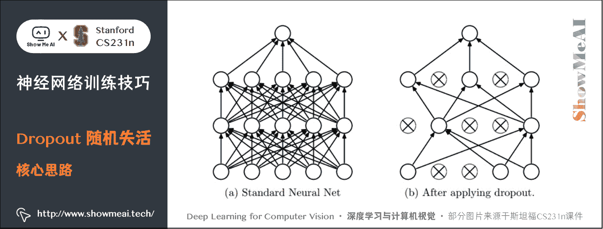

一个三层的神经网络 Dropout 示例代码实现：

```py
""" 普通版随机失活"""

p = 0.5   # 神经元被激活的概率。p 值越高，失活数目越少

def train_step(X):
  """ X 中是输入数据 """
  # 前向传播
  H1 = np.maximum(0, np.dot(W1, X) + b1)
  U1 = np.random.rand(*H1.shape) < p # 第一个随机失活掩模
  # rand 可以返回一个或一组服从“0~1”均匀分布的随机样本值
  # 矩阵中满足小于 p 的元素为 True，不满足 False
  # rand()函数的参数是两个或一个整数，不是元组，所以需要*H1.shape 获取行列
  H1 *= U1 # U1 中 False 的 H1 对应位置置零
  H2 = np.maximum(0, np.dot(W2, H1) + b2)
  U2 = np.random.rand(*H2.shape) < p # 第二个随机失活掩模
  H2 *= U2 # drop!
  out = np.dot(W3, H2) + b3

  # 反向传播:计算梯度... (略)
  # 进行参数更新... (略) 
```

在上面的代码中，`train_step` 函数在第一个隐层和第二个隐层上进行了两次随机失活。在输入层上面进行随机失活也是可以的，为此需要为输入数据 X X X 创建一个二值（要么激活要么失活）的掩模。反向传播几乎保持不变，只需回传梯度乘以掩模得到 Dropout 层的梯度。

### 2) Dropout 的理解

为什么这个想法可取呢？一个解释是防止特征间的相互适应：

*   比如每个神经元学到了猫的一个特征比如尾巴、胡须、爪子等，将这些特征全部组合起来可以判断是一只猫。
*   加入随机失活后就只能依赖一些零散的特征去判断不能使用所有特征，这样可以一定程度上抑制过拟合。不然训练时正确率很高，测试时却很低。

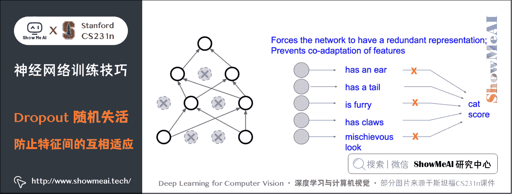

另一个比较合理的解释是：

*   在训练过程中，随机失活可以被认为是对完整的神经网络抽样出一些子集，每次基于输入数据只更新子网络的参数。
*   每个二值掩模都是一个模型，有 n n n 个神经元的网络有 2 n 2n 2n 种掩模。Dropout 相当于数量巨大的网络模型（共享参数）在同时被训练。

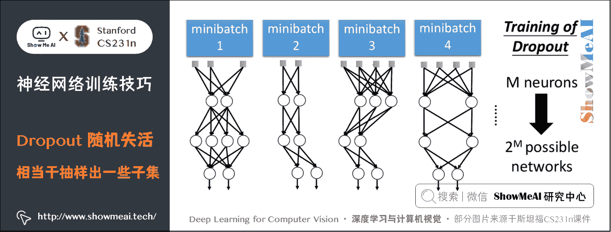

### 3) 测试时避免随机失活

在训练过程中，失活是随机的，但是在测试过程中要避免这种随机性，所以不使用随机失活，要对数量巨大的子网络们做模型集成（model ensemble），以此来计算出一个预测期望。

比如只有一个神经元 a a a：

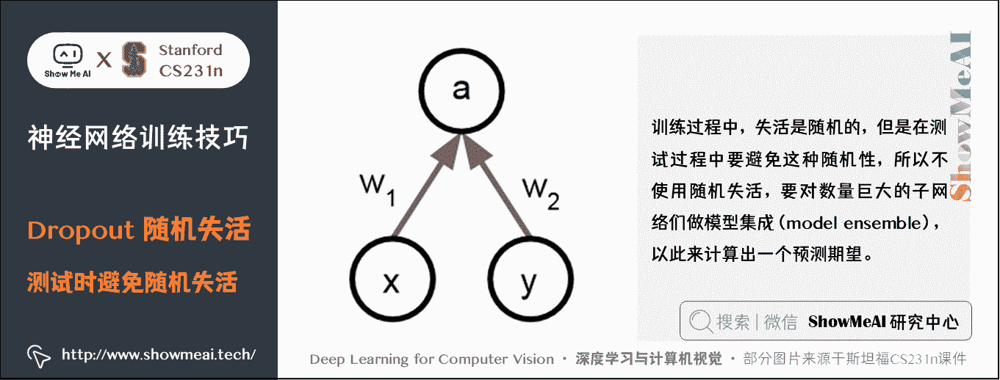

测试的时候由于不使用随机失活所以：

E ( a ) = w 1 x + w 2 y \text{E}(a)=w_1x+w_2y E(a)=w1​x+w2​y

假如训练时随机失活的概率为 0.5 0.5 0.5，那么：

E ( a ) = 1 4 ( w 1 x + w 2 y ) + 1 2 ( w 1 x + w 2 ⋅ 0 ) + 1 2 ( w 1 x ⋅ 0 + w 2 ) + 1 4 ⋅ 0 = 1 2 ( w 1 x + w 2 y ) \text{E}(a)=\frac{1}{4}(w_1x+w_2y)+\frac{1}{2}(w_1x+w_2\cdot 0)+\frac{1}{2}(w_1x\cdot 0+w_2)+\frac{1}{4}\cdot 0=\frac{1}{2}(w_1x+w_2y) E(a)=41​(w1​x+w2​y)+21​(w1​x+w2​⋅0)+21​(w1​x⋅0+w2​)+41​⋅0=21​(w1​x+w2​y)

所以一个不确切但是很实用的做法是在测试时承随机失活概率，这样就能保证预测时的输出和训练时的期望输出一致。所以测试代码：

```py
def predict(X):
  # 前向传播时模型集成
  H1 = np.maximum(0, np.dot(W1, X) + b1) * p # 注意：激活数据要乘以 p
  H2 = np.maximum(0, np.dot(W2, H1) + b2) * p # 注意：激活数据要乘以 p
  out = np.dot(W3, H2) + b3 
```

上述操作不好的地方是必须在测试时对激活数据按照失活概率 p p p 进行数值范围调整。测试阶段性能是非常关键的，因此实际操作时更倾向使用**反向随机失活（inverted dropout）**

*   在训练时就进行数值范围调整，从而让前向传播在测试时保持不变。

反向随机失活还有一个好处，无论是否在训练时使用 Dropout，预测的代码可以保持不变。参考实现代码如下：

```py
""" 
反向随机失活: 推荐实现方式.
在训练的时候 drop 和调整数值范围，测试时不做任何事.
"""
p = 0.5
def train_step(X):
  # 前向传播
  H1 = np.maximum(0, np.dot(W1, X) + b1)
  U1 = (np.random.rand(*H1.shape) < p) / p # 第一个随机失活遮罩. 注意/p!
  H1 *= U1 # drop!
  H2 = np.maximum(0, np.dot(W2, H1) + b2)
  U2 = (np.random.rand(*H2.shape) < p) / p # 第二个随机失活遮罩. 注意/p!
  H2 *= U2 # drop!
  out = np.dot(W3, H2) + b3

def predict(X):
  # 前向传播时模型集成
  H1 = np.maximum(0, np.dot(W1, X) + b1) # 不用数值范围调整了
  H2 = np.maximum(0, np.dot(W2, H1) + b2)
  out = np.dot(W3, H2) + b3 
```

在更一般化的分类上，随机失活属于网络在前向传播中有随机行为的方法。这种在训练过程加入随机性，然后在测试过程中对这些随机性进行平均或近似的思想在很多地方都能见到：

*   **批量归一化**：训练时的均值和方差来自随机的小批量；测试时使用的是整个训练过程中的经验方差和均值。

*   **数据增强（data augmentation）** ：比如一张猫的图片进行训练时，可以随机的裁剪翻转等操作再训练，然后测试过程再对一些固定的位置（四个角、中心及翻转）进行测试。也可以在训练的时候随机改变亮度对比度，色彩抖动 PCA 降维等。

*   **DropConnect**：另一个与 Dropout 类似的研究是 [**DropConnect**](http://cs.nyu.edu/257Ewanli/dropc/)，它在前向传播的时候，一系列权重被随机设置为 0 0 0 。

*   **部分最大池化（Fractional Max Pooling）** ：训练时随机区域池化，测试时固定区域或者取平均值。这个方法并不常用。

*   **随机深度（Stochastic Depth）** ：一个比较深的网络，训练时随机选取部分层去训练，测试时使用全部的层。这个研究非常前沿。

总之，这些方法都是在训练的时候增加随机噪声，测试时通过分析法（在使用随机失活的本例中就是乘以 p p p）或数值法（例如通过抽样出很多子网络，随机选择不同子网络进行前向传播，最后对它们取平均）将噪音边缘化。

### 4) 实践经验

一些常用的实践经验方法：

*   可以通过交叉验证获得一个全局使用的 L2 正则化系数。
*   使用 L2 正则化的同时在所有层后面使用随机失活

**随机失活 p p p 值一般默认设为 0.5 0.5 0.5，也可能在验证集上调参**。

# 3.迁移学习（Transfer Learning）

> 关于迁移学习的详细知识也可以对比阅读[ShowMeAI](http://www.showmeai.tech/)的 [**深度学习教程 | 吴恩达专项课程 · 全套笔记解读**](http://www.showmeai.tech/tutorials/35) 中的文章 [**AI 应用实践策略(下)**](http://www.showmeai.tech/article-detail/220) 中关于正则化的讲解。

另一个导致过拟合的原因可能是训练样本过少，这时可以使用迁移学习来解决这个问题，它允许使用很少的数据来训练 CNN。

## 3.1 迁移学习的思想

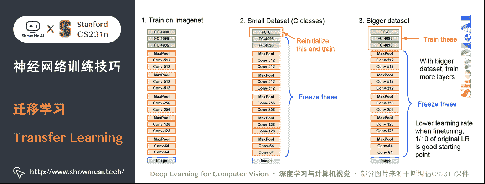

*   **第①步**：在大量的数据集上训练一个 CNN，得到模型（比如使用 ImageNet，有 1000 个分类）
*   **第②步**：使用一个少量的数据集，最后需要的得到的分类也不再是 1000 而是一个较小的值 C C C，比如 10。这时最后一个全连接层的参数矩阵变成 4096 × C 4096 \times C 4096×C，初始化这个矩阵，重新训练这个线性分类器，保持前面的所有层不变，因为前面的层已经训练好了，有了泛化能力。
*   **第③步**：当得到较多的训练集后，训练的层数可以增多，比如可以训练最后三个全连接层。可以使用较低的学习率微调参数。

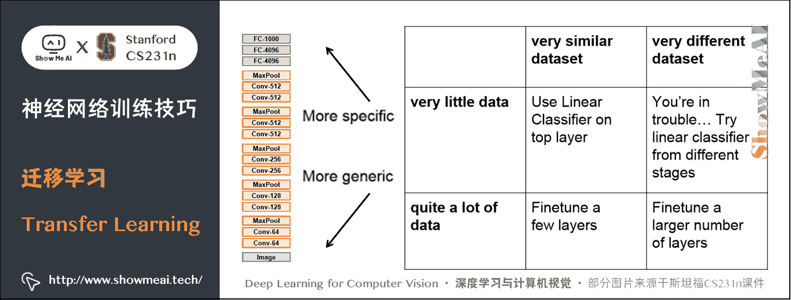

## 3.2 应用

在目标检测和图像标记中都会使用迁移学习，图像处理部分都使用一个已经用 ImageNet 数据预训练好的 CNN 模型，然后根据具体的任务微调这些参数。

所以对一批数据集感兴趣但是数量不够时，可以在网上找一个数据很相似的有大量数据的训练模型，然后针对自己的问题微调或重新训练某些层。一些常用的深度学习软件包都含有已经训练好的模型，直接应用就好。

*   **Caffe**: [`github.com/BVLC/caffe/wiki/Model-Zoo`](https://github.com/BVLC/caffe/wiki/Model-Zoo)
*   **TensorFlow**: [`github.com/tensorflow/models`](https://github.com/BVLC/caffe/wiki/Model-Zoo)
*   **PyTorch**: [`github.com/pytorch/vision`](https://github.com/BVLC/caffe/wiki/Model-Zoo)

# 4.模型集成（Model Ensembles）

在实践的时候，有一个总是能提升神经网络几个百分点准确率的办法，就是在训练的时候训练几个独立的模型，然后在测试的时候平均它们预测结果。

集成的模型数量增加，算法的结果也单调提升（但提升效果越来越少）。

模型之间的差异度越大，提升效果可能越好。

进行集成有以下几种方法：

*   **同一个模型，不同的初始化**。使用交叉验证来得到最好的超参数，然后用最好的参数来训练不同初始化条件的模型。这种方法的风险在于多样性只来自于不同的初始化条件。
*   **在交叉验证中发现最好的模型**。使用交叉验证来得到最好的超参数，然后取其中最好的几个（比如 10 个）模型来进行集成。这样就提高了集成的多样性，但风险在于可能会包含不够理想的模型。在实际操作中，这样操作起来比较简单，在交叉验证后就不需要额外的训练了。
*   **一个模型设置多个记录点 （ checkpoints ）** 。如果训练非常耗时，那就在不同的训练时间对网络留下记录点（比如每个周期结束），然后用它们来进行模型集成。很显然，这样做多样性不足，但是在实践中效果还是不错的，这种方法的优势是代价比较小。
*   **在训练的时候跑参数的平均值**。和上面一点相关的，还有一个也能得到 1-2 个百分点的提升的小代价方法，这个方法就是在训练过程中，如果损失值相较于前一次权重出现指数下降时，就在内存中对网络的权重进行一个备份。这样你就对前几次循环中的网络状态进行了平均。你会发现这个「平滑」过的版本的权重总是能得到更少的误差。直观的理解就是目标函数是一个碗状的，你的网络在这个周围跳跃，所以对它们平均一下，就更可能跳到中心去。

# 5.拓展学习

**可以点击 [B 站](https://www.bilibili.com/video/BV1g64y1B7m7?p=7) 查看视频的【双语字幕】版本**

[`player.bilibili.com/player.html?aid=759478950&page=7`](https://player.bilibili.com/player.html?aid=759478950&page=7)

【字幕+资料下载】斯坦福 CS231n | 面向视觉识别的卷积神经网络 (2017·全 16 讲)

*   [【课程学习指南】斯坦福 CS231n | 深度学习与计算机视觉](http://blog.showmeai.tech/cs231n/)
*   [【字幕+资料下载】斯坦福 CS231n | 深度学习与计算机视觉 (2017·全 16 讲)](https://www.bilibili.com/video/BV1g64y1B7m7)
*   [【CS231n 进阶课】密歇根 EECS498 | 深度学习与计算机视觉](http://blog.showmeai.tech/eecs498/)
*   [【深度学习教程】吴恩达专项课程 · 全套笔记解读](http://www.showmeai.tech/tutorials/35)
*   [【Stanford 官网】CS231n: Deep Learning for Computer Vision](http://cs231n.stanford.edu/)

# 6.要点总结

*   优化方式：SGD、动量更新、Nesterov 动量、Adagrad、RMSProp、Adam 等，一般无脑使用 Adam。此外还有学习率退火和二阶方法。
*   正则化：L2 比较常用，Dropout 也是一个很好的正则方法。
*   数据较少时可以使用迁移学习。
*   模型集成。

# [ShowMeAI](http://www.showmeai.tech) 斯坦福 CS231n 全套解读

*   [深度学习与计算机视觉教程(1) | CV 引言与基础 @CS231n](http://www.showmeai.tech/article-detail/260)
*   [深度学习与计算机视觉教程(2) | 图像分类与机器学习基础 @CS231n](http://www.showmeai.tech/article-detail/261)
*   [深度学习与计算机视觉教程(3) | 损失函数与最优化 @CS231n](http://www.showmeai.tech/article-detail/262)
*   [深度学习与计算机视觉教程(4) | 神经网络与反向传播 @CS231n](http://www.showmeai.tech/article-detail/263)
*   [深度学习与计算机视觉教程(5) | 卷积神经网络 @CS231n](http://www.showmeai.tech/article-detail/264)
*   [深度学习与计算机视觉教程(6) | 神经网络训练技巧 (上) @CS231n](http://www.showmeai.tech/article-detail/265)
*   [深度学习与计算机视觉教程(7) | 神经网络训练技巧 (下) @CS231n](http://www.showmeai.tech/article-detail/266)
*   [深度学习与计算机视觉教程(8) | 常见深度学习框架介绍 @CS231n](http://www.showmeai.tech/article-detail/267)
*   [深度学习与计算机视觉教程(9) | 典型 CNN 架构 (Alexnet, VGG, Googlenet, Restnet 等) @CS231n](http://www.showmeai.tech/article-detail/268)
*   [深度学习与计算机视觉教程(10) | 轻量化 CNN 架构 (SqueezeNet, ShuffleNet, MobileNet 等) @CS231n](http://www.showmeai.tech/article-detail/269)
*   [深度学习与计算机视觉教程(11) | 循环神经网络及视觉应用 @CS231n](http://www.showmeai.tech/article-detail/270)
*   [深度学习与计算机视觉教程(12) | 目标检测 (两阶段, R-CNN 系列) @CS231n](http://www.showmeai.tech/article-detail/271)
*   [深度学习与计算机视觉教程(13) | 目标检测 (SSD, YOLO 系列) @CS231n](http://www.showmeai.tech/article-detail/272)
*   [深度学习与计算机视觉教程(14) | 图像分割 (FCN, SegNet, U-Net, PSPNet, DeepLab, RefineNet) @CS231n](http://www.showmeai.tech/article-detail/273)
*   [深度学习与计算机视觉教程(15) | 视觉模型可视化与可解释性 @CS231n](http://www.showmeai.tech/article-detail/274)
*   [深度学习与计算机视觉教程(16) | 生成模型 (PixelRNN, PixelCNN, VAE, GAN) @CS231n](http://www.showmeai.tech/article-detail/275)
*   [深度学习与计算机视觉教程(17) | 深度强化学习 (马尔可夫决策过程, Q-Learning, DQN) @CS231n](http://www.showmeai.tech/article-detail/276)
*   [深度学习与计算机视觉教程(18) | 深度强化学习 (梯度策略, Actor-Critic, DDPG, A3C) @CS231n](http://www.showmeai.tech/article-detail/277)

# [ShowMeAI](http://www.showmeai.tech) 系列教程推荐

*   [大厂技术实现：推荐与广告计算解决方案](http://www.showmeai.tech/tutorials/50)
*   [大厂技术实现：计算机视觉解决方案](http://www.showmeai.tech/tutorials/51)
*   [大厂技术实现：自然语言处理行业解决方案](http://www.showmeai.tech/tutorials/52)
*   [图解 Python 编程：从入门到精通系列教程](http://www.showmeai.tech/tutorials/56)
*   [图解数据分析：从入门到精通系列教程](http://www.showmeai.tech/tutorials/33)
*   [图解 AI 数学基础：从入门到精通系列教程](http://www.showmeai.tech/tutorials/83)
*   [图解大数据技术：从入门到精通系列教程](http://www.showmeai.tech/tutorials/84)
*   [图解机器学习算法：从入门到精通系列教程](http://www.showmeai.tech/tutorials/34)
*   [机器学习实战：手把手教你玩转机器学习系列](http://www.showmeai.tech/tutorials/41)
*   [深度学习教程：吴恩达专项课程 · 全套笔记解读](http://www.showmeai.tech/tutorials/35)
*   [自然语言处理教程：斯坦福 CS224n 课程 · 课程带学与全套笔记解读](http://www.showmeai.tech/tutorials/36)
*   [深度学习与计算机视觉教程：斯坦福 CS231n · 全套笔记解读](http://www.showmeai.tech/tutorials/37)

