# 深度学习与计算机视觉教程(9) | 典型 CNN 架构 (Alexnet,VGG,Googlenet,Restnet 等)（CV 通关指南·完结）

> 原文：[`blog.csdn.net/ShowMeAI/article/details/125025145`](https://blog.csdn.net/ShowMeAI/article/details/125025145)

*   作者：[韩信子](https://github.com/HanXinzi-AI)@[ShowMeAI](http://www.showmeai.tech/)
*   [教程地址](http://www.showmeai.tech/tutorials/37)：[`www.showmeai.tech/tutorials/37`](http://www.showmeai.tech/tutorials/37)
*   [本文地址](http://www.showmeai.tech/article-detail/268)：[`www.showmeai.tech/article-detail/268`](http://www.showmeai.tech/article-detail/268)
*   声明：版权所有，转载请联系平台与作者并注明出处
*   **收藏[ShowMeAI](http://www.showmeai.tech/)查看更多精彩内容**

* * *

本系列为 **斯坦福 CS231n** 《深度学习与计算机视觉(Deep Learning for Computer Vision)》的全套学习笔记，对应的课程视频可以在 [**这里**](https://www.bilibili.com/video/BV1g64y1B7m7?p=9) 查看。更多资料获取方式见文末。

* * *

# 引言

ShowMeAI 在文章 [**深度学习与 CV 教程(5) | 卷积神经网络**](http://www.showmeai.tech/article-detail/264) 中已经给大家介绍过 CNN 的核心结构组件，在本篇中，我们给大家介绍目前最广泛使用的典型卷积神经网络结构。包括经典结构（AlexNet、VGG、GoogLeNet、ResNet）和一些新的结构（Network in Network、Resnet 改进、FractalNet、DenseNet 等）

> 关于典型 CNN 结构的详细知识也可以参考[ShowMeAI](http://www.showmeai.tech/)的 [**深度学习教程 | 吴恩达专项课程 · 全套笔记解读**](http://www.showmeai.tech/tutorials/35) 中的文章 [**经典 CNN 网络实例详解**](http://www.showmeai.tech/article-detail/222)

## 本篇重点

*   经典 CNN 架构
    *   AlexNet
*   VGG
*   GoogLeNet
*   ResNet
*   其他结构
    *   NIN（Network in Network）
*   ResNet 改进
*   FractalNet
*   DenseNet
*   NAS

# 1.经典架构

## 1.1 AlexNet

首先回顾一下在数字识别领域有巨大成功的 LeNet-5，该网络结构为 [**CONV-POOL-CONV-POOL-FC-FC**]。卷积层使用 5 × 5 5 \times 5 5×5 的卷积核，步长为 1 1 1；池化层使用 2 × 2 2 \times 2 2×2 的区域，步长为 2 2 2；后面是全连接层。如下图所示：

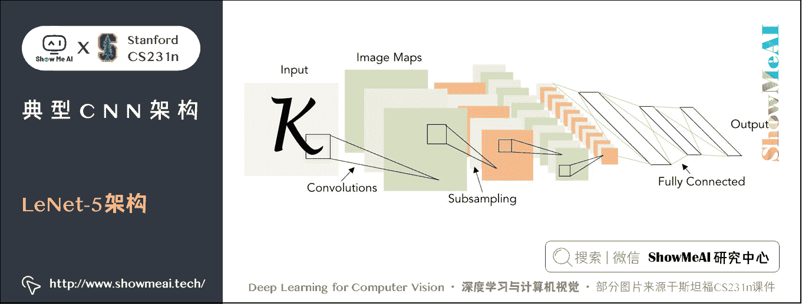

而 2012 年的 [AlexNet](https://papers.nips.cc/paper/4824-imagenet-classification-with-deep-convolutional-neural-networks.pdf) 是第一个在 ImageNet 大赛上夺冠的大型 CNN 网络，它的结构和 LeNet-5 很相似，只是层数变多了——[CONV1-MAX POOL1-NORM1-CONV2-MAX POOL2-NORM2-CONV3-CONV4-CONV5-Max POOL3-FC6-FC7-FC8]，共有 5 个卷积层、3 个池化层、2 个归一化层和三个全连接层。如下图所示：

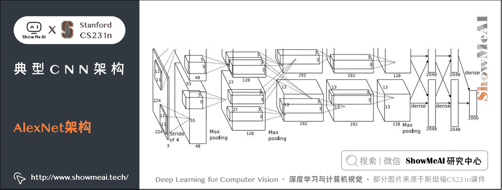

*   **输入**： 227 × 227 × 3 227 \times 227 \times 3 227×227×3 的图片；
*   **CONV1**：使用 96 个 11 × 11 11 \times 11 11×11 大小的卷积核，步长为 4 4 4，由于 ( 227 − 11 ) / 4 + 1 = 55 (227-11)/4+1=55 (227−11)/4+1=55，所以输出的尺寸为 55 × 55 × 96 55 \times 55 \times 96 55×55×96，共有 96 × 11 × 11 × 3 96 \times 11 \times 11 \times 3 96×11×11×3 个参数；
*   **POOL1**：使用 3 × 3 3 \times 3 3×3 的池化区域，步长为 2 2 2，由于 ( 55 − 3 ) / 2 + 1 = 27 (55-3)/2+1=27 (55−3)/2+1=27，所以输出为 27 × 27 × 96 27 \times 27 \times 96 27×27×96，没有参数；
*   **NORM1**：归一化后仍然是 27 × 27 × 96 27 \times 27 \times 96 27×27×96；
*   **CONV2**：使用 256 个 5 × 5 5 \times 5 5×5 的卷积核，stride 1 1 1、pad 2 2 2 ， ( 27 + 2 × 2 − 5 ) + 1 = 27 (27+2 \times 2-5)+1=27 (27+2×2−5)+1=27，所以输出为 27 × 27 × 256 27 \times 27 \times 256 27×27×256；
*   **POOL2**： 3 × 3 3 \times 3 3×3 filters，stride 2 2 2 ， ( 27 − 3 ) / 2 + 1 = 13 (27-3)/2+1=13 (27−3)/2+1=13，所以输出为 13 × 13 × 256 13 \times 13 \times 256 13×13×256；
*   **NORM2**： 13 × 13 × 256 13 \times 13 \times 256 13×13×256；
*   **CONV3**：384 个 3 × 3 3 \times 3 3×3 filters，stride 1 1 1, pad 1 1 1，输出 [ 13 × 13 × 384 ] [13 \times 13 \times 384] [13×13×384]；
*   **CONV4**：384 个 3 × 3 3 \times 3 3×3 filters，stride 1 1 1, pad 1 1 1，输出 [ 13 × 13 × 384 ] [13 \times 13 \times 384] [13×13×384]；
*   **CONV5**：256 个 3 × 3 3 \times 3 3×3 filters，stride 1 1 1, pad 1 1 1，输出 [ 13 × 13 × 256 ] [13 \times 13 \times 256] [13×13×256]；
*   **POOL3**： 3 × 3 3 \times 3 3×3 filters，stride 2 2 2 输出为 [ 6 × 6 × 256 ] [6 \times 6 \times 256] [6×6×256]；
*   **FC6**： 4096 4096 4096 个神经元，输出为 [ 4096 ] [4096] [4096]；
*   **FC7**： 4096 4096 4096 个神经元，输出为 [ 4096 ] [4096] [4096]；
*   **FC8**： 1000 1000 1000 个神经元，(class scores)输出为 [ 1000 ] [1000] [1000]。

之所以在上图中分成上下两个部分，是因为当时的 GPU 容量太小，只能用两个来完成。还有一些细节是：

*   第一次使用 ReLU 函数
*   使用归一化层(现在不常用了)
*   数据增强
*   dropout 0.5
*   batch size 128
*   SGD Momentum 0.9
*   学习率 1e-2, 当验证准确率平稳时，手动减少 10
*   L2 权重衰减是 `5e-4`
*   7 CNN ensemble： 18.2 % → 15.4 % 18.2\% \to 15.4\% 18.2%→15.4%

AlexNet 夺得 ImageNet 大赛 2012 的冠军时，将正确率几乎提高了 10%，2013 年的冠军是 ZFNet，和 AlexNet 使用相同的网络架构，只是对超参数进一步调优：

*   **CONV1**：将 (11x11 stride 4) 改为 (7x7 stride 2) ；
*   **CONV3,4,5**：不再使用 384, 384, 256 个滤波器，而是使用 512, 1024, 512 个。

这样将错误率从 16.4 % 16.4\% 16.4% 降低到 11.7 % 11.7\% 11.7%

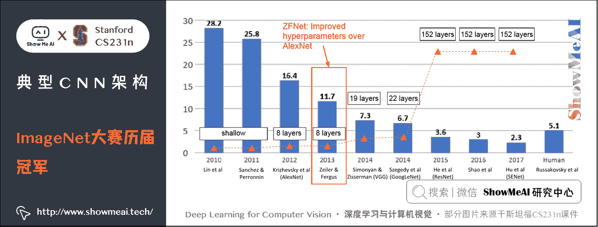

下面介绍 14 年的冠亚军 GoogLeNet（22 层网络）和 VGG（19 层网络）。

## 1.2 VGG

[VGG](https://papers.nips.cc/paper/4824-imagenet-classification-with-deep-convolutional-neural-networks.pdf) 相对于 AlexNet 使用更小的卷积核，层数也更深。VGG 有 16 层和 19 层两种。卷积核只使用 3 × 3 3 \times 3 3×3，步长为 1 1 1，pad 为 1 1 1；池化区域 2 × 2 2 \times 2 2×2，步长为 2。

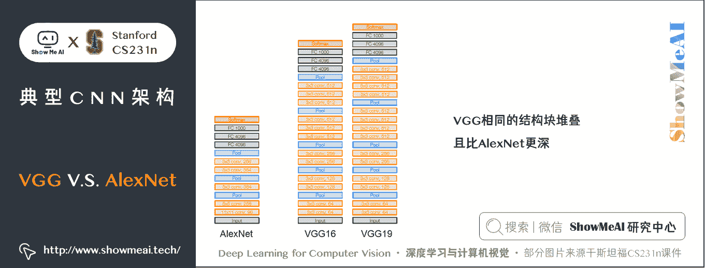

那么为什么使用 3 × 3 3 \times 3 3×3 的小卷积核呢？

*   多个卷积层堆叠时，第一层的感受野是 3 × 3 3 \times 3 3×3，第二层的感受野是 5 × 5 5 \times 5 5×5 （感受原图像），这样堆叠三层的有效感受野就变成 7 × 7 7 \times 7 7×7；
*   多个 3 × 3 3 \times 3 3×3 的卷基层比一个大尺寸卷积核的卷积层有更多的非线性（更多层的非线性函数），使得判决函数更加具有判决性；
*   多个 3 × 3 3 \times 3 3×3 的卷积层比一个大尺寸的卷积核有更少的参数，假设卷积层的输入和输出的特征图大小相同为 C C C，那么三个 3 × 3 3 \times 3 3×3 的卷积层参数个数 3 × ( 3 × 3 × C × C ) = 27 C 2 3 \times (3 \times 3 \times C \times C)=27C2 3×(3×3×C×C)=27C2；一个 7 × 7 7 \times 7 7×7 的卷积层参数为 7 × 7 × C × C = 49 C 2 7 \times 7 \times C \times C=49C2 7×7×C×C=49C2；所以可以把三个 3 × 3 3 \times 3 3×3 的 filter 看成是一个 7 × 7 7 \times 7 7×7 filter 的分解（中间层有非线性的分解, 并且起到隐式正则化的作用）。

下面看一下 VGG-16 的参数和内存使用情况：

*   总内存占用：24M * 4 bytes，每张图片约 96MB，加上反向传播需要乘以 2；大多数内存都用在了前面几层卷积层；
*   总参数个数：138M，大多都在全连接层，全连接层的第一层就有 100 多 M。

VGG 网络的一些细节是：

*   14 年 ImageNet 大赛分类第二名，定位第一名
*   训练过程和 AlexNet 很接近
*   不使用局部响应归一化
*   有 16 层和 19 层两种，19 层效果稍微好一些，但是占用更多内存，16 层应用的更广泛；
*   使用模型集成
*   FC7 的特征泛化非常好，可以直接用到其他任务中

下面来看一下分类的第一名，GoogLeNet。

## 1.3 GoogLeNet

> 关于 GoogLeNet/Inception 的详细知识也可以参考[ShowMeAI](http://www.showmeai.tech/)的[**深度学习教程 | 吴恩达专项课程 · 全套笔记解读**](http://www.showmeai.tech/tutorials/35)中的文章[**经典 CNN 网络实例详解**](http://www.showmeai.tech/article-detail/222)

先说明 [GoogLeNet](https://arxiv.org/pdf/1409.4842.pdf) 的一些细节：

*   网络有 22 层，比 VGG 深一些
*   为了高效的计算，使用 「Inception」 模块
*   不使用全连接层
*   只有 500 万个参数，比 AlexNet 少了 12 倍
*   14 年分类的冠军（6.7% top 5 error）

### 1) Inception Module

**「Inception」模块**是一种设计的比较好的局域网拓扑结构，然后将这些模块堆叠在一起。这种拓扑结构对来自前一层的输入，并行应用多种不同的滤波操作，比如 1 × 1 1 \times 1 1×1 卷积、 3 × 3 3 \times 3 3×3 卷积、 5 × 5 5 \times 5 5×5 卷积和 3 × 3 3 \times 3 3×3 池化。然后将所有滤波器的输出在深度上串联在一起。

如下图所示：

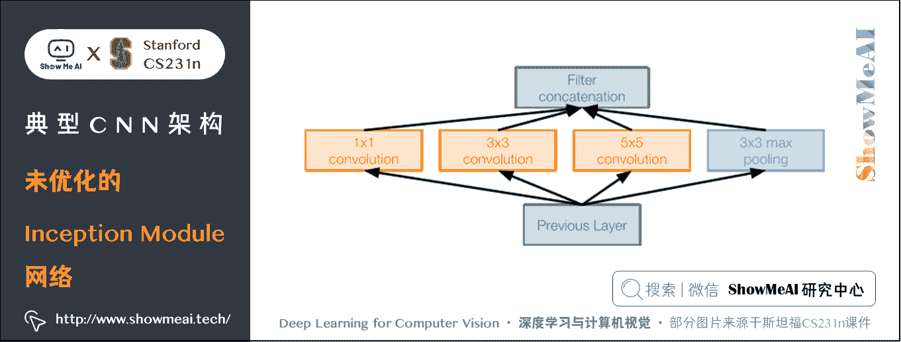

但是这种结构的一个问题是计算复杂度大大增加。如下图所示是一个网络参数计算示例：

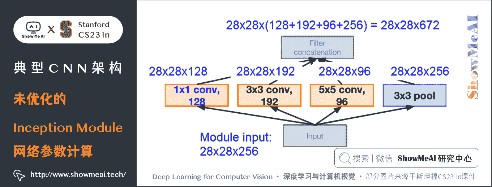

输入为 28 × 28 × 256 28 \times 28 \times 256 28×28×256，而串联后的输出为 28 × 28 × 672 28 \times 28 \times 672 28×28×672。（假设每个滤波操作都通过零填充保持输入尺寸）并且运算花费也非常高：

*   [1x1 conv, 128] 28 × 28 × 128 × 1 × 1 × 256 28 \times 28 \times 128 \times 1 \times 1 \times 256 28×28×128×1×1×256 次乘法运算；
*   [3x3 conv, 192] 28 × 28 × 192 × 3 × 3 × 256 28 \times 28 \times 192 \times 3 \times 3 \times 256 28×28×192×3×3×256 次；
*   [5x5 conv, 96] 28 × 28 × 96 × 5 × 5 × 256 28 \times 28 \times 96 \times 5 \times 5 \times 256 28×28×96×5×5×256 次。

总计：854M 次乘法运算。

由于池化操作会保持原输入的深度，所以网络的输出一定会增加深度。

解决办法是在进行卷积操作前添加一个「瓶颈层」，该层使用 1 × 1 1 \times 1 1×1 卷积，目的是保留原输入空间尺寸的同时，减小深度，只要卷积核的数量小于原输入的深度即可。

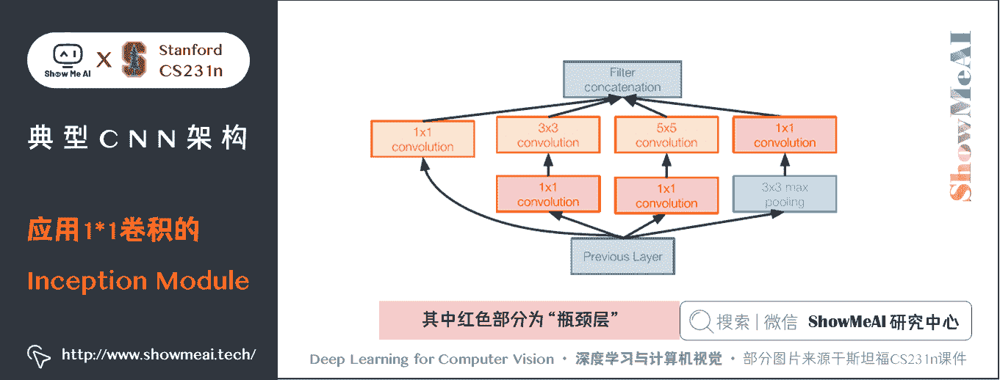

使用这种结构，同样的网络参数设置下，计算量会减少很多：

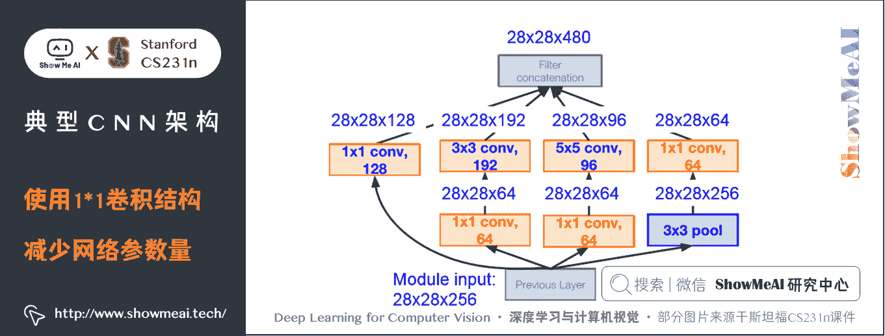

最终得到的输出为 28 × 28 × 480 28 \times 28 \times 480 28×28×480。此时总运算量为：

*   [1x1 conv, 64] 28 × 28 × 64 × 1 × 1 × 256 28 \times 28 \times 64 \times 1 \times 1 \times 256 28×28×64×1×1×256
*   [1x1 conv, 64] 28 × 28 × 64 × 1 × 1 × 256 28 \times 28 \times 64 \times 1 \times 1 \times 256 28×28×64×1×1×256
*   [1x1 conv, 128] 28 × 28 × 128 × 1 × 1 × 256 28 \times 28 \times 128 \times 1 \times 1 \times 256 28×28×128×1×1×256
*   [3x3 conv, 192] 28 × 28 × 192 × 3 × 3 × 64 28 \times 28 \times 192 \times 3 \times 3 \times 64 28×28×192×3×3×64
*   [5x5 conv, 96] 28 × 28 × 96 × 5 × 5 × 64 28 \times 28 \times 96 \times 5 \times 5 \times 64 28×28×96×5×5×64
*   [1x1 conv, 64] 28 × 28 × 64 × 1 × 1 × 256 28 \times 28 \times 64 \times 1 \times 1 \times 256 28×28×64×1×1×256

总计： 358 M 358M 358M。减少了一倍多。

### 2) 完整结构

Inception module 堆叠成垂直结构，这里方便描述，将模型水平放置：

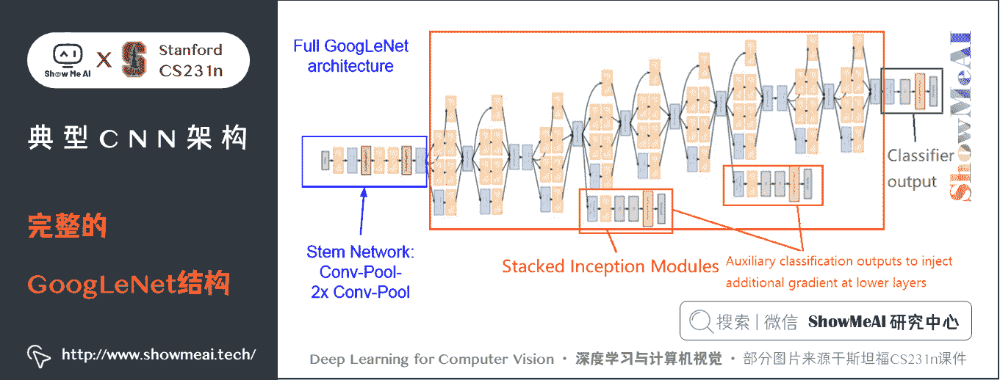

*   **蓝色**部分主干网：

Input - Conv 7x7+2(S) - MaxPool 3x3+2(S) - LocalRespNorm - Conv 1x1+1(V) - Conv 3x3+1(S) - LocalRespNorm - MaxPool 3x3+2(S)

含参数的层只有 3 个卷积层；

*   **红色**部分 Inception module 堆叠：
    *   并行层只算一层，所以一个 Inception module 只有两层，共有 9 个相同的模块 18 层。
*   **绿色**部分的输出：
    *   移除昂贵的全连接层，只留一个分类用的 FC。
    *   AveragePool 7x7+1(V) - FC - Softmax - Output

所以含参数的层总计 3 + 18 + 1 = 22 3+18+1 = 22 3+18+1=22 层。

此外，橙色部分的层不计入总层数，这两块的结构都是：AveragePool 5x5+3(V) - Conv 1x1+1(S) - FC - FC - Softmax - Output。

> 原论文对于橙色辅助部分的描述是：

> 「该相对较浅的网络在此分类任务上的强大表现表明，网络中间层产生的特征应该是非常有区别性的。 通过添加连接到这些中间层的辅助分类器，我们期望在分类器的较低阶段中鼓励区分，增加回传的梯度信号，并提供额外的正则化。 这些辅助分类器采用较小的卷积核，置于第三和第六个 Inception module 的输出之上。 在训练期间，它们的损失会加到折扣权重的网络总损失中（辅助分类的损失加权为 0.3）。 在预测时，这些辅助网络被丢弃。」

## 1.4 ResNet

> 关于 ResNet 的详细知识也可以参考[ShowMeAI](http://www.showmeai.tech/)的[**深度学习教程 | 吴恩达专项课程 · 全套笔记解读**](http://www.showmeai.tech/tutorials/35)中的文章[**经典 CNN 网络实例详解**](http://www.showmeai.tech/article-detail/222)

从 2015 年开始，神经网络的层数爆发式地增长，比如著名的 ResNet 有 152 层。

如下图所示，15-17 年的冠军网络都有 152 层之深。

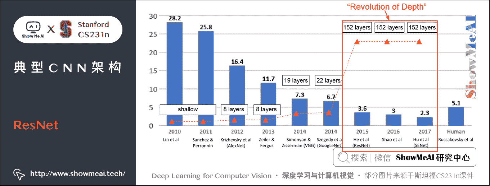

[ResNet](https://arxiv.org/pdf/1512.03385.pdf) 是一种非常深的网络，使用了残差连接。细节是：

*   152 层
*   ILSVRC’15 优胜者（3.57% top 5 error）
*   横扫了所有 ILSVRC’15 和 COCO’15 分类/检测的竞赛！

表现这么好的 ResNet 并不仅仅是因为深，研究表明一个 56 层的卷积层堆叠网络训练误差和测试误差都比一个 20 层的网络要大，并且不是过拟合的原因，而是更深的网络更难训练和优化。

一个更深的模型至少能和一个较浅的模型表现一样好（学习能力会更强），如果想把一个较浅的层变成较深的层，可以用下面的方式来构建：将原来比较浅的层拷贝到较深的层中，然后添加一些等于本身的映射层。这样较深的模型可以更好的学习。

### 1) 核心思想

ResNet 通过使用多个有参层来学习输入与输入输出之间的**残差映射（ residual mapping ）** ，而非像一般 CNN 网络（如 AlexNet/VGG 等）那样使用有参层来直接学习输入输出之间的**底层映射（ underlying mapping）** 。

### ① 残差学习（Residual Learning）

若将输入设为 X，将某一有参网络层映射设为 H H H，那么以 X X X 为输入的该层的输出将为 H ( X ) H(X) H(X)。通常的 CNN 网络会直接通过训练学习出参数函数 H 的表达式，从而直接得到 X X X 到 H ( X ) H(X) H(X) 的映射。

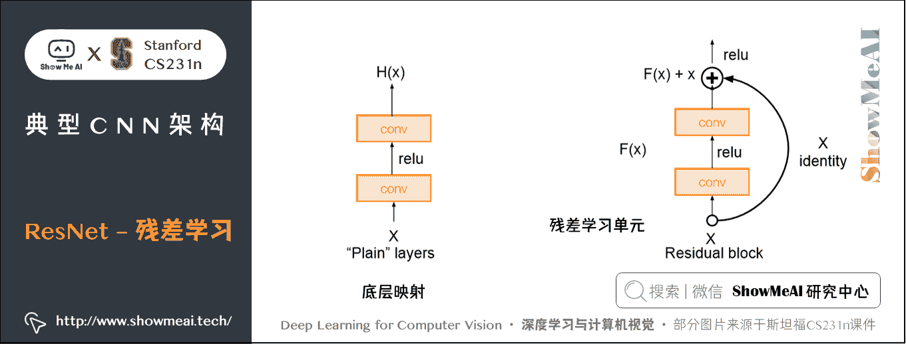

而**残差学习**则是致力于使用多个有参网络层来学习输入到输入、输出间的残差 ( H ( X ) − X ) (H(X) - X) (H(X)−X) 的映射，即学习 X → ( H ( X ) − X ) X \to (H(X) - X) X→(H(X)−X) ，然后加上 X 的**自身映射（identity mapping）** 。

也就是说网络的输出仍然是 H ( X ) − X + X = H ( X ) H(X) - X + X = H(X) H(X)−X+X=H(X)，只是学习的只是 ( H ( X ) − X ) (H(X) - X) (H(X)−X)， X X X 部分直接是本身映射。

### ② 自身映射（Identity Mapping）

残差学习单元通过本身映射的引入在输入、输出之间建立了一条直接的关联通道，从而使得强大的有参层集中精力学习输入、输出之间的残差。

一般我们用 F ( X , W i ) F(X, W_i) F(X,Wi​) 来表示残差映射，那么残差学习单元的输出即为： Y = F ( X , W i ) + X Y = F(X, W_i) + X Y=F(X,Wi​)+X。

*   当输入、输出通道数相同时，自然可以直接使用 X X X 进行相加。
*   当它们之间的通道数目不同时，我们就需要考虑建立一种有效的自身映射函数从而可以使得处理后的输入 X X X 与输出 Y Y Y 的通道数目相同即 Y = F ( X , W i ) + W s X Y = F(X, W_i) + W_sX Y=F(X,Wi​)+Ws​X。

当 X 与 Y 通道数目不同时，有两种自身映射方式。

*   ① 简单地将 X X X 相对 Y Y Y 缺失的通道直接补零从而使其能够相对齐
*   ② 通过使用 1 × 1 1 \times 1 1×1 的卷积来表示 W s W_s Ws​ 映射从而使得最终输入与输出的通道一致。

对应的论文和实验表明，学习残差比直接学习输入到输出的映射要更加容易，收敛速度也更快，同时从最终分类精度效果上看也有提升。

我们想象 1 个极端极端情况，如果自身映射是最优的，那么将残差设为零相比使用一堆非线性层做自身映射显然更容易。

### 2) 完整结构

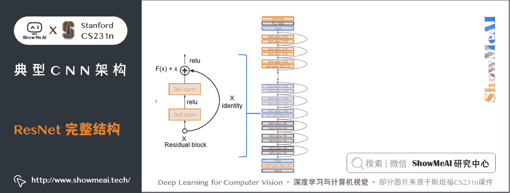

完整的网络结构如下：

*   残差块堆叠
*   每个残差块有两个 3 × 3 3 \times 3 3×3 卷积层
*   周期性的使用两倍的卷积核数量，降采样通过设置步长为 2 2 2
*   在网络开始处有 7 × 7 7 \times 7 7×7 的卷积层和最大池化层（步长 2 2 2）
*   在网络的最后不使用全连接层 (只有一个用于 1000 个分类的 FC)
*   在最后一个卷积层后使用全局的平均池化
*   总共的深度有 34、50、101 或 152

对于 ResNet-50+的网络，为提高计算效率，使用类似 GoogLeNet 的「瓶颈层」。

具体说，它也是通过使用 1 × 1 1 \times 1 1×1 卷积来缩减或扩张特征图维度，从而使得 3 × 3 3 \times 3 3×3 卷积的卷积核数目不受上一层输入的影响，对应的输出也不会影响到下一层，这种设计节省计算时间，且不影响最终的模型精度。

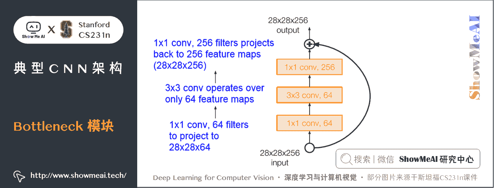

### 3) ResNet 网络训练

ResNet 的实际训练的一些细节如下：

*   每个 CONV 层后使用批量归一化
*   权重使用 He 初始化
*   更新方式使用 SGD + Momentum (0.9)
*   学习率为 0.1, 验证错误率不变时除 10
*   Mini-batch size 为 256
*   权重衰减是 `1e-5`
*   未使用 dropout

实际的训练效果为可以堆叠很多的层而不使准确率下降：ImageNet 上 152 层网络，在 CIFAR 上 1202 层网络，表现都很好。经过结构改造后，和预想中的一致，网络越深，训练准确率越高。

ResNet 横扫了 2015 年所有的奖项，第一次超过人类的识别率。

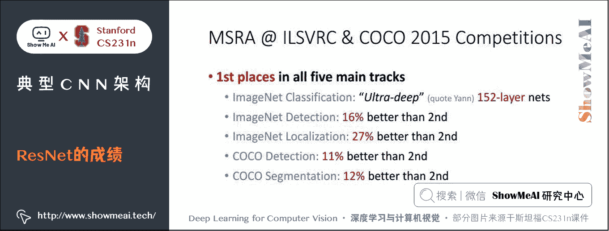

# 2.几种网络的对比

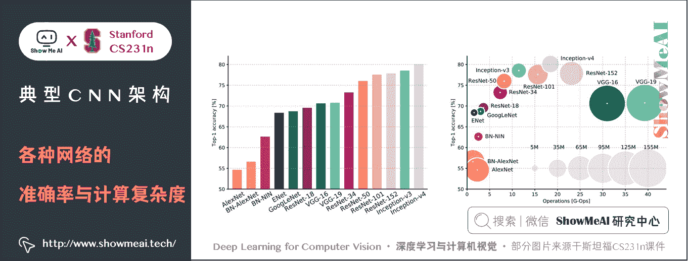

*   **左图**：通过 Top1 准确率来比较各种网络的准确性
*   **右图**：是不同网络的运算复杂度，横轴为计算量，圆圈大小表示内存占用。其中 Inception-v4 是 Resnet + Inception

从图里可以看出：

*   Inception-v4 具有最高的准确率
*   VGG 内存占用最大，计算量最多
*   GoogLeNet 最高效，准确率较高，运算复杂度较小
*   AlexNet 计算量较小但内存占用较大，准确率也低
*   ResNet 准确率较高，效率取决于模型

前向传播时间和功率消耗对比如下：

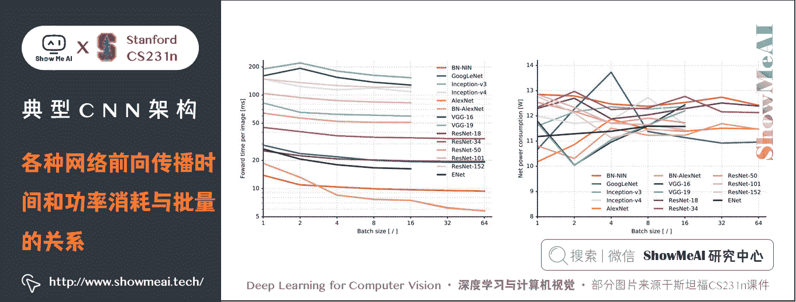

# 3.其他网络架构

## 3.1 Network in Network (NiN)

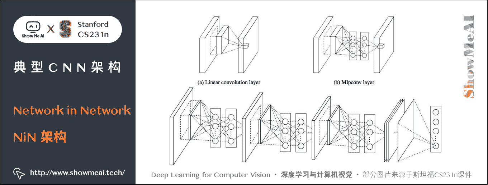

Network In Network 发表于 ICLR 2014，由新加坡国立大学（NUS）提出，也是一个经常被大家提到的经典 CNN 结构，它的主要特点如下：

*   在每个卷积层内的 Mlpconv 层具有「Micronetwork」用于计算局部区域的更抽象的特征；
*   Micronetwork 使用多层感知器（FC，即 1 × 1 1 \times 1 1×1 卷积层）
*   GoogLeNet 和 ResNet「瓶颈」层的先驱

## 3.2 ResNet 的改进

### 1) Identity Mappings in Deep Residual Networks

*   ResNet 创造者自己改进了残差块设计
*   创建更直接的路径（将激活函数移动到残差的映射路径），以便在整个网络中传播信息
*   更好的性能

### 2）Wide Residual Networks

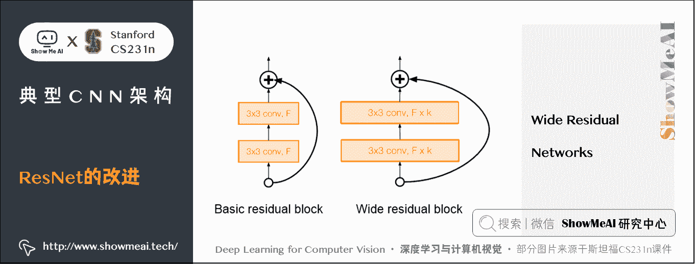

*   相比「深度」，认为「残差」是核心
*   使用更宽的残差块（ F × k F \times k F×k 个滤波器代替每层中的 F 个滤波器）
*   50 层 Wide ResNet 优于 152 层原始 ResNet
*   增加宽度而不是深度更具计算效率（可并行化）

### 3) ResNeXt

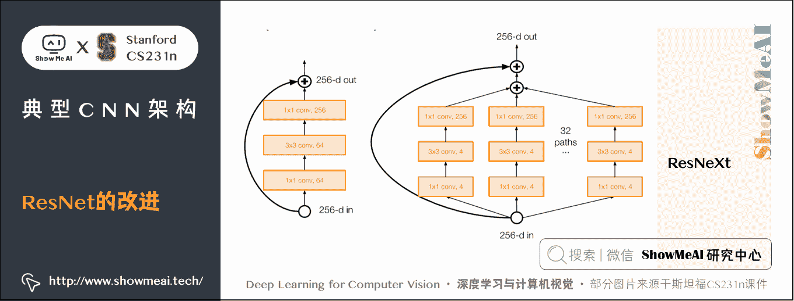

*   ResNet 创建者对结构改造
*   通过多个平行路径增加残差块的宽度（cardinality）
*   与 Inception 模块相似的并行路径
*   单个分支「变窄」

### 4）Deep Networks with Stochastic Depth

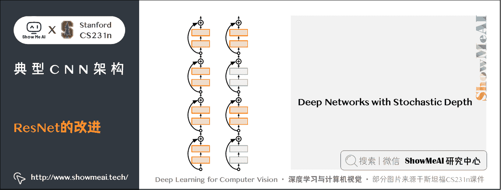

*   动机：通过缩短网络减少梯度消失和网络训练时间
*   在每次训练过程中随机丢弃一个层子集
*   具有自身映射功能的旁路，丢弃的层权重为 1，恒等映射
*   在测试时使用完整的深度网络

### 5）Network Ensembling（Fusion）

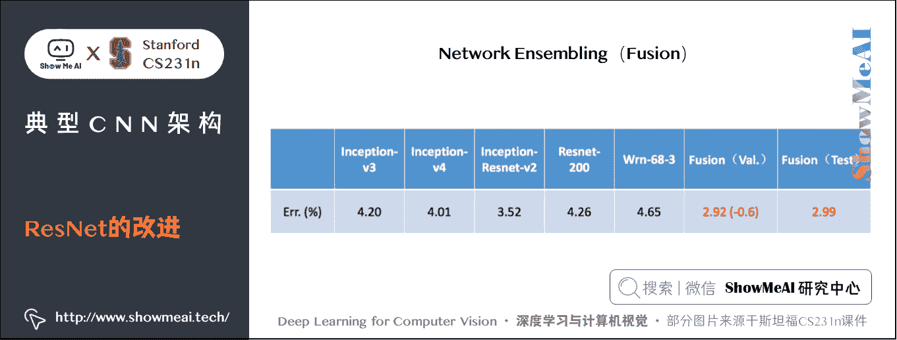

*   多尺度集成 Inception、Inception-Resnet、Resnet、Wide Resnet 模型
*   ILSVRC’16 分类获胜者

### 6）Squeeze-and-Excitation Networks (SENet)

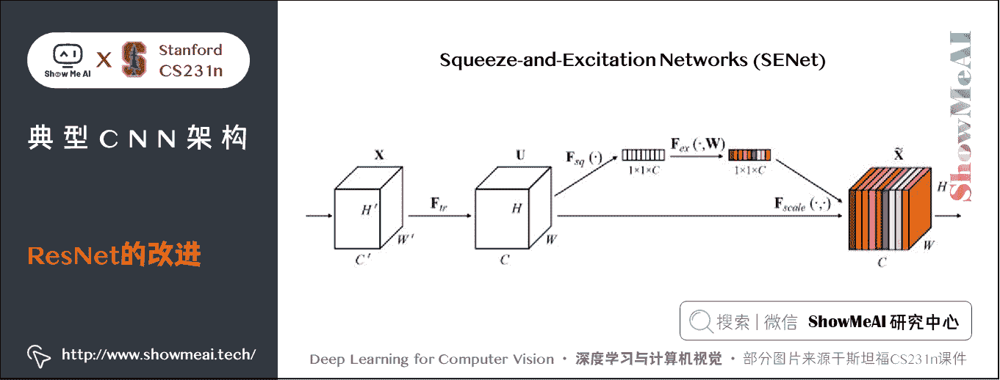

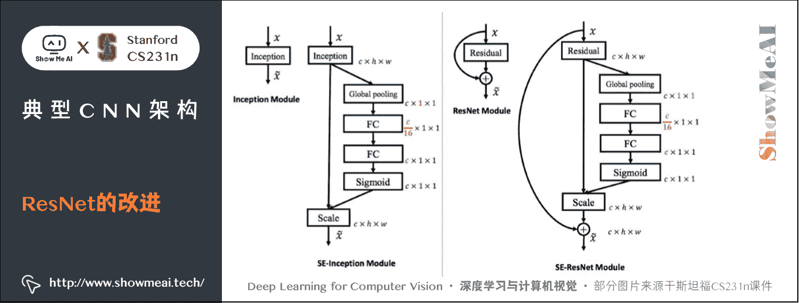

*   添加「特征重新校准」模块，该模块学习自适应重新加权特征图
*   全局信息（全局平均池化层）+ 2 个 FC 层，用于确定特征图权重，即「特征重新校准」模块
*   ILSVRC’17 分类获胜者（使用 ResNeXt-152 作为基础架构）

## 3.3 FractalNet

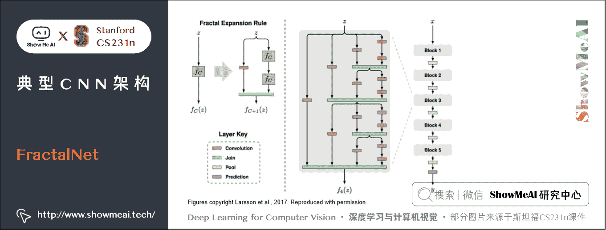

*   动机：认为从浅层到深层有效地过渡最重要，残差表示不是最重要的
*   具有浅和深路径输出的分形结构
*   训练时随机抛弃子路径
*   测试时使用完整网络

## 3.4 Densely Connected Convolutional Networks

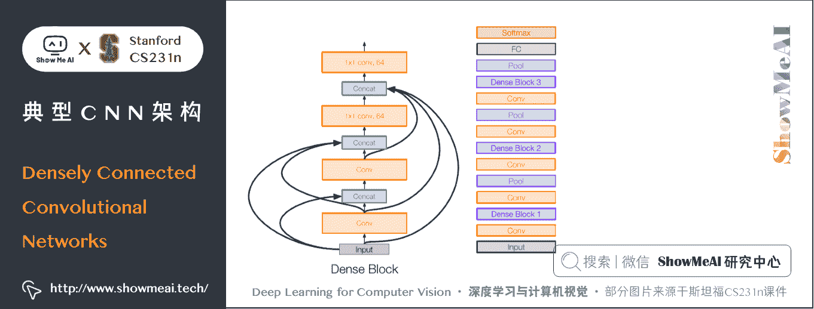

*   密集块，其中每个层以前馈方式连接到之后的每个层
*   减轻梯度消失、加强特征传播、鼓励特征重用

## 3.5 Efficient Networks —— SqueezeNet

> 对于 SqueezeNet 和其他轻量化网络感兴趣的同学也可以参考[ShowMeAI](http://www.showmeai.tech/)的**计算机视觉教程**中的文章[**轻量化 CNN 架构(SqueezeNet,ShuffleNet,MobileNet 等)**](http://www.showmeai.tech/article-detail/269)

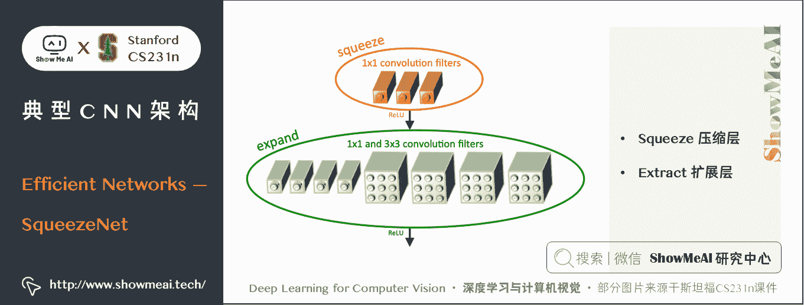

*   轻量化网络
*   1 × 1 1 \times 1 1×1 卷积核构建「挤压」层，进而组成 Fire 模块，由 1 × 1 1 \times 1 1×1 和 3 × 3 3 \times 3 3×3 卷积核组成「扩展」层
*   ImageNet 上的 AlexNet 级精度，参数减少 50 倍
*   可以压缩到比 AlexNet 小 510 倍（0.5Mb 参数）

## 3.6 Learn network architectures —— Meta-learning

### 1) Neural Architecture Search with Reinforcement Learning (NAS)

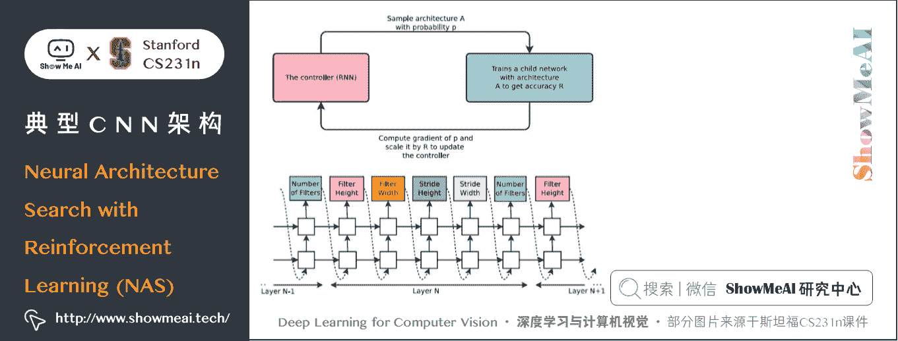

*   一种「控制器」网络，可以学习设计良好网络架构（输出与网络设计相对应的字符串）
*   迭代：
    *   1）从搜索空间中采样架构
    *   2）训练架构以获得相应于准确度的「奖励」R
    *   3）计算样本概率的梯度，通过 R 进行缩放以执行控制器参数更新，增加被采样架构良好的可能性，减少不良架构的可能性

### 2) Learning Transferable Architectures for Scalable Image Recognition

*   将神经架构搜索（NAS）应用于像 ImageNet 这样的大型数据集非常昂贵
*   设计可以灵活堆叠的构建块（「单元」）的搜索空间
*   **NASNet**：使用 NAS 在较小的 CIFAR-10 数据集上找到最佳的单元结构，然后将架构转移到 ImageNet

# 4.推荐学习

**可以点击 [B 站](https://www.bilibili.com/video/BV1g64y1B7m7?p=9) 查看视频的【双语字幕】版本**

[`player.bilibili.com/player.html?aid=759478950&page=9`](https://player.bilibili.com/player.html?aid=759478950&page=9)

【字幕+资料下载】斯坦福 CS231n | 面向视觉识别的卷积神经网络 (2017·全 16 讲)

*   [【课程学习指南】斯坦福 CS231n | 深度学习与计算机视觉](http://blog.showmeai.tech/cs231n/)
*   [【字幕+资料下载】斯坦福 CS231n | 深度学习与计算机视觉 (2017·全 16 讲)](https://www.bilibili.com/video/BV1g64y1B7m7)
*   [【CS231n 进阶课】密歇根 EECS498 | 深度学习与计算机视觉](http://blog.showmeai.tech/eecs498/)
*   [【深度学习教程】吴恩达专项课程 · 全套笔记解读](http://www.showmeai.tech/tutorials/35)
*   [【Stanford 官网】CS231n: Deep Learning for Computer Vision](http://cs231n.stanford.edu/)

# 5.要点总结

**经典架构**

*   **AlexNet**：开启 CNN 时代
*   **VGG**：减小卷积核尺寸、增加网络层数获得高准确率
*   **GoogLeNet**：引入 Inception module
*   **ResNet**：引入残差块，证明普通堆叠层数没意义，残差堆叠可以；目前应用最广泛的网络结构

**其他架构**

*   **NiN (Network in Network)** ： 1 × 1 1 \times 1 1×1 卷积先驱
*   **Wide ResNet**：加大 ResNet 的宽度而不是深度
*   **ResNeXT**：使用多个分支加宽 ResNet
*   **Stochastic Dept**：Dropout 层
*   **SENet**：自适应特征图重新加权
*   **DenseNet**：每个层连接到之后的每个层
*   **FractalNet**：使用分形结构，不用残差
*   **SqueezeNet**：压缩网络，减少参数
*   **NASNet**：学习网络架构

**网络应用总结**

*   VGG、GoogLeNet、ResNet 均被广泛使用，可在模型族中获取
*   ResNet 是当前默认最佳的选择，也可考虑 SENet
*   研究趋向于极深的网络
*   研究重心围绕层/跳过连接的设计和改善梯度流
*   努力研究深度、宽度与残差连接的必要性
*   更近期的趋势是研究 meta-learning

# [ShowMeAI](http://www.showmeai.tech) 斯坦福 CS231n 全套解读

*   [深度学习与计算机视觉教程(1) | CV 引言与基础 @CS231n](http://www.showmeai.tech/article-detail/260)
*   [深度学习与计算机视觉教程(2) | 图像分类与机器学习基础 @CS231n](http://www.showmeai.tech/article-detail/261)
*   [深度学习与计算机视觉教程(3) | 损失函数与最优化 @CS231n](http://www.showmeai.tech/article-detail/262)
*   [深度学习与计算机视觉教程(4) | 神经网络与反向传播 @CS231n](http://www.showmeai.tech/article-detail/263)
*   [深度学习与计算机视觉教程(5) | 卷积神经网络 @CS231n](http://www.showmeai.tech/article-detail/264)
*   [深度学习与计算机视觉教程(6) | 神经网络训练技巧 (上) @CS231n](http://www.showmeai.tech/article-detail/265)
*   [深度学习与计算机视觉教程(7) | 神经网络训练技巧 (下) @CS231n](http://www.showmeai.tech/article-detail/266)
*   [深度学习与计算机视觉教程(8) | 常见深度学习框架介绍 @CS231n](http://www.showmeai.tech/article-detail/267)
*   [深度学习与计算机视觉教程(9) | 典型 CNN 架构 (Alexnet, VGG, Googlenet, Restnet 等) @CS231n](http://www.showmeai.tech/article-detail/268)
*   [深度学习与计算机视觉教程(10) | 轻量化 CNN 架构 (SqueezeNet, ShuffleNet, MobileNet 等) @CS231n](http://www.showmeai.tech/article-detail/269)
*   [深度学习与计算机视觉教程(11) | 循环神经网络及视觉应用 @CS231n](http://www.showmeai.tech/article-detail/270)
*   [深度学习与计算机视觉教程(12) | 目标检测 (两阶段, R-CNN 系列) @CS231n](http://www.showmeai.tech/article-detail/271)
*   [深度学习与计算机视觉教程(13) | 目标检测 (SSD, YOLO 系列) @CS231n](http://www.showmeai.tech/article-detail/272)
*   [深度学习与计算机视觉教程(14) | 图像分割 (FCN, SegNet, U-Net, PSPNet, DeepLab, RefineNet) @CS231n](http://www.showmeai.tech/article-detail/273)
*   [深度学习与计算机视觉教程(15) | 视觉模型可视化与可解释性 @CS231n](http://www.showmeai.tech/article-detail/274)
*   [深度学习与计算机视觉教程(16) | 生成模型 (PixelRNN, PixelCNN, VAE, GAN) @CS231n](http://www.showmeai.tech/article-detail/275)
*   [深度学习与计算机视觉教程(17) | 深度强化学习 (马尔可夫决策过程, Q-Learning, DQN) @CS231n](http://www.showmeai.tech/article-detail/276)
*   [深度学习与计算机视觉教程(18) | 深度强化学习 (梯度策略, Actor-Critic, DDPG, A3C) @CS231n](http://www.showmeai.tech/article-detail/277)

# [ShowMeAI](http://www.showmeai.tech) 系列教程推荐

*   [大厂技术实现：推荐与广告计算解决方案](http://www.showmeai.tech/tutorials/50)
*   [大厂技术实现：计算机视觉解决方案](http://www.showmeai.tech/tutorials/51)
*   [大厂技术实现：自然语言处理行业解决方案](http://www.showmeai.tech/tutorials/52)
*   [图解 Python 编程：从入门到精通系列教程](http://www.showmeai.tech/tutorials/56)
*   [图解数据分析：从入门到精通系列教程](http://www.showmeai.tech/tutorials/33)
*   [图解 AI 数学基础：从入门到精通系列教程](http://www.showmeai.tech/tutorials/83)
*   [图解大数据技术：从入门到精通系列教程](http://www.showmeai.tech/tutorials/84)
*   [图解机器学习算法：从入门到精通系列教程](http://www.showmeai.tech/tutorials/34)
*   [机器学习实战：手把手教你玩转机器学习系列](http://www.showmeai.tech/tutorials/41)
*   [深度学习教程：吴恩达专项课程 · 全套笔记解读](http://www.showmeai.tech/tutorials/35)
*   [自然语言处理教程：斯坦福 CS224n 课程 · 课程带学与全套笔记解读](http://www.showmeai.tech/tutorials/36)
*   [深度学习与计算机视觉教程：斯坦福 CS231n · 全套笔记解读](http://www.showmeai.tech/tutorials/37)

