# 深度学习与计算机视觉教程(10) | 轻量化 CNN 架构 (SqueezeNet,ShuffleNet,MobileNet 等)（CV 通关指南·完结）

> 原文：[`blog.csdn.net/ShowMeAI/article/details/125025764`](https://blog.csdn.net/ShowMeAI/article/details/125025764)

*   作者：[韩信子](https://github.com/HanXinzi-AI)@[ShowMeAI](http://www.showmeai.tech/)
*   [教程地址](http://www.showmeai.tech/tutorials/37)：[`www.showmeai.tech/tutorials/37`](http://www.showmeai.tech/tutorials/37)
*   [本文地址](http://www.showmeai.tech/article-detail/269)：[`www.showmeai.tech/article-detail/269`](http://www.showmeai.tech/article-detail/269)
*   声明：版权所有，转载请联系平台与作者并注明出处
*   **收藏[ShowMeAI](http://www.showmeai.tech/)查看更多精彩内容**

* * *

# 前言

卷积神经网络的结构优化和深度加深，带来非常显著的图像识别效果提升，但同时也带来了高计算复杂度和更长的计算时间，实际工程应用中对效率的考虑也很多，研究界与工业界近年都在努力「保持效果的情况下压缩网络复杂度」，也诞生了很多轻量化网络。在本篇内容中，ShowMeAI 对常见主流轻量级网络进行展开讲解。

## 本篇重点

*   神经网络参数与复杂度计算
*   轻量化网络
*   SqueezeNet
*   Xception
*   ShuffleNet V1~V2
*   MobileNet V1~V3

# 1.基础知识

我们先来做一点基础知识储备，本篇讲到的轻量化 CNN 框架，我们需要了解参数量和计算量的估测与计算方式。

## 1.1 复杂度分析

*   **理论计算量**（FLOPs）：浮点运算次数（FLoating-point Operation）
*   **参数数量**(params)：单位通常为 M M M，用 float32 表示。

## 1.2 典型结构对比

*   **标准卷积层 std conv**（主要贡献计算量）
    *   params： k h × k w × c i n × c o u t k_h\times k_w\times c_{in}\times c_{out} kh​×kw​×cin​×cout​
    *   FLOPs： k h × k w × c i n × c o u t × H × W k_h\times k_w\times c_{in}\times c_{out}\times H\times W kh​×kw​×cin​×cout​×H×W
*   **全连接层 fc**（主要贡献参数量）
    *   params： c i n × c o u t c_{in}\times c_{out} cin​×cout​
    *   FLOPs： c i n × c o u t c_{in}\times c_{out} cin​×cout​
*   **group conv**
    *   params： ( k h × k w × c i n / g × c o u t / g ) × g = k h × k w × c i n × c o u t / g (k_h\times k_w\times c_{in}/g \times c_{out}/g)\times g=k_h\times k_w\times c_{in}\times c_{out}/g (kh​×kw​×cin​/g×cout​/g)×g=kh​×kw​×cin​×cout​/g
    *   FLOPs： k h × k w × c i n × c o u t × H × W / g k_h\times k_w\times c_{in}\times c_{out}\times H\times W/g kh​×kw​×cin​×cout​×H×W/g
*   **depth-wise conv**
    *   params： k h × k w × c i n × c o u t / c i n = k h × k w × c o u t k_h\times k_w\times c_{in}\times c_{out}/c_{in}=k_h\times k_w\times c_{out} kh​×kw​×cin​×cout​/cin​=kh​×kw​×cout​
    *   FLOPs： k h × k w × c o u t × H × W k_h\times k_w\times c_{out}\times H\times W kh​×kw​×cout​×H×W

# 2.SqueezeNet

轻量化网络中一个著名的网络是 SqueezeNet ，它发表于 ICLR 2017，它拥有与 AlexNet 相同的精度，但只用了 AlexNet 1/50 的参数量。

SqueezeNet 的核心在于采用不同于常规的卷积方式来降低参数量，具体做法是使用 Fire Module，先用 1 × 1 1 \times 1 1×1 卷积降低通道数目，然后用 1 × 1 1 \times 1 1×1 卷积和 3 × 3 3 \times 3 3×3 卷积提升通道数。

## 2.1 压缩策略

SqueezeNet 采用如下 3 个策略：

*   ① 将 3 × 3 3 \times 3 3×3 卷积替换为 1 × 1 1 \times 1 1×1 卷积
*   ② 减少 3 × 3 3 \times 3 3×3 卷积的通道数
*   ③ 将降采样操作延后，这样可以给卷积提供更大的 activation map，从而保留更多的信息，提供更高的分类准确率。

其中，策略 1 和 2 可以显著减少模型参数量，策略 3 可以在模型参数量受限的情况下提高模型的性能。

## 2.2 Fire Module

Fire Module 是 SqueezeNet 网络的基础模块，设计如下图所示：

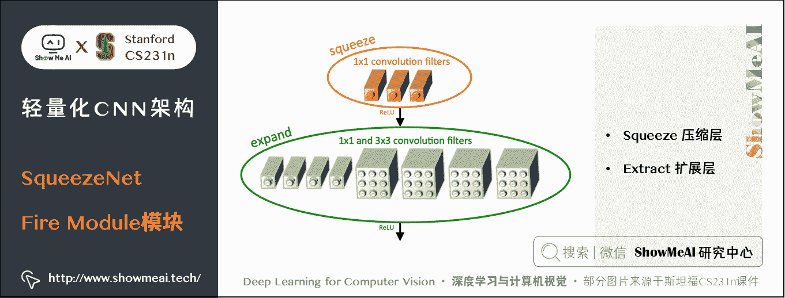

**一个 Fire Module 由 Squeeze 和 Extract 两部分组成**：

*   Squeeze 部分包括了一系列连续的 1 × 1 1 \times 1 1×1 卷积
*   Extract 部分包括了一系列连续的 1 × 1 1 \times 1 1×1 卷积和一系列连续的 3 × 3 3 \times 3 3×3 卷积，然后将 1 × 1 1 \times 1 1×1 和 3 × 3 3 \times 3 3×3 的卷积结果进行 concat。

记 Squeeze 部分的通道数为 C s 1 × 1 C_{s{1\times 1}} Cs1×1​，Extract 部分 1 × 1 1 \times 1 1×1 和 3 × 3 3 \times 3 3×3 的通道数分别为 C e 1 × 1 C_{e{1\times 1}} Ce1×1​ 和 C e 3 × 3 C_{e{3\times 3}} Ce3×3​，作者建议 C s 1 × 1 < C e 1 × 1 + C e 3 × 3 C_{s{1\times 1}} \lt C_{e{1\times 1}} + C_{e{3\times 3}} Cs1×1​<Ce1×1​+Ce3×3​ ，这样做相当于在 Squeeze 和 Extraxt 之间插入了 bottlenet。

## 2.3 网络结构

在**Fire Module**的基础上搭建 SqueezeNet 神经网络。它以卷积层开始，后面是 8 个 Fire Module，最后以卷积层结束，每个 Fire Module 中的通道数目逐渐增加。另外网络在 conv1，fire4，fire8，conv10 的后面使用了 max-pooling。

SqueezeNet 结构如下图所示，左侧是不加 shortcut 的版本，中间是加了 shortcut 的版本，右侧是在不同通道的特征图之间加入 shortcut 的版本。

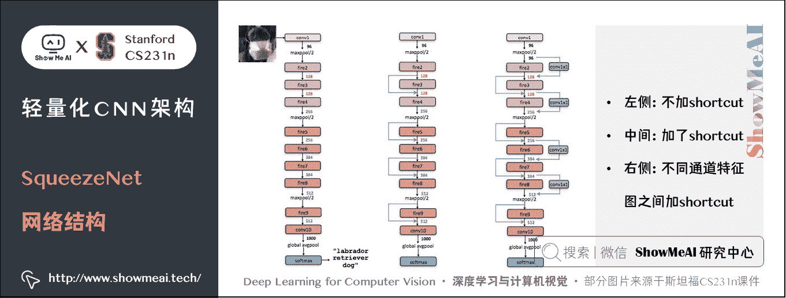

**SqueezeNet 的性能类似于 AlenNet，然而参数量只有后者的 1/50，使用 Deep Compression 可以进一步将模型大小压缩到仅仅有 0.5M。**

## 2.4 SqueezeNet 缺点

SqueezeNet 缺点如下：

*   SqueezeNet 通过更深的网络置换更多的参数，虽然有更低的参数量，但是网络的测试阶段耗时会增加，考虑到轻量级模型倾向于应用在嵌入式场景，这一变化可能会带来新的问题。
*   AlaxNet 的参数量(50M)大部分由全连接层带来，加上一部分参数量进行对比，数字稍有夸张。

# 3.Xception

另一个需要提到的典型网络是 Xception，它的基本思想是，在 Inception V3 的基础上，引入沿着通道维度的解耦合，基本不增加网络复杂度的前提下提高了模型的效果，使用 Depthwise Seperable Convolution 实现。

Xception 虽然不是出于轻量级的考虑而设计的模型，但是由于使用了 pointwise convolution 和 depthwise convolution 的结合，实际上也起到了降低参数量的效果，我们也放在轻量模型里做个介绍。

## 3.1 设计动机

卷积在 HWC（高 × \times × 宽 × \times × 通道数）这 3 个维度上进行学习，既考虑空间相关性，又考虑通道相关性，可以考虑这两种相关性解耦分开。

Xception 的做法是使用 point-wise convolution 考虑 cross-channel correlation，使用 depthwise convolution 考虑 spatial correlation。

## 3.2 从 Inception 到 Extreme version of Inception

下图是一个 Inception V3 的基础模块，分别用 1 × 1 1 \times 1 1×1 卷积和 3 × 3 3 \times 3 3×3 卷积考虑通道相关性和空间相关性，基本结构是用 1 × 1 1 \times 1 1×1 卷积降维，用 3 × 3 3 \times 3 3×3 卷积提取特征：

如果将上述结构简化，则可以得到如下的结构，可见每一个分支都包含了一个 1 × 1 1 \times 1 1×1 卷积和一个 3 × 3 3 \times 3 3×3 卷积：

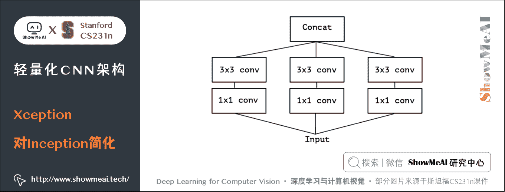

从上图中可见，对于每一个分支，该模块使用 1 × 1 1 \times 1 1×1 卷积对输入特征图进行处理，然后使用 3 × 3 3 \times 3 3×3 卷积提取特征。

如果考虑空间相关性和通道相关性的解耦合，即用同一个 1 × 1 1 \times 1 1×1 卷积进行通道处理，将处理结果沿着通道维度拆解为若干部分，对于每一部分使用不同的 3 × 3 3 \times 3 3×3 卷积提取特征，则得到如下图所示的模块：

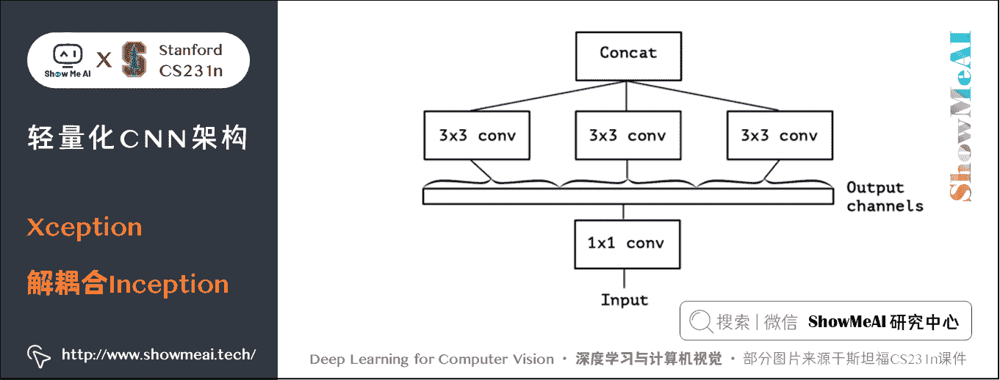

考虑一种更为极端的情况，在使用 1 × 1 1 \times 1 1×1 卷积之后，沿着通道维度进行最为极端的拆解，对于拆解后的每一个部分使用 3 × 3 3 \times 3 3×3 卷积提取特征，这一步可以使用 depthwise convolution 实现，最后将这些提取到的特征图进行 concat，这就是 Xception 的基础模块，如下图所示：

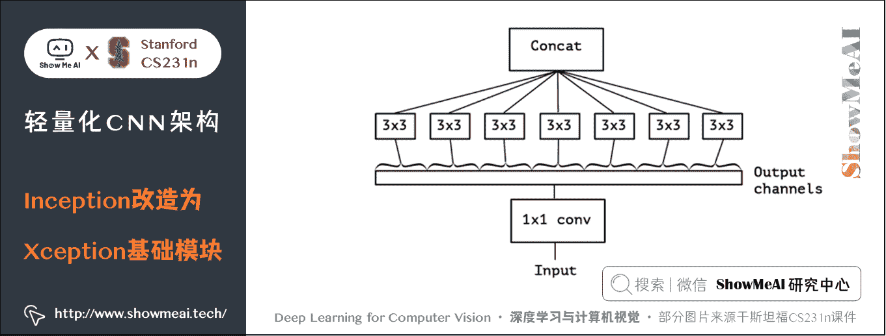

通过上图可以看到，该模块将输入数据在「通道维度」上解耦，我们称之为 extreme version of inception module。这点与 depthwise seperable convolution 很相似。

## 3.3 Extreme version of Inception 与 Depthwise Seperable Convolution

这一操作与 Depthwise Seperable Convolution 十分相似，后者包含 Depthwise Convolution 和 Pointwise Convolution 两部分。

上图所示的基础模块与 Depthwise Seperable Convolution 有如下两点不同：

*   ① Depthwise Seperable Convolution 先使用 depthwise convolution，再使用 1 × 1 1 \times 1 1×1 卷积进行融合；上图所示的基础模块先使用 1 × 1 1 \times 1 1×1 卷积，再使用 depthwise convolution。
*   ② Depthwise Seperable Convolution 的 depthwise convolution 和 1 × 1 1 \times 1 1×1 卷积之间没有激活函数；上图所示的基础模块的这两个操作之间有激活函数。

在 Xception 中，作者直接使用了 Depthwise Seperable Convolution 作为基础模块。

## 3.4 Xception 网络结构

最后将这一基础模块叠加，并结合残差连接，就得到了 Xception 网络结构：

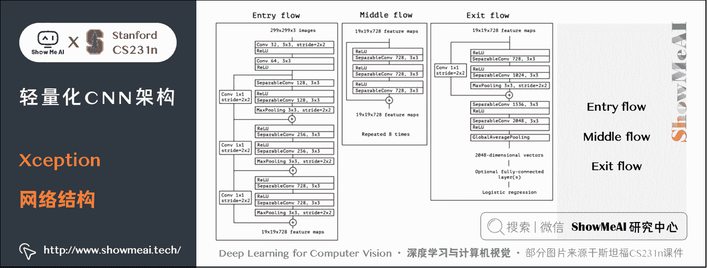

# 4.ShuffleNet

ShuffleNet 是由旷世科技提出的轻量化 CNN 网络，论文名称《*ShuffleNet： An Extremely Efficient Convolutional Neural Network for Mobile Devices*》，目标是改造网络架构使其能应用在移动设备上。

## 4.1 设计动机

ShuffleNet 的动机在于大量的 1 × 1 1 \times 1 1×1 卷积会耗费很多计算资源，而 Group Conv 难以实现不同分组之间的信息交流；ShuffleNet 的解决方式是：使用 Group Conv 降低参数量；使用 Channel Shuffle 实现不同组之间的信息交流，进而对 ResNet 进行改进，可以看作 ResNet 的压缩版本。

## 4.2 Group Conv

我们再来看看 Group Conv 这个结构，它的基本思想是对输入层的不同特征图进行分组，再使用不同的卷积核对不同组的特征图进行卷积，通过分组降低卷积的计算量。

而 Depthwise Convolution 可以视作 Group Conv 的一种特殊情形。

假设输入通道为 C i C_i Ci​，输出通道为 C o C_o Co​，分组数目为 g g g，Group Conv 的操作如下：

*   将输入特征图沿着通道分为 g g g 组，每一组的通道数目为 C i / g C_i/g Ci​/g。
*   使用 g g g 个不同的卷积核，每一个卷积核的滤波器数量为 C o / g C_o/g Co​/g。
*   使用这 g g g 个不同的卷积核，对 g g g 组特征图分别进行卷积，得到 g g g 组输出特征图，每一组的通道数为 C o / g C_o/g Co​/g。
*   将这 g g g 组的输出特征图结合，得到最终的 C o C_o Co​ 通道的输出特征图。

## 4.3 Channel Shuffle

Group Conv 的一个缺点在于不同组之间难以实现通信。一个可能的解决方式是使用 1 × 1 1 \times 1 1×1 卷积进行通信，但是这样会引入很大的计算量。

文中提出的思路是对 Group Conv 之后的特征图沿着通道维度进行重组，这样信息就可以在不同组之间流转，即 Channel Shuffle，如下图©所示。

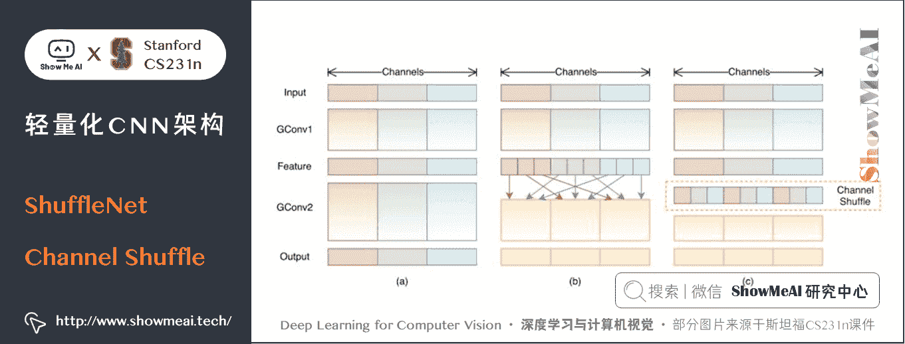

其实现过程如下：

*   ① 输入特征图通道数目为 g × n g\times n g×n
*   ② 将特征图的通道维度 reshape 为 ( g , n ) (g,n ) (g,n)
*   ③ 转置为 ( n , g ) (n,g ) (n,g)
*   ④ 平坦化成 g × n g \times n g×n 个通道

## 4.4 ShuffleNet 基础模块

结合 Group Conv 和 Channel Shuffle，对 ResNet 的基础模块 bottleneck（下图(a)）进行改进，就得到了 ShuffleNet 的基础模块（下图(b)和©）

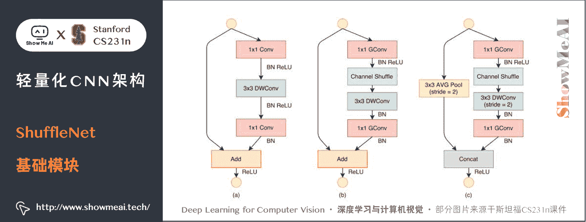

## 4.5 ShuffleNet 缺点

*   Channel Shuffle 操作较为耗时，导致 ShuffleNet 的实际运行速度没有那么理想。
*   Channel Shuffle 的规则是人为制定的，更接近于人工设计特征。

# 5.ShuffleNet V2

在 ShuffleNet 之后又有改进的版本 ShuffleNet V2，改进了上述提到的 ShuffleNet 缺点，减少其耗时。

## 5.1 设计动机

ShuffleNet 的轻量级网络设计，FLOPs 减少了很多，但实际的时间消耗并不短。原因是网络训练或者推理的过程中，FLOPs 仅仅是其耗时的一部分，其他操作（如内存读写、外部数据 IO 等）也会占用时间。

ShuffleNet V2 的作者分析了几种网络结构在 GPU/ARM 这两种平台上的计算性能指标，并提出了 4 条移动端卷积网络设计的准则，根据这些准则改进 ShuffleNet 得到了 ShuffleNet V2。

我们先来看看这 4 条移动端网络设计准则：

## 5.2 高效 CNN 设计的几个准则

使用的指标是内存访问时间（Memory Access Cost, MAC）。用理论和实验说明了以下几条准则。

### 1) 输入输出通道数目相同时，卷积层所需的 MAC 最小。

**理论推导**：假设 1 × 1 1 \times 1 1×1 卷积的输入通道数目为 c 1 c_1 c1​，输出通道数目为 c 2 c_2 c2​，特征图大小为 h × w h\times w h×w，则这样一个 1 × 1 1 \times 1 1×1 卷积的 FLOPs 为：

B = h w c 1 c 2 B=hwc_1 c_2 B=hwc1​c2​

所需的存储空间如下，其中 h w c 1 hwc_1 hwc1​ 表示输入特征图所需空间， h w c 2 hwc_2 hwc2​ 表示输出特征图所需空间， c 1 c 2 c_1c_2 c1​c2​ 表示卷积核所需空间：

M A C = h w ( c 1 + c 2 + c 1 c 2 ) MAC = hw(c_1 + c_2 + c_1 c_2) MAC=hw(c1​+c2​+c1​c2​)

根据均值不等式可得：

M A C ≥ 2 h w B + B h w MAC \ge 2 \sqrt {hwB} + \frac {B}{hw} MAC≥2hwB  ​+hwB​

等式成立的条件是 c 1 = c 2 c_1 = c_2 c1​=c2​，即在给定 FLOPs，输入特征通道数和输出特征通道数相等时，MAC 达到取值的下界。 **实验证明： c 1 c_1 c1​和 c 2 c_2 c2​越接近、速度越快，如下表。**

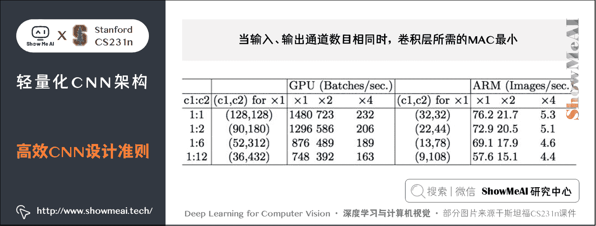

### 2) 过多的 group 操作会增大 MAC

**理论推导**：带 group 的 1 × 1 1 \times 1 1×1 卷积的 FLOPs 如下，其中 g g g 表示分组数目：

B = h w c 1 c 2 g B = \frac{hwc_1c_2}{g} B=ghwc1​c2​​

MAC 如下：

M A C = h w ( c 1 + c 2 + c 1 c 2 g ) MAC = hw(c_1 + c_2 + \frac {c_1c_2}{g} ) MAC=hw(c1​+c2​+gc1​c2​​)

因此：

M A C = h w ( c 1 + c 2 + c 1 c 2 g = h w c 1 + B g c 1 + B h w \begin{aligned} MAC &= hw(c_1 + c_2 + \frac {c_1c_2}{g} \\ & =hwc_1 + \frac {Bg} {c_1} + \frac {B} {hw} \end{aligned} MAC​=hw(c1​+c2​+gc1​c2​​=hwc1​+c1​Bg​+hwB​​

可见，在一定 FLOPs 的情况下，分组数目 g g g 越大，MAC 也越大。

**实验证明：在 FLOPs 基本不变的操作下，group 越大，速度越慢，如下图所示。**

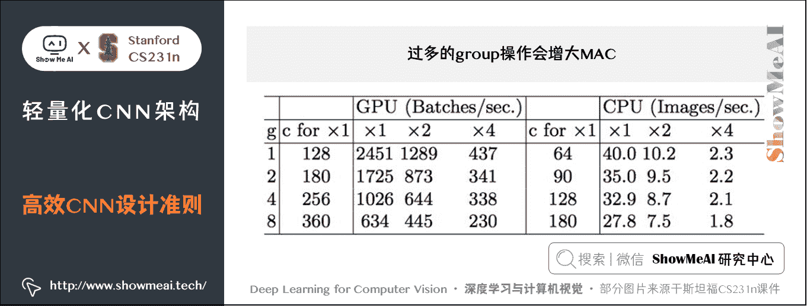

### 3) 模型的碎片化程度越低，模型速度越快

实验证明：fragment 表示碎片化程度的量化，serious 表示串行，即几个卷积层的叠加，parallel 表示并行，即类似于 Inception 的设计。可见在 FLOPs 不变的情况下，分支数量越多，网络的实际耗时越大。

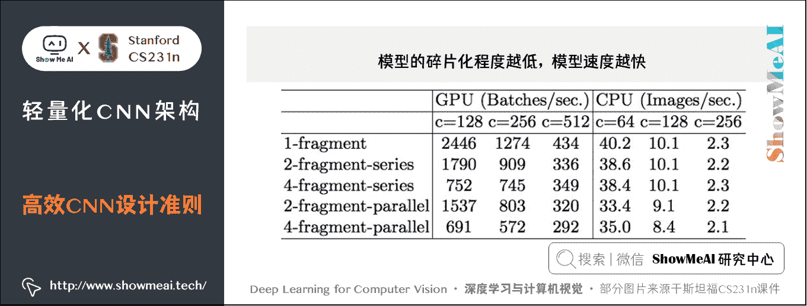

### 4) element-wise 操作所带来的时间消耗远比在 FLOPs 上的体现的数值要多。

element-wise 操作虽然基本不增加 FLOPs，但是在 ShuffleNet V1 和 MobileNet V2 中，其耗时是十分可观的，如下图：

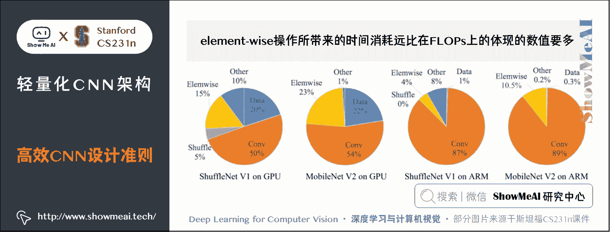

实验证明：基于 ResNet 的 bottleneck 进行了实验，short-cut 是一种 element-wise 操作。实验证明 short-cut 操作会带来耗时的增加。

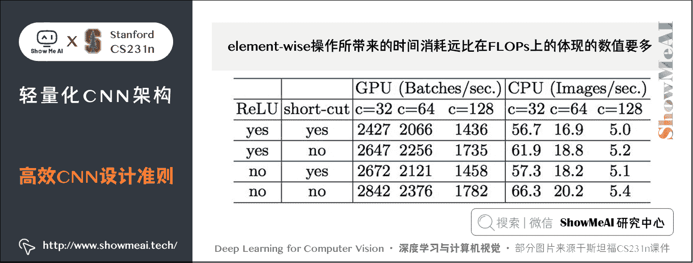

## 5.3 ShuffleNet V2 基础模块

基于前面提到的 4 条准则，对 ShuffleNet 的基础模块（下图(a)(b)）进行修改，得到 ShuffleNet V2 的基础模块（下图中©(d)）：

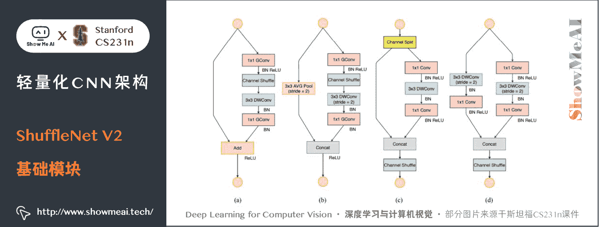

图中 © 和 (a) 相比，有如下不同之处：

*   ① 模块的开始处增加了一个 Channel Split 操作，将输入特征图沿着通道分为 c ′ c' c′ 和 c − c ′ c-c' c−c′ 两部分，文中 c ′ = c / 2 c'=c/2 c′=c/2 ，对应于「**准则 1**」。
*   ② 取消了 1 × 1 1 \times 1 1×1 卷积中的 Group 操作，对应于「**准则 2**」。
*   ③ Channel Shuffle 移到了 Concat 后面，对应「**准则 3**」。（因为 1 × 1 1 \times 1 1×1 卷积没有 Group 操作，没有必要在后面接 Channel Shuffle）
*   ④ element-wise add 替换成 concat，对应「**准则 4**」。

(b)、(d) 之间的区别也类似，另外(d) 的两个分支都进行了降采样，且最初没有 Channel Split 操作，因此 Concat 之后的通道数目翻倍。

## 5.4 ShuffleNet V2 整体结构

上述 ShuffleNet V2 基础模块级联，配合卷积、池化等衔接，就得到了如下图的 ShuffleNet V2 结构：

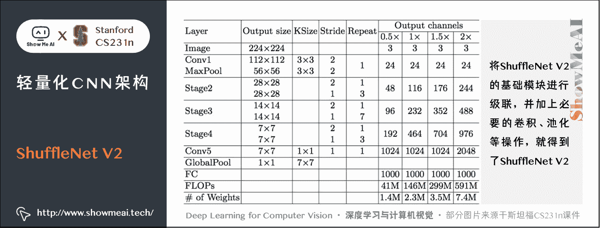

# 6.MobileNet

另外一个非常有名的轻量化移动端网络是 MobileNet，它是专用于移动和嵌入式视觉应用的卷积神经网络，是基于一个流线型的架构，使用深度可分离的卷积来构建轻量级的深层神经网络。 MobileNet 凭借其优秀的性能，广泛应用于各种场景中，包括物体检测、细粒度分类、人脸属性和大规模地理定位。

MobileNet 有 V1 到 V3 不同的版本，也逐步做了一些优化和效果提升，下面我们来分别看看它的细节。

## 6.1 MobileNet 核心思想

MobileNet V1 的核心是将卷积拆分成 Depthwise Conv 和 Pointwise Conv 两部分，我们来对比一下普通网络和 MobileNet 的基础模块

*   **普通网络（以 VGG 为例）** ： 3 × 3 3 \times 3 3×3 Conv BN ReLU
*   **Mobilenet 基础模块**： 3 × 3 3 \times 3 3×3 Depthwise Conv BN ReLU 和 1 × 1 1\times1 1×1 Pointwise Conv BN ReLU

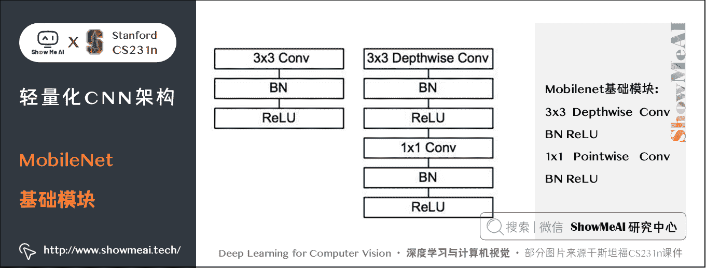

## 6.2 MobileNet 缺点

*   ① ReLU 激活函数用在低维特征图上，会破坏特征。
*   ② ReLU 输出为 0 时导致特征退化。用残差连接可以缓解这一问题。

# 7.MobileNet V2

MobileNet V2 针对 MobileNet 的上述 2 个问题，引入了 Inverted Residual 和 Linear Bottleneck 对其进行改造，网络为全卷积，使用 RELU6（最高输出为 6）激活函数。下面我们展开介绍一下核心结构：

## 7.1 Inverted Residual

我们对比一下普通残差模块和 Inverted Residual 的差别

### 1) 普通残差模块

先使用 1 × 1 1 \times 1 1×1 卷积降低通道数量，然后使用 3 × 3 3 \times 3 3×3 卷积提取特征，之后使用 1 × 1 1 \times 1 1×1 卷积提升通道数量，最后加上残差连接。整个过程是「压缩-卷积-扩张」。

### 2) Inverted Residual

先使用 1 × 1 1 \times 1 1×1 卷积提升通道数量，然后使用 3 × 3 3 \times 3 3×3 卷积提取特征，之后使用 1 × 1 1 \times 1 1×1 卷积降低通道数量，最后加上残差连接。整个过程是「扩张-卷积-压缩」。

对比两个结构块如下图所示：

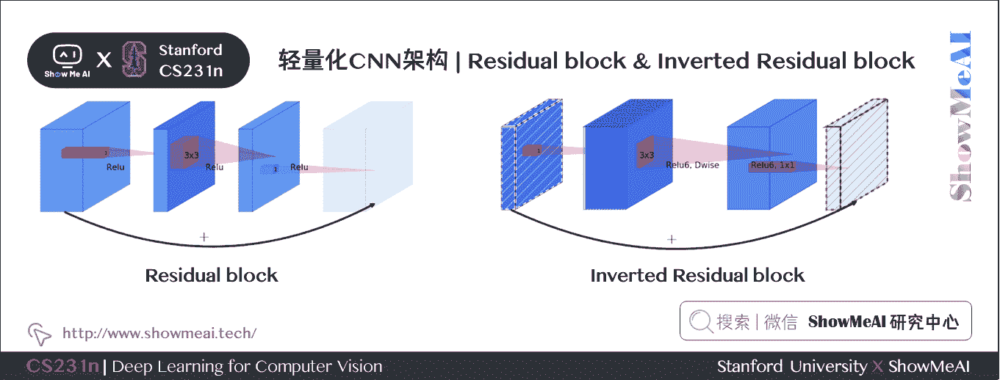

## 7.2 Linear Bottleneck

相比于 MobileNet 的基础模块，MobileNet V2 在 Depthwise Convolution 的前面加了一个 1 × 1 1 \times 1 1×1 卷积，使用 ReLU6 代替 ReLU，且去掉了第二个 1 × 1 1 \times 1 1×1 卷积的激活函数（即使用线性的激活函数），防止 ReLU 对特征的破坏。

## 7.3 MobileNet V2 基础模块

使用上述的方法对 MobileNet 的基础模块进行改进，得到如下所示的 MobileNet V2 基础模块：

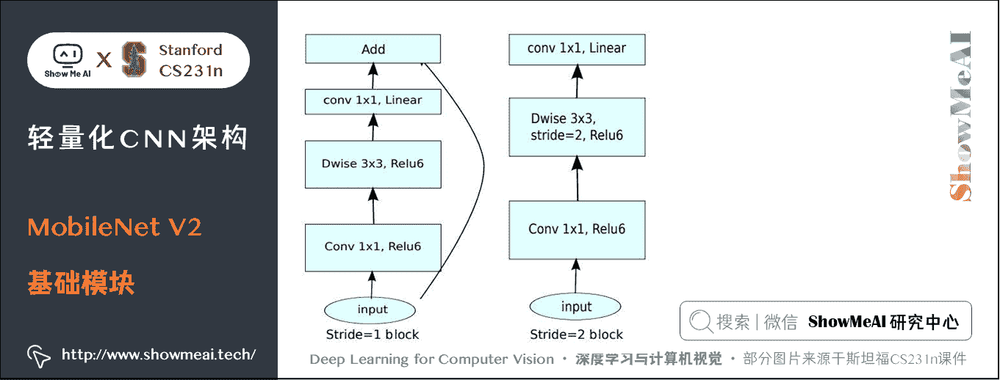

# 8.MobileNet V3

在 MobileNet V2 的基础上，又提出了 MobileNet V3，它的优化之处包括：**引入了 SE**、**尾部结构改进**、**通道数目调整**、**h-swish 激活函数应用**，**NAS 网络结构搜索**等。我们来逐个看一下：

## 8.1 SE 结构

MobileNet V3 在 bottleneck 中引入了 SE 结构，放在 Depthwise Convolution 之后，并且将 Expansion Layer 的通道数目变为原来的 1 / 4 1/4 1/4 ，在提升精度的同时基本不增加时间消耗。

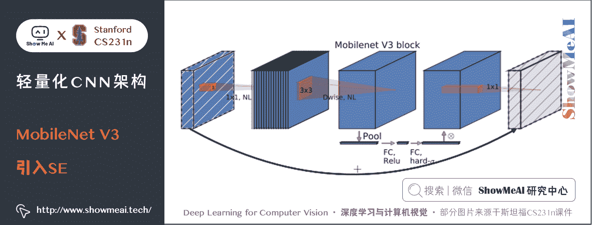

## 8.2 尾部结构改进

MobileNet V3 对尾部结构做了 2 处修改，从下图中「上方结构」修改为「下方结构」：

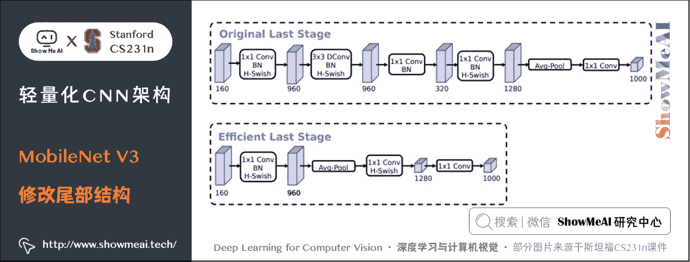

*   将 1 × 1 1 \times 1 1×1 卷积移动到 avg pooling 后面，降低计算量。
*   去掉了尾部结构中「**扩张-卷积-压缩**」中的 3 × 3 3 \times 3 3×3 卷积以及其后面的 1 × 1 1 \times 1 1×1 卷积，进一步减少计算量，精度没有损失。

## 8.3 通道数目调整

相比于 MobileNet V2，MobileNet V3 对头部卷积通道数目进行了进一步的降低。

## 8.4 h-swish 激活函数

MobileNet V3 采用了 h − s w i s h \mathbf{h-swish} h−swish 激活函数，对应的 s w i s h \mathbf{swish} swish 和 h − s w i s h \mathbf{h-swish} h−swish 激活函数计算公式如下：

s w i s h [ x ] = x ⋅ σ ( x ) \mathbf{swish}[x] = x \cdot \sigma(x) swish[x]=x⋅σ(x)

h − s w i s h [ x ] = x R e L U 6 ( x + 3 ) 6 \mathbf{h-swish}[x] = x \frac {\mathbf{ReLU6}(x + 3)}{6} h−swish[x]=x6ReLU6(x+3)​

## 8.5 NAS 网络结构搜索

MobileNet V3 先用 NAS 搜索各个模块，得到大致的网络结构，相当于整体结构搜索；然后用 NASAdapt 得到每个卷积层的通道数目，相当于局部搜索。

# 9.参考资料

*   [卷积神经网络的复杂度分析](https://zhuanlan.zhihu.com/p/31575074)
*   [纵览轻量化卷积神经网络：SqueezeNet、MobileNet、ShuffleNet、Xception](https://www.jiqizhixin.com/articles/2018-01-08-6)
*   [轻量级 CNN 网络之 MobileNet V2](https://zhuanlan.zhihu.com/p/52426865)
*   [ShuffleNet V2：轻量级 CNN 网络中的桂冠](https://zhuanlan.zhihu.com/p/48261931)
*   [Roofline Model 与深度学习模型的性能分析](https://zhuanlan.zhihu.com/p/34204282)

# 10.要点总结

*   神经网络参数与复杂度计算
*   轻量化网络
*   SqueezeNet
*   Xception
*   ShuffleNet V1~V2
*   MobileNet V1~V3

# [ShowMeAI](http://www.showmeai.tech) 斯坦福 CS231n 全套解读

*   [深度学习与计算机视觉教程(1) | CV 引言与基础 @CS231n](http://www.showmeai.tech/article-detail/260)
*   [深度学习与计算机视觉教程(2) | 图像分类与机器学习基础 @CS231n](http://www.showmeai.tech/article-detail/261)
*   [深度学习与计算机视觉教程(3) | 损失函数与最优化 @CS231n](http://www.showmeai.tech/article-detail/262)
*   [深度学习与计算机视觉教程(4) | 神经网络与反向传播 @CS231n](http://www.showmeai.tech/article-detail/263)
*   [深度学习与计算机视觉教程(5) | 卷积神经网络 @CS231n](http://www.showmeai.tech/article-detail/264)
*   [深度学习与计算机视觉教程(6) | 神经网络训练技巧 (上) @CS231n](http://www.showmeai.tech/article-detail/265)
*   [深度学习与计算机视觉教程(7) | 神经网络训练技巧 (下) @CS231n](http://www.showmeai.tech/article-detail/266)
*   [深度学习与计算机视觉教程(8) | 常见深度学习框架介绍 @CS231n](http://www.showmeai.tech/article-detail/267)
*   [深度学习与计算机视觉教程(9) | 典型 CNN 架构 (Alexnet, VGG, Googlenet, Restnet 等) @CS231n](http://www.showmeai.tech/article-detail/268)
*   [深度学习与计算机视觉教程(10) | 轻量化 CNN 架构 (SqueezeNet, ShuffleNet, MobileNet 等) @CS231n](http://www.showmeai.tech/article-detail/269)
*   [深度学习与计算机视觉教程(11) | 循环神经网络及视觉应用 @CS231n](http://www.showmeai.tech/article-detail/270)
*   [深度学习与计算机视觉教程(12) | 目标检测 (两阶段, R-CNN 系列) @CS231n](http://www.showmeai.tech/article-detail/271)
*   [深度学习与计算机视觉教程(13) | 目标检测 (SSD, YOLO 系列) @CS231n](http://www.showmeai.tech/article-detail/272)
*   [深度学习与计算机视觉教程(14) | 图像分割 (FCN, SegNet, U-Net, PSPNet, DeepLab, RefineNet) @CS231n](http://www.showmeai.tech/article-detail/273)
*   [深度学习与计算机视觉教程(15) | 视觉模型可视化与可解释性 @CS231n](http://www.showmeai.tech/article-detail/274)
*   [深度学习与计算机视觉教程(16) | 生成模型 (PixelRNN, PixelCNN, VAE, GAN) @CS231n](http://www.showmeai.tech/article-detail/275)
*   [深度学习与计算机视觉教程(17) | 深度强化学习 (马尔可夫决策过程, Q-Learning, DQN) @CS231n](http://www.showmeai.tech/article-detail/276)
*   [深度学习与计算机视觉教程(18) | 深度强化学习 (梯度策略, Actor-Critic, DDPG, A3C) @CS231n](http://www.showmeai.tech/article-detail/277)

# [ShowMeAI](http://www.showmeai.tech) 系列教程推荐

*   [大厂技术实现：推荐与广告计算解决方案](http://www.showmeai.tech/tutorials/50)
*   [大厂技术实现：计算机视觉解决方案](http://www.showmeai.tech/tutorials/51)
*   [大厂技术实现：自然语言处理行业解决方案](http://www.showmeai.tech/tutorials/52)
*   [图解 Python 编程：从入门到精通系列教程](http://www.showmeai.tech/tutorials/56)
*   [图解数据分析：从入门到精通系列教程](http://www.showmeai.tech/tutorials/33)
*   [图解 AI 数学基础：从入门到精通系列教程](http://www.showmeai.tech/tutorials/83)
*   [图解大数据技术：从入门到精通系列教程](http://www.showmeai.tech/tutorials/84)
*   [图解机器学习算法：从入门到精通系列教程](http://www.showmeai.tech/tutorials/34)
*   [机器学习实战：手把手教你玩转机器学习系列](http://www.showmeai.tech/tutorials/41)
*   [深度学习教程：吴恩达专项课程 · 全套笔记解读](http://www.showmeai.tech/tutorials/35)
*   [自然语言处理教程：斯坦福 CS224n 课程 · 课程带学与全套笔记解读](http://www.showmeai.tech/tutorials/36)
*   [深度学习与计算机视觉教程：斯坦福 CS231n · 全套笔记解读](http://www.showmeai.tech/tutorials/37)

