# 深度学习与计算机视觉教程(11) | 循环神经网络及视觉应用（CV 通关指南·完结）

> 原文：[`blog.csdn.net/ShowMeAI/article/details/125027623`](https://blog.csdn.net/ShowMeAI/article/details/125027623)


*   作者：[韩信子](https://github.com/HanXinzi-AI)@[ShowMeAI](http://www.showmeai.tech/)
*   [教程地址](http://www.showmeai.tech/tutorials/37)：[`www.showmeai.tech/tutorials/37`](http://www.showmeai.tech/tutorials/37)
*   [本文地址](http://www.showmeai.tech/article-detail/270)：[`www.showmeai.tech/article-detail/270`](http://www.showmeai.tech/article-detail/270)
*   声明：版权所有，转载请联系平台与作者并注明出处
*   **收藏[ShowMeAI](http://www.showmeai.tech/)查看更多精彩内容**

* * *


本系列为 **斯坦福 CS231n** 《深度学习与计算机视觉(Deep Learning for Computer Vision)》的全套学习笔记，对应的课程视频可以在 [**这里**](https://www.bilibili.com/video/BV1g64y1B7m7?p=10) 查看。更多资料获取方式见文末。

* * *

## 本篇重点

*   RNN 的概念与多种形式
*   语言模型
*   图像标注、视觉问答、注意力模型
*   RNN 梯度流

# 1.RNN 的概念与多种形式

> 关于 RNN 的详细知识也可以对比阅读[ShowMeAI](http://www.showmeai.tech/)的以下内容
> 
> *   [**深度学习教程 | 吴恩达专项课程 · 全套笔记解读**](http://www.showmeai.tech/tutorials/35) 中的文章 [**序列模型与 RNN 网络**](http://www.showmeai.tech/article-detail/225) 中对于 RNN 的讲解。
>     
>     
> *   [**自然语言处理教程**](http://www.showmeai.tech/tutorials/36)中的文章 [**NLP 教程(5) - 语言模型、RNN、GRU 与 LSTM**](http://www.showmeai.tech/article-detail/239) 和 [**斯坦福 NLP 课程 | 第 6 讲 - 循环神经网络与语言模型**](http://www.showmeai.tech/article-detail/240)

## 1.1 形式

普通的神经网络会有 1 个固定维度的输入（如 1 张图片、1 个向量），经过一系列隐层计算得到 1 个固定的输出（如不同类别的得分/概率向量）。我们今天提到的**循环神经网络**（Recurrent Neural Networks）是一种特殊的神经网络，可以对序列数据做很好的建模，RNN 很灵活，可以实现输入和输出的不同类型，如下图所示：

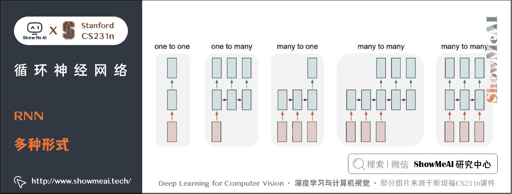

### 1) 1 对 1

这种情况，输入输出都是固定的。

### 2) 1 对多

这种情况，输入固定尺寸，比如 1 张图片；输出是可变长度的序列，比如 1 段描述文本。文本的单词数可能就会随图片不同而不同，因此输出值的长度需要是一个变量。 **（「图片描述/看图说话」image captioning）**

### 3) 多对 1

这种情况，输入的尺寸是变化的，输出是固定的。如**情感分类**任务，输入的一段长度可变的文本序列，得到一个文字情感属性的类别；再比如可以输入时间长度不同的视频，然后判断视频中的活动（固定）。

### 4) 多对多

这种情况，输入输出的尺寸都是可变的，如**机器翻译**任务，英文翻译成中文。输入输出的文本长度都是可变的，并且两者长度不要求相同。

### 5) 多对多（一一对应）

这种情况，输入是可变序列，输出是针对输入的每个元素做出判断。如**帧级别视频分类**任务，输入是帧数可变的视频，输出对每一帧进行决策。

即使是输入输出尺寸都是固定的情形也可以使用循环神经网络 RNN。

*   比如 1 张写满数字的固定尺寸的图片，想要识别上面的数字，可以是经过一系列的观察，观察图片的不同部分，然后做出决策；
*   再比如生成一张固定尺寸的图片，上面写满了数字，也可以经过一系列的步骤，一次只能生成一部分。

## 1.2 概念

如下图所示，RNN 有一个反复出现的小循环核心单元，输入 x x x 给 RNN，计算得到内部隐状态 hidden state，且其会在每次读取新的输入时进行更新。当模型下一次读取输入时，内部隐状态会将结果反馈给模型。

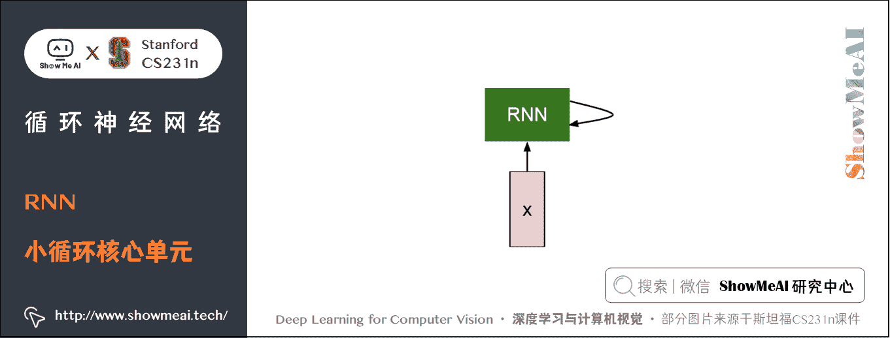

通常，我们想让 RNN 在每一个时间步都给出输出，是这样的模式：

*   读取输入 → 更新隐状态 → 基于隐状态计算得到输出。

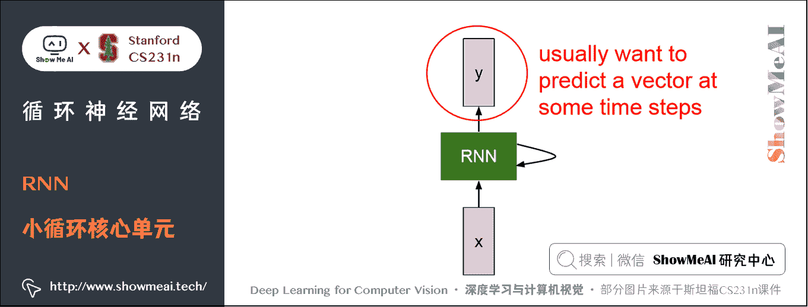

由于输入是一系列 x x x 向量，在每一个时刻绿色的 RNN 部分可以使用循环公式来表示：

h t = f W ( h t − 1 , x t h_t=f_W(h_{t-1}, x_t ht​=fW​(ht−1​,xt​

其中， x t x_t xt​ 是某一时刻输入的向量， h t − 1 h_{t-1} ht−1​ 是该时刻之前的隐状态， f W f_W fW​ 是参数 W W W 的函数， h t h_t ht​ 是更新后的隐状态。这样的结构不断循环。

如果想要在每一个时间步骤得到一个输出，那么可以把更新后的隐状态 h t h_t ht​ 作为输入，经过全连接网络，得到决策。注意： f W f_W fW​ 在每一个时间步都是相同的。

下面是一个最简单的例子，“Vanilla RNN”：

h t = t a n h ( W h h h t − 1 , W x h x t ) h_t=tanh(W_{hh}h_{t-1}, W_{xh}x_t) ht​=tanh(Whh​ht−1​,Wxh​xt​)

y t = W h y h t y_t=W_{hy}h_t yt​=Why​ht​

旧状态和输入 x x x 都是与权重矩阵相乘再求和经过非线性函数 t a n h ( ) tanh() tanh()，输出也是新状态与权重矩阵相乘。每个隐状态都只有一个唯一的 h h h 向量。

## 1.3 计算图

### 1) 多对多(xy 一一对应)

这里的多对多指的是输入 x x x 和输出 y y y 都是序列，且在时间步上有一一对应关系。如下是一个多对多的计算图：

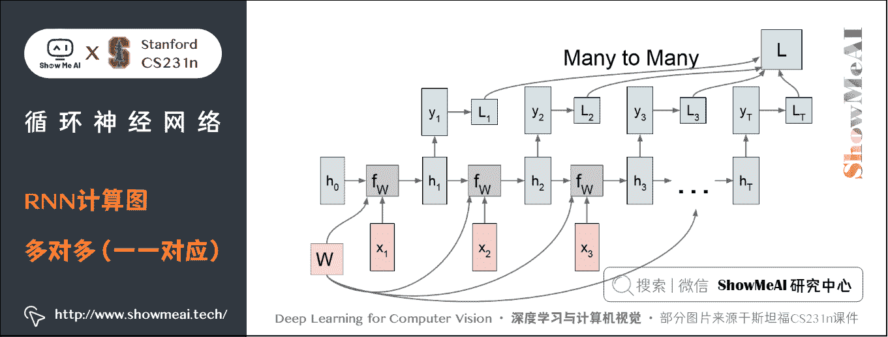

初始状态为 h 0 h_0 h0​，在时间步 t = 1 t=1 t=1 时刻有输入 x 1 x_1 x1​，将 h 0 h_0 h0​、 x 1 x_1 x1​ 带入参数函数 f f f 得到 h 1 h_1 h1​ 更新隐状态作为下一个时刻的状态，这样以此类推得到 x t x_t xt​ 时刻的隐状态 h t h_t ht​。

计算 h t h_t ht​ 的每一步都**使用的相同的参数 W W W** ，**参数函数 f f f 也是完全相同的**。这样在反向传播计算梯度时，需要将每一个时刻的梯度累加起来得到最终 W W W 的梯度。

除了更新隐状态，如果每一个时刻都想得到一个输出，可以直接将 h t h_t ht​ 经过计算（比如 softmax）得到 y t y_t yt​ ，如果对于输入 x x x 的每一个时刻都对应一个真实标签的话，在计算出 y t y_t yt​ 的同时可以得到每一步的损失 L t L_t Lt​ ，最终的损失也是所有的 L t L_t Lt​ 加起来。

### 2) 多对一

典型的应用之一是**情感分析**任务，根据最后一个隐状态得到输出。模型经过迭代，在最后一个隐状态包含了之前所有的信息。

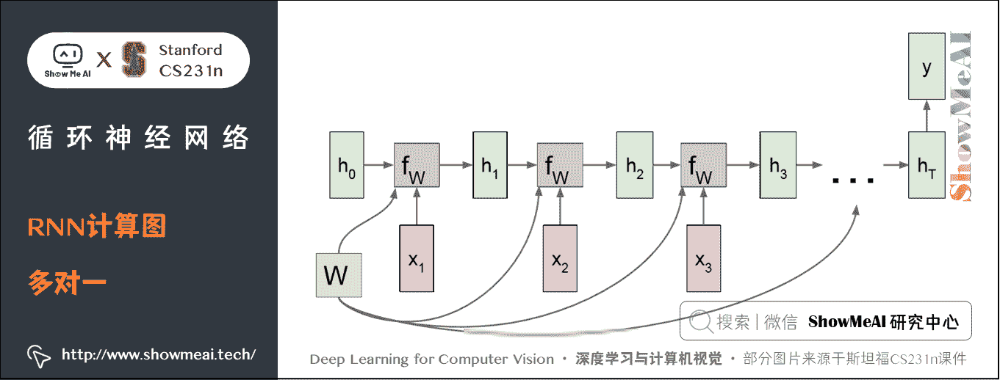

### 3) 一对多

一对多的情形会接受固定长度的输入项，输出不定长的输出项，这个固定长度的输入项会用来初始化初始隐状态，然后 RNN 会对输出的单元逐个处理，最终会得到不定长的输出序列，输出的每个元素都得以展现。

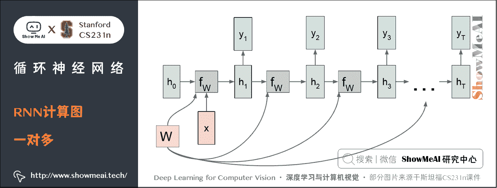

### 4) 多对多

输入输出都是不定长序列的情形，典型应用如**机器翻译**任务，可以看作是多对一与一对多的组合。首先输入一个不定长的 x x x，将这个序列编码成一个单独的向量，然后作为输入，输入到一对多的模型中，得到输出序列，可能是用另一种语言表述的相同意思的句子。

然后对这个不定长的输出，每一个时间步都会做出预测，比如接下来使用什么词。想象一下整个训练过程和计算图的展开，对输出序列的损失求和，然后像之前一样反向传播。

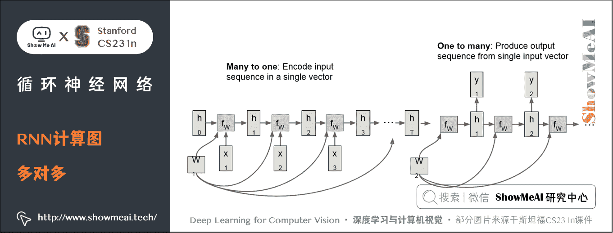

# 2.语言模型

> 关于语言模型的详细知识也可以对比阅读[ShowMeAI](http://www.showmeai.tech/)的以下内容
> 
> *   [**深度学习教程 | 吴恩达专项课程 · 全套笔记解读**](http://www.showmeai.tech/tutorials/35) 中的文章 [**序列模型与 RNN 网络**](http://www.showmeai.tech/article-detail/225) 中对于 RNN 的讲解。
>     
>     
> *   [**自然语言处理教程**](http://www.showmeai.tech/tutorials/36)中的文章 [**NLP 教程(5) - 语言模型、RNN、GRU 与 LSTM**](http://www.showmeai.tech/article-detail/239) 和 [**斯坦福 NLP 课程 | 第 6 讲 - 循环神经网络与语言模型**](http://www.showmeai.tech/article-detail/240)

在**语言模型**（Language Model）问题中，我们让模型读取大量语料语句，让神经网络在一定程度上学会字词的组合规律并能生成自然语言。

举个字符层面上的例子（即对语料中的内容以字符粒度进行学习），比如网络会读取一串字符序列，然后模型需要预测这个字符流的下一个字符是什么。我们有一个很小的字符表 `[h, e, l, o]` 包含所有字母，以及有一个训练序列 `hello` ，使用循环公式：

h t = t a n h ( W h h h t − 1 , W x h x t ) h_t=tanh(W_{hh}h_{t-1}, W_{xh}x_t) ht​=tanh(Whh​ht−1​,Wxh​xt​)

在**语言模型**的**训练阶段**，我们将训练序列作为输入项，每一个时间步的输入都是一个字符，首先需要做的是在神经网络中表示这个单词。

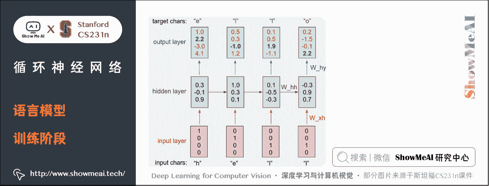

我们在这里使用长为 4 的独热向量来表示每个字符（只有字符对应的位置是 1 1 1，其他位置为 0 0 0）。比如 `h` 可以用向量 [ 1000 ] [1 0 0 0] [1000] 表示，`l` 使用 [ 0010 ] [0 0 1 0] [0010] 表示。现在在第一个时间步中，网络会接收输入 `h`，进入第一个 RNN 单元，然后得到输出 y 1 y_1 y1​，作为对接下来的字符的一个预测，也就是网络认为的接下来应该输入的字符。

由于第一个输入的是 `h`，所以接下来输入的应该是 `e`，但是模型只是在做预测，如下图所示，模型可能认为接下来要输入的是 `o`。在这种错误预测下，我们可以基于 softmax 计算损失来度量我们对预测结果的不满意程度。

在下一个时间步，我们会输入 `e`，利用这个输入和之前的隐状态计算出新的隐状态，然后利用新的隐状态对接下来的字符进行预测，我们希望下一个字符是 `l`，但这里模型可能也预测错了，这里又可以计算损失。这样经过不断的训练，模型就会学会如何根据当前的输入预测接下来的输入。

在语言模型**测试阶段**，我们想用训练好的模型测试样本或者生成新的文本（类似于训练时使用的文本）。

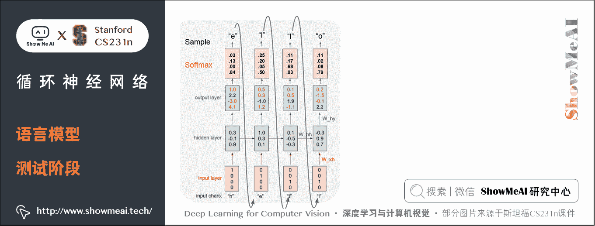

方法是输入文本的前缀来测试模型，上述例子中的前缀是 `h`，现在在 RNN 的第一步输入 `h`，它会产生基于词库所有字母得分的一个 softmax 概率分布，然后使用这个概率分布预测接下来的输出（这个过程叫做 sample/采样），如果我们足够幸运得到了字符 `e`，然后把这个得到的 `e` 重新写成 01 01 01 向量的形式反馈给模型，作为下一个时间步的输入，以此类推。

## 2.1 截断反向传播（Truncated Backpropagation ）

在前向传播中需要遍历整个序列累加计算损失，在反向传播中也需要遍历整个序列来计算梯度。我们可以想象一下，如果我们的语料库非常大（例如维基百科中所有文本），那么时间花费以及内存占用都是巨大的，如下图所示。

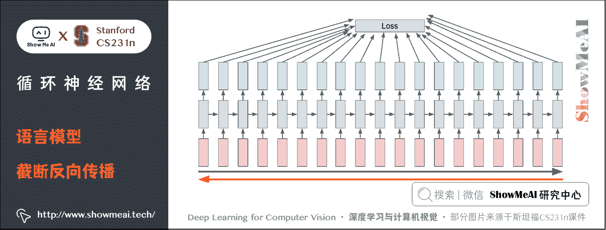

实际应用中，通常使用沿时间的**截断反向传播**（Truncated Backpropagation），这样输入的序列可以接近无穷。

前向传播时不再使用整个序列计算损失，而是使用序列的一个块，比如 100 个时间步，计算出损失值，然后反向传播计算梯度。然后基于第 2 批数据再次计算和更新。

如上的过程循环操作，「截断」使得开销大大减小。

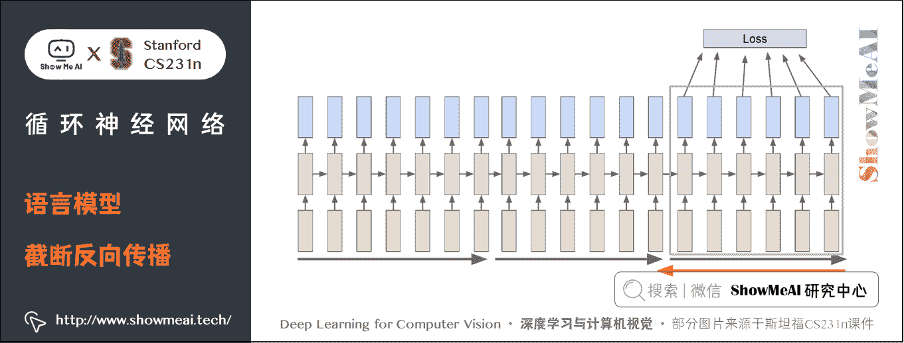

这个过程的完整实现代码：[点击这里](https://gist.github.com/karpathy/d4dee566867f8291f086)

## 2.2 RNN 语言模型应用

*   使用莎士比亚的文集对语言模型进行训练，然后生成新的文本。结果可以生成莎士比亚风格的文章(当然，结果不是完美的，其中有些部分有错误），如下图所示

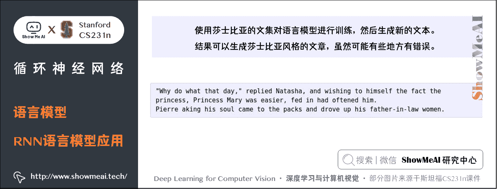

*   使用拓扑学教材，可以自动生成一些定理、公式甚至可以画图，虽然都没有意义，但可以学会这些结构。

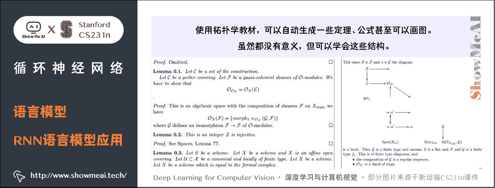

*   使用 linux 源码进行训练。可以生成 C 代码，有缩进有变量声明甚至会写注释等等，看起来非常像 C 代码（当然代码逻辑不一定正常，编译会有很多错误）。

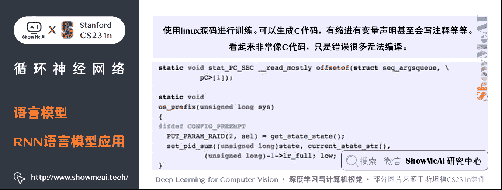

## 2.3 RNN 语言模型解释

在 RNN 中有隐藏向量，每一步都会更新，我们在这些隐藏向量中寻找可以解释的单元。

比如在语言模型训练中观察隐向量中的某一个元素值，元素值会随着每一个时间步进行改变。大多数的元素值变化都是杂乱无章的，似乎在进行一些低级的语言建模。但是有一些元素却有特殊的表现：

*   蓝色位置数值低，红色位置数值高
*   比如某些元素遇到引号后，元素值会变得很低，然后一直保持很低直到下一个引号处被激活，元素值变大，然后保持到下一个引号再变低。所以有可能是检测引号的神经元

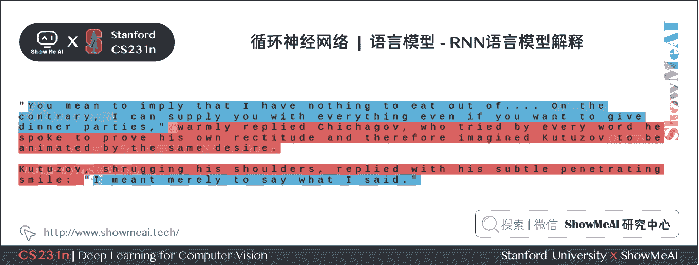

*   还有某些神经元在统计回车符前的字符数量，即字符有多少时会自动换行。某一行开始处元素的值很低，然后慢慢增大，达到一定值后自动变成 0，然后文本换行。

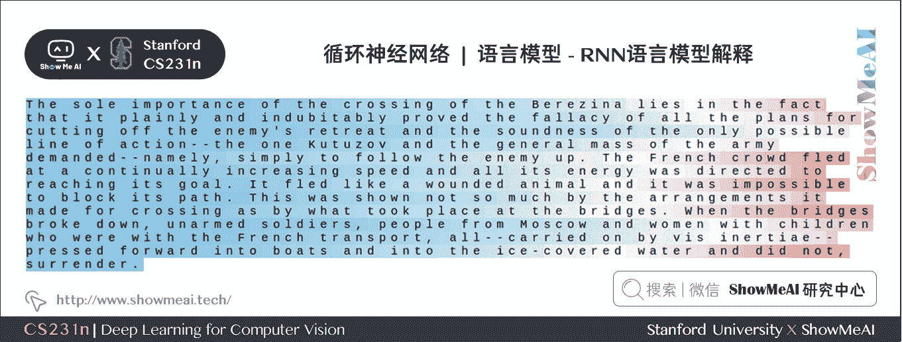

*   在训练代码的例子中，有些神经元似乎在判断是否在 `if` 语句，是否在注释内，以及表示不同的缩进层级。

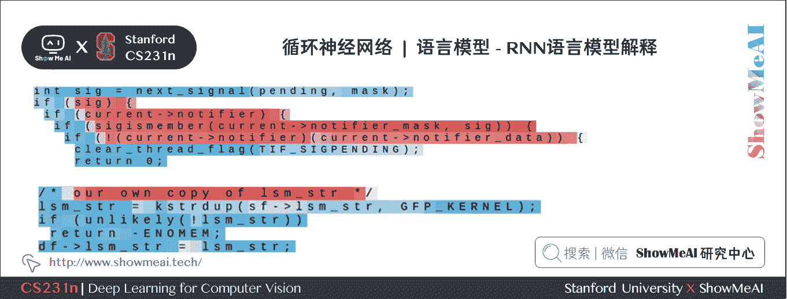

上述细节内容可以看出，在训练文本的过程中，RNN 学到一些文本的结构。（虽然这些已经不是计算机视觉的内容了）

# 3.看图说话、视觉问答、注意力模型

之前提过很多次 **图片描述/看图说话**（Image Captioning），即训练一个模型，输入一张图片，然后得到它的自然语言语义描述。这里输出的结果文本可能长度不同，单词字符数不同，这个任务天生适合 RNN 模型建模。

如下图的一个例子，图像标注模型**训练阶段**一般都先通过卷积神经网络处理图像生成图像向量（用其作为图像内容的表征），然后输入到 RNN 语言模型的第一个时间步中，RNN 会计算调整隐状态，进而基于 softmax 得到结果并计算损失，后续语言模型在每个时间步都生成 1 个组成描述文本的单词。

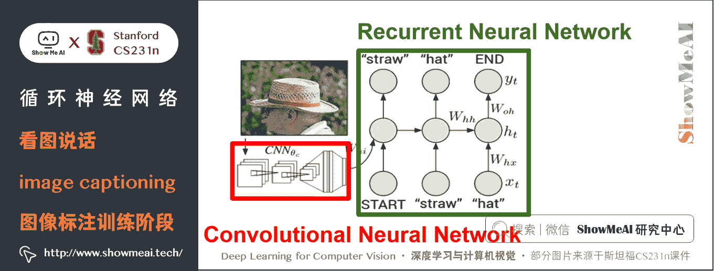

**测试阶段/推理阶段**和之前字符级的语言模型类似。

*   我们把测试图像输入到卷积神经网络，通过 CNN 得到模型最后 1 个全连接层之前的 1 个图像向量，作为整张图像的内容表征。
*   之后会给语言模型输入一个开始标志，告诉模型开始生成以这个图像为条件的文本。不同于以往的隐状态公式，在这个任务中我们会把图像信息输入到每个时间步用于更新隐状态：

h = t a n h ( W x h ∗ x + W h h ∗ h + W i h ∗ v ) h = tanh(Wxh \ast x + Whh \ast h + Wih \ast v) h=tanh(Wxh∗x+Whh∗h+Wih∗v)

*   现在就可以根据图像的内容生成一个词汇表（有很多词汇）中所有单词的一个 softmax 得分概率分布，**sample/取样**之后作为下一个时间步的输入。
*   直到取样到「结束符号」整个预测过程结束，文本也生成完毕。

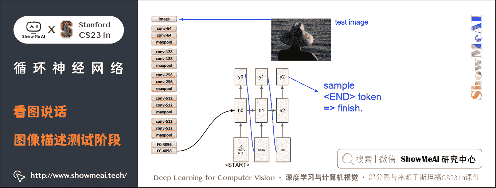

这些训练后的模型在测试时对和训练集类似的片会表现的很好，对和训练集差距大的图片可能变现不佳，比如对一些没见过的物体进行误判，以及分不清扔球还是接球等。

## 3.1 基于注意力的「看图说话」模型

下面我们来看看基于「注意力机制」的 图片描述/看图说话 模型，这个模型包含的 RNN 在生成单词时，会将注意力放在图像不同的部分。

在这个模型中，CNN 处理图像后，不再返回一个单独的向量，而是得到图像不同位置的特征向量，比如 L L L 个位置，每个位置的特征有 D D D 维，最终返回的 CNN 结果数据是一个 L × D L \times D L×D 的特征图。（想象 CNN 的中间层得到的特征图）

这样在 RNN 的每一个时间步，除了得到词汇表的采样，还会得到基于图片位置的分布，它代表了 RNN 想要观察图像的哪个部分。这种位置分布，就是 RNN 模型应该观察图像哪个位置的「注意力」。

在第 1 个隐状态会计算基于图片位置的分布 a 1 a_1 a1​，这个分布会返回到图像特征图 L × D L \times D L×D，给得出一个单一的具有统计性质的 D D D 维特征向量，即把注意力集中在图像的一部分。这个特征向量会作为下一个时间步的额外输入，另一个输入是单词。然后会得到两个输出，一个是基于词汇的分布，一个是基于位置的分布。这个过程会一直持续下去，每个步骤都有两个输入两个输出。

整个过程如下图所示：

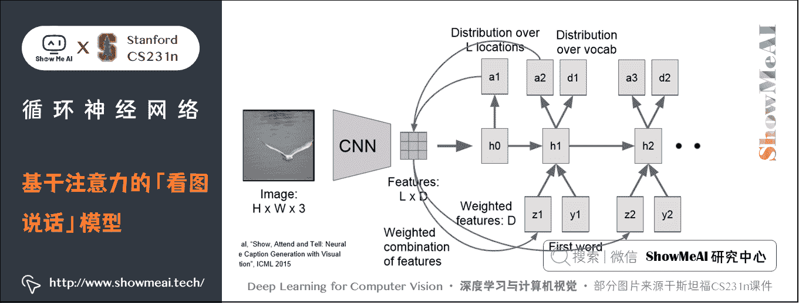

上图 z z z 的计算公式可以是：

z = ∑ i = 1 L p i v i z = \sum_{i=1}^L {p_iv_i} z=i=1∑L​pi​vi​

p i p_i pi​ 就是基于位置的分布， v i v_i vi​ 就是 L L L 个特征向量中的一个，最后得到一个统计向量 $ z$。

这种结合所有特征的分布方式称为**软注意力**（Soft attention），与之对应的是**硬注意力**（Hard attention）。

硬注意力每次只产生一个单独的特征向量，不是所有特征的组合，但它反向传播比较复杂，因为（区域）选择的过程本身不是一个可微的函数。

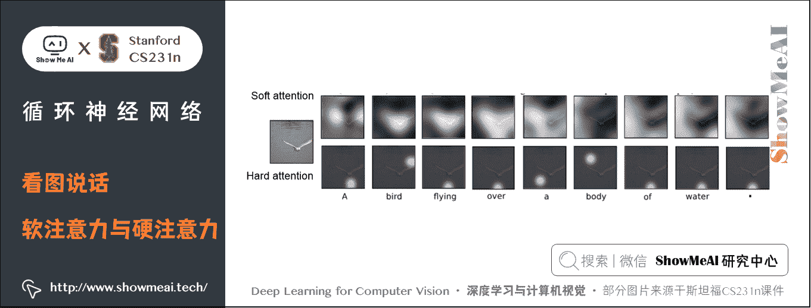

这样模型会自己学习每一个时间步应该主要把注意力集中在图片的什么位置得到什么词汇，效果通常也很好。如下图所示：


这个结构的模型也可以用于其他任务，比如**视觉问答**（Visual Question Answering）。

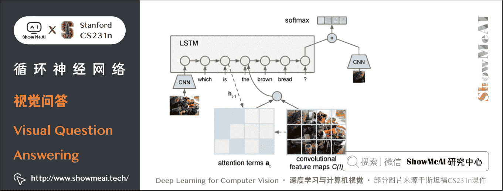

在视觉问答任务中，会有两个输入，一个是图像，一个是关于图像的用自然语言描述的问题。模型从一些答案中选择一个正确的。

这是一个多对一模型，我们需要将问题作为序列输入，针对序列的每一个元素建立 RNN，可以将问题概括成一个向量。然后把图像也概括成一个向量，现在将两个向量结合通过 RNN 编程预测答案。结合方式可以是直接连接起来也可以是进行复杂的运算。

# 4.RNN 梯度流

## 4.1 多层 RNN（Multilayer RNNs）

我们之前看到的朴素 RNN，隐状态只有 1 层，在「多层 RNN」中隐状态有 3 层。一次运行得到 RNN 第 1 个隐状态的序列，然后作为第 2 个隐状态的输入。如下图所示：

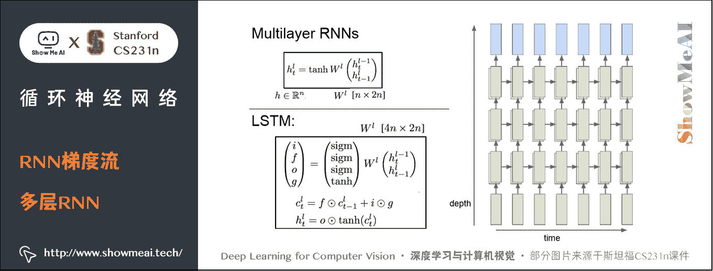

## 4.2 普通 RNN 梯度流

我们来看看普通 RNN 的梯度流，在前向传播过程中计算 h t h_t ht​ ：

h t = t a n h ( W h h h t − 1 + W x h x t ) = t a n h ( ( W h h W x h ) ( h t − 1 x t ) ) = t a n h ( W ( h t − 1 x t ) ) \begin{aligned} h_t & = tanh(W_{hh}h_{t-1}+W_{xh}x_t) \\ & = tanh \bigl (\bigl (\begin{matrix}W_{hh} \\ &W_{xh} \end{matrix}\bigr)\bigl(\begin{matrix}h_{t-1}\\x_{t} \end{matrix}\bigr)\bigr) \\ & =tanh\bigl(W\bigl(\begin{matrix}h_{t-1}\\ x_{t} \end{matrix}\bigr)\bigr) \end{aligned} ht​​=tanh(Whh​ht−1​+Wxh​xt​)=tanh((Whh​​Wxh​​)(ht−1​xt​​))=tanh(W(ht−1​xt​​))​

反向传播梯度流从 h t h_t ht​ 到 h t − 1 h_{t-1} ht−1​ 需要乘 W h h T W_{hh}^T WhhT​

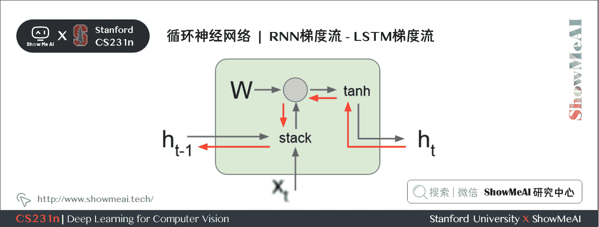

有一个问题，在上述 RNN 训练过程中，从最后一个隐状态传到第一个隐状态，中间要乘很多次权重，如下图所示。

如果累计相乘的值频繁大于 1 1 1，就可能会梯度爆炸；如果频繁小于 1 1 1，梯度就可能会慢慢趋近 0 0 0（梯度消失）。

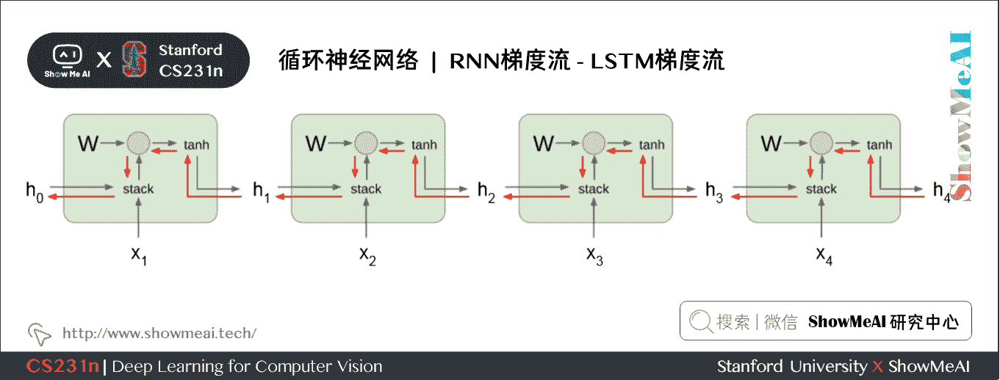

对于梯度爆炸，一种处理方法是给梯度设置一个阈值，如果梯度的 L2 范式超过这个阈值就要减小梯度，代码如下：

```
grad_num = np.sum(grad * grad)
if grad_num > threshold:
    grad *= (threshold / grad_num) 
```

对于梯度消失问题，我们可以改造 RNN 网络结构，得到更适合长距离建模的结构，如下面要展开讲解到的 LSTM 和 GRU。

## 4.3 LSTM（Long Short Term Memory ）

> 关于 LSTM 的详细讲解也可以对比阅读[ShowMeAI](http://www.showmeai.tech/)的 [**深度学习教程 | 吴恩达专项课程 · 全套笔记解读**](http://www.showmeai.tech/tutorials/35) 中的文章 [**序列模型与 RNN 网络**](http://www.showmeai.tech/article-detail/225) 中对于 LSTM 的讲解。

LSTM（长短期记忆）网络就是用来解决「梯度爆炸」和「梯度消失」问题的，与其在输出上限制梯度，LSTM 的网络结构更加复杂。

( i f o g ) = ( σ σ σ tanh ⁡ ) W ( h t − 1 x t ) c t = f ⊙ c t − 1 + i ⊙ g h t = o ⊙ tanh ⁡ ( c t ) \begin{aligned} \left(\begin{array}{l} i \\ f \\ o \\ g \end{array}\right) &=\left(\begin{array}{c} \sigma \\ \sigma \\ \sigma \\ \tanh \end{array}\right) W\left(\begin{array}{c} h_{t-1} \\ x_{t} \end{array}\right) \\ c_{t} &=f \odot c_{t-1}+i \odot g \\ h_{t} &=o \odot \tanh \left(c_{t}\right) \end{aligned} ⎝⎜⎜⎛​ifog​⎠⎟⎟⎞​ct​ht​​=⎝⎜⎜⎛​σσσtanh​⎠⎟⎟⎞​W(ht−1​xt​​)=f⊙ct−1​+i⊙g=o⊙tanh(ct​)​

LSTM 在每一个时间步都会维持两个隐状态：

*   h t h_t ht​ 和普通 RNN 中的一致，是 RNN 网络的隐状态；
*   单元状态向量 c t c_t ct​ ，是保留在 LSTM 内部的隐状态，不会完全暴露到外部去。计算公式可以看出，LSTM 会使用输入和之前的隐状态来更新四个组成 c t c_t ct​ 的门，然后使用 c t c_t ct​ 来更新 h t h_t ht​ .

与普通 RNN 不同的是，LSTM 不直接将权重矩阵 W W W 乘 x t x_t xt​ 和 h t − 1 h_{t-1} ht−1​ 拼接成的向量再经过 t a n h ( ) tanh() tanh() 函数得到隐状态 h t h_t ht​ 。

LSTM 中的权重矩阵计算会得到 4 个与隐状态 h h h 大小相同的向量，然后分别通过不同的非线性函数就得到了单元状态 $ c_t$ 的四个门： i , f , o , g i, f, o, g i,f,o,g

*   i i i 是**输入门（Input gate）** ，表示有多少内容被写到单元状态；
*   f f f 是**遗忘门（Forget gate**），表示对之前的单元状态的遗忘程度；
*   o o o 是**输出门（Output gate）** ，表示单元状态输出多少给隐状态；
*   g g g 是**门值门（Gate gate ）** ，控制写入到单元状态的信息。

从 c t c_t ct​ 的计算公式来看，之所采用不同的非线性函数，可以这么理解：

*   f f f 是对之前的单元状态的遗忘，如果是 0 0 0 全部遗忘，如果是 1 1 1 就全部保留，那个圆圈加点的符号表示逐元素相乘；
*   i i i 和 g g g 共同控制写入到单元状态向量的信息， i i i 在 0 ∼ 1 0 \sim1 0∼1 之间， g g g 在 − 1 -1 −1 到 1 1 1 之间，这样每个时间步，单元状态向量的每个元素最大自增 1 1 1 或最小自减 1 1 1。
*   这样 c t c_t ct​ 可以看成是对 [ − 1 1 ] [-1 \quad 1] [−11] 的按时间步计数。然后 c t c_t ct​ 通过 t a n h ( ) tanh() tanh() 将这个计数压缩到 [ 0 1 ] [0 \quad 1] [01] 范围，然后 o o o 来控制将多少单元状态的信息输出给隐状态 h t h_t ht​ 。

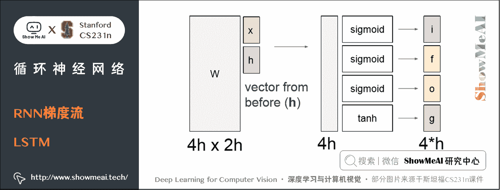

**LSTM 梯度流**

如下图所示，我们用灰色的线表示 LSTM 前向传播，完全按照公式来的，圆圈加点运算符表示两个向量逐元素相乘，不是矩阵的乘法。这样从 c t c_t ct​ 到 c t − 1 c_{t-1} ct−1​ 的反向传播过程，只会与 f f f 进行逐元素相乘，与乘 W W W 相比要简单很多。

LSTM 不同的时间步 f f f 的值都不同，不像普通 RNN 每次都乘相同的 W W W，这样就一定程度避免梯度爆炸或锐减。而且 f f f 的值也是在 [ 0 , 1 ] [0, 1] [0,1] 性质非常好。

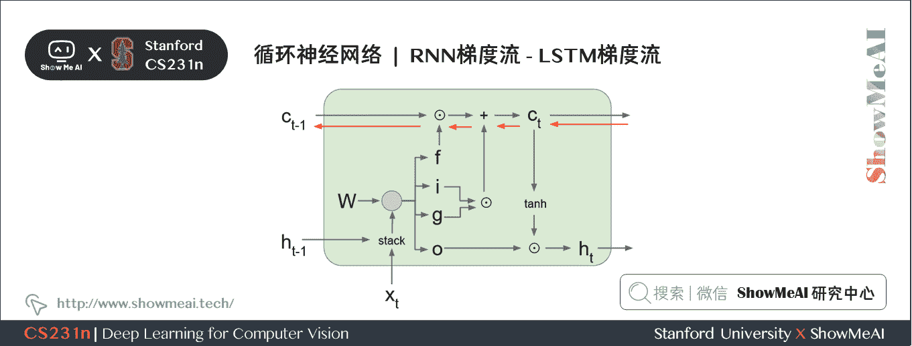

当多个单元连起来的时候，就会为梯度在单元状态间流动提供了一条高速公路（这种形式与残差网络类似）。

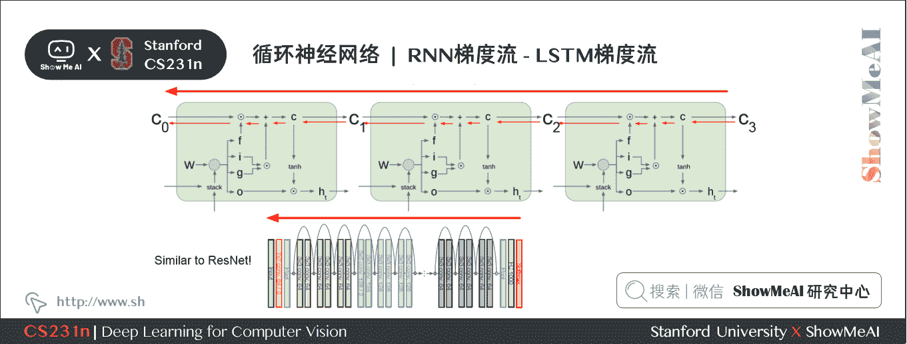

## 4.4 GRU（Gated Recurrent Unit）

> 关于 LSTM 的详细讲解也可以对比阅读[ShowMeAI](http://www.showmeai.tech/)的[深度学习教程 | 吴恩达专项课程 · 全套笔记解读](http://www.showmeai.tech/tutorials/35)中的文章[序列模型与 RNN 网络](http://www.showmeai.tech/article-detail/225)中对于 GRU 的讲解。

另一个改进普通 RNN 的方法得到「**门循环单元**（GRU）」模型，它总体和 LSTM 相似，也是应用了这种逐元素相乘与加法结合的形式，这样梯度也能高速流动。

r t = σ ( W x r x t + W h r h t − 1 + b r ) z t = σ ( W x z x t + W h z h t − 1 + b z ) h ~ t = tanh ⁡ ( W x h x t + W h h ( r t ⊙ h t − 1 ) + b h ) h t = z t ⊙ h t − 1 + ( 1 − z t ) ⊙ h ~ t \begin{aligned} r_{t} &=\sigma\left(W_{x r} x_{t}+W_{h r} h_{t-1}+b_{r}\right) \\ z_{t} &=\sigma\left(W_{x z} x_{t}+W_{h z} h_{t-1}+b_{z}\right) \\ \tilde{h}_{t} &=\tanh \left(W_{x h} x_{t}+W_{h h}\left(r_{t} \odot h_{t-1}\right)+b_{h}\right) \\ h_{t} &=z_{t} \odot h_{t-1}+\left(1-z_{t}\right) \odot \tilde{h}_{t} \end{aligned} rt​zt​h~t​ht​​=σ(Wxr​xt​+Whr​ht−1​+br​)=σ(Wxz​xt​+Whz​ht−1​+bz​)=tanh(Wxh​xt​+Whh​(rt​⊙ht−1​)+bh​)=zt​⊙ht−1​+(1−zt​)⊙h~t​​

# 5.推荐学习

**可以点击 [B 站](https://www.bilibili.com/video/BV1g64y1B7m7?p=10) 查看视频的【双语字幕】版本**

[`player.bilibili.com/player.html?aid=759478950&page=10`](https://player.bilibili.com/player.html?aid=759478950&page=10)

【字幕+资料下载】斯坦福 CS231n | 面向视觉识别的卷积神经网络 (2017·全 16 讲)

*   [【课程学习指南】斯坦福 CS231n | 深度学习与计算机视觉](http://blog.showmeai.tech/cs231n/)
*   [【字幕+资料下载】斯坦福 CS231n | 深度学习与计算机视觉 (2017·全 16 讲)](https://www.bilibili.com/video/BV1g64y1B7m7)
*   [【CS231n 进阶课】密歇根 EECS498 | 深度学习与计算机视觉](http://blog.showmeai.tech/eecs498/)
*   [【深度学习教程】吴恩达专项课程 · 全套笔记解读](http://www.showmeai.tech/tutorials/35)
*   [【Stanford 官网】CS231n: Deep Learning for Computer Vision](http://cs231n.stanford.edu/)

# 6.要点总结

*   RNN 是一种输入输出都很灵活的网络结构；
*   Vanilla RNNs 很简单，但是效果不好；比较普遍的是使用 LSTM 和 GRU，能有效的改善梯度流；
*   RNN 反向传播梯度爆炸可以给梯度设置阈值，而梯度锐减可以使用复杂的网络，比如 LSTM；
*   RNN 的应用：图像标注、视觉问答，都是将 CNN 与 RNN 结合起来；
*   理解语言模型与注意力模型；

# [ShowMeAI](http://www.showmeai.tech) 斯坦福 CS231n 全套解读

*   [深度学习与计算机视觉教程(1) | CV 引言与基础 @CS231n](http://www.showmeai.tech/article-detail/260)
*   [深度学习与计算机视觉教程(2) | 图像分类与机器学习基础 @CS231n](http://www.showmeai.tech/article-detail/261)
*   [深度学习与计算机视觉教程(3) | 损失函数与最优化 @CS231n](http://www.showmeai.tech/article-detail/262)
*   [深度学习与计算机视觉教程(4) | 神经网络与反向传播 @CS231n](http://www.showmeai.tech/article-detail/263)
*   [深度学习与计算机视觉教程(5) | 卷积神经网络 @CS231n](http://www.showmeai.tech/article-detail/264)
*   [深度学习与计算机视觉教程(6) | 神经网络训练技巧 (上) @CS231n](http://www.showmeai.tech/article-detail/265)
*   [深度学习与计算机视觉教程(7) | 神经网络训练技巧 (下) @CS231n](http://www.showmeai.tech/article-detail/266)
*   [深度学习与计算机视觉教程(8) | 常见深度学习框架介绍 @CS231n](http://www.showmeai.tech/article-detail/267)
*   [深度学习与计算机视觉教程(9) | 典型 CNN 架构 (Alexnet, VGG, Googlenet, Restnet 等) @CS231n](http://www.showmeai.tech/article-detail/268)
*   [深度学习与计算机视觉教程(10) | 轻量化 CNN 架构 (SqueezeNet, ShuffleNet, MobileNet 等) @CS231n](http://www.showmeai.tech/article-detail/269)
*   [深度学习与计算机视觉教程(11) | 循环神经网络及视觉应用 @CS231n](http://www.showmeai.tech/article-detail/270)
*   [深度学习与计算机视觉教程(12) | 目标检测 (两阶段, R-CNN 系列) @CS231n](http://www.showmeai.tech/article-detail/271)
*   [深度学习与计算机视觉教程(13) | 目标检测 (SSD, YOLO 系列) @CS231n](http://www.showmeai.tech/article-detail/272)
*   [深度学习与计算机视觉教程(14) | 图像分割 (FCN, SegNet, U-Net, PSPNet, DeepLab, RefineNet) @CS231n](http://www.showmeai.tech/article-detail/273)
*   [深度学习与计算机视觉教程(15) | 视觉模型可视化与可解释性 @CS231n](http://www.showmeai.tech/article-detail/274)
*   [深度学习与计算机视觉教程(16) | 生成模型 (PixelRNN, PixelCNN, VAE, GAN) @CS231n](http://www.showmeai.tech/article-detail/275)
*   [深度学习与计算机视觉教程(17) | 深度强化学习 (马尔可夫决策过程, Q-Learning, DQN) @CS231n](http://www.showmeai.tech/article-detail/276)
*   [深度学习与计算机视觉教程(18) | 深度强化学习 (梯度策略, Actor-Critic, DDPG, A3C) @CS231n](http://www.showmeai.tech/article-detail/277)

# [ShowMeAI](http://www.showmeai.tech) 系列教程推荐

*   [大厂技术实现：推荐与广告计算解决方案](http://www.showmeai.tech/tutorials/50)
*   [大厂技术实现：计算机视觉解决方案](http://www.showmeai.tech/tutorials/51)
*   [大厂技术实现：自然语言处理行业解决方案](http://www.showmeai.tech/tutorials/52)
*   [图解 Python 编程：从入门到精通系列教程](http://www.showmeai.tech/tutorials/56)
*   [图解数据分析：从入门到精通系列教程](http://www.showmeai.tech/tutorials/33)
*   [图解 AI 数学基础：从入门到精通系列教程](http://www.showmeai.tech/tutorials/83)
*   [图解大数据技术：从入门到精通系列教程](http://www.showmeai.tech/tutorials/84)
*   [图解机器学习算法：从入门到精通系列教程](http://www.showmeai.tech/tutorials/34)
*   [机器学习实战：手把手教你玩转机器学习系列](http://www.showmeai.tech/tutorials/41)
*   [深度学习教程：吴恩达专项课程 · 全套笔记解读](http://www.showmeai.tech/tutorials/35)
*   [自然语言处理教程：斯坦福 CS224n 课程 · 课程带学与全套笔记解读](http://www.showmeai.tech/tutorials/36)
*   [深度学习与计算机视觉教程：斯坦福 CS231n · 全套笔记解读](http://www.showmeai.tech/tutorials/37)

