# 深度学习与计算机视觉教程(12) | 目标检测 (两阶段,R-CNN 系列)（CV 通关指南·完结）

> 原文：[`blog.csdn.net/ShowMeAI/article/details/125027635`](https://blog.csdn.net/ShowMeAI/article/details/125027635)

*   作者：[韩信子](https://github.com/HanXinzi-AI)@[ShowMeAI](http://www.showmeai.tech/)
*   [教程地址](http://www.showmeai.tech/tutorials/37)：[`www.showmeai.tech/tutorials/37`](http://www.showmeai.tech/tutorials/37)
*   [本文地址](http://www.showmeai.tech/article-detail/271)：[`www.showmeai.tech/article-detail/271`](http://www.showmeai.tech/article-detail/271)
*   声明：版权所有，转载请联系平台与作者并注明出处
*   **收藏[ShowMeAI](http://www.showmeai.tech/)查看更多精彩内容**

* * *

本系列为 **斯坦福 CS231n** 《深度学习与计算机视觉(Deep Learning for Computer Vision)》的全套学习笔记，对应的课程视频可以在 [**这里**](https://www.bilibili.com/video/BV1g64y1B7m7?p=11) 查看。更多资料获取方式见文末。

* * *

# 引言

ShowMeAI 在前面的内容中给大家做了很多图像分类的介绍，主要围绕卷积神经网络（LeNet / AlexNet / NIN / VGG / Google / ResNet / MobileNet / squeezenet）讲解，但计算机视觉领域有其他一些更为复杂的任务，例如本篇开始介绍的目标检测（object detection）问题。

# 1\. 计算机视觉任务

大家知道人工智能领域的 3 大热点方向是**计算机视觉（CV，computer vision）、自然语言处理（Natural Language Process， NLP ）和语音识别（Speech Recognition）** 应用 。而计算机视觉领域又有**图像分类、目标检测、图像分割**三大任务，如下图所示

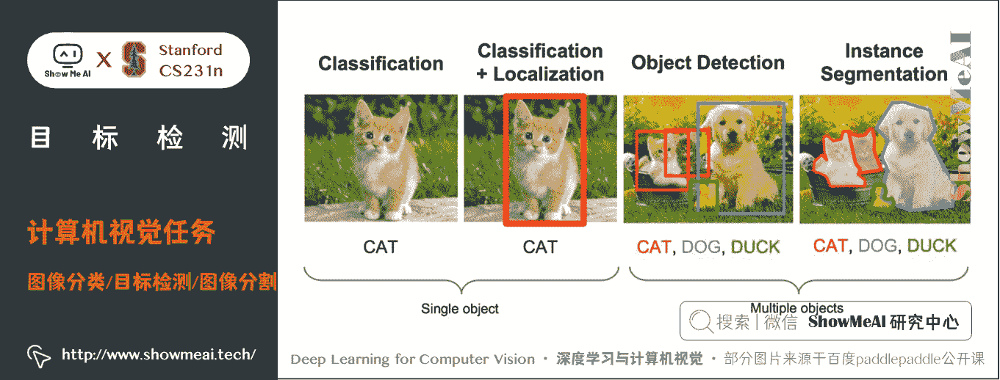

这 3 大任务其实对应机器视觉理解图像的 3 个主要层次：

## 1.1 图像分类（Classification）

图像分类任务中，我们要将图像识别判定为某个类别。它是最简单、最基础的图像理解任务，也是深度学习模型最先取得突破和实现大规模应用的任务。大家在前面也了解到了 ImageNet 这个权威评测集，每年的 ILSVRC 催生了大量的优秀深度网络结构，为其他任务提供了基础。

有一些其他的应用，包括人脸识别、场景识别等都可以化归为分类任务来解决。

## 1.2 目标检测（Detection）

图像分类任务关心整体图片类别，而目标检测则关注特定的物体目标，要求在图片中，同时识别出目标物的类别信息和位置信息（是一个 classification + localization 的问题）。

相比分类，目标检测任务要求我们需要从背景中分离出感兴趣的目标，并确定这一目标的描述（类别和位置），检测模型的输出形式通常是一个列表，列表的每一项使用一个数组给出检出目标的类别和位置（常用矩形检测框的坐标表示）。

## 1.3 图像分割（Segmentation）

图像分割包括语义分割（semantic segmentation）和实例分割（instance segmentation），前者是对前背景分离的拓展，要求分离开具有不同语义的图像部分（相当于像素级别的分类），而后者是检测任务的拓展，要求描述出目标的轮廓（相比检测框更为精细）。

分割是对图像的像素级描述，它赋予每个像素类别意义，适用于理解要求较高的场景，如无人驾驶中对道路和非道路的分割，医疗影像中对于不同区域的划分。

## 1.4 总结

图像分类对应将图像划分为单个类别的过程，它通常对应于图像中最突出的物体。实际现实世界的很多图像通常包含多个物体，如果仅仅使用图像分类模型分配单一标签是非常粗糙的，并不准确。而目标检测（object detection）模型可以识别一张图片的多个物体，并可以给出不同物体的具体位置（边界框）。目标检测在很多场景有用，如无人驾驶和安防系统。

# 2\. 常用目标检测（Object Detection）算法综述

## 2.1 总体介绍

常见的经典目标检测算法如下图所示：

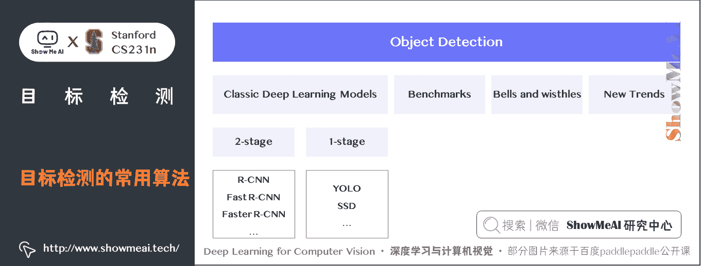

目标检测的基本思路是：解决**定位（localization） + 识别（Recognition）** 两个任务。

一个大致的 pipeline 如下图所示，我们可以用同样的特征抽取过程，借助两个不同的分支输出。

*   一个分支用于做图像分类，即**全连接 + Softmax** 判断目标类别，和单纯图像分类区别在于这里还另外需要一个「背景」类。
*   另一个分支用于识别目标位置，即完成回归任务输出四个数字标记包围盒位置(例如中心点横纵坐标和包围盒长宽)，该分支输出结果只有在分类分支判断不为「背景」时才使用。

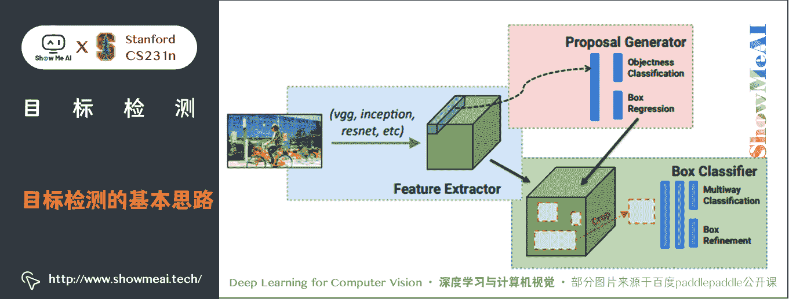

## 2.2 传统方法

传统的目标检测框架，主要包括三个步骤：

*   ① 利用不同尺寸的滑动窗口框住图中的某一部分作为候选区域；
*   ② 提取候选区域相关的视觉特征。比如人脸检测常用的 Harr 特征；行人检测和普通目标检测常用的 HOG 特征等；
*   ③ 利用分类器进行识别，比如常用的 SVM 模型。

## 2.3 两阶段 vs 一阶段 方法

现在主流的深度学习目标检测方法主要分为两类：**两阶段（Two Stages）目标检测算法**和**一阶段（One Stage）目标检测算法**。

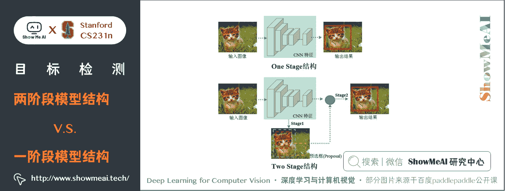

### 1) 两阶段（Two Stages）

*   首先由算法（algorithm）生成一系列作为样本的候选框，再通过卷积神经网络进行分类。
*   常见的算法有 R-CNN、Fast R-CNN、Faster R-CNN 等等。

### 2) 一阶段（One Stage ）

*   不需要产生候选框，直接将目标框定位的问题转化为回归（Regression）问题处理(Process)。
*   常见的算法有 YOLO、SSD 等等。

上述两类方法，基于候选区域（Region Proposal）的方法（两阶段）在检测准确率和定位精度上占优，基于端到端（一阶段）的算法速度占优。相对于 R-CNN 系列的「两步走」（候选框提取和分类），YOLO 等方法只「看一遍」。

我们在本篇中给大家介绍两阶段的目标检测方法，主要是 R-CNN 系列目标检测方法，在下篇内容[**目标检测 (SSD,YOLO 系列)**](http://www.showmeai.tech/article-detail/272)中给大家介绍一阶段的目标检测方法（YOLO 系列，SSD 等）。

# 3.两阶段目标检测算法发展史

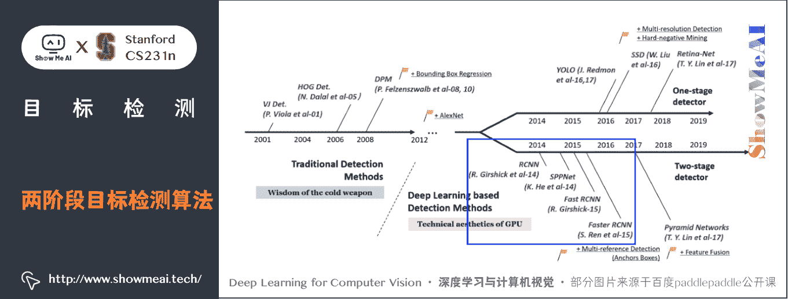

# 4.两阶段目标检测典型算法

## 4.1 R-CNN

如何将深度学习分类算法应用到目标检测？

*   用深度学习**分类模型提取特征**方法代替传统图像特征提取算法。

**R-CNN 核心思想：** 对每张图片选取多个区域，然后每个区域作为一个样本进入一个卷积神经网络来抽取特征。

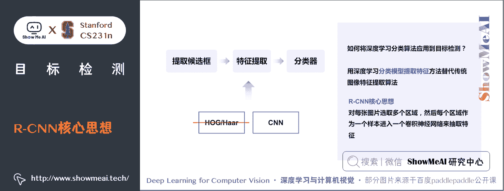

### 1) R-CNN 网络结构

R-CNN 算法是较早提出的两阶段目标检测算法，它先找出 Region Proposal，再进行分类和回归。

*   所谓 Region Proposal 就是图中目标可能出现的位置。
*   因为传统方法需要枚举的区域太多了，所以通过利用图像中的纹理、边缘、颜色等信息，可以保证在选取较少窗口（几千甚至几百）的情况下保持较高的响应比。所以，问题就转变成找出可能含有物体的候选框，这些框之间是可以互相重叠互相包含的，这样我们就可以避免暴力枚举的所有框了。

### 2) R-CNN 应用流程

对于每张输入的图像，R-CNN 目标检测主要包括下述步骤：

*   ① 利用选择性搜索 Selective Search 算法在图像中从下到上提取 2000 个左右的可能包含物体的候选区域 Region Proposal
*   ② 因为获取到的候选区域大小各不相同，所以需要将每个 Region Proposal 缩放(warp)成统一的 227 × 227 227 \times 227 227×227 的大小并输入到 CNN，将 CNN 的 fc7 层的输出作为特征
*   ③ 将每个 Region Proposal 提取到的 CNN 特征输入到 SVM 进行分类
*   ④ 使用这些区域特征来训练线性回归器对区域位置进行调整

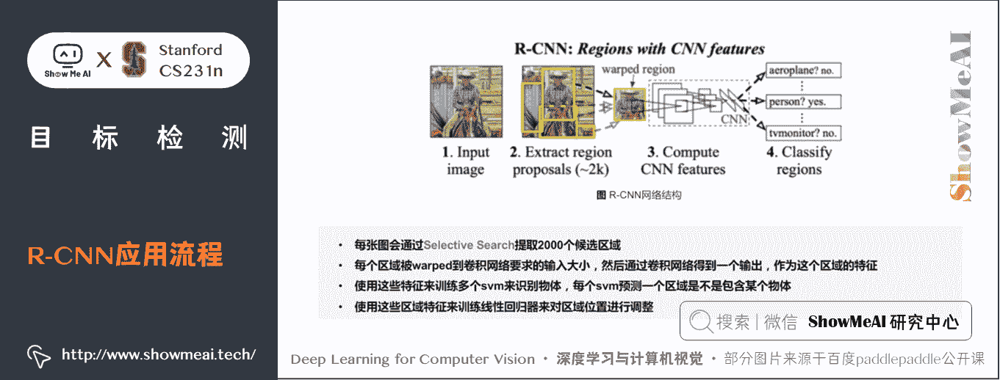

### 3) R-CNN 不足与优化

R-CNN 的效果如下图所示，它有一些不足之处（也是系列算法后续改进的点）：

*   R-CNN 虽然不需要穷举所有框了，但是它需要对所有 ss 算法选取出的候选框 region proposal (2000 多个)进行**CNN 提取特征 + SVM 分类**，计算量很大，导致 R-CNN 检测速度很慢，一张图都需要 47s。
*   Selective search 提取的区域质量不够好
*   特征提取与后续 SVM 分类器是独立训练的，没有联合优化，且训练耗时长

优化方式为：

*   2000 个 region proposal 是图像的一部分，可以对图像只进行一次卷积提取特征，然后将 region proposal 在原图的位置映射到卷积层特征图上，得到映射后的各个 proposal 的特征输入到全连接层做后续操作。
*   每个 region proposal 的大小都不一样，而全连接层输入必须是固定的长度，因此不能将 proposal 的特征直接输入全连接层，后续改进向 R-CNN 模型引入了 SPP-Net（也因此诞生了 Fast R-CNN 模型）。

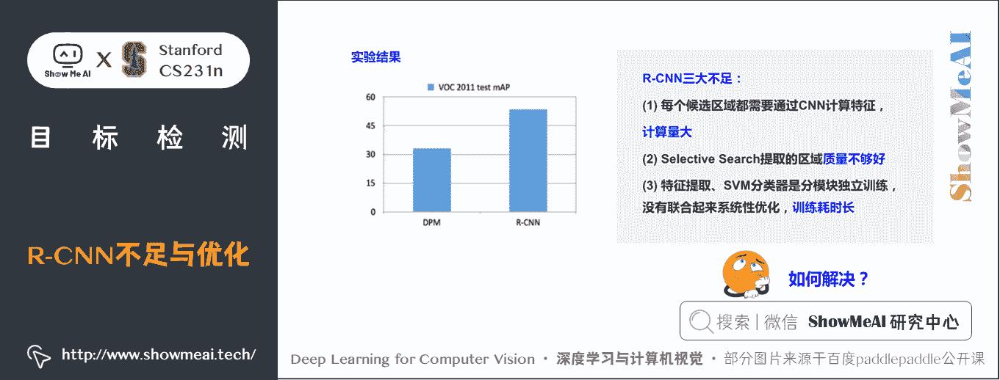

## 4.2 SPP-Net

### 1) 设计出发点

我们通过前面的 CNN 相关知识学习知道，CNN 的卷积层不需要固定尺寸的图像，而全连接层是需要固定大小的输入。所以当全连接层面对各种尺寸的输入数据时，就需要对输入数据进行 crop(抠图)或者 wrap(图像 resize)操作。

在 R-CNN 中，因为不同的 proposal 大小不同，所以需要先 resize 成相同大小再输入到 CNN 中。既然卷积层是可以接受任何尺寸的，可以在卷积层后面加上一部分结构使得后面全连接层的输入为固定的，这个「化腐朽为神奇」的结构就是 spatial pyramid pooling layer。

下图是 R-CNN 和 SPP-Net 检测流程的比较：

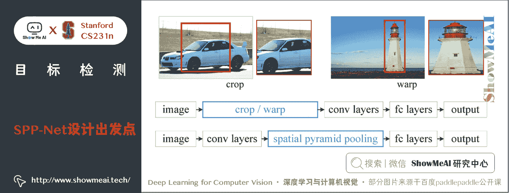

SPP-Net 和普通 CNN 的对比结构如下，在网络结构上，直接把 pool5 层替换成 SPP 层：

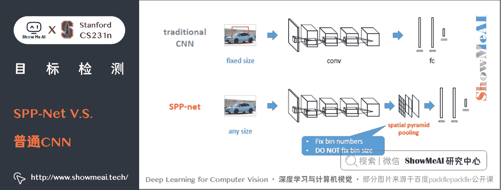

SPP-Net 的具体细节如下，由 features map 上确定的 region proposal 大小不固定，将提取的 region proposal 分别经过三个卷积 4 ∗ 4 4 \ast 4 4∗4， 2 ∗ 2 2 \ast 2 2∗2， 1 ∗ 1 1 \ast 1 1∗1 ，都将得到一个长度为 21 的向量(21 是数据集类别数，可以通过调整卷积核大小来调整)，因此不需要对 region proposal 进行尺寸调整：

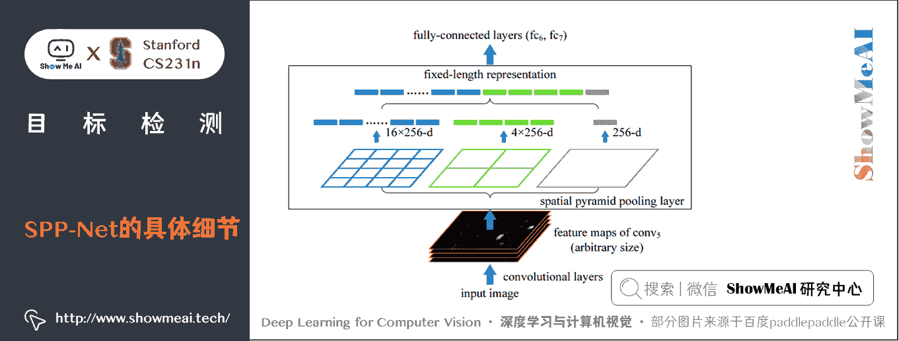

相比 R-CNN，SPP-Net 有两大优点。

① 通过「特征金字塔池化」模块，实现了 CNN 的多尺度输入，使得网络的输入图像可以是任意尺寸的，输出则不变，同样是一个固定维数的向量。

② R-CNN 要对每个区域计算卷积，而 SPPNet 只需要计算一次卷积，从而节省了大量的计算时间。

*   R-CNN 流程中，先用 ss 算法得到 2000 个 proposal 分别做卷积操作
*   SPP-Net 只对原图进行一次卷积计算，得到整张图的卷积特征 feature map，然后找到每个候选框在 feature map 上的映射 patch，将此 patch 作为每个候选框的卷积特征，输入到 SPP 层以及之后的层，完成特征提取工作。

## 4.3 Fast R-CNN

对于 RCNN 速度过慢等问题，提出了基于 RCNN 的改善模型 Fast RCNN。

### 1) 核心改进

Fast RCNN 主要改进以下部分：

*   ① 将 classification 和 detection 的部分融合到 CNN 中，不再使用额外的 SVM 和 Regressor，极大地减少了计算量和训练速度。
*   ② Selective Search 后不再对 region proposal 得到的 2k 个候选框进行截取输入，改用 ROI Project，将 region proposal 映射到 feature map 上
*   ③ 使用 ROI pooling 将在 feature map 上不同尺度大小的 ROI 归一化成相同大小后就可以通过 FC 层。

### 2) 核心环节

如下图所示为 Fast R-CNN 流程与网络结构

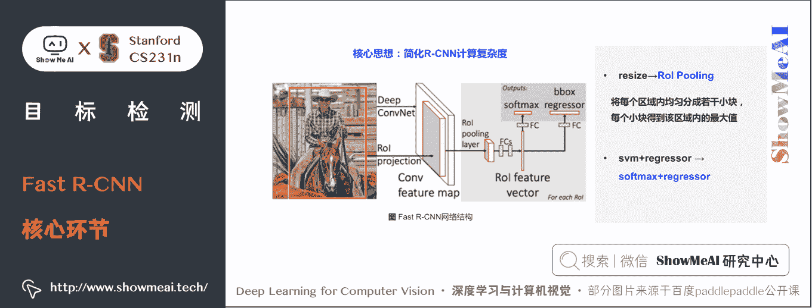

Fast R-CNN 具体包括的核心环节如下：

### ① Region Proposal：与 R-CNN 一致

跟 RCNN 一样，Fast-RCNN 采用的也是 Selective Search 的方法来产生 Region Proposal，每张图片生成 2k 张图片。但是不同的是，之后不会对 2k 个候选区域去原图截取，后输入 CNN，而是直接对原图进行一次 CNN，在 CNN 后的 feature map，通过 ROI project 在 feature map 上找到 Region Proposal 的位置。

### ② Convolution & ROI 映射

就是对原图输入到 CNN 中去计算，Fast-RCNN 的工具包提供提供了 3 种 CNN 的结构，默认是使用 VGG-16 作为 CNN 的主干结构。根据 VGG-16 的结构，Fast-RCNN 只用了 4 个 MaxPooling 层，最后一个换成了 ROI Pooling，因此，只需要对 Region Proposal 的在原图上的 4 元坐标 ( x , y , w , h ) (x, y, w, h) (x,y,w,h) 除以 16 16 16，并找到最近的整数，便是 ROI Project 在 feature map 上映射的坐标结果。最终得到 2 k 2k 2k 个 ROI。

### ③ ROI Pooling

对每一个 ROI 在 feature map 上截取后，进行 ROI Pooling，就是将每个 ROI 截取出的块，通过 MaxPooling 池化到相同维度。

ROI Pooling 的计算原理是，将每个不同大小的 ROI 平均划分成 7 × 7 7 \times 7 7×7 的 grid，在每个 grid 中取最大值，最后所有 ROI 都会池化成大小为 7 × 7 7 \times 7 7×7 维度。

### ④ 全连接层 & 输出

将每个 ROI Pooling 后的块，通过全连接层生成 ROI 特征向量，最后用一个 Softmax 和一个 bbox regressor 进行分类和回归预测，得到每个 ROI 的类别分数和 bbox 坐标。全连接层为矩阵相乘运算，运行消耗较多，速度较慢，作者在这里提出可以使用 SVD 矩阵分解来加快全连接层的计算。

### ⑤ 多任务损失

Fast-RCNN 的两个任务：

*   一个是分类，分为 n ( 种 类 ) + 1 ( 背 景 ) n(种类) + 1(背景) n(种类)+1(背景) 类，使用的是**Cross Entropy + Softmax 的损失函数**
*   第二个是 Bbox 的 Localization 回归，使用跟 Faster-RCNN 一样的基于 Offset 的回归，损失函数使用的是 Smooth L1 Loss，具体原理在下方 Faster-RCNN 中介绍。

### 3) Fast R-CNN 网络效果

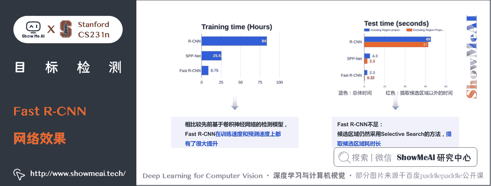

Fast R-CNN 效果如上图所示，相比之 R-CNN 它在训练和预测速度上都有了很大的提升，但它依旧有不足之处，大家观察整个流程，会发现在候选区域选择上，依旧使用的 Selective Search 方法，它是整个流程中的时间消耗瓶颈，无法用 GPU 硬件与网络进行加速。

## 4.4 Faster R-CNN

Faster-RCNN 在 Fast-RCNN 的基础上做了两个重大的创新改进：

*   ① 在 Region Proposal 阶段提出了 RPN（Region Proposal Network）来代替了 Selective Search
*   ② 使用到了 Anchor

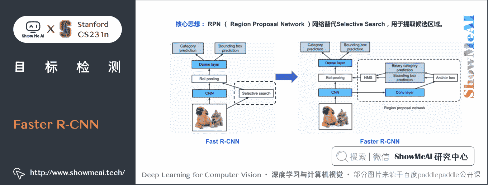

### 1) Faster R-CNN 网络结构

Faster R-CNN 的总体流程结构如下，可分为 Backbone、RPN、ROI+分类 / 回归 三个部分。

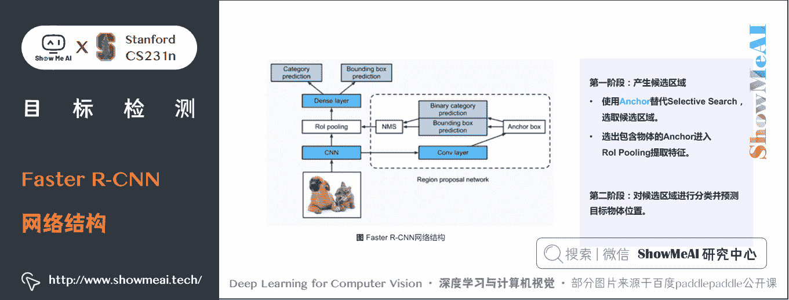

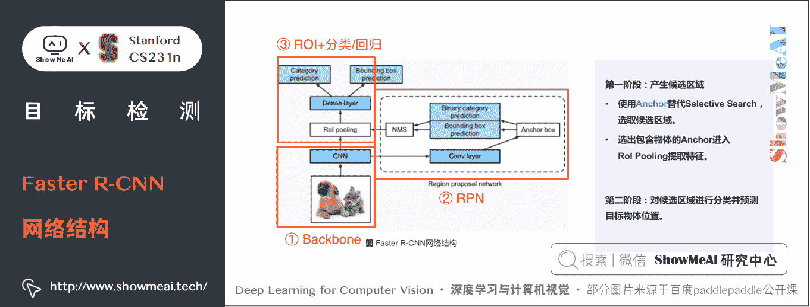

### 2) Anchor（锚框）

Anchor 是图像检测领域一个常用的结构，它可以用来表示原图中物体所在的区域，是一个以 feature map 上某个点为中心的矩形框。

Faster-RCNN 的 anchor，在 feature map 上每个点，生成 3 种尺度和 3 种比例共 9 个 anchor。

*   下图是一个 anchor 的示意图，每个点会生成尺度为小( 128 × 128 128\times128 128×128）、中（ 256 × 256 256\times256 256×256）、大（ 512 × 512 512\times512 512×512），如图中红、绿、蓝色的 anchor， 1 : 1 1:1 1:1, 2 : 1 2:1 2:1, 1 : 2 1:2 1:2 三种比例共 9 个 anchor。
*   这样充分考虑了被检测物体的大小和形状，保证物体都能由 anchor 生成 region proposal。

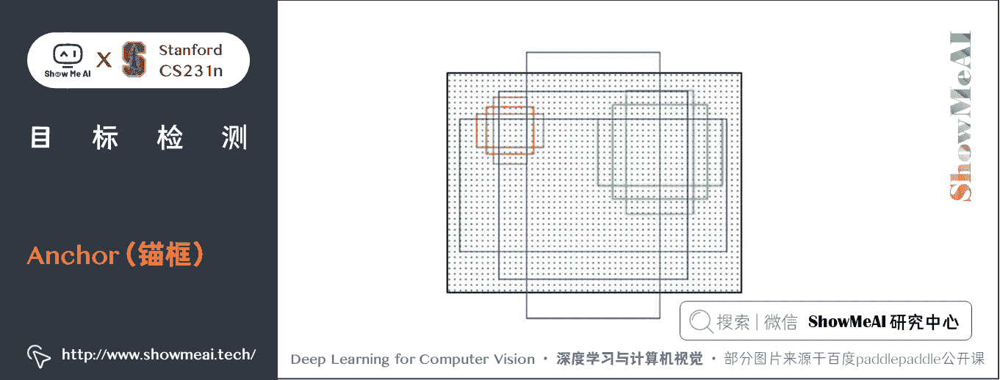

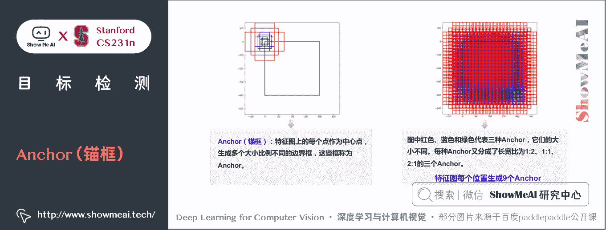

### 3) RPN 网络结构

RPN 是一个全卷积的神经网络，它的工作原理可以分成 classification，regression 和 proposal 三个部分

### ① Classification/分类

Classification 部分将得到的 feature map 通过一个 3 × 3 3 \times 3 3×3 和 1 × 1 1 \times 1 1×1 的卷积后，输出的维度为 [ 1 × 18 × 38 × 50 ] [1 \times 18 \times 38 \times 50] [1×18×38×50]，这 18 个 channel 可以分解成 2 × 9 2\times9 2×9，2 代表着是否是感兴趣物体备选区域（region proposal）的 0/1 的 score，9 代表着 9 个 anchors。

因此，特征图维度 38 × 50 38\times50 38×50 的每一个点都会生成 9 个 anchor，每个 anchor 还会有 0/1 的 score。

### ② Regression/回归

Regression 部分原理和 Classification 部分差不多，feature map 通过一个 3 × 3 3 \times 3 3×3 和 1 × 1 1 \times 1 1×1 的卷积后，输出的维度为 [ 1 × 36 × 38 × 50 ] [1 \times 36 \times 38 \times 50] [1×36×38×50]，其中 36 个 channel 可以分成 4 × 9 4 \times 9 4×9，9 就是跟 cls 部分一样的 9 个 anchor，4 是网络根据 anchor 生成的 bbox 的 4 元坐标 target 的 offset。通过 offset 做 bbox regression，再通过公式计算，算出预测 bbox 的 4 元坐标 ( x , y , w , h ) (x, y, w, h) (x,y,w,h) 来生成 region proposal。

### ③ Proposal/候选区

将前两部分的结果综合计算，便可以得出 Region Proposals。

*   若 anchor 的 I o U > 0.7 IoU > 0.7 IoU>0.7，就认为是前景
*   若 I o U < 0.3 IoU < 0.3 IoU<0.3，就认为是背景
*   其他的 anchor 全都忽略

一般来说，前景和背景的 anchor 保留的比例为 1 : 3 1:3 1:3

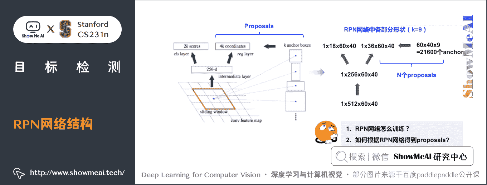

### ① RPN 网络训练策略

RPN 网络的训练样本有如下的策略和方式：

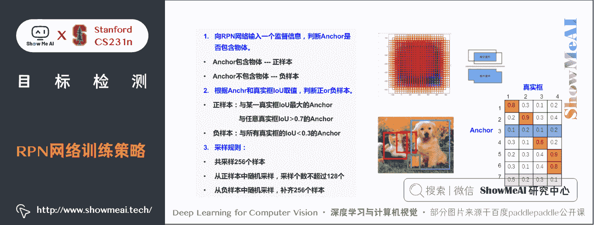

### ② RPN 网络监督信息

RPN 网络是监督学习训练，包含分类和回归两个任务，分类分支和回归分支的预测值和 label 构建方式如下：

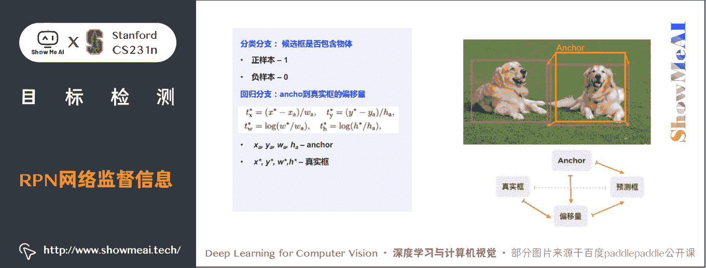

### ③ RPN 网络 LOSS

RPN 网络的总体 loss 由 2 部分构成，分别是分类 loss 和回归 loss，为其加权求和结构。其中分类 loss 使用常规的交叉熵损失，回归损失函数使用的是 Smooth L1 Loss，本质上就是 L1 Loss 和 L2 Loss 的结合。

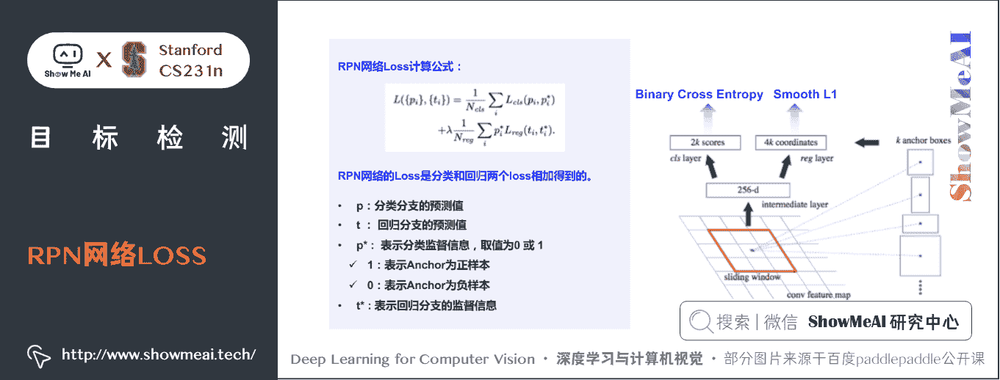

### ④ RPN 网络回归分支 Loss

特别说一下回归部分使用到的 Smooth L1 Loss，对比于 L1 Loss 和 L2 Loss，Smooth L1 Loss 可以从两方面限制梯度：

*   ① 当预测框与 ground truth 的 Loss 很大的时候，梯度不至于像 L2 Loss 那样过大
*   ② 当预测框与 ground truth 的 Loss 较小的时候，梯度值比 L1 Loss 更小，不至于跳出局部最优解。

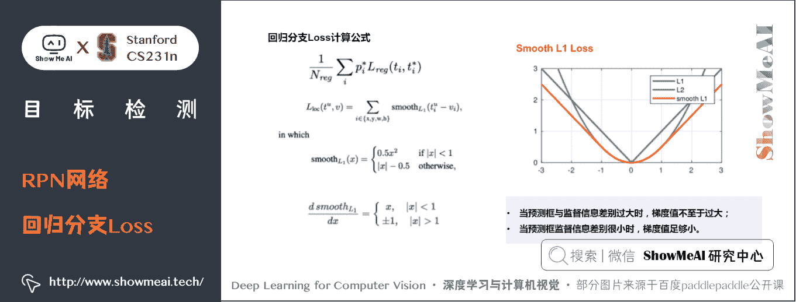

### 4) 生成 Proposals

结合分类和回归结果得出 Region Proposals。若 anchor 的 I o U > 0.7 IoU > 0.7 IoU>0.7，就认为是前景；若 I o U < 0.3 IoU < 0.3 IoU<0.3，就认为是背景，其他的 anchor 全都忽略。一般来说，前景和背景的 anchor 保留的比例为 1 : 3 1:3 1:3 。

得到 Region Proposal 后，会先筛选除掉长宽小于 16 的预测框，根据预测框分数进行排序，取前 N（例如 6000）个送去 NMS，经过 NMS 后再取前 t o p k top_k topk​（例如 300）个作为 RPN 的输出结果。

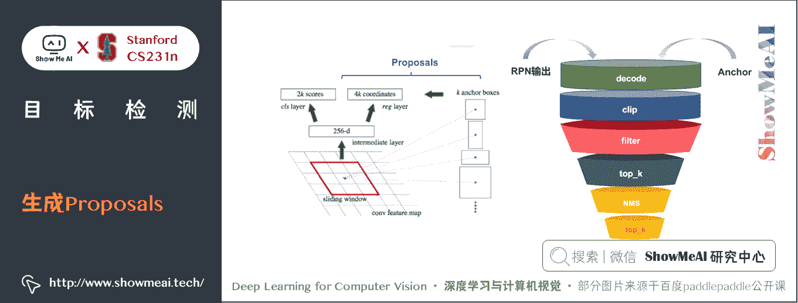

### 5) Rol Pooling

### ① Roi pooling 核心思想

候选框共享特征图特征，并保持输出大小一致。

候选框分为若干子区域，将每个区域对应到输入特征图上，取每个区域内的最大值作为该区域的输出。

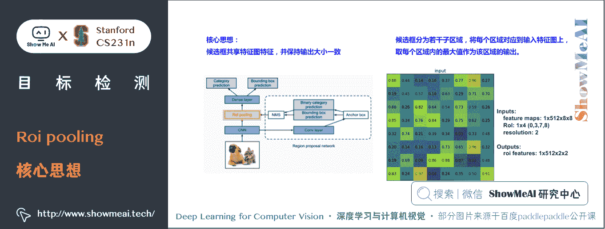

### ② Rol Pooling 不足

在 ROI 映射中，涉及到 region proposal 的坐标映射变换问题，在这过程中难免会产生小数坐标。但是在 feature map 中的点相当于一个个的 pixel，是不存在小数的，因此会将小数坐标量化成向下取整，这就会造成一定的误差。

在 ROI Pooling 中，对每个 ROI 划分 grid 的时候又会有一次坐标量化向下取整。

这样，整个过程像素坐标会经过两次量化，导致 ROI 虽然在 feature map 上有不到 1 pixel 的误差，映射回原图后的误差可能会大于 10 pixel，甚至误差可能会大于整个物体，这对小物体的检测非常不友好。

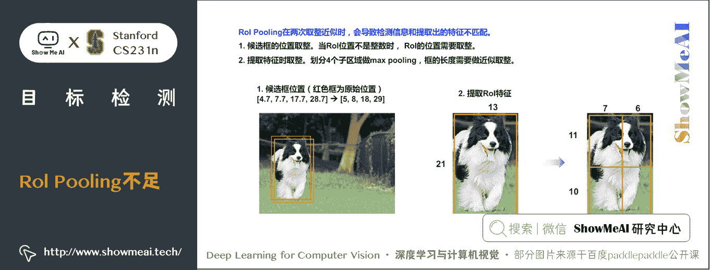

### 6) Rol Align

Faster R-CNN 中通过 ROI Align 消除 RoI Pooling 中产生的误差。

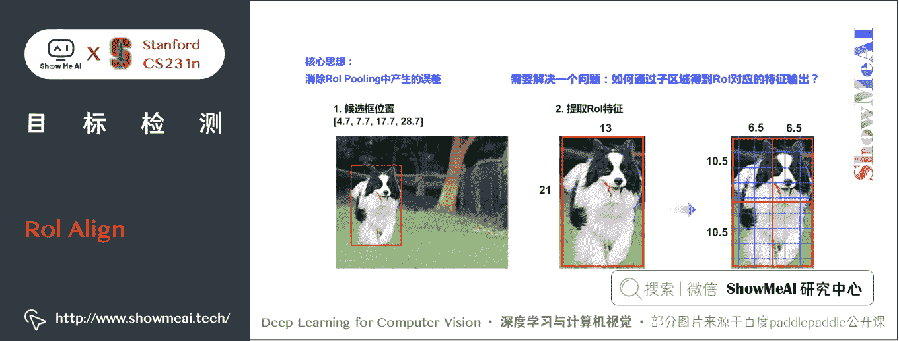

ROI Align 的原理是，先将 ROI Project 和 ROI Pooling 时计算出的 ROI 带小数的坐标存储在内存中，不直接量化成像素坐标。

随后，ROI Align 不取每个 grid 的最大值，而是再将每个 grid 划分成 2 × 2 2\times2 2×2 的小格，在每个小格中找到中心点，将离中心点最近的四个点的值进行双线性差值，求得中心点的值，再取每个 g r i d grid grid 中四个中心点的最大值作为 P o o l i n g Pooling Pooling 后的值。

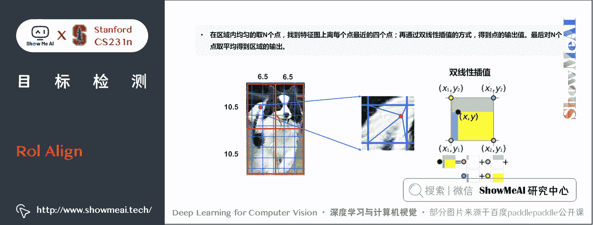

### 7) BBox Head

下面是分类与回归的 BBox 头部分，它的处理流程展开后如下图所示：

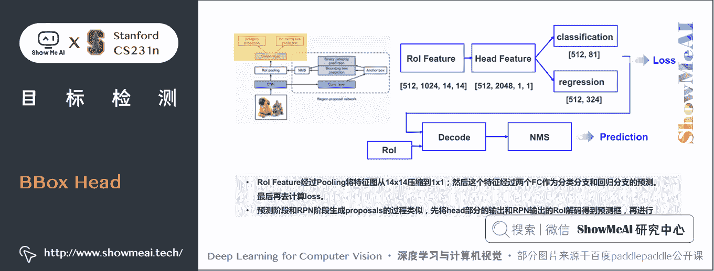

而 BBox 训练阶段的样本构建方式如下，我们对比 RPN 阶段的样本构建方式：

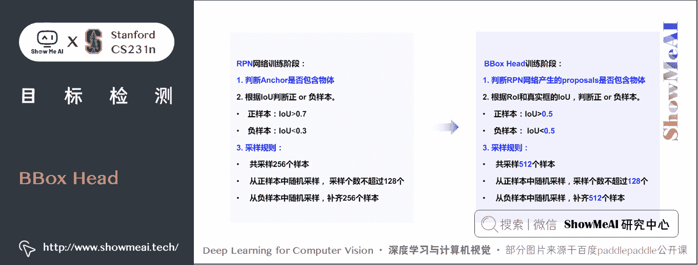

### ① BBox Head 中的监督信息

BBox 头的分类与回归任务的标签构建方式如下，其中分类分支是典型的分类问题，学习每个预测框的类别；回归分支则是学习每个 RoI 到真实框的偏移量。

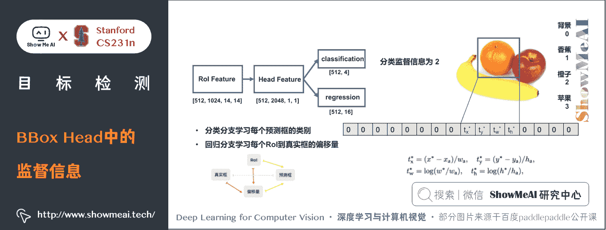

### ② BBox Head Loss

BBox 头的总体 loss 由分类 loss 和回归 loss 加权组合构成。

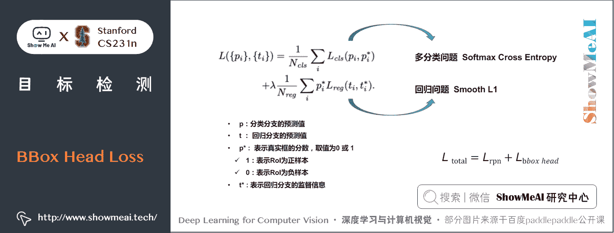

### 8) Faster R-CNN 效果

Faster R-CNN 的效果如下图所示

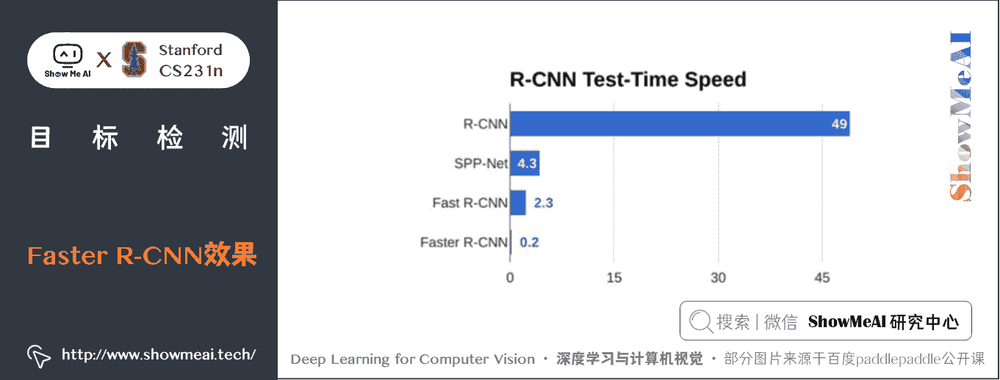

# 5.推荐学习

**可以点击 [B 站](https://www.bilibili.com/video/BV1g64y1B7m7?p=11) 查看视频的【双语字幕】版本**

[`player.bilibili.com/player.html?aid=759478950&page=11`](https://player.bilibili.com/player.html?aid=759478950&page=11)

【字幕+资料下载】斯坦福 CS231n | 面向视觉识别的卷积神经网络 (2017·全 16 讲)

*   [【课程学习指南】斯坦福 CS231n | 深度学习与计算机视觉](http://blog.showmeai.tech/cs231n/)
*   [【字幕+资料下载】斯坦福 CS231n | 深度学习与计算机视觉 (2017·全 16 讲)](https://www.bilibili.com/video/BV1g64y1B7m7)
*   [【CS231n 进阶课】密歇根 EECS498 | 深度学习与计算机视觉](http://blog.showmeai.tech/eecs498/)
*   [【深度学习教程】吴恩达专项课程 · 全套笔记解读](http://www.showmeai.tech/tutorials/35)
*   [【Stanford 官网】CS231n: Deep Learning for Computer Vision](http://cs231n.stanford.edu/)

# [ShowMeAI](http://www.showmeai.tech) 斯坦福 CS231n 全套解读

*   [深度学习与计算机视觉教程(1) | CV 引言与基础 @CS231n](http://www.showmeai.tech/article-detail/260)
*   [深度学习与计算机视觉教程(2) | 图像分类与机器学习基础 @CS231n](http://www.showmeai.tech/article-detail/261)
*   [深度学习与计算机视觉教程(3) | 损失函数与最优化 @CS231n](http://www.showmeai.tech/article-detail/262)
*   [深度学习与计算机视觉教程(4) | 神经网络与反向传播 @CS231n](http://www.showmeai.tech/article-detail/263)
*   [深度学习与计算机视觉教程(5) | 卷积神经网络 @CS231n](http://www.showmeai.tech/article-detail/264)
*   [深度学习与计算机视觉教程(6) | 神经网络训练技巧 (上) @CS231n](http://www.showmeai.tech/article-detail/265)
*   [深度学习与计算机视觉教程(7) | 神经网络训练技巧 (下) @CS231n](http://www.showmeai.tech/article-detail/266)
*   [深度学习与计算机视觉教程(8) | 常见深度学习框架介绍 @CS231n](http://www.showmeai.tech/article-detail/267)
*   [深度学习与计算机视觉教程(9) | 典型 CNN 架构 (Alexnet, VGG, Googlenet, Restnet 等) @CS231n](http://www.showmeai.tech/article-detail/268)
*   [深度学习与计算机视觉教程(10) | 轻量化 CNN 架构 (SqueezeNet, ShuffleNet, MobileNet 等) @CS231n](http://www.showmeai.tech/article-detail/269)
*   [深度学习与计算机视觉教程(11) | 循环神经网络及视觉应用 @CS231n](http://www.showmeai.tech/article-detail/270)
*   [深度学习与计算机视觉教程(12) | 目标检测 (两阶段, R-CNN 系列) @CS231n](http://www.showmeai.tech/article-detail/271)
*   [深度学习与计算机视觉教程(13) | 目标检测 (SSD, YOLO 系列) @CS231n](http://www.showmeai.tech/article-detail/272)
*   [深度学习与计算机视觉教程(14) | 图像分割 (FCN, SegNet, U-Net, PSPNet, DeepLab, RefineNet) @CS231n](http://www.showmeai.tech/article-detail/273)
*   [深度学习与计算机视觉教程(15) | 视觉模型可视化与可解释性 @CS231n](http://www.showmeai.tech/article-detail/274)
*   [深度学习与计算机视觉教程(16) | 生成模型 (PixelRNN, PixelCNN, VAE, GAN) @CS231n](http://www.showmeai.tech/article-detail/275)
*   [深度学习与计算机视觉教程(17) | 深度强化学习 (马尔可夫决策过程, Q-Learning, DQN) @CS231n](http://www.showmeai.tech/article-detail/276)
*   [深度学习与计算机视觉教程(18) | 深度强化学习 (梯度策略, Actor-Critic, DDPG, A3C) @CS231n](http://www.showmeai.tech/article-detail/277)

# [ShowMeAI](http://www.showmeai.tech) 系列教程推荐

*   [大厂技术实现：推荐与广告计算解决方案](http://www.showmeai.tech/tutorials/50)
*   [大厂技术实现：计算机视觉解决方案](http://www.showmeai.tech/tutorials/51)
*   [大厂技术实现：自然语言处理行业解决方案](http://www.showmeai.tech/tutorials/52)
*   [图解 Python 编程：从入门到精通系列教程](http://www.showmeai.tech/tutorials/56)
*   [图解数据分析：从入门到精通系列教程](http://www.showmeai.tech/tutorials/33)
*   [图解 AI 数学基础：从入门到精通系列教程](http://www.showmeai.tech/tutorials/83)
*   [图解大数据技术：从入门到精通系列教程](http://www.showmeai.tech/tutorials/84)
*   [图解机器学习算法：从入门到精通系列教程](http://www.showmeai.tech/tutorials/34)
*   [机器学习实战：手把手教你玩转机器学习系列](http://www.showmeai.tech/tutorials/41)
*   [深度学习教程：吴恩达专项课程 · 全套笔记解读](http://www.showmeai.tech/tutorials/35)
*   [自然语言处理教程：斯坦福 CS224n 课程 · 课程带学与全套笔记解读](http://www.showmeai.tech/tutorials/36)
*   [深度学习与计算机视觉教程：斯坦福 CS231n · 全套笔记解读](http://www.showmeai.tech/tutorials/37)

