# 深度学习与计算机视觉教程(13) | 目标检测 (SSD,YOLO 系列)（CV 通关指南·完结）

> 原文：[`blog.csdn.net/ShowMeAI/article/details/125027651`](https://blog.csdn.net/ShowMeAI/article/details/125027651)

*   作者：[韩信子](https://github.com/HanXinzi-AI)@[ShowMeAI](http://www.showmeai.tech/)
*   [教程地址](http://www.showmeai.tech/tutorials/37)：[`www.showmeai.tech/tutorials/37`](http://www.showmeai.tech/tutorials/37)
*   [本文地址](http://www.showmeai.tech/article-detail/272)：[`www.showmeai.tech/article-detail/272`](http://www.showmeai.tech/article-detail/272)
*   声明：版权所有，转载请联系平台与作者并注明出处
*   **收藏[ShowMeAI](http://www.showmeai.tech/)查看更多精彩内容**

* * *

本系列为 **斯坦福 CS231n** 《深度学习与计算机视觉(Deep Learning for Computer Vision)》的全套学习笔记，对应的课程视频可以在 [**这里**](https://www.bilibili.com/video/BV1g64y1B7m7?p=11) 查看。更多资料获取方式见文末。

* * *

# 引言

**目标检测** （ Object Detection ）是计算机视觉领域非常重要的任务，目标检测模型要完成「预测出各个物体的边界框（bounding box）」和「**给出每个物体的分类概率**」两个子任务。

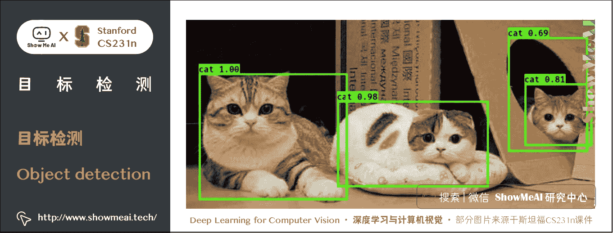

通常情况下，在对一张图片进行目标检测后，会得到许多物体的边界框和对应的置信度（代表其包含物体的可能性大小）。

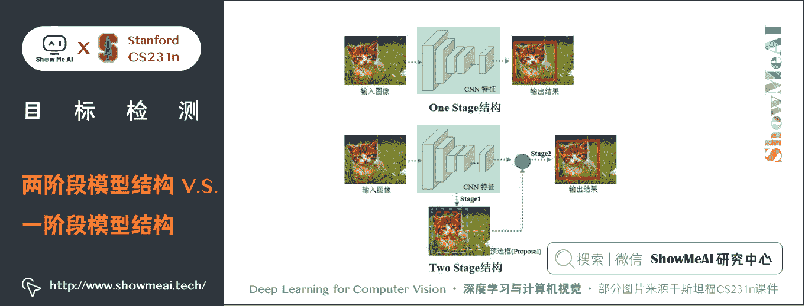

目标检测算法主要集中在 two-stage 算法和 one-stage 算法两大类：

### ① two-stage 算法

*   如 R-CNN 系列算法，需要先生成 proposal（一个有可能包含待检物体的预选框），然后进行细粒度的物体检测。
*   ShowMeAI 在上一篇 [**深度学习与 CV 教程(12) | 目标检测 (两阶段, R-CNN 系列**)](http://www.showmeai.tech/article-detail/271) 中做了介绍。

### ② one-stage 算法

*   直接在网络中提取特征来预测物体分类和位置。

two-stage 算法速度相对较慢但是准确率高，one-stage 算法准确率没有 two-stage 算法高但是速度较快。在本篇我们将聚焦 one-stage 的目标检测方法进行讲解，主要包括 YOLO 系列算法和 SSD 等。

# 1.YOLO 算法（YOLO V1）

> 关于 YOLO 的详细知识也可以对比阅读[ShowMeAI](http://www.showmeai.tech/)的[**深度学习教程 | 吴恩达专项课程 · 全套笔记解读**](http://www.showmeai.tech/tutorials/35)中的文章 [**CNN 应用: 目标检测**](http://www.showmeai.tech/article-detail/223) 中对于 YOLO 的讲解。

## 1.1 算法核心思想

YOLO 算法采用一个单独的 CNN 模型实现 end-to-end 的目标检测。首先将输入图片 resize 到 448 × 448 448 \times 448 448×448，然后送入 CNN 网络，最后处理网络预测结果得到检测的目标。相比 R-CNN 算法，其是一个统一的框架，其速度更快，而且 YOLO 的训练过程也是 端到端 / end-to-end 的。**所谓的 YOLO 全名是 You Only Look Once，意思是算法只需要一次的推断运算**。

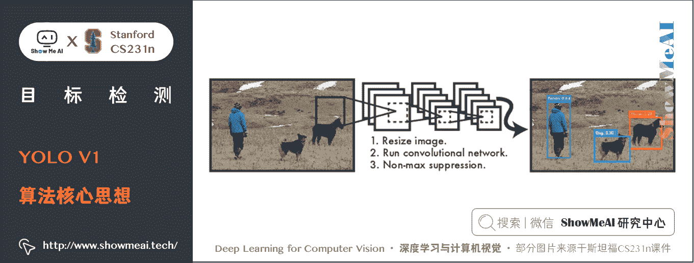

相比上述滑动窗口算法，YOLO 算法不再是窗口滑动，而是直接将原始图片分割成互不重合的小方块，然后通过卷积得到同等 size 的特征图，基于上面的分析，可以认为特征图的每个元素也是对应原始图片的一个小方块，可以用每个元素来可以预测那些中心点在该小方块内的目标。

**YOLO 算法的 CNN 网络将输入的图片分割成 N × N N\times N N×N 网格，然后每个单元格负责去检测那些中心点落在该格子内的目标**。

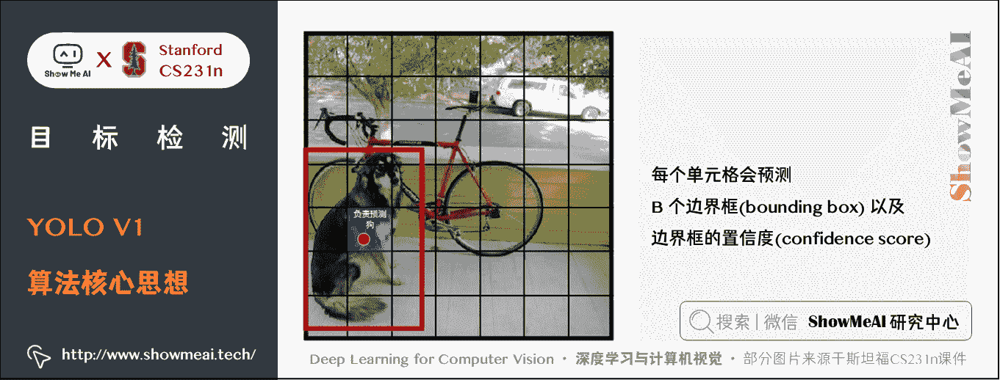

如图所示，可以看到，狗这个目标的中心落在左下角一个单元格内，那么该单元格负责预测这个狗。每个单元格会预测 $B $ 个边界框（bounding box）以及边界框的置信度（confidence score）。

**所谓置信度其实包含两个方面，一是这个边界框含有目标的可能性大小，二是这个边界框的准确度**。

前者记为 P ( o b j e c t ) P(object) P(object)，当该边界框是背景时（即不包含目标时）， P ( o b j e c t ) = 0 P(object)=0 P(object)=0。而当该边界框包含目标时， P ( o b j e c t ) = 1 P(object)=1 P(object)=1。

边界框的准确度可以用预测框与 ground truth 的 IoU （交并比）来表征，记为 IoU p r e d t r u t h \text{IoU}^{truth}_{pred} IoUpredtruth​。因此置信度可以定义为 P r ( o b j e c t ) ∗ IoU p r e d t r u t h Pr(object) \ast \text{IoU}^{truth}_{pred} Pr(object)∗IoUpredtruth​。

边界框的大小与位置可以用 4 个值来表征： ( x , y , w , h ) (x, y,w,h) (x,y,w,h)，其中 ( x , y ) (x,y) (x,y) 是边界框的中心坐标，而 w w w 和 h h h 是边界框的宽与高。

还有一点要注意，中心坐标的预测值 ( x , y ) (x,y) (x,y) 是相对于每个单元格左上角坐标点的偏移值，并且单位是相对于单元格大小的，单元格的坐标定义如上方图所示。

边界框的 w w w 和 h h h 预测值是相对于整个图片的宽与高的比例，因此理论上 4 个元素的大小应该在 [ 0 , 1 ] [0,1] [0,1] 范围。这样，每个边界框的预测值实际上包含 5 个元素： ( x , y , w , h , c ) (x,y,w,h,c) (x,y,w,h,c)，其中前 4 个表征边界框的大小与位置，最后一个值是置信度。

除此之外，每一个单元格预测出 C C C 个类别概率值，其表征的是由该单元格负责预测的边界框中的目标属于各个类别的概率。这些概率值其实是在各个边界框置信度下类别的条件概率，即 P r ( c l a s s i ∣ o b j e c t ) Pr(class_{i}|object) Pr(classi​∣object)。

值得注意的是，不管一个单元格预测多少个边界框，其只预测一组类别概率值。同时，我们可以计算出各个边界框的类别置信度 :

P r ( c l a s s i ∣ o b j e c t ) P r ( o b j e c t ) IoU p r e d t r u t h = P r ( c l a s s i ) ∗ IoU p r e d t r u t h Pr(class_{i}|object)Pr(object)\text{IoU}^{truth}_{pred}=Pr(class_{i}) \ast \text{IoU}^{truth}_{pred} Pr(classi​∣object)Pr(object)IoUpredtruth​=Pr(classi​)∗IoUpredtruth​

边界框类别置信度表征的是该边界框中目标属于各个类别的可能性大小以及边界框匹配目标的好坏。

## 1.2 YOLO 网络结构

YOLO 算法采用 CNN 来提取特征，使用全连接层来得到预测值。网络结构参考 GoogleNet，包含 24 个卷积层和 2 个全连接层，如下图所示。

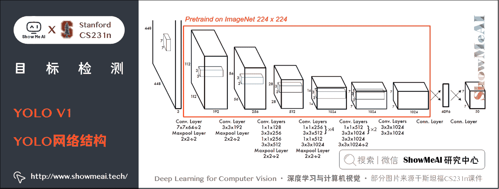

对于卷积层，主要使用 1 × 1 1 \times 1 1×1 卷积来做通道数降低，用 3 × 3 3 \times 3 3×3 卷积提取特征。对于卷积层和全连接层，采用 Leaky ReLU 激活函数： m a x ( x , 0.1 x ) max(x, 0.1x) max(x,0.1x)，最后一层却采用线性激活函数。

## 1.3 YOLO 训练与预测

在训练之前，先在 ImageNet 上进行预训练，其预训练的分类模型采用上图中前 20 个卷积层，然后添加一个 average-pool 层和全连接层。

在预训练结束之后之后，在预训练得到的 20 层卷积层之上加上随机初始化的 4 个卷积层和 2 个全连接层进行 fine-tuning。由于检测任务一般需要更高清的图片，所以将网络的输入从 224 × 224 224 \times 224 224×224 增加到了 448 × 448 448 \times 448 448×448。

整个网络的流程如下图所示：

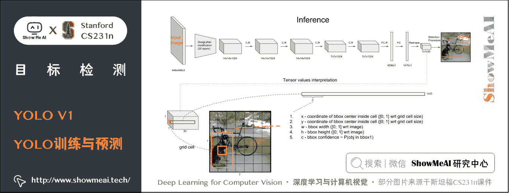

YOLO 算法将目标检测问题看作回归问题，所以采用的是 MSE loss，对不同的部分采用了不同的权重值。首先区分定位误差和分类误差。

*   对于定位误差，即边界框坐标预测误差，采用较大的权重 λ = 5 \lambda=5 λ=5。
*   然后其区分不包含目标的边界框与含有目标的边界框的置信度，对于前者，采用较小的权重值 λ = 0.5 \lambda =0.5 λ=0.5。其它权重值均设为 1 1 1。
*   然后采用均方误差，其同等对待大小不同的边界框，但是实际上较小的边界框的坐标误差应该要比较大的边界框要更敏感。为了保证这一点，将网络的边界框的宽与高预测改为对其平方根的预测，即预测值变为 ( x , y , w , h ) (x,y,\sqrt{w}, \sqrt{h}) (x,y,w  ​,h  ​)。

由于每个单元格预测多个边界框。但是其对应类别只有一个。

训练时，如果该单元格内确实存在目标，那么只选择与 ground truth 的 IoU 最大的那个边界框来负责预测该目标，而其它边界框认为不存在目标。这样设置的一个结果将会使一个单元格对应的边界框更加专业化，其可以分别适用不同大小，不同高宽比的目标，从而提升模型性能。

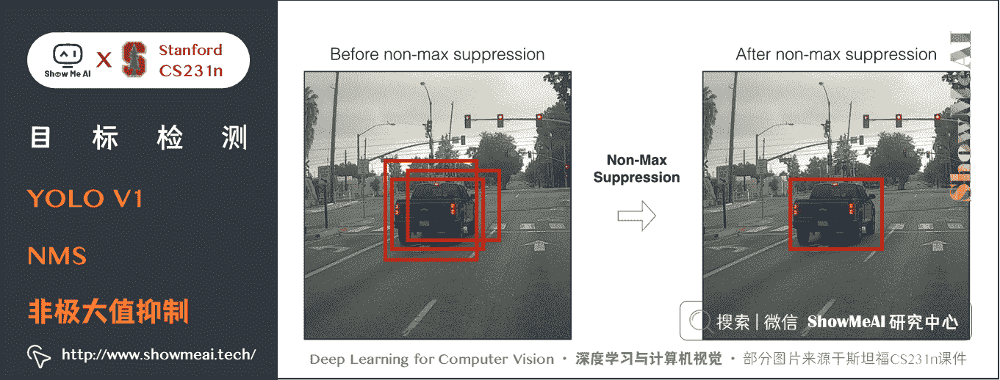

YOLO 算法预测时采用**非极大值抑制 （NMS）** 。NMS 算法主要解决的是一个目标被多次检测的问题，如图中的汽车检测，可以看到汽车被多次检测，但是其实我们希望最后仅仅输出其中一个最好的预测框。

比如对于上图中的汽车，只想要位置最正那个检测结果。那么可以采用 NMS 算法来实现这样的效果：

*   首先从所有的检测框中找到置信度最大的那个框，然后挨个计算其与剩余框的 IoU，如果 IoU 大于一定阈值（重合度过高），那么就将该框（剩余框）剔除；
*   然后对剩余的检测框重复上述过程，直到处理完所有的检测框。

## 1.4 YOLO 算法细节

### 1) bbox 生成步骤

① 输入图像分成 S × S S \times S S×S 的网格。现在是划分成了 7 × 7 7 \times 7 7×7 的，如果物品的中点落在某一个网格单元，这个网格单元将负责识别出这个物体。

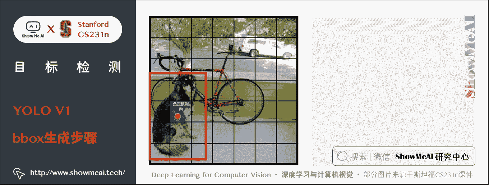

注意只是看该目标的中心点，而不是整体。比如 A ( 2 , 3 ) A(2, 3) A(2,3) 是狗的中心点，那么 A A A 就负责来负责预测狗

② 每个网格自身也要预测 n n n 个边界框 bounding box 和边界框的置信度 confidence。论文中 b = 2 b=2 b=2

**边界框**包含四个数据 x x x， y y y， w w w， h h h： ( x , y ) (x,y) (x,y) 框中心是相对于网格单元的坐标， w w w 和 h h h 是框相当于整幅图的宽和高。

**置信度**有两部分构成：含有物体的概率和边界框覆盖的准确性。

Pr ⁡ ( Object ) ∗ I o U pred  truth  \operatorname{Pr}(\text {Object}) \ast \mathrm{IoU}_{\text {pred }}^{\text {truth }} Pr(Object)∗IoUpred truth ​

*   $ IoU$ 交并比
*   P r Pr Pr 就是概率 p p p

如果有 object 落在一个 grid cell 里，第一项取 1 1 1，否则取 0 0 0。 第二项是预测的 bounding box 和实际的 ground truth 之间的 IoU 值。

每个边界框又要预测五个数值： x x x, y y y, w w w, h h h, c o n f i d e n c e confidence confidence。 ( x , y ) (x,y) (x,y) 框中心是相对于网格单元的坐标， w w w 和 h h h 是框相当于整幅图的宽和高，confidence 代表该框与 ground truth 之间的 IoU （框里没有物体分数直接为 0 0 0）。

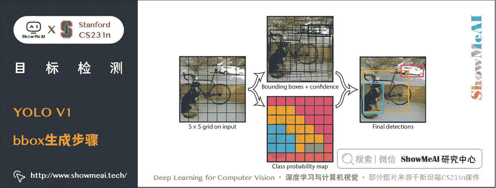

每个网格都要预测 b = 2 b= 2 b=2 个框，49 个网格就会输出 98 个边界框，每个框还有它的分数。每个格子最多只预测出一个物体。当物体占画面比例较小，如图像中包含畜群或鸟群时，每个格子包含多个物体，但却只能检测出其中一个。这是 YOLO 方法的一个缺陷。

最后每个单元格再预测他的 n n n 个边界框中的物体分类概率，有 c c c 个类别就要计算 c c c 个概率，和全连接层类似。

S × S × ( B ∗ 5 + C ) S \times S \times(B \ast 5+C) S×S×(B∗5+C)

本文中有 20 个类别：即 7 ∗ 7 ( 2 ∗ 5 + 20 ) 7 \ast 7(2 \ast 5+20) 7∗7(2∗5+20)

**总结**：每个方格要找到 n n n 个边界框，然后还要计算每个边界框的置信度，最后再计算每个边界框的分类的可能性。

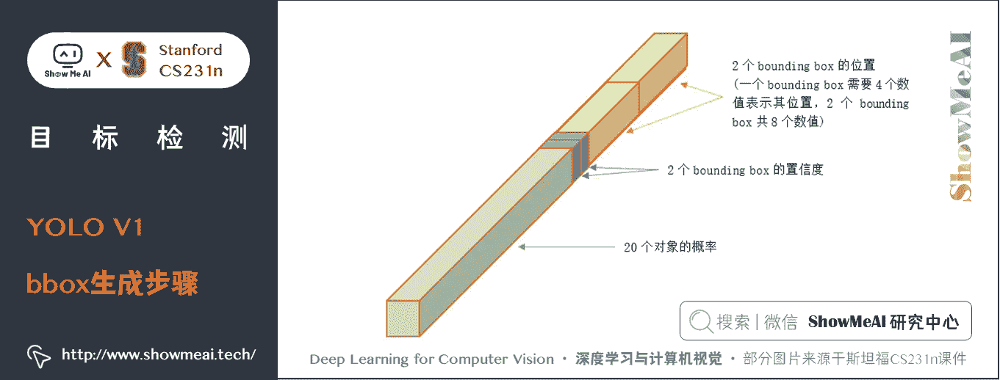

生成的 bounding box 的 ( x , y ) (x, y) (x,y) 被限制在 cell 里, 但长宽是没有限制的（即生成的 bounding box 可超出 cell 的边界）

### 2) 损失函数

YOLO V1 的损失函数就是把三类损失加权求和，用的也都是简单的平方差：

**边缘中心点误差**：

λ coord  ∑ i = 0 S 2 ∑ j = 0 B 1 i j obj  [ ( x i − x ^ i ) 2 + ( y i − y ^ i ) 2 ] \lambda_{\text {coord }} \sum_{i=0}^{S^{2}} \sum_{j=0}^{B} \mathbb{1}_{i j}^{\text {obj }}\left[\left(x_{i}-\hat{x}_{i}\right)^{2}+\left(y_{i}-\hat{y}_{i}\right)^{2}\right] λcoord ​i=0∑S2​j=0∑B​1ijobj ​[(xi​−x^i​)2+(yi​−y^​i​)2]

**边框宽度、高度误差**：

+ λ coord  ∑ i = 0 S 2 ∑ j = 0 B 1 i j obj  [ ( w i − w ^ i ) 2 + ( h i − h ^ i ) 2 ] +\lambda_{\text {coord }} \sum_{i=0}^{S^{2}} \sum_{j=0}^{B} \mathbb{1}_{i j}^{\text {obj }}\left[\left(\sqrt{w_{i}}-\sqrt{\hat{w}_{i}}\right)^{2}+\left(\sqrt{h_{i}}-\sqrt{\hat{h}_{i}}\right)^{2}\right] +λcoord ​i=0∑S2​j=0∑B​1ijobj ​[(wi​  ​−w^i​  ​)2+(hi​  ​−h^i​  ​)2]

**置信度误差（边框内有对象）** ：

+ ∑ i = 0 S 2 ∑ j = 0 B 1 i j obj  ( C i − C ^ i ) 2 +\sum_{i=0}^{S^{2}} \sum_{j=0}^{B} \mathbb{1}_{i j}^{\text {obj }}\left(C_{i}-\hat{C}_{i}\right)^{2} +i=0∑S2​j=0∑B​1ijobj ​(Ci​−C^i​)2

**置信度误差（边框内无对象）** ：

+ λ noobj  ∑ i = 0 S 2 ∑ j = 0 B 1 i j noobj  ( C i − C ^ i ) 2 +\lambda_{\text {noobj }} \sum_{i=0}^{S^{2}} \sum_{j=0}^{B} \mathbb{1}_{i j}^{\text {noobj }}\left(C_{i}-\hat{C}_{i}\right)^{2} +λnoobj ​i=0∑S2​j=0∑B​1ijnoobj ​(Ci​−C^i​)2

**对象分类误差**：

+ ∑ i = 0 S 2 1 i obj  ∑ c ∈  classes  ( p i ( c ) − p ^ i ( c ) ) 2 +\sum_{i=0}^{S^{2}} \mathbb{1}_{i}^{\text {obj }} \sum_{c \in \text { classes }}\left(p_{i}(c)-\hat{p}_{i}(c)\right)^{2} +i=0∑S2​1iobj ​c∈ classes ∑​(pi​(c)−p^​i​(c))2

其中

*   1 i o b j 1_{i}^{o b j} 1iobj​ 意思是网格 i i i 中存在对象。
*   1 i j o b j 1_{i j}^{o b j} 1ijobj​ 意思是网格的第 j j j 个 bounding box 中存在对象。
*   1 i j n o o b j 1_{i j}^{n o o b j} 1ijnoobj​ 意思是网格 i i i 的第 个 bounding box 中不存在对象。

损失函数计算是有条件的，是否存在对象对损失函数的计算有影响。

先要计算**位置误差**：预测中点和实际中点之间的距离，再计算 bbox 宽度和高度之间的差距，权重为 5 调高位置误差的权重

**置信度误差**：要考虑两个情况：这个框里实际上有目标；这个框里没有目标，而且要成一个权重降低他的影响，调低不存在对象的 bounding box 的置信度误差的权重，论文中是 0.5 0.5 0.5

**对象分类的误差**：当该框中有目标时才计算，概率的二范数

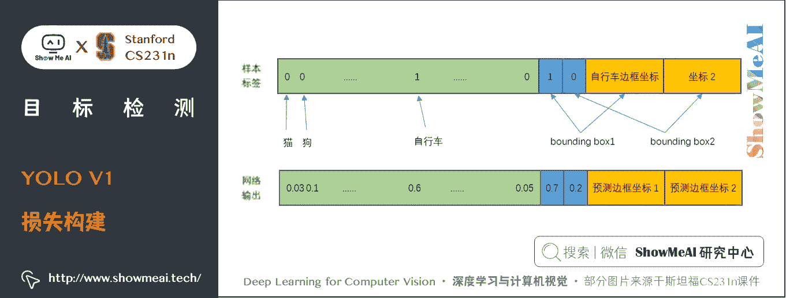

### 3) YOLO V1 的缺陷

不能解决小目标问题，YOLO 对边界框预测施加了严格的空间约束，因为每个网格单元只能预测两个边界框，并且只能有一个类。这个空间约束限制了我们模型能够预测的临近对象的数量。

YOLO V1 在处理以群体形式出现的小对象时会有困难，比如成群的鸟。

# 2\. SSD 算法

**SSD 算法全名是 Single Shot Multibox Detector**，Single shot 指明了 SSD 算法属于 one-stage 方法，MultiBox 指明了 SSD 是多框预测。

SSD 算法在准确度和速度上都优于最原始的 YOLO 算法。对比 YOLO，SSD 主要改进了三点：多尺度特征图，利用卷积进行检测，设置先验框。

*   SSD 采用 CNN 来直接进行检测，而不是像 YOLO 那样在全连接层之后做检测。
*   SSD 提取了不同尺度的特征图来做检测，大尺度特征图（较靠前的特征图）可以用来检测小物体，而小尺度特征图（较靠后的特征图）用来检测大物体。
*   SSD 采用了不同尺度和长宽比的先验框（在 Faster R-CNN 中叫做 anchor )。

下面展开讲解 SSD 目标检测算法。

## 2.1 算法核心思想

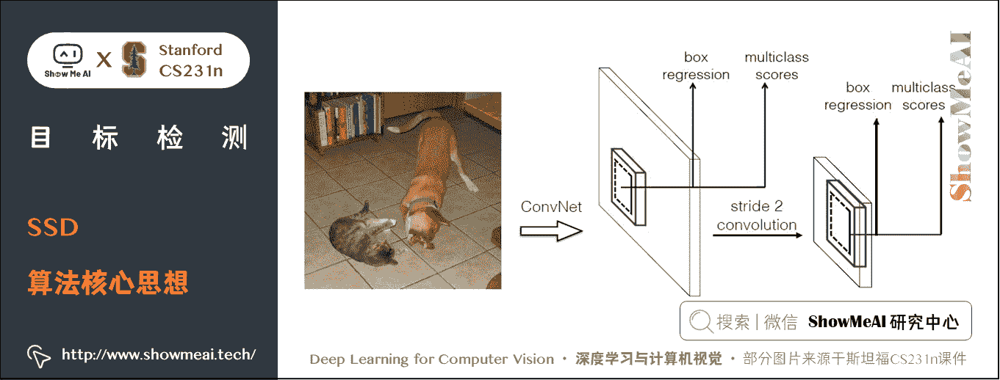

### 1) 采用多尺度特征图用于检测

所谓多尺度特征图，就是采用大小不同的特征图进行检测。

CNN 网络一般前面的特征图比较大，后面会逐渐采用 s t r i d e = 2 stride=2 stride=2 的卷积或者 pool 来降低特征图大小，如下图所示，一个比较大的特征图和一个比较小的特征图，它们都用来做检测。

*   这样做的好处是比较大的特征图来用来检测相对较小的目标，而小的特征图负责检测大目标。
*   8 × 8 8 \times 8 8×8 的特征图可以划分更多的单元，但是其每个单元的先验框尺度比较小。

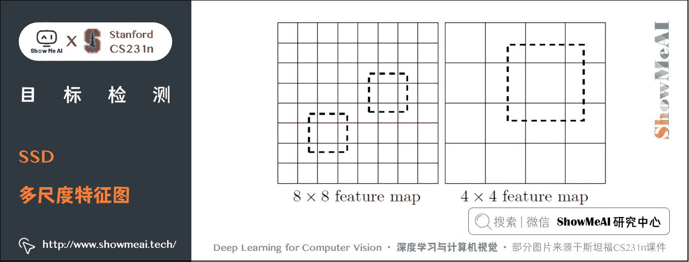

### 2) 利用卷积进行检测

与 YOLO 最后采用全连接层不同，SSD 直接采用卷积对不同的特征图来进行提取检测结果。

对于形状为 m × n × p m\times n \times p m×n×p 的特征图，只需要采用 3 × 3 × p 3\times 3 \times p 3×3×p 这样比较小的卷积核得到检测值。

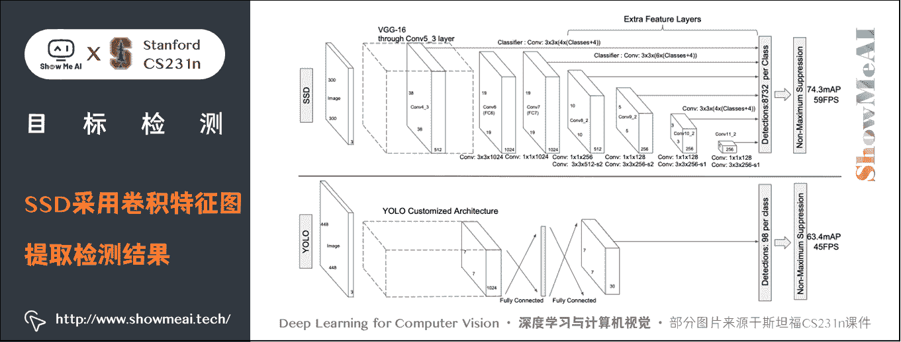

### 3) 设置先验框

在 YOLO 中，每个单元预测多个边界框，但是其都是相对这个单元本身（正方块），但是真实目标的形状是多变的，YOLO 需要在训练过程中自适应目标的形状。

SSD 借鉴了 Faster R-CNN 中 anchor 的理念，每个单元设置尺度或者长宽比不同的先验框，预测的 bbox 是以这些先验框为基准的，在一定程度上减少训练难度。

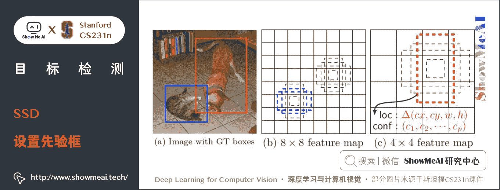

一般情况下，每个单元会设置多个先验框，其尺度和长宽比存在差异，如图所示，可以看到每个单元使用了 4 个不同的先验框，图片中猫和狗分别采用最适合它们形状的先验框来进行训练，后面会详细讲解训练过程中的先验框匹配原则。

SSD 的检测值也与 YOLO 不太一样。对于每个单元的**每个先验框，其都输出一套独立的检测值，对应一个边界框**，主要分为两个部分。

*   第 1 部分是各个类别的置信度，值得注意的是 SSD 将背景也当做了一个特殊的类别，如果检测目标共有 c c c 个类别，SSD 其实需要预测 c + 1 c+1 c+1 个置信度值，第一个置信度指的是不含目标或者属于背景的评分。在预测过程中，置信度最高的那个类别就是边界框所属的类别，特别地，当第一个置信度值最高时，表示边界框中并不包含目标。
*   第 2 部分就是边界框的 location，包含 4 个值 ( c x , c y , w , h ) (cx, cy, w, h) (cx,cy,w,h)，分别表示边界框的中心坐标以及宽和高。然而，真实预测值其实只是边界框相对于先验框的转换值。先验框位置用 d = ( d c x , d c y , d w , d h ) d=(d^{cx}, d^{cy}, d^w, d^h) d=(dcx,dcy,dw,dh) 表示，其对应边界框用 b = ( b c x , b c y , b w , b h ) b=(b^{cx}, b^{cy}, b^w, b^h) b=(bcx,bcy,bw,bh) 表示，那么边界框的预测值 l l l 其实是 b b b 相对于 d d d 的转换值：

l c x = ( b c x − d c x ) / d w ,   l c y = ( b c y − d c y ) / d h l^{cx} = (b^{cx} - d^{cx})/d^w, \space l^{cy} = (b^{cy} - d^{cy})/d^h lcx=(bcx−dcx)/dw, lcy=(bcy−dcy)/dh

l w = log ⁡ ( b w / d w ) ,   l h = log ⁡ ( b h / d h ) l^{w} = \log(b^{w}/d^w), \space l^{h} = \log(b^{h}/d^h) lw=log(bw/dw), lh=log(bh/dh)

习惯上，我们称上面这个过程为边界框的编码（encode），预测时，你需要反向这个过程，即进行解码（decode），从预测值 l l l 中得到边界框的真实位置 b b b ：

b c x = d w l c x + d c x ,   b c y = d y l c y + d c y b^{cx}=d^w l^{cx} + d^{cx}, \space b^{cy}=d^y l^{cy} + d^{cy} bcx=dwlcx+dcx, bcy=dylcy+dcy

b w = d w exp ⁡ ( l w ) ,   b h = d h exp ⁡ ( l h ) b^{w}=d^w \exp(l^{w}), \space b^{h}=d^h \exp(l^{h}) bw=dwexp(lw), bh=dhexp(lh)

## 2.2 SSD 网络结构

SSD 采用 VGG16 作为基础模型，然后在 VGG16 的基础上新增了卷积层来获得更多的特征图以用于检测。**SSD 的网络结构如下图所示**。

SSD 利用了多尺度的特征图做检测。模型的输入图片大小是 300 × 300 300 \times 300 300×300。

采用 VGG16 做基础模型，首先 VGG16 是在 ILSVRC CLS-LOC 数据集上做预训练。

然后，分别将 VGG16 的全连接层 fc6 和 fc7 转换成 3 × 3 3 \times 3 3×3 卷积层 conv6 和 1 × 1 1 \times 1 1×1 卷积层 conv7，同时将池化层 pool5 由原来的 s t r i d e = 2 stride=2 stride=2 的 $2\times 2 $ 变成 s t r i d e = 1 stride=1 stride=1 的 3 × 3 3\times 3 3×3，为了配合这种变化，采用了一种 Atrous Algorithm，就是 conv6 采用扩张卷积（空洞卷积），在不增加参数与模型复杂度的条件下指数级扩大了卷积的视野，其使用扩张率（dilation rate）参数，来表示扩张的大小。

如下图所示：

*   (a)是普通的 3 × 3 3\times3 3×3 卷积，其视野就是 3 × 3 3\times3 3×3
*   (b)是扩张率为 2，此时视野变成 7 × 7 7\times7 7×7
*   ©扩张率为 4 时，视野扩大为 15 × 15 15\times15 15×15，但是视野的特征更稀疏了。

Conv6 采用 3 × 3 3\times3 3×3 大小但 d i l a t i o n r a t e = 6 dilation rate=6 dilationrate=6 的扩展卷积。然后移除 Dropout 层和 fc8 层，并新增一系列卷积层，在检测数据集上做 fine-tuning。

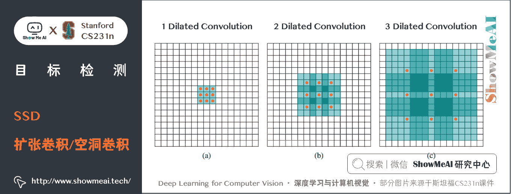

## 2.3 SSD 训练与预测

在训练过程中，首先要确定训练图片中的 ground truth （真实目标）与哪个先验框来进行匹配，与之匹配的先验框所对应的边界框将负责预测它。

在 **YOLO** 中：ground truth 的中心落在哪个单元格，该单元格中与其 IoU 最大的边界框负责预测它。

在 **SSD** 中：处理方式不一样，SSD 的先验框与 ground truth 有 2 个匹配原则。

*   **第 1 原则**：对于图片中每个 ground truth，找到与其 IoU 最大的先验框，该先验框与其匹配，这样，可以保证每个 ground truth 一定与某个先验框匹配。通常称与 ground truth 匹配的先验框为正样本，反之，若一个先验框没有与任何 ground truth 进行匹配，那么该先验框只能与背景匹配，就是负样本。
    *   然而，由于一个图片中 ground truth 是非常少的，而先验框却很多，如果仅按上述原则匹配，很多先验框会是负样本，正负样本极其不平衡，所以有下述第 2 原则。
*   **第 2 原则**：对于剩余的未匹配先验框，若某个 ground truth 的 IoU \text{IoU} IoU 大于某个阈值（一般是 0.5），那么该先验框也与这个 ground truth 进行匹配。这意味着某个 ground truth 可能与多个先验框匹配，这是可以的。但是反过来却不可以，因为一个先验框只能匹配一个 ground truth，如果多个 ground truth 与某个先验框 IoU \text{IoU} IoU 大于阈值，那么先验框只与 IoU 最大的那个 ground truth 进行匹配。

第 2 原则一定在第 1 原则之后进行。

仔细考虑一下这种情况，如果某个 ground truth 所对应最大 IoU \text{IoU} IoU 小于阈值，并且所匹配的先验框却与另外一个 ground truth 的 IoU \text{IoU} IoU 大于阈值，那么该先验框应该匹配谁，答案应该是前者，**首先要确保每个 ground truth 一定有一个先验框与之匹配**。

但是，这种情况存在的概率很小。由于先验框很多，某个 ground truth 的最大 IoU \text{IoU} IoU 肯定大于阈值，所以可能只实施第二个原则既可以了。

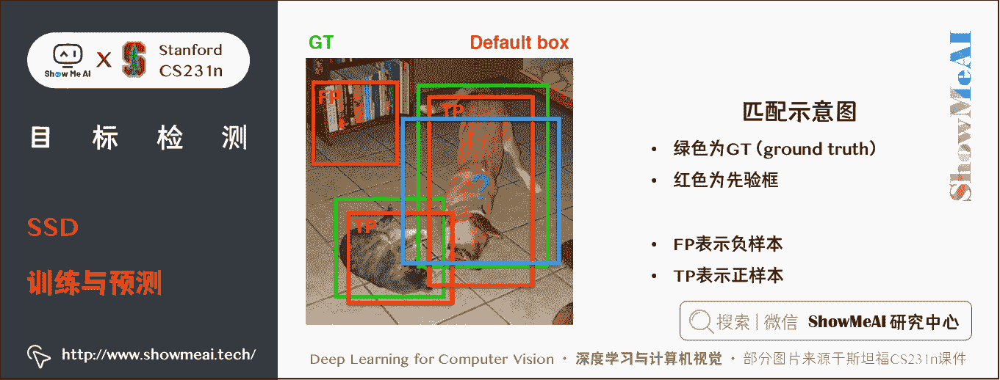

上图为一个匹配示意图，其中绿色的 GT 是 ground truth，红色为先验框，FP 表示负样本，TP 表示正样本。

尽管一个 ground truth 可以与多个先验框匹配，但是 ground truth 相对先验框还是太少了，所以负样本相对正样本会很多。

为了保证正负样本尽量平衡，SSD 采用了 hard negative mining 算法，就是对负样本进行抽样，抽样时按照置信度误差（预测背景的置信度越小，误差越大）进行降序排列，选取误差的较大（置信度小）的 t o p − k top-k top−k 作为训练的负样本，以保证正负样本比例接近 1 : 3 1:3 1:3。

# 3.YOLO V2

> 论文链接：https://openaccess.thecvf.com/content_cvpr_2017/papers/Redmon_YOLO9000_Better_Faster_CVPR_2017_paper.pdf
> 代码链接：https://github.com/longcw/YOLO2-pytorch

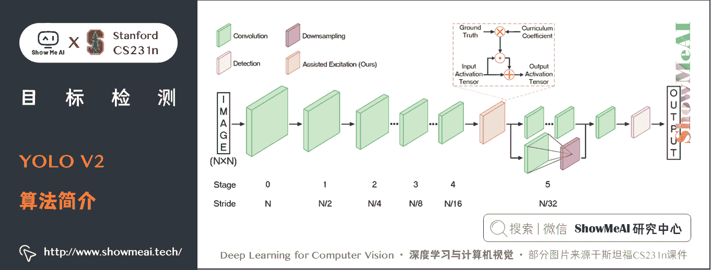

### 1) 算法简介

相比于 YOLO V1，**YOLO V2** 在精度、速度和分类数量上都有了很大的改进。YOLO V2 使用 DarkNet19 作为特征提取网络，该网络比 YOLO V2 所使用的 VGG-16 要更快。YOLO V2 使用目标分类和检测的联合训练技巧，结合 Word Tree 等方法，使得 YOLO V2 的检测种类扩充到了上千种，分类效果更好。

下图展示了 YOLO V2 相比于 YOLO V1 在提高检测精度上的改进策略。

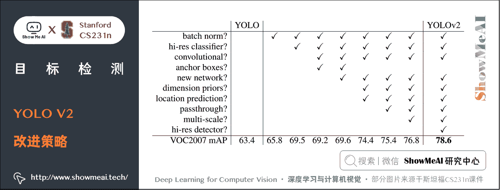

### 2) 性能效果

YOLO V2 算法在 VOC 2007 数据集上的表现为 67 FPS 时，mAP 为 76.8，在 40FPS 时，mAP 为 78.6。

### 3) 缺点不足

YOLO V2 算法只有一条检测分支，且该网络缺乏对多尺度上下文信息的捕获，所以对于不同尺寸的目标检测效果依然较差，尤其是对于小目标检测问题。

# 4\. RetinaNet

> 论文链接：https://openaccess.thecvf.com/content_ICCV_2017/papers/Lin_Focal_Loss_for_ICCV_2017_paper.pdf
> 代码链接：https://github.com/yhenon/pytorch-retinanet

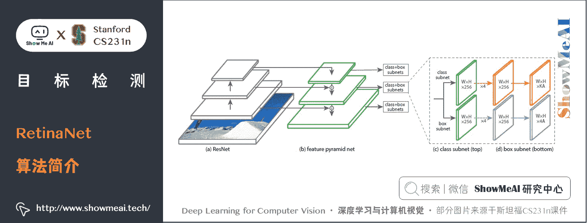

### 1) 算法简介

尽管一阶段检测算推理速度快，但精度上与二阶段检测算法相比还是不足。**RetinaNet**论文分析了一阶段网络训练存在的类别不平衡问题，提出能根据 Loss 大小自动调节权重的 Focal loss，代替了标准的交叉熵损失函数，使得模型的训练更专注于困难样本。同时，基于 FPN 设计了 RetinaNet，在精度和速度上都有不俗的表现。

### 2) 性能效果

RetinaNet 在保持高速推理的同时，拥有与二阶段检测算法相媲美的精度（ COCO m A P @ . 5 = 59.1 % mAP@.5=59.1\% mAP@.5=59.1%, m A P @ [ . 5 , . 95 ] = 39.1 % mAP@[.5, .95]=39.1\% mAP@[.5,.95]=39.1%）。

# 5.YOLO V3

> 论文链接：https://arxiv.org/pdf/1804.02767.pdf
> 代码链接：https://github.com/ultralytics/YOLOv3

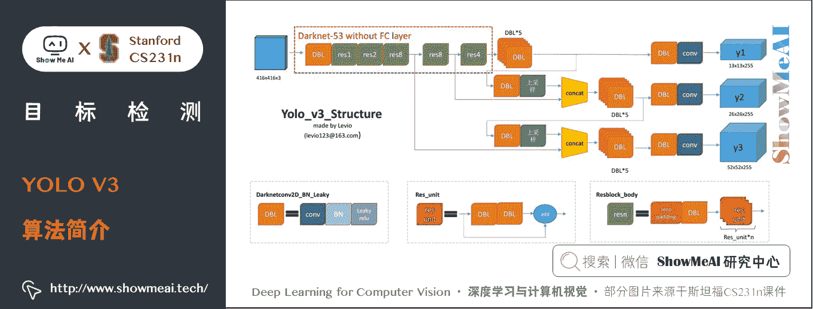

### 1) 算法简介

相比于 YOLO V2，**YOLO V3** 将特征提取网络换成了 DarkNet53，对象分类用 Logistic 取代了 Softmax，并借鉴了 FPN 思想采用三条分支（三个不同尺度/不同感受野的特征图）去检测具有不同尺寸的对象。

### 2) 性能效果

YOLO V3 在 VOC 数据集，Titan X 上处理 608 × 608 608 \times 608 608×608 图像速度达到 20FPS，在 COCO 的测试数据集上 m A P @ 0.5 mAP@0.5 mAP@0.5 达到 57.9 % 57.9\% 57.9%。其精度比 SSD 高一些，比 Faster RCNN 相比略有逊色（几乎持平），比 RetinaNet 差，但速度是 SSD 、RetinaNet 和 Faster RCNN 至少 2 倍以上，而简化后的 YOLO V3 tiny 可以更快。

### 3) 缺点不足

YOLO V3 采用 MSE 作为边框回归损失函数，这使得 YOLO V3 对目标的定位并不精准，之后出现的 IOU，GIOU，DIOU 和 CIOU 等一系列边框回归损失大大改善了 YOLO V3 对目标的定位精度。

# 6.YOLO V4

> 论文链接：https://arxiv.org/pdf/2004.10934
> 代码链接：https://github.com/Tianxiaomo/pytorch-YOLOv4

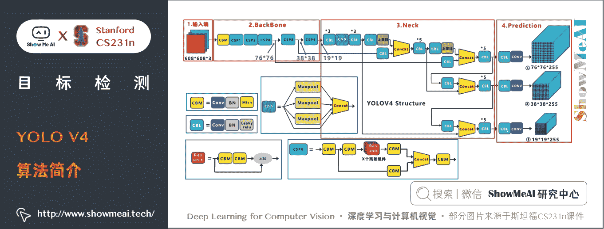

### 1) 算法简介

相比于 YOLO V4，**YOLO V4** 在输入端，引入了 Mosaic 数据增强、cmBN、SAT 自对抗训练；在特征提取网络上，YOLO V4 将各种新的方式结合起来，包括 CSPDarknet53，Mish 激活函数，Dropblock；在检测头中，引入了 SPP 模块，借鉴了 FPN+PAN 结构；在预测阶段，采用了 CIOU 作为网络的边界框损失函数，同时将 NMS 换成了 DIOU_NMS 等等。总体来说，YOLO V4 具有极大的工程意义，将近年来深度学习领域最新研究的 tricks 都引入到了 YOLO V4 做验证测试，在 YOLO V3 的基础上更进一大步。

### 2) 性能效果

YOLO V4 在 COCO 数据集上达到了 43.5 % A P 43.5\%AP 43.5%AP（ 65.7 % A P 50 65.7\% AP50 65.7%AP50），在 Tesla V100 显卡上实现了 65 fps 的实时性能，下图展示了在 COCO 检测数据集上 YOLO V4 和其它 SOTA 检测算法的性能对比。

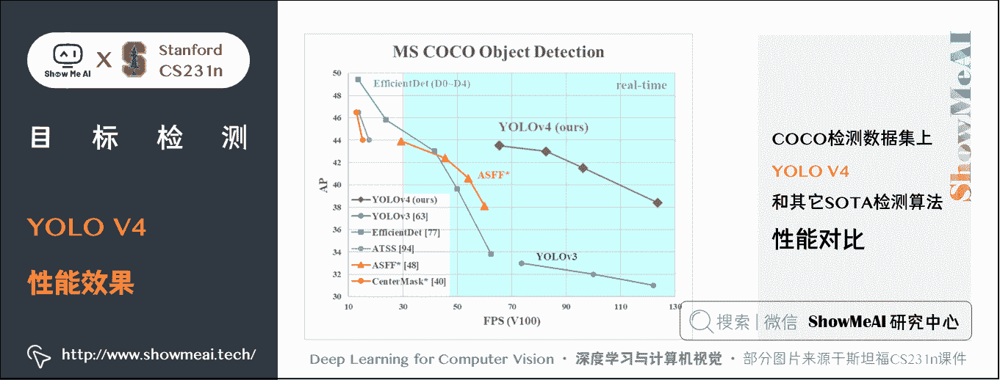

# 7.YOLO V5

> 代码链接：https://github.com/ultralytics/YOLOv5

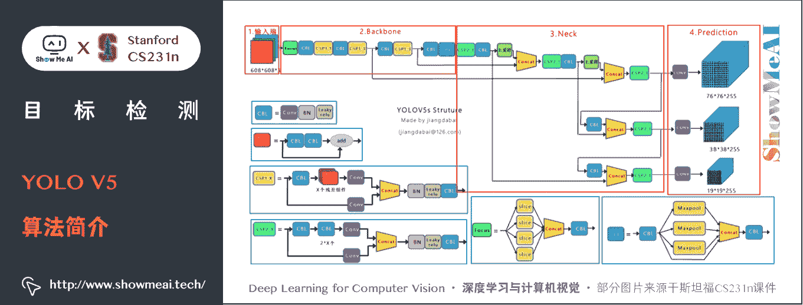

### 1) 算法简介

YOLO V5 与 YOLO V4 有点相似，都大量整合了计算机视觉领域的前沿技巧，从而显著改善了 YOLO 对目标的检测性能。相比于 YOLO V4，YOLO V5 在性能上稍微逊色，但其灵活性与速度上远强于 YOLO V4，而且在模型的快速部署上也具有极强优势。

### 2) 性能效果

如下图展示了在 COCO 检测数据集上 YOLO V5 和其它 SOTA 检测算法的性能对比。

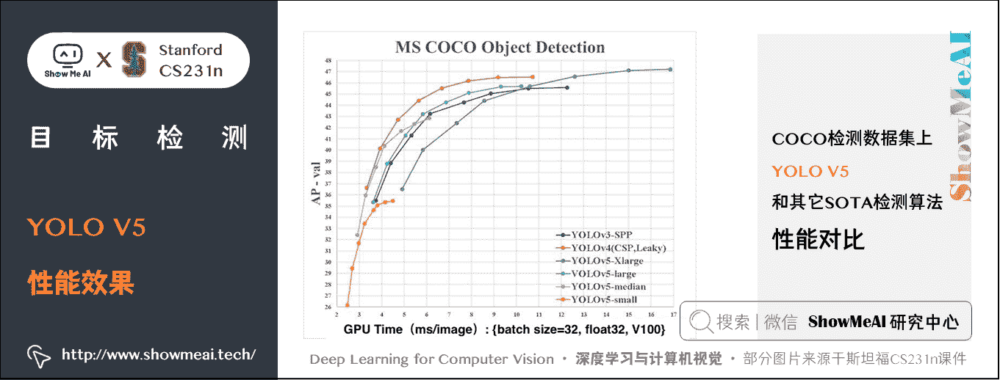

# 8.推荐学习

**可以点击 [B 站](https://www.bilibili.com/video/BV1g64y1B7m7?p=11) 查看视频的【双语字幕】版本**

[`player.bilibili.com/player.html?aid=759478950&page=11`](https://player.bilibili.com/player.html?aid=759478950&page=11)

【字幕+资料下载】斯坦福 CS231n | 面向视觉识别的卷积神经网络 (2017·全 16 讲)

*   [【课程学习指南】斯坦福 CS231n | 深度学习与计算机视觉](http://blog.showmeai.tech/cs231n/)
*   [【字幕+资料下载】斯坦福 CS231n | 深度学习与计算机视觉 (2017·全 16 讲)](https://www.bilibili.com/video/BV1g64y1B7m7)
*   [【CS231n 进阶课】密歇根 EECS498 | 深度学习与计算机视觉](http://blog.showmeai.tech/eecs498/)
*   [【深度学习教程】吴恩达专项课程 · 全套笔记解读](http://www.showmeai.tech/tutorials/35)
*   [【Stanford 官网】CS231n: Deep Learning for Computer Vision](http://cs231n.stanford.edu/)

# [ShowMeAI](http://www.showmeai.tech) 斯坦福 CS231n 全套解读

*   [深度学习与计算机视觉教程(1) | CV 引言与基础 @CS231n](http://www.showmeai.tech/article-detail/260)
*   [深度学习与计算机视觉教程(2) | 图像分类与机器学习基础 @CS231n](http://www.showmeai.tech/article-detail/261)
*   [深度学习与计算机视觉教程(3) | 损失函数与最优化 @CS231n](http://www.showmeai.tech/article-detail/262)
*   [深度学习与计算机视觉教程(4) | 神经网络与反向传播 @CS231n](http://www.showmeai.tech/article-detail/263)
*   [深度学习与计算机视觉教程(5) | 卷积神经网络 @CS231n](http://www.showmeai.tech/article-detail/264)
*   [深度学习与计算机视觉教程(6) | 神经网络训练技巧 (上) @CS231n](http://www.showmeai.tech/article-detail/265)
*   [深度学习与计算机视觉教程(7) | 神经网络训练技巧 (下) @CS231n](http://www.showmeai.tech/article-detail/266)
*   [深度学习与计算机视觉教程(8) | 常见深度学习框架介绍 @CS231n](http://www.showmeai.tech/article-detail/267)
*   [深度学习与计算机视觉教程(9) | 典型 CNN 架构 (Alexnet, VGG, Googlenet, Restnet 等) @CS231n](http://www.showmeai.tech/article-detail/268)
*   [深度学习与计算机视觉教程(10) | 轻量化 CNN 架构 (SqueezeNet, ShuffleNet, MobileNet 等) @CS231n](http://www.showmeai.tech/article-detail/269)
*   [深度学习与计算机视觉教程(11) | 循环神经网络及视觉应用 @CS231n](http://www.showmeai.tech/article-detail/270)
*   [深度学习与计算机视觉教程(12) | 目标检测 (两阶段, R-CNN 系列) @CS231n](http://www.showmeai.tech/article-detail/271)
*   [深度学习与计算机视觉教程(13) | 目标检测 (SSD, YOLO 系列) @CS231n](http://www.showmeai.tech/article-detail/272)
*   [深度学习与计算机视觉教程(14) | 图像分割 (FCN, SegNet, U-Net, PSPNet, DeepLab, RefineNet) @CS231n](http://www.showmeai.tech/article-detail/273)
*   [深度学习与计算机视觉教程(15) | 视觉模型可视化与可解释性 @CS231n](http://www.showmeai.tech/article-detail/274)
*   [深度学习与计算机视觉教程(16) | 生成模型 (PixelRNN, PixelCNN, VAE, GAN) @CS231n](http://www.showmeai.tech/article-detail/275)
*   [深度学习与计算机视觉教程(17) | 深度强化学习 (马尔可夫决策过程, Q-Learning, DQN) @CS231n](http://www.showmeai.tech/article-detail/276)
*   [深度学习与计算机视觉教程(18) | 深度强化学习 (梯度策略, Actor-Critic, DDPG, A3C) @CS231n](http://www.showmeai.tech/article-detail/277)

# [ShowMeAI](http://www.showmeai.tech) 系列教程推荐

*   [大厂技术实现：推荐与广告计算解决方案](http://www.showmeai.tech/tutorials/50)
*   [大厂技术实现：计算机视觉解决方案](http://www.showmeai.tech/tutorials/51)
*   [大厂技术实现：自然语言处理行业解决方案](http://www.showmeai.tech/tutorials/52)
*   [图解 Python 编程：从入门到精通系列教程](http://www.showmeai.tech/tutorials/56)
*   [图解数据分析：从入门到精通系列教程](http://www.showmeai.tech/tutorials/33)
*   [图解 AI 数学基础：从入门到精通系列教程](http://www.showmeai.tech/tutorials/83)
*   [图解大数据技术：从入门到精通系列教程](http://www.showmeai.tech/tutorials/84)
*   [图解机器学习算法：从入门到精通系列教程](http://www.showmeai.tech/tutorials/34)
*   [机器学习实战：手把手教你玩转机器学习系列](http://www.showmeai.tech/tutorials/41)
*   [深度学习教程：吴恩达专项课程 · 全套笔记解读](http://www.showmeai.tech/tutorials/35)
*   [自然语言处理教程：斯坦福 CS224n 课程 · 课程带学与全套笔记解读](http://www.showmeai.tech/tutorials/36)
*   [深度学习与计算机视觉教程：斯坦福 CS231n · 全套笔记解读](http://www.showmeai.tech/tutorials/37)

