# 深度学习与计算机视觉教程(14) | 图像分割 (FCN,SegNet,U-Net,PSPNet,DeepLab,RefineNet)（CV 通关指南·完结）

> 原文：[`blog.csdn.net/ShowMeAI/article/details/125039332`](https://blog.csdn.net/ShowMeAI/article/details/125039332)

*   作者：[韩信子](https://github.com/HanXinzi-AI)@[ShowMeAI](http://www.showmeai.tech/)
*   [教程地址](http://www.showmeai.tech/tutorials/37)：[`www.showmeai.tech/tutorials/37`](http://www.showmeai.tech/tutorials/37)
*   [本文地址](http://www.showmeai.tech/article-detail/273)：[`www.showmeai.tech/article-detail/273`](http://www.showmeai.tech/article-detail/273)
*   声明：版权所有，转载请联系平台与作者并注明出处
*   **收藏[ShowMeAI](http://www.showmeai.tech/)查看更多精彩内容**

* * *

本系列为 **斯坦福 CS231n** 《深度学习与计算机视觉(Deep Learning for Computer Vision)》的全套学习笔记，对应的课程视频可以在 [**这里**](https://www.bilibili.com/video/BV1g64y1B7m7?p=11) 查看。更多资料获取方式见文末。

* * *

# 1.图像语义分割定义

图像语义分割是计算机视觉中十分重要的领域，它是指像素级地识别图像，即标注出图像中每个像素所属的对象类别。下图为语义分割的一个实例，它清晰地把图中的骑行人员、自行车和背景对应的像素标注出来了。

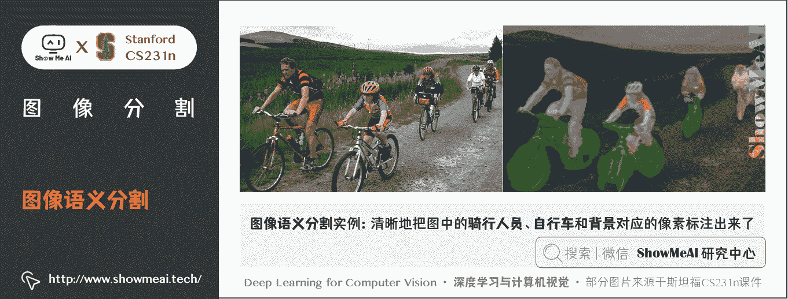

图像分割有语义分割和实例分割的差别。语义分割不分离同一类的实例，我们只关心每个像素的类别，如果输入对象中有两个相同类别的对象，语义分割不将他们区分为单独的对象。实例分割是需要对对象个体进行区分的。

# 2.语义分割常见应用

## 2.1 自动驾驶汽车

语义分割常见的应用场景之一是自动驾驶领域，我们希望自动驾驶汽车有「环境感知」的能力，以便其可以安全行驶；下图为自动驾驶过程中实时分割道路场景：

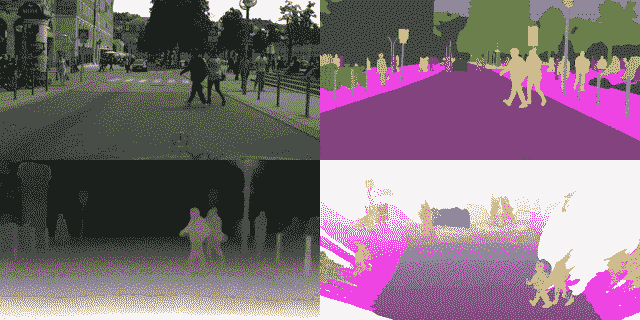

## 2.2 医学影像诊断

语义分割的另外一个大应用场景是医疗影像诊断，机器可以智能地对医疗影像进行分析，降低医生的工作负担，大大减少了运行诊断测试所需的时间；下图是**胸部 X 光片**的分割，心脏（红色），肺部（绿色以及锁骨（蓝色）：

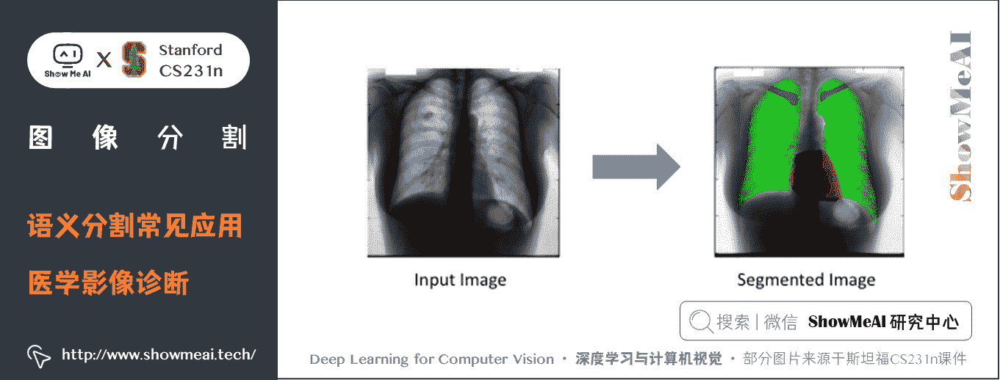

**语义分割的目标是**：将一张 RGB 图像（heightwidth3）或是灰度图（heightwidth1）作为输入，输出的是分割图，其中每一个像素包含了其类别的标签（heightwidth1）。

下图为典型示例，为了直观易懂，示例显示使用的低分辨率的预测图，但实际上分割图的分辨率应与原始输入的分辨率是一致的。

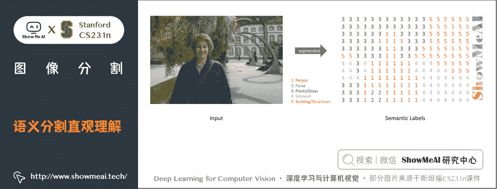

从上图可以看到在语义分割任务中，像素级别的标签设置，我们会使用 one-hot 编码对类标签进行处理。

> 关于 one-hot 编码的详细知识也可以参考阅读[ShowMeAI](http://www.showmeai.tech/)的 [**机器学习实战：手把手教你玩转机器学习系列**](http://www.showmeai.tech/tutorials/41) 中的文章 [**机器学习实战 | 机器学习特征工程最全解读**](http://www.showmeai.tech/article-detail/208) 里【**独热向量编码(one hot encoding)** 】板块内容。

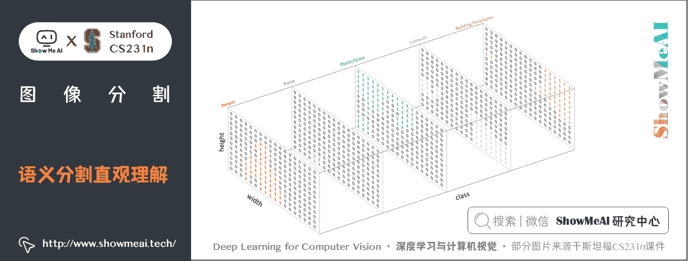

最后，可以通过 argmax 将每个深度方向像素矢量折叠成分割图，将它覆盖在原图上，可以区分图像中存在不同类别的区域，方便观测（也叫 mask/掩码）。

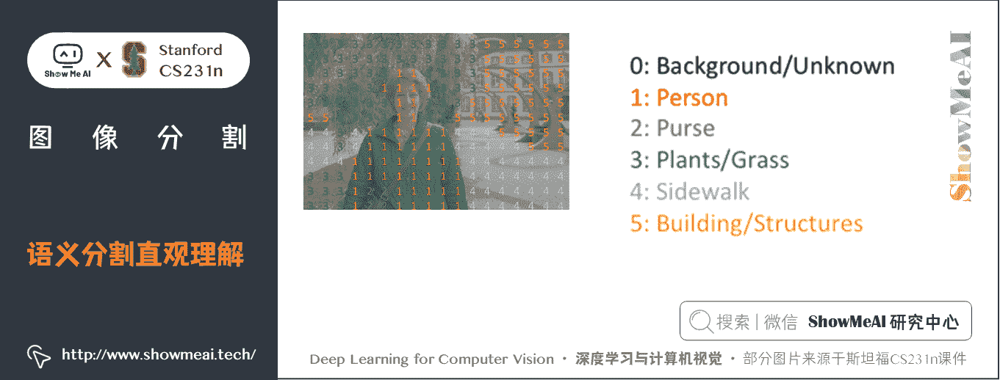

# 3.语义分割任务评估

对于语义分割任务，我们会通过 **mIoU（mean Intersection-Over-Union） 和 mAcc（mean Accuracy）** 指标来进行效果评估。

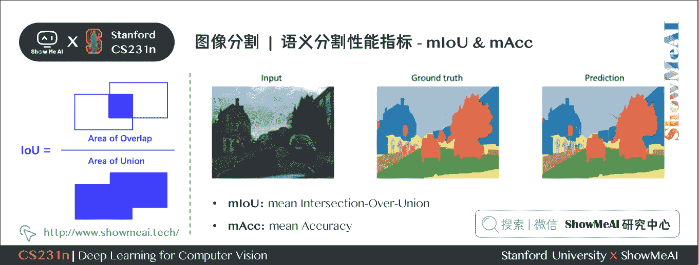

## 3.1 mIoU

分割网络的评价指标：mIoU

*   mloU：分割每一类别的交并比（IOU）

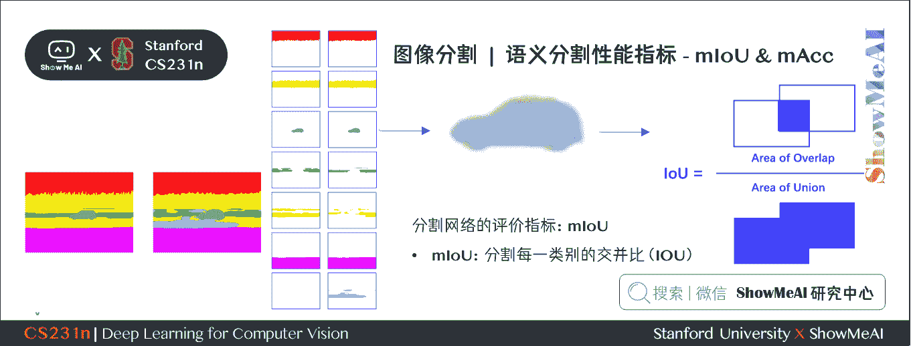

## 3.2 mAcc

分割网络的评价指标：mAcc

*   mAcc：Pred 和 GT 对应位置的分类准确率

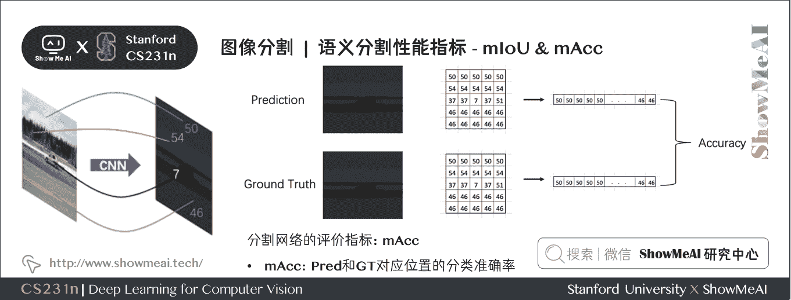

# 4.语义分割方法综述

早期的一些语义分割方法包括使用 TextonForest 和随机森林分类器等。卷积神经网络（CNN）的引入不仅仅极大加速图像识别的进程，也对语义分割领域的发展起到巨大的促进作用。

语义分割任务最初流行的深度学习方法是图像块分类（patch classification），即利用像素周围的图像块对每一个像素进行独立的分类。使用图像块分类的主要原因是分类网络中包含**全连接层**（fully connected layer），它需要固定尺寸的图像。

2014 年，加州大学伯克利分校的 Long 等人提出全卷积网络（FCN），这使得卷积神经网络无需全连接层即可进行密集的像素预测。使用这种方法可生成任意大小的图像分割图，且该方法比图像块分类法要高效许多。之后，语义分割领域几乎所有先进方法都采用了类似结构。

使用卷积神经网络进行语义分割存在的另一个大问题是**池化层**。池化层虽然扩大了感受野、聚合语境，但因此造成了位置信息的丢失。但是，语义分割要求类别图完全贴合，因此需要保留位置信息。

有两种不同结构来解决该问题。

*   第一个是编码器解码器结构。编码器逐渐减少池化层的空间维度，解码器逐步修复物体的细节和空间维度。编码器和解码器之间通常存在快捷连接，因此能帮助解码器更好地修复目标的细节。U-Net 是这种方法中最常用的结构。
*   第二种方法使用空洞/扩张卷积（dilated/atrous convolutions）结构，来去除池化层。

> 关于全连接层和池化层的详细知识也可以参考[ShowMeAI](http://www.showmeai.tech/)的文章
> 
> *   [**深度学习教程 | 吴恩达专项课程 · 全套笔记解读**](http://www.showmeai.tech/tutorials/35) 中的文章 [**卷积神经网络解读**](http://www.showmeai.tech/article-detail/221)
> *   [**深度学习与计算机视觉教程 | 斯坦福 CS231n 课程全套解读**](http://www.showmeai.tech/tutorials/37)中的文章 [**卷积神经网络**](http://www.showmeai.tech/article-detail/264)

## 4.1 encoder-decoder 结构

针对语义分割任务构建神经网络架构的最简单的方法是简单地堆叠多个卷积层（使用 same 填充以维持维度）并输出最终的分割图。

这种结构通过特征映射的连续变换，直接去学习从输入图像到其对应分割的映射，缺点是在整个网络中保持全分辨率的计算成本非常高。

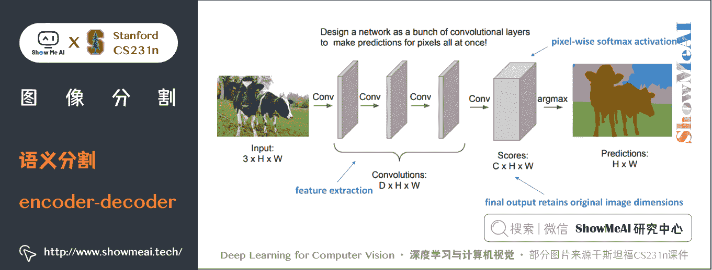

对于深度卷积网络，浅层主要学习低级的信息，随着网络越深，学习到更高级的特征映射。为了保持表达能力，我们通常需要增加特征图 feature map 的数量（通道数），从而可以得到更深的网络。

在图像分类任务中，我们只关注图像是什么（而不是位置在哪），因此 CNN 的结构中会对特征图降采样（downsampling）或者应用带步长的卷积（例如，压缩空间分辨率）。但对于图像分割任务而言，我们希望模型产生全分辨率语义预测。

图像分割领域现在较为流行的是**编码器解码器结构**，其中我们对输入的空间分辨率进行下采样，生成分辨率较低的特征映射，它能高效地进行分类，而后使用上采样将特征还原为全分辨率分割图。

## 4.2 上采样方法

我们有许多方法可以对特征图进行上采样。

「池化」操作通过对将小区域的值取成单一值（例如平均或最大池化）进行下采样，对应的「上池化」操作就是将单一值分配到更高的分辨率进行上采样。

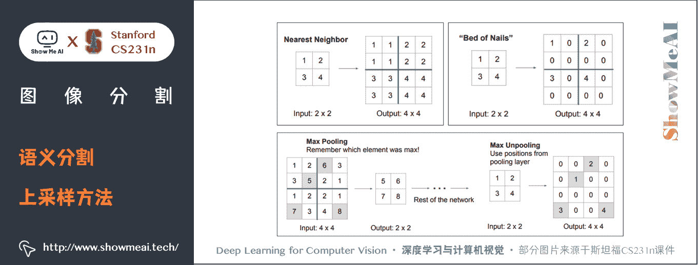

转置卷积（Transpose Convolution，有时也翻译为「反卷积」）是迄今为止最流行的上采样方法，这种结构允许我们在上采样的过程中进行参数学习。

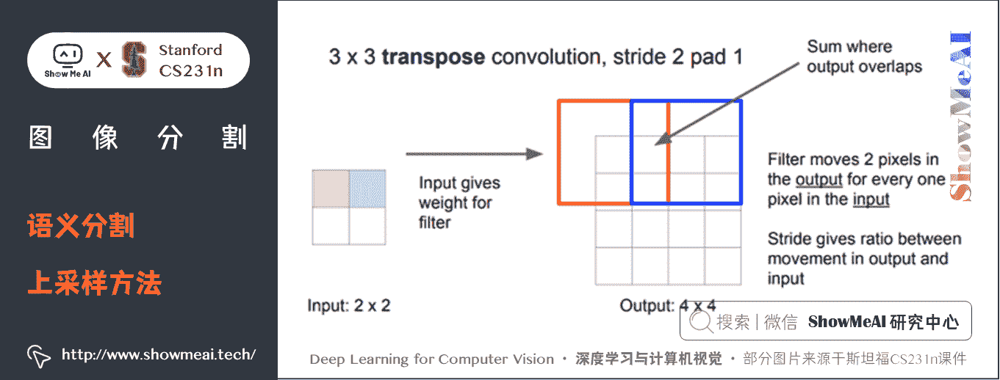

典型的「卷积」运算将采用滤波器视图中当前值的点积并为相应的输出位置产生单个值，而「转置卷积」基本是相反的过程：我们从低分辨率特征图中获取单个值，并将滤波器中的所有权重乘以该值，将这些加权值投影到输出要素图中。

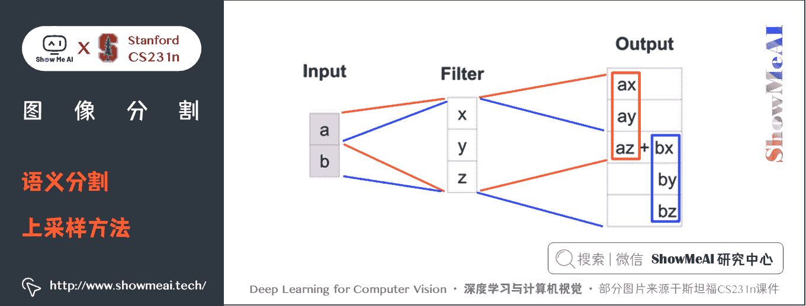

某些大小的滤波器会在输出特征映射中产生重叠（例如，具有步幅 2 2 2 的 3 × 3 3 \times 3 3×3 滤波器 - 如下面的示例所示），如果只是简单将重叠值加起来，往往会在输出中产生棋盘格子状的伪影（artifact）。

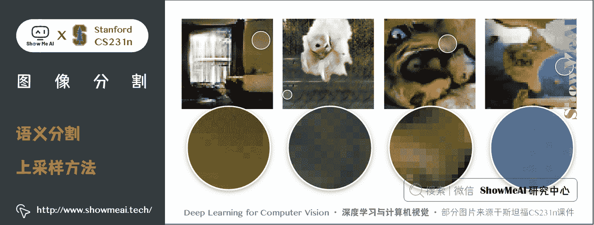

这并不是我们需要的，因此最好确保您的滤波器大小不会产生重叠。

下面我们对主流的模型进行介绍，包括 FCN、SegNet、U-Net、PSPNet、DeepLab V1~V3 等。

# 5.典型语义分割算法

## 5.1 FCN 全卷积网络

全卷积网络 FCN 在会议 CVPR 2015 的论文 [Fully Convolutional Networks for Semantic Segmentation](https://arxiv.org/pdf/1411.4038) 中提出。

它将 CNN 分类网络（AlexNet, VGG 和 GoogLeNet）修改为全卷积网络，通过对分割任务进行微调，将它们学习的表征转移到网络中。然后，定义了一种新的架构，它将深的、粗糙的网络层的语义信息和浅的、精细的网络层的表层信息结合起来，来生成精确和详细的分割。

> 关于 CNN 的详细结构，以及卷积层和全连接层的变换等基础知识可以阅读[ShowMeAI](http://www.showmeai.tech/)文章
> 
> *   [**深度学习教程 | 吴恩达专项课程 · 全套笔记解读**](http://www.showmeai.tech/tutorials/35)中的文章 [**卷积神经网络解读**](http://www.showmeai.tech/article-detail/221)。
> *   [**深度学习与计算机视觉教程：斯坦福 CS231n · 全套笔记解读**](http://www.showmeai.tech/tutorials/37)中的文章 [**卷积神经网络**](http://www.showmeai.tech/article-detail/264)

全卷积网络在 PASCAL VOC（2012 年的数据，相对之前的方法提升了 20 % 20\% 20% ，达到 62.2 % 62.2\% 62.2% 的平均 IoU），NYUDv2 和 SIFT Flow 上实现了最优的分割结果，对于一个典型的图像，推断只需要 1 / 3 1/3 1/3 秒的时间。

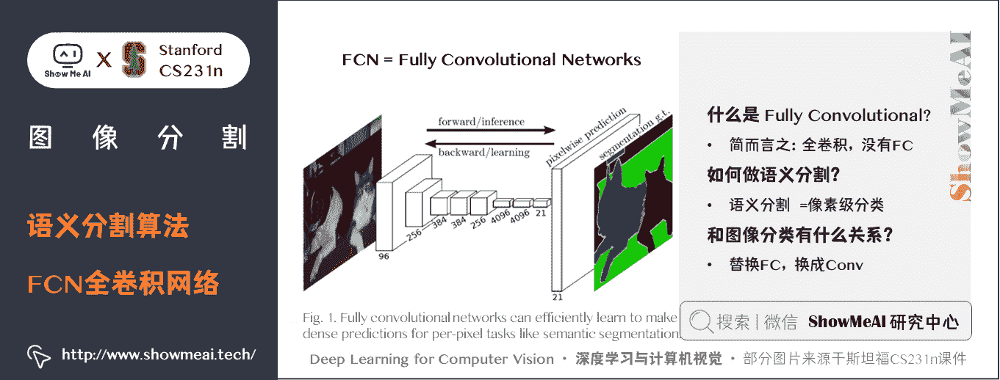

FCN 的网络结构如下所示，典型的编码器解码器结构：

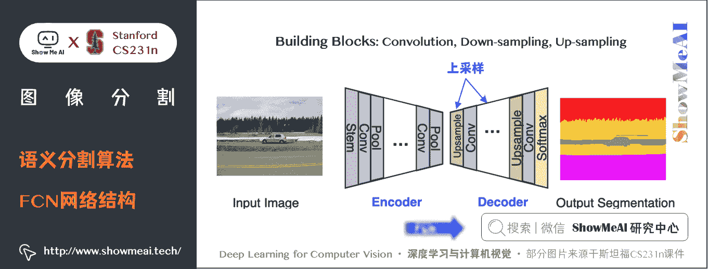

我们来看看 FCN 的中间层的一些数字，如下：

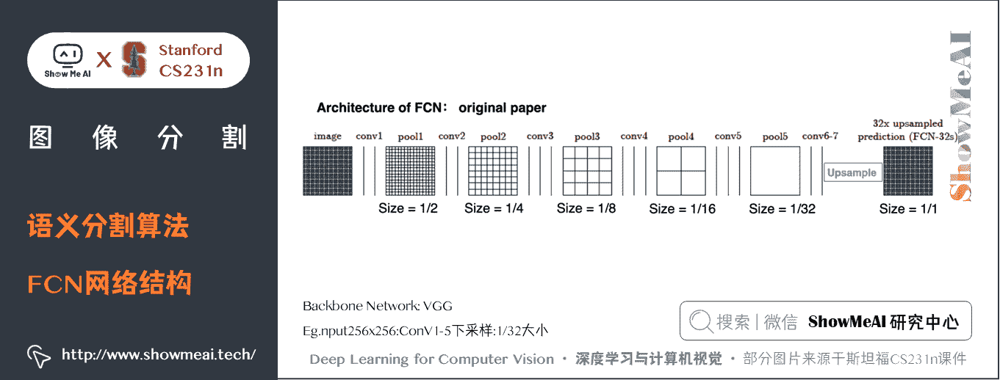

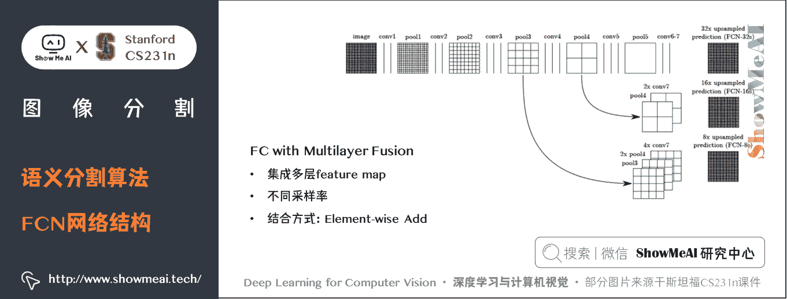

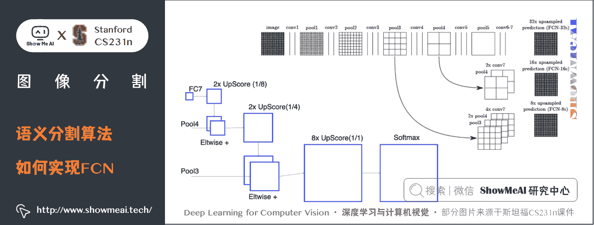

**关键特点**：

*   FCN 的特征由编码器中的不同阶段合并而成的，它们在**语义信息的粗糙程度**上有所不同。- 低分辨率语义特征图的上采样使用**经双线性插值滤波器初始化的「反卷积」操作完成**。- 从 VGG16、Alexnet 等分类器网络进行知识迁移来实现语义细分。

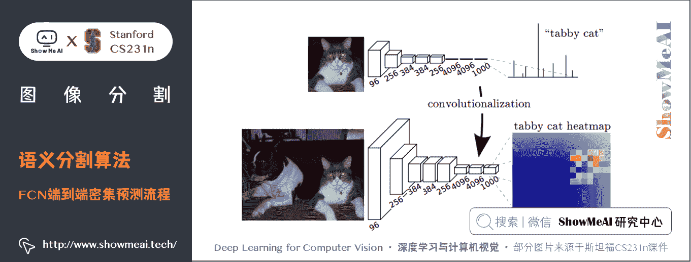

如上图所示，预训练模型 `VGG16` 的全连接层（`fc6`，`fc7`）被转换为全卷积层，通过它生成了低分辨率的类的热图，然后使用经双线性插值初始化的反卷积，并在上采样的每一个阶段通过融合（简单地相加） VGG16 中的低层（`conv4`和`conv3`）的更加粗糙但是分辨率更高的特征图进一步细化特征。

在传统的分类 CNNs 中，池化操作用来增加视野，同时减少特征图的分辨率。对分类任务来说非常有效，分类模型关注图像总体类别，而对其空间位置并不关心。所以才会有频繁的卷积层之后接池化层的结构，保证能提取更多抽象、突出类的特征。

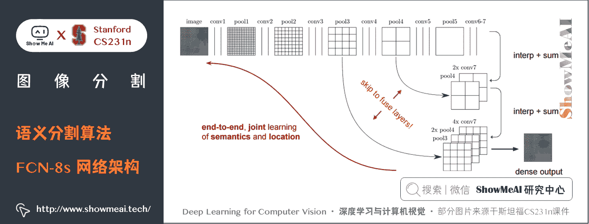

另一方面，池化和带步长的卷积对语义分割是不利的，这些操作会带来空间信息的丢失。不同的语义分割模型在**解码器**中使用了不同机制，但目的都在于恢复在**编码器**中降低分辨率时丢失的信息。如上图所示，FCN-8s 融合了不同粗糙度（`conv3`、`conv4`和`fc7`）的特征，利用编码器不同阶段不同分辨率的空间信息来细化分割结果。

下图为训练 FCNs 时卷积层的梯度：

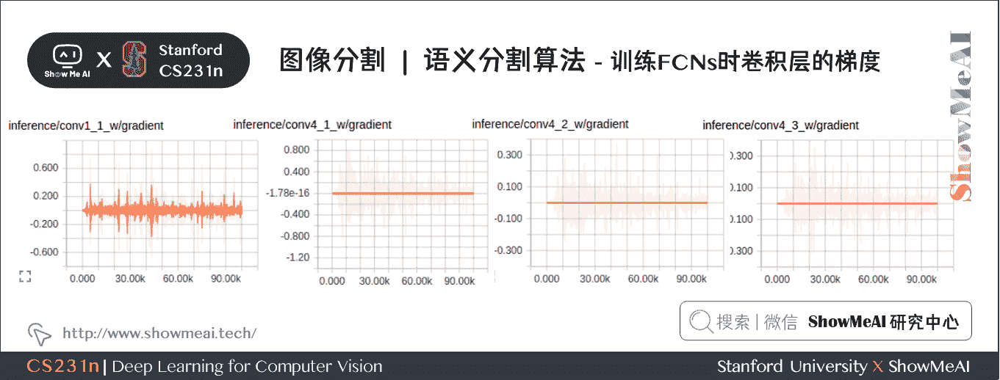

第 1 个卷积层捕捉低层次的几何信息，我们注意到梯度调整了第一层的权重，以便其能适应数据集。

VGG 中更深层的卷积层有非常小的梯度流，因为这里捕获的高层次的语义概念足够用于分割。

语义分割架构的另一个重要点是，对特征图使用「反卷积」（如上动图所示），将低分辨率分割图上采样至输入图像分辨率，或者花费大量计算成本，使用空洞卷积在编码器上部分避免分辨率下降。即使在现代 GPUs 上，空洞卷积的计算成本也很高。

最后，我们来看看 FCN 的优缺点：

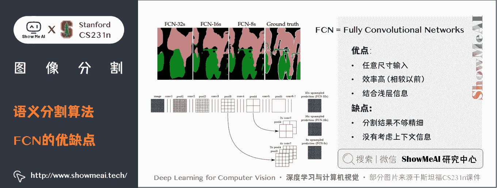

## 5.2 SegNet

SegNet 在 2015 的论文 [SegNet: A Deep Convolutional Encoder-Decoder Architecture for Image Segmentation](https://arxiv.org/pdf/1505.07293) 中提出。

SegNet 的新颖之处在于解码器对其较低分辨率的输入特征图进行上采样的方式。

*   解码器使用了在相应编码器的最大池化步骤中计算的池化索引来执行非线性上采样。

这种方法消除了学习上采样的需要。经上采样后的特征图是稀疏的，因此随后使用可训练的卷积核进行卷积操作，生成密集的特征图。

SegNet 与 FCN 等语义分割网络比较，结果揭示了在实现良好的分割性能时所涉及的内存与精度之间的权衡。

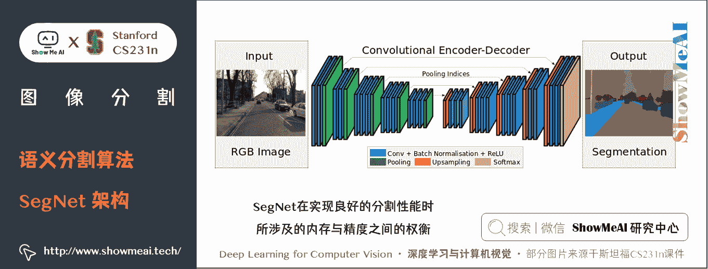

**关键特点**：

*   SegNet 在解码器中使用「**反池化**」对特征图进行上采样，并在分割中保持高频细节的完整性。- 编码器舍弃掉了全连接层（和 FCN 一样进行卷积），因此是拥有较少参数的轻量级网络。

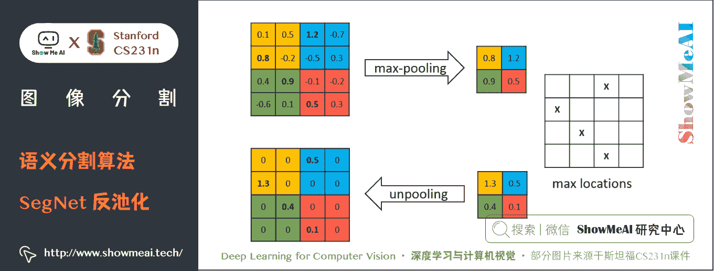

如上图所示，编码器中的每一个最大池化层的索引都被存储起来，用于之后在解码器中使用那些存储的索引来对相应的特征图进行反池化操作。虽然这有助于保持高频信息的完整性，但当对低分辨率的特征图进行反池化时，它也会忽略邻近的信息。

## 5.3 U-Net

SegNet 在 2015 的论文 [U-Net: Convolutional Networks for Biomedical Image Segmentation](https://arxiv.org/pdf/1505.04597) 中提出。

U-Net 架构包括一个「捕获上下文信息的收缩路径」和一个「支持精确本地化的对称扩展路径」。这样一个网络可以使用非常少的图像进行端到端的训练，它在 ISBI 神经元结构分割挑战赛中取得了比之前方法都更好的结果。

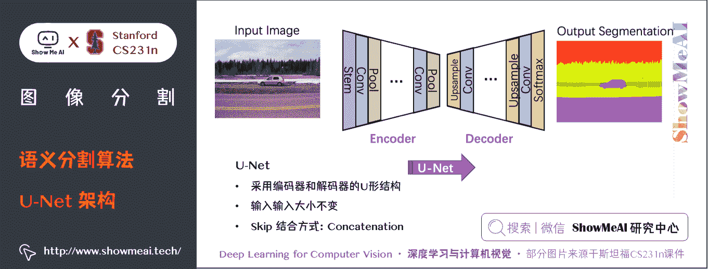

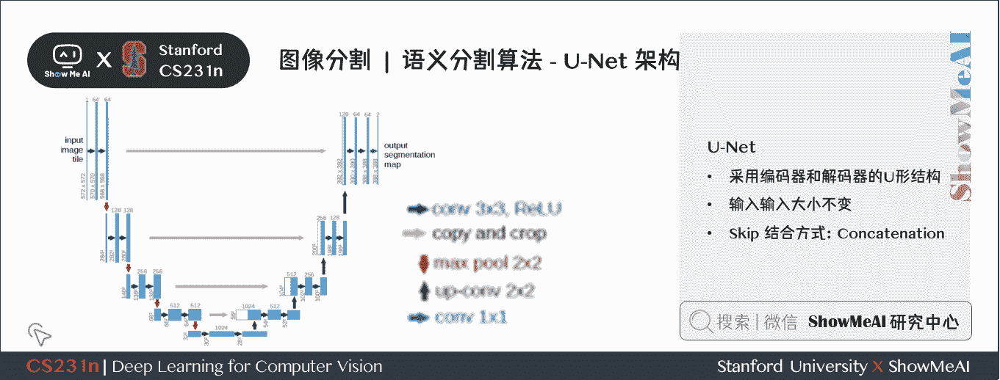

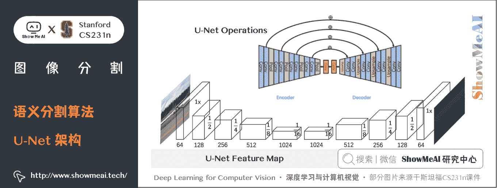

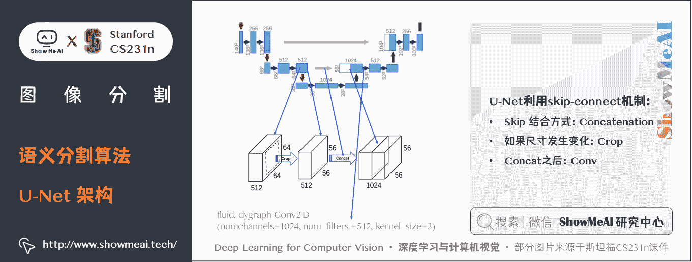

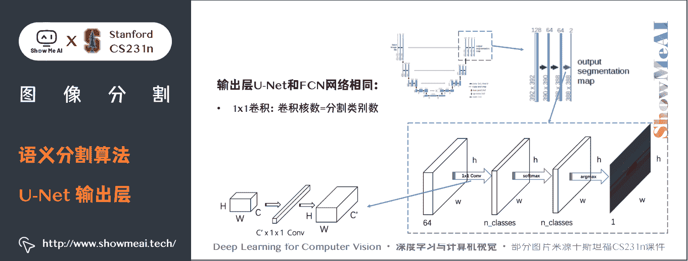

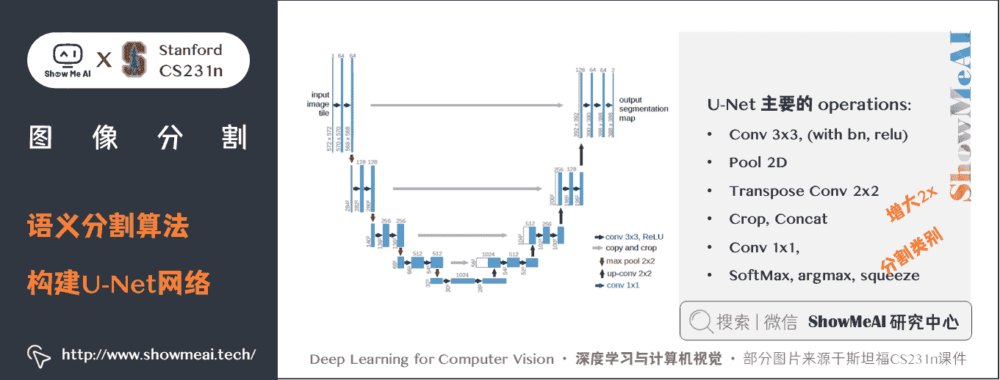

**关键特点**：

*   U-Net 简单地将**编码器**的特征图拼接至每个阶段**解码器**的上采样特征图，从而形成一个梯形结构。该网络非常类似于 **Ladder Network** 类型的架构。- 通过跳跃 `拼接` 连接的架构，在每个阶段都允许解码器学习在编码器池化中丢失的相关特征。- 上采样采用转置卷积。

U-Net 在 EM 数据集上取得了最优异的结果，该数据集只有 30 个密集标注的医学图像和其他医学图像数据集，U-Net 后来扩展到 3D 版的 **3D-U-Net**。虽然 U-Net 最初的发表在于其在生物医学领域的分割、网络的实用性以及从非常少的数据中学习的能力，但现在已经成功应用其他几个领域，例如 **卫星图像分割**等。

## 5.4 DeepLab V1

DeepLab V1 在 2015 的论文 [Semantic Image Segmentation with deep convolutional nets and fully connected CRFs](https://arxiv.org/pdf/1412.7062) 中提出。

DeepLab V1 结合 DCNN 和概率图模型来解决语义分割问题。DCNN 最后一层的响应不足以精确定位目标边界，这是 DCNN 的不变性导致的。DeepLab V1 的解决方法是：在最后一层网络后结合全连接条件随机场。DeepLab V1 在 PASCAL VOC 2012 上达到了 71.6% 的 mIoU。

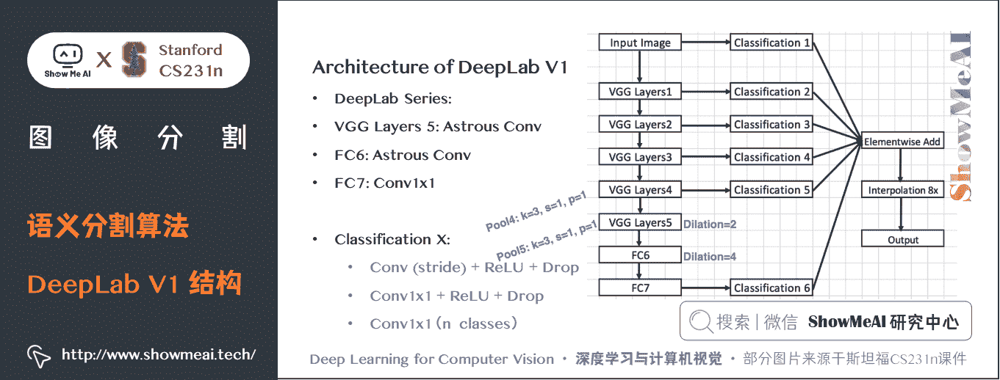

**关键特点**：

*   提出 **空洞卷积（atrous convolution）（又称扩张卷积（dilated convolution））** 。- 在最后两个最大池化操作中不降低特征图的分辨率，并在倒数第二个最大池化之后的卷积中使用空洞卷积。- 使用 **CRF（条件随机场）** 作为后处理，恢复边界细节，达到准确定位效果。- 附加输入图像和前四个最大池化层的每个输出到一个两层卷积，然后拼接到主网络的最后一层，达到 **多尺度预测** 效果。

## 5.5 DeepLab V2

DeepLab V2 在 2017 的论文 [DeepLab: Semantic Image Segmentation with Deep Convolutional Nets, Atrous Convolution, and Fully Connected CRFs](https://arxiv.org/pdf/1606.00915) 中提出。

DeepLab V2 提出了一种空洞空间金字塔池化（ASPP）的多尺度鲁棒分割方法。

ASPP 使用多个采样率的过滤器和有效的视野探测传入的卷积特征层，从而在多个尺度上捕获目标和图像上下文。再结合 DCNNs 方法和概率图形模型，改进了目标边界的定位。

DCNNs 中常用的最大池化和下采样的组合实现了不变性，但对定位精度有一定的影响。DeepLab V2 通过将 DCNN 最后一层的响应与一个全连接条件随机场(CRF)相结合来克服这个问题。DeepLab V2 在 PASCAL VOC 2012 上得到了 79.7 % 79.7\% 79.7% 的 mIoU。

DeepLab V2 的主干网络是 ResNet，整体网络如下图所示，核心的一些结构包括 空洞卷积组建的 ASPP 模块、空洞空间金字塔池化。

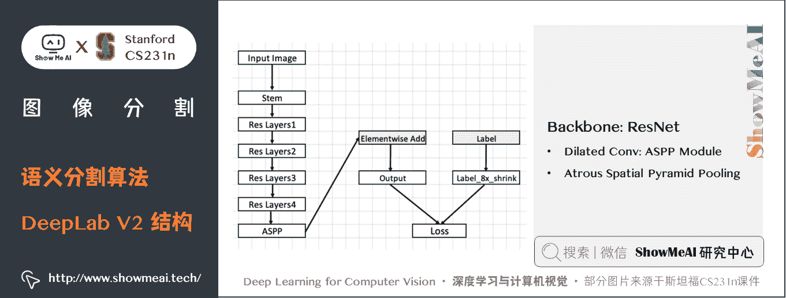

上图中的 ASPP 模块具体展开如下方 2 个图所示：

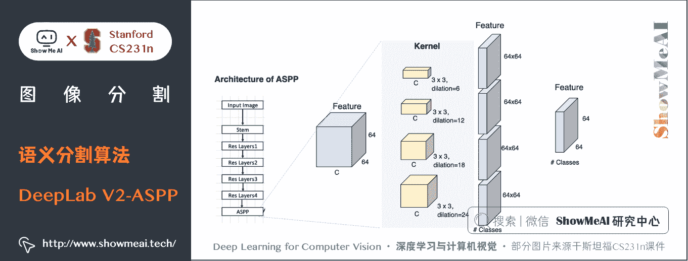

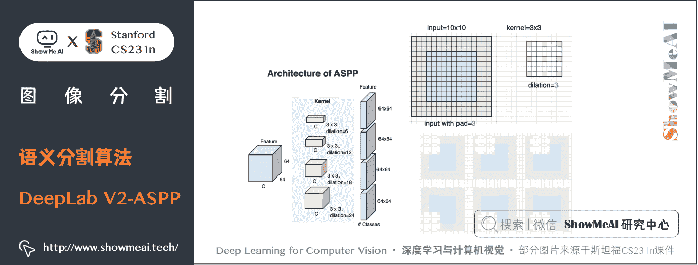

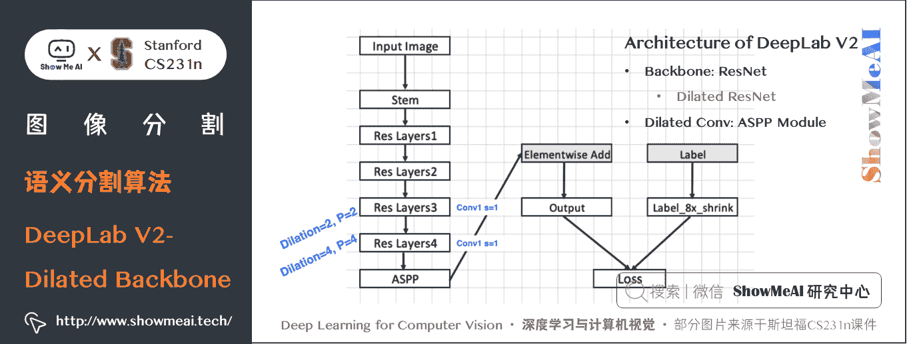

具体的，DeepLab V2 论文中提出了语义分割中的三个挑战：

*   ① 由于池化和卷积而减少的特征分辨率。
*   ② 多尺度目标的存在。
*   ③ 由于 DCNN 不变性而减少的定位准确率。

**第①个挑战解决方法**：减少特征图下采样的次数，但是会增加计算量。

**第②个挑战解决方法**：使用图像金字塔、空间金字塔等多尺度方法获取多尺度上下文信息。

**第③个挑战解决方法**：使用跳跃连接或者引入条件随机场。

DeepLab V2 使用 VGG 和 ResNet 作为主干网络分别进行了实验。

> Deep LAB-ASPP employs multiple filters with different rates to capture objects and context at multiple scales.

**关键特点**：

*   提出了**空洞空间金字塔池化（Atrous Spatial Pyramid Pooling）** ，在不同的分支采用不同的空洞率以获得多尺度图像表征。

## 5.6 DeepLab V3

DeepLab V3 在论文 [Rethinking Atrous Convolution for Semantic Image Segmentation](https://arxiv.org/pdf/1706.05587) 中提出。

DeepLab V3 依旧使用了 ResNet 作为主干网络，也依旧应用空洞卷积结构。

为了解决多尺度目标的分割问题，DeepLab V3 串行/并行设计了能够捕捉多尺度上下文的模块，模块中采用不同的空洞率。

此外，DeepLab V3 增强了先前提出的空洞空间金字塔池化模块，增加了图像级特征来编码全局上下文，使得模块可以在多尺度下探测卷积特征。

DeepLab V3 模型在没有 CRF 作为后处理的情况下显著提升了性能。

DeepLab V1-V3 的结构对比如下所示：

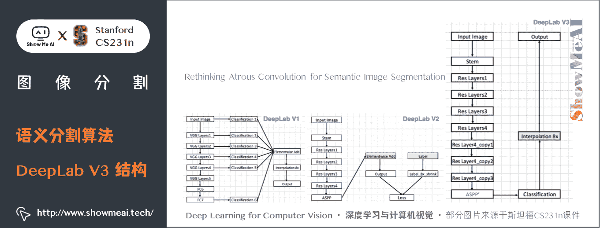

DeepLab V3 对 ASPP 模块进行了升级，升级后的结构细节如下图所示：

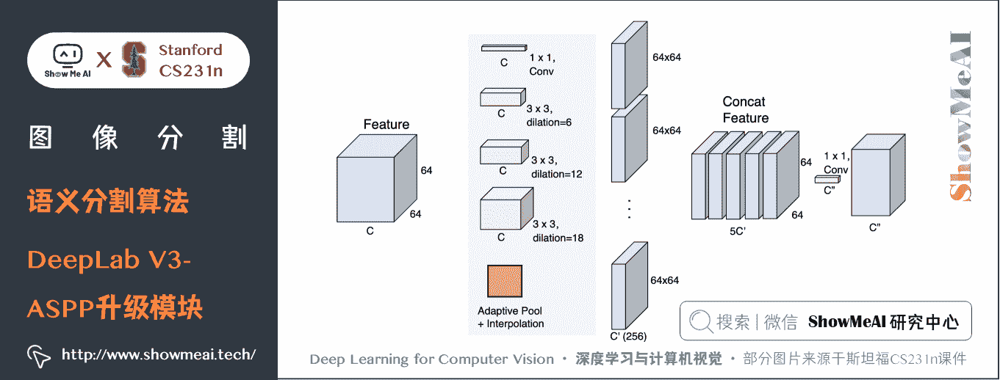

DeepLab V3 的具体结构细节如下，包含多个残差块结构。

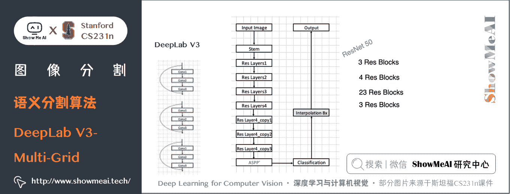

DeepLab V3 中引入了 Multi-grid，可以输入大分辨率图片：

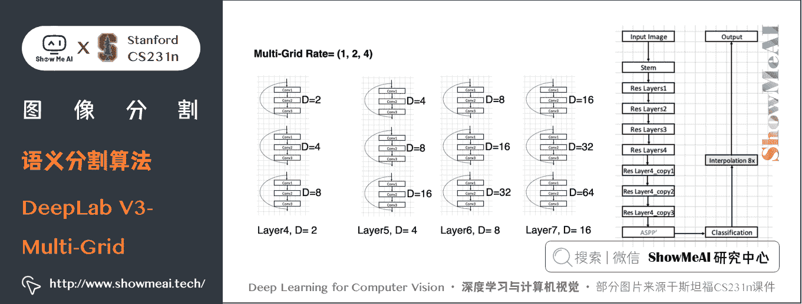

DeepLab V3 包含 2 种实现结构：分别为 cascaded model 级联型 和 ASPP model 金字塔池化型。

两种模型分别如下的 2 幅图所示。

*   cascaded model 中 Block1,2,3,4 是 ResNet 网络的层结构（V3 主干网络采用 ResNet50 或 101），但 Block4 中将 3 × 3 3 \times 3 3×3 卷积和捷径分支 1 × 1 1 \times 1 1×1 卷积步长 Stride 由 2 2 2 改为 1 1 1，不进行下采样，且将 3 × 3 3 \times 3 3×3 卷积换成膨胀卷积，后面的 Block5,6,7 是对 Blockd 的 copy。（图中 rate 不是真正的膨胀系数，真正的膨胀系数 = r a t e ∗ M u l t i − g r i d =rate \ast Multi-grid =rate∗Multi−grid 参数）

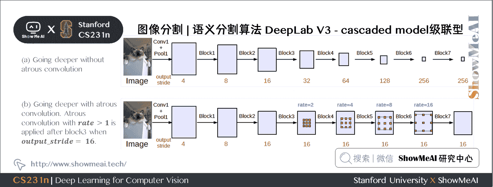

*   ASPP 模型的升级在前面介绍里提到了。

> 论文中使用较多的结构还是还是 ASPP 模型，两者模型在效果上差距不大。

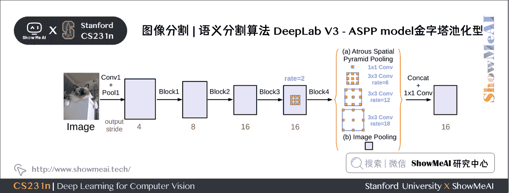

**关键特点**：

*   在残差块中使用多网格方法（MultiGrid），从而引入不同的空洞率。- 在空洞空间金字塔池化模块中加入图像级（Image-level）特征，并且使用 BatchNormalization 技巧。

## 5.7 Mask R-CNN

Mask R-CNN 在论文 [Mask R-CNN](https://arxiv.org/pdf/1703.06870) 中被提出。

Mask R-CNN 以 Faster R-CNN 为基础，在现有的边界框识别分支基础上添加一个并行的预测目标掩码的分支。

Mask R-CNN 很容易训练，仅仅在 Faster R-CNN 上增加了一点小开销，运行速度为 5fps。

此外，Mask R-CNN 很容易泛化至其他任务，例如，可以使用相同的框架进行姿态估计。

Mask R-CNN 在 COCO 所有的挑战赛中都获得了最优结果，包括实例分割，边界框目标检测，和人关键点检测。在没有使用任何技巧的情况下，Mask R-CNN 在每项任务上都优于所有现有的单模型网络，包括 COCO 2016 挑战赛的获胜者。

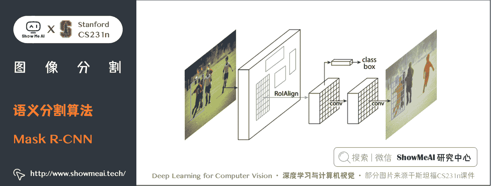

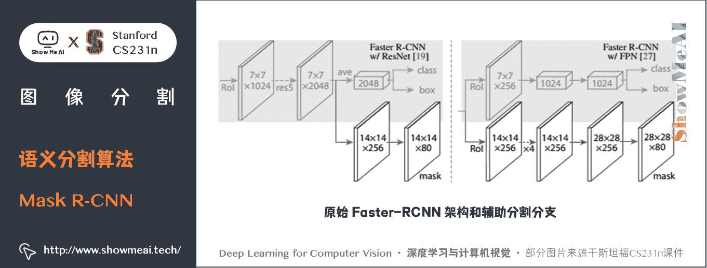

Mask R-CNN 是在流行的 Faster R-CNN 架构基础上进行必要的修改，以执行语义分割。

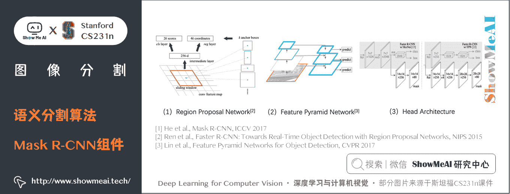

**关键特点**：

在 Faster R-CNN 上添加辅助分支以执行语义分割- 对每个实例进行的 **RoIPool** 操作已经被修改为 **RoIAlign** ，它避免了特征提取的空间量化，因为在最高分辨率中保持空间特征不变对于语义分割很重要。- Mask R-CNN 与 **Feature Pyramid Networks**（类似于 PSPNet，它对特征使用了金字塔池化）相结合，在 **MS COCO** 数据集上取得了最优结果。

## 5.8 PSPNet

PSPNet 在论文 [PSPNet: Pyramid Scene Parsing Network](https://arxiv.org/pdf/1612.01105) 中提出。

PSPNet 利用基于不同区域的上下文信息集合，通过我们的金字塔池化模块，使用提出的金字塔场景解析网络（PSPNet）来发挥全局上下文信息的能力。

全局先验表征在场景解析任务中产生了良好的质量结果，而 PSPNet 为像素级的预测提供了一个更好的框架，该方法在不同的数据集上达到了最优性能。它首次在 2016 ImageNet 场景解析挑战赛，PASCAL VOC 2012 基准和 Cityscapes 基准中出现。

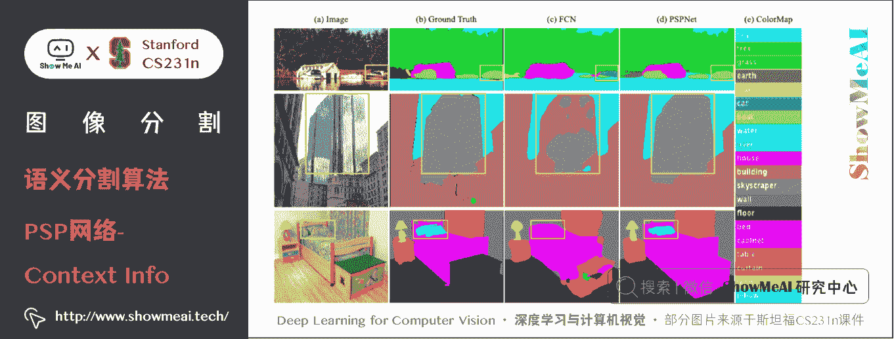

如上图所示，PSP 网络解决的主要问题是「缺少上下文信息」带来的不准确，其利用全局信息获取上下文，具体如下

**之前的问题**： **缺少上下文信息**

如上图所示

*   图中的 boat 区域和类别"car”的 appearance 相似
*   模型只有 local 信息，Boat 容易被识别为"car"
*   Confusion categories: Building and skyscraper

**应用上下文信息方法**

*   利用全局信息 (global information)
*   全局信息 in CNN ~= feature/pyramid

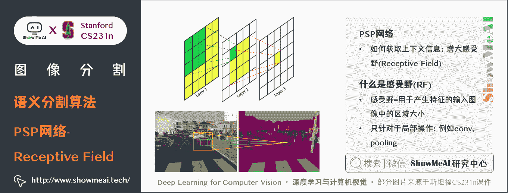

PSP 网络的一些细节如下几幅图中介绍：

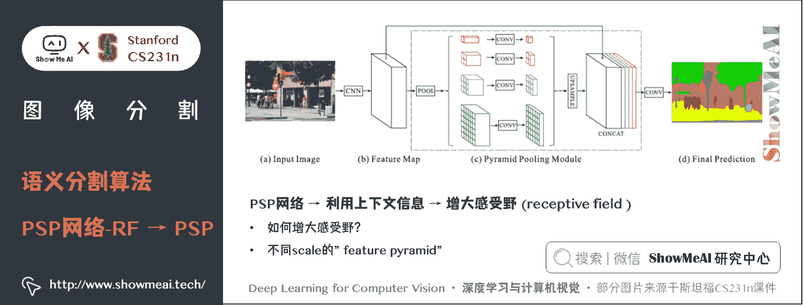

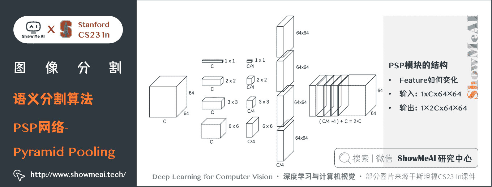

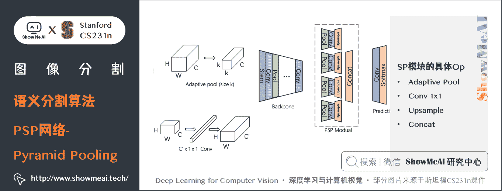

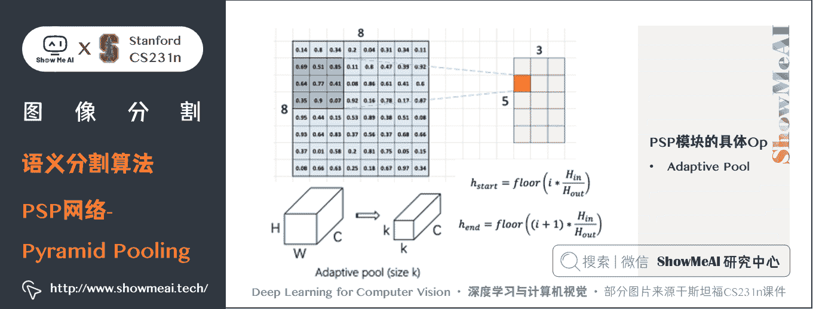

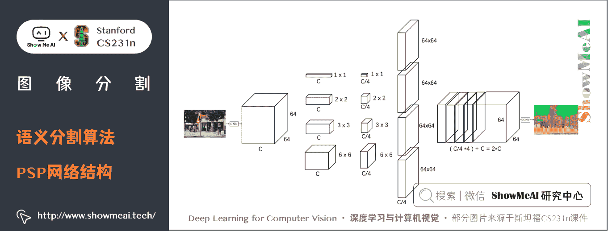

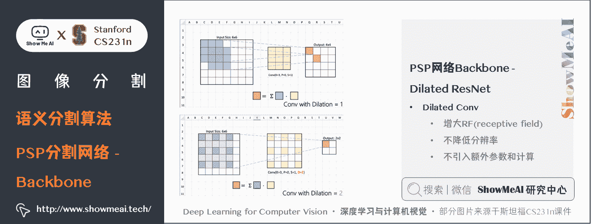

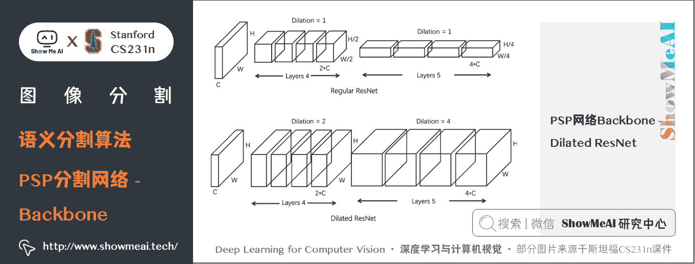

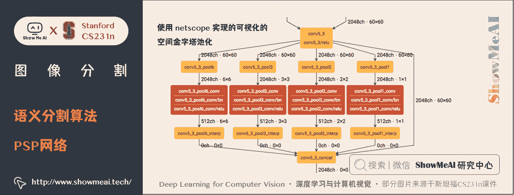

**关键特点**：

*   PSPNet 通过**引入空洞卷积来修改基础的 ResNet 架构**，特征经过最初的池化，在整个编码器网络中以相同的分辨率进行处理（原始图像输入的 `1/4`），直到它到达空间池化模块。- 在 ResNet 的中间层中引入**辅助损失**，以优化整体学习。- 在修改后的 ResNet 编码器顶部的**空间金字塔池化**聚合全局上下文。

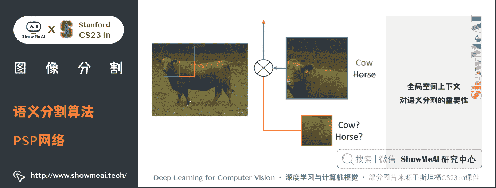

图片展示了全局空间上下文对语义分割的重要性。它显示了层之间感受野和大小的关系。在这个例子中，更大、更加可判别的感受野（**蓝**）相比于前一层（**橙**）可能在细化表征中更加重要，这有助于解决歧义

## 5.9 RefineNet

RefineNet 在论文 [RefineNet: Multi-Path Refinement Networks for High-Resolution Semantic Segmentation](https://arxiv.org/pdf/1611.06612) 中提出。

RefineNet 是一个通用的多路径优化网络，它明确利用了整个下采样过程中可用的所有信息，使用远程残差连接实现高分辨率的预测。通过这种方式，可以使用早期卷积中的细粒度特征来直接细化捕捉高级语义特征的更深的网络层。RefineNet 的各个组件使用遵循恒等映射思想的残差连接，这允许网络进行有效的端到端训练。

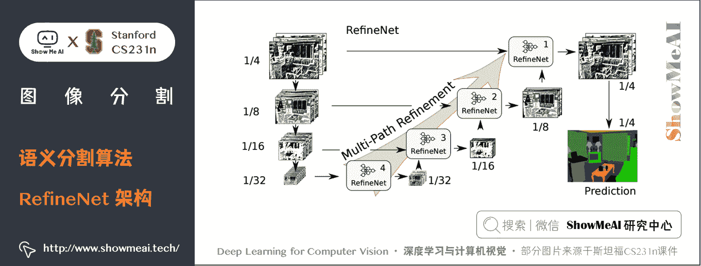

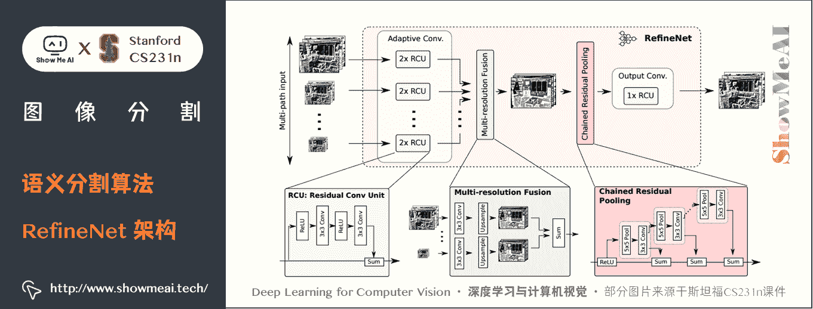

如上图所示，是建立 RefineNet 的块 - 残差卷积单元，多分辨率融合和链式残差池化。

RefineNet 解决了传统卷积网络中空间分辨率减少的问题，与 PSPNet（使用计算成本高的空洞卷积）使用的方法非常不同。提出的架构迭代地池化特征，利用特殊的 RefineNet 模块增加不同的分辨率，并最终生成高分辨率的分割图。

**关键特点**：

*   使用**多分辨率**作为输入，将提取的特征融合在一起，并将其传递到下一个阶段。
*   引入**链式残差池化**，可以从一个大的图像区域获取背景信息。它通过多窗口尺寸有效地池化特性，利用残差连接和学习权重方式融合这些特征。
*   所有的特征融合都是使用`sum`（ResNet 方式）来进行端到端训练。
*   使用普通 ResNet 的残差层，**没有计算成本高的空洞卷积**。

# 6.拓展学习

**可以点击 [B 站](https://www.bilibili.com/video/BV1g64y1B7m7?p=11) 查看视频的【双语字幕】版本**

[`player.bilibili.com/player.html?aid=759478950&page=11`](https://player.bilibili.com/player.html?aid=759478950&page=11)

【字幕+资料下载】斯坦福 CS231n | 面向视觉识别的卷积神经网络 (2017·全 16 讲)

*   [【课程学习指南】斯坦福 CS231n | 深度学习与计算机视觉](http://blog.showmeai.tech/cs231n/)
*   【字幕+资料下载】斯坦福 CS231n | 深度学习与计算机视觉 (2017·全 16 讲)
*   [【CS231n 进阶课】密歇根 EECS498 | 深度学习与计算机视觉](http://blog.showmeai.tech/eecs498/)
*   [【深度学习教程】吴恩达专项课程 · 全套笔记解读](http://www.showmeai.tech/tutorials/35)
*   [【Stanford 官网】CS231n: Deep Learning for Computer Vision](http://cs231n.stanford.edu/)

# 7.参考资料

*   [An overview of semantic image segmentation](https://www.jeremyjordan.me/semantic-segmentation/)
*   [A 2017 Guide to Semantic Segmentation with Deep Learning](http://blog.qure.ai/notes/semantic-segmentation-deep-learning-review)
*   [Semantic Segmentation using Fully Convolutional Networks over the years](https://meetshah1995.github.io/semantic-segmentation/deep-learning/pytorch/visdom/2017/06/01/semantic-segmentation-over-the-years.html)

# [ShowMeAI](http://www.showmeai.tech) 斯坦福 CS231n 全套解读

*   [深度学习与计算机视觉教程(1) | CV 引言与基础 @CS231n](http://www.showmeai.tech/article-detail/260)
*   [深度学习与计算机视觉教程(2) | 图像分类与机器学习基础 @CS231n](http://www.showmeai.tech/article-detail/261)
*   [深度学习与计算机视觉教程(3) | 损失函数与最优化 @CS231n](http://www.showmeai.tech/article-detail/262)
*   [深度学习与计算机视觉教程(4) | 神经网络与反向传播 @CS231n](http://www.showmeai.tech/article-detail/263)
*   [深度学习与计算机视觉教程(5) | 卷积神经网络 @CS231n](http://www.showmeai.tech/article-detail/264)
*   [深度学习与计算机视觉教程(6) | 神经网络训练技巧 (上) @CS231n](http://www.showmeai.tech/article-detail/265)
*   [深度学习与计算机视觉教程(7) | 神经网络训练技巧 (下) @CS231n](http://www.showmeai.tech/article-detail/266)
*   [深度学习与计算机视觉教程(8) | 常见深度学习框架介绍 @CS231n](http://www.showmeai.tech/article-detail/267)
*   [深度学习与计算机视觉教程(9) | 典型 CNN 架构 (Alexnet, VGG, Googlenet, Restnet 等) @CS231n](http://www.showmeai.tech/article-detail/268)
*   [深度学习与计算机视觉教程(10) | 轻量化 CNN 架构 (SqueezeNet, ShuffleNet, MobileNet 等) @CS231n](http://www.showmeai.tech/article-detail/269)
*   [深度学习与计算机视觉教程(11) | 循环神经网络及视觉应用 @CS231n](http://www.showmeai.tech/article-detail/270)
*   [深度学习与计算机视觉教程(12) | 目标检测 (两阶段, R-CNN 系列) @CS231n](http://www.showmeai.tech/article-detail/271)
*   [深度学习与计算机视觉教程(13) | 目标检测 (SSD, YOLO 系列) @CS231n](http://www.showmeai.tech/article-detail/272)
*   [深度学习与计算机视觉教程(14) | 图像分割 (FCN, SegNet, U-Net, PSPNet, DeepLab, RefineNet) @CS231n](http://www.showmeai.tech/article-detail/273)
*   [深度学习与计算机视觉教程(15) | 视觉模型可视化与可解释性 @CS231n](http://www.showmeai.tech/article-detail/274)
*   [深度学习与计算机视觉教程(16) | 生成模型 (PixelRNN, PixelCNN, VAE, GAN) @CS231n](http://www.showmeai.tech/article-detail/275)
*   [深度学习与计算机视觉教程(17) | 深度强化学习 (马尔可夫决策过程, Q-Learning, DQN) @CS231n](http://www.showmeai.tech/article-detail/276)
*   [深度学习与计算机视觉教程(18) | 深度强化学习 (梯度策略, Actor-Critic, DDPG, A3C) @CS231n](http://www.showmeai.tech/article-detail/277)

# [ShowMeAI](http://www.showmeai.tech) 系列教程推荐

*   [大厂技术实现：推荐与广告计算解决方案](http://www.showmeai.tech/tutorials/50)
*   [大厂技术实现：计算机视觉解决方案](http://www.showmeai.tech/tutorials/51)
*   [大厂技术实现：自然语言处理行业解决方案](http://www.showmeai.tech/tutorials/52)
*   [图解 Python 编程：从入门到精通系列教程](http://www.showmeai.tech/tutorials/56)
*   [图解数据分析：从入门到精通系列教程](http://www.showmeai.tech/tutorials/33)
*   [图解 AI 数学基础：从入门到精通系列教程](http://www.showmeai.tech/tutorials/83)
*   [图解大数据技术：从入门到精通系列教程](http://www.showmeai.tech/tutorials/84)
*   [图解机器学习算法：从入门到精通系列教程](http://www.showmeai.tech/tutorials/34)
*   [机器学习实战：手把手教你玩转机器学习系列](http://www.showmeai.tech/tutorials/41)
*   [深度学习教程：吴恩达专项课程 · 全套笔记解读](http://www.showmeai.tech/tutorials/35)
*   [自然语言处理教程：斯坦福 CS224n 课程 · 课程带学与全套笔记解读](http://www.showmeai.tech/tutorials/36)
*   [深度学习与计算机视觉教程：斯坦福 CS231n · 全套笔记解读](http://www.showmeai.tech/tutorials/37)

