# 深度学习与计算机视觉教程(15) | 视觉模型可视化与可解释性（CV 通关指南·完结）

> 原文：[`blog.csdn.net/ShowMeAI/article/details/125052967`](https://blog.csdn.net/ShowMeAI/article/details/125052967)

*   作者：[韩信子](https://github.com/HanXinzi-AI)@[ShowMeAI](http://www.showmeai.tech/)
*   [教程地址](http://www.showmeai.tech/tutorials/37)：[`www.showmeai.tech/tutorials/37`](http://www.showmeai.tech/tutorials/37)
*   [本文地址](http://www.showmeai.tech/article-detail/274)：[`www.showmeai.tech/article-detail/274`](http://www.showmeai.tech/article-detail/274)
*   声明：版权所有，转载请联系平台与作者并注明出处
*   **收藏[ShowMeAI](http://www.showmeai.tech/)查看更多精彩内容**

* * *

本系列为 **斯坦福 CS231n** 《深度学习与计算机视觉(Deep Learning for Computer Vision)》的全套学习笔记，对应的课程视频可以在 [**这里**](https://www.bilibili.com/video/BV1g64y1B7m7?p=12) 查看。更多资料获取方式见文末。

* * *

# 前言

深度可视化技术是深度学习中一个仍处于探索阶段的学术研究热点，它可以帮助我们更直观地理解模型做的事情。

以计算机视觉为例，CNN 中有着数以千计的卷积滤波器。深度神经网络中不同的滤波器会从输入图像中提取不同特征表示。

己有的研究表明低层的卷积核提取了图像的低级语义特性（如边缘、角点），高层的卷积滤波器提取了图像的高层语义特性（如图像类别）。

但是，由于深度神经网络会以逐层复合的方式从输入数据中提取特征，我们仍然无法像 Sobel 算子提取的图像边缘结果图一样直观地观察到深度神经网络中的卷积滤波器从输入图像中提取到的特征表示。

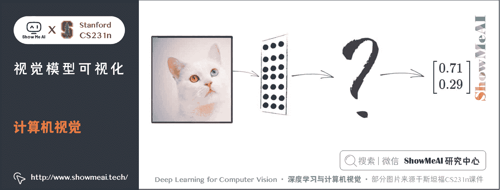

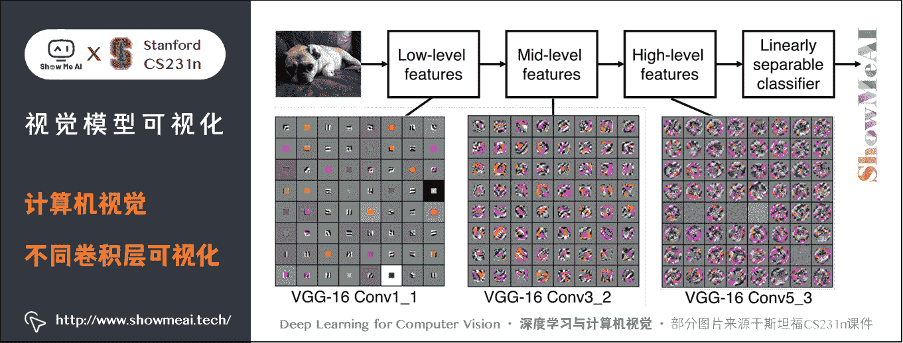

本篇内容[ShowMeAI](http://www.showmeai.tech/)和大家来看看对模型的理解，包括 CNN 可视化与理解的方法，也包含一些有趣的应用如 DeepDream、图像神经风格迁移等。

## 本篇重点

*   特征/滤波器可视化
*   DeepDream
*   图像神经风格迁移

# 1.特征可视化

我们在之前的课程里看到 CNN 的各种应用，在计算机视觉各项任务中发挥很大的作用，但我们一直把它当做黑盒应用，本节内容我们先来看看特征可视化，主要针对一些核心问题：

*   CNN 工作原理是什么样的
*   CNN 的中间层次都在寻找匹配哪些内容
*   我们对模型理解和可视化有哪些方法

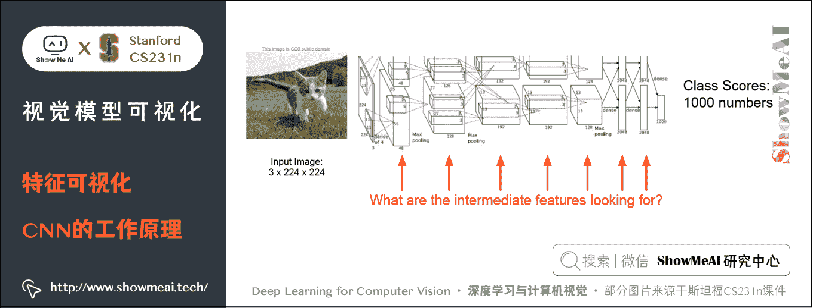

## 1.1 第一个卷积层

### 1) 可视化卷积核

第一个卷积层相对比较简单，可以把第一层的所有卷积核可视化来描述卷积层在原始图像匹配和关注什么。

可视化卷积核的背后原理是，卷积就是卷积核与图像区域做内积的结果，当图像上的区域和卷积核很相似时，卷积结果就会最大化。我们对卷积核可视化来观察卷积层在图像上匹配寻找什么。

常见的 CNN 架构第一层卷积核如下：

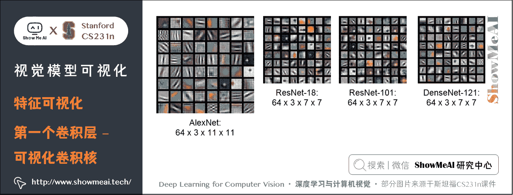

从图中可以看到，不同网络的第一层似乎都在匹配有向边和颜色，这和动物视觉系统开始部分组织的功能很接近。

## 1.2 中间层

第二个卷积层就相对复杂一些，不是很好观察了。

第一个卷积层使用 16 16 16 个 7 × 7 × 3 7 \times 7 \times 3 7×7×3 的卷积核，第二层使用 20 20 20 个 7 × 7 × 16 7 \times 7 \times 16 7×7×16 的卷积核。由于第二层的数据深度变成 16 16 16 维，不能直接可视化。一种处理方法是对每个卷积核画出 16 16 16 个 7 × 7 7 \times 7 7×7 的灰度图，一共画 20 20 20 组。

然而第二层卷积不和图片直接相连，卷积核可视化后并不能直接观察到有清晰物理含义的信息。

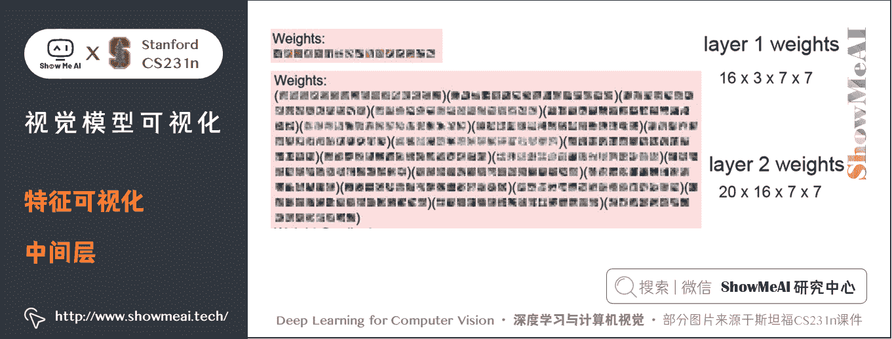

### 1) 可视化激活图

与可视化卷积核相比，将激活图可视化更有观察意义。

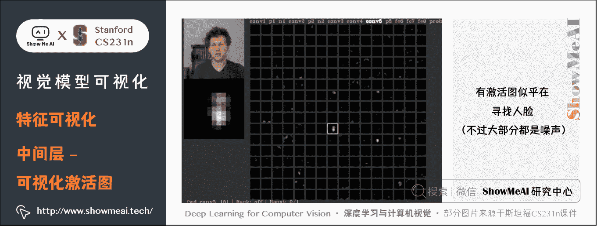

比如可视化 AlexNet 的第五个卷积层的 128 128 128 个 13 × 13 13 \times 13 13×13 的特征图，输入一张人脸照片，画出 Conv5 的 128 128 128 个特征灰度图，发现其中有激活图似乎在寻找人脸（不过大部分都是噪声）。

### 2) Maximally Activating Patches（最大激活区块）

可视化输入图片中什么类型的小块可以最大程度的激活不同的神经元。

*   比如选择 AlexNet 的 Conv5 里的第 17 17 17 个激活图（共 128 128 128 个），然后输入很多的图片通过网络，并且记录它们在 Conv5 第 17 17 17 个激活图的值。
*   这个特征图上部分值会被输入图片集最大激活，由于每个神经元的感受野有限，我们可以画出这些被最大激活的神经元对应在原始输入图片的小块，通过这些小块观察不同的神经元在寻找哪些信息。

如下图所示，每一行都是某个神经元被最大激活对应的图片块，可以看到：

*   有的神经元在寻找类似眼睛的东西
*   有的在寻找弯曲的曲线等

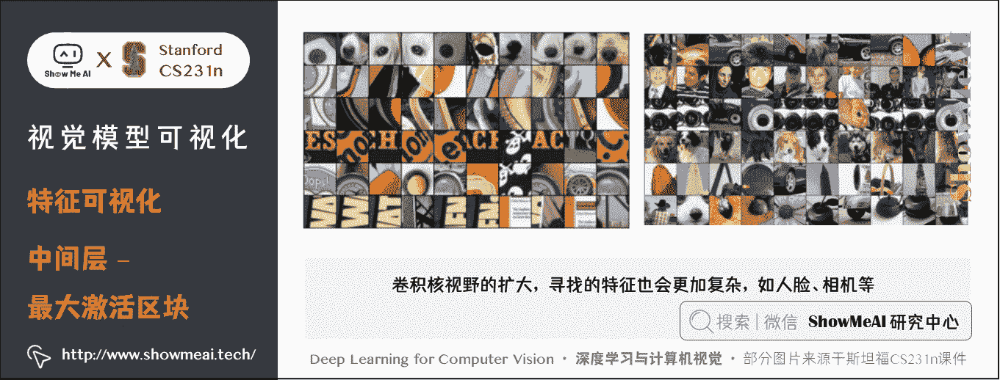

如果不使用 Conv5 的激活图，而是更后面的卷积层，由于卷积核视野的扩大，寻找的特征也会更加复杂，比如人脸、相机等，对应图中的下面部分。

## 1.3 倒数第二个全连接层

### 1) 最邻近

> 关于最近邻算法的详细知识也可以参考[ShowMeAI](http://www.showmeai.tech/)的下述文章

> *   [**图解机器学习教程**](http://www.showmeai.tech/tutorials/34) 中的文章详解 [**[KNN 算法及其应用](http://www.showmeai.tech/article-detail/187)**](http://www.showmeai.tech/article-detail/187)
> *   [**深度学习与计算机视觉教程：斯坦福 CS231n · 全套笔记解读**](http://www.showmeai.tech/tutorials/37)中的文章[图像分类与机器学习基础](http://www.showmeai.tech/article-detail/261)

另一个有价值的观察对象是输入到最后一层用于分类的全连接层的图片向量，比如 AlexNet 每张图片会得到一个 4096 4096 4096 维的向量。

使用一些图片来收集这些特征向量，然后在特征向量空间上使用最邻近的方法找出和测试图片最相似的图片。作为对比，是找出在原像素上最接近的图片。

可以看到，在特征向量空间中，即使原像素差距很大，但却能匹配到实际很相似的图片。

比如大象站在左侧和站在右侧在特征空间是很相似的。

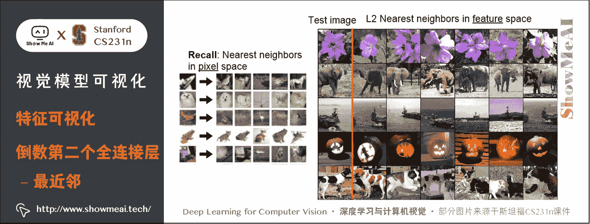

### 2) 降维

> 关于 PCA 降维算法的详细知识也可以参考[ShowMeAI](http://www.showmeai.tech/)的下述文章

> *   [**图解机器学习教程**](http://www.showmeai.tech/tutorials/34) 中的文章详解 [**降维算法详解**](http://www.showmeai.tech/article-detail/198)

另一个观察的角度是将 4096 4096 4096 维的向量压缩到二维平面的点，方法有 PCA，还有更复杂的非线性降维算法比如 **t-SNE**（t-distributed stochastic neighbors embeddings，t-分布邻域嵌入）。我们把手写数字 0-9 的图片经过 CNN 提取特征降到 2 维画出后，发现都是按数字簇分布的，分成 10 簇。如下图所示：

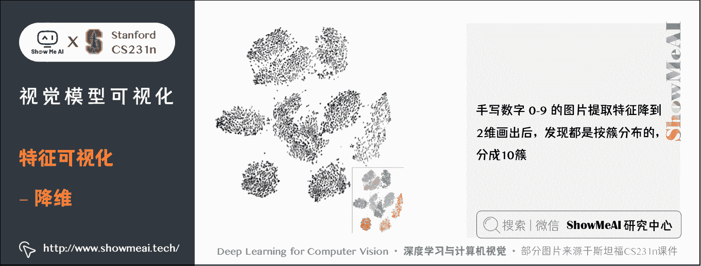

同样可以把这个方法用到 AlexNet 的 4096 4096 4096 维特征向量降维中。

我们输入一些图片，得到它们的 4096 4096 4096 维特征向量，然后使用 t-SNE 降到二维，画出这些二维点的网格坐标，然后把这些坐标对应的原始图片放在这个网格里。

如果大家做这个实验，可以观察到相似内容的图片聚集在了一起，比如左下角都是一些花草，右上角聚集了蓝色的天空。

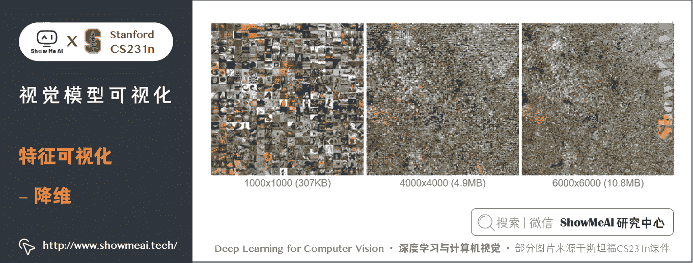

## 1.4 哪些像素对分类起作用？

### 1) 遮挡实验（Occlusion Experiments）

有一些方法可以判定原始图片的哪些位置（像素）对最后的结果起作用了，比如遮挡实验（Occlusion Experiments）是一种方法。

它在图片输入网络前，遮挡图片的部分区域，然后观察对预测概率的影响，可以想象得到，如果遮盖住核心部分内容，将会导致预测概率明显降低。

如下图所示，是遮挡大象的不同位置，对「大象」类别预测结果的影响。

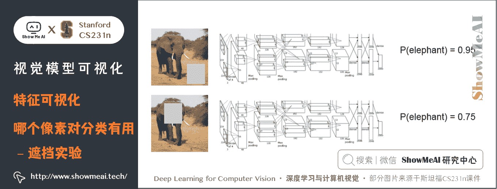

### 2) 显著图（Saliency Map）

除了前面介绍到的遮挡法，我们还有显著图（Saliency Map）方法，它从另一个角度来解决这个问题。

显著图（Saliency Map）方法是计算分类得分相对于图像像素的梯度，这将告诉我们在一阶近似意义上对于输入图片的每个像素如果我们进行小小的扰动，那么相应分类的分值会有多大的变化。

可以在下图看到，基本上找出了小狗的轮廓。

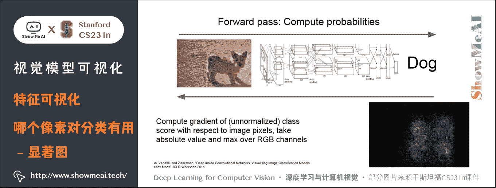

进行语义分割的时候也可以运用显著图的方法，可以在没有任何标签的情况下可以运用显著图进行语义分割。

### 3) 引导式反向传播

不像显著图那样使用分类得分对图片上的像素求导，而是使用卷积网络某一层的一个特定神经元的值对像素求导，这样就可以观察图像上的像素对特定神经元的影响。

但是这里的反向传播是引导式的，即 ReLU 函数的反向传播时，只回传大于 0 0 0 的梯度，具体如下图所示。这样的做法有点奇怪，但是效果很好，图像很清晰。

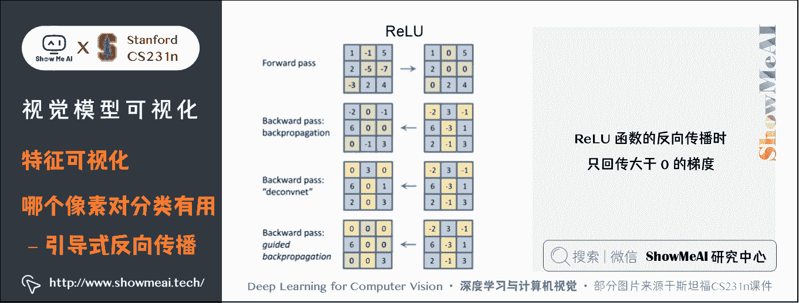

我们把引导式反向传播计算的梯度可视化和最大激活块进行对比，发现这两者的表现很相似。

下图左边是最大激活块，每一行代表一个神经元，右侧是该神经元计算得到的对原始像素的引导式反向传播梯度。

下图的第一行可以看到，最大激活该神经元的图像块都是一些圆形的区域，这表明该神经元可能在寻找蓝色圆形状物体，下图右侧可以看到圆形区域的像素会影响的神经元的值。

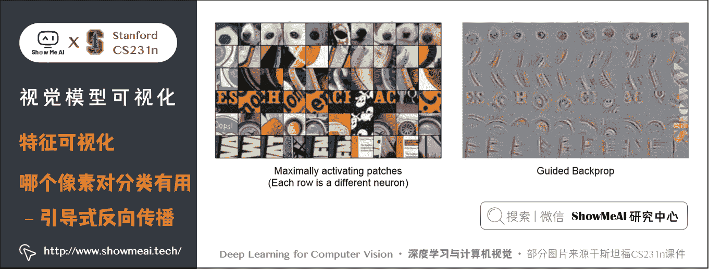

### 4) 梯度上升（Gradient Ascent）

引导式反向传播会寻找与神经元联系在一起的图像区域，另一种方法是梯度上升，合成一张使神经元最大激活或分类值最大的图片。

我们在训练神经网络时用梯度下降来使损失最小，现在我们要修正训练的卷积神经网络的权值，并且在图像的像素上执行梯度上升来合成图像，即最大化某些中间神将元和类的分值来改变像素值。

梯度上升的具体过程为：输入一张所有像素为 0 或者高斯分布的初始图片，训练过程中，神经网络的权重保持不变，计算神经元的值或这个类的分值相对于像素的梯度，使用梯度上升改变一些图像的像素使这个分值最大化。

同时，我们还会用正则项来阻止我们生成的图像过拟合。

总之，生成图像具备两个属性：

*   ① 使最大程度地激活分类得分或神经元的值
*   ② 使我们希望这个生成的图像看起来是自然的。

正则项强制生成的图像看起来是自然的图像，比如使用 L2 正则来约束像素，针对分类得分生成的图片如下所示：

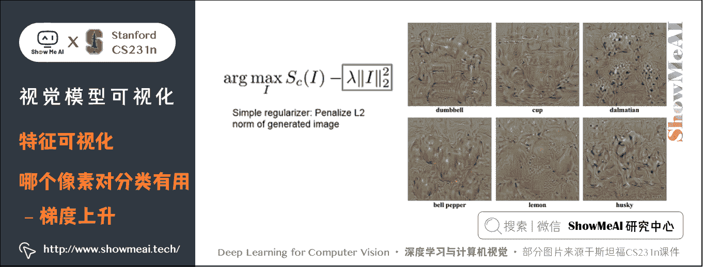

也可以使用一些其他方法来优化正则，比如：

*   对生成的图像进行高斯模糊处理
*   去除像素值特别小或梯度值特别小的值

上述方法会使生成的图像更清晰。

也可以针对某个神经元进行梯度上升，层数越高，生成的结构越复杂。

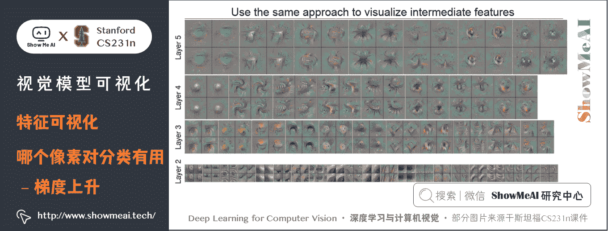

添加**多模态**（multi-faceted）可视化可以提供更好的结果（加上更仔细的正则化，中心偏差）。通过优化 FC6 的特征而不是原始像素，会得到更加自然的图像。

一个有趣的实验是「愚弄网络」：

输入一张任意图像，比如大象，给它选择任意的分类，比如考拉，现在就通过梯度上升改变原始图像使考拉的得分变得最大，这样网络认为这是考拉以后观察修改后的图像，我们肉眼去看和原来的大象没什么区别，并没有被改变成考拉，但网络已经识别为考拉（图片在人眼看起来还是大象，然而网络分类已经把它分成考拉了）。

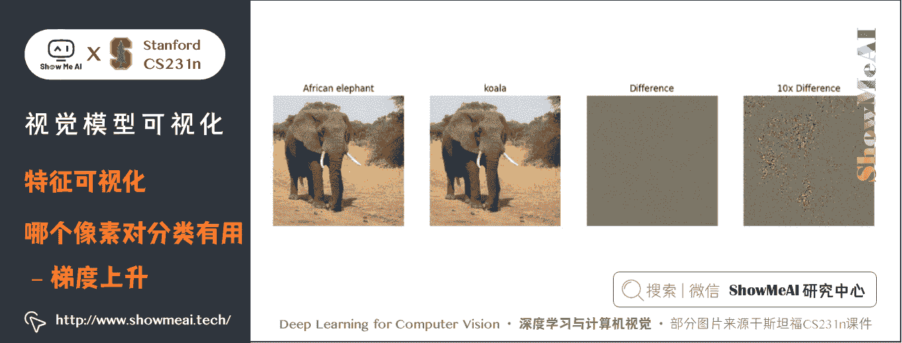

# 2.DeepDream

DeepDream 是一个有趣的 AI 应用实验，仍然利用梯度上升的原理，不再是通过最大化神经元激活来合成图片，而是直接放大某些层的神经元激活特征。

步骤如下：

*   ① 首先选择一张输入的图像，通过神经网络运行到某一层
*   ② 接着进行反向传播并且设置该层的梯度等于激活值，然后反向传播到图像并且不断更新图像。

对于以上步骤的解释：试图放大神经网络在这张图像中检测到的特征，无论那一层上存在什么样的特征，现在我们设置梯度等于特征值，以使神经网络放大它在图像中所检测到的特征。

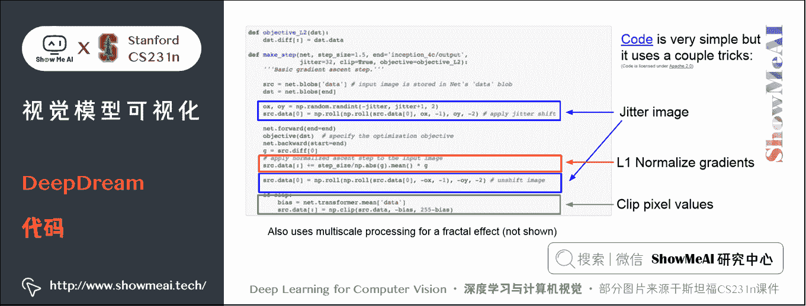

下图：输入一张天空的图片，可以把网络中学到的特征在原图像上生成：

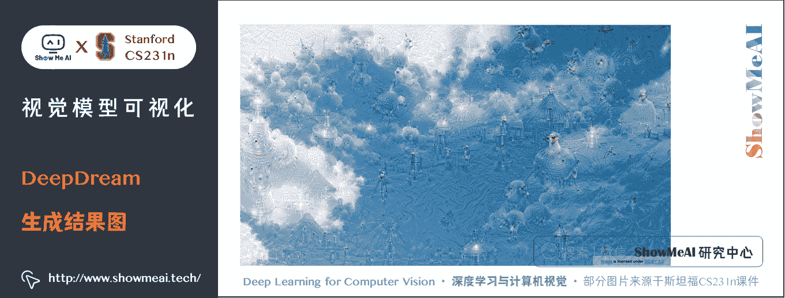

代码实现可以参考 google 官方实现 [`github.com/google/deepdream`](https://github.com/google/deepdream)

# 3.图像神经风格迁移

> 关于图像神经网络风格迁移的讲解也可以参考[ShowMeAI](http://www.showmeai.tech/)的下述文章

> *   [**深度学习教程 | 吴恩达专项课程 · 全套笔记解读**](http://www.showmeai.tech/tutorials/35) 中的文章 [**CNN 应用: 人脸识别和神经风格转换**](http://www.showmeai.tech/article-detail/224)

## 3.1 特征反演（Feature Inversion）

我们有一个查看不同层的特征向量能保留多少原始的图片信息的方法，叫做「特征反演」。

具体想法是：任选 1 张图片，前向传播到已经训练好的 CNN，选取其在 CNN 某一层产生的特征向量，保留这个向量。我们希望生成 1 张图片，尽量让它在该层产生一样的特征向量。

我们依旧使用梯度上升方法来完成，这个任务的目标函数定义为「最小化生成图片的特征向量与给定特征向量的 L2 距离」，当然我们会加一些正则化项保证生成图片的平滑，总体如下图所示：

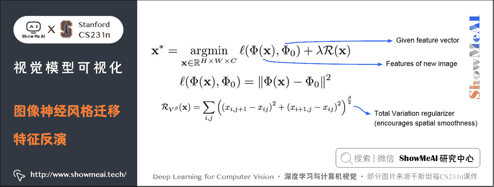

通过这个方法，我们可以看到不同层的特征向量所包含的信息完整度，如下图所示：

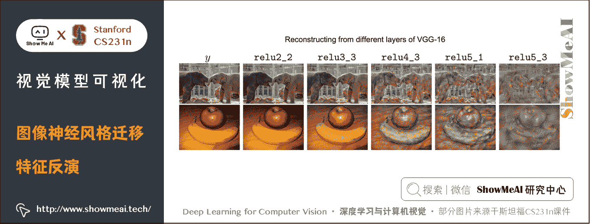

**解释讲解**：

*   在 relu2_2 层，可以根据特征向量几乎无损地恢复出原图片；
*   从 ReLU4_3 ReLU5_1 重构图像时，可以看到图像的一般空间结构被保留了下来，仍可以分辨出大象，苹果和香蕉，但是许多低层次的细节并比如纹理、颜色在神经网路的较高层更容易损失。

## 3.2 纹理生成（Texture Synthesis）

下面我们聊到的是「纹理生成」，针对这个问题，传统的方法有「近邻法」：根据已经生成的像素查看当前像素周围的邻域，并在输入图像的图像块中计算近邻，然后从输入图像中复制像素。但是这类方法在面对复杂纹理时处理得并不好。

### 1) 格莱姆矩阵（Gram Matrix）

**格莱姆矩阵计算方法**：

纹理生成的神经网络做法会涉及到格莱姆矩阵（Gram Matrix），我们来介绍一下它，我们先看看格莱姆矩阵怎么得到：

① 将一张图片传入一个已经训练好的 CNN，选定其中一层激活，其大小是 C × H × W C \times H \times W C×H×W，可以看做是 H × W H \times W H×W 个 C C C 维向量。

② 从这个激活图中任意选取两个 C 维向量，做矩阵乘法可以得到一个 C × C C \times C C×C 的矩阵。然后对激活图中任意两个 C C C 维向量的组合，都可以求出这样一个矩阵。把这些矩阵求和并平均，就得到 Gram Matrix。

**格莱姆矩阵含义**：

格莱姆矩阵告诉我们两个点代表的不同特征的同现关系，矩阵中位置索引为 i j ij ij 的元素值非常大，这意味着这两个输入向量的位置索引为 i i i 和 j j j 的元素值非常大。

格莱姆矩阵捕获了一些二阶统计量，即“映射特征图中的哪些特征倾向于在空间的不同位置一起激活”。

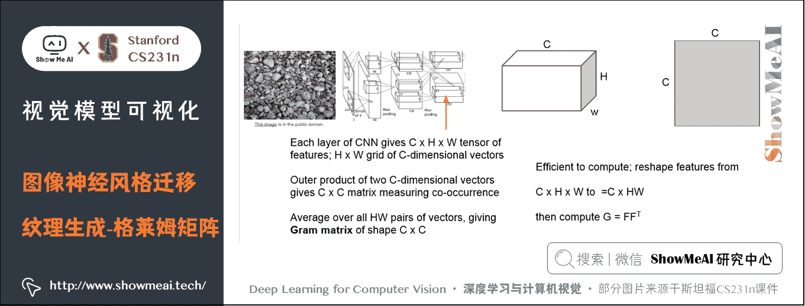

格莱姆矩阵其实是特征之间的偏心协方差矩阵（即没有减去均值的协方差矩阵）。其计算了每个通道特征之间的相关性，体现的是哪些特征此消彼长，哪些特征同时出现。

我们可以认为格莱姆矩阵度量了图片中的纹理特性，并且不包含图像的结构信息，因为我们对图像中的每一点所对应的特征向量取平均值，它只是捕获特征间的二阶同现统计量，这最终是一个很好的纹理描述符。

事实上，使用协方差矩阵代替格莱姆矩阵也能取得很好的效果，但是格莱姆矩阵有更高效的计算方法：

*   将激活图张量 C × H × W C \times H \times W C×H×W 展开成 C × H W C \times HW C×HW 的形式，然后将其乘以其转置。

### 2) 神经纹理生成（Neural Texture Synthesis）

当我们有了格莱姆矩阵这一度量图像纹理特性的工具后，就可以使用类似于梯度上升算法来产生特定纹理的图像。

算法流程如下图所示：

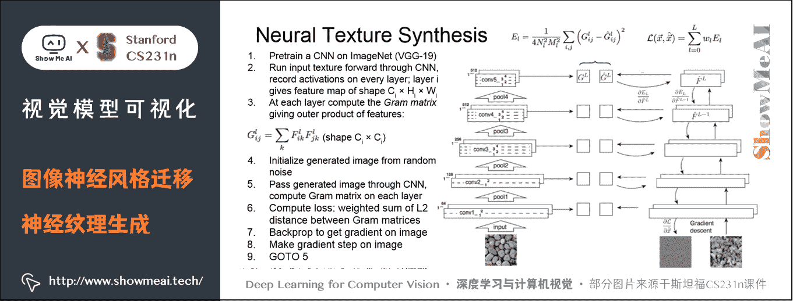

**纹理生成步骤**：

*   ① 首先把含有纹理的图像输入到一个预训练网络中（例如 VGG），记录其每一层的激活图并计算每一层的格莱姆矩阵。
*   ② 接着随机初始化一张要生成的新的图像，同样把这张初始化图像通过预训练网络并且计算每一层的 gram 矩阵。
*   ③ 然后计算输入图像纹理矩阵和生成图像纹理矩阵之间的加权 L2 损失，进行反向传播，并计算相对于生成图像的像素的梯度。
*   ④ 最后根据梯度上升一点点更新图像的像素，不断重复这个过程，即计算两个格莱姆矩阵的 L2 范数损失和反向传播图像梯度，最终会生成与纹理图像相匹配的纹理图像。

生成的纹理效果如下图所示：

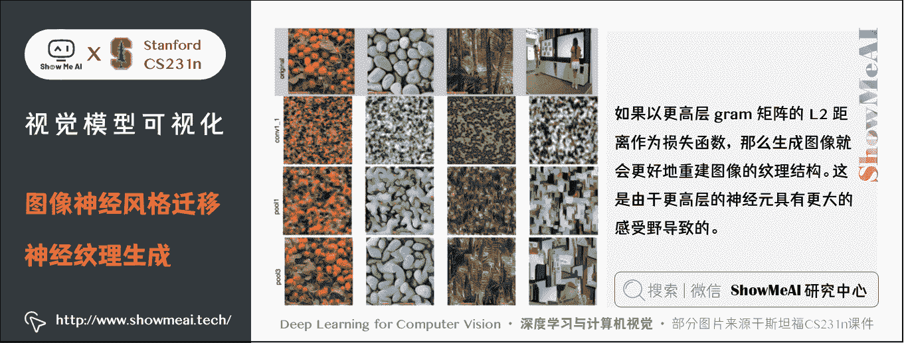

上图说明，如果以更高层格莱姆矩阵的 L2 距离作为损失函数，那么生成图像就会更好地重建图像的纹理结构（这是因为更高层的神经元具有更大的感受野）。

## 3.3 图像神经风格迁移（Style Transfer）

如果我们结合特征反演和纹理生成，可以实现非常热门的一个网络应用「图像神经风格迁移（Style Transfer）」。它能根据指定的 1 张内容图片和 1 张风格图片，合并生成具有相似内容和风格的合成图。

具体的做法是：准备两张图像，一张图像称为内容图像，需要引导我们生成图像的主题；另一张图像称为风格图像，生成图像需要重建它的纹理结构。然后共同做特征识别，最小化内容图像的特征重构损失，以及风格图像的格莱姆矩阵损失。

使用下面的框架完成这个任务：

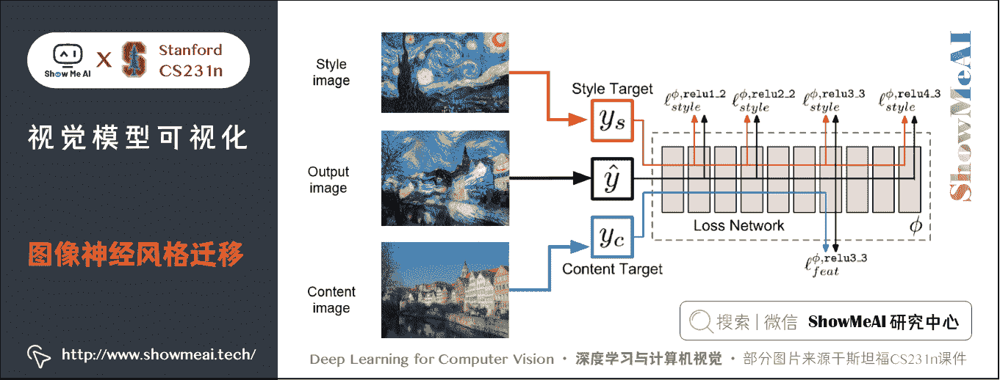

上图所示的框架中，使用随机噪声初始化生成图像，同时优化特征反演和纹理生成的损失函数（生成图像与内容图像激活特征向量的 L2 距离以及与风格图像 gram 矩阵的 L2 距离的加权和），计算图像上的像素梯度，重复这些步骤，应用梯度上升对生成图像调整。

迭代完成后我们会得到风格迁移后的图像：它既有内容图像的空间结构，又有风格图像的纹理结构。

因为网络总损失是「特征反演」和「纹理生成」的两部分损失的加权和，我们调整损失中两者的权重可以得到不同倾向的输出，如下图所示：

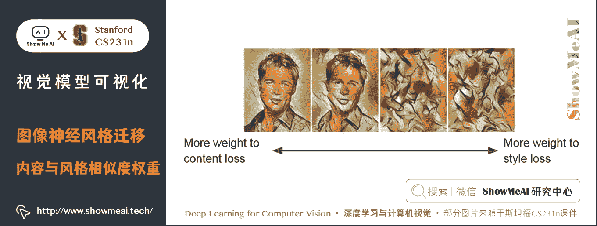

也可以改变风格图像的尺寸：

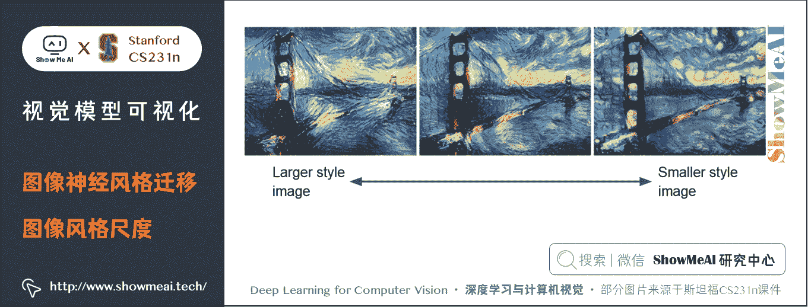

我们甚至可以使用不同风格的格莱姆矩阵的加权和，来生成多风格图：

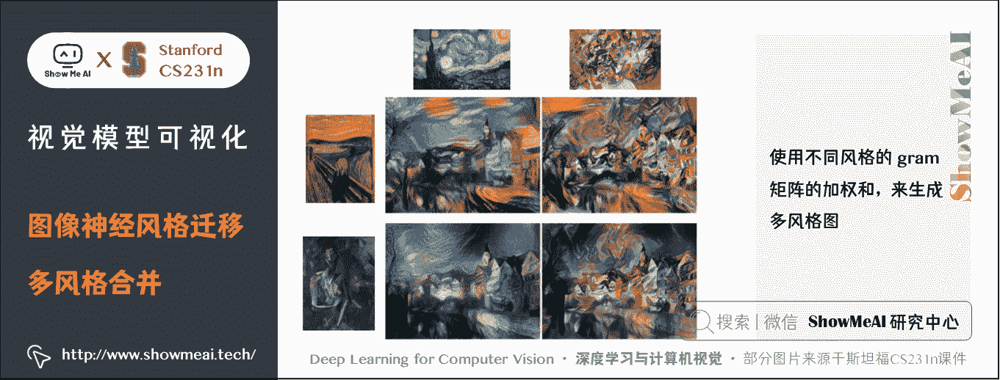

代码实现可以参考这里：[`github.com/jcjohnson/neural-style`](https://github.com/jcjohnson/neural-style)

## 3.4 快速图像风格迁移（Fast style Transfer）

上面的风格迁移框架，每生成一张新的图像都需要迭代数次，计算量非常大。因此有研究提出了下面的 Fast style Transfer 的框架：

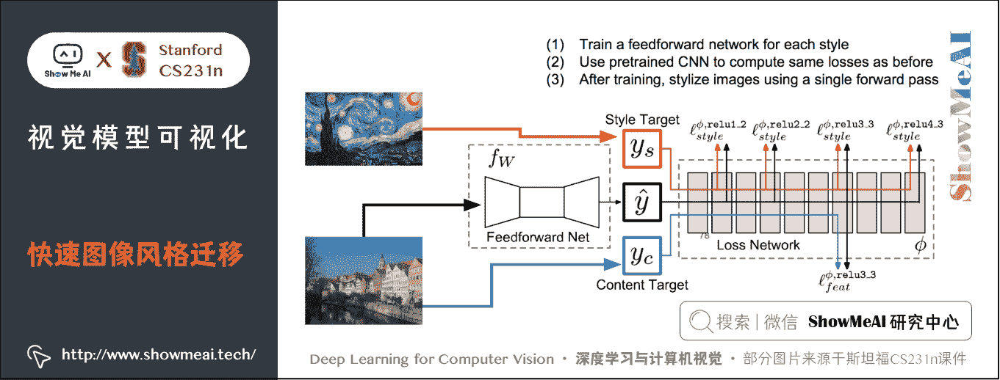

快速图像风格迁移方法，会在一开始训练好想要迁移的风格，得到一个可以输入内容图像的网络，直接前向运算，最终输出风格迁移后的结果。

训练前馈神经网络的方法是在训练期间计算相同内容图像和风格图像的损失，然后使用相同梯度来更新前馈神经网络的权重，一旦训练完成，只需在训练好的网络上进行一次前向传播。

代码实现可以参考这里：[`github.com/jcjohnson/fast-neural-style`](https://github.com/jcjohnson/fast-neural-style)

# 4.拓展学习

**可以点击 [B 站](https://www.bilibili.com/video/BV1g64y1B7m7?p=12) 查看视频的【双语字幕】版本**

[`player.bilibili.com/player.html?aid=759478950&page=12`](https://player.bilibili.com/player.html?aid=759478950&page=12)

【字幕+资料下载】斯坦福 CS231n | 面向视觉识别的卷积神经网络 (2017·全 16 讲)

*   [【课程学习指南】斯坦福 CS231n | 深度学习与计算机视觉](http://blog.showmeai.tech/cs231n/)
*   [【字幕+资料下载】斯坦福 CS231n | 深度学习与计算机视觉 (2017·全 16 讲)](https://www.bilibili.com/video/BV1g64y1B7m7)
*   [【CS231n 进阶课】密歇根 EECS498 | 深度学习与计算机视觉](http://blog.showmeai.tech/eecs498/)
*   [【深度学习教程】吴恩达专项课程 · 全套笔记解读](http://www.showmeai.tech/tutorials/35)
*   [【Stanford 官网】CS231n: Deep Learning for Computer Vision](http://cs231n.stanford.edu/)

# 5.参考资料

*   [CNN 可视化/可解释性](https://blog.csdn.net/xys430381_1/article/details/90413169)
*   [万字长文概览深度学习的可解释性研究](https://zhuanlan.zhihu.com/p/110078466)

# 6.要点总结

*   **理解 CNN**：
    *   **激活值**：在激活值的基础上理解这些神经元在寻找什么特征，方法有最邻近、降维、最大化图像块、遮挡；
*   **梯度**：使用梯度上升合成新图像来理解特征的意义，比如显著图、类可视化、愚弄图像、特征反演。
*   **风格迁移：特征反演+纹理生成。**

# [ShowMeAI](http://www.showmeai.tech) 斯坦福 CS231n 全套解读

*   [深度学习与计算机视觉教程(1) | CV 引言与基础 @CS231n](http://www.showmeai.tech/article-detail/260)
*   [深度学习与计算机视觉教程(2) | 图像分类与机器学习基础 @CS231n](http://www.showmeai.tech/article-detail/261)
*   [深度学习与计算机视觉教程(3) | 损失函数与最优化 @CS231n](http://www.showmeai.tech/article-detail/262)
*   [深度学习与计算机视觉教程(4) | 神经网络与反向传播 @CS231n](http://www.showmeai.tech/article-detail/263)
*   [深度学习与计算机视觉教程(5) | 卷积神经网络 @CS231n](http://www.showmeai.tech/article-detail/264)
*   [深度学习与计算机视觉教程(6) | 神经网络训练技巧 (上) @CS231n](http://www.showmeai.tech/article-detail/265)
*   [深度学习与计算机视觉教程(7) | 神经网络训练技巧 (下) @CS231n](http://www.showmeai.tech/article-detail/266)
*   [深度学习与计算机视觉教程(8) | 常见深度学习框架介绍 @CS231n](http://www.showmeai.tech/article-detail/267)
*   [深度学习与计算机视觉教程(9) | 典型 CNN 架构 (Alexnet, VGG, Googlenet, Restnet 等) @CS231n](http://www.showmeai.tech/article-detail/268)
*   [深度学习与计算机视觉教程(10) | 轻量化 CNN 架构 (SqueezeNet, ShuffleNet, MobileNet 等) @CS231n](http://www.showmeai.tech/article-detail/269)
*   [深度学习与计算机视觉教程(11) | 循环神经网络及视觉应用 @CS231n](http://www.showmeai.tech/article-detail/270)
*   [深度学习与计算机视觉教程(12) | 目标检测 (两阶段, R-CNN 系列) @CS231n](http://www.showmeai.tech/article-detail/271)
*   [深度学习与计算机视觉教程(13) | 目标检测 (SSD, YOLO 系列) @CS231n](http://www.showmeai.tech/article-detail/272)
*   [深度学习与计算机视觉教程(14) | 图像分割 (FCN, SegNet, U-Net, PSPNet, DeepLab, RefineNet) @CS231n](http://www.showmeai.tech/article-detail/273)
*   [深度学习与计算机视觉教程(15) | 视觉模型可视化与可解释性 @CS231n](http://www.showmeai.tech/article-detail/274)
*   [深度学习与计算机视觉教程(16) | 生成模型 (PixelRNN, PixelCNN, VAE, GAN) @CS231n](http://www.showmeai.tech/article-detail/275)
*   [深度学习与计算机视觉教程(17) | 深度强化学习 (马尔可夫决策过程, Q-Learning, DQN) @CS231n](http://www.showmeai.tech/article-detail/276)
*   [深度学习与计算机视觉教程(18) | 深度强化学习 (梯度策略, Actor-Critic, DDPG, A3C) @CS231n](http://www.showmeai.tech/article-detail/277)

# [ShowMeAI](http://www.showmeai.tech) 系列教程推荐

*   [大厂技术实现：推荐与广告计算解决方案](http://www.showmeai.tech/tutorials/50)
*   [大厂技术实现：计算机视觉解决方案](http://www.showmeai.tech/tutorials/51)
*   [大厂技术实现：自然语言处理行业解决方案](http://www.showmeai.tech/tutorials/52)
*   [图解 Python 编程：从入门到精通系列教程](http://www.showmeai.tech/tutorials/56)
*   [图解数据分析：从入门到精通系列教程](http://www.showmeai.tech/tutorials/33)
*   [图解 AI 数学基础：从入门到精通系列教程](http://www.showmeai.tech/tutorials/83)
*   [图解大数据技术：从入门到精通系列教程](http://www.showmeai.tech/tutorials/84)
*   [图解机器学习算法：从入门到精通系列教程](http://www.showmeai.tech/tutorials/34)
*   [机器学习实战：手把手教你玩转机器学习系列](http://www.showmeai.tech/tutorials/41)
*   [深度学习教程：吴恩达专项课程 · 全套笔记解读](http://www.showmeai.tech/tutorials/35)
*   [自然语言处理教程：斯坦福 CS224n 课程 · 课程带学与全套笔记解读](http://www.showmeai.tech/tutorials/36)
*   [深度学习与计算机视觉教程：斯坦福 CS231n · 全套笔记解读](http://www.showmeai.tech/tutorials/37)

