# 深度学习与计算机视觉教程(16) | 生成模型(PixelRNN,PixelCNN,VAE,GAN)（CV 通关指南·完结）

> 原文：[`blog.csdn.net/ShowMeAI/article/details/125055672`](https://blog.csdn.net/ShowMeAI/article/details/125055672)

*   作者：[韩信子](https://github.com/HanXinzi-AI)@[ShowMeAI](http://www.showmeai.tech/)
*   [教程地址](http://www.showmeai.tech/tutorials/37)：[`www.showmeai.tech/tutorials/37`](http://www.showmeai.tech/tutorials/37)
*   [本文地址](http://www.showmeai.tech/article-detail/275)：[`www.showmeai.tech/article-detail/275`](http://www.showmeai.tech/article-detail/275)
*   声明：版权所有，转载请联系平台与作者并注明出处
*   **收藏[ShowMeAI](http://www.showmeai.tech/)查看更多精彩内容**

* * *

本系列为 **斯坦福 CS231n** 《深度学习与计算机视觉(Deep Learning for Computer Vision)》的全套学习笔记，对应的课程视频可以在 [**这里**](https://www.bilibili.com/video/BV1g64y1B7m7?p=13) 查看。更多资料获取方式见文末。

* * *

# 引言

之前了解到的都是**监督学习**（Supervised Learning）：我们有数据 x 和标签 y，目标是学习到一个函数可以将数据 x 映射到标签 y，标签可以有很多形式。

典型的有监督学习有：分类问题中输入一张图片，输出图片的分类；目标检测中输入一张图片，输出目标物体的边框；语义分割中，给每个像素都打上标签。

CS231n 第 13 讲给大家介绍的是**无监督学习**（Unsupervised Learning）以及**生成模型**的一些知识。

## 本篇重点

*   无监督学习
*   生成模型
    *   Pixel RNN/CNN
    *   变分自编码器（VAE）
    *   生成对抗网络（GAN）

# 1.无监督学习

无监督学习在我们只有一些没有标签的训练数据的情况下，学习数据中隐含的结构。无监督学习由于没有标签，数据获取也很容易。典型的无监督学习包括下述算法：

## 1.1 聚类（k-Means）

> 关于聚类算法的详细知识也可以参考[ShowMeAI](http://www.showmeai.tech/)的下述文章
> 
> *   [**图解机器学习教程**](http://www.showmeai.tech/tutorials/34) 中的文章详解 [**聚类算法详解**](http://www.showmeai.tech/article-detail/197)

**聚类**（Clustering）是找到数据的分组，组内数据在某种度量方式下是相似的。随机初始 k 个中心位置，将每个样本分配到最近的中心位置，然后根据分配的样本更新中心位置。重复这个过程直至收敛（中心位置不再变化）。

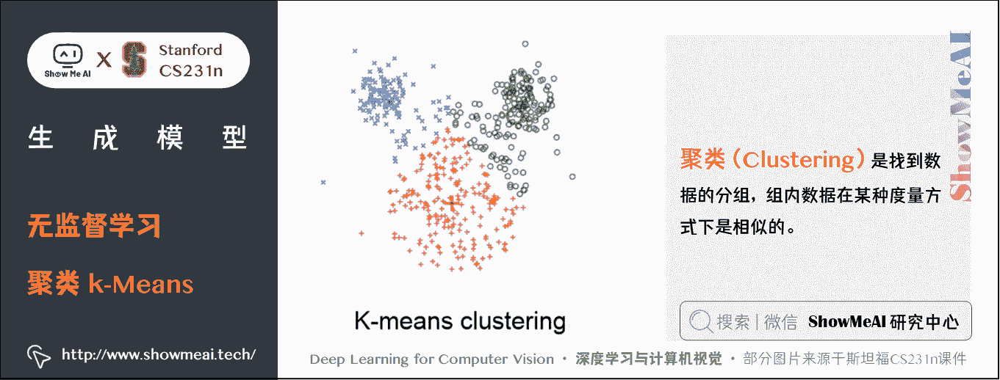

## 1.2 PCA（主成分分析）

> 关于 PCA 降维算法的详细知识也可以参考[ShowMeAI](http://www.showmeai.tech/)的下述文章
> 
> *   [**图解机器学习教程**](http://www.showmeai.tech/tutorials/34) 中的文章详解 [**降维算法详解**](http://www.showmeai.tech/article-detail/198)

**数据降维**（**Dimensionality reduction**）：找出一些投影方向（轴），在这些轴上训练数据投影的方差最大。这些轴就是数据内潜在的结构。我们可以用这些轴来减少数据维度，数据在每个保留下来的维度上都有很大的方差。

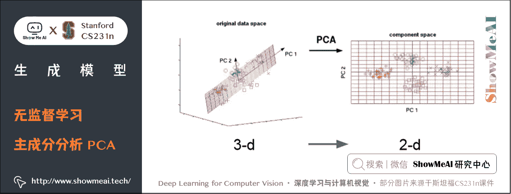

## 1.3 特征学习（Feature Learning）

我们还有一些特征学习的方法，比如自编码（Autoencoders）：

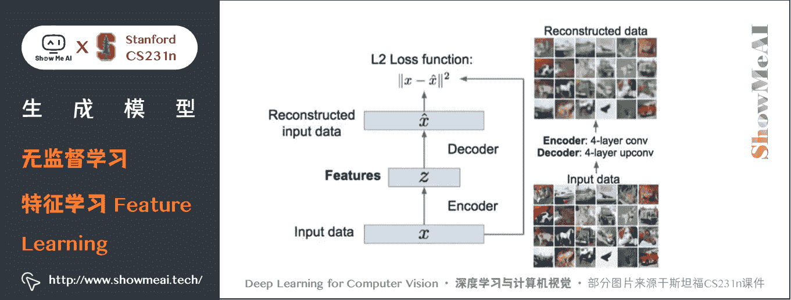

## 1.4 密度估计（ Density Estimation）

密度估计（ Density Estimation）也是一种无监督算法，我们会估计数据的内在分布情况，比如下图上方有一些一维和二维的点，我们用高斯函数来拟合这一密度分布，如下图所示：

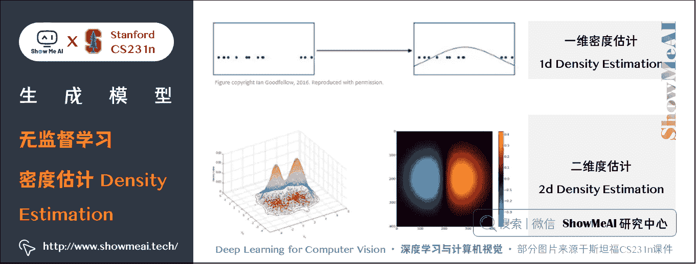

# 2.生成模型（Generative Models）

生成模型是一种无监督学习方法。它对应的任务是：根据一批由真实分布 p-data(x) 产生的训练数据，通过训练学习，得到一个可以以近似于真实的分布 p-model(x) 来产生新样本的模型。

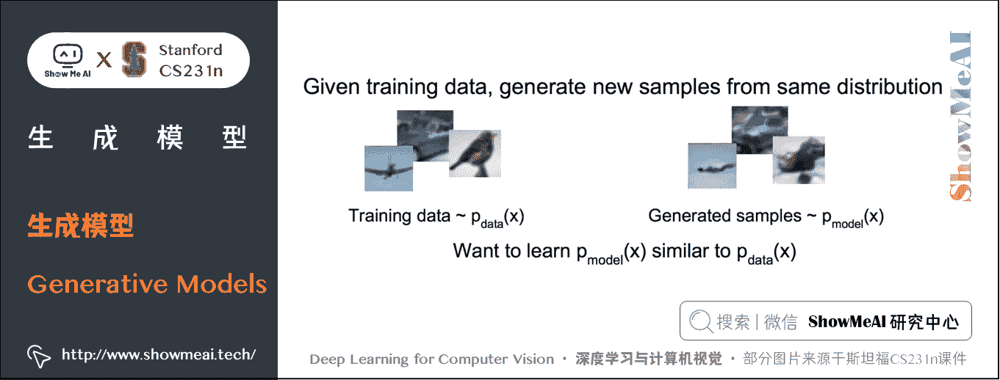

为什么生成模型重要，因为其可以支撑一系列问题的解决：生成样本，着色问题，强化学习应用，隐式表征推断等。

下图左边为生成的图片，中间生成的人脸，还可以做超分辨率或者着色之类的任务。

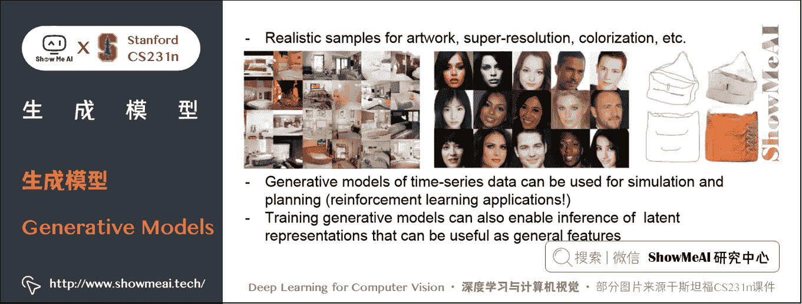

生成模型分为「显式」和「隐式」的生成模型，往下分又可以分成很多子类。如下图所示。

我们在本篇内容中主要讨论 3 种模型：**PixelRNN / CNN，变分自动编码器**属于显示密度模型，**生成对抗网络**（GAN）属于隐式密度估计模型。

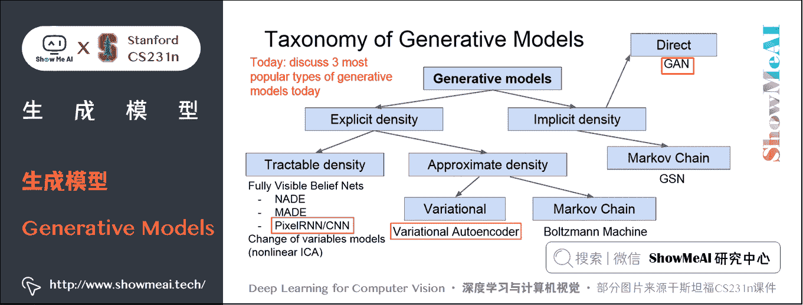

## 2.1 PixelRNN 和 PixelCNN

PixelRNN 和 PixelCNN 使用概率链式法则来计算一张图片出现的概率。其中每一项为给定前 i − 1 i-1 i−1 个像素点后第 i i i 个像素点的条件概率分布。这个分布通过神经网络 RNN 或 CNN 来建模，再通过最大化图片 x x x 的似然概率来学习出 RNN 或 CNN 的参数。

**条件概率**公式为：

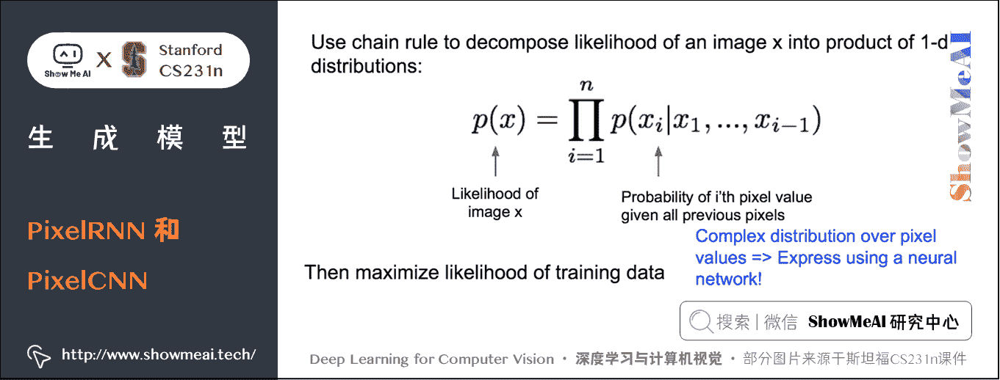

p ( x ) = ∏ i = 1 n p ( x i ∣ x 1 , … , x i − 1 ) p(x)=\prod_{i=1}^{n} p(x_{i} \mid x_{1}, \ldots, x_{i-1}) p(x)=i=1∏n​p(xi​∣x1​,…,xi−1​)

其中：

*   p ( x ) p(x) p(x): 图像 x 的似然概率
*   p ( x i ∣ x 1 , … , x i − 1 ) p(x_{i} \mid x_{1}, \ldots, x_{i-1}) p(xi​∣x1​,…,xi−1​): 条件概率

PixelRNN 中，从左上角开始定义「之前的像素」。由于 RNN 每个时间步的输出概率都依赖于之前所有输入，因此能够用来表示上面的条件概率分布。

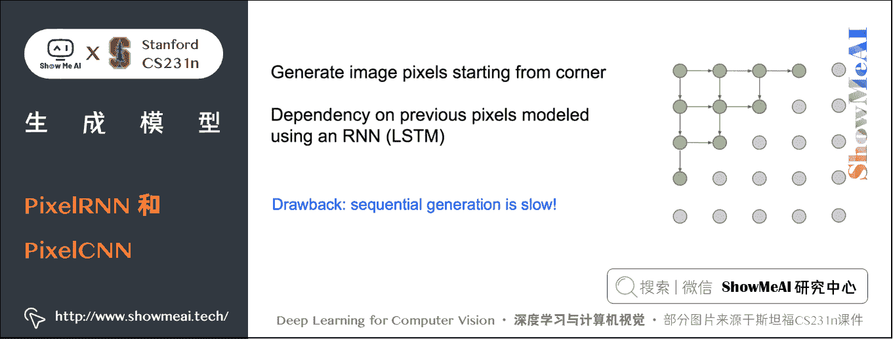

我们训练这个 RNN 模型时，一次前向传播需要从左上到右下串行走一遍，然后根据上面的公式求出似然，并最大化似然以对参数做一轮更新。因此训练非常耗时。

PixelCNN 中，使用一个 CNN 来接收之前的所有像素，并预测下一个像素的出现概率：

p ( x ) = ∏ i = 1 n p ( x i ∣ x 1 , … , x i − 1 ) p(x)=\prod_{i=1}^{n} p(x_{i} \mid x_{1}, \ldots, x_{i-1}) p(x)=i=1∏n​p(xi​∣x1​,…,xi−1​)

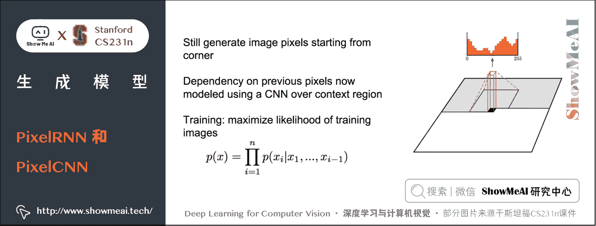

对比 PixelRNN 和 PixelCNN，后者在训练时可以并行计算公式中的每一项，然后进行参数更新，因此训练速度远快于 PixelRNN。

不过，在测试阶段，我们会发现 PixelRNN 和 PixelCNN 都要从左上角开始逐个像素点地生成图片，实际应用阶段生成图像的速度是很慢的。

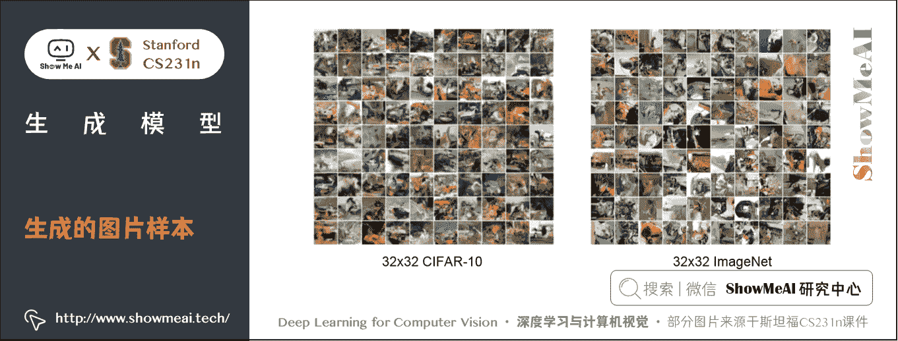

PixelRNN 和 PixelCNN 能显式地计算似然 p ( x ) p(x) p(x)，是一种可优化的显式密度模型，该方法给出了一个很好的评估度量，可以通过计算的数据的似然来度量出生成样本有多好。

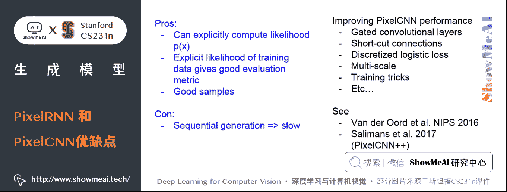

## 2.2 变分自编码器（VAE）

PixelCNN 定义了一个易于处理的密度函数，我们可以直接优化训练数据的似然；而我们下面介绍到的变分自编码器方法中，密度函数就不易处理了，我们要通过附加的隐变量 z z z 对密度函数进行建模：

p θ ( x ) = ∫ p θ ( z ) p θ ( x ∣ z ) d z p_{\theta}(x)=\int p_{\theta}(z) p_{\theta}(x \mid z) d z pθ​(x)=∫pθ​(z)pθ​(x∣z)dz

我们数据的似然 p ( x ) p(x) p(x) 是等式右边的积分形式，即对所有可能的 z z z 值取期望，但它是无法直接优化的，我们只能找出一个似然函数的下界然后再对该下界进行优化。

### 1) 自编码器

自编码器是为了无监督地学习出样本的特征表示，原理如下：

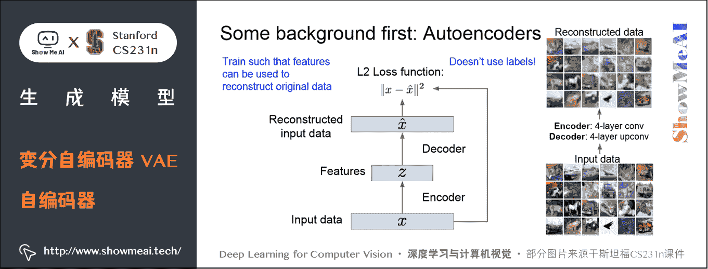

如上图，自编码器由编码器和解码器组成，编码器将样本 x x x 映射到特征 z z z，解码器再 x x x 将特征 z z z 映射到重构样本。我们设定损失函数为 x x x 与重构样本之间的 L2 损失，训练出编码器和解码器的参数，希望能够使 z z z 解码后恢复出原来的 x x x。

### **编码器**

编码器可以有多种形式，常用的是神经网络。最先提出的是非线性层的线性组合，然后有了深层的全连接网络（MLP），后来又使用 CNN，我们通过神经网络对输入数据 x x x 计算和映射，得到特征 z z z， z z z 的维度通常比 x x x 更小。这种降维压缩可以压缩保留 x x x 中最重要的特征。

### **解码器**

解码器主要是为了重构数据，它输出一些跟 x x x 有相同维度的结果并尽量拟合 x x x 。解码器一般使用和编码器相同类型的网络（与编码器对称）。

训练好完整的网络后，我们会把解码器的部分去掉，使用训练好的编码器实现特征映射。

通过编码器得到输入数据的特征，编码器顶部有一个分类器，如果是分类问题我们可以用它来输出一个类标签，在这里使用了外部标签和标准的损失函数如 Softmax。

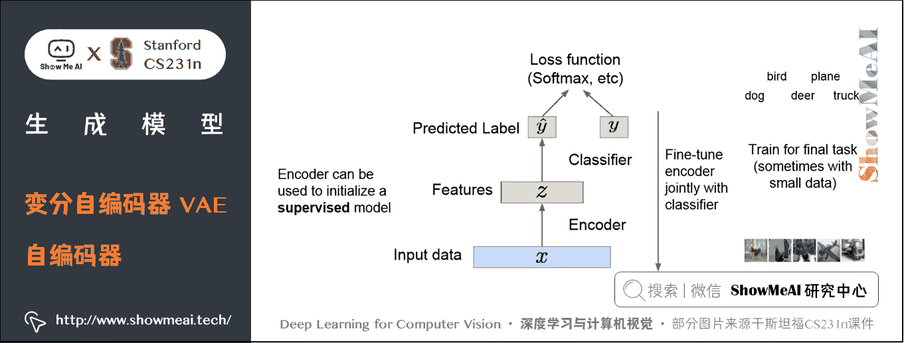

无标签数据得到的模型，可以帮助我们得到普适特征（比如上述自编码器映射得到的特征），它们作为监督学习的输入是非常有效的（有些场景下监督学习可能只有很少的带标签的训练数据，少量的数据很难训练模型，可能会出现过拟合等其他一些问题），通过上述方式得到的特征可以很好地初始化下游监督学习任务的网络。

自编码器具有重构数据、学习数据特征、初始化一个监督模型的能力。这些学习到的特征具有能捕捉训练数据中蕴含的变化因素的能力。我们获得了一个含有训练数据中变化因子的隐变量 z z z 。

### 2) VAE 的思想

VAE 模型的思路是，如果我们无法直接获得样本 x x x 的分布，那么我们可以假设存在一个 x x x 对应的隐式表征 z z z ， z z z 的分布是一个先验分布（比如高斯分布或其他简单的分布）。

举例来说，如果我们想要生成微笑的人脸， z z z 代表的是眉毛的位置，嘴角上扬的弧度，它经过解码网络后，能够映射得到 x x x 的近似真实分布。那在样本生成阶段，我们可以通过标准正态分布采样得到 z z z ，然后解码得到样本近似分布，再在此分布上采样来生成样本。

对于这个采样过程，真实的参数是 θ ∗ \theta \ast θ∗ ，是有关于先验假设和条件概率分布的参数，我们的目的在于获得一个样本生成式模型，从而利用它来生成新的数据，真实参数是我们想要估计并得出的。

我们表示这个生成式模型的方法是：选一个简单的关于 z z z 的先验分布，例如高斯分布，对于给定 z z z 的 x x x 的条件概率分布 p ( x ∣ z ) p(x \mid z) p(x∣z) 很复杂，我们会使用神经网络来对 p ( x ∣ z ) p(x \mid z) p(x∣z) 进行建模。

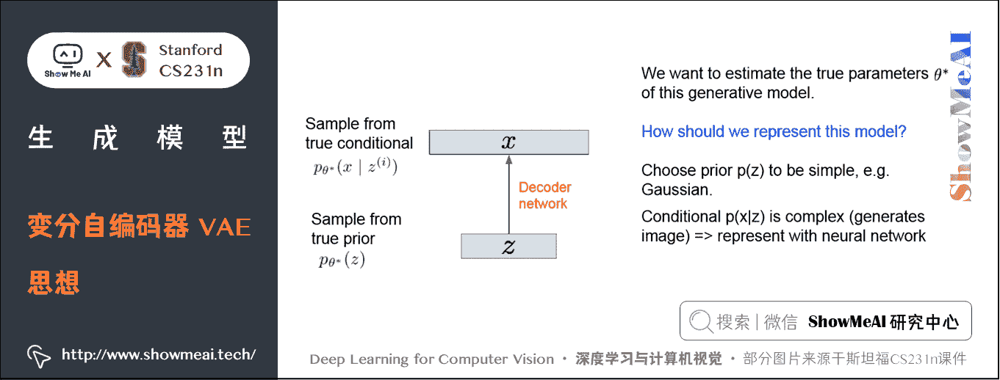

### 3) 如何训练 VAE

我们的目标是：从一堆样本中学习出解码网络的参数，使得在标准高斯分布上采样得到的 z z z ，经过解码后得到的 x x x 的分布，刚好近似于 x x x 的真实分布。

我们通过「最大化样本 x x x 的似然 P ( x ) P(x) P(x)」来达到上述目标。 在已经给定隐变量 z z z 的情况下，写出 x x x 的分布 p p p 并对所有可能的 z z z 值取期望，因为 z z z 值是连续的所以表达式是一个积分：

p θ ( x ) = ∫ p θ ( z ) p θ ( x ∣ z ) d z p_{\theta}(x)=\int p_{\theta}(z) p_{\theta}(x \mid z) d z pθ​(x)=∫pθ​(z)pθ​(x∣z)dz

问题是利用求导来直接求最大化的似然，很不好解。

第一项是 z z z 的分布 p ( z ) p(z) p(z) ，这里将它简单地设定为高斯分布，所以很容易求； p ( x ∣ z ) p(x \mid z) p(x∣z) 是一个指定的神经网络解码器，也容易得到。

但是计算所有的 z z z 对应的 p ( x ∣ z ) p(x \mid z) p(x∣z) 很困难，所以无法计算该积分。这样也导致 p ( z ∣ x ) p(z \mid x) p(z∣x) 是难解的。

**解决方法**是，在使用神经网络解码器来定义一个对 p ( x ∣ z ) p(x \mid z) p(x∣z) 建模神经网络的同时，额外定义一个编码器 q ( z ∣ x ) q(z \mid x) q(z∣x) ，将输入 x x x 编码为 z z z ，从而得到似然 p ( z ∣ x ) p(z \mid x) p(z∣x) 。

也就是说我们定义该网络来估计出 p ( z ∣ x ) p(z \mid x) p(z∣x) ，这个后验密度分布项仍然是难解的，我们用该附加网络来估计该后验分布，这将使我们得到一个数据似然的下界，该下界易解也能优化。

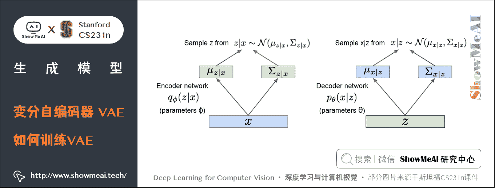

在变分自编码器中我们想得到一个生成数据的概率模型，将输入数据 x x x 送入编码器得到一些特征 z z z ，然后通过解码器网络把 z z z 映射到图像 x x x 。

我们这里有编码器网络和解码器网络，将一切参数随机化。参数是 ϕ \phi ϕ 的编码器网络 q ( z ∣ x ) q(z \mid x) q(z∣x) 输出一个均值和一个对角协方差矩阵；解码器网络输入 z z z ，输出均值和关于 x x x 的对角协方差矩阵。为了得到给定 x x x 下的 z z z 和给定 z z z 下的 x x x ，我们会从这些分布（ p p p 和 q q q）中采样，现在我们的编码器和解码器网络所给出的分别是 z z z 和 x x x 的条件概率分布，并从这些分布中采样从而获得值。

**下面是推导过程**：

log ⁡ L = log ⁡ p ( x ) = log ⁡ p ( x ) ⋅ 1 = log ⁡ p ( x ) ∫ z q ( z ∣ x ) d z \log \mathrm{L}=\log p(x)=\log p(x) \cdot 1=\log p(x) \int_{z} q(z \mid x) d z logL=logp(x)=logp(x)⋅1=logp(x)∫z​q(z∣x)dz

这里引入了一个分布 q ( z ∣ x ) q(z \mid x) q(z∣x) ，就是编码网络。这里我们暂时只把它当作一个符号，继续推导即可：

log ⁡ L = log ⁡ p ( x ) ∫ z q ( z ∣ x ) d z = ∫ z q ( z ∣ x ) log ⁡ p ( x , z ) p ( z ∣ x ) d z = ∫ z q ( z ∣ x ) [ log ⁡ p ( x , z ) q ( z ∣ x ) − log ⁡ p ( z ∣ x ) q ( z ∣ x ) ] d z = ∫ z q ( z ∣ x ) log ⁡ p ( x , z ) q ( z ∣ x ) d z + ∫ z q ( z ∣ x ) log ⁡ q ( z ∣ x ) p ( z ∣ x ) d z = ∫ z q ( z ∣ x ) log ⁡ p ( x , z ) q ( z ∣ x ) d z + D K L ( q ( z ∣ x ) ∥ p ( z ∣ x ) ) \begin{aligned} \log \mathrm{L} &=\log p(x) \int_{z} q(z \mid x) d z \\ &=\int_{z} q(z \mid x) \log \frac{p(x, z)}{p(z \mid x)} d z \\ &=\int_{z} q(z \mid x)\left[\log \frac{p(x, z)}{q(z \mid x)}-\log \frac{p(z \mid x)}{q(z \mid x)}\right] d z \\ &=\int_{z} q(z \mid x) \log \frac{p(x, z)}{q(z \mid x)} d z+\int_{z} q(z \mid x) \log \frac{q(z \mid x)}{p(z \mid x)} d z \\ &=\int_{z} q(z \mid x) \log \frac{p(x, z)}{q(z \mid x)} d z+D_{K L}(q(z \mid x) \| p(z \mid x)) \end{aligned} logL​=logp(x)∫z​q(z∣x)dz=∫z​q(z∣x)logp(z∣x)p(x,z)​dz=∫z​q(z∣x)[logq(z∣x)p(x,z)​−logq(z∣x)p(z∣x)​]dz=∫z​q(z∣x)logq(z∣x)p(x,z)​dz+∫z​q(z∣x)logp(z∣x)q(z∣x)​dz=∫z​q(z∣x)logq(z∣x)p(x,z)​dz+DKL​(q(z∣x)∥p(z∣x))​

对第一项，我们有：

∫ z q ( z ∣ x ) log ⁡ p ( x , z ) q ( z ∣ x ) d z = ∫ z q ( z ∣ x ) log ⁡ p ( x ∣ z ) d z + ∫ z q ( z ∣ x ) log ⁡ p ( x ) q ( z ∣ x ) d z = E z ∼ q [ log ⁡ p ( x ∣ z ) ] − D K L ( q ( z ∣ x ) ∥ p ( z ) ) \begin{aligned} \int_{z} q(z \mid x) \log \frac{p(x, z)}{q(z \mid x)} d z &=\int_{z} q(z \mid x) \log p(x \mid z) d z+\int_{z} q(z \mid x) \log \frac{p(x)}{q(z \mid x)} d z \\ &=\mathrm{E}_{z \sim q}[\log p(x \mid z)]-D_{K L}(q(z \mid x) \| p(z)) \end{aligned} ∫z​q(z∣x)logq(z∣x)p(x,z)​dz​=∫z​q(z∣x)logp(x∣z)dz+∫z​q(z∣x)logq(z∣x)p(x)​dz=Ez∼q​[logp(x∣z)]−DKL​(q(z∣x)∥p(z))​

这样我们就得到了 VAE 的核心等式：

log ⁡ p ( x ) = E z ∼ q [ log ⁡ p ( x ∣ z ) ] − D K L ( q ( z ∣ x ) ∥ p ( z ) ) + D K L ( q ( z ∣ x ) ∥ p ( z ∣ x ) ) \log p(x)=\mathrm{E}_{z \sim q}[\log p(x \mid z)]-D_{K L}(q(z \mid x) \| p(z))+D_{K L}(q(z \mid x) \| p(z \mid x)) logp(x)=Ez∼q​[logp(x∣z)]−DKL​(q(z∣x)∥p(z))+DKL​(q(z∣x)∥p(z∣x))

注意到这个式子的第三项中，含有 p ( z ∣ x ) p(z \mid x) p(z∣x) ，而

p θ ( z ∣ x ) = p θ ( x ∣ z ) p θ ( z ) / p θ ( x ) p_{\theta}(z \mid x)=p_{\theta}(x \mid z) p_{\theta}(z) / p_{\theta}(x) pθ​(z∣x)=pθ​(x∣z)pθ​(z)/pθ​(x)

p θ ( x ) = ∫ p θ ( z ) p θ ( x ∣ z ) d z p_{\theta}(x)=\int p_{\theta}(z) p_{\theta}(x \mid z) d z pθ​(x)=∫pθ​(z)pθ​(x∣z)dz

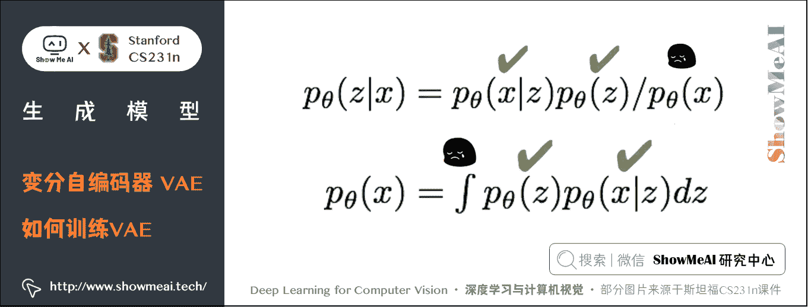

由于这个积分无法求解出来，因此我们没办法求第三项的梯度。幸运的是，由于第三项是一个 KL 散度，其恒大于等于 0 0 0，因此前两项的和是似然的一个下界。因此我们退而求其次，来最大化似然的下界，间接达到最大化似然的目的。

现在我们引入编码器网络来对 q ( z ∣ x ) q(z \mid x) q(z∣x) 建模，我们的训练框架如下：

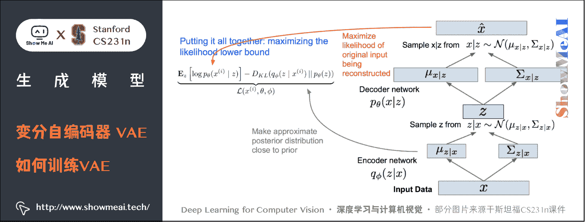

**如何得到下界**：

① 第 1 项是对所有采样的 z z z 取期望， z z z 是 x x x 经过编码器网络采样得到，对 z z z 采样然后再求所有 z z z 对应的 p ( x ∣ z ) p(x \mid z) p(x∣z) 。让 p ( x ∣ z ) p(x \mid z) p(x∣z) 变大，就是最大限度地重构数据。

② 第 2 项是让 KL 的散度变小，让我们的近似后验分布和先验分布变得相似，意味着我们想让隐变量 z 遵循我们期望的分布类型。

这个框架就非常类似于自编码器。

其中最大化下界的第一项表示我们要能从解码器最大概率地重构出 x x x ，这一步等价于去最小化与样本 x x x 的均方误差。最小化下界的第二项则限定了 z z z 要遵循我们事先给它指定的分布。

公式是我们要优化及最大化的下界，前向传播按如上流程处理，对输入数据 x x x ，让小批量的数据传递经过编码器网络的到 q ( z ∣ x ) q(z \mid x) q(z∣x) ，通过 q ( z ∣ x ) q(z \mid x) q(z∣x) 来计算 KL 项，然后根据给定 x x x 的 z z z 分布对 z z z 进行采样，由此获得了隐变量的样本，这些样本可以根据 x x x 推断获得；然后把 z z z 传递给第二个解码器网络，通过解码器网络 x x x 在给定 z z z 的条件下的两个参数，均值和协方差，最终可以在给定 z z z 的条件下从这个分布中采样得到 x x x 。

训练时需要获得该分布，损失项是给定 z z z 条件下对训练像素值取对数，损失函数要做的是最大化被重构的原始输入数据的似然；对于每一个小批量的输入我们都计算这一个前向传播过程，取得所有我们需要的项，他们都是可微分的，接下来把他们全部反向传播回去并获得梯度，不断更新我们的参数，包括生成器和解码器网络的参数 θ \theta θ 和 ϕ \phi ϕ 从而最大化训练数据的似然。

训练好变分自编码器，当生成数据时只需要用解码器网络，我们在训练阶段就对 z z z 采样，而不用从后验分布中采样，在生成阶段会从真实的生成过程中采样。先从设定好的先验分布中采样，接下来对数据 x x x 采样。

需要注意的是，这个框架里面，梯度无法通过「采样」这个算子反向传播到编码器网络，因此我们使用一种叫做重采样的 trick。即将 z z z 采样的算子分解为：

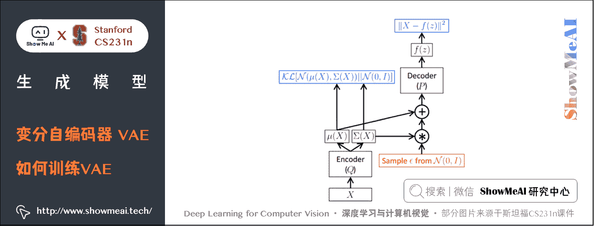

这样梯度不需要经过采样算子就能回流到编码器网络中。

### 4) VAE 的优缺点

总结一下，VAE 是在原来的自编码器上加了随机成分，我们使用 VAE 不是直接取得确定的输入 x x x 然后获得特征 z z z 最后再重构 x x x ，而是采用随机分布和采样的思想，这样我们就能生成数据。 为了训练模型 VAEs，我们定义了一个难解的密度分布，我们推导出一个下界然后优化下界，下界是变化的，「变分」指的是用近似来解决这些难解的表达式，这是模型被称为变分自动编码器的原因。

**VAEs 优点**

VAEs 就生成式模型来说是一种有据可循的方法，它使得查询推断称为可能，如此一来便能够推断出像 q ( z ∣ x ) q(z \mid x) q(z∣x) 这样的分布，这些东西对其他任务来说会是很有用的特征表征。

**VAEs 缺点**

最大化似然下界思想是 OK 的，但是不像 PixelRNN 和 PixelCNN 那样精准评估。而 VAE 相对后续会讲到的 GAN 等方法，生成的图像结果更模糊。

## 2.3 生成对抗网络(Generative Adversarial Nets, GAN)

### 1) GAN 的核心思路

我们之前的 PixelCNN 和 PixelRNN 定义了一个易于处理的密度函数，通过密度函数优化训练数据的似然；VAEs 有一个额外定义的隐变量 z z z ，有了 z z z 以后获得了很多的有利性质但是我们也有了一个难解的密度函数，对于该函数我们不能直接优化，我们推到了一个似然函数的下界，然后对它进行优化。

现在我们放弃显式地对密度函数建模，我们想要得到的是从分布中采样并获得质量良好的样本。GANs 中不再在显式的密度函数上花费精力，而是采用一个博弈论的方法，并且模型将会习得从训练分布中生成数据，具体的实现是基于「**生成器**」和「**判别器**」这一对博弈玩家。

相比变分自编码器，GAN 的核心思路非常简单。

在 GAN 中我们定义了两个网络：「**生成器**」和「**判别器**」。

*   判别器负责辨别哪些样本是生成器生成的假样本，哪些是从真实训练集中抽出来的真样本。
*   生成器负责利用随机噪声 z z z 生成假样本，它的职责是生成尽可能真的样本以骗过判别器。

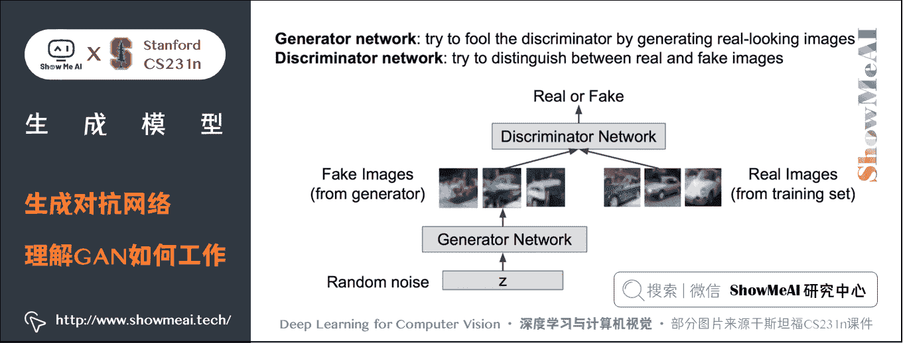

这种对抗形式的目标可以写成如下形式：

min ⁡ θ g max ⁡ θ d [ E x ∼ p data  log ⁡ D θ d ( x ) + E z ∼ p ( z ) log ⁡ ( 1 − D θ d ( G θ g ( z ) ) ) ] \min _{\theta_{g}} \max _{\theta_{d}}\left[\mathbb{E}_{x \sim p_{\text {data }}} \log D_{\theta_{d}}(x)+\mathbb{E}_{z \sim p(z)} \log \left(1-D_{\theta_{d}}\left(G_{\theta_{g}}(z)\right)\right)\right] θg​min​θd​max​[Ex∼pdata ​​logDθd​​(x)+Ez∼p(z)​log(1−Dθd​​(Gθg​​(z)))]

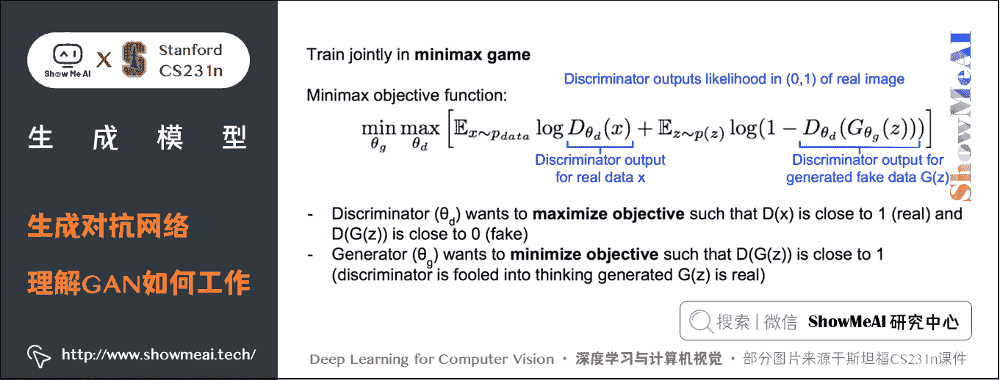

现在我们有两个玩家，通过一个 min ⁡ max ⁡ \min \max minmax 博弈公式联合训练这两个网络，该 min ⁡ max ⁡ \min \max minmax 目标函数就是如图所示的公式，我们的目标是：

*   **让目标函数在 θ g \theta_ g θg​ 上取得最小值，同时要在 θ d \theta_ d θd​ 上取得最大值。**
*   其中： θ g \theta_g θg​ 是生成器网络 g 的参数， θ d \theta_d θd​指的是判别器网络的参数。

**公式中各项的含义**：

*   第 1 项是在训练数据的分布上 l o g ( D ( x ) ) log(D(x)) log(D(x)) 的期望， l o g ( D ( x ) ) log(D(x)) log(D(x)) 是判别器网络在输入为真实数据（训练数据）时的输出，该输出是真实数据从分布 p-data 中采样的似然概率；
*   第 2 项是对 z z z 取期望， z z z 是从 p ( z ) p(z) p(z) 中采样获得的，这意味着从生成器网络中采样，同时 D ( G ( z ) ) D(G(z)) D(G(z)) 这一项代表了以生成的伪数据为输入判别器网路的输出，也就是判别器网络对于生成网络生成的数据给出的判定结果。

**对该过程的解释**：我们的判别器的目的是最大化目标函数也就是在 θ d \theta_d θd​ 上取最大值，这样一来 D ( x ) D(x) D(x) 就会接近 1，也就是使判别结果接近真，因而该值对于真实数据应该相当高，这样一来 D ( G ( z ) ) D(G(z)) D(G(z)) 的值也就是判别器对伪造数据输出就会相应减小，我们希望这一值接近于 0 0 0。

如果我们能最大化这一结果，就意味着判别器能够很好的区别真实数据和伪造数据。

> 对于生成器来说，我们希望它最小化该目标函数，也就是让 D ( G ( z ) ) D(G(z)) D(G(z)) 接近 1 1 1，如果 D ( G ( z ) ) D(G(z)) D(G(z)) 接近 1 1 1，那么用 1 1 1 减去它就会很小，判别器网络就会把伪造数据视为真实数据，也就意味着我们的生成器在生成真实样本。

从数据准备上看，整个过程是一个无监督学习，我们无需人工给每个图片打上标签。具体网络学习时候，我们会把生成器生成的图片标记为 0 0 0（对应假图片），训练集标记为 1 1 1（都是真图片）。

判别器的损失函数会使用上述信息，判别器是一个分类器，我们希望它能经过训练获得分辨能力：对生成器生成的图片输出 0 0 0，而对真实图片输出 1 1 1。

### 训练方法

对于 GAN，我们最初能想到的训练方式如下：

① 对判别器进行梯度上升，学习到 θ d \theta_d θd​ 来最大化该目标函数；

max ⁡ θ d [ E x ∼ p data  log ⁡ D θ d ( x ) + E z ∼ p ( z ) log ⁡ ( 1 − D θ d ( G θ g ( z ) ) ) ] \max _{\theta_{d}}\left[\mathbb{E}_{x \sim p_{\text {data }}} \log D_{\theta_{d}}(x)+\mathbb{E}_{z \sim p(z)} \log \left(1-D_{\theta_{d}}\left(G_{\theta_{g}}(z)\right)\right)\right] θd​max​[Ex∼pdata ​​logDθd​​(x)+Ez∼p(z)​log(1−Dθd​​(Gθg​​(z)))]

② 对生成器进行梯度下降， θ g \theta_g θg​ 进行梯度下降最小化目标函数（此时目标函数如下的部分，因为只有它与 θ g \theta_g θg​ 有关）

min ⁡ θ g E z ∼ p ( z ) log ⁡ ( 1 − D θ d ( G θ g ( z ) ) ) \min _{\theta_{g}} \mathbb{E}_{z \sim p(z)} \log \left(1-D_{\theta_{d}}\left(G_{\theta_{g}}(z)\right)\right) θg​min​Ez∼p(z)​log(1−Dθd​​(Gθg​​(z)))

不断在上述 ① 和 ② 之间重复。

这里有个 trick：我们观察生成器的损失函数形状如下：

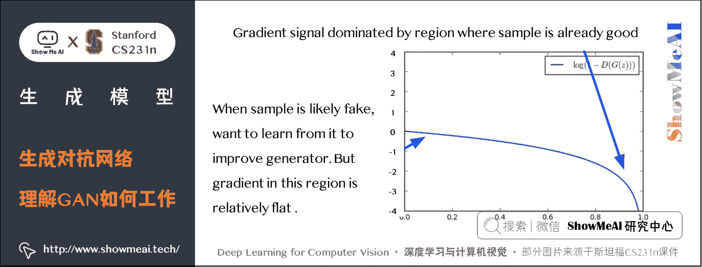

发现当生成器效果不好（ D ( G ( z ) D(G(z) D(G(z) 接近 0 0 0）时，梯度非常平缓；当生成器效果好（ D ( G ( z ) D(G(z) D(G(z)接近 1 1 1）时，梯度很陡峭。这就与我们期望的相反了，我们希望在生成器效果不好的时候梯度更陡峭，这样能学到更多。因此我们使用下面的目标函数来替代原来的生成器损失：

max ⁡ θ g E z ∼ p ( z ) log ⁡ ( D θ d ( G θ g ( z ) ) ) \max _{\theta_{g}} \mathbb{E}_{z \sim p(z)} \log \left(D_{\theta_{d}}\left(G_{\theta_{g}}(z)\right)\right) θg​max​Ez∼p(z)​log(Dθd​​(Gθg​​(z)))

这样就使得在生成器效果不好时具有较大的梯度。此外，联合训练两个网络很有挑战，交替训练的方式不可能一次训练两个网络，还有损失函数的函数空间会影响训练的动态过程。

在每一个训练迭代期都先训练判别器网络，然后训练生成器网络，**GAN 的总体训练过程**如下：

*   **训练判别器**

    *   对于判别器网络的 k 个训练步，先从噪声先验分布 z z z 中采样得到一个小批量样本，接着从训练数据 x x x 中采样获得小批量的真实样本，下面要做的将噪声样本传给生成器网络，并在生成器的输出端获得生成的图像。
*   此时我们有了一个小批量伪造图像和小批量真实图像，我们有这些小批量数据在判别器生进行一次梯度计算，接下来利用梯度信息更新判别器参数，按照以上步骤迭代几次来训练判别器。

*   **训练生成器**

    *   在这一步采样获得一个小批量噪声样本，将它传入生成器，对生成器进行反向传播，来优化目标函数。

训练 GAN 的过程会交替进行上述两个步骤。

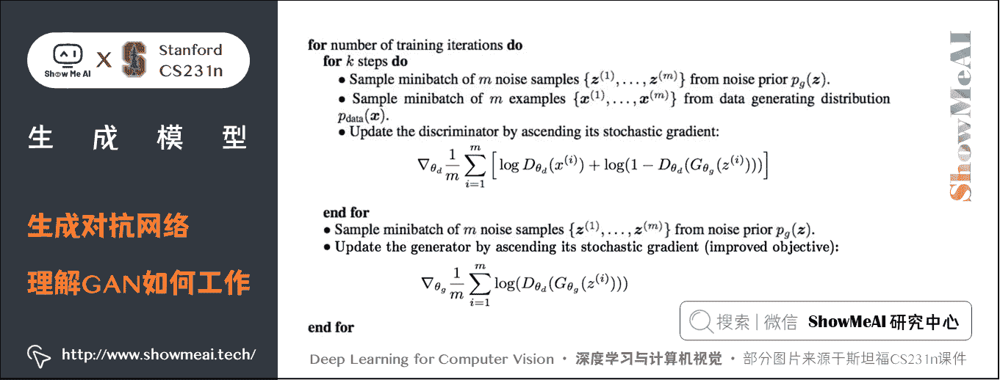

训练完毕后，就可以用生成器来生成比较逼真的样本了。

### 2) GAN 的探索

*   传统的 GAN 生成的样本还不是很好，这篇论文在 GAN 中使用了 CNN 架构，取得了惊艳的生成效果：[Radford et al, “Unsupervised Representation Learning with Deep Convolutional Generative Adversarial Networks”, ICLR 2016]
*   Wasserstein GAN 一定程度解决了 GAN 训练中两个网络如何平衡的问题。
*   用 GAN 来做 text -> image

### 3) GAN 的优缺点以及热门研究方向

### GAN 的优点

*   GAN 通过一种博弈的方法来训练，通过两个玩家的博弈从训练数据的分布中学会生成数据。
*   GAN 可以生成目前最好的样本，还可以做很多其他的事情。

### GAN 的缺点

*   GAN 没有显式的密度函数（它是利用样本来隐式表达该函数）
*   GAN 不好训练且不稳定，我们并不是直接优化目标函数，我们要努力地平衡两个网络。

### GAN 的热门研究方法

*   更好的损失函数设计，更稳定的训练方式（例如 Wasserstein GAN, LSGAN 及其他）
*   条件 GAN，GAN 的各种应用领域探索

# 3.拓展学习

**可以点击 [**B 站**](https://www.bilibili.com/video/BV1g64y1B7m7?p=13) 查看视频的【双语字幕】版本**

[`player.bilibili.com/player.html?aid=759478950&page=13`](https://player.bilibili.com/player.html?aid=759478950&page=13)

【字幕+资料下载】斯坦福 CS231n | 面向视觉识别的卷积神经网络 (2017·全 16 讲)

*   [【课程学习指南】斯坦福 CS231n | 深度学习与计算机视觉](http://blog.showmeai.tech/cs231n/)
*   [【字幕+资料下载】斯坦福 CS231n | 深度学习与计算机视觉 (2017·全 16 讲)](https://www.bilibili.com/video/BV1g64y1B7m7)
*   [【CS231n 进阶课】密歇根 EECS498 | 深度学习与计算机视觉](http://blog.showmeai.tech/eecs498/)
*   [【深度学习教程】吴恩达专项课程 · 全套笔记解读](http://www.showmeai.tech/tutorials/35)
*   [【Stanford 官网】CS231n: Deep Learning for Computer Vision](http://cs231n.stanford.edu/)

# 4.要点总结

本篇讲了三种目前最常用生成模型：

*   PixelCNN 和 PixelRNN 他们是显式密度模型，该模型优化的是一个显式的似然函数并产生良好的样本，但是效率很低，它是一个顺序的生成过程。
*   VAE 优化的是一个似然函数的下界，它会产生一个有用的隐式表征，可以用它来进行查询推断，生成的样本也不是特别好。
*   GAN 是目前能生成最好样本的模型，但是训练需要技巧且不稳定，查询推断上也有一些问题。
*   还有一些将模型的优点结合起来做的研究。

# [ShowMeAI](http://www.showmeai.tech) 斯坦福 CS231n 全套解读

*   [深度学习与计算机视觉教程(1) | CV 引言与基础 @CS231n](http://www.showmeai.tech/article-detail/260)
*   [深度学习与计算机视觉教程(2) | 图像分类与机器学习基础 @CS231n](http://www.showmeai.tech/article-detail/261)
*   [深度学习与计算机视觉教程(3) | 损失函数与最优化 @CS231n](http://www.showmeai.tech/article-detail/262)
*   [深度学习与计算机视觉教程(4) | 神经网络与反向传播 @CS231n](http://www.showmeai.tech/article-detail/263)
*   [深度学习与计算机视觉教程(5) | 卷积神经网络 @CS231n](http://www.showmeai.tech/article-detail/264)
*   [深度学习与计算机视觉教程(6) | 神经网络训练技巧 (上) @CS231n](http://www.showmeai.tech/article-detail/265)
*   [深度学习与计算机视觉教程(7) | 神经网络训练技巧 (下) @CS231n](http://www.showmeai.tech/article-detail/266)
*   [深度学习与计算机视觉教程(8) | 常见深度学习框架介绍 @CS231n](http://www.showmeai.tech/article-detail/267)
*   [深度学习与计算机视觉教程(9) | 典型 CNN 架构 (Alexnet, VGG, Googlenet, Restnet 等) @CS231n](http://www.showmeai.tech/article-detail/268)
*   [深度学习与计算机视觉教程(10) | 轻量化 CNN 架构 (SqueezeNet, ShuffleNet, MobileNet 等) @CS231n](http://www.showmeai.tech/article-detail/269)
*   [深度学习与计算机视觉教程(11) | 循环神经网络及视觉应用 @CS231n](http://www.showmeai.tech/article-detail/270)
*   [深度学习与计算机视觉教程(12) | 目标检测 (两阶段, R-CNN 系列) @CS231n](http://www.showmeai.tech/article-detail/271)
*   [深度学习与计算机视觉教程(13) | 目标检测 (SSD, YOLO 系列) @CS231n](http://www.showmeai.tech/article-detail/272)
*   [深度学习与计算机视觉教程(14) | 图像分割 (FCN, SegNet, U-Net, PSPNet, DeepLab, RefineNet) @CS231n](http://www.showmeai.tech/article-detail/273)
*   [深度学习与计算机视觉教程(15) | 视觉模型可视化与可解释性 @CS231n](http://www.showmeai.tech/article-detail/274)
*   [深度学习与计算机视觉教程(16) | 生成模型 (PixelRNN, PixelCNN, VAE, GAN) @CS231n](http://www.showmeai.tech/article-detail/275)
*   [深度学习与计算机视觉教程(17) | 深度强化学习 (马尔可夫决策过程, Q-Learning, DQN) @CS231n](http://www.showmeai.tech/article-detail/276)
*   [深度学习与计算机视觉教程(18) | 深度强化学习 (梯度策略, Actor-Critic, DDPG, A3C) @CS231n](http://www.showmeai.tech/article-detail/277)

# [ShowMeAI](http://www.showmeai.tech) 系列教程推荐

*   [大厂技术实现：推荐与广告计算解决方案](http://www.showmeai.tech/tutorials/50)
*   [大厂技术实现：计算机视觉解决方案](http://www.showmeai.tech/tutorials/51)
*   [大厂技术实现：自然语言处理行业解决方案](http://www.showmeai.tech/tutorials/52)
*   [图解 Python 编程：从入门到精通系列教程](http://www.showmeai.tech/tutorials/56)
*   [图解数据分析：从入门到精通系列教程](http://www.showmeai.tech/tutorials/33)
*   [图解 AI 数学基础：从入门到精通系列教程](http://www.showmeai.tech/tutorials/83)
*   [图解大数据技术：从入门到精通系列教程](http://www.showmeai.tech/tutorials/84)
*   [图解机器学习算法：从入门到精通系列教程](http://www.showmeai.tech/tutorials/34)
*   [机器学习实战：手把手教你玩转机器学习系列](http://www.showmeai.tech/tutorials/41)
*   [深度学习教程：吴恩达专项课程 · 全套笔记解读](http://www.showmeai.tech/tutorials/35)
*   [自然语言处理教程：斯坦福 CS224n 课程 · 课程带学与全套笔记解读](http://www.showmeai.tech/tutorials/36)
*   [深度学习与计算机视觉教程：斯坦福 CS231n · 全套笔记解读](http://www.showmeai.tech/tutorials/37)

