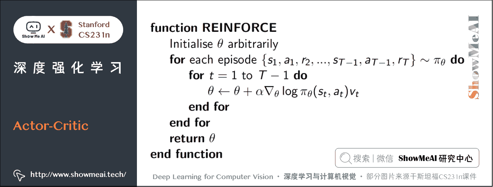
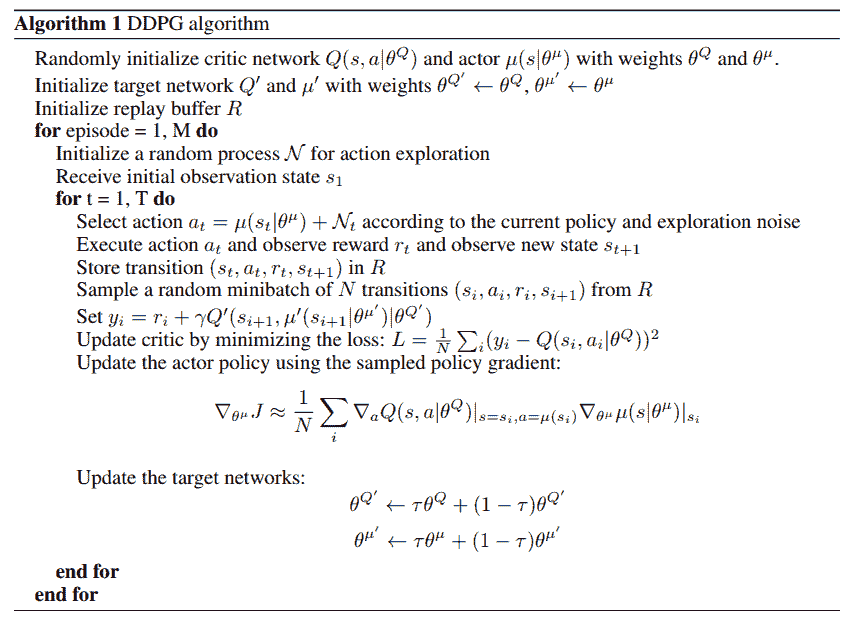
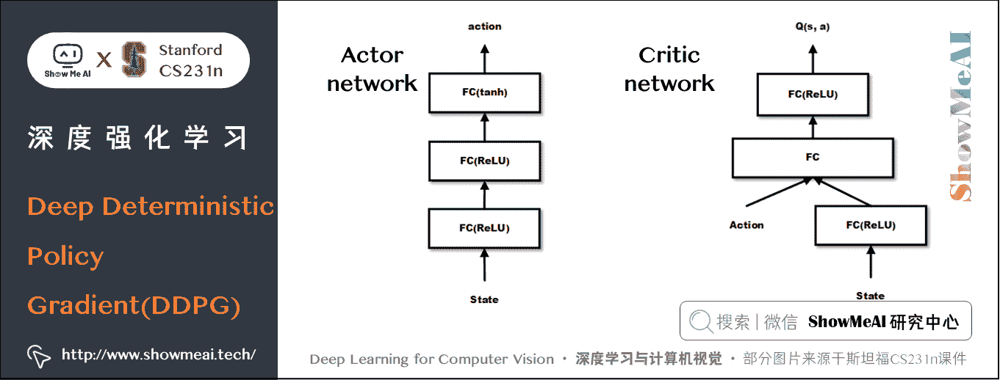
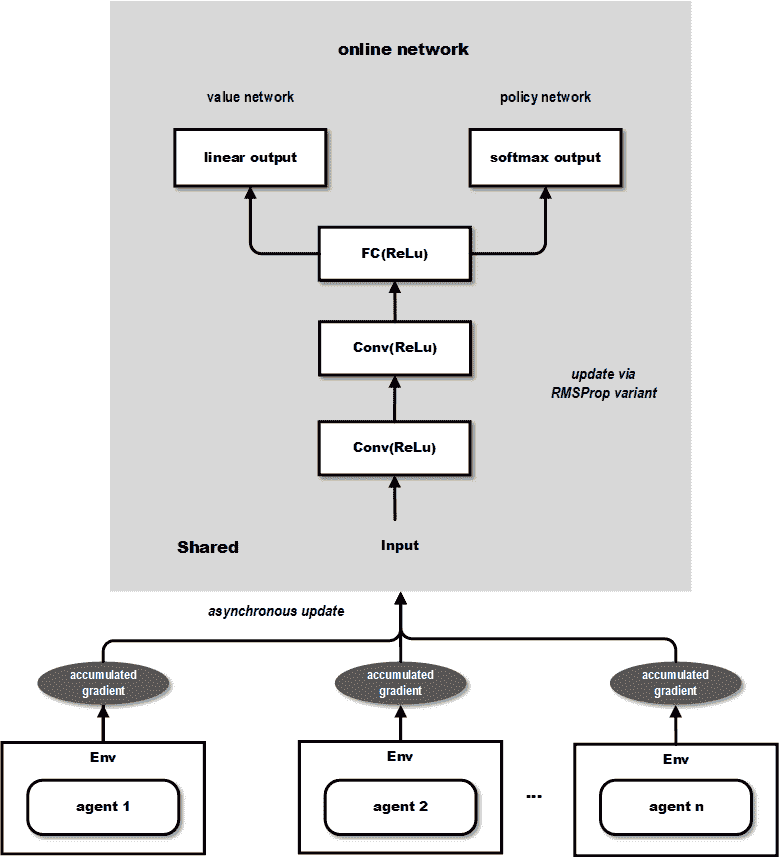

# 深度学习与计算机视觉教程(18) | 深度强化学习 (梯度策略,Actor-Critic,DDPG,A3C)（CV 通关指南·完结）

> 原文：[`blog.csdn.net/ShowMeAI/article/details/125249798`](https://blog.csdn.net/ShowMeAI/article/details/125249798)

*   作者：[韩信子](https://github.com/HanXinzi-AI)@[ShowMeAI](http://www.showmeai.tech/)
*   [教程地址](http://www.showmeai.tech/tutorials/37)：[`www.showmeai.tech/tutorials/37`](http://www.showmeai.tech/tutorials/37)
*   [本文地址](http://www.showmeai.tech/article-detail/277)：[`www.showmeai.tech/article-detail/277`](http://www.showmeai.tech/article-detail/277)
*   声明：版权所有，转载请联系平台与作者并注明出处
*   **收藏[ShowMeAI](http://www.showmeai.tech/)查看更多精彩内容**

* * *

本系列为 **斯坦福 CS231n** 《深度学习与计算机视觉(Deep Learning for Computer Vision)》的全套学习笔记，对应的课程视频可以在 [**这里**](https://www.bilibili.com/video/BV1g64y1B7m7?p=14) 查看。更多资料获取方式见文末。

* * *

# 引言

前一篇 ShowMeAI 的文章 [**深度学习与计算机视觉教程(17) | 深度强化学习 (马尔可夫决策过程, Q-Learning, DQN)**](http://www.showmeai.tech/article-detail/276) 中，我们学习了 Q-Learning 系列方法，它是基于价值（value-based）的方法， 也就是通过计算每一个状态动作的价值，然后选择价值最大的动作执行。

这是一种间接的强化学习建模做法，另外一类 policy-based 方法会直接更新策略。本篇我们将顺着这条主线给大家介绍 Policy Gradient 等方法，当然，强化学习中还有结合 policy-based 和 value-based 的 Actor-Critic 方法，以及在 Actor-Critic 基础上的 DDPG、A3C 方法。

## 本篇重点

*   Policy Gradient 算法
*   Actor-Critic 算法
*   DDPG 算法
*   A3C 算法

# 1.Policy Gradient 算法

## 1.1 算法介绍

Policy Gradient 是最基础的强化学习算法之一，它通过更新 策略网络/Policy Network 来直接更新策略的。Policy Network 是一个神经网络，**输入是状态，输出直接就是动作（不是 Q 值）** ，且一般输出有两种方式：

*   ① 概率的方式，即输出某一个动作的概率。
*   ② 确定性的方式，即输出具体的某一个动作。

如果要更新 Policy Network 策略网络，或者说要使用梯度下降的方法来更新网络，需要有一个目标函数，对于所有强化学习的任务来说，最终目标都是使所有累加 reward/奖励（带衰减）最大。如下公式所示：

L ( θ ) = E ( r 1 + γ r 2 + γ 2 r 3 + … ∣ π ( , θ ) ) L(\theta) = \mathbb E(r_1+\gamma r_2 + \gamma² r_3 + … \mid \pi(,\theta)) L(θ)=E(r1​+γr2​+γ2r3​+…∣π(,θ))

但上述损失函数和 Policy Network 策略网络无法直接关联：reward 是环境给出的，无法基于参数 θ \theta θ 计算得到。假如我们后续优化还是基于「梯度下降」等算法，那损失函数关于参数的梯度 ∇ θ L ( θ ) \nabla_{\theta} L(\theta) ∇θ​L(θ) 如何得到呢？

我们换一个思路来考虑：假如我们现在有一个策略网络，输入状态，输出动作的概率。然后执行完动作之后，我们可以得到 reward，或者 result。

我们可以采取 1 个非常直观简单的做法：**增大得到 reward 多的动作的输出概率，减小得到 reward 少的动作的输出概率**。

但是大家可能会注意到：用 reward 或 result 来评判动作好坏可能是不准确的（因为任何一个 reward，result 都依赖于大量的动作才导致的，不能只将功劳或过错归于当前的动作上）。

我们的处理思路改为：**我们构造一个判断动作好坏的「评判指标」，再通过改变动作的出现概率来优化策略！**

假设这个评价指标是 f ( s , a ) f(s,a) f(s,a)，我们的策略网络输出的 π ( a ∣ s , θ ) \pi(a|s,\theta) π(a∣s,θ) 是概率，那么可以通过极大似然估计的方法来优化这个目标。比如说我们可以构造如下目标函数：

L ( θ ) = ∑ l o g π ( a ∣ s , θ ) f ( s , a ) L(\theta) = \sum log\pi(a|s,\theta)f(s,a) L(θ)=∑logπ(a∣s,θ)f(s,a)

举例来说，对某场游戏来说，假如最终赢了，那么认为这局游戏中每一步都是好的，如果输了，那么认为都是不好的。好的 f ( s , a ) f(s,a) f(s,a) 就是 1 1 1，不好的就是 − 1 -1 −1，然后极大化上面的目标函数即可。

实际上，除了极大化上面的目标函数，还可以直接对 f ( s , a ) f(s,a) f(s,a) 进行极大化，如这篇博文 [Deep Reinforcement Learning: Pong from Pixels](http://karpathy.github.io/2016/05/31/rl/) 中直接最大化 f ( x ) f(x) f(x) 也就是 f ( s , a ) f(s, a) f(s,a) 的期望，可以看到，最后的结果跟上面的目标函数是一致的。

∇ θ E x [ f ( x ) ] = ∇ θ ∑ x p ( x ) f ( x )  定义期望  = ∑ x ∇ θ p ( x ) f ( x )  把「求和」挪至前方  = ∑ x p ( x ) ∇ θ p ( x ) p ( x ) f ( x )  公式变化，乘除  p ( x ) = ∑ x p ( x ) ∇ θ log ⁡ p ( x ) f ( x )  基于求导公式  ∇ θ log ⁡ ( z ) = 1 z ∇ θ z = E x [ f ( x ) ∇ θ log ⁡ p ( x ) ] 期望的定义 \begin{aligned} \nabla_{\theta} E_{x}[f(x)] & =\nabla_{\theta} \sum_{x} p(x) f(x) & \text { 定义期望 } \\ & =\sum_{x} \nabla_{\theta} p(x) f(x) & \text { 把「求和」挪至前方 } \\ & =\sum_{x} p(x) \frac{\nabla_{\theta} p(x)}{p(x)} f(x) & \text { 公式变化，乘除 } p(x) \\ & =\sum_{x} p(x) \nabla_{\theta} \log p(x) f(x) & \text { 基于求导公式 } \nabla_{\theta} \log (z)=\frac{1}{z} \nabla_{\theta} z \\ & =E_{x}\left[f(x) \nabla_{\theta} \log p(x)\right] & \text {期望的定义} \end{aligned} ∇θ​Ex​[f(x)]​=∇θ​x∑​p(x)f(x)=x∑​∇θ​p(x)f(x)=x∑​p(x)p(x)∇θ​p(x)​f(x)=x∑​p(x)∇θ​logp(x)f(x)=Ex​[f(x)∇θ​logp(x)]​ 定义期望  把「求和」挪至前方  公式变化，乘除 p(x) 基于求导公式 ∇θ​log(z)=z1​∇θ​z 期望的定义​

## 1.2 PG 评判指标的选择

从上文中可以看出来，**Policy Gradient 中评价指标 f ( s , a ) f(s,a) f(s,a) 的定义是关键**。 我们前面提到的「根据回合的输赢来判断这个回合中的每 1 步好坏」的方式比较粗糙简单。但其实我们更希望每走 1 步就能够获取到这一步的具体评价，因此出现了很多其他的直接给出某个时刻的评估的评价方式。如这篇论文 [High-dimensional continuous control using generalized advantage estimation](https://arxiv.org/abs/1506.02438) 里就对比了若干种 PG 评价指标。

## 1.3 梯度策略算法总结

借用 David Silver 老师讲解梯度策略算法时候的一页核心 PPT 内容，翻译作为梯度策略算法的总结。Policy gradient 通过不断重复估测梯度 g : = ∇ θ E [ ∑ t = 0 ∞ r t ] g:=\nabla_{\theta} \mathbb{E}\left[\sum_{t=0}^{\infty} r_{t}\right] g:=∇θ​E[∑t=0∞​rt​] 来最大化期望收益，有几种不同的梯度策略形式，我们可以统一写成：

g = E [ ∑ t = 0 ∞ Ψ t ∇ θ log ⁡ π θ ( a t ∣ s t ) ] g=\mathbb{E}\left[\sum_{t=0}^{\infty} \Psi_{t} \nabla_{\theta} \log \pi_{\theta}\left(a_{t} \mid s_{t}\right)\right] g=E[t=0∑∞​Ψt​∇θ​logπθ​(at​∣st​)]

上面公式中的 Ψ t \Psi_t Ψt​ 就是 t t t 时刻的评价指标。它可能是如下的形态：

*   ① ∑ t = 0 ∞ r t \sum_{t=0}^{\infty} r_{t} ∑t=0∞​rt​：整个过程总体 reward 收益

*   ② ∑ t ′ = t ∞ r t ′ \sum_{t^{\prime}=t}^{\infty} r_{t^{\prime}} ∑t′=t∞​rt′​：动作 a t a_{t} at​ 之后的收益

*   ③ ∑ t ′ = t ∞ r t ′ − b ( s t ) \sum_{t^{\prime}=t}^{\infty} r_{t^{\prime}}-b\left(s_{t}\right) ∑t′=t∞​rt′​−b(st​)：前序公式的基线版本

*   ④ Q π ( s t , a t ) Q^{\pi}\left(s_{t}, a_{t}\right) Qπ(st​,at​)：state-action 价值函数

*   ⑤ A π ( s t , a t ) A^{\pi}\left(s_{t}, a_{t}\right) Aπ(st​,at​)：advantage function/优势函数

*   ⑥ r t + V π ( s t + 1 ) − V π ( s t ) r_{t}+V^{\pi}\left(s_{t+1}\right)-V^{\pi}\left(s_{t}\right) rt​+Vπ(st+1​)−Vπ(st​) ：TD residual/时序差分残差

更具体的一些公式如下：

V π ( s t ) : = E s t + 1 : ∞ , [ ∑ l = 0 ∞ r t + l ] V^{\pi}\left(s_{t}\right):=\mathbb{E} s_{t+1: \infty},\left[\sum_{l=0}^{\infty} r_{t+l}\right] Vπ(st​):=Est+1:∞​,[l=0∑∞​rt+l​]

Q π ( s t , a t ) : = E a t + 1 : ∞ a t + 1 : ∞ [ ∑ l = 0 ∞ r t + l ] Q^{\pi}\left(s_{t}, a_{t}\right):=\mathbb{E}_{a_{t+1: \infty}}^{a_{t+1: \infty}}\left[\sum_{l=0}^{\infty} r_{t+l}\right] Qπ(st​,at​):=Eat+1:∞​at+1:∞​​[l=0∑∞​rt+l​]

A π ( s t , a t ) : = Q π ( s t , a t ) − V π ( s t ) ( A d v a n t a g e f u n c t i o n ) A^{\pi}\left(s_{t}, a_{t}\right):=Q^{\pi}\left(s_{t}, a_{t}\right)-V^{\pi}\left(s_{t}\right)\quad (Advantage function) Aπ(st​,at​):=Qπ(st​,at​)−Vπ(st​)(Advantagefunction)

在梯度策略里我们可以使用 reward，使用 Q Q Q、 A A A 或者 T D TD TD 来作为动作的评价指标。这些方法的本质区别在于 variance 和 bias 的问题：

**用 reward 来作为动作的评价**：

*   这样做 bias 比较低，不过 variance 很大，reward 值太不稳定，训练可能不收敛。

**采用 Q Q Q 值的方法**：

*   因为 Q Q Q 值是对 reward 的期望值，使用 Q Q Q 值 variance 比较小，bias 比较大。一般我们会选择使用 A A A，Advantage。 A = Q − V A=Q-V A=Q−V，是一个动作相对当前状态的价值。本质上 V V V 可以看做是 baseline。对于上面 ③ 的公式，也可以直接用 V V V 来作为 baseline。
*   但是还是一样的问题， A A A 的 variance 比较大。为了平衡 variance 和 bias 的问题，使用 T D TD TD 会是比较好的做法，既兼顾了实际值 reward，又使用了估计值 V V V。在 T D TD TD 中， T D ( l a m b d a ) TD(lambda) TD(lambda) 平衡不同长度的 T D TD TD 值，会是比较好的做法。

在实际使用中，需要根据具体的问题选择不同的方法。有的问题 reward 很容易得到，有的问题 reward 非常稀疏。reward 越稀疏，也就越需要采用估计值。

**总结一下 Policy Gradient 的核心思想：**

通过 policy network 输出的 Softmax 概率 和获取的 reward （通过评估指标获取）构造目标函数，然后对 policy network 进行更新。

梯度策略避免了原来的 reward 和 policy network 之间是不可微的问题。也因为它这个特点，目前的很多传统监督学习的问题因为输出都是 Softmax 的离散形式，都可以改造成 Policy Gradient 的方法来实现，调节得当效果会在监督学习的基础上进一步提升。

# 2.Actor-Critic 算法

在 policy gradient 中讲解到的多种评估指标已经涵盖了下面要介绍的 Actor-Critic 的思想，梯度策略算法往往采用回合更新的模式，即每轮结束后才能进行更新。

> 如某盘游戏，假如最后的结果是胜利了，那么可以认为其中的每一步都是好的，反之则认为其中的每一步都是不好的。

下图摘自 [David Silver 老师的强化学习 Policy Gradient 讲解课件](https://www.davidsilver.uk/wp-content/uploads/2020/03/pg.pdf) ，这种方法也叫 Monte-Carlo Policy Gradient

上图中的 log ⁡ π θ ( s t , a t ) \log \pi_{\theta}(s_t, a_t) logπθ​(st​,at​) 是 policy network 输出的概率， v t v_t vt​ 是当前这一局的结果。这是 policy gradient 最基本的更新形式。

但我们前面也分析了：最后的结果好久并不能说明其中每一步都好。我们能不能抛弃回合更新的做法，加快到单步更新呢，Actor-Critic 算法就做了这个调整。

但要采用单步更新，我们就需要为每一步都即时做出评估。Actor-Critic 算法中的 Critic 负责的就是评估这部分工作，而 Actor 则是负责选择出要执行的动作。这就是 Actor-Critic 的思想。Critic 的输出有多种形式，可以采用 Q Q Q 值、 V V V 值 或 T D TD TD 等。

**总结一下 Actor-Critic 算法核心思想：**

在 Actor-Critic 算法中，Critic 是评判模块（多采用深度神经网络方法），它会对动作的好坏评价，然后反馈给 Actor（多采用深度神经网络方法），让 Actor 更新策略。

从具体的训练细节来说，Actor 和 Critic 分别采用不同的目标函数进行更新， 可以参考的代码实现如[**这里**](https://keras.io/examples/rl/actor_critic_cartpole/）。

# 3.DDPG 算法（Deep Deterministic Policy Gradient）

对于 action 动作个数是离散和有限的情况，我们前面提到的 Policy Gradient 梯度策略算法是 OK 的，但有些情况下输出的值是连续的，比如说「自动驾驶控制的速度」，「机器人控制移动的幅度」，「游戏中调整的角度」等，那梯度策略就不管用了。

在 [Deterministic Policy Gradient Algorithms](http://proceedings.mlr.press/v32/silver14.pdf) 这篇论文中提出了输出连续动作值的 DPG（Deterministic Policy Gradient），之后论文 [Continuous control with deep reinforcement learning](https://arxiv.org/abs/1509.02971) 基于 DPG 做了改进，提出了 DDPG（Deep Deterministic Policy Gradient）算法。

DPG 算法主要证明了 deterministic policy gradient 不仅存在，而且是 model-free 形式且是 action-value function 的梯度。因此 policy 不仅仅可以通过概率分布表示，动作空间可以无限大。

DDPG 相对于 DPG 的核心改进是引入了 Deep Learning，采用深度神经网络作为 DPG 中的 Policy 策略函数 μ \mu μ 和 Q Q Q 函数的模拟，即 Actor 网络和 Critic 网络；然后使用深度学习的方法来训练上述神经网络。DDPG 与 DPG 的关系类似于 DQN 与 Q-learning 的关系。

DDPG 算法中有 2 个网络：「Actor 网络」与 「Critic 网络」：

*   ① 对于状态 s s s，基于 Actor 网络获取动作 action a a a（这里的 a a a 是一个向量）
*   ② 将 a a a 输入 Critic 网络，得到 Q Q Q 值（输出），目标函数就是极大化 Q Q Q 值

具体的「Actor 网络」和 「Critic 网络」更新有一差异，DDPG 论文中算法流程如下图所示：

如上图，Actor 网络和 Critic 网络是分开训练的，但两者的输入输出存在联系，Actor 网络输出的 action 是 Critic 网络的输入，同时 Critic 网络的输出会被用到 Actor 网络进行反向传播。

两个网络的参考示意图如下：Critic 跟之前提到的 DQN 有点类似，但是这里的输入是 state + action，输出是一个 Q Q Q 值而不是各个动作的 Q Q Q 值。

在 DDPG 算法中，我们不再用单一的概率值表示某个动作，而是用向量表示某个动作，由于向量空间可以被认为是无限的，因此也能够跟无限的动作空间对应起来。DDPG 的代码实现可以参考 [**这里**](https://keras.io/examples/rl/ddpg_pendulum/)。

# 4.A3C 算法（Asynchronous Advantage Actor-Critic）

DDPG 算法之后，DeepMind 对其改造，提出了效果更好的 Asynchronous Advantage Actor-Critic（A3C）算法（论文是 [Asynchronous Methods for Deep Reinforcement Learning](https://arxiv.org/pdf/1602.01783.pdf) ）。A3C 算法和 DDPG 类似，通过深度神经网络拟合 policy function 和 value function 的估计。改进点在于：

*   ① A3C 中有多个 agent 对网络进行异步更新，这样的做法使得样本间的相关性较低，A3C 中也无需采用 Experience Replay 的机制，且支持在线的训练模式。
*   ② A3C 有两个输出，其中一个 Softmax output 作为 policy π ( a t ∣ s t ; θ ) \pi(a_t|s_t;\theta) π(at​∣st​;θ)，而另一个 linear output 为 value function V ( s t ; θ v ) V(s_t;\theta_v) V(st​;θv​) 。
*   ③ A3C 中的 Policy network 的评估指标采用的是上面比较了多种评估指标的论文中提到的 Advantage Function（即 A 值) 而不是 DDPG 中单纯的 Q Q Q 值。

下图（摘自 [这篇文章](https://blog.csdn.net/jinzhuojun/article/details/72851548) ）展示了其网络结构：

从上图可以看出输出包含 2 个部分，value network 的部分可以用来作为连续动作值的输出，而 policy network 可以作为离散动作值的概率输出，因此能够同时解决前面提到的 2 类问题。

两个网络的更新公式如下：

*   **Estimate state-value function**

V ( s , v ) ≈ E [ r t + 1 + γ r t + 2 + … ∣ s ] V(s, \mathbf{v}) \approx \mathbb{E}\left[r_{t+1}+\gamma r_{t+2}+\ldots \mid s\right] V(s,v)≈E[rt+1​+γrt+2​+…∣s]

*   **Q-value estimated by an n -step sample**

q t = r t + 1 + γ r t + 2 ⋯ + γ n − 1 r t + n + γ n V ( s t + n , v ) q_{t}=r_{t+1}+\gamma r_{t+2 \cdots}+\gamma^{n-1} r_{t+n}+\gamma^{n} V\left(s_{t+n}, \mathbf{v}\right) qt​=rt+1​+γrt+2⋯​+γn−1rt+n​+γnV(st+n​,v)

*   **Actor is updated towards target**

∂ I u ∂ u = ∂ log ⁡ π ( a t ∣ s t , u ) ∂ u ( q t − V ( s t , v ) ) \frac{\partial I_{u}}{\partial \mathbf{u}}=\frac{\partial \log \pi\left(a_{t} \mid s_{t}, \mathbf{u}\right)}{\partial \mathbf{u}}\left(q_{t}-V\left(s_{t}, \mathbf{v}\right)\right) ∂u∂Iu​​=∂u∂logπ(at​∣st​,u)​(qt​−V(st​,v))

*   **Critic is updated to minimise MSE w.r.t. Target**

I v = ( q t − V ( s t , v ) ) 2 I_{v}=\left(q_{t}-V\left(s_{t}, \mathbf{v}\right)\right)^{2} Iv​=(qt​−V(st​,v))2

A3C 通过创建多个 agent，在多个环境实例中并行且异步的执行和学习，有个潜在的好处是不那么依赖于 GPU 或大型分布式系统，实际上 A3C 可以跑在一个多核 CPU 上，而工程上的设计和优化也是原始 paper 的一个重点。

A3C 的代码实现可以参考[**这里**](https://www.jianshu.com/p/1fb73e012252)

# 5.算法总结

*   我们从最基础的**Policy Gradient 梯度策略**方法开始介绍，最基础的版本是「回合更新」的。
*   引入 Critic 后变成了「单步更新」，进而演变为**Actor-Critic**算法，其中 Critic 有多种可选的方法。
*   输出动作为连续值的情形，无法通过输出动作概率分布方式解决，因此提出了 **DPG** 和 **DDPG 算法**，DDPG 对 DPG 的改进在于引入深度神经网络去拟合 policy function 和 value function。
*   在 DDPG 基础上又提出了效果更好的 **A3C 算法**，这个方法在 DDPG 上引入了多个 agent 对网络进行 异步更新，不仅取得了更好的效果，而且降低了训练的代价。

# 6.拓展学习

**可以点击 [B 站](https://www.bilibili.com/video/BV1g64y1B7m7?p=15) 查看视频的【双语字幕】版本**

[`player.bilibili.com/player.html?aid=759478950&page=15`](https://player.bilibili.com/player.html?aid=759478950&page=15)

【字幕+资料下载】斯坦福 CS231n | 面向视觉识别的卷积神经网络 (2017·全 16 讲)

*   [【课程学习指南】斯坦福 CS231n | 深度学习与计算机视觉](http://blog.showmeai.tech/cs231n/)
*   [【字幕+资料下载】斯坦福 CS231n | 深度学习与计算机视觉 (2017·全 16 讲)](https://www.bilibili.com/video/BV1g64y1B7m7)
*   [【CS231n 进阶课】密歇根 EECS498 | 深度学习与计算机视觉](http://blog.showmeai.tech/eecs498/)
*   [【深度学习教程】吴恩达专项课程 · 全套笔记解读](http://www.showmeai.tech/tutorials/35)
*   [【Stanford 官网】CS231n: Deep Learning for Computer Vision](http://cs231n.stanford.edu/)

# 7.参考资料

*   [强化学习笔记(3)- 从 Policy Gradient 到 A3C](https://wulc.me/2018/05/11/%E5%BC%BA%E5%8C%96%E5%AD%A6%E4%B9%A0%E7%AC%94%E8%AE%B0%283%29-%20%E4%BB%8E%20Policy%20Gradient%20%E5%88%B0%20A3C/)
*   [深度增强学习之 Policy Gradient 方法 1](https://zhuanlan.zhihu.com/p/21725498)
*   [Deep Reinforcement Learning: Pong from Pixels](http://karpathy.github.io/2016/05/31/rl/)
*   [深度增强学习（DRL）漫谈 - 从 AC（Actor-Critic）到 A3C（Asynchronous Advantage Actor-Critic）](https://blog.csdn.net/jinzhuojun/article/details/72851548)
*   [深度强化学习（Deep Reinforcement Learning）入门：RL base & DQN-DDPG-A3C introduction](https://zhuanlan.zhihu.com/p/25239682)

# [ShowMeAI](http://www.showmeai.tech) 斯坦福 CS231n 全套解读

*   [深度学习与计算机视觉教程(1) | CV 引言与基础 @CS231n](http://www.showmeai.tech/article-detail/260)
*   [深度学习与计算机视觉教程(2) | 图像分类与机器学习基础 @CS231n](http://www.showmeai.tech/article-detail/261)
*   [深度学习与计算机视觉教程(3) | 损失函数与最优化 @CS231n](http://www.showmeai.tech/article-detail/262)
*   [深度学习与计算机视觉教程(4) | 神经网络与反向传播 @CS231n](http://www.showmeai.tech/article-detail/263)
*   [深度学习与计算机视觉教程(5) | 卷积神经网络 @CS231n](http://www.showmeai.tech/article-detail/264)
*   [深度学习与计算机视觉教程(6) | 神经网络训练技巧 (上) @CS231n](http://www.showmeai.tech/article-detail/265)
*   [深度学习与计算机视觉教程(7) | 神经网络训练技巧 (下) @CS231n](http://www.showmeai.tech/article-detail/266)
*   [深度学习与计算机视觉教程(8) | 常见深度学习框架介绍 @CS231n](http://www.showmeai.tech/article-detail/267)
*   [深度学习与计算机视觉教程(9) | 典型 CNN 架构 (Alexnet, VGG, Googlenet, Restnet 等) @CS231n](http://www.showmeai.tech/article-detail/268)
*   [深度学习与计算机视觉教程(10) | 轻量化 CNN 架构 (SqueezeNet, ShuffleNet, MobileNet 等) @CS231n](http://www.showmeai.tech/article-detail/269)
*   [深度学习与计算机视觉教程(11) | 循环神经网络及视觉应用 @CS231n](http://www.showmeai.tech/article-detail/270)
*   [深度学习与计算机视觉教程(12) | 目标检测 (两阶段, R-CNN 系列) @CS231n](http://www.showmeai.tech/article-detail/271)
*   [深度学习与计算机视觉教程(13) | 目标检测 (SSD, YOLO 系列) @CS231n](http://www.showmeai.tech/article-detail/272)
*   [深度学习与计算机视觉教程(14) | 图像分割 (FCN, SegNet, U-Net, PSPNet, DeepLab, RefineNet) @CS231n](http://www.showmeai.tech/article-detail/273)
*   [深度学习与计算机视觉教程(15) | 视觉模型可视化与可解释性 @CS231n](http://www.showmeai.tech/article-detail/274)
*   [深度学习与计算机视觉教程(16) | 生成模型 (PixelRNN, PixelCNN, VAE, GAN) @CS231n](http://www.showmeai.tech/article-detail/275)
*   [深度学习与计算机视觉教程(17) | 深度强化学习 (马尔可夫决策过程, Q-Learning, DQN) @CS231n](http://www.showmeai.tech/article-detail/276)
*   [深度学习与计算机视觉教程(18) | 深度强化学习 (梯度策略, Actor-Critic, DDPG, A3C) @CS231n](http://www.showmeai.tech/article-detail/277)

# [ShowMeAI](http://www.showmeai.tech) 系列教程推荐

*   [大厂技术实现：推荐与广告计算解决方案](http://www.showmeai.tech/tutorials/50)
*   [大厂技术实现：计算机视觉解决方案](http://www.showmeai.tech/tutorials/51)
*   [大厂技术实现：自然语言处理行业解决方案](http://www.showmeai.tech/tutorials/52)
*   [图解 Python 编程：从入门到精通系列教程](http://www.showmeai.tech/tutorials/56)
*   [图解数据分析：从入门到精通系列教程](http://www.showmeai.tech/tutorials/33)
*   [图解 AI 数学基础：从入门到精通系列教程](http://www.showmeai.tech/tutorials/83)
*   [图解大数据技术：从入门到精通系列教程](http://www.showmeai.tech/tutorials/84)
*   [图解机器学习算法：从入门到精通系列教程](http://www.showmeai.tech/tutorials/34)
*   [机器学习实战：手把手教你玩转机器学习系列](http://www.showmeai.tech/tutorials/41)
*   [深度学习教程：吴恩达专项课程 · 全套笔记解读](http://www.showmeai.tech/tutorials/35)
*   [自然语言处理教程：斯坦福 CS224n 课程 · 课程带学与全套笔记解读](http://www.showmeai.tech/tutorials/36)
*   [深度学习与计算机视觉教程：斯坦福 CS231n · 全套笔记解读](http://www.showmeai.tech/tutorials/37)

