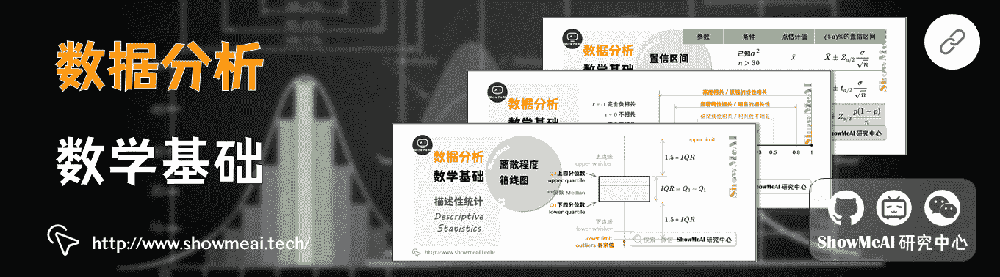
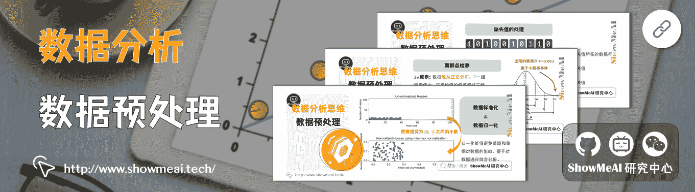
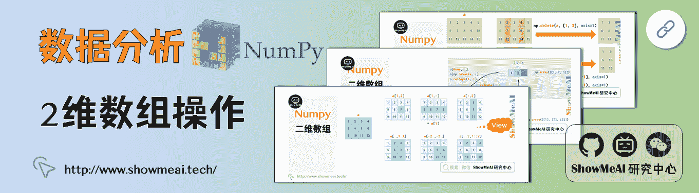
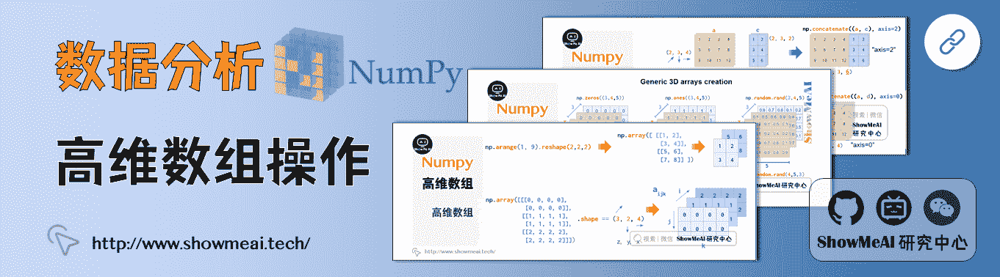

# 图解数据分析：从入门到精通系列教程

> 原文：[`blog.csdn.net/ShowMeAI/article/details/123124505`](https://blog.csdn.net/ShowMeAI/article/details/123124505)

作者：[韩信子](https://github.com/HanXinzi-AI)@[ShowMeAI](http://showmeai.tech/)
[教程地址](http://www.showmeai.tech/tutorials/33)：[`www.showmeai.tech/tutorials/33`](http://www.showmeai.tech/tutorials/33)
**声明：版权所有，转载请联系平台与作者并注明出处**

* * *

# 引言

[**本系列教程**](http://www.showmeai.tech/tutorials/33)是 ShowMeAI 组织的「图解数据分析」系列教程的入口。数据分析是一项应用非常广泛的技能，这套数据分析教程不同于其他文字版教程，我们以最直挂的「图示」对每个内容和关键点「可视化」，配以最精准精简的代码，让大家尽快入门。

教程内容：数据分析思维、数据分析的数学基础、数据分析流程（业务认知与数据初探、数据清洗与预处理、业务分析与数据挖掘）、数据分析工具、Numpy、Pandas、数据可视化（Pandas、Seaborn）。

# 教程地址

## [图解数据分析系列教程](http://www.showmeai.tech/tutorials/33)

# 内容章节

## [1.数据分析介绍](http://www.showmeai.tech/article-detail/133)

## [2.数据分析思维](http://www.showmeai.tech/article-detail/135)

## [3.数据分析的数学基础](http://www.showmeai.tech/article-detail/136)

## [4.业务认知与数据初探](http://www.showmeai.tech/article-detail/137)

## [5.数据清洗与预处理](http://www.showmeai.tech/article-detail/138)

## [6.业务分析与数据挖掘](http://www.showmeai.tech/article-detail/139)

## [7.数据分析工具地图](http://www.showmeai.tech/article-detail/140)

## [8.统计与数据科学计算工具库 Numpy 介绍](http://www.showmeai.tech/article-detail/141)

## [9.Numpy 与 1 维数组操作](http://www.showmeai.tech/article-detail/142)

## [10.Numpy 与 2 维数组操作](http://www.showmeai.tech/article-detail/143)

## [11.Numpy 与高维数组操作](http://www.showmeai.tech/article-detail/144)

## [12.数据分析工具库 Pandas 介绍](http://www.showmeai.tech/article-detail/145)

## [13.图解 Pandas 核心操作函数大全](http://www.showmeai.tech/article-detail/146)

## [14.图解 Pandas 数据变换高级函数](http://www.showmeai.tech/article-detail/147)

## [15.Pandas 数据分组与操作](http://www.showmeai.tech/article-detail/148)

## [16.数据可视化原则与方法](http://www.showmeai.tech/article-detail/149)

## [17.基于 Pandas 的数据可视化](http://www.showmeai.tech/article-detail/150)

## [18.seaborn 工具与数据可视化](http://www.showmeai.tech/article-detail/151)

# 资料与代码下载

本教程系列的代码可以在 ShowMeAI 对应的 github 中下载，可本地 python 环境运行，能科学上网的宝宝也可以直接借助 google colab 一键运行与交互操作学习哦！

## 本系列教程涉及的速查表可以在以下地址下载获取：

*   [Pandas 速查表](https://github.com/ShowMeAI-Hub/awesome-AI-cheatsheets/tree/main/Pandas)
*   [Matplotlib 速查表](https://github.com/ShowMeAI-Hub/awesome-AI-cheatsheets/tree/main/Matplotlib)
*   [Seaborn 速查表](https://github.com/ShowMeAI-Hub/awesome-AI-cheatsheets/tree/main/Seaborn)

## ShowMeAI 系列教程推荐

*   [图解 Python 编程：从入门到精通系列教程](http://www.showmeai.tech/tutorials/56)
*   [图解数据分析：从入门到精通系列教程](http://www.showmeai.tech/tutorials/33)
*   [图解 AI 数学基础：从入门到精通系列教程](http://www.showmeai.tech/tutorials/83)
*   [图解大数据技术：从入门到精通系列教程](http://www.showmeai.tech/tutorials/84)
*   [图解机器学习算法：从入门到精通系列教程](http://www.showmeai.tech/tutorials/34)
*   [机器学习实战：手把手教你玩转机器学习系列](http://www.showmeai.tech/tutorials/41)
*   [深度学习教程 | 吴恩达专项课程 · 全套笔记解读](http://www.showmeai.tech/tutorials/35)

