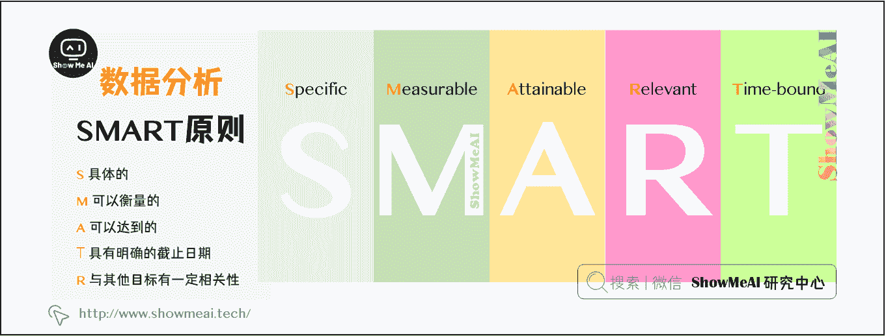

# 图解数据分析 | 数据分析介绍

> 原文：[`blog.csdn.net/ShowMeAI/article/details/123124506`](https://blog.csdn.net/ShowMeAI/article/details/123124506)

作者：[韩信子](https://github.com/HanXinzi-AI)@[ShowMeAI](http://www.showmeai.tech/)
[教程地址](http://www.showmeai.tech/tutorials/33)：[`www.showmeai.tech/tutorials/33`](http://www.showmeai.tech/tutorials/33)
[本文地址](http://www.showmeai.tech/article-detail/133)：[`www.showmeai.tech/article-detail/133`](http://www.showmeai.tech/article-detail/133)
**声明：版权所有，转载请联系平台与作者并注明出处**

* * *

# 一、数据分析的定义

互联网时代来临，随着用户需求和用户行为的多样化，数据量有了指数级别的大幅增长。但是，原始数据（信息）只是一串数字或字符。对这些原始数据进行检查、清理、转换以及建模等操作，才可以洞察数据背后的规律，得出准确的结论或做出正确的决策——这也是数据分析的一个标准过程。

# 二、数据分析的应用

数据分析的数学基础在 20 世纪早期就已确立，但计算机出现后，规范和自动化的分析才具备可行性。现在，数据分析已经广泛地应用到了各个领域。

以互联网为例， 数据分析使用适当的方法对收集来的大量数据进行分析，帮助人们做出判断，以便采取适当的行动：

*   电商平台分析用户的消费行为，制定促销活动的方案、时间和力度，计算用户活跃度，分析产品的回购力度；

*   短视频平台通过用户的点击和观看行为数据针对性的给用户推送喜欢的视频；

*   广告主分析广告点击率，决定投放平台、制定广告定向人群方案、决定投放时间；

*   保险公司从大量赔付申请数据中判断哪些为骗保的可能，支付宝通过从大量的用户消费记录和行为自动调整花呗的额度；

*   ……

# 三、数据分析的价值

## 3.1 从个人发展角度而言

### （1）学习数据分析可以增加个人的就业机会。

打开各种招聘网站，越来越多的岗位开始要求『具备一定的数据分析能力』。同样参与面试的两个优秀候选人，具备数据分析能力的那个有更大的机会拿到 Offer。

### （2）学习数据分析可以得到更多的晋升机会。

例如销售人员，可以通过分析各个渠道的转化率，发现在话术、内容、咨询时间不同的方面的转化效果，从而优化个人的工作流程与相关的内容。有数据支持的业务分析，更容易做出合理的决策，贡献优秀的绩效。

### （3）学习数据分析拓宽就业方向。

大中型企业（尤其是头部企业），都设置有『数据分析』岗位，例如数据分析师、数据科学家等等。目前各种数据分析岗位招聘需求都相对较大。

### （4）学习数据分析可以参与公司的决策核心。

数据分析对于企业最大的价值就是可以为企业的发展提供更加明确的方向，能为企业的产业结构优化减少更多的成本支出，作为数据分析人员必然需要参与到决策之中，其重要程度可见一斑。

## 3.2 从企业发展角度而言

### （1）掌握数据分析的人才能为企业节约更多的成本。

通过数据分析能够发现人员管理、业务流程、产业结构等过程中的漏洞并加以优化，降低其中的损耗成本。

### （2）掌握数据分析的人才为企业的发展带来更多的可能。

通过市场数据分析和用户数据分析，可以为目标用户提供更精准的产品和夫，从而提高企业营收规模。

# 四、数据化的分析思维

## 4.1 波特五力模型

通过分析供应商和购买者的讨价还价能力，潜在进入者的威胁，替代品的威胁，以及来自目前在同一行业的公司间的竞争，具体的分析一个行业的基本竞争态势。不过，五力模型只考虑了同行业之间的竞争关系，没有考虑合作共赢的可能。

## 4.2 PEST 分析法

PEST 分析常用于分析宏观环境，宏观环境包括了一系列影响企业战略规划和经营管理的外部要素，是一切规划工作的前提。PEST 模型为宏观环境分析提供了基本框架。

## 4.3 SWOT 分析法

SWOT 是指企业内部的的优势和劣势、外部竞争市场上的机会和威胁。SWOT 分析法通对企业进行深入全面的分析，以明确竞争优势的定位，将公司的战略与公司内部资源、外部环境有机结合，从而制定企业战略。

## 4.4 行业生命周期理论

行业生命周期(Industry Life Cycle) ，指行业从出现到完全退出社会经济活动所经历的时间。行业的生命发展周期主要包括四个发展阶段：初创期，成长期，成熟期，衰退期。类似的分析思路也常用于用户生命周期的分析。

## 4.5 人货场理论

人货场，适用于零售业的发展分析，不管是最早一代的商超、百货还是现在的电商零售、直播带货。

## 4.6 金字塔原理

金字塔原理（Pyramid Principle），是说任何事情都可以归纳出一个中心论点，而此中心论点可由三至七个论据支持，这些一级论据本身也可以是个论点，被二级的三至七个论据支持，如此延伸，状如金字塔。

## 4.7 SMART 原则

人们在制定工作目标或任务目标时，无论是制定团队的工作目标还是员工的绩效目标，考虑一下目标与计划是不是符 SMART 原则。只有具备 SMART 化的计划才具有良好的可实施性，也才能指导保证计划得以实现。

## 4.8 5W2H 分析法

5W2H 分析法，又称七问分析法，是以 5 个 W 开头的英语单词和两个以 H 开头的英语单词进行设问，发现解决问题的线索，寻找新思路，进行设计构思，从而作出新的发明项目或者作出新的决策的方法。

## 4.9 帕累托法则

源于经典的二八法则，在数据分析中，可以理解为 20%的数据产生了 80%的效果，需要围绕这 20%的数据进行挖掘。

# 资料与代码下载

本教程系列的代码可以在 ShowMeAI 对应的 [**github**](https://github.com/ShowMeAI-Hub/)中下载，可本地 python 环境运行。能访问 Google 的宝宝也可以直接借助 google colab 一键运行与交互操作学习哦！

## 本系列教程涉及的速查表可以在以下地址下载获取：

*   [Pandas 速查表](https://github.com/ShowMeAI-Hub/awesome-AI-cheatsheets/tree/main/Pandas)
*   [Matplotlib 速查表](https://github.com/ShowMeAI-Hub/awesome-AI-cheatsheets/tree/main/Matplotlib)
*   [Seaborn 速查表](https://github.com/ShowMeAI-Hub/awesome-AI-cheatsheets/tree/main/Seaborn)

# 拓展参考资料

*   [Pandas 官方教程](https://pandas.pydata.org/pandas-docs/stable/getting_started/tutorials.html)
*   [十分钟入门 Pandas](https://www.pypandas.cn/docs/getting_started/10min.html)
*   [利用 Python 进行数据分析·第 2 版](https://www.jianshu.com/p/04d180d90a3f)
*   [w3schools pandas tutorial](https://www.w3schools.com/python/pandas/default.asp)
*   [Kaggle 的 pandas 入门教程](https://www.kaggle.com/learn/pandas)

# ShowMeAI 相关文章推荐

*   [数据分析介绍](http://www.showmeai.tech/article-detail/133)
*   [数据分析思维](http://www.showmeai.tech/article-detail/135)
*   [数据分析的数学基础](http://www.showmeai.tech/article-detail/136)
*   [业务认知与数据初探](http://www.showmeai.tech/article-detail/137)
*   [数据清洗与预处理](http://www.showmeai.tech/article-detail/138)
*   [业务分析与数据挖掘](http://www.showmeai.tech/article-detail/139)
*   [数据分析工具地图](http://www.showmeai.tech/article-detail/140)
*   [统计与数据科学计算工具库 Numpy 介绍](http://www.showmeai.tech/article-detail/141)
*   [Numpy 与 1 维数组操作](http://www.showmeai.tech/article-detail/142)
*   [Numpy 与高维数组操作](http://www.showmeai.tech/article-detail/144)
*   [数据分析工具库 Pandas 介绍](http://www.showmeai.tech/article-detail/145)
*   [图解 Pandas 核心操作函数大全](http://www.showmeai.tech/article-detail/146)
*   [图解 Pandas 数据变换高级函数](http://www.showmeai.tech/article-detail/147)
*   [Pandas 数据分组与操作](http://www.showmeai.tech/article-detail/148)
*   [数据可视化原则与方法](http://www.showmeai.tech/article-detail/149)
*   [基于 Pandas 的数据可视化](http://www.showmeai.tech/article-detail/150)
*   [seaborn 工具与数据可视化](http://www.showmeai.tech/article-detail/151)

# ShowMeAI 系列教程推荐

*   [图解 Python 编程：从入门到精通系列教程](http://www.showmeai.tech/tutorials/56)
*   [图解数据分析：从入门到精通系列教程](http://www.showmeai.tech/tutorials/33)
*   [图解 AI 数学基础：从入门到精通系列教程](http://showmeai.tech/tutorials/83)
*   [图解大数据技术：从入门到精通系列教程](http://www.showmeai.tech/tutorials/84)

