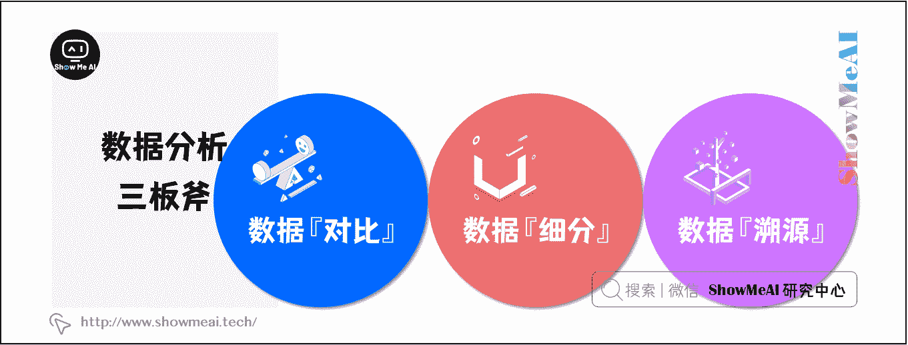
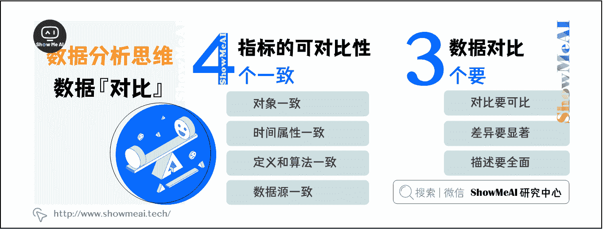
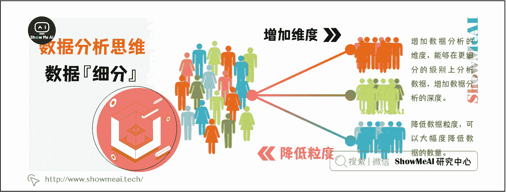

# 图解数据分析 | 数据分析思维

> 原文：[`blog.csdn.net/ShowMeAI/article/details/123118408`](https://blog.csdn.net/ShowMeAI/article/details/123118408)

作者：[韩信子](https://github.com/HanXinzi-AI)@[ShowMeAI](http://www.showmeai.tech/)
[教程地址](http://www.showmeai.tech/tutorials/33)：[`www.showmeai.tech/tutorials/33`](http://www.showmeai.tech/tutorials/33)
[本文地址](http://www.showmeai.tech/article-detail/135)：[`www.showmeai.tech/article-detail/135`](http://www.showmeai.tech/article-detail/135)
**声明：版权所有，转载请联系平台与作者并注明出处**

* * *

有人把数据分析的核心总结为六字，即对比、细分、溯源，也被数据分析的三板斧，支撑数据分析的核心应用，具体来说：

**对比：成对地比较。**

*   横向对比：与『他人』比较，比如，两家公司的离职率。
*   纵向对比：按照时间维度与『自己』的比较，比如，一家公司去年和今年的离职率。

**细分：对数据增加维度、降低粒度地分析。**

*   分维度：增加维度，比如，离职率按照部门维度来分析。
*   降低粒度：降低数据聚合的程度，比如，离职率不按年份、而按照月份来统计。

**溯源：在对比、细分锁定到具体维度和粒度之后，依然没有结论，那就需要查看原始数据，洞察数据，从数据中寻找灵感。**

# 一、数据『对比』

数据放在那里是没有意义的，只有将数据进行比较，才体现出数据分析的价值。对比其实很简单，就是把 A 和 B 比较。但是，没有可对比性的对比一定是耍流氓。

## 1.1 指标的可对比性

指标的可对比性，可以从四个“一致”原则来评估：对象一致、时间属性一致、定义与算法一致、数据源一致。

**（1）比价对象一致**

比较的对象一致。对象一致是可比的最基本原则，番茄的销量和猪的销量是不可比的，这其实就是因为比较的对象不一致。

**（2）时间属性一致**

指标的时间属性一致。 时间属性比较特殊，对象所在的季节、月份等时间属性要有可比性。例如，一家便利店冬季雪糕的销量，和夏季没有可比性，因为对象的时间属性不同，但做销量的同比是可以的。

**（3）定义和算法一致**

对分析对象的定义和计算方法一致。举个例子，青年的定义，中国国家统计局（15-34 周岁）和中国共青团（14-28 周岁）不同，当统计青年人数占总人数的比例时，二者计算的指标数据，肯定是不同的。

**（4）数据源一致**

统计的数据样本一致。

## 1.2 数据对比的“三要”

在做数据对比的相关分析时，要记住三个“要”：对比要可比、差异要显著、描述要全面。

**（1）对比要可比**

对比分析要有可比性。

**（2）差异要显著**

组间差异要显著，组内差异要细微。常用的显著性检验有 T 检验和方差分析。

**（3）描述要全面**

当刻画一组数据时，不仅要描述这组数据的一般水平（均值），还要考虑到这组数据的波动水平。如果波动很大，一般水平对数据总体的代表性就会很差。只考虑一般水平而不考虑波动和差异，会使数据的可信度大大缩水。

# 二、数据『细分』

通过增加维度和降低粒度来细分数据，深挖数据，揭示数据中潜藏的规律。

## 2.1 增加维度

一个维度是数据表的一列。通常情况下，维度是指定性数据。例如，产品提供的服务的类型、用户分布的地域等。在分析数据时，增加分析的维度，改变看待问题的视角，能够在更细分的级别上分析数据，洞察到更多的知识，增加数据分析的深度。

例如，新用户的留存率，通过增加获客来源的维度，可以监控各个来源的新用户的留存率，把有限的经费使用到真正可以带来有效转化的地方。

## 2.2 降低粒度

粒度是数据的聚合程度。颗粒度最小的数据，是没有聚合的原始数据。

举个例子，每日数据是原始数据，其粒度是日，数据的数量巨大；而每周的统计数据是对日数据的聚合，其粒度是周，数据的数量变成原来的 1/7。

# 三、数据『溯源』

溯源，就是到细节数据中去，查看原始数据，反思用户的行为。在做数据分析时，一定要明白你分析得数据是二手的，还是一手的。

*   一手数据是最原始的数据，包含的内容最丰富，但数据可能不规范。

*   二手数据是经过处理的，甚至是分析之后的数据，这些数据可能是片面的、阉割的、面向特定主题的，由此得出的分析结果也可能有失公允。

* * *

# 资料与代码下载

本教程系列的代码可以在 ShowMeAI 对应的 [**github**](https://github.com/ShowMeAI-Hub/)中下载，可本地 python 环境运行。能访问 Google 的宝宝也可以直接借助 google colab 一键运行与交互操作学习哦！

## 本系列教程涉及的速查表可以在以下地址下载获取：

*   [Pandas 速查表](https://github.com/ShowMeAI-Hub/awesome-AI-cheatsheets/tree/main/Pandas)
*   [Matplotlib 速查表](https://github.com/ShowMeAI-Hub/awesome-AI-cheatsheets/tree/main/Matplotlib)
*   [Seaborn 速查表](https://github.com/ShowMeAI-Hub/awesome-AI-cheatsheets/tree/main/Seaborn)

# 拓展参考资料

*   [利用 Python 进行数据分析·第 2 版](https://www.jianshu.com/p/04d180d90a3f)
*   [w3schools pandas tutorial](https://www.w3schools.com/python/pandas/default.asp)
*   [Kaggle 的 pandas 入门教程](https://www.kaggle.com/learn/pandas)

# ShowMeAI 相关文章推荐

*   [数据分析介绍](http://www.showmeai.tech/article-detail/133)
*   [数据分析思维](http://www.showmeai.tech/article-detail/135)
*   [业务认知与数据初探](http://www.showmeai.tech/article-detail/137)
*   [数据清洗与预处理](http://www.showmeai.tech/article-detail/138)
*   [业务分析与数据挖掘](http://www.showmeai.tech/article-detail/139)
*   [数据分析工具地图](http://www.showmeai.tech/article-detail/140)
*   [统计与数据科学计算工具库 Numpy 介绍](http://www.showmeai.tech/article-detail/141)
*   [Numpy 与 1 维数组操作](http://www.showmeai.tech/article-detail/142)
*   [Numpy 与 2 维数组操作](http://www.showmeai.tech/article-detail/143)
*   [Numpy 与高维数组操作](http://www.showmeai.tech/article-detail/144)
*   [数据分析工具库 Pandas 介绍](http://www.showmeai.tech/article-detail/145)
*   [图解 Pandas 核心操作函数大全](http://www.showmeai.tech/article-detail/146)
*   [图解 Pandas 数据变换高级函数](http://www.showmeai.tech/article-detail/147)
*   [Pandas 数据分组与操作](http://www.showmeai.tech/article-detail/148)
*   [数据可视化原则与方法](http://www.showmeai.tech/article-detail/149)
*   [基于 Pandas 的数据可视化](http://www.showmeai.tech/article-detail/150)
*   [seaborn 工具与数据可视化](http://www.showmeai.tech/article-detail/151)

# ShowMeAI 系列教程推荐

*   [图解 Python 编程：从入门到精通系列教程](http://www.showmeai.tech/tutorials/56)
*   [图解数据分析：从入门到精通系列教程](http://www.showmeai.tech/tutorials/33)
*   [图解 AI 数学基础：从入门到精通系列教程](http://showmeai.tech/tutorials/83)
*   [图解大数据技术：从入门到精通系列教程](http://www.showmeai.tech/tutorials/84)

