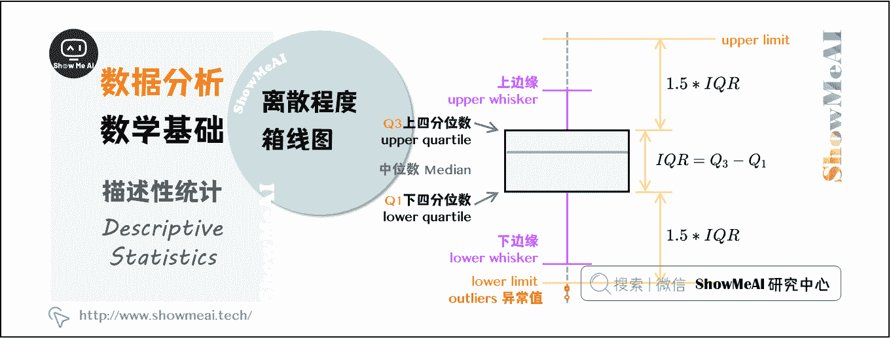

# 图解数据分析 | 数据分析的数学基础

> 原文：[`blog.csdn.net/ShowMeAI/article/details/123130914`](https://blog.csdn.net/ShowMeAI/article/details/123130914)

作者：[韩信子](https://github.com/HanXinzi-AI)@[ShowMeAI](http://www.showmeai.tech/)
[教程地址](http://www.showmeai.tech/tutorials/33)：[`www.showmeai.tech/tutorials/33`](http://www.showmeai.tech/tutorials/33)
[本文地址](http://www.showmeai.tech/article-detail/136)：[`www.showmeai.tech/article-detail/136`](http://www.showmeai.tech/article-detail/136)
**声明：版权所有，转载请联系平台与作者并注明出处**

* * *

# 一、一维：描述性统计

> 速查表
> 
> *   [`showmeai.tech/article-detail/100`](http://showmeai.tech/article-detail/100)
> *   [`showmeai.tech/article-detail/101`](http://showmeai.tech/article-detail/101)

描述性统计量分为：集中趋势、离散程度（离中趋势）和分布形态。

## 1.1 集中趋势

数据的集中趋势，用于度量数据分布的中心位置。直观地说，测量一个属性值的大部分落在何处。描述数据集中趋势的统计量是：平均值、中位数、众数。

### （1）平均值（Mean）

指一组数据的算术平均数，描述一组数据的平均水平，是集中趋势中波动最小、最可靠的指标，但是均值容易受到极端值（极小值或极大值）的影响。

### （2）中位数（Median）

指当一组数据按照顺序排列后，位于中间位置的数，不受极端值的影响，对于定序型变量，中位数是最适合的表征集中趋势的指标。

### （3）众数（Mode）

指一组数据中出现次数最多的观测值，不受极端值的影响，常用于描述定性数据的集中趋势。

## 1.2 离散程度

数据的离散趋势，用于描述数据的分散程度，描述离散趋势的统计量是：极差、四分位数极差（IQR）、标准差、离散系数。

### （1）极差（Range）

又称全距，记作 R，是一组数据中的最大观测值和最小观测值之差。一般情况下，极差越大，离散程度越大，其值容易受到极端值的影响。

### （2）四分位数极差（Inter-Quartile Range， IQR）

又称内距，是上四分位数和下四分位数的差值，给出数据的中间一半所覆盖的范围。IQR 是统计分散程度的一个度量，分散程度通过需要借助箱线图（Box Plot）来观察。通常把小于 Q 1 − 1.5 ∗ I Q R Q1-1.5*IQR Q1−1.5∗IQR 或者大于 Q 3 + 1.5 ∗ I Q R Q3+1.5*IQR Q3+1.5∗IQR 的数据点视作离群点。

### （3）方差（Variance）

方差和标准差是度量数据离散程度时，最重要】最常用的指标。方差，是每个数据值与全体数据值的平均数之差的平方值的平均数，常用 σ 2 \sigma ^{2} σ2 表示。

σ 2 = ∑ ( X − μ ) 2 N ​ ​ ​ ​ \sigma^{2} = \frac{\sum \left ( X - \mu \right )^{2}}{N} ​​​​ σ2=N∑(X−μ)2​​​​​

### （4）标准差（Standard Deviation）

又称均方差，常用 \sigma 表示，是方差的算术平方根。计算所有数值相对均值的偏离量，反映数据在均值附近的波动程度，比方差更方便直观。

σ = ∑ ( X − μ ) 2 N \sigma = \sqrt{\frac{\sum \left ( X - \mu \right )^{2} }{N} } σ=N∑(X−μ)2​  ​

### （5）离散系数（Coefficient of Variation）

又称变异系数，为标准差 \sigma 与平均值 \mu 之比，用于比较不同样本数据的离散程度。离散系数大，说明数据的离散程度大；离散系数小，说明数据的离散程度也小。

C v = σ μ C_{v} = \frac{\sigma}{\mu} Cv​=μσ​

## 1.3 分布形态

### （1）偏度（Skewness）

用来评估一组数据分布呈现的对称程度。

*   当偏度系数=0 时，分布是对称的
*   当偏度系数>0 时，分布呈正偏态（右偏）
*   当偏度系数<0 时，分布呈负偏态（左偏）

### （2）峰度（Kurtosis）

用来评估一组数据的分布形状的高低程度的指标。

*   当峰度系数=0 时，是正态分布
*   当峰度系数>0 时，分布形态陡峭，数据分布更集中
*   当峰度系数<0 时，分布形态平缓，数据分布更分散

### （3）其他数据分布图

分位数是观察数据分布的最简单有效的方法，但分位数只能用于观察单一属性的数据分布。散点图可以用来观察双变量的数据分布，聚类可以用来观察更多变量的数据分布。通过观察数据的分布，采用合理的指标，使数据的分析更全面，避免得出像平均工资这类偏离事实的的分析结果。

# 二、交叉维度

## 2.1 相关性和线性回归

> 更多详细讲解 [图解 AI 数学基础 | 概率与统计](http://www.showmeai.tech/article-detail/163)

### （1）相关系数

又称简单相关系数，常用 r 表示，反应两个变量之间的相关关系及相关方向。

### （2）线性回归（Linear Regression）

线性回归是利用数理统计中回归分析，确定两种或两种以上变量间相互依赖的定量关系。

回归分析中，只包括一个自变量和一个因变量，且二者的关系可用一条直线近似表示，这种回归分析称为一元线性回归分析。
如果回归分析中包括两个或两个以上的自变量，且因变量和自变量之间是线性关系，则称为多元线性回归分析。

## 2.2 方差分析

### （1）单因素方差分析

一项试验只有一个影响因素，或者存在多个影响因素时，只分析一个因素与响应变量的关系。

### （2）多因素有交互方差分析

一项实验有多个影响因素，分析多个影响因素与响应变量的关系，同时考虑多个影响因素之间的关系。

# 三、概率论

> 速查表
> 
> *   [`showmeai.tech/article-detail/118`](http://showmeai.tech/article-detail/118)
> *   [`showmeai.tech/article-detail/117`](http://showmeai.tech/article-detail/117)

> 更多详细讲解 [图解 AI 数学基础 | 概率与统计](http://www.showmeai.tech/article-detail/163)

## 3.1 概率事件

### （1）独立事件

P ( A ∩ B ) = P ( A ) P ( B ) P\left ( A\cap B \right ) = P(A)P(B) P(A∩B)=P(A)P(B)

### （2）对立事件

P ( A ) = 1 − P ( B ) P(A) = 1 - P(B) P(A)=1−P(B)

### （3）互斥事件

P ( A ∩ B ) = 0 P\left ( A\cap B \right ) = 0 P(A∩B)=0

### （4）穷举事件

P ( A ∪ B ) = 1 P\left ( A\cup B \right ) = 1 P(A∪B)=1

## 3.2 条件概率

### （1）条件概率

P ( A ∣ B ) = P ( A B ) P ( B ) P(A \mid B) = \frac{P(AB)}{P(B)} P(A∣B)=P(B)P(AB)​

### （2）全概率公式

P ( B ) = P ( A B ) + P ( A ˉ B ) = P ( A ) P ( B ∣ A ) + P ( A ˉ ) P ( B ∣ A ˉ ) P(B) = P(AB) + P(\bar{A} B) = P(A)P(B \mid A) + P(\bar{A} )P(B \mid \bar{A} ) P(B)=P(AB)+P(AˉB)=P(A)P(B∣A)+P(Aˉ)P(B∣Aˉ)

### （3）贝叶斯定理

P ( A ∣ B ) = P ( A ) P ( B ∣ A ) P ( A ) P ( B ∣ A ) + P ( A ˉ ) P ( B ∣ A ˉ ) P(A \mid B) = \frac{ P(A)P(B \mid A) }{ P(A)P(B \mid A) + P(\bar{A})P(B \mid \bar{A}) } P(A∣B)=P(A)P(B∣A)+P(Aˉ)P(B∣Aˉ)P(A)P(B∣A)​

## 3.3 排列组合

### （1）排列

P n N = n ! ( N n ) = N ! ( N − n ) ! P_{n}^{N} = n! \begin{pmatrix} N \\ n \end{pmatrix} = \frac{N!}{ \left (N-n \right )! } PnN​=n!(Nn​)=(N−n)!N!​

### （2）组合

C n N = ( N n ) = N ! n ! ( N − n ) ! C_{n}^{N} = \begin{pmatrix} N \\ n \end{pmatrix} = \frac{N!}{n! \left (N-n \right )! } CnN​=(Nn​)=n!(N−n)!N!​

## 3.4 概率分布

### （1）连续型概率分布

正态分布：正态概率分布是连续型随机变量中最重要的分布，记为

x ∼ N ( μ ， σ 2 ) x\sim N\left (\mu ， \sigma^{2} \right) x∼N(μ，σ2)

经验法则：正态随机变量有 69.3%的值在均值加减个标准差的范围内，95.4%的值在两个标准差内，99.7%的值在三个标准差内。

### （2）离散型概率分布

*   **伯努利分布**

进行一次实验，若成功则随机变量取值为 1，若失败则取值为 0，成功的概率为 p 失败的概率为 1-p

*   **二项分布**

n 个独立的是/非实验中，成功次数的概率分布。n=1 时，二项分布就是伯努利分布

*   **泊松分布**

在连续时间或空间单位上发生随机事件次数的概率。记为$$$$

# 四、统计推断

> 更多详细讲解 [图解 AI 数学基础 | 概率与统计](http://www.showmeai.tech/article-detail/163)

## 4.1 抽样

抽样：应该满足抽样的随机性原则。
抽样方法：简单随机抽样、分层抽样、整群抽样、系统抽样

## 4.2 置信区间

## 4.3 假设检验

# 资料与代码下载

本教程系列的代码可以在 ShowMeAI 对应的 [**github**](https://github.com/ShowMeAI-Hub/) 中下载，可本地 python 环境运行。能访问 Google 的宝宝也可以直接借助 google colab 一键运行与交互操作学习哦！

本系列教程涉及的速查表可以在以下地址下载获取：

*   [Pandas 速查表](https://github.com/ShowMeAI-Hub/awesome-AI-cheatsheets/tree/main/Pandas)
*   [Matplotlib 速查表](https://github.com/ShowMeAI-Hub/awesome-AI-cheatsheets/tree/main/Matplotlib)
*   [Seaborn 速查表](https://github.com/ShowMeAI-Hub/awesome-AI-cheatsheets/tree/main/Seaborn)

# 拓展参考资料

*   Pandas 可视化教程
*   Seaborn 官方教程

# ShowMeAI 相关文章推荐

*   [数据分析介绍](http://www.showmeai.tech/article-detail/133)
*   [数据分析思维](http://www.showmeai.tech/article-detail/135)
*   [数据分析的数学基础](http://www.showmeai.tech/article-detail/136)
*   [数据清洗与预处理](http://www.showmeai.tech/article-detail/138)
*   [业务分析与数据挖掘](http://www.showmeai.tech/article-detail/139)
*   [数据分析工具地图](http://www.showmeai.tech/article-detail/140)
*   [统计与数据科学计算工具库 Numpy 介绍](http://www.showmeai.tech/article-detail/141)
*   [Numpy 与 1 维数组操作](http://www.showmeai.tech/article-detail/142)
*   [Numpy 与 2 维数组操作](http://www.showmeai.tech/article-detail/143)
*   [Numpy 与高维数组操作](http://www.showmeai.tech/article-detail/144)
*   [数据分析工具库 Pandas 介绍](http://www.showmeai.tech/article-detail/145)
*   [图解 Pandas 核心操作函数大全](http://www.showmeai.tech/article-detail/146)
*   [图解 Pandas 数据变换高级函数](http://www.showmeai.tech/article-detail/147)
*   [Pandas 数据分组与操作](http://www.showmeai.tech/article-detail/148)
*   [数据可视化原则与方法](http://www.showmeai.tech/article-detail/149)
*   [基于 Pandas 的数据可视化](http://www.showmeai.tech/article-detail/150)
*   [seaborn 工具与数据可视化](http://www.showmeai.tech/article-detail/151)

# ShowMeAI 系列教程推荐

*   [图解 Python 编程：从入门到精通系列教程](http://www.showmeai.tech/tutorials/56)
*   [图解数据分析：从入门到精通系列教程](http://www.showmeai.tech/tutorials/33)
*   [图解 AI 数学基础：从入门到精通系列教程](http://showmeai.tech/tutorials/83)
*   [图解大数据技术：从入门到精通系列教程](http://www.showmeai.tech/tutorials/84)

