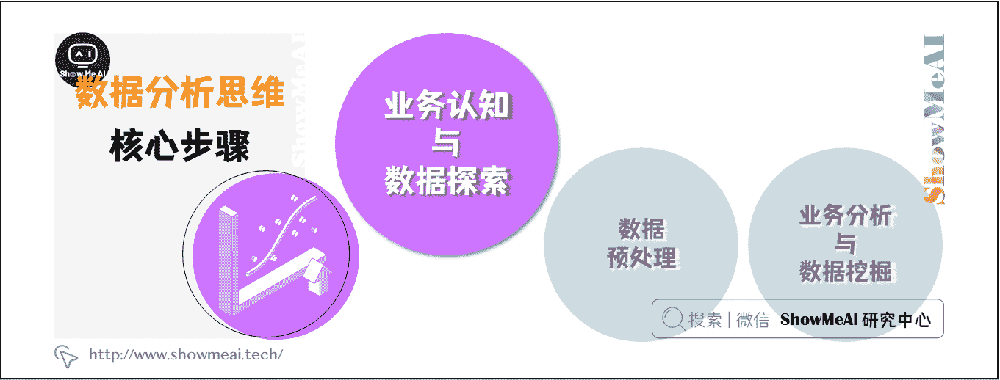
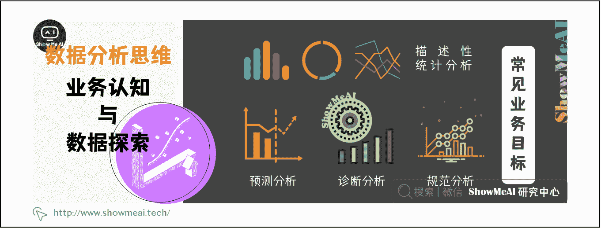
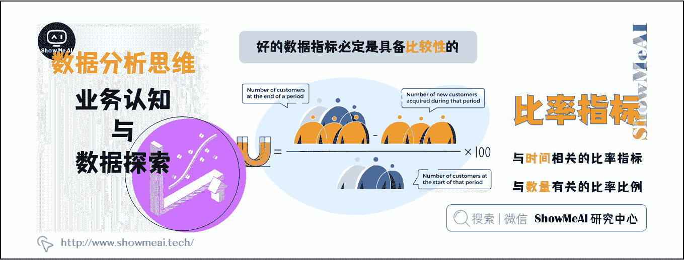
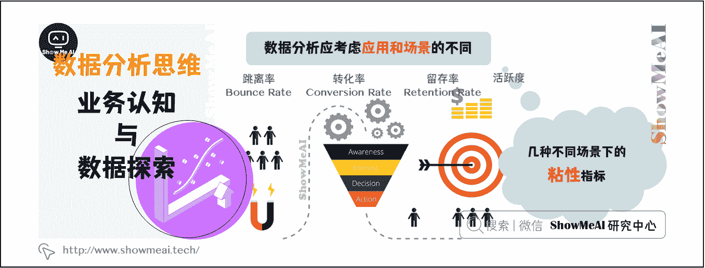
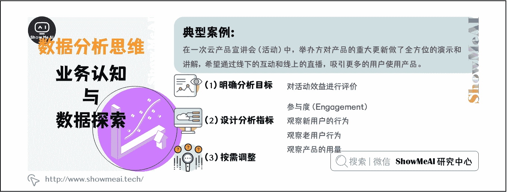
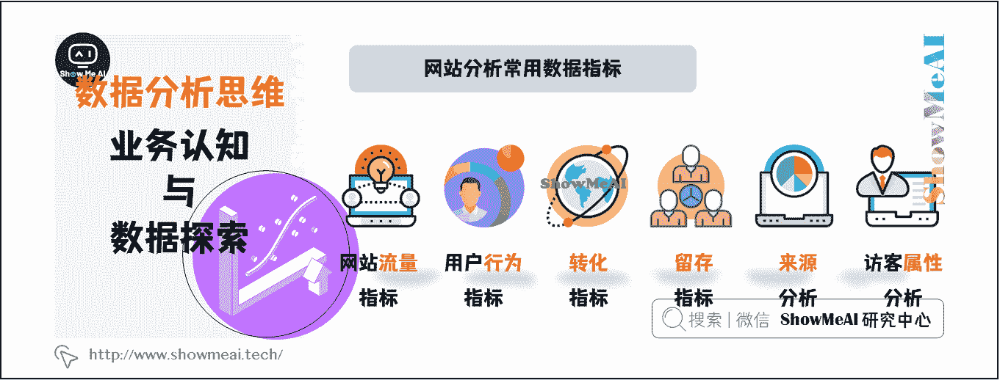
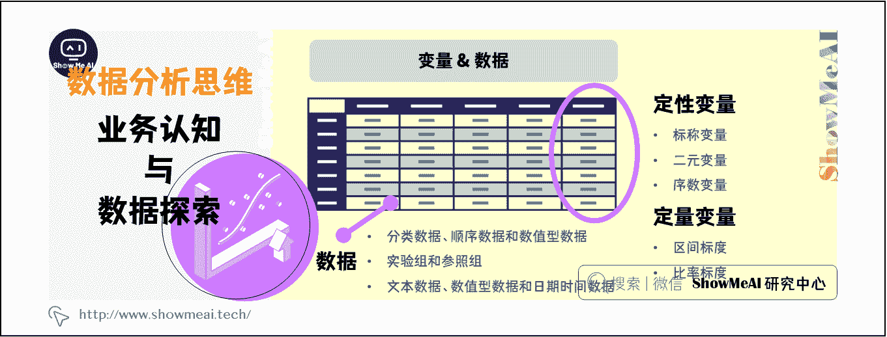

# 图解数据分析 | 业务认知与数据初探

> 原文：[`blog.csdn.net/ShowMeAI/article/details/123131630`](https://blog.csdn.net/ShowMeAI/article/details/123131630)

作者：[韩信子](https://github.com/HanXinzi-AI)@[ShowMeAI](http://www.showmeai.tech/)
[教程地址](http://www.showmeai.tech/tutorials/33)：[`www.showmeai.tech/tutorials/33`](http://www.showmeai.tech/tutorials/33)
[本文地址](http://www.showmeai.tech/article-detail/137)：[`www.showmeai.tech/article-detail/137`](http://www.showmeai.tech/article-detail/137)
**声明：版权所有，转载请联系平台与作者并注明出处**

> 数据分析分核心步骤分为：[业务认知与数据探索](http://www.showmeai.tech/article-detail/137)、[数据预处理](http://www.showmeai.tech/article-detail/138)、[业务认知与数据探索](http://www.showmeai.tech/article-detail/139)等三个核心步骤。
> 
> 本文介绍第一个步骤——业务认知与数据探索。

# 一、常见业务目标

### （1）描述性分析：分析和描述数据的特征

描述性分析是处理信息汇总的好方法，与视觉分析相结合，可以提供全面的数据结构，并通过仪表板展示所得到的结论。企业中通过分析 KPI 来评估绩效的做法，就是描述性分析的常见应用之一。

### （2）预测分析：预测未来的结果

预测分析是一个复杂的领域，需要较大大规模的历史数据，并借助技术进步（尤其是机器学习）构建高并发的预测模型，以获得有关未来的预测性洞察。

### （3）诊断分析：透过数据诊断实际问题

通过诊断分析，可以对数据进行批判性思考，判断实际存在的问题，并进一步优化管理或减少损失。物流企业使用诊断分析可以减少物流延迟，电商企业可以借助诊断分析更新营销策略，降本提效。

### （4）规范分析：数据分析的集大成者

规范分析结合了上述所有分析技术，可以帮助公司在数据结论的基础上制定相关决策。需要注意的是，使用规范分析的必要基础是足够大的数据规模、数量使用 AI 技术，也因此常被应用于大型互联网公司（如 Google）和金融机构。

# 二、常见业务指标

## 2.1 虚荣指标 VS 有效指标

* * *

指标是衡量事物好坏的一个指数。数据指标很多，北极星指标，二级指标、定性指标、量化指标、虚荣指标等等。好的数据指标，应该为产品业务线所在的发展阶段提供指引，而有些数据却起到了相反的作用。

*   **虚荣指标**（Vanity Metrics）让人感觉良好，却是肤浅甚至带有欺诈性的。例如，只关注网站的访问量（PV、UV），却忽略跳离率、用户浏览时间等数据指标时，就很容易掉进虚荣指标带来的陷阱。
*   **有效指标**（Clarity Metrics）指那些真正能带来效益的指标。例如，转化率、留存率、日活跃人数占比等，可以更好地洞察产品和用户行为的实际走向。

## 2.2 选择合适的指标

### （1）比率指标

比率指标具备『比较性』，从而成为最佳数据指标。举个开车的例子，里程透露的是距离信息，而速度（距离/时间）才能告诉你是在加速，还是减速。
比率指标的比较对象，是不同时期的『自我』对比，用以比较事物的增长趋势；或同一时期不同对象之间的对比，用以比较不同事物的增长大小。

通常情况下，用户行为分析使用以下比率指标（或之一）：

*   **与时间相关的指标**——『XXX 速度』，例如，新用户增速（单位时间内新用户的数量），
*   **与数量有关的比例**——『XXX 率/比』，例如，活跃用户比（活跃用户占总用户数的比例）。

### （2）多指标联合分析

抛开基数，比率的意义会大打折扣。引用《效益数据分析》中的例子，“你的产品刚上线时，从严格意义上讲，你爸爸注册一个账号，也可以使你的用户量翻倍”。

注意！虽然比率是最佳的数据指标，但也需要辅以其他定性指标和定量指标。指标从来不是单独存在的，而应该从多个指标来综合评估。这需要了解指标之间的耦合性，设计指标系统，从各个角度来揭示数据中隐藏的事实。

## 2.3 结合应用场景

分析数据和设计关键指标时，应结合实际业务，还原到具体的场景中。例如，在分析用户的行为时，用户对服务或产品的黏性（Stickiness）是一个有效指标。在不同使用场景中，粘性的衡量指标也有差异：
黏性是指客户购买产品或服务之后，愿意再次购买或者推荐给别人的程度。

*   **跳离率**（Bounce Rate）：对于内容产品，当访客点击你的网页时，有多少人会马上关闭，百分比是多少。

*   **转化率**（Conversion Rate）：当产品推广时，转化率是注册人数和访客人数比例，表示有多少访客真正变成网站的注册用户。

*   **留存率**（Retention Rate）：对于新用户，用于测试新用户在某段时间内开始使用产品，经过一段时间后，继续使用产品的用户的比例。

*   **活跃度**也是一个有效的度量。 对于社交网站来说，日活跃用户人数（Daily Active Users, DAU）占比是一个关键的指标。

## 2.4 典型案例

案例：在一次云产品宣讲会（活动）中，举办方对产品的重大更新做了全方位的演示和讲解，希望通过线下的互动和线上的直播，来吸引更多的用户使用产品。

### （1）明确分析目标

如果目标是对活动效益进行评价，你作为一名数据分析人员，会怎么做？

思路：对于该场景，可以使用同期群分析，按照与会人员是否注册，把与会人员细分为未注册人员（潜在用户）和已注册人员（老用户）。

*   活动结束后，有些未注册用户转化成为新用户。吸引新用户注册的动力可能有多种，最常见的是免费试用。后续可以追踪不同来源用户的产品使用行为。

*   老用户是产品的粉丝，是付费用户，能够为公司带来收益。已付费的用户可能会流失，也有可能更依赖产品、更加频繁地使用产品。

*   注意！分析用户行为时，应该意识到，有些用户虽然不能带来直接的收益，但可以带来更多用户，从而间接为公司创造收益。

### （2）设计分析指标

思路：将人的行为作为出发点，从『定量数据』和『定性数据』两个角度来设计指标。为了分析活动获得的效益，可以制定以下关键指标：

**[1] 参与度（Engagement）：衡量有多少人参加此次活动，用于评价活动的影响力**

*   总人数、老用户人数、潜在用户人数。

*   参与活动之后，有多少用户注册了（免费版或试用版）。

**[2] 观察新用户的行为：转化率可以评价活动效益，留存率可以评估新用户对产品的粘性**
与会的、未注册的人员，是产品的潜在用户。不管采用『免费试用』还是『购买+赠送』等推广方法，只要用户注册，就可以认为是完成了一次转化。

*   新用户的转化率（Conversion Rate）：参与活动之后注册为新用户的比例，转化率越高，说明产品对用户的吸引力越高，活动获得的效益越好。

*   新用户的来源：对新用户的来源和转化路径进行分析，有助于确定哪些来源带来了更多有效的转化。

*   新用户的转化路径（转化漏斗）：通过免费试用（Free Trial）注册的新用户，其转化路径的数据指标依次为『新试用（New Trial）』『次日活跃（Activated Trial）』『7 日活跃（Activated Trial in 7 days）』。

*   新用户的留存率：在连续的计费周期内，同期新用户中仍然活跃的用户所占的比例 。

**[3] 观察老用户行为：忠诚度与老用户用量**

老用户是指在参加活动之前，已经注册的用户，这批用户是产品的忠实粉丝。分析老用户的行为，也能评估活动效益的。

忠诚度是指用户使用产品的频繁程度，以及对产品及服务的依赖程度。如果此次活动促使老用户更频繁地使用产品（即老用户的用量增加），则说明举办此次活动提升了老用户的忠诚度，带来了效益的增加。

*   老用户的用量增长：参与活动之后，老用户的用量与前一个付费周期的用量相比，是增是减。

*   用量增长的用户占比：参与活动之后，用量增长的用户占比。

考虑一些特殊情况，有多少老用户被召回，有多少老用户流失：

*   僵尸账户激活（New billed Customers）：有多少老用户离开之后，重新为产品或服务付费。

*   付费用户流失（Churned Customers）：用户在一个付费周期内，不再付费购买产品或服务。

**[4] 观察产品的用量：服务类型**

产品的用量，也是一个评价活动效益的有效指标。而用户使用产品这一行为，实际上在消费产品提供的服务。增加『服务类型』这一维度，可以评估用量的增长是否与本次活动有关——对比总用量、与活动主题相关的用量。

*   如果与主题相关的用量增长较大，总的用量增长较平缓，那么说明此次活动促进了用量的增长。

*   如果与主题相关的用量增长平缓，总的用量增长也平缓，那么说明此次活动对用量的增长没有作用。

注意！对比要有可比。在比对数据的处理上，应剔除新用户对数据的影响。以活动的举办时间为分割点，只比对老用户在前 N（1-3）个付费周期内和后 N（1-3）个付费周期内的用量。为了更精确地计算用量，应该避免个别因素的影响，可以使用 2-3 个付费周期内用量的均值。

**老用户的用量增长分析**：

*   用量增长的老用户占比
*   在参加活动之后，老用户消费的用量增加多少，增长的比例是多少
*   每位用户的平均用量

**与活动主题相关的用量增长分析**：

*   用量增长的老用户占比（与活动相关）
*   在参加活动之后，老用户消费的用量增加多少，增长的比例是多少（与活动相关）
*   每位用户的平均用量（与活动相关）

### （3）按需调整

要注意，数据分析应结合业务，根据面临的主要问题，设置关键的数据指标，以回答决策中遇到的难题。例如：

*   当产品没有知名度时，网站的访问量可以作为一个关键指标。
*   当有了大量的用户基数时，可以把注册人数（或试用人数）作为关键指标。
*   当注册人数增加到一定程度时，可以把转化率（即，免费用户转化为付费用户）作为关键指标。

## 2.5 网站分析常用数据指标

附上网站分析中常用的数据指标，你能识别哪些是虚荣指标吗？

### （1）网站流量指标

*   **页面浏览**量(Page View，PV）：访客每打开一个页面就被记录一次。

*   **独立访客数量**（Unique Visitors，UV）：一天之内网站的唯一访客数量。

*   **重复访客数量**（Repeat Visitors，RV）：一天之内，重复访问网站的访客。

*   **访客访问的页面浏览量**（Page Views per User）：平均每个访客访问的页面数量，指标高的话，说明用户黏性高，也就是说，访客显示出对网站感兴趣、愿意长时间停留。

### （2）用户行为指标

*   **跳出率**：表示用户只浏览一个页面便离开了网站，跳出率显示了访客对网站的兴趣程度：跳出率越低说明访客对网站越感兴趣。

*   **平均访问时长**：是指每次访问的停留时长，该指标越大，则说明访客停留在网页上的时间越长，对网站越感兴趣。

*   **平均访问页数**：是指每次访问浏览的页面数量，该指标越大，则说明访客对网站越感兴趣。

### （3）转化指标

*   **转化次数**：是指访客到达转化目标页面的次数，转化表示访客做了网站管理者希望访客做的事，与网站运营者期望达到的推广目的有关。

*   **转化率**：是指访问转化的效率，转化率=转化次数/访问次数，转化率越高，说明网站的推广效果越好。

*   **转化路径**：路径是指访客在抵达您设置的目标页面前所经过的一系列中间页面，转化即指潜在客户完成一次您期望的行动，与您的推广目的和对推广效果的定义密切相关。通过对转化路径的跟踪，您可以了解访客对转化各个步骤的访问情况。

### （4）留存指标

*   **留存人数**：注册用户在第一次访问网站之后，在下一个周期内继续使用网站的人数。

*   **留存率**（Retention Rate）：在下一个周期内继续使用网站的人数，占当期注册用户的比例，留存率越高，说明用户对网站的黏性越高。

### （5）来源分析

*   **来源**：访客以哪些方式访问网站，直接访问，或搜索引擎。

*   **搜索词分析**：在各类搜索引擎上通过哪些搜索词找到并访问了网站。

### （6）访客属性分析

*   访客的年龄

*   访客的地域

*   老访客/新访客

# 三、探索性数据分析

数据分析的基础是对数据的认知，先有数据，而后有分析。没有可信的数据，数据分析的结果将是空中楼阁。变量和数据是数据分析中常用的概念：变量来描述事物的特征，而数据是变量的具体值（也叫观测值）。

## 3.1 变量

变量用来描述总体中成员的某一个特性。在数据分析中，变量（Variable）可以和属性、维（Dimension）、特征（feature）互换使用。常见变量有性别、年龄、身高、收入等。
按照变量值功能的不同，可以把变量分为定性变量和定量变量。

### （1）定性变量

定性变量是指用文本描述对象的特征。定性数据通常是分析数据的一个角度，增加维度，从不同的角度来看待问题，能够细分指标，增加分析的深度。定性变量主要分为三类：

*   **标称变量**：也叫做类别变量，用于对数据对象分类（Category）。比如，头发的颜色、职业。

*   **二元变量**：只有两个类别的变量，如果二元变量的两种状态具有同等价值或具有相同的权重，那么认为该二元变量是对称的，例如，性别；非对称是指两种状态的结果不是同样重要的。例如，是否吸烟对治疗的效果而言，其权重是不同的。

*   **序数变量**：变量的顺序是有意义的，通常用于等级评定。通常情况下，序数变量是定性的文本，比如，官职、消费者满意度。但是，序数变量也可以通过把数值变量分割成不同的区间来得到，比如，年龄段。

    *   在序数变量中，有一类重要的变量，叫做时间变量，一些常见的分析方法，比如时序分析，周期性分析等都是基于时间变量的。

### （2）定量变量

定量变量是指用数值描述对象，可以比较大小，是可以量化的变量。定量变量通常含有量纲。例如，身高的量纲是 cm，而薪水的量纲是元。同一量纲的数据可以比较大小；不同量纲的数据，需要通过归一化去量纲之后，比较大小才有意义。定量变量主要分为两个标度：

*   **区间标度**：可度量的数值，用整数或实数表示。比如，年纪、薪水

*   **比率标度**：比例数值。比如，速度、留存率

## 3.2 数据

数据是变量的具体值。

按照变量的类型，可以把数据分为：分类数据、顺序数据和数值型数据。

按照数据分析的目的，可以把数据分为：实验组（Treatment）和参照组（Control）。

按照数据的类型，可以把数据分为：文本数据、数值型数据和日期时间数据。

## 3.3 数据基本统计描述

统计是数据分析的好助手，查看数据集的基本统计描述，能够帮助我们了解数据的全貌，识别数据的分布特征。由于定量数据天生具有计算的特性，数据的分布通常是针对定量数据进行的统计描述。
基本统计描述主要是指从数据的集中趋势、离散趋势和分布来认识数据。每个统计描述，都使用特定的统计量来衡量。

> [数据分析的数学基础](http://www.showmeai.tech/article-detail/136)

# 资料与代码下载

本教程系列的代码可以在 ShowMeAI 对应的 [**github**](https://github.com/ShowMeAI-Hub/) 中下载，可本地 python 环境运行。能访问 Google 的宝宝也可以直接借助 google colab 一键运行与交互操作学习哦！

## 本系列教程涉及的速查表可以在以下地址下载获取：

*   [Pandas 速查表](https://github.com/ShowMeAI-Hub/awesome-AI-cheatsheets/tree/main/Pandas)
*   [Matplotlib 速查表](https://github.com/ShowMeAI-Hub/awesome-AI-cheatsheets/tree/main/Matplotlib)
*   [Seaborn 速查表](https://github.com/ShowMeAI-Hub/awesome-AI-cheatsheets/tree/main/Seaborn)

# 拓展参考资料

*   [Pandas 可视化教程](https://pandas.pydata.org/pandas-docs/stable/user_guide/visualization.html)
*   [Seaborn 官方教程](https://seaborn.pydata.org/tutorial.html)

# ShowMeAI 相关文章推荐

*   [数据分析介绍](http://www.showmeai.tech/article-detail/133)
*   [数据分析思维](http://www.showmeai.tech/article-detail/135)
*   [数据分析的数学基础](http://www.showmeai.tech/article-detail/136)
*   [业务认知与数据初探](http://www.showmeai.tech/article-detail/137)
*   [数据清洗与预处理](http://www.showmeai.tech/article-detail/138)
*   [业务分析与数据挖掘](http://www.showmeai.tech/article-detail/139)
*   [数据分析工具地图](http://www.showmeai.tech/article-detail/140)
*   [统计与数据科学计算工具库 Numpy 介绍](http://www.showmeai.tech/article-detail/141)
*   [Numpy 与 1 维数组操作](http://www.showmeai.tech/article-detail/142)
*   [Numpy 与 2 维数组操作](http://www.showmeai.tech/article-detail/143)
*   [Numpy 与高维数组操作](http://www.showmeai.tech/article-detail/144)
*   [数据分析工具库 Pandas 介绍](http://www.showmeai.tech/article-detail/145)
*   [图解 Pandas 核心操作函数大全](http://www.showmeai.tech/article-detail/146)
*   [图解 Pandas 数据变换高级函数](http://www.showmeai.tech/article-detail/147)
*   [Pandas 数据分组与操作](http://www.showmeai.tech/article-detail/148)
*   [数据可视化原则与方法](http://www.showmeai.tech/article-detail/149)
*   [基于 Pandas 的数据可视化](http://www.showmeai.tech/article-detail/150)
*   [seaborn 工具与数据可视化](http://www.showmeai.tech/article-detail/151)

# ShowMeAI 系列教程推荐

*   [图解 Python 编程：从入门到精通系列教程](http://www.showmeai.tech/tutorials/56)
*   [图解数据分析：从入门到精通系列教程](http://www.showmeai.tech/tutorials/33)
*   [图解 AI 数学基础：从入门到精通系列教程](http://showmeai.tech/tutorials/83)
*   [图解大数据技术：从入门到精通系列教程](http://www.showmeai.tech/tutorials/84)

