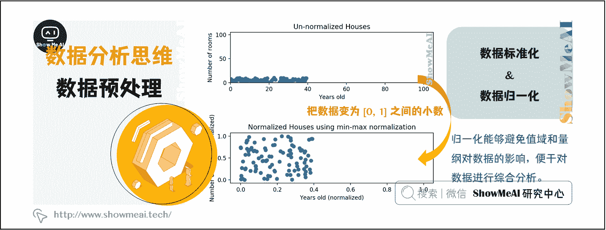
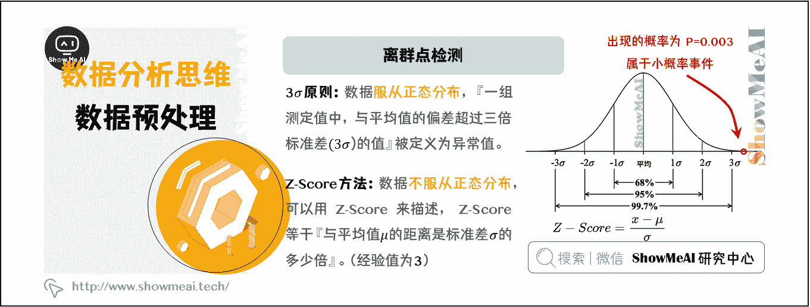
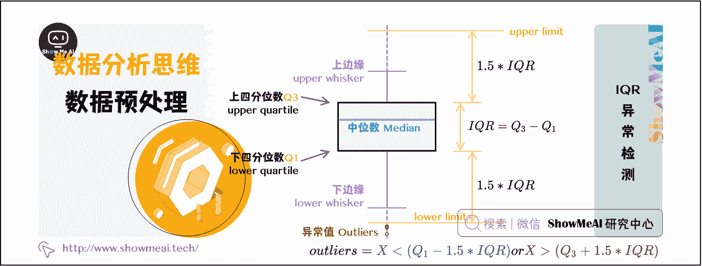
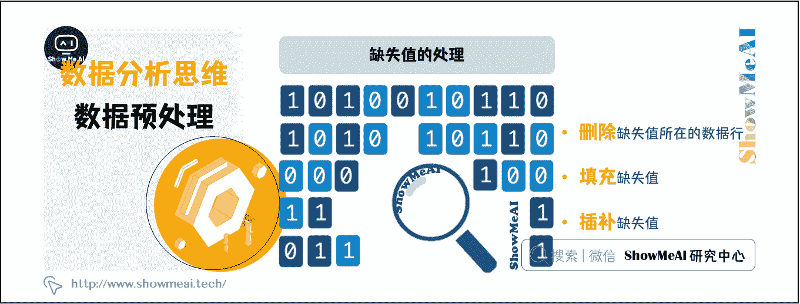

# 图解数据分析 | 数据清洗与预处理

> 原文：[`blog.csdn.net/ShowMeAI/article/details/123132048`](https://blog.csdn.net/ShowMeAI/article/details/123132048)


作者：[韩信子](https://github.com/HanXinzi-AI)@[ShowMeAI](http://www.showmeai.tech/)
[教程地址](http://www.showmeai.tech/tutorials/33)：[`www.showmeai.tech/tutorials/33`](http://www.showmeai.tech/tutorials/33)
[本文地址](http://www.showmeai.tech/article-detail/138)：[`www.showmeai.tech/article-detail/138`](http://www.showmeai.tech/article-detail/138)
**声明：版权所有，转载请联系平台与作者并注明出处**


> 数据分析分核心步骤分为：[业务认知与数据探索](http://www.showmeai.tech/article-detail/137)、[数据预处理](http://www.showmeai.tech/article-detail/138)、[业务认知与数据探索](http://www.showmeai.tech/article-detail/139)等三个核心步骤。本文介绍第二个步骤——数据预处理。

**不能想当然地认为数据是有效的。**
在现实世界中，数据一般都是异构的、有缺失的、有量纲的。有些数据是从多个不同的数据源中获取的，这些异构数据，在各自的系统中都是正确无误的，只不过很有“个性”。

> 例如，有的系统中使用 0 和 1，代表性别；而有些系统使用 f 和 m 代表性别。

*   在使用数据之前，首先要对数据做规整处理，使用一致的单位、使用统一的文本来描述对象等。
*   有些数据中包含大量重复的数据、缺失的数据、或者离群的数据，在开始分析数据之前，必须好好检查数据是否有效，并对数据做预处理操作。
*   判断离群数值，并对其分析，有时会导致重大发现的产生。

# 一、数据规整

## 1.1 量纲

所谓量纲，简单来说，就是说数据的单位。有些数据是有量纲的，比如身高；而有些数据是没有量纲的，例如，男女比例。不同评价指标往往具有不同的量纲，数据之间的差别可能很大，不进行处理会影响到数据分析的结果。



## 1.2 数据标准化

为了消除指标之间的量纲和取值范围差异对数据分析结果的影响，需要对数据进行标准化处理。就是说，把数据按照比例进行缩放，使之落入一个特定的区域，便于进行综合分析。

## 1.3 数据归一化

归一化是数据标准化中最简单的方式，目的是把数变为 [0, 1] 之间的小数，把有量纲的数据转换为无量纲的纯数量。归一化能够避免值域和量纲对数据的影响，便于对数据进行综合分析。

## 举例说明

举个简单的例子，在一次考试中，小明的语文成绩是 100 分、英语成绩是 100 分，单单从这考试成绩来评价，小明的语文和英语学的一样好。但是，如果你知道语文总分是 150 分，而英语总分只有 120 分，你还认为小明的语文和英语成绩是一样的吗？

对小明的成绩做简单的归一化：

> 采用离差归一化方法，公式是：y = (x-min) / range，这里设 min=0，那么 range = max - min = max，由此推算出小明的语文成绩是 4/6，英语成绩是 5/6。因此，判定小明的英语成绩好于语文成绩。
> 
> 还原到真实的场景中，各科的考题难度不尽相同，设班级中语文的最低分数是 min 语文 = 60，英语的最低分数是 min 英语 = 85，推算出小明的语文成绩是 0.44 =（100-60）/（150-60），英语成绩是 0.43 = （100-85）/（120-85），据此，可以判断小明的英语成绩稍差于语文成绩。

归一化的使得具有不同值域、不同量纲的数据之间具有可比性，使数据分析的结果更加全面，更接近事实。

# 二、数据异常值检测与分析

异常值在统计学上的全称是疑似异常值，也称作离群点(outlier)，异常值的分析也称作离群点分析。

异常值分析是检验数据中是否存在不合常理的数据，在数据分析中，既不能忽视异常值的存在，也不能简单地把异常值从数据分析中剔除。重视异常值的出现，分析其产生的原因，常常成为发现新问题进而改进决策的契机。


在上图中，离群点（outlier）跟其他观测点的偏离非常大。注意，离群点是异常的数据点，但是不一定是错误的数据点。

## 2.1 离群点检测

> [数据分析的数学基础](http://www.showmeai.tech/article-detail/136)

### （1）描述性分析方法

在数据处理过程中，可以对数据做一个描述性分析，进而查看哪些数据是不合理的。常用的统计量是最大值和最小值，用来判断变量的取值是否超出了合理的范围。例如，客户年龄的最大值是 199，该值存在异常。

### （2）Z-Score 方法



**[1] 3σ原则**

在介绍 Z-score 方法之前，先了解一下 3σ原则——如果数据服从正态分布，在 3σ原则下，异常值被定义为『一组测定值中，与平均值的偏差超过三倍标准差的值』。

在正态分布下，距离平均值 3σ之外的值出现的概率为 P(|x-μ|>3σ)<=0.003，属于极个别的小概率事件。在 3σ原则下，如果观测值与平均值的差值超过 3 倍标准差，那么可以将其视为异常值。

**[2] Z-Score**

如果数据不服从正态分布，则可以用『与平均值的距离是标准差的多少倍』来描述，这个倍数就是 Z-scor。

Z-Score 以标准差（σ）为单位，去度量某一原始分数（X）偏离平均数（μ）的距离。 Z-Score 需要根据经验和实际情况来决定，通常把远离标准差 3 倍距离以上的数据点视为离群点。

Python 代码的实现如下：

```py
import numpy as np
import pandas as pd

def detect_outliers(data,threshold=3):
    mean_d = np.mean(data)
    std_d = np.std(data)
    outliers = []

    for y in data_d:
        z_score= (y - mean_d)/std_d 
        if np.abs(z_score) > threshold:
            outliers.append(y)
    return outliers 
```

### （3）IQR 异常检测

四分位点内距（Inter-Quartile Range，IQR），是指在第 75 个百分点与第 25 个百分点的差值，或者说，上四分位数与下四分位数之间的差。



IQR 是统计分散程度的一个度量，分散程度通过需要借助箱线图（Box Plot）来观察。通常把小于 Q1-1.5_IQR 或者大于 Q3+1.5_IQR 的数据点视作离群点。

箱线图可以直观地看出数据集的以下重要特性：

*   **中心位置**：中位数所在的位置就是数据集的中心，从中心位置向上或向下看，可以看出数据的倾斜程度。

*   **散布程度**：箱线图分为多个区间，区间较短时，表示落在该区间的点较集中；

*   **对称性**：如果中位数位于箱子的中间位置，那么数据分布较为对称；如果极值离中位数的距离较大，那么表示数据分布倾斜。

*   **离群点**：离群点分布在箱线图的上下边缘之外。

使用 Python 实现，参数 sr 是 Series 类型的变量：

```py
def detect_outliers(sr):
    q1 = sr.quantile(0.25)
    q3 = sr.quantile(0.75)
    iqr = q3-q1 #Interquartile range
    fence_low  = q1-1.5*iqr
    fence_high = q3+1.5*iqr
    outliers = sr.loc[(sr < fence_low) | (sr > fence_high)]
    return outliers 
```

## 2.2 异常值处理

在数据处理时，异常值的处理方法，需视具体情况而定。有时，异常值也可能是正常的值，只不过异常的大或小，所以，很多情况下，要先分析异常值出现的可能原因，再判断如何处理异常值。处理的异常值的常用方法有：

*   删除含有异常值的记录。

*   插补，把异常值视为缺失值，使用缺失值的处理方法进行处理，好处是利用现有数据对异常值进行替换，或插补。

*   不处理，直接在含有异常值的数据集上进行数据分析。

# 三、缺失值的处理

不是所有的数据都是完整的，有些观测值可能会缺失。对于缺失值，通常的处理方式是删除缺失值所在的数据行、填充缺失值、插补缺失值。



# 资料与代码下载

本教程系列的代码可以在 ShowMeAI 对应的 [**github**](https://github.com/ShowMeAI-Hub/)中下载，可本地 python 环境运行。能访问 Google 的宝宝也可以直接借助 google colab 一键运行与交互操作学习哦！

## 本系列教程涉及的速查表可以在以下地址下载获取：

*   [Pandas 速查表](https://github.com/ShowMeAI-Hub/awesome-AI-cheatsheets/tree/main/Pandas)
*   [Matplotlib 速查表](https://github.com/ShowMeAI-Hub/awesome-AI-cheatsheets/tree/main/Matplotlib)
*   [Seaborn 速查表](https://github.com/ShowMeAI-Hub/awesome-AI-cheatsheets/tree/main/Seaborn)

# 拓展参考资料

*   [Pandas 可视化教程](https://pandas.pydata.org/pandas-docs/stable/user_guide/visualization.html)
*   [Seaborn 官方教程](https://seaborn.pydata.org/tutorial.html)

# ShowMeAI 相关文章推荐

*   [数据分析介绍](http://www.showmeai.tech/article-detail/133)
*   [数据分析思维](http://www.showmeai.tech/article-detail/135)
*   [数据分析的数学基础](http://www.showmeai.tech/article-detail/136)
*   [业务认知与数据初探](http://www.showmeai.tech/article-detail/137)
*   [数据清洗与预处理](http://www.showmeai.tech/article-detail/138)
*   [业务分析与数据挖掘](http://www.showmeai.tech/article-detail/139)
*   [数据分析工具地图](http://www.showmeai.tech/article-detail/140)
*   [统计与数据科学计算工具库 Numpy 介绍](http://www.showmeai.tech/article-detail/141)
*   [Numpy 与 1 维数组操作](http://www.showmeai.tech/article-detail/142)
*   [Numpy 与 2 维数组操作](http://www.showmeai.tech/article-detail/143)
*   [Numpy 与高维数组操作](http://www.showmeai.tech/article-detail/144)
*   [数据分析工具库 Pandas 介绍](http://www.showmeai.tech/article-detail/145)
*   [图解 Pandas 核心操作函数大全](http://www.showmeai.tech/article-detail/146)
*   [图解 Pandas 数据变换高级函数](http://www.showmeai.tech/article-detail/147)
*   [Pandas 数据分组与操作](http://www.showmeai.tech/article-detail/148)
*   [数据可视化原则与方法](http://www.showmeai.tech/article-detail/149)
*   [基于 Pandas 的数据可视化](http://www.showmeai.tech/article-detail/150)
*   [seaborn 工具与数据可视化](http://www.showmeai.tech/article-detail/151)

# ShowMeAI 系列教程推荐

*   [图解 Python 编程：从入门到精通系列教程](http://www.showmeai.tech/tutorials/56)
*   [图解数据分析：从入门到精通系列教程](http://www.showmeai.tech/tutorials/33)
*   [图解 AI 数学基础：从入门到精通系列教程](http://showmeai.tech/tutorials/83)
*   [图解大数据技术：从入门到精通系列教程](http://www.showmeai.tech/tutorials/84)

