# 图解数据分析 | 业务分析与数据挖掘

> 原文：[`blog.csdn.net/ShowMeAI/article/details/123132363`](https://blog.csdn.net/ShowMeAI/article/details/123132363)

作者：[韩信子](https://github.com/HanXinzi-AI)@[ShowMeAI](http://www.showmeai.tech/)
[教程地址](http://www.showmeai.tech/tutorials/33)：[`www.showmeai.tech/tutorials/33`](http://www.showmeai.tech/tutorials/33)
[本文地址](http://www.showmeai.tech/article-detail/139)：[`www.showmeai.tech/article-detail/139`](http://www.showmeai.tech/article-detail/139)
**声明：版权所有，转载请联系平台与作者并注明出处**

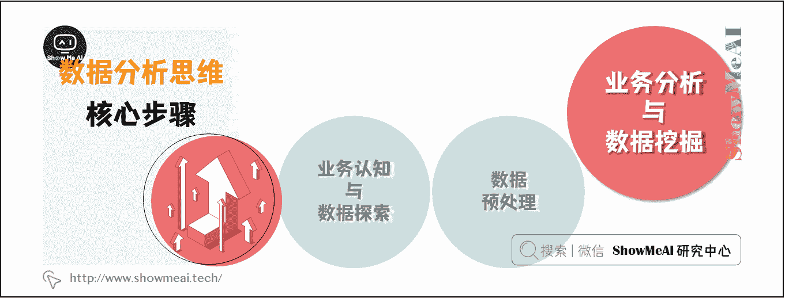

> 数据分析分核心步骤分为：[业务认知与数据探索](http://www.showmeai.tech/article-detail/137)、[数据预处理](http://www.showmeai.tech/article-detail/138)、[业务认知与数据探索](http://www.showmeai.tech/article-detail/139)等三个核心步骤。本文介绍第三个步骤——业务认知与数据探索。

# 一、业务分析模型

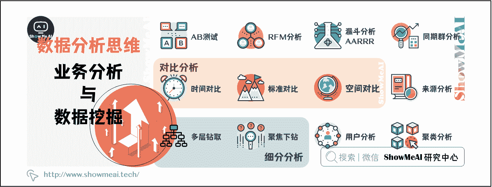

## 1.1 AB 测试

AB 测试，简单来说，就是为同一个产品目标制定两个方案（比如两个页面一个用红色的按钮、另一个用蓝色的按钮），让一部分用户使用 A 方案，另一部分用户使用 B 方案，然后通过日志记录用户的使用情况，并通过结构化的日志数据分析相关指标，如点击率、转化率等，从而得出那个方案更符合预期设计目标，并最终将全部流量切换至符合目标的方案。

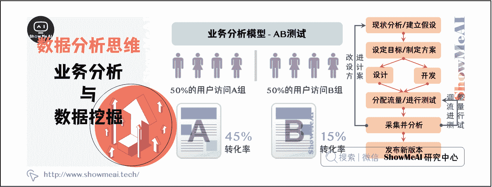

## 1.2 RFM 分析

RFM 模型是衡量客户价值和客户创利能力的重要工具和手段，是最流行、最简单、最有效的客户细分方法之一。

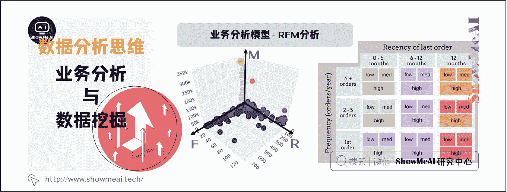

*   Recency 最近一次消费：用户最近一次消费距离现在的时间。例如，1 周前消费过的用户比 1 年前消费过的用户价值大。

*   Frequency 消费频率：用户在统计周期内购买商品的次数。例如，购买频率高的用户价值比偶尔来一次的客户价值大。

*   Monetary 消费金额：用户在统计周期内消费的总金额。例如，消费越多的用户价值越大。

## 1.3 漏斗分析 / AARRR

漏斗分析模型是一套流程式分析模型，已经广泛应用于流量监控、产品目标转化等日常欻据运营与数据分析中，可以帮助我们把握每个转化节点的效率，能够直观的发现问题所在，从而优化整个业务流程。

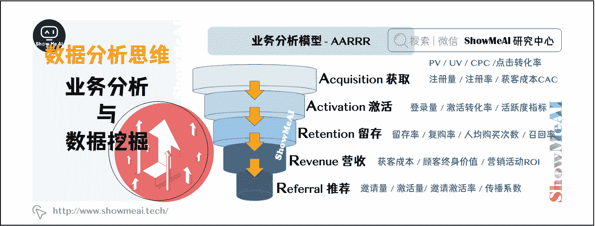

AARRR 是一个产品的生命增长周期，描述了不同阶段的用户参与行为的深度，即： Acquisition（获取用户）、 Activation（激发活跃）、Retention（提高留存）、 Revenue（增加收入）、 Referral（传播推荐）。它能通过层与层之间用户的转化数，即转换率，来定位问题出在哪。

## 1.4 同期群分析

同期群分析，是通过分析性质完全一样的、可对比群体随时间的变化，来分析哪些因素影响用户的留存。只用简单的个图表，就直接描述了用户在一段时间周期的留存或流失变化情况。在数据运营领域十分重要，互联网运营特别需要仔细洞察留存情况。

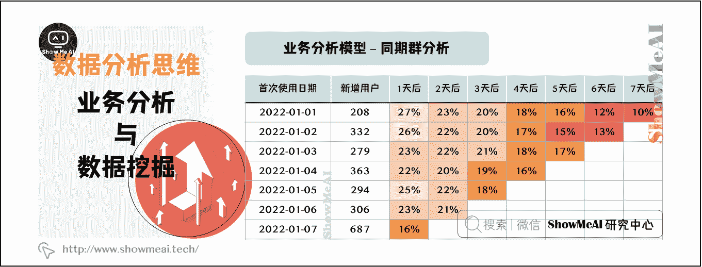

## 1.5 对比分析

对比分析主要是指将两个相互联系的指标数据进行比较，从数量上展示和说明研究对象的规模大小，水平高低，速度快慢等相对数值，通过相同维度下的指标对比，可以发现，找出业务在不同阶段的问题。常见的对比方法包括时间对比，空间对比，标准对比。

### （1）时间对比

最常用的就是同比和环比，通过时间周期的数据对比，了解目前数据水平的高低。

*   同比：对比上一个周期的相同时段做比较。例如，今年 6 月比去年 6 月。

*   环比：联系两个时长相等的时段做比较例如，今年 6 月比去年 5 月。

### （2）标准对比

通过目前数据与设定的目标计划之间的对比，了解目前发展进程，完成进度等，了解差距后可以及时调整策略。例如：在图表中设置目标值、平均值、中位数等标准，与实际数据形成标准对比，分析数据情况。

### （3）空间对比

在相同时间范围内与不同空间指标数据进行对比例如：各省份订单销售数据的差别对比，可以得出产品的优势地区重点突破，平衡人力物力等

## 1.6 来源分析

来源是指访问我们网站的用户是如何到达我们的网站的。要想深入分析不同渠道、不同阶段效果，可以通过 SEM 付费搜索等来源渠道和用户所在地区进行交叉分析，得出不同区域的获客详细信息。维度越细，分析结果也越有价值，从而指导网站的优化，最终达到提升用户转化率的目的。

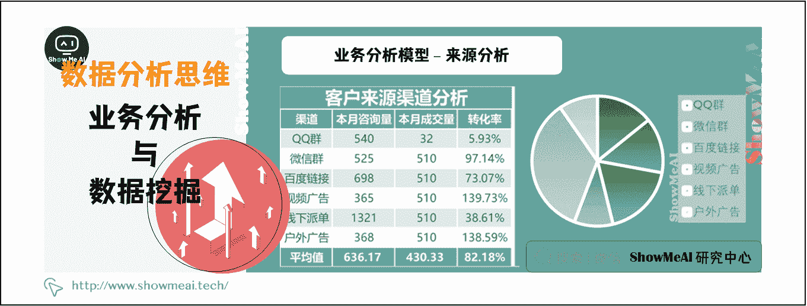

## 1.7 细分分析

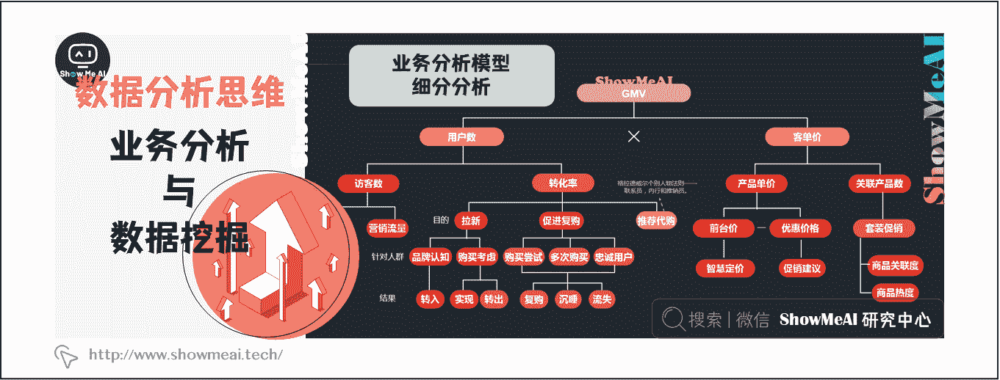

### （1）多层钻取

将每层数据进行嵌套，点击不同维度数据，进行细分分析，通过多层钻取，直接在图表中点击查看细分数据，每层数据均可选择适合的图表类型进行展。

### （2）聚焦下钻

对于数据中的一些重点数据，进行聚焦分析，在整体分析中，想要查看特别关注的部分数据详情，可以使用聚焦及下钻的功能，进行自由分析。

## 1.8 用户分析

常用的用户分析方法包括：活跃分析，留存分析，用户分群，用户画像，用户细查等。

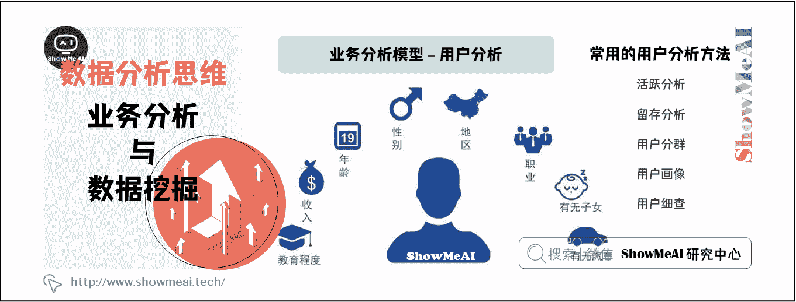

以『活跃分析』为例，可以将用户活跃细分为浏览活跃、互动活跃、交易活跃等，通过活跃行为的细分，掌握关键行为指标。然后，通过用户行为事件序列，对用户属性进行分群，观察分群用户的访问、浏览、注册、互动、交易等行为，从而真正把握不同用户类型的特点，提供有针对性的产品和服务。

## 1.9 聚类分析

聚类分析是将数据分为相对同质的群组的分析方法。网站分析中的聚类主要分为：用户聚类、页面或内容聚类或来源聚类。用户聚类主要体现为用户分群，用户标签法页面聚类则主要是相似、相关页面分组，来源聚类主要包括渠道、关键词等。

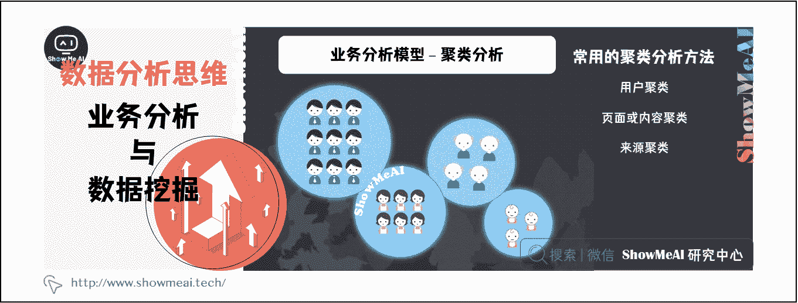

# 二、数据挖掘与机器学习应用

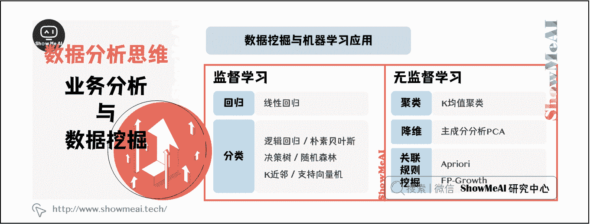

## 2.1 监督学习

*   分类
    *   逻辑回归
    *   朴素贝叶斯
    *   决策树
    *   随机森林
    *   K 近邻
    *   支持向量机
*   回归
    *   线性回归

## 2.2 无监督学习

*   聚类
    *   K 均值聚类
*   降维
    *   主成分分析 PCA

# 资料与代码下载

本教程系列的代码可以在 ShowMeAI 对应的 [**github**](https://github.com/ShowMeAI-Hub/)中下载，可本地 python 环境运行。能访问 Google 的宝宝也可以直接借助 google colab 一键运行与交互操作学习哦！

## 本系列教程涉及的速查表可以在以下地址下载获取：

*   [Pandas 速查表](https://github.com/ShowMeAI-Hub/awesome-AI-cheatsheets/tree/main/Pandas)
*   [Matplotlib 速查表](https://github.com/ShowMeAI-Hub/awesome-AI-cheatsheets/tree/main/Matplotlib)
*   [Seaborn 速查表](https://github.com/ShowMeAI-Hub/awesome-AI-cheatsheets/tree/main/Seaborn)

# 拓展参考资料

*   [Pandas 可视化教程](https://pandas.pydata.org/pandas-docs/stable/user_guide/visualization.html)
*   [Seaborn 官方教程](https://seaborn.pydata.org/tutorial.html)

# ShowMeAI 相关文章推荐

*   [数据分析介绍](http://www.showmeai.tech/article-detail/133)
*   [数据分析思维](http://www.showmeai.tech/article-detail/135)
*   [数据分析的数学基础](http://www.showmeai.tech/article-detail/136)
*   [业务认知与数据初探](http://www.showmeai.tech/article-detail/137)
*   [数据清洗与预处理](http://www.showmeai.tech/article-detail/138)
*   [业务分析与数据挖掘](http://www.showmeai.tech/article-detail/139)
*   [数据分析工具地图](http://www.showmeai.tech/article-detail/140)
*   [统计与数据科学计算工具库 Numpy 介绍](http://www.showmeai.tech/article-detail/141)
*   [Numpy 与 1 维数组操作](http://www.showmeai.tech/article-detail/142)
*   [Numpy 与 2 维数组操作](http://www.showmeai.tech/article-detail/143)
*   [Numpy 与高维数组操作](http://www.showmeai.tech/article-detail/144)
*   [数据分析工具库 Pandas 介绍](http://www.showmeai.tech/article-detail/145)
*   [图解 Pandas 核心操作函数大全](http://www.showmeai.tech/article-detail/146)
*   [图解 Pandas 数据变换高级函数](http://www.showmeai.tech/article-detail/147)
*   [Pandas 数据分组与操作](http://www.showmeai.tech/article-detail/148)
*   [数据可视化原则与方法](http://www.showmeai.tech/article-detail/149)
*   [基于 Pandas 的数据可视化](http://www.showmeai.tech/article-detail/150)
*   [seaborn 工具与数据可视化](http://www.showmeai.tech/article-detail/151)

# ShowMeAI 系列教程推荐

*   [图解 Python 编程：从入门到精通系列教程](http://www.showmeai.tech/tutorials/56)
*   [图解数据分析：从入门到精通系列教程](http://www.showmeai.tech/tutorials/33)
*   [图解 AI 数学基础：从入门到精通系列教程](http://showmeai.tech/tutorials/83)
*   [图解大数据技术：从入门到精通系列教程](http://www.showmeai.tech/tutorials/84)

