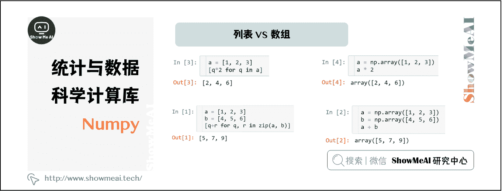
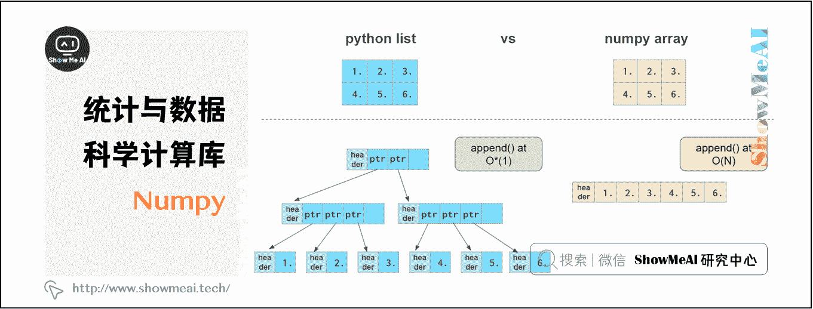

# Python 数据分析 | 统计与科学计算工具库 Numpy 介绍

> 原文：[`blog.csdn.net/ShowMeAI/article/details/123133338`](https://blog.csdn.net/ShowMeAI/article/details/123133338)

作者：[韩信子](https://github.com/HanXinzi-AI)@[ShowMeAI](http://www.showmeai.tech/)
[教程地址](http://www.showmeai.tech/tutorials/33)：[`www.showmeai.tech/tutorials/33`](http://www.showmeai.tech/tutorials/33)
[本文地址](http://www.showmeai.tech/article-detail/141)：[`www.showmeai.tech/article-detail/141`](http://www.showmeai.tech/article-detail/141)
**声明：版权所有，转载请联系平台与作者并注明出处**

# 一、NumPy 介绍

数据分析、机器学习和深度学习领域，很多计算过程可以通过向量和矩阵进行并行化的高效处理，而 NumPy 可以很好地支撑向量化运算。NumPy 包是 Python 生态系统中科学计算的核心支撑之一，数据分析工具库 pandas，计算机视觉工具库 OpenCV 等库都基于 NumPy。熟悉 NumPy 之后，知名的深度学习框架 PyTorch、TensorFlow、Keras 等，也可以直接迁移应用处理的方式，很多操作甚至无需更改就可以在 GPU 运行计算。

n 维数组是 NumPy 的核心概念，大部分数据的操作都是基于 n 维数组完成的。本系列内容覆盖到[1 维数组操作](http://www.showmeai.tech/article-detail/142)、[2 维数组操作](http://www.showmeai.tech/article-detail/143)、[3 维数组操作](http://www.showmeai.tech/article-detail/144)方法，本篇为系列导入文章。

# 二、NumPy 数组

## 2.1 列表 VS 数组

n 维数组是 NumPy 中最核心的结构之一。数组与 Python 列表有些相似：都用来装载数据，都能够快速添加或获取元素，插入和移除元素则比较慢。

但 NumPy 数组因其广播特性可以直接进行算术运算，而 Python 列表则需要用列表推导式等操作来完成。对比示例如下（左侧为列表，右侧为 NumPy 数组）：

## 2.2 Numpy 数组其他特点

*   更紧凑，高维时尤为明显

*   向量化后运算速度比列表更快

*   在末尾添加元素时不如列表高效（左侧为列表，右侧为 NumPy 数组）

*   元素类型一般比较固定

其中，O(N)表示完成操作所需的时间与数组大小成正比（请见 Big-O Cheat Sheet），O(1)表示操作时间与数组大小无关（详见 Time Complexity）。

# 资料与代码下载

本教程系列的代码可以在 ShowMeAI 对应的 [**github**](https://github.com/ShowMeAI-Hub/) 中下载，可本地 python 环境运行。能访问 Google 的宝宝也可以直接借助 google colab 一键运行与交互操作学习哦！

## 本系列教程涉及的速查表可以在以下地址下载获取：

*   [Pandas 速查表](https://github.com/ShowMeAI-Hub/awesome-AI-cheatsheets/tree/main/Pandas)
*   [Matplotlib 速查表](https://github.com/ShowMeAI-Hub/awesome-AI-cheatsheets/tree/main/Matplotlib)
*   [Seaborn 速查表](https://github.com/ShowMeAI-Hub/awesome-AI-cheatsheets/tree/main/Seaborn)

# 拓展参考资料

*   [Pandas 可视化教程](https://pandas.pydata.org/pandas-docs/stable/user_guide/visualization.html)
*   [Seaborn 官方教程](https://seaborn.pydata.org/tutorial.html)

# ShowMeAI 相关文章推荐

*   [数据分析介绍](http://www.showmeai.tech/article-detail/133)
*   [数据分析思维](http://www.showmeai.tech/article-detail/135)
*   [数据分析的数学基础](http://www.showmeai.tech/article-detail/136)
*   [业务认知与数据初探](http://www.showmeai.tech/article-detail/137)
*   [数据清洗与预处理](http://www.showmeai.tech/article-detail/138)
*   [业务分析与数据挖掘](http://www.showmeai.tech/article-detail/139)
*   [数据分析工具地图](http://www.showmeai.tech/article-detail/140)
*   [统计与数据科学计算工具库 Numpy 介绍](http://www.showmeai.tech/article-detail/141)
*   [Numpy 与 1 维数组操作](http://www.showmeai.tech/article-detail/142)
*   [Numpy 与 2 维数组操作](http://www.showmeai.tech/article-detail/143)
*   [Numpy 与高维数组操作](http://www.showmeai.tech/article-detail/144)
*   [数据分析工具库 Pandas 介绍](http://www.showmeai.tech/article-detail/145)
*   [图解 Pandas 核心操作函数大全](http://www.showmeai.tech/article-detail/146)
*   [图解 Pandas 数据变换高级函数](http://www.showmeai.tech/article-detail/147)
*   [Pandas 数据分组与操作](http://www.showmeai.tech/article-detail/148)
*   [数据可视化原则与方法](http://www.showmeai.tech/article-detail/149)
*   [基于 Pandas 的数据可视化](http://www.showmeai.tech/article-detail/150)
*   [seaborn 工具与数据可视化](http://www.showmeai.tech/article-detail/151)

# ShowMeAI 系列教程推荐

*   [图解 Python 编程：从入门到精通系列教程](http://www.showmeai.tech/tutorials/56)
*   [图解数据分析：从入门到精通系列教程](http://www.showmeai.tech/tutorials/33)
*   [图解 AI 数学基础：从入门到精通系列教程](http://showmeai.tech/tutorials/83)
*   [图解大数据技术：从入门到精通系列教程](http://www.showmeai.tech/tutorials/84)

