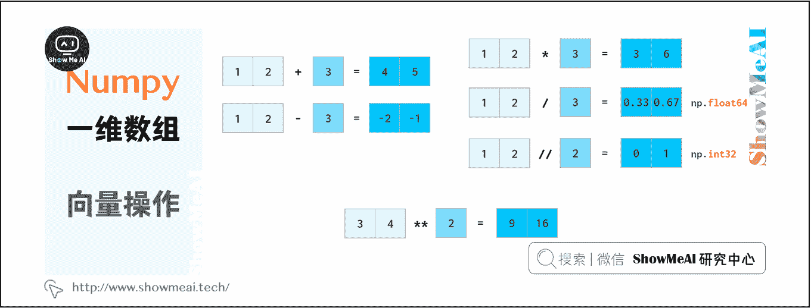

# Python 数据分析 | Numpy 与 1 维数组操作

> 原文：[`blog.csdn.net/ShowMeAI/article/details/123133644`](https://blog.csdn.net/ShowMeAI/article/details/123133644)

作者：[韩信子](https://github.com/HanXinzi-AI)@[ShowMeAI](http://www.showmeai.tech/)
[教程地址](http://www.showmeai.tech/tutorials/33)：[`www.showmeai.tech/tutorials/33`](http://www.showmeai.tech/tutorials/33)
[本文地址](http://www.showmeai.tech/article-detail/142)：[`www.showmeai.tech/article-detail/142`](http://www.showmeai.tech/article-detail/142)
**声明：版权所有，转载请联系平台与作者并注明出处**

* * *

> n 维数组是 NumPy 的核心概念，大部分数据的操作都是基于 n 维数组完成的。本系列内容覆盖到[1 维数组操作](http://www.showmeai.tech/article-detail/142)、[2 维数组操作](http://www.showmeai.tech/article-detail/143)、[3 维数组操作](http://www.showmeai.tech/article-detail/144)方法，本篇讲解 Numpy 与 1 维数组操作。

# 一、向量初始化

可以通过 Python 列表创建 NumPy 数组。

如图中（a），将列表元素转化为一维数组。注意，这里一般会确保列表元素类型相同，否则默认`dtype=’object'`，会影响后续运算，甚至产生语法错误。

由于在数组末尾没有预留空间以快速添加新元素，NumPy 数组无法像 Python 列表那样增长。因此，通常的处理方式包括：

*   在变长 Python 列表中准备好数据，然后将其转换为 NumPy 数组
*   使用 `np.zeros` 或 `np.empty` 预先分配必要的空间（图中 b）

通过图中（c）方法，可以创建一个与某一变量形状一致的空数组。

不止是空数组，通过上述方法还可以将数组填充为特定值：

在 NumPy 中，还可以通过单调序列初始化数组：

如果我们需要浮点数组，可以使用 `arange(3).astype(float)` 这样的操作更改 arange 输出的类型，也可以在参数端使用浮点数，比如 `arange(4.)` 来生产浮点数 Numpy 数组。
以下是 arange 浮点类型数据可能出现的一些问题及解决方案：

图中，0.1 对我们来说是一个有限的十进制数，但对计算机而言，它是一个二进制无穷小数，必须四舍五入为一个近似值。因此，将小数作为 arange 的步长可能导致一些错误。可以通过以下两种方式避免如上错误：

*   使间隔末尾落入非整数步数，但这会降低可读性和可维护性；
*   使用 linspace，这样可以避免四舍五入的错误影响，并始终生成要求数量的元素。
    *   使用 linspace 时尤其需要注意最后一个的数量参数设置，由于它计算点数量，而不是间隔数量，因此上图中数量参数是 11，而不是 10。

随机数组的生成方法如下：

# 二、向量索引

NumPy 可以使用非常直接的方式对数组数据进行访问：

图中，除“fancy indexing”外，其他所有索引方法本质上都是 views：它们并不存储数据，如果原数组在被索引后发生更改，则会反映出原始数组中的更改。

上述所有这些方法都可以改变原始数组，即允许通过分配新值改变原数组的内容。这导致无法通过切片来复制数组。如下是 python 列表和 NumPy 数组的对比：

NumPy 数组支持通过布尔索引获取数据，结合各种逻辑运算符可以有很高级的数据选择方式，这在 Python 列表中是不具备的：

注意，不可以使用 3 <= a <= 5 这样的 Python“三元”比较。

如上所述，布尔索引是可写的。如下图 `np.where` 和 `np.clip` 两个专有函数。

# 三、向量操作

NumPy 支持快速计算，向量运算操作接近 C++速度级别，并不受 Python 循环本身计算慢的限制。NumPy 允许像普通数字一样操作整个数组：

在 python 中，a//b 表示 a div b（除法的商），x**n 表示 xⁿ

浮点数的计算也是如此，NumPy 能够将标量广播到数组：

Numpy 提供了许多数学函数来处理矢量：

向量点乘（内积）和叉乘（外积、向量积）如下：

NumPy 也提供了如下三角函数运算：

数组整体进行四舍五入：

floor 向上取整，ceil 向下取整，round 四舍五入

`np.around` 与 `np.round` 是等效的，这样做只是为了避免 `from numpy import *` 时与`Python around`的冲突（但一般的使用方式是 import numpy as np）。当然，你也可以使用 a.round()。

NumPy 还可以实现以下功能：

以上功能都存在相应的 nan-resistant 变体：例如`nansum`，`nanmax`等

在 NumPy 中，排序函数功能有所阉割：

对于一维数组，可以通过反转结果来解决 reversed 函数缺失的不足，但在 2 维数组中该问题变得棘手。

# 四、查找向量中的元素

NumPy 数组并没有 Python 列表中的索引方法，索引数据的对比如下：

index()中的方括号表示 j 或 i&j 可以省略

*   可以通过 `np.where(a==x)[0] [0]`查找元素，但这种方法很不 pythonic，哪怕需要查找的项在数组开头，该方法也需要遍历整个数组。
*   使用 Numba 实现加速查找，`next((i[0] for i, v in np.ndenumerate(a) if v==x), -1)`，在最坏的情况下，它的速度要比 where 慢。
*   如果数组是排好序的，使用`v = np.searchsorted(a, x)`; `return v if a[v]==x else -1`时间复杂度为`O(log N)`，但在这之前，排序的时间复杂度为 O(N log N)。

实际上，通过 C 实现加速搜索并不是困难，问题是浮点数据比较。

# 五、浮点数比较

`np.allclose(a, b)`用于容忍误差之内的浮点数比较。

*   `np.allclose`假定所有比较数字的尺度为 1。如果在纳秒级别上，则需要将默认 atol 参数除以 1e9：`np.allclose(1e-9,2e-9, atol=1e-17)==False`。
*   `math.isclose`不对要比较的数字做任何假设，而是需要用户提供一个合理的 abs_tol 值（`np.allclose`默认的 atol 值 1e-8 足以满足小数位数为 1 的浮点数比较，即`math.isclose(0.1+0.2–0.3, abs_tol=1e-8)==True`。

此外，对于绝队偏差和相对偏差，np.allclose 依然存在一些问题。例如，对于某些值 a、b， allclose(a,b)!=allclose(b,a)，而在`math.isclose`中则不存在这些问题。查看 GitHub 上的浮点数据指南和相应的 NumPy 问题了解更多信息。

# 资料与代码下载

本教程系列的代码可以在 ShowMeAI 对应的 [**github**](https://github.com/ShowMeAI-Hub/) 中下载，可本地 python 环境运行。能访问 Google 的宝宝也可以直接借助 google colab 一键运行与交互操作学习哦！

## 本系列教程涉及的速查表可以在以下地址下载获取：

*   [NumPy 速查表](https://github.com/ShowMeAI-Hub/awesome-AI-cheatsheets/tree/main/Numpy)
*   [Pandas 速查表](https://github.com/ShowMeAI-Hub/awesome-AI-cheatsheets/tree/main/Pandas)
*   [Matplotlib 速查表](https://github.com/ShowMeAI-Hub/awesome-AI-cheatsheets/tree/main/Matplotlib)
*   [Seaborn 速查表](https://github.com/ShowMeAI-Hub/awesome-AI-cheatsheets/tree/main/Seaborn)

# 拓展参考资料

*   [NumPy 教程](https://segmentfault.com/a/1190000023044942)
*   [Python NumPy 教程](https://zhuanlan.zhihu.com/p/20878530)

# ShowMeAI 相关文章推荐

*   [数据分析介绍](http://www.showmeai.tech/article-detail/133)
*   [数据分析思维](http://www.showmeai.tech/article-detail/135)
*   [数据分析的数学基础](http://www.showmeai.tech/article-detail/136)
*   [业务认知与数据初探](http://www.showmeai.tech/article-detail/137)
*   [数据清洗与预处理](http://www.showmeai.tech/article-detail/138)
*   [业务分析与数据挖掘](http://www.showmeai.tech/article-detail/139)
*   [数据分析工具地图](http://www.showmeai.tech/article-detail/140)
*   [统计与数据科学计算工具库 Numpy 介绍](http://www.showmeai.tech/article-detail/141)
*   [Numpy 与 1 维数组操作](http://www.showmeai.tech/article-detail/142)
*   [Numpy 与 2 维数组操作](http://www.showmeai.tech/article-detail/143)
*   [Numpy 与高维数组操作](http://www.showmeai.tech/article-detail/144)
*   [数据分析工具库 Pandas 介绍](http://www.showmeai.tech/article-detail/145)
*   [图解 Pandas 核心操作函数大全](http://www.showmeai.tech/article-detail/146)
*   [图解 Pandas 数据变换高级函数](http://www.showmeai.tech/article-detail/147)
*   [Pandas 数据分组与操作](http://www.showmeai.tech/article-detail/148)
*   [数据可视化原则与方法](http://www.showmeai.tech/article-detail/149)
*   [基于 Pandas 的数据可视化](http://www.showmeai.tech/article-detail/150)
*   [seaborn 工具与数据可视化](http://www.showmeai.tech/article-detail/151)

# ShowMeAI 系列教程推荐

*   [图解 Python 编程：从入门到精通系列教程](http://www.showmeai.tech/tutorials/56)
*   [图解数据分析：从入门到精通系列教程](http://www.showmeai.tech/tutorials/33)
*   [图解 AI 数学基础：从入门到精通系列教程](http://showmeai.tech/tutorials/83)
*   [图解大数据技术：从入门到精通系列教程](http://www.showmeai.tech/tutorials/84)

