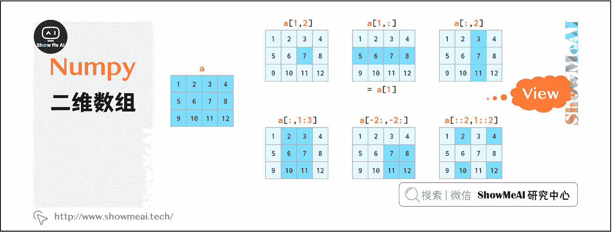
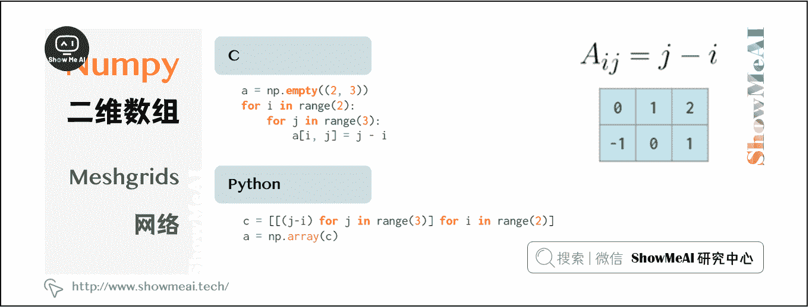

# Python 数据分析 | Numpy 与 2 维数组操作

> 原文：[`blog.csdn.net/ShowMeAI/article/details/123134658`](https://blog.csdn.net/ShowMeAI/article/details/123134658)

作者：[韩信子](https://github.com/HanXinzi-AI)@[ShowMeAI](http://www.showmeai.tech/)
[教程地址](http://www.showmeai.tech/tutorials/33)：[`www.showmeai.tech/tutorials/33`](http://www.showmeai.tech/tutorials/33)
[本文地址](http://www.showmeai.tech/article-detail/143)：[`www.showmeai.tech/article-detail/143`](http://www.showmeai.tech/article-detail/143)
**声明：版权所有，转载请联系平台与作者并注明出处**

> n 维数组是 NumPy 的核心概念，大部分数据的操作都是基于 n 维数组完成的。本系列内容覆盖到[1 维数组操作](http://www.showmeai.tech/article-detail/142)、[2 维数组操作](http://www.showmeai.tech/article-detail/143)、[3 维数组操作](http://www.showmeai.tech/article-detail/144)方法，本篇讲解 Numpy 与 2 维数组操作。

# 一、向量初始化

NumPy 中曾有一个专用的 matrix 类来代表矩阵，后来被弃用，现在 NumPy 中的矩阵和 2 维数组表示同一含义。

### （1）矩阵初始化

矩阵初始化的语法与向量是类似的：

如上要使用双括号，这里的(3,2)是第 1 个参数表示矩阵维度，第 2 个位置参数（可选）是为 dtype（也接受整数）保留的。

### （2）随机矩阵生成

随机矩阵的生成也与向量类似：

### （3）二维数组索引

二维数组的索引语法要比嵌套列表更方便：

“view”表示数组切片时并未进行任何复制，在修改数组后，相应更改也将反映在切片中。

# 二、轴参数

在很多矩阵运算操作中，NumPy 可以实现跨行或跨列的操作。为了适用任意维数的数组，NumPy 引入了 axis 的概念。
axis 参数的值实际上就是维度值，如第一个维是`axis=0` ，第二维是`axis=1`，依此类推。因此，在 2 维数组中，axis=0 指列方向，`axis=1`指行方向。

# 三、矩阵运算

除了+，-，_，/，//和*_ 等数组元素的运算符外，NumPy 提供了@ 运算符计算矩阵乘积：

类似一维向量中的广播机制，NumPy 同样可以通过广播机制实现向量与矩阵，或两个向量之间的混合运算，如下图所示：

注意，上图最后一个示例是对称的逐元素乘法。使用矩阵乘法@可以计算非对称线性代数外积，两个矩阵互换位置后计算内积：

# 四、行向量与列向量

在 NumPy 的 2 维数组中，行向量和列向量是被区别对待的。通常 NumPy 会尽可能使用单一类型的 1 维数组（例如，2 维数组 a 的第 j 列 a[:, j]是 1 维数组）。默认情况下，一维数组在 2 维操作中被视为行向量，因此，将矩阵乘行向量时，使用形状(n,)或(1,n)的向量结果一致。有多种方法可以从一维数组中得到列向量，但并不包括 transpose：

使用 reshape 操作添加新的 axis 可以更新数组形状和索引，也可以将 1 维数组转化为 2 维列向量：

其中，-1 表示在 reshape 是该维度自动决定，方括号中的 None 等同于 np.newaxis，表示在指定位置添加一个空轴。
总结一下，NumPy 中共有三种类型的向量：1 维数组，2 维行向量和 2 维列向量。以下是两两类型转换图：

根据广播规则，一维数组被隐式解释为二维行向量，因此通常不必在这两个数组之间进行转换，对应图中阴影化区域。
严格来说，除一维外的所有数组的大小都是一个向量（如 a.shape == [1,1,1,5,1,1]），因此 NumPy 的输入类型是任意的，但上述三种最为常用。可以使用 np.reshape 将一维矢量转换为这种形式，使用 np.squeeze 可将其恢复。这两个功能都通过 view 发挥作用。

# 五、矩阵操作

矩阵的拼接有以下两种方式：

图示操作仅适用于矩阵堆叠或向量堆叠，而一维数组和矩阵的混合堆叠只有通过 vstack 才可实现，hstack 会导致维度不匹配错误。因为前文提到将一维数组作为行向量，而不是列向量。为此，可以将其转换为行向量，或使用专门的 column_stack 函数执行此操作：

与 stack 对应的是 split，可以对矩阵进行切分处理：

矩阵复制有两种方式：

*   tile 类似粘贴复制；
*   repeat 相当于分页打印。

delete 可以删除特定的行或列：

相应插入操作为 insert：

与 hstack 一样，append 函数无法自动转置 1D 数组，因此需要重新调整向量形状或添加维数，或者使用 column_stack：

如果仅仅是向数组的边界添加常量值，pad 函数是足够的：

# 六、Meshgrids 网格

广播机制使得 meshgrids 变得容易。例如需要下图所示（但尺寸大得多）的矩阵：

上述两种方法由于使用了循环，因此都比较慢。MATLAB 通过构建 meshgrid 处理这种问题。

meshgrid 函数接受任意一组索引，通过 mgrid 切片和 indices 索引生成完整的索引范围，然后，fromfunction 函数根据 I 和 J 实现运算。
在 NumPy 中有一种更好的方法，无需在内存中存储整个 I 和 J 矩阵（虽然 meshgrid 已足够优秀，仅存储对原始向量的引用），仅存储形状矢量，然后通过广播规实现其余内容的处理：

如果没有 indexing =’ij’参数，那么 meshgrid 将更改参数的顺序，即 J,I=np.meshgrid(j,i)——一种用于可视化 3D 绘图的“ xy”模式（祥见该文档）。
除了在二维或三维网格上初始化函数外，网格还可以用于索引数组：

以上方法在稀疏网格中同样适用。

# 七、矩阵统计

就像 sum 函数，NumPy 提供了矩阵不同轴上的 min/max, argmin/argmax, mean/median/percentile, std/var 等函数。

`np.amin`等同于`np.min`，这样做同样是为了避免`from numpy import *`可能的歧义。
2 维及更高维中的 argmin 和 argmax 函数分别返回最小和最大值的索引，通过 unravel_index 函数可以将其转换为二维坐标：

all 和 any 同样也可作用于特定维度：

# 八、矩阵排序

虽然在前文中，axis 参数适用于不同函数，但在二维数组排序中影响较小：

我们通常不需要上述这样的排序矩阵，axis 不是 key 参数的替代。但好在 NumPy 提供了其他功能，这些功能允许按一列或几列进行排序：
**1、`a[a [:,0] .argsort()]`表示按第一列对数组进行排序：**

其中，argsort 返回排序后的原始数组的索引数组。
可以重复使用该方法，但千万不要搞混：
`a = a[a[:,2].argsort()]`
`a = a[a[:,1].argsort(kind='stable')]`
`a = a[a[:,0].argsort(kind='stable')]`

**2、函数 lexsort 可以像上述这样对所有列进行排序，但是它总是按行执行，并且排序的行是颠倒的（即从下到上），其用法如下：**

*   `a[np.lexsort(np.flipud(a[2,5].T))]`，首先按第 2 列排序，然后按第 5 列排序；
*   `a[np.lexsort(np.flipud(a.T))]`，从左到右依次排序各列。

其中，flipud 沿上下方向翻转矩阵（沿 axis = 0 方向，与 a [::-1，…]等效，其中…表示“其他所有维度”），注意区分它与 fliplr，fliplr 用于 1 维数组。

**3、sort 函数还有一个 order 参数，但该方法极不友好，不推荐学习。**

**4、在 pandas 中排序也是不错的选择，因为在 pandas 中操作位置确定，可读性好且不易出错：**

*   `pd.DataFrame(a).sort_values(by=[2,5]).to_numpy()`，先按第 2 列排序，再按第 5 列排序。
*   `pd.DataFrame(a).sort_values().to_numpy()`，按从左到右的顺序对所有列进行排序。

# 资料与代码下载

本教程系列的代码可以在 ShowMeAI 对应的 [**github**](https://github.com/ShowMeAI-Hub/) 中下载，可本地 python 环境运行。能访问 Google 的宝宝也可以直接借助 google colab 一键运行与交互操作学习哦！

## 本系列教程涉及的速查表可以在以下地址下载获取：

*   [NumPy 速查表](https://github.com/ShowMeAI-Hub/awesome-AI-cheatsheets/tree/main/Numpy)
*   [Pandas 速查表](https://github.com/ShowMeAI-Hub/awesome-AI-cheatsheets/tree/main/Pandas)
*   [Matplotlib 速查表](https://github.com/ShowMeAI-Hub/awesome-AI-cheatsheets/tree/main/Matplotlib)
*   [Seaborn 速查表](https://github.com/ShowMeAI-Hub/awesome-AI-cheatsheets/tree/main/Seaborn)

# 拓展参考资料

*   [NumPy 教程](https://segmentfault.com/a/1190000023044942)
*   [Python NumPy 教程](https://zhuanlan.zhihu.com/p/20878530)

# ShowMeAI 相关文章推荐

*   [数据分析介绍](http://www.showmeai.tech/article-detail/133)
*   [数据分析思维](http://www.showmeai.tech/article-detail/135)
*   [数据分析的数学基础](http://www.showmeai.tech/article-detail/136)
*   [业务认知与数据初探](http://www.showmeai.tech/article-detail/137)
*   [数据清洗与预处理](http://www.showmeai.tech/article-detail/138)
*   [业务分析与数据挖掘](http://www.showmeai.tech/article-detail/139)
*   [数据分析工具地图](http://www.showmeai.tech/article-detail/140)
*   [统计与数据科学计算工具库 Numpy 介绍](http://www.showmeai.tech/article-detail/141)
*   [Numpy 与 1 维数组操作](http://www.showmeai.tech/article-detail/142)
*   [Numpy 与 2 维数组操作](http://www.showmeai.tech/article-detail/143)
*   [Numpy 与高维数组操作](http://www.showmeai.tech/article-detail/144)
*   [数据分析工具库 Pandas 介绍](http://www.showmeai.tech/article-detail/145)
*   [图解 Pandas 核心操作函数大全](http://www.showmeai.tech/article-detail/146)
*   [图解 Pandas 数据变换高级函数](http://www.showmeai.tech/article-detail/147)
*   [Pandas 数据分组与操作](http://www.showmeai.tech/article-detail/148)
*   [数据可视化原则与方法](http://www.showmeai.tech/article-detail/149)
*   [基于 Pandas 的数据可视化](http://www.showmeai.tech/article-detail/150)
*   [seaborn 工具与数据可视化](http://www.showmeai.tech/article-detail/151)

# ShowMeAI 系列教程推荐

*   [图解 Python 编程：从入门到精通系列教程](http://www.showmeai.tech/tutorials/56)
*   [图解数据分析：从入门到精通系列教程](http://www.showmeai.tech/tutorials/33)
*   [图解 AI 数学基础：从入门到精通系列教程](http://showmeai.tech/tutorials/83)
*   [图解大数据技术：从入门到精通系列教程](http://www.showmeai.tech/tutorials/84)

