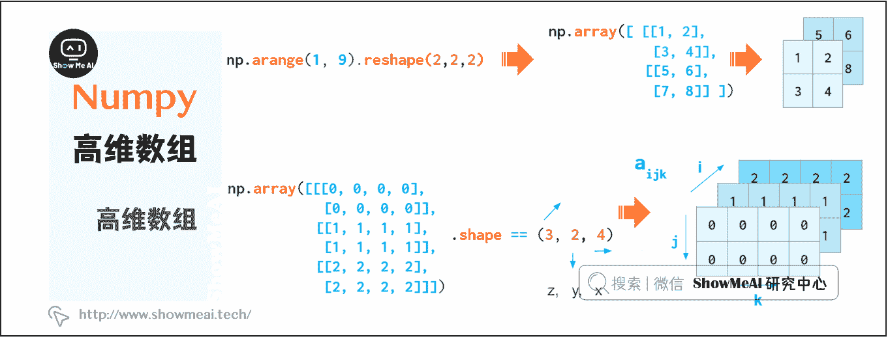
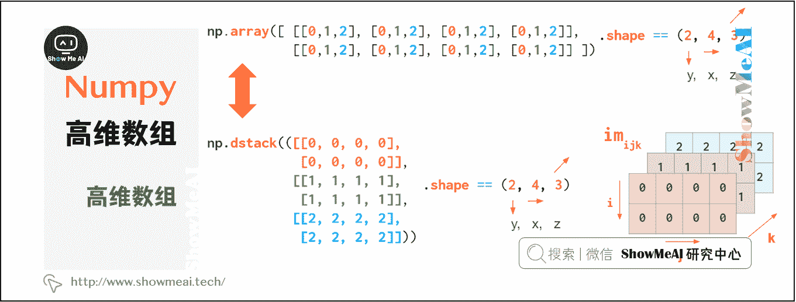
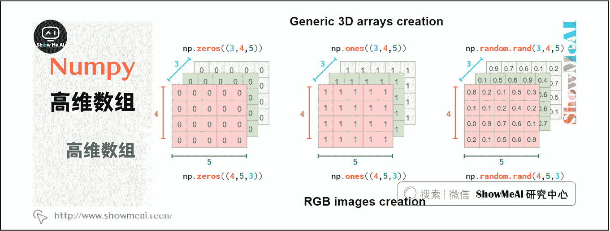
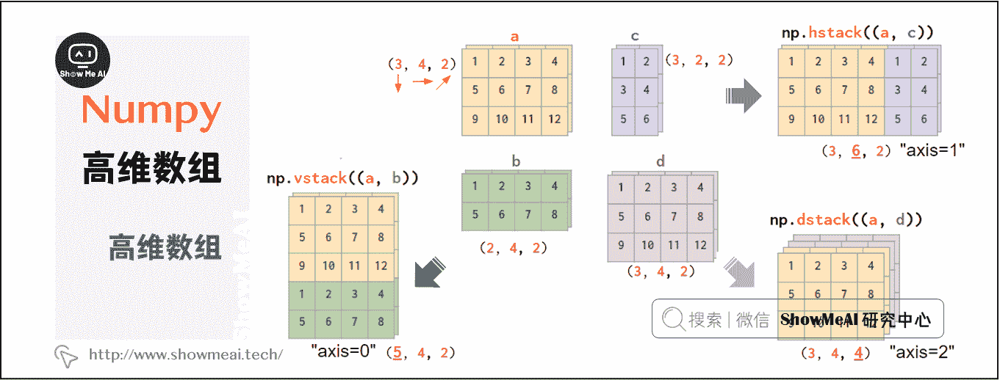
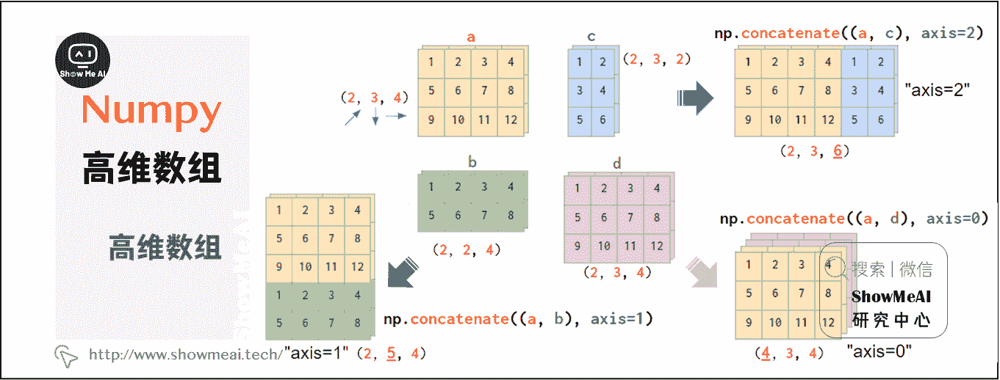
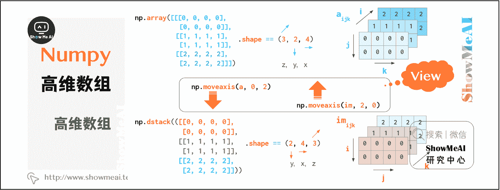
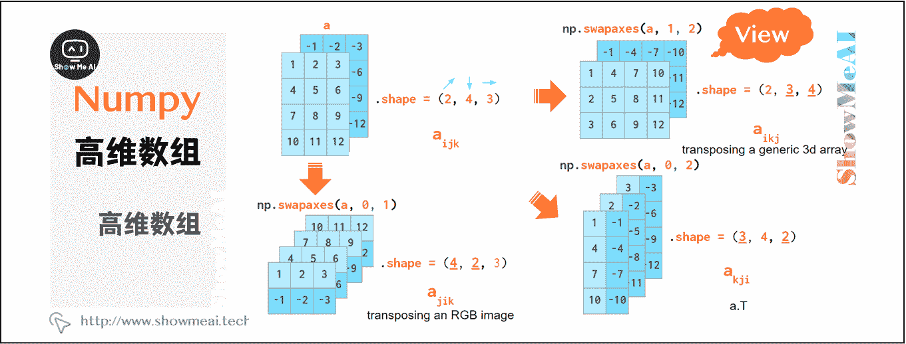
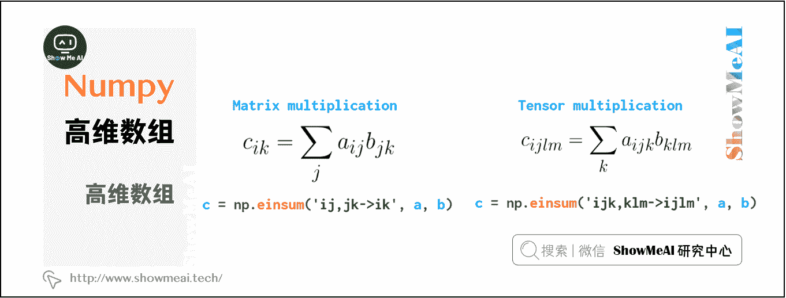

# Python 数据分析 | Numpy 与高维数组操作

> 原文：[`blog.csdn.net/ShowMeAI/article/details/123134962`](https://blog.csdn.net/ShowMeAI/article/details/123134962)

作者：[韩信子](https://github.com/HanXinzi-AI)@[ShowMeAI](http://www.showmeai.tech/)
[教程地址](http://www.showmeai.tech/tutorials/33)：[`www.showmeai.tech/tutorials/33`](http://www.showmeai.tech/tutorials/33)
[本文地址](http://www.showmeai.tech/article-detail/144)：[`www.showmeai.tech/article-detail/144`](http://www.showmeai.tech/article-detail/144)
**声明：版权所有，转载请联系平台与作者并注明出处**

* * *

> n 维数组是 NumPy 的核心概念，大部分数据的操作都是基于 n 维数组完成的。本系列内容覆盖到[1 维数组操作](http://www.showmeai.tech/article-detail/142)、[2 维数组操作](http://www.showmeai.tech/article-detail/143)、[3 维数组操作](http://www.showmeai.tech/article-detail/144)方法，本篇讲解 Numpy 与 3 维、更高维数组的操作。

有时候我们会使用到 3 维或者更高维的 NumPy 数组（比如计算机视觉的应用中），通过重塑 1 维向量或转换嵌套 Python 列表来创建 3 维数组时，索引分别对应(z,y,x)。索引 z 是平面编号，(y,x)坐标在该平面上移动，如下图所示：

通过上述索引顺序，可以方便的保留灰度图像，a[i]表示第 i 个图像。

但这样的索引顺序并不具有广泛性，例如在处理 RGB 图像时，通常使用(y,x,z)顺序：首先是两个像素坐标，然后才是颜色坐标（Matplotlib 中的 RGB，OpenCV 中的 BGR）：

这样可以方便地定位特定像素，如`a[i,j]`给出像素(i,j)的 RGB 元组。

因此，几何形状的创建实际取决于你对域的约定：

显然，hstack，vstack 或 dstack 之类的 NumPy 函数并不一定满足这些约定，其默认的索引顺序是(y,x,z)，RGB 图像顺序如下：

如果数据不是这样的布局，使用 concatenate 命令可以方便的堆叠图像，并通过 axis 参数提供索引号：

如果不考虑轴数，可以将数组转换 hstack 和相应形式：

这种转换非常方便，该过程只是混合索引的顺序重排，并没有实际的复制操作。

通过混合索引顺序可实现数组转置，掌握该方法将加深你对 3 维数据的了解。根据确定的轴顺序，转置数组平面的命令有所不同：对于通用数组，交换索引 1 和 2，对于 RGB 图像交换 0 和 1：

注意，`transpose（a.T）`的默认轴参数会颠倒索引顺序，这不同于上述述两种索引顺序。

广播机制同样适用多维数组，更多详细信息可参阅笔记“ NumPy 中的广播”。

最后介绍`einsum(Einstein summation)`函数，这将使你在处理多维数组时避免很多 Python 循环，代码更为简洁：

该函数对重复索引的数组求和。在一般情况下，使用`np.tensordot(a,b,axis=1)`就可以，但在更复杂的情况下，einsum 速度更快，读写更容易。

# 资料与代码下载

本教程系列的代码可以在 ShowMeAI 对应的 [**github**](https://github.com/ShowMeAI-Hub/) 中下载，可本地 python 环境运行。能访问 Google 的宝宝也可以直接借助 google colab 一键运行与交互操作学习哦！

## 本系列教程涉及的速查表可以在以下地址下载获取：

*   [NumPy 速查表](https://github.com/ShowMeAI-Hub/awesome-AI-cheatsheets/tree/main/Numpy)
*   [Pandas 速查表](https://github.com/ShowMeAI-Hub/awesome-AI-cheatsheets/tree/main/Pandas)
*   [Matplotlib 速查表](https://github.com/ShowMeAI-Hub/awesome-AI-cheatsheets/tree/main/Matplotlib)
*   [Seaborn 速查表](https://github.com/ShowMeAI-Hub/awesome-AI-cheatsheets/tree/main/Seaborn)

# 拓展参考资料

*   [NumPy 教程](https://segmentfault.com/a/1190000023044942)
*   [Python NumPy 教程](https://zhuanlan.zhihu.com/p/20878530)

# ShowMeAI 相关文章推荐

*   [数据分析介绍](http://www.showmeai.tech/article-detail/133)
*   [数据分析思维](http://www.showmeai.tech/article-detail/135)
*   [数据分析的数学基础](http://www.showmeai.tech/article-detail/136)
*   [业务认知与数据初探](http://www.showmeai.tech/article-detail/137)
*   [数据清洗与预处理](http://www.showmeai.tech/article-detail/138)
*   [业务分析与数据挖掘](http://www.showmeai.tech/article-detail/139)
*   [数据分析工具地图](http://www.showmeai.tech/article-detail/140)
*   [统计与数据科学计算工具库 Numpy 介绍](http://www.showmeai.tech/article-detail/141)
*   [Numpy 与 1 维数组操作](http://www.showmeai.tech/article-detail/142)
*   [Numpy 与 2 维数组操作](http://www.showmeai.tech/article-detail/143)
*   [Numpy 与高维数组操作](http://www.showmeai.tech/article-detail/144)
*   [数据分析工具库 Pandas 介绍](http://www.showmeai.tech/article-detail/145)
*   [图解 Pandas 核心操作函数大全](http://www.showmeai.tech/article-detail/146)
*   [图解 Pandas 数据变换高级函数](http://www.showmeai.tech/article-detail/147)
*   [Pandas 数据分组与操作](http://www.showmeai.tech/article-detail/148)
*   [数据可视化原则与方法](http://www.showmeai.tech/article-detail/149)
*   [基于 Pandas 的数据可视化](http://www.showmeai.tech/article-detail/150)
*   [seaborn 工具与数据可视化](http://www.showmeai.tech/article-detail/151)

# ShowMeAI 系列教程推荐

*   [图解 Python 编程：从入门到精通系列教程](http://www.showmeai.tech/tutorials/56)
*   [图解数据分析：从入门到精通系列教程](http://www.showmeai.tech/tutorials/33)
*   [图解 AI 数学基础：从入门到精通系列教程](http://showmeai.tech/tutorials/83)
*   [图解大数据技术：从入门到精通系列教程](http://www.showmeai.tech/tutorials/84)

