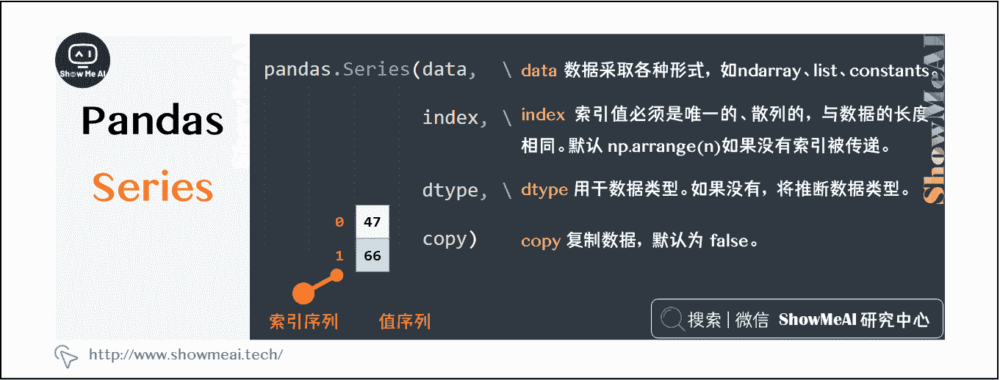
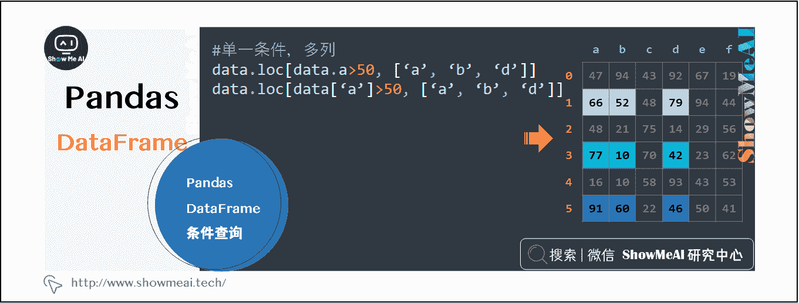
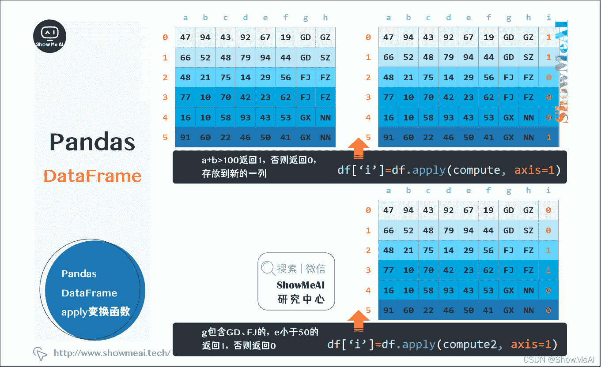

# Python 数据分析 | Pandas 核心操作函数大全

> 原文：[`blog.csdn.net/ShowMeAI/article/details/123135448`](https://blog.csdn.net/ShowMeAI/article/details/123135448)


作者：[韩信子](https://github.com/HanXinzi-AI)@[ShowMeAI](http://www.showmeai.tech/)
[教程地址](http://www.showmeai.tech/tutorials/33)：[`www.showmeai.tech/tutorials/33`](http://www.showmeai.tech/tutorials/33)
[本文地址](http://www.showmeai.tech/article-detail/146)：[`www.showmeai.tech/article-detail/146`](http://www.showmeai.tech/article-detail/146)
**声明：版权所有，转载请联系平台与作者并注明出处**


当我们提到 python 数据分析的时候，大部分情况下都会使用 Pandas 进行操作。本篇为 pandas 系列的导语，对 pandas 进行简单介绍，整个系列覆盖以下内容：

*   [图解 Pandas 核心操作函数大全](http://www.showmeai.tech/article-detail/146)
*   [图解 Pandas 数据变换高级函数](http://www.showmeai.tech/article-detail/147)
*   [Pandas 数据分组与操作](http://www.showmeai.tech/article-detail/148)

本篇为『图解 Pandas 核心操作函数大全』，讲解 Pandas 进行数据操作和处理的核心数据结构：Series、DataFrame 和 Index。

# 一、Pandas Series

Series 是一个一维的数组对象，它包含一个值序列和一个对应的索引序列。 Numpy 中的一维数组也有隐式定义的整数索引，可以通过它获取元素值，而 Series 用一种显式定义的索引与元素关联。
显式索引让 Series 对象拥有更强的能力，索引可以是整数或别的类型（比如字符串），索引可以重复，也不需要连续，自由度非常高。

```py
pandas.Series(data, index, dtype, copy) 
```



## 1.1 从 numpy array 创建 Series

如果数据是 ndarray，则传递的索引必须具有相同的长度。如果没有传递索引值，那么默认的索引将是范围(n)，其中 n 是数组长度，即 `[0,1,2,3…,range(len(array))-1]` 。

```py
pandas.Series(np.array([47, 66, 48, 77, 16, 91])) 
```


## 1.2 从字典创建 Series

字典(dict)可以作为输入传递。如果没有指定索引，则按排序顺序取得字典键以构造索引。如果传递了索引，索引中与标签对应的数据中的值将被拉出。

```py
pandas.Series({‘a’:47, ‘b’:66, ‘c’:48, ‘d’:77, ‘e’:16, ‘f’:91,}) 
```


## 1.3 Series 数据的访问

通过各种方式访问 Series 数据，系列中的数据可以使用类似于访问 numpy 中的 ndarray 中的数据来访问。

```py
data
data[0]
data[ :3]
data[0:3]
data[2:4]
data[4:] 
```


## 1.4 Series 的聚合统计

Series 有很多的聚合函数，可以方便的统计最大值、求和、平均值等


# 二、DataFrame(数据帧)

DataFrame 是 Pandas 中使用最频繁的核心数据结构，表示的是二维的矩阵数据表，类似关系型数据库的结构，每一列可以是不同的值类型，比如数值、字符串、布尔值等等。

DataFrame 既有行索引，也有列索引，它可以被看做为一个共享相同索引的 Series 的字典。它的列的类型可能不同，我们也可以把 Dataframe 想象成一个电子表格或 SQL 表。


```py
pandas.DataFrame(data, index, columns, dtype, copy) 
```


## 2.1 从列表创建 DataFrame

从列表中很方便的创建一个 DataFrame，默认行列索引从 0 开始。

```py
s = [
[47, 94, 43, 92, 67, 19],
[66, 52, 48, 79, 94, 44],
[48, 21, 75, 14, 29, 56], 
[77, 10, 70, 42, 23, 62], 
[16, 10, 58, 93, 43, 53],
[91, 60, 22, 46, 50, 41],
]
pandas.DataFrame(s) 
```


## 2.2 从字典创建 DataFrame

从字典创建 DataFrame，自动按照字典进行列索引，行索引从 0 开始。

```py
s = [
‘a’:[47, 66, 48, 77, 16, 91],
‘b’:[94, 52, 21, 10, 10, 60],
‘c’:[43, 48, 75, 70, 58, 22], 
‘d’:[92, 79, 14, 42, 93, 46], 
‘e’:[67, 94, 29, 23, 43, 50],
‘f’:[19, 44, 56, 62, 55, 41],
]
pandas.DataFrame(s, columns=‘a’,‘b’,‘c’,‘d’,‘e’,‘f’)) 
```

![从字典创建 DataFrame

## 2.3 pandas Dataframe 列选择

在刚学 Pandas 时，行选择和列选择非常容易混淆，在这里进行一下整理常用的列选择。

```py
data[[‘a’]]      # 返回 a 列，DataFrame 格式
data.iloc[:,0]   # 返回 a 列，Series 格式
data.a           # 返回 a 列，Series 格式
data[‘a’]        # 返回 a 列，Series 格式

data.iloc[:,[0,3,4]]
data[[‘a’, ‘d’, ‘e’]]
data.iloc[:,[‘a’, ‘d’, ‘e’]]
data.iloc[:,2:]    # 第 3 列及以后
data.iloc[:,2:5]   # 第 3、4、5 列
data.iloc[:,:2]    # 开始两列 
```


## 2.4 pandas Dataframe 行选择

整理多种行选择的方法，总有一种适合你的。

```py
data[1:2]
data.loc[1:1]
data.loc[1] #返回 Series 格式

data.iloc[-1:]
data[-1:]
data.tail(1) 
```


```py
data[2:5]
data.loc[2:4]

data.iloc[[2, 3, 5],:] 
```


```py
data.head(2)
data.tail(2)

data.sample(3) 
```


## 2.5 pandas Dataframe 返回指定行列

pandas 的 DataFrame 非常方便的提取数据框内的数据。

```py
data.iat[1, 2]

data.iloc[[2, 3, 5],[11, 4]] 
```


## 2.6 pandas Dataframe 条件查询

对各类数值型、文本型，单条件和多条件进行行选择

```py
data.[data.a>50]
data[data[‘a’]>50]
data.loc[data.a>50,:]
data.loc[data[‘a’]>50,:] 
```


```py
data.loc[(data.a>40) & (data.b>60),:]
data[(data.a>40)&(data.b>40)] 
```


```py
data.loc[data.a>50, [‘a’, ‘b’, ‘d’]]
data.loc[data[‘a’]>50, [‘a’, ‘b’, ‘d’]] 
```



```py
data.loc[(data.a>50)|(data.g==‘GD’),[‘a’, ‘b’, ‘g’]]
data.loc[(data.a>50)|(data.g.isin([‘GD’, ‘SH’])),[‘a’, ‘b’, ‘g’]] 
```


## 2.7 pandas Dataframe 聚合

可以按行、列进行聚合，也可以用 pandas 内置的 describe 对数据进行操作简单而又全面的数据聚合分析。

```py
data.sum(axis=1)
numpy.mean(data.values)
data.sum(axis=0) 
```


```py
data.describe() 
```


## 2.8 pandas Dataframe 中的聚合函数

```py
data.function(axis=0)  # 按列计算
data.function(axis=1)  # 按行计算 
```


## 2.9 pandas Dataframe 分组统计

可以按照指定的多列进行指定的多个运算进行汇总统计。

```py
df.groupby(‘g’).sum
df.groupby(‘g’)([‘d’]).agg([numpy.sum, numpy.mean, numpy.std])
df.groupby([‘g’, ‘h’]).mean 
```


## 2.10 pandas Dataframe 透视表

透视表是 pandas 的一个强大的操作，大量的参数完全能满足你个性化的需求。

```py
pandas.pivot_table(df, index=‘g’, values=‘a’, columns=[‘h’], aggfunc=[numpy.sum], fill_value = 0, margins=True) 
```


## 2.11 pandas Dataframe 处理缺失值

pandas 对缺失值有多种处理办法，满足各类需求。

```py
data.dropna(axis=0)

data.dropna(axis=1)

data.dropna(axis=0) 
```


## 2.12 pandas Dataframe 查找替换

pandas 提供简单的查找替换功能，如果要复杂的查找替换，可以使用`map()`、`apply()`和 `applymap()`

```py
data.replace(‘GD’, ‘GDS’)

df.loc[df.a>50, ‘a’]=888 
```


## 2.13 pandas Dataframe 多数据源合并

两个 DataFrame 的合并，pandas 会自动按照索引对齐，可以指定两个 DataFrame 的对齐方式，如内连接外连接等，也可以指定对齐的索引列。

```py
df3 = pandas.merge(df1, df2, how=‘inner’)

df3 = pandas.merge(df1, df2, how=‘inner’, left_index=True, right_index=True) 
```


## 2.14 pandas Dataframe 更改列名

pandas 要对 Dataframe 的列名进行修改，操作如下：

```py
data.columns=[‘a’, ‘b’, ‘c’, ‘d’, ‘’e, ‘f’] 
```


## 2.15 pandas Dataframe 的 apply 变换函数

这是 pandas 的一个强大的函数，可以针对每一个记录进行单值运算，无需手动写循环进行处理。

```py
df[‘i’]=df.apply(compute, axis=1)  # a+b>100 返回 1，否则返回 0，存放到新的一列 
```

```py
df[‘i’]=df.apply(compute2, axis=1)  # g 包含 GD、FJ 的，e 小于 50 的，返回 1，否则返回 0 
```



```py
def compute(arr):
   a = arr['a']
   b = arr['b']
   if a+b>100:
       return 1
   else:
       return 0 
```

```py
def compute2(arr):
   a = arr['e']
   b = arr['g']
   if (g in ['GD','FJ']) and (e<50):
       return 1
   else:
       return 0 
```


# 资料与代码下载

本教程系列的代码可以在 ShowMeAI 对应的 [**github**](https://github.com/ShowMeAI-Hub/) 中下载，可本地 python 环境运行。能访问 Google 的宝宝也可以直接借助 google colab 一键运行与交互操作学习哦！

## 本系列教程涉及的速查表可以在以下地址下载获取：

*   [Pandas 速查表](https://github.com/ShowMeAI-Hub/awesome-AI-cheatsheets/tree/main/Pandas)
*   [NumPy 速查表](https://github.com/ShowMeAI-Hub/awesome-AI-cheatsheets/tree/main/Numpy)
*   [Matplotlib 速查表](https://github.com/ShowMeAI-Hub/awesome-AI-cheatsheets/tree/main/Matplotlib)
*   [Seaborn 速查表](https://github.com/ShowMeAI-Hub/awesome-AI-cheatsheets/tree/main/Seaborn)

# 拓展参考资料

*   [Pandas 官方教程](https://pandas.pydata.org/pandas-docs/stable/user_guide)
*   [Pandas 中文教程](https://www.pypandas.cn/docs/getting_started)

# ShowMeAI 相关文章推荐

*   [数据分析介绍](http://www.showmeai.tech/article-detail/133)
*   [数据分析思维](http://www.showmeai.tech/article-detail/135)
*   [数据分析的数学基础](http://www.showmeai.tech/article-detail/136)
*   [业务认知与数据初探](http://www.showmeai.tech/article-detail/137)
*   [数据清洗与预处理](http://www.showmeai.tech/article-detail/138)
*   [业务分析与数据挖掘](http://www.showmeai.tech/article-detail/139)
*   [数据分析工具地图](http://www.showmeai.tech/article-detail/140)
*   [统计与数据科学计算工具库 Numpy 介绍](http://www.showmeai.tech/article-detail/141)
*   [Numpy 与 1 维数组操作](http://www.showmeai.tech/article-detail/142)
*   [Numpy 与 2 维数组操作](http://www.showmeai.tech/article-detail/143)
*   [Numpy 与高维数组操作](http://www.showmeai.tech/article-detail/144)
*   [数据分析工具库 Pandas 介绍](http://www.showmeai.tech/article-detail/145)
*   [图解 Pandas 核心操作函数大全](http://www.showmeai.tech/article-detail/146)
*   [图解 Pandas 数据变换高级函数](http://www.showmeai.tech/article-detail/147)
*   [Pandas 数据分组与操作](http://www.showmeai.tech/article-detail/148)
*   [数据可视化原则与方法](http://www.showmeai.tech/article-detail/149)
*   [基于 Pandas 的数据可视化](http://www.showmeai.tech/article-detail/150)
*   [seaborn 工具与数据可视化](http://www.showmeai.tech/article-detail/151)

# ShowMeAI 系列教程推荐

*   [图解 Python 编程：从入门到精通系列教程](http://www.showmeai.tech/tutorials/56)
*   [图解数据分析：从入门到精通系列教程](http://www.showmeai.tech/tutorials/33)
*   [图解 AI 数学基础：从入门到精通系列教程](http://showmeai.tech/tutorials/83)
*   [图解大数据技术：从入门到精通系列教程](http://www.showmeai.tech/tutorials/84)

