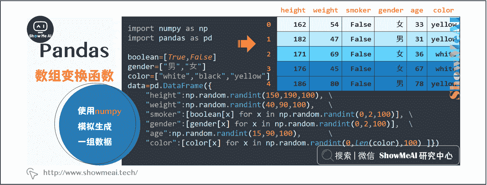
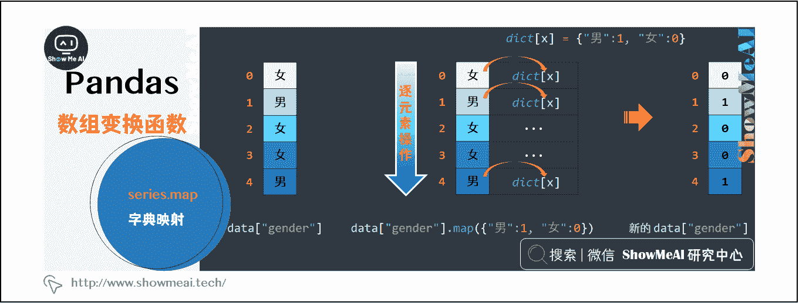
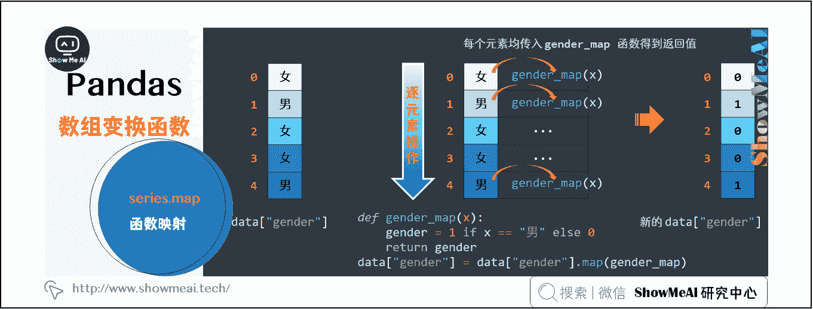
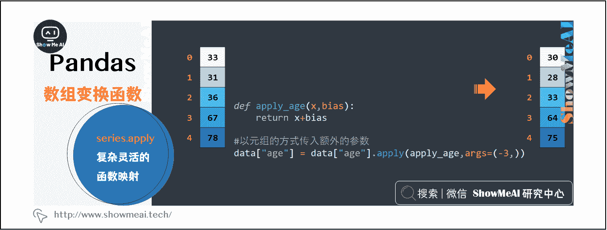
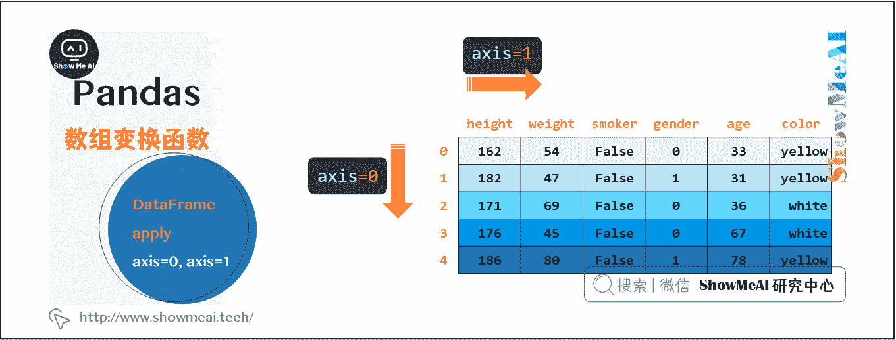
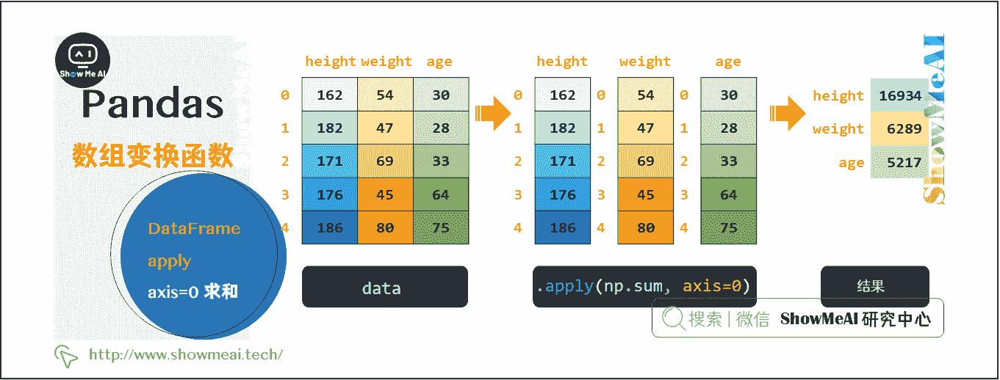
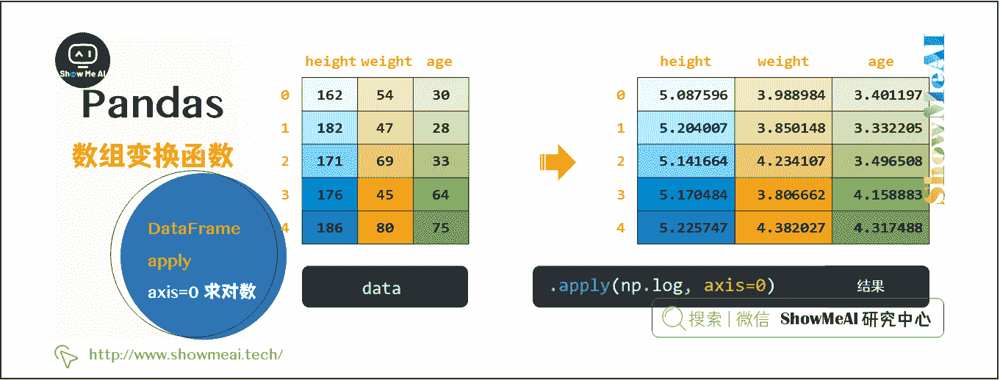
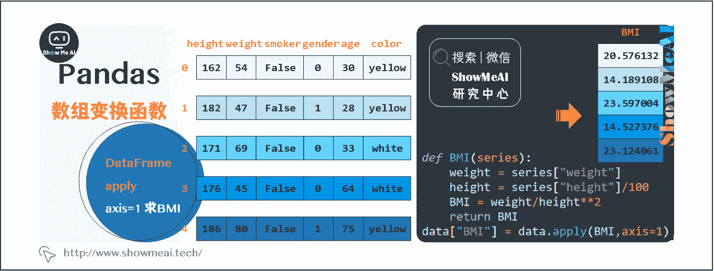
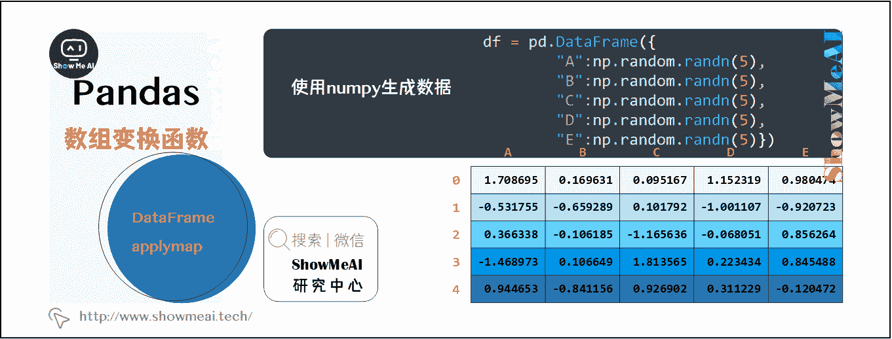
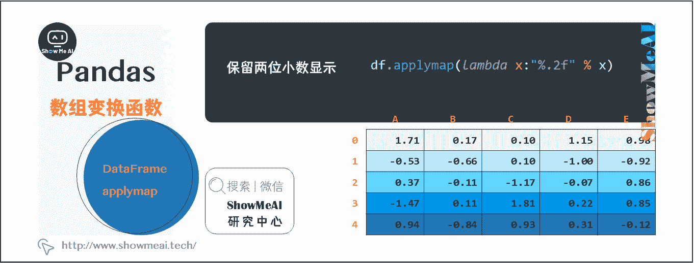

# Python 数据分析 | Pandas 数据变换高级函数

> 原文：[`blog.csdn.net/ShowMeAI/article/details/123135896`](https://blog.csdn.net/ShowMeAI/article/details/123135896)


作者：[韩信子](https://github.com/HanXinzi-AI)@[ShowMeAI](http://www.showmeai.tech/)
[教程地址](http://www.showmeai.tech/tutorials/33)：[`www.showmeai.tech/tutorials/33`](http://www.showmeai.tech/tutorials/33)
[本文地址](http://www.showmeai.tech/article-detail/147)：[`www.showmeai.tech/article-detail/147`](http://www.showmeai.tech/article-detail/147)
**声明：版权所有，转载请联系平台与作者并注明出处**

* * *


当我们提到 python 数据分析的时候，大部分情况下都会使用 Pandas 进行操作。pandas 整个系列覆盖以下内容：

*   [图解 Pandas 核心操作函数大全](http://www.showmeai.tech/article-detail/146)
*   [图解 Pandas 数据变换高级函数](http://www.showmeai.tech/article-detail/147)
*   [Pandas 数据分组与操作](http://www.showmeai.tech/article-detail/148)

本篇为『图解 Pandas 数据变换高级函数』。

# 一、Pandas 的数据变换高级函数

* * *

在数据处理过程中，经常需要对 DataFrame 进行逐行、逐列和逐元素的操作（例如，机器学习中的特征工程阶段）。Pandas 中有非常高效简易的内置函数可以完成，最核心的 3 个函数是 map、apply 和 applymap。下面我们以图解的方式介绍这 3 个方法的应用方法。

首先，通过 numpy 模拟生成一组数据。数据集如下所示，各列分别代表身高（height）、体重（weight）、是否吸烟（smoker）、性别（gender）、年龄（age）和肤色（color）。

```py
import numpy as np
import pandas as pd

boolean=[True,False]
gender=["男","女"]
color=["white","black","yellow"]
data=pd.DataFrame({
    "height":np.random.randint(150,190,100),
    "weight":np.random.randint(40,90,100),
    "smoker":[boolean[x] for x in np.random.randint(0,2,100)],
    "gender":[gender[x] for x in np.random.randint(0,2,100)],
    "age":np.random.randint(15,90,100),
    "color":[color[x] for x in np.random.randint(0,len(color),100) ]
}
) 
```



# 二、Series 数据处理

## 2.1 map 方法

当我们需要把 series 数据逐元素做同一个变换操作时，我们不会使用 for 循环（效率很低），我们会使用 Series.map()来完成，通过简单的一行代码即可完成变换处理。例如，我们把数据集中 gender 列的男替换为 1，女替换为 0。

下面我们通过图解的方式，拆解 map 的操作过程：

### （1）使用字典映射的 map 原理

```py
#①使用字典进行映射
data["gender"] = data["gender"].map({"男":1, "女":0}) 
```



### （2）使用函数映射的 map 原理

```py
#②使用函数
def gender_map(x):
    gender = 1 if x == "男" else 0
    return gender
#注意这里传入的是函数名，不带括号
data["gender"] = data["gender"].map(gender_map) 
```



如上面例子所示，使用 map 时，我们可以通过字典或者函数进行映射处理。对于这两种方式，map 都是把对应的数据逐个当作参数传入到字典或函数中，进行映射得到结果。

## 2.2 apply 方法

当我们需要完成复杂的数据映射操作处理时，我们会使用到 Series 对象的 apply 方法，它和 map 方法类似，但能够传入功能更为复杂的函数。

我们通过一个例子来理解一下。例如，我们要对年龄 age 列进行调整（加上或减去一个值），这个加上或减去的值我们希望通过传入。此时，多了 1 个参数 bias，用 map 方法是操作不了的（传入 map 的函数只能接收一个参数），apply 方法则可以解决这个问题。

```py
def apply_age(x,bias):
    return x+bias

#以元组的方式传入额外的参数
data["age"] = data["age"].apply(apply_age,args=(-3,)) 
```



可以看到 age 列都减了 3，这是个非常简单的例子，apply 在复杂场景下有着更灵活的作用。
总结一下，对于 Series 而言，map 可以完成大部分数据的统一映射处理，而 apply 方法适合对数据做复杂灵活的函数映射操作。

# 三、DataFrame 数据处理

## 3.1 apply 方法

DataFrame 借助 apply 方法，可以接收各种各样的函数（Python 内置的或自定义的）对数据进行处理，非常灵活便捷。
掌握 DataFrame 的 apply 方法需要先了解一下 axis 的概念，在 DataFrame 对象的大多数方法中，都会有 axis 这个参数，它控制了你指定的操作是沿着 0 轴还是 1 轴进行。axis=0 代表操作对列 columns 进行，axis=1 代表操作对行 row 进行，如下图所示。



我们来通过例子理解一下这个方法的使用。例如，我们对 data 中的数值列分别进行取对数和求和的操作。这时使用 apply 进行相应的操作，两行代码可以很轻松地解决。

### （1）按列求和的实现过程

因为是对列进行操作，所以需要指定 axis=0。本次实现的底层，apply 到底做了什么呢？我们来通过图解的方式理解一下：

```py
# 沿着 0 轴求和
data[["height","weight","age"]].apply(np.sum, axis=0) 
```



### （2）按列取对数的实现过程

因为是对列进行操作，所以需要指定 axis=0。本次实现的底层，apply 到底做了什么呢？我们来通过图解的方式理解一下：

```py
# 沿着 0 轴求和
data[["height","weight","age"]].apply(np.sum, axis=0)

# 沿着 0 轴取对数
data[["height","weight","age"]].apply(np.log, axis=0) 
```



当沿着轴 0（axis=0）进行操作时，会将各列(columns)默认以 Series 的形式作为参数，传入到你指定的操作函数中，操作后合并并返回相应的结果。

### （3）按行计算 BMI 指数

那我们实际应用过程中有没有（axis=1）的情况呢？例如，我们要根据数据集中的身高和体重计算每个人的 BMI 指数（体检时常用的指标，衡量人体肥胖程度和是否健康的重要标准），计算公式是：体重指数 BMI=体重/身高的平方（国际单位 kg/㎡）。

这个操作需要对每个样本（行）进行计算，我们使用 apply 并指定 axis=1 来完成，代码和图解如下：

```py
def BMI(series):
    weight = series["weight"]
    height = series["height"]/100
    BMI = weight/height**2
    return BMI

data["BMI"] = data.apply(BMI,axis=1) 
```



当 apply 设置了 axis=1 对行进行操作时，会默认将每一行数据以 Series 的形式（Series 的索引为列名）传入指定函数，返回相应的结果。

**做个总结，DataFrame 中应用 apply 方法：**

> 1.  当 axis=0 时，对每列 columns 执行指定函数；当 axis=1 时，对每行 row 执行指定函数。
> 2.  无论 axis=0 还是 axis=1，其传入指定函数的默认形式均为 Series，可以通过设置 raw=True 传入 numpy 数组。
> 3.  对每个 Series 执行结果后，会将结果整合在一起返回（若想有返回值，定义函数时需要 return 相应的值）
> 4.  当然，DataFrame 的 apply 和 Series 的 apply 一样，也能接收更复杂的函数，如传入参数等，实现原理是一样的，具体用法详见官方文档。

## 3.2 applymap 方法

applymap 是另一个 DataFrame 中可能会用到的方法，它会对 DataFrame 中的每个单元格执行指定函数的操作，如下例所示：

```py
df = pd.DataFrame(
    {

        "A":np.random.randn(5),
        "B":np.random.randn(5),
        "C":np.random.randn(5),
        "D":np.random.randn(5),
        "E":np.random.randn(5),
    }
) 
```



我们希望对 DataFrame 中所有的数保留两位小数显示，applymap 可以帮助我们很快完成，代码和图解如下：

```py
df.applymap(lambda x:"%.2f" % x) 
```



# 资料与代码下载

本教程系列的代码可以在 ShowMeAI 对应的 [**github**](https://github.com/ShowMeAI-Hub/) 中下载，可本地 python 环境运行。能访问 Google 的宝宝也可以直接借助 google colab 一键运行与交互操作学习哦！

## 本系列教程涉及的速查表可以在以下地址下载获取

*   [Pandas 速查表](https://github.com/ShowMeAI-Hub/awesome-AI-cheatsheets/tree/main/Pandas)
*   [NumPy 速查表](https://github.com/ShowMeAI-Hub/awesome-AI-cheatsheets/tree/main/Numpy)
*   [Matplotlib 速查表](https://github.com/ShowMeAI-Hub/awesome-AI-cheatsheets/tree/main/Matplotlib)
*   [Seaborn 速查表](https://github.com/ShowMeAI-Hub/awesome-AI-cheatsheets/tree/main/Seaborn)

# 拓展参考资料

*   [Pandas 官方教程](https://pandas.pydata.org/pandas-docs/stable/user_guide)
*   [Pandas 中文教程](https://www.pypandas.cn/docs/getting_started)

# ShowMeAI 相关文章推荐

*   [数据分析介绍](http://www.showmeai.tech/article-detail/133)
*   [数据分析思维](http://www.showmeai.tech/article-detail/135)
*   [数据分析的数学基础](http://www.showmeai.tech/article-detail/136)
*   [业务认知与数据初探](http://www.showmeai.tech/article-detail/137)
*   [数据清洗与预处理](http://www.showmeai.tech/article-detail/138)
*   [业务分析与数据挖掘](http://www.showmeai.tech/article-detail/139)
*   [数据分析工具地图](http://www.showmeai.tech/article-detail/140)
*   [统计与数据科学计算工具库 Numpy 介绍](http://www.showmeai.tech/article-detail/141)
*   [Numpy 与 1 维数组操作](http://www.showmeai.tech/article-detail/142)
*   [Numpy 与 2 维数组操作](http://www.showmeai.tech/article-detail/143)
*   [Numpy 与高维数组操作](http://www.showmeai.tech/article-detail/144)
*   [数据分析工具库 Pandas 介绍](http://www.showmeai.tech/article-detail/145)
*   [图解 Pandas 核心操作函数大全](http://www.showmeai.tech/article-detail/146)
*   [图解 Pandas 数据变换高级函数](http://www.showmeai.tech/article-detail/147)
*   [Pandas 数据分组与操作](http://www.showmeai.tech/article-detail/148)
*   [数据可视化原则与方法](http://www.showmeai.tech/article-detail/149)
*   [基于 Pandas 的数据可视化](http://www.showmeai.tech/article-detail/150)
*   [seaborn 工具与数据可视化](http://www.showmeai.tech/article-detail/151)

# ShowMeAI 系列教程推荐

*   [图解 Python 编程：从入门到精通系列教程](http://www.showmeai.tech/tutorials/56)
*   [图解数据分析：从入门到精通系列教程](http://www.showmeai.tech/tutorials/33)
*   [图解 AI 数学基础：从入门到精通系列教程](http://showmeai.tech/tutorials/83)
*   [图解大数据技术：从入门到精通系列教程](http://www.showmeai.tech/tutorials/84)

