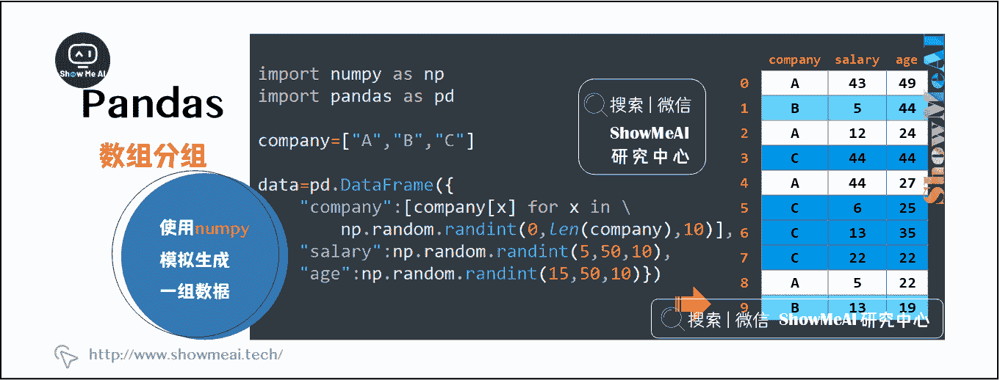
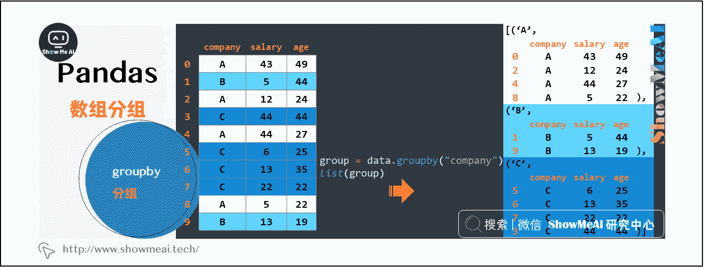
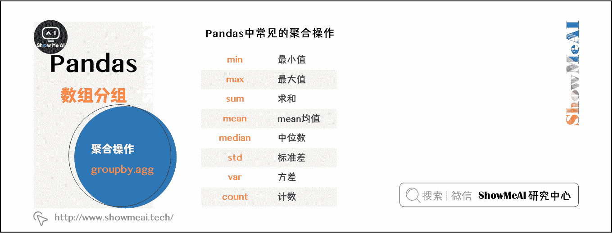
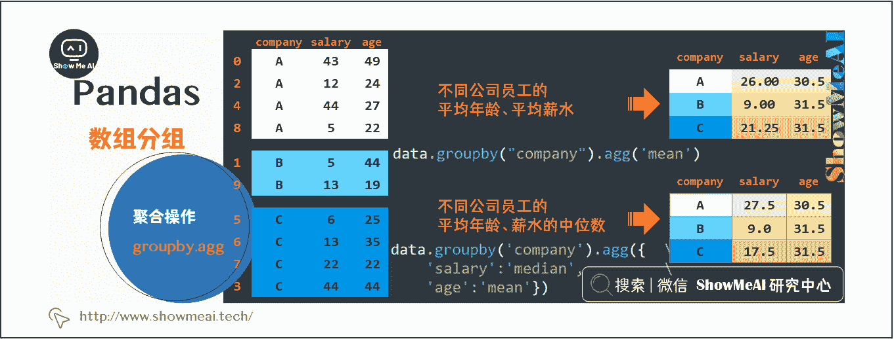
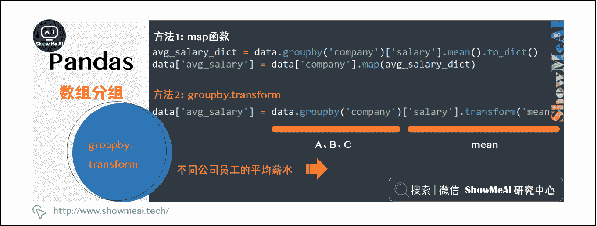
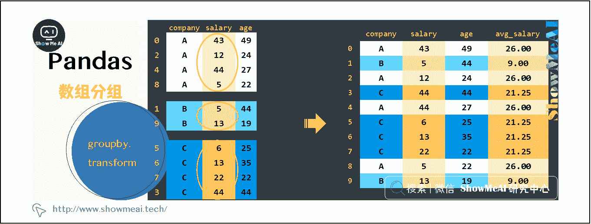
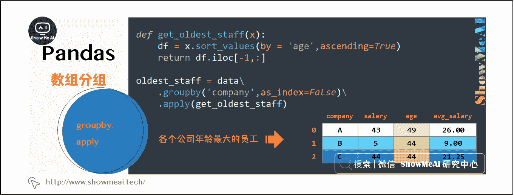

# Python 数据分析 | Pandas 数据分组与操作

> 原文：[`blog.csdn.net/ShowMeAI/article/details/123136343`](https://blog.csdn.net/ShowMeAI/article/details/123136343)


作者：[韩信子](https://github.com/HanXinzi-AI)@[ShowMeAI](http://www.showmeai.tech/)
[教程地址](http://www.showmeai.tech/tutorials/33)：[`www.showmeai.tech/tutorials/33`](http://www.showmeai.tech/tutorials/33)
[本文地址](http://www.showmeai.tech/article-detail/148)：[`www.showmeai.tech/article-detail/148`](http://www.showmeai.tech/article-detail/148)
**声明：版权所有，转载请联系平台与作者并注明出处**


当我们提到 python 数据分析的时候，大部分情况下都会使用 Pandas 进行操作。pandas 整个系列覆盖以下内容：

*   [图解 Pandas 核心操作函数大全](http://www.showmeai.tech/article-detail/146)
*   [图解 Pandas 数据变换高级函数](http://www.showmeai.tech/article-detail/147)
*   [Pandas 数据分组与操作](http://www.showmeai.tech/article-detail/148)

# 一、Pandas 数据分组与操作

在我们进行业务数据分析时，经常要对数据根据 1 个或多个字段分为不同的组（group）进行分析处理。如电商领域可能会根据地理位置分组，社交领域会根据用户画像（性别、年龄）进行分组，再进行后续的分析处理。

Pandas 中可以借助 groupby 操作对 Dataframe 分组操作，本文介绍 groupby 的基本原理及对应的 agg、transform 和 apply 方法与操作。

我们先模拟产出 1 个 Dataframe：

```
import numpy as np
import pandas as pd

company=["A","B","C"]

data=pd.DataFrame({
    "company":[company[x] for x in np.random.randint(0,len(company),10)],
    "salary":np.random.randint(5,50,10),
    "age":np.random.randint(15,50,10)}) 
```



# 二、Groupby 分组及应用

## 2.1 分组

pandas 实现分组操作的很简单，只需要把分组的依据(字段)放入 groupby 中，例如下面示例代码基于 company 分组：

```
group = data.groupby("company") 
```

经过 groupby 处理之后我们会得到一个 DataFrameGroupBy 对象：

```
group 
```

```
# 输出
<pandas.core.groupby.generic.DataFrameGroupBy object at 0x000001C67C072BE0> 
```

这个生成的 DataFrameGroupBy 是什么？data 经过 groupby 处理后发生了什么？

上面返回的 Groupby 处理结果是内存地址，并不利于直观地理解，我们可以把 group 转换成 list 的形式来看一看内部数据和整个过程：

```
list(group) 
```



转换成列表的形式后，可以看到，列表由三个元组组成，每个元组中：

*   第一个元素是组别（这里是按照 company 进行分组，所以最后分为了 A,B,C）
*   第二个元素的是对应组别下的 DataFrame

总结一下，groupby 将原有的 DataFrame 按照指定的字段（这里是 company），划分为若干个分组 DataFrame。groupby 之后可以进行下一步操作，注意，在 groupby 之后的一系列操作（如 agg、apply 等），均是基于子 DataFrame 的操作。

下面我们一起看看 groupby 之后的常见操作。

## 2.2 agg 聚合操作

聚合统计操作是 groupby 后最常见的操作，类比于 SQL 中我们会对数据按照 group 做聚合，pandas 中通过 agg 来完成。聚合操作可以用来求和、均值、最大值、最小值等，下表为 Pandas 中常见的聚合操作：



例如，计算不同公司员工的平均年龄和平均薪水，示例代码如下：

```
data.groupby("company").agg('mean') 
```

或者针对不同字段做不同的计算处理，例如，要计算不同公司员工的平均年龄、薪水的中位数。可以利用字典进行聚合操作：

```
data.groupby('company').agg({'salary':'median','age':'mean'}) 
```

我们对 agg 聚合过程进行图解，如下所示：



## 2.3 transform 变换

transform 是另外一个 pandas 分组后会使用到的方法，我们举例来说明它的用法。

上述 agg 应用例子中，我们计算了不同公司员工的平均薪水，如果现在需要新增一列 avg_salary，代表员工所在的公司的平均薪水（相同公司的员工具有一样的平均薪水），我们就可以借助 transform 来完成。

要完成上述任务，我们需要先求得不同公司的平均薪水，再按照员工和公司的对应关系填充到对应的位置，使用之前学到的 map 方法可以拆解实现如下：

```
avg_salary_dict = data.groupby('company')['salary'].mean().to_dict()

data['avg_salary'] = data['company'].map(avg_salary_dict)

data 
```

而 transform 方法可以帮助我们一行实现全过程：

```
data['avg_salary'] = data.groupby('company')['salary'].transform('mean')

data 
```



下面对 groupby+transform 的过程做图解帮助理解：



注意图中大方框，展示了 transform 和 agg 不一样的计算过程：

*   agg：会计算得到 A，B，C 公司对应的均值并直接返回
*   transform：会对每一条数据求得相应的结果，同一组内的样本会有相同的值，组内求完均值后会按照原索引的顺序返回结果

## 2.4 apply 方法

之前我们介绍过对 Dataframe 使用 apply 进行灵活数据变换操作处理的方法，它支持传入自定义函数，实现复杂数据操作。apply 除了之前介绍的用法，也可以用在 groupby 后，我们一起来学习一下。

对于 groupby 后的 apply，实际上是以分组后的子 DataFrame 作为参数传入指定函数的，基本操作单位是 DataFrame，而之前介绍的 apply 的基本操作单位是 Series。我们通过一个案例来理解一下。

加入我们需要获取各个公司年龄最大的员工的数据，可以通过以下代码实现：

```
def get_oldest_staff(x):
     df = x.sort_values(by = 'age',ascending=True)
     return df.iloc[-1,:]

oldest_staff = data.groupby('company',as_index=False).apply(get_oldest_staff)

oldest_staff 
```

我们对上面的过程图解帮助理解：



本例中的 apply 传入函数的参数由 Series 变成这里的分组 DataFrame。相比于 agg 和 transform，apply 方法拥有更大的灵活性，但它的运行效率会比 agg 和 transform 慢。所以，groupby 之后怼数据做操作，优先使用 agg 和 transform，其次再考虑使用 apply 进行操作。

# 资料与代码下载

本教程系列的代码可以在 ShowMeAI 对应的 [**github**](https://github.com/ShowMeAI-Hub/) 中下载，可本地 python 环境运行。能访问 Google 的宝宝也可以直接借助 google colab 一键运行与交互操作学习哦！

## 本系列教程涉及的速查表可以在以下地址下载获取

*   [Pandas 速查表](https://github.com/ShowMeAI-Hub/awesome-AI-cheatsheets/tree/main/Pandas)
*   [NumPy 速查表](https://github.com/ShowMeAI-Hub/awesome-AI-cheatsheets/tree/main/Numpy)
*   [Matplotlib 速查表](https://github.com/ShowMeAI-Hub/awesome-AI-cheatsheets/tree/main/Matplotlib)
*   [Seaborn 速查表](https://github.com/ShowMeAI-Hub/awesome-AI-cheatsheets/tree/main/Seaborn)

# 拓展参考资料

*   [Pandas 官方教程](https://pandas.pydata.org/pandas-docs/stable/user_guide)
*   [Pandas 中文教程](https://www.pypandas.cn/docs/getting_started)

# ShowMeAI 相关文章推荐

*   [数据分析介绍](http://www.showmeai.tech/article-detail/133)
*   [数据分析思维](http://www.showmeai.tech/article-detail/135)
*   [数据分析的数学基础](http://www.showmeai.tech/article-detail/136)
*   [业务认知与数据初探](http://www.showmeai.tech/article-detail/137)
*   [数据清洗与预处理](http://www.showmeai.tech/article-detail/138)
*   [业务分析与数据挖掘](http://www.showmeai.tech/article-detail/139)
*   [数据分析工具地图](http://www.showmeai.tech/article-detail/140)
*   [统计与数据科学计算工具库 Numpy 介绍](http://www.showmeai.tech/article-detail/141)
*   [Numpy 与 1 维数组操作](http://www.showmeai.tech/article-detail/142)
*   [Numpy 与 2 维数组操作](http://www.showmeai.tech/article-detail/143)
*   [Numpy 与高维数组操作](http://www.showmeai.tech/article-detail/144)
*   [数据分析工具库 Pandas 介绍](http://www.showmeai.tech/article-detail/145)
*   [图解 Pandas 核心操作函数大全](http://www.showmeai.tech/article-detail/146)
*   [图解 Pandas 数据变换高级函数](http://www.showmeai.tech/article-detail/147)
*   [Pandas 数据分组与操作](http://www.showmeai.tech/article-detail/148)
*   [数据可视化原则与方法](http://www.showmeai.tech/article-detail/149)
*   [基于 Pandas 的数据可视化](http://www.showmeai.tech/article-detail/150)
*   [seaborn 工具与数据可视化](http://www.showmeai.tech/article-detail/151)

# ShowMeAI 系列教程推荐

*   [图解 Python 编程：从入门到精通系列教程](http://www.showmeai.tech/tutorials/56)
*   [图解数据分析：从入门到精通系列教程](http://www.showmeai.tech/tutorials/33)
*   [图解 AI 数学基础：从入门到精通系列教程](http://showmeai.tech/tutorials/83)
*   [图解大数据技术：从入门到精通系列教程](http://www.showmeai.tech/tutorials/84)

