# Python 数据分析 | 数据可视化原则与方法

> 原文：[`blog.csdn.net/ShowMeAI/article/details/123136888`](https://blog.csdn.net/ShowMeAI/article/details/123136888)

作者：[韩信子](https://github.com/HanXinzi-AI)@[ShowMeAI](http://www.showmeai.tech/)
[教程地址](http://www.showmeai.tech/tutorials/33)：[`www.showmeai.tech/tutorials/33`](http://www.showmeai.tech/tutorials/33)
[本文地址](http://www.showmeai.tech/article-detail/149)：[`www.showmeai.tech/article-detail/149`](http://www.showmeai.tech/article-detail/149)
**声明：版权所有，转载请联系平台与作者并注明出处**

* * *

# 一、数据可视化介绍

数据可视化是以图示或图形格式表示的数据，以更直观方式理解与分析数据。

我们经常听到一个说法“能用图描述的就不用表，能用表就不用文字”，确实我们在认知上，对于图形的敏感度远比文字高，获取的信息也更丰富。我们在互联网企业中更是随处可见各种数据看板，帮助我们第 1 时间了解数据与业务状况。

本篇内容，我们给大家介绍数据分析中关于可视化的一些核心知识，包括：

*   各类图形及特点
*   不同图形选择方法

# 二、各类图形及特点

接下来给大家介绍下数据可视化图表的基本类型和选用原则，选用正确的数据可视化的图表。

## 2.1 柱形图（Column Chart）

柱形图的局限在于它仅适用于中小规模的数据集，当数据较多时就不易分辨。一般而言，不要超过 10 个。

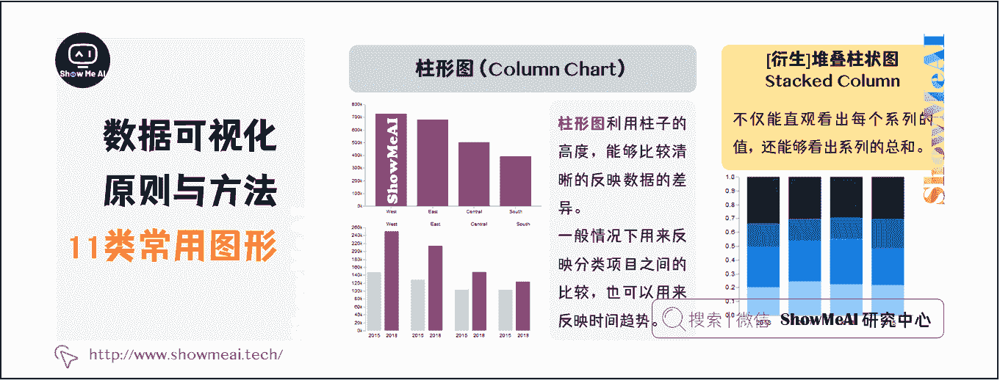

通常来说，柱形图的横轴是时间维度，用户习惯性认为存在时间趋势。如果遇到横轴不是时间维度的情况，建议用颜色区分每根柱子。

## 2.2 条形图(Bar Chart)

条形图用来反映分类项目之间的比较，适合应用于跨类别比较数据。在我们需要比较项类的大小、高低时适合使用条形图。

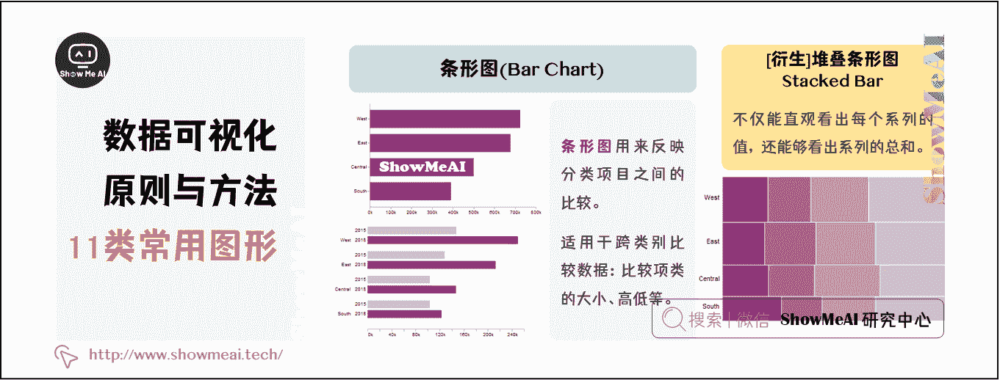

## 2.3 折线图(Line Chart)

折线图用来反映随时间变化的趋势。当我们需要描述事物随时间维度的变化时常常需要使用该图形。

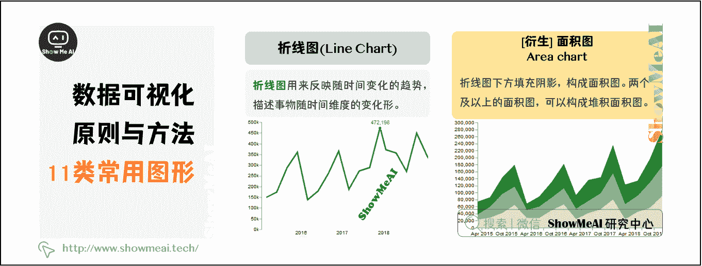

## 2.4 曲线图（Curve）

假如关注的是数据反映的整体趋势，曲线图最适合。

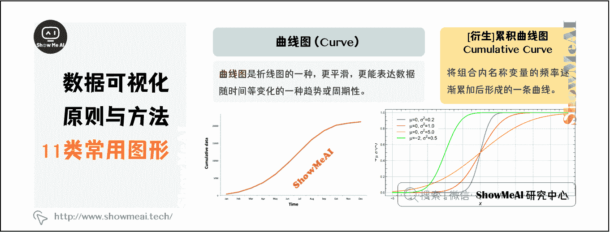

## 2.5 饼图（Pie Chart）

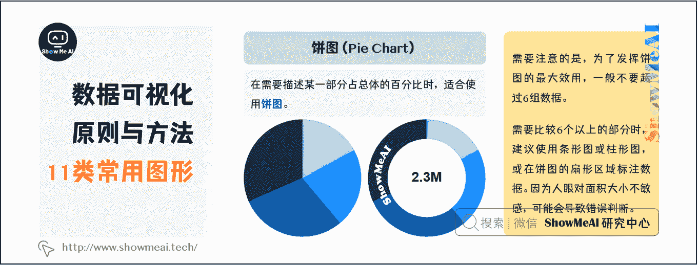

## 2.6 直方图（Histogram）

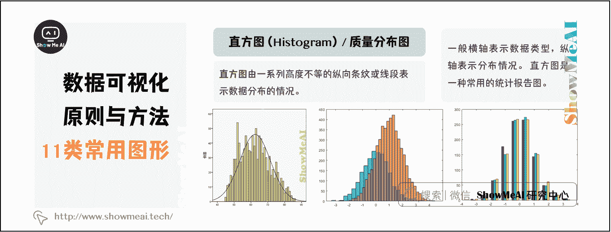

## 2.7 箱线图（Box Plot）

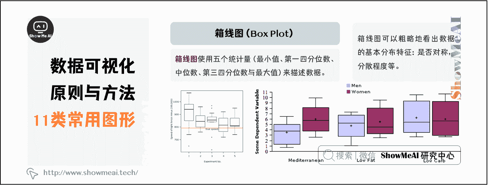

## 2.8 散点图（Scatter Chart）

散点图的数据为三维数据，使用两组数据构成多个坐标点，分析坐标点的分布情况，判断两个变量之间的关联或分布趋势。

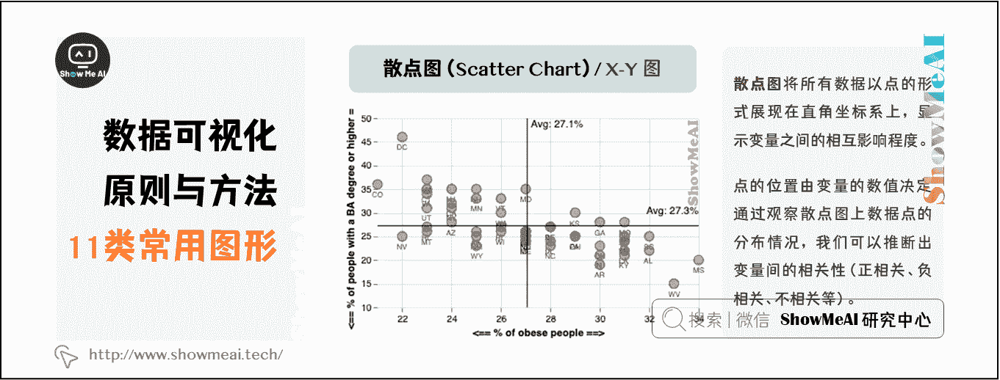

## 2.9 气泡图（Bubble chart）

气泡图是散点图的一种衍生，通过每个点的面积大小来衡量第三维度，适合三维数据的对比，且需要强调第三维，超过三维就搞不定。

## 2.10 雷达图（Radar Chart）

雷达图适用于多维数据（四维以上），且每个维度必须可以排序。数据点一般 6 个左右，太多的话辨别起来有困难。

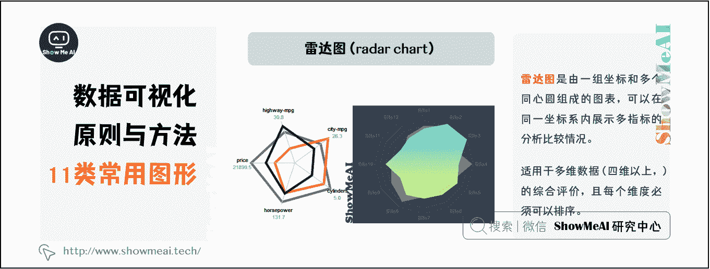

## 2.11 瀑布图（Waterfall）

瀑布可视化，对于显示部分与整体的关系（尤其是负向关系）时非常有用。

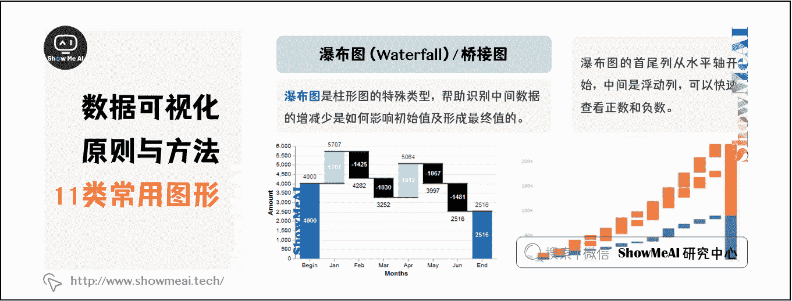

# 三、不同图形选择方法

## 3.1 按应用场景选择

虽然图表种类繁多，但是基于使用场景大致可以分为以下几种情况。

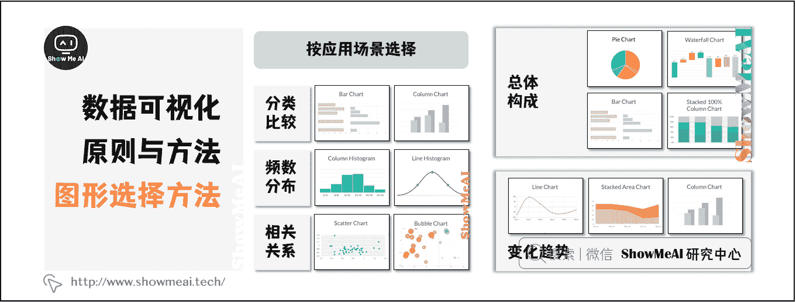

## 3.2 按数据关系选择

根据可视化专家 Andrew Abela 对该数据关系分类方式的提炼，他提出将图表展示的数据关系分为四类：比较、分布、构成和联系。下面对这四种关系以及应用举例和对应的可视化解决方案做了简要的分析。

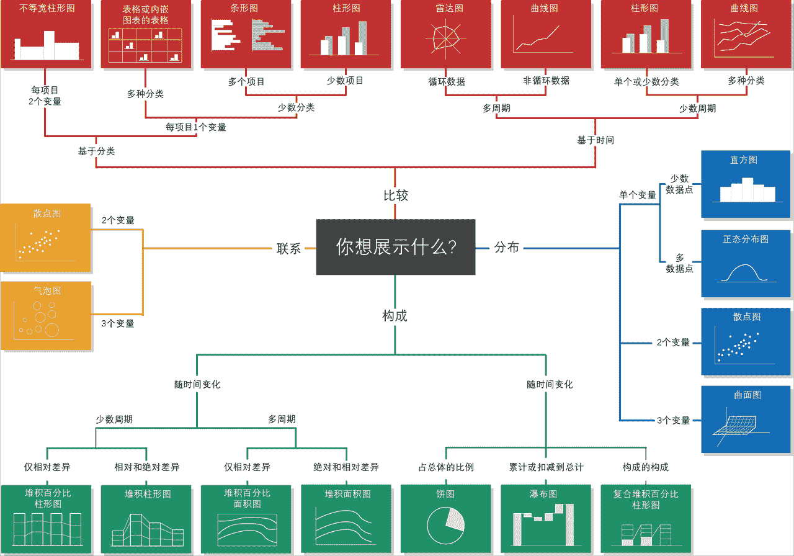

大部分情况下，我们根据这份选择指南按图索骥就可以找到，方便又轻松，在实际应用中，也存在需要展示多种数据关系的情况，那么对应的图表类型也是每种关系对应的基本图形的综合运用。例如多个时间点上构成的比较等。

# 资料与代码下载

本教程系列的代码可以在 ShowMeAI 对应的 [**github**](https://github.com/ShowMeAI-Hub/) 中下载，可本地 python 环境运行。能访问 Google 的宝宝也可以直接借助 google colab 一键运行与交互操作学习哦！

## 本系列教程涉及的速查表可以在以下地址下载获取：

*   [Pandas 速查表](https://github.com/ShowMeAI-Hub/awesome-AI-cheatsheets/tree/main/Pandas)
*   [NumPy 速查表](https://github.com/ShowMeAI-Hub/awesome-AI-cheatsheets/tree/main/Numpy)
*   [Matplotlib 速查表](https://github.com/ShowMeAI-Hub/awesome-AI-cheatsheets/tree/main/Matplotlib)
*   [Seaborn 速查表](https://github.com/ShowMeAI-Hub/awesome-AI-cheatsheets/tree/main/Seaborn)

# 拓展参考资料

*   [Pandas 可视化教程](https://pandas.pydata.org/pandas-docs/stable/user_guide/visualization.html)
*   [Seaborn 官方教程](https://seaborn.pydata.org/tutorial.html)

# ShowMeAI 相关文章推荐

*   [数据分析介绍](http://www.showmeai.tech/article-detail/133)
*   [数据分析思维](http://www.showmeai.tech/article-detail/135)
*   [数据分析的数学基础](http://www.showmeai.tech/article-detail/136)
*   [业务认知与数据初探](http://www.showmeai.tech/article-detail/137)
*   [数据清洗与预处理](http://www.showmeai.tech/article-detail/138)
*   [业务分析与数据挖掘](http://www.showmeai.tech/article-detail/139)
*   [数据分析工具地图](http://www.showmeai.tech/article-detail/140)
*   [统计与数据科学计算工具库 Numpy 介绍](http://www.showmeai.tech/article-detail/141)
*   [Numpy 与 1 维数组操作](http://www.showmeai.tech/article-detail/142)
*   [Numpy 与 2 维数组操作](http://www.showmeai.tech/article-detail/143)
*   [Numpy 与高维数组操作](http://www.showmeai.tech/article-detail/144)
*   [数据分析工具库 Pandas 介绍](http://www.showmeai.tech/article-detail/145)
*   [图解 Pandas 核心操作函数大全](http://www.showmeai.tech/article-detail/146)
*   [图解 Pandas 数据变换高级函数](http://www.showmeai.tech/article-detail/147)
*   [Pandas 数据分组与操作](http://www.showmeai.tech/article-detail/148)
*   [数据可视化原则与方法](http://www.showmeai.tech/article-detail/149)
*   [基于 Pandas 的数据可视化](http://www.showmeai.tech/article-detail/150)
*   [seaborn 工具与数据可视化](http://www.showmeai.tech/article-detail/151)

# ShowMeAI 系列教程推荐

*   [图解 Python 编程：从入门到精通系列教程](http://www.showmeai.tech/tutorials/56)
*   [图解数据分析：从入门到精通系列教程](http://www.showmeai.tech/tutorials/33)
*   [图解 AI 数学基础：从入门到精通系列教程](http://showmeai.tech/tutorials/83)
*   [图解大数据技术：从入门到精通系列教程](http://www.showmeai.tech/tutorials/84)

