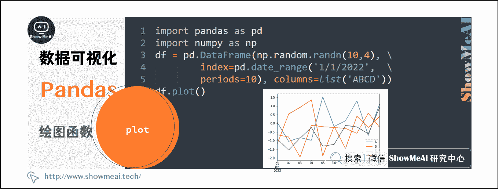
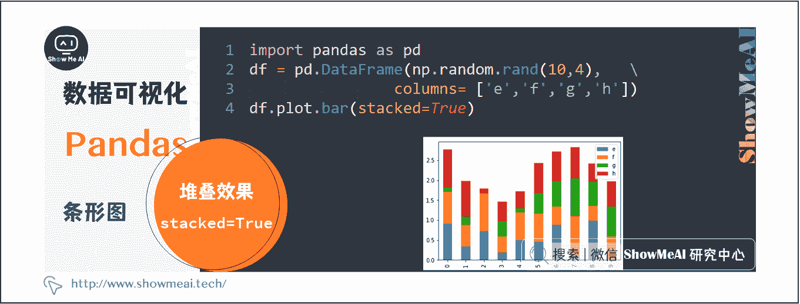
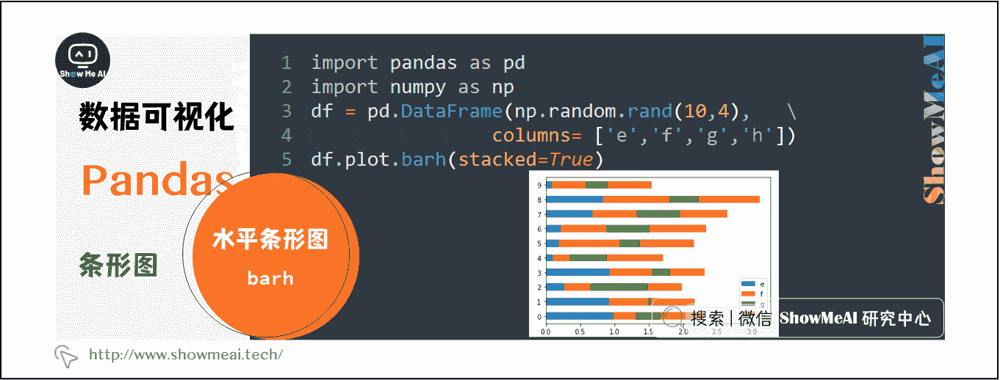
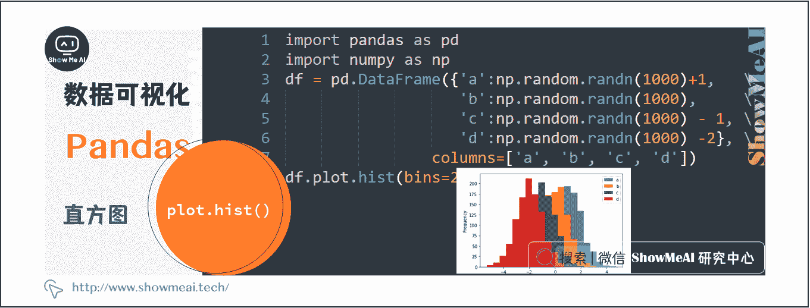
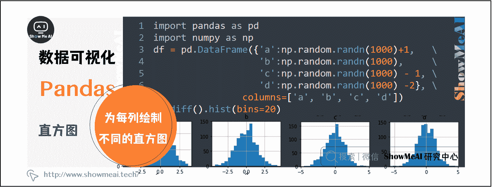
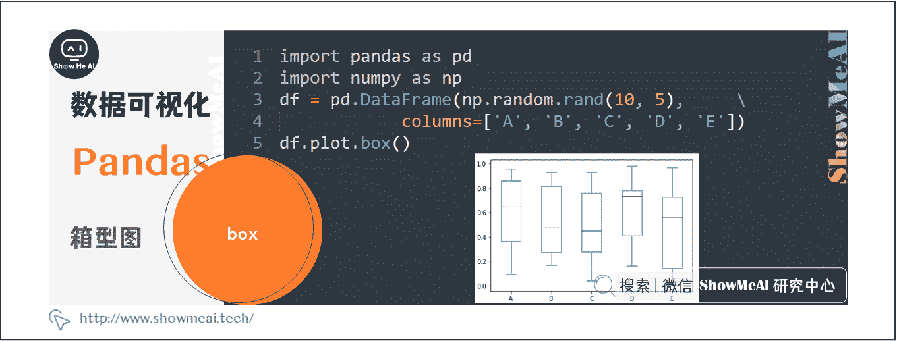
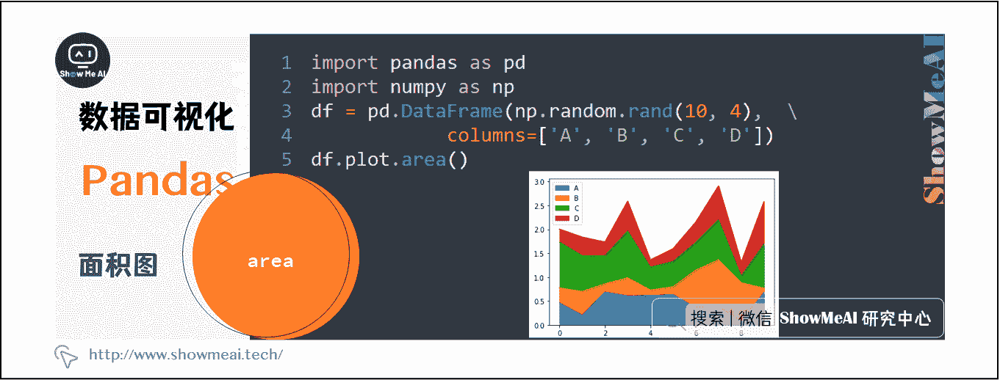
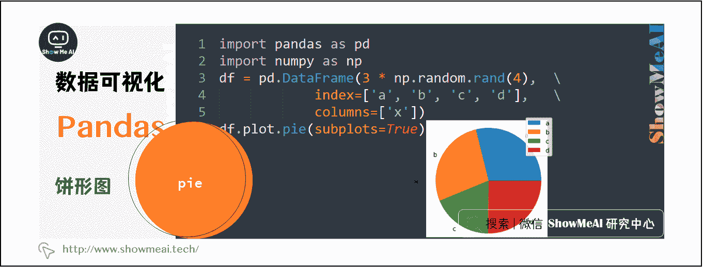

# Python 数据分析 | 基于 Pandas 的数据可视化

> 原文：[`blog.csdn.net/ShowMeAI/article/details/123137445`](https://blog.csdn.net/ShowMeAI/article/details/123137445)


作者：[韩信子](https://github.com/HanXinzi-AI)@[ShowMeAI](http://www.showmeai.tech/)
[教程地址](http://www.showmeai.tech/tutorials/33)：[`www.showmeai.tech/tutorials/33`](http://www.showmeai.tech/tutorials/33)
[本文地址](http://www.showmeai.tech/article-detail/150)：[`www.showmeai.tech/article-detail/150`](http://www.showmeai.tech/article-detail/150)
**声明：版权所有，转载请联系平台与作者并注明出处**

* * *

大家在前面的教程中看到了 Pandas 进行数据分析的灵活操作，但同时作为一个功能强大的全能工具库，它也能非常方便地支持数据可视化，而且大部分基础图像绘制只要一行代码就能实现，大大加速了我们的分析效率，本文我们介绍 pandas 可视化及绘制各种图形的方法。

# 一、基本绘图函数 plot

Series 和 DataFrame 上的可视化功能，只是围绕 matplotlib 库`plot()`方法的简单包装。

```py
import pandas as pd
import numpy as np
df = pd.DataFrame(np.random.randn(10,4),index=pd.date_range('1/1/2022',
   periods=10), columns=list('ABCD'))
df.plot() 
```

运行结果如下：



如果索引由日期组成，如上图所示，会自动进行日期填充。

除默认线图外，还可以绘制多种样式，可以使用 DataFrame.plot.[图类型参数] 方法进行不同图形的选择。

# 二、条形图

```py
import pandas as pd
import numpy as np
df = pd.DataFrame(np.random.rand(10,4),columns=['e','f','g','h'])
df.plot.bar() 
```

运行结果如下：


产生堆叠的柱状图, 可以设置 `stacked=True`

```py
import pandas as pd
df = pd.DataFrame(np.random.rand(10,4),columns= ['e','f','g','h'])
df.plot.bar(stacked=True) 
```

运行结果如下：



要获取水平条形图，可以使用 barh 方法：

```py
import pandas as pd
import numpy as np
df = pd.DataFrame(np.random.rand(10,4),columns= ['e','f','g','h'])
df.plot.barh(stacked=True) 
```

运行结果如下：



# 三、直方图

可以使用 `plot.hist()` 方法绘制直方图。我们可以指定数量。

```py
import pandas as pd
import numpy as np
df = pd.DataFrame({'a':np.random.randn(1000)+1,'b':np.random.randn(1000),'c':np.random.randn(1000) - 1, 'd':np.random.randn(1000) -2}, columns=['a', 'b', 'c', 'd'])
df.plot.hist(bins=20) 
```

运行结果如下：



可以使用以下代码为每列绘制不同的直方图：

```py
import pandas as pd
import numpy as np
df = pd.DataFrame({'a':np.random.randn(1000)+1,'b':np.random.randn(1000),'c':np.random.randn(1000) - 1, 'd':np.random.randn(1000) -2}, columns=['a', 'b', 'c', 'd'])
df.diff().hist(bins=20) 
```

运行结果如下：



# 四、箱形图

可以通过调用 `Series.box.plot()` 和 `DataFrame.box.plot()` 或 `DataFrame.boxplot()` 来绘制 Boxplot，以可视化每个列中值的分布。

例如，这是一个箱线图，代表对[0,1）上的一个随机变量的 10 个观测值的五个试验。

```py
import pandas as pd
import numpy as np
df = pd.DataFrame(np.random.rand(10, 5), columns=['A', 'B', 'C', 'D', 'E'])
df.plot.box() 
```

运行结果如下：



# 五、面积图

可以使用 `Series.plot.area()` 或 `DataFrame.plot.area()` 方法创建面积图。

```py
import pandas as pd
import numpy as np
df = pd.DataFrame(np.random.rand(10, 4), columns=['A', 'B', 'C', 'D'])
df.plot.area() 
```

运行结果如下：



# 六、散点图

创建散点图可以使用 `DataFrame.plot.scatter()` 方法。

```py
import pandas as pd
import numpy as np
df = pd.DataFrame(np.random.rand(50, 4), columns=['a', 'b', 'c', 'd'])
df.plot.scatter(x='a', y='b') 
```

运行结果如下：


# 七、饼形图

创建饼图可以使用 `DataFrame.plot.pie()` 方法。

```py
import pandas as pd
import numpy as np
df = pd.DataFrame(3 * np.random.rand(4), index=['a', 'b', 'c', 'd'], columns=['x'])
df.plot.pie(subplots=True) 
```

运行结果如下：



# 资料与代码下载

本教程系列的代码可以在 ShowMeAI 对应的 [**github**](https://github.com/ShowMeAI-Hub/) 中下载，可本地 python 环境运行。能访问 Google 的宝宝也可以直接借助 google colab 一键运行与交互操作学习哦！

## 本系列教程涉及的速查表可以在以下地址下载获取：

*   [Pandas 速查表](https://github.com/ShowMeAI-Hub/awesome-AI-cheatsheets/tree/main/Pandas)
*   [NumPy 速查表](https://github.com/ShowMeAI-Hub/awesome-AI-cheatsheets/tree/main/Numpy)
*   [Matplotlib 速查表](https://github.com/ShowMeAI-Hub/awesome-AI-cheatsheets/tree/main/Matplotlib)
*   [Seaborn 速查表](https://github.com/ShowMeAI-Hub/awesome-AI-cheatsheets/tree/main/Seaborn)

# 拓展参考资料

*   [Pandas 可视化教程](https://pandas.pydata.org/pandas-docs/stable/user_guide/visualization.html)
*   [Seaborn 官方教程](https://seaborn.pydata.org/tutorial.html)

# ShowMeAI 相关文章推荐

*   [数据分析介绍](http://www.showmeai.tech/article-detail/133)
*   [数据分析思维](http://www.showmeai.tech/article-detail/135)
*   [数据分析的数学基础](http://www.showmeai.tech/article-detail/136)
*   [业务认知与数据初探](http://www.showmeai.tech/article-detail/137)
*   [数据清洗与预处理](http://www.showmeai.tech/article-detail/138)
*   [业务分析与数据挖掘](http://www.showmeai.tech/article-detail/139)
*   [数据分析工具地图](http://www.showmeai.tech/article-detail/140)
*   [统计与数据科学计算工具库 Numpy 介绍](http://www.showmeai.tech/article-detail/141)
*   [Numpy 与 1 维数组操作](http://www.showmeai.tech/article-detail/142)
*   [Numpy 与 2 维数组操作](http://www.showmeai.tech/article-detail/143)
*   [Numpy 与高维数组操作](http://www.showmeai.tech/article-detail/144)
*   [数据分析工具库 Pandas 介绍](http://www.showmeai.tech/article-detail/145)
*   [图解 Pandas 核心操作函数大全](http://www.showmeai.tech/article-detail/146)
*   [图解 Pandas 数据变换高级函数](http://www.showmeai.tech/article-detail/147)
*   [Pandas 数据分组与操作](http://www.showmeai.tech/article-detail/148)
*   [数据可视化原则与方法](http://www.showmeai.tech/article-detail/149)
*   [基于 Pandas 的数据可视化](http://www.showmeai.tech/article-detail/150)
*   [seaborn 工具与数据可视化](http://www.showmeai.tech/article-detail/151)

# ShowMeAI 系列教程推荐

*   [图解 Python 编程：从入门到精通系列教程](http://www.showmeai.tech/tutorials/56)
*   [图解数据分析：从入门到精通系列教程](http://www.showmeai.tech/tutorials/33)
*   [图解 AI 数学基础：从入门到精通系列教程](http://showmeai.tech/tutorials/83)
*   [图解大数据技术：从入门到精通系列教程](http://www.showmeai.tech/tutorials/84)

