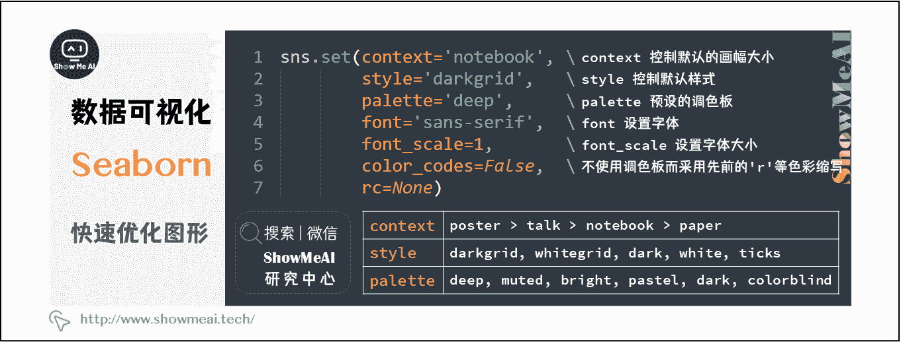
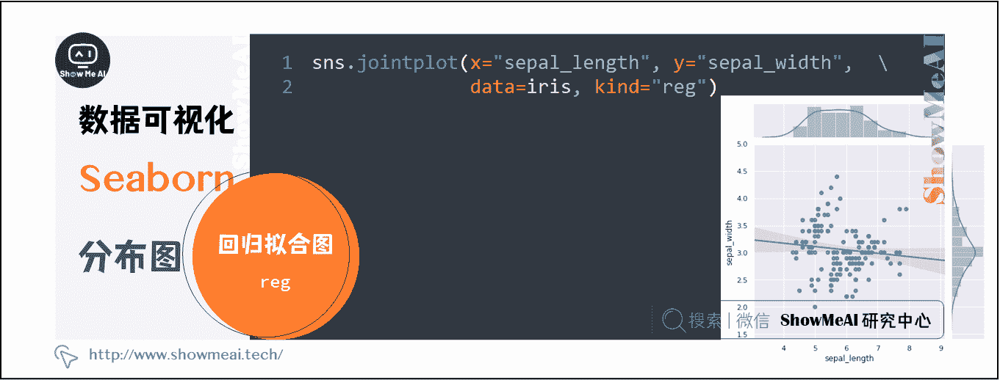

# Python 数据分析 | seaborn 工具与数据可视化

> 原文：[`blog.csdn.net/ShowMeAI/article/details/123137786`](https://blog.csdn.net/ShowMeAI/article/details/123137786)


作者：[韩信子](https://github.com/HanXinzi-AI)@[ShowMeAI](http://www.showmeai.tech/)
[教程地址](http://www.showmeai.tech/tutorials/33)：[`www.showmeai.tech/tutorials/33`](http://www.showmeai.tech/tutorials/33)
[本文地址](http://www.showmeai.tech/article-detail/151)：[`www.showmeai.tech/article-detail/151`](http://www.showmeai.tech/article-detail/151)
**声明：版权所有，转载请联系平台与作者并注明出处**

* * *

Python 中最常用于数据可视化的工具库包括 Matplotlib 和 Seaborn。其中，Matplotlib 属于 Python 数据可视化的基础库，具备很高的灵活度，但应用过于复杂——官方文档有 3000 多页，包含上千个方法以及数万个参数。

对于快捷地进行数据分析可视化而言，Seaborn 是一个更简单易用的选择。Seaborn 基于 Matplotlib 核心库进行了更高阶的 API 封装，可以轻松地画出更漂亮的图形。Seaborn 的漂亮主要体现在配色更加舒服、以及图形元素的样式更加细腻。下面是 Seaborn 官方给出的参考图。


# 一、Seaborn 工具库优点

*   内置数个经过优化的样式效果。
*   增加调色板工具，可以很方便地为数据搭配颜色。
*   单变量和双变量分布绘图更为简单，可用于对数据子集相互比较。
*   对独立变量和相关变量进行回归拟合和可视化更加便捷。
*   对数据矩阵进行可视化，并使用聚类算法进行分析。
*   基于时间序列的绘制和统计功能，更加灵活的不确定度估计。
*   基于网格绘制出更加复杂的图像集合。

# 二、快速优化 Matplotlib 绘制的图形

Matplotlib 绘图的默认图像样式算不上美观，可以使用 Seaborn 完成快速优化。

使用 Matplotlib 绘制一张简单的图像。

```py
import matplotlib.pyplot as plt
%matplotlib inline

x = [1, 3, 5, 7, 9, 11, 13, 15, 17, 19]
y_bar = [3, 4, 6, 8, 9, 10, 9, 11, 7, 8]
y_line = [2, 3, 5, 7, 8, 9, 8, 10, 6, 7]

plt.bar(x, y_bar)
plt.plot(x, y_line, '-o', color='y') 
```


使用 Seaborn 完成图像快速优化。
方法非常简单，只需要将 Seaborn 提供的样式声明代码 sns.set() 放置在绘图前即可。

```py
import seaborn as sns

sns.set()  # 声明使用 Seaborn 样式

plt.bar(x, y_bar)
plt.plot(x, y_line, '-o', color='y') 
```


可以发现，相比于 Matplotlib 默认的纯白色背景，Seaborn 默认的浅灰色网格背景看起来的确要细腻舒适一些。而柱状图的色调、坐标轴的字体大小也都有一些变化。

sns.set() 的默认参数为：

```py
sns.set(context='notebook', style='darkgrid', palette='deep', font='sans-serif', font_scale=1, color_codes=False, rc=None) 
```



*   context=’ ’ 参数控制着默认的画幅大小，分别有 {paper, notebook, talk, poster} 四个值。其中，poster > talk > notebook > paper。

*   style=’ ’ 参数控制默认样式，分别有 {darkgrid, whitegrid, dark, white, ticks}，你可以自行更改查看它们之间的不同。

*   palette=’ ’ 参数为预设的调色板。分别有 {deep, muted, bright, pastel, dark, colorblind} 等，你可以自行更改查看它们之间的不同。

*   剩下的 font=’ ’ 用于设置字体，font_scale= 设置字体大小，color_codes= 不使用调色板而采用先前的 ‘r’ 等色彩缩写。

# 三、Seaborn 核心绘图函数与方法

Seaborn 一共拥有 50 多个 API 类，相比于 Matplotlib 数千个的规模，可以说是非常精简了。根据图形的适应场景，Seaborn 的绘图方法大致分类 6 类，这 6 大类下面又包含不同数量的绘图函数：

*   关联图——relplot
*   类别图——catplot
*   分布图——distplot、kdeplot、jointplot、pairplot
*   回归图——regplot、lmplot
*   矩阵图——heatmap、clustermap
*   组合图

接下来，我们通过『鸢尾花示例数据集』进行演示，使用 Seaborn 绘制适应不同场景的图形。首先导入数据集：

```py
iris = sns.load_dataset("iris")
iris.head() 
```

在绘图之前，先熟悉一下 iris 鸢尾花数据集。
数据集总共 150 行，由 5 列组成。分别代表：萼片长度、萼片宽度、花瓣长度、花瓣宽度、花的类别。其中，前四列均为数值型数据，最后一列花的分类为三种，分别是：Iris Setosa、Iris Versicolour、Iris Virginica。


## 3.1 关联图

当我们需要对数据进行关联性分析时，可能会用到 Seaborn 提供的以下几个 API。

| API 层级 | 关联性分析 | 介绍 |
| --- | --- | --- |
| Figure-level | relplot | 绘制关系图 |
| Axes-level | scatterplot | 多维度分析散点图 |
|  | lineplot | 多维度分析线形图 |

relplot 是 relational plots 的缩写，用于呈现数据之后的关系。relplot 主要有散点图和线形图 2 种样式，适用于不同类型的数据。

### （1）散点图

指定 x x x 和 y y y 的特征，默认可以绘制出散点图。

```py
sns.relplot(x="sepal_length", y="sepal_width", data=iris) 
```


但是，上图并不能看出数据类别之间的联系。如果我们加入类别特征对数据进行着色，就更加直观了。

```py
sns.relplot(x="sepal_length", y="sepal_width", hue="species", data=iris) 
```


Seaborn 的函数都有大量实用的参数。例如我们指定 style 参数可以赋予不同类别的散点不同的形状。更多的参数，希望大家通过阅读[官方文档](https://seaborn.pydata.org/tutorial.html) 进行了解。

```py
sns.relplot(x="sepal_length", y="sepal_width", hue="species", style="species", data=iris) 
```


### （2）线形图

relplot 方法还支持线形图，此时只需要指定 kind=”line” 参数即可。图中阴影部分是自动给出的 95% 置信区间。

```py
sns.relplot(x="sepal_length", y="petal_length", hue="species", style="species", kind="line", data=iris) 
```


### （3）API 层级：Axes-level 和 Figure-level

Seaborn 中有 API 层级的概念。Seaborn 中的 API 分为 Axes-level 和 Figure-level 两种：Axes-level 的函数可以实现与 Matplotlib 更灵活和紧密的结合，而 Figure-level 则更像是「懒人函数」，适合于快速应用。

你会发现，上面我们一个提到了 3 个 API，分别是：relplot，scatterplot 和 lineplot。scatterplot 和 lineplot 就是 Axes-level 接口，relplot 则是 Figure-level 接口，也可以被看作是 scatterplot 和 lineplot 的结合版本。

例如，上方 relplot 绘制的图也可以使用 lineplot 函数绘制，只要取消 relplot 中的 kind 参数即可。

```py
sns.lineplot(x="sepal_length", y="petal_length", hue="species", style="species", data=iris) 
```


## 3.2 类别图

与关联图相似，类别图的 Figure-level 接口是 catplot，其为 categorical plots 的缩写。而 catplot 实际上是如下 Axes-level 绘图 API 的集合：

| API 层级 | 函数 | 介绍 |
| --- | :-- | --- |
| Figure-level | catplot |  |
| Axes-level | stripplot() (kind=”strip”) swarmplot() (kind=”swarm”) | 分类散点图 |
|  | boxplot() (kind=”box”) boxenplot() (kind=”boxen”)
violinplot() (kind=”violin”) | 分类分布图 |
|  | pointplot() (kind=”point”) barplot() (kind=”bar”)
countplot() (kind=”count”) | 分类估计图 |

### （1）散点图 strip / swarm

下面，我们看一下 catplot 绘图效果。该方法默认是绘制 `kind="strip"` 散点图。

```py
sns.catplot(x="sepal_length", y="species", data=iris) 
```


`kind="swarm"` 可以让散点按照 beeswarm 的方式防止重叠，可以更好地观测数据分布。

```py
sns.catplot(x="sepal_length", y="species", kind="swarm", data=iris) 
```


同理，hue= 参数可以给图像引入另一个维度，由于 iris 数据集只有一个类别列，我们这里就不再添加 hue= 参数了。如果一个数据集有多个类别，hue= 参数就可以让数据点有更好的区分。

### （2）箱线图 box

接下来，我们依次尝试其他几种图形的绘制效果。绘制箱线图：

```py
sns.catplot(x="sepal_length", y="species", kind="box", data=iris) 
```


### （3）增强箱线图 boxen

```py
sns.catplot(x="species", y="sepal_length", kind="boxen", data=iris) 
```


### （4）小提琴图 violin

```py
sns.catplot(x="sepal_length", y="species", kind="violin", data=iris) 
```


### （5）点线图 point

```py
sns.catplot(x="sepal_length", y="species", kind="point", data=iris) 
```


### （6）条形图 bar

```py
sns.catplot(x="sepal_length", y="species", kind="bar", data=iris) 
```


### （7）计数条形图 count

```py
sns.catplot(x="species", kind="count", data=iris) 
```


## 3.3 分布图

分布图主要是用于可视化变量的分布情况，一般分为单变量分布和多变量分布（多指二元变量）。
Seaborn 提供的分布图绘制方法一般有这几个：distplot、kdeplot、jointplot、pairplot。接下来，我们依次来看一下这些绘图方法的使用。

| API 层级 | 函数 | 介绍 |
| --- | --- | --- |
| Axes-level | distplot | 绘制直方图并拟合核密度估计图 |
| Axes-level | kdeplot | 专门用于绘制核密度估计图 |
| Axes-level | jointplot | 支持 kind= 参数指定绘制出不同样式的分布图 |
| Axes-level | pairplot | 一次性将数据集中的特征变量两两对比绘图 |

### （1）单变量分布图 distplot

Seaborn 快速查看单变量分布的方法是 distplot。默认情况下，该方法将绘制直方图并拟合核密度估计图。

```py
sns.distplot(iris["sepal_length"]) 
```


distplot 提供了参数来调整直方图和核密度估计图。例如，设置 kde=False 则可以只绘制直方图，或者 hist=False 只绘制核密度估计图。

### （2）核密度估计图 kdeplot

当然，kdeplot 可以专门用于绘制核密度估计图，其效果和 distplot(hist=False) 一致，但 kdeplot 拥有更多的自定义设置。

```py
sns.kdeplot(iris["sepal_length"]) 
```


### （3）二元变量分布图 jointplot

jointplot 主要是用于绘制二元变量分布图。例如，我们探寻 sepal_length 和 sepal_width 二元特征变量之间的关系。

```py
sns.jointplot(x="sepal_length", y="sepal_width", data=iris) 
```


jointplot 并不是一个 Figure-level 接口，但其支持 kind= 参数指定绘制出不同样式的分布图。

例如，**绘制出核密度估计对比图 kde**

```py
sns.jointplot(x="sepal_length", y="sepal_width", data=iris, kind="kde") 
```


**绘制六边形计数图 hex**

```py
sns.jointplot(x="sepal_length", y="sepal_width", data=iris, kind="hex") 
```


**绘制回归拟合图 reg**

```py
sns.jointplot(x="sepal_length", y="sepal_width", data=iris, kind="reg") 
```



### （4）变量两两对比图 pairplot

最后要介绍的 pairplot 更加强大，其支持一次性将数据集中的特征变量两两对比绘图。默认情况下，对角线上是单变量分布图，而其他则是二元变量分布图。

```py
sns.pairplot(iris) 
```


此时，我们引入第三维度 `hue="species"`会更加直观。

```py
sns.pairplot(iris, hue="species") 
```


## 3.4 回归图

接下来，我们继续介绍回归图，回归图的绘制函数主要有：lmplot 和 regplot。

| API 层级 | 函数 | 介绍 |
| --- | --- | --- |
| Axes-level | regplot | 自动完成线性回归拟合 |
| Axes-level | lmplot | 支持引入第三维度进行对比 |

### （1）regplot

regplot 绘制回归图时，只需要指定自变量和因变量即可，regplot 会自动完成线性回归拟合。

```py
sns.regplot(x="sepal_length", y="sepal_width", data=iris) 
```


### （2）lmplot

lmplot 同样是用于绘制回归图，但 lmplot 支持引入第三维度进行对比，例如我们设置 `hue="species"`。

```py
sns.lmplot(x="sepal_length", y="sepal_width", hue="species", data=iris) 
```


## 3.5 矩阵图

矩阵图中最常用的就只有 2 个，分别是：heatmap 和 clustermap。

| API 层级 | 函数 | 介绍 |
| --- | --- | --- |
| Axes-level | heatmap | 绘制热力图 |
| Axes-level | clustermap | 层次聚类结构图 |

### （1）热力图 heatmap

意如其名，heatmap 主要用于绘制热力图。热力图在某些场景下非常实用，例如绘制出变量相关性系数热力图。

```py
import numpy as np

sns.heatmap(np.random.rand(10, 10)) 
```


### （2）层次聚类结构图 clustermap

除此之外，clustermap 支持绘制层次聚类结构图。如下所示，我们先去掉原数据集中最后一个目标列，传入特征数据即可。当然，你需要对层次聚类有所了解，否则很难看明白图像多表述的含义。

```py
iris.pop("species")
sns.clustermap(iris) 
```


# 四、样式控制与色彩自定义

浏览官方文档，会发现 Seaborn 中还存在大量已大些字母开始的类，例如 JointGrid，PairGrid 等。实际上这些类只是其对应小写字母的函数 jointplot，pairplot 的进一步封装。当然，二者可能稍有不同，但并没有本质的区别。

除此之外，Seaborn 官方文档 中还有关于 样式控制 和 色彩自定义 等一些辅助组件的介绍。对于这些 API 的应用没有太大的难点，重点需要勤于练习。

# 资料与代码下载

本教程系列的代码可以在 ShowMeAI 对应的 [**github**](https://github.com/ShowMeAI-Hub/) 中下载，可本地 python 环境运行。能访问 Google 的宝宝也可以直接借助 google colab 一键运行与交互操作学习哦！

## 本系列教程涉及的速查表可以在以下地址下载获取：

*   [Pandas 速查表](https://github.com/ShowMeAI-Hub/awesome-AI-cheatsheets/tree/main/Pandas)
*   [NumPy 速查表](https://github.com/ShowMeAI-Hub/awesome-AI-cheatsheets/tree/main/Numpy)
*   [Matplotlib 速查表](https://github.com/ShowMeAI-Hub/awesome-AI-cheatsheets/tree/main/Matplotlib)
*   [Seaborn 速查表](https://github.com/ShowMeAI-Hub/awesome-AI-cheatsheets/tree/main/Seaborn)

# 拓展参考资料

*   [Pandas 可视化教程](https://pandas.pydata.org/pandas-docs/stable/user_guide/visualization.html)
*   [Seaborn 官方教程](https://seaborn.pydata.org/tutorial.html)

# ShowMeAI 相关文章推荐

*   [数据分析介绍](http://www.showmeai.tech/article-detail/133)
*   [数据分析思维](http://www.showmeai.tech/article-detail/135)
*   [数据分析的数学基础](http://www.showmeai.tech/article-detail/136)
*   [业务认知与数据初探](http://www.showmeai.tech/article-detail/137)
*   [数据清洗与预处理](http://www.showmeai.tech/article-detail/138)
*   [业务分析与数据挖掘](http://www.showmeai.tech/article-detail/139)
*   [数据分析工具地图](http://www.showmeai.tech/article-detail/140)
*   [统计与数据科学计算工具库 Numpy 介绍](http://www.showmeai.tech/article-detail/141)
*   [Numpy 与 1 维数组操作](http://www.showmeai.tech/article-detail/142)
*   [Numpy 与 2 维数组操作](http://www.showmeai.tech/article-detail/143)
*   [Numpy 与高维数组操作](http://www.showmeai.tech/article-detail/144)
*   [数据分析工具库 Pandas 介绍](http://www.showmeai.tech/article-detail/145)
*   [图解 Pandas 核心操作函数大全](http://www.showmeai.tech/article-detail/146)
*   [图解 Pandas 数据变换高级函数](http://www.showmeai.tech/article-detail/147)
*   [Pandas 数据分组与操作](http://www.showmeai.tech/article-detail/148)
*   [数据可视化原则与方法](http://www.showmeai.tech/article-detail/149)
*   [基于 Pandas 的数据可视化](http://www.showmeai.tech/article-detail/150)
*   [seaborn 工具与数据可视化](http://www.showmeai.tech/article-detail/151)

# ShowMeAI 系列教程推荐

*   [图解 Python 编程：从入门到精通系列教程](http://www.showmeai.tech/tutorials/56)
*   [图解数据分析：从入门到精通系列教程](http://www.showmeai.tech/tutorials/33)
*   [图解 AI 数学基础：从入门到精通系列教程](http://showmeai.tech/tutorials/83)
*   [图解大数据技术：从入门到精通系列教程](http://www.showmeai.tech/tutorials/84)

