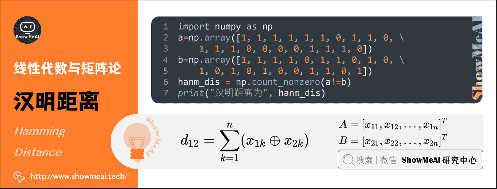

# 图解 AI 数学基础 | 线性代数与矩阵论

> 原文：[`blog.csdn.net/ShowMeAI/article/details/123121269`](https://blog.csdn.net/ShowMeAI/article/details/123121269)


作者：[韩信子](https://github.com/HanXinzi-AI)@[ShowMeAI](http://www.showmeai.tech/)
[教程地址](http://www.showmeai.tech/tutorials/83)：[`www.showmeai.tech/tutorials/83`](http://www.showmeai.tech/tutorials/83)
[本文地址](http://www.showmeai.tech/article-detail/162)：[`www.showmeai.tech/article-detail/162`](http://www.showmeai.tech/article-detail/162)
**声明：版权所有，转载请联系平台与作者并注明出处**

* * *

## 1.标量（Scalar）

一个标量就是一个单独的数。**只具有数值大小，没有方向**（部分有正负之分），运算遵循一般的代数法则。


*   一般用小写的变量名称表示。
*   质量 m m m、速率 v v v、时间 t t t、电阻 ρ \rho ρ 等物理量，都是数据标量。

## 2.向量（Vector）

向量指具有大小和方向的量，形态上看就是一列数。


*   通常赋予向量**粗体小写**的名称；手写体则在字母上加一个向右的箭头。

*   向量中的元素是有序排列的，通过索引可以确定每个元素。

*   以下两种方式，可以明确表示向量中的元素时（注意用方括号）。

*   可以把向量看作空间中的有向线段，向量的每个组成元素，对应向量在不同的坐标轴上的投影长度。

**AI 中的应用**：在机器学习中，单条数据样本的表征都是以向量化的形式来完成的。向量化的方式可以帮助 AI 算法在迭代与计算过程中，以更高效的方式完成。

## 3.矩阵（Matrix）

矩阵是二维数组，其中的每一个元素被两个索引确定。矩阵在机器学习中至关重要，无处不在。


*   通常会赋予矩阵粗体大写的变量名称。

**AI 中的应用**：样本以矩阵形态表示： m m m 条数据/样本， n n n 个特征的数据集，就是一个 m × n m \times n m×n 的矩阵。

## 4.张量（Tensor）

几何代数中定义的张量，是基于向量和矩阵的推广。

*   标量，可以视为零阶张量
*   向量，可以视为一阶张量
*   矩阵，可以视为二阶张量


*   图片以矩阵形态表示：将一张彩色图片表示成一个 H × W × C H \times W \times C H×W×C 的三阶张量，其中 H H H 是高， W W W 是宽， C C C 通常取 3，表示彩色图 3 个颜色通道。
*   在这个例子的基础上，将这一定义继续扩展，即：用四阶张量（样本，高度，宽度，通道）表示一个包含多张图片的数据集，其中，样本表示图片在数据集中的编号。

*   用五阶张量（样本，帧速，高度，宽度，通道）表示视频。

**AI 中的应用**：张量是深度学习中一个非常重要的概念，大部分的数据和权重都是以张量的形态存储的，后续的所有运算和优化算法也都是基于张量进行的。

## 5.范数（Norm）

范数是一种强化了的距离概念；简单来说，可以把『范数』理解为『距离』。

在数学上，范数包括『向量范数』和『矩阵范数』：

*   向量范数（Vector Norm），表征向量空间中向量的大小。向量空间中的向量都是有大小的，这个大小就是用范数来度量。不同的范数都可以来度量这个大小，就好比米和尺都可以来度量远近一样。

*   矩阵范数（Matrix Norm），表征矩阵引起变化的大小。比如，通过运算 A X = B \boldsymbol{A}\boldsymbol{X} = \boldsymbol{B} AX=B，可以将向量 X \boldsymbol{X} X 变化为 B \boldsymbol{B} B，矩阵范数就可以度量这个变化的大小。


**向量范数的计算**：

对于 p − \mathrm{p} - p−范数，如果 x = [ x 1 , x 2 , ⋯   , x n ] T \boldsymbol{x}=\left[x_{1}, x_{2}, \cdots, x_{n}\right]^{\mathrm{T}} x=[x1​,x2​,⋯,xn​]T，那么向量 x \boldsymbol{x} x 的 p − \mathrm{p} - p−范数就是 ∥ x ∥ p = ( ∣ x 1 ∣ p + ∣ x 2 ∣ p + ⋯ + ∣ x n ∣ p ) 1 p \|\boldsymbol{x}\|_{p}=\left(\left|x_{1}\right|^{p}+\left|x_{2}\right|^{p}+\cdots+\left|x_{n}\right|^{p}\right)^{\frac{1}{p}} ∥x∥p​=(∣x1​∣p+∣x2​∣p+⋯+∣xn​∣p)p1​。

**L1 范数**： ∣ ∣ x ∣ ∣ 1 = ∣ x 1 ∣ + ∣ x 2 ∣ + ∣ x 3 ∣ + ⋯ + ∣ x n ∣ || \boldsymbol{x}||_{1}=\left|x_{1}\right|+\left|x_{2}\right|+\left|x_{3}\right|+\cdots+\left|x_{n}\right| ∣∣x∣∣1​=∣x1​∣+∣x2​∣+∣x3​∣+⋯+∣xn​∣

*   p = 1 \mathrm{p} =1 p=1 时，就是 L1 范数，是 x \boldsymbol{x} x 向量各个元素的绝对值之和。

*   L1 范数有很多的名字，例如我们熟悉的曼哈顿距离、最小绝对误差等。

**L2 范数**： ∥ x ∥ 2 = ( ∣ x 1 ∣ 2 + ∣ x 2 ∣ 2 + ∣ x 3 ∣ 2 + ⋯ + ∣ x n ∣ 2 ) 1 / 2 \|\boldsymbol{x}\|_{2}=\left(\left|x_{1}\right|^{2}+\left|x_{2}\right|^{2}+\left|x_{3}\right|^{2}+\cdots+\left|x_{n}\right|^{2}\right)^{1 / 2} ∥x∥2​=(∣x1​∣2+∣x2​∣2+∣x3​∣2+⋯+∣xn​∣2)1/2

*   p = 2 \mathrm{p} =2 p=2 时，就是 L2 范数，是 x \boldsymbol{x} x 向量各个元素平方和的开方。

*   L2 范数是我们最常用的范数，欧氏距离就是一种 L2 范数。

**AI 中的应用**：在机器学习中，L1 范数和 L2 范数很常见，比如『**评估准则的计算**』、『**损失函数中用于限制模型复杂度的正则化项**』等。

## 6.特征分解（Eigen-decomposition）

将数学对象分解成多个组成部分，可以找到他们的一些属性，或者能更高地理解他们。例如，整数可以分解为质因数，通过 12 = 2 × 3 × 3 12=2 \times 3 \times 3 12=2×3×3 可以得到『12 的倍数可以被 3 整除，或者 12 不能被 5 整除』。

> 同样，我们可以将『矩阵』分解为一组『特征向量』和『特征值』，来发现矩阵表示为数组元素时不明显的函数性质。特征分解（Eigen-decomposition）是广泛使用的矩阵分解方式之一。


*   **特征向量**：方阵 A \boldsymbol{A} A 的特征向量，是指与 A \boldsymbol{A} A 相乘后相当于对该向量进行缩放的非零向量，即 A ν = λ ν \boldsymbol{A}\nu =\lambda \nu Aν=λν。

*   **特征值**：标量 λ \lambda λ被称为这个特征向量对应的特征值。

使用特征分解去分析矩阵 A \boldsymbol{A} A 时，得到特征向量 ν \nu ν构成的矩阵 Q \boldsymbol{Q} Q 和特征值构成的向量 Λ \boldsymbol{\Lambda } Λ，我们可以重新将 A \boldsymbol{A} A 写作： A = Q Λ Q − 1 \boldsymbol{A} = \boldsymbol{Q} \boldsymbol{\Lambda} \boldsymbol{Q}^{-1} A=QΛQ−1

## 7.奇异值分解（Singular Value Decomposition，SVD）

矩阵的特征分解是有前提条件的。只有可对角化的矩阵，才可以进行特征分解。实际很多矩阵不满足这一条件，这时候怎么办呢？

> 将矩阵的『特征分解』进行推广，得到一种被称为『矩阵的奇异值分解』的方法，即将一个普通矩阵分解为『奇异向量』和『奇异值』。通过奇异值分解，我们会得到一些类似于特征分解的信息。


将矩阵 A \boldsymbol{A} A 分解成三个矩阵的乘积 A = U D V − 1 \boldsymbol{A} = \boldsymbol{U} \boldsymbol{D} \boldsymbol{V}^{-1} A=UDV−1。

*   假设 A \boldsymbol{A} A 是一个 m ∗ n m*n m∗n 矩阵，那么 U \boldsymbol{U} U 是一个 m ∗ m m*m m∗m 矩阵， D D D 是一个 m ∗ n m*n m∗n 矩阵， V V V 是一个 n ∗ n n*n n∗n 矩阵。

*   U V D \boldsymbol{U} \boldsymbol{V} \boldsymbol{D} UVD 这几个矩阵都拥有特殊的结构：

    *   U \boldsymbol{U} U 和 V \boldsymbol{V} V 都是正交矩阵，矩阵 U \boldsymbol{U} U 的列向量被称为左奇异向量，矩阵 V \boldsymbol{V} V 的列向量被称右奇异向量。

    *   D \boldsymbol{D} D 是对角矩阵（注意， D \boldsymbol{D} D 不一定是方阵）。对角矩阵 D \boldsymbol{D} D 对角线上的元素被称为矩阵 A \boldsymbol{A} A 的奇异值。

**AI 中的应用**：SVD 最有用的一个性质可能是拓展矩阵求逆到非方矩阵上。而且大家在推荐系统中也会见到基于 SVD 的算法应用。

## 8.Moore-Penrose 广义逆/伪逆（Moore-Penrose Pseudoinverse）

假设在下面问题中，我们想通过矩阵 A \boldsymbol{A} A 的左逆 B \boldsymbol{B} B 来求解线性方程： A x = y \boldsymbol{A} x=y Ax=y，等式两边同时左乘左逆 B 后，得到： x = B y x=\boldsymbol{B} y x=By。是否存在唯一的映射将 A \boldsymbol{A} A 映射到 B \boldsymbol{B} B，取决于问题的形式：

*   如果矩阵 A \boldsymbol{A} A 的行数大于列数，那么上述方程可能没有解；

*   如果矩阵 A \boldsymbol{A} A 的行数小于列数，那么上述方程可能有多个解。

Moore-Penrose 伪逆使我们能够解决这种情况，矩阵 A \boldsymbol{A} A 的伪逆定义为：

A + = lim ⁡ a → 0 ( A T A + α I ) − 1 A T \boldsymbol{A}^{+}=\lim _{a \rightarrow 0}\left(\boldsymbol{A}^{T} \boldsymbol{A}+\alpha \boldsymbol{I}\right)^{-1} \boldsymbol{A}^{T} A+=a→0lim​(ATA+αI)−1AT


但是计算伪逆的实际算法没有基于这个式子，而是使用下面的公式：

A + = U D + V T \boldsymbol{A}^{+}=\boldsymbol{U} \boldsymbol{D}^{+} \boldsymbol{V}^{T} A+=UD+VT

*   矩阵 U \boldsymbol{U} U、 D \boldsymbol{D} D 和 V T \boldsymbol{V}^{T} VT 是矩阵 A \boldsymbol{A} A 奇异值分解后得到的矩阵；

*   对角矩阵 D \boldsymbol{D} D 的伪逆 D + \boldsymbol{D}^{+} D+是其非零元素取倒之后再转置得到的。

## 9.常用的距离度量

在机器学习里，大部分运算都是基于向量的，一份数据集包含 n 个特征字段，那每一条样本就可以表示为 n 维的向量，通过计算两个样本对应向量之间的距离值大小，有些场景下能反映出这两个样本的相似程度。还有一些算法，像 KNN 和 K-means，非常依赖距离度量。

设有两个 n n n 维变量：

A = [ x 11 , x 12 , . . . , x 1 n ] T A=[ x_{11}, x_{12},...,x_{1n} ] ^{T} A=[x11​,x12​,...,x1n​]T

B = [ x 21 , x 22 , . . . , x 2 n ] T B=[ x_{21} ,x_{22} ,...,x_{2n} ] ^{T} B=[x21​,x22​,...,x2n​]T

**一些常用的距离公式定义如下**：


### 1）曼哈顿距离（Manhattan Distance）


曼哈顿距离也称为城市街区距离，数学定义如下：

d 12 = ∑ k = 1 n ∣ x 1 k − x 2 k ∣ d_{12} =\sum_{k=1}^{n}{| x_{1k}-x_{2k} | } d12​=k=1∑n​∣x1k​−x2k​∣

**曼哈顿距离的 Python 实现**：

```py
import numpy as np
vector1 = np.array([1,2,3])
vector2 = np.array([4,5,6])

manhaton_dist = np.sum(np.abs(vector1-vector2))
print("曼哈顿距离为", manhaton_dist) 
```

> 前往我们的在线编程环境运行代码：[`blog.showmeai.tech/python3-compiler/#/`](http://blog.showmeai.tech/python3-compiler/#/)

### 2）欧氏距离（Euclidean Distance）


欧氏距离其实就是 L2 范数，数学定义如下：

d 12 = ∑ k = 1 n ( x 1 k − x 2 k ) 2 d_{12} =\sqrt{\sum_{k=1}^{n}{( x_{1k} -x_{2k} ) ^{2} } } d12​=k=1∑n​(x1k​−x2k​)2  ​

**欧氏距离的 Python 实现**：

```py
import numpy as np
vector1 = np.array([1,2,3])
vector2 = np.array([4,5,6])

eud_dist = np.sqrt(np.sum((vector1-vector2)**2))
print("欧式距离为", eud_dist) 
```

> 前往我们的在线编程环境运行代码：[`blog.showmeai.tech/python3-compiler/#/`](http://blog.showmeai.tech/python3-compiler/#/)

### 3）闵氏距离（Minkowski Distance）


从严格意义上讲，闵可夫斯基距离不是一种距离，而是一组距离的定义：

d 12 = ∑ k = 1 n ( x 1 k − x 2 k ) p p d_{12} =\sqrt[p]{\sum_{k=1}^{n}{( x_{1k} -x_{2k} ) ^{p} } } d12​=pk=1∑n​(x1k​−x2k​)p  ​

实际上，当 p = 1 p=1 p=1 时，就是曼哈顿距离；当 p = 2 p=2 p=2 时，就是欧式距离。

> 前往我们的在线编程环境运行代码：[`blog.showmeai.tech/python3-compiler/#/`](http://blog.showmeai.tech/python3-compiler/#/)

### 4）切比雪夫距离（Chebyshev Distance）


切比雪夫距离就是无穷范数，数学表达式如下：

d 12 = m a x ( ∣ x 1 k − x 2 k ∣ ) d_{12} =max( | x_{1k}-x_{2k} |) d12​=max(∣x1k​−x2k​∣)

**切比雪夫距离的 Python 实现如下**：

```py
import numpy as np
vector1 = np.array([1,2,3])
vector2 = np.array([4,5,6])

cb_dist = np.max(np.abs(vector1-vector2))
print("切比雪夫距离为", cb_dist) 
```

> 前往我们的在线编程环境运行代码：[`blog.showmeai.tech/python3-compiler/#/`](http://blog.showmeai.tech/python3-compiler/#/)

### 5）余弦相似度（Cosine Similarity）

余弦相似度的取值范围为[-1,1]，可以用来衡量两个向量方向的差异：

*   夹角余弦越大，表示两个向量的夹角越小；
*   当两个向量的方向重合时，夹角余弦取最大值 1；
*   当两个向量的方向完全相反时，夹角余弦取最小值-1。


机器学习中用这一概念来衡量样本向量之间的差异，其数学表达式如下：

c o s θ = A B ∣ A ∣ ∣ B ∣ = ∑ k = 1 n x 1 k x 2 k ∑ k = 1 n x 1 k 2 ∑ k = 1 n x 2 k 2 cos\theta =\frac{AB}{| A | |B | } =\frac{\sum_{k=1}^{n}{x_{1k}x_{2k} } }{\sqrt{\sum_{k=1}^{n}{x_{1k}^{2} } } \sqrt{\sum_{k=1}^{n}{x_{2k}^{2} } } } cosθ=∣A∣∣B∣AB​=∑k=1n​x1k2​  ​∑k=1n​x2k2​  ​∑k=1n​x1k​x2k​​

**夹角余弦的 Python 实现**：

```py
import numpy as np
vector1 = np.array([1,2,3])
vector2 = np.array([4,5,6])

cos_sim = np.dot(vector1, vector2)/(np.linalg.norm(vector1)*np.linalg.norm(vector2))
print("余弦相似度为", cos_sim) 
```

> 前往我们的在线编程环境运行代码：[`blog.showmeai.tech/python3-compiler/#/`](http://blog.showmeai.tech/python3-compiler/#/)

### 6）汉明距离（Hamming Distance）



汉明距离定义的是两个字符串中不相同位数的数目。例如，字符串‘1111’与‘1001’之间的汉明距离为 2。信息编码中一般应使得编码间的汉明距离尽可能的小。

d 12 = ∑ k = 1 n ( x 1 k ⊕ x 2 k ) d_{12} = \sum_{k=1}^{n} \left ( x_{1k} \oplus x_{2k}\right ) d12​=k=1∑n​(x1k​⊕x2k​)

**汉明距离的 Python 实现**：

```py
import numpy as np
a=np.array([1, 1, 1, 1, 1, 1, 0, 1, 1, 0, 1, 1, 1, 0, 0, 0, 0, 1, 1, 1, 0])
b=np.array([1, 1, 1, 1, 0, 1, 1, 0, 1, 0, 1, 0, 1, 0, 1, 0, 0, 1, 1, 0, 1])
hanm_dis = np.count_nonzero(a!=b)
print("汉明距离为", hanm_dis) 
```

> 前往我们的在线编程环境运行代码：[`blog.showmeai.tech/python3-compiler/#/`](http://blog.showmeai.tech/python3-compiler/#/)

### 7）杰卡德系数（Jaccard Index）


两个集合 A A A 和 B B B 的交集元素在 A A A 和 B B B 的并集中所占的比例称为两个集合的杰卡德系数，用符号 J ( A , B ) J(A,B) J(A,B)表示，数学表达式为：

J ( A , B ) = ∣ A ∩ B ∣ ∣ A ∪ B ∣ J( A,B ) =\frac{| A\cap B| }{|A\cup B | } J(A,B)=∣A∪B∣∣A∩B∣​

杰卡德相似系数是衡量两个集合的相似度的一种指标。一般可以将其用在衡量样本的相似度上。

> 前往我们的在线编程环境运行代码：[`blog.showmeai.tech/python3-compiler/#/`](http://blog.showmeai.tech/python3-compiler/#/)

### 8）杰卡德距离（Jaccard Distance）


与杰卡德系数相反的概念是杰卡德距离，其定义式为：

J σ = 1 − J ( A , B ) = ∣ A ∪ B ∣ − ∣ A ∩ B ∣ ∣ A ∪ B ∣ J_{\sigma} =1-J( A,B ) =\frac{| A\cup B | -| A\cap B | }{| A\cup B | } Jσ​=1−J(A,B)=∣A∪B∣∣A∪B∣−∣A∩B∣​

**杰卡德距离的 Python 实现**：

```py
import numpy as np
vec1 = np.random.random(10)>0.5
vec2 = np.random.random(10)>0.5

vec1 = np.asarray(vec1, np.int32)
vec2 = np.asarray(vec2, np.int32)

up=np.double(np.bitwise_and((vec1 != vec2),np.bitwise_or(vec1 != 0, vec2 != 0)).sum())
down=np.double(np.bitwise_or(vec1 != 0, vec2 != 0).sum())
jaccard_dis =1-(up/down)
print("杰卡德距离为", jaccard_dis) 
```

> 前往我们的在线编程环境运行代码：[`blog.showmeai.tech/python3-compiler/#/`](http://blog.showmeai.tech/python3-compiler/#/)

# ShowMeAI 相关文章推荐

*   [图解线性代数与矩阵论](http://www.showmeai.tech/article-detail/162)
*   [图解信息论](http://www.showmeai.tech/article-detail/164)
*   [图解微积分与最优化](http://www.showmeai.tech/article-detail/165)

# ShowMeAI 系列教程推荐

*   [图解 Python 编程：从入门到精通系列教程](http://www.showmeai.tech/tutorials/56)
*   [图解数据分析：从入门到精通系列教程](http://www.showmeai.tech/tutorials/33)
*   [图解 AI 数学基础：从入门到精通系列教程](http://showmeai.tech/tutorials/83)
*   [图解大数据技术：从入门到精通系列教程](http://www.showmeai.tech/tutorials/84)

