# 图解 AI 数学基础 | 概率与统计

> 原文：[`blog.csdn.net/ShowMeAI/article/details/123123147`](https://blog.csdn.net/ShowMeAI/article/details/123123147)

作者：[韩信子](https://github.com/HanXinzi-AI)@[ShowMeAI](http://showmeai.tech/)
[教程地址](http://www.showmeai.tech/tutorials/83)：[`www.showmeai.tech/tutorials/83`](http://www.showmeai.tech/tutorials/83)
[本文地址](http://www.showmeai.tech/article-detail/163)：[`www.showmeai.tech/article-detail/163`](http://www.showmeai.tech/article-detail/163)
**声明：版权所有，转载请联系平台与作者并注明出处**

* * *

# 1.概率论及在 AI 中的使用

**概率**（Probability），反映随机事件出现的可能性大小。事件 A A A 出现的概率，用 P ( A ) P(A) P(A)表示。

**概率论**（Probability Theory），是研究随机现象数量规律的数学分支，度量事物的不确定性。

机器学习大部分时候处理的都是不确定量或随机量。因此，相对计算机科学的其他许多分支而言，机器学习会更多地使用概率论。很多典型的机器学习算法模型也是基于概率的，比如朴素贝叶斯（Naive Bayesian）等。

> **在人工智能领域，概率论有广泛的应用**：
> 
> *   可以借助于概率方法设计算法（概率型模型，如朴素贝叶斯算法）。
> *   可以基于概率与统计进行预测分析（如神经网络中的 softmax）。

# 2.随机变量（Random Variable）

简单地说，随机变量是指随机事件的数量表现，是可以『随机』地取不同值的『变量』。通常，用大写字母来表示随机变量本身，而用带数字下标的小写字母来表示随机变量能够取到的值。

*   例如， X X X 为随机变量， x 1 x_{1} x1​、 x 2 x_{2} x2​、 x i x_{i} xi​是随机变量 X X X 可能的取值。

随机变量可以分为『离散型随机变量』和『连续型随机变量』：

*   **离散型随机变量**（discrete random variable）：即在一定区间内变量取值为有限个（或可数个）。例如，某地区某年的出生人口数。

*   **连续型随机变量**（continuous random variable）：即在一定区间内变量取值为无限个（或数值无法一一列举出来）。例如，某地区男性健康成人的体重值。

# 3.随机向量（Random Vector）

将几个随机变量按顺序放在一起，组成向量的形式，就是随机向量。

在样本空间全部都一样的情况下，一个 n n n 维的随机向量是 x ( ξ ) → = ( x 1 ( ξ ) x 2 ( ξ ) ⋯ x n ( ξ ) ) x \overrightarrow{(\xi)}=\left(\begin{array}{c} x_{1}(\xi) \\ x_{2}(\xi) \\ \cdots \\ x_{n}(\xi) \end{array}\right) x(ξ)  ​=⎝⎜⎜⎛​x1​(ξ)x2​(ξ)⋯xn​(ξ)​⎠⎟⎟⎞​

其中， ξ \xi ξ就是样本空间中的样本点。随机变量是１维随机向量的特殊情况。

# 4.概率分布（Probability Distribution）

广义上，概率分布用于表述随机变量取值的概率规律。或者说，给定某随机变量的取值范围，概率分布表示该随机事件出现的可能性。

狭义地，概率分布指随机变量地概率分布函数，也称累积分布函数（Cumulative Distribution Function，CDF）。

**离散型随机变量的概率分布**：

*   使用分布列描述离散型随机变量的概率分布，即给出离散型随机变量的全部取值及每个值的概率。

*   常见的离散型随机变量的分布有：单点分布、0-1 分布、几何分布、二项分布、泊松分布等。

**连续型随机变量的概率分布**：

如果随机变量 X X X 的分布函数为 F ( x ) F(x) F(x)，存在非负函数 f ( x ) f (x) f(x)使对于任意实数 x x x 有 F ( x ) = ∫ − ∞ x f ( t ) d t F(x)=\int_{-\infty}^{x} f(t) d t F(x)=∫−∞x​f(t)dt，则称 X X X 为连续型随机变量 ，其中函数 f ( x ) f(x) f(x)称为 X X X 的概率密度函数。

常见的连续型随机变量的分布有：正态分布、均匀分布、指数分布、 t − t- t−分布、 F − F- F−分布、 ξ 2 − \xi^{2}- ξ2−分布等。

> 机器学习中一个典型的概率分布应用，是分类问题中，很多模型最终会预估得到样本属于每个类别的概率，构成 1 个概率向量，表征类别概率分布。

# 5.条件概率（Conditional Probability）

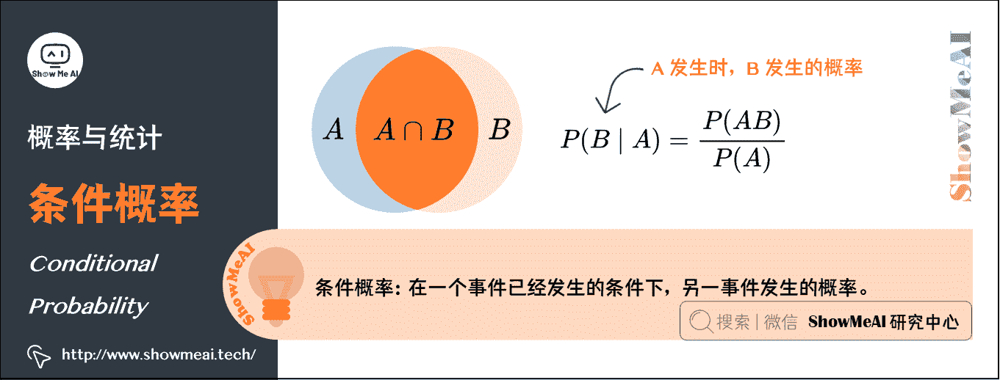

很多情况下我们感兴趣的是，某个事件在给定其它事件发生时出现的概率，这种概率叫条件概率。

给定 A A A 时 B B B 发生的概率记为 P ( B ∣ A ) P(B \mid A) P(B∣A)，概率的计算公式为： P ( B ∣ A ) = P ( A B ) P ( A ) P(B \mid A)=\frac{P(A B)}{P(A)} P(B∣A)=P(A)P(AB)​

# 6.贝叶斯公式（Bayes’ Theorem）

先看看什么是“先验概率”和“后验概率”，以一个例子来说明：

> **先验概率**：某疾病在人群中发病率为 0.1%，那某人没有做检验之前，预计患病率为 P (  患病  ) = 0.1 % P(\text { 患病 })=0.1 \% P( 患病 )=0.1%，这个概率就叫做『先验概率』。

> **后验概率**：该疾病的检测准确率为 95%，即该病患者检测显示阳性的概率为 95%（检测显示阴性的概率为 5%），即 P (  显示阳性|患病  ) = 95 % P(\text { 显示阳性|患病 })=95\% P( 显示阳性|患病 )=95%；或者说未患病的检测者，检测结果显示阴性的概率为 95%，检测显示阳性的概率为 5%。那么，检测显示为阳性时，此人的患病概率 P (  患病| 显示阳性 ) P(\text { 患病| 显示阳性}) P( 患病| 显示阳性)就叫做『后验概率』。

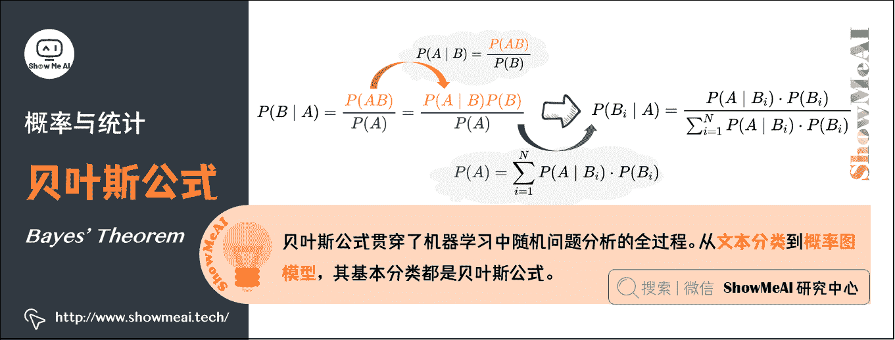

**贝叶斯公式：贝叶斯提供了一种利用『先验概率』计算『后验概率』的方法**：

*   条件概率公式： P ( B ∣ A ) = P ( A B ) P ( A ) P(B \mid A)=\frac{P(A B)}{P(A)} P(B∣A)=P(A)P(AB)​， P ( A ∣ B ) = P ( A B ) P ( B ) P(A \mid B)=\frac{P(A B)}{P(B)} P(A∣B)=P(B)P(AB)​

*   由条件概率公式变换得到乘法公式： P ( A B ) = P ( B ∣ A ) P ( A ) = P ( A ∣ B ) P ( B ) P(A B)=P(B \mid A) P(A)=P(A \mid B) P(B) P(AB)=P(B∣A)P(A)=P(A∣B)P(B)

*   将条件概率公式和乘法公式结合： P ( B ∣ A ) = P ( A ∣ B ) ⋅ P ( B ) P ( A ) P(B \mid A)=\frac{P(A \mid B) \cdot P(B)}{P(A)} P(B∣A)=P(A)P(A∣B)⋅P(B)​

*   引入全概率公式： P ( A ) = ∑ i = 1 N P ( A ∣ B i ) ⋅ P ( B i ) P(A)=\sum_{i=1}^{N} P\left(A \mid B_{i}\right) \cdot P\left(B_{i}\right) P(A)=∑i=1N​P(A∣Bi​)⋅P(Bi​)

*   将全概率代入 P ( B ∣ A ) P(B \mid A) P(B∣A)，可以得到贝叶斯公式： P ( B i ∣ A ) = P ( A ∣ B i ) ⋅ P ( B i ) ∑ i = 1 N P ( A ∣ B i ) ⋅ P ( B i ) P\left(B_{i} \mid A\right)=\frac{P\left(A \mid B_{i}\right) \cdot P\left(B_{i}\right)}{\sum_{i=1}^{N} P\left(A \mid B_{i}\right) \cdot P\left(B_{i}\right)} P(Bi​∣A)=∑i=1N​P(A∣Bi​)⋅P(Bi​)P(A∣Bi​)⋅P(Bi​)​

上述例子的计算结果：
P (  患病  ∣  显示阳性  ) = P (  显示阳性|患病  ) P (  患病  ) P (  显示阳性  ) = P (  显示阳性|患病  ) P (  患病  ) P (  显示阳性|患病  ) P (  患病  ) + P (  显示阳性|无病)  P (  无病  ) = 95 % ∗ 0.1 % 95 % ∗ 0.1 % + 5 % ∗ 99.9 % = 1.86 % \begin{aligned} P(\text { 患病 } \mid \text { 显示阳性 }) &=\frac{P(\text { 显示阳性|患病 }) P(\text { 患病 })}{P(\text { 显示阳性 })} \\ &=\frac{P(\text { 显示阳性|患病 }) P(\text { 患病 })}{P(\text { 显示阳性|患病 }) P(\text { 患病 })+P(\text { 显示阳性|无病) } P(\text { 无病 })} \\ &=\frac{95 \% * 0.1 \%}{95 \% * 0.1 \%+5 \% * 99.9 \%}=1.86 \% \end{aligned} P( 患病 ∣ 显示阳性 )​=P( 显示阳性 )P( 显示阳性|患病 )P( 患病 )​=P( 显示阳性|患病 )P( 患病 )+P( 显示阳性|无病) P( 无病 )P( 显示阳性|患病 )P( 患病 )​=95%∗0.1%+5%∗99.9%95%∗0.1%​=1.86%​

贝叶斯公式贯穿了机器学习中随机问题分析的全过程。从文本分类到概率图模型，其基本分类都是贝叶斯公式。

> 期望、方差、协方差等主要反映数据的统计特征。机器学习的一个很大应用就是数据挖掘等，因此这些基本的统计概念也是很有必要掌握。另外，像后面的 EM 算法中，就需要用到期望的相关概念和性质。

# 7.期望（Expectation）

在概率论和统计学中，数学期望是试验中每次可能结果的概率乘以其结果的总和。期望是最基本的数学特征之一，反映随机变量平均值的大小。

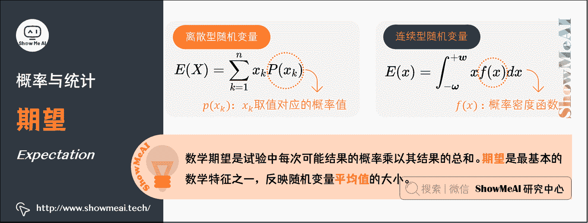

假设 X X X 是一个离散型随机变量，其可能的取值有 { x 1 , x 2 , … , x n } \left\{x_{1}, x_{2}, \ldots, x_{n}\right\} {x1​,x2​,…,xn​}，各取值对应的概率取值为 P ( x k ) P\left(x_{k}\right) P(xk​)， k = 1 , 2 , … , n k=1, 2, \ldots, n k=1,2,…,n。其数学期望被定义为：

E ( X ) = ∑ k = 1 n x k P ( x k ) E(X)=\sum_{k=1}^{n} x_{k} P\left(x_{k}\right) E(X)=k=1∑n​xk​P(xk​)

假设 x x x 是一个连续型随机变量，其概率密度函数为 f ( x ) f(x) f(x)，其数学期望被定义为：

E ( x ) = ∫ − ω + w x f ( x ) d x E(x)=\int_{-\boldsymbol{\omega}}^{+\boldsymbol{w}} x f(x) d x E(x)=∫−ω+w​xf(x)dx

# 8.方差（Variance）

在概率论和统计学中，样本方差，是各个样本数据分别与其平均数之差的平方和的平均数。方差用来衡量随机变量与其数学期望之间的偏离程度。

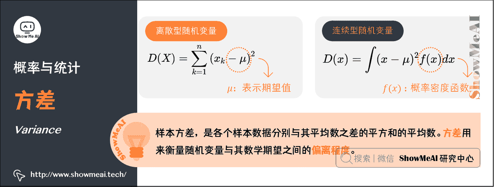

**离散型**：（ μ \mu μ表示期望）

D ( X ) = ∑ k = 1 n ( x k − μ ) 2 D(X)=\sum_{k=1}^{n} \left(x_{k}-\mu\right)^{2} D(X)=k=1∑n​(xk​−μ)2

一个快速计算方差的公式（即平方的期望减去期望的平方）：

D ( X ) = E { [ X − E ( X ) ] 2 } = E ( X 2 ) − [ E ( X ) ] 2 D(X)=E\left\{[X-E(X)]^{2}\right\}=E\left(X^{2}\right)-[E(X)]^{2} D(X)=E{[X−E(X)]2}=E(X2)−[E(X)]2

**连续型**：（ μ \mu μ表示期望）

D ( x ) = ∫ ( x − μ ) 2 f ( x ) d x D(x)=\int(x-\mu)^{2} f(x) d x D(x)=∫(x−μ)2f(x)dx

# 9.协方差（Covariance）

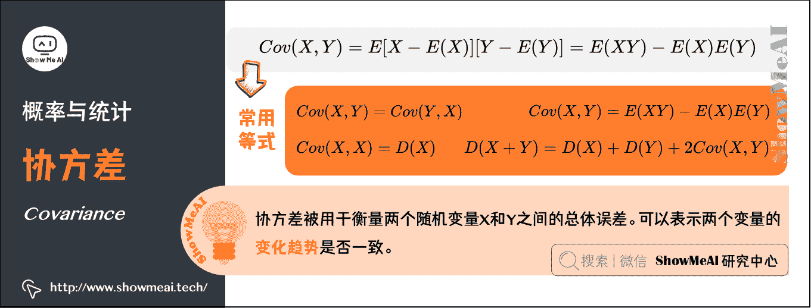

在概率论和统计学中，协方差被用于衡量两个随机变量 X X X 和 Y Y Y 之间的总体误差。期望值分别为 E [ X ] E[X] E[X]与 E [ Y ] E[Y] E[Y]的两个实随机变量 X X X 与 Y Y Y 之间的协方差为：

C o v ( X , Y ) = E [ X − E ( X ) ] [ Y − E ( Y ) ] = E ( X Y ) − E ( X ) E ( Y ) Cov(X,Y) =E { [X-E(X)][Y-E(Y)] } =E(XY)-E(X)E(Y) Cov(X,Y)=E[X−E(X)][Y−E(Y)]=E(XY)−E(X)E(Y)

以下是几个常用等式：
C o v ( X , Y ) = C o v ( Y , X ) Cov(X, Y)=Cov(Y, X) Cov(X,Y)=Cov(Y,X)
C o v ( X , X ) = D ( X ) Cov(X, X)=D(X) Cov(X,X)=D(X)
D ( X + Y ) = D ( X ) + D ( Y ) + 2 C o v ( X , Y ) D(X+Y)=D(X)+D(Y)+2 Cov(X, Y) D(X+Y)=D(X)+D(Y)+2Cov(X,Y)
C o v ( X , Y ) = E ( X Y ) − E ( X ) E ( Y ) Cov(X, Y)=E(X Y)-E(X) E(Y) Cov(X,Y)=E(XY)−E(X)E(Y)

# 10.相关系数（Correlation coefficient）

相关系数是最早由统计学家卡尔·皮尔逊设计的统计指标，用以研究变量之间线性相关程度。相关系数有多种定义方式，较为常用的是皮尔逊相关系数。从协方差中会得到引申，就是关联系数，即：（ σ \sigma σ是标准差）

ρ = C o v ( X , Y ) σ x σ y \rho = \frac{Cov(X,Y)}{\sigma _{x} \sigma _{y}} ρ=σx​σy​Cov(X,Y)​

这个公式还有另外的一个表达形式：

ρ = C o v ( X , Y ) D ( X ) D ( Y ) \rho = \frac{Cov(X,Y)}{\sqrt{D(X)} \sqrt{D(Y)}} ρ=D(X)  ​D(Y)  ​Cov(X,Y)​

# 11.常见分布函数

## 1）伯努利分布（Bernoulli Distribution）（离散型）

在概率论和统计学中，伯努利分布也叫 0-1 分布，是单个二值型离散随机变量的分布。

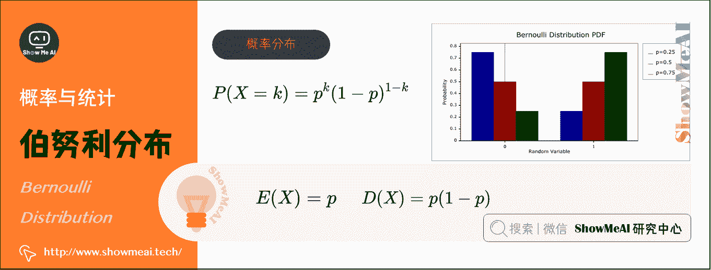

*   概率分布函数： P ( X = k ) = p k ( 1 − p ) 1 − k P(X=k)=p^{k}(1-p)^{1-k} P(X=k)=pk(1−p)1−k
*   期望： E ( X ) = p E(X)=p E(X)=p
*   方差： D ( X ) = p ( 1 − p ) D(X)=p(1-p) D(X)=p(1−p)

## 2）几何分布（Geometric Distribution）（离散型）

在概率论和统计学中，几何分布是离散型概率分布，数学符号为 X ∼ G ( p ) X\sim G(p) X∼G(p)。其定义为：在 n n n 次伯努利试验中，试验 k k k 次才得到第一次成功的机率（即前 k − 1 k-1 k−1 次皆失败，第 k k k 次成功的概率）
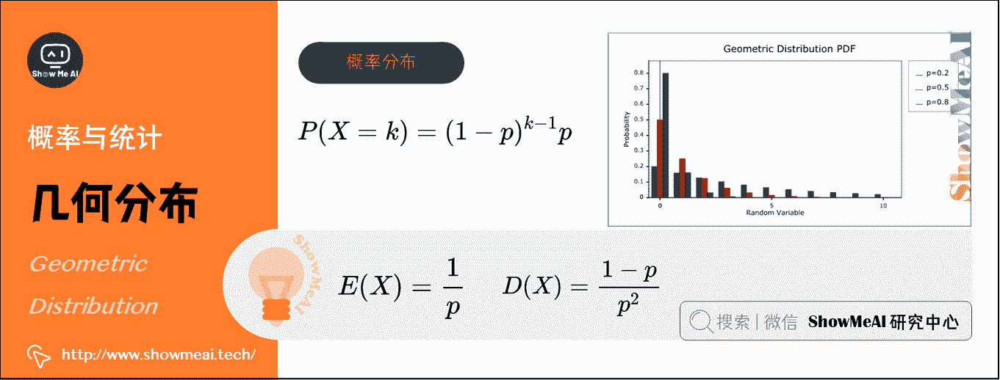

*   概率分布函数： P ( X = k ) = ( 1 − p ) k − 1 p P(X=k)=(1-p)^{k-1} p P(X=k)=(1−p)k−1p
*   期望： E ( X ) = 1 p E(X)=\frac{1}{p} E(X)=p1​
*   方差： D ( X ) = 1 − p p 2 D(X)=\frac{1-p}{p^{2}} D(X)=p21−p​

## 3）二项分布（Binomial Distribution）（离散型）

在概率论和统计学中，二项分布即重复 n n n 次伯努利试验，各次试验之间都相互独立，并且每次试验中只有两种可能的结果，而且这两种结果发生与否相互对立，数学符号为 X ∼ B ( n , p ) X∼B(n,p) X∼B(n,p)。

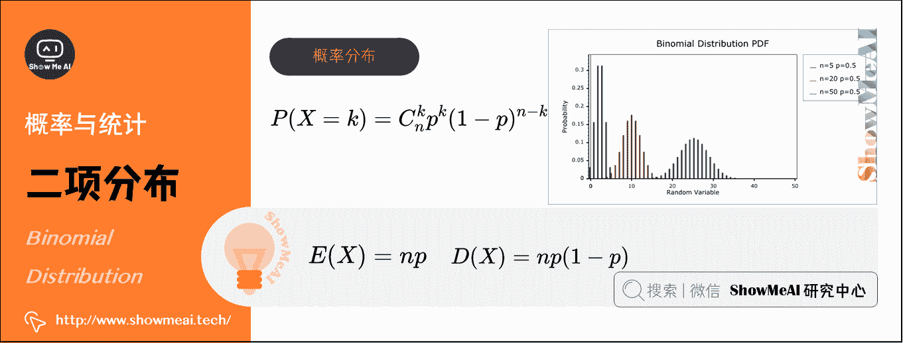
如果每次试验时，事件发生的概率为 p p p，不发生的概率为 1 − p 1-p 1−p，则 n n n 次重复独立试验中发生 k k k 次的概率为： P ( X = k ) = C n k p k ( 1 − p ) n − k P(X=k)=C_{n}^{k} p^{k}(1-p)^{n-k} P(X=k)=Cnk​pk(1−p)n−k

*   期望： E ( X ) = n p E(X)=n p E(X)=np

*   方差： D ( X ) = n p ( 1 − p ) D(X)=n p(1-p) D(X)=np(1−p)

## 4）泊松分布（Poisson Distribution）（离散型）

在概率论和统计学中，泊松分布是一种统计与概率学里常见到的离散概率分布，用于描述某段时间内事件具体的发生概率，数学符号为 X ∼ π ( λ ) X∼\pi \left ( \lambda \right ) X∼π(λ)。

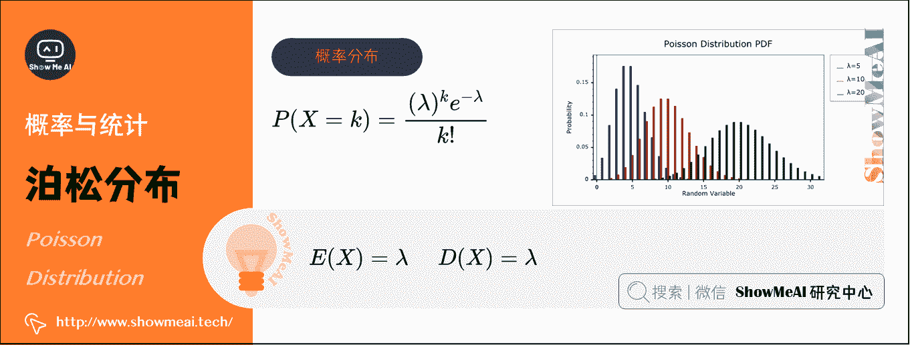
泊松分布的参数 λ \lambda λ表示单位时间(或单位面积)内随机事件的平均发生次数，其概率分布函数为： P ( X = k ) = ( λ ) k e − λ k ! P(X=k)=\frac{(\lambda )^{k} e^{-\lambda}}{k !} P(X=k)=k!(λ)ke−λ​

*   期望： E ( X ) = λ E(X)=\lambda E(X)=λ
*   方差： D ( X ) = λ D(X) = \lambda D(X)=λ

> 例如，某医院平均每小时出生 2.5 个婴儿（ λ=2.5 ），那么接下来一个小时，会出生几个婴儿？

*   没有婴儿出生（ k = 0 k=0 k=0）的概率为： P ( X = 0 ) = ( 2.5 ) 0 ⋅ e − 2.5 0 ! ≈ 0.082 P(X=0)=\frac{(2.5)^{0} \cdot e^{-2.5}}{0 !} \approx 0.082 P(X=0)=0!(2.5)0⋅e−2.5​≈0.082

*   有 1 个婴儿出生（ k = 1 k=1 k=1）的概率为： P ( X = 1 ) = ( 2.5 ) 1 ⋅ e − 2.5 1 ! ≈ 0.205 P(X=1)=\frac{(2.5)^{1} \cdot e^{-2.5}}{1 !} \approx 0.205 P(X=1)=1!(2.5)1⋅e−2.5​≈0.205

*   有 2 个婴儿出生（ k = 2 k=2 k=2）的概率为： P ( X = 2 ) = ( 2.5 ) 2 ⋅ e − 2.5 2 ! ≈ 0.257 P(X=2)=\frac{(2.5)^{2} \cdot e^{-2.5}}{2 !} \approx 0.257 P(X=2)=2!(2.5)2⋅e−2.5​≈0.257

| k | 0 | 1 | 2 | ··· |
| --- | --- | --- | --- | --- |
| p | 0.082 | 0.205 | 0.257 | ··· |

> 通常，柏松分布也叫等待概率，是一种比二项分布应用场景更为丰富的概率模型，在数控、电商优化中也经常能见到它的影子。

## 5）正态分布（Normal Distribution）（连续型）

在概率论和统计学中，正态分布又叫高斯分布（Gaussian Distribution），其曲线呈钟型，两头低，中间高，左右对称因其曲线呈钟形。数学符号为 X ∼ N ( μ , σ 2 ) X∼N\left(\mu, \sigma^{2}\right) X∼N(μ,σ2)。

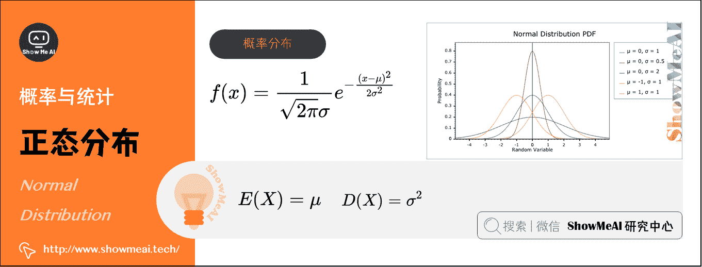
若随机变量 X X X 服从一个数学期望为 μ \mu μ、方差为 σ 2 \sigma^{2} σ2 的正态分布，其概率分布函数： f ( x ) = 1 2 π σ e − ( x − μ ) 2 2 σ 2 f(x)=\frac{1}{\sqrt{2 \pi} \sigma} e ^{-\frac{(x-\mu)^{2}}{2 \sigma^{2}}} f(x)=2π  ​σ1​e−2σ2(x−μ)2​

*   期望： E ( X ) = μ E(X)=\mu E(X)=μ
*   方差： D ( X ) = σ 2 D(X)=\sigma^{2} D(X)=σ2

## 6）均匀分布（Uniform Distribution）（连续型）

在概率论和统计学中，均匀分布也叫矩形分布，它是对称概率分布，在相同长度间隔的分布概率是等可能的。

均匀分布由两个参数 a a a 和 b b b 定义，数学符号为 X ∼ U ( a , b ) X∼U (a, b) X∼U(a,b)（其中， a a a 为数轴上较小值， b b b 为数轴上较大值）。

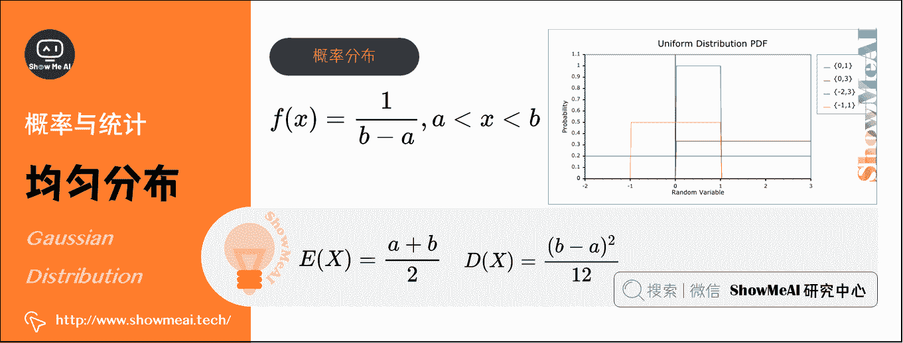
其概率分布函数：$f(x)=\frac{1}{b-a} , a

*   期望： E ( X ) = a + b 2 E(X)=\frac{a+b}{2} E(X)=2a+b​
*   方差： D ( X ) = ( b − a ) 2 12 D(X) = \frac{(b-a)^{2}}{12} D(X)=12(b−a)2​

## 7）指数分布（Exponential Distribution）（连续型）

在概率论和统计学中，指数分布与其他分布的最大不同之处在于，随机变量 X X X 指的是不同独立事件发生的时间间隔值，时间越长事件发生的概率指数型增大(减小)，数学符号为 X ∼ E ( λ ) X∼E(\lambda) X∼E(λ)。

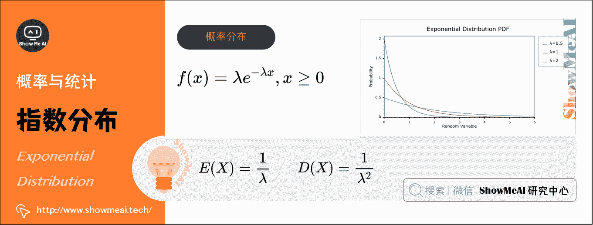
指数分布的参数 λ \lambda λ表示单位时间(或单位面积)内随机事件的平均发生次数，其概率分布函数为： f ( x ) = λ e − λ x , x ≥ 0 f(x) = \lambda e^{-\lambda x}, x\ge 0 f(x)=λe−λx,x≥0

*   期望： E ( X ) = 1 λ E(X)=\frac{1}{\lambda} E(X)=λ1​
*   方差： D ( X ) = 1 λ 2 D(X)=\frac{1}{\lambda^{2}} D(X)=λ21​

在我们日常的消费领域，通常的目的是求出在某个时间区间内，会发生随机事件的概率有多大。如：银行窗口服务、交通管理、火车票售票系统、消费市场研究报告中被广泛运用。

> 例如：某医院平均每小时出生 2.5 个婴儿（ λ=2.5 ）。如果到下一个婴儿出生需要的间隔时间为 t (即时间 t 内没有任何婴儿出生）。

*   间隔 15 分钟（ X = 1 4 X=\frac{1}{4} X=41​）后才有婴儿出生的概率为： f ( 1 4 ) = 2.5 e − 2.5 ⋅ 1 4 ≈ 0.9197 f(\frac{1}{4}) = 2.5 e^{-2.5 \cdot \frac{1}{4}} \approx 0.9197 f(41​)=2.5e−2.5⋅41​≈0.9197
*   间隔 30 分钟（ X = 1 2 X=\frac{1}{2} X=21​）后才有婴儿出生的概率为： f ( 1 2 ) = 2.5 e − 2.5 ⋅ 1 2 ≈ 0.7163 f(\frac{1}{2}) = 2.5 e^{-2.5 \cdot \frac{1}{2}} \approx 0.7163 f(21​)=2.5e−2.5⋅21​≈0.7163

一些总结：

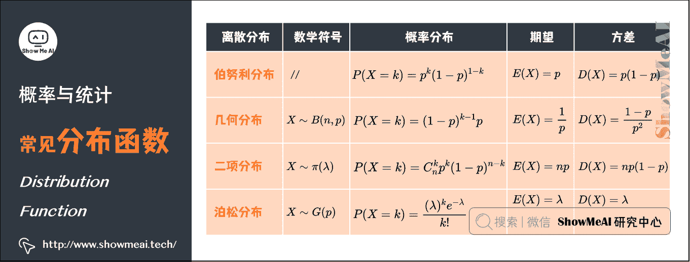

# 12.拉格朗日乘子法（Lagrange Multiplier）

在求解最优化问题中，拉格朗日乘子法（Lagrange Multiplier）和 KKT（Karush Kuhn Tucker）条件是两种最常用的方法。

在机器学习的过程中，我们经常遇到在有限制的情况下，最大化表达式的问题。如：
m a x f ( x , y ） s . t . g ( x , y ) = 0 maxf(x,y）s.t. \quad g(x,y)=0 maxf(x,y）s.t.g(x,y)=0

此时我们可以构造 L ( x , y , λ ) = f ( x , y ) − λ ( g ( x , y ) − c ) L(x,y,\lambda )=f(x,y) − \lambda \left ( g(x,y) -c \right ) L(x,y,λ)=f(x,y)−λ(g(x,y)−c)，其中 λ \lambda λ称为拉格朗日乘子。接下来要对拉格朗日函数 L ( x , y , λ ) L(x,y,\lambda ) L(x,y,λ)求导，令其为 0，解方程即可。

以下是图文解释：
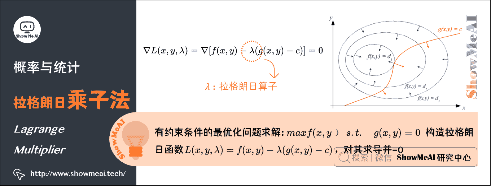

> 红线标出的是约束 g ( x , y ) = c g(x,y)=c g(x,y)=c 的点的轨迹。蓝线是 f ( x , y ) f(x,y) f(x,y)的等高线。箭头表示斜率，和等高线的法线平行，从梯度的方向上来看显然有 d 1 > d 2 d_{1}>d_{2} d1​>d2​。

红色的线是约束。如果没有这条约束， f ( x , y ) f(x,y) f(x,y)的最小值应该会落在最小那圈等高线内部的某一点上。现在加上了约束，正好落在这条红线上的点才可能是满足要求的点。也就是说，应该是在 f ( x , y ) f(x,y) f(x,y)的等高线正好和约束线 g ( x , y ) g(x,y) g(x,y)相切的位置。

对约束也求梯度 ∇ g ( x , y ) \nabla g(x,y) ∇g(x,y)（如图中红色箭头所示），可以看出要想让目标函数 f ( x , y ) f(x,y) f(x,y)的等高线和约束相切 g ( x , y ) g(x,y) g(x,y)，则他们切点的梯度一定在一条直线上。也即在最优化解的时候 ∇ f ( x , y ) = λ ∇ g ( x , y ) − C \nabla f(x,y)=λ \nabla g(x,y)-C ∇f(x,y)=λ∇g(x,y)−C，即 ∇ [ f ( x , y ) + λ ( g ( x , y ) − c ) ] = 0 , λ ≠ 0 \nabla [f(x,y)+λ(g(x,y)−c)]=0,λ≠0 ∇[f(x,y)+λ(g(x,y)−c)]=0,λ​=0。

那么拉格朗日函数 L ( x , y , λ ) = f ( x , y ) − λ ( g ( x , y ) − c ) L(x,y,\lambda )=f(x,y) − \lambda \left ( g(x,y) -c \right ) L(x,y,λ)=f(x,y)−λ(g(x,y)−c)在达到极值时与 f ( x , y ) f(x,y) f(x,y)相等，因为 F ( x , y ) F(x,y) F(x,y)达到极值时 g ( x , y ) − c g(x,y)−c g(x,y)−c 总等于零。

简单的说， L ( x , y , λ ) L(x,y,λ) L(x,y,λ)取得最优化解的时候，也就是 L ( x , y , λ ) L(x,y,λ) L(x,y,λ)取极值的时候。此时 L ( x , y , λ ) L(x,y,λ) L(x,y,λ)的导数为 0，即 ∇ L ( x , y , λ ) = ∇ [ f ( x , y ) − λ ( g ( x , y ) − c ) ] = 0 \nabla L(x,y,\lambda )=\nabla \left [ f(x,y) − \lambda \left ( g(x,y) -c \right ) \right ] =0 ∇L(x,y,λ)=∇[f(x,y)−λ(g(x,y)−c)]=0，可以得出 f ( x , y ) f(x,y) f(x,y)与 g ( x , y ) g(x,y) g(x,y)梯度共线，此时就是在条件约束 g ( x , y ) g(x,y) g(x,y)下， f ( x , y ) f(x,y) f(x,y)的最优化解。

在支持向量机模型（SVM）的推导中，很关键的一步就是利用拉格朗日对偶性，将原问题转化为对偶问题。

# 13.最大似然估计（Maximum Likelihood Estimate）

最大概似估计（MLE）是一种粗略的数学期望，指在模型已定、参数 θ \theta θ未知的情况下，通过观测数据估计未知参数 θ \theta θ的一种思想或方法。

最大似然估计的哲学内涵就是：我们对某个事件发生的概率未知，但我们做了一些实验，有过一些对这个事件的经历(经验)，那么我们认为，这个事件的概率应该是能够与我们做的实验结果最吻合。当然，前提是我们做的实验次数应当足够多。

> 举个例子，假设我们要统计全国人口的身高。首先假设这个身高服从服从正态分布，但是该分布的均值。我们没有人力与物力去统计全国每个人的身高，但是可以通过采样，获取部分人的身高，然后通过最大似然估计来获取上述假设中的正态分布的均值。

**最大似然函数的求解思想**是：给定样本取值后，该样本最有可能来自参数 θ \theta θ为何值的总体。即：寻找 θ ˉ M L E \bar{\theta}_{M LE} θˉMLE​使得观测到样本数据的可能性最大。
**最大似然函数估计值的一般求解步骤是**：

*   写出似然函数 L ( θ 1 , θ 2 , ⋯   , θ n ) = { ∏ i = 1 n p ( x i ; θ 1 , θ 2 , ⋯   , θ n ) ∏ i = 1 n f ( x i ; θ 1 , θ 2 , ⋯   , θ n ) L\left(\theta_{1}, \theta_{2}, \cdots, \theta_{n}\right)=\left\{\begin{array}{l} \prod_{i=1}^{n} p\left(x_{i} ; \theta_{1}, \theta_{2}, \cdots, \theta_{n}\right) \\ \prod_{i=1}^{n} f\left(x_{i} ; \theta_{1}, \theta_{2}, \cdots, \theta_{n}\right) \end{array}\right. L(θ1​,θ2​,⋯,θn​)={∏i=1n​p(xi​;θ1​,θ2​,⋯,θn​)∏i=1n​f(xi​;θ1​,θ2​,⋯,θn​)​
*   对似然函数取对数
*   两边同时求导数
*   令导数为 0 解出似然方程

在机器学习中也会经常见到极大似然的影子。比如后面的逻辑斯特回归模型（LR），其核心就是构造对数损失函数后运用极大似然估计。

# ShowMeAI 相关文章推荐

*   [图解线性代数与矩阵论](http://www.showmeai.tech/article-detail/162)
*   [图解概率与统计](http://www.showmeai.tech/article-detail/163)
*   [图解微积分与最优化](http://www.showmeai.tech/article-detail/165)

# ShowMeAI 系列教程推荐

*   [图解 Python 编程：从入门到精通系列教程](http://www.showmeai.tech/tutorials/56)
*   [图解数据分析：从入门到精通系列教程](http://www.showmeai.tech/tutorials/33)
*   [图解 AI 数学基础：从入门到精通系列教程](http://showmeai.tech/tutorials/83)
*   [图解大数据技术：从入门到精通系列教程](http://www.showmeai.tech/tutorials/84)

